<title>Linear Regression</title>  

# 线性回归

"正确问题的近似答案比近似问题的精确答案更有价值。"

约翰·图基

我们必须从一个简单却非常有效的技术开始，这个技术已经被使用了很长时间:**线性回归**。据说阿尔伯特·爱因斯坦曾经说过，事情应该尽可能简单，但不能再简单了。这是明智的建议，也是开发机器学习算法的一个很好的经验法则。考虑到我们稍后将讨论的其他技术，没有比久经考验的线性回归更简单的模型了，它使用**最小二乘法**来预测定量结果。我们可以认为它是我们将在后面讨论的所有方法的基础，其中许多方法仅仅是扩展。如果你能掌握线性回归方法，那么坦率地说，我相信你能掌握这本书的其余部分。因此，让我们将此视为我们成为机器学习大师之旅的一个良好起点。

本章包括介绍性材料，这方面的专家可以跳到下一个主题。否则，在尝试其他更复杂的学习方法之前，确保你彻底理解了这个主题。我相信你会发现，你的许多项目都可以通过应用下面几节讨论的内容来解决。线性回归可能是向您的客户解释的最直接的模型，大多数客户至少对 **R 平方**有粗略的了解。他们中的许多人已经深入地接触过它，因此会对可变贡献、共线性等感到舒适。

以下是我们将在本章中涉及的主题:

*   一元线性回归
*   多元线性回归

<title>Univariate linear regression</title>  

# 一元线性回归

我们首先来看一种预测定量反应的简单方法， *Y* ，其中有一个预测变量， *x* ，假设 *Y* 与 *x* 具有线性关系。这个模型可以写成如下形式:


我们可以把它表述为 *Y* 的期望值是参数(截距)加上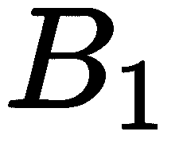(斜率)乘以 *x* ，加上误差项 *e* 的函数。最小二乘法选择最小化预测的 *y* 值相对于实际的 *Y* 值的**残差平方和** ( **RSS** )的模型参数。举个简单的例子，假设我们有 *Y1* 和 *Y2* 的实际值分别等于 10 和 20，以及 *y1* 和 *y2* 的预测值为 *12* 和 *18* 。为了计算 RSS，我们将平方差相加:


通过简单的替换，得到如下结果:


在我们开始应用之前，我想指出的是，如果你阅读各种研究突破的标题，你应该带着疲惫的眼睛和怀疑的头脑这样做，因为媒体提出的结论可能是不成立的。正如我们将看到的，R——以及任何其他软件——将会给我们一个解决方案，而不管输入是什么。然而，仅仅因为数学有意义并且报告了高相关性或 R 平方统计并不意味着结论是有效的。

为了阐明这一点，让我们来看看著名的`Anscombe`数据集，它在 r 中可用。统计学家 Francis Anscombe 制作了这个数据集，以强调在分析数据时数据可视化和离群值的重要性。它由四对 *X* 和 *Y* 变量组成，这些变量具有相同的统计特性，但在绘制时显示出非常不同的东西。我用这些数据来培训同事，并教育商业伙伴，关注统计数据而不探究数据和检查假设的危害。我认为如果你有类似的需求，这是一个很好的起点。在进入严肃的建模之前，这是一个简短的题外话:

```
> #call up and explore the data

> data(anscombe)

> attach(anscombe)

> anscombe
   x1 x2 x3 x4    y1   y2    y3    y4
1  10 10 10  8  8.04 9.14  7.46  6.58
2   8  8  8  8  6.95 8.14  6.77  5.76
3  13 13 13  8  7.58 8.74 12.74  7.71
4   9  9  9  8  8.81 8.77  7.11  8.84
5  11 11 11  8  8.33 9.26  7.81  8.47
6  14 14 14  8  9.96 8.10  8.84  7.04
7   6  6  6  8  7.24 6.13  6.08  5.25
8   4  4  4 19  4.26 3.10  5.39 12.50
9  12 12 12  8 10.84 9.13  8.15  5.56
10  7  7  7  8  4.82 7.26  6.42  7.91
11  5  5  5  8  5.68 4.74  5.73  6.89
```

正如我们将看到的，每一对都有相同的相关系数:`0.816`。前两项如下:

```
> cor(x1, y1) #correlation of x1 and y1
[1] 0.8164205

> cor(x2, y2) #correlation of x2 and y2

[1] 0.8164205
```

正如`Anscombe`所预期的，这里真正的洞察力是当我们将所有四对线绘制在一起时，如下所示:

```
> par(mfrow = c(2,2)) #create a 2x2 grid for plotting

> plot(x1, y1, main = "Plot 1")

> plot(x2, y2, main = "Plot 2")

> plot(x3, y3, main = "Plot 3")

> plot(x4, y4, main = "Plot 4")
```

下载示例代码
你可以从你在[http://www.packtpub.com](http://www.packtpub.com)的账户下载你购买的所有 Packt 书籍的示例代码文件。如果你在别处买了这本书，你可以去 http://www.packtpub.com/support 注册，让文件直接通过电子邮件发送给你。

上述代码的输出如下:

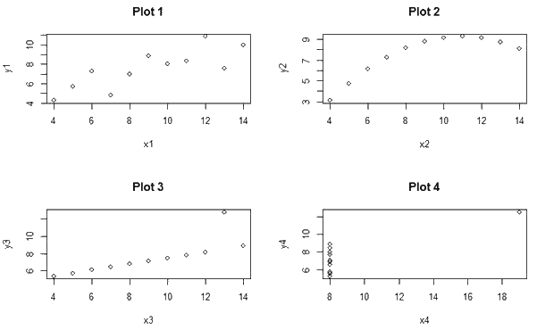

我们可以看到以下内容:

*   图 1 似乎具有真正的线性关系
*   图 2 是曲线，图 3 有一个危险的异常值
*   曲线 4 由一个异常值驱动

这就是:一个关于单纯依赖相关性的危险的警示故事。

<title>Building a univariate model</title>  

# 建立单变量模型

我们的第一个案例侧重于预测美国怀俄明州斯内克河流域的产水量(以英寸为单位),作为当年降雪含水量的函数。这一预测将有助于管理水流和水库水位，因为斯内克河为西部几个州的农场和牧场提供了急需的灌溉用水。`snake`数据集在`alr3`包中可用(注意`alr`代表应用线性回归):

```
> install.packages("alr3")
> library(alr3)
> data(snake)
> dim(snake)
[1] 17  2
> head(snake)
     X    Y
1 23.1 10.5
2 32.8 16.7
3 31.8 18.2
4 32.0 17.0
5 30.4 16.3
6 24.0 10.5
```

既然我们已经有了`17`观测，数据探索就可以开始了。但是首先，让我们把`X`和`Y`改成有意义的变量名，如下所示:

```
> names(snake) <- c("content", "yield")
> attach(snake) # attach data with new names
> head(snake)

  content yield
1    23.1  10.5
2    32.8  16.7
3    31.8  18.2
4    32.0  17.0
5    30.4  16.3
6    24.0  10.5

> plot(content, 
       yield, main = "Scatterplot of Snow vs. Yield", 
       xlab = "water content of snow", 
       ylab = "water yield")
```

上述代码的输出如下:

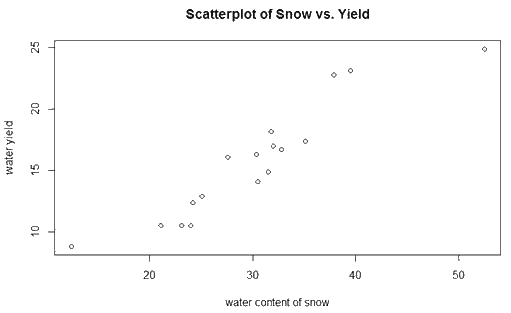

这是一个有趣的图，因为数据是线性的，并具有轻微的曲线形状，由极端两端的两个潜在异常值驱动。

为了在 R 中执行线性回归，我们使用`lm()`函数创建一个标准形式的模型 *fit = lm(Y ~ X)* 。然后，您可以通过使用以下代码，在您的拟合模型上使用各种函数来测试您的假设:

```
> yield_fit <- lm(yield ~ content)

> summary(yield_fit)

Call:
lm(formula = yield ~ content)

Residuals:
        Min      1Q  Median      3Q     Max
-2.1793 -1.5149 -0.3624  1.6276  3.1973

```

```
Coefficients: Estimate Std. Error t value Pr(>|t|)    
(Intercept)  0.72538    1.54882   0.468    0.646    
content      0.49808    0.04952  10.058 4.63e-08 
    ***
---
Signif. codes:  0 '***' 0.001 '**' 0.01 '*' 0.05 
      '.' 0.1 ' ' 1

Residual standard error: 1.743 on 15 degrees of 
      freedom
Multiple R-squared:  0.8709,    Adjusted R-squared:  
       0.8623
F-statistic: 101.2 on 1 and 15 DF,  p-value: 
       4.632e-08
```

使用`summary()`功能，我们可以检查一些项目，包括模型规格、关于残差的描述性统计、系数、模型显著性的代码以及模型误差和拟合的总结。现在，让我们把注意力集中在参数系数估计上，看看我们的预测变量是否有显著的`p-value`，以及整体模型 f 检验是否有显著的`p-value`。查看参数估计，模型告诉我们`yield`等于`0.72538`加上`0.49808`乘以`content`。我们可以说，含量每改变一个单位，产量就会增加`0.49808`个单位。`F-statistic`用于检验模型系数全为零的零假设。

由于`p-value`非常重要，我们可以拒绝空值，并继续进行内容的 t-test，测试它为零的空值假设。同样，我们可以拒绝空值。此外，我们可以看到`Multiple R-squared`和`Adjusted R-squared`值。`Adjusted R-squared`将在多元回归主题下讨论，所以让我们聚焦于`Multiple R-squared`；在这里，我们看到它是`0.8709`。理论上，它的范围可以从零到一，并且是对 *X* 和 *Y* 之间关联强度的度量。在这种情况下，解释是雪的含水量可以解释水量变化的 87%。旁注一下，R 平方无非就是*【X，Y】*平方的相关系数。

我们可以回忆我们的散点图，现在使用以下代码添加由我们的模型生成的最佳拟合线:

```
> plot(content, yield)

> abline(yield_fit, lwd = 3, col = "red")
```

上述代码的输出如下:

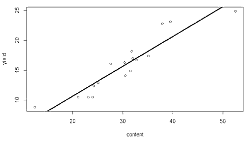

<title>Reviewing model assumptions</title>  

# 审查模型假设

线性回归模型的有效性取决于其假设的有效性，可以总结如下:

*   **线性**:这是预测值和响应变量之间的线性关系。如果这种关系不明确存在，那么对 *X* 或 *Y* 的变换(对数、多项式、指数等)可以解决这个问题。
*   **误差不相关**:这是时间序列和面板数据中常见的问题，其中*[]*；如果这些错误是相互关联的，那么您将冒创建一个不明确的模型的风险。
*   **同方差**:这是指误差的正态分布和恒定方差，这意味着误差的方差在不同的输入值之间是恒定的。违反这一假设不会产生有偏差的系数估计值，但由于系数的标准误差不合适，可能会导致显著性的统计测试过高或过低，从而导致错误的结论。这种违背也被称为 ****异方差**** 。
*   **无共线性**:两个预测变量之间不应存在线性关系，也就是说特征之间不应存在相关性。这个问题会导致系数的统计测试不正确。
*   **异常值的存在**:异常值会严重扭曲估计，在使用线性回归拟合模型时，必须通过移除或转换对其进行检查和处理；正如我们在 Anscombe 的例子中看到的，异常值会导致有偏差的估计。

最初检查假设的一个简单方法是绘制图表。当与线性模型拟合结合时，`plot()`函数将自动生成四幅图，允许您检查假设。r 一次产生一个图，你可以通过按下*回车键*前进。最好同时探索这四个方面，我们可以通过以下方式实现:

```
> par(mfrow = c(2,2))

> plot(yield_fit)
```

上述代码的输出如下:

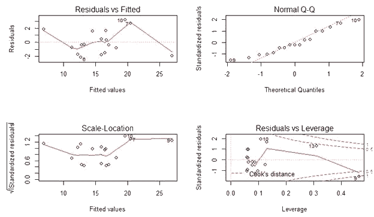

左边的两个图允许我们检查误差和非线性的同方差性。我们要找的是某种模式，或者更重要的是，不存在任何模式。给定只有 17 个观察值的样本量，不存在任何可见的东西。常见的异方差误差将在图的左侧显示为 u 形、倒 u 形或聚集在一起。随着拟合值的增加，它们会变得更宽(漏斗形状)。可以有把握地得出结论，在我们的模型中没有明显的违反同态分布的情况。

右上角的正态 Q-Q 图帮助我们确定残差是否正态分布。**分位数-分位数** ( **Q-Q** )表示一个变量的分位数值与另一个变量的分位数值的关系。看起来异常值(观察值 7、9 和 10)可能导致违反假设。残差与杠杆图可以告诉我们哪些观察结果(如果有的话)过度影响了模型；换句话说，如果有任何异常值，我们应该关注。统计数据是库克距离或**库克距离**，通常认为大于 1 的值应该值得进一步检查。

进一步检查到底是什么？这是艺术与科学相遇的地方。简单的方法是删除观察，在这个例子中是第 9 个，然后重做模型。然而，更好的选择可能是转换预测和/或响应变量。如果我们只删除观测值 9，那么观测值 10 和 13 可能会落在大于 1 的波段之外。在这个简单的例子中，我相信这就是领域专业知识的关键所在。我已经无数次发现，探索和理解离群值可以产生有价值的见解。当我们第一次检查之前的散点图时，我指出了潜在的异常值，这些恰好是第 9 号和第 13 号观察值。与适当的主题专家讨论以了解为什么会出现这种情况似乎很重要。是测量误差吗？这些观察结果有合理的解释吗？我当然不知道，但这是一个增加你给组织带来的价值的机会。

让我们抛开这个简单的案例，转到一个涉及多元线性回归的监督学习案例。

<title>Multivariate linear regression</title>  

# 多元线性回归

在接下来的案例研究中，我们将看看一些令人兴奋的方法在一个有趣的数据集上的应用。像上一章一样，一旦数据被加载，我们将*处理*它，但是与上一个例子不同，我们将把它分成训练集和测试集。给定数据的维度，特征约简和选择是关键的。

我们将探索经常被指责的逐步选择，然后继续我最喜欢的方法之一，即**多元自适应回归样条** ( **火星**)。如果你不用火星，我强烈推荐。有人告诉我，但无法证实，马克斯·库恩在一次会议上说，这是他的首发程序。如果这是真的，我一点也不惊讶。我从世界上最大的银行之一的前高级分析主管那里学到了这一技术，从此就再也没有回头看。

<title>Loading and preparing the data</title>  

# 加载和准备数据

要将数据放入您的工作目录，您可以通过以下链接在我的 GitHub 上找到它:[hhttps://GitHub . com/packt publishing/Advanced-Machine-Learning-with-R/blob/master/Data/Ames . CSV](https://github.com/PacktPublishing/Advanced-Machine-Learning-with-R/blob/master/Data/ames.csv)。

我们正在使用的文件是`ames.csv`。这个数据来自爱荷华州埃姆斯市的房屋销售，这是爱荷华州立大学的所在地，我相信有大约 7 万人口。我从[Kaggle.com](http://Kaggle.com)下载了数据，我们试图预测的回应是最终的销售价格。用 84 个特征的 1，460 个观察值来实践机器学习方法是一个很好的规模，并且许多特征是分类的。

在我们加载数据之前，如果还没有完成的话，加载必要的包，调用`magrittr`库，如果你愿意的话，更新选项。我不喜欢科学的数字表示法，希望将数值四舍五入到四位小数:

```
library(magrittr)
options(scipen = 999)
options(digits = 4)
# install.packages("caret")
# install.packages("ggthemes")
# install.packages("janitor")
# install.packages("leaps")
# install.packages("plm")
# install.packages("readr")
# install.packages("sjmisc")
# install.packages("tidyverse")
# install.packages("vtreat")
```

现在，加载数据并确认尺寸:

```
> ames <- readr::read_csv(~/ames.csv")

> dim(ames)

[1] 1460   84
```

我不相信有任何重复的观察，但让我们确认一下:

```
> dupes <- duplicated(ames)

> table(dupes)
dupes
FALSE 
 1460 
```

太棒了。没有重复的。在这里，我们创建了一个描述性统计表格。在 RStudio 中打开数据，并按功能浏览数据，感受一下:

```
> ames %>%
    sjmisc::descr() -> ames_descr

> View(ames_descr)
```

有一些发人深省的功能，但首先关注`Id`。请注意，这对于所有的观察都有唯一的值。因此，我们可以删除它，因为它在预测中没有价值:

```
> range(ames$Id)
[1] 1 1460

> ames <- ames[, -1]
```

另外三个特征很有趣，因为它们是事件发生的年份。我们不使用年份作为特征的值，而是创建一个自事件发生以来的年份特征，如何？这很容易做到，取`YrSold`，然后依次减去`YearBuilt`、`YearRemodAdd`和`GarageYrBuilt`，就像这样:

```
 > ames %>%
     dplyr::mutate(yearsOld = YrSold - YearBuilt) -> ames

> ames %>%
    dplyr::mutate(yearsRemodel = YrSold - YearRemodAdd) -> ames

> ames %>%
    dplyr::mutate(yearsGarage = YrSold - GarageYrBlt) -> ames
```

当您查看描述性统计数据时，另一件有趣的事情是，`GarageYrBlt`大约有 5.5%的值缺失。所以，`yearsGarage`会有相应数量的缺失值。按照我的标准程序，我希望我们编写一个虚拟特性，指出缺失值，并将这些缺失值修改为零。

我不确定这里的任何估算会增加价值:

```
> ames$yearsGarage_isNA <- 
    ifelse(is.na(ames$yearsGarage), 1, 0)

> ames$yearsGarage[is.na(ames$yearsGarage)] <- 0
```

让我们删除那些不必要的功能，因为我们已经创建了一个新的功能:

```
 > ames <- ames[, c(-19, -20, -59)]
```

另一个有趣的特性是`MoSold`。这是一个与销售月份相对应的数字，因此 1 =一月，2 =二月，依此类推。这可能更适合作为字符特征，但在一键编码期间将作为伪特征结束:

```
> ames$MoSold <- as.character(ames$MoSold)
```

我们应该关注的一个图是响应，即`SalesPrice`。我喜欢尝试不同的情节主题，因此我将为不同的情节使用不同的主题进行说明，这应该有助于您发现您最喜欢的主题:

```
> ggplot2::ggplot(ames, ggplot2::aes(x = SalePrice)) + 
   ggplot2::geom_histogram() +
    ggthemes::theme_few()
```

上述代码的输出如下:

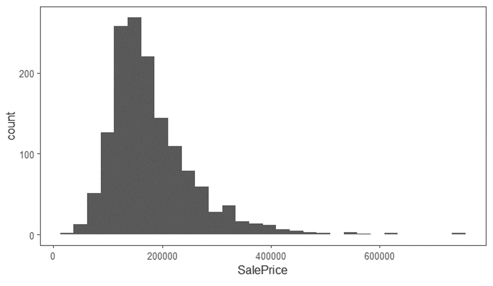

直方图显示数据向右倾斜。在非线性方法中，这可能不是问题，但在线性模型中，您通常可以依靠有偏估计和/或残差中有异常值的严重问题。使用自然对数来转换它似乎是一个好主意:

```
> ames %>%
    dplyr::mutate(logSales = log(SalePrice)) -> ames

> ggplot2::ggplot(ames, ggplot2::aes(x = logSales)) + 
    ggplot2::geom_histogram() +
    ggthemes::theme_economist_white()
```

上述代码的输出如下:

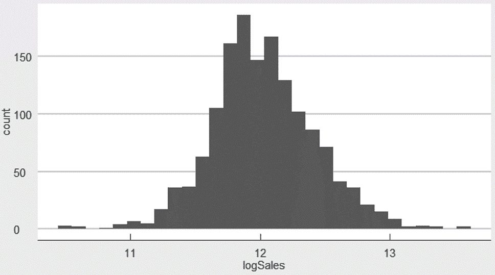

我们现在有一个更正常的分布，但可以看到一些潜在的有问题的房屋以微薄和非常高的价格出售的离群值。

我通常的下一步是最终确定感兴趣的特征中任何缺失的值。同样，我们编写了一个虚拟特性，并将缺失值归零:

```
> ames$LotFrontage_isNA <- 
    ifelse(is.na(ames$LotFrontage), 1, 0)

> ames$LotFrontage[is.na(ames$LotFrontage)] <- 0

> ames$MasVnrArea_isNA <- 
    ifelse(is.na(ames$MasVnrArea), 1, 0)

> ames$MasVnrArea[is.na(ames$MasVnrArea)] <- 0
```

我不认为我们有任何零方差特性(我们删除了`Id`)，但让我们再检查一下:

```
> feature_variance <- caret::nearZeroVar(ames, saveMetrics = TRUE)

> table(feature_variance$zeroVar)

FALSE 
   84 
```

一切都好！现在，我们可以安全地将数据分为训练集和测试集。我想你可以称训练集为验证集，因为真正的测试数据是一个单独的文件，你可以提交给 Kaggle 进行评估。这超出了本文的范围；因此，我称我们的拒绝样本为`test`。

在本例中，我们使用 80/20 分割:

```
> set.seed(1944)

> ames %>%
    dplyr::sample_frac(.8) -> train

> ames %>%
    dplyr::anti_join(train) -> test
```

如果你查看 RStudio 的**全球环境**选项卡，你会看到`train`有 1168 个观察值，`test`有 292 个观察值。

现在，我们差不多可以处理训练数据了。但是，让我们创建一个名为`varlist`的对象，我们将把它输入 treat 函数，这是预测器的特性，并生成响应变量:

```
> varlist = colnames(ames[, !colnames(ames) %in% c('SalePrice', 'logSales')])

> train_y <- train$SalePrice
> train_logy <- train$logSales
> test_y <- test$SalePrice
> test_logy <- test$logSales
```

现在可以设计治疗方案了。通过只处理训练数据来做到这一点，这样您就不会偏向您的模型构建。正如您将看到的，您可以将该处理方案应用于测试数据或任何目前尚未看到的数据。我们将只指定我们的训练数据`varlist`，并将编码字符特征水平的`minFraction`设置为 10%:

```
> df_treatment <- vtreat::designTreatmentsZ(
    dframe = train,
    varlist = varlist,
    minFraction = 0.10
  )
```

关于设计数据处理策略的进一步讨论，参见[第一章](6287207d-92ba-41c4-9b25-dd393a436284.xhtml)、*准备和理解数据*。

现在，将处理方法应用于训练和测试数据集:

```
> trained <- vtreat::prepare(df_treatment, train)

> tested <- vtreat::prepare(df_treatment, test)
```

请注意，我们现在在每个处理过的数据集中有 155 个要素。随意探索它们，记住这些特性是如何被重命名的，如第 1 章、*准备和理解数据*中所讨论的。

正如我在前一章所述，我们可以删除`_catP`特性，并重命名其他特性，如下所示:

```
> trained <- 
    trained %>%
    dplyr::select(-dplyr::contains('_catP'))

> tested <- 
    tested %>%
    dplyr::select(-dplyr::contains('_catP'))

> colnames(trained) <-
    sub('_clean', "", colnames(trained))

> colnames(tested) <-
    sub('_clean', "", colnames(tested))

> colnames(trained) <-
    sub('_isBAD', "_isNA", colnames(trained))

> colnames(tested) <-
    sub('_isBAD', "_isNA", colnames(tested))
```

仅仅删除类别百分比特性就将它们的数量减少到了`114`。继续创建模型之前的最后一步是移除高度相关的要素对，并验证没有线性依赖关系。在线性模型中，这一点至关重要。在一次性编码过程中，如果您创建与父分类要素中的级别一样多的指示符/虚拟要素，您将陷入虚拟变量陷阱，从而导致完全多重共线性。典型的例子是只有男性或女性级别的特征。One-hot 会给我们两个特性，而它应该被编码为一个特性，比如说，female = 1，male = 0。那么，在线性回归中，对男性的期望将只是截距 *B0* ，而对女性的期望将是 *B0 + B1x* 。

至于相关性，我们可以深入探讨各种关系，如第一章、*准备和理解数据*中所述。给定这个数据的大小，让我们识别并删除那些相关性大于`0.79`的对。我鼓励您尝试这个规范:

```
> df_corr <- cor(trained)

> high_corr <- caret::findCorrelation(df_corr, cutoff = 0.79)

> length(high_corr)
[1] 19
```

我们可以消除 19 个特征。正如我所说的，您可以更深入地研究这个问题，但是让我们先把它们去掉:

```
trained <- trained[, -high_corr]
```

对于线性依赖,`caret`包再次派上了用场。当然，我喜欢用`detect_lin_dep()`函数仔细检查:

```
> caret::findLinearCombos(trained)
$`linearCombos`
list()

$`remove`
NULL

> # linear dependency
> plm::detect_lin_dep(trained)
[1] "No linear dependent column(s) detected."
```

来自`caret`包的结果告诉我们，因为不存在依赖，所以没有要删除的特性，并且`plm`包也证实了这一点。

我们现在将继续训练我们的模型。这应该很有意思！

<title>Modeling and evaluation – stepwise regression</title>  

# 建模和评估–逐步回归

我们要创建的模型将由以下表单组成:


在这个公式中，预测变量(特征)可以是从 1 到 *n* 。

我们将在这里讨论的关键要素之一是特性选择的重要任务。后面的章节将包括更先进的技术。

**正向选择**从没有特征的模型开始；然后，它一次迭代添加一个特征，直到基于残差平方和或整体模型 AIC 的减少达到最佳拟合。此迭代会一直持续到满足停止规则为止，例如，将模型中要素的最大 p 值设置为 0.05。

**反向选择**从模型中的所有特征开始，一次移除一个最没用的特征。

**逐步选择**是一种混合方法，通过正向逐步回归添加特征，但算法随后会检查是否可以移除任何不再改善模型拟合的特征。

重要的是在这里补充说，逐步技术可能遭受严重的问题。您可以对数据集执行向前逐步操作，然后执行向后逐步操作，最终得到两个完全冲突的模型。底线是逐步可以产生有偏差的回归系数；换句话说，它们太大，置信区间太窄(Tibshirani，1996)。

最佳子集回归可以令人满意地替代特征选择的逐步方法。在最佳子集回归中，算法适合所有可能特征组合的模型；所以，如果你有三个特征，就创建了七个模型。正如您可能已经猜到的，如果您的数据集有许多像我们在这里分析的那样的要素，这可能是一个沉重的计算负担。您可以尝试的一种可能的解决方案是使用向前、向后或逐步选择将要素减少到最佳子集回归变得可行的程度。需要记住的一个要点是，我们仍然需要关注维持样本的性能，因为最佳子集并不能保证产生最佳结果。

对于这两个逐步模型，我们将使用交叉验证`k = 3`折叠。我们可以使用`caret`包函数`trainControl()`在一个对象中指定它，然后将它传递给我们的模型进行训练:

```
> step_control <-
    caret::trainControl(method = "cv",
    number = 3,
    returnResamp = "final")
```

训练模型的方法基于 leaps 包中的正向特征选择。

这段代码得到我们的结果，并使用`trace = FALSE`，我们隐藏了关于训练进度的消息。我还将最小和最大数量的特性限制为`10`和`25`。您可以按照自己的意愿试验这些参数，但是我不得不建议，您最终可能会得到几十个特性，并且很容易使模型过度拟合:

```
> set.seed(1984)

> step_fit <-
    caret::train(trained, train_logy, method = "leapForward", 
    tuneGrid = data.frame(nvmax = 10:25), 
    trControl = step_control,
    trace = FALSE)
```

您可以使用`step_fit$results`查看每个特性数量的所有结果指标。但是，让我们来确定最佳模型:

```
> step_fit$bestTune
   nvmax
11    20
```

输出显示，具有最低的**均方根误差**(**【RMSE】**)的模型包含 20 个特征，对应于模型编号 11。为了更好地了解特定模型及其相应的系数，将这些特性放入数据框架(在本例中为表格)会很有帮助:

```
> broom::tidy(coef(step_fit$finalModel, 20)) -> step_coef

> View(step_coef)
```

上述代码的简短输出如下:


如你所见，它包括截距项。您可以进一步探索这些数据，看看是否有意义。

我们应该用这些特性建立一个单独的模型，测试样本性能，并探索假设。一个简单的方法是从 tibble 中删除截距，然后将名称公式粘贴在一起:

```
> step_coef <- step_coef[-1, ]

> lm_formula <- as.formula(paste("y ~ ",paste(step_coef$names, collapse="+"), sep = ""))
```

现在，建立一个线性模型，将响应纳入数据框架:

```
> trained$y <- train_logy

> step_lm <- lm(lm_formula, data = trained)
```

您可以使用`summary()`以传统的方式检查结果。然而，让我们继续使用`tidyverse`格式，用`tidy()`将系数放入一个表中，并使用`glance()`来查看整个模型的表现:

```
> # summary(step_lm)

> # broom::tidy(step_lm)

> broom::glance(step_lm)
# A tibble: 1 x 11
  r.squared adj.r.squared sigma statistic p.value     df logLik   AIC
*     <dbl>         <dbl> <dbl>     <dbl>   <dbl>  <int>  <dbl> <dbl>
1     0.862         0.860 0.151       359\.      0     21   563\. -1082.
# ... with 3 more variables: BIC <dbl>, deviance <dbl>, df.residual <int>
```

快速的一瞥向我们展示了调整后的 R 平方值`0.86`和整个模型的高度统计 p 值。我们的假设呢？让我们来看看:

```
> par(mfrow = c(2,2))

> plot(step_lm)
```

上述代码片段的输出如下:

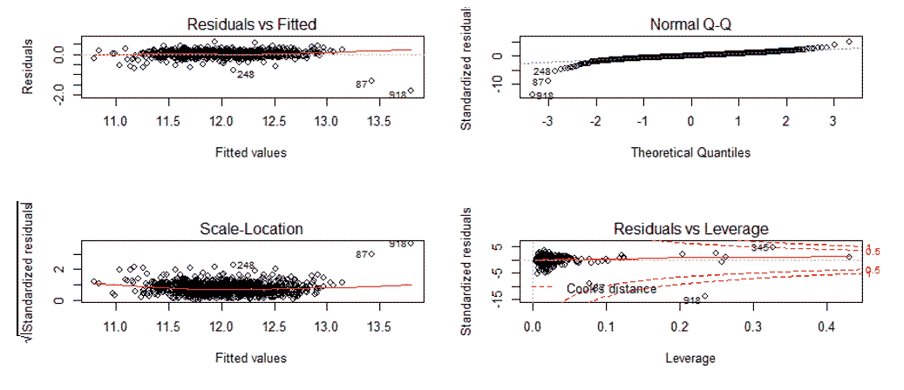

即使是一个简短的检查也表明我们在三个观察值上有一些问题:87、248 和 918。如果你看 Q-Q 图，你可以看到一个被称为重尾的模式。现在的情况是，这个模型在预测极值方面做得不是很好。

回想一下对数响应的直方图，以及它如何显示分布的高端和低端的异常值。我们可以截断响应，但这可能无助于样本外预测。在这种情况下，让我们放弃这三个观察记录，重新运行模型:

```
> train_reduced <- trained[c(-87, -248, -918), ]

> step_lm2 <- lm(lm_formula, data = train_reduced)
```

这里，我们只看 Q-Q 图:

```
> car::qqPlot(step_lm2$residuals)
```

上述代码的输出如下:

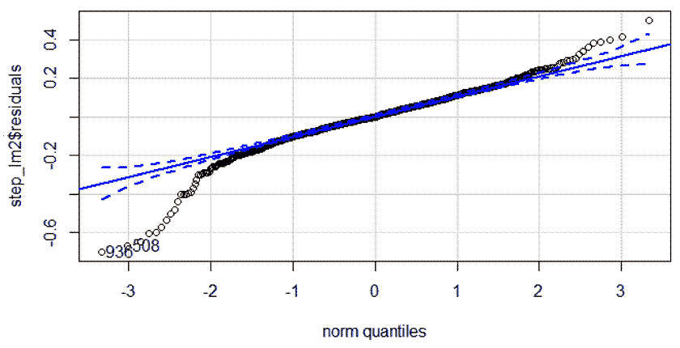

显然，我们这里有一些残差为负(实际价格-预测价格)的问题。我们的分析意味着什么？如果我们生成*预测区间，*可能会有问题，因为它们是基于正态分布残差的假设计算的。此外，对于这种规模的数据集，我们的其他统计测试对异方差问题非常稳健。

为了研究共线性问题，可以调用**方差膨胀因子** ( **VIF** )统计。VIF 是拟合完整模型时要素系数的方差除以自身拟合时要素系数方差的比值。公式如下:


在前面的等式中，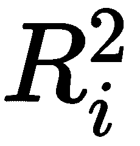是我们感兴趣的特征的 R 平方， *i* ，被所有其他特征回归。VIF 可以采用的最小值为 1，这意味着根本没有共线性。没有硬性规定，但一般来说，VIF 值超过 5(或有人说 10)表示共线性有问题(James，第 101 页，2013)。

很难选择精确的值，因为当多重共线性使您的模型不可接受时，没有硬性的统计分界点。

`car`包中的`vif()`函数是产生值所需要的，因为我们可以把它们放在一个 tibble 中并检查它们:

```
> step_vif <- broom::tidy(car::vif(step_lm2))

> View(step_vif)
```

上述代码的简短输出如下:

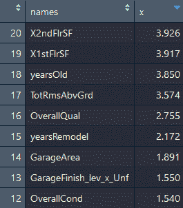

我已经按照 VIF 值降序排列了视图。我相信我们可以得出结论，多重共线性没有明显的问题。

最后，我们必须看看我们在样本之外，也就是在我们的测试数据上做得如何。我们进行模型预测并检查结果如下:

```
> step_pred <- predict(step_lm2, tested)

> caret::postResample(pred = step_pred, obs = test_logy)
    RMSE Rsquared     MAE 
 0.12978  0.89375 0.09492 

> caret::postResample(step_lm2$fitted.values, train_reduced$y)
    RMSE Rsquared     MAE 
 0.12688  0.90072 0.09241 
```

我们看到误差仅略有增加:测试数据中的`0.12688`对`0.12978`。我认为我们可以用火星模型做得更好。让我们不要拖延找出答案。

<title>Modeling and evaluation – MARS</title>  

# 建模和评估——火星

您喜欢提供以下所有功能的建模技术吗:

*   为回归和分类提供构建线性和非线性模型的灵活性
*   可以支持可变的交互术语
*   易于理解和解释
*   几乎不需要数据处理
*   处理所有类型的数据:数字和分类数据
*   在看不见的数据上表现良好，也就是说，在偏差-方差权衡中表现良好

如果这些听起来都很吸引人，那么我怎么推荐使用火星模型都不为过。我发现他们表现得非常好。事实上，在我过去的分类问题中，它们在测试/验证数据上胜过了随机森林和增强树。

了解火星很简单:

1.  首先，从我们之前讨论的线性或广义线性模型开始。
2.  然后，为了捕捉任何非线性关系，添加了铰链函数。这些铰链只是输入要素中等同于系数变化的点。例如，假设我们有:
    
    其中变量 1 和 2 在 1 到 10 的范围内。
3.  现在，让我们看看变量 2 的铰链函数如何发挥作用:
    ** 

我们读取`hinge`函数，因为我们取 0 或*变量* *2-5.50* 的最大值。因此，每当变量 2 的值大于 5.5 时，该值将乘以系数；否则就是零。该方法将为每个变量和交互项提供多个铰链。

关于火星的另一个有趣的事情是自动变量选择。这可以通过交叉验证来完成，但默认情况下是通过向前传递来构建，非常类似于向前选择，然后通过向后传递来修剪模型，这在向前传递之后可能会使数据过拟合。这种反向传递基于**广义交叉验证** ( **GCV** )修剪输入特征并移除铰链:


在 R 的`earth`包中，`Penalty = 2`为加法模型，`3`为乘法模型。乘法模型是一种带有交互项的模型。在`earth`中，有相当多的参数可以调整。在这个例子中，我将展示一种实用而简单的方法来实现这个方法。如果你愿意，你可以在 Stephen Milborrow 的`earth`包装上的精彩插图中了解更多关于其灵活性的信息，可点击此链接:[http://www.milbo.org/doc/earth-notes.pdf](http://www.milbo.org/doc/earth-notes.pdf)。

我将指定一个五重交叉验证的模型选择(`pmethod = *cv*`和`nfold = 5`)作为一个附加模型，它没有交互(`degree = 1`)并且每个输入特征只有一个铰链(`minspan = -1`)。我也想有一个最大的`25`功能(`nprune = 25`)。代码如下:

```
> set.seed(1988)
> earth_fit <-
    earth::earth(
      x = train_reduced[, -96],
      y = train_reduced[, 96],
      pmethod = 'cv',
      nfold = 5,
      degree = 1,
      minspan = -1,
      nprune = 25
    )
```

`earth_fit`的`summary()`相当冗长，所以这里是简略版:

```
 > summary(earth_fit)

Selected 20 of 26 terms, and 13 of 95 predictors using pmethod="cv"
Termination condition: RSq changed by less than 0.001 at 26 terms
Importance: OverallQual, X1stFlrSF, X2ndFlrSF, yearsOld, ...
Number of terms at each degree of interaction: 1 19 (additive model)
GRSq 0.9052 RSq 0.9113 mean.oof.RSq 0.8979 (sd 0.0115)
```

我们可以辨别的是，在总共 20 个术语中，只选择了 13 个特征，包括铰链特征。`mean.oof.RSq`是折外 R 平方值的平均值(`0.8979`)，全模型 R 平方是`0.9113`。你也可以称之为特性重要性:

```
> earth::evimp(earth_fit)
                      nsubsets   gcv   rss
OverallQual                 19 100.0 100.0
X1stFlrSF                   17  49.7  50.0
X2ndFlrSF                   16  42.7  43.0
yearsOld                    14  33.8  34.1
OverallCond                 13  28.0  28.4
BsmtFinSF1                  11  22.6  23.1
LotArea                     10  19.1  19.7
Fireplaces                   7  12.7  13.4
yearsGarage_isNA             6  10.9  11.6
CentralAir_lev_x_Y           4   7.9   8.5
Functional_lev_x_Typ         3   6.3   6.9
Condition1_lev_x_Norm        2   5.1   5.6
ScreenPorch                  1   3.4   3.8
```

我们看到特征名称， *n* subsets，这是如果我们执行修剪过程而不是交叉验证时包含该特征的模型子集的数量，`gcv`和`rss`列显示该特征贡献的相应值的减少(`gcv`和`rss`从 0 到 100)。注意，我们创建的特征`yearsGarage_isNA`被模型选中了。您可以思考铰链函数，但有一个很好的视觉来查看各种分段线性函数:

```
> plotmo::plotmo(earth_fit, nrug = TRUE, rug.col = "red")
```

上述代码的输出如下:


请注意，在图中，LotArea 包含一个铰链。最初，随着属性大小的增加，增加相当显著，然后在某一点，从那里应用新的斜率到最大观察值。相比之下，OverallCond 在所有可能的值中只有一个斜率系数。这是火星如何以分段的方式捕捉线性和非线性关系的一个很好的例子。

现在，我们必须看看它在样本外的表现:

```
> earth_pred <- predict(earth_fit, tested)

> caret::postResample(earth_pred, test_logy)
    RMSE Rsquared     MAE 
 0.12363  0.90120 0.08986 
```

这是一个优于简单线性回归的 RMSE！我很好奇残差在测试集上是什么样子:

```
> earth_residTest <- test_logy - earth_pred

> car::qqPlot(earth_residTest)
```

上述代码的输出如下:

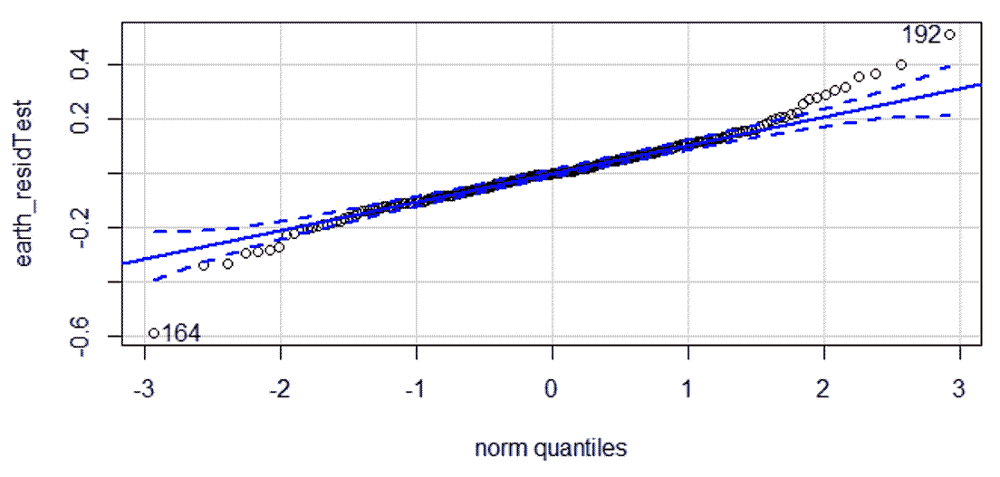

我们仍然看到残差的重尾分布。这告诉我，我们可能不得不求助于分位数回归(此处不在范围内)或为响应的特定部分创建单独的模型。另一个选择是建立一个模型集合，但这是后面一章的主题。

现在，我这里的问题是，我们预测了销售价格的自然对数。我们如何逆向转换得到实际销售价格？我听到你说，*取指数*，对吗？嗯，也许是——也许不是！我从经验中学到了这个痛苦的教训，忍受了一个计量经济学博士的愤怒，仅仅应用指数就可能导致严重的偏差。

这是因为响应的期望值(销售价格)是预测值的指数加上误差项的函数。如果误差项不是完全正态的，那么你就有偏见。解决方案是**段的抹黑估计器**。我将在下一节用一个自定义函数来解决这个问题。

如果你想用这背后的数学自娱自乐，你可以从段的论文开始:
**涂抹估计:非参数重变换方法**

段乃华

美国统计协会杂志

第 78 卷，第 383 期(1983 年 9 月)，第 605-610 页

泰勒弗朗西斯有限公司代表美国统计协会出版

DOI: 10.2307/2288126

[https://www.jstor.org/stable/2288126?seq=1/subjects](https://www.jstor.org/stable/2288126?seq=1/subjects)

<title>Reverse transformation of natural log predictions</title>  

# 自然测井预测的反向转换

既然你已经把段的论文读了几遍，下面就来说说如何应用到我们的工作中。我要给你提供一个用户自定义函数。它将执行以下操作:

1.  对变换模型的残差求幂
2.  对转换模型的预测值求幂
3.  计算指数残差的平均值
4.  通过将步骤 2 中的值乘以步骤 3 中的值来计算模糊预测
5.  返回结果

下面是这个函数，它只需要两个参数:

```
> duan_smear <- function(pred, resid){
    expo_resid <- exp(resid)
    expo_pred <- exp(pred)
    avg_expo_resid <- mean(expo_resid)
    smear_predictions <- avg_expo_resid * expo_pred
    return(smear_predictions)
 }
```

接下来，我们根据火星模型的结果计算新的预测:

```
 > duan_pred <- duan_smear(pred = earth_pred, resid = earth_residTest)
```

我们现在可以看到模型误差是如何在原始销售价格上发生的:

```
> caret::postResample(duan_pred, test_y)
      RMSE Rsquared        MAE 
23483.5659   0.9356 16405.7395
```

我们可以说，这个模型平均错了 16，406 美元。这与不涂抹相比如何？让我们看看:

```
> exp_pred <- exp(earth_pred)
> caret::postResample(exp_pred, test_y)
      RMSE Rsquared        MAE 
23106.1245   0.9356 16117.4235 
```

误差稍微小一些，在这种情况下，抹黑估计似乎不是明智的选择。我见过段的方法和其他方法结合在一个集合模型中的例子。同样，本书后面会有更多关于合奏的内容。

让我们通过绘制非模糊预测和实际值来结束分析。我将以`ggplot`的方式展示如何做到这一点:

```
> results <- data.frame(exp_pred, test_y)

> colnames(results) <- c('predicted', 'actual')

> ggplot2::ggplot(results, ggplot2::aes(predicted, actual)) +
    ggplot2::geom_point(size=1) +
    ggplot2::geom_smooth() +
    ggthemes::theme_fivethirtyeight()
```

上述代码的输出如下:

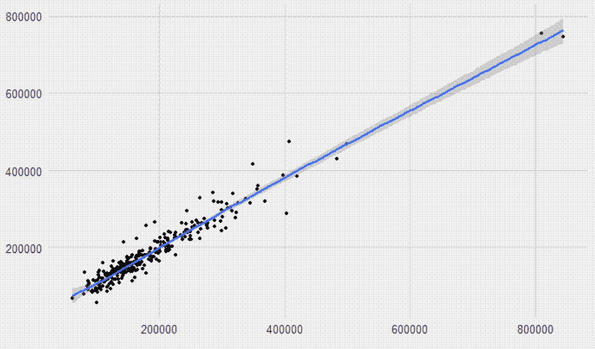

这很有趣，因为您可以看到几乎有一部分实际值的销售价格比我们预测的要高。我们可以尝试找到一些功能或交互术语来解决这种差异。我们还看到，在 40 万美元的销售价格附近，残差有相当大的变化——我认为，主要是因为缺乏观察。

首先，我们有一个非常好的模型，并作为其他建模工作的良好基础。此外，我们制作了一个解释起来相当简单的模型，在某些情况下，这可能比一些无关紧要的误差减少更重要。嘿，这就是你赚大钱的原因。如果很简单，每个人都会做。

<title>Summary</title>  

# 摘要

在机器学习的背景下，我们训练一个模型并测试它来预测一个结果。在这一章中，我们深入研究了简单但极其有效的线性回归和 MARS 方法，以预测定量反应。我们还应用了在第 1 章、*准备和理解数据*中提出的数据准备范例，以便快速有效地为建模准备好数据。我们制作了几个简单的图来理解我们试图预测的反应，探索模型假设和模型结果。

后面的章节将涵盖更高级的技术，如逻辑回归、支持向量机、分类、神经网络和深度学习，但其中许多只是本章所学内容的扩展。