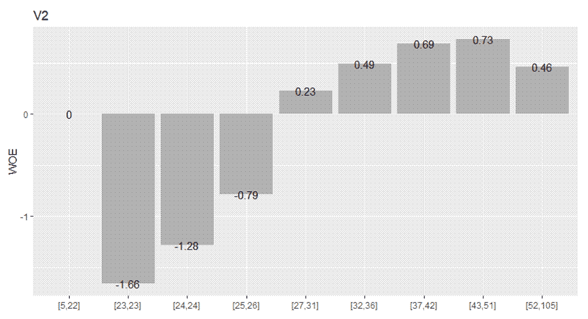
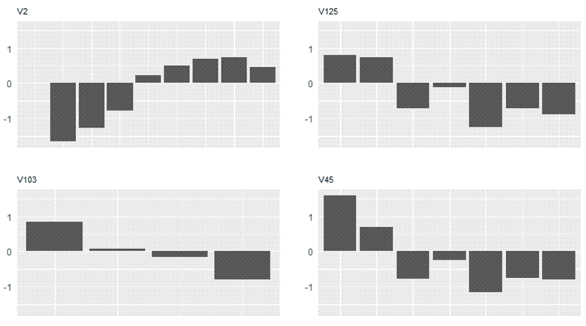
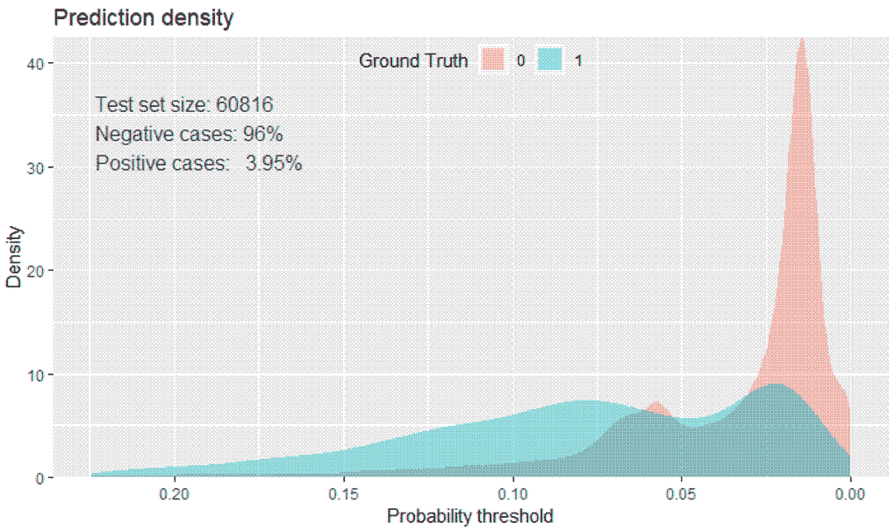
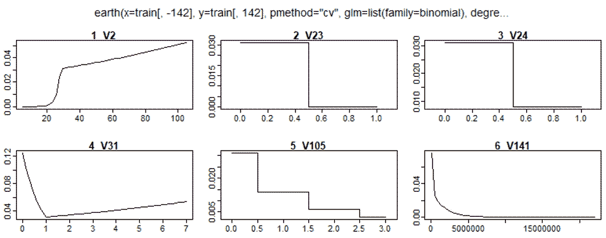
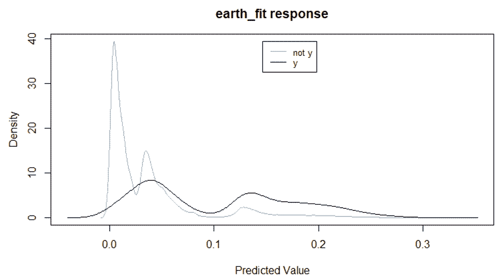
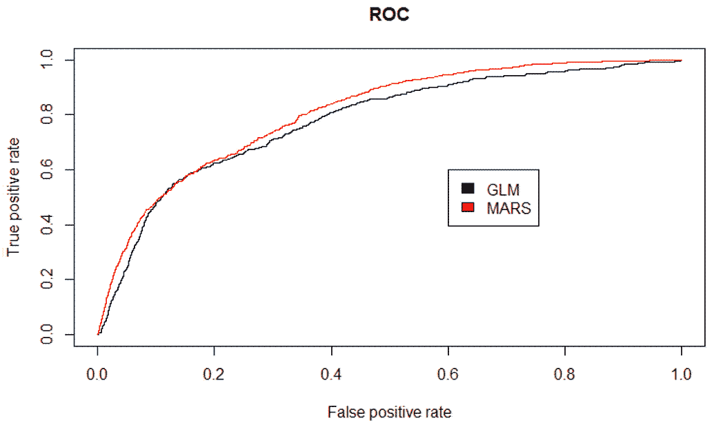

<title>Logistic Regression</title>  

# 逻辑回归

"这个世界的真正逻辑是概率计算."

-苏格兰物理学家詹姆斯·克拉克·麦克斯韦

在前一章中，我们看了使用**普通最小二乘法** ( **OLS** )来预测定量结果，或者换句话说，线性回归。现在是时候稍微改变一下方式，研究我们如何开发算法来预测定性结果了。这种结果变量可以是二元的(男性对女性，购买对不购买，或肿瘤是良性对恶性)或多项类别(教育水平或眼睛颜色)。不管感兴趣的结果是二元的还是多元的，我们的任务是预测属于结果变量的特定类别的观察值的概率。换句话说，我们开发了一种算法来对观察结果进行分类。

为了开始探讨分类问题，我们将讨论为什么应用 OLS 线性回归不是正确的技术，以及本章介绍的算法如何解决这些问题。然后，我们将研究预测银行客户是否满意的问题。为了解决这个问题，我们将从建立和解释逻辑回归模型开始。我们还将开始研究选择特征的单变量方法。接下来，我们将转向多元回归样条，并探索选择最佳整体算法的方法。本章将为后续章节中更高级的机器学习方法奠定基础。

我们将在本章中讨论以下主题:

*   分类方法和线性回归
*   逻辑回归
*   模型训练和评估

<title>Classification methods and linear regression</title>  

# 分类方法和线性回归

那么，为什么我们不能用上一章学过的最小二乘回归法来得到一个定性的结果呢？事实证明，你可以，但风险自负。让我们假设你有一个你试图预测的结果，它有三个不同的等级:轻度，中度和重度。你和你的同事还假设轻度和中度以及中度和重度的区别是一个等价的度量，是一个线性关系。您可以创建一个虚拟变量，其中 0 表示轻度，1 表示中度，2 表示重度。如果你有理由相信这一点，那么线性回归可能是一个可以接受的解决方案。然而，定性标签(如之前的标签)可能会导致高水平的测量误差，从而使 OLS 产生偏差。在大多数商业问题中，没有科学上可接受的方法将定性反应转化为定量反应。如果你的回答有两种结果，比如失败和通过，那该怎么办？同样，使用虚拟变量方法，我们可以将失败结果编码为`0`，将通过结果编码为`1`。使用线性回归，我们可以建立一个模型，其中预测值是通过或失败观察的概率。然而，模型中`Y`的估计很可能会超过`[0,1]`的概率限制，因此有点难以解释。

<title>Logistic regression</title>  

# 逻辑回归

如前所述，我们的分类问题最好用由`0`和`1`限定的概率来建模。我们可以用一些不同的函数对所有的观测值进行这样的处理，但这里我们将重点放在逻辑函数上。逻辑回归中使用的逻辑函数如下:


如果你曾经在赛马或世界杯上下过友好的赌注，你可能会更好地理解赔率的概念。逻辑函数可以用*概率(Y) / 1 -概率(Y)* 的公式化为 odds。例如，如果巴西赢得世界杯的概率是 20%，那么赔率是 *0.2 / 1 - 0.2* ，等于 *0.25* ，也就是说赔率是四分之一。

要将赔率转换回概率，取赔率并除以 1 加上赔率。因此，世界杯的例子是 *0.25 / 1 + 0.25* ，等于 20%。此外，让我们考虑优势比。假设德国夺冠的几率是 *0.18* 。我们可以用赔率来对比巴西和德国的赔率。在这个例子中，赔率是巴西的赔率除以德国的赔率。我们最终得出的赔率等于 *0.25/0.18* ，等于 *1.39* 。在这里，我们会说巴西赢得世界杯的可能性是德国的 1.39 倍。

查看逻辑回归与线性回归的关系的一种方法是将逻辑回归显示为对数优势或 *log (P(Y)/1 - P(Y))* 等于 *Bo + B1x* 。使用最大似然法而不是 OLS 来估计系数。最大似然背后的直觉是，我们正在计算对 *Bo* 和 *B1、*的估计，这将创建一个尽可能接近实际观察结果 *Y* 的预测概率，即所谓的似然性。R 语言为最大似然性做了其他软件包做的事情，就是找到使似然性最大化的 beta 值的最优组合。

考虑到这些事实，逻辑回归是预测涉及分类的问题的有效技术，并且通常是在这种问题中创建模型的起点。因此，在这一章中，我们将首先用逻辑回归来解决未来的问题。

<title>Model training and evaluation</title>  

# 模型训练和评估

如前所述，我们将预测客户满意度。该数据基于以前的在线竞赛。我已经提取了数据的训练部分，并对其进行了清理以供我们使用。

比赛的完整描述和数据可在以下链接获得:[https://www . ka ggle . com/c/Santander-customer-satisfaction/data](https://www.kaggle.com/c/santander-customer-satisfaction/data)。

出于多种原因，这对于分类问题来说是一个极好的数据集。像如此多的客户数据一样，它非常杂乱——尤其是在我删除一堆无用的功能之前(大约有四十几个零方差功能)。正如前两章所讨论的，我解决了缺失值、线性依赖和高度相关对的问题。我还发现这些特性的名字又长又没用，所以我把它们编码为 V1 到 V142。由此产生的数据处理的是通常难以衡量的东西:满意度。由于专有方法，没有给出满意的描述或定义。

我以前在银行业工作过，我可以向你保证，这是一个有点挑战性的命题，充满了测量误差。因此，相对于信号有相当多的噪声，可以预期模型性能相当差。此外，与没有不满意的客户相比，感兴趣的结果*客户不满意*相对较少。经典的问题是，当试图对少数民族标签进行分类时，你最终会得到相当多的误报。

和往常一样，你可以在 GitHub 上找到数据:[https://GitHub . com/packt publishing/Advanced-Machine-Learning-with-R/blob/master/Data/Santander _ prepd。RData](https://github.com/PacktPublishing/Advanced-Machine-Learning-with-R/blob/master/Data/santander_prepd.RData) 。

因此，让我们首先加载数据并训练一个逻辑回归算法。

<title>Training a logistic regression algorithm</title>  

# 训练逻辑回归算法

按照以下简单步骤训练逻辑回归算法:

1.  第一步是确保加载我们的包，并将`magrittr`库调用到我们的环境中:

```
> library(magrittr)
> install.packages("caret")
> install.packages("classifierplots")
> install.packages("earth")
> install.packages("Information")
> install.packages("InformationValue")
> install.packages("Metrics")
> install.packages("tidyverse")  
```

2.  在这里，我们加载文件，然后检查尺寸并检查客户标签表:

```
> santander <- read.csv("~/santander_prepd.csv")

> dim(santander)
[1] 76020 143

> table(santander$y)

    0    1 
73012 3008 
```

我们有 76，020 个观察值，但只有 3，008 个客户被标记为`1`，这意味着不满意。接下来我将使用 caret 来创建 80/20 分割的训练集和测试集。

3.  在 caret 的`createDataPartition()`函数中，它会根据响应自动对样本进行分层，因此我们可以放心，在训练集和测试集之间有一个平衡的百分比:

```
> set.seed(1966)

> trainIndex <- caret::createDataPartition(santander$y, p = 0.8, list = FALSE)

> train <- santander[trainIndex, ]

> test <- santander[-trainIndex, ]
```

4.  让我们看看两个数据集之间的响应是如何平衡的:

```
> table(train$y)

    0    1 
58411 2405

> table(test$y)

    0     1 
14601   603 
```

每组大约有 4 %,所以我们可以继续。拆分数据时可能发生的一件有趣的事情是，您现在会发现一个接近零方差的特征变成了训练集中的零方差特征。当我处理这些数据时，我只去掉了零方差特征。

5.  有一些低方差特性，所以让我们看看是否可以消除一些新的零方差特性:

```
> train_zero <- caret::nearZeroVar(train, saveMetrics = TRUE)

> table(train_zero$zeroVar)

FALSE TRUE 
  142    1
```

6.  好了，由于分割，一个特征现在是零方差，我们可以删除它:

```
> train <- train[, train_zero$zeroVar == 'FALSE']
```

我们的数据框现在有 139 个输入要素和带标签的客户列。正如我们对线性回归所做的那样，为了使逻辑回归得到有意义的结果，也就是说不要过度拟合，您需要减少输入特征的数量。我们可以像上一章所做的那样，用逐步选择或类似的方法向前推进。我们可以实现特征正则化方法，我们将在下一章讨论。但是，我想介绍一种使用**证据权重** ( **WOE** )和**信息值** ( **IV** )的单变量特征约简方法，并讨论我们如何理解如何结合逻辑回归在分类问题中使用它。

<title>Weight of evidence and information value</title>  

# 证据权重和信息价值

几年前我在咨询工作中偶然发现了这个方法。我所在的团队对大数据集非常感兴趣，并且局限于使用 SAS 统计软件。客户团队能够容易地解释模型也是一个关键的需求。

鉴于可能有数百种甚至数千种特征，我有幸学习了一位前火箭科学家对 WOE 和 IV 的使用。没错:一个真正从事过载人航天飞行的人。我成了一名求知若渴的学生。现在，这个方法不是万灵药。首先，它是单变量的，因此被丢弃的特征在多变量模型中可能变得重要，反之亦然。我可以说它为其他方法提供了很好的补充，你应该把它放在你的建模工具箱里。我相信它起源于信用评分的世界，所以如果你在金融行业工作，你可能已经很熟悉它了。

首先，让我们来看看 WOE 的公式:


WOE 是 IV 的一个组成部分。对于数字特征，您将对数据进行分类，然后分别计算每个分类的权重。对于分类的，或者当一个热编码时，为每个级别绑定并分别计算 WOE。我们举个例子，用 r 来演示。

我们的数据由一个编码为 0 或 1 的输入要素组成，因此我们只有两个箱。对于每个箱子，我们计算我们的悲哀。在容器 1 中，或者在值等于 0 的情况下，有 4 个作为事件的观察和 96 个作为非事件的观察。相反，在 bin 2 中，或者值等于 1 的情况下，我们将`12`个观察值作为事件，将 88 个观察值作为非事件。让我们看看如何计算每个箱的权重:

```
> bin1events <- 4

> bin1nonEvents <- 96

> bin2events <- 12

> bin2nonEvents <- 88

> totalEvents <- bin1events + bin2events

> totalNonEvents <- bin1nonEvents + bin2nonEvents
# Now calculate the percentage per bin
> bin1percentE <- bin1events / totalEvents

> bin1percentNE <- bin1nonEvents / totalNonEvents

> bin2percentE <- bin2events / totalEvents

> bin2percentNE <- bin2nonEvents / totalNonEvents
# It's now possible to produce WOE
> bin1WOE <- log(bin1percentE / bin1percentNE)

> bin2WOE <- log(bin2percentE / bin2percentNE)
```

完成这一步后，你得到的`bin1`和`bin2`的权重分别约为-0.74 和 0.45。我们现在使用它来计算每个 bin 的 IV，然后对其求和，得出该特性的总体 IV。公式如下:


以我们目前的例子为例；这是我们的特色四:

```
> bin1IV <- (bin1percentE - bin1percentNE) * bin1WOE

> bin2IV <- (bin2percentE - bin2percentNE) * bin2WOE

> bin1IV + bin2IV
[1] 0.3221803
```

特征的 IV 是`0.322`。这是什么意思？简而言之，这要视情况而定。我们提供了一种启发式方法来帮助确定哪些 IV 阈值对模型开发有意义:

*   < 0.02 不具有预测性
*   0.02 到 0.1 弱
*   0.1 至 0.3 中等
*   0.3 到 0.5 强
*   > 0.5 可疑

下面的例子将为我们提供一些有趣的决定，告诉我们应该在哪里划线。

<title>Feature selection</title>  

# 特征选择

我们现在要做的是使用`Information`包来计算我们特性的 iv。然后，我将向您展示如何评估这些值，并运行一些图。因为对于特性包含的阈值没有硬性的规则，所以我将提供我的关于在哪里划线的判断。当然，你可以拒绝这一点，并应用你自己的。

在本例中，代码将创建一系列表，您可以使用这些表来浏览结果。开始时，您只需要指定数据和响应或`"y"`变量:

```
IV <- Information::create_infotables(data = train, y = "y", parallel = FALSE)
```

这将为我们提供顶级`25`功能的`IV`摘要:

```
> knitr::kable(head(IV$Summary, 25))

|    |Variable |     IV|
|:---|:--------|------:|
|2   |V2       | 0.7006|
|102 |V103     | 0.5296|
|124 |V125     | 0.5281|
|45  |V45      | 0.5273|
|31  |V31      | 0.5213|
|125 |V126     | 0.4507|
|55  |V55      | 0.3135|
|140 |V141     | 0.0982|
|108 |V109     | 0.0711|
|130 |V131     | 0.0681|
|33  |V33      | 0.0672|
|104 |V105     | 0.0640|
|66  |V66      | 0.0519|
|92  |V93      | 0.0519|
|128 |V129     | 0.0499|
|121 |V122     | 0.0461|
|24  |V24      | 0.0417|
|131 |V132     | 0.0365|
|34  |V34      | 0.0323|
|47  |V47      | 0.0323|
|123 |V124     | 0.0289|
|129 |V130     | 0.0194|
|83  |V84      | 0.0189|
|19  |V19      | 0.0181|
|35  |V35      | 0.0181|
```

结果显示了特性列号、特性名称和`IV`。请注意，我们有五个可能可疑的特征。我完全赞成采用任何一个`IV`高于`0.02`的特征，这是弱预测的底部。这将给我们 21 个输入特征。`V2`功能很有意思。如果你看看这些值，想想这些数据，很明显这是客户的年龄。让我们看看数据是如何装箱的，`WOE`值和 IVs:

```
> knitr::kable(IV$Tables$V2)

|V2       |     N| Percent|     WOE|     IV|
|:--------|-----:|-------:|-------:|------:|
|[5,22]   | 951  | 0.0156 | 0.0000 | 0.0000|
|[23,23]  | 16222| 0.2667 | -1.6601| 0.3705|
|[24,24]  | 4953 | 0.0814 | -1.2811| 0.4481|
|[25,26]  | 6048 | 0.0994 | -0.7895| 0.4919|
|[27,31]  | 8088 | 0.1330 | 0.2261 | 0.4994|
|[32,36]  | 6037 | 0.0993 | 0.4923 | 0.5297|
|[37,42]  | 6302 | 0.1036 | 0.6876 | 0.5975|
|[43,51]  | 6095 | 0.1002 | 0.7328 | 0.6737|
|[52,105] | 6120 | 0.1006 | 0.4636 | 0.7006|
```

好吧，你一定是在开玩笑。看看 bin 号 2，我相信它是 23 岁的客户年龄。它几乎占总观测值的 27 %,并占 IV 的一半以上。确实可疑！如果这个特征是真的`AGE`像我怀疑的那样，我们对这些数据产生的任何算法将如何有所帮助？然而，这超出了本文的范围，不值得浪费更多的时间和精力。在这里，我们可以快速调出一个由宾绘制的柱状图:

```
> Information::plot_infotables(IV, "V2", show_values = TRUE)
```

上述代码的输出如下:



有趣的是，这个特征和反应之间有某种线性关系。可以做的是，我们可以创建一些功能，将入库的值转换为 WOE 值。这些新特征将是线性的，并且可以用来代替原始特征。我们应该放弃它，因为有什么方法可以做到这一点呢？没错，下一节火星可以为我们做到这一点！下面是四大功能的网格图:

```
> Information::plot_infotables(IV, IV$Summary$Variable[1:4], same_scales=TRUE)
```

上述代码的输出如下:



现在，给定我之前选择的截止点，我们可以选择那些`21`特征:

```
> features <- IV$Summary$Variable[1:21]

> train_reduced <- train[, colnames(train) %in% features]

> train_reduced$y <- train$y
```

给你。我们现在准备开始训练我们的算法。

<title>Cross-validation and logistic regression</title>  

# 交叉验证和逻辑回归

我们这里的目标是建立一个使用五重交叉验证的模型。我们将利用`caret`包来建立我们的采样方案并生产最终模型。首先构建一个单独的`trainControl()`函数:

```
> glm_control <-
    caret::trainControl(method = "cv",
    number = 5,
    returnResamp = "final")
```

此对象作为参数传递以训练算法。我们现在生成输入特征、响应变量(必须是 caret 训练为逻辑回归的一个因素)，设置我们的随机种子，并训练模型。对于`train()`函数，为**广义线性模型** ( **GLM** )指定`glm`:

```
> x <- train_reduced[, -22]

> y <- as.factor(train_reduced$y)

> set.seed(1988)

> glm_fit <-
   caret::train(x, y, method = "glm", 
                trControl = glm_control,
                trace = FALSE)
```

当完成*磨掉*后，您可以快速检查结果:

```
> glm_fit$results
  parameter Accuracy     Kappa AccuracySD  KappaSD
1      none   0.9602 0.0002369  0.0001591 0.001743
```

快看，96%的准确率！我知道这完全没有意义，因为如果我们只是猜测响应中的所有标签都是零，我们将达到 96%。这似乎是显而易见的，但我采访过拥有*数据科学学位*的人，他们忽略了这个事实。`Kappa`指的是众所周知的科恩卡帕统计。Kappa 统计通过调整准确度分数提供了对这个问题的深入了解，这是通过解释模型完全正确仅仅是偶然的。统计的公式如下:


*符合百分比*是模型对该类(准确性)达成一致的比率，而*机会符合百分比*是模型随机达成一致的比率。统计值越高，性能越好，最大一致性为 1。所以，以这个 Kappa 分数，模特是可悲的。

好吧，卡帕会有更平衡的标签。我们现在需要寻找其他方法来检查模型结果。用密度图或箱线图来比较不同类别的概率分布总是一个好主意。

这里，我们在训练数据上生成了一个优雅而丰富多彩的密度图:

```
> glm_train_pred <- predict(glm_fit, train, type = "prob")

> colnames(glm_train_pred) <- c("zero", "one")

> classifierplots::density_plot(train_reduced$y, glm_train_pred$one)
```

上述代码的输出如下:



这给了我们一个有趣的视角来看这个模型在做什么。在达到 7%之前，我们看不到任何预测能力。我们可以确定一个最佳概率阈值来最大化我们的分类目标。我们稍后将应用的`InformationValue`包中有一个出色的函数。它允许确定四个不同的阈值:

*   `misclasserror`:函数中的默认设置，标识最小化分类误差的阈值
*   这是最大限度检测 1 的阈值
*   这是最大限度检测 0 的阈值
*   `Both`:这是最大化尤登指数的阈值，是 **(灵敏度+特异性)- 1**

*Sensitivity = True Positives / (True Positives + False Negatives)*: This is also called the True Positive Rate or Recall and is a measure of correctly identifying positive labels. *Specificity = True Negatives / (True Negatives + False Positives)*: Also called the True Negative Rate, this is a measure of correctly identifying negative labels.

在这种情况下，我们应该看看`Both`的阈值。我们还会询问所有的诊断信息:

```
> glm_cutoff <-
    InformationValue::optimalCutoff(
    train_reduced$y,
    glm_train_pred$one,
    optimiseFor = 'Both',
    returnDiagnostics = TRUE
    )
```

如果您在您的全局环境中点击`glm_cutoff`或运行`View(glm_cutoff)`，您将看到六个不同结果的列表:

*   `optimalCutoff` = 0.0606
*   你可以自己进一步检查灵敏度表
*   错误分类误差= 0.2006
*   TPR = 0.6079
*   FPR = 0.1927
*   特异性= 0.8073

如果我们选择 0.0606 的截止值，我们将获得几乎 61%的**真阳性率** ( **TPR** )。然而，超过 19%会是假阳性。

考虑到班级的不平衡，这是一个巨大的客户数量。混淆矩阵可以证明以下事实:

```
> InformationValue::confusionMatrix(train_reduced$y, glm_train_pred$one,   threshold = 0.0607)
      0    1
0 47164  944
1 11247 1461
```

在培训数据中，不满意的客户共有 2405 个；如果我们对其中的 1461 个进行了正确的分类，我们将会对 11247 个进行错误的分类。因此，我们决定将最佳阈值放在哪里取决于业务需求。我们将在模型比较中看到如何以不同的方式描绘它。

现在让我们看看该算法如何对可变重要性进行排序:

```
> caret::varImp(glm_fit)
glm variable importance

only 20 most important variables shown (out of 21)

      Overall
V2   100.0000
V103  70.2840
V141  33.2809
V105  18.0160
V24   13.1048
V129  12.4327
V55   10.7379
V34    8.7920
V45    8.5681
V124   7.1968
V122   5.9959
V109   5.8668
V33    4.8295
V125   3.6369
V131   1.5439
V126   0.8383
V47    0.7430
V132   0.4286
V66    0.3133
V31    0.0912
```

我们的`suspicious`变量是最重要的。我会建议您尝试其他型号，不考虑`V2`。但这取决于你，因为我现在的想法是看看测试数据的表现如何:

```
> glm_test_pred <- predict(glm_fit, test, type = "prob")

> colnames(glm_test_pred) <- c("zero", "one")

> classifierplots::density_plot(test$y, glm_test_pred$one)
```

上述代码的输出如下:


测试数据的结果非常相似。假设我们的阈值是在训练中确定的，那么混淆矩阵呢？让我们看看:

```
> InformationValue::confusionMatrix(test$y, glm_test_pred$one, threshold = 0.0607)
      0   1
0 11710 227
1  2891 376
```

一致的结果！现在，让我们检查这个模型在测试数据上的性能，以便我们可以将它与即将到来的火星模型进行比较。有两个指标可以解决这个问题，曲线下的面积 ( **AUC** )和对数损失。AUC 为您提供了一个有用的性能指标，可以证明 AUC 等于观察者在随机选择一对病例时正确识别阳性病例的概率，其中一个病例为阳性，一个病例为阴性(汉利·贾&麦克尼尔·BJ，1982)。在我们的例子中，我们将使用我们的算法切换观察器，并相应地进行评估。对数损失是一种有效的度量，因为它考虑了预测的概率以及它偏离正确标签的程度。下面的公式产生它:


像高尔夫球一样，0 到 1 之间的值越低越好。完美模型的值应该是 0。我们可以使用`Metrics`包轻松生成这些值:

```
> Metrics::auc(test$y, glm_test_pred$one)
[1] 0.7794

> Metrics::logLoss(test$y, glm_test_pred$one)
[1] 0.1499
```

我要说，我们的 AUC 没有那么好。如果模型不比随机猜测好，那么 AUC 将等于 0.5，如果完美，它将是 1。我们的对数损失只有在与下一个模型比较时才是必要的。

<title>Multivariate adaptive regression splines</title>  

# 多元自适应回归样条

在前一章中，我们讨论了火星，它是如何工作的，为什么使用它，等等，所以我在这里不再重复；除此之外，它还可以作为广义线性模型应用于分类问题。其中一个重要的好处是它能够进行特征选择，因此不需要逐步运行或 IV-甚至正则化。

我们将用 5 重交叉验证来训练它，并将`nprune = 15`设置为将最大功能数限制在 15。回想一下前一章，由于它适合分段样条，所以可能有 15 个以上的项。

这段代码将为我们提供`model`对象。请注意，这可能需要一些时间才能完成:

```
> set.seed(1972)

> earth_fit <-
    earth::earth(
    x = train[, -142],
    y = train[, 142],
    pmethod = 'cv',
    nfold = 5,
    degree = 1,
    minspan = -1,
    nprune = 15,
    glm = list(family = binomial)
    )
```

以下是模型总结:

```
> summary(earth_fit)
Call: earth(x=train[,-142], y=train[,142], pmethod="cv",
            glm=list(family=binomial), degree=1, nprune=15, nfold=5,
            minspan=-1)

GLM coefficients
                     y
(Intercept)    -3.4407
V23            -6.6750
V24            -1.3539
V105           -0.8200
h(28-V2)       -0.4769
h(V2-28)        0.0071
h(1-V31)        1.4876
h(V31-1)        0.0947
h(106449-V141)  0.0000
h(V141-106449)  0.0000

Earth selected 10 of 10 terms, and 6 of 141 predictors using pmethod="cv"
```

正如您在摘要中看到的，该模型最终总共有六个预测特征和十个术语，包括对`V2`的一个`hinge`函数。根据标准协议，成对的铰链项可以首先被读取为小于铰链值的预测值，然后被读取为大于或等于铰链值的预测值。例如，对于`V31`，小于 1 的值具有系数 1.4876，否则为 0.0947。

我们可以画出预测概率的线性相互作用。将`ylim`设置为`NA`有助于显示 *y* (预测概率)的变化与特征值的变化:

```
> plotmo::plotmo(earth_fit, ylim = NA)
```

上述代码的输出如下:



注意，对于`V31`，等于零的值有一个系数，另一个系数，如前所述。特征重要性的产生是微不足道的:

```
> earth::evimp(earth_fit)
     nsubsets   gcv   rss
V31         9 100.0 100.0
V2          8  74.8  75.0
V141        7  40.2  41.1
V105        6  31.5  32.5
V23         5  26.8  27.8
V24         4  20.7  21.8
```

`nsubsets`标准计算包含该特征的模型子集的数量。包含在更多子集中的特征被认为更重要。这些子集是地球修剪过程产生的术语。

现在，我们指定了交叉验证，但是 earth 同时进行前向和后向特征选择和消除，使用前面章节中讨论的**广义交叉验证** ( **GCV** )。因此，为了便于比较，一个特性的 GCV 和 rss 结果被归一化为 0 到 100。

像我们之前做的一样，概率密度图是有用的，并且`earth`有它自己的`plotd()`函数:



我喜欢预测值与之前的图相比是如何反转的。除此之外，除了密度非常相似之外，很难辨别出任何有意义的东西。让我们得到`cutoff`值:

```
> mars_cutoff <-
    InformationValue::optimalCutoff(
    train$y,
    pred,
    optimiseFor = 'Both',
    returnDiagnostics = TRUE
    )
```

对物体的检查提供了以下内容:

*   最佳截止值= 0.04976
*   TPR = 0.6449
*   FPR = 0.208

与逻辑回归相比，我们以稍高的假阳性率为代价获得了更高的真阳性率。

让我们继续评估测试集的性能:

```
> test_pred <- predict(earth_fit, test, type = 'response')

> Metrics::auc(test$y, test_pred)
[1] 0.8079

> Metrics::logLoss(test$y, test_pred)
[1] 0.1406
```

我们在这里看到了什么？AUC 略有改善，对数损失更低(更好)。虽然不引人注目，但它可能是有价值的。我们现在可以转向视觉比较这两个模型，以确认 MARS 确实是首选算法。

<title>Model comparison</title>  

# 模型比较

分类模型比较的一个有用工具是**接收机工作特性** ( **ROC** )图。ROC 是一种基于性能可视化、组织和选择分类器的技术(Fawcett，2006)。在 ROC 图上， *y* 轴是**真阳性率** ( **TPR** )，x*轴是**假阳性率** ( **FPR** )。*

要在 R 中创建 ROC 图表，可以使用`ROCR`包。我认为这是一个很棒的包，它允许你只用三行代码就能构建一个图表。该软件包还有一个优秀的配套网站(有示例和演示)，可以在以下链接找到:[http://rocr.bioinf.mpi-sb.mpg.de/](http://rocr.bioinf.mpi-sb.mpg.de/)。

对于每个模型，您创建一个实际标签和预测概率的预测对象，然后创建一个嵌入 TPR 和 FPR 的性能对象，最后绘制它:

```
> pred.glm <- ROCR::prediction(glm_test_pred$one, test$y)

> perf.glm <- ROCR::performance(pred.glm, "tpr", "fpr")

> ROCR::plot(perf.glm, main = "ROC", col = 1)
```

这给了我们 GLM 的曲线图(逻辑回归)。现在，我们将火星模型叠加在同一个图上，并创建一个图例:

```
> pred.earth <- ROCR::prediction(test_pred, test$y)

> perf.earth <- ROCR::performance(pred.earth, "tpr", "fpr")

> ROCR::plot(perf.earth, col = 2, add = TRUE)

> legend(0.6, 0.6, c("GLM", "MARS"), 1:2)
```

上述代码的输出如下:



ROC 曲线下的面积对应于先前计算的 AUC。火星模型的 AUC 更高；因此，它的曲线略高于 GLM 模型。值得注意的是，在 0.5 的 TPR 附近，他们有几乎相同的 FPR。不过，底线是 MARS 模型具有更少的输入特征，优于 logistic 回归，尽管只是略微优于后者。

对于此类数据提供的问题，我们可以做很多事情来提高性能。您可以进一步探索数据，尝试添加自定义功能。您还可以使用更高级的方法，创建更多的模型进行比较，或者甚至构建几个模型并创建一个集合。至于高级技术和构建合奏，我们将在后续章节中讨论。让你的想象驰骋吧！

<title>Summary</title>  

# 摘要

在这一章中，我们研究了使用概率线性模型来预测两种广义线性模型方法的定性反应:逻辑回归和多元自适应回归样条。我们探索了使用信息的权重和信息值作为技术来进行单变量特征选择。我们讨论了寻找合适的概率阈值来最小化分类错误的概念。此外，我们开始使用各种性能指标，如 AUC、log-loss 和 ROC 图，从视觉上和统计上探索模型选择。这些指标被证明比纯粹的准确性更能提供信息，尤其是在类别标签高度不平衡的情况下。在下一章中，我们将讨论特征选择的正则化方法，以及如何用它来训练你的算法。我们将了解如何创建数据集。我们将了解岭回归，并深入探讨特征选择。