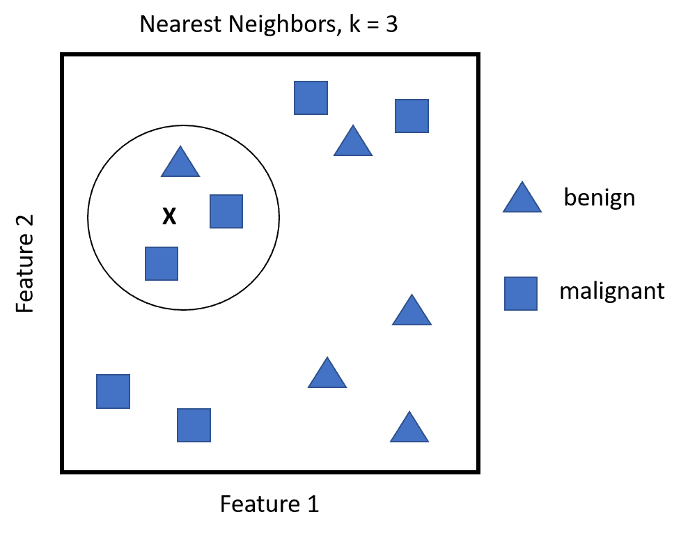
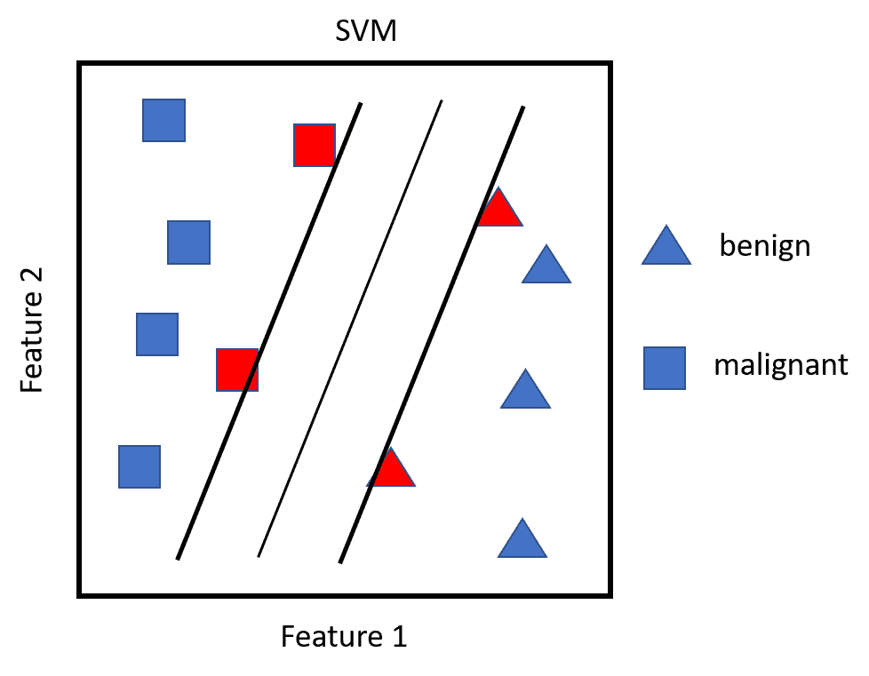
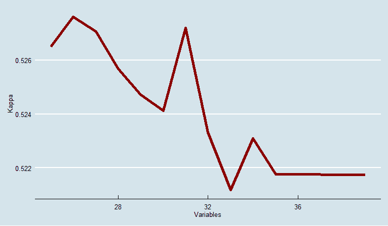
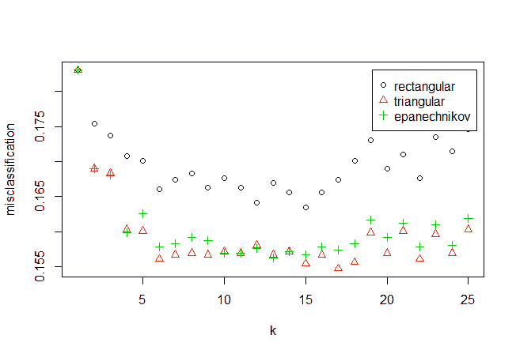
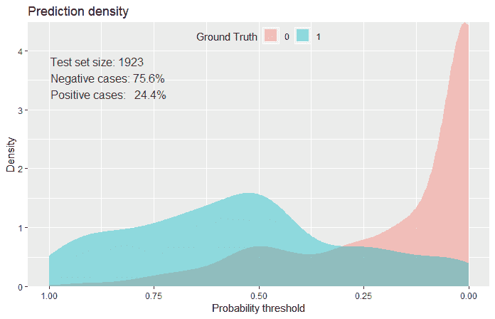
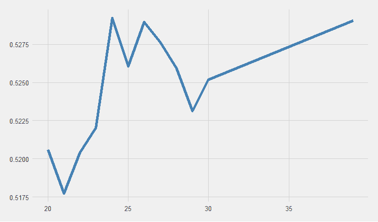
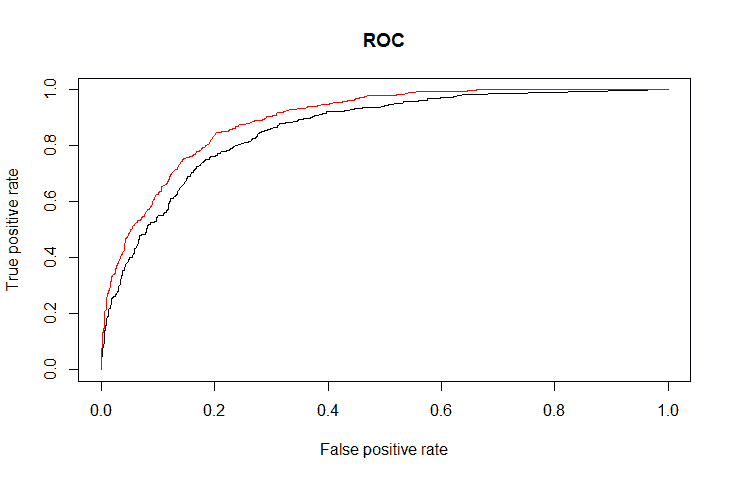

# 五、K 近邻和支持向量机

"总有一天，统计思维将像读写能力一样，成为高效公民的必要条件."

赫伯特·乔治·威尔斯

在[第 3 章](ce9ab446-e94c-44f2-a5dc-1ff2ff0e8d50.xhtml)、*逻辑回归、*中，我们讨论了使用广义线性模型来确定预测观察值属于分类响应的概率，我们称之为分类问题。这只是分类方法的开始，我们可以使用许多技术来尝试和改进我们的预测。

在本章中，我们将深入研究两种非线性技术:**K-最近邻**(**)和**支持向量机** ( **SVMs** )。这些技术比我们之前讨论的技术更复杂，因为可以放松对线性的假设，这意味着不需要用特征的线性组合来定义决策边界。不过，预先警告一下，这并不总是等同于卓越的预测能力。此外，这些模型对于业务合作伙伴来说可能有点难以解释，而且它们的计算效率可能很低。如果使用得当，它们可以为本书中讨论的其他工具和技术提供强大的补充。除了分类问题之外，它们还可用于连续结果；然而，对于这一章，我们将只关注后者。**

 **在对这些技术有了一个高层次的背景之后，我们将对他们两个进行测试，从 KNN 开始。

以下是我们将在本章中涉及的主题:

*   k-最近邻
*   支持向量机
*   操纵数据
*   建模和评估


# k-最近邻

在我们之前的努力中，我们建立了具有系数的模型，或者换句话说，为我们包含的每个特性建立了参数估计。对于 KNN，我们没有参数，因为学习方法是所谓的基于实例的学习。简而言之，*标记的例子(输入和相应的输出标签)被存储，直到一个新的输入模式要求一个输出值*才采取行动(Battiti 和 Brunato，2014，第 11 页)。这种方法通常被称为**懒惰学习**，因为不产生特定的模型参数。实例本身代表了知识。对于任何新实例(新数据点)的预测，在`training`数据中搜索与所讨论的新实例最相似的实例。KNN 通过查看最近的点(最近的邻居)来确定正确的类别，从而解决分类问题。 *k* 通过决定算法应该检查多少个邻居来发挥作用，因此如果 *k=5* ，它将考虑五个最近的点。这种方法的一个缺点是，所有五个点在算法中都被赋予了同等的权重，即使它们在学习中不太相关。我们将研究使用 R 的方法，并尝试缓解这个问题。

理解这是如何工作的最好方法是用一个简单的二进制分类学习问题的可视化例子。在下面的屏幕截图中，我们有一个图表，根据两个预测特征显示肿瘤是良性的还是恶性的。图中的 **X** 表示我们想要预测的新观察结果。如果我们的算法认为 **K=3** ，这个圆包含了三个最接近我们想要评分的观察值。由于最常见的分类是**恶性**，因此 **X** 数据点被分类为**恶性、**，如下图所示:



即使从这个简单的例子中，很明显选择最近邻的 *k* 是至关重要的。如果 *k* 太小，即使你有一个低偏差，你也可能在`test`集合观察上有一个高方差。另一方面，随着 *k* 的增长，你可能会减少方差，但偏差可能是不可接受的。交叉验证对于确定合适的 *k* 是必要的。

指出特征空间中数据点的距离或接近度的计算也很重要。默认距离是**欧几里德距离**。这仅仅是从点`A`到点`B`的直线距离——直线距离——或者你可以利用公式，说明它相当于相应点之间的平方差之和的平方根。欧几里德距离的公式，给定点`A`和`B`，坐标`p1`、`p2`，...`pn`和`q1`，`q2`，...`qn`分别如下:


该距离高度依赖于测量要素的比例，因此对其进行标准化至关重要。根据距离，可以使用其他距离计算以及权重。我们将在接下来的例子中探讨这一点。


# 支持向量机

我第一次听说支持向量机的时候，我不得不承认我很挠头，认为这是某种形式的学术混淆或内部笑话。然而，我对 SVM 的公正评价已经取代了这种天生的怀疑，取而代之的是对这项技术的尊重。

*支持向量机已被证明在各种设置中表现良好，并经常被认为是最好的开箱即用分类器之一* (James，g .，2013)。为了实际掌握这个主题，让我们看另一个简单的视觉例子。在下面的截图中，你会看到分类任务是线性可分的。然而，虚线和实线只是无数可能的线性解决方案中的两个。

在一个二维以上的问题中，你会有分离的超平面:


如此多的解决方案对于归纳来说可能是有问题的，因为无论你选择什么解决方案，线右边的任何新观察结果都将被归类为**良性**，而线左边的将被归类为**恶性**。因此，任何一条线对`train`数据都没有偏差，但是对任何要测试的数据都可能有很大的偏差。这就是支持向量发挥作用的地方。对于虚线而言，点落在线性分隔符错误一侧的概率高于实线，这意味着实线具有更高的分类安全裕度。因此，正如 Battiti 和 Brunato 所说，*支持向量机是具有最大可能裕度的线性分隔符，支持向量是在两侧触及安全裕度区域的支持向量*。

下面的截图说明了这个想法。细实线是产生上述最大可能边界的最佳线性分隔符，因此增加了新观察值落在分隔符正确一侧的概率。较粗的黑线对应于安全裕度，阴影数据点构成支持向量。如果支持向量移动，那么裕度以及随后的决策边界将会改变。分离器之间的距离被称为**余量**:



这一切都很好，但现实世界的问题并不那么清晰。

在不可线性分离的数据中，许多观察值会落在错误的边上(这些是所谓的松弛变量)，这是一种错误的分类。构建 SVM 算法的关键是通过交叉验证求解支持向量的最佳数量。任何直接位于其类的错误边上的观察值被称为**支持向量**。

如果错误数量的调整参数太大，这意味着您有许多支持向量，您将遭受高偏差和低方差。另一方面，如果调整参数太小，可能会出现相反的情况。根据将调谐参数称为`C`的 James 等人的说法，随着`C`的减小，位于误差边的误差容限减小，误差变窄。这个`C`，或者更确切地说，成本函数，允许观察值在错误的边缘。如果`C`被设置为零，那么我们将禁止任何观察违反余量的解决方案。这是一个超参数，您可以调整它来优化偏差/方差。

SVM 的另一个重要方面是能够用输入特征的二次或更高阶多项式来模拟非线性。在支持向量机中，这被称为**内核技巧**。这些可以通过交叉验证来估计和选择。在这个例子中，我们将看看替代方案。

与任何模型一样，您可以使用不同次数的多项式、交互项或其他导数来扩展要素的数量。在大型数据集中，可能性会很快失去控制。支持向量机的核心技巧允许我们有效地扩展特征空间，目标是实现近似的线性分离。

为了检查这是如何做到的，让我们首先看看 SVM 优化问题及其约束。我们努力实现以下目标:

*   创建最大化利润的权重
*   根据约束条件，没有(或尽可能少的)数据点应该位于该边界内

现在，与线性回归不同，在线性回归中，每个观测值乘以一个权重，在 SVM 中，权重仅应用于支持向量观测值的内积。

这是什么意思？嗯，两个向量的内积就是成对观察值的乘积之和。例如，如果向量一是 *3* 、 *4* 和 *2* ，向量二是 *1* 、 *2* 和 *3* ，那么你最终得到的是 *(3x1) + (4x2) + (2x3)* 或 *17* 。对于支持向量机，如果我们假设每个观察值的内积都有其他每个观察值的内积，这相当于公式:将有 *n(n-1)/2* 个组合，其中 *n* 是观察值的数量。仅仅凭借 *10* 的观察，我们最终得到 *45* 的内积。然而，SVM 只关心支持向量的观测值及其相应的权重。对于线性 SVM 分类器，公式如下:


这里，`(x, xi)`是支持向量的内积，因为`α`仅在观测是支持向量时非零。

这导致分类算法中的术语少得多，并允许使用`kernel`函数，通常称为内核技巧。

这里的技巧是`kernel`函数在数学上总结了高维特征的转换，而不是显式地创建它们。简单来说，核函数计算两个向量之间的点积。这有利于创建更高维度、非线性空间和决策边界，同时保持优化问题的计算效率。`kernel`函数在更高维度空间中计算内积，而不将它们转换到更高维度空间中。

流行内核的符号表示为特征的内积(点),其中`x[i]`和`x[j]`代表向量、伽玛和`c`参数，如下所示:


至于非线性技术的选择，它们需要一些尝试和错误，但我们将通过各种选择技术。


# 操纵数据

在接下来的案例研究中，我们将对同一数据集应用 KNN 和 SVM。这将允许我们在同一个问题上比较 R 代码和学习方法，从 KNN 开始。我们还将花时间深入研究在相同数据上比较不同分类器的新方法。


# 数据集创建

我们在本章中使用的数据可以从互联网上的任何来源下载，也可以通过以下链接从 GitHub 下载:[https://GitHub . com/packt publishing/Advanced-Machine-Learning-with-R/tree/master/chapter 05](https://github.com/PacktPublishing/Advanced-Machine-Learning-with-R/tree/master/Chapter05)。

我在一个专门为支持向量机分析提供数据集的网站上找到了这些数据。你可以通过下面的链接找到无数套来测试你的学习方法:[https://www.csie.ntu.edu.tw/~cjlin/libsvmtools/datasets/](https://www.csie.ntu.edu.tw/~cjlin/libsvmtools/datasets/)。

作者要求引用他们的作品，我会遵守:

张志忠和林志仁，LIBSVM:支持向量机库。美国计算机学会智能系统与技术汇刊，2011 年 2:27:1-27:27

我们正在使用的数据被命名为`a5a`，由 6414 次观察的训练数据组成。为了便于学习，这是一个足够大的数据集，不会导致计算速度问题。此外，在进行 KNN 或 SVM 时，如果输入要素的比例不同，则需要将数据居中/缩放或归一化为 0/1。这个数据的输入特性只有两个级别，0 或 1，所以我们可以放弃任何标准化工作。

我将向您展示如何将这些数据加载到 R 中，您可以对任何想要使用的数据复制这个过程。

当我们这样做的时候，我们也可以加载本章需要的所有包:

```r
> library(magrittr)

> install.packages("ggthemes")

> install.packages("caret")

> install.packages("classifierplots")

> install.packages("DataExplorer")

> install.packages("e1071")

> install.packages("InformationValue")

> install.packages("kknn")

> install.packages("Matrix")

> install.packages("Metrics")

> install.packages("plm")

> install.packages("ROCR")

> install.packages("tidyverse")

> options(scipen=999)
```

使用 R 的`download.file()`函数访问这些数据很简单。您需要提供链接并给文件命名:

```r

> download.file('https://www.csie.ntu.edu.tw/~cjlin/libsvmtools/datasets/binary/
   a5a', 'chap5')
```

现在比较有趣的是，您可以使用一个从`e1071`库中为该数据显式创建的函数将下载的文件转换成可用的格式:

```r
> df <- e1071::read.matrix.csr("chap5")
```

`df`对象现在是输入特征的扩展列表，响应标签被构造为具有两个级别(-1 和+1)的因子。这个列表保存在 GitHub 的一个 R 数据文件中，如下所示:

```r
> saveRDS(df, file = "chapter05")
```

让我们看看如何将这个列表变成有用的东西，假设我们需要从将它加载到您的环境开始:

```r
> df <- readRDS("chapter05")
```

我们将在名为`y`的对象中创建分类标签，并将-1 转换为`0`，将+1 转换为`1`:

```r
> y <- df$y

> y <- ifelse(y == "+1", 1, 0)

> table(y)
y
   0    1 
4845 1569 
```

该表显示，只有不到 25%的标签被视为`event`。什么事件？这对我们的目的来说无关紧要，所以我们可以继续前进，产生一个称为 *x* 的预测数据框架。我尝试了多种方法将稀疏矩阵放入数据帧，似乎下面的代码是最简单的，使用了`Matrix`包中的函数:

```r
> x <- Matrix::as.matrix(df$x)

> x <- as.data.frame(x)

> dim(x)
[1] 6414 122
```

现在，我们的数据框架包含 6，414 个观察值和 122 个输入要素。接下来，我们将创建训练/测试集并探索其功能。


# 数据准备

我们现在应该做的是使用 70/30 分割来创建我们的训练和测试数据。然后，我们应该对它进行我们在第 1 章、*中开始讨论的标准特性探索，准备和理解数据*，记住这些任务:

*   消除低方差特征
*   识别并消除线性相关性
*   探索高度相关的功能

第一件事是我们将数值结果转换成一个用于创建分层数据指数的因子，如下所示:

```r
> y_factor <- as.factor(y)

> set.seed(1492)

> index <- caret::createDataPartition(y_factor, p = 0.7, list = F)
```

使用该索引，我们创建`train` / `test`输入特征和标签:

```r
> train <- x[index, ]

> train_y <- y_factor[index]

> test <- x[-index, ]

> test_y <- y_factor[-index]
```

有了我们的训练数据，让我们找到并消除低方差特征，我可以提前声明几个:

```r
> train_NZV <- caret::nearZeroVar(train, saveMetrics = TRUE)

> table(train_NZV$nzv)

FALSE TRUE 
   48   74 

> table(train_NZV$zeroVar)

FALSE TRUE 
  121    1 
```

我们看到 74 个特征是低方差的，其中之一是零方差。让我们摆脱这些讨厌的特征:

```r
> train_r <- train[train_NZV$nzv == FALSE]
```

给定我们新的简化特征数据框架，我们现在识别并消除线性相关性组合:

```r
> linear_combos <- caret::findLinearCombos(x = train_r)

> linear_combos
$`linearCombos`
$`linearCombos`[[1]]
 [1] 13 1 2 3 4 5 9 10 11 12

$`linearCombos`[[2]]
[1] 19 16

$`linearCombos`[[3]]
[1] 20 15

$`linearCombos`[[4]]
 [1] 22 1 2 3 4 5 15 16 18 21

$`linearCombos`[[5]]
[1] 40 1 2 3 4 5 39

$`linearCombos`[[6]]
[1] 42 1 2 3 4 5 41

$`linearCombos`[[7]]
 [1] 47 1 2 3 4 5 43 44 45 46

$remove
[1] 13 19 20 22 40 42 47
```

输出提供了 7 个线性依赖项的列表，并建议删除 7 个功能。`$remove`中的数字对应于数据帧中的列索引号。例如，在组合号 2 中，索引将指示列名，`V36`和`V22`。出于演示目的，下面是这两种功能的表格:

```r
> table(train_r$V36, train_r$V22)

       0    1
  0 3032    0
  1    0 1459
```

很明显，这两个特征测量的是同一个东西。我们会删除那些推荐的，但还有一件事要讨论。在建模过程中进行交叉验证时，即使您运行了这种方法，也可能会遇到存在线性依赖关系的警告。在接下来的建模练习中，我发现这个数据集就是这种情况。在对功能`V1`到`V5`进行了一些探索之后，我发现，去掉`V5`，这不再是一个问题。让我们牢记这一点:

```r
> train_r <- train_r[, -linear_combos$remove]

> train_r <- train_r[, -5]

> plm::detect_lin_dep(train_r)
[1] "No linear dependent column(s) detected."
```

在这里，我们可以检查是否有任何超过 0.7 的相关性，并移除与另一个高度相关的特征:

```r
> high_corr <- caret::findCorrelation(my_data_cor, cutoff = 0.7)

> high_corr
[1] 29

> train_df <- train_r[, -high_corr]
```

代码找到并删除了列索引为`30`和`34`的特性。我们现在已经有了一个可以建模的数据框架。如果你想查看关联热图，那么运行`DataExplorer`包中的这个便捷函数:

```r
> DataExplorer::plot_correlation(train_df)
```

上述代码的输出如下:

请注意，特性 V67 和 V71 高度相关。在现实世界中，这可能需要进一步的研究，但我们会将两者都输入到我们的学习算法中，因为没有主题专家能告诉我们其他的答案。

我们现在可以继续我们的模型训练，从 KNN 开始，然后是 SVM，比较他们的表现。


# 建模和评估

现在我们将讨论建模和评估的各个方面。在 KNN 和 SVM 的例子中，我们将使用一种叫做**递归特征消除** ( **RFE** )的技术结合交叉验证来进行特征选择。与所有特征减少和选择一样，这将有助于防止模型过拟合。


# KNN 造型

如前所述，我们将从特性选择开始。一揽子计划在这方面有所帮助。在 RFE，使用所有特征构建模型，并分配特征重要性值。然后递归地修剪特征，并基于诸如准确度的性能度量来选择最优数量的特征。简而言之，这是一种后向特征消除。

为此，我们需要设置随机种子，在 caret 的`rfeControl()`函数中指定交叉验证方法，使用`rfe()`函数执行递归特征选择，然后测试模型在`test`集上的表现。在`rfeControl()`中，您需要根据正在使用的模型指定功能。您可以使用几种不同的功能。这里我们需要`lrFuncs`。要查看可用功能的列表，最好的办法是使用`?rfeControl`和`?caretFuncs`浏览文档。我们将使用的度量标准是**科恩的 Kappa 统计**，我们在之前的章节中已经使用并解释过了。

概括来说，`Kappa`统计量通常用于衡量两个评估者对观察结果的正确分类程度。它通过调整准确性分数来洞察这个问题，这是通过考虑评估者完全正确的可能性来完成的。统计的公式为: *Kappa =(同意百分比-机会同意百分比)/ (1 -机会同意百分比)*。

*符合率*是评价者对该类(准确性)的同意率，*符合率*是评价者随机同意的比率。统计值越高，他们的表现越好，最大的一致是 1。

Altman (1991)提供了一种启发式方法来帮助我们解释统计数据，如下表所示:

| **K 的值**** | **协议强度** |
| --- | --- |
| <0.20 | 贫穷的；贫困的 |
| 0.21-0.40 | 公平的 |
| 0.41-0.60 | 温和的 |
| 0.61-0.80 | 好的 |
| 0.81-1.00 | 很好 |

下面的代码建立了我们的控制函数:

```r
> ctrl <- caret::rfeControl(
    functions = caret::lrFuncs,
    method = "cv",
    number = 10,
    verbose = TRUE
 )  
```

我现在指定在`25`和`35`之间考虑的特征子集的数量。设置随机种子后，我们可以使用 KNN 算法运行 RFE。通过`verbose = TRUE`，控制台显示训练的状态。当然，将其设置为`FALSE`会将其隐藏:

```r
> subsets <- c(25:35)

> set.seed(1863)

> knnProfile <- caret::rfe(
    train_df,
    train_y,
    sizes = subsets,
    rfeControl = ctrl,
    method = "knn",
    metric = "Kappa"
 )
```

调用`knnProfile`对象告诉我们需要知道什么:

```r
> knnProfile #33

Recursive feature selection
Outer resampling method: Cross-Validated (10 fold) 
Resampling performance over subset size:

 Variables Accuracy  Kappa AccuracySD KappaSD Selected
        25   0.8377 0.5265    0.01524 0.05107 
        26   0.8383 0.5276    0.01594 0.05359 *
        27   0.8377 0.5271    0.01616 0.05462 
        28   0.8375 0.5257    0.01612 0.05416 
        29   0.8370 0.5247    0.01668 0.05503 
        30   0.8370 0.5241    0.01654 0.05464 
        31   0.8381 0.5272    0.01649 0.05465 
        32   0.8368 0.5233    0.01727 0.05623 
        33   0.8361 0.5212    0.01623 0.05393 
        34   0.8366 0.5231    0.01676 0.05525 
        35   0.8361 0.5218    0.01644 0.05487 
        39   0.8361 0.5217    0.01705 0.05660 

The top 5 variables (out of 26):
   V74, V35, V22, V78, V20
```

结果表明，`26`特征提供了最高的 Kappa 统计量`0.5276`(中等强度)，并且它提供了最高的准确率 83.83%。输出还根据重要性分数给出了前 5 个特性。如果你愿意，你可以把结果放入一个数据帧中，然后传给`ggplot`:

```r
> knn_results <- knnProfile$results

> ggplot2::ggplot(knn_results, aes(Variables, Kappa)) +
    ggplot2::geom_line(color = 'darkred', size = 2) +
    ggthemes::theme_economist()
```

上述代码的输出如下:



让我们在一个新的数据帧中选择这 26 个特征，然后将响应`train_y`添加到数据帧中。这将为训练 KNN 模型准备好我们的数据:

```r
> vars <- knnProfile$optVariables

> x_selected <-
    train_df[, (colnames(train_df) %in% vars)]

> knn_df <- cbind(x_selected, train_y)
```

我喜欢使用`kknn`包中的`train.kknn()`函数。我们在`train.kknn()`函数中再次使用交叉验证来为最优`k`邻居和`kernel`函数选择最佳参数。

核函数允许您使用欧几里德距离和距离的加权函数来指定未加权的`k`邻居算法。

对于距离的加权，有许多不同的方法可用。出于我们的目的，我们将使用的包有十种不同的加权模式，其中包括未加权模式。它们是矩形(未加权)、三角形、Epanechnikov、双权重、三权重、余弦、反演、高斯、秩和最优。在 *Hechenbichler K.* 和 *Schliep K.P.* (2004)中对这些加权技术进行了全面的讨论。

为了简单起见，让我们只关注两个:`triangular`和`epanechnikov`。在分配权重之前，该算法将所有距离标准化，使其介于 0 和 1 之间。三角形加权法将观测距离乘以 1 减去距离。对于 Epanechnikov，距离乘以倍(1 减去距离)。对于我们的问题，我们将把这些加权方法与标准的未加权版本结合起来进行比较。

指定一个随机种子后，我们将使用`kknn()`创建`train` set 对象。这个函数要求 k-最近邻值的最大数量(`kmax`)、`distance`(一个等于欧几里德，两个等于绝对)、`kcv`要求 k-fold 交叉验证的数量，以及`kernel`。对于该型号，`kmax`将被设置为`25`，而`distance`将被设置为`1`:

```r
> knn_fit <-
    kknn::train.kknn(
    train_y ~ .,
    data = knn_df,
    distance = 1,
    kmax = 25,
    kcv = 10,
    kernel = c("rectangular", "triangular", "epanechnikov")
 )
```

该软件包的一个很好的特性是能够绘制和比较结果，如下所示:

```r
> plot(knn_fit)
```

以下是前面命令的输出:



该图在 *x* 轴上显示了 **k** ，在 *y* 轴上显示了`the kernel`的错误分类观察的百分比。`k: 17`处的加权(三角形)版本表现最佳。您也可以通过以下方式调用对象来查看分类错误和最佳参数是什么:

```r
> knn_fit

Call:
kknn::train.kknn(formula = train_y ~ ., data = knn_df, kmax = 25, distance = 1, kernel = c("rectangular", "triangular", "epanechnikov"), kcv = 10)

Type of response variable: nominal
Minimal misclassification: 0.154754
Best kernel: triangular
Best k: 17
```

创建了模型对象后，就该看看它的表现了，从训练数据的预测概率开始:

```r
> knn_pred_train <-
    data.frame(predict(knn_fit, newdata = knn_df, type = "prob"))

> classifierplots::density_plot(train_y, knn_pred_train$X1)
```

上述代码的输出如下:


该图显示了事件与非事件的概率密度之间的质量差异。这应该具有曲线下的高面积值:

```r
> Metrics::auc(train_y, knn_pred_train$X1)
[1] 0.9460519
```

差不多 0.95！好吧，让我说这很好，但我感觉我们已经过度适应了，将会看到这种火车上的低偏差变成测试集上的失误。让我们看一看，还要确定概率切割点，使误分类误差最小化:

```r
> InformationValue::optimalCutoff(train_y, knn_pred_train$X1)
[1] 0.48
```

所以，`0.48`最小化了训练数据上的误差。这将有助于我们生成混淆矩阵，但首先，这是测试数据的密度图和 AUC:

```r
> knn_pred_test <-
    data.frame(predict(knn_fit, newdata = test, type = "prob"))

> classifierplots::density_plot(test_y, knn_pred_test$X1)
```

上述代码的输出如下:



鉴于密度图与之前不同的偏斜，看起来我们确实失去了一些测试数据的预测能力:

```r
> Metrics::auc(test_y, knn_pred_test$X1)
[1] 0.8592589
```

的确，我们的曲线下面积从 0.95 降到了 0.86。我们可以通过混淆矩阵和相关结果进一步深入了解该模型的性能。我们将使用`caret`包和`confusionMatrix()`函数。这个版本提供了相当多的细节，它将产生我们评估和选择最佳模型所需的所有统计数据。您需要将您的预测指定为一个因子，而不是概率，并且需要将实际值构造为一个因子。我建议您指定积极的类，换句话说，我们的事件:

```r
> pred_class <- as.factor(ifelse(knn_pred_test$X1 >= 0.48, "1", "0"))
> caret::confusionMatrix(data = pred_class, reference = test_y, positive = "1")
Confusion Matrix and Statistics
          Reference
Prediction    0   1
         0 1262 178
         1  191 292

               Accuracy : 0.8081 
                 95% CI : (0.7898, 0.8255)
    No Information Rate : 0.7556 
    P-Value [Acc > NIR] : 0.00000002214 

                  Kappa : 0.4853 
 Mcnemar's Test P-Value : 0.5322 

            Sensitivity : 0.6213 
            Specificity : 0.8685 
         Pos Pred Value : 0.6046 
         Neg Pred Value : 0.8764 
             Prevalence : 0.2444 
         Detection Rate : 0.1518 
   Detection Prevalence : 0.2512 
      Balanced Accuracy : 0.7449 

       'Positive' Class : 1 
```

该函数产生一些我们已经讨论过的项目，如`Accuracy`和`Kappa`。以下是它提供的其他统计数据:

*   `No Information Rate`是比例最大的一类:76 %没有事件。
*   `P-Value`用于检验精度实际优于`No Information Rate`的假设。
*   我们不关心`Mcnemar's Test`，它主要用于流行病学研究中的配对分析。
*   `Sensitivity`是真阳性率。
*   `Specificity`是真负率。
*   阳性预测值(`Pos Pred Value`)是观察结果被分类为事件的概率，并且它确实是事件。使用以下公式:


*   阴性预测值(`Neg Pred Value`)是观察结果被归类为非事件的概率，它确实不是事件。其公式如下:


*   `Prevalence`是事件的估计人群患病率，此处计算为第二列(`1`列)的总和除以总观察值。
*   `Detection Rate`是已经被识别的真阳性的比率。

*   是预测的患病率，或者，在我们的例子中，是底部一行除以总观察值。
*   `Balanced Accuracy`是从任一类别获得的平均准确度。这种测量考虑了分类器算法中的潜在偏差，因此潜在地过度预测了最频繁的类别。这简单来说就是:
    *灵敏度+特异性除以 2* 。

您可以在`Sensitivity`中辨别出一些模型弱点和正面预测值。随意尝试自己改变不同的距离权重选项，看看是否可以提高性能。否则，让我们前往 SVM，将性能与我们刚刚完成的项目进行比较。


# 支持向量机

如果您还记得上一节，我们做的第一件事是执行 RFE 来减少输入特征。我们将在下面重复这个步骤。我们将重做我们的控制功能:

```r
> ctrl <- caret::rfeControl(
    functions = caret::lrFuncs,
    method = "cv",
    number = 10,
    verbose = TRUE
 )
```

我说我们总共拍摄大约 20 到 30 个特征，并设置我们的随机种子:

```r
> subsets <- c(20:30)

> set.seed(54321)
```

现在，在选择特征时，您可以使用 SVM 线性函数或核函数。让我们从线性开始，这意味着我们对下面方法的规范将是`svmLinear`。例如，如果您想要更改为多项式核，那么您应该为径向基函数指定`svmPoly`或`svmRadial`:

```r
> svmProfile <- caret::rfe(
    train_df,
    train_y,
    sizes = subsets,
    rfeControl = ctrl,
    method = "svmLinear",
    metric = "Kappa"
 )

> svmProfile
Recursive feature selection
Outer resampling method: Cross-Validated (10 fold) 
Resampling performance over subset size:
 Variables Accuracy Kappa  AccuracySD KappaSD Selected
        20   0.8357 0.5206   0.008253 0.02915 
        21   0.8350 0.5178   0.008624 0.03091 
        22   0.8359 0.5204   0.008277 0.02948 
        23   0.8361 0.5220   0.009435 0.02979 
        24   0.8383 0.5292   0.008560 0.02572 *
        25   0.8375 0.5261   0.008067 0.02323 
        26   0.8379 0.5290   0.010193 0.02905 
        27   0.8375 0.5276   0.009205 0.02667 
        28   0.8372 0.5259   0.008770 0.02437 
        29   0.8361 0.5231   0.008074 0.02319 
        30   0.8368 0.5252   0.008069 0.02401 
        39   0.8377 0.5290   0.009290 0.02711 

The top 5 variables (out of 24):
   V74, V35, V22, V78, V20
```

最佳 Kappa 和准确度是 24 个特征。请注意，前五个特性与我们在 KNN 运行时相同。以下是如何绘制每个特征的 Kappa 分数:

```r
> svm_results <- svmProfile$results

> ggplot2::ggplot(svm_results, aes(Variables, Kappa)) +
    ggplot2::geom_line(color = 'steelblue', size = 2) +
    ggthemes::theme_fivethirtyeight()
```

上述代码的输出如下:



让我们选择一个仅具有最佳特性的数据帧:

```r
> svm_vars <- svmProfile$optVariables

> x_selected <-
    train_df[, (colnames(train_df) %in% svm_vars)]
```

通过选择我们的特征，我们可以使用交叉验证来训练模型，并在此过程中调整超参数`C`。如果您还记得前面的内容，这是正则化参数。我们将继续使用 caret 的`train()`函数:

```r
> grid <- expand.grid(.C = c(1, 2, 3))

> svm_control <- caret::trainControl(method = 'cv', number = 10)

> set.seed(1918)

> svm <- caret::train(x_selected,
    train_y,
    method = "svmLinear",
    trControl = svm_control,
    tuneGrid = grid,
    metric = "Kappa")

> svm
Support Vector Machines with Linear Kernel 

4491 samples
  24 predictor
   2 classes: '0', '1' 

No pre-processing
Resampling: Cross-Validated (10 fold) 
Summary of sample sizes: 4041, 4042, 4042, 4041, 4042, 4043, ... 
Resampling results across tuning parameters:

  C Accuracy Kappa 
  1 0.8372287 0.5223355
  2 0.8367833 0.5210972
  3 0.8374514 0.5229846

Kappa was used to select the optimal model using the
 largest value.
The final value used for the model was C = 3.
```

太棒了。我们有最优的`C = 3`，所以让我们建立这个模型。顺便说一下，一定要指定我们想要一个带有`prob.model = TRUE`的概率模型。线性内核用`vanilladot`指定:

```r
> svm_fit <-
    kernlab::ksvm(
    as.matrix(x_selected),
    train_y,
    kernel = "vanilladot",
    prob.model = TRUE,
    kpar = "automatic",
    C = 3
 )
```

我们需要一个关于训练数据的预测概率的数据框架吗？我很高兴你问了:

```r
> svm_pred_train <-
    kernlab::predict(svm_fit, x_selected, type = "probabilities")

> svm_pred_train <- data.frame(svm_pred_train)
```

下面我们的密度图看起来和我们在 KNN 看到的一样好:

```r
> classifierplots::density_plot(train_y, svm_pred_train$X1)
```

上述代码的输出如下:


在进入测试数据之前，有两件事，即 AUC 和最佳得分临界值:

```r
> Metrics::auc(train_y, svm_pred_train$X1)
[1] 0.8940114

> InformationValue::optimalCutoff(train_y, svm_pred_train$X1)
[1] 0.3879227
```

好吧，AUC 在训练数据上不如 KNN，但证明一定在我们的测试数据里:

```r
> test_svm <- test[, (colnames(test) %in% svm_vars)]

> svm_pred_test <-
    kernlab::predict(svm_fit, test_svm, type = "probabilities")

> svm_pred_test <- as.data.frame(svm_pred_test)
```

我坚持让我们看看密度图:

```r
> classifierplots::density_plot(test_y, svm_pred_test$`1`)
```

上述代码的输出如下:


我认为我们在这方面有很好的整体契合度:

```r
> Metrics::auc(test_y, svm_pred_test$`1`)
[1] 0.8951011
```

这还差不多:极好的偏差/方差权衡。我们可以从混淆矩阵和相关统计数据开始与 KNN 进行总体比较:

```r
> svm_pred_class <- as.factor(ifelse(svm_pred_test$`1` >= 0.275, "1", "0"))

> caret::confusionMatrix(data = svm_pred_class, reference = test_y, positive = "1")
Confusion Matrix and Statistics
          Reference
Prediction    0   1
         0 1206 104
         1  247 366

               Accuracy : 0.8175 
                 95% CI : (0.7995, 0.8345) 
    No Information Rate : 0.7556 
    P-Value [Acc > NIR] : 0.00000000004314737

                  Kappa : 0.5519 
 Mcnemar's Test P-Value : 0.00000000000003472

            Sensitivity : 0.7787 
            Specificity : 0.8300 
         Pos Pred Value : 0.5971 
         Neg Pred Value : 0.9206 
             Prevalence : 0.2444 
         Detection Rate : 0.1903 
   Detection Prevalence : 0.3188 
      Balanced Accuracy : 0.8044 

       'Positive' Class : 1 
```

当您比较不同方法的结果时，我们发现几乎所有方法的 SVM 值都更好，尤其是 Kappa 值更好，平衡准确度也更好。在过去的几章中，我们制作了 ROC 图，其中不同的模型覆盖在同一个图上。我们也可以在这里重现相同的情节，如下所示:

```r
> pred.knn <- ROCR::prediction(knn_pred_test$X1, test_y)

> perf.knn <- ROCR::performance(pred.knn, "tpr", "fpr") 

> ROCR::plot(perf.knn, main = "ROC", col = 1) 

> pred.svm <- ROCR::prediction(svm_pred_test$`1`, test_y)

> perf.svm <- ROCR::performance(pred.svm, "tpr", "fpr") 

> ROCR::plot(perf.svm, col = 2, add = TRUE) 

> legend(0.6, 0.6, c("KNN", "SVM"), 1:2)
```

上述代码的输出如下:



该图显示了两个模型之间曲线的明显分离。因此，考虑到我们在这里所做的，SVM 算法比 KNN 算法表现得更好。事实上，我们可以尝试许多不同的方法来改进这两种算法，包括不同的特征选择和对 KNN 的不同加权(或对 SVM 的核)。


# 摘要

在这一章中，我们回顾了两种分类技术:KNN 和 SVM。目标是通过在公共数据集上构建和比较模型，发现这些技术是如何工作的，并确定它们之间的差异。KNN 涉及未加权和加权最近邻算法，而对于 SVM，只开发了一个线性模型，其性能优于所有其他模型。

我们研究了如何使用递归特征消除来为这两种方法找到一组最佳的特征。我们使用了极其通用的`caret`包来训练模型。我们使用混淆矩阵以及可以从矩阵中获得的相关统计数据来扩展我们对模型性能的探索。我们现在将使用基于树的分类器，这是非常强大和非常流行的。**