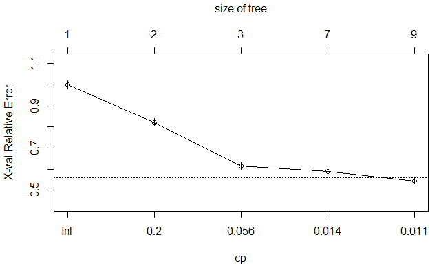
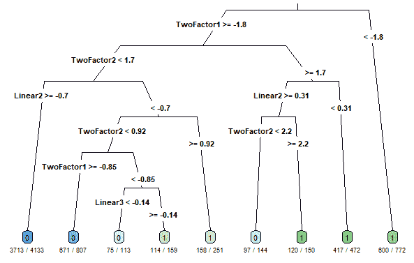
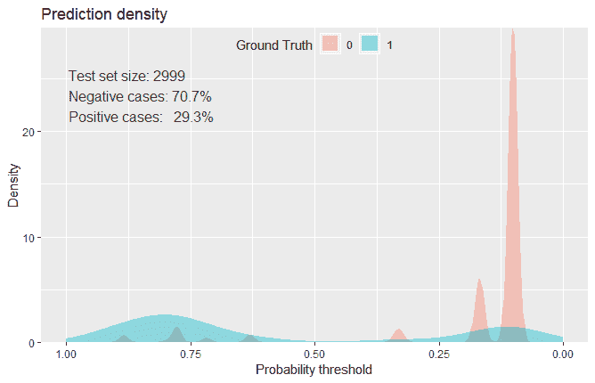
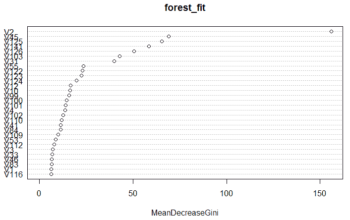
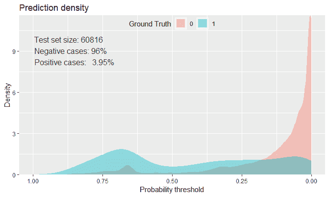
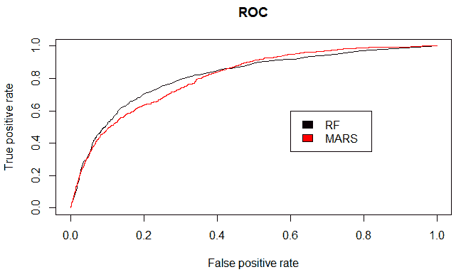
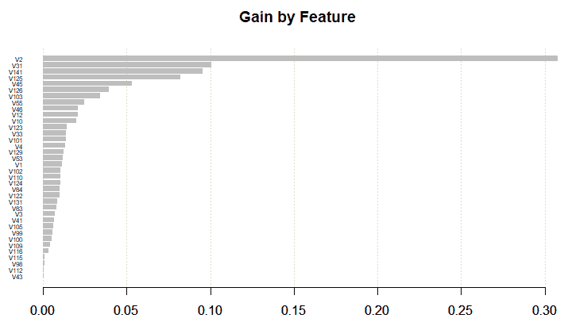

# 六、基于树的分类

最有可能是最好的分类器是随机森林(RF)版本，其中最好的(在 R 中实现并通过插入符号访问)达到 94.1%的最大准确性，在 84.3%的数据集中超过 90%

-Fern*ndez-Delgado 等人(2014 年)*

Fernández-Delgado 等人在*机器学习研究杂志*中的这段话旨在证明本章中的技术非常强大，尤其是在用于分类问题时。

在前面的章节中，我们研究了用于预测三个不同数据集的标签分类的技术。在这里，我们将应用基于树的方法，着眼于看看我们是否可以提高我们对在第三章、*逻辑回归*中使用的桑坦德数据以及在第四章、*线性模型中的高级特征选择*中使用的数据的预测能力。

讨论的第一项是基本的决策树，它易于构建和理解。然而，单一的决策树方法不太可能像你已经学习的其他方法那样执行，例如，**支持向量机** ( **支持向量机**，或者我们尚未学习的方法，如神经网络。因此，我们将讨论创建多个(有时是数百个)不同的树，将它们各自的结果结合起来，得到一个整体预测。

正如本章开头提到的论文所述，这些方法与本书中的任何技术一样好，甚至更好。这些方法被称为**随机森林**和**梯度提升树**。此外，我们将研究如何使用随机森林方法来帮助消除/选择特征。

以下是我们将在本章中涉及的主题:

*   技术概述
*   数据集和建模


# 技术概述

我们现在将对这些技术进行概述，包括分类树、随机森林和梯度推进。这将为它们的实际应用创造条件。


# 理解回归树

为了建立对基于树的方法的理解，从一个定量的结果开始，然后转移到它在分类问题中是如何工作的，这可能更容易。树的本质是对特性进行分区，从最能提高 RSS 的第一次分割开始。这些二进制分割一直持续到树的末端。每个后续的分割/分区不是在整个数据集上完成的，而是只在它所属的前一个分割部分上完成的。这个自顶向下的过程被称为**递归分区**。这也是一个**贪婪**的过程，这个术语你可能在阅读关于**机器学习** ( **ML** )方法时偶然发现。Greedy 意味着在该过程中的每次分割期间，该算法寻找 RSS 的最大减少，而不考虑它在后面的分区上的执行情况。结果是，你可能会得到一个不必要分支的完整的树，导致低偏差但高方差。为了控制这种影响，您需要在构建完整的树之后，将树适当地修剪到最佳大小。

该图展示了这种技术的实际应用:


具有三个分割点和四个终端节点的回归树，以及相应的节点平均值和观察次数

该数据是假设的，有 30 个观察值，一个范围从 1 到 10 的响应，以及两个范围从 0 到 10 的预测特征，分别命名为 **X1** 和 **X2** 。该树有三个分支，通向四个终端节点。每个 split 基本上都是一个`if...then`语句或者使用 R 语法`ifelse()`。第一个拆分是:如果 **X1** 小于 **3.5** ，那么响应被拆分成平均值为 **2.4** 的 4 个观测值和剩余的 26 个观测值。四个观测值的左分支是终端节点，因为任何进一步的分裂都不会显著改善 RSS。这四次观察的预测值是树的分区成为平均值。下一次拆分在 **X2 < 4** 处，最后在 **X1 < 7.5** 处。

这种方法的优点是它可以处理高度非线性的关系；然而，你能看到一些潜在的问题吗？第一个问题是给定一个观察值，该观察值落在其下的终端节点的平均值。这可能会损害整体预测性能(高偏差)。相反，如果您继续对数据进行越来越多的划分以达到较低的偏差，那么较高的方差可能会成为一个问题。与其他方法一样，您可以使用交叉验证来选择合适的树深度大小。


# 分类树

分类树的工作原理和回归树一样，只是分裂不是由 RSS 决定的，而是由错误率决定的。所使用的错误率不是您所期望的，因为计算只是错误分类的观察值除以总观察值。事实证明，当涉及到树分裂时，错误分类率本身可能会导致这样一种情况，即您可以通过进一步的分裂获得信息，但不能提高错误分类率。让我们看一个例子。

假设我们有一个节点，姑且称之为`N0`，其中有七个观察值标记为`No`，三个观察值标记为`Yes`。我们可以说误分类率是 30%。考虑到这一点，让我们计算一个常见的替代误差指标，称为**基尼指数**。单节点基尼指数的公式如下:


那么对于`N0`，基尼为*1-(. 7)²-(. 3)²*，等于 *0.42* ，相对于 30%的误分类率。

进一步看这个例子，我们现在将创建节点 *N1* ，它有来自`Class 1`的三个观察值，没有来自`Class 2`的观察值，还有 *N2* ，它有来自`Class 1`的四个观察值和来自`Class 2`的三个观察值。现在，这一分支的总体错误分类率仍然是 30%，但看看总体基尼指数是如何改善的:

*   *基尼(N1)= 1-(3/3)²-(0/3)²= 0*
*   *基尼(N2)= 1-(4/7)²-(3/7)²= 0.49*
*   *新基尼指数=(N1 占比 x 基尼(N1))+(N2 占比 x 基尼(N2))* ，等于 *(0.3 x 0) + (0.7 x 0.49)* 或 *0.343*

通过对代理错误率进行分割，我们实际上改善了我们的模型杂质，将其从 *0.42* 减少到 *0.343* ，而错误分类率没有变化。这是`rpart()`包使用的方法，我们将在本章中使用。


# 随机森林

为了大大提高我们的模型的预测能力，我们可以生成大量的树并组合结果。随机森林技术通过在模型开发中应用两种不同的技巧来做到这一点。第一种是使用**自举聚合**，或者被称为**打包**。

在 bagging 中，在数据集的随机样本上建立一棵单独的树，大约占总观察值的三分之二(注意，剩下的三分之一被称为**袋外** ( **oob** ))。这被重复几十或几百次，结果被平均。基于任何误差测量，这些树中的每一个都是生长的，而不是修剪的，这意味着这些单独的树中的每一个的方差都很高。但是，通过平均结果，您可以在不增加偏差的情况下减少方差。

随机森林带来的另一个好处是，在对数据进行随机采样(即装袋)的同时，它还会在每次分割时对输入要素进行随机采样。在`randomForest`包中，我们将使用采样的预测值的默认随机数，对于分类问题，它是总预测值的平方根，对于回归，它是预测值的总数除以 3。算法在每次分割时随机选择的预测值的数量可以通过模型调整过程来改变。

通过在每次分割时对要素进行随机采样并将其纳入方法中，您可以减轻高度相关的预测因子成为所有自举树的主要驱动因素的影响，从而阻止您减少希望通过装袋实现的方差。与仅执行打包相比，随后对彼此相关性较低的树进行平均，对于异常值来说更具概括性和鲁棒性。


# 梯度推进

学习和理解 Boosting 方法可能会变得非常复杂，但是您应该记住幕后发生的事情。主要思想是建立一个被称为基础学习器的初始模型(线性、样条、树等等)，检查残差，并基于这些残差围绕所谓的**损失函数**拟合一个模型。损失函数仅仅是测量模型和期望预测之间差异的函数，例如，回归的平方误差或分类的逻辑函数。该过程继续进行，直到达到某个指定的停止标准。这有点像一个学生参加模拟考试，100 道题中有 30 道答错了，结果，他只学习了这 30 道没答上的题。在接下来的模拟考试中，他们在 30 道题中答对了 10 道，因此只关注这 10 道题，以此类推。如果你想进一步探索这背后的理论，你可以在 http://www.ncbi.nlm.nih.gov/pmc/articles/PMC3885826/的*神经机器人学前沿*、*梯度推进机器教程*、Natekin A .、Knoll A. (2013)中找到很好的资源。

正如刚才提到的，boosting 可以应用于许多不同的基础学习器，但在这里，我们将只关注**基于树的学习**的细节。每个树迭代都很小，我们将使用一个称为交互深度的调整参数来确定有多小。事实上，它可能小到一个裂口，也就是所谓的残肢。

根据损失函数，树被顺序地拟合到残差，直到我们指定的树的数量(我们的停止标准)。

在使用`Xgboost`包的建模过程中，有许多参数需要调整，T0 代表**极端梯度增强**。这个软件包由于其出色的性能而在在线数据竞赛中非常受欢迎。以下网站上有关于提升树木和`Xgboost`的优秀背景材料:

[http://xgboost.readthedocs.io/en/latest/model.html](http://xgboost.readthedocs.io/en/latest/model.html)。

在实际例子中，我们将学习如何开始优化超参数并产生有意义的输出和预测。这些参数可以相互作用，如果你只是修补其中一个而不考虑另一个，你的模型可能会恶化性能。这个包将帮助我们进行调优工作。


# 数据集和建模

我们将使用两个先前的数据集，来自[第 4 章](f6a629ec-4e0d-43d2-a3db-89bd29bc955b.xhtml)、*线性模型中的高级功能选择*的模拟数据，以及来自[第 3 章](ce9ab446-e94c-44f2-a5dc-1ff2ff0e8d50.xhtml)、*逻辑回归*的客户满意度数据。我们将从在模拟数据上构建分类树开始。这将帮助我们理解基于树的方法的基本原理。然后，我们将把随机森林和增强树应用于客户满意度数据。这个练习将提供与以前的广义线性模型的一个很好的比较。最后，我想向大家展示一个有趣的使用随机森林的特征选择方法，使用模拟数据。有趣的是，我的意思是这是一种添加到您的特性选择库中的有价值的技术，但是我将指出几个警告，供您在实际应用中考虑。


# 分类树

这个练习将是对基于树的方法的很好的介绍。我建议将这种方法应用于任何监督学习方法，因为至少，你会更好地理解数据，并建立一个良好的预测性能基线。这也可能是你为你的商业伙伴解决问题所需要做的唯一一件事。我可以分享的一个例子是，营销团队让我尝试对外部供应商在近两年前完成的客户细分进行逆向工程。我们有原始调查数据和客户细分标签，但不了解这些数据是如何推动细分的。

嗯，我刚刚使用了本节中描述的方法，我们可以几乎 100%准确地预测一个片段。另外，正如您将看到的，这很容易解释为什么:

1.  如果需要，让我们安装软件包:

```py
library(magrittr)
install.packages("Boruta")
install.packages("caret")
install.packages("classifierplots")
install.packages("InformationValue")
install.packages("MLmetrics")
install.packages("randomForest")
install.packages("ROCR")
install.packages("rpart")
install.packages("rpart.plot")
install.packages("tidyverse")
install.packages("xgboost")
options(scipen=999)
```

2.  至于模拟数据，我在第四章、*线性模型中的高级特征选择*中讨论了我是如何创建的。你可以在 GitHub 上的这个链接找到:[https://GitHub . com/packt publishing/Advanced-Machine-Learning-with-R/blob/master/Data/sim _ df . CSV](https://github.com/PacktPublishing/Advanced-Machine-Learning-with-R/blob/master/Data/sim_df.csv)。
3.  我们现在将它加载到 R:

```py
> sim_df <- read.csv("~/sim_df.csv", stringsAsFactors = FALSE)
```

4.  我们将尝试和预测的响应称为`y`。它是一个数值，或者是`0`或者是`1`，其中`1`是感兴趣的结果。有点不平衡，大概有 30%的回答标为 1。让我们确认这一点，并将其转化为一个因子，这将告诉我们的树函数我们对分类感兴趣:

```py
 > table(sim_df$y)

   0    1 
7072 2928 

> sim_df$y <- as.factor(sim_df$y)
```

5.  使用与[第 4 章](f6a629ec-4e0d-43d2-a3db-89bd29bc955b.xhtml)、*线性模型中的高级特征选择*中相同的随机种子创建训练/测试分割:

```py
> set.seed(1066)

> index <- caret::createDataPartition(sim_df$y, p = 0.7, list = F)

> train <- sim_df[index, ]

> test <- sim_df[-index, ]
```

6.  为了创建我们的分类树，我们将使用`rpart()`函数，使用通用的公式语法:

```py
> tree_fit <- rpart::rpart(y ~ ., data = train)
```

7.  我想做的下一件事是看看我们的模型对象中的`cptable`:

```py
> tree_fit$cptable
          CP nsplit rel error    xerror       xstd
1 0.20878049      0 1.0000000 1.0000000 0.01857332
2 0.19609756      1 0.7912195 0.7595122 0.01697342
3 0.01585366      2 0.5951220 0.6029268 0.01556234
4 0.01219512      6 0.5297561 0.5775610 0.01530000
5 0.01000000      8 0.5053659 0.5395122 0.01488626
```

这是一个有趣的分析表格。标记为`CP`的第一列是成本复杂性参数。第二列`nsplit`是树中的分裂数。`rel error`栏代表相对误差。`xerror`和`xstd`都是基于十重交叉验证，`xerror`是交叉验证过程的平均误差，`xstd`是标准偏差。我们可以看到八次分割在`full`数据集和交叉验证上产生了最低的误差。

8.  您可以使用`plotcp()`进行检查:

```py
> rpart::plotcp(tree_fit)
```

上述操作的输出如下:



该图用相应的误差棒向我们展示了按树大小交叉验证的相对误差。图上的水平线是最低标准误差的上限。选择一个不同的树的大小，比如说 7，你可以创建一个你想要的 cp 的对象，并简单地通过在`prune()`函数中指定该对象来修剪树，或者你可以只给函数一个`cp`号。它将如下所示:

```py
> cp = tree_fit$cptable[4, 1]

> cp
[1] 0.01219512

> cp <- min(tree_fit$cptable[, 3]) 
# not run
# rpart::prune(tree_fit, cp = cp)
# Or
# rpart::prune(tree_fit, cp = 0.01219512)
```

您可以用多种不同的方式绘制和探索该树。我更喜欢`rpart.plot`包中的版本。以下网站上有一篇关于如何使用它的精彩短文:

[http://www.milbo.org/rpart-plot/prp.pdf](http://www.milbo.org/rpart-plot/prp.pdf)。

这是第一个，`type = 3`和`extra = 2`(更多选项见插图):

```py
> rpart.plot::rpart.plot(
    tree_fit,
    type = 3,
    extra = 2,
    branch = .75,
    under = TRUE
 )
```

上述命令的输出如下:



上图显示了每个分割处的特征以及与该分割相关的值。树中的第一个分裂是特征 TwoFactor1。如果该值小于-1.8，则这些观察结果将在终端节点中结束。在该版本的树中，该节点中有 772 个观察值(因为特征值小于-1.8，其中 600 个观察值标记为 1。所以，你可以说一个观察值为 1 的节点概率是 78% (600/772)。现在，如果该值等于或大于-1.8，则转到下一个要分割的要素，即两个因子 2，依此类推，直到所有观测值都在一个终点结点中。

如果您想要查看所有这些终端节点概率，只需对语法进行简单的修改:

```py
> rpart.plot::rpart.plot(
 tree_fit,
 type = 1,
 extra = 6,
 branch = .75,
 under = TRUE
 )
```

上述命令的输出如下:


这种不同的外观显示了每个终端节点中 1 的百分比，并补充了前面的绘图。如果您想查看节点的所有规则，可以运行以下命令:

```py
> rpart.plot::rpart.rules(tree_fit)
    y 
 0.10 when TwoFactor1 >= -1.75 & TwoFactor2 < 1.69 & Linear2 >= -0.70 
 0.17 when TwoFactor1 >= -0.85 & TwoFactor2 < 0.92 & Linear2 < -0.70 
 0.33 when TwoFactor1 >= -1.75 & TwoFactor2 is 1.69 to 2.20 & Linear2 >= 0.31 
 0.34 when TwoFactor1 is -1.75 to -0.85 & TwoFactor2 < 0.92 & Linear2 < -0.70 &  
           Linear3 < -0.14
 0.63 when TwoFactor1 >= -1.75 & TwoFactor2 is 0.92 to 1.69 & Linear2 < -0.70 
 0.72 when TwoFactor1 is -1.75 to -0.85 & TwoFactor2 < 0.92 & Linear2 < -0.70 & 
           Linear3 >= -0.14
 0.78 when TwoFactor1 < -1.75 
 0.80 when TwoFactor1 >= -1.75 & TwoFactor2 >= 2.20 & Linear2 >= 0.31 
 0.88 when TwoFactor1 >= -1.75 & TwoFactor2 >= 1.69 & Linear2 < 0.31
```

我们现在来看看这个简单的模型在测试集上的表现。您可能还记得，使用弹性网，我们的曲线下面积**(**AUC**)超过 0.87，对数损失为 0.37:**

```py
> rparty.test <- predict(tree_fit, newdata = test)

> rparty.test <- rparty.test[, 2]

> classifierplots::density_plot(test$y, rparty.test)
```

上述代码的输出如下:



注意密度的峰值。该图从这些终端节点捕捉概率。真正的考验将是我们最喜欢的两个指标，AUC 和对数损失:

```py
> ynum <- as.numeric(ifelse(test$y == "1", 1, 0))

> MLmetrics::AUC(rparty.test, ynum) 
[1] 0.8201691

> MLmetrics::LogLoss(rparty.test, ynum) 
[1] 0.4140015
```

好吧，性能不如使用弹性网之类的，但总的来说，我不相信这对这样一个简单的模型来说太差了，即使是营销中的人也能理解。当我们考虑使用随机森林进行特征选择时，我们将看到随机森林是否能超越弹性网络。我们的下一个任务是在分类问题中使用随机森林和增强树。


# 随机森林

顾客满意度数据包含在第三章、*逻辑回归*中。GitHub 链接到 CSV 和一个`RData`文件如下:

*   [https://github . com/packt publishing/Advanced-Machine-Learning-with-R/blob/master/Data/Santander _ prepd。RData](https://github.com/PacktPublishing/Advanced-Machine-Learning-with-R/blob/master/Data/santander_prepd.RData)
*   [https://github . com/packt publishing/Advanced-Machine-Learning-with-R/blob/master/Data/Santander _ prepd . CSV](https://github.com/PacktPublishing/Advanced-Machine-Learning-with-R/blob/master/Data/santander_prepd.csv)

我将向您展示如何加载`RData`文件:

```py
> santander <- readRDS("santander_prepd.RData")
```

数据具有不平衡的响应:

```py
> table(santander$y)

    0    1 
73012 3008 
```

我们将使用与第三章、*逻辑回归*中相同的随机种子来分割训练集和测试集:

```py
> set.seed(1966)

> trainIndex <- caret::createDataPartition(santander$y, p = 0.8, list = FALSE)

> train <- santander[trainIndex, ]

> test <- santander[-trainIndex, ]
```

通过这种分割，我们最终得到一个零方差特征，我们将找到并移除该特征:

```py
> train_zero <- caret::nearZeroVar(train, saveMetrics = TRUE)

> table(train_zero$zeroVar)

FALSE TRUE 
  142    1 

> train <- train[, train_zero$zeroVar == 'FALSE']
```

我喜欢把预测因素放在一个矩阵里，我们需要反应作为一个因素:

```py
> x <- as.matrix(train[, -142])

> y <- as.factor(train$y)
```

我们现在准备开始训练一个模型。回想一下，我们有一个高度不平衡的反应。在这种情况下，我强烈推荐的一件事是组织你的样本量。事实上，这实际上可以成为要调优的关键参数。在训练数据中，只有 2405 个 1 和 58411 个 0。我将展示一个在算法中对每个袋装样本强制采样的例子。同样，这将需要您进行一些尝试和错误，以确定多数类与少数类的*下采样*的正确比率。在下面的例子中，我对 1200 名少数民族和 3600 名多数民族进行了抽样调查。这是我的一些简单的尝试和错误，所以看看你是否能做得更好。这对你的预测概率的影响是使它们偏向少数类——换句话说，你有一个相对概率。这可能不是企业想要的，因此您可以应用一个修正来产生修正后的概率:


人口比例是少数民族的实际比例或估计比例，样本比例来自您的过采样。预测概率等于给定观测值的模型概率。

我在这里指定的另一件事是树的数量，对于初学者来说,`200`就足够了。在某些情况下，您可能需要一千个或更多:

```py
> set.seed(1999)

> forest_fit <- randomForest::randomForest(x = x, y = y,
    ntree = 200,
    sampsize = c(3600, 1200))
```

调用拟合对象会产生以下结果:

```py
> forest_fit

Call:
 randomForest(x = x, y = y, ntree = 200, sampsize = c(3600, 1200)) 
               Type of random forest: classification
                     Number of trees: 200
No. of variables tried at each split: 11

        OOB estimate of error rate: 9.51%
Confusion matrix:
      0    1 class.error
0 53946 4465  0.07644108
1  1321 1084  0.54927235
```

你可以注意到，开箱误差率低于 10%，这给了我们一个混淆矩阵。我的建议是不要太在意这个，只要把它记下来。我们将使用我们的相对概率来寻找最佳分割。此外，正如我们在其他章节中所讨论的，误差/准确性并不是判断一个模型的最佳指标。值得注意的一点是最小化误差的树的数量。这样，您可以限制树的数量，以避免过拟合:

```py
> which.min(forest_fit$err.rate[, 1])
[1] 105

> forest_fit$err.rate[105]
[1] 0.0934458
```

这样你就知道了:只需要 105 棵树来最小化误差，而不是 200 棵树。在这个模型中，我们使用了所有 142 个特征。这只是计算效率低，容易导致过拟合。

我将向您展示在一些减少功能的项目中对我非常有效的方法。在我们开始之前，这里是标准的特征重要性图:

```py
> randomForest::varImpPlot(forest_fit)
```

上述代码的输出如下:



特征重要性基于基尼系数的平均下降。我们可以看到，大约有十几个特征驱动着预测，而 V2 特征相当可疑。我在第三章、*逻辑回归*中谈到了臭名昭著的 V2 特征，所以我在这里不再赘述。

我将要展示的东西你可能会觉得有争议或者不科学。嗯，我不得不同意。然而，它是有效的。我所做的是找到特征重要性的描述性统计数据，并基于一些实验值或业务专业知识来决定在哪里过滤特征。最好在我们的示例中演示如何:

```py
> ff <- data.frame(unlist(forest_fit$importance))

> ff$var <- row.names(ff)

> summary(ff)
 MeanDecreaseGini             var 
 Min.    :  0.00000         Length:141 
 1st Qu. :  0.02172         Class :character 
 Median  :  0.36412          Mode :character 
 Mean    :  6.12824 
 3rd Qu. :  4.02137 
 Max.    :155.86878
```

在缺乏主题专业知识或其他情况下，我们可以基于第三个分位数以上的平均基尼系数下降来削减特征:

```py
> my_forest_vars <- dplyr::filter(ff, MeanDecreaseGini > 4.02)

> my_forest_vars <- my_forest_vars$var

> x_reduced <- x[, my_forest_vars]

> dim(x_reduced)
[1] 60816 36
```

这给了我们`36`输入特性。我们可以进一步减少，但我会让你试验不同的结果。现在，构建具有简化功能的新模型:

```py
> set.seed(567)

> forest_fit2 <- randomForest::randomForest(x = x_reduced, y = y,
    ntree = 110, 
    sampsize = c(3600, 1200))

> which.min(forest_fit2$err.rate[, 1]) 
[1] 98
```

首先检查它在训练数据上的表现:

```py
> rf_prob <- predict(forest_fit, type = "prob")

> y_prob <- rf_prob[, 2]

> classifierplots::density_plot(y, y_prob)
```

上述代码的输出如下:



现在，继续确定指标:

```py
> ynum <- as.numeric(ifelse(y == "1", 1, 0))

> MLmetrics::AUC(y_prob, ynum) 
[1] 0.8154905

> MLmetrics::LogLoss(y_prob, ynum) 
[1] 0.2652151
```

AUC 看起来和我们预期的差不多，但是 log-loss 更糟糕。为什么？啊，是的，我们的问题是相对概率。我们需要调整预测的概率，然后重新计算对数损失。我将把我之前讨论过的公式放入一个函数中，这样做很简单:

```py
> corrected_prob <- function(result, population_fraction, sample_fraction){
    value <- 1/(1+(1/population_fraction-1) / (1/sample_fraction-1)*(1/result-1))
    return(value)
}
```

然后，我们将该函数应用于预测结果:

```py
> yprob_corrected <- corrected_prob(result = y_prob,
    population_fraction = 0.04,
    sample_fraction = .33
```

我们可以看到 AUC 没有变化，但对数损失有所改善:

```py
> MLmetrics::AUC(yprob_corrected, ynum) 
[1] 0.8154905

> MLmetrics::LogLoss(yprob_corrected, ynum)
[1] 0.188308
```

其实现在更符合我们在 [第三章](ce9ab446-e94c-44f2-a5dc-1ff2ff0e8d50.xhtml)*逻辑回归*中看到的。值得探索的是，它是否可以接近我们在测试集上使用 MARS 模型获得的 0.14 log-loss 和 0.81 AUC 值:

```py
> rf_test <- predict(forest_fit, type = "prob", newdata = test)

> rf_test <- rf_test[, 2]

> ytest <- as.numeric(ifelse(test$y == "1", 1, 0))

> MLmetrics::AUC(rf_test, ytest) 
[1] 0.8149009
```

AUC 做得很好！修正这些概率，得到对数损失:

```py
> rftest_corrected <- corrected_probability(result = rf_test,
    population_fraction = 0.04,
    sample_fraction = 0.33)

> MLmetrics::LogLoss(rftest_corrected, ytest) 
[1] 0.1787402 
```

我们实际上改进了日志损失与训练数据的对比，但是没有赢得与 MARS 的战斗。怎么办？好了，接下来我们要给 **XGboost** 一个尝试。我们可以回过头来调整树的数量、过采样分数或每棵树采样的特征数量，甚至可以说，在这个数据集上，MARS 完成了它的工作。根据我的经验，在不平衡的标签下，兰登森林会胜过火星。

然而，这个案例确实展示了 MARS 作为你的基线模型的力量。让我们进一步深入研究，绘制随机森林与火星的 AUC 曲线。请注意，这最后一步要求您已经执行了第三章、*逻辑回归*中的代码。如果您尚未保存结果，请返回并运行 MARS 示例，然后继续以下操作:

```py
pred.rf <- ROCR::prediction(rftest_corrected, test$y)

perf.rf <- ROCR::performance(pred.rf, "tpr", "fpr") 

ROCR::plot(perf.rf, main = "ROC", col = 1) 

pred.earth <- ROCR::prediction(test_pred, test$y)

perf.earth <- ROCR::performance(pred.earth, "tpr", "fpr") 

ROCR::plot(perf.earth, col = 2, add = TRUE) 
legend(0.6, 0.6, c("RF", "MARS"), 1:2)
```

上述代码的输出如下:



这很能说明问题。这里，我们看到非常不同的曲线，其中 AUC 值几乎相同。事实上，从 0.4 到 0.8 的真实阳性率来看，随机森林优于火星。这里的关键是模型性能值本身不足以指导模型选择。

虽然随机森林再次证明了自己是一个强大的分类工具，但让我们看看梯度推进树的表现如何。


# 极端梯度提升–分类

如前所述，我们将在本节中使用`xgboost`包。鉴于该方法的良好声誉，让我们在`santander`数据上尝试一下。

如增强概述中所述，您可以调整许多参数:

*   `nrounds`:这是最大迭代次数(最终模型中的树数)。
*   `colsample_bytree`:这是构建树时要采样的特征数量，以比率表示。默认值为 1 (100%的特征)。
*   这是被提升的树的最小重量。默认值为 1。
*   `eta`:这是学习率，是每棵树对解的贡献。默认值为 0.3。
*   `gamma`:这是在树中创建另一个叶分区所需的最小损失减少量。
*   `subsample`:这是数据观测值的比值。默认值为 1 (100%)。
*   这是单棵树的最大深度。

使用`expand.grid()`函数，我们将构建我们的实验网格来运行`caret`包的训练过程。如果没有为前面的所有参数指定值，即使这只是默认值，在执行函数时也会收到一条错误消息。下面的值是基于我以前做过的多次训练迭代。我鼓励您尝试自己的调优值。

从计算角度来说，这种调整可能是一项艰巨的任务。对于我们的例子，我们将只关注调整`eta`和`gamma`。让我们按如下方式构建网格:

```py
> grid = expand.grid(
    nrounds = 100,
    colsample_bytree = 1,
    min_child_weight = 1,
    eta = c(0.1, 0.3, 0.5), #0.3 is default,
    gamma = c(0.25, 0.5),
    subsample = 1,
    max_depth = c(3)
 )
```

这创建了一个由六个不同模型组成的网格，`caret`包将运行这个网格来确定最佳的调优参数。需要注意的是。对于我们将要处理的规模的数据集，这个过程只需要几分钟。但是，在大型数据集或每个参数有更多值的情况下，这可能需要几个小时。因此，您必须运用自己的判断，并尽可能用较小的数据样本进行实验，以便确定调优参数，以防时间紧迫或者受到硬盘大小的限制。

在使用`caret`包中的`train()`函数之前，我想通过创建一个名为`control`的对象来指定`trainControl`参数。这个对象将存储我们想要的方法，以便训练调优参数。我们将使用`5`折叠交叉验证，如下所示:

```py
> cntrl = caret::trainControl(
+ method = "cv",
+ number = 5,
+ verboseIter = TRUE,
+ returnData = FALSE,
+ returnResamp = "final"
+ )
```

要利用`train.xgb()`函数，只需像我们对其他模型所做的那样指定公式:`train`数据集输入值、标签、方法、列车控制、度量和实验网格。记得设置随机种子:

```py
> set.seed(123)

> train.xgb = caret::train(
    x = x_reduced,
    y = y,
    trControl = cntrl,
    tuneGrid = grid,
    method = "xgbTree",
    metric = "Kappa"
 )
```

因为在`trControl`中，我将`verboseIter`设置为`TRUE`，所以您应该已经看到了每个 k-fold 中的每个训练迭代。

调用该对象为我们提供了最佳参数和每个参数设置的结果，如下所示(为简单起见，这是缩写):

```py
> train.xgb
eXtreme Gradient Boosting 
No pre-processing
Resampling: Cross-Validated (5 fold) 
Summary of sample sizes: 48653, 48653, 48653, 48652, 48653 
Resampling results across tuning parameters:

  eta gamma  Accuracy       Kappa 
  0.1  0.25 0.9604545 0.001525813
  0.1  0.50 0.9604709 0.002323003
  0.3  0.25 0.9604216 0.014214973
  0.3  0.50 0.9604052 0.014215605
  0.5  0.25 0.9600434 0.015513354
  0.5  0.50 0.9599776 0.013964451

Tuning parameter 'nrounds' was held constant at a value of 100
 1
Tuning parameter 'min_child_weight' was held constant at a value of
 1
Tuning parameter 'subsample' was held constant at a value of 1
Kappa was used to select the optimal model using the largest value.
The final values used for the model were nrounds = 100, max_depth = 3, eta
 = 0.5, gamma = 0.25, colsample_bytree = 1, min_child_weight = 1
 and subsample = 1.
```

最好的结果是用`eta` = `0.5`，和`gamma` = `0.25`。现在变得有点棘手，但这是我所看到的最佳实践。首先，创建一个将由`xgboost`训练功能`xgb.train()`使用的参数列表。然后，将数据帧转换为输入要素矩阵和带标签的数字结果(0 和 1)列表。然后，将特征和标签转换成所需的输入，如`xgb.Dmatrix`。试试这个:

```py
> param <- list( objective = "binary:logistic",
    booster = "gbtree",
    eval_metric = "error",
    eta = 0.5,
    max_depth = 3,
    subsample = 1,
    colsample_bytree = 1,
    gamma = 0.25
 )
> train.mat <- xgboost::xgb.DMatrix(data = x_reduced, label = ynum)
```

做好所有准备后，只需创建模型:

```py
> set.seed(1232)

> xgb.fit <- xgboost::xgb.train(params = param, data = train.mat, nrounds =
    100)
```

在看到它在测试集上的表现之前，让我们检查一下变量的重要性并绘制它。可以考察三项:**增益**、**覆盖**、**频率**。 **Gain** 是这个特性给它所在的分支带来的准确性的提高。 **Cover** 是与该特性相关的总观察值的相对数量。**频率**是该特征在所有树中出现的次数百分比。以下代码产生所需的输出:

```py
> impMatrix <- xgboost::xgb.importance(feature_names = dimnames(x)[[2]],
    model = xgb.fit)

> xgboost::xgb.plot.importance(impMatrix, main = "Gain by Feature")
```

上述命令的输出如下:



与随机森林相比，功能的重要性如何？V2 的特色仍然是最重要的，前十名大致相同。请注意，它在训练数据上表现非常好:

```py
> pred <- predict(xgb.fit, x_reduced)

> MLmetrics::AUC(pred, y) #.88
[1] 0.8839242

> MLmetrics::LogLoss(pred, ynum) #.12
[1] 0.1209341
```

印象深刻？下面是我们如何在测试集上看到它的表现，像训练数据一样，它必须在一个矩阵中:

```py
> test_xgb <- as.matrix(test)

> test_xgb <- test_xgb[, my_forest_vars]

> xgb_test_matrix <- xgboost::xgb.DMatrix(data = test_xgb, label = ytest)

> xgb_pred <- predict(xgb.fit, xgb_test_matrix)

> Metrics::auc(ytest, xgb_pred) #.83
[1] 0.8282241

> MLmetrics::LogLoss(xgb_pred, ytest) #.138
[1] 0.1380904
```

这里发生的情况是，模型在训练数据上具有最低的偏差，但是在测试数据上性能下降。即便如此，它仍然具有最高的 AUC 和最低的 log-loss。就像我们对 random forest 所做的一样，让我们比较添加了`xgboost`的 ROC 图:

```py
> ROCR::plot(perf.rf, main = "ROC", col = "black")

> ROCR::plot(perf.earth, col = "red", add = TRUE)

> pred.xgb <- ROCR::prediction(xgb_pred, test$y)

> perf.xgb <- ROCR::performance(pred.xgb, "tpr", "fpr")

> ROCR::plot(perf.xgb, col = "green", add = TRUE)

> legend(x = .75, y = .5, 
    legend = c("RF", "MARS", "XGB"), 
    fil = c("black", "red", "green"),
    col = c(1,2,3))
```

前面代码的输出如下:


`xgboost`模型在性能上结合了 random forest 和 MARS 的优点。所有这些将最小化超参数的调整。这清楚地显示了这种方法的威力以及它如此受欢迎的原因。

在我们结束这一章之前，我想介绍使用随机森林技术的强大的特征消除方法。


# 随机森林的特征选择

到目前为止，我们已经研究了几种特征选择技术，比如正则化、逐步和递归特征消除。我现在想介绍一种有效的特征选择方法，用于使用`Boruta`包的随机森林分类问题。有一篇论文提供了它如何提供所有相关功能的详细信息: *Kursa M .，Rudnicki W. (2010)，使用 Boruta 软件包进行功能选择，统计软件杂志，36(11)，1 - 13。*

我在这里要做的是提供算法的概述，然后将其应用于模拟数据集。我发现它在消除不重要的特征方面非常有效，但建议它可能是计算密集型的。然而，这通常是值得花的时间。

在高层次上，该算法通过复制所有输入值并打乱它们的观察顺序以消除它们的相关性，来创建**阴影** **属性**。然后，基于所有输入值和每个要素(包括阴影要素)的平均精度损失的 Z 值构建随机森林模型。Z 值显著高于或显著低于阴影属性的特征分别被视为**重要**和**不重要**。阴影属性和那些具有已知重要性的特征被移除，并且该过程重复进行，直到所有特征都被分配了重要性值。您还可以指定随机林迭代的最大次数。算法完成后，每个原始特征将被标记为**确认**、**暂定**或**拒绝**。您必须决定是否包含进一步建模的试验性特征。根据您的情况，您有一些选择:

*   更改随机种子并多次重新运行该方法( *k* )，并仅选择那些在所有 *k* 运行中被确认的特征
*   将你的数据(训练数据)分成 *k* 个折叠，在每个折叠上运行单独的迭代，并选择那些为所有 *k* 个折叠确认的特征

请注意，所有这些都可以通过几行代码来完成。首先，再次加载模拟数据`sim_df`。我们将像以前一样创建训练集和测试集:

```py
> sim_df$y <- as.factor(sim_df$y)

> set.seed(1066)

> index <- caret::createDataPartition(sim_df$y, p = 0.7, list = F)

> train <- sim_df[index, ]

> test <- sim_df[-index, ]
```

要运行算法，只需要调用`Boruta`包，在`boruta()`函数中创建一个公式。请记住，标签必须是一个因素，否则算法将不起作用。如果你想跟踪算法的进程，指定`doTrace = 1`。但是，我会忘记下面的选项。另外，不要忘记设置随机种子:

```py
> set.seed(5150)

> rf_fs <- Boruta::Boruta(y ~ ., data = train)
```

如上所述，这可能是计算密集型的。下面是我的老式笔记本电脑用了多长时间:

```py
> rf_fs$timeTaken #2.84 minutes workstation, 28.22
Time difference of 22.15982 mins
```

我在一个高性能的工作站上运行了同样的东西，两分钟就完成了。

一个简单的表格将提供最终重要性决策的计数。我们看到该算法拒绝了 5 个特征并选择了 11 个:

```py
> table(rf_fs$finalDecision)

Tentative Confirmed Rejected 
        0        11        5 
```

使用这些结果，很容易用我们选择的特征创建一个新的数据框架。我们开始使用`getSelectedAttributes()`函数来捕获特性名称。在这个例子中，让我们只选择那些被确认的。如果我们想包括确认的和暂定的，我们只需在函数中指定`withTentative = TRUE`:

```py
> fnames <- Boruta::getSelectedAttributes(rf_fs) #withTentative = TRUE

> fnames
 [1] "TwoFactor1" "TwoFactor2" "Linear2"    "Linear3"    "Linear4" "Linear5" 
 [7] "Linear6"    "Nonlinear1" "Nonlinear2" "Nonlinear3" "random1"  
```

使用特征名称，我们创建我们的数据子集:

```py
> boruta_train <- train[, colnames(train) %in% fnames]

> boruta_train$y <- train$y
```

现在，我们将使用所选功能构建一个随机森林算法，看看它的表现如何:

```py
> boruta_fit <- randomForest::randomForest(y ~ ., data = train)

> boruta_pred <- predict(boruta_fit, type = "prob", newdata = test)

> boruta_pred <- boruta_pred[, 2]

> ytest <- as.numeric(ifelse(test$y == "1", 1, 0))

> MLmetrics::AUC(boruta_pred, ytest) 
[1] 0.9604841

> MLmetrics::LogLoss(boruta_pred, ytest) 
[1] 0.2704204
```

与第四章、*线性模型中的高级特征选择*的结果相比，这是一个令人印象深刻的表现。我认为这个例子很好地验证了这种技术。去获得一些计算能力，并开始使用它！


# 摘要

在这一章中，你学习了基于树的学习方法对于分类问题的能力。单一的树，虽然很容易建立和解释，但对于我们试图解决的许多问题，可能没有必要的预测能力。为了提高预测能力，我们有随机森林和梯度增强树工具供我们使用。使用随机森林，可以构建数百甚至数千棵树，并汇总结果以进行整体预测。随机森林的每棵树都是使用称为自举的数据样本以及预测变量样本构建的。对于梯度提升，产生初始的相对较小的树。在构建了初始树之后，基于残差/错误分类产生后续树。这种技术的预期结果是建立一系列的树，这些树可以在过程中改进先前树的弱点，从而减少偏差和方差。我们还看到，在 R 中，我们可以利用随机森林作为一种有效的特征选择/缩减方法。

虽然这些方法非常强大，但它们并不是机器学习领域的某种灵丹妙药。不同的数据集要求分析员判断哪些技术是适用的。应用于分析的技术和调谐参数的选择同样重要。这种微调可以决定一个好的预测模型和一个好的预测模型之间的差别。

在下一章中，我们将把注意力转向使用 R 来构建神经网络和深度学习模型。**