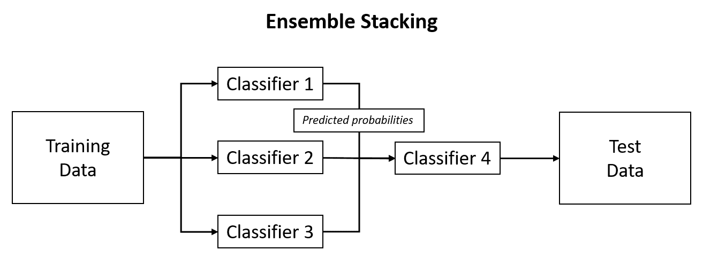

# 八、创建集成和多类方法

"这就是你赢得 ML 竞赛的方法:你拿走别人的作品并把它们组合在一起."

-维塔利·库兹涅佐夫，NIPS2014

你可能已经意识到我们已经讨论过集成学习了。在[www.scholarpedia.org](http://www.scholarpedia.org/article/Main_Page)上，它被定义为*多个模型(如分类器或专家)被战略性地生成和组合以解决特定计算智能问题的过程*。在随机森林和梯度推进中，我们结合数百或数千棵树的*投票*来进行预测。因此，根据定义，这些模型是一个整体。这种方法可以扩展到任何学习器，以创建集成，有些人称为元集成或元学习器。我们将看看这些方法中的一种，称为**堆栈**。在这种方法中，我们将产生许多分类器，并使用它们的预测分类概率作为另一个分类器的输入特征。这种方法*可以*提高预测精度。在前面的章节中，我们关注于二进制结果的分类问题。我们现在来看看预测数据包含两个以上结果(多类)的情况的方法，这是现实世界数据集中非常常见的情况。

以下是本章将涉及的主题:

*   全体
*   数据理解
*   建模和评估


# 全体

本章开头的引文提到了使用集成来赢得机器学习竞赛。然而，它们确实有实际应用。我已经提供了什么是集成建模的定义，但是它为什么工作？为了证明这一点，我从下面的博客中选取了一个例子，它深入研究了许多集成方法:[http://mlwave.com/kaggle-ensembling-guide/](http://mlwave.com/kaggle-ensembling-guide/)。

当我写下这一章时，我们距离 2018 年大学橄榄球冠军赛只有一天的时间了——克莱姆森老虎队对阵阿拉巴马州绯红潮队。比方说，我们想回顾一下我们赢得一场友好赌局的概率，我们想接受潮流减去点数(在撰写本文时为 5.5 点)。

假设我们一直在跟踪三位预测专家，他们说，*所有人都有相同的概率预测爱国者将覆盖价差(60%)* 。现在，如果我们偏向任何一个所谓的专家，很明显我们有 60%的胜算。然而，让我们看看创建一个他们的预测集成能做些什么来增加我们获利和羞辱朋友和家人的机会。

首先计算专家选择阿拉巴马州的每个可能结果的概率，让我们假设概率都是 60%。如果这三个人都选择阿拉巴马，我们有 0.6 x 0.6 x 0.6 的机会(T1)或 21.6%的机会(T3)三个人都是正确的。

如果三人中的任何两个选择阿拉巴马，那么我们就有 *(0.6 x 0.6 x 0.3) x 3* 总共 *43.2%* 。

通过使用多数投票，如果三人中至少有两人选择阿拉巴马，那么我们的获胜概率几乎变成了 *65%* *(21.6 + 43.2)* ，这是对 *5%* 的绝对提升。

这是一个相当简单的例子，但仍然具有代表性。在机器学习中，它可以通过合并几个 OK 甚至弱学习器的预测来提高整体准确性。下图显示了如何实现这一点:



在此图中，我们构建了三个不同的分类器，并使用它们的预测概率作为第四个不同分类器的输入值，以便对测试数据进行预测。让我们看看如何用 r 来应用这个。


# 数据理解

这里要分析的数据集是从`mlbench`中拉出的`DNA`。你不必安装这个包，因为我已经把它放在一个 CSV 文件中，并放在 GitHub 上:[https://GitHub . com/packt publishing/Advanced-Machine-Learning-with-R/blob/master/Data/DNA . CSV](https://github.com/PacktPublishing/Advanced-Machine-Learning-with-R/blob/master/Data/dna.csv)。

根据需要安装软件包并加载数据:

```py
> library(magrittr)

> install.packages("earth")

> install.packages("glmnet")

> install.packages("mlr")

> install.packages("randomForest")

> install.packages("tidyverse")

dna <- read.csv("dna.csv")
```

数据由 3181 个观察值、180 个编码为二进制指示器的输入特征和`Class`响应组成。响应是一个因子，有三个标签表示 DNA 类型，或者是`ei`、`ie`，或者都不是，编码为`n`。以下是目标标签的表格:

```py
> table(dna$Class)

  ei  ie    n 
 767 765 1654 
```

这些数据应该可以进行分析了，但是让我们运行一些快速检查来验证，从缺失的值开始:

```py
> na_count <-
    sapply(dna, function(y)
    sum(length(which(is.na(
    y
 )))))

> table(na_count)
na_count
  0 
181 
```

由于没有缺失值，我们检查零方差特征:

```py
> feature_variance <- caret::nearZeroVar(dna[, -181], saveMetrics = TRUE)

> table(feature_variance$zeroVar)

FALSE 
  180 
```

`mlbench`的作者对这些数据所做的事情之一是将核苷酸因子特征(A，C，G，T)转换成指示特征。他们还通过 V180 取消了这些特征的识别，将它们命名为 V1。

因此，让我们检查特性相关性:

```py
> high_corr <- caret::findCorrelation(dna[, -181], cutoff = 0.9)

> length(high_corr)
[1] 173
```

这是一个高度相关的数据集。我们可以像前几章那样运行我们的特征选择方法，但是让我们继续使用所有的特征，看看会发生什么。

在此之前，让我们创建训练集和测试集:

```py
> set.seed(555)

> index <- caret::createDataPartition(y = dna$Class, p = 0.8, list = FALSE)

> train <- dna[index, ]

> test <- dna[-index, ]
```

这为我们创造了 80/20 的分裂，我们可以继续构建算法。


# 建模和评估

我们将探索使用`mlr`包，它代表 r 中的机器学习。该包支持多个类和集成方法。如果你熟悉 Python 的`sci-kit learn`，我们可以说`mlr`努力为 r 提供相同的功能。我打算演示如何在一个多类问题上使用这个包，然后通过演示如何对相同的数据进行集成来结束，这样我们就可以比较性能。

对于多类问题，我们将看看如何调优随机森林，然后研究如何使用随机森林结合 MARS 构建一个集成，通过调用`glmnet`包中的广义线性模型函数来堆叠这些模型。


# 随机森林模型

在多类问题中有许多学习的方法。随机森林和判别分析等技术将处理多类，而一些技术和/或包不会处理多类，例如，base R 中的广义线性模型`glm()`。内置于`mlr`中的功能允许您运行多种技术进行监督和非监督学习。然而，在你第一次使用它的时候，利用它的力量可能会有点混乱。如果你遵循下面列出的过程，你将会在开发强大的学习管道的道路上走得很好。我们将在本演示中使用随机森林。

我们已经创建了训练和测试集，你可以在`mlr`中完成，但是我仍然更喜欢我们已经使用`caret`包完成的技术。关于`mlr`包的一个独特的事情是，你必须把你的训练数据放到一个任务结构中，具体地说，在这个问题中，是一个分类任务。或者，您也可以将您的测试集放在一个任务中。您可以指定包含标签的数据集和目标:

```py
> dna_task <- mlr::makeClassifTask(data = train, target = "Class")
```

在你的分析中有很多方法可以使用`mlr`，但是我推荐创建一个重采样对象。

在下面的代码块中，我们创建了一个重采样对象来帮助我们调整由五个子样本组成的随机森林的树的数量。请记住，您在重采样方法中也有类似的灵活性，就像使用交叉验证和重复交叉验证等技术的`caret`包一样:

```py
> rdesc <- mlr::makeResampleDesc("Subsample", iters = 5)
```

下一个对象用设置为`50`的最小数量的树和设置为`200`的最大数量的树建立树的网格。你也可以建立多个参数，就像我们对`caret`包所做的那样。您可以通过`makeParamSet`调用功能帮助来浏览您的选项:

```py
> param <-
+ ParamHelpers::makeParamSet(ParamHelpers::makeDiscreteParam("ntree", values = c(50, 75, 100, 150, 175, 200)))
```

接下来，创建一个控件对象，建立一个数字网格:

```py
> ctrl <- makeTuneControlGrid()
```

创建了初步的对象后，我们现在可以按照网格调整超参数，以获得随机森林中的最佳树数。注意，我们指定了`classif.randomForest`。前面关于`mlr`的可用模型的链接给了我们所有你想要的方法的正确语法。我们应该做的一件事是将`mlr`库引入到环境中，这样我们就可以使用该语法。我们还使用我们刚刚创建的对象:

```py
> library(mlr)

> tuning <-
   mlr::tuneParams(
     "classif.randomForest",
     task = dna_task,
     resampling = rdesc,
     par.set = param,
     control = ctrl)
```

一旦算法完成迭代，您就可以调用最佳树数和相关的样本外误差:

```py
> tuning$x
$`ntree`
[1] 175

> tuning$y
mmce.test.mean 
    0.04635294 
```

根据我们的实验网格，最佳的树数是`175`，平均误分类误差为`0.046`个百分点。现在，设置这个参数作为`makeLearner()`函数的包装就很简单了。请注意，我将预测类型设置为`"prob"`，因为默认值是预测类，而不是概率:

```py
> rf <-
    mlr::setHyperPars(mlr::makeLearner("classif.randomForest", predict.type = "prob"),
    par.vals = tuning$x)
```

现在，我们仅用`175`棵树再次训练模型:

```py
> fit_rf <- mlr::train(rf, dna_task)
```

你可以在列车数据上看到混乱矩阵:

```py
> fit_rf$learner.model

        OOB estimate of error rate: 5.14%
Confusion matrix:
    ei  ie    n class.error
ei 563  26   25 0.08306189
ie  16 575   21 0.06045752
n   10  33 1281 0.03247734
```

这比我预期的要好，超出了 5%的误差。此外，对于一个失衡的类来说，没有错误。此外，它在测试数据上表现得相当好:

```py
> mlr::calculateConfusionMatrix(pred)
        predicted
true     ei  ie   n -err.-
  ei    139   4  10     14
  ie      3 147   3      6
  n       2   3 325      5
  -err.-  5   7  13     25 
```

该软件包有一整套可用的指标。在这里，我列出了测试精度和对数损耗:

```py
> mlr::performance(pred, measures = list(acc, logloss))
      acc   logloss 
0.9606918 0.2863458 
```

它在测试集上有令人印象深刻的 96%的准确率和基线 log-loss`0.286`。这将引导我们进入下一步，我们将看到通过组合随机森林和火星的预测来创建集成是否可以提高性能。


# 创建合奏

再次使用`mlr`的功能，我们首先需要用我们的基础学习器创建一个对象。这又是一个`classif.randomForest`，对于火星模型，我们用`classif.earth`来称呼`earth`包:

```py
> base <- c("classif.randomForest", "classif.earth")
```

现在，您使用这些基本学习器创建一个学习器，然后指定您希望这些学习器的输出作为预测概率:

```py
> learns <- lapply(base, makeLearner)

> learns <- lapply(learns, setPredictType, "prob")
```

构建基础学习对象的过程已经完成。我之前说过，集成学习算法将是来自`glmnet`的`GLM`。对于两个基础学习器来说，推车可能更合适，但是让我们来演示一下什么是可能的。堆叠有多种方法。在下面的代码块中，我使用了交叉验证:

```py
> sl <-
    mlr::makeStackedLearner(
    base.learners = learns,
    super.learner = "classif.glmnet",
    predict.type = "prob",
    method = "stack.cv"
 )
```

现在，当我们训练我们的堆叠模型时，它变得令人兴奋:

```py
stacked_fit <- mlr::train(sl, dna_task)
```

我们建立了测试数据的预测概率:

```py
> pred_stacked <- predict(stacked_fit, newdata = test)
```

只是为了检查一下，让我们看看混淆矩阵:

```py
> mlr::calculateConfusionMatrix(pred_stacked)
        predicted
true      ei  ie   n -err.-
  ei     144   4   5      9
  ie       5 146   2      7
   n       2   1 327      3
  -err.-   7   5   7     19
```

堆叠模型产生的分类错误少了六个。证据就在指标中:

```py
> mlr::performance(pred_stacked, measures = list(acc, logloss))
      acc   logloss 
0.9701258 0.1101400
```

当然，精度更好，但更好的是对数损失大大改善。

我们学到了什么？主要使用一个包，`mlr`，我们用随机森林建立了一个很好的模型，但是通过堆叠随机森林和火星，我们提高了性能。尽管所有这些只有几行代码，但是理解如何创建和实现管道是很重要的。


# 摘要

在这一章中，我们看了非常重要的机器学习方法，通过在框架中堆叠来创建集成模型。在堆叠中，我们使用基本模型(学习器)来创建预测概率，这些概率用于另一个模型(超级学习器)的输入特征，以进行最终预测。事实上，堆叠方法显示了对单个基础模型的改进。我们使用`mlr`(机器学习)来执行所有这些，这对任何 R 机器学习实践者来说都是一个强大的工具。

接下来，我们将深入无监督学习的世界，在这里我们不试图预测标签或定量结果，而是理解观察或特征中的模式。