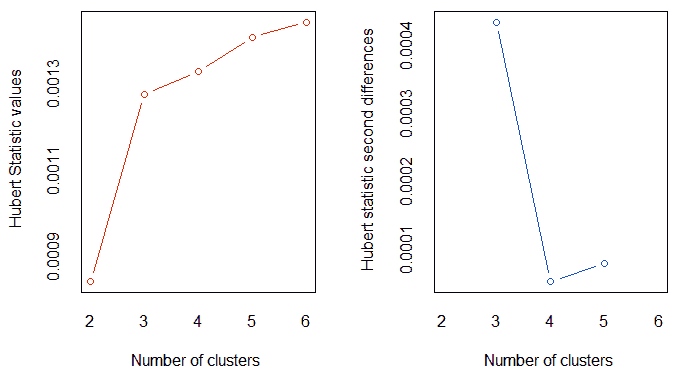
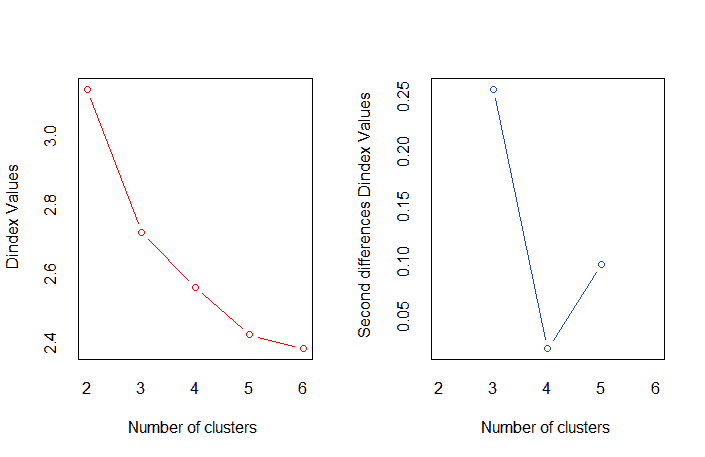
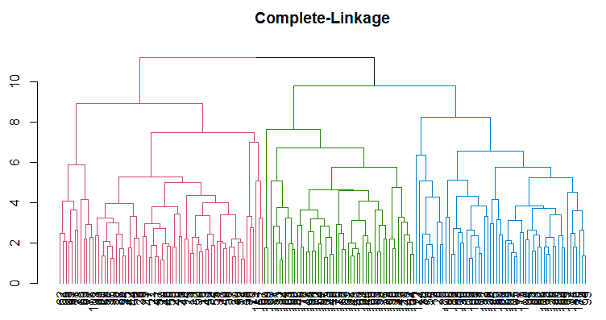
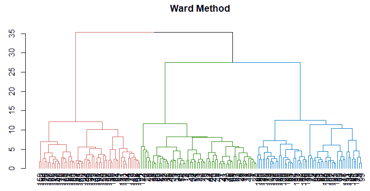
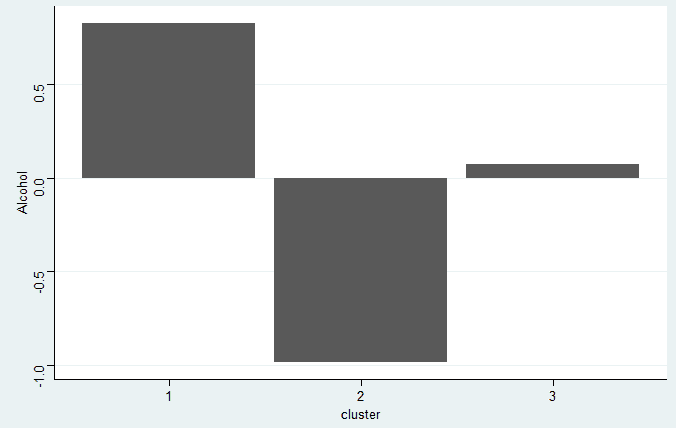
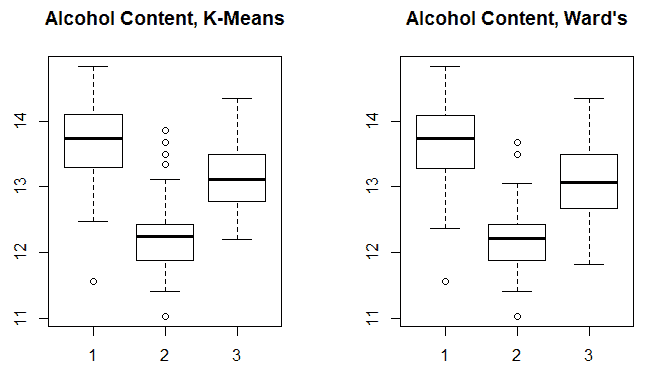

# 九、聚类分析

“快给我拿一大杯酒来，我好润润脑子，说些聪明的话。”

——阿里斯托芬，雅典剧作家

在前面的章节中，我们着重于尝试学习最佳算法来解决一个结果或响应，例如，客户满意度或房价。在所有这些情况下，我们有 *y，*并且 *y* 是 *x，*或 *y = f(x)* 的函数。在我们的数据中，我们有实际的 *y* 值，我们可以相应地训练 *x* 。这被称为**监督学习**。然而，在许多情况下，我们试图从我们的数据中学习一些东西，或者我们没有 *y，*或者我们实际上选择忽略它。如果是这样，我们就进入了**无监督学习**的世界。在这个世界里，我们构建和选择我们的算法是基于它如何很好地满足我们的业务需求，以及它有多准确。

为什么我们要在没有监督的情况下学习呢？首先，无监督学习可以帮助你理解和识别数据中的模式，这些模式可能是有价值的。第二，你可以用它来转换你的数据，以提高你的监督学习技术。

本章将集中讨论前者，下一章将讨论后者。

所以，让我们从一个流行且强大的技术开始，这个技术叫做**聚类分析**。使用聚类分析的目的是将观察结果分成若干组(k 组)，其中组内的成员尽可能相似，而组间的成员尽可能不同。有很多例子可以说明这是如何帮助一个组织的；以下是几个例子:

*   创建客户类型或细分市场
*   地理中高犯罪率区域的检测
*   图像和面部识别
*   基因测序和转录
*   石油和地质勘探

聚类分析有很多用途，但也有很多技术。我们将重点介绍两种最常见的:**等级式**和 **k-means** 。它们都是有效的聚类方法，但并不总是适用于您可能需要分析的大量不同的数据集。因此，我们还将使用一个基于**高尔的**度量相异矩阵作为输入，来检查围绕 medoids ( **PAM** )的**划分。最后，我们将检查我最近学习和应用的一种新方法，使用**随机森林**来转换您的数据。然后，转换后的数据可以用作无监督学习的输入。**

继续之前的最后一个评论:你可能会被问到这些技术是否更像艺术而不是科学，因为学习是无人监督的。我认为明确的答案是，*这取决于*。2016 年初，我在印第安纳州印第安纳波利斯 R-User Group 的一次会议上介绍了这些方法。对于一个人来说，我们都同意，是分析师和业务用户的判断使无监督学习变得有意义，并决定了你在最终的算法中是有三个还是四个集群。这句话很好地总结了这一点:

“主要的障碍是在不考虑上下文的情况下很难评估聚类算法:用户首先为什么要对他的数据进行聚类，然后他想对聚类做什么？我们认为，聚类不应被视为一个与应用无关的数学问题，而应始终在其最终用途的背景下进行研究。”

- Luxburg 等人(2012)

以下是我们将在本章中涉及的主题:

*   分层聚类
*   k 均值聚类
*   高尔和帕姆
*   随机森林
*   数据集背景
*   数据理解和准备
*   建模


# 分层聚类

分层聚类算法基于观测值之间的相异度。我们将使用的一个常用度量是**欧几里德距离**。其他距离测量也是可用的。

**Hierarchical clustering** is an agglomerative or bottom-up technique. By this, we mean that all observations are their own cluster. From there, the algorithm proceeds iteratively by searching all the pairwise points and finding the two clusters that are the most similar. So, after the first iteration, there are *n-1* clusters, and after the second iteration, there are *n-2* clusters, and so forth.

随着迭代的继续，理解除了距离度量之外，我们需要指定观察组之间的联系是很重要的。不同类型的数据将要求您使用不同的集群链接。当您试验这些联系时，您可能会发现有些联系会在一个或多个集群中产生高度不平衡的观察值。例如，如果您有 30 个观察值，一种技术可能只创建一个观察值的分类，而不管您指定了多少个总分类。在这种情况下，可能需要您的判断来选择最合适的链接，因为它与数据和业务案例相关。

下表列出了常见的链接类型，但请注意还有其他类型:

| **联动** | **描述** |
| 病房 | 这将最小化总的聚类内方差，该方差由从聚类点到其质心的误差平方和来测量。 |
| 完成 | 两个聚类之间的距离是一个聚类中的观测值与另一个聚类中的观测值之间的最大距离。 |
| 单一的 | 两个聚类之间的距离是一个聚类中的观测值与另一个聚类中的观测值之间的最小距离。 |
| 平均的 | 两个聚类之间的距离是一个聚类中的观测值和另一个聚类中的观测值之间的平均距离。 |
| 图心 | 两个聚类之间的距离是聚类质心之间的距离。 |

分层聚类的输出将是一个**树状图**，这是一个树状图表，显示了各种聚类的排列。

正如我们将会看到的，在选择群集数量时，通常很难确定一个明确的断点。同样，您的决策在本质上应该是迭代的，并且关注于业务决策的上下文。


# 距离计算

如前所述，欧氏距离通常用于构建层次聚类的输入。让我们看一个简单的例子，如何用两个观察值和两个变量/特征来计算它。

假设一个观察值*一个*值 5.00 美元，重 3 磅。此外，观察 *B* 的价格为 3.00 美元，重量为 5 磅。我们可以将这些值放在距离公式中:*A 和 B 之间的距离等于平方差之和的平方根*，在我们的示例中如下所示:

*d(A, B) = square root((5 - 3)² + (3 - 5)²)*, which is equal to *2.83*

*2.83* 的值本身不是有意义的值，但是在其他成对距离的上下文中是重要的。该计算是`dist()`函数在 R 中的默认值。您可以在函数中指定其他距离计算(最大值、曼哈顿、堪培拉、二进制和闵可夫斯基)。我们将避免详细讨论为什么或在哪里选择这些而不是欧几里德距离。这可能变得相当特定于领域；例如，欧几里德距离可能不适用的情况是您的数据受到高维度的影响，例如在基因组研究中。这将需要您的领域知识和/或反复试验来确定合适的距离度量。

最后一点要注意的是，用平均值 0 和标准偏差 1 来缩放数据，以便距离计算具有可比性。否则，任何具有较大规模的变量都会对距离产生较大的影响。


# k 均值聚类

使用 k-means，我们将需要指定我们想要的确切的聚类数。然后，该算法将迭代，直到每个观察值仅属于 k 个聚类中的一个。该算法的目标是最小化由平方欧几里德距离定义的类内变化。因此，第 k 个聚类变化是所有成对观测值的平方欧几里得距离之和除以该聚类中的观测值数量。

由于所涉及的迭代过程，一个 k-means 结果可能与另一个结果相差很大，即使您指定了相同数量的分类。让我们看看这个算法是如何运行的:

1.  **指定**您想要的集群的确切数量(k)
2.  **初始化:**随机选取 k 个观测值作为初始*均值*
3.  **迭代**:
    *   通过将每个观察值分配到其最近的聚类中心(最小化类内平方和)来创建 k 个聚类
    *   每个聚类的质心成为新的*均值*
    *   重复这一过程，直到收敛，也就是说，群集质心不变

如您所见，最终结果会因步骤 1 中的初始赋值而有所不同。因此，运行多次初始启动并让软件确定最佳解决方案非常重要。在 R 中，这可能是一个简单的过程，我们将会看到。


# 高尔和帕姆

当您在现实生活中进行聚类分析时，一个很快就会变得明显的事实是，无论是分层还是 k-means 都不是专门为处理混合数据集而设计的。我所说的混合数据是指定量和定性数据，或者更具体地说，是指名义数据、序数数据和区间/比率数据。

您将使用的大多数数据集的实际情况是，它们可能包含混合数据。有许多方法来处理这一点，例如首先进行**主成分分析** ( **PCA** )以创建潜在变量，然后将它们用作聚类的输入或使用不同的相异度计算。我们将在下一章讨论 PCA。

借助 R 的强大和简单，您可以使用**高尔**T2【相异系数】将混合数据转换到适当的特征空间。在这种方法中，您甚至可以将因子作为输入变量。另外，代替 k-means，我推荐使用 **PAM 聚类算法**。

PAM 与 k-means 非常相似，但也有一些优点。它们列举如下:

1.  首先，PAM 接受一个相异矩阵，它允许包含混合数据
2.  第二，它对异常值和偏斜数据更稳健，因为它最小化了相异度的总和，而不是平方欧几里得距离的总和(Reynolds，1992)

这并不是说你必须同时使用高尔和帕姆。如果你愿意的话，你可以将高尔系数用于层次结构，我已经看到了在 k-means 的上下文中支持和反对使用它的争论。此外，PAM 可以接受其他链接。然而，当配对时，它们成为处理混合数据的有效方法。在继续之前，让我们快速浏览一下这两个概念。


# 英国威尔士南部

高尔系数成对比较病例，并计算它们之间的差异，本质上是每个变量贡献的加权平均值。对于称为 *i* 和 *j* 的两种情况定义如下:


这里，*S[ijk]是第*k*第个变量提供的贡献，如果第*k*第个变量有效，则*W[ijk]为 1，否则 *0* 。**

对于顺序变量和连续变量，*S[ijk]= 1-(x[ij]的绝对值- x [ik] ) / r [k]* ，其中 *r [k]* 为 *k* [th] 变量的取值范围。

对于名义变量，*S[ijk]= 1*if*x[ij]= x[JK]，否则 *0* 。*

对于二元变量，*S[ijk]是根据属性是存在(+)还是不存在(-)来计算的，如下表所示:*

| **变量** | **属性值*k*** |
| 案例*一* | + | + | - | - |
| 案例 *j* | + | - | + | - |
| 好吧 | one | Zero | Zero | Zero |
| 这是一个小区 | one | one | one | Zero |


# 脉冲幅度调制 （Pulse Amplitude Modulation 的缩写）

对于 **PAM** ，我们先定义一个 **medoid** 。

medoid 是一个聚类的观测值，它最小化该聚类中其他观测值之间的不相似性(在我们的示例中，使用高尔度量计算)。因此，类似于 k-means，如果您指定五个聚类，您将有五个数据分区。

PAM 算法的目标是最小化所有观测值与最接近的 medoid 的不相似性，它迭代以下步骤:

1.  随机选择 k 个观测值作为初始中间值
2.  将每个观测值分配给最近的中位形
3.  交换每个中值和非中值观测值，计算不同的代价
4.  选择使总差异最小化的配置
5.  重复步骤 2 到 4，直到水母没有变化

Gower 和 PAM 都可以使用 r 中的`cluster`包来调用。对于 Gower，我们将使用`daisy()`函数来计算相异矩阵，并使用`pam()`函数来进行实际分区。至此，让我们开始测试这些方法。


# 随机森林

就像我们在处理混合的，实际上是*杂乱的*数据时使用高尔度量的动机一样，我们可以以一种无人监管的方式应用随机森林。选择这种方法有许多优点:

*   对异常值和高度偏斜变量具有鲁棒性
*   不需要转换或缩放数据
*   处理混合数据(数字和因子)
*   可以容纳丢失的数据
*   可用于具有大量变量的数据；事实上，它可以通过检查可变的重要性来消除无用的特征
*   产生的相异度矩阵用作前面讨论的其他技术(分层、k-均值和 PAM)的输入

几句警告的话。可能需要一些试错法来根据在每个树分裂处采样的变量数量(函数中的`mtry = ?`)和生长的树的数量适当地调整随机森林。研究表明，在一定程度上，种植的树木越多，效果越好，一个好的起点是种植 2000 棵树(施，，s，2006)。

给定一个没有标签的数据集，算法是这样工作的:

*   当前观察到的数据被标记为类别 1
*   创建与观测数据大小相同的第二组(综合)观测值；这是通过对观测数据中的每个要素进行随机采样而创建的，因此，如果有 20 个观测要素，则有 20 个合成要素
*   数据的合成部分被标记为类 2，这有助于使用随机森林作为人工分类问题
*   创建一个随机森林模型来区分这两个类别
*   将仅由观察数据(合成数据现在被丢弃)构成的模型的接近度度量转换为相异度矩阵
*   利用相异度矩阵作为聚类输入特征

那么这些接近度到底是什么呢？

邻近度量是所有观察值之间的成对度量。如果两个观察结果出现在树的同一个终端节点，则它们的邻近分数等于 1，否则为零。

在随机森林运行结束时，通过除以树的总数来归一化观察数据的接近度分数。所得到的 NxN 矩阵包含 0 到 1 之间的分数，当然对角线值都是 1。这就是全部了。这是一种有效的技术，我认为它没有被充分利用，我希望我几年前就学会了。


# 数据集背景

直到一年前，我还不知道全世界只有不到 300 名注册品酒师。这项考试由高级品酒师法庭管理，因其要求和高失败率而臭名昭著。

备受好评的纪录片 *Somm* 详细描述了几个追求认证的个人的考验、磨难和奖励。因此，在这个练习中，我们将试着帮助一个努力成为品酒师大师的假想个体找到意大利葡萄酒的潜在结构。


# 数据理解和准备

让我们从安装本章所需的 R 包开始，如果您还没有这样做的话:

```py
> library(magrittr)

> install.packages("cluster")

> install.packages("dendextend")

> install.packages("ggthemes")

> install.packages("HDclassif") 

> install.packages("NbClust") 

> install.packages("tidyverse")

> options(scipen=999)
```

数据集在`HDclassif`包中。加载数据并用`str()`功能检查结构:

```py
> library(HDclassif)

> data(wine)

> str(wine)
'data.frame': 178 obs. of 14 variables:
 $ class: int 1 1 1 1 1 1 1 1 1 1 ...
 $ V1 : num 14.2 13.2 13.2 14.4 13.2 ...
 $ V2 : num 1.71 1.78 2.36 1.95 2.59 1.76 1.87 2.15 1.64 1.35 ...
 $ V3 : num 2.43 2.14 2.67 2.5 2.87 2.45 2.45 2.61 2.17 2.27 ...
 $ V4 : num 15.6 11.2 18.6 16.8 21 15.2 14.6 17.6 14 16 ...
 $ V5 : int 127 100 101 113 118 112 96 121 97 98 ...
 $ V6 : num 2.8 2.65 2.8 3.85 2.8 3.27 2.5 2.6 2.8 2.98 ...
 $ V7 : num 3.06 2.76 3.24 3.49 2.69 3.39 2.52 2.51 2.98 3.15 ...
 $ V8 : num 0.28 0.26 0.3 0.24 0.39 0.34 0.3 0.31 0.29 0.22 ...
 $ V9 : num 2.29 1.28 2.81 2.18 1.82 1.97 1.98 1.25 1.98 1.85 ...
 $ V10 : num 5.64 4.38 5.68 7.8 4.32 6.75 5.25 5.05 5.2 7.22 ...
 $ V11 : num 1.04 1.05 1.03 0.86 1.04 1.05 1.02 1.06 1.08 1.01 ...
 $ V12 : num 3.92 3.4 3.17 3.45 2.93 2.85 3.58 3.58 2.85 3.55 ...
 $ V13 : int 1065 1050 1185 1480 735 1450 1290 1295 1045 1045 ...
```

该数据由 178 种葡萄酒组成，具有 13 个化学成分变量和一个变量`Class`，即栽培品种或植物品种的标签。我们不会在聚类中使用它，而是作为模型性能的测试。变量`V1`到`V13`是化学成分的测量值，如下所示:

*   `V1`:酒精
*   `V2`:苹果酸
*   `V3`:灰烬
*   `V4`:灰分的碱度
*   `V5`:镁
*   `V6`:总酚
*   `V7`:黄酮类化合物
*   `V8`:非类黄酮酚类
*   `V9`:原花色素
*   `V10`:色彩强度
*   `V11`:色调
*   `V12` : OD280/OD315
*   `V13`:脯氨酸

变量都是定量的。我们应该将它们重命名为对我们的分析有意义的名称。使用`colnames()`功能很容易做到这一点:

```py
> colnames(wine) <- c(
    "Class",
    "Alcohol",
    "MalicAcid",
    "Ash",
    "Alk_ash",
    "magnesium",
    "T_phenols",
    "Flavanoids",
    "Non_flav",
    "Proantho",
    "C_Intensity",
    "Hue",
    "OD280_315",
    "Proline"
 )
```

由于变量没有缩放，我们需要使用`scale()`函数来完成。这将首先使数据居中，从列中的每个个体中减去列平均值。然后，居中的值将除以相应列的标准偏差。我们还可以使用这种转换来确保我们只包含第 2 到第 14 列，删除 class 并将其放入数据框中。这都可以通过一行代码来完成:

```py
  > wine_df <- as.data.frame(scale(wine[, -1]))
```

在继续之前，出于好奇，让我们做一个快速表格来看看品种的分布或`Class`:

```py
> table(wine$Class)

 1  2  3 
59 71 48 
```

我们现在可以转向无监督学习模型。


# 建模

创建了我们的数据框架`df`，我们可以开始开发聚类算法。我们将从层次结构开始，然后尝试 k-means。在此之后，我们将需要操纵我们的数据一点点，以演示如何将混合数据与高尔和随机森林。


# 分层聚类

要在 R 中构建一个层次集群模型，您可以利用基本`stats`包中的`hclust()`函数。该函数需要的两个主要输入是距离矩阵和聚类方法。距离矩阵很容易用`dist()`函数完成。对于距离，我们将使用欧几里得距离。有多种聚类方法可用，默认情况下`hclust()`是完全链接。

我们会试试这个，但是我也推荐沃德的联动法。沃德的方法倾向于产生具有相似数量的观察值的聚类。

完全连锁法得出任意两个聚类之间的距离，即一个聚类中任意一个观测值与另一个聚类中任意一个观测值之间的最大距离。沃德的连锁法试图将观察值进行聚类，以使组内平方和最小化。

值得注意的是，R 方法`ward.D2`使用的是平方欧氏距离，这的确是沃德连锁法。在 R 中，`ward.D`是可用的，但要求距离矩阵是平方值。因为我们将建立一个非平方值的距离矩阵，我们将需要`ward.D2`。

现在，最大的问题是我们应该创建多少个集群？如引言中所述，简短的、可能不太令人满意的答案是视情况而定。尽管有集群有效性测量来帮助解决这一困境——我们将会看到——但它确实需要对业务环境、底层数据以及坦率地说，试错法的深入了解。由于我们的侍酒师伙伴是虚构的，我们将不得不依靠有效性措施。然而，这并不是选择聚类数的灵丹妙药，因为有几十种有效性度量。

由于探究大量聚类有效性度量的优缺点超出了本章的范围，我们可以求助于一些论文，甚至 R 本身来简化这个问题。Miligan 和 Cooper 在 1985 年发表的一篇论文中探讨了 30 种不同测量/指数对模拟数据的影响。表现最好的五家是 CH 指数、杜达指数、Cindex、Gamma 和 Beale 指数。另一个众所周知的确定集群数量的方法是**间隙统计** (Tibshirani，Walther，和 Hastie，2001)。如果你的好奇心战胜了你，这是两篇很好的论文供你研究。

使用 R，我们可以使用`NbClust`包中的`NbClust()`函数来提取 23 个指数的结果，包括来自 Miligan 和 Cooper 的前五个指数以及 gap 统计数据。您可以在软件包的帮助文件中看到所有可用索引的列表。有两种方法可以接近这个过程:一种是选择你最喜欢的一个或多个指数并用 R 调用它们；另一种方法是将它们都包含在分析中，并采用多数规则方法，函数会很好地为您总结这种方法。该函数也将生成几幅图。

有了舞台布景，让我们浏览一下使用完整链接方法的示例。使用函数时，除了关联之外，您还需要指定最小和最大聚类数、距离测量值和指数。正如你在下面的代码中看到的，我们将创建一个名为`numComplete`的对象。函数规范针对欧几里德距离、最小聚类数 2、最大聚类数 6、完全连锁和所有索引。当您运行该命令时，该函数将自动生成类似于您在此处看到的输出—关于图形方法和多数规则的讨论结论:

```py
> numComplete <- NbClust::NbClust(
    wine_df,
    distance = "euclidean",
    min.nc = 2,
    max.nc = 6,
    method = "complete",
    index = "all"
 )
*** : The Hubert index is a graphical method of determining the number of clusters.
 In the plot of Hubert index, we seek a significant knee that corresponds to a 
 significant increase of the value of the measure that is, the significant peak in Hubert
 index second differences plot. 

*** : The D index is a graphical method of determining the number of clusters. 
 In the plot of D index, we seek a significant knee (the significant peak in Dindex
 second differences plot) that corresponds to a significant increase of the value of
 the measure. 
******************************************************************* 
* Among all indices: 
* 1 proposed 2 as the best number of clusters 
* 11 proposed 3 as the best number of clusters 
* 6 proposed 5 as the best number of clusters 
* 5 proposed 6 as the best number of clusters 

 ***** Conclusion ***** 
* According to the majority rule, the best number of clusters is 3 

*******************************************************************
```

使用多数规则方法，我们将选择三个集群作为最佳解决方案，至少对于分层集群来说是这样。生成的两个图各包含两个图形。正如前面的输出所述，您正在图中寻找一个明显的拐点(图的左侧)和图的峰值(图的右侧)。这是**休伯特指数**图:



您可以看到弯曲或膝盖位于左侧图表中的三个集群处。此外，右侧的图表在三个集群处达到峰值。下面的 **Dindex** 图提供了相同的信息:



你可以用这个函数调用很多值，我想展示其中一个。该输出是每个索引的最佳聚类数以及相应聚类数的索引值。这是用`$Best.nc`完成的。我将输出简化为前几个索引:

```py
> numComplete$Best.nc
                     KL      CH Hartigan   CCC    Scott
Number_clusters  5.0000  3.0000   3.0000 5.000   3.0000 
Value_Index     14.2227 48.9898  27.8971 1.148 340.9634
```

您可以看到，第一个索引`KL`的最佳聚类数为 5，下一个索引`CH`的最佳聚类数为 3。

使用三个集群作为推荐选择，我们现在将计算距离矩阵并构建我们的分层集群对象。这将构建距离矩阵:

```py
> euc_dist <- dist(wine_df, method = "euclidean")
```

然后，我们将使用这个矩阵作为使用`hclust()`进行实际聚类的输入:

```py
> hc_complete <- hclust(euc_dist, method = "complete")
```

可视化层次聚类的常用方法是绘制一个**树状图**。我们将通过`dendextend`包提供的功能来实现这一点:

```py
> dend1 <- dendextend::color_branches(dend_complete, k = 3)

> plot(dend1, main = "Complete-Linkage")
```

上述代码的输出如下:



树状图是一个树形图，向您显示各个观察值是如何聚集在一起的。连接的排列(分支，如果你愿意的话)告诉我们哪些观察是相似的。分支的高度表示距离矩阵中的观测值彼此相似或不相似的程度。

以下是集群计数表:

```py
> complete_clusters <- cutree(hc_complete, 3)

> table(complete_clusters)
complete_clusters
 1  2  3 
69 58 51
```

出于好奇，让我们比较一下这种聚类算法与**品种**标签的对比情况:

```py
> table(complete_clusters, wine$Class)

complete_clusters  1  2  3
                1 51 18  0
                2  8 50  0
                3  0  3 48
```

在该表中，行是簇，列是栽培品种。这种方法与品种标签的匹配率为 84%。请注意，我们并不试图使用聚类来预测栽培品种，在这个例子中，我们没有先验的理由来将聚类与栽培品种相匹配，但这仍然是有启发性的。

我们现在将尝试沃德的联系。这是和以前一样的代码；它首先试图确定集群的数量，这意味着我们需要将方法改为`Ward.D2`:

```py
> numWard <- NbClust::NbClust(
    wine_df,
    distance = "euclidean",
    min.nc = 2,
    max.nc = 6,
    method = "ward.D2",
    index = "all"
)
# Output abbreviated to just show the algorithm's conclusion.  
                     ***** Conclusion *****                            

    * According to the majority rule, the best number of clusters is 3
```

同样，多数规则适用于三集群解决方案。我会让你自己看情节的。

让我们转到沃德连锁反应的实际聚类和生成树状图:

```py
> hc_ward <- hclust(euc_dist, method = "ward.D2")

> dend_ward <- as.dendrogram(hc_ward)

> dend2 <- dendextend::color_branches(dend_ward, k = 3)

> plot(dend2, main = "Ward Method")
```

这是输出:



该图显示了三个大小大致相等的截然不同的星团。让我们计算聚类大小，并显示它与品种标签的关系:

```py
> ward_clusters <- cutree(hc_ward, 3)

> table(ward_clusters, wine$Class)

ward_clusters  1  2  3
            1 59  5  0
            2  0 58  0
            3  0  8 48
```

因此，分类 1 有 64 个观察值，分类 2 有 58 个，分类 3 有 56 个。这种方法比使用完全连锁更接近品种类别。

通过另一个表格，我们可以比较这两种方法如何匹配观测值:

```py
> table(complete_clusters, ward_clusters)
                  ward_clusters
complete_clusters  1  2  3
                1 53 11  5
                2 11 47  0
                3  0  0 51
```

虽然每种方法的第三类都是精确的，但其他两类却不是。现在的问题是，我们如何识别解释上的差异？在许多示例中，数据集非常小，您可以查看每个聚类的标签。在现实世界中，这通常是不可能的。我喜欢按类汇总结果，并据此进行比较。

将按聚类汇总的结果放入交互式电子表格或商业智能工具中有助于您和您的业务合作伙伴的理解，有助于选择适当的聚类方法和聚类数。

我将通过查看 Ward 方法中按聚类分组的特征的平均值来演示这一点。首先，使用缩放后的数据(或者原始数据，如果您愿意)和结果创建一个单独的数据框:

```py
> ward_df <- wine_df %>%
    dplyr::mutate(cluster = ward_clusters)
```

现在，进行汇总:

```py
> ward_df %>%
    dplyr::group_by(cluster) %>%
    dplyr::summarise_all(dplyr::funs(mean)) -> ward_results
```

现在，您可以在 RStudio 中查看该数据框，或者将其导出到您喜欢的 BI 工具中。也许你对某个情节感兴趣？如果是这样，试试这个:

```py
> ggplot2::ggplot(ward_results, ggplot2::aes(cluster, Alcohol)) +
    ggplot2::geom_bar(stat = "identity") +
    ggthemes::theme_stata()
```

这是输出:



在酒精含量的聚类之间存在明显的分离。话虽如此，让我们继续 k-means。


# k 均值聚类

正如我们对层次聚类所做的那样，我们也可以使用`NbClust()`来确定 k-means 的最佳聚类数。你需要做的就是在函数中指定`kmeans`作为方法。让我们把最大集群数放宽到`15`。我将下面的输出简化为结论:

```py
> numKMeans <- NbClust::NbClust(wine_df,
    min.nc = 2,
    max.nc = 15,
    method = "kmeans")

***** Conclusion ***** 

* According to the majority rule, the best number of clusters is 3
```

同样，三个集群似乎是最佳解决方案。

在 R 中，我们可以使用`kmeans()`函数来做这个分析。除了输入数据之外，我们还必须指定我们正在求解的聚类数和随机赋值的值，即`nstart`参数。我们还需要指定一个随机种子:

```py
    > set.seed(1234)

    > km <- kmeans(df, 3, nstart = 25)
```

创建一个聚类表可以让我们了解它们之间的观察分布情况:

```py
    > table(km$cluster)

     1  2  3 
    62 65 51
```

每个集群的观测值数量非常均衡。我在很多情况下看到，对于更大的数据集和更多的特征，任何数量的 k-means 都不能产生有希望和令人信服的结果。分析聚类的另一种方法是查看每个聚类中每个变量的聚类中心矩阵:

```py
    > km$centers
         Alcohol  MalicAcid        Ash    Alk_ash   magnesium   T_phenols
    1  0.8328826 -0.3029551  0.3636801 -0.6084749  0.57596208  0.88274724
    2 -0.9234669 -0.3929331 -0.4931257  0.1701220 -0.49032869 -0.07576891
    3  0.1644436  0.8690954  0.1863726  0.5228924 -0.07526047 -0.97657548
       Flavanoids    Non_flav    Proantho C_Intensity        Hue  OD280_315
    1  0.97506900 -0.56050853  0.57865427   0.1705823  0.4726504  0.7770551
    2  0.02075402 -0.03343924  0.05810161  -0.8993770  0.4605046  0.2700025
    3 -1.21182921  0.72402116 -0.77751312   0.9388902 -1.1615122 -1.2887761
         Proline
    1  1.1220202
    2 -0.7517257
    3 -0.4059428
```

请注意，集群一平均酒精含量较高。让我们制作一个方框图来观察酒精含量的分布，并与沃德的进行比较:

```py
> par(mfrow = c(1, 2))

> boxplot(wine$Alcohol ~ km$cluster, data = wine, 
    main = "Alcohol Content, K-Means")

> boxplot(wine$Alcohol ~ ward_clusters, data = wine, 
    main = "Alcohol Content, Ward's")
```

这是输出:



每个集群的酒精含量几乎完全相同。从表面上看，这告诉我，三个聚类是葡萄酒的合适的潜在结构，使用 k-means 或层次聚类之间没有什么区别。最后，让我们对 k 均值聚类和品种进行比较:

```py
    > table(km$cluster, wine$Class)

         1  2  3
      1 59  3  0
      2  0 65  0
      3  0  3 48
```

这与沃德的方法产生的分布非常相似，任何一种都可能被我们假设的侍酒师接受。

但是，为了演示如何对具有数值和非数值的数据进行聚类，我们来看一些例子。


# 高尔和帕姆

为了开始这一步，我们需要稍微整理一下我们的数据。由于这种方法可以获取作为因子的变量，我们将酒精转换为高或低含量。利用`ifelse()`函数将变量改为因子也只需要一行代码。这将实现的是，如果酒精大于零，它将是`High`，否则，它将是`Low`:

```py
> wine_df$Alcohol <- as.factor(ifelse(df$Alcohol > 0, "High", "Low"))
```

我们现在准备使用`cluster`包中的`daisy()`函数创建相异度矩阵，并将方法指定为`gower`:

```py
> gower_dist <- cluster::daisy(wine[, -1], metric = "gower")
```

集群对象的创建是通过`pam()`函数完成的，它是`cluster`包的一部分。在本例中，我们将创建三个集群，并创建一个集群大小表:

```py
> set.seed(123)

> pam_cluster <- cluster::pam(gower_dist, k = 3)

> table(pam_cluster$clustering)

 1  2  3 
62 71 45 
```

现在，让我们看看它与品种标签相比表现如何:

```py
> table(pam_cluster$clustering, wine$Class)

     1  2  3
  1 57  5  0
  2  2 64  5
  3  0  2 43
```

如前所述，您可以使用这种方法运行类似的聚合和探索练习。让我们看看酒精在三个集群中的分布情况:

```py
> table(pam_cluster$clustering, wine$Alcohol)

    High Low
  1   62  0
  2    1 70
  3   29 16
```

此表显示了按分类列出的因子级别的比例。高尔度量对于带有标签、因子、字符、缺失值等的数据非常强大。我强烈推荐。任何距离矩阵的一个缺点是，它可能成为大型数据集的计算问题。一个有效的解决方案是运行 k 样本并比较结果。做得好的话，您就可以构建一个分类器来预测您的人群的聚类。

最后，我们将使用随机森林创建一个相异矩阵，并使用 PAM 创建三个集群。


# 随机森林和帕姆

要在 R 中执行这个方法，可以使用`randomForest()`函数。设置随机种子后，只需创建模型对象。在下面的代码中，我将树的数量指定为`2000`，并将邻近度设置为`TRUE`。您不必对缩放后的数据运行此操作:

```py
> set.seed(1918)

> rf <- randomForest::randomForest(x = wine[, -1], ntree = 2000, proximity = T)

> rf

Call:
 randomForest(x = wine[, -1], ntree = 2000, proximity = T) 
               Type of random forest: unsupervised
                     Number of trees: 2000
No. of variables tried at each split: 3
```

正如您所看到的，调用`rf`并没有提供任何有意义的输出，除了在每次分割时采样的变量(`mtry`)。让我们检查一下 *N x N* 矩阵的前五行和前五列:

```py
> dim(rf$proximity)
[1] 178 178

> rf$proximity[1:5, 1:5]
          1          2         3          4          5
1 1.0000000 0.27868852 0.4049296 0.36200717 0.12969283
2 0.2786885 1.00000000 0.2142857 0.12648221 0.04453441
3 0.4049296 0.21428571 1.0000000 0.26865672 0.14942529
4 0.3620072 0.12648221 0.2686567 1.00000000 0.07692308
5 0.1296928 0.04453441 0.1494253 0.07692308 1.00000000
```

考虑这些值的一种方式是，它们是这两个观察值出现在相同终端节点中的次数百分比！看看可变重要性，我们看到转换后的`Alcohol`输入可能会被丢弃。为了简单起见，我们将保留它:

```py
> randomForest::importance(rf)
            MeanDecreaseGini
Alcohol             3.692748
MalicAcid          12.650096
Ash                10.842885
Alk_ash            11.636227
magnesium          10.672465
T_phenols          17.733783
Flavanoids         21.410838
Non_flav           11.527873
Proantho           14.494229
C_Intensity        14.795900
Hue                14.296274
OD280_315          17.815508
Proline            15.922621
```

现在只是创建相异度矩阵的问题，该矩阵将邻近度值(*平方根(1 -邻近度)*)转换如下:

```py
> rf_dist <- sqrt(1 - rf$proximity)

> rf_dist[1:2, 1:2]
          1         2
1 0.0000000 0.8493006
2 0.8493006 0.0000000
```

我们现在已经有了输入特性，所以让我们像前面一样运行一个 PAM 集群:

```py
> set.seed(1776)

> pam_rf <- cluster::pam(rf_dist, k = 3)

> table(pam_rf$clustering)

 1  2  3 
52 82 44 

> table(pam_rf$clustering, wine$Class)

     1  2  3
  1 52  0  0
  2  7 70  5
  3  0  1 43
```

这些结果与所应用的其他技术相当。学到了什么？如果对于聚类问题，您有杂乱的数据，可以考虑使用随机森林来创建距离矩阵，甚至从您的聚类算法中消除特征。


# 摘要

在这一章，我们开始探索无监督学习技术。我们专注于聚类分析，以提供数据简化和对观察结果的数据理解。

介绍了四种方法:传统的分层和 k-means 聚类算法，以及 PAM，结合了两种不同的输入(Gower 和 random forest)。我们应用这四种方法来寻找来自三个不同品种的意大利葡萄酒的结构，并检查结果。

在下一章中，我们将继续探索无监督学习，但不是在观察值中寻找结构，而是集中在变量中寻找结构，以便创建可用于监督学习问题的新特征。