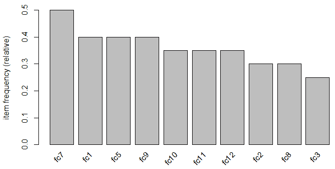
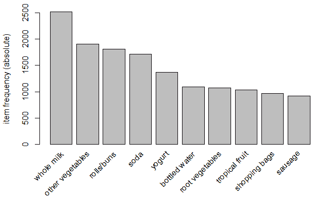
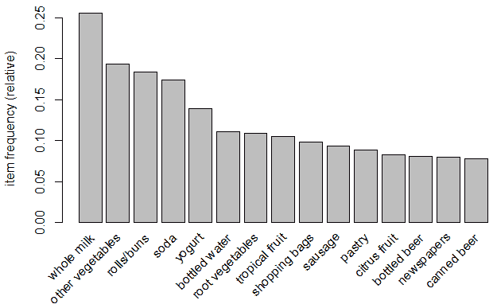

# 十一、关联分析

如果我们有数据，我们就来看数据。如果我们只有意见，那就用我的吧。

——吉姆·巴克斯代尔，前网景公司首席执行官

你必须生活在月球的黑暗面，才能看不到我们每天都要讨论的技术的结果。如果你访问[www.amazon.com](http://www.amazon.com)，在[www.netflix.com](http://www.netflix.com)上看电影，或者访问任何零售网站，你都会接触到诸如*相关产品*、*之类的术语，因为你看过...*，*买了 x 的客户也买了 y，*和*为你推荐*，在每一个转折处。利用大量的实时或接近实时的历史信息，零售商利用各种算法试图增加购买者的购买量和这些购买的价值。

实现这一点的技术可以分为两类:关联规则和推荐引擎。关联规则分析通常被称为购物篮分析，因为它与了解一起购买的商品有关。推荐引擎的目标是根据顾客对他们以前浏览或购买的商品的评价，为他们提供他们喜欢的其他商品。

在这一章中，我们将集中讨论关联分析。它不仅适用于推荐、产品放置和促销定价，还可用于制造业、网络使用、医疗保健等。如果你对物品如何一起出现感兴趣，应用你将要学习的东西。


# 关联分析综述

关联分析是一种数据挖掘技术，其目的是找到产品或服务的最佳组合，并允许营销人员利用这一知识来提供建议、优化产品放置或开发利用交叉销售的营销计划。简而言之，我们的想法是确定哪些物品搭配得好，并从中获利。

你可以把分析的结果想象成一个`if...then`语句。如果客户购买了机票，那么他们有 46 %的可能性会购买酒店房间，如果他们继续购买酒店房间，那么有 33 %的可能性会租车。

然而，这不仅仅是为了销售和营销。它还用于欺诈检测和医疗保健；例如，如果患者接受治疗 A，那么他们有 26 %的可能性表现出症状 x。在进入细节之前，我们应该看看一些术语，如下所示:

*   **Itemset** :这是数据集中一个或多个项目的集合。
*   **Support** :这是数据中包含感兴趣的项集的事务的比例。
*   **信心**:这是一个人购买或做 *x* ，他们将购买或做 *y* 的条件概率；做 *x* 的行为被称为*前因*或**左侧** ( **LHS** )，而 *y* 是*结果*或**右侧** ( **RHS** )。
*   **升力**:这是 *x* 与 y 同时出现的支撑除以 *x* 和 *y* 独立出现的概率的比值。就是**置信度**除以概率 *x* 乘以概率*y*；例如，假设我们将 *x* 和 *y* 同时发生的概率设为 10 %，而 *x* 的概率为 20 %，y 为 30 %，那么升力将为 10 % (20 %乘以 30 %)或 16.67 %。

R 中可以用来执行购物篮分析的包是**arules:Mining Association Rules and frequency with items sets**。这个包提供了两种不同的方法来寻找规则**先验**和 **ECLAT** 。我们还可以使用其他算法来进行购物篮分析，但 apriori 是使用最频繁的算法，因此也是我们的重点。

apriori 的原则是，如果一个项目集是频繁的，那么它的所有子集也必须是频繁的。最小频率(支持)由分析师在执行算法之前确定，一旦确定，算法将如下运行:

*   设 *k=1* (项目数)
*   生成长度等于或大于指定支持的项集
*   迭代 *k + (1...n)* ，修剪那些不常出现的(少于支持的)
*   当没有识别出新的频繁项目集时，停止迭代

一旦有了最频繁项目集的有序摘要，就可以通过检查置信度和提升来提供感兴趣的关联，从而继续分析过程。

在我们深入分析之前，有必要了解如何将原始数据放入适当的结构中，称为 R 类事务。这可能是一个令人困惑的任务，所以在继续完整演示关联分析之前，我将在这方面花一些时间。


# 创建交易数据

在物联网的世界里，你会收到大量的数据。当您监控设备的异常或故障时，假设您得到一些故障代码。在 R 语言中，你如何将原始数据转化为有意义的分析数据？这里有一个案例研究。我们将把一个随机数据集放在一起，并把它转换成与 R 的`arules`包一起使用的适当形式。这是数据框架:

```py
> set.seed(270)

> faults <- data.frame(
    serialNumber = sample(1:20, 100, replace = T),
    faultCode = paste("fc", sample(1:12, 100, replace = T), sep = "")
 )
```

这给了我们`20`不同的序列号，告诉我们哪些被监控的设备出现了故障。每个设备都有可能出现`12`不同的故障代码。我们正在进行的关联分析的局限性在于，它不包括交易顺序。让我们假设在这个例子中这不是一个问题，然后继续。首先，考虑到这些数据是随机生成的，我们将删除重复的数据:

```py
> faults <- unique(faults)
```

在将数据帧转换成事务之前，数据帧的结构非常关键。标识符列必须是整数。所以，如果你有一个客户或者设备标识符比如`123abc`，你必须把它变成一个整数。那么，感兴趣的项目必须是一个因素。在这里，我们确认我们有正确的数据帧结构:

```py
> str(faults)
'data.frame': 80 obs. of 2 variables:
 $ serialNumber: int 9 8 1 18 11 20 2 16 10 20 ...
 $ faultCode : Factor w/ 12 levels "fc1","fc10","fc11",..: 2 5 1 12 1 3 6 10 11 1 ...
```

请注意，这些数据是长格式的，通常就是这样产生的。因此，创建一个所有值都是`TRUE`的列，并使用 tidyverse 将数据重新调整为宽格式:

```py
> faults$indicator <- TRUE

> faults_wide <- tidyr::spread(faults, key = faultCode, value = indicator)
```

我们现在有了一个数据帧，其中每个相关项目的相关故障都标为`TRUE`。接下来，将数据转换成矩阵，同时删除 ID:

```py
> faults_matrix <- as.matrix(faults_wide[,-1])
```

你必须把缺失的`na`变成可以理解的东西，所以让我们把它们变成`FALSE`:

```py
> faults_matrix[is.na(faults_matrix)] <- FALSE
```

最后，我们可以将这些数据转换成`transactions`类:

```py
> faults_transactions <- as(faults_matrix, "transactions")
```

为了确认这一切都起作用，创建一个前 10 项频率的图表:

```py
> arules::itemFrequencyPlot(faults_transactions, topN = 10)
```

上述代码的输出如下:



成功！遵循前面的过程将使你从原始数据到适当的结构。我们将使用来自`arules`包本身的数据转换成一个例子，您可以将它应用于任何您想要的分析。


# 数据理解

对于我们的业务案例，我们将重点关注确定杂货店的关联规则。数据集将来自`arules`包，名为`Groceries`。该数据集由现实世界中一家杂货店 30 天内的实际交易组成，包括 9，835 次不同的购买。所有购买的商品都归入 169 个类别中的一个，例如面包、酒、肉等等。

比方说，我们希望了解潜在客户会购买什么样的啤酒，以确定商店内合适的产品位置或支持交叉销售活动。


# 数据准备

对于这个分析，我们只需要加载两个包，以及`Groceries`数据集:

```py
> install.packages("arules")

> install.packages("arulesViz")

> library(arules)

> data(Groceries)

> str(Groceries)Formal class 'transactions' [package "arules"] with 3 slots
      ..@ data :Formal class 'ngCMatrix' [package "Matrix"] with 5 
        slots
      .. .. ..@ i : int [1:43367] 13 60 69 78 14 29 98 24 15 29 ...
      .. .. ..@ p : int [1:9836] 0 4 7 8 12 16 21 22 27 28 ...
      .. .. ..@ Dim : int [1:2] 169 9835
      .. .. ..@ Dimnames:List of 2
      .. .. .. ..$ : NULL
      .. .. .. ..$ : NULL
      .. .. ..@ factors : list()
      ..@ itemInfo :'data.frame': 169 obs. of 3 variables:
      .. ..$ labels: chr [1:169] "frankfurter" "sausage" "liver loaf" 
        "ham" ...
      .. ..$ level2: Factor w/ 55 levels "baby food","bags",..: 44 44 
      44 44 44 44
      44 42 42 41 ...
      .. ..$ level1: Factor w/ 10 levels "canned food",..: 6 6 6 6 6 6 
      6 6 6 6 
      ...
      ..@ itemsetInfo:'data.frame': 0 obs. of 0 variables
```

这个数据集被结构化为一个稀疏矩阵对象，称为我们之前创建的`transaction`类。

因此，一旦结构是类事务的结构，我们的标准探索技术就不起作用了，但是`arules`包为我们提供了探索数据的其他方法。探索这些数据的最佳方式是使用`arules`包中的`itemFrequencyPlot()`函数绘制一个项目频率图。您需要指定事务数据集、绘制频率最高的项目数，以及是否需要项目的相对或绝对频率。让我们先来看一下绝对频率和排名前几位的`10`项:

```py
> arules::itemFrequencyPlot(Groceries, topN = 10, type = "absolute")
```

上述命令的输出如下:



购买最多的商品是**全脂牛奶**，篮子里 9836 笔交易中大约有 **2 笔**、 **500 笔**。对于前`15`项的相对分布，让我们运行以下代码:

```py
> arules::itemFrequencyPlot(Groceries, topN = 15)
```

以下是前面命令的输出:



唉，在这里我们看到啤酒是这家商店第 13 位^(和第 15 位^(最常购买的商品。不到 10 %的交易与**瓶装啤酒**和/或**罐装啤酒**有关。))

对于这个练习，这就是我们需要做的；因此，我们可以直接进入建模和评估。


# 建模和评估

我们将从挖掘总体关联规则的数据开始，然后具体讨论啤酒的规则。在整个建模过程中，我们将使用 apriori 算法，它是`arules`包中名副其实的`apriori()`函数。我们需要在函数中指定的两个主要内容是数据集和参数。至于参数，您需要在确定最小支持度、置信度以及项目集中篮子项目的最小和/或最大长度时进行判断。使用项目频率图以及试错法，让我们将最小支持度设置为 1/1，000 个交易，最小置信度为 90 %。

此外，让我们将关联项目的最大数量设定为 4。下面的代码创建了我们称之为`rules`的对象:

```py
 rules <-
  arules::apriori(Groceries, parameter = list(
    supp = 0.001,
    conf = 0.9,
    maxlen = 4
  ))
```

调用对象显示算法产生了多少规则:

```py
> rules
set of 67 rules 
```

检查规则的方法有很多。我建议的第一件事是使用基数 r 中的`options()`函数将显示的位数设置为两位。然后，根据它们提供的提升对前五条规则进行排序和检查，如下所示:

```py
> options(digits = 2)

> rules <- arules::sort(rules, by = "lift", decreasing = TRUE)

> arules::inspect(rules[1:5])
  lhs                 rhs                support confidence lift
1 {liquor, red/blush wine}     => {bottled beer}      0.0019       
   0.90 11.2
2 {root vegetables, butter, cream cheese }      => {yogurt}            
   0.0010       0.91  6.5
3 {citrus fruit, root vegetables, soft cheese}=> {other vegetables}  
   0.0010       1.00  5.2
4 {pip fruit, whipped/sour cream, brown bread}=> {other vegetables}  
   0.0011       1.00  5.2
5 {butter,whipped/sour cream, soda}    => {other vegetables}  
    0.0013       0.93  4.8
```

瞧啊！提供最佳整体提升的规则是根据购买`bottled beer`的概率购买`liquor`和`red wine`。我不得不承认这纯粹是偶然的，不是我的本意。就像我常说的，运气好不如运气好。尽管如此，它仍然不是一个非常常见的事务，只支持 1.9/1000。

您还可以根据支持度和信心度进行排序，所以让我们按降序来看一下前五条规则`by="confidence"`，如下所示:

```py
 > rules <- arules::sort(rules, by = "confidence", decreasing = TRUE)

 > arules::inspect(rules[1:5])
      lhs             rhs                support confidence lift
    1 {citrus fruit, root vegetables, soft cheese}=> {other vegetables}  
      0.0010          1  5.2
    2 {pip fruit, whipped/sour cream, brown bread}=> {other vegetables}  
      0.0011          1  5.2
    3 {rice, sugar}  => {whole milk}        0.0012          1  3.9
    4 {canned fish, hygiene articles} => {whole milk} 0.0011   1  3.9
    5 {root vegetables, butter, rice} => {whole milk} 0.0010   1  3.9
```

您可以在表格中看到，这些事务的`confidence`是 100 %。继续我们对啤酒的具体研究，我们可以利用`arules`中的函数来开发交叉列表——`crossTable()`函数——然后检查任何适合我们需要的东西。第一步是用我们的数据集创建一个表:

```py
 > tab <- arules::crossTable(Groceries)
```

随着`tab`的创建，我们现在可以调查项目之间的联合事件。这里，我们只看前三行和前三列:

```py
 > tab[1:3, 1:3]
                frankfurter sausage liver loaf
    frankfurter         580      99          7
    sausage              99     924         10
    liver loaf            7      10         50
```

正如你所想象的，在 9835 次交易中，购物者只选择了肝面包`50`次。此外，在第`924`次，人们倾向于`sausage`，`ten`次，他们觉得不得不抓住`liver loaf`。(非常时期需要非常手段！)如果您想查看一个特定的示例，您可以指定行号和列号，或者拼出该项:

```py
> tab["bottled beer","bottled beer"]
[1] 792
```

这告诉我们有`bottled beer`的`792`个事务。让我们看看`bottled beer`和`canned beer`之间的联合发生是什么:

```py
> tab["bottled beer","canned beer"]
[1] 26
```

我预计这个数字会很低，因为它支持了我的观点，即人们倾向于喝瓶装或罐装啤酒。我非常喜欢一瓶。它也是一种方便的武器，可以保护你免受诸如占领华尔街之类的流氓抗议者的伤害。

我们现在可以继续并推导出`bottled beer`的具体规则。我们将再次使用`apriori()`函数，但是这一次，我们将在`appearance`周围添加一个语法。这意味着我们将在语法中指定，我们希望左侧是增加购买概率的项目`bottled beer`，它将在右侧。在下面的代码中，注意我已经调整了`support`和`confidence`的数字。请随意尝试您的设置:

```py
> beer.rules <- arules::apriori(
    data = Groceries,
    parameter = list(support
    = 0.0015, confidence = 0.3),
    appearance = list(default = "lhs",
    rhs = "bottled beer"))

> beer.rules
set of 4 rules 
```

我们发现自己只有`4`条关联规则。我们已经见过其中一个了。现在让我们按电梯降序介绍其他三条规则:

```py
 > beer.rules <- arules::sort(beer.rules, decreasing = TRUE, by = "lift")
  > arules::inspect(beer.rules)
 lhs rhs support confidence lift
 1 {liquor, red/blush wine} => {bottled beer} 0.0019 0.90 11.2
 2 {liquor} => {bottled beer} 0.0047 0.42 5.2
 3 {soda, red/blush wine} => {bottled beer} 0.0016 0.36 4.4
 4 {other vegetables, red/blush wine} => {bottled beer}0.0015 0.31 
 3.8
```

在所有的例子中，购买`bottled beer`都与酒有关，或者是`liquor`和/或红酒，这对任何人来说都不奇怪。有趣的是`white wine`不在这里。让我们仔细看看这个，比较一下`bottled beer`和酒的种类的联合出现:

```py
    > tab["bottled beer", "red/blush wine"]
    [1] 48

    > tab["red/blush wine", "red/blush wine"]
    [1] 189

    > 48/189
    [1] 0.25

    > tab["white wine", "white wine"]
    [1] 187

    > tab["bottled beer", "white wine"]
    [1] 22
    > 22/187
    [1] 0.12
```

有意思的是，25 %的时候有人购买了`red wine`，他们也购买了`bottled beer`；但是对于`white wine`，联合购买只发生在 12 %的情况下。我们当然不知道为什么在这个分析中，但这可能有助于我们确定我们应该如何定位我们的产品在这家杂货店。在我们继续之前，另一件事是看看规则的情节。这是通过`arulesViz`包中的`plot()`功能完成的。

有许多图形选项可用。对于这个例子，让我们指定我们希望`graph`显示`lift`和由`confidence`提供和遮蔽的规则。下面的语法将相应地提供这一点:

```py
> library(arulesViz)
Loading required package: grid

> plot(beer.rules,
+ method = "graph",
+ measure = "lift",
+ shading = "confidence")
```

以下是前面命令的输出:


该图显示了**酒** / **红酒**提供了最好的**升力**和最高水平的**信心**与圆圈的**大小**及其阴影。

我们刚刚在这个简单的练习中所做的是展示用 R 进行市场篮分析是多么容易。不需要太多的想象力就能想出我们可以用这种技术进行分析的可能性，例如，整合客户细分、纵向购买历史等等，以及如何在广告展示、联合促销等等中使用它。


# 摘要

在这一章中，我们的目标是介绍如何使用 R 来构建和测试关联规则挖掘(市场篮分析)。购物篮分析试图了解哪些商品是一起购买的，哪些商品是一起出现的，因此您可以将该分析应用于医疗保健、欺诈检测，甚至探索机械问题。因此，我们学习了如何将原始数据转换成事务结构，以便在`arules`包中使用。

我们现在要回到监督学习。在下一章中，我们将介绍一些鲜为人知但却是实用机器学习中必不可少的方法，即分析时间序列数据和确定因果关系。