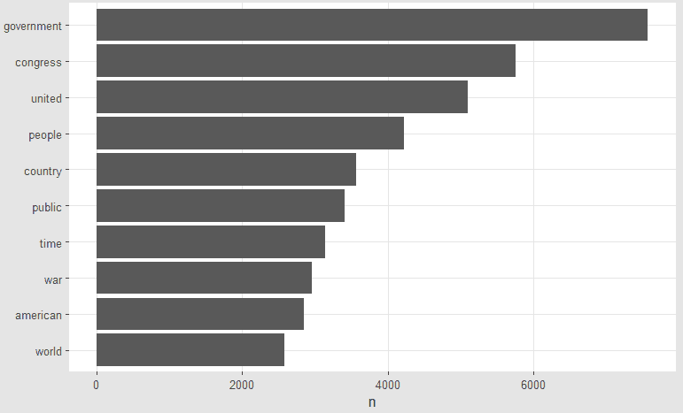
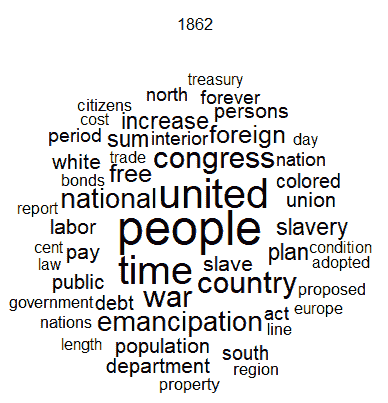
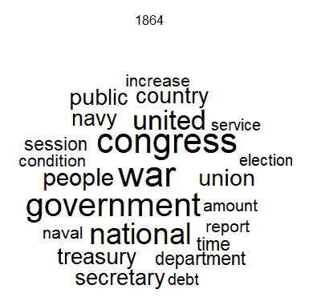
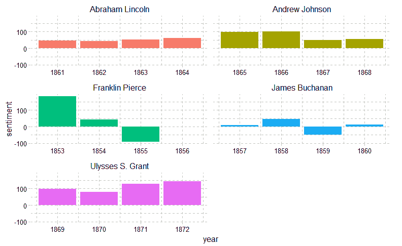
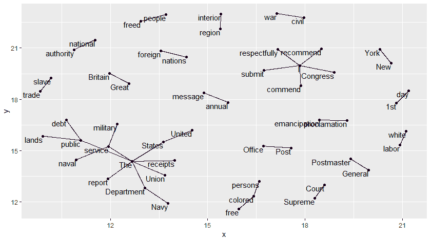
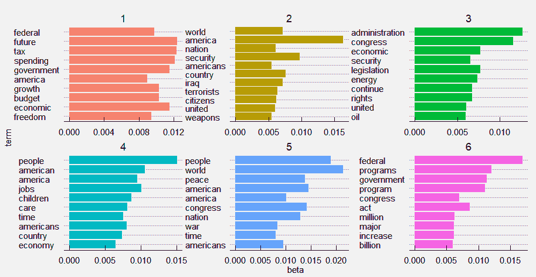
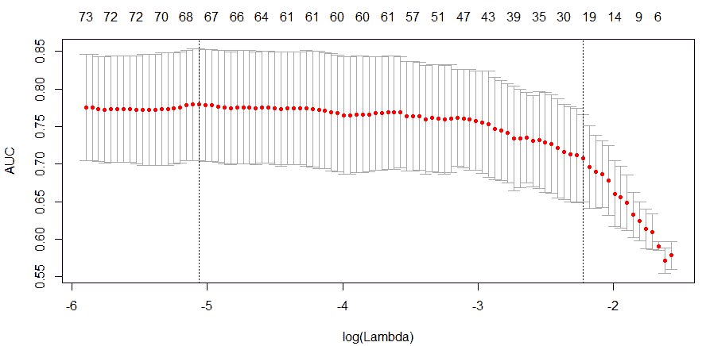
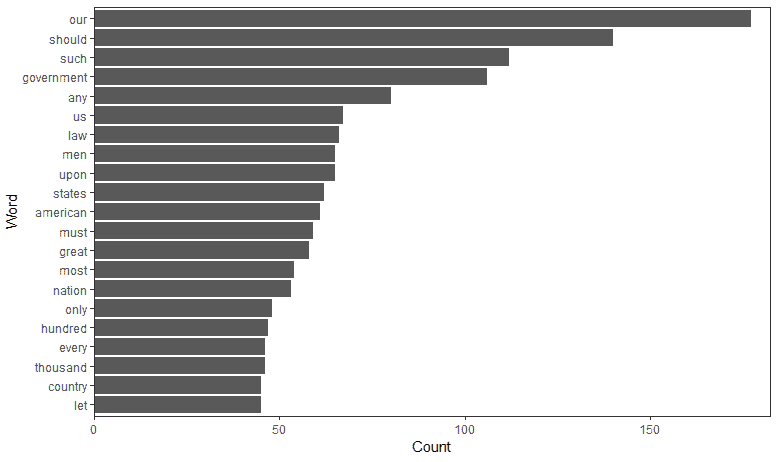
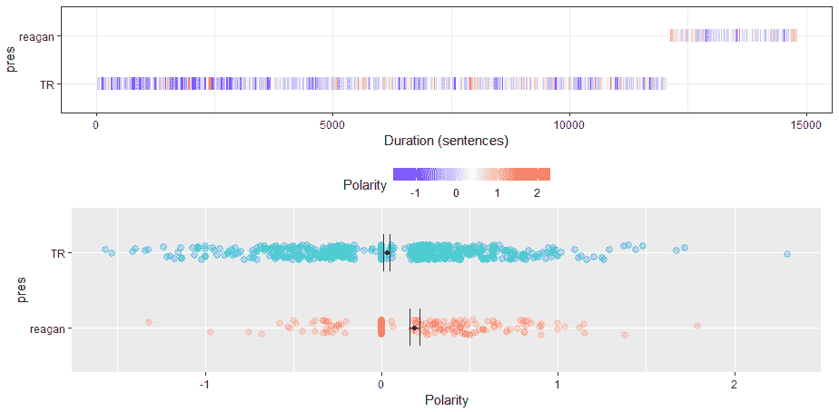
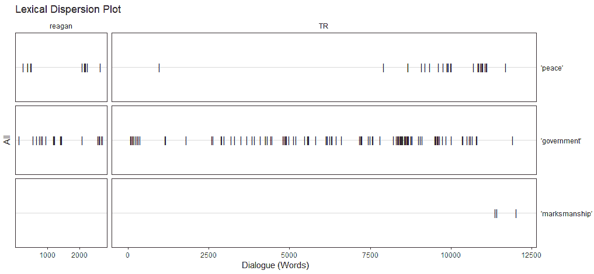

# 十三、文本挖掘

“那么，一般来说，历史的真相是什么？一个约定好的寓言。正如有人非常巧妙地指出的那样”

——*拿破仑·波拿巴*

这个世界充斥着文本数据。如果你搜索谷歌，必应，或者雅虎！这些数据中有多少是非结构化的，即文本格式的，估计在 80%到 90%之间。真实的数字并不重要。重要的是大部分数据是文本格式的。这意味着，任何试图在数据中发现真知灼见的人都必须发展处理和分析文本的能力。

当我刚开始做市场研究员的时候，我常常手动翻阅一页又一页由主持人领导的焦点小组和采访记录，希望捕捉一些定性的见解，如果你愿意的话，一个*啊哈时刻*，然后与团队成员争论他们是否有相同的见解。然后，在一个项目中，总会有那么一个人，他会从日程表上的 30 或 40 个采访中，突然闯进来听两个采访，唉，他们已经对世界上真正发生的事情下定了决心。与现在使用的技术相比，分析师可以快速将数据提取为有意义的定量结果，支持定性理解，甚至可能动摇俯冲者。

在过去的几年里，我应用了这里讨论的技术来挖掘医患互动，了解 FDA 对处方药广告的担忧，捕捉患者对罕见癌症的担忧，以及捕捉客户维护问题，等等。使用 R 和本章中的方法，您也可以从文本数据中提取强大的信息。

本章将涵盖以下主题:

*   文本挖掘框架和方法
*   数据概述
*   字频率
*   情感分析
*   N-grams
*   主题模型
*   文本分类
*   附加定量分析


# 文本挖掘框架和方法

在文本挖掘中有许多不同的方法。这里的目标是提供一个适用于这种努力的基本框架。这个框架并没有包含所有可能的方法，但是会涵盖那些对于您将要从事的绝大多数项目来说可能是最重要的方法。此外，我将尽可能简洁明了地讨论建模方法，因为它们可能会变得相当复杂。收集和编译文本数据是一个可能占据几个章节的主题。我更喜欢并将在这里提出的一件事是使用 **tidy** 框架。它将允许我们在大多数步骤中使用**tibles**和数据框架，并且`tidytext`函数允许轻松过渡到其他类型的文本挖掘结构，例如语料库。

第一项任务是将文本文件放入数据框中。创建好之后，数据准备就可以从文本转换开始了。

下面的列表可能包含了一些最常见和最有用的文本文件转换:

*   将大写字母改为小写字母
*   删除号码
*   删除标点符号
*   删除停用词
*   删除多余的空白字符
*   词干
*   单词替换

通过这些转换，您创建了一个更紧凑的数据集，并简化了结构，以促进单词之间的关系，从而增进理解。但是，请记住，并不是所有的转换都是必要的，必须应用判断，或者您可以迭代找到最有意义的转换。

通过将单词改为小写，可以防止单词计数不当。假设你有三次对曲棍球 T1 的计数和一次对 T2 曲棍球 T3 的计数，其中它是一个句子中的第一个单词。r 不会给你算出*曲棍球=4* ，而是*曲棍球=3* 和*曲棍球=1* 。

去掉标点符号也达到了同样的目的，但是在某些情况下，标点符号是很重要的，尤其是当你想用句子来标记你的文档的时候。

在去除停用词的过程中，你正在去除那些没有价值的常用词；事实上，它们对分析是有害的，因为它们的频率掩盖了重要的词。停用词的例子有*和，是，非，*和*到*。

删除空白通过消除诸如制表符、段落分隔符、双倍行距等内容，使数据更加紧凑。

单词的词干可能会变得很棘手，可能会增加你的困惑，因为它删除了单词后缀，创建了基本单词，或者所谓的**部首**。我个人不太喜欢词干分析，和我一起工作过的分析师也同意这种观点。回想一下，R 会把这看作两个独立的单词。通过运行词干算法，两个实例的词干将变成*家族*。这将防止不正确的计数，但在某些情况下，它可能很难解释，并且在用于演示目的的文字云中视觉上不太吸引人。在某些情况下，对有词干和无词干的单词进行分析可能是有意义的，这样可以看出哪一个有助于理解。

可能最可选的转换是替换单词。替换的目标是组合具有相似含义的单词，例如，*管理*和*领导*。你也可以用它来代替词干。我曾经研究过词干化和非词干化单词的结果，并得出结论，通过替换大约十几个单词而不是词干化，我可以获得更有意义的结果。当您手动输入数据并且不同的操作员以不同的方式输入数据时，这一点非常重要。例如，技术支持人员一半时间在系统*涡轮提升器*中输入一个型号，而技术支持人员一半时间在*涡轮提升器*中输入两个型号，另一半时间在*涡轮提升器*中输入。三个版本都是一样的，所以应用一个替换函数比如`gsub()`或者`grepl()`就能解决问题。

转换完成后，为主题建模或分类创建的一个结构是**文档-术语矩阵** ( **DTM** )或**术语-文档矩阵** ( **TDM** )。这些矩阵的作用是为矩阵中的每个文档创建一个字数矩阵。DTM 将文档作为行，单词作为列，而在 TDM 中，情况正好相反。我们将以 DTM 为例。


# 主题模型

主题模型是一种强大的按照主题对文档进行分组的方法。主题模型允许对文档中的术语频率出现进行概率建模。拟合的模型可用于估计文档之间的相似性，以及使用潜在变量的附加层的一组指定关键字之间的相似性，这些潜在变量被称为主题(Grun 和 Hornik，2011 年)。本质上，一个文档被分配给一个主题是基于该文档中单词的分布，该主题中的其他文档将具有大致相同的单词频率。

我们将重点介绍的算法是**潜在狄利克雷分配** ( **LDA** )与吉布斯采样，这可能是最常用的采样算法。在建立主题模型时，必须在运行算法之前确定主题的数量(k 维)。如果不存在主题数量的先验原因，那么你可以建立几个，并将判断和知识应用于最终选择。带有 Gibbs 抽样的 LDA 在数学上是相当复杂的，但是我的意图是提供一个介绍，这样你至少能够用外行的术语描述算法如何学习分配一个文档到一个主题。如果你对掌握与该方法相关的数学感兴趣，在你的日历上划出几个小时来尝试一下。优秀的背景材料可在 http://www.cs.columbia.edu/~blei/papers/Blei2012.pdf[获得](http://www.cs.columbia.edu/~blei/papers/Blei2012.pdf)。

LDA 是一个生成过程，因此下面将迭代到稳定状态:

1.  对于每个文档( *j* )，有 *1* 到 *j* 个文档。我们将随机分配一个多项分布(**狄利克雷** **分布**)给主题( *k* )和 *1* 到 *k* 主题，例如，文档*A*25%是主题 1，25%是主题 2，50%是主题 3。
2.  概率上，对于每个词( *i* )，有 *1* 到 *i* 个词对应一个话题(*k*)；例如，*这个词的意思是*对于话题统计有 0.25 的概率。
3.  对于文档( *j* )和主题( *k* )中的每个单词( *i* ，计算该文档中的单词分配给该主题的比例；记为主题( *k* )与文档( *j* )、 *p(k|j)* 的概率，以及所有包含单词的文档中单词( *i* )在主题( *k* )中所占的比例。记为单词( *i* )带话题( *k* )， *p(i|k)* 的概率。

4.  重采样，即基于 *t* 包含 *w* 的概率，给 *w* 赋值一个新的 *t* ，这个概率是基于 *p(k|j)* 乘以 *p(i|k)* 。
5.  冲洗，重复；经过多次迭代，该算法最终收敛，并且基于在该文档中分配给主题的词的比例，给该文档分配主题。

我们将要做的 LDA 假设单词和文档的顺序无关紧要。已经做了一些工作来放宽这些假设，以便随着时间的推移建立语言生成和序列模型的模型(称为**动态主题建模**)。


# 其他定量分析

我们现在将转而分析基于句子的文本语义，以及基于词类的单词标记，如名词、动词、代词、形容词、副词、介词、单数、复数等等。通常，仅仅检查文本中的频率和潜在主题就足以满足你的分析。然而，你可能会发现，为了比较说话者或作者，需要对文体有更深的理解。

有许多方法可以完成这项任务，但我们将重点关注以下五种方法:

*   极性(情感分析)
*   自动化可读性指数(复杂性)
*   礼节
*   多样性
*   散布

**极性**通常被称为情绪分析，它会告诉你文本有多积极或消极。通过分析 R 中的极性，它会给每个单词分配一个分数，你可以按不同的作者、文本或主题来分析极性的平均值和标准偏差。不同极性的字典是可用的，我们将在后面更详细地探讨它们。你可以根据自己的需要修改或更换字典。

该算法首先根据字典用积极、消极或中性情绪标记单词。然后，基于标记词之前的四个词和之后的两个词对标记词进行聚类，这些聚类被标记为所谓的**化合价移位器**(中性、取反、放大和去放大)。基于它们的数量和位置的一系列权重被应用于单词和聚类。然后求和并除以句子中单词数的平方根。

自动化可读性指数是对文本复杂性和读者理解能力的一种衡量。用一个具体的公式来计算这个指数: *4.71(字数/字数)+ 0.5(字数/句子数)- 21.43* 。

该指数产生一个数字，这是一个学生的年级水平的粗略估计，以充分理解。如果数字是 9，那么一个 13 岁到 15 岁的高一学生应该能够掌握课文的意思。

形式尺度提供了一种对文本如何与读者相关或演讲如何与听众相关的理解。我喜欢把它看作是一种理解产生文本的人与观众相处的舒适程度的方式，或者是对这种交流发生的环境的理解。如果你想体验正式文本，参加医学会议或阅读法律文件。非正式文本被认为是上下文相关的。

形式度量被称为 **F 度量**。该指标的计算方法如下:

*   正式的词有名词、形容词、介词和冠词
*   语境词是代词、动词、副词和感叹词
*   *N =和(f + c +连词)*
*   *正式指数= 50((f-c/N 之和)+ 1)*

当涉及文本挖掘时，多样性指的是所使用的不同单词的数量与所使用的单词总数的关系。这也意味着文本生产者的词汇量的扩大或词汇的丰富。`qdap`包提供了五种——没错，五种——不同的多样性指标:`simpson`、`shannon`、`collision`、`bergen_parker`和`brillouin`。我不会详细介绍这五种算法，但我只想说，这些算法不仅用于通信和信息科学检索，还用于自然界的生物多样性。

最后，分散或词汇分散是一个有用的工具，有助于理解单词是如何在整个文档中传播的，并且是探索文本和识别模式的一种极好的方式。通过调用感兴趣的一个或多个特定单词来进行分析，然后在显示一段时间内一个或多个单词何时出现在文本中的图中产生这些单词。正如我们将看到的，`qdap`包有一个内置的绘图功能来分析文本分散。

我们已经介绍了文本挖掘的框架，包括如何准备文本、计算字数和创建主题模型，最后，深入研究了其他词汇方法。现在，让我们应用所有这些，做一些现实世界的文本挖掘。


# 数据概述

在这个案例研究中，我们将看一下国情咨文的全文。国情咨文是总统向国会提供的年度信息。其目的是提供一个经济和外交概况，以及概述立法议程。我认为这是典型的政治宣传，夹杂着虚假的希望和热情。我太老了，也太聪明了，不会再考虑别的了。

数据在一个 R 包`sotu`里。它由 236 个口头和书面地址的文本和元数据组成。

从技术上来说，这些关于国情咨文的数据是不正确的。第一届总统在任期第一年的演讲的正确定义是在联席会议上的演讲。

我们的学习目标是探索工作频率、亚伯拉罕·林肯的演讲、美国内战期间演讲的情绪、从越南战争升级到现在的演讲主题模型、政党分类模型，以及适用于两位不同总统的一些高级演讲方法。


# 数据框创建

根据一个古老的笑话和一点智慧:

“你怎么知道一个政客在撒谎？他们的嘴唇在动！”

如果尚未安装，请安装以下软件包，并调用`magrittr`和`sotu`库:

```py
> install.packages("ggplot2")

> install.packages("ggraph")

> install.packages("igraph")

> install.packages("quanteda")

> install.packages("qdap")

> install.packages("tidytext")

> install.packages("tidyverse")

> install.packages("sotu")

> install.packages("topicmodels")

> library(magrittr)

> library(sotu)
```

由于数据位于`sotu`包中，我们需要调用它来创建数据对象，如下所示:

```py
> data(sotu_text)

> data(sotu_meta)
```

通过将原始文本添加到元数据中，可以很容易地将它转换为包含我们需要的所有内容的数据框:

```py
> sotu_meta$text <- sotu_text
```

以下是列名。我建议您也花几分钟时间自己探索这些数据:

```py
> colnames(sotu_meta)
[1] "president" "year" "years_active" "party" "sotu_type" 
[6] "text"
```

`text`列包含字符串中感兴趣的数据。在我们开始分析数据之前，我们需要对文本进行标记，并将其与每位总统联系起来。那是什么意思？这意味着我们在每个文档的每一行放置一个令牌。令牌可以是字符、单词、单词的 n 元组合或句子。这将为我们应用 tidy 格式程序做好准备:

```py
> sotu_meta %>%
    tidytext::unnest_tokens(word, text) -> sotu_unnest
```

我们所做的只是告诉`unnest_tokens()`函数获取列文本并将其转换为名为`word`的列。我们将看到的函数支持 n 元语法，但默认为单词。它还会自动删除所有大写。当我们处理 n-gram 时，我们将把它设置为 false。下面是新的`tibble`创造的样子:

```py
> sotu_unnest
# A tibble: 1,965,212 x 6
   president         year  years_active party       sotu_type word 
   <chr>             <int> <chr>        <chr>       <chr>     <chr> 
 1 George Washington 1790  1789-1793    Nonpartisan speech    fellow 
 2 George Washington 1790  1789-1793    Nonpartisan speech    citizens 
 3 George Washington 1790  1789-1793    Nonpartisan speech    of 
 4 George Washington 1790  1789-1793    Nonpartisan speech    the 
 5 George Washington 1790  1789-1793    Nonpartisan speech    senate 
 6 George Washington 1790  1789-1793    Nonpartisan speech    and 
 7 George Washington 1790  1789-1793    Nonpartisan speech    house 
 8 George Washington 1790  1789-1793    Nonpartisan speech    of 
 9 George Washington 1790  1789-1793    Nonpartisan speech    representatives
10 George Washington 1790  1789-1793    Nonpartisan speech    i 
# ... with 1,965,202 more rows
```

数据准备好了，让我们开始吧。


# 字频率

使用词频分析，我们希望通过删除停用词来清理这些数据，因为停用词只会扰乱我们的解释。我们将探索最高的整体词频，然后看看林肯总统的作品。


# 所有地址中的词频

为了以整齐的格式去掉停止字，可以使用`tidytext`包中提供的`stop_words`数据帧。你把那个`tibble`称之为环境，然后用词做一个反联接:

```py
> library(tidytext)

> data(stop_words)

> sotu_tidy <- sotu_unnest %>%
    dplyr::anti_join(stop_words, by = "word")
```

请注意，数据长度从 197 万次观察减少到 778，161 次。现在，您可以继续查看顶部的单词。我不会在下面这样做，但如果你愿意，你可以把它放入数据框中:

```py
> sotu_tidy %>%
    dplyr::count(word, sort = TRUE)
# A tibble: 29,558 x 2
   word           n
   <chr>      <int>
 1 government  7573
 2 congress    5759
 3 united      5102
 4 people      4219
 5 country     3564
 6 public      3413
 7 time        3138
 8 war         2961
 9 american    2853
10 world       2581
# ... with 29,548 more rows
```

我们可以将这些数据传递给`ggplot2`，在这种情况下，出现超过 2500 次的单词:

```py
> sotu_tidy %>%
    dplyr::count(word, sort = TRUE) %>%
    dplyr::filter(n > 2500) %>%
    dplyr::mutate(word = reorder(word, n)) %>%
    ggplot2::ggplot(ggplot2::aes(word, n)) +
    ggplot2::geom_col() +
    ggplot2::xlab(NULL) +
    ggplot2::coord_flip() +
    ggthemes::theme_igray()
```

上述代码的输出如下:



我们可以查看包含最多单词的地址:

```py
> sotu_tidy %>%
    dplyr::group_by(year) %>%
    dplyr::summarise(totalWords = length(word)) %>%
    dplyr::arrange(desc(totalWords))
# A tibble: 225 x 2
    year totalWords
   <int>      <int>
 1 1981       18402
 2 1980       17553
 3 1946       12614
 4 1974       11813
 5 1979       11730
 6 1910       11178
 7 1907       10230
 8 1912       10215
 9 1911        9598
10 1899        9504
# ... with 215 more rows
```

怎么样？最长的两次演讲是由罗纳德·里根发表的，他通常被称为伟大的沟通者。接下来，我们将看看林肯的最高词频，然后为每个单独的地址创建一个词云。


# 林肯的词频

和之前一样，我们将看到林肯用过的前 10 个单词。申请 Abe 地址的过滤器是 1861 到 1864 年:

```py
> sotu_tidy %>%
    dplyr::filter(year > 1860 & year < 1865) %>%
    dplyr::count(word, sort = TRUE)
# A tibble: 3,562 x 2
   word           n
   <chr>      <int>
 1 congress      81
 2 united        81
 3 government    75
 4 people        70
 5 war           65
 6 country       62
 7 time          51
 8 union         50
 9 national      49
10 public        48
# ... with 3,552 more rows
```

毫不奇怪，在那段时间里，T2 战争和内战一样高居榜首。一种可视化地址如何变化和保持不变的方法是为每个地址制作一个单词云。一种方便的方法是使用`qdap`包。我们首先需要从符号化的数据框架中过滤出林肯的演讲。然后，我们为每一年生成一个单独的词云。请注意，我指定了每年 7 个单词的最小频率，并且没有指定词干。这会产生以下四个不同的图:

```py
> sotu_cloud <- sotu_tidy %>%
    dplyr::filter(year > 1860 & year < 1865)

> qdap::trans_cloud(
    text.var = sotu_cloud$word,
    grouping.var = sotu_cloud$year,
    stem = FALSE,
    min.freq = 7
 )
```

上述代码的输出如下:


输出帧 2:



输出帧 3:


输出帧 4:



非常相似的主题，但是请注意，在 1862 年和 1863 年，你有一个明确的关注点在解放和奴隶制上。一个有趣的分析方法是深入研究一个术语，并将其放在上下文中，或者我们可以称之为上下文中的关键字。然而，要做到这一点，我们需要转换我们的数据。`quanteda `包在上下文函数`kwic()`中有一个关键字，但是它要求数据在一个语料库中，这要求文本在每个文档的一个单元格中，而不是每个文档的每行一个标记。这对我们的启示是，我们需要取消整齐的数据框架。这样就完成了，只选择了 1862 年:

```py
> nested_1862 <- sotu_tidy %>%
    dplyr::filter(year == 1862) %>%
    dplyr::select(year, word) %>%
    tidyr::nest(word) %>%
    dplyr::mutate(
    text = purrr::map(data, unlist),
    text = purrr::map_chr(text, paste, collapse = " ")
 )
```

这给了我们删除了停用词的文本，并返回到一个单元格中。要将它放入语料库结构中，`tm`包很有用:

```py
> myCorpus <- tm::Corpus(tm::VectorSource(nested_1862$text))
```

对于上下文中的这个关键词示例，我们应该看看林肯在哪里讨论了解放。函数中的一个重要规范是我们希望在关键字左右看到多少个单词作为感兴趣的上下文。以下是节略内容:

```py
> quanteda::kwic(x = myCorpus$content, pattern = "emancipation", window = 6)

 [text1, 1462] paper respectfully recall attention called compensated |
 [text1, 2076] plan mutual concessions plan adopted assumed |
 [text1, 2873] recommendation congress provide law compensating adopt |
 [text1, 2939] slave concurrence obtained assurance severally adopting |
 emancipation | nation consist territory people laws territory 
 emancipation | follow article main emancipation length time 
 emancipation | plan acted earnestly renewed advance plan 
 emancipation | distant day constitutional terms assurance struggle 

```

最初，输出可能很难理解。但是，它产生的是文本所来自的语料库的文档号，所以只有一个文本单元格，所有输出都是`text1`。然后，显示我们的关键字以什么字符数开始(`1462`)。我们剩下的是关键字前面的六个单词和后面的六个单词。正文的第一行会是这样的:*论文恭敬地回顾关注名为补偿解放的民族组成领地人民法律领地*。这似乎令人困惑，但有趣的是补偿解放区域的概念。完整的输出，并包括更多的上下文单词，可以帮助了解林肯的问题和解放的解决方案。作为历史背景，林肯于 1862 年 12 月 1 日发表了演说，联邦中的政治反对派对他在两个半月前发布的《解放奴隶宣言》一片哗然。林肯不得不跳政治快步舞，本质上，通过声称解放将是渐进的和有补偿的来缓和他的立场。简而言之，在上下文中查看关键词可以帮助您和您的客户理解如何解释文本数据。

我们现在来看看如何以`tidyverse`的方式实现情感分析。


# 情感分析

"我们将高尚地拯救，或者卑鄙地失去地球上最后的、最好的希望."

–*亚伯拉罕·林肯*

在这一部分，我们将看看`tidytext`中可用的各种情绪选项。然后，我们将把它应用于内战之前、期间和之后的数据子集。首先，让我们探索一下`tidytext`附带的情感数据集:

```py
> table(sentiments$lexicon)

   AFINN bing loughran   nrc 
    2476 6788     4149 13901 
```

四个情感选项和与之相关的研究人员如下:

*   芬恩、奥雅纳和尼尔森
*   `bing`:炳、刘等。
*   拉夫兰和麦克唐纳
*   穆罕默德和特尼

情感按照从负到正，从-5 到+5 的等级对单词进行分类。`bing`版本有简单的二进制负或正排序；`loughran`提供了六种不同的类别，包括`negative`、`positive`以及`superfluous`等。有了`nrc`，就有了`anger`或`trust`等五个类别。以下是与`nrc`相关的几个词和情感分类:

```py
> get_sentiments("nrc")
# A tibble: 13,901 x 2
   word sentiment
   <chr> <chr> 
 1 abacus      trust 
 2 abandon     fear 
 3 abandon     negative 
 4 abandon     sadness 
 5 abandoned   anger 
 6 abandoned   fear 
 7 abandoned   negative 
 8 abandoned   sadness 
 9 abandonment anger 
10 abandonment fear 
```

你看到一个词可以有多个情感类别。让我们看看林肯在 1862 年试图安抚他的政敌时是否表达了:

```py
> nrc_anger <- tidytext::get_sentiments("nrc") %>% 
    dplyr::filter(sentiment == "anger")

> sotu_tidy %>%
    dplyr::filter(year == 1862) %>%
    dplyr::inner_join(nrc_anger) %>%
    dplyr::count(word, sort = TRUE)
Joining, by = "word"
# A tibble: 62 x 2
   word n
   <chr>       <int>
 1 slavery     13
 2 slave       12
 3 demand       5
 4 force        5
 5 money        5
 6 abolish      4
 7 rebellion    4
 8 cash         3
 9 deportation  3
10 fugitive     3
# ... with 52 more rows
```

好吧，这很有意思，并且可能表明了将最近开发的定性情感排名应用于历史文献的挑战。我们现在将通过使用`bing`情感技术查看从 1853 年到 1872 年的地址来扩展分析。我们将建立一个总的`positive`和`negative`情绪的数据框架，用它来计算每年的总体情绪得分:

```py
> sentiment <- sotu_tidy %>%
    dplyr::inner_join(tidytext::get_sentiments("bing")) %>%
    dplyr::filter(year > 1852 & year <1873) %>%
    dplyr::count(president, year, sentiment) %>%
    tidyr::spread(sentiment, n, fill = 0) %>%
    dplyr::mutate(sentiment = positive - negative) %>%
    dplyr::arrange(year)
Joining, by = "word"
```

你可以自己探索，但与此同时，这里有一个由`president`和`year`创作的情感情节:

```py
> ggplot2::ggplot(sentiment, ggplot2::aes(year, sentiment, fill = president)) +
    ggplot2::geom_col(show.legend = FALSE) +
    ggplot2::facet_wrap(~ president, ncol = 2, scales = "free_x") +
    ggthemes::theme_pander()
```

上述代码的输出如下:



战前的总统有负面情绪，我猜是因为事情分崩离析。可以说，布坎南是有史以来最糟糕的总统。即使是吉米·卡特也没有这么糟糕。考虑到重建的困难，不得不在南方打一场近乎游击战，格兰特的积极态度很有意思。他是最被低估的总统。我对历史的反思已经够多了。使用`tidytext`在文本数据中寻找和描绘情感是一件容易的事情。事实上，这里有一个例子可以说明什么样的词最能驱动`positive`或`negative`情绪:

```py
> sotu_tidy %>%
    dplyr::inner_join(tidytext::get_sentiments("bing")) %>%
    dplyr::count(word, sentiment, sort = TRUE) %>%
    dplyr::ungroup()
Joining, by = "word"
# A tibble: 3,592 x 3
   word sentiment n
        <chr> <chr>    <int>
 1      peace positive 2021
 2       free positive 1306
 3   progress positive 1157
 4    support positive  961
 5 protection positive  864
 6     proper positive  840
 7  recommend positive  836
 8       debt negative  795
 9    freedom positive  744
10     secure positive  724
# ... with 3,582 more rows
```

尽管难以捉摸，和平仍是头号正面词汇，而头号负面词汇是债务(T2)。哦，祝你好运！

在处理文本时要考虑的一件事是什么样的分辨率有助于学习。到目前为止，我们只做了单词，让我们转向单词组合或 n-grams。


# N-grams

例如，在二元或三元模型中观察单词的组合可以帮助你理解单词之间的关系。再次使用 tidy 方法，我们将创建二元模型，并了解这些关系，以从文本中提取见解。我将继续林肯总统的主题，因为这将允许你比较你从 n-grams 和单词中获得的东西。开始很容易，因为你只需指定要加入的单词数。请注意，在下面的代码中，我保持了单词的大写:

```py
> sotu_bigrams <- sotu_meta %>%
    dplyr::filter(year > 1860 & year < 1865) %>%
    tidytext::unnest_tokens(bigram, text, token = "ngrams", n = 2, 
    to_lower =   FALSE)
```

让我们来看看这个:

```py
> sotu_bigrams %>%
    dplyr::count(bigram, sort = TRUE)
# A tibble: 17,687 x 2
   bigram n
   <chr>         <int>
 1 of the        509
 2 to the        180
 3 in the        146
 4 by the         97
 5 for the        94
 6 have been      82
 7 United States  79
 8 and the        76
 9 has been       76
10 the United     73
# ... with 17,677 more rows
```

那些讨厌的停用词！不要害怕，因为我们可以在短时间内处理它们:

```py
> bigrams_separated <- sotu_bigrams %>%
    tidyr::separate(bigram, c("word1", "word2"), sep = " ")

> bigrams_filtered <- bigrams_separated %>%
    dplyr::filter(!word1 %in% stop_words$word) %>%
    dplyr::filter(!word2 %in% stop_words$word)
```

现在，看看林肯的二元模型是有意义的:

```py
> bigram_counts <- bigrams_filtered %>% 
    dplyr::count(word1, word2, sort = TRUE)

> bigram_counts
# A tibble: 3,488 x 3
   word1   word2      n
   <chr>   <chr>  <int>
 1 United  States    79
 2 public  debt      11
 3 public  lands     10
 4 Great   Britain    9
 5 civil   war        8
 6 I       recommend  8
 7 naval   service    8
 8 annual  message    7
 9 foreign nations    7
10 free    colored    7
# ... with 3,478 more rows
```

我认为这很有趣。我发现令人惊讶的是，英国九次出现在那里，但细想之下，我意识到他们是欧盟的政治眼中钉。我就不告诉你细节了。您可以通过网络图创建这些单词关系的可视化表示:

```py
> bigram_graph <- bigram_counts %>%
 dplyr::filter(n > 4) %>%
 igraph::graph_from_data_frame()

> set.seed(1861) #

> ggraph::ggraph(bigram_graph, layout = "fr") +
 ggraph::geom_edge_link() +
 ggraph::geom_node_point() +
 ggraph::geom_node_text(ggplot2::aes(label = name), vjust = 1, hjust = 1)
```

上述代码的输出如下:



我认为可以肯定地说，n-grams 的使用可以帮助你从文本中学习。结合通过分词的分析，我们可以开始看到一些模式和主题。然而，我们可以通过建立主题模型来使我们的理解更上一层楼。


# 主题模型

我们将把 19 世纪抛在脑后，看看这些最近的考验和磨难(1965 年至 2016 年)。在查看这些数据时，我发现了一些有趣而又令人不安的事情。让我们来看看 20 世纪 70 年代:

```py
> sotu_meta[185:191, 1:4]
# A tibble: 7 x 4
  president        year  years_active party 
  <chr>            <int> <chr>        <chr> 
1 Richard M. Nixon 1970  1969-1973    Republican
2 Richard M. Nixon 1971  1969-1973    Republican
3 Richard M. Nixon 1972  1969-1973    Republican
4 Richard M. Nixon 1972  1969-1973    Republican
5 Richard M. Nixon 1974  1973-1974    Republican
6 Richard M. Nixon 1974  1973-1974    Republican
7 Gerald R.   Ford 1975  1974-1977    Republican
```

我们看到有两个 1972 年和两个 1974 年的地址，但是没有 1973 年的。什么？我去了尼克松基金会的网站，花了大约 10 分钟试图解决这个问题，最后我举起双手，决定实现一个快速解决方案。请注意，有许多冲突需要解决:

```py
> sotu_meta[188, 2] <- "1972_2"

> sotu_meta[190, 2] <- "1974_2"

> sotu_meta[157, 2] <- "1945_2"

> sotu_meta[166, 2] <- "1953_2"

> sotu_meta[170, 2] <- "1956_2"

> sotu_meta[176, 2] <- "1961_2"

> sotu_meta[195, 2] <- "1978_2"

> sotu_meta[197, 2] <- "1979_2"

> sotu_meta[199, 2] <- "1980_2"

> sotu_meta[201, 2] <- "1981_2"
```

给这个软件包的作者发一封电子邮件是合适的。我不会为此费心，但是你可以自己解决这个问题。

随着这场悲剧的过去，我们将在相关的时间框架内再次标记和删除停用词:

```py
> sotu_meta_recent <- sotu_meta %>%
    dplyr::filter(year > 1964)

> sotu_meta_recent %>%
    tidytext::unnest_tokens(word, text) -> sotu_unnest_recent

> sotu_recent <- sotu_unnest_recent %>%
    dplyr::anti_join(stop_words, by = "word")
```

如前所述，我们需要在构建模型之前将数据放入 DTM。这是通过创建按年份分组的字数，然后将其传递给`cast_dtm()`函数来实现的:

```py
> sotu_recent %>%
    dplyr::group_by(year) %>%
    dplyr::count(word) -> lda_words

> sotu_dtm <- tidytext::cast_dtm(lda_words, year, word, n)
```

让我们建立我们的模型。我将使用`Gibbs`方法创建六个不同的主题，我指定了`verbose`。它应该运行 2000 次迭代:

```py
> sotu_lda <-
 topicmodels::LDA(
 sotu_dtm,
 k = 6,
 method = "Gibbs",
 control = list(seed = 1965, verbose = 1)
 )

> sotu_lda
A LDA_Gibbs topic model with 6 topics.
```

该算法给每个主题一个数字。我们可以看到哪一年映射到哪一个主题。我将 2002 年以来的产量缩写如下:

```py
> topicmodels::topics(sotu_lda)
2002 2003 2004 2005 2006 2007 2008 2009 2010 2011 2012 2013 2014 2015 2016
   2    2    2    2    2    2    2    4    4    4    4    4    4    4    4

```

我们看到布什和奥巴马之间从话题 2 到话题 4 的明显转换。以下是主题计数表:

```py
> table(topicmodels::topics(sotu_lda))

 1 2 3  4  5 6 
 8 7 5 18 14 5
```

话题 4 是最普遍的，这也与克林顿的任期有关。该输出为我们提供了与每个主题相关的前五个单词:

```py
> topicmodels::terms(sotu_lda, 5)
     Topic 1      Topic 2    Topic 3 
[1,] "future"     "america"  "administration"
[2,] "tax"        "security" "congress"
[3,] "spending"   "country"  "economic"
[4,] "government" "world"    "legislation"
[5,] "economic"   "iraq"     "energy"

      Topic 4     Topic 5    Topic 6 
[1,] "people"     "world"    "federal"
[2,] "american"   "people"   "programs"
[3,] "jobs"       "american" "government"
[4,] "america"    "congress" "program"
[5,] "children"   "peace"    "act"
```

这一切都很有道理，第二个主题也非常合适。如果你再往下钻，比如说，10 个、15 个或 20 个单词，那就更能说明问题了，但我不会再让你厌烦了。tidy 生态系统中的应用和可视化怎么样？当然可以！我们首先将模型对象转换成数据框，并在此过程中捕获每个主题每个单词的概率，称为`beta`:

```py
> lda_topics <- tidytext::tidy(sotu_lda, matrix = "beta")

> ap_top_terms <- lda_topics %>%
    dplyr::group_by(topic) %>%
    dplyr::top_n(10, beta) %>%
    dplyr::ungroup() %>%
    dplyr::arrange(topic, -beta)
```

我们可以进一步研究这些数据，或者绘制如下图:

```py
> ap_top_terms %>%
    dplyr::mutate(term = reorder(term, beta)) %>%
    ggplot2::ggplot(ggplot2::aes(term, beta, fill = factor(topic))) +
    ggplot2::geom_col(show.legend = FALSE) +
    ggplot2::facet_wrap(~ topic, scales = "free") +
    ggplot2::coord_flip() +
    ggthemes::theme_economist_white()
```

上述代码的输出如下:



这是基于`beta`概率的每个主题的前 10 个单词。我们可以做的另一件事是看一个地址与一个主题相关的概率。这在模型中被称为`gamma`，我们可以像`beta`一样引入它们:

```py
> ap_documents <- tidytext::tidy(sotu_lda, matrix = "gamma")
```

我们现在有了每个主题地址的概率。让我们看看 1981 年罗纳德·里根的价值观:

```py
> dplyr::filter(ap_documents, document == "1981")
# A tibble: 6 x 3
  document topic gamma
  <chr>    <int> <dbl>
1 1981      1    0.286 
2 1981      2    0.0163
3 1981      3    0.0923
4 1981      4    0.118 
5 1981      5    0.0777
6 1981      6    0.411 
```

话题 1 在话题竞赛中紧随其后。如果你仔细想想，这意味着超过六个主题将有助于在概率上创造更好的分离。然而，出于演示的目的，我只喜欢这一章的六个主题。

我们的下一步工作将包括将 DTM 转换为预测政党的简单分类模型的输入特征，因为聚会是政治家们最擅长的。


# 文本分类

我们的目标是建立一个分类器来预测自 1900 年以来的总统党派，无论是民主党还是共和党。我们将把每年的字数转换成特征，创建一个 DTM，使用**术语频率-逆文档频率** ( **tf-idf** )创建特征，并在我们的模型中使用它们。正如您所想象的，我们将拥有数千个特性，因此我们将改变数据的准备方式，而不是我们在前面章节中所介绍的内容，并且还将使用`text2vec`包进行特性创建和建模。


# 数据准备

我们将从获取相关的数据周期开始。然后，我们来看看标签表:

```py
> sotu_party <- sotu_meta %>%
    dplyr::filter(year > 1899)

> table(sotu_party$party)

Democratic Republican 
        61         64
```

这个班级很平衡。

在建模过程中，一些事情会有所帮助。这是一个好主意，在这里删除数字，删除大写，删除停用词，词干，并删除标点符号。`tm`包中的内置函数对此很方便，我们可以将它应用于数据框中的一列:

```py
> sotu_tidy_party$word <- tm::removeNumbers(sotu_tidy_party$word)

> sotu_tidy_party$word <- tm::removePunctuation(sotu_tidy_party$word)

> sotu_party$text <- tolower(sotu_party$text)

> sotu_tidy_party$word <- tm::stemDocument(sotu_tidy_party$word)

> sotu_party$text <- tm::removeWords(sotu_party$text, tm::stopwords("en"))
```

现在，我们可以像以前一样使用`caret`创建训练和测试数据集:

```py
> set.seed(222)

> index <- caret::createDataPartition(sotu_party$party, p = 0.8, list = F)

> train <- sotu_party[index, ]

> test <- sotu_party[-index, ]
```

现在的目标是为训练数据创建一个基于单词的`tokenizer`函数。指定文档 ID 也很重要，它将是一年的列值。我们也将把这个函数应用到我们的测试数据中:

```py
> tok_fun = word_tokenizer

> it_train = text2vec::itoken(
    train$text,
    tokenizer = tok_fun,
    ids = train$year,
    progressbar = FALSE
 )
```

现在，`create_vocabulary()`函数将创建一个单词的数据框，它的总计数，以及它出现的文档数:

```py
> vocab = text2vec::create_vocabulary(it_train)
```

这将产生 13，541 个单词的数据。一个需要考虑的问题是，即使在做其他事情之前，你希望在多大程度上去除稀疏单词。在本例中，如果我们删除任何出现次数少于四次的单词，单词数将减少到 5，321:

```py
> pruned <- text2vec::prune_vocabulary(vocab, term_count_min = 4)
```

在创建 DTM 之前，您必须创建一个如何将文本映射到索引的对象。这是通过`vocab_vectorizer()`功能完成的:

```py
> vectorizer = text2vec::vocab_vectorizer(pruned)
```

我们现在创建具有稀疏矩阵结构的 DTM:

```py
> dtm_train = text2vec::create_dtm(it_train, vectorizer)

> dim(dtm_train)
[1] 101 5321
```

您可以看到，该矩阵有 101 个对应于训练数据中每年的观察值，每个单词有一列。建模前的最后一个转换是将矩阵中的原始计数转换为 tf-idf 值。这相当于一种数据标准化，通过识别一个单词在特定文档中相对于它在所有文档中的总频率的重要性。计算方法是用文档中单词的频率除以该文档中单词的总数(tf)。然后再乘以 log(文档数/包含 word 的文档数)，就是 idf。换句话说，它根据一个术语在文档中的总体使用频率来调整它的频率。

为此，我们定义了要使用的 tf-idf 模型，并将其应用于训练数据:

```py
> tfidf = text2vec::TfIdf$new()

> dtm_train_tfidf = text2vec::fit_transform(dtm_train, tfidf)
```

您可以以类似的方式将这个过程应用到测试数据中:

```py
> it_test = text2vec::itoken(
 test$text,
 tokenizer = tok_fun,
 ids = test$year,
 progressbar = FALSE
 )

> dtm_test_tfidf = text2vec::create_dtm(it_test, vectorizer)

> dtm_test_tfidf = transform(dtm_test_tfidf, tfidf)
```

我们现在已经创建了特征空间，可以开始分类建模了。


# 套索模型

我将在这一部分提供有限的评论，因为我们之前已经在[第 4 章](f6a629ec-4e0d-43d2-a3db-89bd29bc955b.xhtml)、*线性模型中的高级特征选择*中做过。我们将使用 LASSO 创建我们的模型，并检查测试数据的性能。让我们为`cv.glmnet()`函数指定我们的`x`和`y`:

```py
> x <- dtm_train_tfidf

> y <- as.factor(train$party)
```

在与`glmnet`的交叉验证中，最小折叠数为 3，鉴于观察值较少，我们将使用该值:

```py
> set.seed(123)

> lasso <- glmnet::cv.glmnet(
 x,
 y,
 nfolds = 3,
 type.measure = "class",
 alpha = 1,
 family = "binomial"
 )

> plot(lasso)
```

上述代码的输出如下:



哇！所有这些输入特征和少数特征是相关的，曲线 ( **AUC** )下的**面积大约为 0.75。这在验证期间能保持吗？**

```py
> lasso_test <-
 data.frame(predict(lasso, newx = dtm_test_tfidf,
 type = 'response'), s = "lambda.1se")
> testY <- as.numeric(ifelse(test$party == "Republican", 1, 0))

> Metrics::auc(testY, lasso_test$X1)
[1] 0.8958333
```

从观察角度来看，这是一个小数据集，但性能还可以。我们如何改进这一点？嗯，你可能会说我们可以添加 19 世纪的观察，但那个时代的政党归属和政治辩论与今天非常不同。你可以增加主成分，或者尝试合奏。这些只是一些想法。我们现在将转而看看其他一些感兴趣的定量方法。


# 附加定量分析

这部分分析将集中在`qdap`封装的功率上。它允许您在各种度量下比较多个文档。我们将努力比较泰迪·罗斯福 1908 年的书面演讲和罗纳德·里根 1982 年的演讲。首先，我们需要将文本转换成数据帧，执行句子分割，然后用创建的指定总统的变量将它们组合成一个数据帧。我们将在分析中使用它作为我们的分组变量。即使是在 R 语言中，处理文本数据也是很棘手的。在这种情况下，接下来的代码似乎工作得最好，可以加载数据并为分析做好准备。我把从网上搜集的地址创建了两个文本文件。请在[https://GitHub . com/packt publishing/Advanced-Machine-Learning-with-R/blob/master/Data](https://github.com/PacktPublishing/Advanced-Machine-Learning-with-R/blob/master/Data)的 GitHub 上查找文件。

这些文件被称为`tr.txt`和`reagan.txt`。

我们将使用 base R 中的`readLines()`函数，压缩结果以消除不必要的空白。我还建议将您的文本编码为 ASCII，否则您可能会遇到一些奇怪的文本，这会打乱您的分析。这是通过`iconv()`功能完成的:

```py
> tr <- paste(readLines("~/corpus/tr.txt"), collapse=" ")

> tr <- iconv(tr, "latin1", "ASCII", "")
```

警告消息不是问题，因为它只是告诉我们文本的最后一行与`.txt`文件中的其他行长度不同。我们现在应用来自`qdap`的`qprep()`函数。

这个函数是许多其他替换函数的包装器，使用它将加速预处理，但是如果需要更详细的分析，应该谨慎使用。它传递的函数如下:

*   `bracketX()`:应用支架移除
*   `replace_abbreviation()`:替换缩写
*   `replace_number()`:将数字转换成文字，例如 *100* 变成*100*
*   `replace_symbol()`:符号变成文字，比如 *@* 在变成

```py
> prep_tr <- qdap::qprep(tr)
```

我们要做的另一个预处理是替换缩写(*不能*到*不能*)；删除停用词，在我们的例子中是前 100 个，并删除不需要的字符，句点和问号除外。它们很快就会派上用场:

```py
> prep_tr <- qdap::replace_contraction(prep_tr)

> prep_tr <- qdap::rm_stopwords(prep_tr, Top100Words, separate = F)

> prep_tr <- qdap::strip(prep_tr, char.keep = c("?", ".", "!"))
```

这个分析的关键是现在把它分成句子，并加入分组变量，演讲的年份。这也创建了`tot`变量，它代表*话轮*，作为句子顺序的指示器。这在分析对话的情况下尤其有用，比如在辩论或问答环节中:

```py
> address_tr <- data.frame(speech = prep_tr)

> address_tr <- qdap::sentSplit(address_tr, "speech")

> address_tr$pres <- "TR"
```

重复罗纳德·里根演讲的步骤:

```py
> reagan <- paste(readLines("C:/Users/cory/Desktop/data/corpus/reagan.txt"), collapse=" ")

> reagan <- iconv(reagan, "latin1", "ASCII", "")

> prep_reagan <- qdap::qprep(reagan)

> prep_reagan <- qdap::replace_contraction(prep_reagan)

> prep_reagan <- qdap::rm_stopwords(prep_reagan, Top100Words, separate = F)

> prep_reagan <- qdap::strip(prep_reagan, char.keep = c("?", ".", "!"))

> address_reagan <- data.frame(speech = prep_reagan)

> address_reagan <- qdap::sentSplit(address_reagan, "speech")
> address_reagan$pres <- "reagan"
```

将单独的年份连接到一个数据框中:

```py
> sentences <- dplyr::bind_rows(address_tr, address_reagan)
```

关于`qdap`包的一个伟大的事情是它方便了基本的文本探索，就像我们以前做的那样。让我们来看一个常用术语的图表:

```py
> plot(qdap::freq_terms(sentences$speech))
```

上述命令的输出如下:



您可以创建一个词频矩阵，按语音提供每个词的计数:

```py
> wordMat <- qdap::wfm(sentences$speech, sentences$pres)

> head(wordMat[order(wordMat[, 1], wordMat[, 2],decreasing = TRUE),])
           reagan  TR
our            69 107
us             44  17
let            33  12
government     18  77
years          17  20
america        17   7
```

如果您愿意，这也可以转换成具有`as.dtm()`功能的 DTM。

提供全面的单词统计。以下是软件包中可用的统计表。统计数据的完整解释可在`word_stats`下找到:

```py
> ws <- qdap::word_stats(sentences$speech, sentences$pres, rm.incomplete = T)

> ws$word.elem
    pres    n.sent  n.words n.char n.syl n.poly     wps     cps 
1     TR       667    12071  80780 25862   3786  18.097 121.109
2 reagan       222     2732  16935  5421    704  12.306  76.284
               sps     psps    cpw   spw   pspw n.hapax   n.dis
1     TR    38.774    5.676   6.692 2.142 0.314    1829     639
2 reagan    24.419    3.171   6.199 1.984 0.258     815     191
         grow.rate prop.dis
1     TR     0.152    0.053
2 reagan     0.298    0.070

> ws$sent.elem
  n.state n.quest p.state p.quest
1     667       0   1.000   0.000
2     217       5   0.977   0.023
```

请注意，里根的演讲比罗斯福的书面讲话短得多，只有总句子的三分之一。此外，他使用了五次提问作为修辞手段，而 TR 没有使用(`n.quest` `5`对`n.quest` `0`)。

要比较极性(情感得分)，使用`polarity()`函数，指定文本和分组变量:

```py
> pol = qdap::polarity(sentences$speech, sentences$pres)

> pol
    pres total.sentences total.words ave.polarity sd.polarity stan.mean.polarity
1 reagan             222        2732        0.185       0.407              0.456
2 TR                 667       12071        0.028       0.501              0.056
```

`stan.mean.polarity`值代表标准化的平均极性，即平均极性除以标准差。我们看到里根的情绪比 TR 稍高。这似乎是意料之中的，因为演讲已经从提交给国会的书面文件演变成了电视讲话。你也可以绘制数据。该图产生了两个图表。第一个显示了句子随时间的极性，第二个显示了极性的分布:

```py
> plot(pol)
```

上述命令的输出如下:



我们可以通过创建一个`pol`对象的数据框，找到句子编号，并生成它来识别最负面的情绪句子:

```py
> pol.df <- pol$all

> which.min(pol.df$polarity)
[1] 86

> pol.df$text.var[86]
[1] "mobs frequently avenge commission crime themselves torturing death man committing thus avenging bestial fashion bestial deed reducing themselves level criminal."
```

这是消极情绪！TR 实际上是引用阿拉巴马州州长关于私刑的恐怖。接下来我们将看看可读性指数:

```py
> ari$Readability
    pres word.count sentence.count character.count
1 reagan       2732            222           16935
2     TR      12071            667           80780
  Automated_Readability_Index
1                    13.91929
2                    19.13838
```

罗斯福的自动化可读性指数(Automated Readability Index)远高于里根的 ARI，这是他那个时代语言的遗迹。TR 的句子平均 18 个字。接下来是形式分析。这需要几分钟的时间在 R 中运行，如果在笔记本电脑或台式电脑上运行，您可能会耗尽内存。因此，我们取 TR 地址的一部分，单独运行它，然后为 Reagan 运行它:

```py
> tr_sentences <- dplyr::filter(sentences, pres == "TR")

> tr_sentences <- tr_sentences[1:300, ]

> qdap::formality(tr_sentences$speech)
  all word.count formality
1 all       5726     72.08

> reagan_sentences <- dplyr::filter(sentences, pres == "reagan")

> formality(reagan_sentences$speech)
  all word.count formality
1 all       2732     67.15
```

TR 比里根稍微正式一点。

现在，我们来看看多样性指标。对于大多数措施，TR 使用了比里根更多样化和更丰富的词汇:

```py
> diversity(sentences$speech, sentences$pres)
    pres    wc simpson shannon collision berger_parker brillouin
1 reagan  2732   0.998   6.653     5.896         0.025     6.104
2     TR 12071   0.999   7.491     6.659         0.011     7.101
```

我最喜欢的一个图是离差图。这显示了一个词在整个文本中的分散程度。让我们检查一下`"peace"`、`"government"`和`"marksmanship"`的离差:

```py
> dispersion_plot(
    sentences$speech,
    rm.vars = sentences$pres,
    c("peace", "government", "marksmanship"),
    color = "black",
    bg.color = "white"
 )
```

上述命令的输出如下:



这很有趣，因为你可以想象 TR 的演讲有多长，以及他是如何组织的，以便在文章的后面讨论外交事务。我们可以从 TR 关于枪法的讨论中了解到一些他的想法，因为他把瑞士看作是一个如何武装和训练民众的光辉榜样。您可以看到并理解文本分析如何洞察某人在想什么，他们的优先事项是什么，以及他们如何进行交流。

这就完成了我们对这两篇演讲的分析。它提供了一些关于主题和演讲形式如何随着时间的推移而改变以适应政治需要的见解。请记住，该代码可以适用于数十个(如果不是数百个)文档的文本，并且有多个发言人，例如，电影剧本、法律诉讼、采访、社交媒体等。事实上，文本挖掘可以给定性的混乱带来定量的秩序。


# 摘要

在这一章中，我们研究了如何通过文本挖掘方法处理大量的文本数据。我们看了一个有用的文本挖掘框架，包括准备、词频统计和可视化，以及使用多个包的主题模型。这个框架中还包括了其他的量化技术，比如极性和正式性，以便用`qdap`包提供更深层次的词汇理解，或者可以称之为风格。我们将该框架应用于国情咨文。尽管涵盖所有可能的文本挖掘技术是不现实的，但本章中讨论的技术应该足以解决人们可能面临的大多数问题。*