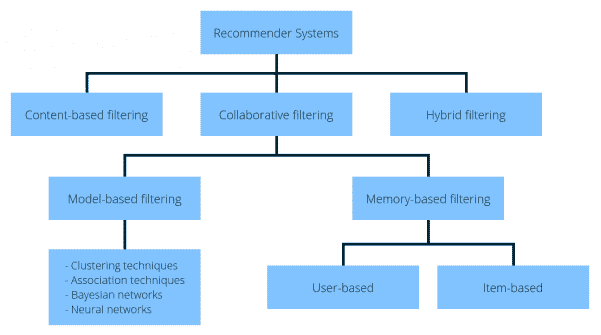
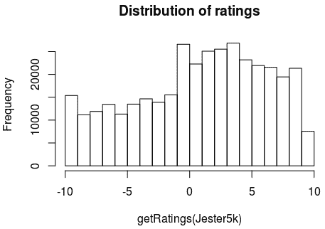
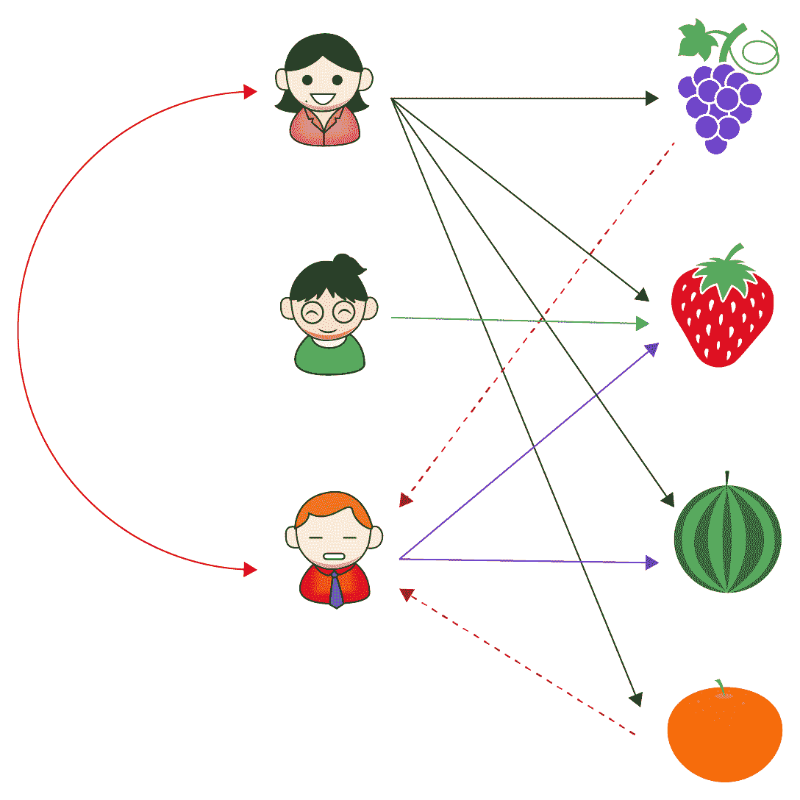
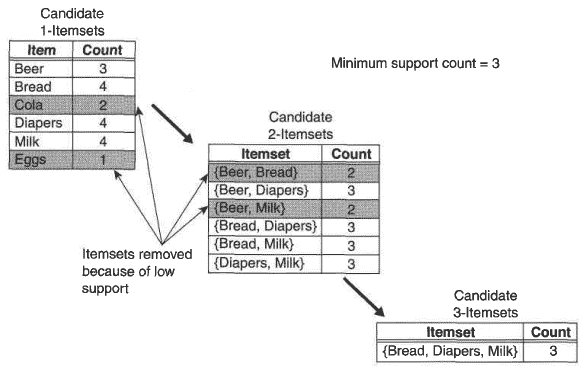
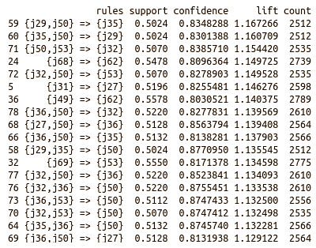
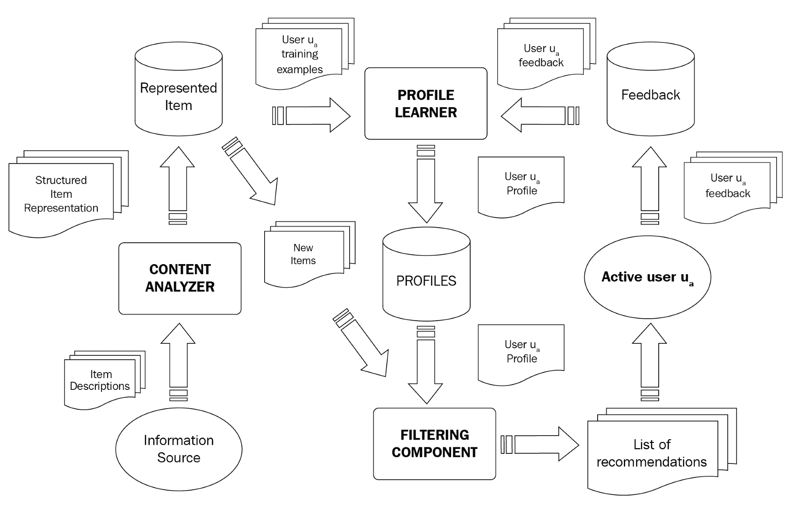
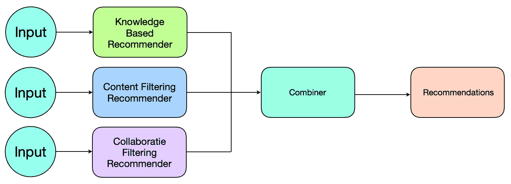

# 十六、实现笑话推荐引擎

我相信你也经历过这种事情:在亚马逊上购买手机时，你也会看到一些手机配件的产品推荐，如屏幕保护罩和手机壳。不足为奇的是，我们中的大多数人最终都会购买这些推荐中的一个或多个！电子商务网站中推荐引擎的主要目的是吸引买家从供应商那里购买更多的东西。当然，这与销售人员试图在实体店向客户追加销售或交叉销售没有什么不同。

你可能还记得买了这个商品的顾客也在亚马逊(或任何电子商务网站)上买了这个标题，那里有推荐。这些建议的目的是让你不仅仅购买一种产品，而是购买一种组合产品，从而推动销售收入上升。亚马逊上的推荐是如此成功，以至于麦肯锡估计亚马逊上 35%的总销售额来自他们的推荐！

在这一章中，我们将学习推荐引擎的理论和实现，它向用户推荐笑话。为了做到这一点，我们使用了 r 的`recommenderlab`库中可用的 Jester 的笑话数据集。

*   推荐引擎的基本方面
*   理解笑话推荐问题和数据集
*   使用基于项目的协同过滤技术的推荐系统
*   使用基于用户的协同过滤技术的推荐系统
*   使用关联规则挖掘技术的推荐系统
*   基于内容的推荐引擎
*   笑话推荐的混合推荐系统


# 推荐引擎的基本方面

虽然展示推荐的基本目的是推动销售，但它们实际上不仅仅是更好的销售概念。高度个性化的内容是推荐引擎能够提供的。这实质上意味着亚马逊等零售平台上的推荐引擎能够通过正确的渠道在正确的时间向正确的客户提供正确的内容。提供个性化内容是有意义的；毕竟，向客户展示不相关的产品是没有意义的。此外，随着客户注意力的降低，企业希望能够通过展示合适的产品并鼓励他们购买合适的产品来最大限度地增加销售机会。在非常高的水平上，个性化内容推荐在 AI 中以几种方式实现:

*   **映射一起购买的类似商品** : 让我们举一个网购者在某购物网站上搜索书包的例子。很有可能，购物者在购买书包时会对购买额外的学校相关物品感兴趣。因此，将书包与笔记本、铅笔、钢笔和铅笔盒放在一起展示，有助于增加销售。
*   **基于客户人口统计数据的推荐** : 向保守的中产阶级客户推荐高端手机和时尚的手机配件，他们通常会寻求便宜的交易，这可能不会使推荐产品的销量大幅上升。相反，这些客户可能会觉得这些不相关的推荐很烦人，从而影响他们的忠诚度。
*   **基于客户相似性的推荐** : 向客户推荐产品是基于其他相似客户购买或喜欢的产品。例如，向生活在城市地区的年轻女性推荐新上市的化妆品。在这种情况下，推荐不仅仅是因为客户的属性，还因为类似类型的其他客户已经购买了该产品。随着该商品在相似个体中受欢迎程度的增加，该商品被选为推荐商品。
*   **基于产品相似性的推荐** : 如果你搜索一个特定品牌的笔记本电脑背包，随着搜索结果的出现，你也会看到其他品牌的笔记本电脑背包作为推荐。这一建议纯粹是基于产品之间的相似性。

*   **基于顾客的历史购买简档的推荐** : 如果顾客总是购买特定品牌的牛仔裤，则向他们显示他们倾向于购买的特定品牌的较新品种的牛仔裤的推荐。这些建议纯粹基于客户的历史购买记录。
*   **混合推荐** : 可以将一种或多种推荐方法结合起来，为客户提供最佳推荐。例如，可以通过使用从历史数据以及从客户的人口统计信息推断的客户偏好来获得推荐列表。

回购活动、时事通讯推荐、废弃购物车的重新绑定、定制折扣和优惠以及电子商务网站的平滑浏览体验是在线零售业中推荐系统的一些应用。

由于几个普遍的使用案例，推荐系统似乎只用于电子商务行业。然而，事实并非如此。以下是推荐系统在非电子商务领域的一些使用案例:

*   在制药工业中，推荐系统被用于识别具有某些特征的药物患者，这些患者将对这些药物做出更好的反应
*   股票推荐是根据一群成功人士的选股结果进行的
*   YouTube 和在线媒体使用推荐引擎来提供与用户当前正在观看的内容相似的内容
*   旅游推荐是基于用户或类似用户参观过的旅游景点
*   识别未来员工在各种角色中的技能和个性特征
*   在烹饪科学中，可以通过推荐系统的应用来探索搭配在一起的菜肴

鉴于推荐系统的用例几乎存在于每个领域，这个列表可能会变得非常庞大。

既然我们已经对推荐系统的概念及其对商业的价值有了基本的理解，我们现在可以进入下一部分，在这里我们试图理解 Jester 的笑话推荐数据集以及可以通过构建推荐引擎来解决的问题。


# 推荐引擎类别

在实现我们的第一个推荐系统之前，让我们详细探讨一下推荐系统的类型。下图显示了推荐系统的主要类别:



推荐系统类别

图中所示的每种技术都可以用来建立一个推荐系统模型，该模型能够向用户建议笑话。让我们简单地探讨一下各种推荐引擎类别。


# 基于内容的过滤

认知过滤，或基于内容的过滤，通过比较产品属性和客户档案属性来推荐商品。每个产品的属性都表示为一组标签或术语，通常是产品描述文档中出现的词语。客户简档用相同的术语表示，并通过分析客户看过或评价过的产品的内容来构建。


# 协同过滤

社交过滤，或协作过滤，通过使用其他人的推荐来过滤信息。协同过滤背后的原理是，过去欣赏过相同项目的客户在将来也很有可能表现出类似的兴趣。

我们通常会在看电影之前向朋友征求评论和推荐。朋友的推荐比别人的推荐更容易被接受，因为我们和朋友有共同的兴趣。这与协同过滤的工作原理相同。

协同过滤可以进一步分为基于记忆的和基于模型的，如下所示:

*   **基于记忆的**:在这种方法中，用户评分信息用于计算用户或项目之间的相似度。这个计算出的相似度然后被用于提出推荐。
*   **基于模型的**:应用数据挖掘方法来识别数据中的模式，然后使用学习到的模式来生成建议。


# 混合滤波

在这类推荐系统中，我们结合多种类型的推荐系统来提出最终的推荐。


# 入门指南

要开始，您必须从这个 GitHub 链接下载支持文件:[https://GitHub . com/packt publishing/Advanced-Machine-Learning-with-R/tree/master/chapter 16](https://github.com/PacktPublishing/Advanced-Machine-Learning-with-R/tree/master/Chapter16)。


# 理解笑话推荐问题和数据集

肯·戈德堡博士和他的同事 Theresa Roeder、Dhruv Gupta 和 Chris Perkins 通过他们的论文 *Eigentaste 向世界介绍了一个数据集:一个常数时间协同过滤算法*，它在推荐系统领域非常受欢迎。该数据集被命名为小丑的笑话数据集。为了创建它，一些用户会看到几个笑话，并被要求对它们进行评分。用户对各种笑话的评分构成了数据集。该数据集中的数据收集于 1999 年 4 月至 2003 年 5 月之间。以下是数据集的属性:

*   79，681 名用户对 150 个笑话的评分超过 11，000，000
*   每一行都是一个用户(第 1 行=用户#1)

*   每一列都是一个笑话(第 1 列=笑话#1)
*   等级是从-10.00 到+10.00 的真实值；-10 是可能的最低评级，10 是最高评级
*   99 对应于零评级

R 中的`recommenderlab`包提供了肯·戈德堡博士团队提供的原始数据集的子集。我们将在本章的项目中使用这个子集。

`recommenderlab`库中提供的`Jester5k`数据集包含一个 5,000 x 100 的评分矩阵(5000 个用户和 100 个笑话)，评分在-10.00 到+10.00 之间。所有选定的用户都给 36 个或更多的笑话评分。数据集采用的是`realRatingMatrix`格式。这是一种特殊的矩阵格式，`recommenderlab`希望数据采用这种格式，以应用库中打包的各种功能。

我们已经知道，**探索性数据分析** ( **EDA** )是任何数据科学项目的第一步。根据这一原则，让我们从读取数据开始，然后对数据集进行 EDA 步骤:

```r
# including the required libraries
library(data.table)
library(recommenderlab)
# setting the seed so as to reproduce the results
set.seed(54)
# reading the data to a variable
library(recommenderlab)
data(Jester5k)
str(Jester5k)
```

这将导致以下输出:

```r
Formal class 'realRatingMatrix' [package "recommenderlab"] with 2 slots
  ..@ data     :Formal class 'dgCMatrix' [package "Matrix"] with 6 slots
  .. .. ..@ i       : int [1:362106] 0 1 2 3 4 5 6 7 8 9 ...
  .. .. ..@ p       : int [1:101] 0 3314 6962 10300 13442 18440 22513 27512 32512 35685 ...
  .. .. ..@ Dim     : int [1:2] 5000 100
  .. .. ..@ Dimnames:List of 2
  .. .. .. ..$ : chr [1:5000] "u2841" "u15547" "u15221" "u15573" ...
  .. .. .. ..$ : chr [1:100] "j1" "j2" "j3" "j4" ...
  .. .. ..@ x       : num [1:362106] 7.91 -3.2 -1.7 -7.38 0.1 0.83 2.91 -2.77 -3.35 -1.99 ...
  .. .. ..@ factors : list()
  ..@ normalize: NULL
```

数据结构的输出是不言自明的，我们看到它为我们已经讨论过的细节提供了经验证据。让我们继续我们的 EDA:

```r
# Viewing the first 5 records in the dataset
head(getRatingMatrix(Jester5k),5)
```

这将导致以下输出:

```r
2.5 x 100 sparse Matrix of class "dgCMatrix"
   [[ suppressing 100 column names ‘j1’, ‘j2’, ‘j3’ ... ]]                                                                                                           
u2841   7.91  9.17  5.34  8.16 -8.74  7.14  8.88 -8.25  5.87  6.21  7.72  6.12 -0.73  7.77 -5.83 -8.88  8.98
u15547 -3.20 -3.50 -9.56 -8.74 -6.36 -3.30  0.78  2.18 -8.40 -8.79 -7.04 -6.02  3.35 -4.61  3.64 -6.41 -4.13
u15221 -1.70  1.21  1.55  2.77  5.58  3.06  2.72 -4.66  4.51 -3.06  2.33  3.93  0.05  2.38 -3.64 -7.72  0.97
u15573 -7.38 -8.93 -3.88 -7.23 -4.90  4.13  2.57  3.83  4.37  3.16 -4.90 -5.78 -5.83  2.52 -5.24  4.51  4.37
u21505  0.10  4.17  4.90  1.55  5.53  1.50 -3.79  1.94  3.59  4.81 -0.68 -0.97 -6.46 -0.34 -2.14 -2.04 -2.57                                
u2841  -9.32 -9.08 -9.13 7.77  8.59  5.29  8.25  6.02  5.24  7.82  7.96 -8.88  8.25  3.64 -0.73  8.25  5.34 -7.77
u15547 -0.15 -1.84 -1.84 1.84 -1.21 -8.59 -5.19 -2.18  0.19  2.57 -5.78  1.07 -8.79  3.01  2.67 -9.22 -9.32  3.69
u15221  2.04  1.94  4.42 1.17  0.10 -5.10 -3.25  3.35  3.30 -1.70  3.16 -0.29  1.36  3.54  6.17 -2.72  3.11  4.81
u15573  4.95  5.49 -0.49 3.40 -2.14  5.29 -3.11 -4.56 -5.44 -6.89 -0.24 -5.15 -3.59 -8.20  2.18  0.39 -1.21 -2.62
u21505 -0.15  2.43  3.16 1.50  4.37 -0.10 -2.14  3.98  2.38  6.84 -0.68  0.87  3.30  6.21  5.78 -6.21 -0.78 -1.36
## number of ratings
print(nratings(Jester5k))
```

这将导致以下输出:

```r
362106## number of ratings per user
```

我们将使用以下命令打印数据集的摘要:

```r
print(summary(rowCounts(Jester5k)))
```

这将导致以下输出:

```r
   Min. 1st Qu.  Median    Mean 3rd Qu.    Max.
  36.00   53.00   72.00   72.42  100.00  100.00
```

我们现在将绘制直方图:

```r
## rating distribution
hist(getRatings(Jester5k), main="Distribution of ratings")
```

这将导致以下输出:



从输出中，我们看到了某种程度上的正态分布。也可以看出正面评价多于负面评价。

`Jester5K`数据集还提供了一个名为`JesterJokes`的字符向量。向量的长度为 100。这些是真实的 100 个笑话，这些笑话被展示给用户以获得评分。我们可以用下面的命令检查笑话:

```r
head(JesterJokes,5)
```

这将导致以下输出:

```r
j1 "A man visits the doctor. The doctor says \"I have bad news for you.You have cancer and Alzheimer's disease\". The man replies \"Well,thank God I don't have cancer!\""
j2 "This couple had an excellent relationship going until one day he came home from work to find his girlfriend packing. He asked her why she was leaving him and she told him that she had heard awful things about him. \"What could they possibly have said to make you move out?\" \"They told me that you were a pedophile.\" He replied, \"That's an awfully big word for a ten year old.\""
j3  "Q. What's 200 feet long and has 4 teeth? A. The front row at a Willie Nelson Concert."
j4 "Q. What's the difference between a man and a toilet? A. A toilet doesn't follow you around after you use it."
j5 "Q. What's O. J. Simpson's Internet address? A. Slash, slash, backslash, slash, slash, escape."
```

基于我们拥有的 5000 个用户评级，我们可以执行额外的 EDA 来确定被用户评为最佳的笑话。这可以通过下面的代码来完成:

```r
## 'best' joke with highest average rating
best <- which.max(colMeans(Jester5k))
cat(JesterJokes[best])
```

这将导致以下输出:

```r
A guy goes into confession and says to the priest, "Father, I'm 80 years old, widower, with 11 grandchildren. Last night I met two beautiful flight attendants. They took me home and I made love to both of them. Twice." The priest said: "Well, my son, when was the last time you were in confession?" "Never Father, I'm Jewish." "So then, why are you telling me?" "I'm telling everybody."
```

我们可以执行额外的 EDA 来可视化单变量和多变量分析。这种探索将帮助我们详细了解每个变量以及它们之间的关系。虽然我们不会深入研究这些方面，但这里有一些想法可以探讨:

*   探索总是给大多数笑话提供高评级的用户
*   提供给笑话的等级之间的相关性
*   识别非常关键的用户
*   探索最受欢迎或最不受欢迎的笑话
*   识别具有最少评级的笑话并识别它们之间的关联


# 转换数据帧

在本章中，我们将使用名为`recommenderlab`的 R 库中的函数来构建推荐引擎项目。不考虑我们实现的推荐系统的类别，数据集需要满足一些先决条件才能应用`recommenderlab`函数。用于协同过滤的预建的`recommenderlab`函数期望`realRatingMatrix`作为输入被提供。在我们的例子中，`Jester5k`数据集已经是这种格式，因此，我们可以直接使用这个矩阵来应用`recommenderlab`函数。

如果我们的数据是 R 数据帧，如果我们打算转换成`realRatingMatrix`，可以执行以下步骤:

1.  将数据帧转换为 R 矩阵，如下所示:

```r
# convert the df dataframe to a matrix
r_mat <- as.matrix(df)
```

2.  借助`as()`函数，将结果矩阵转换为`realRatingMatrix`，如下所示:

```r
# convert r_mat matrix to a recommenderlab realRatingMatrix
r_real_mat <- as(r_mat,"realRatingMatrix")
```

这里，我们假设数据帧的名字是`df`，代码将把它转换成一个`realRatingMatrix`，它可以被用作`recommenderlab`函数的输入。


# 分割数据帧

另一个先决条件是将数据集分成训练和测试子集。这些子集将在后面的章节中用于实现我们的推荐系统和测量性能。`recommenderlab`库中的`evaluationScheme()`函数可用于将数据集分成训练和测试子集。许多用户指定的参数可以传递给这个函数。在下面的代码中，`realRatingMatrix`按照 80/20 的训练/测试分割，为每个用户推荐最多 20 个项目。此外，我们规定任何大于`0`的评级都将被视为正面评级，符合预定义的`[-10, 10]`评级标准。`Jester5k`数据集可分为训练数据集和测试数据集，代码如下:

```r
# split the data into the training and the test set
Jester5k_es <- evaluationScheme(Jester5k, method="split", train=0.8, given=20, goodRating=0)
# verifying if the train - test was done successfully
print(Jester5k_es)
```

这将导致以下输出:

```r
Evaluation scheme with 20 items given
Method: ‘split’ with 1 run(s).
Training set proportion: 0.800
Good ratings: >=0.000000
Data set: 5000 x 100 rating matrix of class ‘realRatingMatrix’ with 362106 ratings.
```

从`evaluationScheme()`函数的输出中，我们可以观察到该函数产生了一个包含训练和测试子集的 R 对象。该对象将用于定义和评估各种推荐模型。


# 利用基于项目的协同过滤技术构建推荐系统

R 的`recommenderlab`包提供了**基于项目的协同过滤** ( **ITCF** )选项来构建推荐系统。这是一个非常简单的方法，只需要我们调用函数并为它提供必要的参数。一般来说，参数会对模型的性能产生很大的影响；因此，测试每个参数组合是获得最佳推荐模型的关键。以下是可以传递给`Recommender`函数的参数:

*   **数据标准化**:标准化评分矩阵是为推荐引擎准备数据的关键步骤。标准化过程通过消除评等偏差来处理基准表中的评等。该参数的可能值为`NULL`、`Center`和`Z-Score`。
*   **距离**:这代表了模型中使用的相似性度量的类型。此参数的可能值为余弦相似性、欧几里德距离和皮尔逊相关。

有了这些参数组合，我们可以构建和测试 3×3 的 ITCF 模型。ITCF 背后的基本直觉是，如果一个人喜欢 A 项，那么只要 A 项和 B 项相似，他们很可能也会喜欢 B 项。可以理解，术语*相似*并不表示基于项目属性的项目之间的相似性，而是用户偏好的相似性，例如，喜欢项目 A 的一群人也喜欢项目 b。下图显示了 ITCF 的工作原理:


展示基于项目的协同过滤工作的示例

让我们更详细地研究一下这个图。在 ITCF，西瓜和葡萄将形成相似物品邻域，这意味着不管用户是谁，等价的不同物品将形成一个邻域。所以当用户 X 喜欢西瓜时，来自相同邻域的另一个项目，即葡萄，将由基于项目的协同过滤的推荐系统推荐。

ITCF 包括以下三个步骤:

1.  **通过距离度量计算基于项目的相似性**:这包括计算项目之间的距离。可以用许多距离度量中的一种来计算距离，例如余弦相似度、欧几里德距离、曼哈顿距离或雅克卡指数。该步骤的输出是获得相似性矩阵，其中每个单元对应于在单元的行上指定的项目和在单元的列上指定的项目的相似性。

2.  **预测特定用户的目标物品评分**:通过计算与目标物品非常相似的物品的评分的加权和来得出评分。
3.  **推荐前 N 项**:预测完所有项目后，我们推荐前 *N* 项。

现在，让我们构建每个 ITCF 模型，并根据测试数据集测量性能。下面的代码为 ITCF 模型定型了几个参数组合:

```r
type = "IBCF"
##train ITCF cosine similarity models
# non-normalized
ITCF_N_C <- Recommender(getData(Jester5k_es, "train"), type,
                        param=list(normalize = NULL, method="Cosine"))
# centered
ITCF_C_C <- Recommender(getData(Jester5k_es, "train"), type,
                        param=list(normalize = "center",method="Cosine"))
# Z-score normalization
ITCF_Z_C <- Recommender(getData(Jester5k_es, "train"), type,
                        param=list(normalize = "Z-score",method="Cosine"))
##train ITCF Euclidean Distance models
# non-normalized
ITCF_N_E <- Recommender(getData(Jester5k_es, "train"), type,
                        param=list(normalize = NULL, method="Euclidean"))
# centered
ITCF_C_E <- Recommender(getData(Jester5k_es, "train"), type,
                        param=list(normalize = "center",method="Euclidean"))
# Z-score normalization
ITCF_Z_E <- Recommender(getData(Jester5k_es, "train"), type,
                        param=list(normalize = "Z-score",method="Euclidean"))
#train ITCF pearson correlation models
# non-normalized
ITCF_N_P <- Recommender(getData(Jester5k_es, "train"), type,
                        param=list(normalize = NULL, method="pearson"))
# centered
ITCF_C_P <- Recommender(getData(Jester5k_es, "train"), type,
                        param=list(normalize = "center",method="pearson"))
# Z-score normalization
ITCF_Z_P <- Recommender(getData(Jester5k_es, "train"), type,
                        param=list(normalize = "Z-score",method="pearson"))
```

我们现在有了 ITCF 模型，所以让我们开始计算我们创建的每个模型在测试数据上的性能。目标是为该数据集确定性能最佳的 ITCF 模型。以下代码获取测试数据集上所有九个模型的性能测量值:

```r
# compute predicted ratings from each of the 9 models on the test dataset
pred1 <- predict(ITCF_N_C, getData(Jester5k_es, "known"), type="ratings")
pred2 <- predict(ITCF_C_C, getData(Jester5k_es, "known"), type="ratings")
pred3 <- predict(ITCF_Z_C, getData(Jester5k_es, "known"), type="ratings")
pred4 <- predict(ITCF_N_E, getData(Jester5k_es, "known"), type="ratings")
pred5 <- predict(ITCF_C_E, getData(Jester5k_es, "known"), type="ratings")
pred6 <- predict(ITCF_Z_E, getData(Jester5k_es, "known"), type="ratings")
pred7 <- predict(ITCF_N_P, getData(Jester5k_es, "known"), type="ratings")
pred8 <- predict(ITCF_C_P, getData(Jester5k_es, "known"), type="ratings")
pred9 <- predict(ITCF_Z_P, getData(Jester5k_es, "known"), type="ratings")
# set all predictions that fall outside the valid range to the boundary values
pred1@data@x[pred1@data@x[] < -10] <- -10
pred1@data@x[pred1@data@x[] > 10] <- 10
pred2@data@x[pred2@data@x[] < -10] <- -10
pred2@data@x[pred2@data@x[] > 10] <- 10
pred3@data@x[pred3@data@x[] < -10] <- -10
pred3@data@x[pred3@data@x[] > 10] <- 10
pred4@data@x[pred4@data@x[] < -10] <- -10
pred4@data@x[pred4@data@x[] > 10] <- 10
pred5@data@x[pred5@data@x[] < -10] <- -10
pred5@data@x[pred5@data@x[] > 10] <- 10
pred6@data@x[pred6@data@x[] < -10] <- -10
pred6@data@x[pred6@data@x[] > 10] <- 10
pred7@data@x[pred7@data@x[] < -10] <- -10
pred7@data@x[pred7@data@x[] > 10] <- 10
pred8@data@x[pred8@data@x[] < -10] <- -10
pred8@data@x[pred8@data@x[] > 10] <- 10
pred9@data@x[pred9@data@x[] < -10] <- -10
pred9@data@x[pred9@data@x[] > 10] <- 10
# aggregate the performance measurements obtained from all the models
error_ITCF <- rbind(
  ITCF_N_C = calcPredictionAccuracy(pred1, getData(Jester5k_es, "unknown")),
  ITCF_C_C = calcPredictionAccuracy(pred2, getData(Jester5k_es, "unknown")),
  ITCF_Z_C = calcPredictionAccuracy(pred3, getData(Jester5k_es, "unknown")),
  ITCF_N_E = calcPredictionAccuracy(pred4, getData(Jester5k_es, "unknown")),
  ITCF_C_E = calcPredictionAccuracy(pred5, getData(Jester5k_es, "unknown")),
  ITCF_Z_E = calcPredictionAccuracy(pred6, getData(Jester5k_es, "unknown")),
  ITCF_N_P = calcPredictionAccuracy(pred7, getData(Jester5k_es, "unknown")),
  ITCF_C_P = calcPredictionAccuracy(pred8, getData(Jester5k_es, "unknown")),
  ITCF_Z_P = calcPredictionAccuracy(pred9, getData(Jester5k_es, "unknown"))
)
library(knitr)
kable(error_ITCF)
```

这将导致以下输出:

```r
|         |     RMSE|      MSE|      MAE|
|:--------|--------:|--------:|--------:|
|ITCF_N_C | 4.533455| 20.55221| 3.460860|
|ITCF_C_C | 5.082643| 25.83326| 4.012391|
|ITCF_Z_C | 5.089552| 25.90354| 4.021435|
|ITCF_N_E | 4.520893| 20.43848| 3.462490|
|ITCF_C_E | 4.519783| 20.42844| 3.462271|
|ITCF_Z_E | 4.527953| 20.50236| 3.472080|
|ITCF_N_P | 4.582121| 20.99583| 3.522113|
|ITCF_C_P | 4.545966| 20.66581| 3.510830|
|ITCF_Z_P | 4.569294| 20.87845| 3.536400|
```

我们看到，ITCF 推荐应用于具有欧几里德距离的数据产生了最佳性能测量的输出。


# 利用基于用户的协同过滤技术构建推荐系统

我们之前构建的笑话推荐系统，基于条目的过滤，使用了 r 中可用的强大的`recommenderlab`库。在这个基于**用户的协作过滤** ( **UBCF** )方法的实现中，我们使用了同一个库。

下图显示了 UBCF 的工作原理:



描述基于用户的协作过滤器的工作原理的例子

为了更好地理解这个概念，让我们详细讨论前面的图表。假设有三个用户:X、Y 和 Z。在 UBCF，用户 X 和 Z 非常相似，因为他们都喜欢草莓和西瓜。用户 X 也喜欢葡萄和橘子。于是一个基于用户的协同过滤器向用户 z 推荐葡萄和橙子，这个想法就是相似的人往往喜欢相似的东西。

基于用户的协作过滤器和基于项目的协作过滤器之间的主要区别由在线零售网站中常见的以下推荐标题来证明:

*   **ITCF** :买了这件商品的顾客也买了
*   **UBCF** :和你差不多的客户买了

基于用户的协作过滤器建立在以下三个关键步骤之上:

1.  找到用户 *x* 的 **k 个最近邻居** ( **KNN** )，使用相似度函数 *w* ，测量每对用户之间的距离:


2.  预测用户 *x* 将对 KNN 已经评级，但 *x* 没有评级的所有项目提供的评级。
3.  向用户 *x* 推荐的 *N* 个项目是具有最佳预测评级的前 *N* 个项目。

简而言之，在 UBCF 过程中构建用户-项目矩阵，并基于相似的用户，预测用户的未观看项目的评级。在预测中获得最高评级的项目构成了最终的推荐列表。

这个项目的实现非常类似于 ITCF，因为我们使用同一个库。代码中唯一需要的更改是将 IBCF 方法改为使用 UBCF。以下代码块是 UBCF 项目实现的完整代码:

```r
library(recommenderlab)
data(Jester5k)
# split the data into the training and the test set
Jester5k_es <- evaluationScheme(Jester5k, method="split", train=0.8, given=20, goodRating=0)
print(Jester5k_es)
type = "UBCF"
#train UBCF cosine similarity models
# non-normalized
UBCF_N_C <- Recommender(getData(Jester5k_es, "train"), type,
                        param=list(normalize = NULL, method="Cosine"))
# centered
UBCF_C_C <- Recommender(getData(Jester5k_es, "train"), type,
                        param=list(normalize = "center",method="Cosine"))
# Z-score normalization
UBCF_Z_C <- Recommender(getData(Jester5k_es, "train"), type,
                        param=list(normalize = "Z-score",method="Cosine"))
#train UBCF Euclidean Distance models
# non-normalized
UBCF_N_E <- Recommender(getData(Jester5k_es, "train"), type,
                        param=list(normalize = NULL, method="Euclidean"))
# centered
UBCF_C_E <- Recommender(getData(Jester5k_es, "train"), type,
                        param=list(normalize = "center",method="Euclidean"))
# Z-score normalization
UBCF_Z_E <- Recommender(getData(Jester5k_es, "train"), type,
                        param=list(normalize = "Z-score",method="Euclidean"))
#train UBCF pearson correlation models
# non-normalized
UBCF_N_P <- Recommender(getData(Jester5k_es, "train"), type,
                        param=list(normalize = NULL, method="pearson"))
# centered
UBCF_C_P <- Recommender(getData(Jester5k_es, "train"), type,
                        param=list(normalize = "center",method="pearson"))
# Z-score normalization
UBCF_Z_P <- Recommender(getData(Jester5k_es, "train"), type,
                        param=list(normalize = "Z-score",method="pearson"))
# compute predicted ratings from each of the 9 models on the test dataset
pred1 <- predict(UBCF_N_C, getData(Jester5k_es, "known"), type="ratings")
pred2 <- predict(UBCF_C_C, getData(Jester5k_es, "known"), type="ratings")
pred3 <- predict(UBCF_Z_C, getData(Jester5k_es, "known"), type="ratings")
pred4 <- predict(UBCF_N_E, getData(Jester5k_es, "known"), type="ratings")
pred5 <- predict(UBCF_C_E, getData(Jester5k_es, "known"), type="ratings")
pred6 <- predict(UBCF_Z_E, getData(Jester5k_es, "known"), type="ratings")
pred7 <- predict(UBCF_N_P, getData(Jester5k_es, "known"), type="ratings")
pred8 <- predict(UBCF_C_P, getData(Jester5k_es, "known"), type="ratings")
pred9 <- predict(UBCF_Z_P, getData(Jester5k_es, "known"), type="ratings")
# set all predictions that fall outside the valid range to the boundary values
pred1@data@x[pred1@data@x[] < -10] <- -10
pred1@data@x[pred1@data@x[] > 10] <- 10
pred2@data@x[pred2@data@x[] < -10] <- -10
pred2@data@x[pred2@data@x[] > 10] <- 10
pred3@data@x[pred3@data@x[] < -10] <- -10
pred3@data@x[pred3@data@x[] > 10] <- 10
pred4@data@x[pred4@data@x[] < -10] <- -10
pred4@data@x[pred4@data@x[] > 10] <- 10
pred5@data@x[pred5@data@x[] < -10] <- -10
pred5@data@x[pred5@data@x[] > 10] <- 10
pred6@data@x[pred6@data@x[] < -10] <- -10
pred6@data@x[pred6@data@x[] > 10] <- 10
pred7@data@x[pred7@data@x[] < -10] <- -10
pred7@data@x[pred7@data@x[] > 10] <- 10
pred8@data@x[pred8@data@x[] < -10] <- -10
pred8@data@x[pred8@data@x[] > 10] <- 10
pred9@data@x[pred9@data@x[] < -10] <- -10
pred9@data@x[pred9@data@x[] > 10] <- 10
# aggregate the performance statistics
error_UBCF <- rbind(
  UBCF_N_C = calcPredictionAccuracy(pred1, getData(Jester5k_es, "unknown")),
  UBCF_C_C = calcPredictionAccuracy(pred2, getData(Jester5k_es, "unknown")),
  UBCF_Z_C = calcPredictionAccuracy(pred3, getData(Jester5k_es, "unknown")),
  UBCF_N_E = calcPredictionAccuracy(pred4, getData(Jester5k_es, "unknown")),
  UBCF_C_E = calcPredictionAccuracy(pred5, getData(Jester5k_es, "unknown")),
  UBCF_Z_E = calcPredictionAccuracy(pred6, getData(Jester5k_es, "unknown")),
  UBCF_N_P = calcPredictionAccuracy(pred7, getData(Jester5k_es, "unknown")),
  UBCF_C_P = calcPredictionAccuracy(pred8, getData(Jester5k_es, "unknown")),
  UBCF_Z_P = calcPredictionAccuracy(pred9, getData(Jester5k_es, "unknown"))
)
library(knitr)
print(kable(error_UBCF))
```

这将导致以下输出:

```r
|         |     RMSE|      MSE|      MAE|
|:--------|--------:|--------:|--------:|
|UBCF_N_C | 4.877935| 23.79425| 3.986170|
|UBCF_C_C | 4.518210| 20.41422| 3.578551|
|UBCF_Z_C | 4.517669| 20.40933| 3.552120|
|UBCF_N_E | 4.644877| 21.57488| 3.778046|
|UBCF_C_E | 4.489157| 20.15253| 3.552543|
|UBCF_Z_E | 4.496185| 20.21568| 3.528534|
|UBCF_N_P | 4.927442| 24.27968| 4.074879|
|UBCF_C_P | 4.487073| 20.13382| 3.553429|
|UBCF_Z_P | 4.484986| 20.11510| 3.525356|
```

基于 UBCF 输出，我们观察到以皮尔逊相关作为距离的`Z-score`标准化数据产生了最佳性能测量。此外，如果我们愿意，可以比较 UBCF 和 ITCF 的结果(测试需要在相同的测试数据集上进行)，以得出接受为最终推荐引擎部署而构建的 18 个模型中的最佳模型的结论。

代码中需要注意的关键点是传递给`method`参数的`UBCF`值。在之前的项目中，我们构建了一个基于项目的协作过滤器；我们需要做的就是用 IBCF 替换传递给`method`参数的值。


# 基于关联规则挖掘技术构建推荐系统

关联规则挖掘或市场购物篮分析是零售业中非常流行的数据挖掘技术，用于识别需要放在一起以鼓励交叉销售的产品。该算法背后一个有趣的方面是挖掘历史发票来识别一起购买的产品。

有几种现成的算法可用于执行购物篮分析。其中有先验、**等价类变换** ( **ECLAT** )、**频繁模式增长** ( **FP-growth** )。我们将学习通过在 Jester 笑话数据集上应用 Apriori 算法来解决向用户推荐笑话的问题。我们现在将学习支持 Apriori 算法的理论方面。


# Apriori 算法

该算法的构建块是在任何给定交易中找到的项目。每个事务可以包含一个或多个项目。构成事务的项称为项集。交易的一个例子是发票。

给定事务数据集，目标是找到数据中相互关联的项。关联性被测量为项目在相同上下文中出现的频率。例如，在购买一个产品的同时购买另一个产品，这代表了一个关联规则。关联规则检测项目的常见用法。

更正式地说，我们可以将关联规则挖掘定义为，给定一组项目 I = {I1，I2，..Im}和数据库事务 D = {t1，t，2..tn}，其中 ti= { Ii1，Ii2..Iim}其中 Iik 是的元素，关联是 X->Y 的蕴涵，其中 I 的 X，Y 子集是项目集，X 交集 Y 是φ。简而言之，关联表达了一个来自 X-> Y 的蕴涵，其中 X 和 Y 是项集。

通过一个例子可以更好的理解算法。因此，让我们考虑下表，它显示了一个超市中典型的交易示例列表:

| **交易** | **项目** |
| one | 牛奶、凝乳、巧克力 |
| Two | 面包，黄油 |
| three | 可乐，果酱 |
| four | 面包、牛奶、黄油、可乐 |
| five | 面包、牛奶、黄油、果酱 |

超级市场中的交易示例

让我们尝试探索一些有助于理解 Apriori 算法工作原理的基本概念:

*   **项目**:项目是每笔交易中的任何一个产品。例如，牛奶、可乐和黄油都被称为物品。
*   **Itemset** :一个或多个项目的集合。例如，*{黄油，牛奶，可乐}，{黄油，牛奶}* 。

*   **支持计数**:一个项目集出现的频率。例如，支持计数或*σ{黄油、面包、牛奶} = 2* 。
*   **支持**:包含一个项集的事务的一部分。比如*s = {黄油面包牛奶} = 2/5* 。
*   **频繁项集**:支持度大于最小阈值的项集。
*   **支持上下文**中的项集:包含 *X* 和 *Y* 的部分上下文:


所以，*{牛奶，黄油}->{面包}的 *s* 将为 s =σ{牛奶，黄油，面包}/N = 2/5 = 0.4*

*   **Confidence** :度量规则的强度，而 support 度量规则在数据库中出现的频率。它通过以下公式计算出 *Y* 中的项目出现在 *X* 中的频率:


例如:对于{面包}--> {黄油}

*c 或α=σ{黄油，面包}/σ{面包} = 3/3 = 1*

让我们考虑另一个例子*{凝乳}->{面包}* 的置信度:

*c 或α=σ{凝乳，面包}/σ{面包} = 0/3 = 0*

Apriori 算法旨在从项目列表中生成所有可能的项目集组合，然后删除符合传递给该算法的预定义支持度和置信度参数值的项目集。因此，可以理解，Apriori 算法是一个两步算法:

1.  从项目生成项目集
2.  基于预定义的支持度和置信度评估和修剪项目集

让我们详细讨论步骤 1。假设集合中有 *n* 个项目。一个人可以创建的项目集的数量是 2^ *n* ，所有这些都需要在第二步中进行评估，以便得出最终结果。即使只考虑 100 个不同的项目，生成的项目集数量也是 1.27e+30！大量的项目集带来了严峻的计算挑战。

Apriori 算法通过抢占通常很少或不太重要的项目集来克服这一挑战。先验原则规定*如果一个项目集是频繁的，那么它的所有子集也必须是频繁的*。这意味着，如果一个项目不满足预定义的支持阈值，则该项目不会参与项目集的创建。因此，Apriori 算法提出了有限数量的可评估项目集，而不会遇到计算挑战。

该算法的第一步本质上是迭代的。在第一次迭代中，它考虑长度为 1 的所有项集，即每个项集中只包含一项。然后，对每个项目进行评估，以消除被发现不符合预设支持阈值的项目集。第一次迭代的输出是满足所需支持的长度为 1 的所有项集。这成为迭代 2 的输入，现在长度为 2 的项集仅使用第一次迭代中输出的最终项集来形成。再次检查在步骤 2 中形成的每个项目集的支持度阈值；如果不满足，则删除此类项目集。迭代继续进行，直到无法创建新的项集。下图说明了项目集的处理过程:



显示 Apriori 算法中项目集创建的图示

一旦所有项目集都提交了算法的第一步迭代，第二步就开始了。对生成的每个项目集进行测试，以检查它是否满足预定义的置信度值。如果不满足阈值，则从最终输出中删除这些项目集。

在一个阶段，所有的迭代都完成了，最终的规则是先验的输出，我们利用一个叫做 lift 的度量来消费来自最终输出的相关规则。Lift 定义了一个项目或项目集相对于其典型购买率被购买的可能性，假设我们知道另一个项目或项目集已被购买。对于每个项目集，我们使用以下公式获得提升度量:


让我们更深入地理解提升度量。假设在超市，牛奶和面包是偶然一起买的。在这种情况下，预计大量交易将涵盖购买的牛奶和面包。lift(牛奶->面包)大于 1 意味着这些物品被发现放在一起的次数比偶然一起购买的次数多。当评估规则在商业中的有用性时，我们通常会寻找大于 1 的提升值。提升值大于 1 表示生成的项集非常强大，因此值得考虑实现。

现在，让我们使用 Apriori 算法实现推荐系统:

```r
# load the required libraries
library(data.table)
library(arules)
library(recommenderlab)
# set the seed so that the results are replicable
set.seed(42)
# reading the Jester5k data
data(Jester5k)
class(Jester5k)
```

这将导致以下输出:

```r
[1] "realRatingMatrix"
attr(,"package")
[1] "recommenderlab"
```

从输出中我们可以看到，`recommenderlab`库中的`Jester5k`数据是`realRatingsMatrix`格式的。我们还知道，该矩阵中的单元格包含用户对各种笑话提供的评级，我们知道评级范围在-10 到+10 之间。

在`Jester5k`数据集上应用 Apriori 算法让我们有机会理解笑话之间的关联。但是，在应用 Apriori 算法之前，我们需要将数据集转换为二进制值，其中 1 表示正面评级，0 表示负面评级或无评级。`recommenderlab`库提供了`binarize()`函数，它可以为我们执行所需的操作。以下代码将评级矩阵二进制化:

```r
# binarizing the Jester ratings
Jester5k_bin <- binarize(Jester5k, minRating=1)
# let us verify the binarized object
class(Jester5k_bin)
```

这将导致以下输出:

```r
[1] "binaryRatingMatrix"
attr(,"package")
[1] "recommenderlab"
```

我们可以从输出中观察到`realRatingsMatrix`被成功转换为`binaryRatingMatrix`。挖掘关联的 Apriori 算法期望传递一个矩阵作为输入，而不是`binaryRatingMatrix`。我们可以很容易地用下面的代码将`Jester5k_bin`对象转换成矩阵格式:

```r
# converting the binaryratingsmatrix to matrix format
Jester5k_bin_mat <- as(Jester5k_bin,"matrix")
# visualizing the matrix object
View(Jester5k_bin_mat)
```

这将导致以下输出:


我们从输出中看到，矩阵的所有单元都表示为`TRUE`和`FALSE`，但是 Apriori 期望单元是数字的。现在让我们用下面的代码将单元格分别转换为`TRUE`和`FALSE`的`1`和`0`:

```r
# converting the cell values to 1 and 0
Jester5k_bin_mat_num <- 1*Jester5k_bin_mat
# viewing the matrix
View(Jester5k_bin_mat_num)
```

这将导致以下输出:


现在，我们已经准备好对数据集应用 Apriori 算法。我们需要将两个参数`support`和`confidence`传递给算法。该算法基于这两个参数值挖掘数据集。我们将`0.5`作为支持值，将`0.8`作为信心值。下面一行代码提取了 Jester 笑话数据集中存在的笑话关联:

```r
rules <- apriori(data = Jester5k_bin_mat_num, parameter = list(supp = 0.005, conf = 0.8))
```

这将导致以下输出:

```r
Apriori
Parameter specification:
 confidence minval smax arem  aval originalSupport maxtime support minlen maxlen target   ext
        0.8    0.1    1 none FALSE            TRUE       5     0.5      1     10  rules FALSE
Algorithmic control:
 filter tree heap memopt load sort verbose
    0.1 TRUE TRUE  FALSE TRUE    2    TRUE
Absolute minimum support count: 2500
set item appearances ...[0 item(s)] done [0.00s].
set transactions ...[100 item(s), 5000 transaction(s)] done [0.02s].
sorting and recoding items ... [29 item(s)] done [0.00s].
creating transaction tree ... done [0.00s].
checking subsets of size 1 2 3 done [0.01s].
writing ... [78 rule(s)] done [0.00s].
creating S4 object  ... done [0.00s].
```

通过执行 Apriori 算法创建的`rules`对象现在拥有了从数据集中提取和挖掘的所有笑话关联。从输出中我们可以看到，总共提取了`78`个笑话关联。我们可以用下面一行代码来检查这些规则:

```r
inspect(rules)
```

这将导致以下输出:

```r
     lhs          rhs   support confidence lift     count
[1]  {j48}     => {j50} 0.5068  0.8376860  1.084523 2534
[2]  {j56}     => {j36} 0.5036  0.8310231  1.105672 2518
[3]  {j56}     => {j50} 0.5246  0.8656766  1.120762 2623
[4]  {j42}     => {j50} 0.5150  0.8475971  1.097355 2575
[5]  {j31}     => {j27} 0.5196  0.8255481  1.146276 2598
```

显示的输出只是列表中全部 78 条规则中的 5 条。每个规则的阅读方式是左栏(`lhs`)显示的笑话引出右栏(`rhs`)的笑话；也就是说，喜欢规则的`lhs`上的笑话的用户通常倾向于喜欢`rhs`上显示的笑话。例如，在第一个规则中，如果用户喜欢笑话`j48`，很可能他们也会喜欢`j50`，因此值得向只看过笑话`j48`的用户推荐笑话`j50`。

虽然 Apriori 算法生成了几个规则，但是每个规则的强度是由一个称为`lift`的度量来指定的。这是一个描述规则在业务环境中的价值的指标。注意，对于被认为是通用的规则，它必须具有小于或等于`1`的提升。lift 值大于 1 表示在业务中实现更好的规则。下面几行代码的目的是将这些强规则放在列表的顶部:

```r
# converting the rules object into a dataframe
rulesdf <- as(rules, "data.frame")
# employing quick sort on the rules dataframe. lift and confidence are
# used as keys to sort the dataframe. - in the command indicates that we
# want lift and confidence to be sorted in descending order
rulesdf[order(-rulesdf$lift, -rulesdf$confidence), ]
```

这将导致以下输出:



可以观察到，所示的输出只是规则输出的子集。第一个规则表明`j35`是一个可以推荐给已经阅读过笑话`j29`和`j50`的用户的笑话。

同样，我们可以编写一个脚本来搜索用户已经读过的所有笑话，并将其与规则的左侧匹配；如果找到匹配，则可以将规则的相应右侧推荐给用户作为笑话。


# 基于内容的推荐引擎

完全基于从客户处收到的显式或隐式反馈的推荐引擎称为**基于内容的推荐系统**。显性反馈是客户通过填写关于偏好的调查或对感兴趣的笑话进行评级，或选择与笑话相关的时事通讯，或将笑话添加到观察列表等方式表达兴趣。隐式反馈更像是一种成熟的方法，客户访问一个页面，点击一个笑话链接，或者只是花时间阅读电子商务页面上的笑话评论。根据收到的反馈，向顾客推荐类似的笑话。可以注意到，基于内容的推荐没有考虑系统中其他客户的偏好和反馈；相反，它纯粹基于特定客户的个性化反馈。

在推荐过程中，系统将已经被客户正面评价的产品与客户尚未评价的产品进行识别，并寻找等同物。将与正面评价产品相似的产品推荐给客户。在这个模型中，客户的偏好和行为在增量微调推荐中起着主要作用——也就是说，对于每个推荐，并且基于客户是否对推荐做出响应，系统学习增量地推荐不同的推荐。下图说明了基于内容的推荐系统的工作原理:



基于内容的推荐系统的工作原理

在我们的 Jester 笑话数据集中，我们有用户对各种笑话给出的评级以及笑话本身的内容。记住`JesterJokes`字符向量包含了笑话中的文本。笑话中存在的文本之间的相似性可以被用作向用户推荐笑话的一种方法。假设是，如果一个人喜欢一个笑话中的内容，并且如果有另一个笑话的内容非常相似，那么推荐后一个笑话很可能会被用户喜欢。

在 Jester 笑话数据集中没有给出与笑话相关的附加元数据，但是这种元数据可以从笑话的内容中创建。例如，笑话的长度、名词的数量、笑话中出现的有趣术语的数量以及笑话的中心主题。处理文本不仅仅是一个推荐领域，还涉及到使用 NLP 技术。因为我们将在不同的章节中讨论 NLP，所以我们在这里不做介绍。


# 区分 ITCF 和基于内容的推荐

基于项目的协作推荐和基于内容的推荐可能看起来是一样的。实际上，它们并不相同。让我们来谈谈不同之处。

ITCF 完全基于用户项目排名。当我们计算项目之间的相似性时，我们不包括项目属性，而只是根据所有客户的评分计算项目的相似性。因此，项目之间的相似性是基于评级而不是项目本身的元数据来计算的。

在基于内容的推荐中，我们利用用户和商品的内容。通常，我们使用共享属性空间的内容来构建用户简档和项目简档。例如，对于一部电影，我们用电影中的演员和类型来表示它(例如，使用二进制编码)。对于用户档案，我们可以根据用户做同样的事情，比如一些演员/流派。则用户和项目的相似性可以使用例如余弦相似性来计算。这个余弦度量导致了这些建议。

基于内容的过滤根据分配给每个产品的标签来识别相似的产品。基于每个标签的术语频率和逆文档频率，为每个产品分配权重。在此之后，计算用户喜欢某个产品的概率，以便得出最终的推荐列表。

虽然基于内容的推荐系统非常高效和个性化，但这种模式存在一个固有的问题。我们用一个例子来了解一下基于内容推荐的过度专业化问题。

假设有以下五种电影类型:

*   喜剧
*   惊悚片
*   科幻小说
*   行动
*   浪漫性

有这样一个客户，杰克，他通常看恐怖片和科幻电影。基于这种偏好，基于内容的推荐引擎只会推荐与这些类型相关的电影，而不会推荐其他类别的电影。由于基于内容的推荐引擎仅仅依靠用户过去的行为和偏好来确定推荐，所以出现了这个问题。

与内容推荐系统不同，在 ITCF 推荐系统中，类似的产品根据顾客的积极偏好建立社区。因此，系统会生成客户可能喜欢的邻近产品的推荐。ITCF 通过利用基于不同用户给它们的评分的项目之间的相关性来做到这一点，而协同过滤依靠用户之间过去的偏好或评分相关性，它甚至能够从客户的兴趣领域为类似产品生成推荐。如果产品不受欢迎，并且很少有用户给出反馈，这种技术会导致糟糕的预测。


# 构建笑话推荐的混合推荐系统

我们看到基于内容的过滤和协同过滤都有各自的优点和缺点。为了克服这些问题，组织建立了结合两种或多种技术的推荐系统，它们被称为混合推荐模型。一个这样的例子是基于内容、IBCF、UBCF 和基于模型的推荐引擎的组合。这考虑了有助于向用户做出最相关的推荐的所有可能的方面。下图显示了混合推荐引擎中遵循的示例方法:



混合推荐引擎的示例方法

我们需要注意的是，实现混合推荐引擎没有标准的方法。为了综合这些建议，以下是一些建议的策略:

*   **投票**:对从各个推荐系统获得的推荐输出进行投票。
*   基于规则的选择:我们可以设计一些规则，建议对从单个推荐系统获得的输出推荐进行加权。在这种情况下，获得较高权重的推荐系统的输出将占主导地位，并对最终的推荐结果有更大的影响。
*   **组合**:来自所有推荐引擎的推荐被一起呈现。最终的推荐列表是从各个推荐系统获得的所有推荐输出的集合。
*   **属性整合**:从所有推荐系统中提取元数据，将其作为输入注入到另一个推荐系统中。

同样，对一个问题起作用的可能对另一个问题不起作用，因此在提出最终建议策略之前，需要对这些策略进行单独测试。

`recommenderlab`库提供了`HybridRecommender`功能，允许用户一次对同一组数据训练多个推荐引擎，并组合预测。该函数有一个权重参数，该参数提供了一种方法来指定每个模型的权重，该权重将用于合并各个预测，以获得对未知数据的最终建议预测。实现一个基于混合推荐引擎的项目非常简单，与我们在基于项目的协同过滤或基于用户的协同过滤项目中学到的代码没有太大的不同。无论如何，让我们编写代码，为`Jester5k`数据集构建一个混合推荐引擎:

```r
# including the required libraries
library(recommenderlab)
# accessing the Jester5k dataset that is a part of recommenderlab library
data(Jester5k)
# split the data into the training and the test set
Jester5k_es <- evaluationScheme(Jester5k, method="split", train=0.8, given=20, goodRating=0)
```

前面的代码是训练混合推荐器的代码。这就是它不同于我们已经建立的`ITCF`或`UBCF`推荐器的地方。我们可以从代码中观察到，我们使用了四种不同的推荐方法，它们将构成混合推荐器。让我们来讨论一下这些方法:

*   热门推荐法只是把热门的段子(由收到的收视率决定)推荐给用户。
*   我们使用的第二种推荐方法是基于项目的协同过滤方法，该方法使用非归一化数据，但是通过余弦相似度来计算项目之间的距离。
*   对`Z-score`标准化数据进行基于用户的协同过滤，计算数据中用户之间的欧几里德距离。
*   向用户提供随机推荐的随机推荐方法。

我们绝不认为这四种推荐方法的组合是解决这个问题的最佳方案。这个项目的目的是演示混合推荐器的实现。所涉及的方法的选择完全是随意的。在现实中，我们可能需要尝试多种组合来确定最佳的混合。混合分类器是使用以下代码构建的:

```r
#train a hybrid recommender model
hybrid_recom <- HybridRecommender(
  Recommender(getData(Jester5k_es, "train"), method = "POPULAR"),
  Recommender(getData(Jester5k_es, "train"), method="IBCF",
              param=list(normalize = NULL, method="Cosine")),
  Recommender(getData(Jester5k_es, "train"), method="UBCF",
                          param=list(normalize = "Z-score",method="Euclidean")),
  Recommender(getData(Jester5k_es, "train"), method = "RANDOM"),
  weights = c(.2, .3, .3,.2)
)
# Observe the model that is built
print (getModel(hybrid_recom)
```

这将导致以下输出:

```r
$recommender
$recommender[[1]]
Recommender of type ‘POPULAR’ for ‘realRatingMatrix’
learned using 4000 users.
$recommender[[2]]
Recommender of type ‘IBCF’ for ‘realRatingMatrix’
learned using 4000 users.
$recommender[[3]]
Recommender of type ‘UBCF’ for ‘realRatingMatrix’
learned using 4000 users.
$recommender[[4]]
Recommender of type ‘RANDOM’ for ‘realRatingMatrix’
learned using 4000 users.
$weights
[1] 0.2 0.3 0.3 0.2
```

观察混合模型中的权重分配。我们看到，流行的和随机的推荐器各被分配了 20%的权重，而前面混合的`ITCF`和`UBCF`方法各被分配了 30%的权重。在构建混合推荐器时，设置权重并不是强制性的，在这种情况下，混合推荐器中涉及的每种方法被分配相等的权重。现在我们的模型已经准备好了，让我们用下面的代码进行预测并评估性能:

```r
# making predictions
pred <- predict(hybrid_recom, getData(Jester5k_es, "known"), type="ratings")
# # set the predictions that fall outside the valid range to the boundary values
pred@data@x[pred@data@x[] < -10] <- -10
pred@data@x[pred@data@x[] > 10] <- 10
# calculating performance measurements
hybrid_recom_pred = calcPredictionAccuracy(pred, getData(Jester5k_es, "unknown"))
# printing the performance measurements
library(knitr)
print(kable(hybrid_recom_pred))
```

这将导致以下输出:

```r
|     |         x|
|:----|---------:|
|RMSE |  4.468849|
|MSE  | 19.970611|
|MAE  |  3.493577|
```


# 摘要

在这一章中，我们广泛使用了`recommenderlab`库来构建基于 Jester 笑话数据集的各种类型的笑话推荐引擎。我们还了解了这些方法背后的理论概念。

推荐系统是一个独立的 ML 领域。这个题目太大了，不可能在一章内涵盖。存在几种类型的推荐系统，它们可以应用于特定场景中的数据集。矩阵分解、奇异值分解近似、最受欢迎项目和 SlopeOne 是可以用来建立推荐系统的一些技术。这些技术超出了本章的范围，因为它们很少在商业环境中用于构建推荐系统，本章的目的是提供更流行的技术。对推荐引擎的进一步学习可以是探索和研究这些很少使用的技术，并将它们应用于现实世界的问题。

下一章将重点介绍 NLP 技术。我们将使用几种流行的技术在亚马逊产品评论上实现一个情感分析引擎。我们将探索分析文本的语义和句法方法，然后将它们应用于 Amazon review 语料库。我已经准备好翻过这一页，进入下一章。你呢？！


# 参考

虽然`recommenderlab`库在 R 社区非常受欢迎，但这并不是构建推荐系统的唯一选择。下面是一些其他流行的库，您可以依赖它们来实现推荐引擎:

*   有几个流行的推荐系统，如全球/项目/用户平均基线、基于项目的 KNN、FunkSVD、BPR 和用于快速原型的加权 ALS。更多信息请参考[https://cran . r-project . org/web/packages/rrecsys/index . html 实现](https://cran.r-project.org/web/packages/rrecsys/index.htmlImplementations)。
*   `recosystem`:使用矩阵分解的推荐系统的`libmf`库(【http://www.csie.ntu.edu.tw/~cjlin/libmf/】)的 R 包装器。它通常用于使用潜在空间中两个矩阵的乘积来逼近不完整矩阵。此任务的其他常见名称包括协作过滤、矩阵完成和矩阵恢复。该软件包支持高性能多核并行计算。
*   `rectools`:用于推荐系统的高级包，包含用户和项目协变量信息，包括具有并行计算的项目类别偏好、统计潜在因素模型的新颖变体、焦点组查找器、NMF、方差分析和余弦模型。