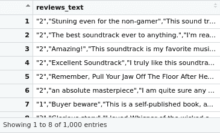
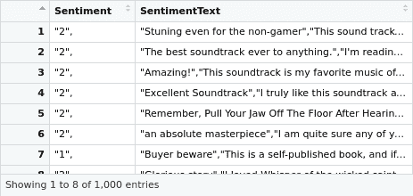
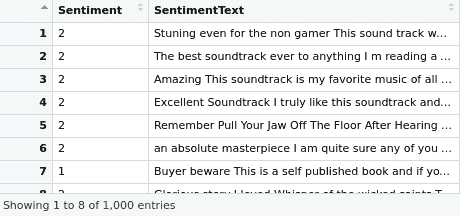
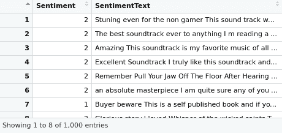
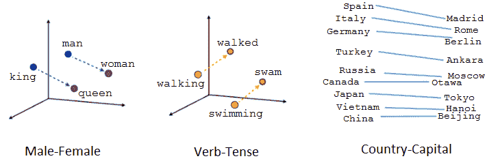
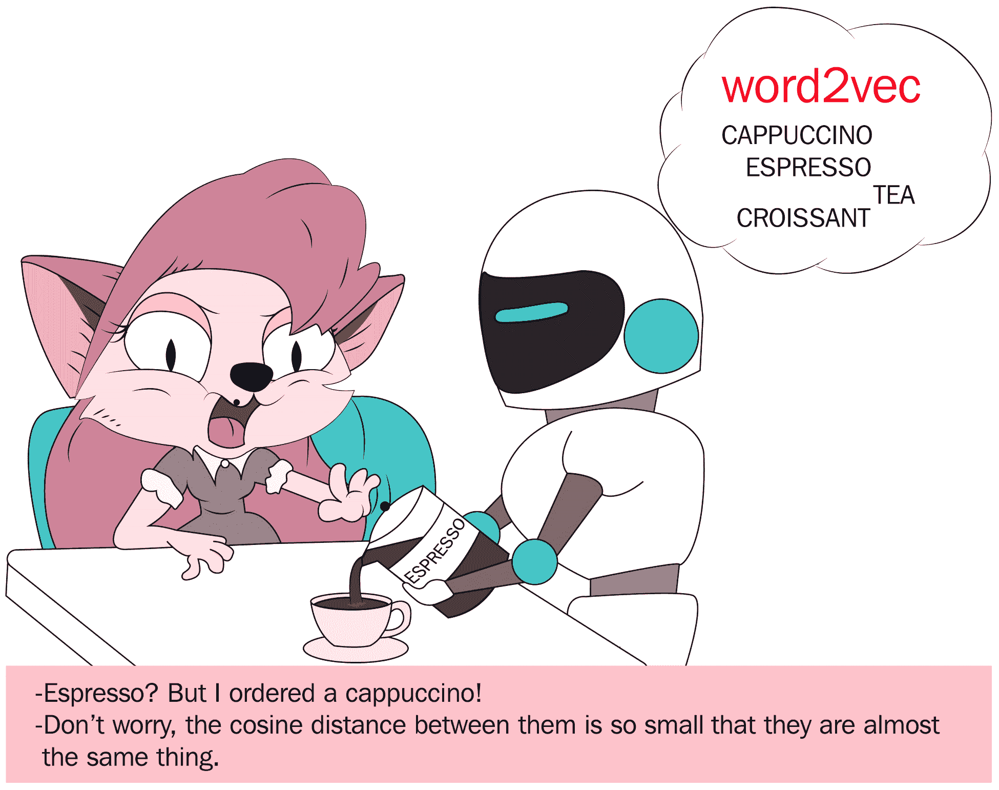
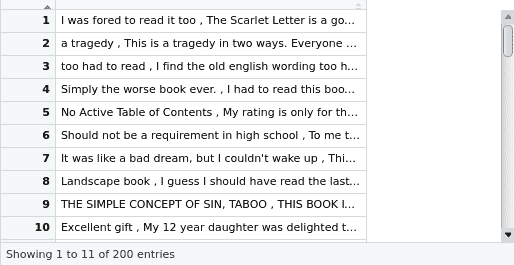
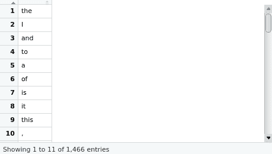
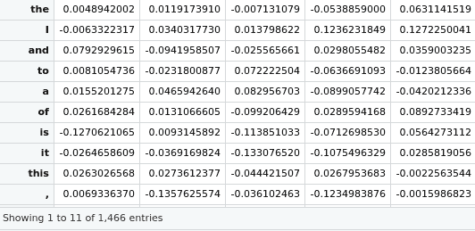

# 十七、基于自然语言处理的亚马逊评论情感分析

每天，我们都会从电子邮件、博客等在线帖子、社交媒体评论等中生成数据。毫不奇怪，非结构化文本数据比任何组织的数据库中的表格数据都要大得多。对于组织来说，从与组织相关的文本数据中获取有用的洞察力是很重要的。由于与数据库中的数据相比，文本数据具有不同的性质，因此需要采用不同的方法来理解文本数据。在这一章中，我们将学习自然语言处理中的一些关键技术，帮助我们处理文本数据。

NLP 的常见定义如下:计算机科学和人工智能的一个领域，处理计算机和人类(自然)语言之间的交互；特别是，如何对计算机进行编程，以有效地处理大量的自然语言数据。

总的来说，自然语言处理的是理解人们所说的话。它帮助机器阅读和理解“文本”。

人类语言非常复杂，为了正确理解口语或书面语，需要解决一些歧义。在自然语言处理领域，应用了几种技术来处理这些歧义，包括**词性** ( **词性**)标记、术语消歧、实体提取、关系提取、关键术语识别等等。

对于成功工作的自然语言系统，一致的知识库，如详细的词库、词汇、语言和语法规则的数据集、本体和最新的实体，是先决条件。

值得注意的是，NLP 不仅从句法的角度来理解文本，还从语义的角度来理解文本。与人类类似，这个想法是让机器能够感知口语背后的潜在信息，而不仅仅是句子中的单词结构。NLP 有许多应用领域，以下只是其中的几个:

*   语音识别系统
*   问答系统
*   机器翻译
*   文本摘要
*   虚拟代理或聊天机器人
*   文本分类
*   话题分割

由于自然语言处理的主题领域本身非常广泛，在一章中涵盖所有领域是不现实的。因此，我们将在这一章集中讨论“文本分类”。为此，我们实现了一个项目，对 Amazon.com 客户的评论进行情感分析。情感分析是一种文本分类任务，其中我们将每个文档(评论)分类到一个可能的类别中。可能的类别可以是正面的、负面的或中性的，也可以是正面的、负面的或 1 到 10 的等级。

需要分类的文本文档不能直接输入到机器学习算法中。每个文档都需要以某种特定的格式来表示，这种格式对于 ML 算法作为输入来处理是可以接受的。在这一章中，我们将探索、实现和理解单词包 ( **弓**)单词嵌入方法。这些是表示文本的方法。

随着本章的深入，我们将涵盖以下主题:

*   情感分析问题
*   了解亚马逊评论数据集
*   用 BoW 方法构建文本情感分类器
*   理解单词嵌入方法
*   基于路透社新闻语料构建预训练 Word2vec 单词嵌入的文本情感分类器
*   利用手套词嵌入构建文本情感分类器
*   用 fastText 构建文本情感分类器


# 情感分析问题

情感分析是最常见的文本分类应用之一。它的目的是分析用户评论和员工反馈等信息，以确定潜在情绪是积极的、消极的还是中性的。

通过分析和报告文本中的情感，企业无需阅读收到的每一条评论，就可以快速获得统一的高层次见解。

虽然可以根据收到的总体评论生成整体情感，但也有一个扩展领域叫做**基于方面的情感分析**。它侧重于根据服务的每个领域来获取情感。例如，客户在撰写评论时访问了一家餐馆，通常会涵盖诸如氛围、食品质量、服务质量和价格等方面。虽然关于每个领域的反馈可能不会在特定标题下引用，但评论意见中的句子自然会涵盖客户对这些领域中一个或多个领域的意见。基于方面的情感分析试图识别每个领域的评论中的句子，然后识别情感是积极的、消极的还是中性的。提供每个领域的情绪有助于企业快速识别他们的薄弱领域。

在这一章中，我们将讨论和实现旨在从评论文本中识别总体情感的方法。这项任务可以通过几种方式完成，从简单的词典方法到复杂的单词嵌入方法。

一个**词典**方法并不是真正的机器学习方法。它更像是一种基于规则的方法，基于预定义的肯定和否定单词字典。这种方法包括在每次评论中查找积极词汇和消极词汇的数量。如果评论中正面词的计数大于负面词的计数，则该评论被标记为正面，否则被标记为负面。如果正反词数量相等，则该评论被标记为中性。因为实现这个方法很简单，而且它需要一个预定义的字典，所以我们在本章中不讨论 lexicon 方法的实现。

虽然可以把情感分析问题看作一个无监督的聚类问题，但在本章中，我们把它看作一个有监督的分类问题。这是因为，我们有标有数据集的亚马逊评论可用。我们可以利用这些标签来建立分类模型，因此，监督算法。


# 入门指南

该数据集可从以下 URL 下载和使用:

[https://drive . Google . com/drive/u/0/folders/0 BZ 8 a _ db H9 qhbfll 6 bvpmnutucdjymf 2 sepmzuzuzucvnimuw 1 TWN 6 rdv 3a 0 jht 3 kxlvhvr 2m](https://drive.google.com/drive/u/0/folders/0Bz8a_Dbh9Qhbfll6bVpmNUtUcFdjYmF2SEpmZUZUcVNiMUw1TWN6RDV3a0JHT3kxLVhVR2M)。


# 了解亚马逊评论数据集

我们在本章的各个项目中使用亚马逊产品评论极性数据集。这是一个由张翔构建并提供的开放数据集。在论文中作为文本分类基准:*用于文本分类的字符级卷积网络*、*神经信息处理系统进展* 28、*张翔、赵俊波、Yann LeCun、* *(NIPS 2015)* 。

亚马逊评论极性数据集是通过将评论分数 1 和 2 视为负面，4 和 5 视为正面来构建的。分数 3 的样本被忽略。在数据集中，类 1 是负数，类 2 是正数。该数据集有 1，800，000 个训练样本和 200，000 个测试样本。

`train.csv`和`test.csv`文件以逗号分隔值的形式包含所有样本。其中有三列，分别对应班级索引(1 或 2)、复习题目、复习正文。审阅标题和文本使用双引号(")进行转义，任何内部双引号都用两个双引号("")进行转义。新行由一个反斜杠转义，后跟一个“n”字符，即“\n”。

为了确保我们能够运行我们的项目，即使只有最少的基础设施，让我们将数据集中要考虑的记录数量限制为 1，000 条。当然，我们在项目中使用的代码可以扩展到任意数量的记录，只要硬件基础设施支持可用。让我们首先用下面的代码读取数据并可视化记录:

```py
# reading first 1000 reviews
reviews_text<-readLines('/home/sunil/Desktop/sentiment_analysis/amazon _reviews_polarity.csv', n = 1000)
# converting the reviews_text character vector to a dataframe
reviews_text<-data.frame(reviews_text)
# visualizing the dataframe
View(reviews_text)
```

这将导致以下输出:



阅读文件后，我们可以看到数据集中只有一列，这一列既有评论文本又有情感成分。我们将稍微修改数据集的格式，以便在本章的情感分析项目中使用，包括 BoW、Word2vec 和 GloVe 方法。让我们用下面的代码修改数据集的格式:

```py
# separating the sentiment and the review text
# post separation the first column will have the first 4 characters
# second column will have the rest of the characters
# first column should be named "Sentiment"
# second column to be named "SentimentText"
library(tidyr)
reviews_text<-separate(data = reviews_text, col = reviews_text, into = c("Sentiment", "SentimentText"), sep = 4)
# viewing the dataset post the column split
View(reviews_text)
```

这将导致以下输出:



现在我们的数据集中有两列。但是，两列中都存在不必要的标点符号，这可能会导致进一步处理数据集时出现问题。让我们尝试用下面的代码删除标点符号:

```py
# Retaining only alphanumeric values in the sentiment column
reviews_text$Sentiment<-gsub("[^[:alnum:] ]","",reviews_text$Sentiment)
# Retaining only alphanumeric values in the sentiment text
reviews_text$SentimentText<-gsub("[^[:alnum:] ]"," ",reviews_text$SentimentText)
# Replacing multiple spaces in the text with single space
reviews_text$SentimentText<-gsub("(?<=[\\s])\\s*|^\\s+|\\s+$", "", reviews_text$SentimentText, perl=TRUE)
# Viewing the dataset
View(reviews_text)
# Writing the output to a file that can be consumed in other projects
write.table(reviews_text,file = "/home/sunil/Desktop/sentiment_analysis/Sentiment Analysis Dataset.csv",row.names = F,col.names = T,sep=',')
```

这将导致以下输出:



从前面的输出中，我们看到我们有一个干净的数据集可以使用了。此外，我们已经将输出写入文件。当我们构建情感分析器时，我们可以直接从`Sentiment Analysis Dataset.csv`文件中读取数据集。

fastText 算法要求数据集采用不同的格式。输入到 fastText 的数据应符合以下格式:

```py
__label__<X>  <Text>
```

在本例中，`X`是类名。文本是导致该类别下指定评级的实际考核文本。评级和文本应该放在一行，没有引号。班级是`__label__1`和`__label__2`，每行应该只有一个班级。让我们用下面的代码块完成`fastText`库所需的格式:

```py
# reading the first 1000 reviews from the dataset
reviews_text<-readLines('/home/sunil/Desktop/sentiment_analysis/amazon _reviews_polarity.csv', n = 1000)
# basic EDA to confirm that the data is read correctly
print(class(reviews_text))
print(length(reviews_text))
print(head(reviews_text,2))
# replacing the positive sentiment value 2 with __label__2
reviews_text<-gsub("\\\"2\\\",","__label__2 ",reviews_text)
# replacing the negative sentiment value 1 with __label__1
reviews_text<-gsub("\\\"1\\\",","__label__1 ",reviews_text)
# removing the unnecessary \" characters
reviews_text<-gsub("\\\""," ",reviews_text)
# replacing multiple spaces in the text with single space
reviews_text<-gsub("(?<=[\\s])\\s*|^\\s+|\\s+$", "", reviews_text, perl=TRUE)
# Basic EDA post the required processing to confirm input is as desired
print("EDA POST PROCESSING")
print(class(reviews_text))
print(length(reviews_text))
print(head(reviews_text,2))
# writing the revamped file to the directory so we could use it with
# fastText sentiment analyzer project
fileConn<-file("/home/sunil/Desktop/sentiment_analysis/Sentiment Analysis Dataset_ft.txt")
writeLines(reviews_text, fileConn)
close(fileConn)
```

这将导致以下输出:

```py
[1] "EDA PRIOR TO PROCESSING"
[1] "character"
[1] 1000
[1] "\"2\",\"Stuning even for the non-gamer\",\"This sound track was beautiful! It paints the senery in your mind so well I would recomend it even to people who hate vid. game music! I have played the game Chrono Cross but out of all of the games I have ever played it has the best music! It backs away from crude keyboarding and takes a fresher step with grate guitars and soulful orchestras. It would impress anyone who cares to listen! ^_^\""                                                                                  
[2] "\"2\",\"The best soundtrack ever to anything.\",\"I'm reading a lot of reviews saying that this is the best 'game soundtrack' and I figured that I'd write a review to disagree a bit. This in my opinino is Yasunori Mitsuda's ultimate masterpiece. The music is timeless and I'm been listening to it for years now and its beauty simply refuses to fade.The price tag on this is pretty staggering I must say, but if you are going to buy any cd for this much money, this is the only one that I feel would be worth every penny.\""
[1] "EDA POST PROCESSING"
[1] "character"
[1] 1000\
[1] "__label__2 Stuning even for the non-gamer , This sound track was beautiful! It paints the senery in your mind so well I would recommend it even to people who hate vid. game music! I have played the game Chrono Cross but out of all of the games I have ever played it has the best music! It backs away from crude keyboarding and takes a fresher step with grate guitars and soulful orchestras. It would impress anyone who cares to listen! ^_^"                                                                                   
[2] "__label__2 The best soundtrack ever to anything. , I'm reading a lot of reviews saying that this is the best 'game soundtrack' and I figured that I'd write a review to disagree a bit. This in my opinino is Yasunori Mitsuda's ultimate masterpiece. The music is timeless and I'm been listening to it for years now and its beauty simply refuses to fade. The price tag on this is pretty staggering I must say, but if you are going to buy any cd for this much money, this is the only one that I feel would be worth every penny."
```

从基本 EDA 代码的输出中，我们可以看到数据集符合要求的格式，因此我们可以继续下一部分，使用 BoW 方法实现情感分析引擎。除了实现之外，我们还将深入学习该方法背后的概念，并探索在该方法中可以用来获得更好结果的子技术。


# 用 BoW 方法构建文本情感分类器

BoW 方法的目的是将提供的审查文本转换成矩阵形式。它通过忽略单词的顺序和含义，将文档表示为一组不同的单词。矩阵的每一行代表每一篇评论(在 NLP 中也称为文档)，列代表所有评论中出现的通用单词集。对于每个文档和每个单词，记录该单词在该特定文档中的存在或出现频率。最后，从词频向量创建的矩阵表示文档集。这种方法用于创建训练模型所需的输入数据集，并且还用于准备测试数据集，该测试数据集需要被已训练的模型用来执行文本分类。现在我们已经理解了 BoW 的动机，让我们开始实现基于这种方法构建情感分析分类器的步骤，如下面的代码块所示:

```py
# including the required libraries
library(SnowballC)
library(tm)
# setting the working directory where the text reviews dataset is located
# recollect that we pre-processed and transformed the raw dataset format
setwd('/home/sunil/Desktop/sentiment_analysis/')
# reading the transformed file as a dataframe
text <- read.table(file='Sentiment Analysis Dataset.csv', sep=',',header = TRUE)
# checking the dataframe to confirm everything is in tact
print(dim(text))
View(text)
```

这将导致以下输出:

```py
> print(dim(text))
[1] 1000 2
> View(text)
```



处理文本数据的第一步包括创建一个*语料库*，它是文本文档的集合。`tm`包中的`VCorpus`函数支持将数据框中的 reviews comments 列转换为 volatile corpus。这可以通过下面的代码实现:

```py
# transforming the text into volatile corpus
train_corp = VCorpus(VectorSource(text$SentimentText))
print(train_corp)
```

这将导致以下输出:

```py
> print(train_corp)
<<VCorpus>>
Metadata:  corpus specific: 0, document level (indexed): 0
Content:  documents: 1000
```

从易变语料库中，我们创建一个**文档术语矩阵** ( **DTM** )。DTM 是使用`tm`库的`DocumentTermMatrix`函数创建的稀疏矩阵。矩阵的行表示文档，列表示特征，即单词。该矩阵是稀疏的，因为数据集的所有唯一的 unigram 集合变成 DTM 中的列，并且由于每个评论评论不具有 unigram 集合的所有元素，所以大多数单元将具有 0，指示 unigram 的缺失。

虽然作为 BoW 方法的一部分，可以提取 n-gram(一元、二元、三元等),但是可以设置 tokenize 参数，并作为控制列表的一部分在`DocumentTermMatrix`函数中传递，以在 DTM 中实现 n-gram。必须注意，使用 n-grams 作为 DTM 的一部分会在 DTM 中创建非常多的列。这是 BoW 方法的缺点之一，在某些情况下，由于有限的内存，它可能会延迟项目的执行。由于我们的具体案例也受到硬件基础设施的限制，我们限制自己在这个项目中只包括 DTM 的 unigrams。除了生成单字之外，我们还通过向`tm`库的`DocumentTermMatrix`函数中的控制列表传递参数，对 reviews 文本文档执行一些额外的处理。我们在创建 DTM 期间对审阅文本文档进行的处理如下所示:

1.  将文本的大小写改为小写。
2.  删除任何数字。
3.  使用 Snowball stemmer 项目中的英语停用词列表删除停用词。停用词是常见的词，如 a、an、in 和 the，它们不会增加基于评论判断情感的价值。
4.  去掉标点符号。
5.  进行词干分析，目的是将一个单词分解成该单词的基本形式，即从名词中去掉复数 *s* ，从动词或其他词缀中去掉复数 *ing* 。词干是一组意思相同或非常相似的自然单词。词干化过程之后，每个单词都由其词干表示。`SnowballC`库提供了获取评论中每个单词的词根的能力。

现在让我们从 volatile 语料库中创建一个 DTM，并用下面的代码块进行文本预处理:

```py
# creating document term matrix
dtm_train <- DocumentTermMatrix(train_corp, control = list(
  tolower = TRUE,removeNumbers = TRUE,
  stopwords = TRUE,
  removePunctuation = TRUE,
  stemming = TRUE
))
# Basic EDA on dtm
inspect(dtm_train)
```

这将导致以下输出:

```py
> inspect(dtm_train)
<<DocumentTermMatrix (documents: 1000, terms: 5794)>>
Non-/sparse entries: 34494/5759506
Sparsity           : 99%
Maximal term length: 21
Weighting          : term frequency (tf)
Sample             :
     Terms
Docs  book can get great just like love one read time
  111    0   3   2     0    0    0    2   1    0    2
  162    4   1   0     0    0    1    0   0    1    0
  190    0   0   0     0    0    0    0   0    0    0
  230    0   1   1     0    0    0    1   0    0    0
  304    0   0   0     0    0    3    0   2    0    0
  399    0   0   0     0    0    0    0   0    0    0
  431    9   1   0     0    0    1    2   0    0    1
  456    1   0   0     0    0    0    0   1    2    0
  618    0   2   3     1    4    1    3   1    0    1
  72     0   0   1     0    2    0    0   1    0    1
```

我们从输出中看到，有 1，000 个文档被处理并在矩阵中形成行。在额外的文本处理之后，有 5，794 列表示来自评论的独特单字。我们还看到 DTM 是 99%稀疏的，并且仅在 34，494 个单元中包含非零条目。非零单元格表示该单词在 DTM 的行上表示的文档的列上出现的频率。由于我们没有在提供给`DocumentTermMatrix`函数的控制列表中指定任何加权参数，所以加权是通过默认的“词频”加权完成的。其他形式的加权，例如**术语频率-逆文档频率** ( **TFIDF** )，也可以通过将控制列表中适当的权重参数传递给`DocumentTermMatrix`函数来实现。现在，我们将坚持基于术语频率的加权，这是默认的。我们还从`inspect`函数中看到，输出了几个样本文档以及这些文档中的术语频率。

DTM 往往会变得非常大，即使对于正常大小的数据集也是如此。去除稀疏术语，即只在很少的文档中出现的术语，是可以尝试的技术，以减小矩阵的大小，而不丢失矩阵固有的重要关系。让我们从矩阵中移除稀疏列。我们将尝试使用下面的代码行删除那些具有至少 99%稀疏元素的术语:

```py
# Removing sparse terms
dtm_train= removeSparseTerms(dtm_train, 0.99)
inspect(dtm_train)
```

这将导致以下输出:

```py
> inspect(dtm_train)
<<DocumentTermMatrix (documents: 1000, terms: 686)>>
Non-/sparse entries: 23204/662796
Sparsity           : 97%
Maximal term length: 10
Weighting          : term frequency (tf)
Sample             :
     Terms
Docs  book can get great just like love one read time
  174    0   0   1     1    1    2    0   2    0    1
  304    0   0   0     0    0    3    0   2    0    0
  355    3   0   0     0    1    1    2   3    1    0
  380    4   1   0     0    1    0    0   1    0    2
  465    5   0   1     1    0    0    0   2    6    0
  618    0   2   3     1    4    1    3   1    0    1
  72     0   0   1     0    2    0    0   1    0    1
  836    1   0   0     0    0    3    0   0    5    1
  866    8   0   1     0    0    1    0   0    4    0
  959    0   0   2     1    1    0    0   2    0    1
```

我们现在从`inspect`函数的输出中看到，矩阵的稀疏性降低到了 97%，unigrams(矩阵的列)的数量减少到了`686`。我们现在已经准备好了 DTM，它可以用于任何机器学习分类算法的训练。在接下来的几行代码中，让我们尝试将 DTM 分为训练数据集和测试数据集:

```py
# splitting the train and test DTM
dtm_train_train <- dtm_train[1:800, ]
dtm_train_test <- dtm_train[801:1000, ]
dtm_train_train_labels <- as.factor(as.character(text[1:800, ]$Sentiment))
dtm_train_test_labels <- as.factor(as.character(text[801:1000, ]$Sentiment))
```

我们将使用一种叫做**朴素贝叶斯**的机器学习算法来创建一个模型。朴素贝叶斯通常在具有名义特征的数据上训练。我们可以观察到，DTM 中的像元是数值型的，因此需要在将数据集作为使用朴素贝叶斯创建模型的输入之前将其转换为名义值。由于每个单元格都表示评论中的词频，并且评论中使用一个词的次数不会影响情绪，因此让我们编写一个函数，将具有非零值的单元格值转换为`Y`，如果是零，则使用以下代码将其转换为`N`:

```py
cellconvert<- function(x) {
x <- ifelse(x > 0, "Y", "N")
}
```

现在，让我们将该函数应用于我们之前在此项目中使用以下代码创建的训练数据集和测试数据集的所有行:

```py
# applying the function to rows in training and test datasets
dtm_train_train <- apply(dtm_train_train, MARGIN = 2,cellconvert)
dtm_train_test <- apply(dtm_train_test, MARGIN = 2,cellconvert)
# inspecting the train dtm to confirm all is in tact
View(dtm_train_train)
```

这将导致以下输出:


我们可以从输出中看到，训练和测试 DTM 中的所有单元现在都转换为标称值。因此，让我们使用来自`e1071`库的朴素贝叶斯算法构建一个文本情感分析分类器，如下所示:

```py
# training the naive bayes classifier on the training dtm
library(e1071)
nb_senti_classifier=naiveBayes(dtm_train_train,dtm_train_train_labels)
# printing the summary of the model created
summary(nb_senti_classifier)
```

这将导致以下输出:

```py
> summary(nb_senti_classifier)
        Length Class  Mode    
apriori   2    table  numeric 
tables  686    -none- list    
levels    2    -none- character
call      3    -none- call  
```

前面的摘要输出显示了从训练 DTM 成功创建了`nb_senti_classifier`对象。现在让我们使用模型对象来预测测试数据 DTM 的情绪。在下面的代码块中，我们指示预测应该是类，而不是预测概率:

```py
# making predictions on the test data dtm
nb_predicts<-predict(nb_senti_classifier, dtm_train_test,type="class")
# printing the predictions from the model
print(nb_predicts)
```

这将导致以下输出:

```py
[1] 1 1 2 1 1 1 1 1 1 2 2 1 2 2 2 2 1 2 1 1 2 1 2 1 1 1 2 2 1 2 2 2 2 1 2 1 1 1 1 2 2 2 2 1 2 1 1 1 1 1 1 1 1 1 1 1 1 2 1 1 1 2 1 1 1 1 1 1 1 2 1 1 2 2 1 2 2 2 2 1 2 2 1 1 1 1 1 2 1 1 2 1 1 1 1 1 2 2 2 2 2 2 1 2 2 1 2 1 1 1 1 2 2 2 2 2 1 1 1 2 2 2 1 1 1 1 1 2 1 2 1 1 1 1 1 1 1 1 2 1 1 1 1 1 1 2 1 1 1 1 1 1 2 1 1 1 1 1 1 2 2 2 2 2 1 2 2 1 2 2 1 1 2 2 1 1 2 2 2 2 2 2 2 2 2 2 2 1 1 2 1 2 1 2 2 1 1 1 1 2
Levels: 1 2
```

使用下面的代码，现在让我们使用`rminer`库中的`mmetric`函数来计算模型的精度:

```py
# computing accuracy of the model
library(rminer)
print(mmetric(nb_predicts, dtm_train_test_labels, c("ACC")))
```

这将导致以下输出:

```py
[1] 79
```

我们只用一个非常快速和基本的弓模型就达到了 79%的准确率。该模型可以通过诸如参数调整、词汇化、新特征创建等技术来进一步改进。


# 弓法的利与弊

现在我们已经了解了 BoW 方法的理论和实现，让我们来研究一下该方法的优缺点。就优点而言，BoW 方法非常容易理解和实现，因此为任何文本数据集的定制提供了很大的灵活性。可以观察到，BoW 方法不保留单词的顺序，特别是当只考虑单字时。这个问题通常通过在 DTM 中保留 n-grams 来解决。然而，这是有代价的，因为需要更大的基础设施来处理文本和构建分类器。这种方法的另一个严重缺点是它不尊重单词的语义。例如,“car”和“automobile”这两个词经常在同一上下文中使用。基于 BoW 构建的模型将句子“购买二手车”和“购买旧汽车”视为非常不同的句子。虽然这些句子是相同的，但是 BoW 模型不会将这些句子归类为相同的，因为这些句子中的单词不匹配。使用一种叫做单词嵌入的方法来考虑句子中单词的语义是可能的。这是我们将在下一节探讨的内容。


# 理解单词嵌入

我们在上一节中讨论的 BoW 模型存在一个问题，即它们不能捕获关于单词含义或上下文的信息。这意味着潜在的关系，如上下文的密切程度，不能在单词集合中被捕获。例如，这种方法不能捕捉简单的关系，例如确定单词“轿车”和“公共汽车”都是指在运输环境中经常讨论的车辆。我们在 BoW 方法中遇到的这个问题将通过单词嵌入来克服，单词嵌入是一种映射语义相似单词的改进方法。

单词向量将单词表示为多维连续浮点数，其中语义相似的单词被映射到几何空间中的邻近点。例如，单词*水果*和*树叶*会有一个相似的单词向量*树*。这是因为它们的意思相似，而单词 *television* 在几何空间中会非常遥远。换句话说，在相似上下文中使用的单词将被映射到近似的向量空间。

单词向量可以有 *n* 个维度，并且 *n* 可以接受来自创建它的用户的任何数字作为输入(例如 10、70、500)。这些维度是潜在的，因为对人类来说，这些维度中的每一个在现实中意味着什么并不明显。存在诸如**连续单词包** ( **CBOW** )和 **Skip-Gram** 之类的方法，使得能够从作为单词嵌入算法的训练输入而提供的文本中构思单词向量。此外，单词向量中的各个数字表示单词在各个维度上的分布权重。在一般意义上，每个维度代表一个潜在的意义，单词在该维度上的数字权重捕捉了它与该意义的联系的紧密程度。因此，单词的语义嵌入到向量的各个维度中。

虽然单词向量是多维的，不能直接可视化，但是可以通过使用诸如 t-SNE 维数缩减技术将它们投影到二维来可视化所学习的向量。下图显示了国家首都、动词时态和性别关系的二维学习单词向量:



二维空间中单词嵌入的可视化

当我们观察单词嵌入可视化时，我们可以察觉到向量捕获了一些关于单词及其相互关系的一般的、事实上非常有用的语义信息。这样，文本中的每个单词现在都可以表示为矩阵中的一行，类似于 BoW 方法，但与 BoW 方法不同，它捕捉单词之间的关系。

将单词表示为向量的优点是它们有助于数学运算符。例如，我们可以加减向量。此处的典型示例表明，通过使用词向量，我们可以确定以下内容:

*国王-男人+女人=王后*

在给定的示例中，我们从 king 的单词向量中减去了性别(男性)并添加了另一个性别(女性)，我们通过运算( *king - man + woman* )获得了一个新的单词向量，该向量最接近地映射到 queen 的单词向量。

可以在单词向量上实现的数学运算的几个更惊人的例子如下所示:

*   给定两个词，我们可以确定它们之间的相似程度:

```py
model.similarity('woman','man')
```

输出如下所示:

```py
0.73723527
```

*   从作为输入给出的一组单词中找出奇怪的一个:

```py
model.doesnt_match('breakfast cereal dinner lunch';.split())
```

奇数输出如下所示:

```py
'cereal'
```

*   进行类比，例如:

```py
model.most_similar(positive=['woman','king'],negative=['man'],topn=1)
```

输出如下所示:

```py
queen: 0.508
```

现在，这对我们来说意味着机器能够识别句子中语义相似的单词。下图是一个与单词嵌入相关的插科打诨，让我忍俊不禁，但这个插科打诨确实传达了单词嵌入应用的强大功能，否则这对于 BoW 类型的文本表示是不可能的:



展示单词嵌入应用威力的插科打诨

有几种技术可以用来从文本数据中学习单词嵌入。Word2vec、GloVe 和 fastText 是一些流行的技术。这些技术中的每一种都允许我们从我们拥有的文本数据中训练我们自己的单词嵌入，或者使用容易获得的预训练向量。

这种学习我们自己的单词嵌入的方法需要大量的训练数据，并且可能很慢，但是该选项将学习针对特定文本数据和手边的 NLP 任务的嵌入。

预训练的单词嵌入向量是在大量文本数据(通常是数十亿个单词)上训练的向量，这些数据可以从维基百科等来源获得。这些通常是由谷歌或脸书等公司提供的高质量单词嵌入向量。我们可以下载这些预先训练的向量文件，并使用它们来获得文本中我们想要分类或聚类的单词的单词向量。


# 基于路透社新闻语料构建预训练 word2vec 单词嵌入的文本情感分类器

Word2vec 是由 Tomas Mikolov 等人在 2013 年在谷歌开发的，作为使基于神经网络的嵌入训练更有效的回应，从那时起，它已经成为开发预训练单词嵌入的事实上的标准。

Word2vec 介绍了以下两种不同的学习模型来学习单词嵌入:

*   **CBOW** :通过基于上下文预测当前单词来学习嵌入。
*   **连续跳格**:连续跳格模型通过预测给定当前单词的周围单词来学习。

CBOW 和 Skip-Gram 学习方法都集中在给定单词的本地使用上下文的情况下学习单词，其中单词本身的上下文由相邻单词的窗口来定义。该窗口是模型的可配置参数。

R 中的`softmaxreg`库提供了预训练的`word2vec`单词嵌入，可以用来为亚马逊评论数据构建我们的情感分析引擎。预训练向量是使用`word2vec`模型构建的，它基于`Reuter_50_50`数据集，UCI 机器学习库(【https://archive.ics.uci.edu/ml/datasets/Reuter_50_50】T4)。

让我们立即进入代码，并回顾代码中遵循的方法:

```py
# including the required library
library(softmaxreg)
# importing the word2vec pretrained vector into memory
data(word2vec)
```

让我们检查一下`word2vec`预训练的 emdeddings。它只是另一个数据帧，因此可以通过常规的`dim`和`View`命令进行检查，如下所示:

```py
View(word2vec)
```

这将导致以下输出:


这里，让我们使用下面的`dim`命令:

```py
dim(word2vec)
```

这将导致以下输出:

```py
[1] 12853 21
```

从前面的输出中，我们可以观察到有`12853`个单词在预训练的向量中有单词向量。每个单词用 20 个维度来定义，这些维度定义了单词的上下文。在下一步中，我们可以为评论中的每个单词查找单词向量。因为在预训练单词嵌入中只有 12，853 个单词，所以我们有可能遇到预训练嵌入中不存在的单词。在这种情况下，未识别的单词用填充有零的 20 维向量来表示。

我们还需要理解，单词向量仅在单词级别可用，因此为了解码整个评论，我们取组成评论的单词的所有单词向量的平均值。让我们用一个例子来回顾一下从单个单词向量中获取句子的单词向量的概念。

假设我们想要得到单词向量的句子是，*今天早上阳光明媚*。组成句子的个别词语有 *it* 、 *is* 、 *very* 、 *bright* 、 *and* 、 *sunny* 、 *this* 和 *morning* 。

现在，我们可以在预训练向量中查找这些单词中的每一个，并获得相应的单词向量，如下表所示:

| **字** | **dim1** | **dim2** | **dim3** | **.....** | **....** | **dim19** | **dim20** |  |
| `it` | -2.25 | Zero point seven five | One point seven five | -1.25 | -0.25 | -3.25 | -2.25 |  |
| `is` | Zero point seven five | One point seven five | One point seven five | -2.25 | -2.25 | Zero point seven five | -0.25 |  |
| `very` | -2.25 | Two point seven five | One point seven five | -0.25 | Zero point seven five | Zero point seven five | -2.25 |  |
| `bright` | -3.25 | -3.25 | -2.25 | -1.25 | Zero point seven five | One point seven five | -0.25 |  |
| `and` | -0.25 | -1.25 | -2.25 | Two point seven five | -3.25 | -0.25 | One point seven five |  |
| `sunny` | Zero | Zero | Zero | Zero | Zero | Zero | Zero |  |
| `this` | -2.25 | -3.25 | Two point seven five | Zero point seven five | -0.25 | -0.25 | -0.25 |  |
| `morning` | -0.25 | -3.25 | -2.25 | One point seven five | Zero point seven five | Two point seven five | Two point seven five |  |

现在，我们有了组成句子的词向量。请注意，这些不是实际的单词向量值，只是为了演示该方法而虚构的。此外，注意单词`sunny`在维度上用零表示，以表示该单词在预训练单词嵌入中找不到。为了得到句子的单词向量，我们只需计算每个维度的平均值。得到的向量是一个 1 x 20 的向量，表示句子，如下所示:

| 句子 | -1.21875 | -0.71875 | 0.15625 | 0.03125 | -0.46875 | 0.28125 | -0.09375 |

`softmaxreg`库提供了`wordEmbed`函数，我们可以传递一个句子，并要求它计算这个句子的`mean`单词向量。下面的代码是一个定制函数，创建它是为了将`wordEmbed`函数应用到我们手头的每个亚马逊评论上。在将这个函数应用于评论数据集的最后，我们期望得到一个 *n* x 20 矩阵，这是我们的评论的词向量表示。 *n* x 20 中的 *n* 表示行数，20 是表示每个审查的维度数，如以下代码所示:

```py
# function to get word vector for each review
docVectors = function(x)
{
  wordEmbed(x, word2vec, meanVec = TRUE)
}
# setting the working directory and reading the reviews dataset
setwd('/home/sunil/Desktop/sentiment_analysis/')
text = read.csv(file='Sentiment Analysis Dataset.csv', header = TRUE)
# applying the docVector function on each of the reviews
# storing the matrix of word vectors as temp
temp=t(sapply(text$SentimentText, docVectors))
# visualizing the word vectors output
View(temp)
```

这将导致以下输出:


然后我们使用`dim`命令检查`temp`，如下所示:

```py
dim(temp)
```

这将导致以下输出:

```py
1000 20
```

我们可以从输出中看到，我们为语料库中的每个评论创建了词向量。该数据框现在可用于使用 ML 算法构建分类模型。以下实现分类的代码与我们为 BoW 方法所做的代码没有什么不同:

```py
# splitting the dataset into train and test
temp_train=temp[1:800,]
temp_test=temp[801:1000,]
labels_train=as.factor(as.character(text[1:800,]$Sentiment))
labels_test=as.factor(as.character(text[801:1000,]$Sentiment))
# including the random forest library
library(randomForest)
# training a model using random forest classifier with training dataset
# observe that we are using 20 trees to create the model
rf_senti_classifier=randomForest(temp_train, labels_train,ntree=20)
print(rf_senti_classifier)
```

这将导致以下输出:

```py
randomForest(x = temp_train, y = labels_train, ntree = 20)
               Type of random forest: classification
                     Number of trees: 20
No. of variables tried at each split: 4
        OOB estimate of  error rate: 44.25%
Confusion matrix:
    1   2 class.error
1 238 172   0.4195122
2 182 208   0.4666667
```

前面的输出显示随机森林模型对象已成功创建。当然，模型还可以进一步改进；然而，我们不打算在这里这样做，因为重点是演示如何利用单词嵌入，而不是获得最佳性能的分类器。

接下来，通过下面的代码，我们利用随机森林模型对测试数据进行预测，然后报告性能:

```py
# making predictions on the dataset
rf_predicts<-predict(rf_senti_classifier, temp_test)
library(rminer)
print(mmetric(rf_predicts, labels_test, c("ACC")))
```

这将导致以下输出:

```py
[1] 62.5
```

我们看到，从路透社新闻组的数据集中使用预训练的`word2vec`嵌入，我们获得了 62%的准确率。


# 利用手套词嵌入构建文本情感分类器

斯坦福大学的 Pennington 等人开发了一种对`word2vec`方法的扩展，称为用于单词表示的**全局向量** ( **手套**)，用于高效地学习单词向量。

GloVe 将矩阵分解技术(如 LSA)的全局统计与`word2vec`中基于局部上下文的学习相结合。此外，与`word2vec`不同，GloVe 不使用窗口来定义本地上下文，而是使用整个文本语料库的统计数据来构建显式的单词上下文或单词共现矩阵。作为效果，学习模型通常产生更好的单词嵌入。

R 中的`text2vec`库有一个 GloVe 实现，我们可以用它来训练从我们自己的训练语料库中获得单词嵌入。或者，预训练的 GloVe word 嵌入可以被下载和重用，类似于我们在上一节介绍的早期`word2vec`预训练嵌入项目中所做的。

下面的代码块演示了如何创建 GloVe 单词嵌入，并将其用于情感分析，或者任何文本分类任务。我们不打算明确讨论所涉及的步骤，因为代码中已经对每个步骤进行了详细的解释:

```py
# including the required library
library(text2vec)
# setting the working directory
setwd('/home/sunil/Desktop/sentiment_analysis/')
# reading the dataset
text = read.csv(file='Sentiment Analysis Dataset.csv', header = TRUE)
# subsetting only the review text so as to create Glove word embedding
wiki = as.character(text$SentimentText)
# Create iterator over tokens
tokens = space_tokenizer(wiki)
# Create vocabulary. Terms will be unigrams (simple words).
it = itoken(tokens, progressbar = FALSE)
vocab = create_vocabulary(it)
# consider a term in the vocabulary if and only if the term has appeared aleast three times in the dataset
vocab = prune_vocabulary(vocab, term_count_min = 3L)
# Use the filtered vocabulary
vectorizer = vocab_vectorizer(vocab)
# use window of 5 for context words and create a term co-occurance matrix
tcm = create_tcm(it, vectorizer, skip_grams_window = 5L)
# create the glove embedding for each each in the vocab and
# the dimension of the word embedding should set to 50
# x_max is the maximum number of co-occurrences to use in the weighting
# function
# note that training the word embedding is time consuming - be patient
glove = GlobalVectors$new(word_vectors_size = 50, vocabulary = vocab, x_max = 100)
wv_main = glove$fit_transform(tcm, n_iter = 10, convergence_tol = 0.01)
```

这将导致以下输出:

```py
INFO [2018-10-30 06:58:14] 2018-10-30 06:58:14 - epoch 1, expected cost 0.0231
INFO [2018-10-30 06:58:15] 2018-10-30 06:58:15 - epoch 2, expected cost 0.0139
INFO [2018-10-30 06:58:15] 2018-10-30 06:58:15 - epoch 3, expected cost 0.0114
INFO [2018-10-30 06:58:15] 2018-10-30 06:58:15 - epoch 4, expected cost 0.0100
INFO [2018-10-30 06:58:15] 2018-10-30 06:58:15 - epoch 5, expected cost 0.0091
INFO [2018-10-30 06:58:15] 2018-10-30 06:58:15 - epoch 6, expected cost 0.0084
INFO [2018-10-30 06:58:16] 2018-10-30 06:58:16 - epoch 7, expected cost 0.0079
INFO [2018-10-30 06:58:16] 2018-10-30 06:58:16 - epoch 8, expected cost 0.0074
INFO [2018-10-30 06:58:16] 2018-10-30 06:58:16 - epoch 9, expected cost 0.0071
INFO [2018-10-30 06:58:16] 2018-10-30 06:58:16 - epoch 10, expected cost 0.0068
```

下面使用`glove`模型来获得组合单词向量:

```py
# Glove model learns two sets of word vectors - main and context.
# both matrices may be added to get the combined word vector
wv_context = glove$components
word_vectors = wv_main + t(wv_context)
# converting the word_vector to a dataframe for visualization
word_vectors=data.frame(word_vectors)
# the word for each embedding is set as row name by default
# using the tibble library rownames_to_column function, the rownames is copied as first column of the dataframe
# we also name the first column of the dataframe as words
library(tibble)
word_vectors=rownames_to_column(word_vectors, var = "words")
View(word_vectors)
```

这将导致以下输出:


我们利用`softmaxreg`库来获得每个评论的平均词向量。这类似于我们在上一节的`word2vec`预训练嵌入中所做的。注意，我们正在将我们自己训练过的单词嵌入`word_vectors`传递给`wordEmbed()`函数，如下所示:

```py
library(softmaxreg)
docVectors = function(x)
{
  wordEmbed(x, word_vectors, meanVec = TRUE)
}
# applying the function docVectors function on the entire reviews dataset
# this will result in word embedding representation of the entire reviews # dataset
temp=t(sapply(text$SentimentText, docVectors))
View(temp)
```

这将导致以下输出:


我们现在将数据集分成训练和测试部分，并使用`randomforest`库来构建一个模型进行训练，如以下代码行所示:

```py
# splitting the dataset into train and test portions
temp_train=temp[1:800,]
temp_test=temp[801:1000,]
labels_train=as.factor(as.character(text[1:800,]$Sentiment))
labels_test=as.factor(as.character(text[801:1000,]$Sentiment))
# using randomforest to build a model on train data
library(randomForest)
rf_senti_classifier=randomForest(temp_train, labels_train,ntree=20)
print(rf_senti_classifier)
```

这将导致以下输出:

```py
Call:
 randomForest(x = temp_train, y = labels_train, ntree = 20)
               Type of random forest: classification
                     Number of trees: 20
No. of variables tried at each split: 7

        OOB estimate of  error rate: 42.12%
Confusion matrix:
    1   2 class.error
1 250 160   0.3902439
2 177 213   0.4538462
```

然后，我们使用创建的随机森林模型来预测标签，如下所示:

```py
# predicting labels using the randomforest model created
rf_predicts<-predict(rf_senti_classifier, temp_test)
# estimating the accuracy from the predictions
library(rminer)
print(mmetric(rf_predicts, labels_test, c("ACC")))
```

这将导致以下输出:

```py
[1] 66.5
```

通过这种方法，我们获得了 66%的准确率。尽管事实上单词嵌入是从仅仅 1000 个文本样本中的单词中获得的。通过使用预训练嵌入，可以进一步改进该模型。使用预训练嵌入的总体框架与我们在上一节的`word2vec`项目中所做的保持一致。


# 用 fastText 构建文本情感分类器

`fastText`是一个库，是`word2vec`的扩展，用于单词表示。它是由脸书研究团队在 2016 年创建的。虽然 Word2vec 和 GloVe 方法将单词作为训练的最小单位，但 fastText 将单词分成几个 n 元语法，即子单词。例如，单词 apple 的三元组是 app、ppl 和 ple。单词 apple 的单词 embedding 是所有单词 n-grams 的总和。由于算法嵌入生成的性质，fastText 需要更多的资源，并且需要额外的时间来训练。`fastText`的一些优势如下:

*   它为罕见的单词(包括拼写错误的单词)生成更好的单词嵌入。
*   对于词汇之外的单词，fastText 可以从单词的字符 n-grams 中构造单词的向量，即使单词没有出现在训练语料库中。这对于 Word2vec 和 GloVe 来说都是不可能的。

`fastTextR`库提供了一个快速文本的接口。让我们利用项目中的`fastTextR`库来构建亚马逊评论的情感分析引擎。虽然可以下载预训练的 fastText 单词嵌入并将其用于我们的项目，但让我们尝试基于我们手头的评论数据集来训练单词嵌入。应该注意的是，利用 fastText 预训练单词嵌入的方法类似于我们之前处理的基于`word2vec`的项目中遵循的方法。

与上一节中介绍的项目类似，注释包含在代码中。这些评论解释了在这个项目中构建亚马逊评论情感分析器所采用的方法。现在让我们来看看下面的代码:

```py
# loading the required libary
library(fastTextR)
# setting the working directory
setwd('/home/sunil/Desktop/sentiment_analysis/')
# reading the input reviews file
# recollect that fastText needs the file in a specific format and we created one compatiable file in
# "Understanding the Amazon Reviews Dataset" section of this chaptertext = readLines("Sentiment Analysis Dataset_ft.txt")
# Viewing the text vector for conformation
View(text)
```

这将导致以下输出:


现在，让我们将评论分为训练和测试数据集，并使用以下代码行查看它们:

```py
# dividing the reviews into training and test
temp_train=text[1:800]temp_test=text[801:1000]
# Viewing the train datasets for confirmation
View(temp_train)
```

这将产生以下输出:


使用以下代码查看测试数据集:

```py
View(temp_test)
```

这将产生以下输出:


我们现在将使用以下代码为训练和测试数据集创建一个`.txt`文件:

```py
# creating txt file for train and test dataset
# the fasttext function expects files to be passed for training and testing
fileConn<-file("/home/sunil/Desktop/sentiment_analysis/train.ft.txt")
writeLines(temp_train, fileConn)
close(fileConn)
fileConn<-file("/home/sunil/Desktop/sentiment_analysis/test.ft.txt")
writeLines(temp_test, fileConn)
close(fileConn)
# creating a test file with no labels
# recollect the original test dataset has labels in it
# as the dataset is just a subset obtained from full dataset
temp_test_nolabel<- gsub("__label__1", "", temp_test, perl=TRUE)
temp_test_nolabel<- gsub("__label__2", "", temp_test_nolabel, perl=TRUE)
```

现在，我们将使用以下命令查看无标签测试数据集以进行确认:

```py
View(temp_test_nolabel)
```

这将导致以下输出:



现在，让我们将无标签测试数据集写入一个文件，以便我们可以使用它进行测试，如下所示:

```py
fileConn<-file("/home/sunil/Desktop/sentiment_analysis/test_nolabel.ft.txt")
writeLines(temp_test_nolabel, fileConn)
close(fileConn)
# training a supervised classification model with training dataset file
model<-fasttext("/home/sunil/Desktop/sentiment_analysis/train.ft.txt",
method = "supervised", control = ft.control(nthreads = 3L))
# Obtain all the words from a previously trained model=
words<-get_words(model)
# viewing the words for confirmation. These are the set of words present  # in our training data
View(words)
```

这将导致以下输出:



现在，我们将从之前训练的模型中获取单词向量，并查看训练数据集中每个单词的单词向量，如下所示:

```py
# Obtain word vectors from a previously trained model.
word_vec<-get_word_vectors(model, words)
# Viewing the word vectors for each word in our training dataset
# observe that the word embedding dimension is 5
View(word_vec)
```

这将导致以下输出:



我们将预测无标签测试数据集中评论的标签，并将其写入文件以供将来参考。然后，我们会将预测放入数据框中，以计算性能，并使用以下代码行查看准确度的估计值:

```py
# predicting the labels for the reviews in the no labels test dataset
# and writing it to a file for future reference
predict(model, newdata_file= "/home/sunil/Desktop/sentiment_analysis/test_nolabel.ft.txt",result_file="/home/sunil/Desktop/sentiment_analysis/fasttext_result.txt")
# getting the predictions into a dataframe so as to compute performance   # measurementft_preds<-predict(model, newdata_file= "/home/sunil/Desktop/sentiment_analysis/test_nolabel.ft.txt")
# reading the test file to extract the actual labels
reviewstestfile<
readLines("/home/sunil/Desktop/sentiment_analysis/test.ft.txt")
# extracting just the labels frm each line
library(stringi)
actlabels<-stri_extract_first(reviewstestfile, regex="\\w+")
# converting the actual labels and predicted labels into factors
actlabels<-as.factor(as.character(actlabels))
ft_preds<-as.factor(as.character(ft_preds))
# getting the estimate of the accuracy
library(rminer)
print(mmetric(actlabels, ft_preds, c("ACC")))
```

这将导致以下输出:

```py
[1] 58
```

在我们的评论数据上，使用`fastText`方法有 58%的准确率。下一步，我们可以检查是否可以通过使用 fastText 预训练单词嵌入来进一步提高准确性。正如我们已经知道的，通过使用预训练嵌入来实现项目与我们在本章前面部分描述的`word2vec`项目中遵循的实现没有太大的不同。不同之处仅仅在于，需要丢弃获得单词嵌入的训练步骤，并且该项目代码中包含的代码中的模型变量应该用预训练的单词嵌入来初始化。


# 摘要

在本章中，我们学习了各种 NLP 技术，即 BoW、Word2vec、GloVe 和 fastText。我们构建了涉及这些技术的项目来对亚马逊评论数据集进行情感分析。构建的项目涉及两种方法，利用预训练的单词嵌入和从我们自己的数据集构建单词嵌入。我们尝试了这两种方法，以一种可以被 ML 算法使用的格式来表示文本，这种算法产生了能够执行情感分析的模型。

在下一章中，我们将通过利用批发数据集来了解客户细分。我们将客户细分视为一个无人监管的问题，并利用各种技术构建项目，这些技术可以识别电子商务公司客户群中的固有群体。来，我们一起探索用 ML 构建电商客户细分引擎的世界！