<title>Credit Card Fraud Detection Using Autoencoders</title>  

# 使用自动编码器的信用卡欺诈检测

众所周知，欺诈管理对于银行和金融公司来说是一个非常棘手的问题。事实证明，信用卡欺诈对公司来说尤其难以打击。芯片和 PIN 等技术是可用的，并且已经被大多数信用卡系统供应商使用，如 Visa 和 MasterCard。然而，现有技术无法 100%遏制信用卡欺诈。不幸的是，骗子想出了更新的网络钓鱼方法来获取信用卡用户的密码。此外，设备，如 skimmers 使窃取信用卡数据易如反掌！

尽管存在一些打击信用卡欺诈的技术能力，*覆盖全球支付系统的领先出版物尼尔森报告*估计，信用卡欺诈将在 2020 年飙升至 320 亿美元([https://尼尔森报告. some 上传/内容 _ 推广/The _ 尼尔森报告 _10-17-2017.pdf](https://nilsonreport.com/upload/content_promo/The_Nilson_Report_10-17-2017.pdf) )。从估计损失的角度来看，这比可口可乐(20 亿美元)、沃伦巴菲特的伯克希尔哈撒韦(240 亿美元)和摩根大通(235 亿美元)等公司最近公布的利润还要多！

虽然信用卡芯片技术提供公司一直在投入巨资推进反信用卡欺诈的技术，但在本章中，我们将研究机器学习是否能帮助解决信用卡欺诈问题，以及能在多大程度上帮助解决这一问题。在本章中，我们将讨论以下主题:

*   机器学习在信用卡欺诈检测中的应用
*   自动编码器和各种类型
*   信用卡欺诈数据集
*   用 R 中的 H2O 图书馆构建 AEs
*   用于信用卡欺诈检测的自动编码器的实现

<title>Machine learning in credit card fraud detection</title>  

# 机器学习在信用卡欺诈检测中的应用

欺诈检测的任务通常归结为异常值检测，即验证数据集以发现数据中的潜在异常。传统上，这项任务被视为手动任务，风险专家手动检查所有交易。尽管有一个技术层，但它完全是基于一个规则库，扫描每笔交易，然后将入围的可疑交易发送给人工审查，以对交易做出最终决定。然而，这个系统有一些主要的缺点:

*   组织需要为人工审查人员提供大量欺诈管理预算。
*   需要广泛的培训来培训作为人工审查人员工作的雇员。
*   培训人员手动审查交易既耗时又昂贵。
*   即使是训练有素的人工审查人员也会带有一定的偏见，从而使整个审查系统不准确。
*   人工审核增加了完成交易所需的时间。客户可能会对通过信用卡交易所需的长时间等待感到沮丧。这可能会影响客户的忠诚度。
*   人工审查可能会产生误报。误报不仅会影响流程中的销售，还会影响客户产生的终身价值。

幸运的是，随着**机器学习** ( **ML** )、**人工智能** ( **AI** )以及深度学习的兴起，很大程度上使得人工信用卡交易审核流程的自动化变得可行。这不仅节省了大量的劳动力，还能更好地检测信用卡欺诈，否则会因人工审查人员的偏见而受到影响。

基于 ML 的欺诈检测策略通常可以使用监督 ML 和非监督 ML 技术来实现。

监督式 ML 模型通常在标记为**真实**或**欺诈**的大量交易数据可用时使用。在标记的数据集上训练模型，然后使用结果模型将任何新的信用卡交易分类到两个可能的类别中的一个。

对于大多数组织来说，问题是标记数据不可用，或者很少标记数据可用。这使得监督学习模型不太可行。这就是无监督模型发挥作用的地方。它们旨在发现交易中的异常行为，并且不需要明确的预先标记的数据来识别异常行为。无监督欺诈检测的一般思想是通过识别不符合多数的交易来检测行为异常。

另一件要记住的事情是，欺诈事件很少发生，不像真实交易那样普遍。由于欺诈的罕见性，在与信用卡欺诈相关的数据集中可以看到严重的类别不平衡问题。换句话说，人们会观察到数据集中 95%或更多的数据是真实的交易，而不到 5%的数据属于欺诈性交易。此外，即使您今天了解到一个欺诈性交易，该模型明天也可能会面临具有不同特征的异常情况。因此，真实交易的问题空间是众所周知的，它几乎停滞不前；然而，欺诈交易的问题空间并不广为人知，也不是恒定的。由于这些原因，用非监督学习而不是监督学习来处理欺诈检测问题是有意义的。

异常检测是一种无监督学习算法，也称为**单类分类**算法。它区分了**正常**和**异常**观测。建立该算法的关键原则是异常观测值不符合数据集中其他常见观测值的预期模式。它被称为一类分类，因为它学习真实交易的模式，任何显示不符合该模式的行为都被称为**异常**，因此被称为欺诈性**交易**。下图显示了二维空间中的异常检测:

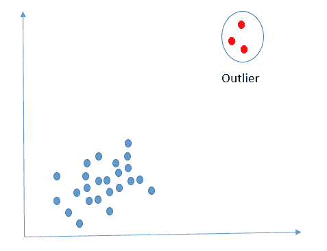

2D 空间中的异常检测

异常的一个简单例子是识别时间序列中离平均值(标准偏差)太远的数据点。下图显示了时间序列中被识别为异常的数据点:

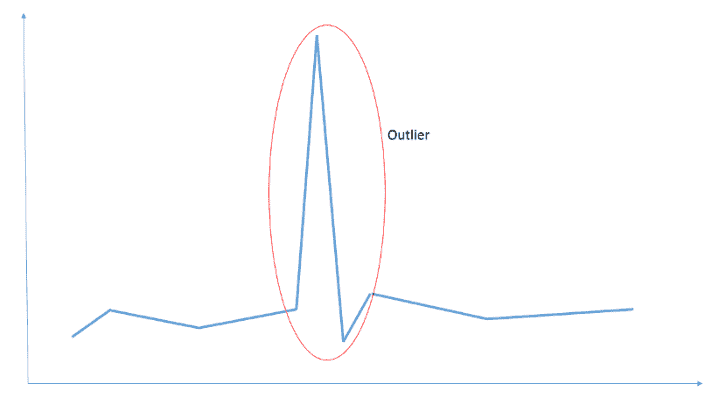

时间序列中的异常—通过标准偏差识别

在本章中，我们将重点关注一种被称为 **AEs** 的无监督深度学习应用。

<title>Autoencoders explained</title>  

# 自动编码器解释

**自动编码器** ( **AEs** )是前馈非递归型的神经网络。他们的目标是把给定的输入复制到输出。AE 的工作原理是将输入压缩成一个较低维度的摘要。这种概括通常被称为潜在空间表征。AE 试图从潜在空间表示中重建输出。一个**编码器**、一个**潜在空间表示**和一个**解码器**是组成 AEs 的三个部分。下图显示了对从 MNIST 数据集中选取的样本应用 AE 的情况:


AE 在 MNIST 数据集样本上的应用

AEs 的编码器和解码器组件是全连接的前馈网络。潜在空间表示中的神经元数量是一个超参数，需要作为构建 AE 的一部分进行传递。在潜在语义空间中决定的神经元或节点的数量决定了在将实际输入图像压缩成潜在空间表示时获得的压缩量。AE 的一般架构如下图所示:

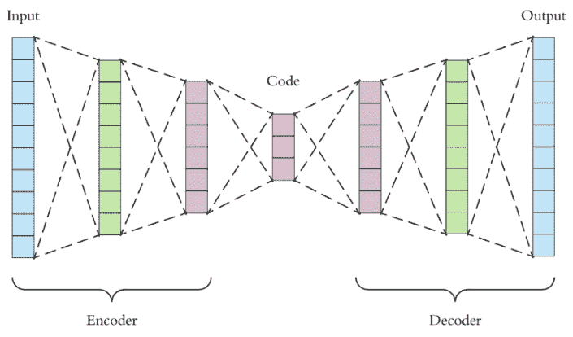

AE 的一般架构

给定的输入首先经过一个**编码器**，它是一个全连接的**人工神经网络** ( **安**)。**编码器**作用于**输入**并减小其尺寸，如超参数中所规定。**解码器**是另一个全连接的 ANN，它拾取这个减少的**输入**(潜在空间表示)，然后重建**输出**。目标是使**输出**与**输入**相同。一般来说，**编码器**和**解码器**的架构是镜像。虽然没有要求要求**编码器**和**解码器**的架构应该相同，但通常都是这样实施的。事实上，AE 的唯一要求是从给定输入获得相同的输出。任何介于两者之间的东西都可以根据建造 AE 的个人的奇思妙想进行定制。

数学上，编码器可以表示为:

[]

其中 *x* 是输入， *h* 是作用于输入的函数，以简洁的摘要格式表示输入。另一方面，解码器可以表示为:

[T1。]

虽然期望获得，但情况并非总是如此，因为重建是从紧凑的概要表示中完成的；因此，会出现一定的误差。误差 *e* 由原始输入 *x* 和重构输出 *r* ，计算得出。

然后，AE 网络通过减少**均方误差** ( **MSE** )来学习，并且误差被传播回隐藏层以进行调整。解码器和编码器的权重是彼此交换的，这使得学习训练参数更快。编码器和解码器的镜像架构使得更快地学习训练参数成为可能。在不同的架构中，权重不能简单互换；因此，计算时间会增加。这就是为编码器和解码器保留镜像架构的原因。

<title>Types of AEs based on hidden layers</title>  

# 基于隐藏层的 AEs 类型

根据隐藏层的大小，AEs 可以分为两种类型，**欠完整 AEs** 和**过完整 AEs** :

*   **Undercomplete AE** :如果 AE 只是简单的学习将输入复制到输出，那么它是没有用的。这个想法是产生一个简洁的表示作为编码器的输出，这个简洁的表示应该包含输入的最有用的特征。输入层所达到的简洁程度是由我们在潜在空间表示中使用的神经元或节点的数量决定的。这可以在构建 AE 时设置为一个参数。如果神经元的数量被设置为比输入特征的数量更少的维数，那么 AE 被迫学习输入数据的大多数关键特征。潜在空间中神经元的数量少于输入维度的数量的结构被称为欠完全 AE。
*   **过完备 AE** :可以把潜在空间的神经元数目表示为等于或大于输入维度的数目。这种体系结构被称为过完备 AE。在这种情况下，AE 不学习任何东西，而只是将输入复制到潜在空间，该潜在空间又被传播到解码器。

除了潜在空间中的神经元数量之外，以下是可以在 AE 架构中使用的一些其他参数:

*   **编码器和解码器的层数**:编码器和解码器的深度可以设置为任意数目。通常，在编码器和解码器的镜像架构中，层数被设置为相同的数目。最后一张图展示了编码器和解码器中两层的 AE，不包括输入和输出。
*   **编码器和解码器中每层神经元的数量**:编码器中每层神经元的数量减少，解码器中每层神经元的数量增加。编码器和解码器层中的神经元是对称的。
*   **损失函数**:AEs 使用 MSE 或交叉熵等损失函数来学习反向传播期间的权重。如果输入在(0，1)的范围内，则使用交叉熵作为度量，否则使用 MSE。

<title>Types of AEs based on restrictions</title>  

# 基于限制的 AEs 类型

根据对损失的限制，不良事件可分为以下几类:

*   **普通 AEs** :这是最简单的 AE 架构，采用全连接神经层作为编码器和解码器。
*   **稀疏 AEs** :稀疏 AEs 是一种引入信息瓶颈的替代方法，不需要减少隐藏层中的节点数量。损失函数不是倾向于不完全 AE，而是以惩罚层内激活的方式构造的。对于任何给定的观察，网络都被鼓励学习编码和解码，这仅依赖于激活一小部分神经元。
*   **去噪 AE**:这是一种过完备 AE，经历学习**恒等函数**或**空函数**的风险。本质上，AE 学习等于输入的输出，因此使 AE 无用。去噪 AEs 通过将一些输入随机初始化为 0 来避免学习恒等函数的问题。在损失函数的计算过程中，不考虑噪声引起的输入；因此，网络仍然学习正确的权重，而没有学习身份函数的风险。同时，AE 被训练来学习重构输出，即使是从被破坏的输入。

下图是对 MNIST 数据集中的样本图像进行 AEs 去噪的示例:


去噪 AEs 在 MNIST 样品中的应用

*   **卷积 AEs** :当处理作为输入的图像时，可以使用卷积层作为编码器和解码器网络的一部分。这种使用卷积层的 AEs 被称为**卷积 AEs** 。下图显示了 AEs 中卷积的使用:

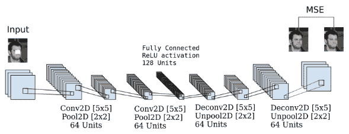

卷积 AEs

*   **堆栈式 AEs** :堆栈式 AEs 在编码器和解码器中都有多层。您可以参考 AE 的一般架构作为堆叠式 AE 架构的示例说明，其中编码器和解码器具有两层(不包括输入和输出层)。
    *   **变分 AEs** :一个**变分 AE** ( **VAE** )，而不是建立一个输出信号的编码器
*   描述每个潜在状态属性的 e 值描述了每个潜在属性的概率分布。这使得设计复杂的数据生成模型以及生成虚构的名人图像和数字艺术品成为可能。下图描述了 VAEs 中的数据表示:

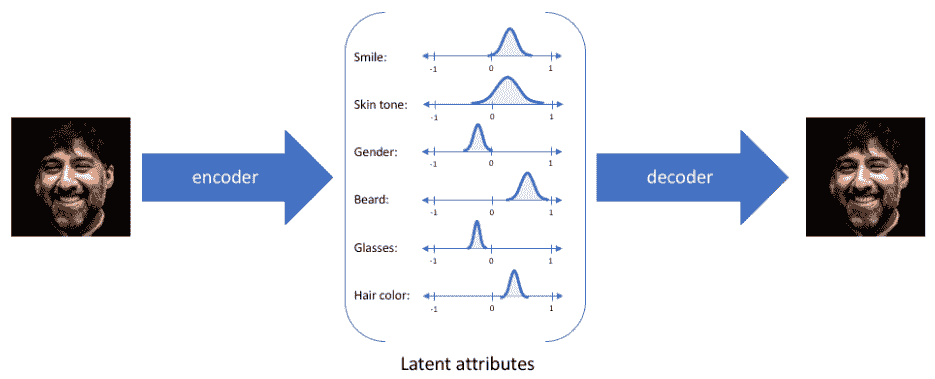

资料来源:https://www.jeremyjordan.me/variational-autoencoders/

在 VAE 中，编码器模型有时被称为识别模型，而解码器模型有时被称为生成模型。编码器输出潜在特征的统计分布范围。这些特征被随机采样，并被解码器用来重构输入。对于潜在分布的任何采样，期望解码器能够准确地重建输入。因此，在潜在空间中彼此接近的值应该对应于非常相似的重构。

<title>Applications of AEs</title>  

# AEs 的应用

以下是 AEs 可能用到的一些实际应用:

*   **图像着色**:给定一幅灰度图像作为输入，AEs 可以自动给图像着色，并将着色的图像作为输出返回。
*   **去噪**:去噪 AEs 能够去除图像中的噪声，重建无噪声的图像。可以完成诸如从视频和图像中去除水印的任务。
*   **降维** : AEs 以压缩形式表示输入数据，但只关注关键特征。因此，像图像这样的东西可以用减少的像素来表示，而不会在图像重建期间丢失太多信息。
*   **图像搜索**:用于根据给定的输入识别相似的图像。

*   **信息检索**:当从语料库中检索信息时，AEs 可以用于将属于给定输入的所有文档分组在一起。
*   **主题建模**:变分 AEs 被用来逼近后验分布，它已经成为推断文本文档潜在主题分布的一种有前途的替代方法。

我们已经讲述了理解 AEs 及其应用所需的基础知识。让我们在高层次上理解一下，我们将使用 AEs 来解决信用卡欺诈检测问题。

<title>The credit card fraud dataset</title>  

# 信用卡欺诈数据集

一般来说，在欺诈数据集中，我们有足够的数据用于负面类别(非欺诈/真实交易)，而很少或没有数据用于正面类别(欺诈交易)。这在 ML 世界中被称为**等级不平衡问题**。我们在非欺诈数据上训练一个 AE，并使用编码器学习特征。然后，解码器用于计算训练集的重建误差，以找到阈值。该阈值将用于看不见的数据(测试数据集或其他)。我们使用阈值来将那些值大于阈值的测试实例识别为欺诈实例。

对于本章中的项目，我们将使用一个来自这个 URL 的数据集:[https://essentials.togaware.com/data/](https://essentials.togaware.com/data/)。这是信用卡交易的公共数据集。该数据集最初通过研究论文*利用欠采样对不平衡分类进行概率校准*，A. Dal Pozzolo，O. Caelen，R. A Johnson 和 G. Bontempi，IEEE **计算智能研讨会系列** ( **SSCI** )，2015 年，南非开普敦。该数据集也可通过以下网址获得:[http://www.ulb.ac.be/di/map/adalpozz/data/creditcard.Rdata](http://www.ulb.ac.be/di/map/adalpozz/data/creditcard.Rdata)。该数据集是在 Worldline 和 ulb(布鲁塞尔自由大学)机器学习小组( [http://mlg.ulb.ac.be](http://mlg.ulb.ac.be/) )关于大数据挖掘和欺诈检测的研究合作期间收集和分析的。

以下是数据集的特征:

*   该论文将数据集作为 Rdata 文件提供。在 Kaggle 和其他网站上都有这个数据集的 CSV 转换版本。
*   它包含欧洲持卡人在 2013 年 9 月通过信用卡进行的交易。
*   两天内发生的交易被记录下来，并作为数据集呈现。

*   数据集中总共有 284，807 个事务。
*   数据集遭受严重的类不平衡问题。所有交易中只有 0.172%是欺诈交易(492 笔欺诈交易)。
*   数据集中共有三十个特征，分别是`V1`、`V2`、...、`V28`、`Time`、`Amount`。
*   变量`V1`、`V2`、...、`V28`是用 PCA 从原始变量集中获得的主成分。
*   由于保密性，产生主要成分的原始变量组没有被披露。
*   `Time`特性包含每个事务和数据集中第一个事务之间经过的秒数。
*   `Amount`特征是交易金额。
*   因变量命名为`Class`。欺诈交易在类中表示为 1，而真实交易表示为 0。

我们现在将跳转到使用 AEs 的信用卡欺诈检测。

<title>Building AEs with the H2O library in R</title>  

# 用 R 中的 H2O 图书馆构建 AEs

我们将在我们的项目中使用 H2O 可用的 AE 实现。H2O 是一个完全开源的分布式内存 ML 平台，具有线性可伸缩性。它提供了一些最广泛使用的 ML 算法的并行实现。它支持一种易于使用、无监督和非线性的 AE，作为其深度学习模型的一部分。H2O 的 DL AE 基于多层神经网络架构，其中整个网络被一起训练，而不是一层一层地堆叠。

可以使用以下命令在 R 中安装`h2o`包:

```
install.packages("h2o")
```

关于 R 中 H2O 的安装和依赖项的更多细节可以从这个 URL 获得:[https://cran.r-project.org/web/packages/h2o/index.html](https://cran.r-project.org/web/packages/h2o/index.html)。

一旦软件包安装成功，由`h2o`软件包提供的功能，包括 AE，可以简单地通过在 R 代码中包含以下代码行来使用:

```
library(h2o)
```

这是我们在用 AE 编码我们的信用卡欺诈检测系统之前需要做的所有事情。不要再等了，让我们开始构建我们的代码来探索和准备我们的数据集，以及实现捕获欺诈性信用卡交易的 AE。

<title>Autoencoder code implementation for credit card fraud detection</title>  

# 用于信用卡欺诈检测的自动编码器代码实现

像往常一样，像所有其他项目一样，让我们首先将数据加载到 R dataframe 中，然后执行 EDA 以更好地理解数据集。请注意代码中包含了`h2o`和`doParallel`库。这些包含使我们能够使用作为`h2o`库一部分的 AE，以及利用笔记本电脑/台式机中的多个 CPU 内核，如下所示:

```
# including the required libraries
library(tidyverse)
library(h2o)
library(rio)
library(doParallel)
library(viridis)
library(RColorBrewer)
library(ggthemes)
library(knitr)
library(caret)
library(caretEnsemble)
library(plotly)
library(lime)
library(plotROC)
library(pROC)
```

正在端口`54321`下的本地主机中初始化 H2O 集群。`nthreads`定义了要使用的线程池的数量，这接近于要使用的 CPU 的数量。在我们的例子中，我们说使用所有 CPU，我们还指定 H2O 集群使用的最大内存为`8G`:

```
localH2O = h2o.init(ip = 'localhost', port = 54321, nthreads = -1,max_mem_size = "8G")
# Detecting the available number of cores
no_cores <- detectCores() - 1
# utilizing all available cores
cl<-makeCluster(no_cores)
registerDoParallel(cl)
```

您将获得类似于以下代码块所示的输出:

```
H2O is not running yet, starting it now...
Note:  In case of errors look at the following log files:
    /tmp/RtmpKZvQ3m/h2o_sunil_started_from_r.out
    /tmp/RtmpKZvQ3m/h2o_sunil_started_from_r.err
java version "1.8.0_191"
Java(TM) SE Runtime Environment (build 1.8.0_191-b12)
Java HotSpot(TM) 64-Bit Server VM (build 25.191-b12, mixed mode)
Starting H2O JVM and connecting: ..... Connection successful!
R is connected to the H2O cluster:
    H2O cluster uptime:         4 seconds 583 milliseconds
    H2O cluster timezone:       Asia/Kolkata
    H2O data parsing timezone:  UTC
    H2O cluster version:        3.20.0.8
    H2O cluster version age:    2 months and 27 days 
    H2O cluster name:           H2O_started_from_R_sunil_jgw200
    H2O cluster total nodes:    1
    H2O cluster total memory:   7.11 GB
    H2O cluster total cores:    4
    H2O cluster allowed cores:  4
    H2O cluster healthy:        TRUE
    H2O Connection ip:          localhost
    H2O Connection port:        54321
    H2O Connection proxy:       NA
    H2O Internal Security:      FALSE
    H2O API Extensions:         XGBoost, Algos, AutoML, Core V3, Core V4
    R Version:                  R version 3.5.1 (2018-07-02)
```

现在，要设置数据文件位置的工作目录，加载 Rdata 并将其读入 dataframe，并使用以下代码查看 dataframe:

```
# setting the working directory where the data file is location
setwd("/home/sunil/Desktop/book/chapter 20")
# loading the Rdata file and reading it into the dataframe called cc_fraud
cc_fraud<-get(load("creditcard.Rdata"))
# performing basic EDA on the dataset
# Viewing the dataframe to confirm successful load of the dataset
View(cc_fraud)
```

将给出以下输出:

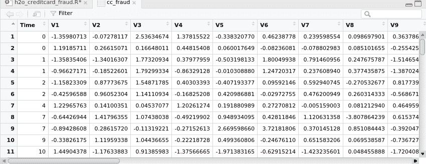

现在让我们使用以下代码打印 dataframe 结构:

```
print(str(cc_fraud))
```

这将产生以下输出:

```
'data.frame':     284807 obs. of  31 variables:
 $ Time  : num  0 0 1 1 2 2 4 7 7 9 ...
 $ V1    : num  -1.36 1.192 -1.358 -0.966 -1.158 ...
 $ V2    : num  -0.0728 0.2662 -1.3402 -0.1852 0.8777 ...
 $ V3    : num  2.536 0.166 1.773 1.793 1.549 ...
 $ V4    : num  1.378 0.448 0.38 -0.863 0.403 ...
 $ V5    : num  -0.3383 0.06 -0.5032 -0.0103 -0.4072 ...
 $ V6    : num  0.4624 -0.0824 1.8005 1.2472 0.0959 ...
 $ V7    : num  0.2396 -0.0788 0.7915 0.2376 0.5929 ...
 $ V8    : num  0.0987 0.0851 0.2477 0.3774 -0.2705 ...
 $ V9    : num  0.364 -0.255 -1.515 -1.387 0.818 ...
 $ V10   : num  0.0908 -0.167 0.2076 -0.055 0.7531 ...
 $ V11   : num  -0.552 1.613 0.625 -0.226 -0.823 ...
 $ V12   : num  -0.6178 1.0652 0.0661 0.1782 0.5382 ...
 $ V13   : num  -0.991 0.489 0.717 0.508 1.346 ...
 $ V14   : num  -0.311 -0.144 -0.166 -0.288 -1.12 ...
 $ V15   : num  1.468 0.636 2.346 -0.631 0.175 ...
 $ V16   : num  -0.47 0.464 -2.89 -1.06 -0.451 ...
 $ V17   : num  0.208 -0.115 1.11 -0.684 -0.237 ...
 $ V18   : num  0.0258 -0.1834 -0.1214 1.9658 -0.0382 ...
 $ V19   : num  0.404 -0.146 -2.262 -1.233 0.803 ...
 $ V20   : num  0.2514 -0.0691 0.525 -0.208 0.4085 ...
 $ V21   : num  -0.01831 -0.22578 0.248 -0.1083 -0.00943 ...
 $ V22   : num  0.27784 -0.63867 0.77168 0.00527 0.79828 ...
 $ V23   : num  -0.11 0.101 0.909 -0.19 -0.137 ...
 $ V24   : num  0.0669 -0.3398 -0.6893 -1.1756 0.1413 ...
 $ V25   : num  0.129 0.167 -0.328 0.647 -0.206 ...
 $ V26   : num  -0.189 0.126 -0.139 -0.222 0.502 ...
 $ V27   : num  0.13356 -0.00898 -0.05535 0.06272 0.21942 ...
 $ V28   : num  -0.0211 0.0147 -0.0598 0.0615 0.2152 ...
 $ Amount: num  149.62 2.69 378.66 123.5 69.99 ...
 $ Class : Factor w/ 2 levels "0","1": 1 1 1 1 1 1 1 1 1 1 ...
```

现在，要查看类分布，请使用以下代码:

```
print(table(cc_fraud$Class))
```

您将获得以下输出:

```
     0      1
284315    492
```

要查看`V1`和`Class`变量之间的关系，请使用以下代码:

```
# Printing the Histograms for Multivariate analysis
theme_set(theme_economist_white())
# visualization showing the relationship between variable V1 and the class
ggplot(cc_fraud,aes(x="",y=V1,fill=Class))+geom_boxplot()+labs(x="V1",y="")
```

这将产生以下输出:

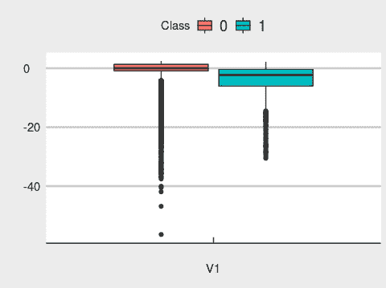

要可视化交易金额相对于类别的分布，请使用以下代码:

```
# visualization showing the distribution of transaction amount with
# respect to the class, it may be observed that the amount are discretized
# into 50 bins for plotting purposes
ggplot(cc_fraud,aes(x = Amount)) + geom_histogram(color = "#D53E4F", fill = "#D53E4F", bins = 50) + facet_wrap( ~ Class, scales = "free", ncol = 2)
```

这将产生以下输出:

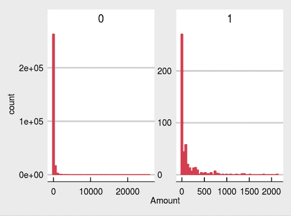

要直观显示与类相关的事务时间分布，请使用以下代码:

```
ggplot(cc_fraud, aes(x =Time,fill = Class))+ geom_histogram(bins = 30)+
  facet_wrap( ~ Class, scales = "free", ncol = 2)
```

这将产生以下输出:

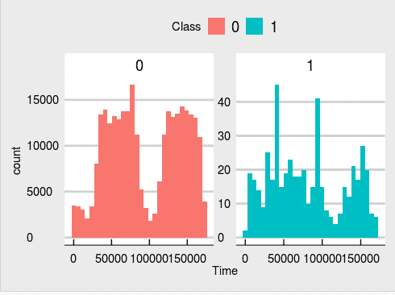

使用以下代码来可视化与`Class`相关的`V2`变量:

```
ggplot(cc_fraud, aes(x =V2, fill=Class))+ geom_histogram(bins = 30)+
  facet_wrap( ~ Class, scales = "free", ncol = 2)
```

您将获得以下输出:

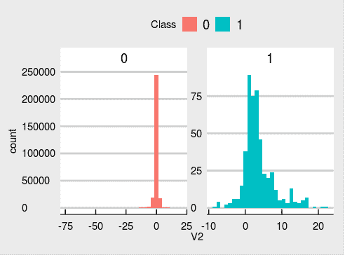

使用以下代码将`V3`相对于`Class`可视化:

```
ggplot(cc_fraud, aes(x =V3, fill=Class))+ geom_histogram(bins = 30)+
  facet_wrap( ~ Class, scales = "free", ncol = 2)
```

下图是结果输出:

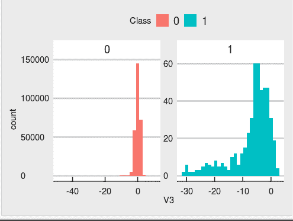

为了可视化相对于`Class`的`V3`变量，使用以下代码:

```
ggplot(cc_fraud, aes(x =V4,fill=Class))+ geom_histogram(bins = 30)+
  facet_wrap( ~ Class, scales = "free", ncol = 2)
```

下图是结果输出:

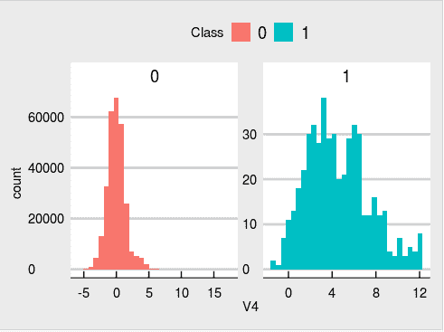

使用以下代码来可视化与`Class`相关的`V6`变量:

```
ggplot(cc_fraud, aes(x=V6, fill=Class)) + geom_density(alpha=1/3) + scale_fill_hue()
```

下图是结果输出:

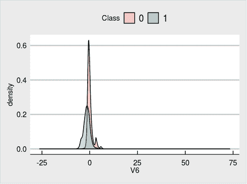

使用以下代码来可视化与`Class`相关的`V7`变量:

```
ggplot(cc_fraud, aes(x=V7, fill=Class)) + geom_density(alpha=1/3) + scale_fill_hue()
```

下图是结果输出:


使用以下代码来可视化与`Class`相关的`V8`变量:

```
ggplot(cc_fraud, aes(x=V8, fill=Class)) + geom_density(alpha=1/3) + scale_fill_hue()
```

下图是结果输出:

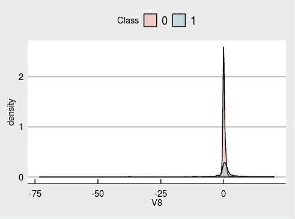

为了可视化相对于`Class`的`V9`变量，使用以下代码:

```
# visualizationshowing the V7 variable with respect to the class
ggplot(cc_fraud, aes(x=V9, fill=Class)) + geom_density(alpha=1/3) + scale_fill_hue()
```

下图是结果输出:


为了可视化相对于`Class`的`V10`变量，使用以下代码:

```
# observe we are plotting the data quantiles
ggplot(cc_fraud, aes(x ="",y=V10, fill=Class))+ geom_violin(adjust = .5,draw_quantiles = c(0.25, 0.5, 0.75))+labs(x="V10",y="")
```

下图是结果输出:

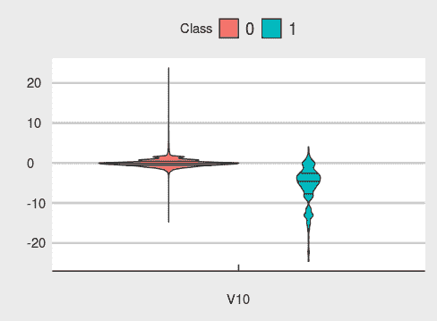

从与类相关的变量的所有可视化中，我们可以推断出大多数主成分都以`0`为中心。现在，要绘制数据中类的分布，请使用以下代码:

```
cc_fraud %>%
  ggplot(aes(x = Class)) +
  geom_bar(color = "chocolate", fill = "chocolate", width = 0.2) +
  theme_bw()
```

下面的条形图是结果输出:

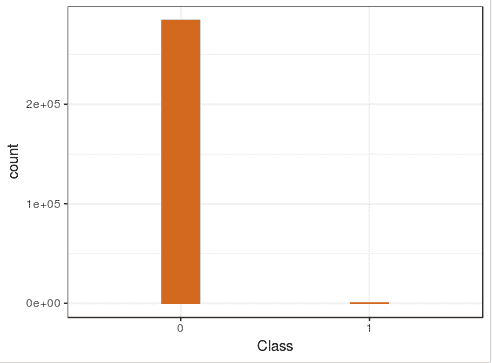

我们观察到班级的分布很不平衡。与少数类(欺诈性交易:`1`)相比，数据集中主要类(非欺诈性交易，由`0`表示)的表示太重。在处理这类问题的传统监督 ML 方法中，我们会使用诸如**合成少数过采样技术** ( **SMORT** )之类的技术来处理类不平衡问题。然而，对于 AEs，我们不处理数据预处理期间的类不平衡；相反，我们将数据原样提供给 AE 进行学习。事实上，AE 正在从多数类学习阈值和数据特征；这就是我们称之为一类分类问题的原因。

在培训我们的 AE 之前，我们需要做一些功能工程。我们先来关注一下数据中的`Time`变量。目前，它是秒的格式，但是我们可以更好地用天来表示它。运行以下代码查看数据集中的当前时间形式:

```
print(summary(cc_fraud$Time))
```

您将获得以下输出:

```
   Min. 1st Qu.  Median    Mean 3rd Qu.    Max.
      0   54202   84692   94814  139320  172792
```

我们知道给定的一天有 86，400 秒(每分钟 60 秒*每小时 60 分钟*每天 24 小时)。我们将通过考虑`Time`中的值并将其表示为`day1`来将`Time`变量转换为`Day`如果秒数小于或等于 86400，并且任何超过 86400 的都变成`day2.`只有两天的可能，因为我们从总结中可以看到时间变量所表示的最大值是`172792`秒:

```
# creating a new variable called day based on the seconds 
# represented in Time variable
 cc_fraud=cc_fraud %>% mutate(Day = case_when(.$Time > 3600 * 24 ~ "day2",.$Time < 3600 * 24 ~ "day1"))
#visualizing the dataset post creating the new variable
View(cc_fraud%>%head())
```

以下是转换后前六行的结果输出:


现在，使用以下代码查看最后六行:

```
View(cc_fraud%>%tail())
```

以下是转换后最后六行的结果输出:


现在，让我们使用以下代码，按交易发生的日期打印交易的分布情况:

```
print(table(cc_fraud[,"Day"]))
```

您将获得以下输出:

```
  day1   day2
144786 140020
```

让我们根据`Time`变量中表示的秒数创建一个新变量`Time_day`，并使用以下代码总结`Time_day`变量与`Day`的关系:

```
cc_fraud$Time_day <- if_else(cc_fraud$Day == "day2", cc_fraud$Time - 86400, cc_fraud$Time)
print(tapply(cc_fraud$Time_day,cc_fraud$Day,summary,simplify = FALSE))
```

我们得到以下结果输出:

```
$day1
   Min. 1st Qu.  Median    Mean 3rd Qu.    Max.
      0   38432   54689   52948   70976   86398

$day2
   Min. 1st Qu.  Median    Mean 3rd Qu.    Max.
      1   37843   53425   51705   68182   86392
```

使用以下代码将数据集中的所有字符变量转换为因子:

```
cc_fraud<-cc_fraud%>%mutate_if(is.character,as.factor)
```

我们可以通过将变量转换成因子来进一步微调`Time_day`变量。因子表示交易发生的时间，例如，`morning`、`afternoon`、`evening`和`night`。我们可以使用下面的代码，基于一天中的不同时段，创建一个名为`Time_Group`的新变量:

```
cc_fraud=cc_fraud %>% 
  mutate(Time_Group = case_when(.$Time_day <= 38138~ "morning" ,
                                .$Time_day <= 52327~  "afternoon",
                                .$Time_day <= 69580~"evening",
                                .$Time_day > 69580~"night"))
#Visualizing the data post creating the new variable
View(head(cc_fraud))
```

以下是前六行的结果输出:


使用以下代码查看并确认最后六行:

```
View(tail(cc_fraud))
```

这将给出以下输出，我们看到我们已经成功地转换了代表一天中不同时间的数据:


看一下下面的代码:

```
#visualizing the transaction count by day
cc_fraud %>%drop_na()%>%
  ggplot(aes(x = Day)) +
  geom_bar(fill = "chocolate",width = 0.3,color="chocolate") +
  theme_economist_white()
```

上述代码将生成以下输出:

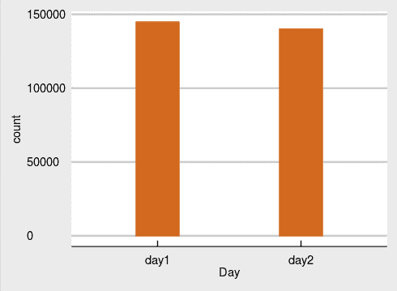

我们可以从可视化中推断出，第 1 天和第 2 天发生的事务的数量没有区别。两者都保持在近 15 万笔交易。

现在我们将把`Class`变量转换成一个因子，然后使用下面的代码通过`Time_Group`变量可视化数据:

```
cc_fraud$Class <- factor(cc_fraud$Class)
cc_fraud %>%drop_na()%>%
  ggplot(aes(x = Time_Group)) +
  geom_bar(color = "#238B45", fill = "#238B45") +
  theme_bw() +
  facet_wrap( ~ Class, scales = "free", ncol = 2)
```

这将生成以下输出:


从这个可视化中得出的结论是，在一天的所有时间段中，非欺诈性交易的数量几乎保持不变，而我们看到在早上`Time`组中欺诈性交易的数量大幅上升。

让我们对与类相关的交易量做最后一点探索:

```
# getting the summary of amount with respect to the class
print(tapply(cc_fraud$Amount  ,cc_fraud$Class,summary))
```

上述代码将生成以下输出:

```
$`0`
    Min.  1st Qu.   Median     Mean  3rd Qu.     Max.
    0.00     5.65    22.00    88.29    77.05 25691.16
$`1`
   Min. 1st Qu.  Median    Mean 3rd Qu.    Max.
   0.00    1.00    9.25  122.21 105.89 2125.87
```

摘要中一个有趣的发现是，欺诈交易的平均金额高于真实交易。然而，我们在欺诈交易中看到的最大交易金额远低于真实交易。也可以看出，真正的交易有更高的中位金额。

现在，让我们将 R 数据帧转换为 H2O 数据帧，并对其应用 AE。这是使用`h2o`库中功能的一个要求:

```
# converting R dataframe to H2O dataframe
cc_fraud_h2o <- as.h2o(cc_fraud)
#splitting the data into 60%, 20%, 20% chunks to use them as training,
#vaidation and test datasets
splits <- h2o.splitFrame(cc_fraud_h2o,ratios = c(0.6, 0.2), seed = 148)  
# creating new train, validation and test h2o dataframes
train <- splits[[1]]
validation <- splits[[2]]
test <- splits[[3]]
# getting the target and features name in vectors
target <- "Class"
features <- setdiff(colnames(train), target)
```

`tanh`激活函数是一个重新调整和移位的逻辑函数。其他函数，比如 ReLu 和 Maxout，也是由`h2o`库提供的，也可以使用。在第一个 AE 模型中，让我们使用`tanh`激活功能。这种选择是任意的，也可以根据需要尝试其他激活功能。

`h2o.deeplearning`函数有一个参数 AE，该参数应设置为`TRUE`以训练 AE 模型。现在让我们来构建我们的 AE 模型:

```
model_one = h2o.deeplearning(x = features, training_frame = train,
                             AE = TRUE,
                             reproducible = TRUE,
                             seed = 148,
                             hidden = c(10,10,10), epochs = 100,
 activation = "Tanh",
                             validation_frame = test)
```

上述代码生成以下输出:

```
 |===========================================================================================================================| 100%
```

我们将保存模型，这样我们就不必一次又一次地重新训练。然后加载保存在磁盘上的模型，并使用以下代码打印该模型以验证 AE 学习:

```
h2o.saveModel(model_one, path="model_one", force = TRUE)
model_one<-h2o.loadModel("/home/sunil/model_one/DeepLearning_model_R_1544970545051_1")
print(model_one)
```

这将生成以下输出:

```
Model Details:
==============
H2OAutoEncoderModel: deeplearning
Model ID:  DeepLearning_model_R_1544970545051_1
Status of Neuron Layers: auto-encoder, gaussian distribution, Quadratic loss, 944 weights/biases, 20.1 KB, 2,739,472 training samples, mini-batch size 1
  layer units  type dropout       l1       l2 mean_rate rate_rms momentum mean_weight weight_rms mean_bias bias_rms
1     1    34 Input  0.00 %       NA       NA        NA       NA       NA          NA         NA        NA       NA
2     2    10  Tanh  0.00 % 0.000000 0.000000  0.610547 0.305915 0.000000   -0.000347   0.309377 -0.028166 0.148318
3     3    10  Tanh  0.00 % 0.000000 0.000000  0.181705 0.103598 0.000000    0.022774   0.262611 -0.056455 0.099918
4     4    10  Tanh  0.00 % 0.000000 0.000000  0.133090 0.079663 0.000000    0.000808   0.337259  0.032588 0.101952
5     5    34  Tanh      NA 0.000000 0.000000  0.116252 0.129859 0.000000    0.006941   0.357547  0.167973 0.688510
H2OAutoEncoderMetrics: deeplearning
 Reported on training data. Training Set Metrics:
=====================
MSE: (Extract with `h2o.mse`) 0.0003654009
RMSE: (Extract with `h2o.rmse`) 0.01911546
H2OAutoEncoderMetrics: deeplearning
 Reported on validation data. Validation Set Metrics:
=====================
MSE: (Extract with `h2o.mse`) 0.0003508435
RMSE: (Extract with `h2o.rmse`) 0.01873082
```

我们现在将使用构建的 AE 模型对测试数据集进行预测，使用以下代码:

```
test_autoencoder <- h2o.predict(model_one, test)
```

这将生成以下输出:

```
|===========================================================================================================================| 100%
```

通过`h2o.deepfeatures`功能，可以在内层中以有意识的方式可视化表示数据的编码器。让我们尝试在第二层中可视化缩减的数据:

```
train_features <- h2o.deepfeatures(model_one, train, layer = 2) %>%
  as.data.frame() %>%
  mutate(Class = as.vector(train[, 31]))
# printing the reduced data represented in layer2
print(train_features%>%head(3))
```

上述代码将生成以下输出:

```
DF.L2.C1  DF.L2.C2     DF.L2.C3    DF.L2.C4   DF.L2.C5 
-0.12899115 0.1312075  0.115971952 -0.12997648 0.23081912
-0.10437942 0.1832959  0.006427409 -0.08018725 0.05575977
-0.07135827 0.1705700 -0.023808057 -0.11383244 0.10800857
DF.L2.C6   DF.L2.C7    DF.L2.C8  DF.L2.C9  DF.L2.C10  Class0.1791547 0.10325721  0.05589069 0.5607497 -0.9038150     0
0.1588236 0.11009450 -0.04071038 0.5895413 -0.8949729     0
0.1676358 0.10703990 -0.03263755 0.5762191 -0.8989759     0
```

现在，让我们使用以下代码，绘制`DF.L2.C1`相对于`DF.L2.C2`的数据，以验证编码器是否检测到欺诈交易:

```
ggplot(train_features, aes(x = DF.L2.C1, y = DF.L2.C2, color = Class)) +
  geom_point(alpha = 0.1,size=1.5)+theme_bw()+
  scale_fill_brewer(palette = "Accent")
```

这将生成以下输出:


我们再次绘制`DF.L2.C3`相对于`DF.L2.C4`的数据，以验证编码器是否检测到任何欺诈交易，使用以下代码:

```
ggplot(train_features, aes(x = DF.L2.C3, y = DF.L2.C4, color = Class)) +
  geom_point(alpha = 0.1,size=1.5)+theme_bw()+
  scale_fill_brewer(palette = "Accent")
```

上述代码将生成以下输出:

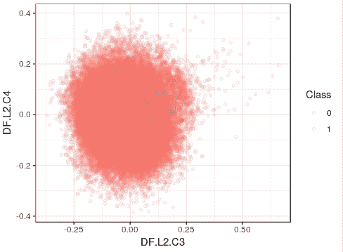

我们从两个可视化中看到，欺诈性交易确实是通过使用 AE 模型的维数约简方法检测到的。这几个分散的点(由`1`表示)描绘了被检测到的欺诈交易。我们也可以使用我们的第一个模型，用其他隐藏层训练一个新的模型。这导致 10 列，因为第三层有 10 个节点。我们只是试图切掉一个进行了某种程度缩减的层，并使用它来建立一个新的模型:

```
# let's consider the third hidden layer. This is again a random choice
# in fact we could have taken any layer among the 10 inner layers
train_features <- h2o.deepfeatures(model_one, validation, layer = 3) %>%
  as.data.frame() %>%
  mutate(Class = as.factor(as.vector(validation[, 31]))) %>%
  as.h2o()
```

上述代码将生成以下输出:

```
|===========================================================================================================================| 100% |===========================================================================================================================| 100%
```

正如我们所看到的，训练模型和数据已经成功创建。我们现在将继续训练新模型，保存并打印它。首先，我们将从切片编码器层获取特性名称:

```
features_two <- setdiff(colnames(train_features), target)
```

然后我们将训练一个新的模型:

```
model_two <- h2o.deeplearning(y = target,
                              x = features_two,
                              training_frame = train_features,
                              reproducible = TRUE,
                              balance_classes = TRUE,
                              ignore_const_cols = FALSE,
                              seed = 148,
                              hidden = c(10, 5, 10),
                              epochs = 100,
                              activation = "Tanh")
```

然后，我们将保存模型以避免再次重新训练，然后检索模型并使用以下代码打印它:

```
h2o.saveModel(model_two, path="model_two", force = TRUE)
model_two <- h2o.loadModel("/home/sunil/model_two/DeepLearning_model_R_1544970545051_2")
print(model_two)
```

这将生成以下输出:

```
Model Details:
==============
H2OBinomialModel: deeplearning
Model ID:  DeepLearning_model_R_1544970545051_2
Status of Neuron Layers: predicting Class, 2-class classification, bernoulli distribution, CrossEntropy loss, 247 weights/biases, 8.0 KB, 2,383,962 training samples, mini-batch size 1
  layer units    type dropout       l1       l2 mean_rate rate_rms momentum mean_weight weight_rms mean_bias bias_rms
1     1    10   Input  0.00 %       NA       NA        NA       NA       NA          NA         NA        NA       NA
2     2    10    Tanh  0.00 % 0.000000 0.000000  0.001515 0.001883 0.000000   -0.149216   0.768610 -0.038682 0.891455
3     3     5    Tanh  0.00 % 0.000000 0.000000  0.003293 0.004916 0.000000   -0.251950   0.885017 -0.307971 0.531144
4     4    10    Tanh  0.00 % 0.000000 0.000000  0.002252 0.001780 0.000000    0.073398   1.217405 -0.354956 0.887678
5     5     2 Softmax      NA 0.000000 0.000000  0.007459 0.007915 0.000000   -0.095975   3.579932  0.223286 1.172508
H2OBinomialMetrics: deeplearning
 Reported on training data.
  Metrics reported on temporary training frame with 9892 samples MSE:  0.1129424
RMSE:  0.336069
LogLoss:  0.336795
Mean Per-Class Error:  0.006234916
AUC:  0.9983688
Gini:  0.9967377
Confusion Matrix (vertical: actual; across: predicted) for F1-optimal threshold:
          0    1    Error      Rate
0      4910   62 0.012470  =62/4972
1         0 4920 0.000000   =0/4920
Totals 4910 4982 0.006268  =62/9892
Maximum Metrics: Maximum metrics at their respective thresholds
                        metric threshold    value idx
1                       max f1  0.009908 0.993739 153
2                       max f2  0.009908 0.997486 153
3                 max f0point5  0.019214 0.990107 142
4                 max accuracy  0.009908 0.993732 153
5                max precision  1.000000 1.000000   0
6                   max recall  0.009908 1.000000 153
7              max specificity  1.000000 1.000000   0
8             max absolute_mcc  0.009908 0.987543 153
9   max min_per_class_accuracy  0.019214 0.989541 142
10 max mean_per_class_accuracy  0.009908 0.993765 153
Gains/Lift Table: Extract with `h2o.gainsLift(<model>, <data>)` or `h2o.gainsLift(<model>, valid=<T/F>, xval=<T/F>)
```

为了测量测试数据的模型性能，我们需要将测试数据转换为与训练数据相同的缩减维度:

```
test_3 <- h2o.deepfeatures(model_one, test, layer = 3)
print(test_3%>%head())
```

上述代码将生成以下输出:

```
|===========================================================================================================================| 100%
```

我们看到，数据已经转换成功。现在，为了用`model_two`对测试数据集进行预测，我们将使用以下代码:

```
test_pred=h2o.predict(model_two, test_3,type="response")%>%
  as.data.frame() %>%
  mutate(actual = as.vector(test[, 31]))
```

这将生成以下输出:

```
|===========================================================================================================================| 100%
```

正如我们从输出中看到的，预测已经成功完成，现在让我们使用以下代码来可视化预测:

```
test_pred%>%head()
  predict        p0           p1 actual
1       0 1.0000000 1.468655e-23      0
2       0 1.0000000 2.354664e-23      0
3       0 1.0000000 5.987218e-09      0
4       0 1.0000000 2.888583e-23      0
5       0 0.9999988 1.226122e-06      0
6       0 1.0000000 2.927614e-23      0
# summarizing the predictions
print(h2o.predict(model_two, test_3) %>%
  as.data.frame() %>%
  dplyr::mutate(actual = as.vector(test[, 31])) %>%
  group_by(actual, predict) %>%
  dplyr::summarise(n = n()) %>%
  mutate(freq = n / sum(n)))
```

这将生成以下输出:

```
|===========================================================================================================================| 100%
# A tibble: 4 x 4
# Groups:   actual [2]
  actual predict     n   freq
  <chr>  <fct>   <int>  <dbl>
1 0      0       55811 0.986
2 0      1         817 0.0144
3 1      0          41 0.414
4 1      1          58 0.586
```

我们看到，我们的 AE 能够以 98%的准确率正确预测非欺诈性交易，这很好。然而，在预测欺诈交易时，它的准确率只有 58%。这绝对是需要重点关注的。我们的模型需要一些改进，这可以通过以下选项来实现:

*   使用其他层的潜在空间表示作为输入来构建`model_two`(回想一下，我们目前使用的是第 3 层表示)
*   使用 ReLu 或 Maxout 激活功能代替`Tanh`
*   通过`h2o.anomaly`函数检查错误分类的实例，并增加或减少截止阈值 MSE 值，从而将欺诈性交易与非欺诈性交易区分开来
*   在编码器和解码器中尝试更复杂的架构

我们不打算在本章尝试这些选项，因为它们本质上是实验性的。但是，感兴趣的读者可以通过尝试这些选项来尝试和提高模型的准确性。

最后，一个最佳实践是显式关闭`h2o`集群。这可以通过以下命令完成:

```
h2o.shutdown()
```

<title>Summary</title>  

# 摘要

在这一章中，我们学习了一种叫做 AEs 的无监督深度学习技术。我们介绍了 AEs 的定义、工作原理、类型和应用。H2O 是一个开源库，它使我们能够创建深度学习模型，包括 AEs。然后，我们讨论了一个信用卡欺诈开放数据集，并使用 AE 实现了一个项目来检测欺诈性信用卡交易。

深度神经网络能否帮助完成创造性任务，如散文生成、故事写作、图像标题生成和诗歌写作？不确定？！让我们在下一章探索 RNNs，一种特殊类型的深度神经网络，它使我们能够完成创造性的任务。翻页探索散文生成的 RNNs 世界。