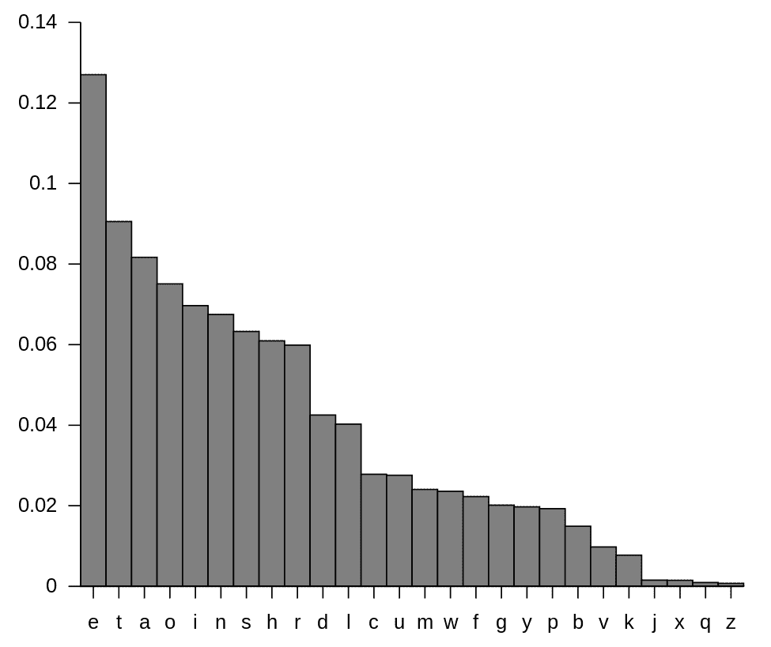
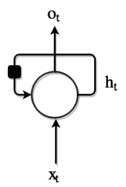
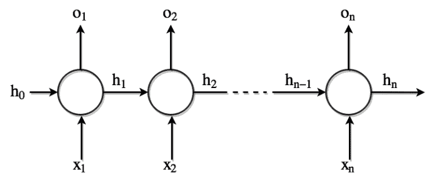
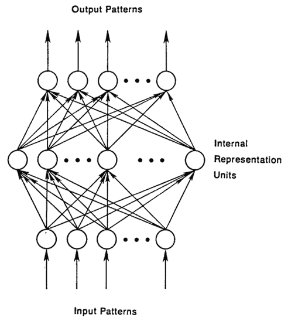
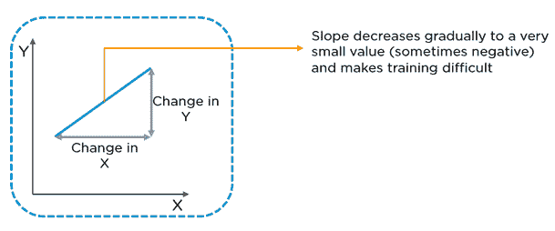
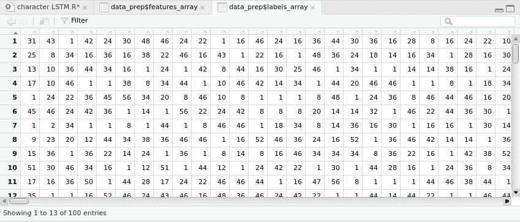

# 二十一、基于循环神经网络的散文自动生成

我们已经通过这本书交流了将近 200 页，但是我意识到我还没有很好地向你介绍我自己！我想是时候了。通过这本书的作者简介，你已经对我有所了解；然而，我想告诉你一些关于我居住的城市的事情。我住在印度南部的一个城市，名叫班加卢鲁，也叫班加罗尔。这座城市以其 IT 人才和人口多样性而闻名。我爱这座城市，因为它充满了正能量。每天，我都会遇到各行各业的人——来自不同种族、不同背景的人，说多种语言的人，等等。卡纳达语是班加罗尔所在的卡纳塔克邦的官方语言。虽然我能说一些卡纳达语，但我说这种语言的熟练程度不如母语为卡纳达语的人。当然，对我来说这是一个需要改进的地方，我正在努力。像我一样，许多从其他地方搬到这座城市的移民在用卡纳达语交谈时也面临问题。有趣的是，不懂这种语言并不妨碍我们用当地人自己的语言与他们交流。猜猜是什么拯救了我们:移动应用，如谷歌翻译，谷歌文本到语音，等等。这些应用建立在被称为机器翻译和语音识别的 NLP 技术之上。这些技术反过来又作用于所谓的语言模型。语言模型是我们将在本章深入探讨的主题。

本章的目标包括探讨以下主题:

*   需要语言建模来解决自然语言处理任务
*   语言模型的工作原理
*   语言模型的应用
*   语言建模与神经网络的关系
*   循环神经网络

*   正常前馈网络和循环神经网络之间的差异
*   长短期记忆网络
*   一个使用循环神经网络自动生成文本的项目


# 理解语言模型

在英语中，字符 *a* 比字符 *x* 在单词和句子中出现得更频繁。同样，我们也可以观察到，*是*这个词比*标本*这个词出现的频率更高。通过检查大量文本可以了解字符和单词的概率分布。下面的屏幕截图是一个图表，显示了给定语料库(文本数据集)的字母的概率分布:



语料库中字母的概率分布

我们可以观察到字符的概率分布是不均匀的。这实质上意味着我们可以恢复一个单词中的字符，即使它们因噪声而丢失。如果一个单词中缺少某个字符，可以根据该字符周围的字符来重新构建。丢失字符的重建不是随机完成的，而是通过挑选出现概率分布最高的字符来完成的，给定丢失字符周围的字符。从技术上讲，句子中的单词或单词中的字符的统计结构遵循与最大熵的距离。

语言模型利用语言的统计结构来表达以下内容:

*   给定 *w_1，w_2，w_3，...w_N* 一个句子中的单词，语言模型给一个句子分配一个概率 *P(w_1，w_2，w_3，....w_N)* 。
*   然后，它将一个即将出现的单词的概率(本例中为*w4*)指定为*P(w4 | w1，w2，w3)*。

语言模型支持在 NLP 中开发许多应用，其中一些列举如下:

*   **机器翻译** : P(今晚巨大气旋)> P(今晚增强台风)
*   **拼写纠正** : P(卫星星座)> P(卫星星座)
*   **语音识别** : P(我看到了一辆面包车)> P(眼神敬畏的安)
*   **打字预测**:在谷歌搜索中自动完成，打字辅助应用

现在让我们看看单词的概率是如何计算的。考虑一个简单的句子，*十二月冷*。这句话的概率表示如下:

*P("十二月是冷的")= P("十二月")* P("是" | "十二月")* P("冷" | "十二月是")*

数学上，句子中的单词(或单词中的字母)的概率计算可以表示如下:


俄罗斯数学家安德烈·马尔科夫(Andrey Markov)描述了一种随机过程，这种随机过程具有一种称为**马尔科夫性质**或**马尔科夫假设**的性质。这基本上表明，人们可以仅仅根据过程的当前状态来预测过程的未来，就像人们可以知道过程的全部历史一样，因此独立于这样的历史。

基于马尔科夫的假设，我们可以将*冷*的条件概率改写如下:

*P("寒" | "十二月正")全等于*

 *数学上，马尔科夫的假设可以表述如下:


虽然这个数学公式表示二元模型(一次考虑两个单词)，但它可以很容易地扩展到 n 元模型。在 n-gram 模型中，条件概率只取决于前面的几个词。

数学上，n-gram 模型表示如下:


考虑一下*埃兹拉·庞德*的著名诗歌*一个女孩*作为我们建立 **bigram** 模型的语料。以下是文本语料库:

```r
The tree has entered my hands,
The sap has ascended my arms,
The tree has grown in my breast-Downward,
The branches grow out of me, like arms.
Tree you are,
Moss you are,
You are violets with wind above them.
A child - so high - you are,
And all this is folly to the world.
```

我们已经知道，在二元模型中，条件概率是根据前一个词计算的。因此，一个单词的概率可以计算如下:


如果我们给定单词 *my* 来计算单词 *arms* 在诗中出现的概率，它被计算为单词 *arms* 和 *my* 在诗中一起出现的次数，除以单词 *my* 在诗中出现的次数。

我们看到*我的手臂*这几个字在诗中只出现过一次(在句子*中，树液已经爬上了我的手臂*)。然而，*我的*这个词在诗中出现了三次(在句子*树已经进入我的手里*、*树液已经爬上我的手臂*、*树已经在我的胸前向下生长*)。

因此，单词 *arms* 给定 *my* 的条件概率为 1/3，形式表示如下:

*P("arms" | "my") = P("arms "，" my") / P("my") = 1 / 3*

为了计算第一个和最后一个单词的概率，分别在句子的开头和结尾添加了特殊标签<bos>和<eos>。类似地，一个句子或单词序列的概率可以使用相同的方法通过乘以所有二元模型概率来计算。</eos></bos>

由于语言建模涉及预测序列中的下一个单词，给定已经存在的单词序列，我们可以训练语言模型从给定的开始序列创建序列中的后续单词。


# 探索循环神经网络

**循环神经网络** ( **RNNs** )是用于处理序列数据的神经网络家族。rnn 通常用于实现语言模型。作为人类，我们对语言的理解很大程度上基于语境。例如，让我们考虑一下句子*圣诞节在-* 月。用*十二月*这个词填空很容易。这里的基本思想是，关于最后一个单词的信息被编码在句子的前面的元素中。

RNN 体系结构背后的中心主题是利用数据的顺序结构。顾名思义，rnn 以循环的方式运行。本质上，这意味着对序列或句子的每个元素执行相同的操作，其输出取决于当前输入和之前的操作。

RNN 通过将时间 *t* 的网络输出与时间 *t+1* 的网络输入进行循环来工作。这些循环允许信息从一个时间步持续到下一个时间步。下图是代表 RNN 的电路图:



代表 RNN 的电路图

该图显示了一个 RNN，它使用一个简单的循环来记住它从以前的输入中知道的内容。这个循环从以前的时间戳中获取信息，并将其添加到当前时间戳的输入中。在特定的时间步长 *t* ，*X[t]是网络的输入，*O[t]是网络的输出，*h[t]是它从网络中先前节点记忆的细节。在这两者之间，是 RNN 细胞，它包含神经网络，就像一个前馈网络。***

就 RNN 的定义而言，需要考虑的一个关键点是时间戳。定义中提到的时间戳与过去、现在和未来无关。它们只是代表一个单词或一个序列或一个句子中的一个项目。

我们来考虑一个例句:*圣诞假期棒极了*。在这句话中，看一下下面的时间戳:

*   *圣诞节*是 x [0]
*   *节假日*是 x [1]
*   *是*是 x[2]；
*   *牛逼*是 x [3]

如果 t=1，那么看看下面的内容:

*   x [t] = *节假日* →当前时间戳的事件
*   x [t-1] = *圣诞节* →之前时间戳的事件

从前面的电路图可以看出，在 RNN 中，相同的操作在不同的节点上重复执行。图中还有一个黑色方块，代表单个时间步长的时间延迟。理解带有循环的 RNN 可能会令人困惑，所以让我们展开计算图。展开的 RNN 计算图如下图所示:



RNN-展开的计算图形视图

在上图中，每个节点都与特定时间相关联。在 RNN 架构中，每个节点在每个时间步长**x[t]接收不同的输入。它还具有在每个时间步**o[t]产生输出的能力。网络还保持存储状态**h[t]，其包含关于直到时间 *t* 网络中发生的事情的信息。由于这是在网络中所有节点上运行的相同过程，因此可以用简化形式表示整个网络，如 RNN 电路图所示。******

现在，我们知道我们在 RNNs 中看到单词 **recurrent** ，因为它对序列的每个元素执行相同的任务，输出取决于之前的计算。可以注意到，理论上，RNNs 可以利用任意长序列中的信息，但是在实践中，它们被实现为仅向后看几步。

从形式上讲，RNN 可以定义为如下等式:


等式中，*h[t]是时间戳 *t* 时的隐藏状态。诸如 Tanh、Sigmoid 或 ReLU 之类的激活函数可用于计算隐藏状态，它在等式中表示为 [] 。 *W* 是时间戳 *t* 时隐藏层输入的权重矩阵。*X[t]是时间戳 *t* 的输入。 *U* 为隐藏层在时间 *t-1* 到时间 *t* 的权重矩阵， *h [ t-1 ]* 为时间戳 *t* 的隐藏状态。**

在反向传播期间， *U* 和 *W* 权重由 RNN 学习。在每个节点，隐藏状态的贡献和当前输入的贡献由 *U* 和 *W* 决定。 *U* 和 *W* 的比例依次导致在当前节点产生输出。激活函数增加了 RNNs 的非线性，从而简化了反向传播过程中的梯度计算。下图说明了反向传播的概念:


神经网络中的反向传播

下图描述了自动 RNN 的整体工作机制以及通过反向传播学习权重 *U* 和 *W* 的方式。它还描述了在网络中使用 *U* 和 *W* 权重矩阵来生成输出，如下图所示:


砝码在 RNN 的作用


# 前馈神经网络与 RNNs 的比较

其他神经网络和 RNNs 之间的一个基本区别是，在所有其他网络中，输入是相互独立的。然而，在 RNN 中，所有的输入都是相互关联的。在应用中，要预测给定句子中的下一个单词，所有前面单词之间的关系有助于预测当前输出。换句话说，RNN 在自我训练时会记住所有这些关系。这与其他类型的神经网络不同。前馈网络的表示如下图所示:



前馈神经网络结构

从上图中，我们可以看到前馈网络结构中没有环路。这与 RNN 电路图和 RNN 展开计算图中描绘的 RNN 架构形成对比。前馈网络中的一系列数学运算在节点处执行，信息被直接处理，没有任何循环。

使用监督学习，输入到前馈网络的输入被转换成输出。在这种情况下，如果是分类，输出可以是一个标签，如果是回归，输出可以是一个数字。如果我们考虑图像分类，对于作为输入给出的图像，标签可以是*猫*或*狗*。

前馈神经网络在标记的图像上被训练，直到预测标记的误差被最小化。一旦经过训练，该模型甚至能够对以前从未见过的图像进行分类。经过训练的前馈网络可以暴露于任何随机的照片集合；第一张照片的分类对模型需要分类的第二张或后续照片没有任何影响。让我们用一个例子来讨论这个概念:如果第一幅图像被前馈网络视为一只*狗*，这并不意味着第二幅图像将被归类为*猫*。换句话说，模型得出的预测没有时间顺序的概念，并且关于标签的决定仅基于所提供的当前输入得出。总之，在前馈网络中，没有关于历史预测的信息用于当前预测。这与 RNNs 非常不同，在 RNNs 中，考虑先前的预测是为了帮助当前的预测。

另一个重要的区别是，前馈网络通过设计将一个输入映射到一个输出，而 rnn 可以采取多种形式:将一个输入映射到多个输出，将多个输入映射到多个输出，或者将多个输入映射到一个输出。下图描述了 rnn 可能的各种输入-输出映射:


使用 RNNs 的输入-输出映射可能性

让我们回顾一下 RNN 可能实现的各种输入输出映射的一些实际应用。上图中的每个矩形都是一个向量，箭头代表函数，例如矩阵乘法。输入向量是下面的矩形(红色)，输出向量是上面的矩形(蓝色)。中间的矩形(绿色)是代表 RNN 状态的向量。

以下是图中所示的各种映射形式:

*   **一个输入到一个输出**:最左边的是一个没有 RNN 的普通处理模式，从固定大小的输入到固定大小的输出；比如图像分类。
*   **一个输入多个输出**:顺序输出，例如图像字幕以图像为输入，输出一句话。
*   **多输入一输出**:顺序输入，例如，情感分析，其中给定的句子作为 RNN 的输入，输出是表示该句子的正面或负面情感的分类。
*   **多输入多输出**:顺序输入和顺序输出；例如，对于机器翻译任务，RNN 读取英语句子作为输入，然后输出印地语或其他语言的句子。
*   **多输入多输出**:同步序列输入和输出，例如，视频分类，我们希望标记视频的每一帧。

现在让我们回顾一下前馈网络和 RNN 之间的最终区别。为了设置前馈神经网络中的权重，反向传播的方式不同于在 RNN 中进行的通过时间(**)的所谓**反向传播。我们已经知道，神经网络中的反向传播算法的目标是调整神经网络的权重，以使网络输出与响应于相应输入的某些预期输出相比的误差最小。反向传播本身是一种受监督的学习算法，允许神经网络根据所产生的特定错误进行校正。反向传播算法包括以下步骤:****

 **1.  向神经网络提供训练输入，并通过网络传播它以获得输出
2.  将预测输出与实际输出进行比较，并计算误差
3.  计算误差相对于学习的网络权重的导数
4.  修改权重以最小化误差
5.  重复

在前馈网络中，在末端运行反向传播是有意义的，因为输出仅在末端可用。在 RNNs 中，输出在每个时间步产生，该输出影响后续时间步的输出。换句话说，在 RNNs 中，一个时间步长的误差取决于前一个时间步长。因此，常规的反向传播算法不适用于 RNNs。因此，一种称为 BPTT 的不同算法被用于修改 RNN 中的权重。


# 穿越时间的反向传播

我们已经知道，rnn 是循环图，不同于前馈网络，前馈网络是非循环有向图。在前馈网络中，误差导数是从上一层计算的。然而，在 RNN 中，我们没有这样的分层来执行误差导数计算。这个问题的一个简单解决方案是展开 RNN，使其类似于前馈网络。为了实现这一点，RNN 中的隐藏单元会在每个时间步长进行复制。每个时间步长复制形成一个类似于前馈网络中的层。每个时间步 *t* 层连接到时间步 *t+1* 中所有可能的层。因此，我们随机初始化权重，展开网络，然后使用反向传播来优化隐藏层中的权重。最底层通过传递参数来初始化。作为反向传播的一部分，这些参数也被优化。时间反向传播算法包括以下步骤:

1.  向网络提供输入和输出对的时间步长序列
2.  展开网络，然后计算并累积每个时间步长的误差
3.  卷起网络并更新权重
4.  重复

总之，使用 BPTT，误差从最后一个时间步长反向传播到第一个时间步长，同时展开所有时间步长。计算每个时间步长的误差，这允许更新权重。下图显示了反向传播随时间的变化:


RNN 中的时间反向传播

应该注意的是，随着时间步长的增加，BPTT 算法在计算上变得非常昂贵。


# RNN 坡度问题及解决方案

rnn 并不完美，它们面临两个主要问题，即**爆炸梯度**和**消失梯度**。为了理解这些问题，让我们先来理解梯度的含义。梯度是相对于其输入的偏导数。简单地说，梯度衡量的是一个函数的输出变化有多大，如果输入有一点点变化的话。


# 爆炸梯度

爆炸梯度涉及一种情况，其中 BPTT 算法毫无理由地赋予权重极高的重要性。该问题导致网络不稳定。在极端情况下，权重值可能变得很大，以至于值溢出并导致 NaN 值。

在训练网络时，可以通过观察以下细微迹象来检测爆炸梯度问题:

*   模型权重在训练期间很快变得非常大
*   模型权重在训练期间变成 NaN 值
*   在训练期间，每个节点和层的误差梯度值始终高于 1.0

有几种方法可以处理爆炸梯度问题。以下是一些流行的技术:

*   如果我们能截断或挤压梯度，这个问题就能很容易地解决。这就是所谓的**梯度剪辑**。
*   在训练期间跨更少的先前时间步长更新权重也可以减少爆炸梯度问题。这种具有较少步长更新的技术被称为通过时间 ( **TBPTT** )的**截断反向传播。它是 BPTT 训练算法的修改版本，其中一次一个时间步长地处理序列，并且周期性地( *k1* 时间步长)对固定数量的时间步长( *k2* 时间步长)执行 BPTT 更新。 *k1* 是更新之间的正向传递时间步长数。 *k2* 是应用 BPTT 的时间步数。**
*   权重正则化可以通过检查网络权重的大小并对大权重值的网络损失函数应用惩罚来完成。

*   通过使用**长短期记忆单元** ( **LSTMs** )或者**门控循环单元** ( **GRUs** )来代替普通的 RNNs。
*   小心翼翼的初始化权重比如**泽维尔**初始化或者**何**初始化。


# 消失梯度

我们已经意识到长期依赖对于 rnn 的正常运行非常重要。由于长期的依赖性，rnn 可能变得太深。在激活函数的梯度非常小的情况下，会出现消失梯度问题。在反向传播过程中，当权重与低梯度相乘时，它们往往会变得非常小，并随着它们进一步进入网络而消失。这使得神经网络忘记了长期依赖性。下图显示了导致梯度消失的原因:



梯度消失的原因

总之，由于消失梯度问题，rnn 在记忆序列中非常远的先前单词时会遇到困难，并且只能基于最近的单词进行预测。这可能会影响 RNN 预测的准确性。有时，模型可能无法预测或分类它应该做什么。

有几种方法可以解决梯度消失的问题。以下是一些最受欢迎的技术:

*   初始化单位矩阵的网络权重，以便最小化消失梯度的可能性。

*   将激活功能设置为 ReLU，而不是`sigmoid`或`tanh`。这使得网络计算接近单位函数。这种方法效果很好，因为当误差导数随着时间向后传播时，它们保持为常数 0 或 1，因此不太可能受到梯度消失的影响。
*   使用 LSTMs，它是常规循环网络的变体，旨在使捕获序列数据中的长期相关性变得容易。标准 RNN 以这样的方式运行，隐藏状态激活受最接近它的其他局部激活的影响，这对应于**短期记忆**，而网络权重受整个长序列上发生的计算的影响，这对应于**长期记忆**。RNN 被重新设计，因此它有一个激活状态，也可以像重物一样工作并远距离保存信息，因此得名**长期短期记忆**。

在 LSTMs 中，每个隐藏节点不是简单地具有单一激活功能的节点，每个节点本身是可以存储其他信息的存储单元。具体来说，它保持自己的细胞状态。正常的 rnn 接受它们以前的隐藏状态和当前输入，并输出一个新的隐藏状态。LSTM 也做同样的事情，除了它也接受它的旧单元状态，并将输出它的新单元状态。


# 用 RNN 构建自动化散文生成器

在这个项目中，我们将尝试构建一个字符级的语言模型，使用一个 RNN 来生成给定一些初始种子字符的散文。字符级语言模型的主要任务是在给定数据序列中所有先前字符的情况下预测下一个字符。换句话说，RNN 的功能是逐字符生成文本。

首先，我们向 RNN 输入一大块文本，并要求它在给定一系列先前字符的情况下，对序列中下一个字符的概率分布进行建模。RNN 模型设想的这些概率分布将允许我们生成新的文本，一次一个字符。

构建语言模型的第一个要求是获得模型可以用来计算各种字符的概率分布的文本语料库。输入文本语料库越大，RNN 对概率的建模就越好。

我们不必费很大力气来获得训练 RNN 所需的大文本语料库。有经典文本(书籍)如*圣经*可以作为语料库。最好的部分是许多经典文本不再受版权保护。因此，文本可以下载并在我们的模型中自由使用。

古登堡计划是获得不再受版权保护的免费书籍的最佳场所。古登堡计划可以通过网址[http://www.gutenberg.org](http://www.gutenberg.org)进入。古腾堡计划提供了几本书，如《T2》、《圣经》、《T4》、《爱丽丝漫游奇境记》、《T5》等。截至 2018 年 12 月，有 58486 本书可供下载。这些书有几种格式可供我们下载和使用，不仅仅是为了这个项目，也是为了任何需要大量文本输入的项目。下面的截图是古登堡计划的一本书的样本，以及这本书可供下载的各种格式:


古登堡计划提供的各种格式的样书

不管下载的文件格式如何，Project Gutenberg 都会在实际的书籍文本中添加标准的页眉和页脚文本。下面是一个可以在图书中看到的页眉和页脚的示例:

```r
*** START OF THIS PROJECT GUTENBERG EBOOK ALICE'S ADVENTURES IN WONDERLAND ***

THE END
```

我们必须从古腾堡计划网站下载的书籍文本中删除这种页眉和页脚文本。对于下载的文本文件，可以在文本编辑器中打开该文件并删除页眉和页脚。

对于我们本章的项目，让我们使用一本从小最喜欢的书作为文本语料库:*Lewis Carroll 的《爱丽丝漫游奇境记》*。虽然我们可以选择从 Project Gutenberg 下载这本书的文本格式，并将其用作文本语料库，但 R 语言的`languageR`库让我们的任务变得更加简单。`languageR`图书馆已经有了*爱丽丝漫游奇境记*的书籍文本。安装完`languageR`库后，使用下面的代码将文本数据加载到内存中，并打印加载的文本:

```r
# including the languageR library
library("languageR")
# loading the "Alice’s Adventures in Wonderland" to memory
data(alice)
# printing the loaded text
print(alice)
```

您将获得以下输出:

```r
[1] "ALICE"           "S"                "ADVENTURES"       "IN"               "WONDERLAND"      
[6] "Lewis"            "Carroll"          "THE"              "MILLENNIUM"       "FULCRUM"        
  [11] "EDITION"          "3"                "0"                "CHAPTER"          "I"              
  [16] "Down"             "the"              "Rabbit-Hole"      "Alice"            "was"            
  [21] "beginning"        "to"               "get"              "very"             "tired"          
  [26] "of"               "sitting"          "by"               "her"              "sister"         
  [31] "on"               "the"              "bank"             "and"              "of"             
  [36] "having"           "nothing"          "to"               "do"               "once"           
  [41] "or"               "twice"            "she"              "had"              "peeped"         
  [46] "into"             "the"              "book"             "her"              "sister"         
  [51] "was"              "reading"          "but"              "it"               "had"            
  [56] "no"         "pictures"         "or"               "conversations"    "in"              
```

我们从输出中看到，书籍文本被存储为一个字符向量，其中每个向量项都是由标点符号分割的书籍文本中的一个单词。也可以注意到，并不是所有的标点符号都保留在书中。

下面的代码从字符向量中的单词重新构造句子。当然，在重建过程中，我们不会得到像句子边界这样的东西，因为字符向量没有字符向量项那么多的标点符号。现在，让我们从单个单词开始重建书的文本:

```r
alice_in_wonderland<-paste(alice,collapse=" ")
print(alice_in_wonderland)
```

您将获得以下输出:

```r
[1] "ALICE S ADVENTURES IN WONDERLAND Lewis Carroll THE MILLENNIUM FULCRUM EDITION 3 0 CHAPTER I Down the Rabbit-Hole Alice was beginning to get very tired of sitting by her sister on the bank and of having nothing to do once or twice she had peeped into the book her sister was reading but it had no pictures or conversations in it and what is the use of a book thought Alice without pictures or conversation So she was considering in her own mind as well as she could for the hot day made her feel very sleepy and stupid whether the pleasure of making a daisy-chain would be worth the trouble of getting up and picking the daisies when suddenly a White Rabbit with pink eyes ran close by her There was nothing so VERY remarkable in that nor did Alice think it so VERY much out of the way to hear the Rabbit say to itself Oh dear Oh dear I shall be late when she thought it over afterwards it occurred to her that she ought to have wondered at this but at the time it all seemed quite natural but when the Rabbit actually TOOK A WATCH OUT OF ITS WAISTCOAT- POCKET and looked at it and then hurried on Alice started to her feet for it flashed across her mind that she had never before seen a rabbit with either a waistcoat-pocket or a watch to take out of it and burning with curiosity she ran across the field after it and fortunately was just in time to see it pop down a large rabbit-hole under the hedge In another moment down went Alice after it never once considering how in the world she was to get out again The rabbit-hole we .......
```

从输出中，我们看到一长串文本是由单词构成的。现在，我们可以继续对该文本进行一些预处理，以将其提供给 RNN，以便该模型学习字符之间的依赖关系以及序列中字符的条件概率。

需要注意的一点是，就像生成序列中下一个字符的字符级语言模型一样，您也可以构建单词级语言模型。然而，字符级语言模型有一个优势，它可以创建自己独特的单词，这些单词不在我们训练它的词汇表中。

现在让我们学习 RNN 是如何构思序列中字符之间的依赖关系的。假设我们只有四个可能字母的词汇，[ *a* 、 *p* 、 *l* 、 *e* ，目的是在训练序列*苹果*上训练一只 RNN。该训练序列实际上是四个独立训练示例的来源:

*   给定 *a、*的上下文，字母 *p* 的概率应该是可能的，换句话说，给定单词 *apple* 中字母 *a* 的条件概率是 *p*
*   类似于第一点， *p* 应该很可能在 *ap* 的上下文中
*   鉴于*应用*的上下文，字母 l 也应该是可能的
*   鉴于*应用*的上下文，字母 e 应该是可能的

我们开始使用 1-of-k 编码将单词 *apple* 中的每个字符编码成一个向量。1-of-k 编码将单词中的每个字符都表示为全零，除了词汇表中字符索引处的单个 1。这样用 1-of-k 编码表示的每个字符在阶跃函数的帮助下一次一个地输入到 RNN 中。RNN 接受这个输入并生成一个四维输出向量(每个字符一个维度，记住我们的词汇表中只有四个字符)。这个输出向量可以被解释为 RNN 当前分配给序列中下一个字符的置信度。下图是 RNN 学习汉字的可视化效果:


RNN 学习字符语言模型

在上图中，我们看到了一个具有四维输入和输出图层的 RNN。还有一个隐藏层，有三个神经元。该图显示了当 RNN 被输入字符 *a* 、 *p* 、 *p* 和 *l* 时，正向传递中的激活。输出层包含 RNN 赋予以下每个字符的置信度。RNN 的期望是输出图层中的绿色数字高于红色数字。绿色数字的高值能够根据输入预测正确的字符。

我们看到，在第一个时间步骤中，当 RNN 被输入字符 *a* 时，它将置信度 1.0 分配给下一个字母 *a* ，2.2 作为置信度分配给字母 *p* ，-3.0 分配给 *l* ，4.1 分配给 *e* 。根据我们的训练数据，我们考虑的顺序是*苹果*；因此，在第一时间步中，给定字符 *a* 作为输入，下一个正确的字符是 *p* 。我们希望我们的 RNN 在第一步中最大化置信度(用绿色表示)并最小化所有其他字母的置信度(用红色表示)。同样，我们在四个时间步长中的每一个都有一个期望的输出字符，我们希望我们的 RNN 给它分配一个更大的置信度。

由于 RNN 完全由可微分操作组成，我们可以运行反向传播算法来计算出我们应该向哪个方向调整每个权重，以增加正确目标的得分(绿色粗体数字)。

基于梯度方向，参数被更新，并且算法实际上在与梯度相同的方向上微小地改变权重。理想情况下，如果 gradient decoding 成功运行并更新了权重，我们将看到正确选择的权重稍高，错误字符的权重较低。例如，我们会发现在第一个时间步骤中正确的字符 *p* 的分数会稍微高一些，比如说 2.3 而不是 2.2。同时，其他角色 *a* 、 *l* 和 *e* 的分数将被观察到低于梯度下降之前分配的分数。

通过梯度下降更新参数的过程在 RNN 中重复多次，直到网络收敛，换句话说，直到预测与训练数据一致。

从技术上讲，我们同时对每个输出向量运行标准的 softmax 分类器，也称为交叉熵损失。用小批量随机梯度下降或诸如 RMSProp 或 Adam 的自适应学习速率方法来训练 RNN，以稳定更新。

你可能会注意到，第一次输入字符 *p* ，输出的是*p*；然而，第二次馈入相同的输入时，输出为 *l* 。因此，一个 RNN 不能仅仅依赖于给定的输入。这是 RNN 使用其递归连接来跟踪上下文以执行任务并做出正确预测的地方。如果没有上下文，在给定相同输入的情况下，网络很难准确预测正确的输出。

当我们必须使用经过训练的 RNN 模型生成文本时，我们向网络提供一个种子输入字符，并获得下一个可能出现的字符的分布。然后对分布进行采样并反馈回来，得到下一个字母。重复该过程，直到达到最大字符数(直到用户定义的特定字符长度)，或者直到模型遇到行尾字符，如<eos>或<end>。</end></eos>


# 实现项目

现在我们知道了 RNN 是如何构建角色级模型的，让我们实现这个项目，通过 RNN 生成我们自己的单词和句子。一般来说，RNN 训练是计算密集型的，建议我们在**图形处理器** ( **GPU** )上运行代码。然而，由于基础设施的限制，我们不打算为项目代码使用 GPU。`mxnet`库允许带有 RNN 的字符级语言模型在 CPU 本身上执行，所以让我们开始编码我们的项目:

```r
# including the required libraries
library("readr")
library("stringr")
library("stringi")
library("mxnet")
library("languageR")
```

要使用`languageR`图书馆的*爱丽丝漫游奇境记*书籍文本并将其加载到内存中，请使用以下代码:

```r
data(alice)
```

接下来，我们将测试转换为特征向量，并输入到 RNN 模型中。`make_data`函数读取数据集，清除任何非字母数字字符，将其拆分为单个字符，并将其分组为长度为`seq.len`的序列。在这种情况下，`seq.len`被设置为`100`:

```r
make_data <- function(txt, seq.len = 32, dic=NULL) {
  text_vec <- as.character(txt)
  text_vec <- stri_enc_toascii(str = text_vec)
  text_vec <- str_replace_all(string = text_vec, pattern = "[^[:print:]]", replacement = "")
  text_vec <- strsplit(text_vec, '') %>% unlist
  if (is.null(dic)) {
    char_keep <- sort(unique(text_vec))
  } else char_keep <- names(dic)[!dic == 0]
```

要删除那些不属于字典的术语，请使用以下代码:

```r
text_vec <- text_vec[text_vec %in% char_keep]
```

要构建一个字典并通过`-1`对其进行调整，使标签具有一个`1-lag`，请使用以下代码:

```r
dic <- 1:length(char_keep)
 names(dic) <- char_keep
 # reversing the dictionary
 rev_dic <- names(dic)
 names(rev_dic) <- dic
 # Adjust by -1 to have a 1-lag for labels
 num.seq <- (length(text_vec) - 1) %/% seq.len
 features <- dic[text_vec[1:(seq.len * num.seq)]]
 labels <- dic[text_vec[1:(seq.len*num.seq) + 1]]
 features_array <- array(features, dim = c(seq.len, num.seq))
 labels_array <- array(labels, dim = c(seq.len, num.seq))
 return (list(features_array = features_array, labels_array = labels_array, dic = dic, rev_dic
 = rev_dic))
 }
```

将序列长度设置为`100`，然后从`alice`数据字符向量中的单个单词构建长文本序列。然后调用`alice_in_wonderland`文本文件上的`make_data()`函数。注意到`seq.ln`和一个空字典作为输入被传递。`seq.ln`指示上下文，即 RNN 需要回顾的字符数，以生成下一个字符。在训练过程中，使用`seq.ln`获得正确的重量:

```r
seq.len <- 100
 alice_in_wonderland<-paste(alice,collapse=" ")
 data_prep <- make_data(alice_in_wonderland, seq.len = seq.len, dic=NULL)
```

要查看准备好的数据，请使用以下代码:

```r
print(str(data_prep))
```

这将产生以下输出:

```r
> print(str(data_prep))
List of 4
 $ features_array: int [1:100, 1:1351] 9 31 25 13 17 1 45 1 9 15 ...
 $ labels_array  : int [1:100, 1:1351] 31 25 13 17 1 45 1 9 15 51 ...
 $ dic           : Named int [1:59] 1 2 3 4 5 6 7 8 9 10 ...
  ..- attr(*, "names")= chr [1:59] " " "-" "[" "]" ...
 $ rev_dic       : Named chr [1:59] " " "-" "[" "]" ...
  ..- attr(*, "names")= chr [1:59] "1" "2" "3" "4" ...
```

要查看`features`数组，请使用以下代码:

```r
# Viewing the feature array
View(data_prep$features_array)
```

这将产生以下输出:


要查看`labels`数组，请使用以下代码:

```r
# Viewing the labels array
View(data_prep$labels_array)
```

您将获得以下输出:



现在，让我们使用下面的代码打印字典，其中包括唯一的字符:

```r
# printing the dictionary - the unique characters
print(data_prep$dic)
```

您将获得以下输出:

```r
> print(data_prep$dic)
    -  [  ]  *  0  3  a  A  b  B  c  C  d  D  e  E  f  F  g  G  h  H  i  I  j  J  k  K  l  L  m  M  n  N  o  O  p
 1  2  3  4  5  6  7  8  9 10 11 12 13 14 15 16 17 18 19 20 21 22 23 24 25 26 27 28 29 30 31 32 33 34 35 36 37 38
 P  q  Q  r  R  s  S  t  T  u  U  v  V  w  W  x  X  y  Y  z  Z
39 40 41 42 43 44 45 46 47 48 49 50 51 52 53 54 55 56 57 58 59
```

使用以下代码打印字符的索引:

```r
# printing the indexes of the characters
print(data_prep$rev_dic)
```

这将产生以下输出:

```r
  1   2   3   4   5   6   7   8   9  10  11  12  13  14  15  16  17  18  19  20  21  22  23  24  25  26  27  28
" " "-" "[" "]" "*" "0" "3" "a" "A" "b" "B" "c" "C" "d" "D" "e" "E" "f" "F" "g" "G" "h" "H" "i" "I" "j" "J" "k"
 29  30  31  32  33  34  35  36  37  38  39  40  41  42  43  44  45  46  47  48  49  50  51  52  53  54  55  56
"K" "l" "L" "m" "M" "n" "N" "o" "O" "p" "P" "q" "Q" "r" "R" "s" "S" "t" "T" "u" "U" "v" "V" "w" "W" "x" "X" "y"
 57  58  59
"Y" "z" "Z"
```

使用以下代码块获取要素和标签来训练模型，以 90:10 的比例将数据分为训练和评估两部分:

```r
X <- data_prep$features_array
Y <- data_prep$labels_array
dic <- data_prep$dic
rev_dic <- data_prep$rev_dic
vocab <- length(dic)
samples <- tail(dim(X), 1)
train.val.fraction <- 0.9
X.train.data <- X[, 1:as.integer(samples * train.val.fraction)]
X.val.data <- X[, -(1:as.integer(samples * train.val.fraction))]
X.train.label <- Y[, 1:as.integer(samples * train.val.fraction)]
X.val.label <- Y[, -(1:as.integer(samples * train.val.fraction))]
train_buckets <- list("100" = list(data = X.train.data, label = X.train.label))
eval_buckets <- list("100" = list(data = X.val.data, label = X.val.label))
train_buckets <- list(buckets = train_buckets, dic = dic, rev_dic = rev_dic)
eval_buckets <- list(buckets = eval_buckets, dic = dic, rev_dic = rev_dic)
```

使用以下代码为训练和评估数据集创建迭代器:

```r
vocab <- length(eval_buckets$dic)
batch.size <- 32
train.data <- mx.io.bucket.iter(buckets = train_buckets$buckets, batch.size = batch.size, data.mask.element = 0, shuffle = TRUE)
eval.data <- mx.io.bucket.iter(buckets = eval_buckets$buckets, batch.size = batch.size,data.mask.element = 0, shuffle = FALSE)
```

创建一个多层 RNN 模型，从字符级语言模型中取样。它具有一对一的模型配置，因为对于每个角色，我们都希望预测下一个角色。对于长度为`100`的序列，也有`100`标签，对应于相同的字符序列，但是偏移了+1 的位置。参数的`output_last_state`被设置为`TRUE`，这是为了在执行推理时访问 RNN 单元的状态，我们可以看到使用了`lstm`单元。

```r
rnn_graph_one_one <- rnn.graph(num_rnn_layer = 3,
                               num_hidden = 96,
                               input_size = vocab,
                               num_embed = 64,
                               num_decode = vocab,
                               dropout = 0.2,
                               ignore_label = 0,
                               cell_type = "lstm",
                               masking = F,
                               output_last_state = T,
                               loss_output = "softmax",
                               config = "one-to-one")
```

使用以下代码来可视化 RNN 模型:

```r
graph.viz(rnn_graph_one_one, type = "graph",
          graph.height.px = 650, shape=c(500, 500))
```

下图显示了结果输出:


现在，使用下面一行代码将 CPU 设置为执行代码的设备:

```r
devices <- mx.cpu()
```

然后，通过 Xavier 初始化器初始化网络的权重:

```r
initializer <- mx.init.Xavier(rnd_type = "gaussian", factor_type = "avg", magnitude = 3)
```

使用`adadelta`优化器通过学习过程更新网络中的权重:

```r
optimizer <- mx.opt.create("adadelta", rho = 0.9, eps = 1e-5, wd = 1e-8,
                           clip_gradient = 5, rescale.grad = 1/batch.size)
```

使用以下代码行来设置度量的日志记录，并定义一个定制的度量函数:

```r
logger <- mx.metric.logger()
epoch.end.callback <- mx.callback.log.train.metric(period = 1, logger = logger)
batch.end.callback <- mx.callback.log.train.metric(period = 50)
mx.metric.custom_nd <- function(name, feval) {
  init <- function() {
    c(0, 0)
  }
  update <- function(label, pred, state) {
    m <- feval(label, pred)
    state <- c(state[[1]] + 1, state[[2]] + m)
    return(state)
  }
  get <- function(state) {
    list(name=name, value = (state[[2]] / state[[1]]))
  }
  ret <- (list(init = init, update = update, get = get))
  class(ret) <- "mx.metric"
  return(ret)
}
```

**困惑**是预测模型可变性的度量。如果困惑是预测误差的一种度量，请使用以下代码行定义一个函数来计算误差:

```r
mx.metric.Perplexity <- mx.metric.custom_nd("Perplexity", function(label, pred) {
  label <- mx.nd.reshape(label, shape = -1)
  label_probs <- as.array(mx.nd.choose.element.0index(pred, label))
  batch <- length(label_probs)
  NLL <- -sum(log(pmax(1e-15, as.array(label_probs)))) / batch
  Perplexity <- exp(NLL)
  return(Perplexity)
}
```

使用下面的代码来执行模型创建，您将会看到在这个项目中我们运行了 20 次迭代:

```r
model <- mx.model.buckets(symbol = rnn_graph_one_one,
                          train.data = train.data, eval.data = eval.data,
                          num.round = 20, ctx = devices, verbose = TRUE,
                          metric = mx.metric.Perplexity,
                          initializer = initializer,
   optimizer = optimizer,
                          batch.end.callback = NULL,
                          epoch.end.callback = epoch.end.callback)
```

这将产生以下输出:

```r
Start training with 1 devices
[1] Train-Perplexity=23.490355102639
[1] Validation-Perplexity=17.6250266989171
[2] Train-Perplexity=14.4508382001841
[2] Validation-Perplexity=12.8179427398927
[3] Train-Perplexity=10.8156810097278
[3] Validation-Perplexity=9.95208184606089
[4] Train-Perplexity=8.6432934902383
[4] Validation-Perplexity=8.21806492033906
[5] Train-Perplexity=7.33073759154393
[5] Validation-Perplexity=7.03574648385079
[6] Train-Perplexity=6.32024660528852
[6] Validation-Perplexity=6.1394327776089
[7] Train-Perplexity=5.61888374338248
[7] Validation-Perplexity=5.59925324885983
[8] Train-Perplexity=5.14009899947491]
[8] Validation-Perplexity=5.29671693342219
[9] Train-Perplexity=4.77963053659987
[9] Validation-Perplexity=4.98471501141549
[10] Train-Perplexity=4.5523402301526
[10] Validation-Perplexity=4.84636357676712
[11] Train-Perplexity=4.36693337145912
[11] Validation-Perplexity=4.68806078057635
[12] Train-Perplexity=4.21294955131918
[12] Validation-Perplexity=4.53026345109037
[13] Train-Perplexity=4.08935886339982
[13] Validation-Perplexity=4.50495393289961
[14] Train-Perplexity=3.99260373800419
[14] Validation-Perplexity=4.42576079641165
[15] Train-Perplexity=3.91330125104996
[15] Validation-Perplexity=4.3941619024578
[16] Train-Perplexity=3.84730588206837
[16] Validation-Perplexity=4.33288830915229
[17] Train-Perplexity=3.78711049085869
[17] Validation-Perplexity=4.28723362252784
[18] Train-Perplexity=3.73198720637659
[18] Validation-Perplexity=4.22839393379393
[19] Train-Perplexity=3.68292148768833
[19] Validation-Perplexity=4.22187018296206
[20] Train-Perplexity=3.63728269095417
[20] Validation-Perplexity=4.17983276293299
```

接下来，保存该模型以备后用，然后从磁盘中加载该模型，以逐个字符地对文本进行推断和采样，最后使用以下代码将预测的字符合并成一个句子:

```r
mx.model.save(model, prefix = "one_to_one_seq_model", iteration = 20)
# the generated text is expected to be similar to the training data
set.seed(0)
model <- mx.model.load(prefix = "one_to_one_seq_model", iteration = 20)
internals <- model$symbol$get.internals()
sym_state <- internals$get.output(which(internals$outputs %in% "RNN_state"))
sym_state_cell <- internals$get.output(which(internals$outputs %in% "RNN_state_cell"))
sym_output <- internals$get.output(which(internals$outputs %in% "loss_output"))
symbol <- mx.symbol.Group(sym_output, sym_state, sym_state_cell)
```

使用以下代码提供种子字符作为文本的开头:

```r
infer_raw <- c("e")
infer_split <- dic[strsplit(infer_raw, '') %>% unlist]
infer_length <- length(infer_split)
infer.data <- mx.io.arrayiter(data = matrix(infer_split), label = matrix(infer_split), batch.size = 1, shuffle = FALSE)
infer <- mx.infer.rnn.one(infer.data = infer.data,
                          symbol = symbol,
                          arg.params = model$arg.params,
                          aux.params = model$aux.params,
                          input.params = NULL,
                          ctx = devices)
pred_prob <- as.numeric(as.array(mx.nd.slice.axis(infer$loss_output, axis = 0, begin = infer_length-1, end = infer_length)))
pred <- sample(length(pred_prob), prob = pred_prob, size = 1) - 1
predict <- c(predict, pred)
for (i in 1:200) {
  infer.data <- mx.io.arrayiter(data = as.matrix(pred), label = as.matrix(pred), batch.size = 1,
shuffle = FALSE) 
  infer <- mx.infer.rnn.one(infer.data = infer.data,
                            symbol = symbol,
                            arg.params = model$arg.params,
                            aux.params = model$aux.params,
                            input.params = list(rnn.state = infer[[2]],
                            rnn.state.cell = infer[[3]]),
                            ctx = devices)
  pred_prob <- as.numeric(as.array(infer$loss_output))
  pred <- sample(length(pred_prob), prob = pred_prob, size = 1, replace = T) - 1
  predict <- c(predict, pred)
}
```

在处理预测的字符并将它们合并成一个句子后，使用以下代码行打印预测的文本:

```r
predict_txt <- paste0(rev_dic[as.character(predict)], collapse = "")
predict_txt_tot <- paste0(infer_raw, predict_txt, collapse = "")
# printing the predicted text
print(predict_txt_tot)
```

这将产生以下输出:

```r
[1] "eNAHare I eat and in Heather where and fingo I ve next feeling or fancy to livery dust a large pived as a pockethion What isual child for of cigstening to get in a strutching voice into saying she got reaAlice glared in a Grottle got to sea-paticular and when she heard it would heard of having they began whrink bark of Hearnd again said feeting and there was going to herself up it Then does so small be THESE said Alice going my dear her before she walked at all can t make with the players and said the Dormouse sir your mak if she said to guesss I hadn t some of the crowd and one arches how come one mer really of a gomoice and the loots at encand something of one eyes purried asked to leave at she had Turtle might I d interesting tone hurry of the game the Mouse of puppled it They much put eagerly"
```

我们从输出中看到，我们的 RNN 能够自动生成文本。当然，生成的文本不是很有凝聚力，需要一些改进。我们可以依靠几种技术来提高 RNN 的衔接性，生成更有意义的文本。以下是其中的一些技术:

*   实现单词级语言模型，而不是字符级语言模型。
*   使用更大的 RNN 网络。

*   在我们的项目中，我们使用 LTSM 细胞来构建我们的 RNN。我们可以用更先进的 GRU 细胞代替 LSTM 细胞。
*   我们运行了 20 次迭代的 RNN 训练；这可能太少，无法获得正确的重量。我们可以尝试增加迭代次数，并验证 RNN 产生更好的预测。
*   当前模型使用 20%的退出率。这可以被改变以检查对整体预测的影响。
*   我们的文集保留了很少的标点符号；因此，我们的模型不具备在生成文本时将标点符号预测为字符的能力。在训练 RNN 的语料库中包括标点符号可能会产生更好的句子和词尾。
*   在预测下一个字符之前，`seq.ln`参数决定需要在历史中查找的字符数。在我们的模型中，我们将其设置为 100。这可以被改变以检查模型是否产生更好的单词和句子。

由于篇幅和时间的限制，我们不打算在本章中尝试这些选项。感兴趣的读者可以尝试这些选项中的一个或多个，以使用人物 RNN 产生更好的单词和句子。


# 摘要

本章的主题是使用 RNNs 自动生成文本。我们在本章开始时讨论了语言模型及其在现实世界中的应用。然后，我们对循环神经网络及其对语言模型任务的适用性进行了深入的概述。讨论了传统前馈网络和 RNNs 的区别，以便更清楚地了解 RNNs。然后，我们继续讨论与 RNNs 经历的爆炸梯度和消失梯度相关的问题和解决方案。在获得 RNNs 的详细理论基础后，我们继续用 RNN 实现字符级语言模型。我们使用*爱丽丝漫游奇境记*作为文本语料库输入来训练 RNN 模型，然后生成一个字符串作为输出。最后，我们讨论了一些改进我们的角色 RNN 模型的想法。

在玩赌场吃角子老虎机时，实现一个项目以更频繁地获胜如何？这是我们将在本书倒数第二章探讨的内容。[第二十二章](9498e6c4-ca37-4385-8249-33b8e255ac49.xhtml)、*赢得赌场吃角子老虎机与强化学习*。来吧，让我们学会赚免费的钱。***