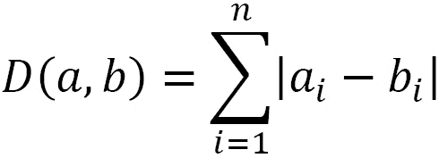
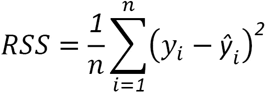

# 九、K 近邻、决策树、随机森林、梯度提升回归

与支持向量机一样，K 近邻和决策树模型作为分类模型最为人所知。然而，它们也可以用于回归，并且比经典的线性回归有一些优势。k-最近邻和决策树可以很好地处理非线性，并且不需要做出关于特征的高斯分布的假设。此外，通过为**K-最近邻** ( **KNN** )或决策树的最大深度调整我们的 *k* 值，我们可以避免过于精确地拟合训练数据。

这让我们回到了前两章的主题——如何在不过度拟合的情况下增加模型的复杂性，包括考虑非线性。我们已经看到了允许一些偏差如何能够减少方差，并为我们提供更可靠的模型性能估计。我们将在本章中继续探索这种平衡。

具体来说，我们将涵盖以下主要主题:

*   K 近邻回归的关键概念
*   k 近邻回归
*   决策树和随机森林回归的关键概念
*   决策树和随机森林回归
*   使用梯度增强回归

# 技术要求

在本章中，我们将使用 scikit-learn 和`matplotlib`库。我们还将与 XGBoost 合作。你可以使用`pip`来安装这些包。

# K 近邻回归的关键概念

KNN 算法的吸引力在于它非常简单易懂。对于我们需要预测目标的每个观察值，KNN 找到特征与那个观察值最相似的第 k 个训练观察值。当目标是分类的时，KNN 选择目标的最频繁值用于 *k* 训练观察。(我们经常为分类问题选择一个奇数值作为 k*以避免平局。)*

当目标是数字时，KNN 给我们目标的平均值作为 *k* 训练观察值。通过*训练*观察，我指的是那些有已知目标值的观察。KNN 没有接受过真正的训练，因为这就是所谓的懒惰学习者。我将在本节后面更详细地讨论这一点。

*图 9.1* 展示了使用 K-最近邻进行分类，K*的值为 1，k* 的值为 3。当 *k* 为 1 时，我们的新观察值将被分配红色标签。当 *k* 为 3 时，它将被指定为蓝色:


图 9.1-K-K 为 1 和 3 的最近邻

但是，我们所说的相似或最接近的观察是什么意思呢？有几种方法来度量相似性，但一种常见的度量是欧几里德距离。欧几里德距离是两点之间的平方差之和。这可能会让你想起勾股定理。从 a 点到 b 点的欧几里德距离如下:


欧几里得距离的合理替代是曼哈顿距离。从 a 点到 b 点的曼哈顿距离如下:



曼哈顿距离是有时也称为出租车距离。这是因为它反映了网格上路径上两点之间的距离。*图 9.2* 展示了曼哈顿距离，并将其与欧几里德距离进行了比较:


图 9.2–欧几里德距离和曼哈顿距离

当要素在类型或比例方面存在很大差异时，使用曼哈顿距离可以产生更好的结果。然而，我们可以将距离度量的选择视为一个经验问题；也就是说，我们可以尝试这两种方法(或其他距离度量方法)，看看哪种方法能给出性能最好的模型。我们将在下一节用网格搜索来演示这一点。

正如你可能怀疑的那样，KNN 模特对选择 k 很敏感。较低的 *k 值*将导致模型试图识别观察值之间的细微差别。当然，在非常低的 *k* 值下，存在过度拟合的实质性风险。但是在更高的 k 值时，我们的模型可能不够灵活。我们再次面临方差偏差权衡。较低的 *k* 值会导致较小的偏差和较大的方差，而较高的值会导致相反的结果。

*k* 的选择没有确定的答案。一个好的经验法则是从观察次数的平方根开始。然而，正如我们对距离度量所做的那样，我们应该在不同的 *k* 值下测试模型的性能。

正如我已经提到的，k-最近邻算法是一种懒惰学习算法。训练时不执行任何计算。学习主要发生在测试期间。这有一些缺点。当数据中有许多实例或维度，并且预测速度很重要时，KNN 可能不是一个好的选择。当我们有稀疏数据时，也就是说，数据集有很多 0 值时，它的表现也不太好。

k-最近邻是一种非参数算法。对基础数据的属性不做任何假设，例如线性或正态分布特征。当线性模型不能给出结果时，它通常能给出不错的结果。我们将在下一节建立一个 KNN 回归模型。

# K-最近邻回归

如前所述，当普通最小二乘法的假设不成立，并且观察值和维数较少时，K-最近邻可以是线性回归的一个很好的替代方法。它也很容易指定，所以即使我们不使用它为我们的最终模型，它可以有价值的诊断目的。

在本节中，我们将使用 KNN 建立一个国家层面的女性与男性收入比率的模型。我们将以劳动力参与率、受教育程度、青少年生育频率和女性最高水平的政治参与度为基础。这是一个很好的实验数据集，因为小样本大小和特征空间意味着它不太可能消耗系统资源。少量的特征也使得它更容易解释。缺点是可能很难找到有意义的结果。话虽如此，让我们看看有什么发现。

注意

在本章中，我们将使用收入差距数据集。该数据集已经由联合国开发计划署在 https://www.kaggle.com/datasets/undp/human-development 向公众开放。2015 年，每个国家都有一份按性别分列的就业、收入和教育数据记录。

让我们开始构建我们的模型:

1.  首先，我们必须导入一些与前两章相同的`sklearn`库。我们还必须从 [*第五章*](B17978_05_ePub.xhtml#_idTextAnchor058)*特征选择*——也就是`SelectFromModel`中导入`KNeighborsRegressor`和一个老朋友。我们将使用`SelectFromModel`向我们将要构建的管道添加特性选择:

    ```py
    import pandas as pd import numpy as np from sklearn.model_selection import train_test_split from sklearn.preprocessing import StandardScaler from sklearn.impute import SimpleImputer from sklearn.pipeline import make_pipeline from sklearn.model_selection import RandomizedSearchCV from sklearn.neighbors import KNeighborsRegressor from sklearn.linear_model import LinearRegression from sklearn.feature_selection import SelectFromModel import seaborn as sns import matplotlib.pyplot as plt
    ```

2.  我们还需要我们在第七章 、*线性* *回归模型*中创建的`OutlierTrans`类。我们将根据四分位数范围使用它来识别异常值，正如我们在第 3 章 、*中首次讨论的[:

    ```py
    import os import sys sys.path.append(os.getcwd() + "/helperfunctions") from preprocfunc import OutlierTrans
    ```](B17978_03_ePub.xhtml#_idTextAnchor034)* 
3.  接下来，我们必须加载收入数据。我们还需要构建一个女性与男性收入比率、受教育年限比率、劳动力参与率和人类发展指数比率的序列。假设这些特征和女性与男性的收入比率之间存在正相关关系，这些指标的较低值表明男性可能具有优势。比如，随着劳动力参与率越来越接近 1.0，也就是说当女性劳动力参与率与男性劳动力参与率相等时，我们可以预期收入比率会提高——也就是说，越来越接近 1.0。
4.  我们必须删除目标`incomeratio`缺失的行:

    ```py
    un_income_gap = pd.read_csv("data/un_income_gap.csv") un_income_gap.set_index('country', inplace=True) un_income_gap['incomeratio'] = \   un_income_gap.femaleincomepercapita / \     un_income_gap.maleincomepercapita un_income_gap['educratio'] = \   un_income_gap.femaleyearseducation / \      un_income_gap.maleyearseducation un_income_gap['laborforcepartratio'] = \   un_income_gap.femalelaborforceparticipation / \      un_income_gap.malelaborforceparticipation un_income_gap['humandevratio'] = \   un_income_gap.femalehumandevelopment / \      un_income_gap.malehumandevelopment un_income_gap.dropna(subset=['incomeratio'], inplace=True)
    ```

5.  让我们看几行数据:

    ```py
    num_cols = ['educratio','laborforcepartratio', 'humandevratio','genderinequality','maternalmortality',   'adolescentbirthrate','femaleperparliament', 'incomepercapita'] gap_sub = un_income_gap[['incomeratio'] + num_cols] gap_sub.head() incomeratio  educratio  laborforcepartratio  humandevratio\ country Norway         0.78    1.02    0.89    1.00 Australia      0.66    1.02    0.82    0.98 Switzerland    0.64    0.88    0.83    0.95 Denmark        0.70    1.01    0.88    0.98 Netherlands    0.48    0.95    0.83    0.95 genderinequality  maternalmortality  adolescentbirthrate\ country Norway        0.07    4.00    7.80 Australia     0.11    6.00    12.10 Switzerland   0.03    6.00    1.90 Denmark       0.05    5.00    5.10 Netherlands   0.06    6.00    6.20              femaleperparliament  incomepercapita   country                                             Norway       39.60    64992 Australia    30.50    42261 Switzerland  28.50    56431 Denmark      38.00    44025 Netherlands  36.90    45435
    ```

6.  我们也来看一些描述性统计:

    ```py
    gap_sub.\   agg(['count','min','median','max']).T                     count  min    median    max incomeratio         177.00 0.16   0.60      0.93 educratio           169.00 0.24   0.93      1.35 laborforcepartratio 177.00 0.19   0.75      1.04 humandevratio       161.00 0.60   0.95      1.03 genderinequality    155.00 0.02   0.39      0.74 maternalmortality 174.00 1.00   60.00     1,100.00 adolescentbirthrate 177.00 0.60   40.90     204.80 femaleperparliament 174.00 0.00   19.35     57.50 incomepercapita     177.00 581.00 10,512.00 123,124.00
    ```

我们的目标变量`incomeratio`有 177 个观测值。几个特征`humandevratio`和`genderinequality`有超过 15 个缺失值。我们将需要估算一些合理的价值。我们还需要做一些缩放，因为一些功能的范围与其他功能非常不同，从一端的`incomeratio`和`incomepercapita`到另一端的`educratio`和`humandevratio`。

注意

该数据集有单独的男女人类发展指数。该指数是对健康、获取知识和生活水平的一种衡量。我们之前计算的`humandevratio`特征将女性的分数除以男性的分数。`genderinequality`特征是对女性有不相称影响的国家的健康和劳动力市场政策的指数。`femaleperparliament`是女性在最高国家立法机构中所占的比例。

1.  我们还应该查看特征和特征与目标的相关性的热图。在我们建模的时候，记住更高的相关性(无论是负的还是正的)是一个好主意。较高的正相关性用较暖的颜色表示。`laborforcepartratio`、`humandevratio`和`maternalmortality`都与我们的目标正相关，后者有些令人惊讶。`humandevratio`和`laborforcepartratio`也是相关的，所以我们的模型可能在理清二者的影响上有些困难。一些特性选择应该可以帮助我们找出哪个特性更重要。(我们将需要使用一个包装器或嵌入式特性选择方法来很好地梳理这一点。我们在第五章*特征选择*中详细讨论那些方法。)看下面这段代码:

    ```py
    corrmatrix = gap_sub.corr(method="pearson") corrmatrix sns.heatmap(corrmatrix, xticklabels=corrmatrix.columns, yticklabels=corrmatrix.columns, cmap="coolwarm") plt.title('Heat Map of Correlation Matrix') plt.tight_layout() plt.show()
    ```

此产生以下情节:


图 9.3–相关矩阵

1.  接下来，我们必须设置训练和测试数据框架:

    ```py
    X_train, X_test, y_train, y_test =  \   train_test_split(gap_sub[num_cols],\   gap_sub[['incomeratio']], test_size=0.2, random_state=0)
    ```

我们现在准备建立 KNN 回归模型。我们还将构建一个管道来处理异常值，基于每个特征的中值进行插补，缩放特征，并使用 scikit-learn 的`SelectFromModel`进行一些特征选择。

1.  我们将使用线性回归进行特征选择，但是我们可以选择任何能够返回特征重要性值的算法。我们将特征重要性阈值设置为平均特征重要性的 80%。平均值是默认值。我们在这里的选择是相当随意的，但是我喜欢这个想法，除了那些具有更高重要性的特性之外，保留那些低于平均重要性水平的特性:

    ```py
    knnreg = KNeighborsRegressor() feature_sel = SelectFromModel(LinearRegression(), threshold="0.8*mean") pipe1 = make_pipeline(OutlierTrans(3), \   SimpleImputer(strategy="median"), StandardScaler(), \   feature_sel, knnreg)
    ```

2.  我们现在准备进行网格搜索，以找到最佳参数。首先，我们将创建一个字典`knnreg_params`，表明我们希望 KNN 模型从 3 到 19 中选择 k 的值，跳过偶数。我们还希望网格搜索找到最佳的距离度量——欧几里德、曼哈顿或闵可夫斯基:

    ```py
    knnreg_params = {  'kneighborsregressor__n_neighbors': \      np.arange(3, 21, 2),  'kneighborsregressor__metric': \      ['euclidean','manhattan','minkowski'] }
    ```

3.  我们将把这些参数传递给`RandomizedSearchCV`对象，然后拟合模型。我们可以使用`RandomizedSearchCV`的`best_params_`属性来查看为我们的特征选择和 KNN 回归选择的超参数。这些结果表明，对于距离度量，KNN 和曼哈顿的最佳超参数值分别为 11 和 k:

最佳模型的负均方误差为-0.05。考虑到样本量较小，这已经相当不错了。不到`incomeratio`中值的 10%，为 0.6:

```py
rs = RandomizedSearchCV(pipe1, knnreg_params, cv=4, n_iter=20, \
  scoring='neg_mean_absolute_error', random_state=1)
rs.fit(X_train, y_train)
rs.best_params_
{'kneighborsregressor__n_neighbors': 11,
 'kneighborsregressor__metric': 'manhattan'}
rs.best_score_
-0.05419731104389228
```

1.  让我们看看在管道的特征选择步骤中选择的特征。仅选择了两个特征—`laborforcepartratio`和`humandevratio`。请注意，这一步对于运行我们的模型并不是必需的。它只是帮助我们解读它:

    ```py
    selected = rs.best_estimator_['selectfrommodel'].get_support() np.array(num_cols)[selected] array(['laborforcepartratio', 'humandevratio'], dtype='<U19')
    ```

2.  如果你使用的是 *scikit-learn* 1.0 或更高版本，这就简单多了。在这种情况下，您可以使用`get_feature_names_out`方法:

    ```py
    rs.best_estimator_['selectfrommodel'].\   get_feature_names_out(np.array(num_cols)) array(['laborforcepartratio', 'humandevratio'], dtype=object)
    ```

3.  我们还应该看看其他一些顶级结果。有一种使用`euclidean`距离的模型，其表现几乎与最佳模型一样好:

    ```py
    results = \   pd.DataFrame(rs.cv_results_['mean_test_score'], \     columns=['meanscore']).\   join(pd.DataFrame(rs.cv_results_['params'])).\   sort_values(['meanscore'], ascending=False) results.head(3).T 13       1      3 Meanscore   -0.05   -0.05   -0.05 regressor__kneighborsregressor__n_neighbors  11  13  9 regressor__kneighborsregressor__metric  manhattan  manhattan  euclidean
    ```

4.  让我们看看这个模型的残差。我们可以使用`RandomizedSearchCV`对象的预测方法来生成对测试数据的预测。残差很好地平衡在 0 左右。有一点点负偏斜，但也不坏。峰度很低，但我们很好，在这种情况下没有太多的尾部。它可能不会以异常残差的方式反映太多:

    ```py
    pred = rs.predict(X_test) preddf = pd.DataFrame(pred, columns=['prediction'],   index=X_test.index).join(X_test).join(y_test) preddf['resid'] = preddf.incomeratio-preddf.prediction preddf.resid.agg(['mean','median','skew','kurtosis']) mean            -0.01 median          -0.01 skew            -0.61 kurtosis         0.23 Name: resid, dtype: float64
    ```

5.  让我们画出残差:

    ```py
    plt.hist(preddf.resid, color="blue") plt.axvline(preddf.resid.mean(), color='red', linestyle='dashed', linewidth=1) plt.title("Histogram of Residuals for Gax Tax Model") plt.xlabel("Residuals") plt.ylabel("Frequency") plt.xlim() plt.show()
    ```

此产生以下情节:


图 9.4-KNN 回归收入比率模型的残差

当我们绘制残差图时，它们看起来也相当不错。然而，在一些国家，我们的预测误差超过 0.1%。在这两种情况下，我们都过度预测了。(红色虚线是平均剩余量。)

1.  再来看散点图。在这里，我们可以看到两个大的过度预测位于预测范围的不同端。一般来说，残差在整个预测收入比率范围内相当稳定。我们可能只是想对这两个异常值做些什么:

    ```py
    plt.scatter(preddf.prediction, preddf.resid, color="blue") plt.axhline(0, color='red', linestyle='dashed', linewidth=1) plt.title("Scatterplot of Predictions and Residuals") plt.xlabel("Predicted Income Gap") plt.ylabel("Residuals") plt.show()
    ```

这会产生以下情节:


图 9.5–采用 KNN 回归的收入比率模型的预测和残差散点图

我们应该仔细看看那些有高残值的国家。我们的模型没有很好地预测阿富汗或荷兰的收入比率，在这两个国家都过度预测了。回想一下，我们的特征选择步骤给了我们一个只有两个预测器的模型:`laborforcepartratio`和`humandevratio`。

就阿富汗而言，劳动力参与率(女性相对于男性的参与率)非常接近最低值 0.19，人类发展比率最低。这仍然不能让我们接近预测非常低的收入比率(女性相对于男性的收入)，这也是最低的。

对荷兰来说，0.83 的劳动力参与率略高于 0.75 的中位数，但人类发展比率正好处于中位数。这就是为什么我们的模型预测收入比率略高于中位数 0.6。因此，荷兰的实际收入比率低得惊人:

```py
preddf.loc[np.abs(preddf.resid)>=0.1,
  ['incomeratio', 'prediction', 'resid', 
   'laborforcepartratio', 'humandevratio']].T
country                     Afghanistan    Netherlands
incomeratio                  0.16           0.48
prediction                   0.32           0.65
resid                       -0.16          -0.17
laborforcepartratio          0.20           0.83
humandevratio                0.60           0.95
```

这里，我们可以看到 KNN 回归的一些优点。我们可以对难以建模的数据进行预测，而无需花费大量时间来指定模型。除了一些插补和缩放，我们没有做任何转换或创造互动效应。我们也不需要担心非线性。KNN 回归可以解决这个问题。

但是这种方法可能无法很好地扩展。在这个例子中，一个懒惰的学习者很好。然而，对于更多的工业级工作，我们经常需要求助于一种具有 KNN 的许多优点，但没有一些缺点的算法。我们将在本章的剩余部分探讨决策树和随机森林回归。

# 决策树和随机森林回归的关键概念

决策树是一个非常有用的机器学习工具。它们有一些与 KNN 相同的优势——它们是非参数的，易于解释，并且可以处理广泛的数据——但是没有一些限制。

决策树根据数据集中观察值的特征值对这些观察值进行分组。这是通过一系列二元决策来完成的，从根节点的初始分裂开始，到每个分组的叶子结束。沿着从根节点到该叶的分支，具有相同值或相同值范围的所有观察值都将获得相同的目标预测值。当目标是数字时，这是该叶的训练观察的目标的平均值。*图 9.6* 说明了这一点:


图 9.6-夜间睡眠时间的决策树模型

这是个人夜间睡眠时间的模型，基于每周工作时间、孩子数量、家中其他成人数量以及此人是否在学校注册。(这些结果基于假设数据。)根节点基于每周工作时间，并将数据分成工作时间大于 30 小时和小于 30 小时的观察值。括号中的数字是到达该节点的定型数据的百分比。60%的观察对象工作时间超过 30 小时。在树的左侧，我们的模型进一步根据孩子的数量以及家中其他成年人的数量来划分数据。在树的另一边，表示工作时间少于或等于 30 小时的观察值，唯一的额外分割是根据学校的注册情况。

我现在意识到所有的读者不会看到彩色的。我们可以从每一片叶子向上导航到树上，来描述树是如何分割数据的。15%的观察对象家中有 0 个其他成人，1 个以上的孩子，每周工作时间超过 30 小时。这些观察的平均夜间睡眠时间值为 4.5 小时。这将是具有相同特征的新观测值的预测值。

您可能想知道决策树算法如何为数字特征选择阈值数量。例如，为什么每周工作时间大于 30，或者孩子的数量大于 1？该算法从根开始选择每一层的分裂，使误差平方和最小。更准确地说，选择的分割最小化:



您可能已经注意到了线性回归优化的相似性。但是决策树回归比线性回归有几个优点。决策树可用于建模线性和非线性关系，而无需我们修改特征。我们还可以避免决策树的特征缩放，因为算法可以处理我们的特征中非常不同的范围。

决策树的主要缺点是它们的高方差。根据我们数据的特征，每次我们拟合决策树时，我们可以得到一个非常不同的模型。我们可以使用集合方法，如 bagging 或随机森林，来解决这个问题。

## 使用随机森林回归

随机森林，也许不奇怪，是决策树的集合。但这并不能区分随机森林和 bootstrap 聚合，通常称为 bagging。Bagging 通常用于减少机器学习算法的方差，这些算法具有很高的方差，例如决策树。通过 bagging，我们从数据集中生成随机样本。然后，我们对每个样本运行我们的模型，例如决策树回归，对预测进行平均。

但是，用 bagging 生成的样本可以相互关联，生成的决策树可能有许多相似之处。当只有几个特征可以解释大部分差异时，这种情况更有可能发生。随机森林通过限制可以为每棵树选择的功能数量来解决这个问题。一个好的经验法则是将可用特征的数量除以 3，以确定用于每个决策树的每次分割的特征数量。例如，如果有 21 个特征，我们将对每个分割使用 7 个。我们将在下一节构建决策树和随机森林回归模型。

# 决策树和随机森林回归

在本节中，我们将使用决策树和随机森林来构建一个回归模型，其收入差距数据与我们在本章前面处理的数据相同。我们还将使用调优来确定为我们提供最佳性能模型的超参数，就像我们对 KNN 回归所做的那样。让我们开始吧:

1.  我们必须加载许多与 KNN 回归相同的库，加上来自 scikit-learn:

    ```py
    import pandas as pd import numpy as np from sklearn.model_selection import train_test_split from sklearn.impute import SimpleImputer from sklearn.pipeline import make_pipeline from sklearn.model_selection import RandomizedSearchCV from sklearn.tree import DecisionTreeRegressor, plot_tree from sklearn.ensemble import RandomForestRegressor from sklearn.linear_model import LinearRegression from sklearn.feature_selection import SelectFromModel
    ```

    的`DecisionTreeRegressor`和`RandomForestRegressor`
2.  我们还必须导入我们的类来处理异常值:

    ```py
    import os import sys sys.path.append(os.getcwd() + "/helperfunctions") from preprocfunc import OutlierTrans
    ```

3.  我们必须加载与之前相同的收入差距数据，并创建测试和训练数据框架:

    ```py
    un_income_gap = pd.read_csv("data/un_income_gap.csv") un_income_gap.set_index('country', inplace=True) un_income_gap['incomeratio'] = \   un_income_gap.femaleincomepercapita / \     un_income_gap.maleincomepercapita un_income_gap['educratio'] = \   un_income_gap.femaleyearseducation / \      un_income_gap.maleyearseducation un_income_gap['laborforcepartratio'] = \   un_income_gap.femalelaborforceparticipation / \      un_income_gap.malelaborforceparticipation un_income_gap['humandevratio'] = \   un_income_gap.femalehumandevelopment / \      un_income_gap.malehumandevelopment un_income_gap.dropna(subset=['incomeratio'],    inplace=True) num_cols = ['educratio','laborforcepartratio',   'humandevratio', 'genderinequality',    'maternalmortality', 'adolescentbirthrate',    'femaleperparliament', 'incomepercapita'] gap_sub = un_income_gap[['incomeratio'] + num_cols] X_train, X_test, y_train, y_test =  \   train_test_split(gap_sub[num_cols],\   gap_sub[['incomeratio']], test_size=0.2,      random_state=0)
    ```

让我们从一个相对简单的决策树开始——一个没有太多层次的决策树。一个简单的树可以很容易地显示在一个页面上。

## 带有解释的决策树示例

在我们构建决策树回归器之前，让我们先看一个最大深度设置为低值的简单例子。随着深度的增加，决策树更难解释和绘制。让我们开始吧:

1.  我们首先实例化一个决策树回归器，将深度限制为三，并要求每个叶子至少有五个观察值。我们创建了一个管道，只对数据进行预处理，并将得到的 NumPy 数组`X_train_imp`传递给决策树回归器的`fit`方法:

    ```py
    dtreg_example = DecisionTreeRegressor(   min_samples_leaf=5,   max_depth=3) pipe0 = make_pipeline(OutlierTrans(3),   SimpleImputer(strategy="median")) X_train_imp = pipe0.fit_transform(X_train) dtreg_example.fit(X_train_imp, y_train) plot_tree(dtreg_example,    feature_names=X_train.columns,   label="root", fontsize=10)
    ```

这会生成以下图:


图 9.7–最大深度为 3 的决策树示例

我们不会遍历这个树上的所有节点。通过描述到几个叶节点的路径，我们可以大致了解如何解释决策树回归图:

*   **解释劳动力参与率< = 0.307 的叶节点:**

根节点分割基于小于或等于 0.601 的劳动力参与率。(回想一下，劳动力参与率是女性参与率与男性参与率之比。)34 个国家属于这一类。(分割测试的真值在左边。假值在右边。)之后还有另一个分裂，也是基于劳动力参与率，这次分裂为 0.378。有 13 个国家的数值小于或等于这个数字。最后，对于劳动力参与率小于或等于 0.307 的国家，我们到达最左侧的叶节点。六个国家的劳动力参与率如此之低。这六个国家的平均收入比为 0.197。对于劳动力参与率小于或等于 0.307 的测试实例，我们的决策树回归器会预测收入比率为 0.197。

*   **解释劳动力参与率在 0.601 到 0.811 之间的叶节点，humandevratio < = 0.968:**

劳动力参与率大于 0.601 的国家有 107 个。这显示在树的右侧。当劳动力参与率小于或等于 0.811 时还有另一个二元分裂，基于人类发展比率小于或等于 0.968 进一步分裂。这将我们带到一个有 31 个国家的叶节点，这些国家的人类发展比率小于或等于 0.968，劳动力参与率小于或等于 0.811，但大于 0.601。决策树回归器将预测这 31 个国家的收入比率平均值，0.556，所有测试实例的人类发展比率和劳动力参与率值都在这些范围内。

有趣的是，我们还没有进行任何特征选择，但这种构建决策树模型的首次尝试已经表明，只需两个特征就可以预测收入比率:`laborforcepartratio`和`humandevratio`。

尽管这个模型的简单性使得它非常容易解释，但是我们还没有完成寻找最佳超参数所需的工作。让我们接下来做那件事。

## 构建和解释我们的实际模型

请遵循以下步骤:

1.  首先，我们实例化一个新的决策树回归器，并创建一个使用它的管道。我们还为一些超参数创建了一个字典——也就是说，为每片叶子创建了最大树深度和最小样本(观察)数。请注意，我们不需要缩放我们的特征或目标，因为这对于决策树是不必要的:

    ```py
    dtreg = DecisionTreeRegressor() feature_sel = SelectFromModel(LinearRegression(),   threshold="0.8*mean") pipe1 = make_pipeline(OutlierTrans(3),   SimpleImputer(strategy="median"),   feature_sel, dtreg) dtreg_params={  "decisiontreeregressor__max_depth": np.arange(2, 20),  "decisiontreeregressor__min_samples_leaf": np.arange(5, 11) }
    ```

2.  接下来，我们必须根据上一步中的字典设置一个随机搜索。我们的决策树的最佳参数是最小样本数为 5，最大深度为 9:

    ```py
    rs = RandomizedSearchCV(pipe1, dtreg_params, cv=4, n_iter=20,   scoring='neg_mean_absolute_error', random_state=1) rs.fit(X_train, y_train.values.ravel()) rs.best_params_ {'decisiontreeregressor__min_samples_leaf': 5,  'decisiontreeregressor__max_depth': 9} rs.best_score_ -0.05268976358459662
    ```

正如我们在前面的章节中所讨论的，决策树具有 KNN 回归的许多优势。它们很容易解释，并且不会对基础数据做很多假设。然而，决策树仍然可以很好地处理大型数据集。决策树的一个不太重要但仍然有用的优点是它们不需要特征缩放。

但是决策树确实有很高的方差。为了一种相关的方法，例如随机森林，牺牲决策树的可解释性通常是值得的，这种方法可以大大减少方差。我们在上一节中从概念上讨论了随机森林算法。我们将在下一节用收入差距数据来检验它。

## 随机森林回归

回想一下随机森林可以被认为是装袋的决策树；他们通过降低样品之间的相关性来改进装袋。这听起来很复杂，但它和决策树一样容易实现。让我们来看看:

1.  我们将首先实例化一个随机森林回归变量，并为超参数创建一个字典。我们还将为预处理和回归器创建一个管道:

    ```py
    rfreg = RandomForestRegressor() rfreg_params = {  'randomforestregressor__max_depth': np.arange(2, 20),  'randomforestregressor__max_features': ['auto', 'sqrt'],  'randomforestregressor__min_samples_leaf':  np.arange(5, 11) } pipe2 = make_pipeline(OutlierTrans(3),    SimpleImputer(strategy="median"),   feature_sel, rfreg)
    ```

2.  我们将将管道和超参数字典传递给`RandomizedSearchCV`对象来运行网格搜索。分数方面有小提升:

    ```py
    rs = RandomizedSearchCV(pipe2, rfreg_params, cv=4, n_iter=20,   scoring='neg_mean_absolute_error', random_state=1) rs.fit(X_train, y_train.values.ravel()) rs.best_params_ {'randomforestregressor__min_samples_leaf': 5,  'randomforestregressor__max_features': 'auto',  'randomforestregressor__max_depth': 9} rs.best_score_ -0.04930503752638253
    ```

3.  再来看看的残差:

    ```py
    pred = rs.predict(X_test) preddf = pd.DataFrame(pred, columns=['prediction'],   index=X_test.index).join(X_test).join(y_test) preddf['resid'] = preddf.incomegap-preddf.prediction plt.hist(preddf.resid, color="blue", bins=5) plt.axvline(preddf.resid.mean(), color='red', linestyle='dashed', linewidth=1) plt.title("Histogram of Residuals for Income Gap") plt.xlabel("Residuals") plt.ylabel("Frequency") plt.xlim() plt.show()
    ```

这会产生以下情节:


图 9.8-随机森林模型关于收入比率的残差直方图

1.  让我们看一下预测残差的散点图:

    ```py
    plt.scatter(preddf.prediction, preddf.resid, color="blue") plt.axhline(0, color='red', linestyle='dashed', linewidth=1) plt.title("Scatterplot of Predictions and Residuals") plt.xlabel("Predicted Income Gap") plt.ylabel("Residuals") plt.show()
    ```

这会产生以下情节:


图 9.9-随机森林模型对收入比率的残差预测散点图

1.  让我们仔细看看一个我们严重高估的重要异常值:

    ```py
    preddf.loc[np.abs(preddf.resid)>=0.12,   ['incomeratio','prediction','resid',   'laborforcepartratio', 'humandevratio']].T country              Netherlands incomeratio                 0.48 prediction                  0.66 resid                      -0.18 laborforcepartratio         0.83 humandevratio               0.95
    ```

我们仍然与荷兰有麻烦，但是相当平均的残差分布表明这是反常的。就我们预测新实例的收入比率的能力而言，这实际上是个好消息，表明我们的模型并不太适合这种不寻常的情况。

# 使用梯度增强回归

我们有时可以通过使用梯度提升来改进随机森林模型。与随机森林类似，梯度增强是一种组合学习者(通常是树)的集成方法。但与随机森林不同的是，每棵树都是从先前树的错误中学习的。这可以显著提高我们对复杂性建模的能力。

虽然梯度增强并不特别容易过度拟合，但我们必须更加小心地调整超参数，而不是随机森林模型。我们可以减缓学习速度，也就是所谓的萎缩。我们还可以调整估计器(树)的数量。学习率的选择影响所需估计器的数量。通常，如果我们降低学习速度，我们的模型将需要更多的估计器。

有几种工具可以实现梯度增强。我们将使用其中的两个:来自 scikit-learn 和 XGBoost 的梯度增强回归。

在这一部分，我们将使用房价数据。我们将尝试根据住宅和附近住宅的特征来预测美国华盛顿州金斯县的房价。

注意

这个关于金斯县房价的数据集，公众可以在[https://www . ka ggle . com/datasets/harlfoxem/housesales prediction](https://www.kaggle.com/datasets/harlfoxem/housesalesprediction)下载。它有几个卧室，浴室和地板，家和地段的平方英尺，家的条件，15 个最近的家的平方英尺，以及更多的特征。

让我们开始制作模型:

1.  我们将从导入我们需要的模块开始。这两个新的是来自 XGBoost:

    ```py
    import pandas as pd import numpy as np from sklearn.model_selection import train_test_split from sklearn.impute import SimpleImputer from sklearn.pipeline import make_pipeline from sklearn.preprocessing import OneHotEncoder from sklearn.preprocessing import MinMaxScaler from sklearn.compose import ColumnTransformer from sklearn.model_selection import RandomizedSearchCV from sklearn.ensemble import GradientBoostingRegressor from xgboost import XGBRegressor from sklearn.linear_model import LinearRegression from sklearn.feature_selection import SelectFromModel import matplotlib.pyplot as plt from scipy.stats import randint from scipy.stats import uniform import os import sys sys.path.append(os.getcwd() + "/helperfunctions") from preprocfunc import OutlierTrans
    ```

    的`GradientBoostingRegressor`和`XGBRegressor`
2.  让我们加载住房数据并查看一些实例:

    ```py
    housing = pd.read_csv("data/kc_house_data.csv") housing.set_index('id', inplace=True) num_cols = ['bedrooms', 'bathrooms', 'sqft_living',    'sqft_lot', 'floors', 'view', 'condition',    'sqft_above', 'sqft_basement', 'yr_built',    'yr_renovated', 'sqft_living15', 'sqft_lot15'] cat_cols = ['waterfront'] housing[['price'] + num_cols + cat_cols].\   head(3).T id              7129300520  6414100192  5631500400 price           221,900     538,000     180,000 bedrooms        3           3           2 bathrooms       1           2           1 sqft_living     1,180       2,570       770 sqft_lot        5,650       7,242       10,000 floors          1           2           1 view            0           0           0 condition       3           3           3 sqft_above      1,180       2,170       770 sqft_basement   0           400         0 yr_built        1,955       1,951       1,933 yr_renovated    0           1,991       0 sqft_living15   1,340       1,690       2,720 sqft_lot15      5,650       7,639       8,062 waterfront      0           0           0
    ```

3.  我们还应该看一些描述性统计。我们没有任何缺失值。毫不奇怪，我们的目标变量`price`有一些极值。这可能会给建模带来问题。我们还需要为我们的功能处理一些极端值:

    ```py
    housing[['price'] + num_cols].\   agg(['count','min','median','max']).T                 count   min      median    max price          21,613   75,000   450,000   7,700,000 bedrooms       21,613   0        3         33 bathrooms      21,613   0        2         8 sqft_living    21,613   290      1,910     13,540 sqft_lot       21,613   520      7,618     1,651,359 floors         21,613   1        2         4 view           21,613   0        0         4 condition      21,613   1        3         5 sqft_above     21,613   290      1,560     9,410 sqft_basement  21,613   0        0         4,820 yr_built       21,613   1,900    1,975     2,015 yr_renovated   21,613   0        0         2,015 sqft_living15  21,613   399      1,840     6,210 sqft_lot15     21,613   651      7,620     871,200
    ```

4.  我们来创建一个房价直方图:

    ```py
    plt.hist(housing.price/1000) plt.title("Housing Price (in thousands)") plt.xlabel('Price') plt.ylabel("Frequency") plt.show()
    ```

此生成以下图形:


图 9.10-房价直方图

1.  如果我们使用目标的对数转换进行建模，我们可能会更幸运，正如我们在第 4 章 *中尝试的那样，使用 COVID 总案例数据对特性*进行编码、转换和缩放。

    ```py
    housing['price_log'] = np.log(housing['price']) plt.hist(housing.price_log) plt.title("Housing Price Log") plt.xlabel('Price Log') plt.ylabel("Frequency") plt.show()
    ```

此产生以下图形:


图 9.11-房价日志直方图

1.  这个看起来更好。让我们来看看价格和价格日志的偏斜度和峰度。日志看起来是一个很大的改进:

    ```py
    housing[['price','price_log']].agg(['kurtosis','skew'])                  price       price_log kurtosis         34.59            0.69 skew              4.02            0.43
    ```

2.  我们还应该看看一些相关性。居住面积的平方英尺、地面以上面积的平方英尺、最近的 15 个家庭的居住面积的平方英尺以及浴室的数量是与价格最相关的特征。居住面积的平方英尺和地面以上居住面积的平方英尺高度相关。我们可能需要在我们的模型中选择一个:

    ```py
    corrmatrix = housing[['price_log'] + num_cols].\    corr(method="pearson") sns.heatmap(corrmatrix,    xticklabels=corrmatrix.columns,   yticklabels=corrmatrix.columns, cmap="coolwarm") plt.title('Heat Map of Correlation Matrix') plt.tight_layout() plt.show()
    ```

此产生以下图形:


图 9.12–外壳特征的相关矩阵

1.  接下来，我们创建训练和测试数据帧:

    ```py
    target = housing[['price_log']] features = housing[num_cols + cat_cols] X_train, X_test, y_train, y_test =  \   train_test_split(features,\   target, test_size=0.2, random_state=0)
    ```

2.  我们还需要设置我们的列转换。对于所有的数字特征，即除了`waterfront`之外的所有特征，我们将检查极值，然后缩放数据:

    ```py
    ohe = OneHotEncoder(drop='first', sparse=False) standtrans = make_pipeline(OutlierTrans(2),   SimpleImputer(strategy="median"),   MinMaxScaler()) cattrans = make_pipeline(ohe) coltrans = ColumnTransformer(   transformers=[     ("stand", standtrans, num_cols),     ("cat", cattrans, cat_cols)   ] )
    ```

3.  现在，我们准备为我们的预处理和模型建立一个管道。我们将实例化一个`GradientBoostingRegressor`对象并设置特征选择。我们还将创建一个超参数字典，在下一步的随机网格搜索中使用:

    ```py
    gbr = GradientBoostingRegressor(random_state=0) feature_sel = SelectFromModel(LinearRegression(),   threshold="0.6*mean") gbr_params = {  'gradientboostingregressor__learning_rate': uniform(loc=0.01, scale=0.5),  'gradientboostingregressor__n_estimators': randint(500, 2000),  'gradientboostingregressor__max_depth': randint(2, 20),  'gradientboostingregressor__min_samples_leaf': randint(5, 11) } pipe1 = make_pipeline(coltrans, feature_sel, gbr)
    ```

4.  现在，我们准备运行随机网格搜索。鉴于`price_log`的平均值约为 13:

    ```py
    rs1 = RandomizedSearchCV(pipe1, gbr_params, cv=5, n_iter=20,   scoring='neg_mean_squared_error', random_state=0) rs1.fit(X_train, y_train.values.ravel()) rs1.best_params_ {'gradientboostingregressor__learning_rate': 0.118275177212,  'gradientboostingregressor__max_depth': 2,  'gradientboostingregressor__min_samples_leaf': 5,  'gradientboostingregressor__n_estimators': 1577} rs1.best_score_ -0.10695077555421204 y_test.mean() price_log   13.03 dtype: float64
    ```

    ，我们得到了一个相当不错的均方误差分数
5.  不幸的是，平均适应时间很长:

    ```py
    print("fit time: %.3f, score time: %.3f"  %   (np.mean(rs1.cv_results_['mean_fit_time']),\   np.mean(rs1.cv_results_['mean_score_time']))) fit time: 35.695, score time: 0.152
    ```

6.  让我们试试 XGBoost:

    ```py
    xgb = XGBRegressor() xgb_params = {  'xgbregressor__learning_rate': uniform(loc=0.01, scale=0.5),  'xgbregressor__n_estimators': randint(500, 2000),  'xgbregressor__max_depth': randint(2, 20) } pipe2 = make_pipeline(coltrans, feature_sel, xgb)
    ```

7.  我们没有得到更好的分数，但是平均适应时间和得分时间有了显著的提高:

    ```py
    rs2 = RandomizedSearchCV(pipe2, xgb_params, cv=5, n_iter=20,   scoring='neg_mean_squared_error', random_state=0) rs2.fit(X_train, y_train.values.ravel()) rs2.best_params_ {'xgbregressor__learning_rate': 0.019394900218177573,  'xgbregressor__max_depth': 7,  'xgbregressor__n_estimators': 1256} rs2.best_score_ -0.10574300757906044 print("fit time: %.3f, score time: %.3f"  %   (np.mean(rs2.cv_results_['mean_fit_time']),\   np.mean(rs2.cv_results_['mean_score_time']))) fit time: 3.931, score time: 0.046
    ```

XGBoost 已经成为一个非常流行的渐变增强工具，原因有很多，其中一些你已经在这个例子中看到了。它可以产生非常好的结果，非常快，几乎没有模型规格。我们确实需要仔细调整我们的超参数，以获得首选的方差偏差权衡，但正如我们所见，其他梯度增强工具也是如此。

# 总结

在这一章中，我们探讨了一些最流行的非参数回归算法:K 近邻、决策树和随机森林。用这些算法构建的模型可以很好地执行，但有一些限制。我们讨论了每种技术的一些优点和局限性，包括维度和观察限制，以及对 KNN 模型训练所需时间的关注。我们讨论了决策树的关键挑战，即高方差，以及如何通过随机森林模型解决这一问题。我们还研究了梯度提升回归树，并讨论了它们的一些优点。我们继续改进我们的超参数调整技巧，因为每个算法都需要稍微不同的策略。

我们将在接下来的几章中讨论目标是分类的监督学习算法，从最熟悉的分类算法开始，逻辑回归。