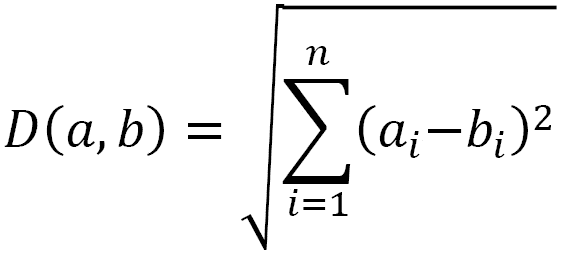
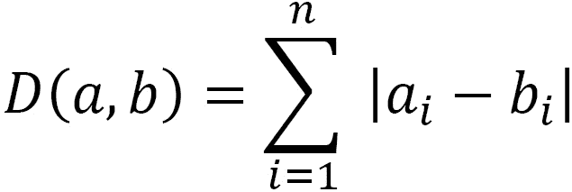

# 十二、K 最近邻分类

**K-最近邻** ( **KNN** )是分类模型的一个很好的选择，当没有太多的观察或特征并且预测类成员不需要非常高效时。它是一个懒惰的学习者，所以它比其他分类算法更快适应，但在分类新的观察值时要慢得多。它也可能在极端情况下产生不太准确的预测，尽管这可以通过适当调整 *k* 来改善。我们将在本章开发的模型中仔细考虑这些选择。

KNN 也许是我们可以选择的最直接的非参数算法，使它成为一个很好的诊断工具。不需要对特征的分布或特征与目标的关系进行假设。没有很多超参数需要优化，两个关键的超参数——最近邻和距离度量——非常容易解释。

KNN 可以成功地用于二元和多类问题，而无需对算法进行任何扩展。

在本章中，我们将讨论以下主题:

*   KNN 的主要概念
*   二元分类的 KNN
*   KNN 为多类分类

# 技术要求

除了通常的 scikit-learn 库，我们还需要`imblearn`(不平衡学习)库来运行本章中的代码。这个库帮助我们处理显著的阶级不平衡。`imblearn`可以和`pip install imbalanced-learn`一起安装，或者`conda install -c conda-forge imbalanced-learn`如果你用的是 Anaconda。所有代码都已经使用 scikit-learn 版本 0.24.2 和 1.0.2 进行了测试。

# KNN 的关键概念

KNN 可能是我们将在本书中讨论的最直观的算法。想法是找到属性最相似的 k 个实例，其中相似性对目标很重要。最后一个条款是一个重要的限定条件，虽然可能很明显。我们关心与目标值相关的那些属性之间的相似性。

对于我们需要预测目标的每个观察值，KNN 找到特征与那个观察值最相似的第 k 个训练观察值。当目标是分类的时，KNN 为 *k* 训练观测值选择目标的最频繁值。(对于分类问题，我们通常选择一个奇数值作为 k 以避免平局。)

通过*训练*观察值，我指的是那些具有已知目标值的观察值。KNN 没有真正的训练，因为它是一个懒惰的学习者。我将在本节中更详细地讨论这一点。

下图说明了使用 KNN 进行分类，k 的值为 1 和 3。当 **k=1** 时，我们会预测我们的新观测值 **X** 会在圆类中。当 **k=3** 时，它将被分配到方形类:


图 12.1–k 值为 1 和 3 的 KNN

但是，我们所说的相似或最接近的例子是什么意思呢？有几种方法来度量相似性，但最常用的度量是欧几里德距离。欧几里德距离是两点之间的平方差之和。这可能会让你想起勾股定理。从点 *a* 到点 *b* 的欧氏距离如下:



欧几里得距离的合理替代是曼哈顿距离。从点 *a* 到点 *b* 的曼哈顿距离如下:



scikit-learn 中的默认距离度量是 Minkowski。从点 *a* 到点 *b* 的闵可夫斯基距离如下:


请注意，当 *p* 为 1 时，它与曼哈顿距离相同。当 *p* 为 2 时，与欧氏距离相同。

曼哈顿距离有时被称为出租车距离。这是因为它反映了网格上路径上两点之间的距离。下图说明了曼哈顿距离，并将其与欧几里德距离进行了比较:


图 12.2–欧几里德距离和曼哈顿距离

当要素在类型或比例方面差异很大时，使用曼哈顿距离可以产生更好的结果。然而，我们可以将距离度量的选择视为一个经验问题；也就是说，我们可以尝试这两种方法(或其他距离度量方法)，看看哪种方法能给出性能最好的模型。我们将在下一节用网格搜索来演示这一点。

正如你可能会怀疑的那样，KNN 模特对选择 *k* 很敏感。k 的较低值将导致模型试图识别观察值之间的细微差别。在非常低的 *k* 值下，存在过度拟合的巨大风险。但是在高 k 值时，我们的模型可能不够灵活。我们再次面临方差偏差权衡。较低的 *k* 值会导致较小的偏差和较大的方差，而较高的值会导致相反的结果。

对于 *k* 的选择，没有确定的答案。但是一个好的经验法则是使用观察次数的平方根。然而，正如我们对距离测量所做的那样，我们应该在不同的 *k* 值下测试模型的性能。KNN 是一种非参数算法。对基础数据的属性不做任何假设，例如线性或正态分布特征。这使得 KNN 相当灵活。它可用于模拟特征和目标之间的各种关系。

如前所述，KNN 是一个懒惰学习算法。训练时不执行任何计算。学习只发生在测试期间。这有利有弊。当数据中有许多实例或维度，并且预测速度很重要时，这可能不是一个好的选择。当我们有稀疏数据时，例如包含许多 0 值的数据集，KNN 也往往表现不佳。

在下一节构建两个多类模型之前，我们将在下一节使用 KNN 来构建一个二元分类模型。

# KNN 用于二进制分类

KNN 算法与决策树算法有一些相同的优点。不需要满足关于特征或残差分布的预先假设。对于我们在前两章试图建立的心脏病模型来说，这是一个合适的算法。数据集不是很大(30，000 个观测值)，也没有太多的要素。

注意

心脏疾病数据集可在[https://www . ka ggle . com/datasets/kamilpytlak/personal-key-indicators-of-heart-disease](https://www.kaggle.com/datasets/kamilpytlak/personal-key-indicators-of-heart-disease)上公开下载。它来自美国疾病控制中心 2020 年对超过 40 万人的调查数据。我从这个数据集中随机抽取了 30，000 个观察值进行分析。数据栏包括受访者是否患有心脏病、体重指数、吸烟史、酗酒、年龄、糖尿病和肾病。

让我们从我们的模型开始:

1.  首先，我们必须加载一些我们在过去几章中使用过的相同的库。我们还将加载`KneighborsClassifier` :

    ```py
    import pandas as pd import numpy as np from imblearn.pipeline import make_pipeline from sklearn.model_selection import RandomizedSearchCV,\   RepeatedStratifiedKFold from sklearn.neighbors import KNeighborsClassifier from sklearn.feature_selection import SelectKBest, chi2 from scipy.stats import randint import sklearn.metrics as skmet from sklearn.model_selection import cross_validate import os import sys sys.path.append(os.getcwd() + "/helperfunctions") import healthinfo as hi
    ```

`healthinfo`模块包含了我们在 [*第十章*](B17978_10_ePub.xhtml#_idTextAnchor126)*逻辑回归*中使用的所有代码，用于加载健康信息数据并做预处理。这里没有必要重复这些步骤。如果你没有阅读过 [*第 10 章*](B17978_10_ePub.xhtml#_idTextAnchor126) 、*逻辑回归*，至少扫描一下该章第二节的代码可能会有帮助。这会让你对这些特征有更好的理解。

1.  现在，让我们获取已经由`healthinfo`模块处理的数据，并显示特性名称:

    ```py
    X_train = hi.X_train X_test = hi.X_test y_train = hi.y_train y_test = hi.y_test new_cols = hi.new_cols new_cols array(['smoking_Yes', 'alcoholdrinkingheavy_Yes',        'stroke_Yes', 'walkingdifficult_Yes',        'physicalactivity_Yes', 'asthma_Yes',        'kidneydisease_Yes', 'skincancer_Yes',        'gender_Male', 'ethnicity_Asian',        'ethnicity_Black', 'ethnicity_Hispanic',        'ethnicity_Other', 'ethnicity_White',        'agecategory', 'genhealth', 'diabetic', 'bmi',        'physicalhealthbaddays', 'mentalhealthbaddays',        'sleeptimenightly'], dtype=object)
    ```

2.  我们可以使用 K 重交叉验证来评估这个模型。我们在 [*第六章*](B17978_06_ePub.xhtml#_idTextAnchor078) 、*准备模型评估*中讨论了 K 重交叉验证。我们将表明我们希望 10 次分割重复 10 次。默认分别为`5`和`10`。

我们模型的精确度，也就是我们预测心脏病的正确率，在`0.17`特别差。当有心脏病时，我们预测心脏病的灵敏度也很低`0.56`:

```py
knn_example = KNeighborsClassifier(n_neighbors=5, n_jobs=-1)
kf = RepeatedStratifiedKFold(n_splits=10, n_repeats=10, random_state=0)
pipe0 = make_pipeline(hi.coltrans, hi.smotenc, knn_example)
scores = cross_validate(pipe0, X_train,
  y_train.values.ravel(), \
  scoring=['accuracy','precision','recall','f1'], \
  cv=kf, n_jobs=-1)
print("accuracy: %.2f, sensitivity: %.2f, precision: %.2f, f1: %.2f"  %
  (np.mean(scores['test_accuracy']),\
  np.mean(scores['test_recall']),\
  np.mean(scores['test_precision']),\
  np.mean(scores['test_f1'])))
accuracy: 0.73, sensitivity: 0.56, precision: 0.17, f1: 0.26
```

1.  我们可以通过一些超参数调整来提高我们模型的性能。让我们为几个邻居和距离度量创建一个字典。我们还将使用我们的`filter`方法:

    ```py
    knn = KNeighborsClassifier(n_jobs=-1) pipe1 = make_pipeline(hi.coltrans, hi.smotenc,    SelectKBest(score_func=chi2), knn) knn_params = {  'selectkbest__k':     randint(1, len(new_cols)),  'kneighborsclassifier__n_neighbors':     randint(5, 300),  'kneighborsclassifier__metric':     ['euclidean','manhattan','minkowski'] }
    ```

    尝试不同的特性数量值
2.  我们将网格搜索中的评分建立在**受试者工作特性曲线** ( **ROC 曲线**)下的区域。我们在第 6 章 、*准备模型评估* :

    ```py
    rs = RandomizedSearchCV(pipe1, knn_params, cv=5, scoring="roc_auc") rs.fit(X_train, y_train.values.ravel())
    ```

    中介绍了 ROC 曲线
3.  我们可以使用随机网格搜索的最佳估计属性从`selectkbest` :

    ```py
    selected = rs.best_estimator_['selectkbest'].\   get_support() selected.sum() 11 new_cols[selected] array(['smoking_Yes', 'alcoholdrinkingheavy_Yes',        'walkingdifficult_Yes', 'ethnicity_Black',        'ethnicity_Hispanic', 'agecategory',        'genhealth', 'diabetic', 'bmi',        'physicalhealthbaddays','mentalhealthbaddays'],       dtype=object)
    ```

    中获得所选特征
4.  我们也可以看一看最佳参数和最佳成绩。正如我们在上一步中看到的，选择了 11 个特征(共 17 个)。`254`的 A *k* ( `n_neighbors`)和曼哈顿距离度量是最高得分模型的其他超参数:

    ```py
    rs.best_params_ {'kneighborsclassifier__metric': 'manhattan',  'kneighborsclassifier__n_neighbors': 251,  'selectkbest__k': 11} rs.best_score_ 0.8030553205304845
    ```

5.  让我们看看这个模型的更多指标。我们在敏感度方面做得更好，但在其他任何指标方面都没有:

    ```py
    pred = rs.predict(X_test) print("accuracy: %.2f, sensitivity: %.2f, specificity: %.2f, precision: %.2f"  %   (skmet.accuracy_score(y_test.values.ravel(), pred),   skmet.recall_score(y_test.values.ravel(), pred),   skmet.recall_score(y_test.values.ravel(), pred,      pos_label=0),   skmet.precision_score(y_test.values.ravel(), pred))) accuracy: 0.67, sensitivity: 0.82, specificity: 0.66, precision: 0.18
    ```

6.  我们也应该绘制混淆矩阵。为此，我们可以看看相对体面的灵敏度。在这里，我们正确地将大多数实际的积极因素识别为积极的。然而，这是以许多误报为代价的。我们可以在上一步的精度分数中看到这一点。大多数时候我们预测积极，我们错了:

    ```py
    cm = skmet.confusion_matrix(y_test, pred) cmplot = skmet.ConfusionMatrixDisplay(   confusion_matrix=cm,   display_labels=['Negative', 'Positive']) cmplot.plot() cmplot.ax_.set(title='Heart Disease Prediction Confusion Matrix',    xlabel='Predicted Value', ylabel='Actual Value')
    ```

这会产生以下情节:


图 12.3-超参数调整后的心脏病混淆矩阵

在这一节中，您学习了如何对二进制目标使用 KNN。我们可以遵循非常相似的步骤，将 KNN 用于多类分类问题。

# 用于多类分类的 KNN

构建KNN多类模型非常简单，因为它不涉及算法的特殊扩展，例如那些需要使逻辑回归适应具有两个以上值的目标的扩展。我们可以通过处理我们在第 10 章[](B17978_10_ePub.xhtml#_idTextAnchor126)*、*逻辑回归*的*多项式逻辑回归*部分中处理的相同机器故障数据来了解这一点。*

 *注意

该机器故障数据集可在[https://www . ka ggle . com/datasets/Shiva MB/machine-predictive-maintenance-classification](https://www.kaggle.com/datasets/shivamb/machine-predictive-maintenance-classification)上公开使用。有 10，000 个观察值、12 个特征和两个可能的目标。一个是二进制的，指定机器是否失败。另一个包含失败的类型。该数据集中的实例是合成的，由旨在模拟机器故障率和原因的流程生成。

让我们建造我们的机器故障型模型:

1.  首先，让我们加载现在熟悉的模块:

    ```py
    import pandas as pd import numpy as np from sklearn.model_selection import train_test_split from sklearn.preprocessing import OneHotEncoder, MinMaxScaler from imblearn.pipeline import make_pipeline from sklearn.impute import SimpleImputer from sklearn.compose import ColumnTransformer from sklearn.model_selection import RandomizedSearchCV from sklearn.neighbors import KNeighborsClassifier from imblearn.over_sampling import SMOTENC from sklearn.feature_selection import SelectKBest, chi2 import sklearn.metrics as skmet import os import sys sys.path.append(os.getcwd() + "/helperfunctions") from preprocfunc import OutlierTrans
    ```

2.  让我们加载机器故障数据，看看它的结构。有 10000 个观测值，没有缺失数据。有分类数据和数字数据的组合:

    ```py
    machinefailuretype = pd.read_csv("data/machinefailuretype.csv") machinefailuretype.info() <class 'pandas.core.frame.DataFrame'> RangeIndex: 10000 entries, 0 to 9999 Data columns (total 10 columns):  #   Column               Non-Null Count  Dtype   ---  ------               --------------  -----    0   udi                  10000 non-null  int64    1   product              10000 non-null  object   2   machinetype          10000 non-null  object   3   airtemp              10000 non-null  float64  4   processtemperature   10000 non-null  float64  5   rotationalspeed      10000 non-null  int64    6   torque               10000 non-null  float64  7   toolwear             10000 non-null  int64    8   fail                 10000 non-null  int64    9   failtype             10000 non-null  object  dtypes: float64(3), int64(4), object(3) memory usage: 781.4+ KB
    ```

3.  我们也来看几个观察:

    ```py
    machinefailuretype.head()    udi product machinetype airtemp processtemperature\ 0   1   M14860      M         298         309  1   2   L47181      L         298         309  2   3   L47182      L         298         308  3   4   L47183      L         298         309  4   5   L47184      L         298         309   Rotationalspeed  Torque  toolwear  fail   failtype 0      1551         43         0      0    No Failure 1      1408         46         3      0    No Failure 2      1498         49         5      0    No Failure 3      1433         40         7      0    No Failure 4      1408         40         9      0    No Failure
    ```

4.  我们还应该对分类特征做一些频率分析。绝大多数的观察，97%，没有失败。这种相当明显的阶级不平衡可能很难建模。有三种机器类型–高质量、低质量和中等质量:

    ```py
    machinefailuretype.failtype.value_counts(dropna=False).sort_index() Heat Dissipation Failure  112 No Failure                9652 Overstrain Failure        78 Power Failure             95 Random Failures           18 Tool Wear Failure         45 Name: failtype, dtype: int64 machinefailuretype.machinetype.\   value_counts(dropna=False).sort_index() H      1003 L      6000 M      2997 Name: machinetype, dtype: int64
    ```

5.  让我们折叠一些`failtype`值并检查我们的工作。首先，我们将定义一个函数`setcode`，将故障类型文本映射到故障类型代码。我们将随机故障和工具磨损故障指定为代码`5`，其他故障:

    ```py
    def setcode(typetext):   if (typetext=="No Failure"):     typecode = 1   elif (typetext=="Heat Dissipation Failure"):     typecode = 2   elif (typetext=="Power Failure"):     typecode = 3   elif (typetext=="Overstrain Failure"):     typecode = 4   else:     typecode = 5   return typecode machinefailuretype["failtypecode"] = \   machinefailuretype.apply(lambda x: setcode(x.failtype), axis=1) machinefailuretype.groupby(['failtypecode','failtype']).size().\   reset_index()    failtypecode  failtype                   0 0   1            No Failure                 9652 1   2            Heat Dissipation Failure   112 2   3            Power Failure              95 3   4            Overstrain Failure         78 4   5            Random Failures            18 5   5            Tool Wear Failure          45
    ```

6.  我们应该为我们的数字特征

    ```py
    num_cols = ['airtemp', 'processtemperature',   'rotationalspeed', 'torque', 'toolwear'] cat_cols = ['machinetype'] machinefailuretype[num_cols].agg(['min','median','max']).T                        min       median       max airtemp                295       300          304 processtemperature     306       310          314 rotationalspeed        1,168     1,503        2,886 torque                 4         40           77 toolwear               0         108          253
    ```

    寻找一些描述性的统计数据
7.  现在，我们准备创建训练和测试数据框架。我们将使用我们刚刚为目标创建的失败类型代码:

    ```py
    X_train, X_test, y_train, y_test =  \   train_test_split(machinefailuretype[num_cols + cat_cols],\   machinefailuretype[['failtypecode']], test_size=0.2, random_state=0)
    ```

8.  现在，让我们设置列转换。对于数字特征，我们将离群值设置为中值，然后缩放数据。我们将使用最小-最大缩放，这将返回值从 0 到 1(默认为`MinMaxScaler`)。我们使用这个定标器，而不是标准定标器，以避免负值。我们稍后将使用的特征选择方法`selectkbest`，不适用于负值:

    ```py
    ohe = OneHotEncoder(drop='first', sparse=False) cattrans = make_pipeline(ohe) standtrans = make_pipeline(   OutlierTrans(3),SimpleImputer(strategy="median"),   MinMaxScaler()) coltrans = ColumnTransformer(   transformers=[     ("cat", cattrans, cat_cols),     ("stand", standtrans, num_cols),   ] )
    ```

9.  让我们也看一下编码后我们将拥有的列。由于`SMOTENC`模块需要分类特征的列索引，所以在我们将要进行的过采样之前，我们需要这个。我们是过采样来处理显著的阶级不平衡。我们在第十一章[](B17978_11_ePub.xhtml#_idTextAnchor135)**决策树和随机森林分类* :

    ```py
    coltrans.fit(X_train.sample(1000)) new_cat_cols = \   coltrans.\   named_transformers_['cat'].\   named_steps['onehotencoder'].\   get_feature_names(cat_cols) new_cols = np.concatenate((new_cat_cols, np.array(num_cols))) print(new_cols) ['machinetype_L' 'machinetype_M' 'airtemp'  'processtemperature' 'rotationalspeed' 'torque'  'toolwear']
    ```

    中更详细地讨论了这一点*
**   接下来，我们将为我们的模型建立一个管道。流水线将进行列转换，使用`SMOTENC`进行过采样，使用`selectkbest`进行特征选择，然后运行 KNN 模型。请记住，我们必须将分类特性的列索引传递给`SMOTENC`，这样它才能正确运行:

    ```py
    catcolscnt = new_cat_cols.shape[0] smotenc = SMOTENC(categorical_features=np.arange(0,catcolscnt), random_state=0) knn = KNeighborsClassifier(n_jobs=-1) pipe1 = make_pipeline(coltrans, smotenc, SelectKBest(score_func=chi2), knn)
    ```

    *   现在，我们已经准备好去适应我们的模型了。我们将进行随机网格搜索，以确定 *k* 的最佳值和 KNN 的距离度量。我们还将搜索用于特征选择的最佳 *k* 值:

    ```py
    knn_params = {  'selectkbest__k': np.arange(1, len(new_cols)),  'kneighborsclassifier__n_neighbors': np.arange(5, 175, 2),  'kneighborsclassifier__metric': ['euclidean','manhattan','minkowski'] } rs = RandomizedSearchCV(pipe1, knn_params, cv=5, scoring="roc_auc_ovr_weighted") rs.fit(X_train, y_train.values.ravel())
    ```

    *   让我们来看看我们的网格搜索发现了什么。除了`processtemperature`之外的所有特性都值得保留在模型中。KNN 距离度量的最佳值分别为 *k* 和分别为`125`和`minkowski`。基于 ROC 曲线下的面积，最好的分数是`0.9` :

    ```py
    selected = rs.best_estimator_['selectkbest'].get_support() selected.sum() 6 new_cols[selected] array(['machinetype_L', 'machinetype_M', 'airtemp',         'rotationalspeed', 'torque', 'toolwear'],         dtype=object) rs.best_params_ {'selectkbest__k': 6,  'kneighborsclassifier__n_neighbors': 125,  'kneighborsclassifier__metric': 'minkowski'} rs.best_score_ 0.899426752716227
    ```

    *   让我们来看一个混淆矩阵。查看第一行，我们可以看到，当没有故障发生时，发现了相当多的故障。然而，我们的模型确实正确地识别了大多数实际的热、功率和过度应变故障。这个可能不是一个可怕的精度和灵敏度的权衡。根据问题的不同，我们可能会接受大量的假阳性，以使在我们的模型中达到可接受的灵敏度水平:

    ```py
    pred = rs.predict(X_test) cm = skmet.confusion_matrix(y_test, pred) cmplot = skmet.ConfusionMatrixDisplay(confusion_matrix=cm,    display_labels=['None', 'Heat','Power','Overstrain','Other']) cmplot.plot() cmplot.ax_.set(title='Machine Failure Type Confusion Matrix',    xlabel='Predicted Value', ylabel='Actual Value')
    ``` 

 *这会产生以下情节:


图 12.4-超参数调整后机器故障类型的混淆矩阵

1.  我们还应该看一个分类报告。您可能还记得第 6 章[](B17978_06_ePub.xhtml#_idTextAnchor078)*、*准备* *模型评估*中的内容，即宏平均值是跨类的简单平均值。这里，我们更感兴趣的是加权平均。加权 F1 分在`0.81`还不错。回想一下，F1 是精度和灵敏度的调和平均值:

    ```py
    print(skmet.classification_report(y_test, pred,   target_names=\   ['None', 'Heat','Power','Overstrain','Other']))               Precision  recall  f1-score  support         None  0.99       0.71    0.83      1927         Heat  0.11       0.90    0.20      21        Power  0.15       0.61    0.24      18   Overstrain  0.36       0.76    0.49      21        Other  0.01       0.31    0.02      13     accuracy                     0.71      2000    macro avg  0.33       0.66    0.36      2000 weighted avg  0.96       0.71    0.81      2000
    ``` 

 *机器故障类型的类别不平衡使得建模特别困难。尽管如此，我们的 KNN 模型做得相对较好，假设大量的假阳性没有问题。在这种情况下，假阳性可能不像假阴性那么严重。这可能只是涉及到对看起来有故障危险的机器进行更多的检查。如果我们将其与对实际机器故障的惊讶进行比较，偏向于灵敏度而不是精确度可能是合适的。

让我们试试 KNN 的另一个多类问题。

## KNN 为字母识别

我们可以采用与我们刚刚使用字母识别预测机器故障几乎相同的方法。只要我们有能够很好区分字母的特性，KNN 就是这种型号的合理选择。我们将在本节中尝试这种方法。

注意

在这一部分，我们将处理字母识别数据。它可在[https://archive-beta . ics . UCI . edu/ml/datasets/letter+recognition](https://archive-beta.ics.uci.edu/ml/datasets/letter+recognition)上公开使用。有 26 个字母(全部大写)和 20 种不同的字体。16 个不同的特征捕捉每个字母的不同属性。

让我们建立模型:

1.  首先，我们将加载我们已经在使用的相同库:

    ```py
    import pandas as pd import numpy as np from sklearn.model_selection import train_test_split from sklearn.model_selection import StratifiedKFold, \   GridSearchCV from sklearn.neighbors import KNeighborsClassifier import sklearn.metrics as skmet from scipy.stats import randint
    ```

2.  现在，我们将加载数据并查看前几个实例。有 20，000 个观察值和 17 列。`letter`是我们的目标:

    ```py
    letterrecognition = pd.read_csv("data/letterrecognition.csv") letterrecognition.shape (20000, 17) letterrecognition.head().T             0     1     2     3     4 letter      T     I     D     N     G xbox        2     5     4     7     2 ybox        8     12    11    11    1 width       3     3     6     6     3 height      5     7     8     6     1 onpixels    1     2     6     3     1 xbar        8     10    10    5     8 ybar        13    5     6     9     6 x2bar       0     5     2     4     6 y2bar       6     4     6     6     6 xybar       6     13    10    4     6 x2ybar      10     3    3     4     5 xy2bar      8     9     7     10    9 x-ege       0     2     3     6     1 xegvy       8     8     7     10    7 y-ege       0     4     3     2     5 yegvx       8     10    9     8     10
    ```

3.  现在，让我们创建训练和测试数据帧:

    ```py
    X_train, X_test, y_train, y_test =  \   train_test_split(letterrecognition.iloc[:,1:],\   letterrecognition.iloc[:,0:1], test_size=0.2,    random_state=0)
    ```

4.  接下来，让我们实例化一个 KNN 实例。我们还将为超参数建立分层 K-fold 交叉验证和字典。我们将为 *k* ( `n_neighbors`)和距离度量:

    ```py
    knn = KNeighborsClassifier(n_jobs=-1) kf = StratifiedKFold(n_splits=5, shuffle=True, random_state=0) knn_params = {   'n_neighbors': np.arange(3, 41, 2),   'metric': ['euclidean','manhattan','minkowski'] }
    ```

    搜索最佳超参数
5.  现在，我们准备进行彻底的网格搜索。我们在这里进行彻底的搜索,因为我们没有很多超参数要检查。性能最好的距离度量是欧几里德距离。最近邻的 k 的最佳值是`3`。这个模型让我们获得了将近 95%的准确率:

    ```py
    gs = GridSearchCV(knn, knn_params, cv=kf, scoring='accuracy') gs.fit(X_train, y_train.values.ravel()) gs.best_params_ {'metric': 'euclidean', 'n_neighbors': 3} gs.best_score_ 0.9470625
    ```

6.  让我们预测并绘制一个混乱矩阵:

    ```py
    pred = gs.best_estimator_.predict(X_test) letters = np.sort(letterrecognition.letter.unique()) cm = skmet.confusion_matrix(y_test, pred) cmplot = \   skmet.ConfusionMatrixDisplay(confusion_matrix=cm,   display_labels=letters) cmplot.plot() cmplot.ax_.set(title='Letters',    xlabel='Predicted Value', ylabel='Actual Value')
    ```

此产生以下图:


图 12.5–字母预测的混淆矩阵

让我们快速总结一下本章所学的内容。

# 总结

本章演示了使用 KNN 进行二分类或多分类是多么容易。由于 KNN 不假设正态性或线性，它可以用于逻辑回归可能不会产生最佳结果的情况。这种灵活性确实带来了过度拟合的风险，因此必须小心选择 *k* 。在本章中，我们还探讨了如何对二元和多类模型进行超参数调优。最后，当我们关心预测的速度或者我们正在处理大型数据集时，KNN 并不是一个很好的选择。在这些情况下，我们在前一章探讨的决策树或随机森林分类通常是更好的选择。

另一个很好的选择是支持向量分类。我们将在下一章探讨支持向量分类。***