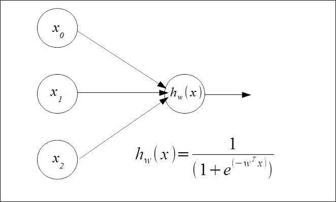
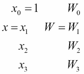
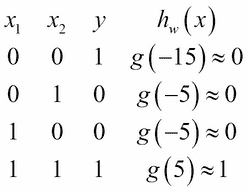
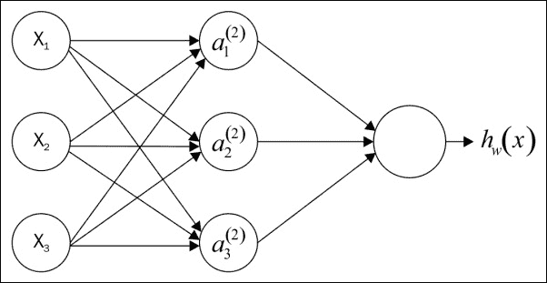
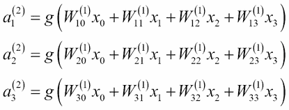
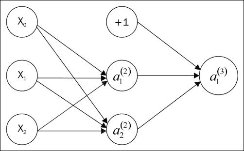
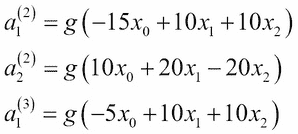
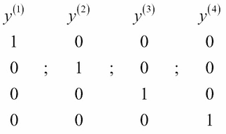
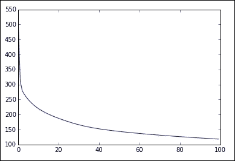

# 六、神经网络

人工神经网络，顾名思义，是基于试图模仿大脑中神经元工作方式的算法。概念工作始于 20 世纪 40 年代，但直到最近，一些重要的见解，以及运行这些计算成本更高的模型的硬件的可用性，才给予神经网络实际应用。它们现在是最先进的技术，是许多高级机器学习应用的核心。

在本章中，我们将介绍以下主题:

*   后勤单位
*   神经网络的成本函数
*   实现神经网络
*   其他神经网络架构

# 神经网络入门

在上一章中，我们看到了如何通过在我们的假设函数中加入多项式来创建一个非线性的决策边界。我们也可以在线性回归中使用这种技术来拟合非线性数据。然而，由于一些原因，这不是理想的解决方案。首先，我们必须选择多项式项，对于复杂的决策边界，这可能是一个不精确且耗时的过程，需要进行大量的反复试验。我们还需要考虑当我们拥有大量特性时会发生什么。很难准确理解增加的多项式项将如何改变决策边界。这也意味着衍生特征的可能数量将呈指数增长。为了适应复杂的边界，我们将需要许多高阶项，我们的模型将变得难以处理，计算量大，难以理解。

考虑计算机视觉等应用，在灰度图像中，每个像素是一个值在 0 到 255 之间的特征。对于一个小图像，比如 100 像素乘 100 像素，我们有 10，000 个特征。如果我们只包括二次项，我们最终会有大约 5000 万个可能的特征，为了适应复杂的决策边界，我们可能需要三次项和更高阶项。显然，这种模式是完全行不通的。

当我们着手解决试图模仿大脑的问题时，我们面临着许多困难。考虑到大脑做的所有不同的事情，我们可能首先会认为大脑由许多不同的算法组成，每个算法都专门完成一项特定的任务，并且每个算法都硬连接到大脑的不同部分。这种方法基本上将大脑视为许多子系统，每个子系统都有自己的程序和任务。例如，感知声音的听觉皮层有自己的算法，例如，对传入的声波进行**傅立叶**变换，以检测音高。另一方面，视觉皮层有自己独特的算法来解码和转换来自视觉神经的信号。然而，越来越多的证据表明，大脑根本不是这样运作的。

最近在动物身上进行的实验显示了大脑组织非凡的适应性。科学家们将动物的视觉神经重新连接到听觉皮层，发现大脑可以利用听觉皮层的机制来学习视觉。尽管这些动物的视觉皮层已经被绕过，但它们还是被测试为拥有完整的视觉。大脑不同部位的脑组织似乎可以重新学习如何解读输入信息。因此，大脑不是由专门的子系统组成，而是使用相同的算法来学习不同的任务。这种单一算法方法有许多优点，尤其是它相对容易实现。这也意味着我们可以创建通用模型，然后训练它们执行专门的任务。就像在真实大脑中使用单一算法来描述每个神经元如何与其周围的其他神经元进行通信一样，它允许人工神经网络具有适应性，并能够执行多个更高级别的任务。但是，这个单一算法的本质是什么？

当试图模仿真实的大脑功能时，我们被迫大大简化许多事情。例如，没有办法考虑到大脑化学状态的作用，或者大脑在不同发展和生长阶段的状态。目前使用的大多数神经网络模型采用人工神经元或单元的离散层，以有序的线性序列或分层连接。另一方面，大脑由许多复杂、嵌套和相互连接的神经回路组成。在试图模仿这些复杂的反馈系统方面，已经取得了一些进展，我们将在本章的末尾研究这些。然而，对于真正的大脑活动以及如何将这种复杂的行为纳入人工神经网络，我们仍有许多不了解的地方。


# 后勤单位

作为起点，我们在神经元的简化模型上使用逻辑单元的概念。它由一组输入和输出以及一个激活函数组成。这个激活函数本质上是对输入集执行计算，并随后给出输出。这里，我们将激活函数设置为我们在前一章中用于逻辑回归的 sigmoid:



我们有两个输入单元，x [1] 和 x [2] 和一个设置为 1 的偏置单元 x [0] 。这些被馈送到使用 sigmoid 逻辑函数和权重向量 *w* 的假设函数中，权重向量将假设函数参数化。由二进制值组成的特征向量和前一示例的参数向量由以下内容组成:



为了了解如何让它执行逻辑功能，让我们给这个模型一些权重。我们可以把它写成 sigmoid， *g* 和我们重量的函数。首先，我们要选择一些权重。我们将很快了解如何训练模型学习其自身的权重。假设我们设定权重，这样我们有以下假设函数:


我们为模型提供一些简单的标记数据，并构建一个真值表:



尽管这些数据看起来相对简单，但是区分这些类所需的决策边界并不简单。我们的目标变量， *y* ，与输入变量形成逻辑 **XNOR** 。只有当*x[1]T22 和*x[2]都是 *0* 或 *1* 时，输出才是 *1* 。**

在这里，我们的假设给了我们一个逻辑上的**和**。即当*x[1]和*x[2]T42 都为 *1* 时，返回一个 *1* 。通过将权重设置为其他值，我们可以让我们的单个人工神经元形成其他逻辑功能。**

这为我们提供了逻辑**或**功能:


为了执行 XNOR，我们组合了 AND、OR 和 NOT 函数。要执行求反，即逻辑**而非**，我们只需为想要求反的输入变量选择大的负权重。

物流单元连接在一起形成人工神经网络。这些网络由一个输入层、一个或多个隐藏层和一个输出层组成。每个单元都有一个激活函数，这里是 sigmoid，并由权重矩阵 *W* 参数化:



我们可以写出隐藏层中每个单元的激活函数:



输出层的激活函数如下:


更一般地，我们可以说从给定层 *j* 到层 *j+1* 的函数映射由参数矩阵*w[j]确定。超级脚本 *j* 表示第*j*层，下标 *i* 表示该层中的单元。我们用参数或权重矩阵 *W ^((j))* 来表示，它管理从层 *j* 到层 *j + 1* 的映射。我们用矩阵指数的下标来表示各个权重。*

注意，每一层的参数矩阵的维数将是下一层的单元数乘以当前层的单元数加上*1*；这是针对*x[0]的，也就是偏置层。更正式地说，我们可以写出给定层的参数矩阵的维数 *j* ，如下所示:*


下标 *(j + 1)* 是指下一个输入层和前一层的单元数，*d[j]*+*1*是指当前层的单元数加上 *1* 。

现在让我们看看如何使用矢量实现来计算这些激活函数。我们可以通过定义一个新项 *Z* 来更简洁地编写这些函数，它由给定层上每个单元的输入值的加权线性组合组成。这里有一个例子:


我们只是用一个函数 *Z* 代替了激活函数内部的所有东西。这里，超级脚本 *(2)* 表示层数，下标 *1* 表示该层的单元。因此，更一般地，定义层 *j* 的激活函数的矩阵如下:


因此，在我们的三层示例中，我们的输出层可以定义如下:


我们可以通过首先查看单个隐藏层上的三个单元以及它如何将其输入映射到输出层上单个单元的输入来学习特征。我们可以看到，它只是使用一组特征( *a ² )* 来执行逻辑回归。不同之处在于，现在隐藏层的输入特征本身是使用从输入层的原始特征中学习的权重来计算的。通过隐藏层，我们可以开始拟合更复杂的非线性函数。

我们可以使用以下神经网络架构来解决我们的 XNOR 问题:



这里，我们在输入层有三个单元，在单个隐藏层有两个单元加上偏置单元，在输出层有一个单元。我们可以为隐藏层中的第一个单元(不包括偏置单元)设置权重，以执行逻辑功能 *x [1] 和 x [2]* 。第二个单元的砝码执行功能*(不是 x [1] )和(不是 x [2] )* 。最后，我们的输出层执行 OR 函数。

我们可以将激活函数编写如下:



这个网络的真值表是这样的:


为了用神经网络执行多类分类，我们使用的架构为我们试图分类的每个类都有一个输出单元。网络输出一个二进制数向量，其中 *1* 表示该类别存在。这个输出变量是一个 *i* 维向量，其中 *i* 是输出类的数量。例如，四个要素的输出空间如下所示:



我们的目标是定义一个假设函数，使其近似等于这四个向量中的一个:


这本质上是一个对所有的表示。

我们可以用层数 *L* 来描述一个神经网络架构，用一个数*s[I]来描述每层中的单元数，其中下标表示层数。为了方便起见，我将定义一个变量， *t* ，表示层 *l + 1* 上的单元数量，其中 *l + 1* 是向前的层，即图的右侧的层。*


# 成本函数

为了在给定训练集的神经网络中拟合权重，我们首先需要定义一个成本函数:


这与我们用于逻辑回归的成本函数非常相似，只是现在我们也对 *k* 个输出单位求和。正则项中使用的三重求和看起来有点复杂，但它实际上是对参数矩阵中的每一项求和，并使用它来计算正则化。注意求和， *i* ， *l* ， *j* 从 *1* 开始，而不是从 *0* 开始；这是为了反映我们没有将正则化应用于偏差单位的事实。

## 最小化成本函数

现在我们有了成本函数，我们需要想出一个最小化它的方法。与梯度下降一样，我们需要计算偏导数来计算成本函数的斜率。这是使用**反向传播**算法完成的。它被称为反向传播，因为我们从计算输出层的误差开始，然后依次计算前一层的误差。我们可以使用这些由成本函数计算出的导数来计算出神经网络中每个单元的参数值。为此，我们需要定义一个误差项:


对于这个例子，让我们假设我们总共有三层，包括输入和输出层。输出层的误差可以写为:


最后一层中的激活函数相当于我们的假设函数，我们可以使用简单的向量 减法来计算我们的假设预测的值与我们的训练集中的实际值之间的差异。一旦我们知道输出层中的误差，我们就能够*反向传播*以找到误差，即先前层中的增量值:


这将计算第三层的误差。我们使用当前层(在本例中为第 2 层)的参数向量的转置，乘以来自前向层(在本例中为第 3 层)的误差向量。然后，我们使用成对乘法，用符号 *** 表示，激活函数的导数 *g* ，在由 *z ^((3))* 给定的输入值处评估。我们可以通过下式计算这个导数项:


如果你懂微积分，证明这一点是一个相当简单的过程，但是为了我们的目的，我们不会在这里深入讨论。如您所料，当我们有多个隐藏层时，我们可以使用参数向量、前向层的增量向量和当前层的激活函数的导数，以完全相同的方式计算每个隐藏层的增量值。我们不需要计算第 1 层的增量值，因为这些只是要素本身，没有任何错误。最后，通过一个相当复杂的数学证明，我们将不会进入这里，我们可以写成本函数的导数，忽略正则化，如下:


通过使用反向传播计算增量项，我们可以找到每个参数值的偏导数。现在，让我们看看如何将其应用于训练样本数据集。我们需要定义资本 delta，*δ*，它只是 delta 项的矩阵，具有维度， *l:i:j* 。这将充当来自神经网络中每个节点的增量值的**累加器**，因为算法循环通过每个训练样本。在每个循环中，它对每个训练样本执行以下功能:

1.  它将第一层中的激活函数设置为每个值 *x* ，即我们的输入特征。
2.  它在每个后续层上依次执行前向传播直到输出层，以计算每个层的激活函数。
3.  它在输出层计算增量值，并开始反向传播过程。这类似于我们在正向传播中执行的过程，除了它反向发生。因此，对于我们的 3 层示例中的输出层，演示如下:

请记住，这都是在一个循环中发生的，所以我们一次处理一个训练样本； *y ^((i))* 代表第 *i ^个* 训练样本的目标值。我们现在可以使用反向传播算法来计算先前层的增量值。我们现在可以使用更新规则将这些值添加到累加器中:


该公式可以用矢量化形式表示，一次更新所有训练样本，如下所示:


现在，我们可以添加正则项:


最后，我们可以通过执行梯度下降来更新权重:


记住 *α* 是学习率，也就是我们设置为 0 到 1 之间的一个小数字的 hyper 参数。


# 实现神经网络

还有一件事我们需要考虑，那就是权重的初始化。如果我们将它们初始化为 0，或者全部初始化为相同的数，则前向层上的所有单元将在输入端计算相同的函数，使得计算高度冗余，并且不能适应复杂的数据。本质上，我们需要做的是打破对称性，以便我们给每个单元一个稍微不同的起点，这实际上允许网络创建更多有趣的功能。

现在，让我们看看如何在代码中实现它。这个实现是由 Sebastian Raschka 编写的，摘自他的优秀著作《Python 机器学习》*，由 Packt 出版社出版:*

```py
import numpy as np
from scipy.special import expit
import sys

class NeuralNetMLP(object):

 def __init__(self, n_output, n_features, n_hidden=30,
 l1=0.0, l2=0.0, epochs=500, eta=0.001, 
 alpha=0.0, decrease_const=0.0, shuffle=True,
 minibatches=1, random_state=None):

 np.random.seed(random_state)
 self.n_output = n_output
 self.n_features = n_features
 self.n_hidden = n_hidden
 self.w1, self.w2 = self._initialize_weights()
 self.l1 = l1
 self.l2 = l2
 self.epochs = epochs
 self.eta = eta
 self.alpha = alpha
 self.decrease_const = decrease_const
 self.shuffle = shuffle
 self.minibatches = minibatches

 def _encode_labels(self, y, k):

 onehot = np.zeros((k, y.shape[0]))
 for idx, val in enumerate(y):
 onehot[val, idx] = 1.0
 return onehot

 def _initialize_weights(self):
 """Initialize weights with small random numbers."""
 w1 = np.random.uniform(-1.0, 1.0, size=self.n_hidden*(self.n_features + 1))
 w1 = w1.reshape(self.n_hidden, self.n_features + 1)
 w2 = np.random.uniform(-1.0, 1.0, size=self.n_output*(self.n_hidden + 1))
 w2 = w2.reshape(self.n_output, self.n_hidden + 1)
 return w1, w2

 def _sigmoid(self, z):

 # return 1.0 / (1.0 + np.exp(-z))
 return expit(z)

 def _sigmoid_gradient(self, z):
 sg = self._sigmoid(z)
 return sg * (1 - sg)

 def _add_bias_unit(self, X, how='column'):

 if how == 'column':
 X_new = np.ones((X.shape[0], X.shape[1]+1))
 X_new[:, 1:] = X
 elif how == 'row':
 X_new = np.ones((X.shape[0]+1, X.shape[1]))
 X_new[1:, :] = X
 else:
 raise AttributeError('`how` must be `column` or `row`')
 return X_new

 def _feedforward(self, X, w1, w2):

 a1 = self._add_bias_unit(X, how='column')
 z2 = w1.dot(a1.T)
 a2 = self._sigmoid(z2)
 a2 = self._add_bias_unit(a2, how='row')
 z3 = w2.dot(a2)
 a3 = self._sigmoid(z3)
 return a1, z2, a2, z3, a3

 def _L2_reg(self, lambda_, w1, w2):
 """Compute L2-regularization cost"""
 return (lambda_/2.0) * (np.sum(w1[:, 1:] ** 2) + np.sum(w2[:, 1:] ** 2))

 def _L1_reg(self, lambda_, w1, w2):
 """Compute L1-regularization cost"""
 return (lambda_/2.0) * (np.abs(w1[:, 1:]).sum() + np.abs(w2[:, 1:]).sum())

 def _get_cost(self, y_enc, output, w1, w2):

 term1 = -y_enc * (np.log(output))
 term2 = (1 - y_enc) * np.log(1 - output)
 cost = np.sum(term1 - term2)
 L1_term = self._L1_reg(self.l1, w1, w2)
 L2_term = self._L2_reg(self.l2, w1, w2)
 cost = cost + L1_term + L2_term
 return cost

 def _get_gradient(self, a1, a2, a3, z2, y_enc, w1, w2):

 # backpropagation
 sigma3 = a3 - y_enc
 z2 = self._add_bias_unit(z2, how='row')
 sigma2 = w2.T.dot(sigma3) * self._sigmoid_gradient(z2)
 sigma2 = sigma2[1:, :]
 grad1 = sigma2.dot(a1)
 grad2 = sigma3.dot(a2.T)

 # regularize
 grad1[:, 1:] += (w1[:, 1:] * (self.l1 + self.l2))
 grad2[:, 1:] += (w2[:, 1:] * (self.l1 + self.l2))

 return grad1, grad2

 def predict(self, X):

 if len(X.shape) != 2:
 raise AttributeError('X must be a [n_samples, n_features] array.\n'
 'Use X[:,None] for 1-feature classification,'
 '\nor X[[i]] for 1-sample classification')

 a1, z2, a2, z3, a3 = self._feedforward(X, self.w1, self.w2)
 y_pred = np.argmax(z3, axis=0)
 return y_pred

 def fit(self, X, y, print_progress=False):

 self.cost_ = []
 X_data, y_data = X.copy(), y.copy()
 y_enc = self._encode_labels(y, self.n_output)

 delta_w1_prev = np.zeros(self.w1.shape)
 delta_w2_prev = np.zeros(self.w2.shape)

 for i in range(self.epochs):

 # adaptive learning rate
 self.eta /= (1 + self.decrease_const*i)

 if print_progress:
 sys.stderr.write('\rEpoch: %d/%d' % (i+1, self.epochs))
 sys.stderr.flush()

 if self.shuffle:
 idx = np.random.permutation(y_data.shape[0])
 X_data, y_data = X_data[idx], y_data[idx]

 mini = np.array_split(range(y_data.shape[0]), self.minibatches)
 for idx in mini:

 # feedforward
 a1, z2, a2, z3, a3 = self._feedforward(X[idx], self.w1, self.w2)
 cost = self._get_cost(y_enc=y_enc[:, idx],
 output=a3,
 w1=self.w1,
 w2=self.w2)
 self.cost_.append(cost)

 # compute gradient via backpropagation
 grad1, grad2 = self._get_gradient(a1=a1, a2=a2,
 a3=a3, z2=z2,
 y_enc=y_enc[:, idx],
 w1=self.w1,
 w2=self.w2)

 delta_w1, delta_w2 = self.eta * grad1, self.eta * grad2
 self.w1 -= (delta_w1 + (self.alpha * delta_w1_prev))
 self.w2 -= (delta_w2 + (self.alpha * delta_w2_prev))
 delta_w1_prev, delta_w2_prev = delta_w1, delta_w2

 return self

```

现在，让我们将这个神经网络应用于虹膜样本数据集。记住这个数据集包含三个类，所以我们将`n_output`参数(输出层数)设置为 3。数据集中第一个轴的形状是指要素的数量。我们创建了 50 个隐藏层和 100 个时期，每个时期是整个训练集的完整循环。在这里，我们将学习速率`alpha`设置为`.001`，并且我们显示了一个成本与时期数量的关系图:

```py
iris = datasets.load_iris()
X=iris.data
y=iris.target
nn= NeuralNetMLP(3, X.shape[1],n_hidden=50, epochs=100, alpha=.001)
nn.fit(X,y)
plt.plot(range(len(nn.cost_)),nn.cost_)
plt.show()

```

以下是输出:



该图显示了成本如何在每个时期减少。要了解模型的工作原理，请花些时间在其他数据集和各种输入参数上进行实验。测试多类分类问题时经常使用的一个特殊数据集是 http://yann.lecun.com/exdb/mnist/的 MNIST 数据集。这由包含 60，000 张手绘字母图像及其标签的数据集组成。它经常被用作机器学习算法的基准。


# 梯度检查

反向传播和一般的神经网络有点难以概念化。因此，通常不容易理解改变任何模型(超)参数将如何影响结果。此外，利用不同的实现，有可能获得指示算法正确工作的结果，即，成本函数在梯度下降的每个级别上降低。然而，与任何复杂的软件一样，可能存在隐藏的错误，这些错误可能只在非常特定的条件下才会显现出来。一种帮助消除这些的方法是通过一个叫做**梯度检测**的程序。这是一种近似梯度的数值方法，我们可以通过检查下图直观地理解这一点:


*J(w)* 相对于 *w，*的导数可以近似为:


当参数是单个值时，前面的公式近似于导数。我们需要在一个成本函数上评估这些导数，其中权重是一个向量。我们通过依次对每个权重进行偏导数来做到这一点。这里有一个例子:


# 其他神经网络架构

在神经网络模型领域，以及通常的机器学习领域，许多最重要的工作都在使用非常复杂的具有许多层和特征的神经网络。这种方法通常被称为**深度架构** 或深度学习。人类和动物学习的速度和深度是任何机器都无法比拟的。生物学习的许多要素仍然是个谜。目标识别是研究的一个关键领域，也是实际应用中最有用的领域之一。这是生命系统中非常基本的东西，高等动物已经进化出一种非凡的能力来学习目标之间的复杂关系。生物大脑有很多层；每个突触事件都存在于突触过程的长链中。为了识别复杂的对象，例如人脸或手写数字，需要完成的一项基本任务是创建一个从原始输入到越来越高的抽象级别的表示层次。目标是将原始数据，比如一组像素值，转换成我们可以描述的东西，比如说，一个骑自行车的人。解决这类问题的一种方法是使用稀疏表示来创建更高维的特征空间，其中有许多特征，但只有极少数具有非零值。这种方法很有吸引力，原因有几个。首先，特征在更高的特征空间中可能变得更加线性可分。此外，在某些模型中已经表明，稀疏性可以用于使训练更有效，并有助于从非常嘈杂的数据中提取信息。我们将在下一章更详细地探讨这个想法和特征提取的一般概念。

另一个有趣的想法是 **循环神经网络**或 **RNNs** 。这些在许多方面与我们迄今为止所考虑的前馈网络截然不同。rnn 不是简单的输入和输出之间的静态映射，而是至少有一个循环反馈路径。RNNs 向网络引入了时间分量，因为单元的输入可能包括它早先通过反馈回路接收的输入。所有的生物神经网络都是高度递归的。人工 rnn 在语音和手写识别等领域显示出了前景。然而，一般来说，它们很难训练，因为我们不能简单地反向传播误差。我们必须考虑这种系统的时间成分和动态、非线性特征。RNNs 将为未来的研究提供一个非常有趣的领域。


# 总结

在本章中，我们介绍了人工神经网络的强大的机器学习算法。我们看到这些网络是大脑神经元的简化模型。它们可以执行复杂的学习任务，例如学习高度非线性的决策边界，使用多层人工神经元或单元，从标记的数据中学习新的特征。在下一章，我们将研究任何机器学习算法的关键部分，也就是它的特性。