# 七、卷积神经网络简介

在数据科学中，**卷积神经网络** ( **CNN** )是一种特定的深度学习架构，它使用卷积运算来提取输入图像的相关解释特征。CNN 层被连接成前馈神经网络，同时使用这种卷积运算来模仿人类大脑在试图识别目标时的功能。单个皮质神经元在一个被称为感受野的有限空间区域内对刺激做出反应。特别是，生物医学成像问题有时可能具有挑战性，但在这一章中，我们将看到如何使用 CNN 来发现图像中的模式。

本章将涵盖以下主题:

*   卷积运算
*   动机
*   CNN 的不同层次
*   CNN 基本示例:MNIST 数字分类


# 卷积运算

CNN 广泛应用于计算机视觉领域，并且优于我们一直使用的大多数传统计算机视觉技术。CNN 结合了著名的卷积运算和神经网络，因此得名卷积神经网络。因此，在深入研究 CNN 的神经网络方面之前，我们将介绍卷积运算，看看它是如何工作的。

卷积运算的主要目的是从图像中提取信息或特征。任何图像都可以被认为是值的矩阵，并且该矩阵中的特定值组将形成特征。卷积运算的目的是扫描该矩阵，并尝试提取该图像的相关或解释性特征。例如，考虑一个 5 乘 5 的图像，其相应的亮度或像素值显示为 0 和 1:

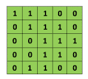

图 9.1:像素值矩阵

并且考虑下面的 3×3 矩阵:


图 9.2:像素值矩阵

我们可以使用 3×3 图像对 5×5 图像进行卷积，如下所示:

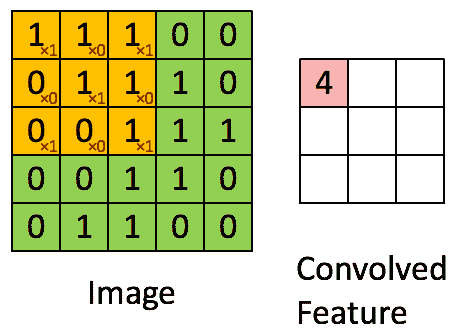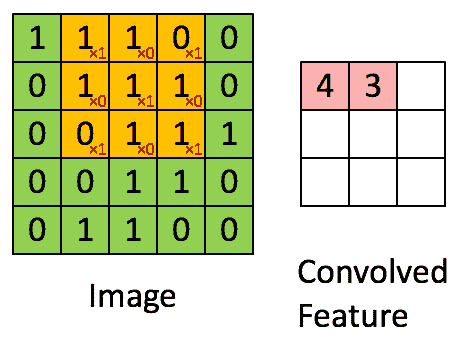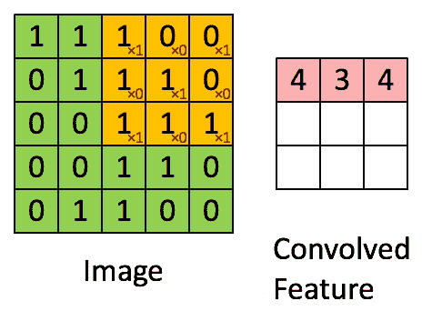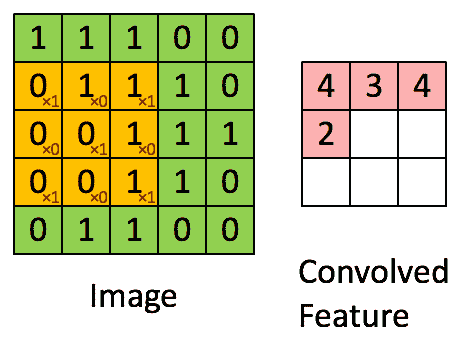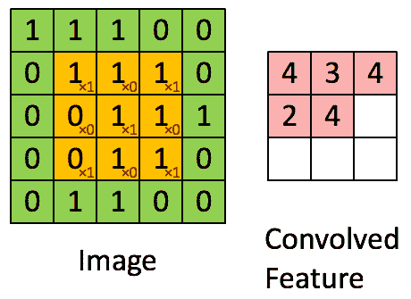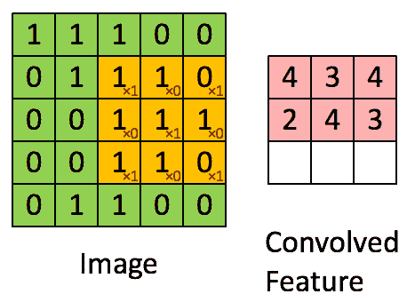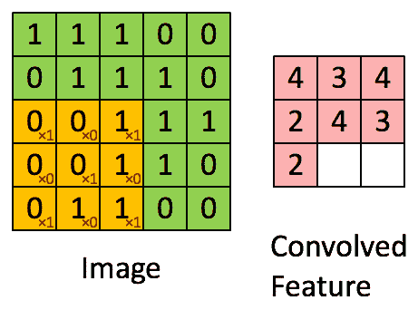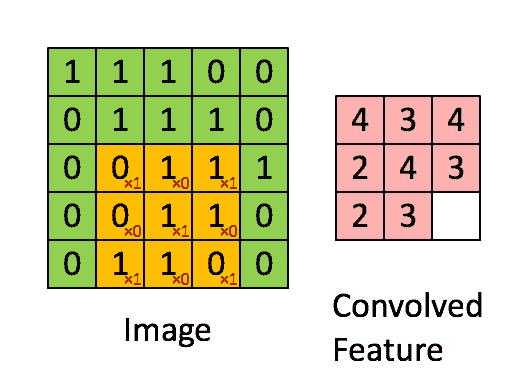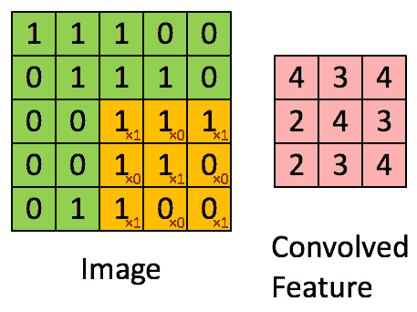

图 9.3:卷积运算。输出矩阵称为卷积特征或特征图

上图可以概括如下。为了使用 3×3 卷积核对原始 5×5 图像进行卷积，我们需要执行以下操作:

*   使用橙色矩阵扫描原始绿色图像，每次仅移动 1 个像素(步幅)
*   对于橙色图像的每个位置，我们在橙色矩阵和绿色矩阵中相应的像素值之间进行逐元素乘法
*   将这些逐元素乘法运算的结果相加，得到一个整数，该整数将在输出粉色矩阵中形成一个值

从上图中可以看出，橙色 3 乘 3 矩阵在每次移动(步幅)中一次只对原始绿色图像的一部分进行操作，或者一次只看到一部分。

所以，让我们把前面的解释放在 CNN 术语的上下文中:

*   橙色的 3×3 矩阵被称为**内核**、**特征检测器**或**过滤器**
*   包含元素乘法结果的输出粉色矩阵被称为**特征图**

因为我们是基于核和原始输入图像中的相应像素之间的逐元素乘法来获得特征图，所以改变核或滤波器的值每次都会给出不同的特征图。

因此，我们可能会认为在卷积神经网络的训练过程中，我们需要自己计算出特征检测器的值，但这不是这里的情况。CNN 在学习过程中计算出这些数字。因此，如果我们有更多的过滤器，这意味着我们可以从图像中提取更多的特征。

在跳到下一节之前，让我们先介绍一些 CNN 上下文中通常使用的术语:

*   **跨步**:我们之前简单提到过这个术语。一般来说，跨距是我们在输入矩阵的像素上移动特征检测器或滤波器的像素数。例如，步距 1 表示在卷积输入图像时一次移动一个像素，步距 2 表示在卷积输入图像时一次移动两个像素。我们的步幅越大，生成的特征图就越小。
*   **零填充**:如果我们想要包含输入图像的边界像素，那么我们的过滤器的一部分将在输入图像之外。零填充通过在边界周围用零填充输入矩阵来解决这个问题。


# 动机

传统的计算机视觉技术用于执行大多数计算机视觉任务，例如目标检测和分割。这些传统计算机视觉技术的性能很好，但从未接近实时可用，例如自动驾驶汽车。2012 年，Alex Krizhevsky 引入了 CNN，通过将对象分类误差从 26%增强到 15%，在 ImageNet 竞赛上取得了突破。自那以后，CNN 被广泛使用，并且发现了不同的变体。在 ImageNet 竞争中，它甚至胜过了人工分类错误，如下图所示:

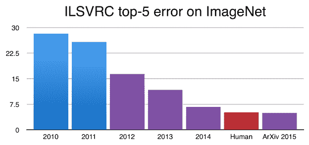

图 9.4:一段时间内的分类误差，人为误差用红色标记


# CNN 的应用

自从 CNN 在计算机视觉甚至自然语言处理的不同领域取得突破以来，大多数公司都将这种深度学习解决方案集成到了他们的计算机视觉回声系统中。例如，谷歌将其架构用于图像搜索引擎，脸书将其用于自动标记等等:

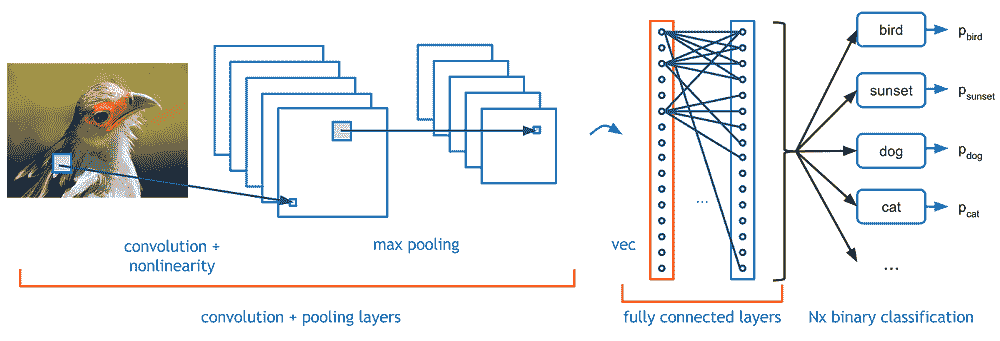

图 9.5:用于目标识别的典型 CNN 通用架构

CNN 实现这一突破是因为它们的架构，它直观地使用卷积运算从图像中提取特征。稍后，你会发现这和人类大脑的工作方式非常相似。


# CNN 的不同层次

典型的 CNN 架构由执行不同任务的多个层组成，如上图所示。在这一节中，我们将详细介绍它们，并看到以特殊方式将它们连接起来以实现计算机视觉突破的好处。


# 输入层

这是任何 CNN 架构的第一层。所有后续卷积和池层都希望输入采用特定的格式。输入变量将是张量，其形状如下:

```py
[batch_size, image_width, image_height, channels]
```

这里:

*   `batch_size`是在应用随机梯度下降时使用的原始训练集中的随机样本。
*   `image_width`是网络输入图像的宽度。
*   `image_height`是输入图像到网络的高度。
*   `channels`是输入图像的颜色通道数。这个数字对于 RGB 图像可以是 3，对于二进制图像可以是 1。

例如，考虑我们著名的 MNIST 数据集。假设我们将使用这个数据集使用 CNN 来执行数字分类。

如果数据集像 MNIST 数据集一样由 28 x 28 像素的单色图像组成，那么我们的输入图层的理想形状如下:

```py
[batch_size, 28, 28, 1].
```

要更改输入要素的形状，我们可以执行以下整形操作:

```py
input_layer = tf.reshape(features["x"], [-1, 28, 28, 1])
```

正如您所看到的，我们已经将批量大小指定为-1，这意味着该数量应该根据特性中的输入值动态确定。通过这样做，我们将能够通过控制批量大小来微调 CNN 模型。

作为整形操作的一个例子，假设我们将输入样本分成五个一批，我们的特征`["x"]`数组将保存 3920 个`values()`输入图像，其中该数组的每个值对应于图像中的一个像素。在这种情况下，输入图层将具有以下形状:

```py
[5, 28, 28, 1]
```


# 卷积步骤

如前所述，卷积步骤因卷积运算而得名。这些卷积步骤的主要目的是从输入图像中提取特征，然后将它们提供给线性分类器。

在自然图像中，特征可以在图像中的任何地方。例如，边缘可能在图像的中间或角落，因此堆叠一堆卷积步骤的整体思想是能够检测图像中任何地方的这些特征。

在TensorFlow中定义卷积步骤非常简单。例如，如果我们想要将 20 个大小为 5 乘 5 的过滤器应用到具有 ReLU 激活功能的输入层，那么我们可以使用下面的代码行来实现:

```py
conv_layer1 = tf.layers.conv2d(
 inputs=input_layer,
 filters=20,
 kernel_size=[5, 5],
 padding="same",
 activation=tf.nn.relu)
```

此`conv2d`函数的第一个参数是我们在前面的代码中定义的输入层，它具有适当的形状，第二个参数是 filters 参数，它指定应用于图像的过滤器数量，过滤器数量越多，从输入图像中提取的特征就越多。第三个参数是`kernel_size`，它代表过滤器或特征检测器的大小。填充参数指定了我们在这里使用`"same"`向输入图像的角像素引入零填充。最后一个参数指定用于卷积运算输出的激活函数。

因此，在我们的 MNIST 例子中，输入张量将具有以下形状:

```py
[batch_size, 28, 28, 1]
```

并且该卷积步骤的输出张量将具有以下形状:

```py
[batch_size, 28, 28, 20]
```

输出张量与输入图像具有相同的维数，但是现在我们有 20 个通道来表示对输入图像应用 20 个滤波器。


# 引入非线性

在卷积步骤中，我们讨论了将卷积步骤的输出馈入 ReLU 激活函数以引入非线性:


图 9.6: ReLU 激活功能

ReLU 激活函数用零替换所有负像素值，并且将卷积步骤的输出馈送到该激活函数的全部目的是在输出图像中引入非线性，因为这对于训练过程是有用的，因为我们使用的数据通常是非线性的。为了清楚地理解 ReLU 激活函数的好处，请看下图，它显示了卷积步骤的行输出及其修正版本:

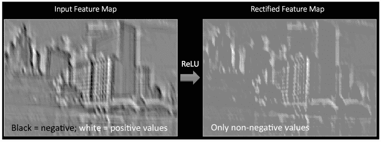

图 9.7:将 ReLU 应用于输入要素地图的结果


# 汇集步骤

我们学习过程中的一个重要步骤是汇集步骤，有时也称为子采样或下采样步骤。该步骤主要用于减少卷积步骤(特征图)的输出的维数。这个池化步骤的优点是减少了特征地图的大小，同时将重要信息保留在新减少的版本中。

下图显示了此步骤，在应用最大值操作时，使用 2 乘 2 过滤器和步幅 2 扫描图像。这种池操作称为**最大池**:

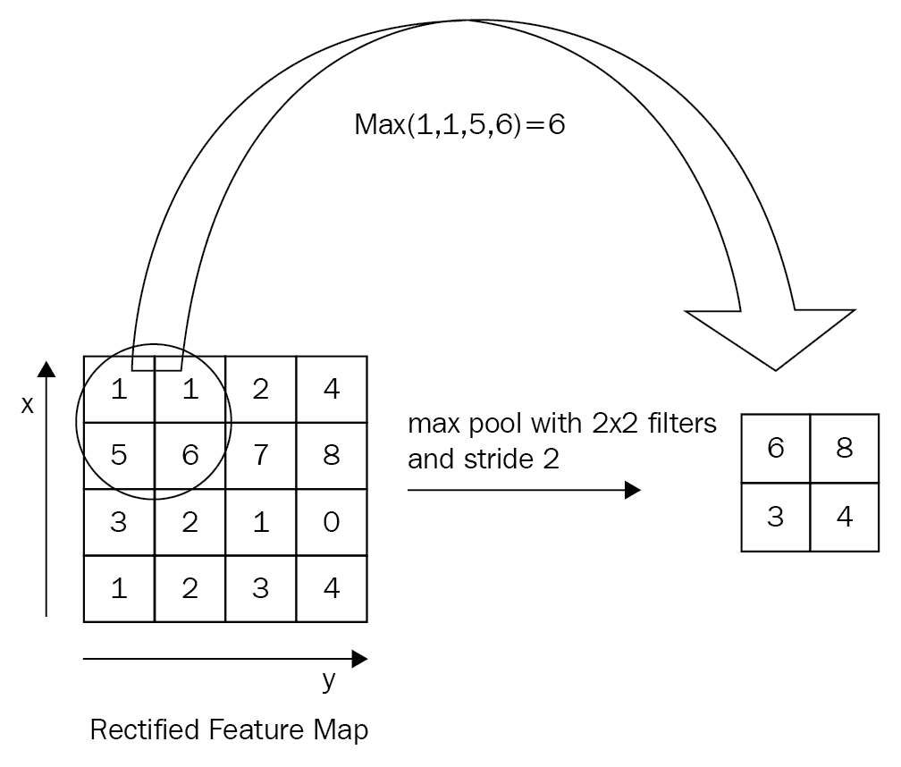

图 9.8:使用 2 x 2 窗口对纠正后的要素地图(卷积和 ReLU 操作后获得)进行最大池化操作的示例(来源:http://textminingonline . com/WP-content/uploads/2016/10/max _ polling-300 x256 . png)

我们可以使用以下代码行将卷积步骤的输出连接到池层:

```py
pool_layer1 = tf.layers.max_pooling2d(inputs=conv_layer1, pool_size=[2, 2], strides=2)
```

池层接收卷积步骤的输入，形状如下:

```py
[batch_size, image_width, image_height, channels]
```

例如，在我们的数字分类任务中，池层的输入将具有以下形状:

```py
[batch_size, 28, 28, 20]
```

池化操作的输出将具有以下形状:

```py
[batch_size, 14, 14, 20]
```

在本例中，我们将卷积步骤的输出大小减少了 50%。这一步非常有用，因为它只保留了重要的信息，还降低了模型的复杂性，从而避免了过度拟合。


# 全连接层

在堆叠了一系列卷积和池化步骤后，我们接着使用一个完全连接的图层，在该图层中，我们将从输入图像中获取的提取的高级特征提供给这个完全连接的图层，以使用它们并基于这些特征进行实际分类:


图 9.9:全连接层-每个节点都与相邻层中的所有其他节点相连

例如，在数字分类任务的情况下，我们可以对具有 1，024 个神经元的全连接层执行卷积和池化步骤，并重新激活以执行实际的分类。该全连接层接受以下格式的输入:

```py
[batch_size, features]
```

因此，我们需要对来自`pool_layer2`的输入特征地图进行整形或展平，以匹配这种格式。我们可以使用下面一行代码来改变输出的形状:

```py
pool1_flat = tf.reshape(pool_layer1, [-1, 14 * 14 * 20])
```

在这个整形函数中，我们使用了`-1`来表示批量大小将被动态确定，并且来自`pool_layer1`输出的每个示例将具有`14`的宽度和`14`的高度，每个示例具有`20`个通道。

因此，该整形操作的最终输出如下:

```py
 [batch_size, 3136]
```

最后，我们可以使用 TensorFlow 的`dense()`函数，用所需的神经元(单元)数量和最终激活函数来定义我们的全连通层:

```py
dense_layer = tf.layers.dense(inputs=pool1_flat, units=1024, activation=tf.nn.relu)
```


# 逻辑层

最后，我们需要 logits 层，它将获取全连接层的输出，然后生成原始预测值。例如，在数字分类的情况下，输出将是 10 个值的张量，其中每个值代表一个类别从 0-9 的分数。因此，让我们为数字分类示例定义这个 logit 层，其中我们只需要 10 个输出，并且具有线性激活，这是 TensorFlow 的`dense()`函数的默认设置:

```py
logits_layer = tf.layers.dense(inputs=dense_layer, units=10)
```

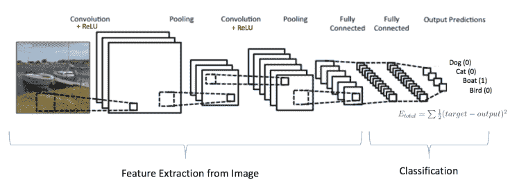

图 9.10:训练 ConvNet

此逻辑图层的最终输出将是以下形状的张量:

```py
[batch_size, 10]
```

如前所述，模型的 logits 层将返回我们批次的原始预测。但是我们需要将这些值转换成可解释的格式:

*   输入样本 0-9 的预测类。
*   每个可能类别的分数或概率。例如，样本为 0、为 1 的概率，以此类推。

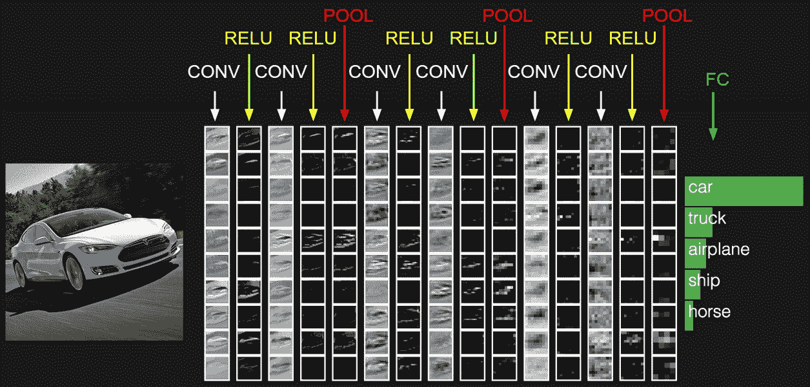

图 9.11:CNN 不同层的可视化(来源:http://cs231n.github.io/assets/cnn/convnet.jpeg)

因此，我们预测的类将是 10 个概率中值最高的一个。我们可以通过使用`argmax`函数得到这个值，如下所示:

```py
tf.argmax(input=logits_layer, axis=1)
```

记住`logits_layer`的形状如下:

```py
[batch_size, 10]
```

因此，我们需要找到预测的最大值，也就是索引为 1 的维度。

最后，我们可以通过对`logits_layer`的输出应用`softmax`激活来获得下一个值，它代表每个目标类的概率，这将把每个值压缩到 0 和 1 之间:

```py
tf.nn.softmax(logits_layer, name="softmax_tensor")
```


# CNN 基本示例 digit 数字分类

在这一节中，我们将使用 MNIST 数据集实现一个用于数字分类的 CNN 的完整示例。我们将建立一个两个卷积层和完全连接层的简单模型。

让我们从导入实现所需的库开始:

```py
%matplotlib inline
import matplotlib.pyplot as plt
import tensorflow as tf
import numpy as np
from sklearn.metrics import confusion_matrix
import math
```

接下来，我们将使用 TensorFlow 辅助函数下载并预处理 MNIST 数据集，如下所示:

```py
from tensorflow.examples.tutorials.mnist import input_data
mnist_data = input_data.read_data_sets('data/MNIST/', one_hot=True)
```

```py
Output:
Successfully downloaded train-images-idx3-ubyte.gz 9912422 bytes.
Extracting data/MNIST/train-images-idx3-ubyte.gz
Successfully downloaded train-labels-idx1-ubyte.gz 28881 bytes.
Extracting data/MNIST/train-labels-idx1-ubyte.gz
Successfully downloaded t10k-images-idx3-ubyte.gz 1648877 bytes.
Extracting data/MNIST/t10k-images-idx3-ubyte.gz
Successfully downloaded t10k-labels-idx1-ubyte.gz 4542 bytes.
Extracting data/MNIST/t10k-labels-idx1-ubyte.gz
```

数据集分为三个不相交的集合:训练集、验证集和测试集。那么，让我们打印每组中的图像数量:

```py
print("- Number of images in the training set:\t\t{}".format(len(mnist_data.train.labels)))
print("- Number of images in the test set:\t\t{}".format(len(mnist_data.test.labels)))
print("- Number of images in the validation set:\t{}".format(len(mnist_data.validation.labels)))
```

```py
- Number of images in the training set: 55000
- Number of images in the test set: 10000
- Number of images in the validation set: 5000
```

图像的实际标签以独热编码格式存储，因此除了该图像表示的类的索引之外，我们有一个由 10 个零值组成的数组。为了以后的使用，我们需要将数据集的类编号作为整数:

```py
mnist_data.test.cls_integer = np.argmax(mnist_data.test.labels, axis=1)
```

让我们定义一些将在稍后的实现中使用的已知变量:

```py
# Default size for the input monocrome images of MNIST
image_size = 28

# Each image is stored as vector of this size.
image_size_flat = image_size * image_size

# The shape of each image
image_shape = (image_size, image_size)

# All the images in the mnist dataset are stored as a monocrome with only 1 channel
num_channels = 1

# Number of classes in the MNIST dataset from 0 till 9 which is 10
num_classes = 10
```

接下来，我们需要定义一个助手函数来绘制数据集中的一些图像。这个辅助函数将在九个支线剧情的网格中绘制图像:

```py
def plot_imgs(imgs, cls_actual, cls_predicted=None):
    assert len(imgs) == len(cls_actual) == 9

    # create a figure with 9 subplots to plot the images.
    fig, axes = plt.subplots(3, 3)
    fig.subplots_adjust(hspace=0.3, wspace=0.3)

    for i, ax in enumerate(axes.flat):
        # plot the image at the ith index
        ax.imshow(imgs[i].reshape(image_shape), cmap='binary')

        # labeling the images with the actual and predicted classes.
        if cls_predicted is None:
            xlabel = "True: {0}".format(cls_actual[i])
        else:
            xlabel = "True: {0}, Pred: {1}".format(cls_actual[i], cls_predicted[i])

        # Remove ticks from the plot.
        ax.set_xticks([])
        ax.set_yticks([])

        # Show the classes as the label on the x-axis.
        ax.set_xlabel(xlabel)

    plt.show()
```

让我们从测试集中绘制一些图像，看看它看起来像什么:

```py
# Visualizing 9 images form the test set.
imgs = mnist_data.test.images[0:9]

# getting the actual classes of these 9 images
cls_actual = mnist_data.test.cls_integer[0:9]

#plotting the images
plot_imgs(imgs=imgs, cls_actual=cls_actual)
```

以下是输出:

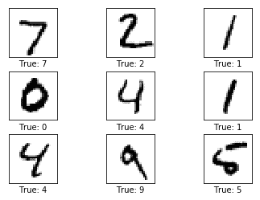

图 9.12:MNIST 数据集中一些例子的可视化


# 构建模型

现在，是时候构建模型的核心了。计算图包括我们在本章前面提到的所有层。我们将从定义一些函数开始，这些函数将用于定义特定形状的变量并随机初始化它们:

```py
def new_weights(shape):
    return tf.Variable(tf.truncated_normal(shape, stddev=0.05))
```

```py
def new_biases(length):
    return tf.Variable(tf.constant(0.05, shape=[length]))
```

现在，让我们定义负责根据某些输入层、输入通道、过滤器大小、过滤器数量以及是否使用池参数来创建新卷积层的函数:

```py
def conv_layer(input, # the output of the previous layer.
                   input_channels, 
                   filter_size, 
                   filters, 
                   use_pooling=True): # Use 2x2 max-pooling.

    # preparing the accepted shape of the input Tensor.
    shape = [filter_size, filter_size, input_channels, filters]

    # Create weights which means filters with the given shape.
    filters_weights = new_weights(shape=shape)

    # Create new biases, one for each filter.
    filters_biases = new_biases(length=filters)

    # Calling the conve2d function as we explained above, were the strides parameter
    # has four values the first one for the image number and the last 1 for the input image channel
    # the middle ones represents how many pixels the filter should move with in the x and y axis
    conv_layer = tf.nn.conv2d(input=input,
                         filter=filters_weights,
                         strides=[1, 1, 1, 1],
                         padding='SAME')

    # Adding the biase to the output of the conv_layer.
    conv_layer += filters_biases

    # Use pooling to down-sample the image resolution?
    if use_pooling:
        # reduce the output feature map by max_pool layer
        pool_layer = tf.nn.max_pool(value=conv_layer,
                               ksize=[1, 2, 2, 1],
                               strides=[1, 2, 2, 1],
                               padding='SAME')

    # feeding the output to a ReLU activation function.
    relu_layer = tf.nn.relu(pool_layer)

    # return the final results after applying relu and the filter weights
    return relu_layer, filters_weights
```

正如我们前面提到的，汇集层产生一个 4D 张量。我们需要将这个 4D 张量展平为 2D 张量，以馈入全连接层:

```py
def flatten_layer(layer):
    # Get the shape of layer.
    shape = layer.get_shape()

    # We need to flatten the layer which has the shape of The shape [num_images, image_height, image_width, num_channels]
    # so that it has the shape of [batch_size, num_features] where number_features is image_height * image_width * num_channels

    number_features = shape[1:4].num_elements()

    # Reshaping that to be fed to the fully connected layer
    flatten_layer = tf.reshape(layer, [-1, number_features])

    # Return both the flattened layer and the number of features.
    return flatten_layer, number_features
```

此函数创建一个全连接图层，该图层假定输入为 2D 张量:

```py
def fc_layer(input, # the flatten output.
                 num_inputs, # Number of inputs from previous layer
                 num_outputs, # Number of outputs
                 use_relu=True): # Use ReLU on the output to remove negative values

    # Creating the weights for the neurons of this fc_layer
    fc_weights = new_weights(shape=[num_inputs, num_outputs])
    fc_biases = new_biases(length=num_outputs)

    # Calculate the layer values by doing matrix multiplication of
    # the input values and fc_weights, and then add the fc_bias-values.
    fc_layer = tf.matmul(input, fc_weights) + fc_biases

    # if use RelU parameter is true
    if use_relu:
        relu_layer = tf.nn.relu(fc_layer)
        return relu_layer

    return fc_layer
```

在构建网络之前，让我们为输入图像定义一个占位符，其中第一维是`None`来表示任意数量的图像:

```py
input_values = tf.placeholder(tf.float32, shape=[None, image_size_flat], name='input_values')
```

正如我们之前提到的，卷积步骤期望输入图像是 4D 张量的形状。因此，我们需要将输入图像整形为以下形状:

```py
[num_images, image_height, image_width, num_channels]
```

因此，让我们重新调整输入值，使其符合以下格式:

```py
input_image = tf.reshape(input_values, [-1, image_size, image_size, num_channels])
```

接下来，我们需要为实际的类值定义另一个占位符，它将采用一次性编码格式:

```py
y_actual = tf.placeholder(tf.float32, shape=[None, num_classes], name='y_actual')
```

此外，我们需要定义一个占位符来保存实际类的整数值:

```py
y_actual_cls_integer = tf.argmax(y_actual, axis=1)
```

所以，让我们从建立第一个 CNN 开始:

```py
conv_layer_1, conv1_weights = \
        conv_layer(input=input_image,
                   input_channels=num_channels,
                   filter_size=filter_size_1,
                   filters=filters_1,
                   use_pooling=True)
```

让我们检查将由第一卷积层产生的输出张量的形状:

```py
conv_layer_1
```

```py
Output:
<tf.Tensor 'Relu:0' shape=(?, 14, 14, 16) dtype=float32>
```

接下来，我们将创建第二个卷积网络，并将第一个网络的输出提供给它:

```py
conv_layer_2, conv2_weights = \
         conv_layer(input=conv_layer_1,
                   input_channels=filters_1,
                   filter_size=filter_size_2,
                   filters=filters_2,
                   use_pooling=True)
```

此外，我们需要仔细检查第二卷积层的输出张量的形状。形状应该是`(?, 7, 7, 36)`，其中`?`标记表示任意数量的图像。

接下来，我们需要展平 4D 张量，以匹配全连接层的预期格式，这是一个 2D 张量:

```py
flatten_layer, number_features = flatten_layer(conv_layer_2)
```

我们需要仔细检查展平层的输出张量的形状:

```py
flatten_layer
```

```py
Output:
<tf.Tensor 'Reshape_1:0' shape=(?, 1764) dtype=float32>
```

接下来，我们将创建一个完全连接的层，并将展平层的输出提供给它。在将全连接层的输出提供给第二个全连接层之前，我们还将它提供给一个 ReLU 激活函数:

```py
fc_layer_1 = fc_layer(input=flatten_layer,
                         num_inputs=number_features,
                         num_outputs=fc_num_neurons,
                         use_relu=True)
```

让我们仔细检查第一个全连接层的输出张量的形状:

```py
fc_layer_1
```

```py
Output:
<tf.Tensor 'Relu_2:0' shape=(?, 128) dtype=float32>
```

接下来，我们需要添加另一个完全连接的层，它将获取第一个完全连接的层的输出，并为每个图像生成一个大小为 10 的数组，该数组表示每个目标类的正确分数:

```py
fc_layer_2 = fc_layer(input=fc_layer_1,
                         num_inputs=fc_num_neurons,
                         num_outputs=num_classes,
                         use_relu=False)
```

```py
fc_layer_2
```

```py
Output:
<tf.Tensor 'add_3:0' shape=(?, 10) dtype=float32>
```

接下来，我们将标准化来自第二个完全连接层的这些分数，并将其提供给一个`softmax`激活函数，该函数会将这些值压缩到 0 到 1 之间:

```py
y_predicted = tf.nn.softmax(fc_layer_2)
```

然后，我们需要使用 TensorFlow 的`argmax`函数选择概率最高的目标类:

```py
y_predicted_cls_integer = tf.argmax(y_predicted, axis=1)
```


# 价值函数

接下来，我们需要定义我们的性能度量，即交叉熵。如果预测的类别是正确的，交叉熵的值将是 0:

```py
cross_entropy = tf.nn.softmax_cross_entropy_with_logits(logits=fc_layer_2,
                                                        labels=y_actual)
```

接下来，我们需要对上一步获得的所有交叉熵值进行平均，以便能够在测试集上获得单个性能度量:

```py
model_cost = tf.reduce_mean(cross_entropy)
```

现在，我们有一个需要优化/最小化的成本函数，所以我们将使用`AdamOptimizer`，这是一种类似梯度下降但更高级的优化方法:

```py
model_optimizer = tf.train.AdamOptimizer(learning_rate=1e-4).minimize(model_cost)
```


# 绩效指标

为了显示输出，让我们定义一个变量来检查预测的类是否等于真实的类:

```py
model_correct_prediction = tf.equal(y_predicted_cls_integer, y_actual_cls_integer)
```

通过对布尔值进行转换，然后对它们进行平均以对正确分类的值求和，来计算模型精度:

```py
model_accuracy = tf.reduce_mean(tf.cast(model_correct_prediction, tf.float32))
```


# 模特培训

让我们通过创建一个负责执行我们之前定义的计算图的会话变量来开始培训过程:

```py
session = tf.Session()
```

此外，我们需要初始化到目前为止已经定义的变量:

```py
session.run(tf.global_variables_initializer())
```

我们将分批输入图像，以避免内存不足的错误:

```py
train_batch_size = 64
```

在开始训练过程之前，我们将定义一个助手函数，它将通过迭代训练批次来执行优化过程:

```py
# number of optimization iterations performed so far
total_iterations = 0

def optimize(num_iterations):
    # Update globally the total number of iterations performed so far.
    global total_iterations

    for i in range(total_iterations,
                   total_iterations + num_iterations):

        # Generating a random batch for the training process
        # input_batch now contains a bunch of images from the training set and
        # y_actual_batch are the actual labels for the images in the input batch.
        input_batch, y_actual_batch = mnist_data.train.next_batch(train_batch_size)

        # Putting the previous values in a dict format for Tensorflow to automatically assign them to the input
        # placeholders that we defined above
        feed_dict = {input_values: input_batch,
                           y_actual: y_actual_batch}

        # Next up, we run the model optimizer on this batch of images
        session.run(model_optimizer, feed_dict=feed_dict)

        # Print the training status every 100 iterations.
        if i % 100 == 0:
            # measuring the accuracy over the training set.
            acc_training_set = session.run(model_accuracy, feed_dict=feed_dict)

            #Printing the accuracy over the training set
            print("Iteration: {0:>6}, Accuracy Over the training set: {1:>6.1%}".format(i + 1, acc_training_set))

    # Update the number of iterations performed so far
    total_iterations += num_iterations
```

我们将定义一些辅助函数来帮助我们可视化模型的结果，并查看哪些图像被模型错误分类:

```py
def plot_errors(cls_predicted, correct):

    # cls_predicted is an array of the predicted class number of each image in the test set.

    # Extracting the incorrect images.
    incorrect = (correct == False)

    # Get the images from the test-set that have been
    # incorrectly classified.
    images = mnist_data.test.images[incorrect]

    # Get the predicted classes for those incorrect images.
    cls_pred = cls_predicted[incorrect]

    # Get the actual classes for those incorrect images.
    cls_true = mnist_data.test.cls_integer[incorrect]

    # Plot 9 of these images
    plot_imgs(imgs=imgs[0:9],
                cls_actual=cls_actual[0:9],
                cls_predicted=cls_predicted[0:9])
```

我们还可以绘制预测结果与实际真实类别相比的混淆矩阵:

```py
def plot_confusionMatrix(cls_predicted):

 # cls_predicted is an array of the predicted class number of each image in the test set.

 # Get the actual classes for the test-set.
 cls_actual = mnist_data.test.cls_integer

 # Generate the confusion matrix using sklearn.
 conf_matrix = confusion_matrix(y_true=cls_actual,
 y_pred=cls_predicted)

 # Print the matrix.
 print(conf_matrix)

 # visualizing the confusion matrix.
 plt.matshow(conf_matrix)

 plt.colorbar()
 tick_marks = np.arange(num_classes)
 plt.xticks(tick_marks, range(num_classes))
 plt.yticks(tick_marks, range(num_classes))
 plt.xlabel('Predicted class')
 plt.ylabel('True class')

 # Showing the plot
 plt.show()
```

最后，我们将定义一个辅助函数来帮助我们衡量经过训练的模型在测试集上的准确性:

```py
# measuring the accuracy of the trained model over the test set by splitting it into small batches
test_batch_size = 256

def test_accuracy(show_errors=False,
                        show_confusionMatrix=False):

    #number of test images 
    number_test = len(mnist_data.test.images)

    # define an array of zeros for the predicted classes of the test set which
    # will be measured in mini batches and stored it.
    cls_predicted = np.zeros(shape=number_test, dtype=np.int)

    # measuring the predicted classes for the testing batches.

    # Starting by the batch at index 0.
    i = 0

    while i < number_test:
        # The ending index for the next batch to be processed is j.
        j = min(i + test_batch_size, number_test)

        # Getting all the images form the test set between the start and end indices
        input_images = mnist_data.test.images[i:j, :]

        # Get the acutal labels for those images.
        actual_labels = mnist_data.test.labels[i:j, :]

        # Create a feed-dict with the corresponding values for the input placeholder values
        feed_dict = {input_values: input_images,
                     y_actual: actual_labels}

        cls_predicted[i:j] = session.run(y_predicted_cls_integer, feed_dict=feed_dict)

        # Setting the start of the next batch to be the end of the one that we just processed j
        i = j

    # Get the actual class numbers of the test images.
    cls_actual = mnist_data.test.cls_integer

    # Check if the model predictions are correct or not
    correct = (cls_actual == cls_predicted)

    # Summing up the correct examples
    correct_number_images = correct.sum()

    # measuring the accuracy by dividing the correclty classified ones with total number of images in the test set.
    testset_accuracy = float(correct_number_images) / number_test

    # showing the accuracy.
    print("Accuracy on Test-Set: {0:.1%} ({1} / {2})".format(testset_accuracy, correct_number_images, number_test))

    # showing some examples form the incorrect ones.
    if show_errors:
        print("Example errors:")
        plot_errors(cls_predicted=cls_predicted, correct=correct)

    # Showing the confusion matrix of the test set predictions
    if show_confusionMatrix:
        print("Confusion Matrix:")
        plot_confusionMatrix(cls_predicted=cls_predicted)
```

让我们在不做任何优化的情况下，在测试集上打印所创建模型的准确性:

```py
test_accuracy()
```

```py
Output:
Accuracy on Test-Set: 4.1% (410 / 10000)
```

让我们通过运行优化过程一次迭代来了解优化过程实际上增强了模型将图像分类到正确类别的能力:

```py
optimize(num_iterations=1)
Output:
Iteration: 1, Accuracy Over the training set: 4.7%
test_accuracy()
Output
Accuracy on Test-Set: 4.4% (437 / 10000)
```

现在，让我们言归正传，开始一个 10，000 次迭代的漫长优化过程:

```py
optimize(num_iterations=9999) #We have already performed 1 iteration.
```

在输出结束时，您应该会得到与以下输出非常接近的内容:

```py
Iteration: 7301, Accuracy Over the training set: 96.9%
Iteration: 7401, Accuracy Over the training set: 100.0%
Iteration: 7501, Accuracy Over the training set: 98.4%
Iteration: 7601, Accuracy Over the training set: 98.4%
Iteration: 7701, Accuracy Over the training set: 96.9%
Iteration: 7801, Accuracy Over the training set: 96.9%
Iteration: 7901, Accuracy Over the training set: 100.0%
Iteration: 8001, Accuracy Over the training set: 98.4%
Iteration: 8101, Accuracy Over the training set: 96.9%
Iteration: 8201, Accuracy Over the training set: 100.0%
Iteration: 8301, Accuracy Over the training set: 98.4%
Iteration: 8401, Accuracy Over the training set: 98.4%
Iteration: 8501, Accuracy Over the training set: 96.9%
Iteration: 8601, Accuracy Over the training set: 100.0%
Iteration: 8701, Accuracy Over the training set: 98.4%
Iteration: 8801, Accuracy Over the training set: 100.0%
Iteration: 8901, Accuracy Over the training set: 98.4%
Iteration: 9001, Accuracy Over the training set: 100.0%
Iteration: 9101, Accuracy Over the training set: 96.9%
Iteration: 9201, Accuracy Over the training set: 98.4%
Iteration: 9301, Accuracy Over the training set: 98.4%
Iteration: 9401, Accuracy Over the training set: 100.0%
Iteration: 9501, Accuracy Over the training set: 100.0%
Iteration: 9601, Accuracy Over the training set: 98.4%
Iteration: 9701, Accuracy Over the training set: 100.0%
Iteration: 9801, Accuracy Over the training set: 100.0%
Iteration: 9901, Accuracy Over the training set: 100.0%
Iteration: 10001, Accuracy Over the training set: 98.4%
```

现在，让我们检查模型将如何在测试中扩展:

```py
test_accuracy(show_errors=True,
                    show_confusionMatrix=True)
```

```py
Output:
Accuracy on Test-Set: 92.8% (9281 / 10000)
Example errors:

```

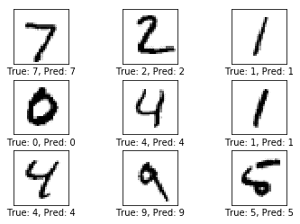

图 9.13:测试的准确度

```py
Confusion Matrix:
[[ 971    0    2    2    0    4    0    1    0    0]
 [   0 1110    4    2    1    2    3    0   13    0]
 [  12    2  949   15   16    3    4   17   14    0]
 [   5    3   14  932    0   34    0   13    6    3]
 [   1    2    3    0  931    1    8    2    3   31]
 [  12    1    4   13    3  852    2    1    3    1]
 [  21    4    5    2   18   34  871    1    2    0]
 [   1   10   26    5    5    0    0  943    2   36]
 [  16    5   10   27   16   48    5   13  815   19]
 [  12    5    5   11   38   10    0   18    3  907]]
```

以下是输出:

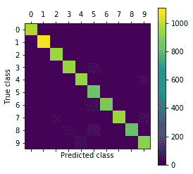

图 9.14:测试集的混淆矩阵。

有趣的是，在使用基本卷积网络的测试中，我们实际上获得了几乎 93%的准确率。这个实现和结果向您展示了一个简单的卷积网络可以做什么。


# 摘要

在这一章中，我们已经讨论了 CNN 工作的直觉和技术细节。我们还了解了如何在 TensorFlow 中实现 CNN 的基本架构。

在下一章中，我们将演示更高级的架构，这些架构可用于检测数据科学家广泛使用的图像数据集中的对象。我们还将看到细胞神经网络的美妙之处，以及它们如何模仿人类对目标的理解，首先认识到目标的基本特征，然后在其上建立更高级的语义特征，从而为它们提出分类。虽然这个过程在我们的头脑中发生得非常快，但这是我们识别目标时实际发生的事情。