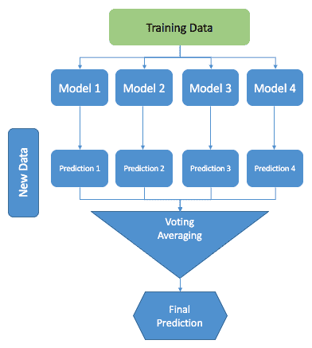
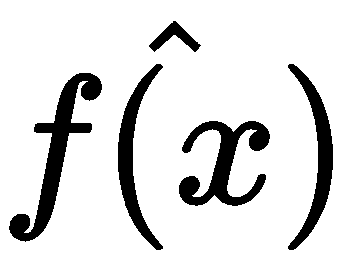

# 二、集成机器学习入门

在本章中，我们将介绍以下食谱:

*   最大投票
*   求平均值
*   加权平均


# 集成机器学习简介

简单来说，集成机器学习指的是一种集成多个学习者的输出并应用于数据集进行预测的技术。这些多重学习者通常被称为基础学习者。当使用多个基本模型来提取组合成单个预测的预测时，该预测可能比单个基本学习者提供更好的准确性。

众所周知，集合模型在性能方面优于单个模型。它们可以应用于回归和分类问题。你可以决定用同一家族的算法构建集成模型，也可以选择从不同家族中挑选。如果仅使用神经网络在同一数据集上构建多个模型，那么该集成将被称为**同构集成模型**。如果使用不同的算法构建多个模型，例如**支持向量机** ( **支持向量机**)、神经网络和随机森林，那么集成模型将被称为**异构集成模型**。

集合模型的构建需要两个步骤:

1.  基础学习者是根据训练数据设计并适合的学习者
2.  通过使用特定的集成技术，例如最大投票、平均和加权平均，基本学习器被组合以形成单个预测模型

下图显示了集合模型的结构:



然而，为了获得表现良好的集成模型，基础学习者本身应该尽可能准确。衡量模型性能的一种常用方法是评估其泛化误差。概化误差是一个术语，用于衡量模型基于尚未见过的新数据集进行预测的准确度。

为了表现良好，集合模型需要足够数量的数据。事实证明，当您拥有大型非线性数据集时，集成技术会更加有用。

如果包含太多的模型，集合模型可能会过拟合，尽管这并不常见。

不管你对你的模型调整得多好，总有高偏差或高方差的风险。如果在训练模型时没有考虑偏差和方差，即使是最好的模型也可能失败。偏差和方差都代表预测中的一种误差。事实上，总误差由偏置相关误差、方差相关误差和不可避免的噪声相关误差(或不可约误差)组成。与噪声相关的误差主要是由于训练数据中的噪声，并且不能被去除。然而，由偏差和方差引起的误差可以减少。

总误差可表示如下:

```py
Total Error = Bias ^ 2 + Variance + Irreducible Error
```

诸如**均方误差** ( **MSE** )之类的度量捕获了连续目标变量的所有这些误差，并且可以表示如下:


在该公式中， *E* 代表预期平均值， *Y* 代表实际目标值，是目标变量的预测值。它可以分解为偏差、方差和噪声等分量，如下式所示:


偏差指的是基本事实与我们估计的期望值有多接近，而方差则衡量的是与预期估计值的偏差。具有小 MSE 的估计量是所希望的。为了最小化 MSE 误差，我们希望以地面真实值为中心(0-偏差),并与地面真实值(正确值)有一个低偏差(低方差)。换句话说，我们希望对我们的估计值有信心(低方差、低不确定性、更多峰值分布)。高偏差会降低算法在训练数据集上的性能，并导致欠拟合。另一方面，高方差的特征是低训练误差和高验证误差。高方差会降低学习者在看不见的数据上的表现，导致过度拟合。

集成模型可以减少模型中的偏差和/或方差。


# 最大投票

最大投票通常用于分类问题，是组合来自多个机器学习算法的预测的最简单方法之一。

在最大投票中，每个基本模型对每个样本进行预测和投票。只有具有最高投票的样本类被包括在最终的预测类中。

例如，假设我们有一个在线调查，消费者在五级李克特量表中回答一个问题。我们可以假设少数消费者会提供 5 分的评分，而其他人会提供 4 分的评分，以此类推。如果大多数人，比如说超过 50%的消费者，给出的评级是 4，那么最终的评级就是 4。在本例中，将最终评级定为 4 类似于将所有评级定为一个模式。


# 做好准备

在以下步骤中，我们将下载以下软件包:

首先，导入`os`和`pandas`包，根据需要设置工作目录:

```py
# import required packages
import os
import pandas as pd

# Set working directory as per your need
os.chdir(".../.../Chapter 2")
os.getcwd()
```

从 GitHub 下载`Cryotherapy.csv`数据集并复制到你的工作目录。读取数据集:

```py
df_cryotherapydata = pd.read_csv("Cryotherapy.csv")
```

用下面的代码看一下数据:

```py
df_cryotherapydata.head(5)
```

我们可以看到数据已经被正确读取，并且有了`Result_of_Treatment`类变量。然后，我们继续创建以`Result_of_Treatment`为响应变量的模型。


# 怎么做...

您可以使用 Python 的`scikit-learn`库中的`VotingClassifier`类为分类问题创建投票集成模型。以下步骤展示了如何针对分类问题组合决策树、SVM 和逻辑回归模型的预测的示例:

1.  导入构建决策树、SVM 和逻辑回归模型所需的库。我们还为最大投票导入了`VotingClassifier`:

```py
# Import required libraries
from sklearn.tree import DecisionTreeClassifier
from sklearn.svm import SVC
from sklearn.linear_model import LogisticRegression
from sklearn.ensemble import VotingClassifier
```

2.  然后，我们继续构建我们的功能集，并创建我们的训练和测试数据集:

```py
# We create train & test sample from our dataset
from sklearn.cross_validation import train_test_split

# create feature & response sets
feature_columns = ['sex', 'age', 'Time', 'Number_of_Warts', 'Type', 'Area']
X = df_cryotherapydata[feature_columns]
Y = df_cryotherapydata['Result_of_Treatment']

# Create train & test sets
X_train, X_test, Y_train, Y_test = \
train_test_split(X, Y, test_size=0.20, random_state=1)
```

3.  我们使用决策树、SVM 和逻辑回归算法来构建模型:

```py
# create the sub models
estimators = []

dt_model = DecisionTreeClassifier(random_state=1)
estimators.append(('DecisionTree', dt_model))

svm_model = SVC(random_state=1)
estimators.append(('SupportVector', svm_model))

logit_model = LogisticRegression(random_state=1)
estimators.append(('Logistic Regression', logit_model))
```

4.  我们用我们选择的每个分类器构建单独的模型:

```py
from sklearn.metrics import accuracy_score

for each_estimator in (dt_model, svm_model, logit_model):
    each_estimator.fit(X_train, Y_train)
    Y_pred = each_estimator.predict(X_test)
    print(each_estimator.__class__.__name__, accuracy_score(Y_test, Y_pred))
```

然后，我们可以看到每个基础学习者的准确度分数:


5.  我们继续集成我们的模型，并使用`VotingClassifier`对集成模型的准确性进行评分:

```py
#Using VotingClassifier() to build ensemble model with Hard Voting
ensemble_model = VotingClassifier(estimators=estimators, voting='hard')

ensemble_model.fit(X_train,Y_train)
predicted_labels = ensemble_model.predict(X_test) 

print("Classifier Accuracy using Hard Voting: ", accuracy_score(Y_test, predicted_labels))
```

我们可以使用`Hard Voting`查看集合模型的准确度分数:


# 它是如何工作的...

`VotingClassifier`实现两种类型的投票— **硬**和**软**投票。在硬投票中，最终类别标签被预测为分类模型预测最频繁的类别标签。换句话说，来自所有分类器的预测被聚合以预测获得最多投票的类。简单地说，它采用了预测类标签的模式。

在类别标签的硬投票中，是基于每个分类器的多数投票的预测，其中 *i=1.....n* 观察，我们有以下几点:


如前一节所示，我们有三个模型，一个来自决策树，一个来自支持向量机，一个来自逻辑回归。假设模型将训练观察分别分类为类 1、类 0 和类 1。然后通过多数表决，我们得到以下结果:


在这种情况下，我们会将观察分类为 1 类。

在前面的部分中，在*步骤 1* 中，我们导入了构建模型所需的库。在*步骤 2* 中，我们创建了我们的特性集。我们还分割数据来创建训练和测试样本。在*步骤 3* 中，我们分别用决策树、支持向量机和逻辑回归训练了三个模型。在*步骤 4* 中，我们查看每个基础学习者的准确度分数，而在*步骤 5* 中，我们使用`VotingClassifier()`对模型进行集合，并查看集合模型的准确度分数。


# 还有更多...

许多分类器可以估计类别概率。在这种情况下，通过对类概率进行平均来预测类标签。这被称为**软投票**，被推荐用于一个良好调整的分类器集合。

在`scikit-learn`库中，许多分类算法都有`predict_proba()`方法来预测类别概率。要执行软投票合奏，只需将`VotingClassifier()`中的`voting='hard'`替换为`voting='soft'`。

以下代码使用软投票创建了一个系综:

```py
# create the sub models
estimators = []

dt_model = DecisionTreeClassifier(random_state=1)
estimators.append(('DecisionTree', dt_model))

svm_model = SVC(random_state=1, probability=True)
estimators.append(('SupportVector', svm_model))

logit_model = LogisticRegression(random_state=1)
estimators.append(('Logistic Regression', logit_model))

for each_estimator in (dt_model, svm_model, logit_model):
    each_estimator.fit(X_train, Y_train)
    Y_pred = each_estimator.predict(X_test)
    print(each_estimator.__class__.__name__, accuracy_score(Y_test, Y_pred))

# Using VotingClassifier() to build ensemble model with Soft Voting
ensemble_model = VotingClassifier(estimators=estimators, voting='soft')
ensemble_model.fit(X_train,Y_train)
predicted_labels = ensemble_model.predict(X_test) 
print("Classifier Accuracy using Soft Voting: ", accuracy_score(Y_test, predicted_labels))
```

使用软投票，我们可以看到单个学习者和集成学习者的准确性:


默认情况下,`SVC`类不能估计类概率，所以我们在前面的代码中将其概率超参数设置为`True`。使用`probability=True`，`SVC`将能够估计类别概率。


# 求平均值

平均通常用于回归问题，或者在分类任务中估计概率时使用。从多个模型中提取预测，并使用预测的平均值进行最终预测。


# 做好准备

让我们准备好构建多个学习者，并看看如何实现平均化:

从 GitHub 下载`whitewines.csv`数据集，复制到你的工作目录，我们来读取数据集:

```py
df_winedata = pd.read_csv("whitewines.csv")
```

让我们用下面的代码来看看数据:

```py
df_winedata.head(5)
```

在下面的截图中，我们可以看到数据已被正确读取:


# 怎么做...

我们有一个基于葡萄酒属性的数据集。使用这个数据集，我们将建立以质量为响应变量的多元回归模型。对于多个学习者，我们提取多个预测。平均技术将取每个训练样本的所有预测值的平均值:

1.  导入所需的库:

```py
# Import required libraries
from sklearn.linear_model import LinearRegression
from sklearn.tree import DecisionTreeRegressor
from sklearn.svm import SVR
```

2.  创建响应和功能集:

```py
# Create feature and response variable set
from sklearn.cross_validation import train_test_split

# create feature & response variables
feature_columns = ['fixed acidity', 'volatile acidity', 'citric acid', 'residual sugar','chlorides', 'free sulfur dioxide', 'total sulfur dioxide','density', 'pH', 'sulphates', 'alcohol']
X = df_winedata[feature_columns]
Y = df_winedata['quality']
```

3.  将数据分为训练集和测试集:

```py
# Create train & test sets
X_train, X_test, Y_train, Y_test = \
train_test_split(X, Y, test_size=0.20, random_state=1)
```

4.  使用线性回归、`SVR`和决策树构建基本回归学习器:

```py
# Build base learners
linreg_model = LinearRegression()
svr_model = SVR()
regressiontree_model = DecisionTreeRegressor()

# Fitting the model
linreg_model.fit(X_train, Y_train)
svr_model.fit(X_train, Y_train)
regressiontree_model.fit(X_train, Y_train)
```

5.  使用基础学习者根据测试数据进行预测:

```py
linreg_predictions = linreg_model.predict(X_test)
svr_predictions = svr_model.predict(X_test)
regtree_predictions = regressiontree_model.predict(X_test)
```

6.  将预测相加，然后除以基础学习者的数量:

```py
# We divide the summation of the predictions by 3 i.e. number of base learners 
average_predictions=(linreg_predictions + svr_predictions + regtree_predictions)/3
```


# 它是如何工作的...

在*步骤 1* 中，我们导入了所需的包。在*步骤 2* 中，我们从数据集中分离出特征集和响应变量。在*步骤 3* 中，我们将数据集分成训练和测试样本。

请注意，我们的响应变量本质上是连续的。出于这个原因，我们在*步骤 4* 中使用线性回归、`SVR`和决策树构建了我们的回归基础学习器。在*步骤 5* 中，我们将测试数据集传递给`predict()`函数来预测我们的响应变量。最后，在*步骤 6* 中，我们将所有的预测加在一起，并根据基础学习者的数量对它们进行划分，在我们的例子中是三个。


# 加权平均

像平均一样，加权平均也用于回归任务。或者，在分类问题中估计概率时可以使用它。基础学习者被分配不同的权重，这些权重代表每个模型在预测中的重要性。

一个加权平均模型至少应该和你最好的模型一样好。


# 做好准备

从 GitHub 下载`wisc_bc_data.csv`数据集，并将其复制到您的工作目录。让我们来读一下数据集:

```py
df_cancerdata = pd.read_csv("wisc_bc_data.csv")
```

用下面的代码看一下数据:

```py
df_cancerdata.head(5)
```

我们可以看到数据已被正确读取:


# 怎么做...

这里，我们有一个基于癌症肿瘤特性的数据集。使用这个数据集，我们将使用`diagnosis`作为我们的响应变量来构建多个分类模型。诊断变量具有值`B`和`M`，指示肿瘤是良性还是恶性。对于多个学习者，我们提取多个预测。加权平均技术取每个训练样本的所有预测值的平均值。

在本例中，我们将预测概率视为输出，并使用 scikit-learn 算法的`predict_proba()`函数来预测类别概率:

1.  导入所需的库:

```py
# Import required libraries
from sklearn.tree import DecisionTreeClassifier
from sklearn.svm import SVC
from sklearn.linear_model import LogisticRegression
```

2.  创建响应和功能集:

```py
# Create feature and response variable set
# We create train & test sample from our dataset
from sklearn.cross_validation import train_test_split

# create feature & response variables
X = df_cancerdata.iloc[:,2:32]
Y = df_cancerdata['diagnosis']
```

我们使用`pandas`数据框架的`iloc()`函数检索特性列，这是一个纯粹基于整数位置的索引，用于按位置选择。`iloc()`函数以行列选择为参数，形式:`data.iloc(<row selection>, <column selection>)`。行和列选择可以是整数列表，也可以是行和列的切片。例如，它可能如下所示:`df_cancerdata.iloc(2:100, 2:30)`。

3.  然后，我们将数据分成训练集和测试集:

```py
# Create train & test sets
X_train, X_test, Y_train, Y_test = \
train_test_split(X, Y, test_size=0.20, random_state=1)
```

4.  构建基本分类器模型:

```py
# create the sub models
estimators = []

dt_model = DecisionTreeClassifier()
estimators.append(('DecisionTree', dt_model))

svm_model = SVC(probability=True)
estimators.append(('SupportVector', svm_model))

logit_model = LogisticRegression()
estimators.append(('Logistic Regression', logit_model))
```

5.  根据测试数据拟合模型:

```py
dt_model.fit(X_train, Y_train)
svm_model.fit(X_train, Y_train)
logit_model.fit(X_train, Y_train)
```

6.  使用`predict_proba()`函数预测类别概率:

```py
dt_predictions = dt_model.predict_proba(X_test)
svm_predictions = svm_model.predict_proba(X_test)
logit_predictions = logit_model.predict_proba(X_test)
```

7.  为每个模型分配不同的权重，以获得我们的最终预测:

```py
weighted_average_predictions=(dt_predictions * 0.3 + svm_predictions * 0.4 + logit_predictions * 0.3)
```


# 它是如何工作的...

在*步骤* *1* 中，我们导入了构建模型所需的库。在*步骤 2* 中，我们创建了响应和特性集。我们使用`pandas`数据帧的`iloc()`函数检索我们的特征集。在*步骤 3* 中，我们将数据集分为训练集和测试集。在*步骤 4* 中，我们构建了我们的基本分类器。请注意，我们将`probability=True`传递给了我们的`SVC`函数，以允许`SVC()`返回类别概率。在`SVC`类中，默认为`probability=False`。

在*步骤 5* 中，我们将模型与训练数据相匹配。我们在*步骤 6* 中使用了`predict_proba()`函数来预测我们测试观察的分类概率。

最后，在*步骤 7* 中，我们为每个模型分配了不同的权重，以估计加权平均预测值。出现的问题是如何选择权重。一种方法是对重量进行统一采样，确保它们归一化为一，并在测试集上验证，重复跟踪提供最高准确度的重量。这是一个随机搜索的例子。


# 请参见

以下是 scikit 参考链接:

*   集合方法的 Scikit 指南[(https://bit.ly/2oVNogs)](https://bit.ly/2oVNogs)
*   Scikit 指南`VotingClassifier`[(https://bit.ly/2oW0avo)](https://bit.ly/2oW0avo)