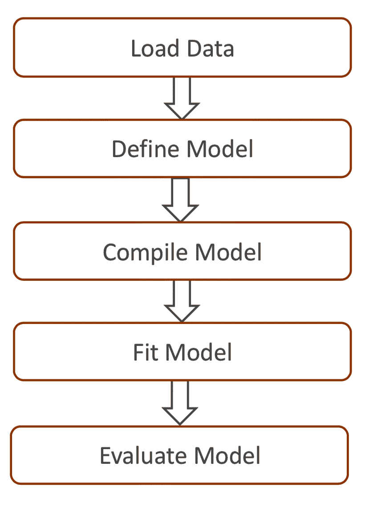
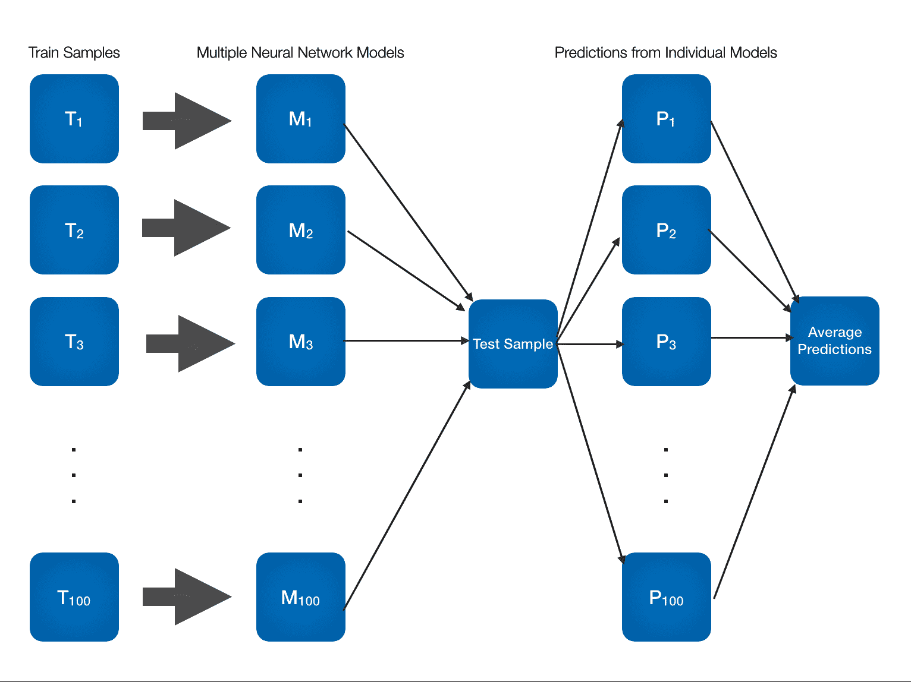
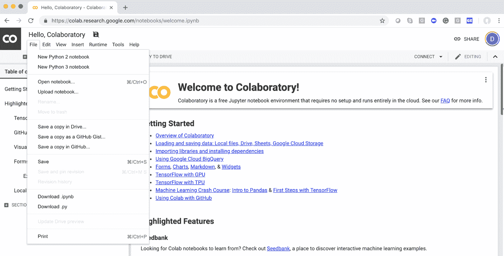
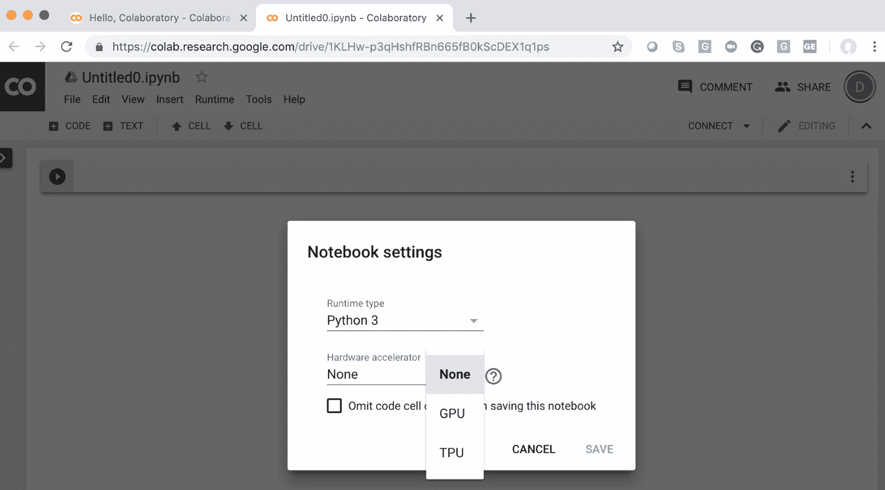

# 九、使用 Keras 的同构系综

在本章中，我们将讨论以下主题:

*   能量预测的均匀模式集合
*   用于手写数字分类的同构模型集成


# 介绍

在集成模型的情况下，每个基本分类器本身必须具有一定程度的多样性。这种多样性可以通过以下方式之一获得:

*   通过各种重采样方法或训练数据的随机化来使用训练数据的不同子集
*   通过对不同的基础学习者使用不同的学习超参数
*   通过使用不同的学习算法

在集成模型的情况下，不同的算法用于基础学习器，集成被称为**异构集成方法**。如果对训练集的不同分布的所有基本学习者使用相同的算法，则该集成被称为**同构集成**。


# 能量预测的均匀模式集合

在下面的例子中，我们将使用 Keras API。Keras 是一个用于构建深度神经网络的开源高级框架。它写在 TensorFlow 或 Theano 之上，并在幕后使用它们进行计算。Keras 既可以在 CPU 上运行，也可以在 GPU 上运行。Keras 的默认设置旨在大多数情况下提供良好的结果。

Keras 的重点是模型的概念。Keras 支持两种类型的模型。模型的主要类型是一系列层，称为**顺序**。Keras 中的另一类模型是非顺序模型，称为**模型**。

要构建顺序模型，请执行以下步骤:

1.  使用`Sequential()`实例化顺序模型
2.  使用`Dense`类一个接一个地添加图层
3.  使用以下内容编译模型:
    *   强制损失函数
    *   强制优化器
    *   可选评估参数
4.  使用数据来拟合模型
5.  评估模型

以下是前面步骤的流程图:



在下面的代码块中，我们可以看到一个简短的代码示例:

```py
# Instantiate a sequential model
seqmodel = Sequential()

# Add layers using the Dense class
seqmodel.add(Dense8, activation='relu')

# Compile the model
seqmodel.compile(loss='binary_crossentropy, optimizer='adam', metric=['accuracy'])

# Fit the model
seqmodel.fit(X_train, Y_train, batch_size=10)
```


# 做好准备

我们将从安装 Keras 开始。为了安装 Keras，您需要在系统中安装 Theano 或 TensorFlow。在这个例子中，我们将使用 TensorFlow 作为 Keras 的后端。

TensorFlow 有两个版本:CPU 版本和 GPU 版本。

要安装当前的纯 CPU 版本，请使用以下命令:

```py
pip install tensorflow
```

如果您必须安装 GPU 包，请使用以下命令:

```py
pip install tensorflow-gpu
```

安装 TensorFlow 后，您需要使用以下命令安装 Keras:

```py
sudo pip install keras
```

为了升级已经安装的 Keras 库，请使用以下命令:

```py
sudo pip install --upgrade keras
```

安装完库后，让我们导入所需的库:

```py
import os
import pandas as pd
import numpy as np
from sklearn.model_selection import train_test_split

from sklearn.metrics import mean_squared_error

from keras.models import Sequential
from keras.layers import Dense
```

我们根据自己的需求设置工作目录:

```py
os.chdir("..../Chapter 9")
os.getcwd()
```

我们阅读了我们的`energydata.csv`数据集:

```py
df_energydata = pd.read_csv("energydata.csv")
```

我们检查数据集中是否有空值:

```py
df_energydata.isnull().sum() 
```


# 怎么做...

我们现在将构建我们的`test`子集，并训练我们的神经网络模型:

1.  分离`test`子集以应用模型，从而进行预测:

```py
df_traindata, df_testdata = train_test_split(df_energydata, test_size=0.3)
```

2.  检查`train `和`test`子集的形状:

```py
print(df_traindata.shape)
print(df_testdata.shape)
```

3.  取`test`子集并将其分成目标和特征变量:

```py
X_test = df_testdata.iloc[:,3:27] 
Y_test = df_testdata.iloc[:,28] 
```

4.  通过检查`X_test`和`Y_test`的形状来验证之前的分割:

```py
print(X_test.shape)
print(Y_test.shape)
```

5.  让我们使用 Keras 创建多个神经网络模型。我们使用`For...Loop`来构建多个模型:

```py
ensemble = 20
frac = 0.7

predictions_total = np.zeros(5921, dtype=float)

for i in range(ensemble):
    print("number of iteration:", i)
    print("predictions_total", predictions_total)

    # Sample randomly the train data
    Traindata = df_traindata.sample(frac=frac)
    X_train = Traindata.iloc[:,3:27] 
    Y_train = Traindata.iloc[:,28] 

    ############################################################

    model = Sequential()
    # Adding the input layer and the first hidden layer
    model.add(Dense(units=16, kernel_initializer = 'normal', activation = 'relu', input_dim = 24))

    # Adding the second hidden layer
    model.add(Dense(units = 24, kernel_initializer = 'normal', activation = 'relu'))

    # Adding the third hidden layer
    model.add(Dense(units = 32, kernel_initializer = 'normal', activation = 'relu'))

    # Adding the output layer
    model.add(Dense(units = 1, kernel_initializer = 'normal', activation = 'relu'))

    # Compiling the ANN
    adam = optimizers.Adam(lr=0.001, beta_1=0.9, beta_2=0.9, epsilon=None, decay=0.0)
    model.compile(loss='mse', optimizer=adam, metrics=['mean_squared_error'])
    # Fitting the ANN to the Training set

    model.fit(X_train, Y_train, batch_size = 16, epochs = 25)

    ############################################################

    # We use predict() to predict our values
    model_predictions = model.predict(X_test)

    model_predictions = model_predictions.flatten()
    print("TEST MSE for individual model: ", mean_squared_error(Y_test, model_predictions))
    print("")
    print(model_predictions)
    print("")

predictions_total = np.add(predictions_total, model_predictions)
```

6.  取预测值之和，除以迭代次数，得到平均预测值。我们使用平均预测值来计算集合的**均方误差** ( **MSE** ):

```py
predictions_total = predictions_total/ensemble
print("MSE after ensemble: ", mean_squared_error(np.array(Y_test), predictions_total))
```


# 它是如何工作的...

以下是整体同构模型工作流程的图示:



在上图中，我们假设有 100 个训练样本。我们在 100 个训练样本上训练 100 个模型，并将它们应用于我们的测试样本。我们得到了 100 组预测，无论目标变量是数值变量还是我们正在计算分类问题的概率，我们都通过平均来集合这些预测。在类预测的情况下，我们会选择最大投票。

在*步骤 1* 中，我们分离了我们的训练样本和测试样本。这是我们在这个食谱中建立的所有模型中用于预测的同一个测试样本。在*步骤 2* 中，我们检查了`train`和`test`子集的形状。在*步骤 3* 中，我们将测试子集分成目标变量和预测变量，然后在*步骤 4* 中再次检查形状，以确保我们得到正确的分割。

在*步骤 5* 中，我们使用 Keras 库来构建我们的神经网络模型。我们初始化两个变量，`ensemble`和`frac`。我们使用了`ensemble`变量来运行一个`for`循环，重复一定次数(在我们的例子中，我们将其设置为`200`)。然后，我们使用`frac`变量来分配我们从训练子集中抽取的引导样本的数据比例。在我们的例子中，我们将`frac`设置为`0.8`。

在*步骤 5* 中，在`for...loop`迭代中，我们构建了多个神经网络模型，并将这些模型应用于我们的测试子集以获得预测。我们通过使用`add()`方法传递一系列层来创建顺序模型。在第一层中，我们使用`input_dim`参数指定输入维度。因为我们有 24 个输入维度，所以我们将`input_dim`设置为`24`。我们还提到了通过设置`Activation`参数在每个层中使用的`Activation`函数。

您也可以通过`Activation`层设置`Activation`功能，如下所示:

```py
# Example code to set activation function through the activation layer

from keras.layers import Activation, Dense 

model.add(Dense(64)) 
model.add(Activation('tanh'))
```

在这一步中，在我们构建模型之前，我们使用`compile`方法配置学习过程。`compile`方法以强制`loss function`、强制`optimizer`和可选`metrics`作为参数。

`optimizer`参数可以取值为**随机梯度下降** ( **SGD** )、`RMSprop`、`Adagrad`、`Adadelta`、`Adam`、`Adamax`或`Nadam`。

`loss function`可以取值为`mean_squared_error`、`mean_absolute_error`、`mean_absolute_percentage_error`、`mean_squared_logarithmic_error`、`squared_hinge`、`categorical_hinge`或`binary_crossentropy`。更多详情请见 https://keras.io/losses/。

我们还使用`np.add()`方法将预测数组添加到一个名为`predictions_total`的数组变量中。

一旦我们在*步骤 5* 中完成了`for`循环中的所有迭代，我们将预测的总和除以迭代次数，迭代次数保存在`ensemble`变量中并设置为`200`，以获得平均预测。我们使用平均预测来计算集合结果的 MSE。

还有更多...


# 如果对计算要求高，可以使用 Google Colaboratory。Colaboratory 是一个免费的 Jupyter 笔记本环境，不需要设置，完全在云中运行。是支持免费 GPU 的免费云服务。您可以使用 Google Colab 来构建使用 TensorFlow、Keras、PyTorch 和 OpenCV 的深度学习应用程序。

一旦你用[https://colab.research.google.com/](https://colab.research.google.com/)创建了你的账户，你就可以用你的凭证登录了。

登录后，您可以直接进入`File`菜单创建您的 Python 笔记本:



一旦你点击文件标签，你会看到新的 Python 3 笔记本；创建了一个支持 Python 3 的新笔记本。

您可以单击左上角的 Untitled0.ipynb 来重命名该文件:


转到编辑，然后转到笔记本设置。将弹出一个窗口，指示您可以拥有的不同设置:



选择**图形处理器** ( **GPU** )选项作为硬件加速器，如前面截图所示，以便使用免费的 GPU。

Google Colab 的一个优点是它可以在你自己的 Google Drive 上运行。您可以选择在 Google Drive 中创建自己的文件夹，或者使用默认的 Colab 笔记本文件夹。为了使用默认的 Google Colab 笔记本文件夹，请按照以下屏幕截图中所示的步骤操作:


要开始读取数据集，您可以将它们存储在 Google Drive 的文件夹中。

在您登录到 Google Colab 并创建了一个新的笔记本后，您必须通过在笔记本中执行以下代码来安装驱动器:

运行上述代码时，它会要求输入授权代码，如下所示:

```py
from google.colab import drive

# This can be your folder path as per your drive
drive.mount('/content/drive')
```


单击前面的 URL 获取授权码:


将授权码粘贴到文本框中。每次你都会得到不同的授权码。授权后，驱动器被装载。

一旦安装了驱动器，就可以使用`pandas`读取`.csv`文件，正如我们在本章前面所展示的。如*如何做*部分所示，其余代码按原样运行。如果你使用 GPU，你会注意到计算性能的速度有了实质性的提高。

为了在 Google Colab 中安装额外的库，你需要运行带有！在它前面签名。例如，您可以运行`!pip install utils`在 Google Colab 实例中安装 utils。

请参见


# 有多种激活功能可用于 Keras 库:

Softmax 激活功能

*   指数线性单位
*   标度指数线性单位
*   Softplus 激活功能
*   整流线性单元
*   双曲正切激活函数
*   Sigmoid 激活函数
*   线性激活函数
*   指数激活函数
*   Exponential activation function

有关前述激活功能的更多信息，请访问[https://keras.io/activations/](https://keras.io/activations/)。

用于手写数字分类的同构模型集成


# 在本例中，我们将使用一个名为**街景门牌号** ( **SVHN** )的数据集，该数据集来自【http://ufldl.stanford.edu/housenumbers/】的。GitHub 也以`.hd5f`格式提供数据集。

该数据集是真实世界的数据集，从谷歌街景图像中的门牌号获得。

我们使用 Google Colab 来训练我们的模型。在第一阶段，我们使用 Keras 建立一个单一的模型。在第二阶段，我们集成多个同构模型并集成结果。

做好准备


# 该数据集包含 60，000 个门牌号图像。每张图片的标号在 1 到 10 之间。数字 1 标记为 1，数字 9 标记为 9，数字 0 标记为 10。这些图像是以单个字符为中心的 32 x 32 的图像。在某些情况下，我们可以看到图像在视觉上模糊不清。

我们导入所需的库:

我们安装谷歌硬盘:

```py
import os
import matplotlib.pyplot as plt
import numpy as np
from numpy import array

from sklearn.metrics import accuracy_score

from keras.models import Sequential, load_model
from keras.layers.core import Dense, Dropout, Activation

```

现在，我们导入一个名为`h5py`的库来读取 HDF5 格式文件和我们的数据文件，这个文件名为`SVHN_single_grey.h5`:

```py
from google.colab import drive
drive.mount('/content/drive')
```

我们加载训练和测试子集并关闭文件:

```py
import h5py

# Open the file as readonly
h5f = h5py.File('/content/drive/My Drive/DLCP/SVHN_single_grey.h5', 'r')
```

我们重塑我们的训练和测试子集。我们还将数据类型改为 float:

```py
# Load the training and test set
x_train = h5f['X_train'][:]
y_train = h5f['y_train'][:]
x_test = h5f['X_test'][:]
y_test = h5f['y_test'][:]

# Close this file
h5f.close()
```

我们现在通过将数据除以 255.0 来标准化数据。这也将值的数据类型转换为浮点型:

```py
x_train = x_train.reshape(x_train.shape[0], 1024)
x_test = x_test.reshape(x_test.shape[0], 1024)
```

我们检查训练和测试子集的形状:

```py
# normalize inputs from 0-255 to 0-1
x_train = x_train / 255.0
x_test = x_test / 255.0
```

我们看到`train`和`test`特征的形状以及我们的目标子集如下:

```py
print("X_train shape", x_train.shape)
print("y_train shape", y_train.shape)
print("X_test shape", x_test.shape)
print("y_test shape", y_test.shape)
```


我们想象一些图像。我们还在图像上打印标签:

前 10 幅图像如下所示:

```py
# Visualizing the 1st 10 images in our dataset
# along with the labels
%matplotlib inline
import matplotlib.pyplot as plt
plt.figure(figsize=(10, 1))
for i in range(10):
 plt.subplot(1, 10, i+1)
 plt.imshow(x_train[i].reshape(32,32), cmap="gray")
 plt.title(y_train[i], color='r')
 plt.axis("off")
plt.show()
```


我们现在对目标变量执行一键编码。我们还将我们的`y_test`标签存储在另一个名为`y_test_actuals`的变量中，以备后用:

一键编码前后的形状如下:

```py
# Let us store the original y_test to another variable y_test_actuals
y_test_actuals = y_test

# one-hot encoding using keras' numpy-related utilities
n_classes = 10

print("Before one-hot encoding:")
print("Shape of Y_TRAIN before one-hot encoding: ", y_train.shape)
print("Shape of Y_TEST before one-hot encoding: ", y_test.shape)

y_train = np_utils.to_categorical(y_train, n_classes)
y_test = np_utils.to_categorical(y_test, n_classes)

print("After one-hot encoding:")
print("Shape of Y_TRAIN after one-hot encoding: ", y_train.shape)
print("Shape of Y_TRAIN after one-hot encoding: ", y_test.shape)
```


怎么做...


# 我们现在将使用 Keras 库构建一个模型:

使用顺序模型构建线性层堆栈:

1.  编译模型:

```py
# building a linear stack of layers with the sequential model
model = Sequential()
model.add(Dense(512, input_shape=(1024,)))
model.add(Activation('relu')) 

model.add(Dense(512))
model.add(Activation('relu'))

model.add(Dense(10))
model.add(Activation('softmax'))
```

2.  将模型拟合到`train`数据，并用`test`数据进行验证:

```py
# compiling the sequential model
model.compile(loss='categorical_crossentropy', metrics=['accuracy'], optimizer='adam')
```

3.  绘制每个时期的模型精度:

```py
# training the model and saving metrics in history
svhn_model = model.fit(x_train, y_train,
          batch_size=128, epochs=100,
          verbose=2,
          validation_data=(x_test, y_test))
```

4.  我们看到下面的模型精度图:

```py
# plotting the metrics
fig = plt.figure(figsize=(12,4))

#plt.subplot(2,1,1)
plt.plot(svhn_model.history['acc'])
plt.plot(svhn_model.history['val_acc'])
plt.title('Model Accuracy')
plt.ylabel('Accuracy')
plt.xlabel('Epochs')
plt.legend(['Train', 'Test'], loc='uppper left')

plt.tight_layout()
```


绘制每个时期的损失:

5.  我们看到下面的模型损耗图:

```py
# plotting the metrics
fig = plt.figure(figsize=(12,4))

plt.plot(svhn_model.history['loss'])
plt.plot(svhn_model.history['val_loss'])
plt.title('Model Loss')
plt.ylabel('Loss')
plt.xlabel('Epochs')
plt.legend(['Train', 'Test'], loc='upper right')

plt.tight_layout()
```


重复使用 scikit-learn 网站上的代码来绘制混淆矩阵:

6.  用数字和图形绘制混淆矩阵:

```py
# code from http://scikit-learn.org
def plot_confusion_matrix(cm, classes,
normalize=False,
title='Confusion matrix',
cmap=plt.cm.Blues):
"""
This function prints and plots the confusion matrix.
"""
plt.imshow(cm, cmap=cmap)
plt.title(title)
plt.colorbar()
tick_marks = np.arange(len(classes))
plt.xticks(tick_marks, classes, rotation=45)
plt.yticks(tick_marks, classes)

thresh = cm.max() / 2.
for i, j in itertools.product(range(cm.shape[0]), range(cm.shape[1])):
plt.text(j, i, cm[i, j],
horizontalalignment="center",
color="white" if cm[i, j] > thresh else "black")

plt.ylabel('Actuals')
plt.xlabel('Predicted')
```

7.  混淆矩阵如下所示:

```py
target_names = [ '0', '1', '2', '3', '4', '5', '6', '7', '8', '9']

# Formulating the Confusion Matrix
import itertools
from sklearn.metrics import confusion_matrix

cm = confusion_matrix(y_test_actuals, predicted_classes)
print(cm)

plt.figure(figsize=(10,10))
plot_confusion_matrix(cm, classes=target_names, normalize=False)
plt.show()
```


我们现在来看看如何集成多个同构模型的结果。定义一个函数以使模型符合训练数据:

8.  编写一个函数来集合所有模型的预测:

```py
# fit model on dataset
def train_models(x_train, y_train):
  # building a linear stack of layers with the sequential model
  model = Sequential()
  model.add(Dense(512, input_shape=(1024,)))
  model.add(Activation('relu')) 
  model.add(Dropout(0.2))

  model.add(Dense(512))
  model.add(Activation('relu'))
  model.add(Dropout(0.2))

  model.add(Dense(10))
  model.add(Activation('softmax'))

  # compiling the sequential model
  model.compile(loss='categorical_crossentropy', optimizer='adam', metrics=['accuracy'])

  # training the model and saving metrics in history
  svhn_model = model.fit(x_train, y_train, batch_size=32, epochs=25)

  return model
```

9.  Write a function to ensemble the predictions of all the models:

```py
# make an ensemble prediction for multi-class classification
def ensemble_predictions(models, x_test):
  # make predictions
  y_predicted = [model.predict(x_test) for model in models]
  y_predicted = np.array(y_predicted)

  # sum predictions from all ensemble models
  predicted_total = np.sum(y_predicted, axis=0)

  # argmax across classes
  result = np.argmax(predicted_total, axis=1)

  return result
```

`numpy.argmax`returns indices of the max element of the array in a particular axis.

编写一个函数来评估模型，并获得每个模型的准确性分数:

10.  适合所有型号:

```py
# evaluate a specific number of members in an ensemble
def evaluate_models(models, no_of_models, x_test, y_test):
 # select a subset of members
 subset = models[:no_of_models]

 # make prediction
 y_predicted_ensemble = ensemble_predictions(subset, x_test)

 # calculate accuracy
 return accuracy_score(y_test_actuals, y_predicted_ensemble)
```

11.  绘制每个历元的准确度分数:

```py
# fit all models
no_of_models = 50

models = [train_models(x_train, y_train) for _ in range(no_of_models)]

# evaluate different numbers of ensembles
all_scores = list()
for i in range(1, no_of_models+1):
  score = evaluate_models(models, i, x_test, y_test)
  print("Accuracy Score of model ", i, " ", score)
  all_scores.append(score)
```

12.  它是如何工作的...

```py
# plot score vs number of ensemble members
x_axis = [i for i in range(1, no_of_models+1)]
plt.plot(x_axis, all_scores)
plt.show()
```


# 在*步骤 1* 到*步骤 7* 中，我们构建了一个单一的神经网络模型，以了解如何使用带标签的图像数据集来训练我们的模型，并预测一个看不见的图像的实际标签。

在*步骤 1* 中，我们使用 Keras 构建了一个线性层叠层，其中包含顺序模型。我们定义了三层:一个输入层、一个隐藏层和一个输出层。我们向输入层提供了`input_shape=1024`,因为我们有 32 x 32 的图像。我们在第一层和第二层使用了 relu 激活函数。因为我们的问题是一个多类分类问题，所以我们使用 softmax 作为输出层的激活函数。

在*第二步*中，我们用`loss='categorical_crossentropy'`和`optimizer='adam'`编译了模型。在*步骤 3* 中，我们将我们的模型与我们的训练数据相匹配，并在我们的测试数据上验证它。

在*步骤 4* 和*步骤 5* 中，我们绘制了每个时期的模型精度和损耗度量。

在*步骤 6* 和*步骤 7* 中，我们重用了 scikit-learn 网站上的一个`plot_confusion_matrix()`函数，以数字和视觉方式绘制我们的混淆矩阵。

从*步骤 8* 开始，我们集合了多个模型。我们编写了三个自定义函数:

`train_models()`:使用连续层来训练和编译我们的模型。

*   `ensemble_predictions()`:集合预测，找出所有观测值的最大值。
*   `evaluate_models()`:计算每个模型的精度分数。
*   在*步骤 11* 中，我们拟合了所有的模型。我们将`no_of_models`变量设置为`50`。我们通过调用`train_models()`函数在循环中训练我们的模型。然后，我们将`x_train`和`y_train`传递给在每次迭代中构建的每个模型的`train_models()`函数。我们还调用了`evaluate_models()`，它返回了构建的每个模型的准确度分数。然后我们附加了所有的准确度分数。

在*步骤 12* 中，我们绘制了所有模型的准确度分数。

In *Step 12*, we plotted the accuracy scores for all the models.