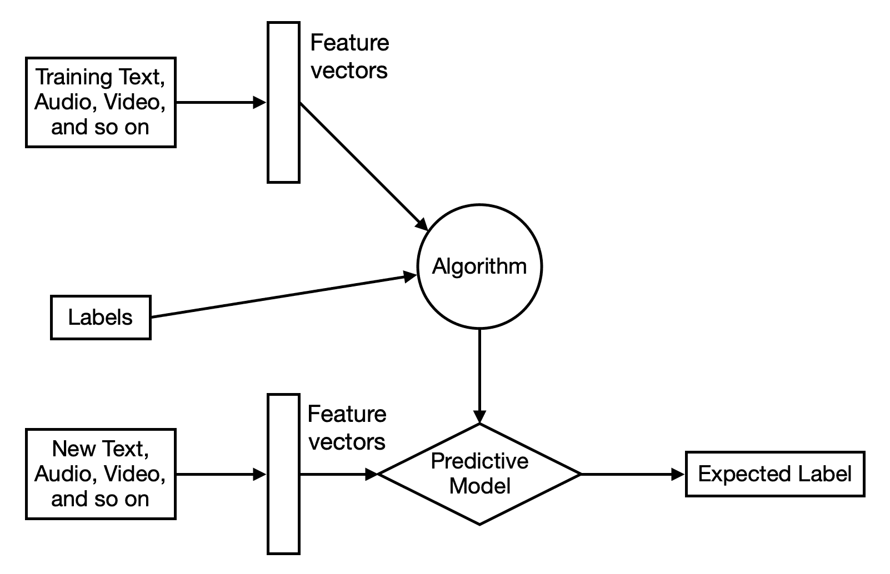
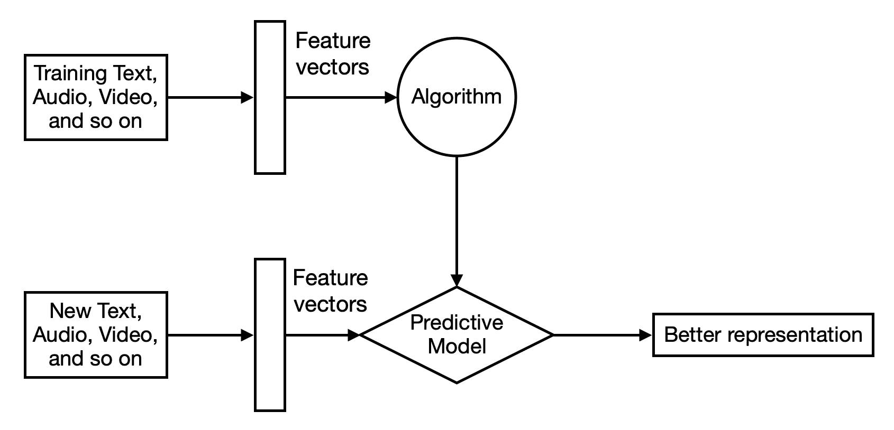
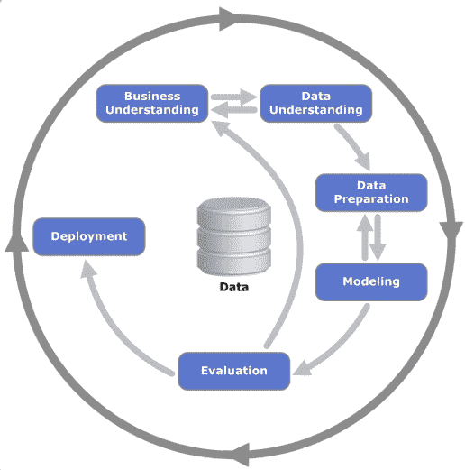

**人工智能**，俗称 **AI** ，是一项非常强大的技术。人工智能的深思熟虑的实现可以在自动化业务功能方面创造奇迹。人工智能有能力通过它的应用来改变各种各样的行业。随着计算机系统的发展，它们变得非常强大。因此，机器也变得非常强大，可以轻松完成许多复杂的任务。例如，**光学字符识别** ( **OCR** )是一项即使是个人电脑在软件的帮助下也能轻松完成的任务。然而，OCR 需要智能将图像中的点转换成字符。所以，在理想情况下，OCR 会被认为是 AI 的一个领域。但是，由于机器的力量，我们倾向于不考虑它作为 AI 的应用。

在这一章中，我们的重点是了解什么是人工智能及其在银行业中的应用。银行业是一个极其多样化和复杂的行业或领域。为了简化复杂的银行功能，银行业需要不断提供先进的技术解决方案。正如福布斯最近进行的一项分析([https://www . Forbes . com/sites/Forbes tech Council/2018/12/05/how-artificial-intelligence-is-helping-financial-institutions/# 2e 989 FAE 460 a](https://www.forbes.com/sites/forbestechcouncil/2018/12/05/how-artificial-intelligence-is-helping-financial-institutions/#2e989fae460a))所示，到 2030 年，在各种银行流程中实施人工智能将为该行业节省超过 1 万亿美元。因此，在不久的将来，银行业将从人工智能系统中受益最多。

我们将从简单介绍人工智能和银行业开始。这里，我们将定义在软件系统中实现 AI 的方法。我们还将了解银行业如何从人工智能的应用中受益。在我们完成本章之前，还会有更多的话题要讲。所以，不要简单地讨论你能从这一章中得到什么，让我们直接进入主题吧！

在本章中，我们将关注以下主题:

*   AI 是什么？
*   了解银行业
*   无障碍银行的重要性
*   人工智能在银行业中的应用

# AI 是什么？

人工智能，也被称为**机器智能**，是关于创造机器，展示通常由人类以自然智能形式展示的智能。约翰·麦卡锡在 1955 年创造了术语*人工智能*。

到目前为止，AI 已经经历了两个冬天:一次是在 20 世纪 70 年代，国防高级研究计划局或**DARPA**(【https://www.darpa.mil/】T5)，当时被称为 **ARPA** ，另一次是德克萨斯仪器([http://www.ti.com/](http://www.ti.com/)和施乐([https://www.xerox.com/](https://www.xerox.com/))等主要 IT 公司放弃专家系统。

在某种程度上，人工智能有助于根据预定义的规则，将决策从人类转移到机器。在计算机科学领域，AI 也被定义为对智能代理的研究。智能代理是从环境中学习并根据所学做出决策的任何设备，以最大化实现其预定目标的可能性。

人工智能能够解决非常广泛的问题。这些问题包括但不限于简单的数学难题、寻找从一个地点到另一个地点的最佳路线、理解人类语言以及处理大量研究数据以产生有意义的报告。下面列出了系统为解决这些问题必须具备的功能，并简要说明了每种功能的含义:

*   推理:解决难题和进行逻辑推理的能力
*   **知识表示**:处理研究人员和专家收集的知识的能力
*   规划:设定目标和确定成功实现目标的方法的能力
*   **学习**:通过经验改进算法的能力
*   **自然语言处理** ( **NLP** ):理解人类语言的能力

*   **感知**:使用传感器和设备的能力，如摄像机、麦克风等，以获取足够的输入来理解和解释环境的不同特征
*   **运动**:四处移动的能力

## 机器是如何学习的？

让我们快速了解一下机器学习的基础知识。机器可以使用三种方法来学习:监督学习、非监督学习和强化学习，如下表所述:

*   **监督学习**是基于挖掘标记训练数据的概念。训练数据被表示为由提供的输入(也称为**特征向量**——这是一个可以将输入数据数字表示为特征的数字向量)和预期输出数据(也称为**标签**)组成的对。每一对都贴有标签。下图说明了监督学习方法:

*   **无监督学习**基于这样一种情况，即训练数据是在没有任何关于数据的底层信息的情况下提供的，这意味着训练数据没有被标记。无监督学习算法将试图找到该训练数据的隐藏意义。下图说明了无监督学习方法:

*   **强化学习**是一种没有训练数据的机器学习技术。这种方法基于两件事——一个代理人和对代理人的奖励。代理人应该利用其经验来获得报酬。下图描述了强化学习方法:

## 实施人工智能的软件要求

开源运动(将在*无障碍银行的重要性*部分讨论)推动了软件开发。这种转变伴随着硬件的改进(例如，GPU、CPU、存储和网络硬件)。它也得到了无数致力于改善硬件性能和互联网连接的英雄们的支持。这些技术人员已经将人工智能算法发展到了能够提供接近人类性能的地步。

下图描述了我们在实施软件以执行机器学习项目时应该考虑的典型技术堆栈:

下表列出了促成上图中提到的不同软件组件的几项关键技术:

| **序列号** | **组件** | **软件/软件包名称** | **软件/包描述** |
| one | 用户界面/应用编程接口 | API/Python | API:应用程序编程接口是一种允许程序使用互联网协议与另一个程序进行交互的接口。与 UI 相比，API 是为机器人设计的。在本书的编码章节中，它将用于从数据源中提取数据，我们将为一个开放银行项目创建个人银行服务。 |
| Two | 机器学习和分析 | TensorFlow, scikit-learn, and ImageNet | 自 2017 年以来，谷歌的 tensor flow([https://www.tensorflow.org/](https://www.tensorflow.org/))一直是最受欢迎的深度学习框架之一。sci kit-learn(【https://scikit-learn.org/stable/】T2)是一个方便的机器学习包，在机器学习管道中提供了许多有用的功能。TensorFlow 和 Keras(【https://keras.io/】)将在我们处理深度神经网络时使用，而我们将在不太复杂的网络和数据准备工作中使用 scikit-learn。这些库将贯穿全书，从第 2 章到第 9 章，用来构建机器学习模型。ImageNet([http://www.image-net.org/](http://www.image-net.org/))由普林斯顿大学于 2009 年创建，旨在帮助研究人员测试和建立基于数据集的深度学习模型，这导致了使用深度学习网络进行图像识别的蓬勃发展。我们将在第 6 章、*中使用 Treynor Black 模型和 ResNet* 转换图像识别网络以识别股票趋势。 |
| three | 数据结构 | 熊猫和熊猫 | 熊猫([https://pandas.pydata.org/](https://pandas.pydata.org/))和 NumPy([http://www.numpy.org/](http://www.numpy.org/))是允许 Python 操作数据的数据结构。它们在本书的所有代码示例中都有使用。这些库是 Python 在数据科学家中流行的关键原因之一。这些库在第 2 章到第 9 章中使用。 |
| four | 3D 加速 | 英伟达 | 如果 TensorFlow 在后端使用 3D 加速(如英伟达(【https://www.nvidia.com/en-us/】)提供的软件和硬件)，Keras 相关编码的计算性能将得到增强，如[第三章](61949743-f7c3-4295-aaee-dab1d169d25c.xhtml)、*中使用特征和强化学习来自动化银行决策*的编码。该驱动程序将有助于提高 GPU 性能的某些元素。 |
| five | 操作系统 | 人的本质 | 这是一个免费的开源操作系统，与我们将在本书中使用的大多数 Python 库兼容。它可以说是人工智能社区的首选操作系统。 |
| six | 编程语言和开发环境 | Python 和 IDLE | Python 编程是人工智能的语言。Python 的存在要归功于 DARPA 在 1999 年的资助，这是为了提供一种简单易读的通用编程语言。它是开源的。IDLE 是 Python 包中的一个开发环境。它允许编写、调试和运行程序。然而，有更多的环境可供开发人员编写代码，如 Jupyter Notebook、Spyder 等。我们将使用 Python 和**集成开发和学习环境** ( **空闲**)进行更简单的代码开发(你可以在【https://docs.python.org/3/library/idle.html】的[找到它们)。](https://docs.python.org/3/library/idle.html) |
| seven | 版本控制 | 开源代码库 | GitHub 是最受欢迎的基于云的协作网站之一。这一切之所以成为可能，是因为云技术的激增，这使得可扩展的计算和存储成为可能。这是我们代码库存放和交换的地方。 |

随着我们对我们将在本书的整个课程中使用的工具、技术和软件包的简要介绍完成，现在让我们继续探索人工智能的一个重要领域——深度学习。下一节将详细解释深度学习和神经网络。

### 神经网络和深度学习

除了开源运动，神经网络的研究突破在提高人工智能算法决策的准确性方面也发挥了很大作用。你可以参考伊恩·古德费勒(Ian Goodfellow)、约舒阿·本杰奥(Yoshua Benjio)和亚伦·库维尔(Aaron Williams)的*深度学习*([https://www . packtpub . com/big-data-and-business-intelligence/Deep-Learning-Keras？UTM _ source = github&UTM _ medium = repository&UTM _ campaign = 9781787128422](https://www.packtpub.com/big-data-and-business-intelligence/deep-learning-keras?utm_source=github&utm_medium=repository&utm_campaign=9781787128422))作者 Antonio Gulli 和 Sujit Pal，为开发者提供简明的分析。

深度学习是机器学习的一个特殊子领域或分支。深度学习方法的灵感来自一个模仿人脑的计算机系统，称为**神经网络**。

银行通过移动或网络应用程序 chatbot 提供的在线客户支持是银行业深度学习的一个很好的例子。这类应用程序(即聊天机器人)在理解客户需求、偏好和兴趣的上下文方面非常强大。聊天机器人连接到与数据存储交互的后端应用程序。基于客户的输入或服务选择，聊天机器人向客户呈现各种可供选择的子服务以供选择。

聊天机器人或深度学习应用程序是分层工作的。这可以比作学习一门语言。例如，一旦一个人通过严格学习如何唯一地识别每个字母而掌握了字母表，他们就有资格进入下一个复杂层次——单词。这个人将开始学习小单词，然后是长单词。一旦掌握了单词，这个人就会开始造句，理解不同复杂程度的语法概念。一旦他们到达这个复杂层次的顶端，这个人就能够掌握这门语言。

您可能已经注意到，在层次结构的每个阶段或层次中，学习变得更加复杂。每一层都是基于从前一层复杂性中收集的学习或知识而构建的。深度学习就是这样工作的。该程序不断学习，根据从前一层获得的知识，形成更多具有新的复杂层次的知识。分层的复杂性是单词 *deep* 的来源。深度学习是无监督学习的一种，所以比监督学习快很多。

深度学习的主要影响是模型的性能更好，因为它可以容纳更复杂的推理。我们希望做出准确的财务决策。这意味着，在平衡银行客户利益的同时，给予银行股东合理回报将更具成本效益。

我们对智能机器的期望就是简单的**输入**、**处理**、**输出**，如下图所示:

在大多数金融用例中，我们部署监督学习，这类似于训练动物的过程——在这里，您为正确的结果提供奖励，并阻止不正确的结果。这就是为什么我们需要有训练发生的结果(即目标变量)。

## 实施人工智能的硬件要求

在为银行所需的硬件设定预算时，您需要确保预算包含正确的配置。这将让你在财务结果或上市时间方面实现承诺的结果，尤其是现在你即将从零开始创办一家银行！

鉴于银行的经济压力相当大，你最好确保每一分钱都发挥作用。为了做到这些，我们需要了解硬件对人工智能的贡献，以确保我们拥有正确的资源。

### 图形处理单元

除了软件和算法，使用一个**图形处理单元** ( **GPU** )和**固态硬盘** ( **SSD** )有助于加快机器学习。GPU 和固态硬盘的使用使计算机智能思考成为可能。

GPU 是一种专门设计的电路，可以并行处理计算。这适用于计算机图形处理，其中每个像素需要被同时处理以产生完整的图像。为了形象化，假设有 10 个像素要处理。我们可以一个接一个地处理 10 个像素中的每一个，或者我们可以同时在 10 个过程中处理它们。

CPU 具有独特的优势，每像素处理时间快，而 GPU 具有多线程的优势，可以一次处理所有平面数据。CPU 和 GPU 都可以做不同程度的并行数据处理。下表显示了顺序数据处理和并行数据处理之间的差异:

| **顺序数据处理** | **并行数据处理** |
|  |  |
| 数据按顺序出现，这需要更长的时间来完成计算。 | 数据是并行的，这缩短了处理时间。 |

除了在处理图像方面表现出色，GPU 还被用于深度学习。虽然深度学习描述了神经网络的层数，但深度神经网络通常被描述为具有广泛的记录和大量变量来描述输入。

当与 GPU 结合使用时，SSD 还可以提高向 CPU/GPU 读写数据以进行处理的速度。

### 固态硬盘

机器学习的另一个硬件要求是一种叫做 SSD 的存储设备。传统硬盘有一个机械马达，将读写数据的磁头放在磁带或磁盘的指定位置。与此相反，固态硬盘使用电路上的电流来读写数据，而无需移动电机。将电机的机械运动与板载电流进行比较，SSD 的数据检索速度快 20 倍。

对于运筹学的学生来说，比较这两者就像确定硬件容量一样简单，这类似于我们如何设计工厂——找到容量并尽可能减少瓶颈！

## 建模方法—CRISP-DM

**CRISP-DM** 是指数据挖掘的一个**跨行业标准流程**。数据挖掘是探索大量数据的过程，以确定应用于下一组数据的任何模式，从而生成所需的输出。为了创建本书中的模型，我们将使用 CRISP-DM 建模方法。这将有助于我们保持实现机器学习项目的统一方法。下图描述了在机器学习项目中使用 CRISP-DM 方法的项目执行:

正如您在上图中看到的，CRISP-DM 方法有不同的阶段。我们可以详细解释它们，如下:

1.  **业务理解**:这个阶段包括定义项目的业务目标。在这一阶段，您澄清与核心业务目标相关的问题。例如，核心业务目标可以是使用客户与网站交互的历史数据来预测客户何时离开特定网站。需要澄清的相关问题可能是，当前存在的支付界面是否是客户离开网站的原因。在项目执行的这一阶段，还制定了业务成功标准。
2.  **数据理解**:这个阶段包括理解在数据库或数据存储中挖掘的历史数据。分析数据的大小、格式、数量、记录数量、与业务相关的重要性、字段、数据源等。

3.  **数据准备**:这个阶段涉及将数据质量提高到机器学习算法处理数据所需的水平。数据准备的示例包括以所需格式格式化数据、将数字四舍五入到可接受的精度以及准备派生属性。
4.  **建模**:这个阶段包括选择要应用的建模技术或算法。建模算法用于找到一个函数，该函数在应用于输入时会产生所需的输出。
5.  **评估**:该阶段包括评估前一阶段建立的训练模型的准确性。为了提高效率和准确性，需要对模型进行任何必要的修改。
6.  **部署**:这一阶段包括为训练模型在真实环境中定义一个部署策略，以处理新数据。监控模型的准确性。

在大致介绍了什么是人工智能、机器如何学习以及人工智能实现的方法之后，现在是时候将银行业视为一个部门或行业了。在下一节中，我们将探讨各种类型的银行业务以及银行业面临的挑战。

# 了解银行业

银行业被定义为持有特定类型金融资产的专门经济体，其使用的方法将使所述资产在一段时间内财务增长。银行业受政府或类似机构制定的规则管理。

著名作家和金融顾问 Stephen Valdez 在其著作《全球金融市场简介》中描述了全球金融市场的不同类型。它们是商业银行、投资银行、证券公司、资产管理、保险和影子银行。

这些类型的银行业务需要满足各种各样的客户需求，从大型组织到个人客户。以下是根据客户需求对各类银行业务的描述:

*   **商业银行**可以是零售(服务消费者)，也可以是批发(服务公司)。从本质上讲，银行专注于从储户那里吸收存款，然后通过收取利息的方式将存款借给借款人。商业银行凭借其评估借款人贷款风险的能力而发展壮大。任何未能准确评估风险的行为都可能导致破产，因为无法将资金返还给储户。许多银行在金融危机中倒闭，包括美国的华盛顿互惠银行。
*   **投行业务**包括咨询业务和证券交易业务。咨询业务处理公司的购买和出售，也称为**合并和收购** ( **M & A** )，债务和股权资本筹集(例如，在纽约证券交易所上市的公司)，以及证券交易业务。证券交易业务涉及股票、固定收益、商品和货币的交易。证券交易包括愿意购买证券的买方、愿意出售证券的卖方和促成证券买卖的经纪人。

咨询业务依赖于通过合并或分拆业务为公司创造价值。此流程优化了 M&A 活动的组织绩效。它还将客户的资本成本优化为标准化的借贷结构(如债券)。客户可以通过向金融市场参与者发行新股或注销现有公司股份(股权)来进行更多投资。

所有上述活动都是通过市场参与者对公司的正确评估来创造价值的，这些评估是由情绪和更理性的关注所驱动的。

*   **资产管理**包括所有类型的基金——共同基金、交易所交易基金、对冲基金、私募股权基金等等。资产管理公司使用不同的投资策略(购买和出售决策的组合)投资于各种类型的金融资产和公司的各个生命阶段。关于投资的未来价值，在这个行业做出的一个关键决定也属于正确估价的范畴。

资产管理参与者渴望创造回报，以满足各种目的，从保护资产价值到升值。他们通常被称为**买方**，代表资产所有者，而帮助买方的银行服务被称为**卖方**，通常包括证券销售(面向客户，收集订单)、交易(执行订单)和研究(评估证券)。

*   **保险**包括一般保险和人寿保险。人寿保险保护买家免受死亡风险(死亡的后果)，非人寿保险涵盖其他一切，如因灾难造成的损失、行李的损失、火箭的损失(例如埃隆马斯克的 SpaceX 损失)和船只、因黑客攻击或病毒造成的系统漏洞等等。

保险的核心功能是评估借款人的风险状况。另一方面，创造投资回报以弥补损失的能力也很重要。保险公司的投资业绩越好，它提供的保险定价就越有竞争力。这就是伯克希尔·哈撒韦公司能够提供有竞争力的保险定价的原因之一——由于其卓越的投资业绩。

*   **消费者银行业务**由消费者债务的资产规模来表示，它侧重于我们在生活中不同时期可能需要的抵押贷款、汽车和个人贷款以及信用卡业务。
*   **影子银行**是一种涉及正规银行体系之外活动的借贷结算。它指的是另类投资基金，如比特币投资基金、证券经纪商，以及向消费者提供贷款的消费和抵押贷款金融公司。

## 银行业相对于世界经济的规模

通过将金融业的庞大规模与全球每年的生产收入进行比较，我们可以大致了解全球是如何利用银行服务来支撑自身的。但是，只显示统计数据是相当抽象的。假设世界是一个人。金融如何融入这个人的生活？以下是需要考虑的几点:

*   **年收入**:根据世界银行的统计，2018 年全球经济的生产率和收入为 86 万亿美元。大约五分之一(19%)的年收入来自跨境贸易(其中出口贸易额为 15 万亿美元)。
*   **财富**:全球人均年收入(年 GDP)约为 4.4 年。年度国内生产总值的细目可在本节末尾的表格中找到。通过将活动与国内生产总值规模进行比较，从各种来源获得了年收入信息。这 4.6 年可以分为以下两部分:
*   0.9 年一直和资产经理在一起。
*   0.9 年一直存银行。
*   0.8 年一直在股市。
*   2.3 年一直通过信贷/借款融资(1.17 通过债务，1.0 通过银行贷款，0.5 通过影子银行，0.03 通过消费信贷)。

当然，这是对全球财富的简化处理；一些数据可能被重复计算，股市数据可能包括上市公司计入银行负债的存款。然而，鉴于我们想了解各种金融活动的相对规模及其重要性，我们只是走了一条捷径来显示这些数字。

*   **保险**:为了防范来自生产或投资活动的任何一种不良风险，全球个人年收入的 6%被花在保险上，保险金额是其同等收入的 1.45 倍。溢价将用于购买基础金融资产，以产生收入来抵消任何不良风险。
*   **衍生品**:作为一种风险保护工具，除了买保险，银行还可以提供衍生品这种金融工具来提供风险保护。*衍生产品*是指交易双方在基础资产特定条件下支付或收取经济利益的协议。基础资产从**固定收益**和**货币**到**商品** ( **FICC** )不等。

固定收益包括利率和信用衍生品。货币是指外汇衍生品，商品是指商品衍生品。外汇以 87 万亿美元的未偿敞口排在第二位，这大约相当于全球的 GDP。商品、信用和股票衍生品所占份额较小，各占 GDP 的 2%到 9%左右。当将衍生品作为风险保护工具时，我们排除了一种叫做利率**场外** ( **场外**)的衍生品，它等于年收入的 6 倍——这远远超过了我们的财富需要保护的年收入。事实上，一些投资者把利率场外交易作为一种投资。我们为我们对保险的全面理解雕刻这个工具。场外交易是指银行与银行客户之间的双边协议。

另一种形式的协议可以是交易所交易协议，指的是银行客户通过集中交易所买卖产品。我没有包括太多交易所交易的数字，但这里提到的外汇、商品、信贷和股票等的数字是为了显示这些部门的相对规模。

下表列出了国内生产总值数字:

|  | **2018 年万亿美元** | **%国内生产总值** |
| **收入** | **75.87** | **100%** |
| 世界国内生产总值(全球产生的年收入) | Seventy-five point eight seven | 100.00% |
| 全球出口量 | Fourteen point six four | 19.00% |
| **财富** | **332.46** | **438%** |
| 全球资产管理 | Sixty-nine point one | 91.00% |
| 全球银行负债(包括存款) | Fifty-eight point nine three | 78.00% |
| 全球股票市场 | Seventy-nine point two four | 104.00% |
| 全球债务市场 | Fifty-seven point four nine | 76.00% |
| 银行贷款 | Twenty-nine point seven | 39.00% |
| 影子银行 | Thirty-four | 45.00% |
| 全球消费者债务 | four | 5.00% |
| **全球保险** ( **新保费撰写**) | **4.73** | **6.00%** |
| **保险范围** — **衍生品** ( **场外利率**) | **110.15** | **145.00%** |
| 全球外汇场外交易+交易所交易衍生品 | Eighty-seven point four one | 115.00% |
| 商品场外交易合同 | One point eight six | 2.00% |
| 信用场外衍生品 | Nine point five eight | 13.00% |
| 与股票挂钩的合同 | Six point five seven | 9.00% |
| 利率场外交易合同 | Four hundred and sixty-one point nine eight | 609.00% |

除非另有说明，所有数据均为 2018 年全年数据。GDP 和股市规模来自世界银行；出口贸易数据来自世界贸易组织；2018 年新的保险费数据来自瑞士再保险适马分公司；全球资产管理规模来自 BCG 全球资产管理 2018；所有的银行、债务和衍生品统计数据都来自国际清算银行。

## 银行业的客户

金融业的客户包括从事储蓄和贷款活动的储户和借款人。在从事跨境支付或贸易融资等商业银行活动时，他们被称为**申请人**(资金发送方)**受益人**(资金接收方)。

如果客户从事投资银行、证券和资产管理活动，他们被称为**投资者**，或者一般被称为**客户**。为了保护保险产品的购买者免受潜在的风险，购买者被称为**投保人**，物品被称为**被保险物品**。在风险发生的情况下，如果/当要求保险公司赔偿时，被赔偿的人被称为**受益人**。

非金融企业是所有金融活动的真正企业客户，应被视为经济的真正参与者。他们储蓄多余的现金，为消费者生产商品和服务。

我想明确强调的一个信息是，金融是为实体经济服务的。那么，为什么金融部门的增长超过了实体经济的增长呢？根据切凯蒂和哈鲁比的观点，过多的金融损害了经济的实际增长。也就是说，它带走了可以为实体经济做出贡献的高质量研发人才。因此，人才的流失会对生产要素产生负面影响。你可以在 https://www.bis.org/publ/work490.pdf 找到更多相关信息。

# 无障碍银行的重要性

像电和水一样，银行业应该像公用事业一样普及和容易获得。只有当我们让银行变得高效时，我们才能让它们变得容易获得，并让它们惠及尽可能多的人。银行业务是一项服务，旨在最大限度地利用资本/资金，为储蓄者和/或需要资本的人创造回报，让他们在约定的风险和回报下过上更有成效的生活。

我们想要做的是与罗伯特·J·希勒在他的书《金融与美好社会》中的观点保持一致，他在书中指出了信息技术在金融中帮助实现我们目标的必要性。更进一步，利用开源方法和应用程序来解决银行业的可访问性挑战。开源软件解决方案往往是经济高效、健壮和安全的。

要让银行变得触手可及，最重要的事情之一就是拥有大量数据。这将提高决策的效率和透明度，有助于降低银行决策的成本。我们将在下一节讨论对开源数据的需求。在竞争激烈的银行市场中，银行服务的价格会逐渐降低，因为效率好的银行会赢得更大的市场份额。

一旦在金融领域实施，人工智能将对该领域产生三方面的影响-重复性任务的工作将被消除，人工智能增强人类将提高效率，以及通过新的人工智能相关任务(如建模)创造就业机会。其中，裁员和提高效率将影响现有的工作岗位，而创造就业岗位将影响未来的人才和就业市场。

随着自动化和效率的提高，现有的工作将会被改变和影响。机器将比人类更有效率地完成日常任务。然而，为了管理、监控、维护和增强由机器或人工智能执行的任务，该行业将向既懂银行业务又懂人工智能技术的技术功能专业人士开放。

## 开源软件和数据

由于开源运动，过去 20 年左右的技术发展速度相当快。它从 Linux 开始，随后是 ImageNet。ImageNet 提供了大量的训练数据。这些训练数据推动了从事开发人工智能算法研究的技术人员的活动。这些技术人员使用用 Python、R、scikit-learn、TensorFlow 等编程语言编写的开源库开发了深度学习和神经网络的算法。

虽然开源方法鼓励软件开发，但人工智能的另一个关键因素是数据。找到实用的开放数据是一个挑战。另一方面，银行面临的挑战是谨慎而安全地将数据转换为机器可训练的数据集，以确保客户委托给银行的数据不会遭到破坏。

如今，在金融和银行界，客户保密性仍然是向更广泛的研究社区开放数据的一个主要障碍。现实世界中的问题可能比我们在开放数据空间中看到的更复杂。打开存储在数据库中的数据可能是一个实用的步骤，而打开图像(例如文档、音频文件或语音对话)可能具有挑战性，因为这些数据一旦被屏蔽或更改，可能会系统地丢失一些信息。

事实上，在银行中实现实际应用程序的主要成本也来自数据订阅。数据收集和汇总的成本是你将在本书中看到的一个主要挑战。我们的社会如何处理这个问题，如何激励商业部门解决这个问题，这需要超出本书范围的进一步讨论。本着同样的精神，这本书的代码是开源的。

## 如果一个好的银行家可以做这项工作，我们为什么需要人工智能？

让我们考虑一个单一的金融任务，即在融资市场上匹配资本需求。这是一项非常常规的数字匹配任务。在这里，很明显计算机更适合这项工作。

使用人工智能的目标是让机器做人类现在正在做的事情，但效率更高。许多人想知道在银行业应用人工智能是否会影响业内人士的工作。

请记住，我们的目标不是取代人类，而是增强当前人类提高生产力的能力，这是人类文明史上技术的目标。众所周知，人类在确定准确概率方面较弱，正如丹尼尔·卡内曼在 2013 年 4 月 2 日发表的心理学研究论文*思考，快与慢*所示。因此，在没有计算机的情况下进行概率决策是具有挑战性的。

# 人工智能在银行业的应用

根据麦肯锡全球研究所([https://www . McKinsey . com/~/media/McKinsey/industries/advanced % 20 electronics/our % 20 insights/how % 20 artificial % 20 intelligence % 20 can % 20 deliver % 20 real % 20 value % 20 to % 20 companies/mgi-artificial-intelligence-discussion-paper . ashx](https://www.mckinsey.com/~/media/mckinsey/industries/advanced%20electronics/our%20insights/how%20artificial%20intelligence%20can%20deliver%20real%20value%20to%20companies/mgi-artificial-intelligence-discussion-paper.ashx))，在 13 个行业中，金融服务在人工智能采用方面排名第三，其次是高科技、电信以及汽车和装配行业。

由于麦肯锡报告没有提到银行业的用例，通过一点研究，或许我们可以看看人工智能创造价值的四种方式，如下表所示:

*   **项目**:预测和预期需求，改善货源，减少库存(资本)。
*   **生产**:以更低的成本或更高的质量提供服务。
*   **促销**:在正确的时间为正确的顾客提供正确的价格和正确的信息。
*   **提供**:丰富、个性化、便捷的用户体验。

让我们看看每个金融参与者如何将人工智能应用于以下方面，如下表所示:

| **参与者** | **项目:更好的预测** | **生产:降低加工成本** | **促销:个性化优惠** | **提供:便利** |
| 商业银行 | 优化资金需求。 | 使用人工智能，贸易融资处理可以自动化，这将提高效率。 | 随着货物流向不同类型和风险水平的不同利益相关方，AI 可以提供出口/进口融资的实时报价。 | 使用支持 NLP 的聊天机器人改善客户服务。 |
| 投资银行 | 公司估价。 | 有了人工智能，通过识别市场情绪来获得市场信号变得更快、更便宜。 | AI 可以通过自动匹配来匹配资产卖家和买家的需求。 | 随时可以访问信息的移动员工。 |
| 资产管理 | 资产评估和优化。 | 人工智能可以通过自动化交易和投资组合平衡来提供帮助。 | AI 可以向客户推荐投资。 | 快速方便的投资组合更新。 |
| 消费银行 | 设计一个现实的储蓄计划。 | 个性化机器人顾问可以在没有人工帮助的情况下从收据中获取数据。 | AI 可以理解消费者需要融资或投资产品的正确时间。 | 使用智能机器人随时随地为客户提供服务。 |

总的来说，我们现在可以看到数据如何被用于金融领域的智能决策:更多的数据点和更高的交换速度可以大大降低金融成本。更详细的例子将在后面的章节中提供。

我们如何降低成本？从本质上讲，我们通过减少花费在开发银行服务方面的时间来获得它。

## **人工智能对银行盈利能力的影响**

为了让你了解人工智能对银行盈利能力的影响，让我们从两个角度来看一些简单的估计:模型准确性的提高和运行/训练模型所花费的时间。

在过去 10 年中，时钟频率和内核数量增加了 10 倍，从大约 300 个内核增加到大约 3，000 个内核。

我把十年前经历的浅层机器学习或统计模型与今天看到的深度神经网络进行了对比。神经网络的模型精度将模型从 80%左右提高到 90%以上，提高率为 12.5%。下表显示了内存数据速率、总线宽度和大小方面的改进:

| **年** | **处理器** | **内核时钟** | **内存数据速率** | **内存总线宽度** | **内存大小** |
| Two thousand and seven | 8800 超[42] | 612 兆赫 | 2.16 千兆赫 | 384 位 | 768 MB |
| Two thousand and eighteen | 泰坦 X[43] | 1417 兆赫 | 10 千兆赫 | 384 位 | 12 GB |
| Two thousand and eighteen | GeForce RTX 2080 Ti | 1545 兆赫 | 14 千兆赫 | 352 位 | 11 GB GDDR6 |

下表突出了银行业务领域的改进:

| **区域** | **改进** | **银行业领域** |
| **项目**:更好的预测 | 模型预测精度提高了 15%。 | 风险模型，定价 |
| **生产**:降低加工成本 | 自动化率 50%。 | 操作 |
| **促销**:个性化优惠 | 模型预测精度提高了 15%。 | 风险模型，定价 |
| **提供**:便利 | 如果所有流程都是自动化的，将延迟减少 50%。 | 操作 |

如果银行的成本收入比在 70%左右，那么自动化率可能会将该比率降低一半至 35%。然而，随着人工智能在银行业的扩散，技术投资成本将再占 5-10%，目标成本收入比将从 40%降至 45%。这将对发达国家的银行产生更大的影响，因为与新兴市场相比，劳动力成本相当高。

提高预测的准确性将进一步降低银行预测能力的成本，从而将风险成本降低 15%。我个人的观点是，对于发达国家来说，风险成本在总资产的 50 **个基点** ( **个基点**)；银行风险成本降低 15%不会对其盈利能力产生重大影响。

预测准确性和便利性的提高将提高银行的可及性，这意味着它们可以进入过去认为不可行的更大市场。也就是说，盈利率对权益报酬率没有反映影响；而是会表现在银行的规模和银行的市值上。如果范围更广，应该会产生 15%的改进。

总之，回报率提高了 80%，从 7.9% **净资产收益率** ( **净资产收益率**)提高到 14.5%。然而，对系统重要性银行的额外资本要求将逐渐从 11%提高到 12%，这将在目标人工智能适应阶段将整体 ROE 降至 13.3%，所有监管都将到位。

# 摘要

本章一开始，我们解释了人工智能是什么。AI 是让机器执行人类可以完成的任务的技术，例如天气预测、预算预测等等。它使机器能够基于数据进行学习。我们看了人工智能的各种技术，比如机器学习和深度学习。后来，我们研究了银行领域的复杂流程。如果我们能实现自动化，我们就能降低银行业的成本。我们还了解了无障碍银行的重要性。后来，我们看了人工智能在银行业的应用及其积极影响，有几个数字来支持它。

在下一章，我们将继续我们在银行业的人工智能之旅。下一步，本章将着重于时间序列分析和预测。它将使用各种 Python 库，如 scikit-learn，来执行时间序列分析。本章还将解释如何衡量基于机器学习的预测的准确性。这一章将充满有趣的内容，并将教你如何将财务比率与机器学习模型结合起来。这将更深入地研究机器学习模型如何应用于解决银行业问题。