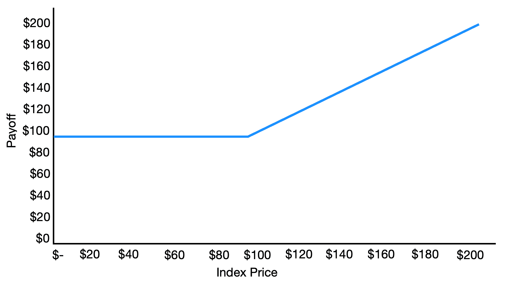
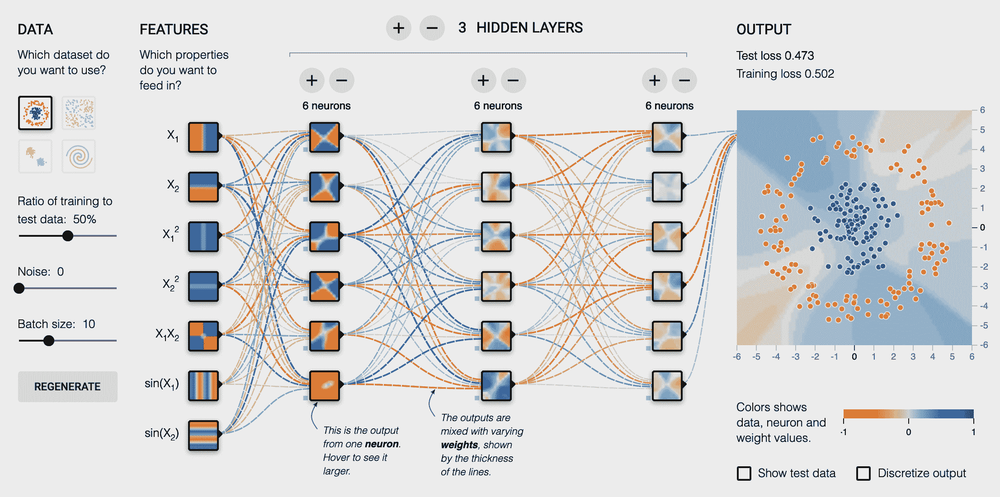
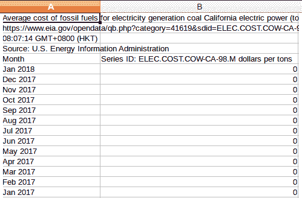
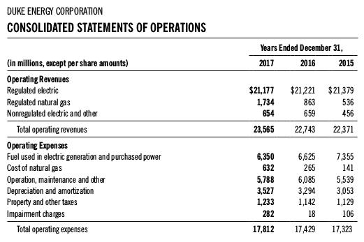

<title>Time Series Analysis</title>  Time Series Analysis

在前一章，我们介绍了人工智能、机器学习和深度学习。我们还发现了银行业是如何运作的，以及人工智能的使用如何增强银行业务流程。我们了解了银行流程易于使用的重要性。我们还了解了一种叫做 **CRISP-DM** 的机器学习建模方法。总的来说，这一章为在银行业中应用机器学习来解决各种业务问题提供了必要的背景。

在本章中，我们将了解一种分析历史数据以预测未来行为的算法，称为**时间序列分析**。时间序列分析基于一个变量——时间。它是在特定时间间隔捕捉数据点的过程，也称为**观察**。本章的目标是通过示例详细理解时间序列分析，并解释**机器对机器** ( **M2M** )通信如何有助于时间序列分析的实施。我们也将理解金融银行的概念。

在本章中，我们将讨论以下主题:

*   了解时间序列分析
*   M2M 通信
*   金融银行的基本概念
*   人工智能建模技术
*   利用时间序列分析进行需求预测
*   基于 Keras 的神经网络商品采购

# 了解时间序列分析

**时间序列**在技术上被定义为在均匀间隔的时间间隔内捕获的变量的有序值序列。简单来说，就是在特定的时间间隔捕捉一个变量的值的方法。它可以是 1 小时、1 天或 20 分钟。变量的捕获值也称为**数据点**。进行时间序列分析是为了了解产生数据的潜在来源的结构。它也用于预测、前馈控制、监控和反馈。以下是时间序列分析的一些已知应用的列表:

*   效用研究
*   股票市场分析
*   天气预报
*   销售预测
*   工作量调度
*   费用预测
*   预算分析

时间序列分析是通过应用各种分析方法从各种数据源获取的原始数据中提取有意义的信息来实现的。时间序列分析对于生成统计数据和其他数据特征也很有用，例如，数据的大小、数据的类型、数据的频率等等。在时间序列分析中，值的获取是在观察点完成的。

我们试着通过一个例子来理解这一点。当使用时间序列分析建模时，特定分支机构的分支机构经理可以预测或预报来年将发生的费用。分行经理可以通过采用时间序列分析机器学习模型，然后使用历史年度费用记录训练该模型来做到这一点。所记录的观察结果可以绘制在图表上，其中特定时间(在本例中为每天)在 *x* 轴上，历史费用在 *y* 轴上。因此，时间序列分析是一种算法，用于根据为另一个变量(在本例中为时间)捕获的值来预测一个变量(在本例中为年度费用)的未来值。

让我们用另一个例子来更详细地理解这一点。在本例中，我们将假设一家银行希望根据其拥有的历史数据进行费用预测。银行经理想知道并预测他管理的分行在 2020 年的支出。因此，预测费用的过程将从收集 2000 年的历史费用信息开始。首先，银行经理将查看当年的支出数据。

正如我们前面提到的，时间序列分析是通过捕捉变量的值来完成的。你能猜出这个例子中的变量吗？我相信你现在已经猜到了。被观察的变量是每年的总费用。我们假设以下是每年的数据:

| **年** | **总费用(美元)** |
| Two thousand | Twenty thousand |
| Two thousand and one | Twenty-two thousand five hundred |
| Two thousand and two | Twenty-one thousand |
| Two thousand and three | Eighteen thousand |
| Two thousand and four | Twenty-five thousand seven hundred |
| Two thousand and five | Twenty-two thousand one hundred |
| Two thousand and six | Twenty-three thousand three hundred |
| Two thousand and seven | Seventeen thousand six hundred |
| Two thousand and eight | Eighteen thousand two hundred |
| Two thousand and nine | Twenty thousand four hundred |
| Two thousand and ten | Twenty-one thousand two hundred |
| Two thousand and eleven | Twenty thousand nine hundred |
| Two thousand and twelve | Twenty-two thousand six hundred |
| Two thousand and thirteen | Seventeen thousand five hundred |
| Two thousand and fourteen | Nineteen thousand three hundred |
| Two thousand and fifteen | Twenty thousand one hundred |
| Two thousand and sixteen | Twenty-two thousand two hundred |
| Two thousand and seventeen | Twenty-two thousand five hundred |
| Two thousand and eighteen | Nineteen thousand four hundred |
| Two thousand and nineteen | Twenty-three thousand eight hundred |

许多选项可用于分析这些数据和预测未来的费用。分析方法因复杂程度而异。最简单的方法是平均费用，并假设结果值是 2020 年的费用数。然而，这仅仅是为了我们的例子。你也可以使用其他各种数学和分析方法来计算平均费用。采用这一方案，2020 年的总支出将为 20，915 美元。

复杂的方法可能涉及分析详细的费用，预测每种费用类型的未来值，并基于它得出总费用金额。这可以提供比平均选项更准确的预测。您可以根据需要应用更复杂的分析方法。提供这个示例是为了让您能够理解时间序列分析是如何工作的。我们在本例中使用的历史数据量非常有限。AI 和机器学习算法使用大量数据来生成预测或结果。以下是此示例的图示:


在接下来的章节中，我们将学习机器如何使用被称为 **M2M 通信**的概念来相互通信。

# M2M 通信

M2M 通信非常强大，可以极大地改善商业银行的功能。

M2M 通信表示两台机器或设备之间通过各种渠道(如物理网络、信息共享网络、软件通信和应用程序接口)进行的通信。M2M 通信的唯一目的是在两台或多台机器之间或者在这些机器上运行的软件之间交换信息。

M2M 通信的概念假设在机器之间交换信息时不需要人工干预。M2M 通信也可以在无线网络上进行。无线网络让 M2M 的通信变得更加便捷。以下列表包括 M2M 通信的几种常见应用:

*   制造业
*   智能公用事业管理
*   家用电器
*   医疗设备管理

然而，M2M 通信不同于物联网。物联网使用传感器来触发输入，而 M2M 通信特指两个系统之间的交互。

商业银行是一组金融服务，包括存款、支票账户服务、贷款服务、汇票、存款证明以及个人和企业的储蓄账户。商业银行是人们银行需求的通常目的地。但是银行是如何运作和赚钱的呢？这是一个很常见的问题，我们现在就来回答。商业银行通过向客户提供各种贷款赚取利息来赚钱。贷款的类型各不相同，例如汽车贷款、商业贷款、个人贷款和抵押贷款。通常，商业银行在一种或多种贷款方面有专长。

商业银行从向客户提供的各种账户服务中获取资金。账户的类型包括支票账户、储蓄账户、公司账户、货币市场账户等等。银行利用这些资本投资于高回报的投资选择，如共同基金、股票和债券。银行必须向那些在银行有账户的客户支付利息。然而，与贷款相比，利率要低得多。

## M2M 通信在商业银行中的作用

考虑一个涉及从一个客户的账户向另一个客户的账户转账的例子。在过去，这是一项人工任务，需要填写适当的表格，将表格提交给创建分类账条目的适当部门，然后从一个账户借记金额，并贷记到受益人的账户。

如今，这个过程已经完全改变了。有了手机，客户可以毫不费力地将资金从一个账户转移到另一个账户。几分钟之内，这笔钱就会打入收款人的账户。不可思议，不是吗？那么，这是怎么发生的？M2M 通信和过程自动化在这一过程中发挥了重要作用。机器(即计算机系统、基于云的虚拟机和移动设备)可以通过无线或有线网络连接，并将每条必要的信息传输到另一台机器或在该机器上运行的软件。如今，你只需要因为一些特定的原因去银行。客户现在甚至可以直接通过移动设备开立储蓄银行账户或贷款账户。

# 金融银行的基本概念

在我们全速前进到另一个例子之前，我们将首先精心制作我们的数据、人工智能以及商业技术和知识。如果您熟悉所有这些概念，可以跳过这一部分。

金融知识是理解我们在预测商业活动中的决策如何影响非金融公司的金融决策的良好起点。此外，当使用机器学习模型预测未来活动时，我们还可以了解金融业如何为未来的业务量做准备。融资对非金融企业的核心业务活动有什么帮助，将在下一节讨论。

## 金融市场的功能——现货和期货定价

金融市场，如交易所，扮演着产品交易市场的角色。例如，考虑像天然气这样的商品——我们可以直接从卖家那里购买，也可以通过交易所购买。事实证明，长期运行的经济学理论鼓励你尽可能多地从交易所购买产品，如果产品是标准化的。美国的芝加哥商品交易所(T1)(**芝加哥商品交易所(T3))可能是大宗商品的热门选择，不用说，**纽约证券交易所(T5)(**纽约证券交易所(T7))是公开上市股票的市场。******

在这一章中，让我们坚持把天然气作为我们需要的产品。当然，在某些情况下，从壳牌等大型石油公司购买可能更有效率——也就是说，如果我们希望定期从生产商那里获得这些实物商品的话。

在外汇市场中，有两种价格——现货价格和期货价格。**现货价格**表示只要你付款，现在就可以拿到货；**期货价格**意味着你现在付款，以后就能得到货物。

### 选择实物交割或现金结算

即使所有权发生变化，也可能以两种形式发生，即通过实物交割或现金结算。最终，实物交付还是现金结算取决于我们是否立即需要货物。然而，在任何给定的交易日，我们必须权衡只有两种选择的成本:*实物交割(天然气成本+融资成本+存储成本)与现金结算*。

基本上，我们有四个选项，如下表所示——假设我们需要在 3 个月内获得用于发电的天然气产品:

|  | **实物交割** | **现金结算** |
| **光点** | 立即融资购买产品；存放 3 个月。 | 现在购买产品，并在纸面上拥有它。没必要留着货。 |
| **未来** | 现在为购买提供资金，以便将来获得产品；3 个月搞定。 | 未来购买产品的资金。3 个月后，从市场上现货购买，实物交割。 |

为了衡量这些选项，我们需要以下数据:

*   **如果公司拥有天然气储存设施，储存费用**应由内部来源提供。假设它是相当静态的，例如，在每 MMBtu 0.12 左右。MMBtu 是用于测量燃油中能量含量的单位。它代表一个**百万英国热量单位**。
*   **融资成本**应涵盖储存期和购买成本的利息支出。假设为每 MMBtu 0.1 美元。这个应该是银行喂的。
*   天然气的**成本(现货价格)应由市场数据提供商提供。例如，实时的 Henry Hub 现货价格应由 Thomson Reuters 提供，约为每 MMBtu 2.5 美元。**
*   期货的**成本应该由 CME 提供。Quandl 上的数据应该是免费的。3 个月的合同应该是每 MMBtu 美元左右。**

这里给出的数字仅仅提供了一个数值大小的指示。当然，它们可以通过比较选项来优化——然而，决策可以通过线性代数来得出，并且不需要很多机器学习技术。在现实生活中，如果我们可以有一个好的确定性公式，我们就不应该将机器学习解决方案强加于任何东西。

### 对冲价格风险的选择

为了避免价格波动超出天然气的预定价格范围，我们将需要启发式规则，例如在给定固定目标购买量的情况下，决定以什么价格做什么。或者，我们需要规则来调整已经卖出或买入的股票。

举下面这个例子。如果价格超出可接受的范围，例如，低于 2.84 美元或高于 3.95 美元，我们可以选择通过执行以下操作之一来赚取利润:

*   如果价格下跌很多，就写期权(卖保险)。
*   如果价格上涨不利，通过购买期权(购买保险)来减少损失。

下图显示了通过以高采购价格购买保险并以低采购价格出售收益而获得的保值头寸的单位收益:



在这里，我们以极低的价格出售保险——这意味着，尽管我们本应享受更低的采购成本，但我们却为了收取保险费而放弃了它。另一方面，当价格太贵时会有积极的回报，这可能会侵蚀公司的盈利能力——通过支付保险费购买保险。保险的确切价格被称为期权定价，将在第 7 章、*的[中讨论，为卖方的算法营销感知市场情绪](d29ff3a8-3879-4d50-8795-a39bae5cc793.xhtml)*。我们现在假设我们为保险支付的价格与我们从销售保险中获得的价格相同。

# 人工智能建模技术

在下面的章节中，我们将介绍最传统类型的预测模型**自回归综合移动平均** ( **ARIMA** )。我们还将介绍一个神经网络模型。ARIMA 是一类统计模型，用于使用过去的值预测时间序列。ARIMA 是下列单词的首字母缩写:

*   **AR** ( **自回归**):自回归是将以前的数据值作为输入，将其应用于回归方程，并生成基于预测的结果数据值的过程。
*   **I** ( **综合** ): ARIMA 采用综合方法，利用观测数据的差异使时间序列等间距分布。这是通过从上一步或时间值的观测值中减去观测值来完成的。
*   **MA** ( **移动平均**):使用观测值和应用于过去观测值的残差的模型。

## **介绍时间序列模型——ARIMA**

对于这个项目，我们将把数据放入一个名为 **ARIMA** 的时间序列模型中。ARIMA 是统计学中一种特殊类型的时间序列模型，常用于预测未来的数据点，参数有自回归项( *p* )、非季节性差异( *d* )和滞后项( *q* )。

这个 ARIMA 模型属于参数化建模——由已知参数拟合的模型。通常，我们将这种类型的模型归类为统计模型，因为我们需要对数据的样子做出假设。对于更广泛的机器学习模型来说，这是相当不同的，这些模型对数据看起来像什么没有任何预设的假设。

然而，在真实的银行场景中，统计方法仍然在计量经济学、定量金融学和风险管理领域中流行。当我们有少量数据点时，例如，大约 30 到 100 个数据点时，这种方法是有效的。然而，当我们拥有大量数据时，这种方法可能不如其他机器学习方法。

ARIMA 假设有一个我们可以描述的稳定趋势。自回归项, *p* 和 *d* 各有其重要意义:

*   *p* 表示影响当前周期值的过去周期数(如 *p = 1: Y 当前周期= Y 当前-1 周期*系数+常数*)。
*   非季节性差异( *d* )是指影响当前期间值的过去期间级数的数量(例如， *d = 1* :当前 *Y* 与过去期间 *Y* 之间的差异)。
*   滞后项( *q* )是指影响当期值的过去期间的预测误差数。

考虑一个例子，其中 *q = 1: Y* 受到在 *t - 1* 周期中的误差的影响——这里，误差指的是实际值和预测值之间的差异。

简而言之，ARIMA 规定了前期的系数、常数、误差项，甚至预测值如何影响当前的预测值。这听起来很可怕，但事实上，非常容易理解。

模型拟合后，将要求它做出预测，并与实际测试数据进行比较。预测与测试数据的偏差将记录模型的准确性。在本章中，我们将使用一个名为**均方误差** ( **MSE** )的指标来确定模型对数据的适合度。

## 介绍神经网络——准确预测需求的秘方

我们可能有很好的数据源，但我们不应该忘记，我们还需要一个智能算法。你可能已经读过成千上万次关于神经网络的内容，但是在我们在整本书中广泛使用它们之前，让我们先来看一个简短的解释。神经网络是计算机模仿我们大脑工作方式的一种尝试——它通过连接不同设置的不同计算点/神经元来工作。

就架构而言，它看起来像一层层的公式。阅读这本书的人可能有一些代数背景，可以看到感兴趣的结果 *Y* 如何与变量 *X* 相关，其中 *b* 是系数， *c* 是常数项:


Y 是我们希望在左边预测的；在右边， *bX + c* 是描述特征( *X* )如何与 *Y* 相关联的形式。换句话说， *Y* 是输出，而 *X* 是输入。神经网络描述了输入和输出之间的关系。

假设 *Z* 是我们想要预测的:


这些公式似乎是相互关联的:


这是最简单的神经网络形式，有一个输入层、一个隐藏层和一个输出层。每一层都有一个神经元(点)。

我鼓励你阅读关于机器学习的研究论文和介绍性文本，甚至报名参加在线课程。来自 Packt 的有用资源包括塞巴斯蒂安·拉什卡和瓦希德·米尔贾利利的 *Python 机器学习*([https://www . packtpub . com/big-data-and-business-intelligence/Python-Machine-Learning-second-edition](https://www.packtpub.com/big-data-and-business-intelligence/python-machine-learning-second-edition))和罗威尔·阿蒂恩萨的*高级深度学习与**Keras*([https://www . packtpub . com/big-data-and-business-intelligence/Advanced-Deep-Learning-Keras【t](https://www.packtpub.com/big-data-and-business-intelligence/advanced-deep-learning-keras)

### 反向传播

神经网络中还有其他概念，比如反向传播。这是指微调神经网络参数的反馈机制，它主要连接网络内的神经元(除非它是该层的常数参数)。它通过比较输出层的输出 *Z* (预测)与 *Z* (实际)的实际值来工作。实际与预测的差距越大，越需要调整 *b* 、 *c* 、 *d* 、 *e* 。

了解如何衡量差距也是一项重要的知识——这被称为**指标**,将在[第 3 章](61949743-f7c3-4295-aaee-dab1d169d25c.xhtml)、*中讨论使用特征和强化学习实现银行融资自动化。*

### 神经网络体系结构

架构涉及层和每层神经元的数量，以及神经元如何在神经网络中相互连接。输入层被表示为**特征**。输出层可以是单个数字或一系列数字(称为**向量**)，它生成一个范围从 0 到 1 的数字或一个连续值——取决于问题域。

例如，为了理解神经网络的结构，我们可以投影它看起来像下面来自 tensor flow Playground([https://playground.tensorflow.org/](https://playground.tensorflow.org/))的截图，这是另一个具有相同隐藏层的网络的可视化-三层，大小为 6:



### 使用历元进行神经网络训练

除了神经网络的设计之外，我们还利用了`epoch`参数，该参数表示同一组数据被馈送到神经网络的次数。

如果我们没有足够的数据来满足神经网络中参数的数量，我们需要增加历元的数量。假设我们在神经网络中有 *X* 个参数，我们至少需要 *X* 个数据点来输入网络。不幸的是，如果我们的数据点只有 *X* /2，我们需要将`epoch`设置为 2，以确保我们可以将 *X* 个数据点(它们都被馈送了两次)馈送到网络。

### 缩放比例

在将特征馈送到机器学习模型之前，我们将不同幅度的输入特征归一化为相同幅度。例如，商品的价格和数量是不同类型的数字数据。缩放过程将确保它们被缩放到相同的范围，从 0 到 1。在经典的统计建模过程中，这一步对于避免影响预测的较大尺度的特定特征非常重要。

### 抽样

除了数据列级缩放，我们还需要注意模型的采样偏差。通常情况下，当机器在另一组数据上进行训练和学习时，我们会留出一部分机器看不到的数据——这被称为**训练集**。稍后，测试集(即搁置的数据集)将用于检查模型所做的预测。

# 利用时间序列分析进行需求预测

在本节中，我们将看一下预测电力消费需求的第一个示例，并使用时间序列分析来预测能源费用。我们将从一个简短的问题陈述开始，并定义解决问题的步骤。这将让你更好地理解如何使用时间序列分析找到问题的解决方案。

今天，电力或能源是我们所有人的基本必需品。我们用电和付账单。现在作为客户，我们想分析用电量，预测未来的用电量，预测能源费用。这是我们将在本节中解决的问题。

时间序列分析是解决类似于前面问题陈述中定义的问题的最佳方法。机器学习模型需要在得出实际解决方案之前输入大量数据集。机器学习模型使用这些大型数据集来导出模式或识别在数据分散时可能不可见的现有模式。同样，我们的第一步是获取大量数据，并对其进行处理以提取有意义的信息。这将是一个三步走的过程。以下是我们将遵循的步骤:

1.  下载数据
2.  预处理数据
3.  拟合数据的模型

## 下载数据

从下载关于电力消耗和能源费用的数据开始。即使我们现在可以从公共网站下载数据，但在真正的生产环境中，从内部数据库下载数据并将其作为平面文件(没有数据库结构的文本文件)传递给用户并不罕见。

您可以从以下路径下载文件:

*   **消费**:【https://www.eia.gov/opendata/qb.php?category=873】T2&sdid = ELEC。CONS 托特。NG-CA-98。M
*   **成本**:【https://www.eia.gov/opendata/qb.php?category=41625】T2&sdid = ELEC。成本 NG-CA-98。M
*   收入:【https://www.eia.gov/opendata/qb.php?category=1007】T2&sdid = E LEC。修订 CA-RES.M

有许多方法可以获取数据，例如，使用 API 或机器人。我们将在本书中进一步讨论这些提取数据的方法。在[第 4 章](0c281efb-a1b8-423f-976b-0fa47f5da990.xhtml)、*机械化资本市场决策、*中，我们将通过 API 调用获取数据。例如，如果我们要使用机器人，我们可以使用**美汤**来解析网站或注册 API。然而，在这个例子中，我们只是使用浏览器访问站点，并导航到下载按钮来下载数据。

## 预处理数据

在我们获得数据后，我们在相同的时间序列中将其对齐，因为我们下载的数据可能涵盖不同的时间段。作为数据科学家，我们努力将我们的数据整理在一张数据表中，并逐列列出所有必需的数据(即成本、消耗、销售等):



数据的每一行都应该代表一个月。就在我们为机器提供数据以学习模式之前，我们需要留出一些数据用于测试，一些用于学习。有了测试数据，就可以看出模型预测的是否很好，而不需要先对学习数据进行训练。这是所有 ML/预测模型的基本步骤。我们不为 ML/training 提供测试数据集。调用该函数的代码行如下:

```
file_path_out
if select_fld:
    list_flds = ['consumption_ng','avg_cost_ng']
    tuple_shape_list = [(8,0,3),(12,1,3)]
else:
    list_flds = preprocess_data(f_name,list_flds)
```

在这个程序中，我们留出最早的 70%的数据点作为机器学习和适应的训练数据，而保留后 30%的数据点作为测试数据。这些数据将用于与模型所做的预测进行比较，而不是用于拟合数据。

## 拟合数据的模型

一旦数据干净，我们将开始训练机器学习模式。训练数据将根据需要输入机器。模型就像一件衬衫，训练数据就像我们试图让它合身的身体。

以下是将我们的数据放入 ARIMA 模型的步骤:

1.  对于合并文件中的每个数据文件/字段，我们运行*步骤 3* 和*步骤 4* (它们已经在代码文件中为后面的代码块做了标记)。
2.  如果布尔变量`parameter_op`被设置为`True`，那么我们将运行*步骤 5* (也被标记)。这探索了 ARIMA 中关于`p`、`d`和`q`的所有可能的参数组合，设置如下:

*   `p`:范围从 0 到 12
*   `d`:范围从 0 到 2
*   `q`:范围从 0 到 3

3.  对于任何前述值的组合，我们计算数据对实际模式的适合度，并测量误差值。具有最低误差值的组合被选为 ARIMA 模型的选择参数。

以下是微调所用参数的代码片段(请参考 GitHub 上的完整代码文件:[https://GitHub . com/packt publishing/Hands-On-Artificial-Intelligence-for-Banking](https://github.com/PacktPublishing/Hands-On-Artificial-Intelligence-for-Banking)):

```
start = time.time()
lowest_MSE=99999999999
lowest_order = (0,0,0)
for p_para in range(13):
  for d_para in range(3):
    for q_para in range(4):
      order = (p_para,d_para,q_para)
      ...
      ...
      error,temp_data,temp_model = forecasting(dta_df, fld, False, \
                                               order, 0.7, fld)

if error<lowest_MSE:
  lowest_MSE=error
  lowest_order = order
  lowest_data = temp_data
  lowest_model = temp_model
  end = time.time()
  ...
```

恭喜你！我们现在已经推出了一个可以预测未来销量的模型！

# 基于 Keras 的神经网络商品采购

在这一节中，我们将看看另一个更复杂的例子。和以前一样，我们将定义问题陈述，然后定义解决问题的步骤。

在本例中，我们希望根据历史数据预测商品采购。我们将要使用的商品是天然气。就天然气而言，我们对其定价没有任何控制权，因为它是一种高度全球化的大宗商品。然而，当天然气价格达到一定范围时，我们仍然可以建立内部采购策略。盈利率目标将限制我们为原材料支付的最高价格，以使公司所有者获利。我们将跟踪利润率，即天然气成本与销售额的比率。

让我们用一个例子来理解这个定价约束。在本例中，我们假设天然气(电力)单位成本每增加 1 美元，能源公司的销售材料成本将增加 **9.18%** (基于 3 年的数据):



下表显示了年度销售额的加权平均值:


这里可以看到从 **2015** 到 **2017** 天然气到销售的成本。在 **2017** 年，以平均单位重量**3.91 美元**计算，天然气销售成本为 **36.45%** 。我们假设平均单位重量和成本对销售额是一个恒定的关系——平均历年材料成本率的值(从 **2015** - **2017** ，即 **7.66%** 、 **9.32%** 、 **9.66%** )。我们取所有三个数字的平均值，得出加权平均值为 9.18% 。

请记住，实际数字应该来自内部会计系统，而不是仅用于电力目的的外部美国**能源信息管理局** ( **EIA** )数据。

根据过去 3 年的数据，我们发现平均材料销售成本为 31.15%(表中 iii 的平均值)，即 339 万美元/千立方英尺。销售材料的成本为 36.24%，单位成本为 395 万美元/mcf，处于较高范围。 **mcf** 是天然气的标准单位成本。它等于一千立方英尺。然而，在较低的范围内，销售材料的成本为 26.07%，单位成本为 284 万美元/mcf。单位换算详情可在 EIA 网站上查询。

数据取自前面的销售数字表:*营业费用/营业收入=材料销售成本*。

建立采购计划后，我们需要了解天然气的来源。在现实生活中，我们会考虑如何执行模型的洞察力；也许我们还需要建立一个模型，以便随后决定如何执行模型的见解。这正是我们在关于如何在外汇市场执行订单的业务理解中提到的。

为了完成这个故事，我们假设只要价格达到我们预测的数量的目标范围，我们就使用实物交割从交易市场购买天然气。

## 数据流

下面的数据流概述了我们需要采取的步骤，以便准备和生成构建商品采购模型的代码。第一个框表示在 SQLite 数据库上运行的脚本；其他框表示在 Python 上运行的步骤:


它通常适合 CRISP-DM 的框架，在本书中有不同的关注领域——一些可能专注于理解业务，而一些可能专注于评估。以下各节详细介绍了上图中的步骤。

### 预处理数据(在 SQL 数据库中)

数据预处理意味着将数据转换成所需的数据特征。我们在 Python 编码之外运行它，以减少涉及的层(也就是说，我们直接与 SQLite 交互，而不是使用 Python 与 SQLite 交互)。以下是执行数据库操作的步骤:

1.  创建 SQLite 数据库。
2.  将数据作为临时表导入。
3.  创建所需的表—一次性操作。
4.  使用数据类型和格式转换将临时表插入到实际表中。
5.  创建执行特征工程的视图。
6.  将预处理后的视图输出为 CSV 数据。

### 导入库和定义变量

导入库并定义变量，以确保可以使用相关的函数。导入所有相关的库:

*   `pandas`:这是在数据输入机器学习模块之前的数据存储。
*   这是一个易于使用的机器学习框架，有另一个库。
*   `tensorflow`:这是作为后端使用的。
*   这是一个非常流行的机器学习模块，它提供了大量的数据预处理工具包以及一些易于使用的机器学习模型。在这个例子中没有使用模型，因为我们希望为以后更广泛地使用机器学习模型建立基础。此外，`sklearn`还有评估模型性能的指标。
*   `matplotlib`:这是默认的数据可视化工具。

以下代码块是导入所有列出的库的代码:

```
'''*************************************
2\. import all the libraries required
'''
import pandas as pd

from keras.models import Model
from keras.layers import Dense, Input
from sklearn.preprocessing import StandardScaler
from sklearn.model_selection import train_test_split
from sklearn.metrics import mean_squared_error

import matplotlib.pyplot as plt

import pickle

demand_model_path = 'demand_model.h5'
f_in_name = 'consumption_ng_exp.csv'
```

### 读入数据

以下是读入数据并采用从*步骤 1* 生成的结果的代码片段:

```
'''*************************************
#Read in data
'''
pd_trade_history = pd.read_csv(f_in_name,header=0)
pd_trade_history = pd_trade_history.drop('date_d',1)  
```

### 预处理数据(在 Python 中)

现在我们来看 Python 中的数据预处理。有研究称，数据科学家 80%的时间都花在这一步上！它包括选择特征和目标变量、检查/验证数据类型和处理缺失值(为了降低复杂性，本示例中不包括该组件)，以及将数据分为训练集和测试集。在某些情况下，当各类目标的比率在数量上不相似时，我们可能需要进行分层采样，以确保为机器学习提供平衡的训练样本。在本例中，我们留出 20%用于测试，80%用于培训:

```
'''*************************************
4\. Pre-processing data
'''
#4.A: select features and target
df_X = pd_trade_history.iloc[:,:-5]
df_Y = pd_trade_history.iloc[:,-4:]

np_X = df_X.values
np_Y = df_Y.values

#4.B: Prepare training and testing set
X_train, X_test, Y_train, Y_test = train_test_split(np_X, np_Y, \
                                                    test_size = 0.2)

#4.C: scaling the inputted features
sc_X = StandardScaler()
X_train_t = sc_X.fit_transform(X_train)
X_test_t = sc_X.fit_transform(X_test)
```

### 训练和验证模型

我们通过输入训练数据集来训练神经网络，以生成模型。以下代码片段定义了 Keras 中的机器学习模型，并对其进行了训练。它建立了 329 个参数的深度神经网络模型:

```
'''*************************************
#5\. Build the model
'''
inputs = Input(shape=(14,))
x = Dense(7, activation='relu')(inputs)
x = Dense(7, activation='relu')(x)
x = Dense(7, activation='relu')(x)
x = Dense(4, activation='relu')(x)
x = Dense(4, activation='relu')(x)
x = Dense(4, activation='relu')(x)
x = Dense(4, activation='relu')(x)
predictions = Dense(units=4, activation='linear')(x)
demand_model= Model(inputs=inputs,outputs=predictions)
demand_model.compile(loss='mse', optimizer='adam', metrics=['mae'])

demand_model.fit(X_train_t,Y_train, epochs=7000, validation_split=0.2)

Y_pred = demand_model.predict(X_test_t)

#conver numpy as dataframe for visualization
pd_Y_test = pd.DataFrame(Y_test)
pd_Y_pred = pd.DataFrame(Y_pred)
```

### 测试模型

我们将把在*步骤 4* 中留出的数据点(20%)与基于训练模型和特征数据的预测结果进行比较:

```
'''*************************************
##6\. Test model: Measure the model accuracy
combine both actual and prediction of test data into data
'''
data = pd.concat([pd_Y_test,pd_Y_pred], axis=1)
data_name = list(data)[0]
data.columns=['actual1','actual2','actual3','actual4','predicted1', \
              'predicted2','predicted3','predicted4']

error1 = mean_squared_error(data['actual1'],data['predicted1'])
print('Test MSE 1: %.3f' % error1)
error2 = mean_squared_error(data['actual2'],data['predicted2'])
print('Test MSE 1: %.3f' % error2)
error3 = mean_squared_error(data['actual3'],data['predicted3'])
print('Test MSE 1: %.3f' % error3)
error4 = mean_squared_error(data['actual4'],data['predicted4'])
```

### 可视化测试结果

这一步允许我们交叉检查代表模型性能的指标 MSE:

```
'''*************************************
#7\. Visualize the prediction accuracy
'''

data.actual1.plot(color='blue',grid=True,label='actual1',title=data_name)
data.predicted1.plot(color='red',grid=True,label='predicted1')
plt.legend()
plt.show()
plt.close()

...
```

这将导致以下情节:


### 为生产生成模型

在*步骤 5* 和*步骤 6* 中训练和测试的模型将被输出为一个文件，供生产系统在看不见的生产数据上运行。我们将输出两个文件-一个用于缩放输入要素，另一个用于神经网络:

```
'''*************************************
#8\. Output the models
'''
demand_model.summary()
demand_model.save(demand_model_path)
f_scaler=open('x_scaler.pkl',"wb+")
pickle.dump(sc_X, f_scaler)
```

恭喜你！我们现在已经提供了一个模型，可以在操作层面上使用该模型来确定本月、下个月和下个月的订购数量。下图显示了机器学习模型的培训和部署步骤:


但是，我们现在不打算讨论部署。我们将牢记这一点，并在本书中继续讨论这个话题。我们将在[第 8 章](064a80f9-0636-4b3f-aed3-e2fee86ed7af.xhtml)、*用银行 API 构建个人财富顾问*中探索将人工智能生产解决方案包装成 API。

# 摘要

在这一章中，你学习了时间序列分析、M2M 通信以及时间序列分析给商业银行带来的好处。我们还通过定义问题陈述和逐步推导解决方案，查看了两个有用的示例。我们还学习了时间序列分析的基本概念和一些技术，如 ARIMA。

在下一章，我们将探讨强化学习。强化学习是涉及算法的机器学习领域。应用程序采取适当的措施，在特定情况下最大化结果的有效性。我们还将研究如何使用强化学习在银行业实现决策自动化。令人兴奋，不是吗？