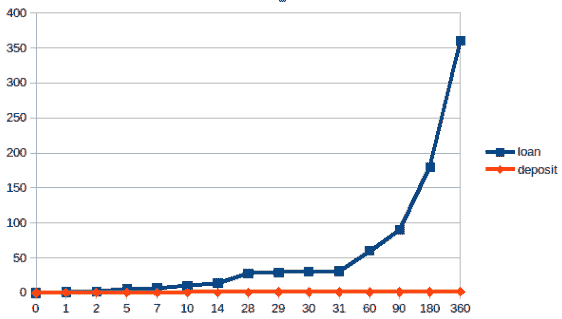
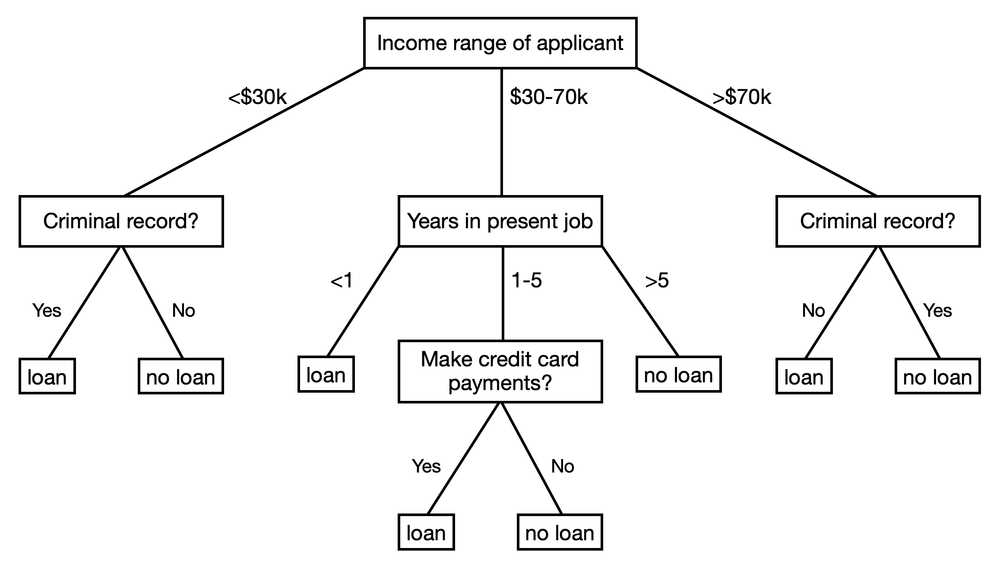
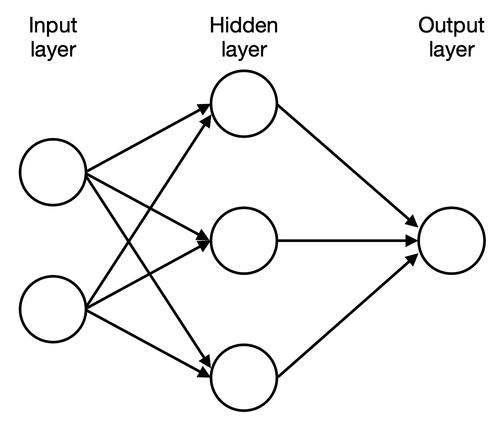
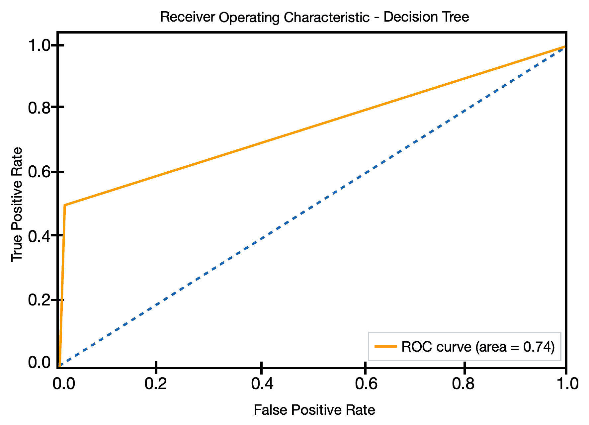

商业银行通过贷款给借款人赚取利息来赚钱。在许多情况下，贷款变成了银行的不良资产(T2 不良资产)。有些情况下，借款人可能会破产，给银行带来损失。在这种情况下，商业银行评估借款人及时偿还贷款的能力变得至关重要。

现在，如果我们仔细观察这个场景，我们会发现每笔贷款都是由其他客户存入的资金提供的。因此，商业银行欠储户一段时间的存款利息。这通常是存款人存款的利息，由银行按季度记入贷方。如果银行向借款人收取更多的利息，而向存款人支付较低的利息，银行也会获利。

在本章中，我们将通过使用**强化学习** ( **RL** )来推导这两种情况的解决方案，这是机器学习的一个重要领域。除此之外，我们还将看看 RL 如何在银行职能中发挥作用的例子。RL 是机器学习的三个领域之一，其他是监督学习和非监督学习。RL 特别适用于需要根据周围环境或当前环境做出决策的情况。在 RL 中，向代理呈现向奖励移动的选项。代理必须从可用选项中选择一个。如果选择了正确的选项，代理人将获得奖励。否则，代理会受到处罚。代理人的目标是最大化他们每一步接近回报的机会，并最终获得回报。

所有这些概念应分为以下主题:

*   分解银行的职能
*   人工智能建模技术
*   模型性能的度量
*   建立破产预测模型
*   使用强化学习为贷款提供资金

在我们继续学习 RL 之前，有必要了解银行业务及其运作方式。

# 分解银行的职能

在银行内部，作为资金过剩者(存款人)和资金需求者(借款人)之间的中介，有两个重要问题需要回答:

*   借款人的风险有多大？
*   钱的资金成本是多少？

这是两个重要的问题，在我们考虑维持业务运营所需的利润以支付其运营成本之前，需要考虑这两个问题。

当这些决策不当时，就会威胁到银行的生存能力。在这种情况下可能有两种结果:

*   如果当风险事件发生时，银行没有足够的利润来支付风险和运营成本，银行可能会倒闭。
*   如果银行不能满足存款人的要求或不能兑现借款人的贷款协议，就会损害银行的信誉，从而赶走潜在客户。

## 主要风险类型

为了回答这个问题，借款人的风险有多大？，我们首先需要了解导致风险的因素。

**风险**是未来影响银行运作的不利结果。对于银行来说，主要的贡献者包括:

*   **信用风险**:这种风险涉及借款人在贷款交易中无法向银行偿还资本；例如，借款公司的财务困境，导致其无力偿还贷款。
*   **市场风险**:这种风险与金融市场不利的价格变动有关，例如银行融资市场的利率上升。
*   **操作风险**:该风险涉及银行作为一个组织在运营中发生的事件。这可能包括内部盗窃、网络攻击等等。

有关风险类型的完整列表，请参考国际清算银行的巴塞尔框架([https://www.bis.org/bcbs/basel3.htm](https://www.bis.org/bcbs/basel3.htm))。

## 资产负债管理

商业银行需要存款来为贷款提供资金。除了评估借款人的风险之外，银行还发挥了一个有用的功能，那就是将储户的存款转化为借款人的贷款。因此，对存款人和借款人来说，定价机制都很重要。对银行来说，贷款位于财务报表的资产端，而存款位于业务的负债端。因此，这通常被称为**资产负债管理** ( **ALM** )。

在本书中，我们将只关注整个 ALM 功能的一部分——融资方面——而不涉及流动性风险、利率风险和外汇风险等其他风险。以下是银行 ALM 职能部门的目标:

*   资产负债管理的首要目标是确保贷款得到存款的支持，并确保银行有足够的存款，以防储户要求取回存款。就总量而言，大约 100 美元的存款支持 70 美元的贷款。参考一些最大银行的比率，客户存款与客户贷款的比率应该在 1.2:1 至 1.5:1 左右。
*   其次，还有一个方面是关于存款的期限和贷款的发放时间。多长时间的问题称为**持续时间**。为了满足长期贷款承诺，银行还需要将存款锁定足够长的时间，以确保贷款得到存款的长期支持。
*   第三，资产负债管理功能需要盈利，这意味着资产负债管理的收入应该高于资产负债管理的成本。*成本*是您给出的 ALM 定价。这个成本实际上是给 ALMs/银行的收入，而给客户报的存款利率是银行的费用。

众所周知，银行的盈利秘诀之一是将短期存款(价格较低)转化为长期贷款(利息收入较高)。下面的曲线显示了银行存款和贷款的定价情况:



在上图中， *x* 轴显示存款/贷款头寸将在银行保留多长时间(以天为单位)，而 *y* 轴显示年化利率。

## 利率计算

虽然有许多方法来计算存款的利息，但最常见的计算利息的方法是以年化的形式来计算利息；也就是说，就好像利息已经放了一年，不管它会放多久。

例如，如果一笔存款的 7 天利率是 1%，这意味着在 7 天内，我们将得到以下结果:


我们只需要将年化利率除以 7 天，就可以得到 7 天的收益。这背后的原因是，对于市场交易商来说，有一个标准化的报价方式是有用的。

在本章后面的*使用强化学习*部分，我们将使用这个公式进行利息定价和存款定价。然而，关于利息定价还有许多其他的细节，有不同的复利方式(利息可以从利息中获得)和天数约定(365 天、实际日历或实际工作日、360 天、220 天等等)。出于说明的目的，我们将假设一年由 365 天组成，我们将使用简单的利率而不考虑复利。

## 信用评级

除了资产负债管理中描述的贷款成本之外，银行的另一个作用是在与客户打交道时评估风险水平。这种风险增加了融资成本。这个概念在银行被称为信用评级。

巴塞尔委员会评估并实施全球银行风险管理法规。根据巴塞尔委员会(【https://www.bis.org/bcbs/qis/qis3qa_f.htm】)对违约*t/损失*的*定义，信用评级预测借款人(被评级的人)在一年内破产的概率。由于公司破产，借款人通常会拖欠贷款。所以，我们通常交替使用违约和破产。*

关键问题是，根据所需信息，该公司在 1 年内破产从而无法履行其还款义务的可能性有多大？这可能是由许多原因造成的，但一个明显的原因是公司的财务状况不佳。

财务报表就像一家公司的成绩单——尽管它需要时间来制作，但它符合某种国际公认的标准，并有审计师的质量保证。

# 人工智能建模技术

既然我们已经理解了业务的功能，是时候进入一些技术概念了。在这一部分，我们将学习人工智能建模技术，包括蒙特卡罗模拟，逻辑回归模型，决策树和神经网络。

## 蒙特 卡罗模拟

蒙特卡洛模拟通过假设可以用概率描述的随机运动，使用大量计算来预测对象的行为。这种方法是一种标准工具，用于研究物理学中分子的运动，这种运动只能通过确定的运动模式来预测，而运动模式是由概率描述的。

金融专业人士采用这种方法来描述证券的定价运动。我们将在本章后面的*使用强化学习为贷款融资*部分中使用它来模拟定价。

## 逻辑回归模型

逻辑回归模型是人工智能在银行业中最受欢迎的应用之一，尤其是在信用风险建模领域。模型的目标变量将是 1 或 0 的二元结果，满足目标的概率为 1。1 和 0 所指的决定取决于我们如何准备数据。

在这种情况下，目标变量可以是一家在 1 年内申请破产的公司。该模型被称为逻辑，因为模拟 1 和 0 的函数被称为 **logit** 。之所以称之为回归，是因为它属于一种叫做回归模型的统计模型，这种模型致力于确定一个结果的因素的因果关系。

## 决策树

决策树算法实际上属于算法的监督学习组。但是，由于算法的性质，它通常用于解决回归和分类问题。回归和分类通常需要根据手头的情况做出决策。因此，这些问题通常使用强化学习算法来解决。

拥有决策树的好处在于，我们实际上可以可视化决策树的表示。决策过程从树的顶端开始，向树的叶节点分支。叶节点是目标变量的终点。被分类到相同叶节点的变量的所有值包含相同的默认概率。以下是决策树算法的可视化示例，该算法决定向申请人提供贷款:



在决策树中向前移动的最常见方法是查看最小叶子大小，这是指每个训练样本被分类到的桶的大小。如果桶中的样本少于`min_samples_leaf`规定的数量，则桶将被废弃。这样做可以减少存储桶的数量(称为决策树的**叶节点)。**

阅读决策树很容易。然而，意识到机器如何学习用于分裂的各种条件是相当惊人的。

## 神经网络

一个简单的神经网络如下图所示:



它由三层组成，即**输入层**、**隐藏层**和**输出层**。每一层都由节点组成。用于解决人工智能问题的人工神经网络模拟了人脑中存在的物理神经网络。人脑中的神经元由人工神经网络中的节点来表示。神经元之间的连接在人工神经网络中用权重来表示。

让我们了解一下神经网络中每一层的意义。输入层用于向模型提供输入。它还负责呈现模型被训练的条件。输入层中的每个神经元或节点代表一个对输出有影响的独立变量。

隐藏层是最重要的，因为它的工作是处理从输入层接收的数据，并负责从输入数据中提取必要的特征。隐藏层由一层或多层组成。

在使用线性表示的数据解决问题的情况下，激活函数(处理输入数据)可以包含在输入图层本身中。然而，为了处理复杂的数据表示，需要一个或多个隐藏层。隐藏层的数量取决于数据的复杂程度。隐藏层将处理后的数据传递给输出层。

输出层负责收集和传输信息。输出层呈现的模式可以追溯到输入层。输出层中的节点数量取决于最终要做出的决策数量。

## 强化学习

在强化学习的情况下，模型接收对它所采取的每一步的反馈。首先，让我们了解强化学习涉及的实体:

*   **代理**:这是演戏的人；在我们的例子中，是银行。
*   **动作**:这是代理完成的实际工作。在我们的例子中，动作指的是银行提供的定价网格。
*   **效用函数**:分配数字来表示一个状态的可取性。效用函数是通过实际**损益**(**P&L**)/融资状态与所提供的定价网格(存款和贷款)之间的交互来学习的。
*   **奖励**:这是结果合意性的数字表示。在我们的例子中，它是累积 P & L(达到或未达到自筹资金目标的二元结果，1 代表达到，0 代表未达到)。如果银行未能满足自筹资金要求，累积 P & L 将等于 0。
*   **策略**:根据估计的效用选择行动。在我们的例子中，我们的政策并没有演变，因为它努力采取提供最大下一个州回报的定价网格。我们的政策导致剥削，而不是勘探，这意味着该政策不会放弃当前的损益来产生长期损益。这是因为如果存款人和借款人在短期内无利可图，而在长期内获得损益，他们将表现出一定程度的粘性。探索是关系银行家的正常行为，他们珍惜关系的长期盈利能力。

## 深度学习

随着我们学习的每一个模型或技术，复杂性都在增加。在本例中，我们将假设输入层中有 36 个变量/特征。输出层将有两个变量/特征，一个是盈利能力，一个是自筹资金状态。在输入和输出层之间将有两个隐藏层，一个紧挨着输入层，有 10 个神经元，另一个有 15 个神经元。这个例子将形成一个为银行制定一般定价决策的神经网络。

为了估计神经网络的盈利能力和自筹资金状态，在输入层中有 127 个变量，三个隐藏层每个具有 15 个神经元，一个输出层具有一个输出神经元，以产生盈利能力(当天的累积盈利和亏损)或客户存款与客户贷款的百分比。

与逻辑回归模型相比，在深度学习的情况下，输入特征要复杂得多，涉及的参数数量是 10 倍以上。

下表显示了定价模式的摘要:

| **层** | **形状** | **参数数量** |
| 投入 | (1, 36) | Zero |
| 隐藏 1 | (1, 10) | Three hundred and seventy |
| 隐藏 2 | (1, 15) | One hundred and sixty-five |
| 隐藏 3 | (1, 15) | Two hundred and forty |
| **总参数** | **第 775 章** |

在上表中，第一列列出了它是哪个图层-输入图层还是隐藏图层。第二列根据从前一层到当前层连接的参数数量表示层的形状。

为了计算参数的个数，我们来考虑一下**隐藏 1** 层。在这种情况下，前一层的 36 个特征连接到当前层的 10 个神经元。我们还需要与当前图层中的要素数量相等的常数，以实现跨要素的缩放。因此，在**隐藏 1** 层中，总参数为 36*10 + 10 = 370 个参数。

知道如何计算参数有助于我们了解训练数据量是否足以训练网络。强烈建议我们确保参数数量至少等于*记录数量* * *历元数量*。想想需要多少公式来确定一个有两个变量的问题——至少两个。公式就像深度学习中的训练数据，而变量就像网络的参数。

# 模型性能的度量

当我们建立一个人工智能模型时，该过程中最重要的方面是定义一种衡量模型性能的方法。这使数据科学家能够决定如何改进和选择最佳模型。

在本节中，我们将了解行业中常用的三个常用指标，以评估人工智能模型的性能。

## 指标 1–ROC 曲线

**接收器操作特性** ( **ROC** )指标衡量分类器相对于随机分类器的分类效果。此指标中使用的分类器是二元分类器。二元分类器基于预定义的分类规则将给定的数据集分成两组。

这与一种情况有关，比如说，我们将这种模型与抛公平硬币进行比较，以将公司分类为违约或非违约，正面表示违约，反面表示非违约。在这里，有 50%的可能性被归类为违约，有 50%的可能性被归类为非违约。

对于抛硬币这种完全随机化的预测系统，很有可能命中真正的概率和命中假正的概率是一样的。但在 1 年内公司违约的情况下，在下面的例子中，它是 6.3%(1828 个中的 123 个)，这意味着我们有 1828 个非违约案例和 123 个违约案例的实际计数。一个真正随机的模型会预测一半的违约情况为非违约。

让我们绘制一个图表，将真阳性率和假阳性率显示为 ROC 图。True 或 false 表示对默认事件所做的预测实际上是 true 或 false。正意味着分类器是正的(在这种情况下等于 1，这是默认值)。

当我们不做预测时，真阳性和假阳性率都是 0。当我们检查了 50%的样本(给定为 1，951/2)时，我们应该默认得到 50%的样本，其中 50%的猜测是假阳性。当我们得到 100%的样本时，我们应该有 100%的样本为真阳性，100%的样本为假阳性。

这种随机化分类器的性能由该图中的虚线表示:



在最理想的分类器情况下，我们应该能够将真阳性率提高到 100%，假阳性率为 0%(在上图中用黄线表示)。

对于最差的分类器，其将所有事物分类为 100%不正确，真阳性率应该是 0%，假阳性率应该是 100%(由红点表示)。ROC 的使用在信用风险模型验证中也很普遍。

## 指标 2–混淆矩阵

混淆矩阵是用于测量分类器性能的最流行的度量，有两种结果:

|  |  | **实际:地面实况** |
|  |  | 真实默认 | 假/非默认 |
| **分类器预测** | 正/默认 | Sixty-two | Twenty-seven |
| 负/非违约 | Sixty-one | One thousand eight hundred and one |
|  |  | 真阳性率= 62/(62+61) | 假阳性率= 27/(27+1801) |

混淆矩阵也提供了类似于 ROC 曲线的结果。这背后的主要思想是通过行和列来分离预测和基本事实。

## 指标 3-分类报告

分类报告是评估模型性能的另一种方式，有以下指标:


这些指标的详细情况如下:

*   **精度和召回:**精度解决模型预测的真阳性率，而召回解决模型的覆盖率。精度衡量预测值占预测值的百分比。召回衡量预测为期望值的目标值的百分比。
*   **F1-score** :衡量模型整体准确性的最重要指标之一是 F1-score。这是精确和回忆的调和平均值。这是我们用来比较车型性能的。
*   **Support** :这是另一个术语，表示最左边一列中所列值的记录数。实际违约案例 123 个(在*违约*栏下目标*值= 1* )。

# 建立破产风险预测模型

作为贷款人，银行需要决定能够覆盖贷款成本的利率。银行通过考虑其从他人处借款的成本，加上公司在从银行贷款后可能申请破产的风险来提供利率。

在这个例子中，我们将假设一个银行家的角色来评估借款人破产的概率。这方面的数据来自 data . world([https://data . world](https://data.world))，它为我们提供了不同公司破产预测的数据。此链接中可用的数据是从**新兴市场信息服务** ( **EMIS** )收集的。EMIS 数据库有关于世界新兴市场的信息。

EMIS 分析了 2000 年至 2012 年期间的破产公司和 2007 年至 2013 年期间的运营公司。收集数据后，根据预测期进行了五种分类。第一年类是包含预测期年度的财务比率的数据。另一个类别标签显示了 5 年后的破产状态。

## 获取数据

我们将使用一个开源程序进行数据转换，然后使用另一个程序根据下载的数据训练一个模型:

1.  我们从获取从新数据源下载的数据开始。但是，它是通过浏览器下载的，而不是通过数据馈送。以`.arff`结尾的文件将从 data.world 中获得，其 URL 为[https://data.world/uci/polish-companies-bankruptcy-data](https://data.world/uci/polish-companies-bankruptcy-data)。通常，我们可以使用 1 年的破产数据作为模型预测 1 年内破产的数据。在我们的例子中，我们将使用一个包含 5 年数据的数据集。
2.  然后，我们将对数据进行预处理，并通过提取、转换和加载来执行特征工程。在这种情况下，从 data.world 下载的文件是`.arff`文件格式，Python 不容易读取。可用于转换文件类型的代码可在 GitHub([https://github.com/jeffreynghm/AIFinance_Packt](https://github.com/jeffreynghm/AIFinance_Packt))上找到。

## 构建模型

在本例中，我们将尝试三种类型的模型:逻辑回归、决策树和神经网络。

在计算能力变得唾手可得之前，根据我们试图解决的问题以及我们需要从机器那里得到什么答案来选择模型是相当常见的。然而，如今，我们倾向于尝试所有可能的模型，并选择能够提供最佳性能的最佳模型。

在这种情况下，我们可以将其标记为我们想要预测的东西。我们希望预测的目标行为是公司违约——这在机器学习领域中称为目标变量。当给定输入数据时，我们将通过部署通用指标来比较不同模型之间的性能，从而确定模型在预测目标变量方面的准确性。

在本例中，我们将需要以下库:

*   `os`:用于文件路径操作。
*   `re`:匹配列标题的正则表达式。
*   `pandas`:保存数据的 DataFrame。
*   `matplotlib.pyplot`:绘制模型结果，展示其准确性。

*   `seaborn`:一个漂亮的数据分析可视化工具。
*   `sklearn`:机器学习库，包括非常强大的数据准备，用于分裂、训练和测试集，重新调整数据值以馈入神经网络，处理缺失值或值异常，等等。
*   `pickle`:用于保存机器学习过程中生成的模型的文件格式。
*   `graphviz`:用于可视化决策树。

步骤如下:

1.  使用以下代码导入所有相关的库:

```
import os
import re
import pandas as pd
import matplotlib.pyplot as plt 
import seaborn as sns

from sklearn.metrics import classification_report,roc_curve, auc,confusion_matrix,f1_score
from sklearn.model_selection import train_test_split
from sklearn.feature_selection import RFE
from sklearn import linear_model,tree
from sklearn.neural_network import MLPClassifier
from sklearn.preprocessing import StandardScaler

import pickle
import graphviz
```

对于逻辑回归，当决定选择哪些特征时，我们将依赖于测试不同特征的准确性。将选择提供最高精度的组合。

2.  定义`optimize_RFE()`函数，该函数将执行特征选择过程。该函数将尝试不同的特征组合，以获得最高的真阳性和最低的假阳性。我们将测量性能，以确定产生最佳性能的功能数量。以下是函数定义的代码:

```
def select_columns(df, col_list):
    ...
def generate_column_lists(col_support,col_list):
    ...
def optimize_RFE(logreg, X, Y, target_features = 10):
    ...
    while trial_cnt<=target_features:
        rfe = RFE(logreg,trial_cnt,verbose=1)
        ...    
        select_cols = generate_column_lists(col_support, col_list)
        X_selected = select_columns(X,select_cols)
       ...            
        #build model
        ...    
        ##metric 1: roc
       ...        
        #memorize this setting if this ROC is the highest
        ...        
    return max_roc_auc, best_col_list, result_list

def train_logreg(X,Y):
    print('Logistic Regression')
    logreg = linear_model.LogisticRegression(C=1e5)
    roc_auc, best_col_list, result_list = optimize_RFE(logreg, \
                                                       X, Y, 20)    
    scaler = StandardScaler()
    scaler.fit(X_train)
    ...
    ##metric 1: roc
    ...
    ##metric 2: Confusion matrix
    Y_pred_logreg = logreg.predict(X_test)
    confusion_matrix_logreg = confusion_matrix(Y_test, \
                                               Y_pred_logreg)
    ...
    #common standard to compare across models
    f1_clf = f1_score(Y_test, Y_pred_logreg, average='binary')
    ##Quality Check: test for dependency
    ...
    ##save model
...
```

3.  除了逻辑回归模型，我们还将建立一个决策树。特征选择将由算法在训练时执行。因此，与逻辑回归模型不同，我们不需要限制作为输入提供给训练过程的特征的数量:

```
'''
## Decision Tree
'''
#feed in data to the decision tree
def train_tree(X,Y):
    print('Decision Tree')
    #split the dataset into training set and testing set
    ...
    tree_clf = \
        tree.DecisionTreeClassifier(min_samples_leaf=min_leaf_size)

    #preprocessing the data
    scaler = StandardScaler()
    scaler.fit(X_train)    
    ...    
    #fit the training data to the model
    ...
    ##metric 1: roc
    ...
    ##metric 2: Confusion matrix
    ...
    #common standard to compare across models
    ...
    ##save model
    ...
```

4.  最后，我们将在混合模型中添加一个神经网络。它类似于决策树。特征选择将由算法在训练时执行。但是，为超参数调整执行网格搜索是很重要的。我们正在寻找的超参数属于神经网络结构；也就是说，我们需要构建多少层才能实现最高性能。下面的代码用于为逻辑回归模型定型:

```
##Grid search that simulate the performance of different neural network #design
def grid_search(X_train,X_test, Y_train,Y_test,num_training_sample):
    ...
    #various depth
    for depth in range(1,5):
        ...
        for layer_size in range(1,8):
            ...
            nn_clf = MLPClassifier(alpha=1e-5, \
                     hidden_layer_sizes=hidden_layers_tuple, \
                     random_state=1)
            ...
    ...

    #various size

def train_NN(X,Y):
    print('Neural Network')
    #split the dataset into training set and testing set
    ...

    #preprocessing the data
    scaler = StandardScaler()
    scaler.fit(X_train)
    ...
```

对于本章列出的所有模型，我们还需要测量精度。我们将使用两种不同的方法来测量精度。在这个分类问题中使用了各种度量。然而，当涉及到建立一个将一家公司分类为违约或非违约的机器学习模型时，我们需要确定。

5.  定义这些函数后，我们使用下面的代码示例来实际调用函数。三个模型都是一个一个造出来的。结果存储在`f1_list`中，以便以后打印出来:

```
f1_list = []
f1_score_temp= 0

#logistic regression model
log_reg,f1_score_temp = train_logreg(X,Y)
f1_list.append(f1_score_temp)
log_reg.get_params()

#decision tree
tree_clf,f1_score_temp = train_tree(X,Y)
f1_list.append(f1_score_temp)
tree_clf.get_params()

#neural network
nn_clf,f1_score_temp = train_NN(X,Y)
f1_list.append(f1_score_temp)
nn_clf.get_params()
```

6.  使用以下代码可视化每个模型的性能:

```
'''
#4 Visualize the result
'''
print('********************')
print('f1 of the models')
print(f1_list)
print('********************')
```

7.  使用以下代码示例来可视化模型:

```
#for visualization of decision tree
x_feature_name = fields_list[:-1]
y_target_name = fields_list[-1]
d_tree_out_file = 'decision_tree'
dot_data = tree.export_graphviz(tree_clf, out_file=None, 
                         feature_names=x_feature_name,  
                         class_names=y_target_name,  
                         filled=True, rounded=True,  
                         special_characters=True) 
graph = graphviz.Source(dot_data) 
graph.render(d_tree_out_file)
```

在下一节中，我们将使用强化学习来决定是否为客户贷款提供资金。

# 使用强化学习为贷款提供资金

假设我们的角色是银行的负责人，计算贷款的融资成本就变得很重要。我们正在解决的问题由三方(或者我们称之为**代理人**)组成——银行、储户和借款人。首先，我们假设只有一家银行，但有许多储户和借款人。存款人和借款人将通过随机生成的数据来创建。

当涉及到在机器学习中模拟这些当事人的不同行为时，其中的每一个都被称为代理或对象的实例。我们需要创造成千上万的代理人，一些是储户，一些是借款人，一个是银行，一个是市场。这些代表了相互竞争的银行的集体行为。接下来，我们将描述每种类型代理的行为。

假设我们担任银行的财务主管或国库负责人。资金主管的工作是对无风险融资成本进行报价。与客户打交道的银行家将承担融资成本，并加上信用风险溢价，以弥补总融资成本。任何高于融资总成本的额外保证金将是银行的净贡献。但当涉及财务报表报告时，来自客户的实际利息收入将扣除存款人或借款人支付给银行的净利息成本。

我们希望在银行开始营业之前生成每个到期日(1 天、2 天等等)的贷款和存款价格。公共领域没有这样的数据集。因此，我们将对数据进行模拟。到期日、贷款或存款金额、起始日期和利率都将被模拟。

## 了解利益相关者

在使用 AI 建模定义解决方案时，我们通常会模拟相关实体的行为。首先理解利益相关者的行为变得至关重要。为了这个例子，我们必须理解三个实体的行为方面——银行、存款人和借款人。

银行有两个目标:

*   为存款和贷款生成定价网格。
*   计算其利润/损失，以及在任何时间点的自筹资金状态。

存款和贷款的定价网格假定在不同的到期日定价。

在这个例子中，已经引入了强化学习来更新定价，以及通过考虑最近的行动对损益和资产负债率的影响来接受反馈。假设存款人在存款到期时对存款利息有不同的预期。在一天结束时，我们假设存款人索取他们自己的利息收入，以及银行账户中报告的存款额。

在开市前一天和存款到期日，储户会考虑是要留下还是取出存款。在这一点上，我们通过随机生成预期兴趣的%机会来模拟决策。有 50%的机会预期利率上升，有 50%的机会要求利率下降。然后将这一预期与该特定到期日的银行贷款利率进行比较。如果银行满足这个预期，那么存款就会留下来；否则，存款将在相同的到期期限内离开银行。

关于利率预期如何变化，有两个变量用于储户:一个是完全线性的，而另一个遵循正态分布。如果存款离开了银行，我们假设相同金额的存款会被放在另一家银行。因此，在另一家银行的存款到期日，储户将设定他们的预期，并评估是留在还是回到原来的银行。

对于借款人，假设其行为与存款人的行为相同，具有相同的日终应计活动。然而，在一天中，贷款在同一天到期的借款人将重新考虑他们的去留意向。这由利率预期来表示，模拟的确切方法与储户的相同，但不同之处在于，银行提供的贷款必须低于借款人的预期定价，才能留下来进行再融资。

## 达成解决方案

以下是创建借款人和存款人每日关闭银行帐簿的步骤:

1.  首先，我们需要从贷款和存款列表中导入数据，以生成借款人和存款人的列表。在此步骤中，从电子表格中加载场景，以模拟不同日期的借款人和存款人。以下代码示例显示了用于生成借款人和存款人列表的函数定义:

```
##Step 1: Import Data from the list of Loans and Deposits
##Based on an input file, generate list of borrowers and depositors at the beginning
##Keep the master copy of clean clients list
'''
list_depositors_template,list_borrowers_template = generate_list(f_deposit_path,f_loan_path,start_date)
```

2.  在每次迭代的开始(除了第一天营业)，提供市场定价，银行也需要提供定价。我们生成固定数量的模拟(1000 次)。在每个模拟中，我们假设一个 10 年的周期(3，650 天= 365 天/年 x 10 年)。在任何一天，存款人和借款人都通过参考市场利率来设定他们的预期。当我们开始每个模拟的第一天时，从存款和贷款列表中创建存款人和借款人。以下代码运行 1，000 次模拟:

```
print('running simulation')
for run in range(0,1000):
    print('simulation ' +str(run))
    #reward function reset
    reward = 0

    list_depositors = copy.deepcopy(list_depositors_template)
    list_borrowers = copy.deepcopy(list_borrowers_template)
    ...
```

执行上述代码将创建一个银行对象。此时，银行内部会初始化两个神经网络——一个用于存款定价，一个用于贷款定价。名为 **market** 的银行也是如此。

市场定价是基于通过蒙特卡洛模拟输入市场的初始定价而随机化的。在市场定价的基础上，借款人和存款人通过参考市场定价以及归因倾向来设定他们的预期。在设定他们的期望值后，会生成两种不同的存款定价和贷款定价网格。

3.  存款定价和贷款定价由两个神经网络和蒙特卡罗模拟生成。神经网络决定了贷款和存款定价网格所需的网格移动。但是，`bank`对象也根据神经网络生成的定价生成随机定价。以下代码用于构建模型:

```
#build a model if this is the first run, otherwise, load the saved model
#bank and environment objects created
...
deposit_pricing_grid_pred = jpm.generate_deposit_grid(deposit_constant_grid)
loan_pricing_grid_pred = jpm.generate_loan_grid(loan_constant_grid)
loan_pricing_grid_prev = loan_empty_grid
deposit_pricing_grid_prev = deposit_empty_grid
loan_pricing_grid_final = loan_empty_grid
deposit_pricing_grid_final = deposit_empty_grid

#market is also a bank (collective behavior of many banks)
#market object created
market = bank()
...

daily_loan_list=[]
daily_deposit_list=[]
daily_net_asset_list=[]
cum_income_earned =0
cum_expense_paid =0

mkt_expense = 0
mkt_income = 0

for i_depositor in list_depositors_template:
...

for i_borrower in list_borrowers_template:
...
```

这样，环境就创造出来了。这里，环境对象包含神经网络模型，该模型为给定的定价网格(贷款和存款)以及外部环境(如市场定价、到期借款人和存款人)提供报酬估计。

4.  生成当天的价格网格:

```
##Generate two pricing grids for the day
mkt_deposit_pricing_grid, mkt_loan_pricing_grid = \
                            market.generate_pricing_grids_MC()
loan_pricing_grid_pred,x_np_loan = jpm.generate_loan_grid_ML(...)
deposit_pricing_grid_pred,x_np_deposit = \
                            jpm.generate_deposit_grid_ML(...)
loan_pricing_grid_prev = loan_pricing_grid_final
deposit_pricing_grid_prev = deposit_pricing_grid_final
...
```

银行的定价模型基于机器学习模型。市场是基于参照我们硬编码的初始值的随机过程。同时，将计算到期情况(今天到期的贷款和存款),并建立客户对定价的预期。这种预期是基于市场定价和由所定义的辅助函数随机化的内部需求。

5.  生成可能定价的列表，预测回报，并选择最佳定价。这一步在强化学习领域被称为**动作**。行动是向客户和市场同行报价的行为。基于上一步生成的定价，我们通过随机过程创建了更多的变体(在我们的例子中是 20 个):

```
## Generating list of all possible loan / deposit pricing, including previous, and current predicted pricing
...
#generate lots of variations:
for i in range(0,num_randomized_grid):
...

#accessing each of the choice
...

## Predict the reward values of each the variation and make the choice of pricing
for loan_i in range(0,num_grid_variations):
     for deposit_i in range(0,num_grid_variations):
     ...
     #Policy A
     if max_reward<= temp_reward:
     ...

     #Policy B: if both conditions fail, randomize the choice
     ...

     #Policy C: Choose the best choice & reward
     ...
```

使用环境对象的机器学习模型，我们可以预测每个变化的结果，并选择最佳变化以最大化盈利能力，用存款满足资金需求。

6.  执行定价网格。收入和费用是基于所选择的定价网格生成的，该网格在满足自筹资金平衡目标的同时生成最大估计净利润。一旦银行的定价网格被选定，就与到期的借款人和存款人一起执行。有些人会留下来，有些人会离开银行:

```
#Carry forward the deposit and Roll-over the loan
#stay or not
##Update borrower and depositor
for i_borrower in list_borrowers:
...

for i_depositor in list_depositors:
...

# Actualized p n l
##*************************************
# with clients
for i_borrower in list_borrowers:
#pocket in the loan interest
...

for i_depositor in list_depositors:
#pay out the deposit interest
...

#market operations
...

##*************************************
#End of day closing
##*************************************
#cumulative income = income earned from client + income earned from market (if any excess deposit placed overnight)
...

#cumulative expense = expense paid to the client + expense paid to market (if any insufficient deposit to fund overnight pos)
...

#Closed book for the day
...

f_log.write('\n****************summary run:' +str(run) + ' day ' +str(day_cnt)+'****************')
...
```

在一天结束时，将为留在银行的人累计利息，并在银行的会计账簿中更新利息(变量在`bank`对象中)。每日位置也输出到日志文件中。

获胜的组合将被输入到模型中，用于银行和环境的进一步强化学习。反馈将包含银行存款和贷款网格定价的实际 will 对于环境而言，实际盈利能力和自筹资金状况将反馈到奖励模型中。

实际 P&L 和自筹资金状态作为反馈提供给`environment`对象和`bank`对象，以便更准确地预测奖励和定价。

7.  每次模拟后，结果都保存在输出文件中，我们可以监控强化学习的进度。每次模拟结束时，输出最后一天的快照结果。使用以下代码生成输出:

```
#output result of this run and save model
print('run ' + str(run) + ' is completed')
...
```

轴 *x* 上的每一条代表 10 次模拟的平均 P & L。模拟的 P & L 在第八个小节达到峰值。通过对日志文件中的每个模拟结果进行详细分析，我们可以看到 P & L 的改进在第 87 次模拟时停止，因为 P & L 在第 80 次以上的模拟时达到稳定状态。随着进一步训练，P & L 下降，从而出现过度训练的迹象。

# 摘要

在这一章中，我们通过两个例子了解了不同的人工智能建模技术——第一个是关于预测借款人破产的可能性，另一个是关于计算贷款的资金。在本章中，我们还学习了强化学习。还涵盖了其他人工智能技术，包括深度学习、神经网络、逻辑回归模型、决策树和蒙特卡罗模拟。我们还在本章提供的例子中了解了银行的业务职能。

下一章，我们将继续学习更多的 AI 建模技术。我们将学习线性最优化和线性回归模型，并用它们来解决投资银行的问题。我们还将学习人工智能技术如何成为资本市场决策机械化的工具。