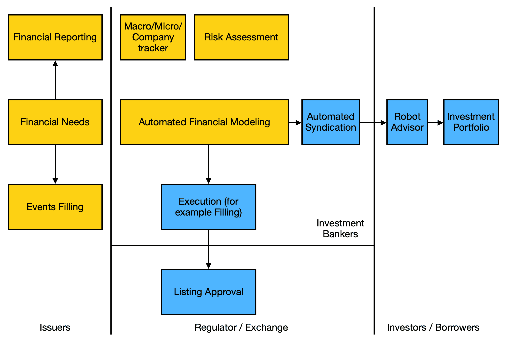

# 五、预测投资银行家的未来

在前一章中，我们学习了强化学习。我们学习了如何使用强化学习来自动化银行决策。我们还学习了人工智能建模技术，如蒙特卡洛模拟、逻辑回归模型、决策树、神经网络和深度学习。然后，我们学习了如何建立一个破产风险预测模型，并使用强化学习的决策来为贷款提供资金。

在本章中，我们将了解金融和资本市场的基本概念。我们将看看人工智能如何通过运行风险模型来使用宏观经济数据生成销售预测，从而帮助我们优化最佳资本结构。规划一个组织的内部财务领域和外部投资者的沟通是很有用的。除了商业银行活动(包括为公司的日常交易活动提供资金)之外，投资银行业务还寻求将投资者的资金吸引到公司背后，这些公司可能希望在从这些融资市场为中长期活动部署资本方面有更大的灵活性。我们将看两个例子，它们将帮助你对资本需求进行财务规划。

我们将在本章中讨论以下主题:

*   理解投资银行的愿景
*   金融领域的基本概念
*   人工智能建模技术
*   寻找最佳资本结构
*   使用宏观经济情景提供财务绩效预测

我们开始吧！

# 理解投资银行的愿景

在我们研究金融领域的基本概念之前，我们必须了解投资银行的愿景。投资银行的未来取决于对公司未来财务表现和行为的估计有多准确，以及如何在模型中捕捉业务的关键因素作为特征。向投资者分发证券将实现自动化，银团贷款也是如此。接下来的两章将介绍客户方在资本决策方面将会发生的变化，以及投资银行家方在如何使用该模型寻找投资者以支持客户的资本需求方面的变化(通过债务或股票发行筹集资本的客户称为**发行人**)，以及根据财务方面预测客户的并购需求&。

## 投资银行业务的表现

一旦所有这些预测都由机器做出，自动备案将通过一个连接公司与监管机构和交易所的 API 来实现。下图显示了发行人、投资银行、投资者/所有者和监管者/交易所如何工作和协调:



在上图中，**发行人**是与注册和销售证券相关的法人实体。发行人出售这种证券是为了给实体的运营融资。发行人必须执行的任务包括准备财务报告和评估财务需求。投资银行通过为发行人执行各种操作来促进上市和批准过程。

# 金融领域的基本概念

在本节中，我们将了解金融领域的基本概念。我们将从了解财务报表是如何形成的开始。我们还将了解如何优化资本结构的理论部分。

## 财务报表

财务报表用于公司的健康报告。财务报告是上市公司年度报告的一部分，是解读公司财务健康状况的基础。

银行家从这份报告提供的结果中推荐理财产品，投资者则通过参考这份报告进行投资决策。关于财务报表，有两种主要类型:

*   **资产负债表**:这是关于整体净值。它详细说明了总投资(资产)、我们欠对方的债务(例如，信用卡和抵押贷款、负债等)以及减去投资后的负债净额，即净值(股权)。
*   **损益科目** ( **P & L** 或利润表):此类型显示财政年度的动态。这就像每月的支出和收入报告。

除了主要类型之外，我们还有以下类型的财务报表:

*   股权变更
*   综合收益表
*   现金流量表

这些描述了所有者权益的变化，损益表中没有记录的收入，以及现金流动。但是，为了简化示例的范围，我们不会查看这三个语句。

### **实时财务报告**

每一笔交易都作为输入输入到会计系统，而每一笔交易都被归入一个账户，这个账户将被归入这些报表中的一两个。在一天结束时，每个帐户将被归类为一个帐户条目。

通过分析时间序列数据(在[第二章](9ee6480e-c259-4e5d-bc11-31057de1a173.xhtml)、*时间序列分析*，我们可以清楚地看到长期预测的局限性。因此，为了生成准确的预测，我们的方法转换为执行频繁更新的短期预测。因为我们是公司的一部分，所以完全有可能根据每天流经系统的交易数据生成每日财务报表。对于那些不了解会计系统和财务报告的人来说，我们的 Excel 表格提供了一个交易数据如何汇总成财务报告的例子。下表显示了该账户在资产负债表和损益表中的分类:

| **项目** | **资产** | **股权** | **责任** | **P & L** |
| 股份资本 | Y | Y |  |  |
| 营运资本 | Y | Y |  | Y |
| 资本支出 | Y | Y |  | Y |
| 借入资本 | Y |  | Y |  |
| 银行贷款 | Y |  | Y |  |

**股本**是我们为一家公司的诞生所投入的资金数量(资本是指有生产力的资金)。这就像我们出生时从父母那里获得的资源。它属于公司的权益，自然也是公司拥有的资产的一部分。股东是向公司出资的人；因此，他们是公司的所有者。公司预计会支付股息(可以是现金或公司股票的形式)来回报投资者，通常是每年一次。关于他们在公司拥有的钱，在偿还他们欠别人的(作为负债)之后，他们拥有一切。

营运资本和资本支出(资本支出)就像我们日常的经常性支出，是维持家庭生活所必需的，比如食品杂货、账单和燃料。想象一下，资本支出是一项重大的家庭维修，可以让你拥有的房子看起来更好，并带来更高的市场价值，或者是你作为优步司机购买的一辆新车(对于人工智能研究人员来说，一台 GPU 计算机可能是一项资本支出)。这样，任何影响 P & L 的事情都会影响权益和资产，这意味着我们的净收入将成为我们净值和资产的一部分。对于公司来说，资本支出是用来购买财产和设备的。

**负债:**负债资本和银行贷款是借入的资金和资产。当我们借入这些负债时，它们通常以现金形式流入，但我们会立即将这些现金用于资本支出。债券持有人和贷款人是向公司提供债务资本和银行贷款的人。预计公司将支付利息(现金)以回报贷款人/债券持有人，通常每半年支付一次。债券利息也被称为**息票**。我们借的金额被称为**本金**。所以，在每一个借贷关系中，我们都有本金和利息。

首席财务官的目标:拥有不同种类的资本或资金，你可能会奇怪为什么会有一个公司。它应该做什么？根据马克斯·韦伯(【http://sk.sagepub.com/books/writers-on-organizations】[)的观点，企业应该通过组织企业内部的资源来有效地交付经济价值。因此，身为首席财务官意味着我们正在组织财务资源，以支持公司主要经济活动的实现，这些活动可能是为杜克能源公司生产能源，或者组织货物，以便它们到达我们在超市的最终客户手中。](http://sk.sagepub.com/books/writers-on-organizations)

## 优化企业最佳结构的理论

最佳的资本结构是引导融资为公司的发展提供资金，同时以最适合公司业务的正确风险偏好最大化投资者的投资价值。例如，当公司处于发展阶段，未来不确定时，最好使用粘性资本，即股权来资助它。当公司变得稳定后，为其匹配稳定的资金，也就是债券，是很常见的。

### 需要做出什么决定？

作为一名长期战略首席财务官，我们要做出的决定是股权和我们为公司融资所需的债务的正确组合。在股权方面，我们需要考虑我们发行多少股票来吸引这些所有者，以及多少股息(对投资者的定期贡献)。在债券方面，我们需要考虑多少负债，什么类型，什么货币，利率，以及我们需要多长时间偿还。

### 资本结构的财务理论

这方面的一个很好的资源是 Aswath Damodaran 的*Applied Corporate Finance*([https://www . Wiley . com/en-us/Applied+Corporate+Finance % 2C+4th+Edition-p-9781118808931](https://www.wiley.com/en-us/Applied+Corporate+Finance%2C+4th+Edition-p-9781118808931))。一方面，公司确定一个项目，将其资金投入其中(投资决策)，另一方面，公司安排项目背后的财务资源(融资决策)。我们不是要确定投资什么项目，而是如何融资来实现它。

根据 Bradley、Jarrel 和 Kim([https://econ papers . repec . org/article/blajfinan/v _ 3a 39 _ 3ay _ 3a 1984 _ 3ai _ 3a 3 _ 3ap _ 3a 857-78 . htm](https://econpapers.repec.org/article/blajfinan/v_3a39_3ay_3a1984_3ai_3a3_3ap_3a857-78.htm))的观点，权益和负债(称为**债务**)之间存在一个最佳资本组合，这将产生最低的总体融资成本。虽然 Damodaran 已经总结了许多原因，但让我们专注于如何让人工智能帮助首席财务官确定可量化和可测量的最佳资本结构。

作为数据科学家，我们对两种选择的成本和收益感兴趣，这两种选择都有助于我们找到最佳点。让我们来看看:

| **为什么要拿股权？** | **为什么要举债？** |
| 1)如果没有利润，就没有支付股息的义务——对于现金流不明确的投资，如技术，有更大的灵活性。2)仅仅增加股本不会增加股本成本——大约相当于我们支付的股息。然而，增加债务会增加公司破产的可能性，因为有更多的义务来偿还利息或本金。3)在财务比率的某些细节上更加灵活；例如，一些债券借款人会将公司的某些财务比率限制在特定范围内。 | 4)支付给贷方的利息被计为费用，因此不需要纳税，而如果作为股息支付(对股东而言)，则不会被计为费用，因此需要缴纳利得税。5)现有股东可以保留对公司的控制权，而不会稀释所有权。 |

*   第 1 点关于产生高于融资成本的回报的项目确定性可以通过回报的方差来近似。
*   第 2 点和第 3 点可以编码成一个公式:对于第 2 点，一个公式可以指定债务(称为**杠杆**)在增加破产风险中所占的百分比(信用风险模型在上一章已经解释过了)。对于 3 来说，只是一个可以得到的比值；也就是事务所的税率。

*   第 4 点和第 5 点可以作为一个固定的阈值来实现，限制公司可以筹集的最大股本金额。对于家族企业来说，股权变更很少发生，除非家族发生变化(比如创始人去世)。

## 衡量项目价值的全要素生产率

这实质上是我们在[第二章](9ee6480e-c259-4e5d-bc11-31057de1a173.xhtml)、*时间序列分析*中提出的问题，当使用时间序列分析来自动化客户采购，并试图了解如何预见每个月的需求时。对于长期预测，我们可以使用 ARIMA 模型来做预测。然而，当预测一个项目在一个组织内的成功时，没有一个明确的模型，因为它需要团队成员的数据、项目的执行以及项目的类型和产出，而项目本身是管理研究的一个独立学科的一部分。

我们有三种方法可以做到这一点:

*   通过对市场的深入了解，我们可以假设，如果项目完全没有风险，项目通常会产生资本的市场回报，其下限接近无风险利率。当然，高风险项目的回报会更高。
*   总而言之，如果项目与过去的项目相似，则项目回报的预期值应为项目投资预期回报的现值。它必须等于公司的股本回报率。
*   如果一定要有一个模型，借鉴宏观经济学的文献，生产率是用全要素生产率公式来衡量的:


这里， *Y* 是产量， *A* 是技术的效率， *K* 是花费的资本， *L* 是劳动力。融资、采购和采购方面的资本消耗效率由 *alpha* 表示。劳动技能用 *beta* 表示。让我们更详细地看一下这些:

*   ***A*** ( **技术效率**):技术效率可以是机器每投入 1 美元的全部处理能力所带来的理想经济价值。
*   ***L*** ( **劳动力**):劳动力是指每花费 1 美元，劳动力的全部处理能力所交付的理想经济价值。

*   ***K*** ( **资本**):投入技术和劳动力的资本金额。
*   ***α***(**资本消耗效率**):这可以是中间机构在这个过程中获取的无购买利润所花费的实际经济价值。
*   ***贝塔*** ( **劳动技能**):正如《人力资源与组织行为*一书中所说，成功的项目交付与个体成员的能力以及他们在团队中所扮演的角色直接相关。这可以从越来越多的体育结果预测中看出，这些预测可以预测每场比赛的成功概率。*

 *一个宏观经济模型确实是很多微观层面行为的聚合行为。关于宏观经济学的下一个前沿领域，数据科学家从已经应用于单个公司或聚合微观行为以生成宏观经济行为的宏观经济学模型中获取见解可能是有意义的。

如果我们要提供一个模型来预测公司的每个项目价值，我们经常会发现来自其他学科的见解，我们可以引入交叉授粉的研究，并使用预测模型量化它。掌握这种技术的特征、投资额和劳动力可能是研究宏观经济学的一个好的起点。

这样做可以让我们预测项目的经济价值，这本身就是一个机器学习模型。我们不打算在这里讨论这个问题，因为我们希望在这一章集中讨论高层次的财务决策，但是财务的下一个前沿可以产生价值。

## 项目的现金流模式

除了项目的生产率/经济价值，我们还需要找出项目的确切的现金流支付或收入。这个问题的答案是从一个集中的信任库中跟踪项目的所有事件。但是等等:为了让所有各方共享关于同一个项目的信息，我们需要一个完全分散的地方，而不是一个成为黑客中心的中央存储库；这是区块链的理论基础。最佳的现金流模式预测来自于获取触发现金流活动的数据:由签署进度触发的项目状态、根据付款条款确认销售协议、确认仓库收到货物，等等。

实际上，在当今世界，这些步骤中的大多数仍然需要人工输入，因此更容易要求相关人员提供前瞻性的现金流预测。当然，如果所有这些活动都变得自动化，由智能机器处理，并编入结构化数据库，似乎有可能可靠地预测未来的现金流。

即使我们把球传给人类输入数据，在金融领域，我们要求人类提供三种情景——最优、现实和悲观——每种情景的发生概率都不同。预期预测将是这三种情况的预测结果。然而，考虑到极端预测的潜在问题，似乎更好的做法是允许人类做出现实的预测，并指定此类现金流事件在短时间内发生的可能性。

同样，我们在这里谈论的是支付大笔款项。对于小额和多次付款，我们有以下方法:

*   常规现金流
*   不规则/事件触发的现金流

**常规现金流**基于业务规则；例如，工资发放发生在每周五。但是为了预测下周工资的现金流，我们需要获得人力资源数据库，以及每个员工的工资。

对于日常业务，常规现金流基于为采购和销售支付的费用，我们可以依赖上一章开发的模型。一旦我们预测了需求(销售)，我们就可以根据实际时间可靠地估计所需的采购和相应的延迟付款，因为我们知道公司买家会延迟向供应商付款以获得流动性。为了澄清这一点，这里有几个解释:

*   在金融领域，销售增长所需的营运资本比率可以通过丘吉尔公司和穆林斯公司 2001 年的公式计算出来。([https://HBR . org/2001/05/how-fast-can-your-company-after-growth](https://hbr.org/2001/05/how-fast-can-your-company-afford-to-grow))。
*   延迟付款可能不是供应链的最佳选择，因为我们知道这种延迟付款会导致上游进一步增加对短期融资的需求，以资助商品生产。如果上游供应商的规模较小，如果风险较高/规模较小的供应商以较高的利率获得融资，这实际上会给供应链带来更高的总体生产成本。

**不规则/事件触发的现金流:**这通常由其他方或外部事件触发。处理这个问题的最好方法是改善与客户或供应商的数据交换。

## 预测财务报表项目

在本节中，我们将讨论如何预测财务项目。让我们来看看:

*   销售:如果你是受过金融训练的专业人士，那么最大的驱动力——收入——必须基于对公司提供的商品/服务的需求进行预测。在杜克能源公司的案例中，预测电力市场基本上是着眼于各种细分市场的市场增长:工业、商业和家庭。这是营销工作的最佳方式。

在工业和商业(B2B)市场中，最可靠的预测是着眼于客户的预测；最终，商业实体将不得不创造一些商品和服务供最终客户消费。对于工业和商业市场，我们可以从加州的主要工业活动及其潜在的用电量开始。然后，我们向前一步，观察他们在生产什么。

家庭取决于家庭收入、人口、私人电动汽车，最重要的是，未来几年的天气——无论是厄尔尼诺还是其他任何天气预报，这些都是重要的方面。即使我们可以使用宏观经济数据(及其预测，如天气预报)来预测我们的销售，也不一定总能找到财务报表中每个财务项目的预测值。在这里，我们可以使用已知/可预测的项目来预测其余的项目，这应该具有经济和统计意义。

简而言之，预测销售的最佳方法是预测个人部门的销售活动。

*   **已售商品成本:**这和销量有关。即使我们知道这不是一对一的关系，例如 CFO，我们也可以获得每月的内部成本和销售数字，并建立一个模型来根据销售额预测这些成本。或者，我们可以使用需求数量来预测采购数量。至于杜克能源，单位成本也主要来自大宗商品市场；鉴于我们已经设定了关于何时购买的目标采购策略，并且全球单位成本市场由资本市场驱动，我们可以从市场获得前瞻性定价(即 CME Henry Hub 的 12 个月定价([)https://www . CME group . com/trading/energy/natural-gas/natural-gas . html](https://www.cmegroup.com/trading/energy/natural-gas/natural-gas.html))。

对于实物商品行业的公司来说，如果没有将任何固定成本(如设备、机器等)分配给某个项目，则销售商品的成本与销售额接近 1:1。一个典型的例子是时装业，在这一行业，商品销售成本应该与销售额一致。这些销售额与我们购买商品的成本成正比。

为了说明这一点，让我们对各行业的销售成本进行一个小分析:


*   **营业费用，包括销售费用、一般费用和管理费用** ( **SG & A** ):根据会计准则和公司惯例，有些公司不单独列出折旧和摊销，这与销售活动不是线性的。看一下上表，我们看到的趋势是，固定资产密集型行业(称为**资本支出**)越高，销售额对商品销售成本的预测能力就越低。另一方面，人力越密集但固定资产越少，由于变动成本的百分比越大，商品销售成本变动的可能性就越大。

# 人工智能建模技术

在本节中，我们将了解两种重要的建模技术，称为**线性优化**和**线性回归** **模型**。在前一章中，我们学习了深度学习、神经网络、决策树和强化学习。

## 线性优化

线性优化模型在供应链业务中经常使用，它寻求通过改变一些变量并考虑一些约束来实现优化目标(即最大化利润或最小化成本)。在线性优化的情况下，我们也实现类似于资本结构优化过程的结构。

这不是一个机器学习模型，因为我们不需要训练机器学习任何模式。

## 线性回归模型

这通常被称为回归模型。它所做的是找出结果的一些因素的因果关系。结果必须是数值。在统计学中，*一些因素*是指自变量，因为我们假设所有这些因素都独立于其他因素，而结果是**因变量**。结果取决于独立变量。

# 寻找最佳资本结构

现在，我们可以开始分析我们应该在资本市场上筹集多少股权和债务资本来支持需求(新项目和业务或通过替换磨损或过时的现有机器)和供应(由利润产生)。我们对最优资本结构的预测是有时间限制的；也就是说，它关注的是给定时期(比如下一年)的最优组合。我们当然可以将其扩展到未来 5 年。用于预测业务绩效的公式如下:

*收入增长*所需固定资本/销售额*

最佳资本结构是指提供最低可能融资成本，但提供在公司内部创造价值所需资本的资本结构。

## 实现步骤

在本节中，我们将学习如何实现一个机器学习模型，该模型可以找到能够提供最低融资成本的最佳资本结构。

### 下载数据并将其加载到模型中

在我们的例子中，我们从外部金融数据提供商 Quandl 下载数据。这个数据是季度数据。想象我们是一家公司的首席财务官；我们可以获得实时的每日预测，以定期更新我们的融资策略——每周、每月和每季度。步骤如下:

1.  这里，我们将使用 *Ticker* 来表示一个公司的唯一标识符。使用以下代码导入所需的库依赖项:

```py
import quandl
import pickle
import numpy as np
import math
import pandas as pd
from sklearn import linear_model
import matplotlib.pyplot as plt 
import seaborn as sns
```

2.  为公司定义 API 键和代码:

```py
tkr = 'DUK'
quandl.ApiConfig.api_key = '[API key from Quandl]'
```

3.  下载纽约证券交易所指数值和股票代码，然后计算纽约证券交易所相对于股票的回报率，得出 CAPM 定价模型的 beta 和无风险利率:

```py
'''*************************************
## Retrieve data for 2A.
'''
econ = quandl.get("FRED/TEDRATE", authtoken="[API Key from Quandl]", start_date='2018-05-31', end_date='2018-07-31')
NYSE_index = quandl.get('WFE/INDEXES_NYSECOMPOSITE', start_date='2013-05-31', end_date='2018-07-31')
```

4.  将公司的财务数据下载到 project，并检索目标公司两年的财务数据。这将被输入到信贷模型中:

```py
'''*************************************
## Retrieve Data for the target ticker
'''
record_db = quandl.get_table('SHARADAR/SF1', calendardate='2017-12-31', ticker=tkr,dimension='MRY')
record_db_t_1 = quandl.get_table('SHARADAR/SF1', calendardate='2016-12-31', ticker=tkr,dimension='MRY')
```

5.  下载公司的历史财务数据，以估计驱动因素之间的参数:

```py
'''*************************************
## Download & Load Data for 2C.
'''
tkr = 'DUK'
quandl.ApiConfig.api_key = 'nzBtupqX5H65EG3sFusF'
record_db_t_2017Q1=quandl.get_table('SHARADAR/SF1', calendardate='2017-3-31', ticker=tkr,dimension='MRQ')
...
df_all = pd.concat(list_all)

#fix the dataframes

#convert to float

#create new fields

#remove any record with na and 0 values to avoid division errors

#we take a proxy here, should use last period's numbers as denominator not current period
```

### 准备参数和模型

在本节中，将计算以下参数:

*   利用资本资产定价模型的贝塔系数来计算权益成本。
*   通过重用信用模型(逻辑回归模型)的债务成本。我们使用这个是因为它很简单，并且需要最少的财务比率。
*   商品销售成本。资本支出是通过与销售增长和商品销售成本相关联来估算的。

使用这些参数，可以估计财务模型的主要活动部分，如下所示:

*   **计算权益公式的成本**:根据 1A 的数据，从 CAPM 模型中找出无风险利率和 beta 作为回归公式的截距和系数:*股票的回报率=无风险利率+ Beta *市场回报率。*
*   **计算负债成本公式**:通过计算财务比率来计算负债成本。我们使用的模型是基于我们在前一章计算的 5 年期违约率。在现实生活中，债券评级是由评级机构(如穆迪或标准&普尔)制定的，而银行贷款的评级是由各银行的信用风险模型在内部完成的，如我们正在使用的模型。
*   计算驱动因素，了解销售如何通过销售成本直接或间接推动 P&L/营运资本中的其他项目。
*   我们假设销售商品的成本(或销售成本)是由销售活动驱动的，而营业费用是由销售成本驱动的。我们假设这种关系是线性的，可以通过回归模型来计算。

*   在我们的例子中，销售费用和一般管理费用为零；因此，我们没有对它们进行任何计算。
*   我还试图找出营运资本与应收账款、存货和应付账款之间的关系，但我们不会使用它，因为我们将采用另一种方法——每次销售所需的现金总额——来找出日常运营中支持销售所需的现金/营运资本。

### 预测

预测包括估计收入增长，然后查看影响损益表所需的权益资本和债务资本。大部分预测逻辑都嵌入在`cal_F_WACC`中。优化的结果是通过尝试公司资本结构中的债务范围(%)，得到最小的 WACC。不幸的是，我们尝试了这种方法，但没有发现在不实现线性优化算法的情况下通过代码执行是简单的，这将增加程序的复杂性，尽管这在计算上更有效。

在*准备参数和模型*一节中提到的所有阶段被组合在一起。公式是基于 Excel 中的依赖关系构建的。然而，顺序主要从销售开始，然后找出资本结构，然后回到损益表。

计算资本的加权平均成本；然后，将它们与预设条件进行比较，例如信用风险发生了变化，但不能高于某个阈值。

以下是预测中的会计公式:

*   **预计销量** : *销量=现有销量* (1 +销量增长)*
*   **净收入按照销售额计算:** *净收入=销售额-商品销售成本-销售、一般管理费用-营业费用-净利息费用-税费费用*
*   *销货成本=销售额*成本销售比*
*   *销售，一般管理费用=销售额*销售额*
*   *一般管理费用对销售额的比率*
*   *营业费用=销售额*营业费用与销售额的比率*
*   *净利息费用=债务*利息费用%*

*   **我们需要的权益和债务总额等于所需资本** : *权益+债务> =现有 PPE +所需新 PPE+所需营运资本+存货+商誉*
*   *权益=现有权益+产生的新权益资本*
*   *债务=现有债务+新产生的净债务资本*
*   *所需新资本=所需新权益资本+所需新债务资本*
*   *新产生的净权益资本=新筹集的权益资本-分配的付款+来自收益的新权益*
*   *收益产生的新权益资本=净收益*
*   *新增净债务资本=新增债务资本-债务偿还*
*   *债务偿还=以前的债务偿还*
*   *所需不动产、厂房和设备(PPE)总额=现有 PPE(扣除折旧)-下期折旧+所需新 PPE*
*   *销售额/所需个人防护设备总量=销售额与个人防护设备比率*
*   *所需营运资本=每次销售所需营运资本*销售额*
*   *每笔销售所需的营运资金=销售成本/销售额*总现金周期天数/营业现金周期天数+营业费用/销售额* 1/2*

这方面的代码如下:

```py
'''*************************************
3\. Projection
'''
print('optimization...')
#simulations
record_db_f = record_db

#Projection
...

def cal_F_WACC(record_db_f, logreg, logreg_sc, new_debt_pct,price_offering,levered_beta,sales_growth,coefs,r_free):
...
for new_debt_pct in debt_pct_range:
 for price_offering in price_offering_range:
 ...
 F_WACC, F_default_risk,conditions = cal_F_WACC(record_db_f,logreg,logreg_sc, new_debt_pct, price_offering,levered_beta,sales_growth,coefs,r_free)
 '''****************************************
 4\. Calculate WACC
 '''
 #update WACC
 obj = F_WACC < optimal_WACC and F_default_risk/default_risk_existing-1<=0.75
 ...
```

### 计算加权平均资本成本

此步骤的目标是确保发生以下情况:

*   理想的资本结构是以最低的资本成本来回报债务和股权的混合。
*   权益成本由资本资产定价模型定义。
*   债务成本的定义是信用风险成本加上无风险利率成本。信用风险的成本是通过我们在前一章建立的信用模型计算出来的。
*   尽量减少以下情况:
*   **加权平均资本成本** ( **WACC** )
*   债务成本
*   信用风险成本
*   权益成本
*   无杠杆β
*   杠杆贝塔

### 优化中使用的约束

让我们来看看资本的需求和供给，这必须被捆绑起来:

*   **资本组合限制**:现有债券持有人不希望评级被改变；因此，他们只能改变不到 75%的违约风险。
*   **已计算但未检查优化的约束**:
*   这些限制没有被实现，因为将会有对应该被固定的损益项目的循环引用。
*   通常，这些是现有股东施加的约束。
*   现有股东不希望每股收益下降，因为有更多的股票。
*   现有股东不希望通过大幅增加股本金额向同一家公司注入额外的股本。

以下代码片段演示了如何计算股票发行限制:

```py
#equity offering constraints --- not bounding
price_offering = record_db_f['price'][0]
unit_offering = int(F_new_equity / price_offering)
F_eps = F_earnings / (unit_offering+record_db_f['shareswa'][0])
equity_growth = F_equity / record_db_f['equity'][0]-1
eps_growth = abs(F_eps/ (record_db_f['netinc'][0]/record_db_f['shareswa'][0])-1)
c_eq_1 = equity_growth <= 0.1
c_eq_2 = eps_growth <= 0.3
```

恭喜你！我们利用最优化方法找到了公司的最佳资本结构。

# 使用宏观经济情景提供财务绩效预测

首席财务官的主要工作之一是提供财务业绩的预测。那么，AI 要如何改变这份工作呢？我们将基于我们对财务的了解，帮助进行项目间会计规则的财务预测，并添加我们这个时代的预测能力来改进它。

作为上市公司的首席财务官，我们的一个重要方面是为前瞻性财务提供管理和分析师指导。假设数据是作者手工制作的。这试图模仿会计系统的样子。

在这一部分，我们将看看如何预测公司的财务表现。

## 实现步骤

在本节中，我们将学习如何使用宏观经济情景得出财务绩效预测。步骤如下:

1.  通过从 CSV 文件加载 tickerss 并导入所需的库依赖项来初始化每个行业的 ticker:

```py
from pyquery import PyQuery
import pandas as pd
import quandl
import matplotlib.pyplot as plt
from sklearn import linear_model
from sklearn.metrics import r2_score

...
```

2.  从 Quandl 下载历史财务数据:

```py
cal_LIND = quandl.get("FRED/CASLIND", authtoken="nzBtupqX5H65EG3sFusF")
cal_ele = quandl.get(["EIA/ELEC_SALES_CA_RES_M","EIA/ELEC_SALES_CA_IND_M"], authtoken="nzBtupqX5H65EG3sFusF")
```

3.  计算得出性能所需的各种参数:

```py
#update the index date to begin of month (in fact all index should be referring to end of month)
cal_ele['mth_begin'] = cal_ele.index
#change the column to begin of month
...

reg_retail = linear_model.LinearRegression()
reg_retail.fit(df_marco[[' MeanAvgTemperature']], \
               df_marco['EIA/ELEC_SALES_CA_RES_M - Value'])
reg_retail.coef_
reg_retail_pred = \
            reg_retail.predict(df_marco[['MeanAvgTemperature']])
error_retail = r2_score(df_marco['EIA/ELEC_SALES_CA_RES_M - \
                                  Value'], reg_retail_pred)

reg_ind = linear_model.LinearRegression()
reg_ind.fit(df_marco[[' MeanAvgTemperature']], \
            df_marco['EIA/ELEC_SALES_CA_IND_M - Value'])
reg_ind.coef_
reg_ind_pred = reg_ind.predict(df_marco[['MeanAvgTemperature']])
error_ind = r2_score(df_marco['EIA/ELEC_SALES_CA_IND_M - \
                               Value'], reg_ind_pred)
...
```

恭喜你！您使用气象专家可靠预测的宏观因素生成了销售预测。

# **汇总**

在这一章中，我们学习了金融银行业和金融领域的一些基本概念。我们学习了两种重要的机器学习建模技术，称为优化和线性回归模型。我们还看了两个有助于资本市场决策自动化的例子——*寻找最佳资本结构*和*使用宏观经济情景提供财务表现预测*。我们还研究了投资银行和财务报告的未来和影响。

然后，我们探讨了财务预测和财务建模的内部机制，我们之所以能够做到这一点，是因为财务状况可以通过实时财务 IT 系统快速更新。通过利用每天丰富的财务状况，我们有大量的数据点来对公司的完整财务状况进行可靠的预测。作为公司的战略思考者，我们还考虑了作为首席财务官如何依靠外部数据(如来自政府热门预测服务的天气数据)来补充内部财务数据的不足。我们利用一家名为 Quandl 的外部数据提供商来整合来自同行业同行的所有财务数据。实际上，这种技术应该被内部头寸快照所取代，但本质上，关键点是将人工智能与金融建模融合在一起。

正如你所看到的，财务报告的未来可能不仅仅是报告财务报表。可能会要求首席财务官在不损害商业秘密的情况下，披露项目的状况和提高透明度的计划，以及投资者的利益。这种形式的披露也存在于年度报告中，但尚未量化。未来的首席财务官们将不得不为这一新的报告哲学浪潮系好安全带，因为组织内部发生的事情是推动资本回报的因素。

在下一章，我们将继续学习新的机器学习技术，这些技术将帮助我们解决复杂的金融问题。我们还将了解一个被称为**并购** ( **M & A** )的核心商业概念。我们将了解 SQL 等数据技术的基本概念，并了解一种被称为**聚类模型**的机器学习建模技术。*