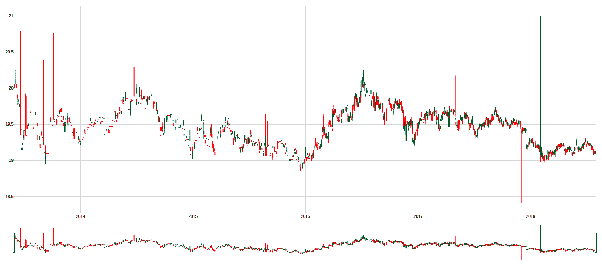
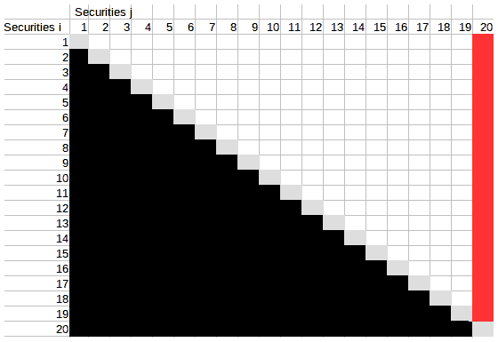
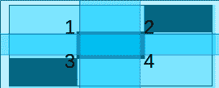
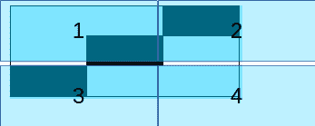
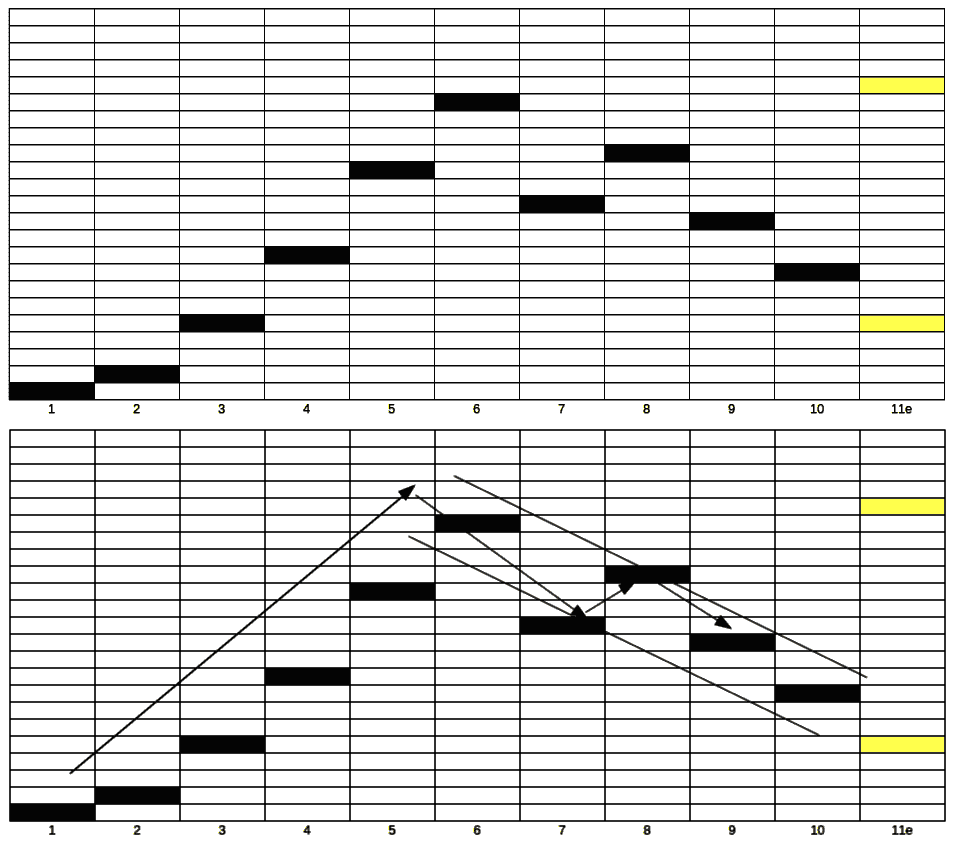
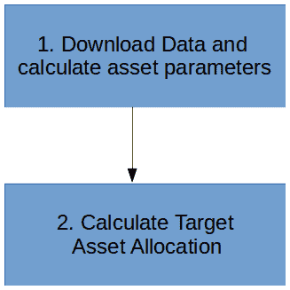
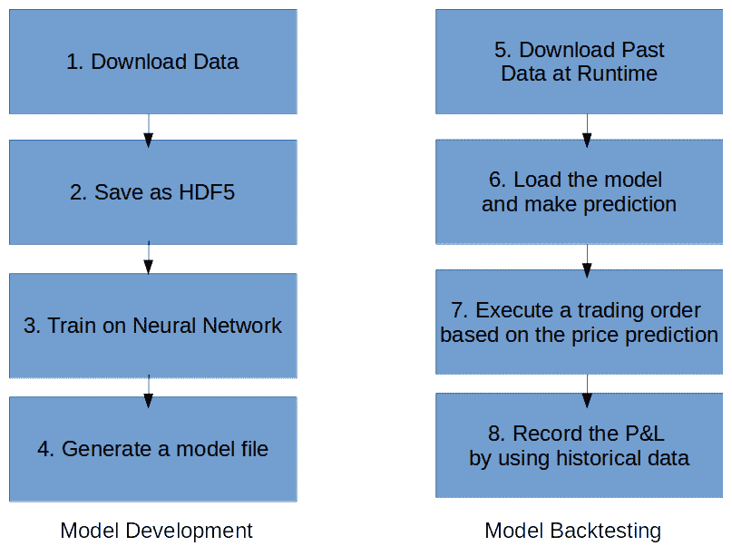

# 四、资本市场决策的机械化

在前一章，我们介绍了投资银行的基本概念。我们还学习了**并购** ( **M & A** )和**首次公开发行** ( **IPO** )的概念。我们研究了聚类模型，这是一种人工智能的建模技术。我们查看了解决自动联合问题的详细步骤和示例。我们实现了一个识别收购者和目标的例子。所以，前两章是为投资银行的证券发行人准备的。

在这一章，我们将看看投资者的动态。投资者从战略上推动投资行为。股票或债券的发行有两种方式——通过一级市场或二级市场。一级市场的作用是代表公司、政府或其他团体发行新证券，以便通过债务或以股权为导向的证券获得融资。二级市场的作用是促进利益相关者买卖以前发行的证券。投资组合经理的角色是根据证券的价格变动做出更明智的决策，从而为客户增加利润。投资组合经理试图了解投资者的需求，并将资金投入到那些能产生最大回报的投资中。

在本章中，我们将讨论以下主题:

*   金融概念
*   马科维茨均值-方差模型
*   特雷诺-布莱克模型
*   使用 Treynor-Black 模型构建投资组合
*   趋势预测

# 金融概念

在这一部分，我们将探讨各种金融概念。对于领域知识的深入考察，鼓励大家参考**特许金融分析师** ( **CFA** )的教学大纲。

## 资本资产定价模型中的阿尔法和贝塔回报

根据**资本资产定价模型** ( **CAPM** )，投资回报等于*无风险利率+ alpha + beta *市场回报+噪音*(均值为零)。Alpha 是公司或投资者的优异表现所获得的回报，而 beta 是资产相对于整体市场回报的风险。当投资的风险高于市场平均水平时，贝塔系数就高。噪音是长期回报为零的随机运动或运气。

资产管理行业，尤其是专业投资经理，通常根据阿尔法值向客户收费。这解释了为什么人们如此关注阿尔法。

## 已实现和未实现的投资回报

投资回报(收益)可以实现，也可以不实现。实现的回报是被实现和收入囊中的回报。未实现回报是指如果我们将资产出售换钱，我们今天将获得的回报。

## 投资政策声明

投资行业代表资产所有者进行投资。作为资产管理人，代表客户提供建议和投资是我们的受托责任。到目前为止，在本书中，我们试图通过查看行为/交易数据来了解投资者的投资需求。然而，关键数据实际上是投资者将建立的**投资政策声明** ( **IPS** )。

IPS 包含投资者设定的回报目标、风险偏好和约束条件。回报目标和风险偏好都是我们可以定量定义的变量。回报可以定义为通货膨胀率的净年回报。如果目标回报率为 1%，通货膨胀率为 1%，那么这意味着随着商品价格水平随着通货膨胀率的上升，资本的价值得到保护。从长远来看，我们投入投资组合的购买力保持不变，因为价值随着价格水平的增长而增长。

这些变量中的每一个都可以用数学方法表示如下:

*   **回报目标**:这个回报目标叫保本。1%的回报率称为名义回报率。从名义利率中扣除通货膨胀率后，称为实际收益率:


*   **风险偏好**:风险偏好可以定义为回报的波动性。我们通常这样定义它:


风险偏好的选择是主观的——有些人喜欢伴随这种兴奋的起伏。而有些人喜欢坐在沙发上看这本书(很无聊，不是吗？)，有些人喜欢坐在桌边的椅子上读。有些人更喜欢枯燥的朝九晚五，工资稳定，而另一些人更喜欢初创公司的刺激，希望快速致富，并冒着失败的可能。

也就是说，无聊并不意味着被解雇的风险较低，令人兴奋的工作也不意味着失去工作的风险较高。很明显，我们有一份令人兴奋的工作，有很高的潜力和稳定性。这正是投资组合管理过程中资产分配的目标结果。

鉴于这本书涉及工作的实际方面，更多细节我推荐*管理投资组合，一个 CFA 协会的动态过程*([https://www . Wiley . com/en-us/Managing+Investment+Portfolios % 3A+A+Dynamic+Process % 2C+3rd+Edition-p-9780470080146](https://www.wiley.com/en-us/Managing+Investment+Portfolios%3A+A+Dynamic+Process%2C+3rd+Edition-p-9780470080146))。这里我们的目标是定义必要的参数来执行 Python 中的机器学习程序。

在人工智能时代，挑战是如何以机器可以理解的代码形式将这一政策付诸实现。事实上，投资界有将投资政策数字化的任务。

区块链最近的进展预示着智能合约，这是基于这样一种假设，即某些陈述可以被数字化为逻辑。如果一个合同可以被编码为智能合同在区块链上执行，那么为什么不可以编码为智能合同呢？让我们假设投资政策在这一章的剩余部分已经被编码。

## 资产类

**投资组合管理**是根据资产类别或风险因素的特征，将资本分配给各种投资资产的过程。我们将从关注资产类别分配开始。一个**资产类别**被定义为一组具有相似特征的资产。这实际上听起来非常类似于聚类模型的结果。

为了融入我们的金融知识，资产类别通常指股票、债券、货币市场和另类投资。**另类投资**可以细分为房地产、私募股权、对冲基金和大宗商品。**股权**是指在公开交易市场上发行的股票，而**债券**是指公司发行的债务。货币市场指的是期限在一天到一年之间的短期债务。它们不同于债券，因为货币市场具有很高的流动性(通过公平定价的市场进行大量交易)，而在债券发行中，市场要么流动性非常差，要么由某些投资者主导。债券通常是指期限较长的债务，如 10 年或更长。当然，它可以包括 1 年以上的任何东西，通常称为**票据**。

## 投资行业的参与者

投资者在金融业中扮演着核心角色。然而，了解其他主要参与者也同样重要——投资经理(管理投资者的资金)、被称为卖方的经纪人(通常是投资银行或证券公司)，以及就如何选择投资经理向投资者提供专业建议的顾问和咨询人员。保管人指的是负责任何投资交易的结算和管理以及向交易所市场备案的一方。

如果投资经理来自机构，他们被称为**机构投资者**，而那些自行其是的人被称为**个人投资者**。机构投资者对投资资金的受益所有人负有信托责任。这些受益者是投资经理的真正客户。例如，在杜克能源的案例中，最终受益者可能是杜克能源的员工。在这两者之间，要么由司库作为投资经理管理基金，要么由外包投资基金经理作为投资经理。

在该行业的销售方面，该基金可以面向机构投资者、个人投资者，或者通过银行或保险公司进行零售分销。在零售分销的情况下，使投资符合所有者需求的责任在于分销商。虽然是机构投资者或个人投资者直接与投资经理打交道，但负责匹配的是投资经理或顾问。

## 基准–比较的基准

投资组合使用一个基准来定义他们应该衡量的平均市场回报。它可以指市场回报或资本资产定价模型中的贝塔系数。任何高于平均值的都称为 **alpha** 。在本章的例子中，我们假设全球股票**交易所交易基金** ( **ETF** )是市场基准。

如果我们要为全球资产的投资者构建全球市场基准，我们可以通过分析创建这样一个指数，对各种指数或一篮子回报进行加权。

## 投资者追求回报

国际清算银行的一项研究显示，投资者正在表现出追逐回报的行为。这意味着投资的一个关键原则是跟随市场(回报)。这也无疑意味着，如果我们只让回报驱动我们的配置决策，我们将永远比市场慢。所以，在人工智能的世界里，有两种方法可以改进:

*   用超快的机器快速跟踪回报趋势
*   比大众更好地预测市场

ETF 承诺做前者，前提是我们足够快地配置到 ETF——这反过来违背了跟踪市场的目的，因为有如此多不同种类的 ETF。只有当我们投资于一个真正的市场代表时——例如，一个主要市场指数 ETF，才有可能；否则，我们仍将面临同样的挑战，即试图分配到正确的证券/投资，以产生阿尔法(战胜市场)。

在大多数交易书中，作者会隐藏他们的获胜策略是什么——这使得我们很难理解什么是真正的策略。为了保持实际，我们将制定一个失败的策略，你可以改进它。这至少向你展示了端到端的策略发展，让你全面了解交易是如何运作的。

## 趋势跟踪基金

把资产分配给基金经理之后，我们再深入挖掘一下所投资的基金。如果我们是 ETF，我们的主要需求之一将是跟踪标的证券。例如，如果基金的任务是在给定一套规则的情况下跟踪一篮子证券的表现，我们可以简单地购买并持有基础资产，直到赎回(即投资者撤回资金)。

然而，如果我们试图提前预测价格变动并采取相应行动，我们就有可能赢得不仅仅是基准——这就是我们所说的 **alpha** 。

### 使用技术分析作为产生 alpha 的手段

一个交易学派相信证券定价的趋势。这叫**技术分析**。它假设过去的价格变动可以预测未来的变动。下图显示了一段时间内证券价格的趋势:



在很高的水平上，我们看到证券价格在趋势中运动，但趋势的长度并不总是相同的。关于如何解读价格随时间变化的模式，已经有了大量的研究。但这不是计算机视觉挑战吗？相对于我们手动挑选无数的特征，我们应该让计算机来阅读图表并学习如何绘制趋势线吗？

就模式的类型而言，一个好的起点是*金融市场的技术分析:交易方法和应用的综合指南*(纽约金融学院)。有关检测模式的精确数据处理的信息，请参考*机器学习的进展*。在这里，普拉多博士真的把它带到了另一个层次，在数据输入机器之前让你深入了解工作。

## 交易决策-策略

交易策略是指对交易活动的考虑和采取的行动。因此，在这一章中，与禁止策略相反，我将向你展示一个设计失败的实际策略。对于一个真正的交易者来说，披露成功的交易策略会扼杀这个策略，因为人们可以反对它交易——例如，当你预期买入时，反对的交易者也可以卖出，反之亦然。

与简单的买入并持有相同资产的策略相比，我们在这里提出的简单策略不会产生正的 alpha。但是，我会指出改进的方法。

要了解更多关于交易者和银行家的比较行为，请参考*财经杂志*(【https://onlinelibrary.wiley.com/doi/abs/10.1111/jofi.12372】)的*补偿财经专家*。

# 理解 Markowitz 均值-方差模型

投资组合管理的目标是最小化风险，以确定目标回报，假设对于特定的投资者，我们有从 IPS 和历史回报中获取的目标回报和风险容忍度。行业中使用的典型投资组合优化模型包括 Markowitz 均值-方差模型和 Treynor-Black 模型。

1952 年，一位名叫哈里·马科维茨的经济学家引入了均值-方差分析，也被称为**现代投资组合理论** ( **MPT** )。他因其理论获得了诺贝尔经济学奖。

均值-方差模型是一个组合资产组合的框架，以便在给定的风险水平下实现回报最大化。是投资多元化的延伸。投资多样化是一种建议投资者应该投资不同种类的金融资产的想法。与只投资一种类型的资产相比，投资多样化风险更小。

投资者选择收益最大化的资产配置，也称为**收益方差**。投资资产时，风险回报比成为一个关键的决策因素。风险回报比的计算方法是预期回报与可能损失的比率。预期收益和实际收益之间的差额称为**风险**。关键的挑战是计算目标投资组合的收益方差。例如，可以是 40%的股票和 60%的债券，或者更复杂的资产类别配置，如房地产、大宗商品等等。为了得出 40%股票和 60%债券的收益方差，我们需要首先分别计算股票和债券的收益方差。同时，我们还必须考虑股票和债券之间的协方差，即股票和债券的回报如何在相同的方向或完全不同的方向上齐头并进。

关于资产和财富管理行业如何形成的详细见解，请参考*普华永道，2017 年，资产管理* *2020:盘点，资产&财富管理见解*。

想象一个团队(其中每个人代表一个资产类别)一起完成一项任务，以获得回报。投资组合经理的工作是决定在群体中谁更有发言权，谁更没有发言权(资产配置工作)。这取决于生产率(回报)和个人表现的波动:有些人表现出极高的表现水平，而有些人的生产率(方差)相当稳定。我们还需要知道单个团队成员之间的互动——这种互动还必须考虑他们每个人如何补充或放大彼此的生产力(相关性)。一些团队成员在他们两人之间表现出强烈的化学反应，以交付非常好的结果(正相关)，一些人在一天的不同时间工作——一个是夜猫子，另一个是早起的人——每个人都有不同的工作时间(负相关)，一些人没有任何真正一致的相似或不相似的模式(零相关)。

下图显示了两项资产(I 和 j)之间的关联矩阵。灰色的对角线显示证券的收益方差，其余的单元格显示证券间的收益协方差。不需要黑色的单元格，因为它们反映了与对角线相反的值。对于仅仅 20 种证券，我们将有 190 种价值需要估计:



为了进一步说明这个问题，让我们假设证券 **20** 不是流动的，我们不能可靠地估计它与另一种证券的协方差。我们本可以影响其他 19 种证券协方差的数据质量。这种模型在实际应用中的问题如下:

*   一些资产没有足够的数据点让我们计算它们与其他资产的相关性(例如，团队的新成员)。
*   在金融市场中，资产之间的相关性是动态变化的，很难预测前瞻性的相关性。
*   相关性不是线性的。

这一模型适用于具有有效定价和大量建模数据点的上市股票。但它不适用于非流动性资产——如初创企业的私人股本或新兴市场证券或债券，在这些资产中，我们无法完全了解定价，许多资产通常是通过分析重建的。

风险相关性的一个具体类型可能是信用风险——在繁荣时期，跨资产的风险相关性很低；然而，在危机中，这种相关性会出现峰值，并向类似的方向移动。有关违约相关性的示例，请参考 Duffie D .和 Singleton，K.J .撰写的*信用风险定价、衡量和管理*。

一些老牌公司的财务人员负责管理自己的养老金。我们假设财务人员需要处理养老基金的目标资产配置。我们将获取每个资产类别的指数回报数据。我们将使用 Quandl 在 ETF 上的认购数据作为数据源。

ETF 指的是可以在纽约证券交易所这样的公共交易所买卖的基金。它是一种基金，因为它投资于更多的基础证券，如股票或债券。它越来越受欢迎，因为它允许投资者专注于基金投资的主题，而不是个股。例如，我们可以通过购买投资于美国最大的 500 只股票的基金，对美国经济的实力有一个强烈的看法。

# 探索特雷诺-布莱克模型

由于 Markowitz 均值-方差模型在管理多资产类别投资组合问题时的不稳定性，建立了 Treynor-Black 模型。Treynor-Black 的模型符合现代投资组合配置方法，即某些投资组合是主动的，而其他投资组合是被动的。在这里，被动指的是跟随市场回报率的投资——不是跑赢市场平均回报率，而是紧跟市场回报率。

积极投资组合是指我们寻求提供高于市场平均回报率的投资组合。市场风险水平下的市场回报越低，投资组合越高。然后，我们将总资本分配给一个积极的投资组合。那么，如果市场回报足够好，为什么还要冒更大的风险呢？Treynor-Black 模型寻求为主动投资组合的总风险/回报水平中回报/风险水平较高的资产分配更多权重。

## 介绍 ResNet——用于模式识别的卷积神经网络

应用计算机视觉类型的神经网络的具体之处在于，我们可以使用以下隐藏层。在我们的例子中，我们将使用在 Keras 中实现的 ResNet 作为例子来说明这些思想。我们还将展示一种提高性能的方法——但是，您应该更深入地了解超参数调优。

卷积层就像是输入图像的一个子集。在技术分析中，就像有一个滑动窗口来计算一个统计值。每种类型的滑动窗口都被训练来检测某种模式，例如向上、向下和扁平线。在神经网络术语中，每种类型被称为一个**过滤器**。对于每种类型的过滤器，有许多窗口可以完全运行(或滑动)通过输入图像；该数量由该层中神经元的数量来表示。

为了解释术语，让我们取一个尺寸为 *3* *×* *3* 的输入图像和一个内核形状为 *2* *×* *2* 的图像。我们在编码示例中的实际输入大于这个大小。

**输入图像**是一幅 *3* *×* *3* 的图像，一条黑线(用 3 个像素表示)从左下角对角地穿过右上角。它显示股价每天向上移动一个像素:


滑动窗口的形状称为**内核**。核是一种可以将输入的矩阵/向量转换成另一种形式的函数，如下图所示:


为了便于说明，我们假设内核大小为 *2* *×* *2* ，*步距= 1* ，除非特别说明，否则填充为零。

下图中的数字显示了内核移动的顺序。每个运动将由卷积层的一个神经元表示:


下图为 *2* *×* *2* 内核，内核移动 4 次(即需要 4 个神经元):

*   **内核形状**:随着内核的移动(我们称之为滑动)，它可能会也可能不会覆盖相同的输入像素，这使得蓝色变暗，因为我们想要显示哪些像素被覆盖了不止一次:


内核*形状=**2**×**2*，覆盖完整图像需要 4 步:


内核*shape =**1**×**1*，覆盖完整图像需要 9 步。

*   **Stride** :显示前进时需要向右下方移动多少像素:



这里， *stride = 1* ，覆盖图像需要 4 步。注意，每次都会有重叠的像素被覆盖:



这里， *stride = 2* ，覆盖图像需要 4 步。注意，每次都不会有任何重叠像素被过滤器覆盖。

*   **填充**:显示输入图像周围有多少白色像素；


下图显示了零填充:


这里， *padding = 1* ，这使得边上的边缘细胞被不同的神经元覆盖。

### 汇集层

pooling 层是不言自明的——它用于汇集来自输入的结果。想象一下，在卷积层之后，对于每种类型的滤波器，都会有多个输出，例如四个。我们能把这个减少到一个变量而不是四个输出变量吗？池化可以起到压缩这些信息的作用。例如，取四个输出中的最大值(最大汇集)或四个输出的平均值(平均汇集)。视觉上，池层的意义是模糊图像或计算移动平均趋势。

### ReLU 激活层

对于金融专业人士来说，**整流器线性单元** ( **ReLU** )层就像一个看涨期权的收益——一旦超过某个阈值，输出值就会随着输入线性变化。其意义在于减少定价中的噪音，以确保只考虑强劲的市场趋势。

### Softmax

Softmax 是物流回归模型的超级版本，我们在本书的前几章中提到过，它具有多个预测结果，例如，物流回归模型案例中的版本一二元结果。在我们的例子中，我们希望确定第二天的价格。

# 使用 Treynor-Black 模型构建投资组合

假设给了我们 10 天的价格数据，技术分析的工作是在右边画线来理解趋势，以便生成第 11 ^天的第二天价格。显而易见，卷积神经网络确实可以解决这个问题。

我们知道，实际上，我们看到的时间单位可以是每 100 毫秒或 10 毫秒，而不是 1 天，但原理是一样的:



让我们继续杜克能源公司的例子。在这个假设的案例中，我们假设我们是运营杜克能源公司养老基金计划的财务主管，该计划的总资产规模为 150 亿美元，有固定缴款计划。据推测，我们知道我们的数字格式的知识产权是什么:

*   目标回报=实际回报的 5%(这意味着扣除商品的通货膨胀)
*   风险=回报波动等于 10%
*   制约因素:没有电力公司避免投资于其他同行/竞争对手

请注意，这是一个假设的例子。不会对实际公司做出任何推断。

使用 IPS，我们将首先举例说明如何将基金分配到各种资产类别。然后，在第二个例子中，考虑到最近被动投资的趋势，我们将研究趋势跟踪策略，使投资经理能够跟踪市场。

## 解决办法

我们创建了两个独立的 Python 文件，因为资产参数应该独立于资产的分配方式。这总共有四个步骤。两个主要步骤(文件)如下:



我们将下载并评估资产参数，并生成目标资产分配:

1.  为了下载和评估资产参数，我们将导入库和关键变量值。然后，我们将定义函数来下载每个资产的数据、市场回报、无风险利率、资产回报和参数。

2.  为了生成目标资产配置，我们将导入库和关键变量值，找出主动投资组合中证券的权重，找出主动投资组合在总投资组合中的权重。

随着本章的深入，我们将尝试通过这个例子来说明传统数据库的使用，而不是创建没有数据库存储的数据转储。它遵循了我们之前提出的观点，即结构化数据库(SQL 数据库)在数据结构化的情况下可以很好地处理证券定价数据。我们使用的是 SQLite，它是数据库的一个简化版本。它只是为了向财务专业人员说明数据库如何在我们的用例中发挥作用。当然，对于实际的 IT 实现，我们可以使用大量既安全又快速的企业级数据库。

### **下载范围内资产的价格数据**

本例中使用的单个资产和市场资产都是 ETF。数据通过免费和付费订阅从 Quandl 下载，包括以美国国债为代表的无风险数据和以全球股票 ETF 为代表的市场回报。在我们下载完数据之后，也就是当天的数据，我们还需要定义我们所说的价格。在我们的例子中，我们将日最高价和日最低价的中间点作为当天的价格。

步骤如下:

1.  导入必要的库；`sqlite3`是本章新介绍的。这展示了如何将 SQL 数据库用于交易数据用例。我们将使用一个轻量级的 SQL 数据库，名为 **SQLite** ，它本身显示为一个文件:

`6A_1_cal_assetpara.py`

```
'''*************************************
#1\. Import libraries and key variable values
'''
import quandl
import pandas as pd
import numpy as np
from sklearn import linear_model
from sklearn.metrics import r2_score
import sqlite3
import math
import os
#not needed when using database
import pickle

#API Key

#dates variables for all the download

#db file
```

2.  定义为每个资产下载数据的函数:

```
'''*************************************
#2\. Define function to download data for each of the asset
'''

```

如果没有 Python，你也可以通过一个工具直接评估文件，比如 Chrome 浏览器的插件，SQLite viewer 等等。

该函数将从 Quandl 下载`SHARADAR`数据库中任何给定股票的价格数据。除此之外，它还会按天计算机票的返程。

它所做的是下载数据，然后计算返回序列。

### **计算无风险利率，定义市场**

在我们的例子中，我们将 3 个月期美国国债作为无风险收益率的代理。在投资界，美国被认为是无风险的，政府永远不会违约。我们获得的高于无风险利率的任何回报都是我们通过承担更多风险获得的回报。

市场作为一个整体，可以用全球所有投资资产的回报来表示——这在理论上很容易，但在现实中，这真的很难定义。最具挑战性的部分是定期产生这种市场回报，以便在下一步中使用。我们将走捷径，使用 ETF 来代表市场回报:

```
'''*************************************
#3\. Market Return
'''
```

给定一个股票代码作为市场代理，运行前面的函数:

```
'''*************************************
#4\. Risk Free Rate
'''
#day count

#risk free rate

# override return of market
```

无风险利率相当复杂。按照惯例，该行业使用 3 个月期国库券。为了获得整个期间的无风险利率，我们采用大约 10 年的数据来计算该期间的无风险利率。

然而，我们还需要按年计算利率。根据 3 个月期国库券的定义，计算的天数是 360 天。利率是每天计算的地方。

### **计算每种资产类型的α、β和误差方差**

了解了无风险回报率和市场回报率之后，我们的下一个任务是通过将市场回报率与资产回报率进行回归来找出 alpha、beta 和误差方差:

*投资回报=无风险利率+ Alpha + Beta *市场回报+噪音(误差方差)*

在执行这个计算之后，我们将把数据保存在 SQLite 数据库中，以便以后检索。

我相信，在未来的初创企业中，我们的机器人顾问将专注于 ETF/smart beta——即分配行业以产生逆市回报。因此，在这个例子中，我选择了 ETF 报价机。

我们将根据市场基准对行业 ETF 进行线性回归。然而，我们可以对 ETF 和市场进行报价的那一天可能会不同；因此，只有当部门 ETF 和市场 ETF 都有价格时，我们才会回归——使用 SQL 上的 inner join 命令。

内部联接隐含地要求在联接之前，行业 ETF 和市场基准的指数必须相同。数据集的索引是指返回日期:

```
'''*************************************
#5\. Asset Return and parameters
'''
#list of stocks for selection in the active portfolio

#connect to the databases and reset it everytime with drop indicator

#write out the risk free and market parameters

#loop through the tickers
for tkr in list_tkr:
 #calculate the CAPM:
 #download data for the ticker

#make sure the ticket we select has market data

 #linear regression

#obtain the result and write out the parameters
```

### 计算最优投资组合分配

我们正处于第二个主要过程——也就是，制定投资组合分配。首先，我们将计算活跃投资组合的规模以及活跃投资组合中不同资产的权重。步骤如下:

1.  导入所有相关的库:

`6A_2_treynor_black.py`

```
'''*************************************
#1\. Import libraries and key variable values
'''
import sqlite3
import datetime

#create a table to store weight
```

2.  计算主动投资组合的参数，并将其与市场表现进行比较，以找出我们应该从总投资组合中为主动投资组合分配多少权重:

```
'''*************************************
#2\. Find out the weight of the securities in the active portfolio
'''
#total alpha/variance of the active securities

#insert into the table the weight of each active securities
```

主动投资组合的权重通过聚合属于主动投资组合的证券(部门 ETF)的参数来求解。

3.  然后，根据市场回报/风险比率，与主动投资组合的回报/风险相比，主动投资组合表现越好，它在整个投资组合中所占的权重就越大:

```
'''*************************************
#3\. Find out the weight of the active portfolio in the total portfolio
'''
#calculate the parameters of the active portfolio

#read back the risk free and market para

#calculate the weight of active portfolio

#display the result
```

获得最优投资组合后，下一步就是根据收益和风险的 IPS 分配给*你*。

需要满足以下两个约束条件:

*   *%最优投资组合 x 最优投资组合回报率+(1-%最优投资组合)x 无风险资产回报率>= IPS 要求的回报率*
*   *%最优投资组合 x 最优投资组合的风险<= IPS 要求的风险*

恭喜你！你已经学会了如何让资本投向不同的投资资产，以获得最佳回报和风险水平。在下一节中，我们将看一个如何预测证券趋势的例子。这将有助于投资者做出明智的投资决策。

# 预测一种证券的趋势

在前面的例子中，我们扮演了一个交易者的角色，他按照司库设定的投资组合进行分配。假设我们的工作是跟踪司库要求的证券，交易者的盈亏取决于我们如何从低买高卖中获利。我们将证券的每日定价历史作为数据来构建我们的模型。在下一节中，我们将演示如何在做出购买资产的决定之前预测趋势。

## 解决办法

有两个主要的过程——一个是模型开发，另一个是模型回溯测试。这两个过程总共包括八个实时部署步骤，我们在这里不做介绍。然而，它非常类似于模型回溯测试。下图说明了该过程的流程:



### **加载、转换和存储数据**

在这一步中，我们将加载数据，将数据转换为图像数组，然后以 HDF5 数据文件格式存储。首先，我们将从 Quandl 中加载数据作为数据帧，然后将数据转换为数组——数组将绘制出数据，就像之前显示的那样。在我们的例子中，我们通过只绘制一天的日结束数据点来简化问题。我们只取当天高点和当天低点的中间点，不考虑它的成交量。

当在具有固定维度的数组上绘制价格时，在 *y* 轴上——价格——我们将开发一个函数，通过相应地缩放最大值和最小值之间的数据点，将最大值和最小值固定到固定维度中。这叫做**正常化**。在 *x* 轴上，每天由 *x* 轴上的一个点表示，其中最左边是给定窗口大小的最早一天，最右边是最晚一天。在一个给定的点上，价格点的颜色是相同的， *color = 255* 表示用图片显示，或者 1 表示输入神经网络。

对目标变量进行同样的处理——这只是第二天的图表，对 *y* 使用相同的标度。如果第二天实际上高于最大值或者低于最小值，我们可以强制它取当前的最大最小值点。

准备好数组后，我们将在指定的持续时间内堆叠数组——每一天都由一个图表表示，该图表显示过去的 *X* 天，其中 *X* 是窗口大小。当我们完成堆叠后，我们将把整个阵列放入一个 HDF5 文件中，这实际上是一种分布式文件格式，它允许文件跨多个物理位置存储。

定义库和变量。我们已经为下载步骤定义了一个报价器列表:

`6B_1_trendFollowing.py`

```
'''*************************************
#1\. Import libraries and key variable values

'''
import quandl
import plotly
import plotly.graph_objs as go
import numpy as np

from datetime import datetime
try:
    import Image
except ImportError:
    from PIL import Image
import os
import h5py

#dates parameters
...
#quandl setting
...
#parameters for the image generation
...
#create path for the output dataset
...
#ticker lists
...
#generate png file for each of the input or now
...
#generate interactive plot to the ticket stock price or not
...
```

定义函数将可变范围的股票价格放入一个固定高度和宽度的固定大小的图像中。它将返回一列已随缩放因子一起重新缩放的值:

*   *像素值=(价格值-列的最小值)x 每个值的像素数*
*   *像素数=(列的最大值-列的最小值)/总像素数*

代码如下:

```
'''*************************************
#2\. Define the function to rescale the stock price according to the min and max values

'''
#input_X is a series of price
#output_X is a series of price expressed in pixel
def rescale(input_X, pixel, min_x,max_x):
...
```

我们将一个接一个地下载数据，并将其转换为输入图像和目标结果，作为下一步的机器学习。这些代码最具技术性的方面与 HDF5 文件保存有关。在文件中，它被进一步划分为一个数据集，在数据集内，我们可以将文件存储在其中。数据集的一个具体特征是，一旦在创建时定义，它的大小就固定了。此外，它并不意味着动态更新，尽管这在技术上是可能的。

彩色图像存储在三个通道中——红色、绿色和蓝色——每个通道都是一个矩阵，其中每个像素的值从 0 到 255 不等。然而，在我们的例子中，我们将只为黑白图片使用一个通道。在我们将图像存储到 HDF5 之前，所有数字都除以 255，以便输入变量在 0 和 1 之间，以便稍后用于神经网络训练。

为了让您对数据有一个真实的感受，我们还提供了另一个交互式图表特性(使用`ploty`)。这也被关闭以提高速度。但是，对于第一次使用该代码的用户，建议您试用一下，看看下载的数据。

请参考图像处理文本进行深入讨论——我最喜欢的是尼克森 M.S .和阿瓜多 A.S .的*特征提取&计算机视觉图像处理*,因为它侧重于提取我们需要的特征，而不仅仅是奠定理论背景。

然而，缺点是这本书的代码不是用 Python 编写的——这是一个可以接受的挑战，因为学习原理比编写代码更重要:

```
'''*************************************
#3\. Go through the tickers
'''
for tkr in tkr_list:
    ...
    #if the ticker has been downloaded, skip the ticket and go for the next 
     one
    ...
    #download and create dataset
    ...
    #sort the date from ascending to descending...
    ...    
    #charting interactive chart for viewing the data
    ...
    #calculate mid price of the day
    ...    
    #remove the file if there is one
    ...
    #remove the file if there is one
    ...
    #create dataset within the HDF5 file
    #now we create the dataset with a fixed size to fit all the data, it 
     could also be create to fit fixed batches    
    ...

    #loop through the dates
    for i in range(num_img):
        ...
        #create min and max values for the mid price plot within a given 
         timeframe
        ...
        #in case of low liquidity ETF which has the same price, no graph be 
         drawn
        ...
        #draw the dot on the x, y axis of the input image array
        ...
        #output the image for visualization
        ...        
        #draw the dot on the target image for training
        ...        
        #stack up for a numpy for Image Recognition
        ...
```

### 设置神经网络

根据与 ResNet 相关的 Keras 示例中的代码，我们不会对网络设计进行任何更改。我们采用版本 1 和版本 2，同时禁用批量归一化，假设数据点具有相同的颜色，并且对于给定的窗口大小， *y* 轴被归一化，因此进一步归一化没有太大意义。

批量标准化与协调网络中当前批量记录中的值有关-如果我们在图像上绘制的颜色包含不同的颜色，它会工作得很好。但是，由于我们已经对其 *y* 轴上的每个数据点的价格进行了标准化，因此代码暂时不变，因为当我们输入不同比例和分布的数据时需要这样做。

### 将数据加载到神经网络进行训练

我们之前从 HDF5 文件中检索了数据，并将其放入上一步刚刚建立的网络中。训练集、测试集和验证集将被拆分。然而，在我们的例子中，我们只是将所有的数据同时作为训练集和测试集。验证集可以是另一只股票——假设我们训练的只是观察股票技术运动的一般智能。

我们向网络提供批量标准化和某个纪元编号。这一步花费的时间最多。

在训练过程中，我们会记录下表现，以便日后可视化:

`6B_2_TrainCNN.py`

```
'''*************************************
#1\. Import libraries and key variable values
'''
'''*************************************
#2\. Define functions
'''
def lr_schedule(epoch):
def resnet_layer(inputs,
                 num_filters=16,
                 kernel_size=3,
                 strides=1,
                 activation='relu',
                 batch_normalization=True,
                 conv_first=True):
def resnet_v1(input_shape, depth, num_classes=10):
def resnet_v2(input_shape, depth, num_classes=10):

```

关于设计的解释请参见[https://arxiv.org/abs/1512.03385](https://arxiv.org/abs/1512.03385)，进一步的实现细节请参见 Keras 文档:[https://keras.io/applications/#resnet50](https://keras.io/applications/#resnet50)。

代码本质上做的是创建两个不同结构的不同神经网络设计——假设我们有一个相当大的数据源数据输入，只要数据相当大，读者就会体验到版本 2 的更好的性能:

```
#3\. Execute the model training
'''
# Computed depth from supplied model parameter n

# Model name, depth and version

# create list of batches to shuffle the data

#check if the prev step is completed before starting

#decide if we should load a model or not

#loop through the tickers

#load dataset saved in the previous preparation step

#start if both file exists:

#calculate number of batches
 #do it at the first one

# Input image dimensions.
        # Prepare model model saving directory.

        # Prepare callbacks for model saving and for learning rate 
          adjustment

        # loop over batches

            # Run training, without data augmentation.

        #when model training finished for the ticket, create a file to 
         indicate its completion

# Score trained model.

```

### **保存并微调神经网络**

网络保存在最后。在这个例子中，我们根本没有微调我们的模型，但它与超参数调整有关，这意味着我们应该调整到目前为止网络中的每一个参数。我会推荐你看吴恩达(【https://www.deeplearning.ai/machine-learning-yearning/】)的*机器学习向往*。在这个例子中没有实现这个步骤。但是我们已经在[第 3 章](61949743-f7c3-4295-aaee-dab1d169d25c.xhtml)、*中更详细地说明了使用特征和强化学习来自动化银行融资*。

### 加载运行时数据并通过神经网络运行

网络可以作为验证集再次加载并在新数据集上运行。然而，在我们的例子中，我们用另一只股票来测试这种通用的技术分析机器是否有效。网络的输出是对第二天定价的预测。

在这个程序中，最特殊的数据将是策略参数。这一切都始于一个货币价值。我们正在测试三种策略——一种是买入并持有，这是基准，另一种采用不同的价格输出进行交易。

涉及的步骤如下:

1.  导入所有必要的库和变量:

`6B_3_RunCNN.py`

```
'''*************************************
#1\. Import libraries and key variable values
'''
#folder path

#date range for full dataset

#Create list of dates

#API key for quandl

#Parameters for the image generation

#model path

#number of channel for the image

#strategies parameter
```

使用 ResNet v2，我们有近 100 万个参数，同时我们提供大约 300 万条记录~14.5 年 x 200 个交易日 x 125 个报价器(但有些报价器不具备交易流动性)。

2.  然后，定义函数，使价格点符合固定高度的图像:

```
'''*************************************
#2\. Define functions
'''
```

3.  获取新数据并运行函数来预测价格。从票证加载数据并准备数据；然后，运行根据训练流程构建的模型:

```
'''*************************************
#3\. Running the test
'''
#Get the data

#write header for the log of the strategy back-testing

#loop through the dates
 #make sure both start and end dates are valid

#prepare the input data

#if no trend, then drop this data point

#stack up for a numpy for Image Recognition
 #print the historical data

#make prediction
#Obtain predicted price
```

### 根据结果生成交易策略并执行性能分析

对于一个给定的价格预测，我们可以设计不同的行动来做价格预测。

这个循环的目标是通过依赖上一节中模型所做的预测来衡量交易策略的利润和损失。

在任何给定的日期，将只有一个价格预测，以 1D 数组的形式，在给定的规模下，每个价格点的概率。各种策略(1 和 2)处理如何进行预测:

```
#calculate expected values

#Strategy Back-Testing
 #Benchmark - Strategy 0 - buy and hold

#Testing of strategy1

#Testing of strategy2

#print the final result of the strategies

```

恭喜你！你已经使用计算机视觉模型完成了价格预测的过程。

在现实世界中，不同的模型可能会做出更多的预测，这将增加测试策略数量的复杂性。我们需要一个基准来了解这些策略是否优于正常的市场情况，即买入并持有策略。如果我们的策略是成功的，那么他们应该能够通过显示更高的利润和亏损数字来跑赢市场。

在策略回溯测试中，我们通常将它部署到一个过时的、不可见的样本中。

# 摘要

在这一章中，我们学习了一些投资组合管理技术。我们将它们与人工智能结合起来，在购买资产时实现决策过程的自动化。我们学习了投资组合构建的 Markowitz 均值-方差模型和 Treynor-Black 模型。我们还看了一个使用 Treynor-Black 模型构建投资组合的例子。我们还学习了如何预测证券交易的趋势。

在下一章，我们将看看资产管理的卖出方。我们将学习情绪分析、投资产品的算法营销、网络分析以及如何提取网络关系。我们还将探讨 Network X 等技术和 Neo4j、PDF Miner 等工具。