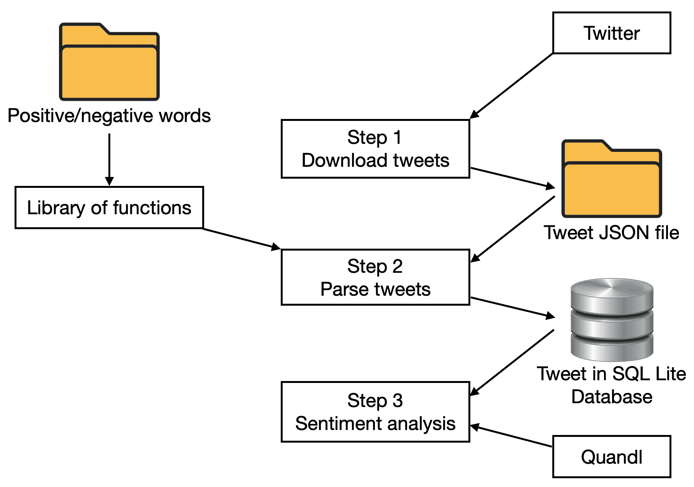
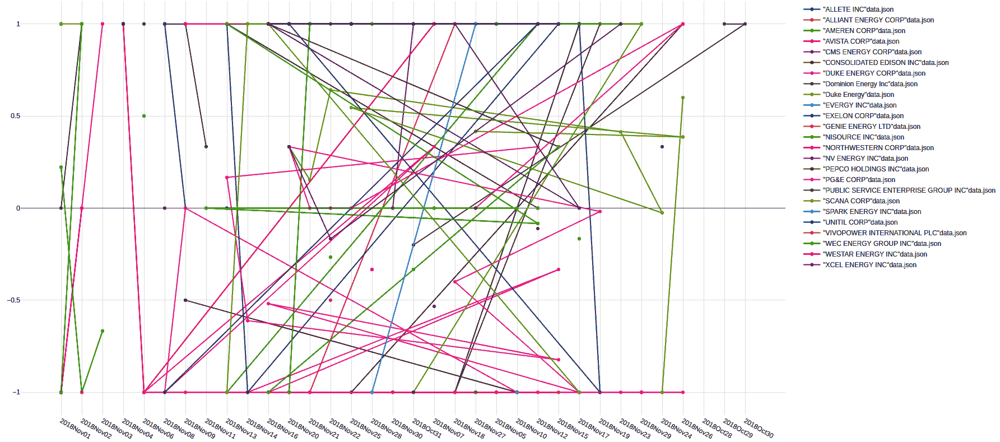
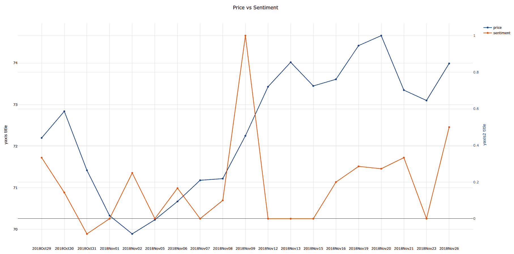
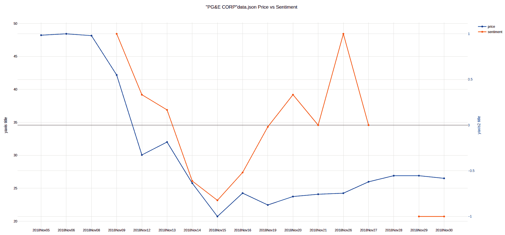
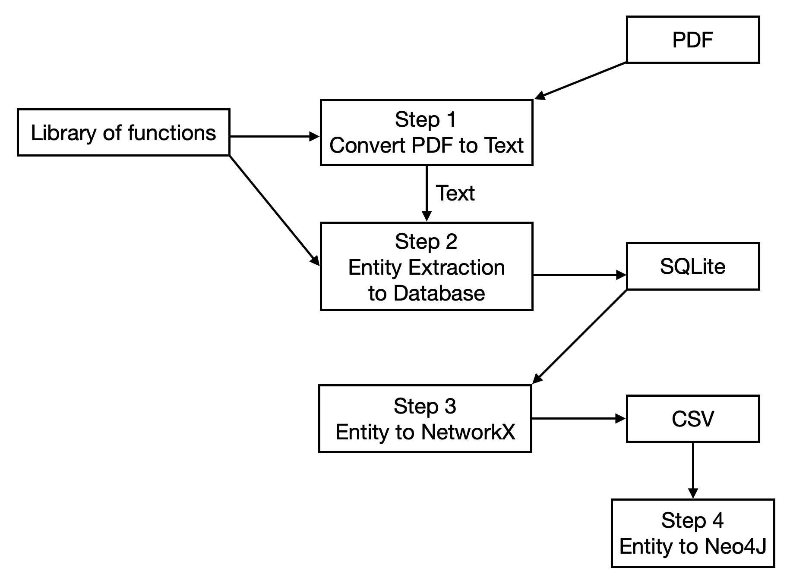

<title>Sensing Market Sentiment for Algorithmic Marketing at Sell Side</title>  Sensing Market Sentiment for Algorithmic Marketing at Sell Side

在前一章中，我们学习了投资组合管理。我们还学习了一些投资组合管理技术，如 Markowitz 均值-方差模型和 Treynor–Black 投资组合构建模型。我们还学习了如何预测一种证券的趋势。所以，前一章是基于市场的买方。它描述了投资组合经理或资产经理的行为。

在这一章中，我们将着眼于市场的卖方。我们将理解投资组合经理的对手的行为。卖方指证券公司/投资银行及其主要服务，包括销售、交易和研究。销售是指证券营销，向投资者告知可供出售的证券。交易是指投资者用来买卖证券的服务，以及为帮助投资者评估证券而进行的研究。以客户为中心，银行的关键职能之一是感知最终投资者的需求和情绪，最终投资者进而推动资产管理公司从银行购买产品。我们将从一些概念和技术开始这一章。我们将看一个例子来说明如何感知投资者的需求。我们将看另一个例子来分析年度报告并从中提取信息。

本章将涵盖以下主题:

*   理解情感分析
*   使用情感分析感知市场需求
*   使用 Neo4j 构建和分析网络

# 理解情感分析

情感分析是一种对上下文信息进行文本挖掘的技术。从源材料中识别和提取上下文信息。它帮助企业了解他们的产品、证券或资产的情绪。使用先进的人工智能技术在文本分析领域进行深入研究是非常有效的。围绕以下概念对交易进行分类非常重要:

*   买方和卖方关心的安全性方面
*   客户对证券的意图和反应

众所周知，情感分析是最常见的文本分析和分类工具。它接收传入的消息或交易，并根据与交易相关联的情绪是积极的、消极的还是中性的来对其进行分类。通过使用情感分析技术，可以输入句子并理解句子背后的情感。

现在我们已经了解了什么是情绪分析，让我们在下面的章节中了解如何感知市场需求。

# 使用情感分析感知市场需求

证券公司/投资银行对卖方的关键要求之一是为市场制造相关证券。我们已经在[第四章](0c281efb-a1b8-423f-976b-0fa47f5da990.xhtml)、*机械化资本市场决策*和[第五章](bbb73cab-df58-462a-8b5e-c1574611aff2.xhtml)、*预测投资银行家的未来*中探讨了公司的基本行为和责任。我们在[第 6 章](0e7c4e25-941b-4bd6-a04a-55924bdbaa43.xhtml)、*使用 trey nor-Black 模型和 ResNet* 的自动化投资组合管理中学习了动量方法。尽管市场并不总是理性行事，但听听市场的感受可能会很有趣。这就是我们在本章将要做的事情。

在本例中，我们将在交易大厅扮演一家投资银行的销售人员，从事股票交易。我们想知道的是关于证券的好恶，这样他们就可以销售相关的证券，包括衍生品。我们从 Twitter 搜索中获得我们的见解，从 Quandl 获得股票价格。所有这些数据都需要付费许可。

## 解决方案和步骤

使用编码实现获得市场情绪总共有三个主要步骤。数据的使用如下图所示:



步骤如下:

1.  数据将从 Twitter 中检索，并作为 JSON 文件保存在本地。
2.  然后，将读取 JSON 文件，通过对正面和负面单词进行计数进行进一步处理，并作为记录输入到 SQL Lite 数据库中。
3.  最后，将从数据库中读取情绪，并与从 Quandl 中检索的股票价格进行比较。

我们将在接下来的章节中详细阐述这些步骤。

### 从推特上下载数据

通过使用 Twitter 搜索商业许可证，我们可以下载 Shalender (Quandl)行业分类所定义的同一行业的数据。我们将使用 API 键逐一搜索和下载包含或标记有公司名称的最新 500 条推文。所有的推文都是以 JSON 格式接收的，看起来就像一个 Python 字典。JSON 文件将被保存在计算机上以供进一步处理。

可以在 GitHub([https://github.com/twitterdev/search-tweets-python](https://github.com/twitterdev/search-tweets-python))上找到示例 Python 代码，尤其是关于身份验证的代码。以下是从 Twitter 下载推文的代码片段:

```
'''*************************************
#1\. Import libraries and key variable values

'''
from searchtweets import ResultStream, gen_rule_payload, load_credentials
from searchtweets import collect_results
import json
import os

script_dir = os.path.dirname(__file__)
#Twitter search commerical accounts credential
premium_search_args = load_credentials("~/.twitter_keys.yaml",
                                      env_overwrite=False)
MAX_RESULTS=500 #maximum at 500

#list of companies in the same industry
...

'''*************************************
#2\. download tweets of each company

'''
for comp in comp_list:
   ...
```

### 将下载的推文转换成记录

该推文的信息和任何链接的页面将被一个简单的语言处理程序加载和读取，该程序将计算信息和链接页面正文中的正面和负面单词的数量。解析后的 tweet 将被转换为结构化的 SQL 数据库格式，并存储在 SQL Lite 数据库中。

以下是将推文转换为记录的代码片段:

```
'''*************************************
#1\. Import libraries and key variable values

'''
import json
import os
import re
import sqlite3
import 7A_lib_cnt_sentiment as sentiment

#db file
db_path = 'parsed_tweets.db'
db_name = 'tweet_db'

#sql db
...
#load tweet json
...
#loop through the tweets
    ...
    for tweet in data:
        ...
        tweet_txt_pos,tweet_txt_neg = sentiment.cnt_sentiment(tweet_txt)
        keywords,sentences_list,words_list = \
                                           sentiment.NER_topics(tweet_txt)
        ...
        if len(url_link)>0:
            ...
            url_txt = sentiment.url_to_string(url)
            temp_tweet_link_txt_pos, temp_tweet_link_txt_neg = \
                                           sentiment.cnt_sentiment(url_txt)
            link_keywords,link_sentences_list,link_words_list = \
                                           sentiment.NER_topics(tweet_txt)
            ...
```

前面的程序调用了三个函数。一个用于统计正面和负面单词，一个用于查看相关主题，一个用于检索推文中给出的 URL 中的文本。

以下代码片段定义了程序中使用的函数:

```
import os
import requests
from bs4 import BeautifulSoup
import re
import spacy
import en_core_web_sm
nlp = en_core_web_sm.load()

...
#cal the positive and negative sentiment words given the text
def cnt_sentiment(text_to_be_parsed):
    ...

def noun_phrase(sentence,item_list,lower):
   ...

#NER
import spacy
from spacy import displacy
from collections import Counter
import math

#text has to be less than 1000000
def NER_topics(text_to_be_parsed):
    ...
    MAX_SIZE =100000
    ...
    for nlp_cnt in range(number_nlp):
        start_pos = nlp_cnt*MAX_SIZE
        end_pos = min(MAX_SIZE,txt_len-start_pos)+start_pos-1
        txt_selected = text_to_be_parsed[start_pos:end_pos]
        ...
        sentences_list = [x for x in article.sents]
        full_sentences_list+=sentences_list
        for sent in sentences_list:
            phrases_list =[]
            phases_list,items_list = noun_phrase(sent, items_list, \
                                                 lower=True)
     ...

#convert the URL's content into string
def url_to_string(url):
    ...
```

### 执行情感分析

存储解析后的 tweet 的数据库将被另一个程序读取。对于每条记录，情绪将由每天的总体情绪来表示。每条推文的情绪是通过正面情绪减去负面情绪的总数来计算的。该情感分数的范围应该在-1 到+1 之间，其中-1 代表完全负的分数，而+1 代表完全正的分数。每天的情绪得分计算为所有推文对该证券的情绪得分的平均值。同一行业中所有证券的情绪得分绘制在一个图表上，如下所示:



例如，在我们报道的短时间内，Dominion Energy 拥有最有利的情绪得分之一(在 10 月 29 日至 10 月 30 日之间)。

统治能源的样本输出如下图所示:



情绪是橙色线，价格是蓝色线(请参考本书图形捆绑中提供的彩色图形)。

以下是情绪分析的代码片段:

```
'''*************************************
#1\. Import libraries and key variable values

'''
import sqlite3
import pandas as pd
import plotly
import plotly.graph_objs as go
import quandl
import json

# Create your connection.
db_path = 'parsed_tweets.db'
cnx = sqlite3.connect(db_path)
db_name = 'tweet_db'

'''*************************************
#2\. Gauge the sentiment of each security

'''
...
sql_str = ...
...
print('Sentiment across securities')
field_list = ['positive','negative']
for sec in sec_list:
    ...
```

### 将每日情绪与每日价格进行比较

在我们获得每只股票的情绪得分后，我们还想知道情绪对股价的预测能力或影响。当天的股票价格是由当天的最高价和最低价计算出来的。对于每只股票，我们绘制并比较一段时间内的情绪和股价。以下截图说明了宝洁公司的情绪与股价的关系:



以下是针对每日价格的每日情绪分析数据的代码片段:

```
#run it on different companies
print('Retrieve data')
df_comp = pd.read_csv('ticker_companyname.csv')
corr_results={}

for index, row in df_comp.iterrows():
    tkr = row['ticker']
    name = row['name']

    target_sec = '"'+name +'"data.json'

    corr_result = price_sentiment(tkr,target_sec,date_range)
    try:
        corr_results[name]=corr_result['close'][0]
    except Exception:
        continue

f_corr = open('corr_results.json','w')
json.dump(corr_results,f_corr)
f_corr.close()
```

恭喜你！你已经开发了一个程序来帮助销售人员寻找受欢迎的证券来开发产品。

从我们所看到的，对比这个例子和技术分析例子，我们可以看到，来自情绪的信息远远高于技术趋势。到目前为止，我们只看了趋势、基本面和情绪的主要影响；然而，在我们的社会中，公司是相互联系的。那么，我们如何对企业和个人的联系进行建模呢？这就把我们带到了下一个话题——网络分析。

# 使用 Neo4j 构建和分析网络

作为卖方分析师，除了找出消息对公司的主要影响，我们还应该找出任何消息的次要影响。在我们的例子中，我们将找出供应商、客户和任何股票新闻的竞争对手。

我们可以通过三种方法做到这一点:

*   通过直接披露，如年度报告
*   通过二手来源(媒体报道)
*   通过行业推断(例如，原材料行业，如石油行业，为运输行业提供产出)

在本书中，我们使用公司的直接披露来说明这一点。

我们扮演公司股票的股票研究员的角色，我们的一个关键角色是了解相关方与公司的关系。我们试图通过阅读公司的年度报告来找出该公司的关联方——杜克能源。

## 解决办法

总共有四个步骤。下图显示了数据流:



我们现在将在接下来的小节中更详细地了解这些步骤。

### 使用 PDFMiner 从 PDF 中提取文本

除了存储，我们还需要从文本文档中提取关系。在我们开始处理文本之前，我们需要将 PDF 数据转换成文本。为此，我们使用一个名为 **PDFMiner** 的库(具体来说，对于 Python 3+，该模块名为**pdf miner . six**(【https://github.com/pdfminer/pdfminer.six】)。PDF 是描述文档的开放标准。它存储行、文本、图像及其在文档中的确切位置。我们将只使用 PDFMiner 中的一个基本函数来从中提取文本。尽管我们可以提取坐标，但为了简化我们的工作，我们将跳过这一步。在提取文本时，我们将所有行追加到一个超长行中。

以下代码片段导入必要的库并初始化要处理的 PDF 文件:

```
'''*************************************
#1\. Import relevant libraries and variables

'''
#custom made function
import 7B_lib_entitiesExtraction as entitiesExtraction
import 7B_lib_parser_pdf as pdf_parser
import json
import sqlite3

pdf_path = 'annualrpt/NYSE_DUK_2017.pdf'
...
```

### 实体提取

我们部署了一种叫做**词性** ( **词性**)标注的语言分析方法来决定单词 X 和 Z 是公司还是人，以及 Y 是产品还是服务。因为句子结构，我们知道这些是名词，而不是因为我们知道 X，Y，Z 是什么。

但是，仅仅给实体贴上标签还是不够的。实体是独立的主体或客体。由于有太多的实体，我们应该只将首字母大写的实体标记为那些与我们的工作相关的独特的组织或资产。

实体的类型包括`ORG`、`PERSON`、`FAC`、`NORP`、`GPE`、`LOC`和`PRODUCT`——即使用空间模型的组织、个人、设施、民族或宗教或政治团体、地理空间、位置和产品。

从步骤 1 的 PDF 中获取文本块后，我们运行 SpaCy 从每个句子中提取实体。对于每个句子，我们将实体类型和实体存储在数据库记录中。SpaCy 对其分析的文档长度有技术限制；因此，我们将很长的文本块切割成不同的块，以考虑技术限制。然而，这是以在文本块的分界点截断句子为代价的。考虑到我们要处理数百页，我们将走捷径。当然，最好的切割方式是，在尊重标点符号的同时，将它大致切割在组块周围，以保留完整的句子。

以下代码片段描述了如何提取各种实体:

```
'''*************************************
#2\. NLP

'''
#Named Entity Extraction
print('ner')
#see if we need to convert everything to lower case words - we keep the original format for this case
lower=False
common_words, sentences, words_list,verbs_list = entitiesExtraction.NER_topics(text,lower)
entities_in_sentences = entitiesExtraction.org_extraction(text)
...
#create this list to export the list of ent and cleanse them
...
print('looping sentences')
for sentence in entities_in_sentences:
    ents_dict[sentence_cnt] = {}
    for entity in sentence:
        ...
        if ent_type in( 'ORG','PERSON','FAC','NORP','GPE','LOC','PRODUCT'):
        ...
    #handle other type
    ...
```

**Entity classification via the lexicon:** For our use case, we need to further classify the organizations as suppliers, customers, competitors, investors, governments, or sister companies/assets—for example, banks that are the credit investors of the company will first be classified as **Banks** before they are inferred as the Credit Investors/Bankers for the company in its annual report. So some of the relationships require us to check against a database of organizations to classify them further. Acquiring such knowledge requires us to download the relevant databases—in our case, we use Wikipedia to download the list of banks. Only when we check against the list of names of banks will we be able to classify the organization as banks or not. We did not perform this step in our example, as we do not have the lexicon set that is normally available to banks.

### 使用网络存储网络结构

处理完数据后，实体将被存储在 SQL 数据库中，并由 NetworkX 进一步分析，NetworkX 是一种处理网络数据的 Python 包。边和节点是任何图的组成部分；然而，有更多的指标来衡量和描述图形，以及节点和边在图形中的位置。对于我们现在的工作来说，重要的是查看这些节点是否连接到焦点公司，以及它们所具有的连接类型。

在 NetworkX 的最后，图形数据仍然非常抽象。我们需要更好的交互软件来查询和处理数据。因此，我们将数据输出为 CSV 格式，供 Neo4j 进一步处理，因为它提供了一个用户界面来与数据进行交互。

然而，它还远远没有被使用——需要大量的时间来清理数据集和定义所涉及的关系类型。Neo4j 是一个成熟的图形数据库，可以满足复杂的关系结构。

必须在公司年度报告中提到的实体和数据库中存储的实体之间建立关系。在我们的示例中，我们没有对实体进行任何过滤，因为上一步中的 NLP 模型有 85%的提升，所以在发现实体时，它没有完美的性能。我们只提取人和组织作为实体。对于关系类型(边)，我们不区分不同的边类型。

在定义了网络结构之后，我们准备了一个存储节点和边的列表，并通过`matplotlib`生成一个图，这本身并不足以进行操作或可视化。因此，我们将数据从 NetworkX 输出到 CSV 文件——一个存储节点，另一个存储边。

以下是用于生成实体网络的代码片段:

```
'''*************************************
#1\. Import relevant libraries and variables

'''
#generate network
import sqlite3
import pandas as pd
import networkx as nx
import matplotlib.pyplot as plt

#db file
db_path = 'parsed_network.db'
db_name = 'network_db'

#sql db
conn = sqlite3.connect(db_path)
c = conn.cursor()

...

network_dict={}
edge_list=[]
curr_source =''
curr_entity = ''
org_list = []
person_list = []

'''*************************************
#2\. generate the network with all entities connected to Duke Energy - whose annual report is parsed

'''
target_name = 'Duke Energy'
#loop through the database to generate the network format data
for index, row in df_org.iterrows():
    ...

#Generate the output in networkX
print('networkx')

#output the network
G = nx.from_edgelist(edge_list)
pos = nx.spring_layout(G)
nx.draw(G, with_labels=False, nodecolor='r',pos=pos, edge_color='b')
plt.savefig('network.png')
```

### 使用 Neo4j 进行图形可视化和查询

我们将安装 Neo4j 并导入 CSV 文件，以构建 Neo4j 中的数据网络——行业级图形数据库。不幸的是，Neo4j 本身需要另一套编程语言来操作其数据，称为 **Cypher** 。这使我们能够提取和搜索我们需要的数据。

我们生成 Neo4j 所需的文件。以下代码片段初始化 Neo4j:

```
#Generate output for Neo4j
print('prep data for Neo4j')
f_org_node=open('node.csv','w+')
f_org_node.write('nodename\n')

f_person_node=open('node_person.csv','w+')
f_person_node.write('nodename\n')

f_vertex=open('edge.csv','w+')
f_vertex.write('nodename1,nodename2,weight\n')
...
```

在终端中，我们将输出文件复制到 Neo4j 的主目录中。以下是要从终端执行的命令:

```
sudo cp '[path]/edge.csv' /var/lib/Neo4j/import/edge.csv
sudo cp '[path]/node.csv' /var/lib/Neo4j/import/node.csv

sudo service Neo4j restart
```

在 Neo4j，我们通过浏览器登录。以下是进入浏览器的 URL:

```
http://localhost:7474/browser/
```

以下是 Neo4j Cypher 的示例代码片段:

```
MATCH (n) DETACH DELETE n;

USING PERIODIC COMMIT
LOAD CSV WITH HEADERS FROM "file:///node.csv" AS row
CREATE (:ENTITY {node: row.nodename});

CREATE INDEX ON :ENTITY(node);

USING PERIODIC COMMIT
LOAD CSV WITH HEADERS FROM "file:///edge.csv" AS row
MATCH (vertex1:ENTITY {node: row.nodename1})
MATCH (vertex2:ENTITY {node: row.nodename2})
MERGE (vertex1)-[:LINK]->(vertex2);

MATCH (n:ENTITY)-[:LINK]->(ENTITY) RETURN n;
```

以下屏幕截图是结果输出:


恭喜你！你已经设法从年度报告中提取了许多重要的名字/政党，你需要将研究重点放在进一步的分析上。

# 摘要

在这一章中，我们学习了市场中卖方的行为。我们了解了什么是情感分析以及如何使用它。我们还看了一个使用情感分析来感知市场需求的例子。我们学习了使用 Neo4j 进行网络分析，这是一种 NoSQL 数据库技术。我们学习了使用 PDF miner 工具进行文本挖掘。

在下一章，我们将学习如何使用银行 API 来构建个人财富顾问。个人银行业务将是本章的重点。我们将学习如何访问 Open Bank 项目来检索财务健康数据。我们还将在本章中学习文档布局分析。让我们直接开始吧。