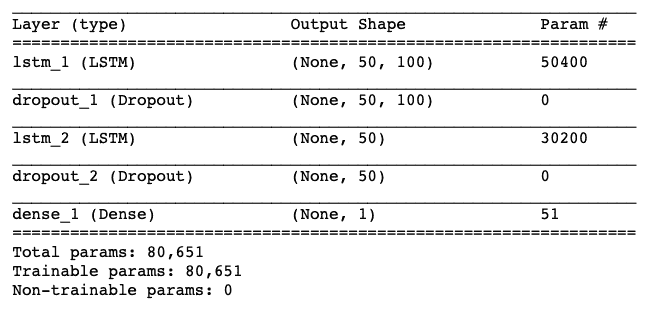
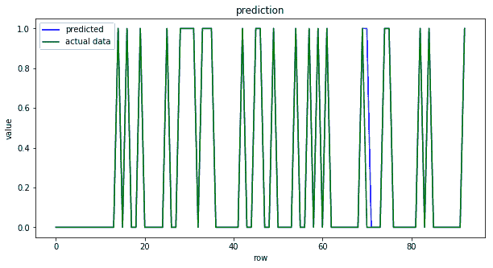
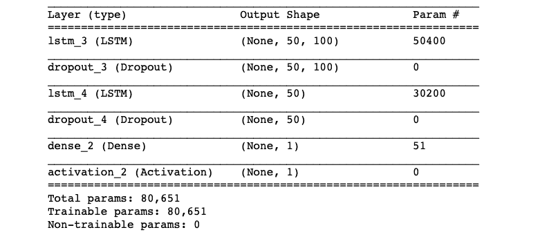
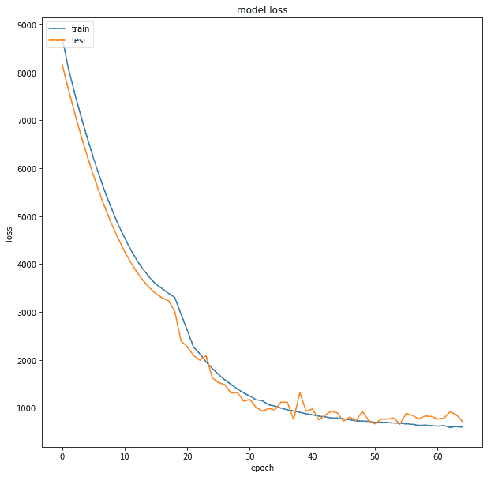
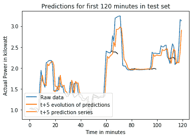

# 十、面向工业物联网的人工智能

今天，来自不同背景的公司正在意识到**人工智能** ( **AI** )的重要性，因此，正在将其融入他们的生态系统。本章重点介绍一些成功的人工智能驱动的**工业物联网**解决方案。本章结束时，您将已经学习了以下内容:

*   人工智能驱动的物联网解决方案如何改变行业
*   不同行业为其数据提供人工智能分析，以提高产量、优化物流和改善客户体验
*   预防性维修
*   基于飞机发动机传感器数据执行代码以执行预防性维护
*   电力负荷预测
*   实现TensorFlow代码进行短期负荷预测


# 人工智能驱动的工业物联网简介

物联网、机器人、大数据和**机器学习** ( **ML** )的融合为工业企业创造了巨大的机遇，也带来了重大挑战。

低成本传感器、多种云平台和强大的边缘基础设施的可用性正在使各行业采用人工智能变得更加容易和有利可图。这种人工智能驱动的工业物联网正在改变公司提供产品和服务或与客户和合作伙伴互动的方式。

人工智能驱动的工业物联网的一个有前途的领域是**预防性维护**。到目前为止，工业企业在维护方面一直是被动的，也就是说，他们要么将维护作为固定计划的一部分来执行，例如每六个月一次，要么仅在一些设备停止运行时才执行。例如，一家物流公司可能会对其车队中的每辆车进行两年一次的服务检查，并按照设定的时间表更换某些零件或整辆车。这种被动维护通常会浪费时间，而且成本高昂。在异常和错误发生之前应用人工智能算法来预测它们可以节省大量时间。

人工智能驱动的工业物联网可以实现奇迹的另一个领域是人类和机器人之间的合作。机器人已经是工业物联网生态系统的一部分；他们在装配线和仓库中工作，执行对人类工人来说特别重复或危险的任务。目前作为采矿业一部分的半自动卡车、火车和装载机通常由预编程程序、固定轨道和/或远程人工操作员来引导。

在许多行业情况下，云计算引入的延迟可能是不可接受的，在这种情况下，需要计算基础设施的边缘。

为了让你了解人工智能驱动的工业物联网的传播和使用，下面列出了一些提供工业物联网服务和解决方案的热门人工智能创业公司:

*   **Uptake Technologies Inc** :一家总部位于芝加哥的初创公司，由 Brad Keywell 于 2014 年联合创立，开发软件来监控和分析工业设备产生的实时数据，并使用它来改善机器的性能和维护。它正计划将其视野扩展到重型目标行业，如能源、铁路、石油和天然气、采矿和风力发电([https://www.uptake.com/](https://www.uptake.com/))。
*   **C3.ai** :由 Thomas Siebel 领导的大数据、物联网和人工智能应用的领先提供商，被 Forrester Research 2018 年工业物联网浪潮报告宣布为物联网平台的领导者。它成立于 2009 年，已经成功地在能源管理、网络效率、欺诈检测和库存优化( [https://c3.ai](https://c3.ai) )领域提供了行业服务。
*   **Alluvium**:Alluvium 于 2015 年由《黑客的机器学习*的作者德鲁·康威(Drew Conway)创立，使用 ML 和 AI 帮助工业公司实现运营稳定和提高生产。他们的旗舰产品 Primer 可以帮助公司从传感器的原始和提取数据中识别有用的见解，使他们能够在故障发生前预测操作故障( [https://alluvium.io](https://alluvium.io) )。*
**   **Arundo Analytics**:Arundo Analytics 由 Jakob Ramsø领导，成立于 2015 年，提供将实时数据连接到 ML 和其他分析模型的服务。他们有产品来扩展部署的模型，创建和管理实时数据管道([https://www.arundo.com](https://www.arundo.com))。*   **Canvass Analytics** :它利用基于实时运营数据的预测分析，帮助行业做出关键的商业决策。Canvass AI 平台提取由工业机器、传感器和操作系统生成的数百万个数据点，并识别数据中的模式和相关性，以创建新的见解。由 Humera Malik 负责的 Canvass Analytics 成立于 2016 年( [https://www.canvass.io](https://www.canvass.io) )。*

 *这并不是亚马逊和谷歌等软件技术巨头在工业物联网领域投入大量资金和基础设施的目的。谷歌正在使用预测建模来降低他们的数据中心成本，贝宝正在使用 ML 来发现欺诈性交易。


# 一些有趣的用例

来自不同背景的大量公司正在意识到将数据分析和人工智能融入其生态系统的重要性和影响。从提高他们的运营、供应链和维护效率到提高员工生产率，再到创造新的商业模式、产品和服务，没有一个方面没有探索过人工智能。下面，我们列出了一些人工智能驱动的物联网在行业中的有趣用例:

*   **预测性维护**:在预测性维护中，AI 算法被用来在故障发生之前预测设备未来的故障。这使得公司能够进行维护，从而减少停机时间。在接下来的章节中，我们将更详细地介绍预防性维护对工业的帮助，以及实现预防性维护的各种方法。
*   **资产跟踪**:也叫**资产管理**，这是跟踪关键实物资产的方法。通过跟踪关键资产，公司可以优化物流，保持库存水平，并检测任何低效之处。传统上，资产跟踪仅限于向资产添加 RFID 或条形码，因此，保持对其位置的标记，但是，随着人工智能算法的深入研究，现在可以进行更积极的资产跟踪。例如，风车发电站可以感应风速、风向甚至温度的变化，并使用这些参数将单个风车调整到最佳方向，以最大限度地发电。
*   车队管理和维护:近十年来，运输行业一直通过优化路线来使用人工智能进行车队管理。许多低成本传感器的出现和边缘计算设备的进步，使得运输公司能够收集和使用从这些传感器接收的数据，不仅通过更好的车对车通信和预防性维护来优化物流，还可以提高安全性。安装嗜睡检测等系统，可以检测到因疲劳或注意力分散而导致的危险行为，并可以要求驾驶员采取对策。


# 使用人工智能的预测性维护

重型机械和设备是任何行业的支柱，就像所有的实物一样，它们会退化、老化和失效。最初，公司通常执行反应式维护，即一旦报告了设备故障就进行维护。这通常会导致计划外停机。对于任何行业而言，计划外的停机时间都会导致严重的资源短缺，并大幅降低效率、产量和利润。为了解决这些问题，工业转向了预防性维护。

在预防性维护中，按照预定的时间间隔进行定期例行检查。预防性维护要求记录设备及其定期维护。第三次工业革命，计算机被引入工业，使得维护和更新这些记录变得容易。虽然预防性维护使行业免于大多数计划外停机，但它仍然不是最佳选择，因为定期检查可能是不必要的支出。下图概述了四次工业革命的一个例子:


知识共享署名下的图像共享:(https://commons.wikimedia.org/wiki/File:Industry_4.0.png)

当前自动化和数字化的趋势导致了第四次工业革命，也称为**工业 4.0** 。这使得公司能够部署**机器对机器** ( **M2M** )和**机器对人** ( **M2H** )通信，以及人工智能驱动的分析算法，实现预测性维护，利用过去的数据在故障发生前预测故障。预测性维护策略极大地简化了公司资源的维护和管理。

预测性维护背后的主要思想是根据状态监测数据预测设备何时可能发生故障。传感器用于监控设备正常运行期间的状态和性能，根据设备的不同，可能会使用不同类型的传感器。一些常见的状态监控参数/传感器值如下:

*   振动传感器主要用于检测泵和电机的未对准、不平衡、机械松动或磨损
*   电流/电压传感器，用于测量提供给电动机的电流和电压
*   超声波分析，用于检测管道系统或储罐中的泄漏，或可移动部件的机械故障和电气设备中的故障
*   识别温度波动的红外热成像
*   检测液体质量的传感器(例如，在葡萄酒传感器的情况下，检测葡萄酒中不同元素的存在)

要实现预测性维护，最重要的是确定需要监控的条件。然后部署监控这些条件所需的传感器。最后，收集来自传感器的数据来建立模型。


# 使用长短期记忆的预测性维护

为了演示预测性维护，我们将使用 Azure ML([https://gallery . Azure . ai/Collection/Predictive-Maintenance-Template-3](https://gallery.azure.ai/Collection/Predictive-Maintenance-Template-3)[)中提供的模拟数据。](https://gallery.azure.ai/Collection/Predictive-Maintenance-Template-3)数据集由以下三个文件组成:

*   **训练数据**:包含飞机发动机运行至故障数据。数据的下载链接是[http://azuremlsamples.azureml.net/templatedata/PM_train.txt](http://azuremlsamples.azureml.net/templatedata/PM_train.txt)。
*   **测试数据**:包含无故障事件记录的飞机发动机运行数据。数据可以从链接:[http://azuremlsamples.azureml.net/templatedata/PM_test.txt](http://azuremlsamples.azureml.net/templatedata/PM_test.txt)加载。
*   **地面真实数据**:这里提供了测试数据中每台发动机真实剩余循环次数的信息。地面实况数据的链接是[http://azuremlsamples.azureml.net/templatedata/PM_truth.txt](http://azuremlsamples.azureml.net/templatedata/PM_truth.txt)。

根据数据源提供的数据描述，训练数据(`train_FD001.txt`)由多个以周期为时间单位的多元时间序列组成，每个周期有 21 个传感器读数。每个时间序列都可以被假设为由同一类型的不同引擎生成。假设每台发动机在启动时都有不同程度的初始磨损和制造差异，用户不知道这些信息。在该模拟数据中，假设发动机在每个时间序列开始时正常运转。它在一系列操作周期中的某个点开始退化。这降低了进程，并在数量上增长。当达到预定阈值时，则认为发动机不安全，不能继续运行。换句话说，每个时间序列中的最后一个循环可以被认为是相应发动机的故障点。以样本训练数据为例，`id=1`的引擎在`192`周期失效，`id=2`的引擎在`287`周期失效。

测试数据(`test_FD001.txt`)具有与训练数据相同的数据模式。唯一不同的是，数据没有指明故障发生的时间(换句话说，最后一个时间段不代表故障点)。取样本测试数据，带`id=1`的发动机从周期`1`运行到周期`31`。没有显示该发动机在失效前还能持续多少个循环。

地面实况数据(`RUL_FD001.txt`)提供了测试数据中发动机剩余工作循环的次数。以所示的地面真实数据样本为例，测试数据中带有`id=1`的发动机在出现故障之前可以运行另一个`112`周期。

由于这是一个时间序列数据，我们将使用**长短时记忆** ( **LSTM** )来分类发动机在某个时间段是否会出现故障。这里提供的代码基于 Umberto Griffo 的 GitHub 链接提供的实现:([https://GitHub . com/Umberto Griffo/Predictive-Maintenance-using-LSTM](https://github.com/umbertogriffo/Predictive-Maintenance-using-LSTM)):

1.  实现预测性维护所需的模块在第一步导入。我们还设置了随机计算的种子，以便结果是可重复的:

```py
import keras
import pandas as pd
import numpy as np
import matplotlib.pyplot as plt
import os

# Setting seed for reproducibility
np.random.seed(1234) 
PYTHONHASHSEED = 0

from sklearn import preprocessing
from sklearn.metrics import confusion_matrix, recall_score, precision_score
from keras.models import Sequential,load_model
from keras.layers import Dense, Dropout, LSTM
```

2.  让我们读取数据并分配列名，如以下代码所示:

```py
# read training data - It is the aircraft engine run-to-failure data.
train_df = pd.read_csv('PM_train.txt', sep=" ",
         header=None)
train_df.drop(train_df.columns[[26, 27]], 
        axis=1, 
        inplace=True)
train_df.columns = ['id', 'cycle', 'setting1',
         'setting2', 'setting3', 's1', 's2',
         's3', 's4', 's5', 's6', 's7', 's8',
         's9', 's10', 's11', 's12', 's13', 
        's14', 's15', 's16', 's17', 's18', 
        's19', 's20', 's21']

train_df = train_df.sort_values(['id','cycle'])

# read test data - It is the aircraft engine operating data without failure events recorded.
test_df = pd.read_csv('PM_test.txt', 
        sep=" ", header=None)
test_df.drop(test_df.columns[[26, 27]], 
        axis=1, 
        inplace=True)
test_df.columns = ['id', 'cycle', 'setting1', 
        'setting2', 'setting3', 's1', 's2', 's3',
         's4', 's5', 's6', 's7', 's8', 's9', 
        's10', 's11', 's12', 's13', 's14',
         's15', 's16', 's17', 's18', 's19', 
        's20', 's21']

# read ground truth data - It contains the information of true remaining cycles for each engine in the testing data.
truth_df = pd.read_csv('PM_truth.txt', 
        sep=" ", 
        header=None)
truth_df.drop(truth_df.columns[[1]], 
        axis=1, 
        inplace=True)
```

3.  作为第一步，我们预测发动机是否会在该时间段内发生故障，因此我们的标签将是`1`或`0`，也就是说，这将是一个二元分类问题。为了创建二进制标签，我们对数据进行预处理，并创建一个新标签**剩余使用寿命** ( **RUL** )。我们还创建了一个二进制的`label1`变量，告知特定的引擎是否会在`w1`周期内发生故障。最后，数据(非传感器)被归一化，如下所示:

```py
# Data Labeling - generate column RUL(Remaining Usefull Life or Time to Failure)
rul = pd.DataFrame(train_df.groupby('id')
        ['cycle'].max()).reset_index()
rul.columns = ['id', 'max']
train_df = train_df.merge(rul, 
        on=['id'], 
        how='left')
train_df['RUL'] = train_df['max'] -     train_df['cycle']
train_df.drop('max', 
        axis=1, 
        inplace=True)

# Let us generate label columns for training data
# we will only use "label1" for binary classification, 
# The question: is a specific engine going to fail within w1 cycles?
w1 = 30
w0 = 15
train_df['label1'] = np.where(train_df['RUL'] <= w1, 1, 0 )

# MinMax normalization (from 0 to 1)
train_df['cycle_norm'] = train_df['cycle']
cols_normalize = train_df.columns.difference
        (['id','cycle','RUL','label1'])
min_max_scaler = preprocessing.MinMaxScaler()
norm_train_df = pd.DataFrame(min_max_scaler.
        fit_transform(train_df[cols_normalize]), 
        columns=cols_normalize, 
        index=train_df.index)
join_df = train_df[train_df.columns.
        difference(cols_normalize)].
        join(norm_train_df)
train_df = join_df.reindex(columns = train_df.columns)

train_df.head()
```


4.  在测试数据集上执行类似的预处理，只有一个变化-RUL 值从地面真实数据获得:

```py
# MinMax normalization (from 0 to 1)
test_df['cycle_norm'] = test_df['cycle']
norm_test_df = pd.DataFrame(
        min_max_scaler.
        transform(test_df[cols_normalize]), 
        columns=cols_normalize,     
         index=test_df.index)
test_join_df = test_df[test_df.
        columns.difference(cols_normalize)].
        join(norm_test_df)
test_df = test_join_df.
        reindex(columns = test_df.columns)
test_df = test_df.reset_index(drop=True)

# We use the ground truth dataset to generate labels for the test data.
# generate column max for test data
rul = pd.DataFrame(test_df.
        groupby('id')['cycle'].max()).
        reset_index()
rul.columns = ['id', 'max']
truth_df.columns = ['more']
truth_df['id'] = truth_df.index + 1
truth_df['max'] = rul['max'] + truth_df['more']
truth_df.drop('more', 
        axis=1, 
        inplace=True)

# generate RUL for test data
test_df = test_df.merge(truth_df, 
        on=['id'], how='left')
test_df['RUL'] = test_df['max'] - test_df['cycle']
test_df.drop('max', 
        axis=1, 
        inplace=True)

# generate label columns w0 and w1 for test data
test_df['label1'] = np.where
        (test_df['RUL'] <= w1, 1, 0 )
test_df.head()
```


5.  由于我们使用 LSTM 进行时间序列建模，因此我们创建了一个函数，该函数将根据窗口大小生成要提供给 LSTM 的序列。我们选择了`50`的窗口大小。我们还需要一个函数来生成相应的标签:

```py
# function to reshape features into 
# (samples, time steps, features) 
def gen_sequence(id_df, seq_length, seq_cols):
    """ Only sequences that meet the window-length
    are considered, no padding is used. This 
    means for testing we need to drop those which 
    are below the window-length. An alternative
    would be to pad sequences so that
    we can use shorter ones """

    # for one id we put all the rows in a single matrix
    data_matrix = id_df[seq_cols].values
    num_elements = data_matrix.shape[0]
    # Iterate over two lists in parallel.
    # For example id1 have 192 rows and 
    # sequence_length is equal to 50
    # so zip iterate over two following list of 
    # numbers (0,112),(50,192)
    # 0 50 -> from row 0 to row 50
    # 1 51 -> from row 1 to row 51
    # 2 52 -> from row 2 to row 52
    # ...
    # 111 191 -> from row 111 to 191
    for start, stop in zip(range(0, num_elements-seq_length), range(seq_length, num_elements)):
        yield data_matrix[start:stop, :]

def gen_labels(id_df, seq_length, label):
    # For one id we put all the labels in a 
    # single matrix.
    # For example:
    # [[1]
    # [4]
    # [1]
    # [5]
    # [9]
    # ...
    # [200]] 
    data_matrix = id_df[label].values
    num_elements = data_matrix.shape[0]
    # I have to remove the first seq_length labels
    # because for one id the first sequence of 
    # seq_length size have as target
    # the last label (the previus ones are 
    # discarded).
    # All the next id's sequences will have 
    # associated step by step one label as target. 
    return data_matrix[seq_length:num_elements, :]
```

6.  现在，让我们为数据生成训练序列和相应的标签，如以下代码所示:

```py
# pick a large window size of 50 cycles
sequence_length = 50

# pick the feature columns 
sensor_cols = ['s' + str(i) for i in range(1,22)]
sequence_cols = ['setting1', 'setting2', 
        'setting3', 'cycle_norm']
sequence_cols.extend(sensor_cols)

# generator for the sequences
seq_gen = (list(gen_sequence
        (train_df[train_df['id']==id], 
        sequence_length, sequence_cols)) 
        for id in train_df['id'].unique())

# generate sequences and convert to numpy array
seq_array = np.concatenate(list(seq_gen)).
        astype(np.float32)
print(seq_array.shape)

# generate labels
label_gen = [gen_labels(train_df[train_df['id']==id], 
        sequence_length, ['label1']) 
        for id in train_df['id'].unique()]
label_array = np.concatenate(label_gen).
        astype(np.float32)
print(label_array.shape)
```

7.  我们现在建立一个 LSTM 模型，有两个 LSTM 层和一个全连接层。该模型被训练用于二进制分类，因此，它试图减少二进制交叉熵损失。`Adam`优化器用于更新模型参数:

```py
nb_features = seq_array.shape[2]
nb_out = label_array.shape[1]

model = Sequential()

model.add(LSTM(
     input_shape=(sequence_length, nb_features),
     units=100,
     return_sequences=True))
model.add(Dropout(0.2))

model.add(LSTM(
     units=50,
     return_sequences=False))
model.add(Dropout(0.2))

model.add(Dense(units=nb_out,
     activation='sigmoid'))
model.compile(loss='binary_crossentropy', 
    optimizer='adam', 
    metrics=['accuracy'])

print(model.summary())
```



8.  我们训练模型，如下所示:

```py
history = model.fit(seq_array, label_array, 
        epochs=100, batch_size=200, 
        validation_split=0.05, verbose=2,
         callbacks = [keras.callbacks.
            EarlyStopping(monitor='val_loss', 
            min_delta=0, patience=10, 
            verbose=0, mode='min'),
        keras.callbacks.
            ModelCheckpoint
            (model_path,monitor='val_loss',     
            save_best_only=True, 
            mode='min', verbose=0)])    
```

9.  经过训练的模型在测试数据集上给出了 98%的准确度，在验证数据集上给出了 98.9%的准确度。精度值为`0.96`，有`1.0`的召回和`0.98`的 F1 分。不错吧！下图显示了列车模型的这些结果:



我们可以用同样的数据来预测飞机发动机的 RUL，也就是说，预测发动机的无故障时间。这将是一个回归问题，现在我们可以使用 LSTM 模型来执行回归。最初的步骤将和以前一样，但从第五步开始我们将有所改变。虽然生成的输入数据序列将保持与以前相同，但目标将不再是二进制标签，相反，我们将使用 RUL 作为回归模型的目标:

1.  我们使用相同的`gen_labels()`函数创建目标值。我们还使用`gen_sequence()`函数创建一个验证集:

```py
# generate labels
label_gen = [gen_labels(train_df[train_df['id']==id],
        sequence_length, ['RUL']) 
        for id in train_df['id'].unique()]
label_array = np.concatenate(label_gen).astype(np.float32)

# val is a list of 192 - 50 = 142 bi-dimensional array 
# (50 rows x 25 columns)
val=list(gen_sequence(train_df[train_df['id']==1], 
        sequence_length, sequence_cols))
```

2.  创建一个 LSTM 模型。我们在培训期间使用`r2`作为指标，因此，我们使用 Keras 自定义指标功能和我们自己的指标函数:

```py
def r2_keras(y_true, y_pred):
     """Coefficient of Determination 
     """
     SS_res = K.sum(K.square( y_true - y_pred ))
     SS_tot = K.sum(K.square( y_true - K.mean(y_true) ) )
     return ( 1 - SS_res/(SS_tot + K.epsilon()) )

# Next, we build a deep network. 
# The first layer is an LSTM layer with 100 units followed by 
# another LSTM layer with 50 units. 
# Dropout is also applied after each LSTM layer to control 
# overfitting. 
# Final layer is a Dense output layer with single unit and linear 
# activation since this is a regression problem.
nb_features = seq_array.shape[2]
nb_out = label_array.shape[1]

model = Sequential()
model.add(LSTM(
     input_shape=(sequence_length, nb_features),
     units=100,
     return_sequences=True))
model.add(Dropout(0.2))
model.add(LSTM(
     units=50,
     return_sequences=False))
model.add(Dropout(0.2))
model.add(Dense(units=nb_out))
model.add(Activation("linear"))
model.compile(loss='mean_squared_error', optimizer='rmsprop',metrics=['mae',r2_keras])

print(model.summary())
```



3.  在训练数据集上训练模型，如下所示:

```py
# fit the network
history = model.fit(seq_array, label_array, epochs=100, 
    batch_size=200, validation_split=0.05, verbose=2,
    callbacks = [keras.callbacks.EarlyStopping
    (monitor='val_loss', min_delta=0, patience=10, 
    verbose=0, mode='min'),
    keras.callbacks.ModelCheckpoint
    (model_path,monitor='val_loss', 
    save_best_only=True, mode='min', 
    verbose=0)])
```

4.  经训练的模型在测试数据集上提供 0.80 的`r2`值，在验证数据集上提供 0.72 的`r2`值。我们可以通过超调模型参数来改进我们的结果。接下来，您可以看到训练和验证数据集的模型在训练过程中丢失:



要运行此代码，请确保您有 Tensorflow 1.4

The complete code with both the binary classification and regression model are available at the GitHub repository, 【 . We can also create a model to determine if the failure will occur in different time windows, for example, fails in the window *(1，w [0] )* 或 fails in window(*w[0+1]，w [1]* )天，以此类推。这将是一个多分类问题，需要对数据进行相应的预处理。你可以从 Azure AI Gallery 了解更多关于这个预测性维护模板的信息:[https://Gallery . Azure . AI/Experiment/Predictive-Maintenance-Step-2A-of-3-train-and-evaluate-regression-models-2](https://gallery.azure.ai/Experiment/Predictive-Maintenance-Step-2A-of-3-train-and-evaluate-regression-models-2)。


# 预测性维护的优点和缺点

根据 GE 的一份调查报告([https://www . GE measurement . com/sites/gemc . dev/files/GE _ the _ impact _ of _ digital _ on _ unplanned _ down _ 0 . pdf](https://www.gemeasurement.com/sites/gemc.dev/files/ge_the_impact_of_digital_on_unplanned_downtime_0.pdf))。停机时间对石油和天然气行业的业绩产生了负面影响。这是真的，不仅对于油气行业，所有行业都是如此。因此，为了减少停机时间和提高效率，采用预测性维护非常重要。然而，建立预测性维护的成本相当高，但是一旦正确建立了预测性维护系统，它将有助于提供多种具有成本效益的好处，例如:

*   设备维护所需的时间最少
*   因维护而损失的最小生产时间
*   最后，备件成本也降至最低

成功的预测性维护能够以积极的方式重塑整个公司。


# 工业电力负荷预测

电目前是家庭和工业部门最重要的能源载体。与燃料不同，储存电力既困难又昂贵，因此需要在发电和需求之间建立精确的耦合。因此，电能负荷预测是非常重要的。根据时间范围(预测范围),电力负荷预测分为以下三类:

*   **短期负荷预测**:一小时到几周的预测
*   **中期负荷预测**:预测持续时间从几周到几个月不等
*   **长期负荷预测**:这里的预测是从几个月到几年

根据需要和应用，可能需要规划一个或所有以前的负荷预测类别。近年来，人们在**短期负荷预测** ( **STLF** )领域做了大量的研究工作。STLF 可以通过提供预测未来负荷的准确方法来帮助工业，这有助于精确规划，降低运营成本，从而增加利润并提供更可靠的电力供应。STLF 根据历史数据(通过智能电表获得)预测未来的能源需求，并预测天气状况。

负荷预测问题是一个回归问题。可以建模为时间序列问题，也可以建模为静态模型。将负荷预测建模为时间序列数据是最受欢迎的选择。对于时间序列建模，我们可以使用标准的 ML 时间序列模型，如 ARIMA，或者我们可以利用深度学习模型，如循环神经网络和 LSTM。

对于在电力负荷预测中使用的各种策略和模型的全面回顾，请参考本文:

Fallah，s .，Deo，r .，Shojafar，m .，Conti，m .，Shamshirband，S. (2018)。*智能能源管理电网中能源负荷预测的计算智能方法:现状、未来挑战和研究方向*。能量，11(3)，596。


# STLF 利用 LSTM

这里，我们展示了在 LSTM 的帮助下执行短期负荷预测的代码。训练和测试的数据取自 UCI ML 网站([https://archive . ics . UCI . edu/ML/datasets/Individual+household+electric+power+consumption #](https://archive.ics.uci.edu/ml/datasets/Individual+household+electric+power+consumption#))。STLF 的代码改编自 GitHub([https://github.com/demmojo/lstm-electric-load-forecast](https://github.com/demmojo/lstm-electric-load-forecast)):

1.  我们导入必要的模块并设置随机种子，如下所示:

```py
import time
from keras.layers import LSTM
from keras.layers import Activation, Dense, Dropout
from keras.models import Sequential, load_model
from numpy.random import seed

from tensorflow import set_random_seed
set_random_seed(2) # seed random numbers for Tensorflow backend
seed(1234) # seed random numbers for Keras
import numpy as np
import csv
import matplotlib.pyplot as plt

%matplotlib inline
```

2.  定义用于加载数据并将其转换为适合 LSTM 输入的序列的实用函数:

```py
def load_data(dataset_path, sequence_length=60, prediction_steps=5, ratio_of_data=1.0):
    # 2075259 is the total number of measurements 
    # from Dec 2006 to Nov 2010
    max_values = ratio_of_data * 2075259

    # Load data from file
    with open(dataset_path) as file:
        data_file = csv.reader(file, delimiter=";")
        power_consumption = []
        number_of_values = 0
        for line in data_file:
            try:
                power_consumption.append(float(line[2]))
                number_of_values += 1
            except ValueError:
                pass

            # limit data to be considered by 
            # model according to max_values
            if number_of_values >= max_values: 
                break

    print('Loaded data from csv.')
    windowed_data = []
    # Format data into rolling window sequences
    # for e.g: index=0 => 123, index=1 => 234 etc.
    for index in range(len(power_consumption) - sequence_length): 
            windowed_data.append(
            power_consumption[
            index: index + sequence_length])

    # shape (number of samples, sequence length)
    windowed_data = np.array(windowed_data)

    # Center data
    data_mean = windowed_data.mean()
    windowed_data -= data_mean
    print('Center data so mean is zero 
            (subtract each data point by mean of value: ', 
            data_mean, ')')
    print('Data : ', windowed_data.shape)

    # Split data into training and testing sets
    train_set_ratio = 0.9
    row = int(round(train_set_ratio * windowed_data.shape[0]))
    train = windowed_data[:row, :]

    # remove last prediction_steps from train set
    x_train = train[:, :-prediction_steps] 
    # take last prediction_steps from train set
    y_train = train[:, -prediction_steps:] 
    x_test = windowed_data[row:, :-prediction_steps]

    # take last prediction_steps from test set
    y_test = windowed_data[row:, -prediction_steps:] 

    x_train = np.reshape(x_train, 
            (x_train.shape[0], x_train.shape[1], 1))
    x_test = np.reshape(x_test, 
            (x_test.shape[0], x_test.shape[1], 1))

    return [x_train, y_train, x_test, y_test, data_mean]
```

3.  构建 LSTM 模型，我们构建的模型包含两个 LSTM 和一个全连接层:

```py
def build_model(prediction_steps):
    model = Sequential()
    layers = [1, 75, 100, prediction_steps]
    model.add(LSTM(layers[1], 
        input_shape=(None, layers[0]), 
        return_sequences=True)) # add first layer
    model.add(Dropout(0.2)) # add dropout for first layer
    model.add(LSTM(layers[2], 
        return_sequences=False)) # add second layer
    model.add(Dropout(0.2)) # add dropout for second layer
    model.add(Dense(layers[3])) # add output layer
    model.add(Activation('linear')) # output layer 
    start = time.time()
    model.compile(loss="mse", optimizer="rmsprop")
    print('Compilation Time : ', time.time() - start)
    return model
```

4.  定型模型，如下面的代码所示:

```py
def run_lstm(model, sequence_length, prediction_steps):
    data = None
    global_start_time = time.time()
    epochs = 1
    ratio_of_data = 1 # ratio of data to use from 2+ million data points
    path_to_dataset = 'data/household_power_consumption.txt'

    if data is None:
        print('Loading data... ')
        x_train, y_train, x_test, y_test, result_mean = load_data(path_to_dataset, sequence_length,
                                                                  prediction_steps, ratio_of_data)
    else:
        x_train, y_train, x_test, y_test = data

    print('\nData Loaded. Compiling...\n')

    model.fit(x_train, y_train, batch_size=128, epochs=epochs, validation_split=0.05)
    predicted = model.predict(x_test)
    # predicted = np.reshape(predicted, (predicted.size,))
    model.save('LSTM_power_consumption_model.h5') # save LSTM model

    plot_predictions(result_mean, prediction_steps, predicted, y_test, global_start_time)

    return None

sequence_length = 10 # number of past minutes of data for model to consider
prediction_steps = 5 # number of future minutes of data for model to predict
model = build_model(prediction_steps)
run_lstm(model, sequence_length, prediction_steps)
```

5.  从下图中我们可以看到，我们的模型做出了很好的预测:



完整的代码可以在 GitHub: `Chapter10/Electrical_load_Forecasting.ipynb`获得。


# 摘要

在本章中，我们看到了人工智能支持的物联网对行业产生了重大影响。从制造、物流、农业和采矿到创造新产品和服务，人工智能已经触及到了每个方面。我们可以满怀希望地假设，以人工智能为动力的工业物联网将会更好地改变和破坏当前的业务流程和模式。

下一章将展示人工智能和物联网如何帮助塑造更好的城市。*