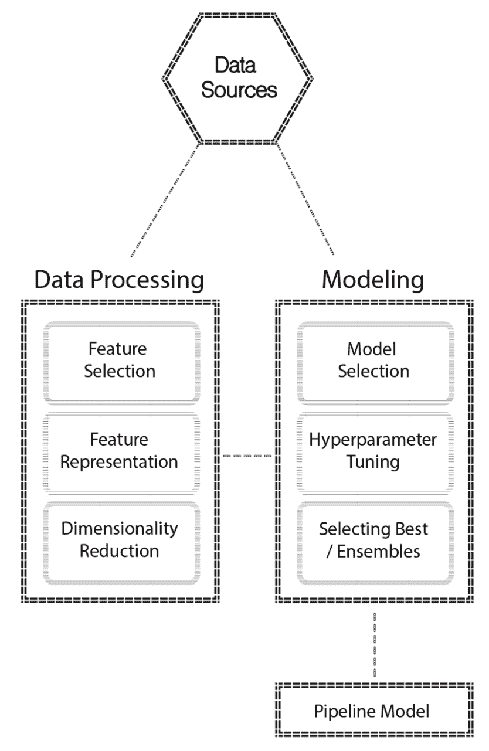
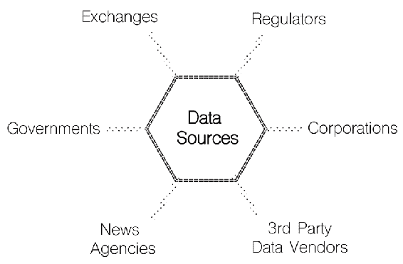
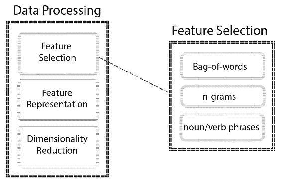
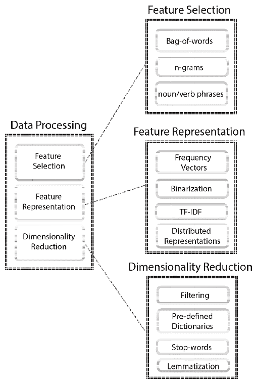
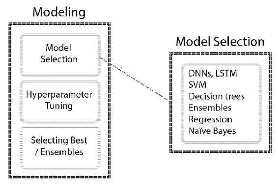
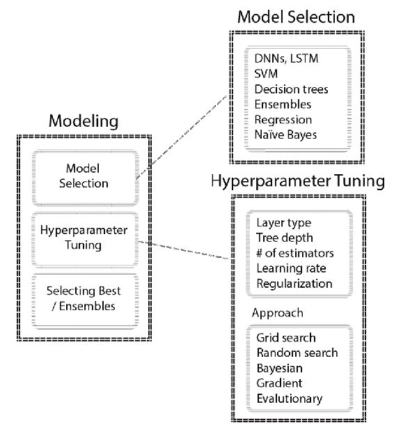

<title>Unknown</title> 

# ML 和数据科学项目的关键方面

如果你已经走了这么远，给自己一个鼓励。这并不是把自己想象成一个**机器学习** ( **ML** )专家，而是承认你为学习**自动化 ML** ( **AutoML** )工作流所做的工作。现在，您已经准备好应用这些技术来解决您的问题了！

在这一章中，你将回顾你在整个章节中学到的东西，并把你的学习放在一个更广阔的视角中。

我们将在讨论中涉及以下主题:

*   作为搜索的机器学习
*   ML 中的权衡
*   典型数据科学项目的参与模型
*   交往模式的各个阶段

<title>Unknown</title> 

# 作为搜索的机器学习

在前面的章节中，您已经看到了许多不同的技术应用于建模问题，其中大多数技术，尽管它们看起来很简单，但包含了许多最终会影响您工作结果的参数。许多建模问题需要将 AutoML 表示为搜索问题，在大多数情况下，只能找到次优解。

从更广泛的意义上来说，建模只是输入数据和输出数据之间的映射。因此，您将能够推断出新输入数据到达时的未知输出。为了实现您的目标，您需要考虑您的实验设计，并相应地配置您的环境，因为您确实不知道什么将是性能最好的 ML 管道——但是让我们停下来，后退一步。

实现高性能系统实际上是从一些关于系统架构的基本选择开始的，这将允许您设计和交付成功的数据科学解决方案。您应该开始考虑的一件事是您的硬件和软件的系统配置，例如服务器的类型、CPU 或 GPU 的特定要求、内存和磁盘要求、软件要求等。由于您将处理更大的数据集，因此您的配置将更加重要。您在这一点上做出的选择将决定您的数据科学堆栈的性能，该堆栈可能包含以下一些软件框架和库:

*   特定的软件发行版，如 Anaconda
*   Hadoop、Apache Spark、Kafka 等数据处理框架
*   特定于任务的库，如 scikit-learn、XGBoost、TensorFlow/Keras、PyTorch
*   数据管理系统，如 MongoDB、Neo4j、Apache Cassandra 和 MySQL

这不是一个详尽的列表，但是，即使范围如此有限，也有很多信息需要消化。理想情况下，您应该至少熟悉每一个在典型架构中扮演的角色，一旦您开始构建系统，当您为不同的用例实现系统时，这些选择将变得清晰。

一旦这些部分就绪并顺利工作，您就可以开始考虑如何移动数据并将其输入 ML 管道。

当您处于数据处理和建模阶段时，选项是巨大的，并且如前所述，每种方法都有自己的一组参数。下面向您展示了到目前为止您所练习的典型流程:



让我们考虑一个用于预测金融市场运动的文本处理管道，并看看在这样的设置中每个步骤意味着什么。

第一，你会有各种数据源；这些数据可能来自:

*   金融交易所
*   公司公告和文件
*   提供一般新闻和金融新闻的通讯社
*   来自政府机构的宏观经济数据
*   监管报告
*   Twitter 等社交网络

下图显示了几个不同的数据源:



当您存储了这样的数据时，您需要处理这些数据以便在建模阶段使用，因为 ML 模型需要数字矢量化输入。

第一步是特征选择，这可能包括以下步骤:

*   确定是否每个单词都将被视为不同的特征；这就是通常所说的**词汇袋**
*   确定名词短语、动词短语或命名实体是否可以用作特征
*   将单词归类为有代表性的概念
*   创建 n-gram，这是一个连续的项目序列

下图有助于我们理解不同的功能选择:



一旦你决定了你要使用什么特性，你就会考虑减少维数以避免维数灾难。这一阶段可能包括以下步骤:

*   简单的过滤操作，例如只包括前 100 个概念
*   设置阈值以仅包括出现次数超过给定阈值的单词
*   使用领域专家创建的预定义词典来过滤输入数据
*   标准操作，如删除停用词和词汇化

下图有助于您理解特征选择和表示的不同方法:


降维也是一个阶段，你可以在特征表示之后再回到这个阶段。一旦你有了数字特征向量，你就可以应用像**主成分分析** ( **PCA** )这样的方法来进一步降低维数。让我们来看看要素制图表达的典型操作:

*   将词汇表中的单词表示为频率向量，其中每个单词将被分配给它出现的次数
*   将频率向量二进制化，使得每个值为 0 或 1
*   用**词频-逆文档频** ( **tf-idf** )编码来表示一个文档集合中的单词对整个文档的相对重要性，即**语料库**
*   使用分布式表示，如 Word2Vec 或 Doc2Vec

因此，你有完整的数字解释如下:



一旦你完成了数据处理部分，你就可以开始建模，在这种情况下，你将有许多不同的算法可供选择。在文本挖掘中，以下是最常用的算法:

*   深度神经网络，特别是**长短期记忆** ( **LSTM** )网络，这是一种特殊类型的**递归神经网络** ( **RNNs**
*   支持向量机
*   决策树
*   全体
*   回归算法
*   朴素贝叶斯

下图显示了几个可以使用的不同算法:



每个算法都有自己的参数空间，参数主要有两种类型:

*   训练开始前设置的超参数
*   在训练期间学习的模型参数

目标是优化超参数，使模型参数具有最佳的泛化性能。搜索空间通常非常大，您已经看到了一些方法，如贝叶斯优化，它以有效的方式探索空间。

例如，让我们只看一下主导 ML 应用程序的 XGBoost 算法的参数。

如果运行以下几行，您将看到模型参数的解释:

```
import xgboost as xgb
classifier = xgb.XGBClassifier()

classifier?
```

这将为您提供以下输出:

```
Type: XGBClassifier
String form:
XGBClassifier(base_score=0.5, booster='gbtree', colsample_bylevel=1,
 colsample_bytree=1, g <...> reg_alpha=0, reg_lambda=1, scale_pos_weight=1, seed=None,
 silent=True, subsample=1)
File: ~/anaconda/lib/python3.6/site-packages/xgboost/sklearn.py
Docstring: 
Implementation of the scikit-learn API for XGBoost classification.
 Parameters
----------
max_depth : int
 Maximum tree depth for base learners.
learning_rate : float
 Boosting learning rate (xgb's "eta")
n_estimators : int
 Number of boosted trees to fit.
silent : boolean
 Whether to print messages while running boosting.
objective : string or callable
 Specify the learning task and the corresponding learning objective or
 a custom objective function to be used (see note below).
booster: string
 Specify which booster to use: gbtree, gblinear or dart.
nthread : int
 Number of parallel threads used to run xgboost. (Deprecated, please use n_jobs)
n_jobs : int
 Number of parallel threads used to run xgboost. (replaces nthread)
gamma : float
 Minimum loss reduction required to make a further partition on a leaf node of the tree.
min_child_weight : int
 Minimum sum of instance weight(hessian) needed in a child.
max_delta_step : int
 Maximum delta step we allow each tree's weight estimation to be.
subsample : float
 Subsample ratio of the training instance.
colsample_bytree : float
 Subsample ratio of columns when constructing each tree.
colsample_bylevel : float
 Subsample ratio of columns for each split, in each level.
reg_alpha : float (xgb's alpha)
 L1 regularization term on weights
reg_lambda : float (xgb's lambda)
 L2 regularization term on weights
scale_pos_weight : float
 Balancing of positive and negative weights.
base_score:
 The initial prediction score of all instances, global bias.
seed : int
 Random number seed. (Deprecated, please use random_state)
random_state : int
 Random number seed. (replaces seed)
missing : float, optional
 Value in the data which needs to be present as a missing value. If
 None, defaults to np.nan.
**kwargs : dict, optional
 Keyword arguments for XGBoost Booster object. Full documentation of parameters can
 be found here: https://github.com/dmlc/xgboost/blob/master/doc/parameter.md.
 Attempting to set a parameter via the constructor args and **kwargs dict simultaneously
 will result in a TypeError.
 Note:
 **kwargs is unsupported by Sklearn. We do not guarantee that parameters passed via
 this argument will interact properly with Sklearn.
```

为了优化 XGBoost 这样的超参数，您需要选择一种方法，例如网格搜索、随机搜索、贝叶斯优化或进化优化。在实践中，贝叶斯优化对于优化 ML 算法的超参数产生良好的结果。

以下流程图显示了优化中使用的常用超参数和方法:



最终，您可以选择性能最佳的 ML 管道，或者创建自己的集合来利用多个管道。

掌握这些管道需要你熟悉每一个步骤，并正确导航整个搜索空间，以获得可接受的接近最优的解决方案。

<title>Unknown</title> 

# 机器学习中的权衡

主要有两个方面需要考虑:

*   训练时间
*   得分时间

这两者都将成为你开发管道的约束。

让我们想想训练和得分时间带来的限制。对训练时间的要求通常会决定您将包含在候选列表中的算法。例如，逻辑回归和**支持向量机** ( **支持向量机**)是快速训练算法，这可能对你很重要，尤其是如果你正在使用大数据快速构建想法的原型。在得分方面，他们也很快。两者都有不同的实现，求解器也有不同的选项，这使得这两者对于许多 ML 用例都很方便。

然而，对于像深度神经网络这样的东西，训练和评分时间是非常有限的约束，因为你可能无法忍受长达一周的训练时间或超过一秒的评分时间。您可以通过拥有更强大的硬件资源来提高训练和得分时间，但这可能会导致您的账单飙升，具体取决于您网络的复杂程度。除了算法的选择，训练时间也很大程度上取决于你的超参数空间，因为它可能会导致它更长。

另一个问题是可伸缩性，这与您的数据大小有关，您需要确保管道的可伸缩性与数据的增长速度相匹配。此时，您应该考虑支持多线程、多核、并行或分布式训练等因素。

<title>Unknown</title> 

# 典型数据科学项目的参与模型

当你开始学习任何新的东西，或建立在你现有的知识基础上时，了解事情的背景以及故事如何随着时间的推移而演变是很重要的，要知道当前的趋势是传统报道、**商业智能** ( **毕**)和分析的自然演变。这就是为什么最初的章节向您介绍了 ML 管道的背景和基础知识，例如数据预处理、自动算法选择和超参数优化。

由于 AutoML 管道的高度实验性质，有许多概念连同它们的实际例子一起被解释。

高级分析和 ML 用来解决问题的想法不一定是新的，但它们只是在人们可以轻松获得更便宜的硬件和软件资源时才可用。更先进的技术供您使用，以解决您以前无法解决的一些问题。

在本书中，您已经学习了开发 ML 管道的各个方面。然而，在现实项目中，开发 ML 管道只是其中的一个变量。操作 ML 管道是至关重要的，因为只有成功地部署和监控这些管道，才能从完善的管道中获益。许多公司都有面向 ML 的软件即服务产品，它们旨在抽象出生产环境中管理 ML 管道的低层次复杂性。

在下一节中，我们将讨论数据科学项目的不同阶段，以便您在处理端到端数据科学项目的成功交付时，能够准确地理解建模所处的位置。

<title>Unknown</title> 

# 交往模式的各个阶段

一个非常著名的建模过程是用于数据挖掘和预测分析项目的 CRISP-DM，它包括六个步骤:

1.  商业理解
2.  数据理解
3.  数据准备
4.  建模
5.  估价
6.  部署

这些阶段一个接一个，其中一些通过向前一个阶段提供反馈以递归方式发生。就模型监控和维护而言，部署阶段尤其重要，这是本章的重点。

让我们快速了解一下这些阶段及其在整个流程中的作用。

<title>Unknown</title> 

# 商业理解

在这一阶段，您完全关注项目目标、范围、资源、限制、迭代和检查点方面的业务目标。

你试着从商业角度理解整个画面，从技术角度框定问题。在您的组织中，不同的内部利益相关者之间可能存在相互竞争的目标，您应该意识到它们并找到最佳点。例如，在供应链管理中，产品供应组织试图将他们的库存保持在最佳水平，而销售组织希望根据非常乐观的销售预测为即将推出的产品建立过多的库存。您应该知道谁将从您将要实现的 ML 和数据科学能力中受益。

在此阶段，您通常会尝试解决以下问题:

*   熟悉当前的决策过程，并将其进一步分解为不同场景的单独用例。
*   就人力资源达成一致后，确定要使用的数据源(例如数据提取、数据湖、可操作数据库等)。
*   找出假设并尝试用可用数据验证它们，在继续之前将事实与观点/直觉分开。
*   就交付成果以及在整个项目中用于交付这些成果的工具/技术达成一致。
*   决定哪些评估指标/KPI 将用于 ML 模型和业务成果。你应该始终与商业目标保持一致。
*   识别可能导致延迟或项目失败的风险，并向风险承担者说明这些风险。ML 项目的成功本质上是概率性的，不像大多数人习惯的 BI 工作。

<title>Unknown</title> 

# 数据理解

在这个阶段，您将对整个项目中使用的数据源有所了解。

在此阶段，您通常会尝试解决以下问题:

*   清除数据访问和授权问题。
*   将数据加载到首选平台进行初步分析。
*   了解敏感信息并执行必要的操作，如匿名或删除敏感数据。
*   确定要使用的数据集。
*   识别数据模式并获取字段描述。

*   确定每个数据集的数量并识别差异。例如，检查不同表中的变量是否具有相同的数据类型，例如，一个变量在一个表中可能是整数类型，而在另一个表中可能是小数类型。
*   探索样本数据集，例如生成基本数据，包括计数、平均值、标准偏差、百分位数和检查变量分布。
*   熟悉如何收集数据，以了解在数据收集过程中是否可能存在测量误差。
*   研究相关性的同时牢记统计谚语— *相关性并不意味着因果关系*。
*   发现噪音，比如离群值，并就如何对待它们达成一致。
*   通过检查数据集的不同属性来确保样本数据集代表总体。例如，是否存在由于数据可用性而导致的对不同类别数据的倾斜。
*   及时执行多项质量检查，以确保数据质量。例如，您可以识别和澄清错误和缺失的值，例如日期列中的值 100，000，000，000，或者平均值为 23.4 的值 25，000。
*   决定用作测试数据的数据量，并将其与训练数据分开。

最终，这些实践将引导您在一些约定之后创建自动化的数据准备流程和数据质量报告。

<title>Unknown</title> 

# 数据准备

在此阶段，您将通过连接不同的数据源、清理、格式化和工程要素来创建最终数据集，以便在建模阶段使用。

在此阶段，您通常会尝试解决以下问题:

*   识别相关数据集以建立模型。
*   记录数据连接和聚合以构建最终数据集。
*   编写带有有用参数的函数，以便在项目后期灵活地清理和格式化数据集，例如通过 x%移除异常值，或者使用平均值、中值或最频繁值输入缺失值。
*   相应地对待异常值。
*   玩特征工程方法。

*   选择特征。一般来说，有三种主要的特征选择方法:
    *   过滤方法
    *   包装方法
    *   嵌入式方法
*   确定特性的重要性，列出包含/排除特性的原因。
*   就要构建的数据转换管道达成一致。
*   为特定的操作编写定制的转换器，例如通过扩展 Apache Spark 或 scikit-learn 的 transformer 类从给定的语料库中提取段落、句子和单词，以及为估计器编写类似的程序。
*   正确地对数据集进行版本控制，并编写额外的注释，解释与准备相关的步骤。

<title>Unknown</title> 

# 建模

在这一阶段，您将考虑对您在前面阶段创建的最终数据集进行建模的选项。

在此阶段，您通常会尝试解决以下问题:

*   确定最大似然问题的类型，如监督、半监督、非监督和强化学习。
*   筛选出符合要求的 ML 型号。
*   就评估指标达成一致，并关注重要的点，如类不平衡，因为它欺骗了准确性等指标。如果数据集不平衡，可以参考采样技术获得平衡数据集。
*   确定对假阴性和假阳性的容忍度。
*   思考如何正确设置交叉验证。
*   分析性能模型最重要的特征。
*   分析关于每个特征的模型灵敏度。不同的算法可能对特征进行不同的排序；这将有助于您了解如果要素的分布属性随时间变化，模型会如何反应。
*   微调模型。
*   确定适合部署的 ML 工作负载类型，例如在线、批处理和流部署。
*   考虑训练和评分时间，因为计算复杂性和数据大小通常是选择算法时的约束。

<title>Unknown</title> 

# 估价

在这一阶段，您要回顾流程，并确保您已经涵盖了所有的计划项目。

在此阶段，您通常会尝试解决以下问题:

*   审查所有阶段，并确保要部署的模型管道正确地解决了之前执行的所有问题和步骤
*   准备一场精彩的演示，保持简洁明了，简单而不简单
**   展示结果，抓住要点，解释你的模型如何满足商业目标*   解释了它的局限性，以及在什么情况下它可以南下*

*<title>Unknown</title> 

# 部署

这是你开始操作你的 ML 模型的阶段。

在此阶段，您通常会尝试解决以下问题:

*   在生产中进行短暂的试驾
*   监控性能
*   当模型性能开始下降时，确定改进模型的策略，如重新评估、重新训练循环和重新部署循环
*   准备最终报告和交付件

你当然可以扩展你在每个阶段要解决的项目列表，但是这个列表应该给你一个你需要覆盖的整体概念。

很多时候，你会在项目时间表的中间加入一个项目团队。在这种情况下，你通常缺乏项目背景，你需要与关键人物进行几次会谈，以了解正在发生的事情。了解这些阶段将有助于您理解项目的当前阶段，并确定遗漏了什么或阐明接下来的步骤。

当你经历这些步骤时，记录你每一步的推理和发现是很重要的。当您需要重做一些步骤时，适当的文档会节省您的时间，因为您可能不记得您是如何执行一些分析或数据处理的。

<title>Unknown</title> 

# 摘要

正如你在生活中追求的其他事情一样，实践是唯一能帮助你提高开发 ML 管道技能的事情。你需要花相当多的时间用许多不同的技术和算法来处理各种问题和数据集。

特别是在真实的项目中，你可能不会遇到类似的问题，每个项目都需要你有不同的方法。您将很快意识到，重要的不仅仅是建模，而是理解这些技术如何相互集成，并在企业软件架构中很好地发挥作用。

通过学习 AutoML 系统，您向前迈进了一大步，并对 AutoML 管道有了更好的理解。您肯定应该努力学习更多关于其他方面的知识，比如您感兴趣的领域中特定于领域的应用程序、应用程序架构、生产环境和模型维护技术。

感谢您花时间浏览内容，我们真诚地希望您能像我们写这本书时一样喜欢这本书！*