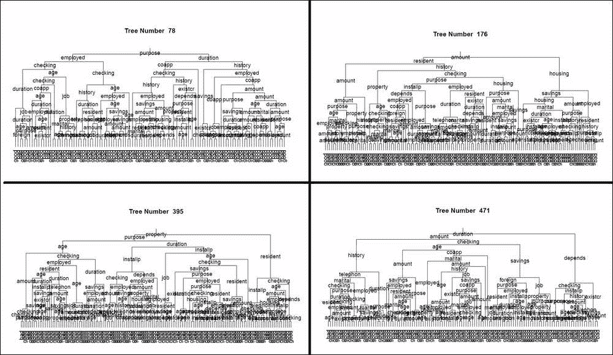
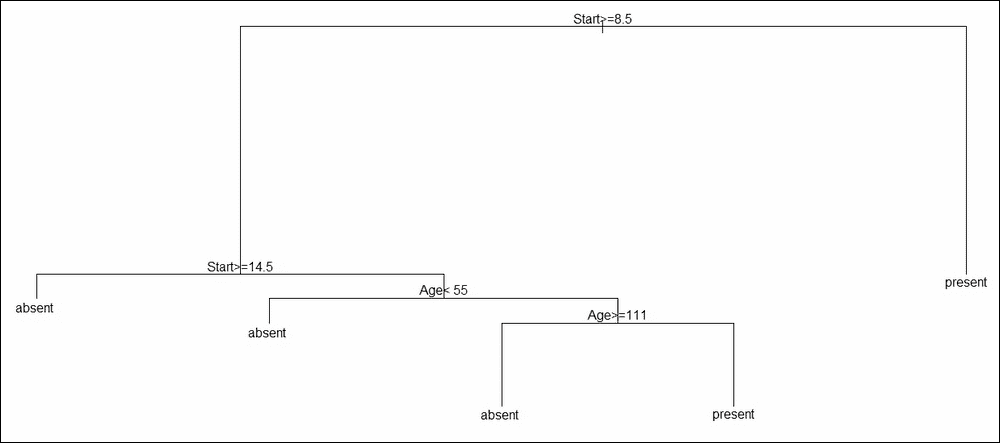
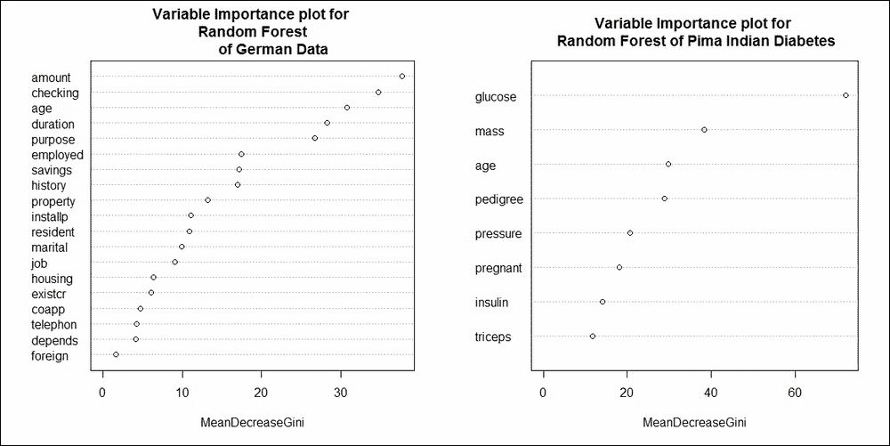
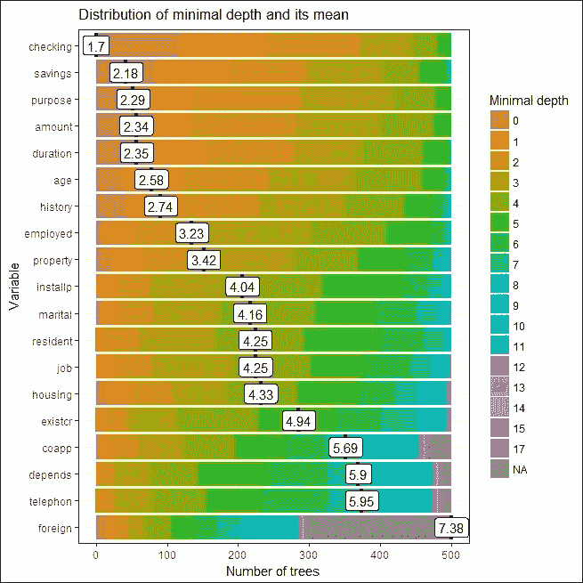
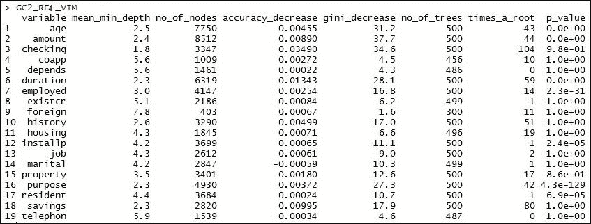
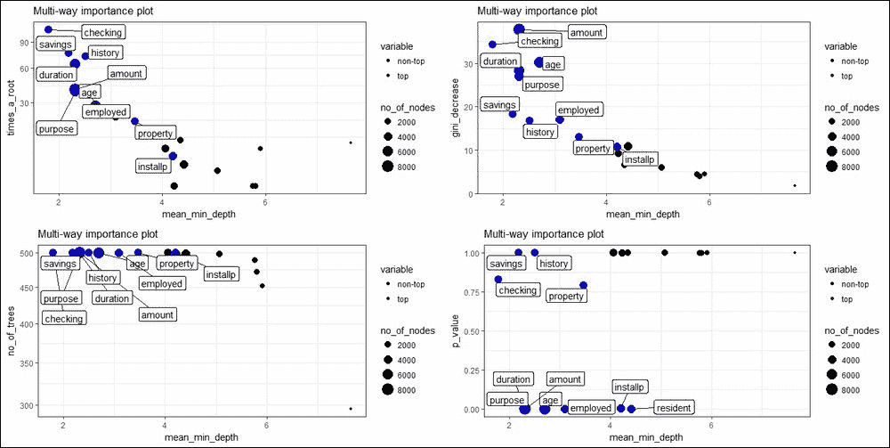
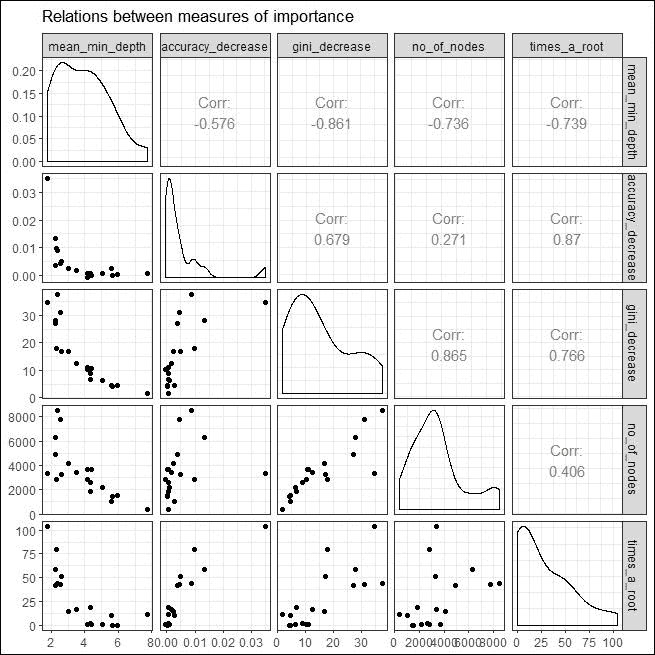
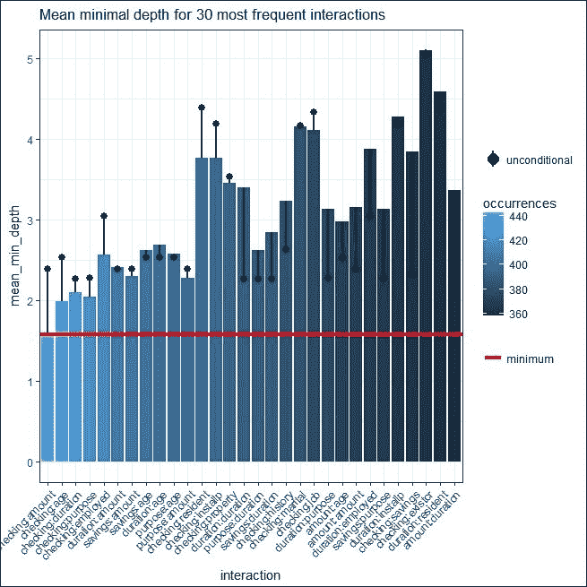
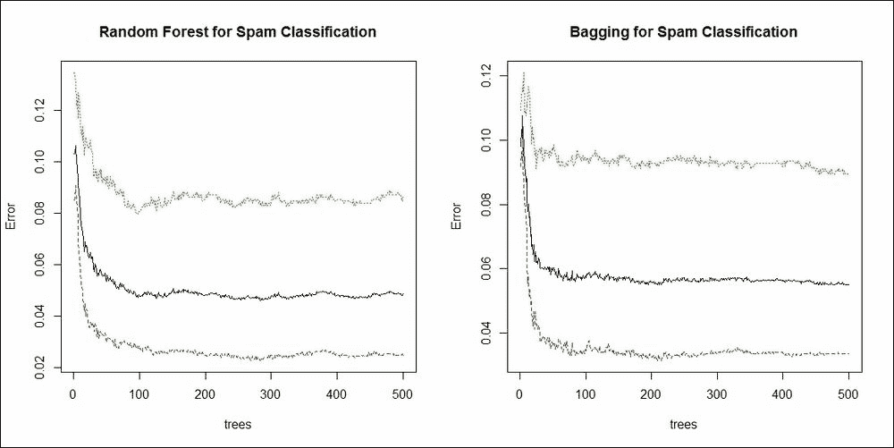

<title>Chapter 4. Random Forests</title>  

# 第四章。随机森林

前一章介绍了 bagging 作为一种基于同构基础学习器的集成技术，决策树充当基础学习器。bagging 方法的一个小缺点是引导树是相关的。因此，尽管预测的方差减少了，但偏差仍将存在。Breiman 建议在每次分割时随机抽样协变量和独立变量，然后这种方法继续帮助去相关 bootstrap 树。

在这一章的第一节中，介绍并举例说明了随机森林算法。可变重要性的概念对决策树及其所有变体至关重要，有一节专门用来清楚地说明这个概念。随机森林的表现比装袋好吗？下一节将提供答案。

Breiman 阐述了随机森林中邻近图的重要性，我们将很快对此进行深入研究。像这样复杂的算法会有很多本质细节，其中一些会通过程序和真实数据来说明。缺失数据几乎无处不在，我们将使用随机森林来承担输入缺失值的任务。虽然随机森林主要是一种监督学习技术，但它也可以用于对数据进行聚类观察，本主题将是结论部分。

本章的核心主题如下:

*   随机森林算法
*   决策树和随机森林的可变重要性
*   随机森林与装袋的比较
*   邻近图的使用
*   随机的森林细节、事实和细微差别
*   使用随机森林处理丢失的数据
*   随机森林聚类

<title>Chapter 4. Random Forests</title>  

# 技术要求

在本章中，我们将使用以下库:

*   `kernlab`
*   `randomForest`
*   `randomForestExplainer`
*   `rpart`

<title>Random Forests</title>  

# 随机森林

[第三章](part0027_split_000.html#PNV61-2006c10fab20488594398dc4871637ee "Chapter 3. Bagging")、*装袋*，利用 bootstrap 原理对决策树进行了推广。在我们开始与随机森林的旅程之前，我们将快速回顾决策树的历史，并强调它们的一些优点和缺点。决策树的发明伴随着大量的论文，当前决策树的形式可以在 Breiman 等人(1984)的文章中找到。布雷曼的方法俗称 **C** 分类 **a** 和 **R** 回归 **T** 里斯，又名**大车**。大约在 20 世纪 70 年代末和 80 年代初，昆兰独立于布雷曼发明了一种叫做 C4.5 的算法。欲了解更多信息，请参阅昆兰(1984)。在很大程度上，决策树、bagging 和随机森林的当前形式归功于 Breiman。一种有点类似的方法也存在于一种算法中，这种算法通常被缩写为 CHAID，它代表自动检测器。Hastie 等人(2009 年)对 CART 进行了深入研究，Berk (2016 年)提供了统计观点。在 Seni 和 Elder (2010)中也可以找到一组优秀的短笔记。没有任何特定的方向，我们强调 CART 的一些优点和缺点:

*   树自动解决变量选择的问题，因为在每次分割时，它们寻找在回归中给出最佳分割的变量，因此树消除了无用的变量。
*   树不需要数据处理。这意味着我们不必考虑变换、重定尺度和/或证据权重预处理。
*   树在计算上是可扩展的，时间复杂度是可管理的。
*   树给出了称为变量重要性的度量，该度量基于变量在树的所有分裂中对错误减少的贡献。
*   树有效地处理丢失的值，并且如果一个观察有一个丢失的值，树将继续使用观察的可用值。处理缺失数据通常是通过代理拆分的概念来实现的。
*   如前一章所述，树需要管理的参数较少。
*   树有一个简单的自上而下的解释。
*   深度大的树往往几乎是无偏的。
*   变量之间的相互作用很容易识别。
*   它的缺点是拟合的模型不连续，会有尖锐的边缘。本质上，树是分段常数回归模型。
*   树不能近似低相互作用目标函数。
*   对树的贪婪搜索方法导致高方差。

树的第一个扩展见于上一章讨论的 bagging 算法。假设我们有 N 个观察值。对于每个 bootstrap 样本，我们抽取 N 个替换观察值。两个 bootstrap 样本之间有多少个观察值可能是相同的？让我们先编写一个简单的程序来查找它，使用简单的`sample`函数:

```
> N <- seq(1e3,1e4,1e3)
> N
 [1]  1000  2000  3000  4000  5000  6000  7000  8000  9000 10000
> B <- 1e3
> Common_Prob <- NULL
>index<- 1
>for(i in N){
+   temp_prob <- NULL
+   for(j in 1:B){
+     s1 <- sample(i,size=i,replace=TRUE)
+     s2 <- sample(i,size=i,replace=TRUE)
+     temp_prob <- c(temp_prob,length(intersect(s1,s2))/i)
+   }
+   Common_Prob[index] <- mean(temp_prob)
+   index<- index + 1
+ }
> Common_Prob
 [1] 0.4011 0.4002 0.3996 0.3982 0.3998 0.3996 0.3994 0.3997 0.3996 0.3995
```

这个程序需要解释。观察值的数量从 1000 到 10000 不等，增量为 1000，我们运行 *B = 1e3 = 1000* bootstrap 迭代。现在，对于固定大小的 *N* ，我们抽取两个替换大小为 *N* 的样本，看看它们之间有多少观测值是相同的，然后除以 *N* 。 *B = 1000 个*样本的平均值是在两个样本之间找到共同观察值的概率。等价地，它给出了两个样本之间的共同观察百分比。

bootstrap 概率清楚地表明，任何两棵树之间大约有 40%的观察值是相同的。因此，这些树将是相关的。

在第 15 章中，Hastie 等人(2009)指出，套袋树是 IID 树，因此任何一棵树的期望值与任何其他树的期望值相同。因此，袋装树的偏差与单株树的偏差相同。因此，方差减少是装袋提供的唯一改进。假设我们有 B 个独立同分布的 IID 随机变量，方差为。样本平均值的方差为。但是，如果我们知道变量只是同分布，并且存在正的两两相关，那么样本平均值的方差如下:


注意，随着 B 样本数量的增加，第二项消失，第一项保留。因此，我们看到袋装树的相关性限制了平均的好处。这促使 Breiman 进行创新，使后续的树不再相关。

Breiman 的解决方案是在每次分裂之前，随机选择 *m < p* 个输入变量进行分裂。这为随机森林奠定了基础，在随机森林中，我们通过摇动数据来提高性能。请注意，仅仅摇动并不能保证改善。当我们有高度非线性的估值器时，这个技巧很有用。根据 Hastie 等人(2009 年)和 Berk (2016 年)的研究，正式的随机森林算法如下:

1.  从数据中抽取一个大小为 N 的随机样本进行替换。
2.  随机抽取一个样本，不替换预测值。
3.  以通常的方式构造数据的第一个递归分区。
4.  对每个后续分割重复步骤 2，直到树达到所需的大小。重要的是，不要修剪。计算每个终端节点比例。
5.  沿着树向下丢弃袋外(OOB)数据，并将分配给每个观察值的类与每个观察值的预测值一起存储。
6.  重复步骤 1-5 很多次，比如 1000 次。
7.  当观察值为 OOB 时，仅使用分配给每个观察值的类别，计算观察值在树上被分类到一个类别的次数，以及在树上被分类到另一个类别的次数。
8.  当案例是 OOB 时，通过对树集合的多数投票将每个案例分配到一个类别。

根据他的实践经验，Breiman 建议在分类问题中随机选择一些共变量作为最小节点大小为 1 的，而对于回归问题的建议是最小节点大小为 5 的。

我们将使用`randomForest` R 包进行软件实现。德国信贷数据将用于进一步分析。如果你还记得，在[第一章](part0012_split_000.html#BE6O2-2006c10fab20488594398dc4871637ee "Chapter 1. Introduction to Ensemble Techniques")、*系综技术介绍*中，使用基本分类树得到的准确率是 70%。我们将使用与前面相同的设置来设置德国信用数据，并且我们将构建随机森林:

```
>load("../Data/GC2.RData")
>set.seed(12345)
> Train_Test <- sample(c("Train","Test"),nrow(GC2),
+ replace = TRUE,prob = c(0.7,0.3))
> GC2_Train <- GC2[Train_Test=="Train",]
> GC2_TestX <- within(GC2[Train_Test=="Test",],rm(good_bad))
> GC2_TestY <- GC2[Train_Test=="Test","good_bad"]
> GC2_Formula <- as.formula("good_bad~.")
> GC2_RF <- randomForest(GC2_Formula,data=GC2_Train,ntree=500)
> GC2_RF_Margin <- predict(GC2_RF,newdata = GC2_TestX,type="class")
>sum(GC2_RF_Margin==GC2_TestY)/313
[1] 0.7795527
```

如前所述，`randomForest`功能适用于`formula`和`data`。这里，我们用`ntree=500`将树的数量指定为 500。

如果我们将这一随机结果与上一章的装袋结果进行比较，则获得的精度仅为`0.78`。在这里，我们有`p = 19`个协变量，因此我们将尝试增加在`8`进行分割时所采样的协变量的数量，并看看它的表现如何:

```
> GC2_RF2 <- randomForest(GC2_Formula,data=GC2_Train,mtry=8, 
+ ntree=500)
> GC2_RF_Margin <- predict(GC2_RF,newdata = GC2_TestX, type="class")
> GC2_RF2_Margin <- predict(GC2_RF2,newdata = GC2_TestX,type="class")
> sum(GC2_RF2_Margin==GC2_TestY)/313
[1] 0.7859425
```

大约 1%的增长可能显得微不足道。然而，在银行环境中，这种准确性将转化为数百万美元。我们将使用通常的`plot`函数:

```
>plot(GC2_RF2)
> GC2_RF2.legend <- colnames(GC2_RF2$err.rate)
> legend(x=300,y=0.5,legend = GC2_RF2.legend,lty=c(1,2,3), col=c(1,2,3))
>head(GC2_RF2$err.rate,10)
            OOB       bad      good
 [1,] 0.3206751 0.4743590 0.2452830
 [2,] 0.3218673 0.4769231 0.2490975
 [3,] 0.3222656 0.5437500 0.2215909
 [4,] 0.3006993 0.5224719 0.2005076
 [5,] 0.3262643 0.5445026 0.2274882
 [6,] 0.3125000 0.5522388 0.2027335
 [7,] 0.3068702 0.5631068 0.1893096
 [8,] 0.2951807 0.5741627 0.1670330
 [9,] 0.2976190 0.5619048 0.1774892
[10,] 0.2955882 0.5801887 0.1666667
```

下图是使用`plot` 函数`:`执行的前述代码的输出


图 1:德国信用数据的随机森林的错误率

我们有三条曲线:OOB 的错误率，好类的错误率，坏类的错误率。注意错误率稳定在 100 棵树左右。使用损失矩阵，有可能减少三条曲线之间的差距。理想情况下，这三条曲线应该尽可能接近。

**练习**:创建随机森林，选项有`split`标准、`loss`矩阵、`minsplit`和不同的`mtry`。检查错误率曲线并准备摘要。

可视化随机森林！树在哪里？显然，我们需要做大量的练习来将树从合适的`randomForest`对象中提取出来。在`Utilities.R`文件中定义了一个新函数`plot_RF`，我们将在这里显示它:


`plot_RF`函数首先获取森林中`$ntree` 棵树的数量。然后它将通过一个`for`循环。在循环的每次迭代中，它将使用`getTree`函数提取与该树相关的信息，并创建一个新的`dendogram`对象。然后`dendogram`被可视化，除了树什么都没有。此外，`print`命令是可选的，可以静音。

从 PDF 文件的森林中任意选择的四棵树显示在下图中，随机森林的树:



图 2:随机森林的树

快速参观皮马印第安人的糖尿病问题。在[第一章](part0012_split_000.html#BE6O2-2006c10fab20488594398dc4871637ee "Chapter 1. Introduction to Ensemble Techniques")、*集成技术介绍*的准确率表中，我们可以看到决策树的准确率为 0.7588，即 75.88%；

```
> data("PimaIndiansDiabetes")
> set.seed(12345)
> Train_Test <- sample(c("Train","Test"),nrow(PimaIndiansDiabetes),
+ replace = TRUE, prob = c(0.7,0.3))
> head(Train_Test)
[1] "Test"  "Test"  "Test"  "Test"  "Train" "Train"
> PimaIndiansDiabetes_Train <- PimaIndiansDiabetes[Train_Test=="Train",]
> PimaIndiansDiabetes_TestX <- within(PimaIndiansDiabetes[Train_Test=="Test",],rm(diabetes))
> PimaIndiansDiabetes_TestY <- PimaIndiansDiabetes[ 
+ Train_Test=="Test","diabetes"]
> PID_Formula <- as.formula("diabetes~.")
> PID_RF <- randomForest(PID_Formula,data=PimaIndiansDiabetes_Train,coob=TRUE,
+                        ntree=500,keepX=TRUE,mtry=5,
+                        parms=list(prior=c(0.65,0.35)))
> PID_RF_Margin <- predict(PID_RF,newdata = PimaIndiansDiabetes_TestX, type="class")
> sum(PID_RF_Margin==PimaIndiansDiabetes_TestY)/257
[1] 0.7704
```

因此，我们的精度提高了 0.7704–0.7588 = 0.0116，即大约 1.2%。

**练习**:获取皮马印度糖尿病问题的错误率图。

<title>Variable importance</title>  

# 可变重要性

统计模型，如线性回归和逻辑回归，表明哪些变量对 p 值和 t 统计量等指标具有重要意义。在决策树中，分裂是由单个变量引起的。如果指定了代理拆分的变量数量，某个变量可能会作为拆分标准在树中出现不止一次，而有些变量可能根本不会出现在树拆分中。在每次分割过程中，我们选择导致杂质最大程度减少的变量，并且变量在整个树分割中的贡献也是不同的。跨越树的每个分裂的总体改进(通过减少分类树的杂质或通过改进分裂标准)被称为*变量重要性*。在集合方法的情况下，例如装袋和随机森林，在技术中测量每棵树的可变重要性。虽然可变重要性的概念很简单，但它的计算理解往往不清楚。这主要是因为公式或表达式不是以数学形式给出的。接下来通过简单的代码来说明这个想法。

来自`rpart`包的`kyphosis`数据集由四个变量组成，这里的目标变量被命名为`Kyphosis`，指示手术后驼背类型变形的存在。三个解释变量是`Age`、`Number`和`Start`。我们使用`maxsurrogate=0`选项为分割标准构建了一个零代理变量的分类树。零替代的选择确保了我们在一个分割点只有一个变量。树的设置和可视化如下:

```
> data(kyphosis)
> kc<- rpart(Kyphosis~.,data=kyphosis,maxsurrogate=0)
> plot(kc);text(kc)
```



图 3:驼背分类树

在无代理树中，第一个分裂变量是`Start`，在分裂的右边有一个末端叶子。左侧/分区使用`Start`变量进一步分裂，在左侧有一个终端节点/叶，在后面的右侧有一个分裂。在接下来的两个分割点中，我们只使用了`Age`变量，而`Number`变量在树中的任何地方都没有使用。因此，我们期望`Number`变量的重要性为零。

在拟合的分类树上使用`$variable.importance`,我们获得三个解释变量的变量重要性:

```
>kc$variable.importance
Start   Age 
7.783 2.961 
```

正如所料，`Number`变量没有显示出任何重要性。`Start`的重要性给定为`7.783`，`Age`为`2.961`。要了解 R 如何计算这些值，请在分类树上运行`summary`函数:

```
>summary(kc)
Call:
rpart(formula = Kyphosis ~ ., data = kyphosis, maxsurrogate = 0)
  n= 81 
       CP nsplit rel error xerror   xstd
1 0.17647      0    1.0000      1 0.2156
2 0.01961      1    0.8235      1 0.2156
3 0.01000      4    0.7647      1 0.2156

Variable importance
Start   Age 
   72    28 

Node number 1: 81 observations,    complexity param=0.1765
predicted class=absent   expected loss=0.2099  P(node) =1
class counts:    64    17
probabilities: 0.790 0.210 
left son=2 (62 obs) right son=3 (19 obs)
  Primary splits:
Start  < 8.5to the right, improve=6.762, (0 missing)
      Number <5.5  to the left,  improve=2.867, (0 missing)
      Age    < 39.5 to the left,  improve=2.250, (0 missing)

Node number 2: 62 observations,    complexity param=0.01961
predicted class=absent   expected loss=0.09677  P(node) =0.7654
class counts:    56     6
probabilities: 0.903 0.097 
left son=4 (29 obs) right son=5 (33 obs)
  Primary splits:
Start  < 14.5to the right, improve=1.0210, (0 missing)
      Age    < 55   to the left,  improve=0.6849, (0 missing)
      Number <4.5  to the left,  improve=0.2975, (0 missing)

Node number 3: 19 observations
predicted class=present  expected loss=0.4211  P(node) =0.2346
class counts:     8    11
probabilities: 0.421 0.579 

Node number 4: 29 observations
predicted class=absent   expected loss=0  P(node) =0.358
class counts:    29     0
probabilities: 1.000 0.000 

Node number 5: 33 observations,    complexity param=0.01961
predicted class=absent   expected loss=0.1818  P(node) =0.4074
class counts:    27     6
probabilities: 0.818 0.182 
left son=10 (12 obs) right son=11 (21 obs)
  Primary splits:
Age    < 55to the left,  improve=1.2470, (0 missing)
Start  < 12.5 to the right, improve=0.2888, (0 missing)
      Number <3.5  to the right, improve=0.1753, (0 missing)

Node number 10: 12 observations
predicted class=absent   expected loss=0  P(node) =0.1481
class counts:    12     0
probabilities: 1.000 0.000 

Node number 11: 21 observations,    complexity param=0.01961
predicted class=absent   expected loss=0.2857  P(node) =0.2593
class counts:    15     6
probabilities: 0.714 0.286 
left son=22 (14 obs) right son=23 (7 obs)
  Primary splits:
Age    <111  to the right, improve=1.71400, (0 missing)
Start  < 12.5 to the right, improve=0.79370, (0 missing)
      Number <3.5  to the right, improve=0.07143, (0 missing)

Node number 22: 14 observations
predicted class=absent   expected loss=0.1429  P(node) =0.1728
class counts:    12     2
probabilities: 0.857 0.143 

Node number 23: 7 observations
predicted class=present  expected loss=0.4286  P(node) =0.08642
class counts:     3     4
probabilities: 0.429 0.571 
```

摘要输出中突出显示了四行输出，每一行都包含关于分割的信息、每个变量提供的最佳改进以及在分割时选择的变量。因此，对于`Start`变量，第一个突出显示的行显示了在`6.762`的改进，第二行显示了`1.021`。将这些相加，我们得到`6.762 + 1.021 = 7.783`，它与`$variable.importance`提取器给出的输出相同。类似地，最后两行高亮显示的是`Age`对`1.274 + 1.714 = 2.961`的贡献。因此，我们已经清楚地概述了变量重要性的计算。

**练习**:创建一个新的分类树，比如`KC2`，并允许一个代孕分裂。使用`summary`功能，验证与变量重要性相关的计算。

`randomForest`包中的`VarImpPlot`函数为我们提供了变量重要性度量的点状图:

```
>windows(height=100,width=200)
>par(mfrow=c(1,2))
>varImpPlot(GC2_RF,main="Variable Importance plot for \n Random 
+ Forest of German Data")
>varImpPlot(PID_RF,main="Variable Importance plot for \n Random Forest of Pima Indian Diabetes")
```

下图给出了直观显示:



图 4:德国和皮马印度糖尿病随机森林的可变重要性图

因此，对德国信用进行好坏分类的五个最重要的变量是`amount`、`checking`、`age`、`duration`和`purpose`。对于 Pima 印度糖尿病分类，三个最重要的变量是`glucose`、`mass`和`age`。

接下来，我们将研究邻近度的概念。

<title>Proximity plots</title>  

# 邻近图

根据 Hastie 等人(2009)，"*随机森林的一个广告输出是邻近图"*(见 595 页)。但是什么是邻近图呢？如果我们在训练数据集中有 *n* 个观察值，就会创建一个阶的邻近矩阵。这里，矩阵被初始化为所有值都为 0。每当像 OOB 这样的一对观察值在树的终端节点上同时出现时，邻近计数就加 1。邻近矩阵使用多维标度方法可视化，这是一个超出本章范围的概念，其中邻近矩阵用二维表示。邻近图给出了从随机森林的角度来看哪些点彼此更靠近的指示。

在早期创建随机森林时，我们没有指定邻近矩阵的选项。因此，我们将首先使用邻近选项创建随机森林，如下所示:

```
> GC2_RF3 <- randomForest(GC2_Formula,data=GC2_Train,
+                         ntree=500,proximity=TRUE,cob.prox=TRUE)
> GC2_RF3$proximity[1:10,1:10]
        5      6      7      8     11     12     14     15     16     17
5  1.0000 0.0000 0.0000 0.0133 0.0139 0.0159 0.0508 0.0645 0.0000 0.0000
6  0.0000 1.0000 0.0435 0.0308 0.0000 0.0000 0.0000 0.0000 0.0000 0.0417
7  0.0000 0.0435 1.0000 0.0000 0.0000 0.0000 0.0000 0.0000 0.0000 0.2000
8  0.0133 0.0308 0.0000 1.0000 0.0000 0.0000 0.0000 0.0000 0.0137 0.0000
11 0.0139 0.0000 0.0000 0.0000 1.0000 0.0395 0.0000 0.2034 0.0147 0.0000
12 0.0159 0.0000 0.0000 0.0000 0.0395 1.0000 0.0000 0.0323 0.0000 0.0000
14 0.0508 0.0000 0.0000 0.0000 0.0000 0.0000 1.0000 0.0167 0.0435 0.0182
15 0.0645 0.0000 0.0000 0.0000 0.2034 0.0323 0.0167 1.0000 0.0345 0.0000
16 0.0000 0.0000 0.0000 0.0137 0.0147 0.0000 0.0435 0.0345 1.0000 0.0159
17 0.0000 0.0417 0.2000 0.0000 0.0000 0.0000 0.0182 0.0000 0.0159 1.0000
>MDSplot(GC2_RF3,fac = GC2_Train$good_bad,
+         main="MDS Plot for Proximity Matrix of a RF")
```

选项`proximity=TRUE,cob.prox=TRUE`对于获得`proximity`矩阵很重要。然后我们简单地利用`MDSplot`图形功能:


图 5:RF 邻近矩阵的多维图

使用`which.max`函数，可以更容易地从邻近数据的角度找到哪个观察值最接近给定的观察值，而不是欧几里德距离:

```
>which.max(GC2_RF3$proximity[1,-1])
962 
657 
>which.max(GC2_RF3$proximity[2,-2])
686 
458 
```

因此，训练数据集中编号为`657`的观察值(以及整个数据集中编号为`962`的观察值)最接近第一个观察值。请注意，整体位置是因为从示例函数中提取的名称。`which.max`函数对于寻找数组中的最大位置很有用。

事实证明，大多数情况下，使用`MDSplot`功能的图形显示会产生类似的星形显示。接近矩阵也有助于进行聚类分析，这将在本章的结论部分看到。接下来，我们将更详细地介绍随机森林的参数。

<title>Random Forest nuances</title>  

# 随机森林的细微差别

`GC_Random_Forest.pdf`文件由 500 棵树组成，它们作为随机森林集合中的同类学习器。众所周知，决策树有一个很好的清晰的解释。这是因为它显示了如何遍历到终端节点的路径。在每次分裂时随机选择特征和引导样本导致随机森林的建立。参见随机森林中的*树木图，图中描绘了编号为`78`、`176`、`395`、`471`的树木。第一个跨过四棵树的分别是`purpose`、`amount`、`property`和`duration`。这四棵树的第一个左侧的第二个拆分分别是`employed`、`resident`、`purpose`和`amount`。看哪些变量比其他变量更有意义是一项繁琐的工作。我们知道一个变量出现的越早，它的重要性就越高。接下来的问题是，对于随机森林，我们如何找到变量的深度分布？这一点和其他许多问题都通过一个强大的随机森林包解决了，这个包叫做`randomForestExplainer`，毫不夸张地说，如果没有这个令人敬畏的包，本节就不可能完成。*

通过对随机森林对象应用`min_depth_distribution`函数，我们得到了变量的深度分布。使用`plot_min_depth_distribution`，我们得到最小深度分布图:

```
> GC2_RF_MDD <- min_depth_distribution(GC2_RF)
>head(GC2_RF_MDD)
tree variable minimal_depth
1    1      age             4
2    1   amount             3
3    1 checking             0
4    1    coapp             2
5    1  depends             8
6    1 duration             2
>windows(height=100,width=100)
> plot_min_depth_distribution(GC2_RF_MDD,k=nrow(GC2_TestX))
```

前面代码块的结果是*德国随机森林*的最小深度分布，如下:



图 6:德国随机森林的最小深度分布

从上图中可以清楚地看出，`checking`变量作为主要分裂出现的频率更高，其次是`savings`、`purpose`、`amount`和`duration`。因此，我们通过最小深度分布图得到了一个有用的描述。通过使用`measure_importance`函数可以进行进一步的分析，该函数为我们提供了随机森林变量的各种重要度量:

```
> GC2_RF_VIM <- measure_importance(GC2_RF)
[1] "Warning: your forest does not contain information on local importance so 'accuracy_decrease' measure cannot be extracted. To add it regrow the forest with the option localImp = TRUE and run this function again."
```

我们在这里被警告，随机森林没有使用选项`localImp = TRUE`生长，这是获得度量的核心。因此，我们用这个选项创建一个新的随机森林，然后对它运行`measure_importance`函数:

```
> GC2_RF4<- randomForest(GC2_Formula,data=GC2_Train,
+                        ntree=500,localImp=TRUE)
> GC2_RF4_VIM <- measure_importance(GC2_RF4)
```

输出具有更宽的格式，因此我们以图像格式提供它，并在*可变重要性度量分析*中垂直显示结果。我们可以看到,`measure_importance`函数给出了许多关于平均最小深度、变量作为节点出现的 500 棵树上的节点数、精确度的平均下降、基尼系数下降等信息。

我们可以从输出中看到，如果平均最小深度较高，相关的 p 值也较高，因此变量不重要。例如，变量`coapp`、`depends`、`existcr`、`foreign`、`telephon`具有较高的平均最小深度，它们的 p 值在大多数情况下也是 1。类似地，较低的`gini_decrease`值也与较高的 p 值相关，这表明变量的不显著性:



图 7:可变重要性度量的分析

重要性测量对象`GC2_RF_VIM`可用于进一步分析。对于`no_of_nodes`度量，我们可以比较来自之前可变重要性度量的各种度量。例如，我们希望看到变量的`times_a_root`值相对于平均最小深度的结果。同样，我们想分析其他措施。通过对该对象应用`plot_multi_way_importance`图形功能，我们得到以下输出:

```
> P1 <- plot_multi_way_importance(GC2_RF4_VIM, size_measure = "no_of_nodes",
+                           x_measure="mean_min_depth",
+                           y_measure = "times_a_root")
> P2 <- plot_multi_way_importance(GC2_RF4_VIM, size_measure = "no_of_nodes",
+                           x_measure="mean_min_depth",
+                           y_measure = "gini_decrease")
> P3 <- plot_multi_way_importance(GC2_RF4_VIM, size_measure = "no_of_nodes",
+                           x_measure="mean_min_depth",
+                           y_measure = "no_of_trees")
> P4 <- plot_multi_way_importance(GC2_RF4_VIM, size_measure = "no_of_nodes",
+                           x_measure="mean_min_depth",
+                           y_measure = "p_value")
> grid.arrange(P1,P2,P3,P4, ncol=2)
```



图 8:德国信贷数据的多向重要性图

这里，变量的`times_a_root`值相对于平均最小深度`mean_min_depth`绘制，同时保持节点的数量与其大小一致。非顶层变量是黑色的，而顶层变量是蓝色的。同样，我们对照上图中的`mean_min_depth`绘制了`gini_decrease`、`no_of_trees`和`p_value`。

接下来使用`plot_importance_ggpairs`函数描述了五个测量值之间的相关性:

```
> plot_importance_ggpairs(GC2_RF4_VIM)
```



图 9:重要性度量之间的关系

因为这些度量是强相关的，无论是正相关还是负相关，我们需要所有这五个度量来理解随机森林。

树形结构的一大优点是解释变量之间的相互作用。例如，如果父节点中的分裂是由一个变量造成的，而子节点中的分裂是由另一个变量造成的，我们可以得出结论，这两个变量之间存在交互作用。问题再次出现在随机森林中。使用`important_variables`和`min_depth_interactions`，我们可以获得随机森林变量之间的相互作用，如下所示:

```
> GC2_RF4_VIN <- important_variables(GC2_RF4, k = 5, 
+                                    measures = c("mean_min_depth", "no_of_trees"))
> GC2_RF4_VIN_Frame <- min_depth_interactions(GC2_RF4,GC2_RF4_VIN)
>head(GC2_RF4_VIN_Frame[order(GC2_RF4_VIN_Frame$occurrences, decreasing = TRUE), ])
variable root_variable mean_min_depth occurrences       interaction
7    amount      checking            1.6         442   checking:amount
2       age      checking            2.0         433      checking:age
27 duration      checking            2.1         426 checking:duration
77  purpose      checking            2.0         420  checking:purpose
32 employed      checking            2.6         417 checking:employed
8    amount      duration            2.4         408   duration:amount
   uncond_mean_min_depth
7                    2.4
2                    2.5
27                   2.3
77                   2.3
32                   3.0
8                    2.4
> plot_min_depth_interactions(GC2_RF2_VIN_Frame)
```

下面是将获得的输出:



图 10:德国随机森林的最小深度交互

因此，我们可以很容易地找到随机森林的相互作用变量。

R 包非常强大，帮助我们在获得随机森林后进行许多诊断。没有后诊断，我们无法评估任何拟合模型。因此，建议读者在实现随机森林时执行本节中学到的大部分步骤。

我们将在下一节比较随机森林和装袋程序。

**练习**:对为皮马印第安人糖尿病问题建造的随机森林进行诊断。

<title>Comparisons with bagging</title>  

# 与装袋的比较

当将随机森林结果与德国信贷数据和 Pima 印度糖尿病数据集的 bagging 对应结果进行比较时，我们没有看到数据的验证分区在准确性方面有很大提高。一个潜在的原因可能是通过 bagging 实现的可变性减少是在最佳的减少方差，并且任何偏差改进都不会导致准确性的增加。

我们认为一个数据集可以从 R 核心包`kernlab`中获得。该数据集是垃圾邮件，它有 4601 封电子邮件的集合，这些电子邮件带有标签，表明该电子邮件是垃圾邮件还是非垃圾邮件。该数据集收集了从电子邮件内容中获得的 57 个变量。任务是为垃圾邮件识别问题建立一个好的分类器。与前面的问题一样，数据集被快速划分为训练分区和验证分区:

```
> data("spam")
> set.seed(12345)
> Train_Test <- sample(c("Train","Test"),nrow(spam),replace = TRUE,
+ prob = c(0.7,0.3))
> head(Train_Test)
[1] "Test"  "Test"  "Test"  "Test"  "Train" "Train"
> spam_Train <- spam[Train_Test=="Train",]
> spam_TestX <- within(spam[Train_Test=="Test",],rm(type))
> spam_TestY <- spam[Train_Test=="Test","type"]
> spam_Formula <- as.formula("type~.")
```

首先，我们将构建简单的分类树:

```
> spam_ct <- rpart(spam_Formula,data=spam_Train)
> spam_ct_predict <- predict(spam_ct,newdata=spam_TestX, 
+ type="class")
> ct_accuracy <- sum(spam_ct_predict==spam_TestY)/nrow(spam_TestX)
> ct_accuracy
[1] 0.8994
```

分类树给出了大约 90%的适度准确度。然后我们将应用`randomForest`并构建随机森林:

```
> spam_rf <- randomForest(spam_Formula,data=spam_Train,coob=TRUE,
+                         ntree=500,keepX=TRUE,mtry=5)
> spam_rf_predict <- predict(spam_rf,newdata=spam_TestX, 
+ type="class")
> rf_accuracy <- sum(spam_rf_predict==spam_TestY)/nrow(spam_TestX)
> rf_accuracy
[1] 0.9436
```

可以用`randomForest`功能进行装袋。诀窍是要求随机森林使用所有的变量，而设置一个分裂。因此，`mtry=ncol(spal_TestX)`的选择将选择所有变量，然后很容易进行装袋:

```
> spam_bag <- randomForest(spam_Formula,data=spam_Train,coob=TRUE,
+ ntree=500,keepX=TRUE,mtry=ncol(spam_TestX))
> spam_bag_predict <- predict(spam_bag,newdata=spam_TestX,
+ type="class")
> bag_accuracy <- sum(spam_bag_predict==spam_TestY)/
+ nrow(spam_TestX)
> bag_accuracy
[1] 0.935
> windows(height=100,width=200)
> par(mfrow=c(1,2))
> plot(spam_rf,main="Random Forest for Spam Classification")
> plot(spam_bag,main="Bagging for Spam Classification")
```

精度的提高也反映在精度图中，如下图所示:



图 11:垃圾邮件分类问题的随机森林和 Bagging 比较

在最后两节中，我们将看看随机森林的一些特殊应用。

<title>Missing data imputation</title>  

# 缺失数据插补

丢失数据是一个威胁！它不知从哪里冒出来并阻碍分析，直到它被正确处理。期望最大化算法的统计技术，或简称 EM 算法，需要大量关于概率分布、结构关系和统计模型的深入细节的信息。然而，这里完全排除了使用 EM 算法的方法。随机森林可以用来克服丢失数据的问题。

我们将使用`missForest` R 包来修复丢失数据的问题，只要我们在本书的其余部分遇到它。`missForest`函数的算法和其他细节可以在[https://academic . oup . com/bio informatics/article/28/1/112/219101](https://academic.oup.com/bioinformatics/article/28/1/112/219101)找到。对于任何有缺失数据的变量/列，技术是为该变量建立一个随机森林，并获得 OOB 预测作为插补误差估计。请注意，该函数可以处理连续和分类缺失值。软件包的创建者启用了具有并行运行能力的功能以节省时间。

我们将从 https://openmv.net/info/travel-times 的[获取一个简单的数据集，数据中存在缺失值。数据由`13`变量和`205`观测值组成。在可用的`13`变量中，只有`FuelEconomy`变量有缺失值。让我们探索一下 R 终端中的数据集:](https://openmv.net/info/travel-times)

```
> TT <- read.csv("../Data/Travel_Times.csv")
>dim(TT)
[1] 205  13
>sum(is.na(TT))
[1] 19
>sapply(TT,function(x) sum(is.na(x)))
          Date      StartTime      DayOfWeek        GoingTo       Distance 
             0              0              0              0              0 
      MaxSpeed       AvgSpeed AvgMovingSpeed    FuelEconomy      TotalTime 
             0              0              0             19              0 
    MovingTime     Take407All       Comments 
             0              0              0 
> TT$FuelEconomy
  [1]    NA    NA    NA    NA    NA    NA    NA    NA  8.89  8.89  8.89  8.89
 [13]  8.89  8.89  8.89  8.89  9.08  9.08  9.08  9.08  9.08  9.08  9.08  9.08
 [25]  9.76  9.76  9.76  9.76  9.76  9.76  9.76  9.16  9.16  9.16    NA    NA
 [37]    NA    NA    NA    NA    NA    NA  9.30  9.30  9.30  9.30  9.30  9.30
 [49] 10.05 10.05 10.05 10.05  9.53  9.53  9.53  9.53  9.53  9.53  9.53  9.53
 [61]  9.35  9.35  9.35  9.35  9.35  9.35  9.35  9.35  8.32  8.32  8.32  8.32

[181]  8.48  8.48  8.48  8.45  8.45  8.45  8.45  8.45  8.45  8.45  8.45  8.45
[193]  8.45  8.28  8.28  8.28  7.89  7.89  7.89  7.89  7.89  7.89    NA    NA
[205]    NA
```

可见有`19`个观测值缺失。`sapply`函数告诉我们所有的`19`观测值只有`FuelEconomy`变量有缺失值。`missForest`功能现已投入使用:

```
> TT_Missing <- missForest(TT[,-c(1,2,12)],
+                          maxiter = 10,ntree=500,mtry=6)
missForest iteration 1 in progress...done!
missForest iteration 2 in progress...done!
missForest iteration 3 in progress...done!
missForest iteration 4 in progress...done!
> TT_FuelEconomy <- cbind(TT_Missing$ximp[,7],TT$FuelEconomy)
> TT_FuelEconomy[is.na(TT$FuelEconomy),]
      [,1] [,2]
 [1,] 8.59   NA
 [2,] 8.91   NA
 [3,] 8.82   NA
 [4,] 8.63   NA
 [5,] 8.44   NA
 [6,] 8.63   NA
 [7,] 8.60   NA
 [8,] 8.50   NA
 [9,] 9.07   NA
[10,] 9.10   NA
[11,] 8.52   NA
[12,] 9.12   NA
[13,] 8.53   NA
[14,] 8.85   NA
[15,] 8.70   NA
[16,] 9.42   NA
[17,] 8.40   NA
[18,] 8.49   NA
[19,] 8.64   NA
```

我们现在已经估算出缺失的值。需要注意的是，估算值应该有意义，不应该看起来不合适。在[第九章](part0062_split_000.html#1R42S1-2006c10fab20488594398dc4871637ee "Chapter 9. Ensembling Regression Models")、*集合回归模型*中，我们将使用`missForest`函数来估算大量缺失值。

**练习**:如何验证估算值？使用`missForest`包中的`prodNA`函数，用丢失的数据删截好的值。使用`missForest`函数，获得估算值，并与原始值进行比较。

接近矩阵告诉我们从随机森林的角度来看，观察值有多接近。如果我们有关于观测值邻域的信息，我们可以进行聚类分析。作为使用邻近矩阵的副产品，我们现在也可以使用随机森林来解决无监督的问题。

<title>Clustering with Random Forest</title>  

# 用随机森林聚类

可以在没有目标变量的情况下建立随机森林。使用该功能，我们将计算邻近矩阵并使用 OOB 邻近值。由于邻近矩阵为我们提供了观察值之间接近程度的度量，因此可以使用层次聚类方法将其转换为聚类。

我们从`randomForest`函数中`y = NULL`的设置开始。指定`proximity=TRUE`和`oob.prox=TRUE`选项是为了确保我们获得所需的邻近矩阵:

```
>data(multishapes)
>par(mfrow=c(1,2))
>plot(multishapes[1:2],col=multishapes[,3], 
+      main="Six Multishapes Data Display")
> MS_RF <- randomForest(x=multishapes[1:2],y=NULL,ntree=1000,
+ proximity=TRUE, oob.prox=TRUE,mtry = 1)
```

接下来，我们使用带有选项`ward.D2`的`hclust`函数对相异度的接近度矩阵进行层次聚类分析。`cutree`函数将`hclust`对象分成`k = 6`个簇。最后，`table`函数和视觉效果展示了使用随机森林的聚类效果:

```
> MS_hclust <- hclust(as.dist(1-MS_RF$proximity),method="ward.D2")
> MS_RF_clust <- cutree(MS_hclust,k=6)
>table(MS_RF_clust,multishapes$shape)

MS_RF_clust   1   2   3   4   5   6
          1 113   0   0   0  10   0
          2 143   0   0   0  20  50
3  57 170   0   0   3   0
4  63  55   0   0   3   0
5  24 175   0   0   2   0
          6   0   0 100 100  12   0
>plot(multishapes[1:2],col=MS_RF_clust,
+      main="Clustering with Random Forest
```

下图说明了使用随机森林进行聚类:


图 12:使用随机森林的集群

虽然随机森林提供的集群不符合标签识别问题，但我们将把它们作为一个起点。需要理解的是，随机森林可以适当地用于聚类分析。

<title>Summary</title>  

# 总结

随机森林是对装袋方法的改进。作为同质系综方法的一个例子，我们看到了森林如何帮助获得更高的精度。对随机森林的可视化和可变重要性进行了详细说明。我们也看到了很多在拟合随机森林后可以使用的诊断方法。然后将该方法与套袋进行比较。还展示了随机森林在缺失数据填补和聚类分析方面的新应用。

在下一章，我们将会看到 boosting，这是一个非常重要的合奏。