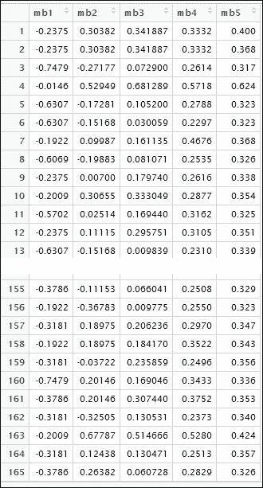
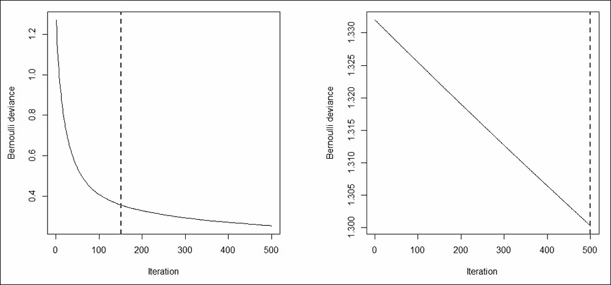
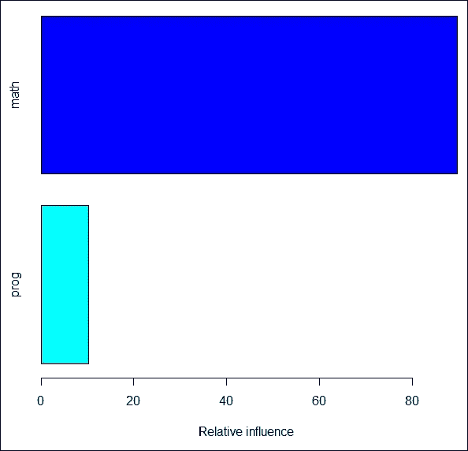
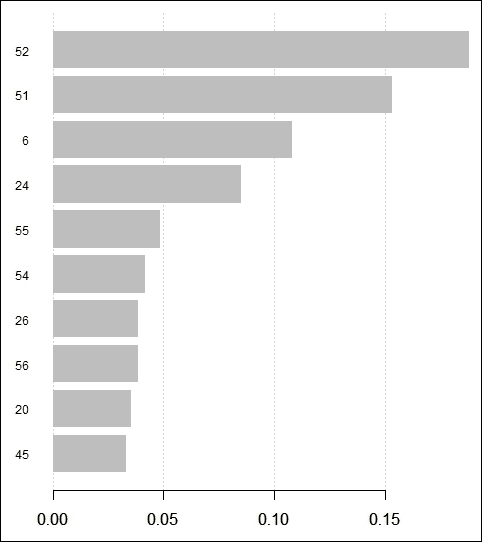

# 六、细化提升

在前一章中，我们学习了 boosting 算法。我们看了算法的结构形式，用一个数值例子说明，然后将算法应用于回归和分类问题。在这简短的一章中，我们将介绍 boosting 算法及其基础的一些理论方面。提升理论在这里也很重要。

在这一章中，我们也将从几个不同的角度来看为什么 boosting 算法有效。不同类别的问题需要不同类型的损失函数，以使增强技术有效。在下一节中，我们将探索可供选择的不同种类的损失函数。极端梯度提升方法在专用于使用`xgboost`包的章节中进行了概述。此外，`h2o`包最终将在最后一节讨论，这可能对其他集成方法也有用。本章将涵盖以下主题:

*   为什么提升会起作用？
*   `gbm`套餐
*   `xgboost`套餐
*   `h2o`套餐


# 技术要求

在本章中，我们将使用以下 R 库:

*   `adabag`
*   `gbm`
*   `h2o`
*   `kernlab`
*   `rpart`
*   `xgboost`


# 为什么提升会有效？

前一章中的*自适应增强算法*部分包含 *m* 模型、分类器、 *n* 观察值和权重，以及顺序确定的投票权。使用一个玩具示例说明了自适应增强方法的适应性，然后使用专门的函数进行应用。与 bagging 和 random forest 方法相比，我们发现 boosting 提供了最高的精度，您可能还记得上一章中前述部分的结果。然而，该算法的实现并没有告诉我们为什么它会表现得更好。

关于增压为什么有效，我们没有一个普遍接受的答案，但根据 Berk (2016)的第 6.2.2 小节，有三种可能的解释:

*   提升是利润最大化
*   Boosting 是一种统计优化器
*   升压是一个插值器

但是这些实际上意味着什么呢？我们现在将逐一讨论这些要点。boosting 算法中观察值的裕量计算如下:


我们可以看到，裕度是正确分类和不正确分类的遍数之和。在上式中，数量表示投票权。boosting 算法工作得如此之好的原因，尤其是对于分类问题，是因为它是一个*余量最大化器*。在其开创性的论文中，boosting 算法的发明人 Schapire 等人声称，boosting 特别擅长于寻找具有大余量的分类器，因为它集中于那些余量小(或负)的例子，并迫使基本学习算法为这些例子生成良好的分类。这段引文的粗体部分将在下一个 R 代码块中展示。

来自`kernlab`包的垃圾邮件数据集将用于说明这一关键思想。来自`gbm`包的`boosting`函数将根据数据来区分垃圾邮件和好邮件。我们将开始一个初始模型，只进行一次迭代，评估精度，获得余量，然后在下面的代码块中生成摘要:

```
> data("spam")
> set.seed(12345)
> Train_Test <- sample(c("Train","Test"),nrow(spam),replace = TRUE,prob = c(0.7,0.3))
> spam_Train <- spam[Train_Test=="Train",]
> spam_Formula <- as.formula("type~.")
> spam_b0 <- boosting(spam_Formula,data=spam_Train,mfinal=1)
> sum(predict(spam_b0,newdata=spam_Train)$class==
+       spam_Train$type)/nrow(spam_Train)
[1] 0.905
> mb0 <- margins(spam_b0,newdata=spam_Train)$margins
> mb0[1:20]
 [1]  1 -1  1 -1  1  1  1  1  1  1  1  1  1  1  1  1  1  1  1  1
> summary(mb0)
   Min. 1st Qu.  Median    Mean 3rd Qu.    Max. 
 -1.000   1.000   1.000   0.809   1.000   1.000 
```

接下来，我们将迭代次数增加到 5、10、20、50 和 200。当读者看到以下结果时，应跟踪精确度和利润汇总:

```
> spam_b1 <- boosting(spam_Formula,data=spam_Train,mfinal=5)
> sum(predict(spam_b1,newdata=spam_Train)$class==
+       spam_Train$type)/nrow(spam_Train)
[1] 0.948
> mb1 <- margins(spam_b1,newdata=spam_Train)$margins
> mb1[1:20]
 [1]  1.0000 -0.2375  0.7479 -0.2375  0.1771  0.5702  0.6069  0.7479  1.0000
[10]  0.7479  1.0000  1.0000 -0.7479  1.0000  0.7479  1.0000  0.7479  1.0000
[19] -0.0146  1.0000
> summary(mb1)
   Min. 1st Qu.  Median    Mean 3rd Qu.    Max. 
 -1.000   0.631   1.000   0.783   1.000   1.000 
> spam_b2 <- boosting(spam_Formula,data=spam_Train,mfinal=10)
> sum(predict(spam_b2,newdata=spam_Train)$class==
+       spam_Train$type)/nrow(spam_Train)
[1] 0.969		
> mb2 <- margins(spam_b2,newdata=spam_Train)$margins
> mb2[1:20]
 [1]  0.852  0.304  0.245  0.304  0.288  0.629  0.478  0.678  0.827  0.678
[11]  1.000  1.000 -0.272  0.517  0.700  0.517  0.700  0.478  0.529  0.852
> summary(mb2)
   Min. 1st Qu.  Median    Mean 3rd Qu.    Max. 
 -0.517   0.529   0.807   0.708   1.000   1.000 
> spam_b3 <- boosting(spam_Formula,data=spam_Train,mfinal=20)
> sum(predict(spam_b3,newdata=spam_Train)$class==
+       spam_Train$type)/nrow(spam_Train)
[1] 0.996
> mb3 <- margins(spam_b3,newdata=spam_Train)$margins
> mb3[1:20]
 [1] 0.5702 0.3419 0.3212 0.3419 0.3612 0.6665 0.4549 0.7926 0.7687 0.6814
[11] 0.8958 0.5916 0.0729 0.6694 0.6828 0.6694 0.6828 0.6130 0.6813 0.7467
> summary(mb3)
   Min. 1st Qu.  Median    Mean 3rd Qu.    Max. 
 -0.178   0.537   0.719   0.676   0.869   1.000 
> spam_b4<- boosting(spam_Formula,data=spam_Train,mfinal=50)
> sum(predict(spam_b4,newdata=spam_Train)$class==
+       spam_Train$type)/nrow(spam_Train)
[1] 1
> mb4 <- margins(spam_b4,newdata=spam_Train)$margins
> mb4[1:20]
 [1] 0.407 0.333 0.386 0.333 0.379 0.518 0.486 0.536 0.579 0.647 0.695 0.544
[13] 0.261 0.586 0.426 0.586 0.426 0.488 0.572 0.677
> summary(mb4)
   Min. 1st Qu.  Median    Mean 3rd Qu.    Max. 
  0.098   0.444   0.590   0.586   0.729   1.000 
> spam_b5<- boosting(spam_Formula,data=spam_Train,mfinal=200)
> sum(predict(spam_b5,newdata=spam_Train)$class==
+       spam_Train$type)/nrow(spam_Train)
[1] 1
> mb5 <- margins(spam_b5,newdata=spam_Train)$margins
> mb5[1:20]
 [1] 0.386 0.400 0.362 0.368 0.355 0.396 0.368 0.462 0.489 0.491 0.700 0.486
[13] 0.317 0.426 0.393 0.426 0.393 0.385 0.624 0.581
> summary(mb5)
   Min. 1st Qu.  Median    Mean 3rd Qu.    Max. 
  0.272   0.387   0.482   0.510   0.607   0.916 
```

第一个重要的区别是边距已经完全远离负数，并且在迭代次数达到 50 或更多之后，它们中的每一个都是非负数。为了更清楚地了解这一点，我们将对边距进行列绑定，然后查看初始化时有负边距的所有观察值:

```
> View(cbind(mb1,mb2,mb3,mb4,mb5)[mb1<0,])
```

以下快照显示了上述代码的结果:



图 1:迭代过程中错误分类观察的余量

因此，我们可以清楚地看到，随着迭代次数的增加，边距也在增加。

关于增强，尤其是自适应增强，需要记住的第二点是，它是一种统计优化器。Berk (2016)的第 264–5 页和周(2012)的第 25–6 页显示，增强集成实现了贝叶斯错误率。这意味着由于指数损失被最小化，分类错误率也被最小化。

关于升压成为插值器的第三点很简单。很明显，提升的迭代可以被视为随机森林的加权平均。

到目前为止，boosting 方法只解决了分类和回归问题。损失函数是机器学习算法的核心，下一节将讨论各种损失函数，这些函数将有助于为不同格式的数据设置提升算法。


# GBM 包

格雷格·里奇韦创造的 R `gbm`包是一个非常通用的包。该套餐详情可在 http://www.saedsayad.com/docs/gbm2.pdf 的[找到。该文件详述了梯度增强的理论方面，并说明了`gbm`函数的](http://www.saedsayad.com/docs/gbm2.pdf)各种其他参数。首先，我们将考虑在`gbm`函数中可用的收缩因子。

收缩参数非常重要，也有助于解决过度拟合的问题。惩罚是通过这个选项实现的。对于垃圾邮件数据集，我们将收缩选项设置为 0.1(非常大)和 0.0001(非常小)，并查看性能是如何受到影响的:

```
> spam_Train2 <- spam_Train
> spam_Train2$type <- as.numeric(spam_Train2$type)-1
> spam_gbm <- gbm(spam_Formula,distribution="bernoulli",
+       data=spam_Train2, n.trees=500,bag.fraction = 0.8,
+       shrinkage = 0.1)
> plot(spam_gbm) # output suppressed
> summary(spam_gbm)
                                var      rel.inf
charExclamation     charExclamation 21.740302311
charDollar               charDollar 18.505561199
remove                       remove 11.722965305
your                           your  8.282553567
free                           free  8.142952834
hp                               hp  7.399617456

num415                       num415  0.000000000
direct                       direct  0.000000000
cs                               cs  0.000000000
original                   original  0.000000000
table                         table  0.000000000
charSquarebracket charSquarebracket  0.000000000
```

汇总函数还绘制相对变量重要性图。如下图所示:


图 2:相对变量影响图

接下来获得被装配物体的细节:

```
> spam_gbm
gbm(formula = spam_Formula, distribution = "bernoulli", data = spam_Train2, 
    n.trees = 500, shrinkage = 0.1, bag.fraction = 0.8)
A gradient boosted model with bernoulli loss function.
500 iterations were performed.
There were 57 predictors, of which 43 had nonzero influence.

Here, the choice of shrinkage = 0.1 leads to 43 nonzero influential variables. We can now reduce the shrinkage factor drastically and observe the impact: 

> spam_gbm2 <- gbm(spam_Formula,distribution="bernoulli",
+       data=spam_Train2,n.trees=500,bag.fraction = 0.8,
+       shrinkage = 0.0001)
> spam_gbm2
gbm(formula = spam_Formula, distribution = "bernoulli", data = spam_Train2, 
    n.trees = 500, shrinkage = 1e-04, bag.fraction = 0.8)
A gradient boosted model with Bernoulli loss function.
500 iterations were performed.
There were 57 predictors of which 2 had nonzero influence.
```

收缩参数太低，因此几乎没有一个变量有影响。接下来，我们将生成一个图，如下所示:

```
> windows(height=100,width=200)
> par(mfrow=c(1,2))
> gbm.perf(spam_gbm,plot.it=TRUE)
Using OOB method...
[1] 151
Warning message:
In gbm.perf(spam_gbm, plot.it = TRUE) :
  OOB generally underestimates the optimal number of iterations although predictive performance is reasonably competitive. Using cv.folds>0 when calling gbm usually results in improved predictive performance.
> gbm.perf(spam_gbm2,plot.it=TRUE)
Using OOB method...
[1] 500
Warning message:
In gbm.perf(spam_gbm2, plot.it = TRUE) :
  OOB generally underestimates the optimal number of iterations although predictive performance is reasonably competitive. Using cv.folds>0 when calling gbm usually results in improved predictive performance.
```



图 3:收敛作为收缩因子的一个因素

对于极小的收缩因子，我们没有明确的收敛。

关于`gbm`函数的更多细节可以从软件包文档或之前提供的源代码中获得。Boosting 是一种非常通用的技术，Ridgeway 已经为各种数据结构实现了这一技术。下表列出了四种最常见的数据结构，显示了每种结构的统计模型、偏差(与损失函数相关)、初始值、梯度和终端结点输出的估计值:

| 

输出类型

 | 

统计模型

 | 

异常

 | 

基础资料

 | 

梯度

 | 

终端节点估计

 |
| --- | --- | --- | --- | --- | --- |
| 数字的 | 高斯的 |  |  |  |  |
| 二进制的 | 伯努利 |  |  |  |  |
| 数数 | 泊松 |  |  |  |  |
| 生存数据 | Cox 比例风险模型 |  |  | Zero | 牛顿-拉夫森算法 |

> 表 1: GBM 升压选项

我们将对计数数据和存活数据应用`gbm`函数。


## 计数数据的增强

事故数量、错误/印刷错误、出生等是计数数据的常见示例。在这里，我们统计特定时间、地点和/或空间的事故数量。泊松分布在计数数据建模中非常流行。当我们有协变量和自变量形式的附加信息时，相关的回归问题常常是令人感兴趣的。广义线性模型是对计数数据建模的一种流行技术。

让我们来看看在 https://stats.idre.ucla.edu/r/dae/poisson-regression/的一个模拟数据集。如该源中的所示，进行必要的更改。首先，我们使用`glm`函数拟合泊松回归模型。接下来，我们拟合升压模型，如下所示:

```
> # Poisson regression and boosting
> # https://stats.idre.ucla.edu/r/dae/poisson-regression/
> pregnancy <- read.csv("https://stats.idre.ucla.edu/stat/data/poisson_sim.csv")
> pregnancy <- within(pregnancy, {
+   prog <- factor(prog, levels=1:3, 
+   labels=c("General", "Academic","Vocational"))
+   id <- factor(id)
+ })
> summary(pregnancy)
       id        num_awards           prog          math     
 1      :  1   Min.   :0.00   General   : 45   Min.   :33.0  
 2      :  1   1st Qu.:0.00   Academic  :105   1st Qu.:45.0  
 3      :  1   Median :0.00   Vocational: 50   Median :52.0  
 4      :  1   Mean   :0.63                    Mean   :52.6  
 5      :  1   3rd Qu.:1.00                    3rd Qu.:59.0  
 6      :  1   Max.   :6.00                    Max.   :75.0  
 (Other):194                                                 
> pregnancy_Poisson <- glm(num_awards ~ prog + math, 
+                     family="poisson", data=pregnancy)
> summary(pregnancy_Poisson)

Call:
glm(formula = num_awards ~ prog + math, family = "poisson", data = pregnancy)

Deviance Residuals: 
   Min      1Q  Median      3Q     Max  
-2.204  -0.844  -0.511   0.256   2.680  

Coefficients:
               Estimate Std. Error z value Pr(>|z|)    
(Intercept)     -5.2471     0.6585   -7.97  1.6e-15 ***
progAcademic     1.0839     0.3583    3.03   0.0025 ** 
progVocational   0.3698     0.4411    0.84   0.4018    
math             0.0702     0.0106    6.62  3.6e-11 ***
---
Signif. codes:  0 '***' 0.001 '**' 0.01 '*' 0.05 '.' 0.1 ' ' 1

(Dispersion parameter for poisson family taken to be 1)

    Null deviance: 287.67  on 199  degrees of freedom
Residual deviance: 189.45  on 196  degrees of freedom
AIC: 373.5

Number of Fisher Scoring iterations: 6

> pregnancy_boost <- gbm(num_awards ~ prog+math,dist="poisson",
+ n.trees=100,interaction.depth = 2,shrinkage=0.1,data=pregnancy)
> cbind(pregnancy$num_awards,predict(m1,type="response"),
+       predict(pboost,n.trees=100,type="response"))
    [,1]   [,2]   [,3]
1      0 0.1352 0.1240
2      0 0.0934 0.1072
3      0 0.1669 0.3375
4      0 0.1450 0.0850
5      0 0.1260 0.0257
6      0 0.1002 0.0735

195    1 1.0469 1.4832
196    2 2.2650 2.0241
197    2 1.4683 0.4047
198    1 2.2650 2.0241
199    0 2.4296 2.0241
200    3 2.6061 2.0241
> sum((pregnancy$num_awards-predict(m1,type="response"))^2)
[1] 151
> sum((pregnancy$num_awards-predict(pboost,n.trees=100,
+    type="response"))^2)
[1] 141
> summary(pregnancy_boost)
      var rel.inf
math math    89.7
prog prog    10.3
```

这是一个非常简单的例子，只有两个协变量。但是在实践中，我们多次看到计数数据被当作回归问题处理。这是不幸的，一般的回归技术不是任何形式的炼金术。必须尊重数据结构，并且需要进行计数数据分析。注意，这里拟合的模型是非线性的。虽然好处在这里并不明显，但随着变量数量的增加，计数数据框架变得更加合适是很自然的。我们将以两棵树的变量重要性图以及表格显示来结束对计数数据分析的讨论:



图 4:增加计数数据——可变重要性

```
> pretty.gbm.tree(pregnancy_boost,i.tree=18)
  SplitVar SplitCodePred LeftNode RightNode MissingNode ErrorReduction Weight
0        1      64.50000        1         5           6          10.41    100
1        1      57.50000        2         3           4           1.14     90
2       -1      -0.01146       -1        -1          -1           0.00     71
3       -1       0.02450       -1        -1          -1           0.00     19
4       -1      -0.00387       -1        -1          -1           0.00     90
5       -1       0.05485       -1        -1          -1           0.00     10
6       -1       0.00200       -1        -1          -1           0.00    100
  Prediction
0    0.00200
1   -0.00387
2   -0.01146
3    0.02450
4   -0.00387
5    0.05485
6    0.00200
> pretty.gbm.tree(pregnancy_boost,i.tree=63)
  SplitVar SplitCodePred LeftNode RightNode MissingNode ErrorReduction Weight
0        1      60.50000        1         5           6          3.837    100
1        0      20.00000        2         3           4          0.407     79
2       -1      -0.00803       -1        -1          -1          0.000     40
3       -1       0.05499       -1        -1          -1          0.000     39
4       -1       0.02308       -1        -1          -1          0.000     79
5       -1       0.02999       -1        -1          -1          0.000     21
6       -1       0.02453       -1        -1          -1          0.000    100
  Prediction
0    0.02453
1    0.02308
2   -0.00803
3    0.05499
4    0.02308
5    0.02999
6    0.02453
```

`pretty.gbm.tree`函数帮助提取`gbm`对象的隐藏树。在下一节中，我们将讨论生存数据的梯度推进技术。


## 生存数据增强

`pbc`数据集已经在[第 1 章](part0012_split_000.html#BE6O2-2006c10fab20488594398dc4871637ee "Chapter 1. Introduction to Ensemble Techniques")、*集成技术介绍*和[第 2 章](part0018_split_000.html#H5A41-2006c10fab20488594398dc4871637ee "Chapter 2. Bootstrapping")、*自举*中介绍过。如前所述，生存数据具有不完整的观察值，我们需要专门的技术来解决这个问题。在表 1 中，我们看到偏差函数相当复杂。多亏了里奇韦，我们不必太担心这样的计算。相反，我们简单地使用带有`dist="coxph"`选项的`gbm`函数，并执行如下分析:

```
> # Survival data
> pbc_boost <- gbm(Surv(time,status==2)~trt + age + sex+ascites +
+                    hepato + spiders + edema + bili + chol + 
+                    albumin + copper + alk.phos + ast + trig + 
+                    platelet + protime + stage,
+                  n.trees=100,interaction.depth = 2,
+                  shrinkage=0.01,dist="coxph",data=pbc)
> summary(pbc_boost)
              var rel.inf
bili         bili  54.220
age           age  10.318
protime   protime   9.780
stage       stage   7.364
albumin   albumin   6.648
copper     copper   5.899
ascites   ascites   2.361
edema       edema   2.111
ast           ast   0.674
platelet platelet   0.246
alk.phos alk.phos   0.203
trig         trig   0.178
trt           trt   0.000
sex           sex   0.000
hepato     hepato   0.000
spiders   spiders   0.000
chol         chol   0.000
> pretty.gbm.tree(pbc_boost,i.tree=2)  # output suppressed
> pretty.gbm.tree(pbc_boost,i.tree=72) # output suppressed
```

因此，使用通用的`gbm`函数，我们可以很容易地对各种数据结构执行梯度提升技术。


# xgboost 包

R 包是梯度推进方法的一个优化的分布式实现。这是一种高效、灵活和可移植的工程优化——参见 https://github.com/dmlc/xgboost 的[了解更多细节和定期更新。这提供了并行的树提升，因此在数据科学社区中非常有用。鉴于在](https://github.com/dmlc/xgboost)[www.kaggle.org](http://www.kaggle.org)的大部分比赛获胜者都使用了`xgboost`技术，情况尤其如此。Kaggle 获胜者的部分名单可在[https://github . com/dmlc/xgboost/tree/master/demo # machine-learning-challenge-winning-solutions](https://github.com/dmlc/xgboost/tree/master/demo#machine-learning-challenge-winning-solutions)获得。

极端梯度推进实施的主要优点如下所示:

*   **并行计算**:这个包使用 OpenMP 实现并行处理，然后使用计算机的所有内核
*   **正则化**:这有助于通过结合正则化思想来避免过度拟合的问题
*   **交叉验证**:进行交叉验证的不需要额外编码
*   **修剪**:这让树生长到最大深度，然后向后修剪
*   **缺失值**:缺失值内部处理
*   **保存和重新加载**:这有特性，不仅有助于保存现有的模型，还可以从上次停止的地方继续迭代
*   **跨平台**:这对于 Python、Scala 等等的是可用的

我们将用我们在本书前面看到的垃圾邮件数据集来说明这些想法。`xgboost`包的函数要求所有变量都是数值型的，输出也要标注为`0`和`1`。而且，协变矩阵和输出需要分别给`xgboost` R 包。因此，我们将首先加载垃圾邮件数据集，然后创建分区和公式，如下所示:

```
> ## The xgboost Package
> data("spam")
> spam2 <- spam
> spam2$type <- as.numeric(spam2$type)-1
> head(data.frame(spam2$type,spam$type))
  spam2.type spam.type
1          1      spam
2          1      spam
3          1      spam
4          1      spam
5          1      spam
6          1      spam
> # 1 denotes spam, and 0 - nonspam
> set.seed(12345)
> Train_Test <- sample(c("Train","Test"),nrow(spam2),replace = TRUE,
+                      prob = c(0.7,0.3))
> spam2_Train <- spam2[Train_Test=="Train",]
> spam_Formula <- as.formula("type~.")
> spam_train <- list()
```

`xgboost`包还要求在特殊的`dgCMatrix`矩阵中指定训练回归数据。因此，我们可以使用`as`函数来转换它:

```
> spam_train$data <- as(spam_train$data,"dgCMatrix")
> spam_train$label <- spam2_Train$type
> class(spam_train$data)
[1] "dgCMatrix"
attr(,"package")
[1] "Matrix"
```

我们现在已经有了应用`xgboost`函数的基础设施。选择`nrounds=100`选项和逻辑函数，结果如下:

```
> # Simple XGBoosting
> spam_xgb<- xgboost(data=spam_train$data,label=spam_train$label,+                     nrounds = 100,objective="binary:logistic")
[1]	train-error:0.064062 
[2]	train-error:0.063437 
[3]	train-error:0.053438 
[4]	train-error:0.050313 
[5]	train-error:0.047812 
[6]	train-error:0.045313 

[95]	train-error:0.002188 
[96]	train-error:0.001875 
[97]	train-error:0.001875 
[98]	train-error:0.001875 
[99]	train-error:0.000937 
[100]	train-error:0.000937 
```

使用拟合的提升模型，我们现在应用`predict`函数并评估精度:

```
> xgb_predict <- predict(spam_xgb,spam_train$data)
> sum(xgb_predict>0.5)
[1] 1226
> sum(spam_train$label)
[1] 1229
> table(spam_train$label,c(xgb_predict>0.5))

    FALSE TRUE
  0  1971    0
  1     3 1226
```

如果观察值被标记为 1 的概率(以及本例中的响应)大于 0.5，那么我们可以将观察值标记为 1，否则标记为 0。通过使用表 R 函数获得预测标签和实际标签列联表。显然，我们有很好的准确性，只有三个错误分类。

我们声称`xgboost`包不需要额外的代码来进行交叉验证分析。`xgb.cv`函数在这里很有用，它使用与`xgboost`函数相同的参数，使用由`nfold`选项指定的交叉验证折叠。在这里，我们选择`nfold=10`。现在，使用`xgb.cv`函数，我们进行分析并评估预测精度:

```
> # XGBoosting with cross-validation
> spam_xgb_cv <- xgb.cv(data=spam_train$data,
+           label=spam_train$label,nfold=10,nrounds = 100,
+           objective="binary:logistic",prediction = TRUE)
[1]	train-error:0.064410+0.001426	test-error:0.091246+0.01697
[2]	train-error:0.058715+0.001862	test-error:0.082805+0.01421
[3]	train-error:0.052986+0.003389	test-error:0.077186+0.01472
[4]	train-error:0.049826+0.002210	test-error:0.073123+0.01544
[5]	train-error:0.046910+0.001412	test-error:0.070937+0.01340
[6]	train-error:0.043958+0.001841	test-error:0.066249+0.01346

[95]	train-error:0.001667+0.000340	test-error:0.048119+0.00926
[96]	train-error:0.001528+0.000318	test-error:0.047181+0.01008
[97]	train-error:0.001458+0.000260	test-error:0.046868+0.00974
[98]	train-error:0.001389+0.000269	test-error:0.047181+0.00979
[99]	train-error:0.001215+0.000233	test-error:0.047182+0.00969
[100]	train-error:0.001111+0.000260	test-error:0.045932+0.01115
> xgb_cv_predict <- spam_xgb_cv$pred
> sum(xgb_cv_predict>0.5)
[1] 1206
> table(spam_train$label,c(xgb_cv_predict>0.5))

    FALSE TRUE
  0  1909   62
  1    85 1144
```

交叉验证分析表明，准确率有所下降。这表明我们对`xgboost`函数有过拟合问题。我们现在来看看`xgboost`包的其他特性。在本节的开始，我们声称该技术允许通过早期停止和恢复早期拟合的模型对象来实现灵活性。

然而，一个重要的问题是*什么时候需要提前停止迭代？*我们没有任何关于迭代次数的理论，迭代次数是变量数量和观察数量的函数。因此，我们将以指定的迭代次数开始这个过程。如果误差减少的收敛不低于阈值水平，那么我们将继续进行更多的迭代，并且接下来将进行这项任务。然而，如果指定的迭代次数太高，并且 boosting 方法的性能越来越差，那么我们将不得不停止迭代。这是通过指定`early_stopping_rounds`选项实现的，我们将在下面的代码中付诸实施:

```
> # Stop early
> spam_xgb_cv2 <- xgb.cv(data=spam_train$data,label=
+             spam_train$label, early_stopping_rounds = 5,
+             nfold=10,nrounds = 100,objective="binary:logistic",
+             prediction = TRUE)
[1]	train-error:0.064271+0.002371	test-error:0.090294+0.02304
Multiple eval metrics are present. Will use test_error for early stopping.
Will train until test_error hasn't improved in 5 rounds.

[2]	train-error:0.059028+0.003370	test-error:0.085614+0.01808
[3]	train-error:0.052048+0.002049	test-error:0.075930+0.01388
[4]	train-error:0.049236+0.002544	test-error:0.072811+0.01333
[5]	train-error:0.046007+0.002775	test-error:0.070622+0.01419
[6]	train-error:0.042882+0.003065	test-error:0.066559+0.01670

[38]	train-error:0.010382+0.001237	test-error:0.048121+0.01153[39]	train-error:0.010069+0.001432	test-error:0.048434+0.01162
[40]	train-error:0.009653+0.001387	test-error:0.048435+0.01154
[41]	train-error:0.009236+0.001283	test-error:0.048435+0.01179
[42]	train-error:0.008924+0.001173	test-error:0.048748+0.01154
Stopping. Best iteration:
[37]	train-error:0.010625+0.001391	test-error:0.048121+0.01162
```

这里，最好的迭代已经出现在数字`37`处，并且由于`early_stopping_rounds = 5`选项，这一点的确认是通过五次迭代获得的。既然我们已经找到了最佳迭代，我们就停止这个过程。

我们现在将看看如何增加更多的迭代。此编码仅用于说明目的。使用选项`nrounds = 10`和之前拟合的`spam_xgb`，以及数据和标签选项，我们将要求`xgboost`函数再执行十次迭代:

```
> # Continue training
> xgboost(xgb_model=spam_xgb,
+         data=spam_train$data,label=spam_train$label,
+         nrounds = 10)
[101]	train-error:0.000937 
[102]	train-error:0.000937 
[103]	train-error:0.000937 
[104]	train-error:0.000937 
[105]	train-error:0.000937 
[106]	train-error:0.000937 
[107]	train-error:0.000937 
[108]	train-error:0.000937 
[109]	train-error:0.000937 
[110]	train-error:0.000937 
##### xgb.Booster
raw: 136 Kb 
call:
  xgb.train(params = params, data = dtrain, nrounds = nrounds, 
    watchlist = watchlist, verbose = verbose, print_every_n = print_every_n, early_stopping_rounds = early_stopping_rounds, maximize = maximize, save_period = save_period, save_name = save_name, xgb_model = xgb_model, callbacks = callbacks)
params (as set within xgb.train):
  silent = "1"
xgb.attributes:
  niter
callbacks:
  cb.print.evaluation(period = print_every_n)
  cb.evaluation.log()
  cb.save.model(save_period = save_period, save_name = save_name)
niter: 110
evaluation_log:
    iter train_error
       1    0.064062
       2    0.063437
---                 
     109    0.000937
     110    0.000937
```

迭代号的粗体大字体不是 R 软件抛出的格式。这一改变是为了强调这样一个事实，即先前拟合的`spam_xgb`对象的迭代次数现在将从`101`继续，并将上升到`110`。添加额外的迭代很容易通过`xgboost`函数实现。

与`xgb.importance`函数配合使用的`xgb.plot.importance`函数可用于提取和显示 boosting 方法确定的最重要的变量:

```
> # Variable Importance
> xgb.plot.importance(xgb.importance(names(spam_train$data),
+                                    spam_xgb)[1:10,])
```

结果是如下的情节:



图 xgboost 函数的可变重要性图

我们现在已经看到了`xgboost`方案的威力。接下来，我们将概述`h2o`包的功能。


# H2O 包

R 软件`.exe`文件大小为 75 MB(版本 3.4.1)。`h2o` R 包的大小是 125 MB。这可能会向你表明T2 套餐的重要性。本书中使用的所有数据集的大小都非常有限，观测值的数量不超过 10，000。在大多数情况下，文件大小最大为几 MB。然而，数据科学世界努力工作，以 GB 甚至更高的格式抛出文件。因此，我们需要更多的能力，而`h2o`包正好提供了这些。我们只需加载`h2o`包，然后看一眼:

```
> library(h2o)

----------------------------------------------------------------------

Your next step is to start H2O:
    > h2o.init()

For H2O package documentation, ask for help:
    > ??h2o

After starting H2O, you can use the Web UI at http://localhost:54321
For more information visit http://docs.h2o.ai

----------------------------------------------------------------------

Attaching package: 'h2o'

The following objects are masked from 'package:stats':

    cor, sd, var

The following objects are masked from 'package:base':

    %*%, %in%, &&, ||, apply, as.factor, as.numeric, colnames,
    colnames<-, ifelse, is.character, is.factor, is.numeric, log,
    log10, log1p, log2, round, signif, trunc

Warning message:
package 'h2o' was built under R version 3.4.4 
> h2o.init()

H2O is not running yet, starting it now...

Note:  In case of errors look at the following log files:
    C:\Users\tprabhan\AppData\Local\Temp\Rtmpu6f0fO/h2o_TPRABHAN_started_from_r.out
    C:\Users\tprabhan\AppData\Local\Temp\Rtmpu6f0fO/h2o_TPRABHAN_started_from_r.err

java version "1.7.0_67"
Java(TM) SE Runtime Environment (build 1.7.0_67-b01)
Java HotSpot(TM) 64-Bit Server VM (build 24.65-b04, mixed mode)

Starting H2O JVM and connecting: .. Connection successful!

R is connected to the H2O cluster: 
    H2O cluster uptime:         4 seconds 449 milliseconds 
    H2O cluster version:        3.16.0.2 
    H2O cluster version age:    7 months and 7 days !!! 
    H2O cluster name:           H2O_started_from_R_TPRABHAN_saz680 
    H2O cluster total nodes:    1 
    H2O cluster total memory:   1.76 GB 
    H2O cluster total cores:    4 
    H2O cluster allowed cores:  4 
    H2O cluster healthy:        TRUE 
    H2O Connection ip:          localhost 
    H2O Connection port:        54321 
    H2O Connection proxy:       NA 
    H2O Internal Security:      FALSE 
    H2O API Extensions:         AutoML, Algos, Core V3, Core V4 
    R Version:                  R version 3.4.0 (2017-04-21) 

Warning message:
In h2o.clusterInfo() : 
Your H2O cluster version is too old (7 months and 7 days)!
Please download and install the latest version from http://h2o.ai/download/
```

集群和线程有助于扩大计算。对于更热心的读者，以下资源将有助于使用`h2o`包:

*   [http://blog . revolution analytics . com/2014/04/a-dive-into-H2O . html](http://blog.revolutionanalytics.com/2014/04/a-dive-into-h2o.html)
*   [http://docs.h2o.ai/](http://docs.h2o.ai/)
*   [https://www . analyticsvidhya . com/blog/2016/05/H2O-data-table-build-models-large-data-sets/](https://www.analyticsvidhya.com/blog/2016/05/h2o-data-table-build-models-large-data-sets/)

使用`gbm`、`xgboost`和`h2o`包，读者可以分析复杂的大型数据集。


# 总结

本章一开始，我们简要地思考了为什么升压会有效。有三种观点可以解释 boosting 的成功，在我们深入研究这个主题之前，我们已经讨论过这些观点。`gbm`包非常强大，它为调整梯度推进算法提供了不同的选项，该算法处理大量的数据结构。我们用收缩选项说明了它的功能，并将其应用于计数和生存数据结构。`xgboost`包是梯度推进方法的更有效的实现。它速度更快，也提供了其他灵活性。我们举例说明了使用`xgboost`函数进行交叉验证，提前停止，并根据需要继续进一步迭代。`h2o`包/平台有助于在更大规模上实现整体机器学习技术。

在下一章中，我们将详细探讨为什么集成会起作用。特别是，我们将看到为什么将多个模型放在一起通常是一种有用的实践，我们还将探索我们可以这样做的场景。