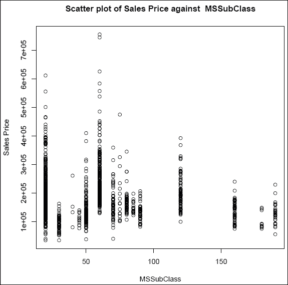
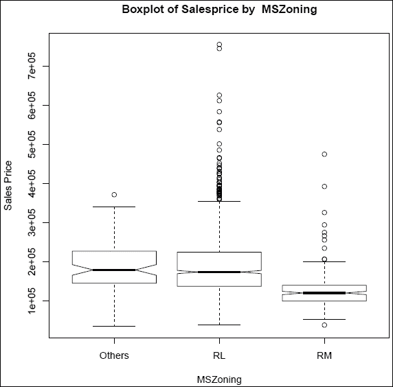
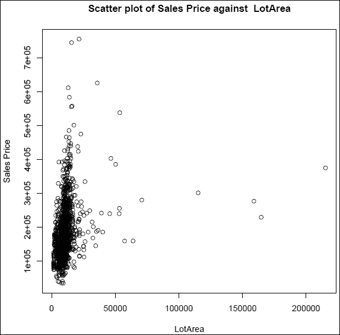
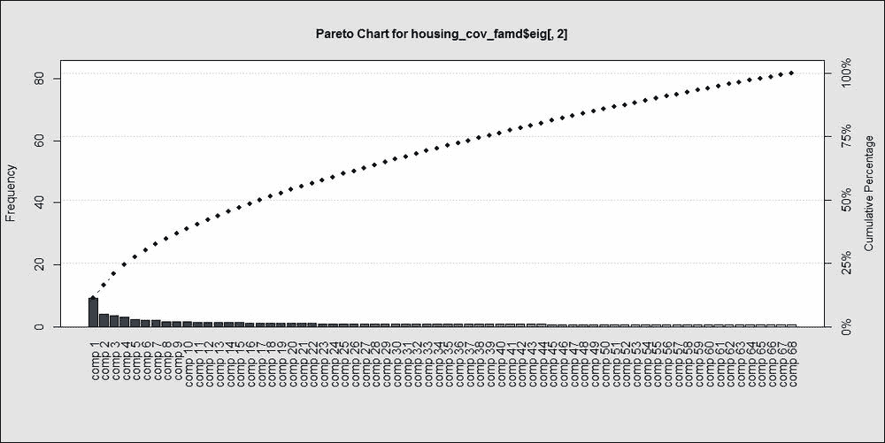
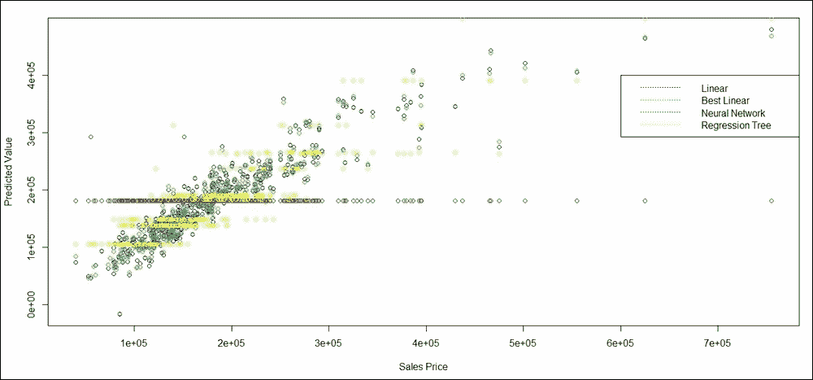
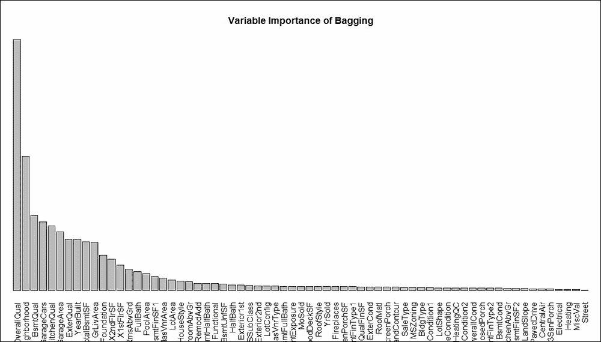
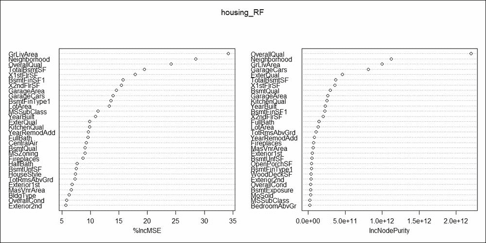
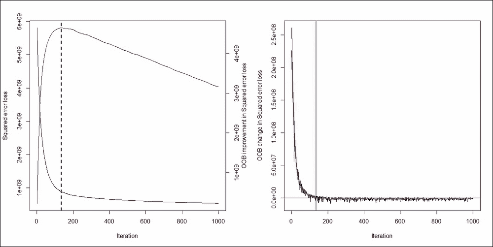
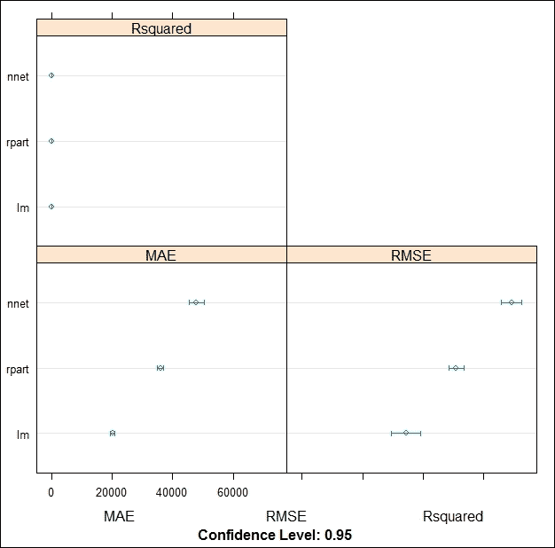

# 第九章。集成回归模型

[第 3 章](part0027_split_000.html#PNV61-2006c10fab20488594398dc4871637ee "Chapter 3. Bagging")、*装袋*，到[第 8 章](part0057_split_000.html#1MBG21-2006c10fab20488594398dc4871637ee "Chapter 8. Ensemble Diagnostics")、*集合诊断*，专门学习不同类型的集合方法。讨论主要基于分类问题。如果监督学习问题的回归和输出是一个数字变量，那么我们有一个回归问题，这将在这里解决。在整个章节中，房价问题被选为演示目的，数据集选自一个 Kaggle 竞赛:[https://www . ka ggle . com/c/house-prices-advanced-regression-techniques/](https://www.kaggle.com/c/house-prices-advanced-regression-techniques/)。数据由众多变量组成，包括多达 79 个自变量，以房价为输出/因变量。数据集需要一些预处理，因为一些变量有缺失日期，一些变量有许多级别，其中一些级别很少出现，一些变量在超过 20%的观察值中有缺失数据。

预处理技术之后是变量缩减方法，然后我们将拟合重要的回归模型:线性回归、神经网络和回归树。首先将提供回归树的集合扩展，然后我们将应用装袋和随机森林方法。将使用各种增强方法来改进预测。在结论部分将应用堆叠集合方法。

在本章中，我们将介绍以下内容:

*   数据预处理和可视化
*   可变缩减技术
*   回归模型
*   回归数据的装袋和随机森林
*   推进回归模型
*   回归数据的堆叠集成方法


# 技术要求

本章需要以下 R 包:

*   `adabag`
*   `caret`
*   `caretEnsemble`
*   `ClustofVar`
*   `FactoMinR`
*   `gbm`
*   `ipred`
*   `missForest`
*   `nnet`
*   `NeuralNetTools`
*   `plyr`
*   `rpart`
*   `RSADBE`


# 房屋数据预处理

数据集是从 www.kaggle.com 的[中选择的](http://www.kaggle.com)，项目名称是**房价:高级回归技术**。我们将使用的主要文件是`test.csv`和`train.csv`，这些文件可以在配套的捆绑包中获得。变量的描述可以在`data_description.txt`文件中找到。当然，进一步的细节可以在[https://www . ka ggle . com/c/house-prices-advanced-regression-techniques/](https://www.kaggle.com/c/house-prices-advanced-regression-techniques/)获得。训练数据集包含 1460 个观察值，而测试数据集包含 1459 个观察值。该属性的价格仅在训练数据集中是已知的，并且对于测试数据集中的那些是不可用的。我们将训练数据集仅用于模型开发。数据集首先被加载到 R 会话中，并使用`read.csv`、`dim`、`names`和`str`功能进行初始检查:

```
> housing_train <- read.csv("../Data/Housing/train.csv",
+                           row.names = 1,na.strings = "NA",
+                           stringsAsFactors = TRUE)
> housing_test <- read.csv("../Data/Housing/test.csv",
+                           row.names = 1,na.strings = "NA",
+                           stringsAsFactors = TRUE)
> dim(housing_train)
[1] 1460   80
> dim(housing_test)
[1] 1459   79
> names(housing_train)
 [1] "MSSubClass"    "MSZoning"      "LotFrontage"   "LotArea"      
 [5] "Street"        "Alley"         "LotShape"      "LandContour"  
 [9] "Utilities"     "LotConfig"     "LandSlope"     "Neighborhood" 

[69] "X3SsnPorch"    "ScreenPorch"   "PoolArea"      "PoolQC"       
[73] "Fence"         "MiscFeature"   "MiscVal"       "MoSold"       
[77] "YrSold"        "SaleType"      "SaleCondition" "SalePrice" 
> str(housing_train)
'data.frame':	1460 obs. of  80 variables:
 $ MSSubClass   : int  60 20 60 70 60 50 20 60 50 190 ...
 $ MSZoning     : Factor w/ 5 levels "C (all)","FV",..: 4 4 4 4 4 4 4 4 5 4 ...
 $ LotFrontage  : int  65 80 68 60 84 85 75 NA 51 50 ...
 $ LotArea      : int  8450 9600 11250 9550 14260 14115 10084 10382 6120 7420 ...
 $ Street       : Factor w/ 2 levels "Grvl","Pave": 2 2 2 2 2 2 2 2 2 2 ...
 $ Alley        : Factor w/ 2 levels "Grvl","Pave": NA NA NA NA NA NA NA NA NA NA ...

 $ MiscFeature  : Factor w/ 4 levels "Gar2","Othr",..: NA NA NA NA NA 3 NA 3 NA NA ...
 $ MiscVal      : int  0 0 0 0 0 700 0 350 0 0 ...
 $ MoSold       : int  2 5 9 2 12 10 8 11 4 1 ...
 $ YrSold       : int  2008 2007 2008 2006 2008 2009 2007 2009 2008 2008 ...
 $ SaleType     : Factor w/ 9 levels "COD","Con","ConLD",..: 9 9 9 9 9 9 9 9 9 9 ...
 $ SaleCondition: Factor w/ 6 levels "Abnorml","AdjLand",..: 5 5 5 1 5 5 5 5 1 5 ...
 $ SalePrice    : int  208500 181500 223500 140000 250000 143000 307000 200000 129900 118000 ...
```

```
read.csv function enabled importing the data from the comma-separated values file. The size of the imported data frame is evaluated using the dim function, while names gives us the variable names as stored in the original file. The str function gives a quick preview of the variable types and also gives a few of the observations.
```

数据帧的维度给出了变量的数量和观察值的数量。所有变量的详细信息可以在`data_description.txt`文件中找到。可以看出，我们手头拥有的是一个全面的数据集。现在，我们在`read.csv`导入函数中运行了`na.strings = "NA"`选项，很自然地，这意味着我们丢失了数据。当我们在训练和测试数据分区中都有缺失数据时，作者建议合并分区中的协变量，然后进一步检查它们。首先组合协变量，然后我们找到每个变量的缺失观测值:

```
> housing <- rbind(housing_train[,1:79],housing_test)
> dim(housing)
[1] 2919   79
> sort(sapply(housing,function(x) sum(is.na(x))),dec=TRUE)
       PoolQC   MiscFeature         Alley         Fence   FireplaceQu 
         2909          2814          2721          2348          1420 
  LotFrontage   GarageYrBlt  GarageFinish    GarageQual    GarageCond 
          486           159           159           159           159 
   GarageType      BsmtCond  BsmtExposure      BsmtQual  BsmtFinType2 
          157            82            82            81            80 
 BsmtFinType1    MasVnrType    MasVnrArea      MSZoning     Utilities 
           79            24            23             4             2 
 BsmtFullBath  BsmtHalfBath    Functional   Exterior1st   Exterior2nd 
            2             2             2             1             1 
   BsmtFinSF1    BsmtFinSF2     BsmtUnfSF   TotalBsmtSF    Electrical 
            1             1             1             1             1 
  KitchenQual    GarageCars    GarageArea      SaleType    MSSubClass 
            1             1             1             1             0 
      LotArea        Street      LotShape   LandContour     LotConfig 
            0             0             0             0             0 

  OpenPorchSF EnclosedPorch    X3SsnPorch   ScreenPorch      PoolArea 
            0             0             0             0             0 
      MiscVal        MoSold        YrSold SaleCondition 
            0             0             0             0 
```

`rbind`函数组合训练和测试数据集中的数据。`is.na(x)`代码检查`x`的每个元素值的缺失，应用的`sum`告诉我们变量的缺失观察值的数量。然后使用`sapply`函数将该函数应用于`housing`的每个变量。使用带有参数`dec=TRUE`的`sort`函数对变量的缺失观测值计数进行降序排序，因此它使用户能够在开始时找到缺失数最多的变量。

读者可能想知道整理观察结果背后的基本原理。整理背后的直观推理是，虽然某些变量可能有缺失数据，但在训练数据中比在测试数据中更多，或者相反，重要的是总缺失百分比不超过观察值的某个阈值。虽然我们有缺失数据插补技术，但当缺失数据百分比太高时使用它们可能会导致我们错过重要的特征模式。因此，如果超过 10%的值缺失，我们会任意选择限制变量。如果任何变量的缺失百分比超过 10%，我们将避免进一步分析该变量。首先，我们确定超过 10%的变量，然后从主数据框架中删除它们。下面的 R 代码块给出了我们想要的结果:

```
> miss_variables <- names(which(sapply(housing,
+         function(x) sum(is.na(x)))>0.1*nrow(housing_train)))
> miss_variables
 [1] "LotFrontage"  "Alley"        "FireplaceQu"  "GarageType"  
 [5] "GarageYrBlt"  "GarageFinish" "GarageQual"   "GarageCond"  
 [9] "PoolQC"       "Fence"        "MiscFeature" 
> length(miss_variables)
[1] 11
> housing[,miss_variables] <- NULL
> dim(housing)
[1] 2919   68
```

具有超过 10%缺失观察值的变量首先被识别，然后存储在`miss_variables`字符向量中，我们有 11 个变量满足这个标准。此类变量通过为其分配`NULL`而被消除。

接下来，我们找到因素变量的级别数(不同的)。我们定义一个函数，`find_df`，它将找到一个因子变量的级数。对于数值和整数变量，它将返回`1`。这个练习的目的很快就会清楚了。在下一个块中创建了`find_df`函数:

```
> find_df <- function(x){
+   if(class(x)=="numeric") mdf <- 1
+   if(class(x)=="integer") mdf <- 1
+   if(class(x) =="factor") mdf <- length(levels(x))
+   if(class(x) =="character") mdf <- length(unique(x))
+   return(mdf)
+ }
> sapply(housing,find_df)
   MSSubClass      MSZoning       LotArea        Street      LotShape 
            1             4             1             2             3 
  LandContour     Utilities     LotConfig     LandSlope  Neighborhood 
            2             3             4             2            25 
   Condition1    Condition2      BldgType    HouseStyle   OverallQual 
            3             2             3             4             1 

   X3SsnPorch   ScreenPorch      PoolArea       MiscVal        MoSold 
            1             1             1             1             1 
       YrSold      SaleType SaleCondition 
            1             4             4 
> dim(housing)
[1] 2919   68
```

在之后，我们需要检查`67`变量，剔除掉超过 10%的观测值缺失的`11`变量。其中一些可能不是因素变量。`find_df`函数显示，对于因子变量，级别数从 2-25 不等。现在`Condition2`和`Exterior1st`变量出现了一个小问题:

```
> round(table(housing$Condition2)/nrow(housing),2)
Artery  Feedr   Norm   PosA   PosN   RRAe   RRAn   RRNn 
  0.00   0.00   0.99   0.00   0.00   0.00   0.00   0.00 
> round(table(housing$Exterior1st)/nrow(housing),2)
AsbShng AsphShn BrkComm BrkFace  CBlock CemntBd HdBoard ImStucc MetalSd 
   0.02    0.00    0.00    0.03    0.00    0.04    0.15    0.00    0.15 
Plywood   Stone  Stucco VinylSd Wd Sdng WdShing 
   0.08    0.00    0.01    0.35    0.14    0.02 
```

在许多实际问题中，似乎会有**因子变量**具有一些很少出现的水平。现在，如果我们在测试/验证分区中有新的级别，就不可能做出预测。从统计学的角度来看，我们有一个技术问题:失去了太多的自由度。这里采用了一种基本的方法，我们将简单地把所有的观察结果放在一起。创建了一个`Truncate_Factor`函数，它有两个参数:`x`和`alpha`。`x`对象是给函数的变量，`alpha`是指定的分数，低于该分数的任何变量频率将被汇集以获得`Others`。

### 注意

如果某个因子的某些水平在测试数据集中是新的，则任何分析方法都无法纳入这种影响。因此，在我们有太多不常见级别的情况下，一些级别不包括在训练数据集中的可能性将会很高，并且预测将不会产生测试观察的输出。

现在已经创建了`Truncate_Factor`函数:

```
> Truncate_Factor <- function(x,alpha){
+   xc <- as.character(x); n <- length(x)
+   if(length(unique(x))<=20) {
+     critical <- n*alpha
	+     xc[xc %in% names(which((prop.table(table(xc)))<alpha))] <- "Others"
+   }
+   xc <- as.factor(xc)
+   return(xc)
+ }
> for(i in 1:ncol(housing)){
+   if(any(class(housing[,i]) == c('character','factor'))) 
+     housing[,i] = Truncate_Factor(housing[,i],0.05)
+ }
> table(housing$Condition2)/nrow(housing)
  Norm Others 
  0.99   0.01 
> table(housing$Exterior1st)/nrow(housing)
HdBoard MetalSd  Others Plywood VinylSd Wd Sdng 
  0.151   0.154   0.126   0.076   0.351   0.141 
```

我们现在可以看到,`Others`级别更频繁，如果我们随机创建分区，很可能不会出现未知级别的问题。

你可能还记得，到目前为止，我们已经剔除了有过多遗漏观测值的变量。这并不意味着我们没有丢失的数据，这一点很快就能发现:

```
> sum(is.na(housing))
[1] 474
> prod(dim(housing))
[1] 198492
```

不能忽略`474`值。缺失数据填补是填补缺失值的重要方法。虽然 EM 算法是实现这一点的流行方法，但我们将应用随机森林技术来模拟缺失的观测值。`missForest`包在[第 4 章](part0033_split_000.html#VF2I1-2006c10fab20488594398dc4871637ee "Chapter 4. Random Forests")、*随机森林*中有介绍，用一个例子模拟缺失值。我们将把这个函数应用于住房数据框。由于在该函数中选择的默认变量数是`mtry=5`，并且我们在 housing 中有 68 个变量，为分割一个节点选择的变量数改变为大约 p/3，因此在下一个 R 块中可以看到`mtry=20`的选项。在具有 8gb RAM 的机器上，下一行代码需要几个小时才能运行。接下来，我们将应用`missForest`函数，保存估算对象以备将来参考，并使用估算值创建测试和训练数据集:

```
> housing_impute <- missForest(housing,maxiter = 10,ntree=500,mtry=20)
  missForest iteration 1 in progress...done!
  missForest iteration 2 in progress...done!
  missForest iteration 3 in progress...done!
  missForest iteration 4 in progress...done!
  missForest iteration 5 in progress...done!
  missForest iteration 6 in progress...done!
  missForest iteration 7 in progress...done!
There were 14 warnings (use warnings() to see them)
> save(housing_impute,file=
+ '../Data/Housing/housing_covariates_impute.Rdata')
> ht_imp <- cbind(housing_impute$ximp[1:nrow(housing_train),],
+ housing_train$SalePrice)
> save(ht_imp,file='../Data/Housing/ht_imp.Rdata')
> htest_imp <- housing_impute$ximp[(nrow(housing_train)+1):nrow(
+ housing),]
> save(htest_imp,file='../Data/Housing/htest_imp.Rdata')
```

读者当然应该在他们的本地机器上运行`missForest`代码行。然而，为了节省时间，读者也可以跳过这一行，然后从代码包中加载`ht_imp` 和`htest_imp`对象。下一节将展示一种可视化大型数据集的方法和两种数据简化方法。


# 可视化和变量缩减

在前面的部分中，房屋数据经过了大量的分析预处理，现在我们准备进一步分析。首先，我们从视觉化开始。由于我们有很多变量，在 R 视觉设备上的可视化有点困难。如前几章所述，为了可视化随机森林和其他大型复杂结构，我们将启动一个 PDF 设备并将图形存储在其中。在住房数据集中，主要变量是住房价格，因此我们首先将输出变量命名为`SalePrice`。我们需要以一种有助于众多变量和`SalePrice`之间的关系的方式来可视化数据。自变量可以是数值型的，也可以是分类型的。如果变量是数字，散点图将显示变量和`SalePrice`回归之间的关系。如果自变量是分类/因子，我们将在因子的每个水平上可视化箱线图。`pdf`、`plot`和`boxplot`功能将帮助生成所需的图形:

```
> load("../Data/Housing/ht_imp_author.Rdata")
> names(ht_imp)[69] <- "SalePrice"
> SP <- ht_imp$SalePrice
> pdf("../Output/Visualizing_Housing_Data.pdf")
> for(i in 1:68){
+   if(class(ht_imp[,i])=="numeric") {
+     plot(ht_imp[,i],SP,xlab=names(ht_imp)[i],ylab="Sales Price")
+     title(paste("Scatter plot of Sales Price against ", 
+ names(ht_imp)[i]))
+   }
+   if(class(ht_imp[,i])=="factor") {
+     boxplot(SP~ht_imp[,i],xlab=names(ht_imp)[i],ylab=
+ "Sales Price",notch=TRUE)
+     title(paste("Boxplot of Salesprice by ",names(ht_imp)[i]))
+   }
+ }
> dev.off()
null device 
          1 
```

从`ht_imp_author.Rdata`文件加载`ht_imp`对象。注意，如果你自己运行`missForest`函数并处理那个文件，那么结果将与`ht_imp_author.Rdata`不同。众所周知，`pdf`函数会启动一个同名的文件，正如前面多次看到的。对于数值变量，检查`if`条件并显示散点图，其中`xlab`将变量的实际名称作为沿 *x* 轴的标签名称。`title`函数拍打`paste`函数的输出，`paste`函数确保我们为生成的图有一个合适的标题。对因子变量进行类似的条件测试。我们现在来看看一些有趣的情节。`SalePrice`与`MSSubClass (`的第一个图(见`Visualizing_Housing_Data.pdf`文件)如下:



图 1:销售价格与 MSSubClass 的散点图

### 注意

注意，尽管我们将`MSSubClass`变量指定为数字变量，但散点图并没有给出同样的印象。这里，`MSSubClass`变量的值围绕着一个特定的点，然后刻度跳到下一个值。

简而言之，它似乎不是一个连续变量，这可以很容易地用以下公式来验证:

```
> table(ht_imp$MSSubClass)
20  30  40  45  50  60  70  75  80  85  90 120 160 180 190 
536  69   4  12 144 299  60  16  58  20  52  87  63  10  30 
```

**练习**:读者应该将`MSSubClass`变量转换成一个因子，然后应用`Truncate_Factor`来降低噪声。在`Visualizing_Housing_Data.pdf`文件中识别其他显示该属性的数值变量。

现在让我们看看`MSZoning`因子变量的箱线图:



图 2:三个级别的 MSZoning 的销售价格的箱线图

胡须之外的点表示异常值的存在。然而，对于复杂的问题，解释也很可能会出错。槽口是显示箱线图的一个有用的技巧。如果变量的两个级别的凹口不重叠，这意味着级别是重要的，因此信息是有用的，如`SalePrice`与`MSZoning`级别的箱线图所示。

接下来显示`SalePrice`对`LotArea`的散点图:



图 3:销售价格与地段面积的散点图

显然，散点图显示两个变量`SalePrice`和`LotArea`之间没有有意义的关系。下图中的`SalePrice`和`TotalBsmtSF`之间的显示类型不同:


图 4:销售价格与总额的散点图 BsmtSF

我们可以在图的最右边清楚地看到一个异常值。还有一种混乱的情况是值为 0，而`TotalBsmtSF`值为 0，这可能是由其他变量控制的。或者，可能会发现变量的膨胀为零，因此它可能是一个混合变量。同样，其他所有情节都可以解读。接下来获得`SalePrice`和其他数值变量之间的相关性:

```
> cor(ht_imp[sapply(ht_imp,is.numeric)])[,1]
   MSSubClass       LotArea   OverallQual   OverallCond     YearBuilt 
       1.0000       -0.1398        0.0326       -0.0593        0.0279 
 YearRemodAdd    MasVnrArea    BsmtFinSF1    BsmtFinSF2     BsmtUnfSF 
       0.0406        0.0206       -0.0698       -0.0656       -0.1408 
  TotalBsmtSF     X1stFlrSF     X2ndFlrSF  LowQualFinSF     GrLivArea 
      -0.2385       -0.2518        0.3079        0.0465        0.0749 
 BsmtFullBath  BsmtHalfBath      FullBath      HalfBath  BedroomAbvGr 
       0.0035       -0.0023        0.1316        0.1774       -0.0234 
 KitchenAbvGr  TotRmsAbvGrd    Fireplaces    GarageCars    GarageArea 
       0.2817        0.0404       -0.0456       -0.0401       -0.0987 
   WoodDeckSF   OpenPorchSF EnclosedPorch    X3SsnPorch   ScreenPorch 
      -0.0126       -0.0061       -0.0120       -0.0438       -0.0260 
     PoolArea       MiscVal        MoSold        YrSold     SalePrice 
       0.0083       -0.0077       -0.0136       -0.0214       -0.0843
```

**练习**:解释`Visualizing_Housing_Data.pdf`文件中的所有关系，并根据其在前面 R 代码中的绝对值对相关性进行排序。

我们将感兴趣的变量用于可视化，这反过来导致了有用的见解。如前所述， *p = 68* 是一个很大的协变量/自变量。有了大数据，北方向的复杂度会增加，众所周知对于很多实际应用我们有成千上万的自变量。虽然大多数可视化技术都很有洞察力，但缺点是我们很少能洞察更高层次的关系。例如，当涉及到三个或更多的变量时，一个关系很少会在图形显示中丰富地显示出来。因此，部署能够减少变量数量而又不牺牲信息的方法是很重要的。这里要讨论的两种数据约简方法是**主成分分析**和**变量聚类**。

**主成分分析** ( **PCA** )是从**多元统计**的大池中抽取出来的方法。这个在数据简化中很有用，因为给定变量的原始数量，它试图给出一组新的变量，以尽可能少的新变量覆盖原始数据的大部分方差。这里给出了主成分分析的简要说明。

假设我们有一个随机的观察向量。给定随机向量，PCA 找到主成分 的新向量，使得每个 *Yi* 是的线性组合。此外，主分量使得 *Y1* 的方差高于 *Y2* 的方差，并且两者不相关； *Y2* 的方差高于 *Y3* 和 *Y1 的方差；Y2* 和 *Y3* 不相关，依此类推。这和有关，没有一个是相互关联的。主成分的设置使得的大部分方差累积在前几个主成分中(参见 Tattar 等人(2016)的第 15 章，了解更多信息)。因此，我们可以减少大量数据。但是 PCA 的基本前提是是一个连续随机变量的向量。在我们的数据集中，我们也有因素变量。因此，我们不能将 PCA 用于我们的目的。一种粗略的方法是忽略因素变量，简单地对连续变量进行数据简化。相反，我们将使用`factor analysis for mixed data`，并且在`FactoMineR`包中提供了执行此操作的软件功能。

由于只需要对协变量进行数据缩减，而我们没有纵向数据，因此数据缩减应用于整个可用的观察集，而不仅仅是训练数据集。对整个数据集进行数据缩减的基本原理与截断因子变量的级数是一样的。`housing_impute`数据帧在`housing_covariates_impute.Rdata`中可用。我们将首先加载它，然后应用`FAMD`函数对混合数据进行因子分析:

```
> load("../Data/Housing/housing_covariates_impute.Rdata")
> housing_covariates <- housing_impute$ximp
> housing_cov_famd <- FAMD(housing_covariates,ncp=68,graph=FALSE)
> colnames(housing_cov_famd$eig) <- c("Component","Variance",
+    "Cumulative")
> housing_cov_famd$eig
            Component     Variance Cumulative
comp 1  12.2267562274 9.3334017003  9.33340170
comp 2   5.4502085801 4.1604645650 13.49386627
comp 3   4.5547218487 3.4768869074 16.97075317
comp 4   4.0710151565 3.1076451576 20.07839833
comp 5   3.1669428163 2.4175136002 22.49591193
comp 6   2.8331129142 2.1626816139 24.65859354
comp 7   2.6471571767 2.0207306692 26.67932421
comp 8   2.1871762983 1.6696002277 28.34892444
comp 9   2.1563067109 1.6460356572 29.99496010
comp 10  2.0083000432 1.5330534681 31.52801357

comp 66  0.7691341212 0.5871252834 80.58667899
comp 67  0.7648033308 0.5838193365 81.17049833
comp 68  0.7559712365 0.5770772798 81.74757561
> windows(height=100,width=200)
> pareto.chart(housing_cov_famd$eig[,2])
```

在`FAMD`函数中，`ncp`选项被设置为等于 68，因为这是我们拥有的变量的数量。我们还想看看主成分如何响应数据集。如果选择了`graph=TRUE`选项，该功能将显示相关图形。`housing_cov_famd$eig`的`colnames`被更改，因为默认名称与它生成的输出不相符。我们可以从特征值分析中看出，全部 68 个分量并不包含数据中可用的全部变化。此外，即使对于由组件解释的 50%的方差，我们也需要选择其中的 26 个。因此，这里的数据简化似乎没有成效。然而，这并不意味着在下一组分析中性能会很差。应用质量控制包中的`pareto.chart`功能时`qcc, on frequency data`会给出一个帕累托图。如百分比所示，很明显，如果我们需要用主成分来解释原始变量中 90%的方差，那么我们将需要将近 60 个主成分。因此，减少的变量数量只有 8 个，并且解释也是额外的复杂性。这不是好消息。但是，我们仍然会保存主成分的数据:

```
> save(housing_cov_famd,file='../Data/Housing/Housing_FAMD.Rdata')
> Housing_FAMD_Data <- housing_cov_famd$ind$coord
> save(Housing_FAMD_Data,file='../Data/Housing/
+ Housing_FAMD_Data.Rdata')
```



图 5:主成分贡献的帕累托图

**练习**:探索使用 R 包`PCAmix`中的的`PCAmix`函数，通过主成分分析减少变量的数量。


## 变量聚类

变量可以像我们对观察结果所做的那样分组。为此，我们将使用`ClustOfVar`包中的`kmeansvar`函数。变量聚类包需要单独指定为定量(数值)变量，定性(因子)变量也需要单独指定。此外，我们需要指定我们需要多少个可变簇。这里的`init`选项有助于它的规范。`is.numeric`和`is.factor`功能用于识别数值和因子变量，并设置变量聚类:

```
> Housing_VarClust <- kmeansvar(
+     X.quanti = housing_covariates[sapply(housing_covariates,
+                     is.numeric)],
+     X.quali = housing_covariates[sapply(housing_covariates,
+                       is.factor)],init=4)
Error: Some categorical variables have same names of categories,
             rename categories or use the option rename.level=TRUE to rename it automatically
```

哎呀！这是一个错误。重要的是要记住，所有不常见的因素变量水平已被标记为其他。可能会有这样的情况，在不同的变量中有相同名称的其他级别，这是调查数据中非常常见的标签选择，包括所有变量中非常不满意< Dissatisfied < OK < Good < Excellent. This choice of variable levels can be the same across multiple questions. However, we need the names of the levels to be distinct 等选项。手动重命名标签将是徒劳的，并且是对时间的过度浪费。因此，我们将用一组在变量中唯一的名字来处理这个问题，也就是变量名本身。变量名将与变量级别连接在一起，因此我们将始终有不同的因子级别。使用`paste0`函数和`plyr`包中的`mapvalues`,我们将首先执行级别重命名操作，然后再次应用`kmeansvar`:

```
> hc2 <- housing_covariates
> for(i in 1:ncol(hc2)){
+   if(class(hc2[,i])=="factor") {
+     hc2[,i] <- mapvalues(hc2[,i],from=levels(hc2[,i]),
+     to=paste0(names(hc2)[i],"_",levels(hc2[,i])))
+   }
+ }
> Housing_VarClust <- kmeansvar(
+         X.quanti = hc2[sapply(hc2,is.numeric)],
+         X.quali = hc2[sapply(hc2,is.factor)], init=4)
> Housing_VarClust$cluster
   MSSubClass       LotArea   OverallQual   OverallCond     YearBuilt 
            2             1             1             4             4 
 YearRemodAdd    MasVnrArea    BsmtFinSF1    BsmtFinSF2     BsmtUnfSF 
            4             3             1             2             4 

     BsmtCond  BsmtExposure  BsmtFinType1  BsmtFinType2       Heating 
            3             1             4             2             3 
    HeatingQC    CentralAir    Electrical   KitchenQual    Functional 
            4             1             4             4             4 
   PavedDrive      SaleType SaleCondition 
            1             4             4 
> summary(Housing_VarClust)

Call:
kmeansvar(X.quanti = hc2[sapply(hc2, is.numeric)], X.quali = hc2[sapply(hc2,     is.factor)], init = 4)

number of iterations:  2

Data: 
   number of observations:  2919
   number of  variables:  68
        number of numerical variables:  34
        number of categorical variables:  34
   number of clusters:  4

Cluster  1 : 
             squared loading correlation
X1stFlrSF             0.6059       0.778
TotalBsmtSF           0.5913       0.769
OverallQual           0.5676       0.753

PoolArea              0.0166       0.129
MiscVal               0.0059       0.077
MoSold                0.0024       0.049

Cluster  2 : 
             squared loading correlation
X2ndFlrSF             0.8584      -0.927
HouseStyle            0.7734          NA
TotRmsAbvGrd          0.5185      -0.720

BsmtFinType2          0.0490          NA
BsmtFinSF2            0.0408       0.202
X3SsnPorch            0.0039       0.063

Cluster  3 : 
           squared loading correlation
MasVnrType         0.83189          NA
MasVnrArea         0.82585      -0.909
Heating            0.03532          NA
BsmtCond           0.02681          NA
Utilities          0.00763          NA
YrSold             0.00084       0.029

Cluster  4 : 
              squared loading correlation
Neighborhood           0.7955          NA
YearBuilt              0.7314      -0.855
BsmtQual               0.6792          NA

BsmtHalfBath           0.0087       0.093
Street                 0.0041          NA
Condition2             0.0015          NA

Gain in cohesion (in %):  11.56
```

重要的问题是，虽然我们已经在组中标记了变量，但是我们如何使用它们呢？答案就在每组变量的系数中。要显示系数，在`clustvar`对象`Housing_VarClust`的附属中运行`$coef`:

```
> Housing_VarClust$coef
$cluster1
                       [,1]
const              -7.1e+00
LotArea             2.1e-05
OverallQual         2.2e-01

CentralAir_N       -5.3e-01
CentralAir_Y        3.8e-02
PavedDrive_N       -5.2e-01
PavedDrive_Others  -2.8e-01
PavedDrive_Y        5.0e-02

$cluster2
                        [,1]
const                3.79789
MSSubClass          -0.00472
BsmtFinSF2           0.00066

HouseStyle_1.5Fin   -0.11967
HouseStyle_1Story    0.41892
HouseStyle_2Story   -0.69610
HouseStyle_Others    0.10816
BsmtFinType2_Others  0.33286
BsmtFinType2_Unf    -0.04491

$cluster3
                       [,1]
const              -33.1748
MasVnrArea          -0.0039
YrSold               0.0167

BsmtCond_TA         -0.0365
Heating_GasA        -0.0179
Heating_Others       1.1425

$cluster4
                          [,1]
const                 45.30644
OverallCond            0.09221
YearBuilt             -0.01009

SaleCondition_Normal   0.03647
SaleCondition_Others   0.20598
SaleCondition_Partial -0.58877
```

现在，对于数据中的观察值，将相应的变量乘以变量簇的系数，以获得该变量簇的单个向量。因此，我们将把 68 个变量减少到 4 个。

**练习**:使用之前显示的系数获得`housing_covariates`数据帧的聚类变量。

住房问题的数据预处理现已完成。在下一节中，我们将为回归数据构建基础学习者。


# 回归模型

弗朗西斯·高尔顿爵士在十九世纪末发明了简单的线性回归模型。所用的例子着眼于父母的身高如何影响他们孩子的身高。本研究使用了数据，奠定了回归分析的基础。父母和孩子的身高之间的相关性是众所周知的，利用 928 对身高测量数据，高尔顿开发了一种线性回归。然而，在高尔顿正式发明它之前，这种方法可能已经被非正式地使用了。简单线性回归模型由单个输入(独立)变量组成，输出也是单个输出。

在这种监督学习方法中，目标变量/输出/因变量是连续变量，也可以取区间值，包括非负数和实数。输入/独立变量没有限制，因此它可以是数字、分类或我们前面用于分类问题的任何其他形式。有趣的是，线性回归模型比分类回归模型(如逻辑回归模型)更早出现。机器学习问题通常是基于分类问题来概念化的，集成方法，尤其是 boosting，是通过使用分类作为动机来开发的。其主要原因是错误即兴给人一种很好的直觉，次要原因可能是由于著名的机器学习例子，如数字识别、垃圾邮件分类等。

简单线性回归扩展是多元线性回归，其中我们允许一个以上的自变量。我们将完全抛弃简单回归和多重回归的惯例，坚持简单回归。作为基础学习者，首先介绍线性回归模型。有趣的数据集将用于启动线性回归模型。


## 线性回归模型

用更正式的术语来说，设是一组 *p* 独立变量， *Y* 是 感兴趣的变量。我们需要根据回归变量来理解回归变量 *Y* 。线性回归模型由下式给出:


*Y* 与回归变量呈线性关系；是截距术语；为回归系数；而是误差项。需要提到的是，线性是用回归系数表示的。还需要注意的是，回归变量可以是任何形式，有时也可以是其他形式，包括对数、指数和二次形式。误差项通常假设遵循方差未知、均值为零的正态分布。有关线性回归模型的更多详细信息，请参见 Draper 和 Smith (1999 年)、Chatterjee 和 Hadi (2012 年)以及 Montgomery 等人(2005 年)。有关使用 R 软件实现该技术的信息，请参见 Tattar 等人(2016 年)的第 12 章或 Tattar (2017 年)的第 6 章。

首先，我们将使用高尔顿数据集解释线性回归模型的核心概念。数据从`RSADBE`包中加载，使用`lm`函数，我们可以构建模型:

```
> data(galton)
> cor(galton)
       child parent
child   1.00   0.46
parent  0.46   1.00
> plot(galton)
> head(galton)
  child parent
1    62     70
2    62     68
3    62     66
4    62     64
5    62     64
6    62     68
> cp_lm <- lm(child~parent,data=galton)
> summary(cp_lm)
Call:
lm(formula = child ~ parent, data = galton)

Residuals:
   Min     1Q Median     3Q    Max 
-7.805 -1.366  0.049  1.634  5.926 

Coefficients:
            Estimate Std. Error t value Pr(>|t|)    
(Intercept)  23.9415     2.8109    8.52   <2e-16 ***
parent        0.6463     0.0411   15.71   <2e-16 ***
---
Signif. codes:  0 '***' 0.001 '**' 0.01 '*' 0.05 '.' 0.1 ' ' 1

Residual standard error: 2.2 on 926 degrees of freedom
Multiple R-squared:  0.21,	Adjusted R-squared:  0.21 
F-statistic:  247 on 1 and 926 DF,  p-value: <2e-16
```


图 6:孩子的身高与父母的身高-散点图

这个代码块告诉我们什么？首先，我们将从 RSADBE 包中加载 galton 数据，然后查看父代和子代身高之间的`cor`相关性。相关性是`0.46`，这似乎是一个很强的正相关性。散点图也显示了正相关，因此我们继续建立孩子身高作为父母身高的函数的线性回归模型。建议首先查看与模型相关的 p 值，在本例中，该值在`summary(cp_lm)`的最后一行中给出为`<2e-16`。较小的 p 值意味着我们拒绝模型的无效假设，因此当前拟合的模型是有用的。与截距和变量项相关的 p 值都是`<2e-16`，这再次意味着这些项是重要的。`0.6463`的回归系数意味着，如果父母高一英寸，孩子的身高将增加回归系数的一个数量级。

`Multiple R-squared`(技术上简单的 R 平方)和`Adjusted R-squared`的值都是`0.21`，这是预期的，因为我们在模型中只有一个变量。对 R 平方的解释是，如果我们将它乘以 100(在这种情况下是 21%)，得到的数字就是拟合值所解释的数据(儿童身高)的变化百分比。该指标的值越高，模型越好。在这个例子中，这意味着父母的身高只能解释孩子身高变异的 21%。这意味着我们需要考虑其他变量。在这种情况下，一个出发点可能是考虑父母双方的身高。如果添加更多的变量，多 R 平方值将继续增加，因此最好使用更稳定的调整 R 平方值。是否有可能获得完美的 R 平方，例如 1 或 100%？

名为`Mantel`的数据集在捆绑包中在线提供，我们将构建一个线性回归模型来检查它的 R 平方。为此，我们导入数据集并对其运行`lm`函数:

```
> Mantel <- read.csv("../Data/Mantel.csv")
> Mantel
   Y  X1   X2   X3
1  5   1 1004  6.0
2  6 200  806  7.3
3  8 -50 1058 11.0
4  9 909  100 13.0
5 11 506  505 13.1
> Mantel_lm <- lm(Y~.,data=Mantel)
> summary(Mantel_lm)

Call:
lm(formula = Y ~ ., data = Mantel)

Residuals:
        1         2         3         4         5 
-2.49e-13  2.92e-13  3.73e-14 -3.89e-14 -4.14e-14 

Coefficients:
             Estimate Std. Error   t value Pr(>|t|)    
(Intercept) -1.00e+03   2.73e-10 -3.67e+12  1.7e-13 ***
X1           1.00e+00   2.73e-13  3.67e+12  1.7e-13 ***
X2           1.00e+00   2.73e-13  3.67e+12  1.7e-13 ***
X3           1.33e-14   2.16e-13  6.00e-02     0.96    
---
Signif. codes:  0 '***' 0.001 '**' 0.01 '*' 0.05 '.' 0.1 ' ' 1

Residual standard error: 3.9e-13 on 1 degrees of freedom
Multiple R-squared:     1,	Adjusted R-squared:     1 
F-statistic: 4.99e+25 on 3 and 1 DF,  p-value: 1.04e-13
```

在这里，我们可以看到 R 平方是完美的。在我们着手分析房价数据的严肃任务之前，让我们找点乐子。

对于`galton`数据集，我们将添加一个名为`frankenstein`的新变量，这个变量将是来自拟合模型`cp_lm`的残差。将创建一个新的数据集，该数据集将用残差来扩充数据集；然后使用`lm`函数拟合线性模型，并检查其 R 平方:

```
> d2 <- cbind(galton,residuals(cp_lm))
> names(d2)
[1] "child"            "parent"           "residuals(cp_lm)"
> names(d2) <- c("child","parent","frankenstein")
> cpf_lm <- lm(child~.,d2)
> summary(cpf_lm)
Call:
lm(formula = child ~ ., data = d2)
Residuals:
      Min        1Q    Median        3Q       Max 
-2.60e-15 -7.40e-16 -3.00e-16  2.10e-16  1.02e-13 
Coefficients:
             Estimate Std. Error  t value Pr(>|t|)    
(Intercept)  2.39e+01   5.74e-15 4.17e+15   <2e-16 ***
parent       6.46e-01   8.40e-17 7.69e+15   <2e-16 ***
frankenstein 1.00e+00   6.71e-17 1.49e+16   <2e-16 ***
---
Signif. codes:  0 '***' 0.001 '**' 0.01 '*' 0.05 '.' 0.1 ' ' 1
Residual standard error: 4.6e-15 on 925 degrees of freedom
Multiple R-squared:     1,	Adjusted R-squared:     1 
F-statistic: 1.41e+32 on 2 and 925 DF,  p-value: <2e-16
Warning message:
In summary.lm(cpf_lm) : essentially perfect fit: summary may be unreliable
```

不要忽视警示功能。您可能还记得，`Mantel`数据集没有显示这样的警告功能。这是因为这个警告可以通过给`frankenstein`变量添加一点噪声来消除，从而使它变得更可怕:

```
> d2$frankenstein <- jitter(d2$frankenstein)
> summary(lm(child~.,d2))
Call:
lm(formula = child ~ ., data = d2)
Residuals:
      Min        1Q    Median        3Q       Max 
-0.004072 -0.002052  0.000009  0.001962  0.004121 
Coefficients:
             Estimate Std. Error t value Pr(>|t|)    
(Intercept)  2.39e+01   2.92e-03    8210   <2e-16 ***
parent       6.46e-01   4.27e-05   15143   <2e-16 ***
frankenstein 1.00e+00   3.41e-05   29331   <2e-16 ***
---
Signif. codes:  0 '***' 0.001 '**' 0.01 '*' 0.05 '.' 0.1 ' ' 1
Residual standard error: 0.0023 on 925 degrees of freedom
Multiple R-squared:     1,	Adjusted R-squared:     1 
F-statistic: 5.45e+08 on 2 and 925 DF,  p-value: <2e-16
```

我们因此掌握了获得完美 R-square 的艺术。游戏时间已经结束了；让我们继续看住房数据集。我们之前将列车和测试块的外壳数据集保存为`ht_imp.Rdata`和`htest_imp.Rdata`文件。作者的文件名版本已被修改，将文件名重命名为`_author`，以使事情更清楚。然后，我们将训练模块分为训练模块和测试模块。然后，我们使用`load`函数导入数据，用`sample`函数对数据进行分区，然后使用`lm`函数建立回归模型:

```
> load("../Data/Housing/ht_imp_author.Rdata")
> load("../Data/Housing/htest_imp_author.Rdata")
> ls()
[1] "ht_imp"    "htest_imp"
> Y <- "SalePrice"
> X <- names(ht_imp)[-69]
> set.seed(12345)
> BV <- sample(c("Build","Validate"),nrow(ht_imp),replace = TRUE,
+              prob=c(0.7,0.3))
> HT_Build <- ht_imp[BV=="Build",]
> HT_Validate <- ht_imp[BV=="Validate",]
> HT_Formula <- as.formula("SalePrice~.")
> HT_LM_01 <- lm(HT_Formula,data=HT_Build)
> summary(HT_LM_01)

Call:
lm(formula = HT_Formula, data = HT_Build)

Residuals:
    Min      1Q  Median      3Q     Max 
-268498  -12222    -409   11351  240990 

Coefficients: (2 not defined because of singularities)
                      Estimate Std. Error t value Pr(>|t|)    
(Intercept)          -2.87e+03   1.53e+06    0.00  0.99850    
MSSubClass           -1.52e+02   7.95e+01   -1.91  0.05583 .  
MSZoningRL            8.55e+03   6.27e+03    1.36  0.17317    
MSZoningRM            1.20e+04   7.50e+03    1.60  0.11011    
LotArea               4.90e-01   1.21e-01    4.04  5.8e-05 ***
StreetPave            2.81e+04   1.70e+04    1.65  0.09979 .  
LotShapeOthers       -3.59e+03   6.12e+03   -0.59  0.55733    
LotShapeReg           1.25e+03   2.40e+03    0.52  0.60111    
LandContourOthers    -1.22e+04   3.99e+03   -3.05  0.00236 ** 
UtilitiesOthers      -5.76e+04   3.25e+04   -1.77  0.07637 .  
LotConfigCulDSac      1.21e+04   4.96e+03    2.44  0.01477 *  
LotConfigInside      -1.62e+03   2.58e+03   -0.63  0.52972    
LotConfigOthers      -1.28e+04   5.57e+03   -2.30  0.02144 *  

EnclosedPorch         6.95e+00   1.91e+01    0.36  0.71628    
X3SsnPorch            3.81e+01   3.87e+01    0.98  0.32497    
ScreenPorch           3.78e+01   2.01e+01    1.88  0.05988 .  
PoolArea              5.13e+01   2.60e+01    1.98  0.04842 *  
MiscVal               5.13e-02   6.57e+00    0.01  0.99377    
MoSold               -4.38e+02   3.67e+02   -1.19  0.23313    
YrSold               -1.01e+02   7.53e+02   -0.13  0.89376    
SaleTypeOthers       -4.88e+04   2.19e+04   -2.23  0.02598 *  
SaleTypeWD           -5.10e+04   2.20e+04   -2.32  0.02061 *  
SaleConditionNormal   1.93e+03   4.31e+03    0.45  0.65421    
SaleConditionOthers   1.87e+03   7.42e+03    0.25  0.80168    
SaleConditionPartial -3.21e+04   2.21e+04   -1.45  0.14641    
---
Signif. codes:  0 '***' 0.001 '**' 0.01 '*' 0.05 '.' 0.1 ' ' 1

Residual standard error: 28400 on 861 degrees of freedom
Multiple R-squared:  0.884,	Adjusted R-squared:  0.867 
F-statistic: 51.1 on 129 and 861 DF,  p-value: <2e-16
```

拟合的线性模型的准确性评估将在拟合另外三个基础学习器之后进行。调整后的 R 平方值约为 87%。然而，我们有 68 个变量，我们可以从之前总结的 p 值中看到，很多变量的 p 值都不小于 0.05 或 0.1。因此，我们需要去掉无关紧要的变量。阶跃函数可以应用于许多拟合的回归模型，以消除无关紧要的变量，同时保留大部分模型特征。

在 R 会话中运行 step 函数会在控制台中显示大量输出。初始输出由于空间限制而丢失。因此，作者在 RStudio 中运行带有**编译来自 R 脚本的报告选项的脚本，选择 MS Word 作为报告输出格式，并保存该文件。下面是该文件结果的缩略版本:**

```
## Start:  AIC=20446.87
## SalePrice ~ MSSubClass + MSZoning + LotArea + Street + LotShape + 
##     LandContour + Utilities + LotConfig + LandSlope + Neighborhood + 
##     Condition1 + Condition2 + BldgType + HouseStyle + OverallQual + 
##     OverallCond + YearBuilt + YearRemodAdd + RoofStyle + RoofMatl + 
##     Exterior1st + Exterior2nd + MasVnrType + MasVnrArea + ExterQual + 
##     ExterCond + Foundation + BsmtQual + BsmtCond + BsmtExposure + 
##     BsmtFinType1 + BsmtFinSF1 + BsmtFinType2 + BsmtFinSF2 + BsmtUnfSF + 
##     TotalBsmtSF + Heating + HeatingQC + CentralAir + Electrical + 
##     X1stFlrSF + X2ndFlrSF + LowQualFinSF + GrLivArea + BsmtFullBath + 
##     BsmtHalfBath + FullBath + HalfBath + BedroomAbvGr + KitchenAbvGr + 
##     KitchenQual + TotRmsAbvGrd + Functional + Fireplaces + GarageCars + 
##     GarageArea + PavedDrive + WoodDeckSF + OpenPorchSF + EnclosedPorch + 
##     X3SsnPorch + ScreenPorch + PoolArea + MiscVal + MoSold + 
##     YrSold + SaleType + SaleCondition
## 
## 
## Step:  AIC=20446.87
## SalePrice ~ MSSubClass + MSZoning + LotArea + Street + LotShape + 
##     LandContour + Utilities + LotConfig + LandSlope + Neighborhood + 
##     Condition1 + Condition2 + BldgType + HouseStyle + OverallQual + 
##     OverallCond + YearBuilt + YearRemodAdd + RoofStyle + RoofMatl + 
##     Exterior1st + Exterior2nd + MasVnrType + MasVnrArea + ExterQual + 
##     ExterCond + Foundation + BsmtQual + BsmtCond + BsmtExposure + 
##     BsmtFinType1 + BsmtFinSF1 + BsmtFinType2 + BsmtFinSF2 + BsmtUnfSF + 
##     TotalBsmtSF + Heating + HeatingQC + CentralAir + Electrical + 
##     X1stFlrSF + X2ndFlrSF + LowQualFinSF + BsmtFullBath + BsmtHalfBath + 
##     FullBath + HalfBath + BedroomAbvGr + KitchenAbvGr + KitchenQual + 
##     TotRmsAbvGrd + Functional + Fireplaces + GarageCars + GarageArea + 
##     PavedDrive + WoodDeckSF + OpenPorchSF + EnclosedPorch + X3SsnPorch + 
##     ScreenPorch + PoolArea + MiscVal + MoSold + YrSold + SaleType + 
##     SaleCondition
## 
## 
## Step:  AIC=20446.87
## SalePrice ~ MSSubClass + MSZoning + LotArea + Street + LotShape + 
##     LandContour + Utilities + LotConfig + LandSlope + Neighborhood + 
##     Condition1 + Condition2 + BldgType + HouseStyle + OverallQual + 
##     OverallCond + YearBuilt + YearRemodAdd + RoofStyle + RoofMatl + 
##     Exterior1st + Exterior2nd + MasVnrType + MasVnrArea + ExterQual + 
##     ExterCond + Foundation + BsmtQual + BsmtCond + BsmtExposure + 
##     BsmtFinType1 + BsmtFinSF1 + BsmtFinType2 + BsmtFinSF2 + BsmtUnfSF + 
##     Heating + HeatingQC + CentralAir + Electrical + X1stFlrSF + 
##     X2ndFlrSF + LowQualFinSF + BsmtFullBath + BsmtHalfBath + 
##     FullBath + HalfBath + BedroomAbvGr + KitchenAbvGr + KitchenQual + 
##     TotRmsAbvGrd + Functional + Fireplaces + GarageCars + GarageArea + 
##     PavedDrive + WoodDeckSF + OpenPorchSF + EnclosedPorch + X3SsnPorch + 
##     ScreenPorch + PoolArea + MiscVal + MoSold + YrSold + SaleType + 
##     SaleCondition
## 
##                 Df  Sum of Sq        RSS   AIC
## - Exterior2nd    5 2.6926e+09 6.9890e+11 20441
## - HeatingQC      3 8.4960e+08 6.9706e+11 20442
## - MasVnrType     3 9.3578e+08 6.9714e+11 20442
## - OverallQual    1 3.2987e+10 7.2919e+11 20491
## - X2ndFlrSF      1 3.9790e+10 7.3600e+11 20500
## - Neighborhood  24 1.6770e+11 8.6391e+11 20613
## 
## Step:  AIC=20440.69
## SalePrice ~ MSSubClass + MSZoning + LotArea + Street + LotShape + 
##     LandContour + Utilities + LotConfig + LandSlope + Neighborhood + 
##     Condition1 + Condition2 + BldgType + HouseStyle + OverallQual + 
##     OverallCond + YearBuilt + YearRemodAdd + RoofStyle + RoofMatl + 
##     Exterior1st + MasVnrType + MasVnrArea + ExterQual + ExterCond + 
##     Foundation + BsmtQual + BsmtCond + BsmtExposure + BsmtFinType1 + 
##     BsmtFinSF1 + BsmtFinType2 + BsmtFinSF2 + BsmtUnfSF + Heating + 
##     HeatingQC + CentralAir + Electrical + X1stFlrSF + X2ndFlrSF + 
##     LowQualFinSF + BsmtFullBath + BsmtHalfBath + FullBath + HalfBath + 
##     BedroomAbvGr + KitchenAbvGr + KitchenQual + TotRmsAbvGrd + 
##     Functional + Fireplaces + GarageCars + GarageArea + PavedDrive + 
##     WoodDeckSF + OpenPorchSF + EnclosedPorch + X3SsnPorch + ScreenPorch + 
##     PoolArea + MiscVal + MoSold + YrSold + SaleType + SaleCondition

## Step:  AIC=20386.81
## SalePrice ~ MSSubClass + LotArea + Street + LandContour + Utilities + 
##     LotConfig + LandSlope + Neighborhood + Condition1 + Condition2 + 
##     BldgType + HouseStyle + OverallQual + OverallCond + YearBuilt + 
##     RoofStyle + RoofMatl + Exterior1st + BsmtQual + BsmtCond + 
##     BsmtExposure + BsmtFinType1 + BsmtFinSF1 + BsmtFinType2 + 
##     X1stFlrSF + X2ndFlrSF + LowQualFinSF + BsmtFullBath + FullBath + 
##     HalfBath + KitchenAbvGr + KitchenQual + TotRmsAbvGrd + Functional + 
##     Fireplaces + GarageCars + WoodDeckSF + ScreenPorch + PoolArea + 
##     MoSold + SaleType
## 
##                Df  Sum of Sq        RSS   AIC
## <none>                       7.1467e+11 20387
## - KitchenAbvGr  1 1.4477e+09 7.1612e+11 20387
## - MoSold        1 1.6301e+09 7.1630e+11 20387
## - BldgType      2 3.1228e+09 7.1779e+11 20387
## - Utilities     1 1.7130e+09 7.1639e+11 20387
## - BsmtCond      1 1.7554e+09 7.1643e+11 20387
## - BsmtFinType2  1 1.8708e+09 7.1654e+11 20387
## - YearBuilt     1 2.0543e+09 7.1673e+11 20388
## - Street        1 2.1163e+09 7.1679e+11 20388
## - LowQualFinSF  1 2.1785e+09 7.1685e+11 20388
## - ScreenPorch   1 2.2387e+09 7.1691e+11 20388
## - MSSubClass    1 2.2823e+09 7.1695e+11 20388
## - LandSlope     1 2.5566e+09 7.1723e+11 20388
## - PoolArea      1 2.6036e+09 7.1728e+11 20388
## - Exterior1st   5 9.1221e+09 7.2379e+11 20389
## - Functional    1 3.4117e+09 7.1808e+11 20390
## - Condition1    2 4.9604e+09 7.1963e+11 20390
## - BsmtFinSF1    1 3.9442e+09 7.1862e+11 20390
## - Condition2    1 4.0659e+09 7.1874e+11 20390
## - RoofStyle     2 6.1817e+09 7.2085e+11 20391
## - HalfBath      1 5.3010e+09 7.1997e+11 20392
## - FullBath      1 5.4987e+09 7.2017e+11 20392
## - Fireplaces    1 6.0438e+09 7.2072e+11 20393
## - TotRmsAbvGrd  1 7.0166e+09 7.2169e+11 20395
## - LandContour   1 7.7036e+09 7.2238e+11 20395
## - WoodDeckSF    1 8.8947e+09 7.2357e+11 20397
## - LotConfig     3 1.2015e+10 7.2669e+11 20397
## - RoofMatl      1 9.0967e+09 7.2377e+11 20397
## - BsmtFullBath  1 9.4178e+09 7.2409e+11 20398
## - HouseStyle    3 1.2940e+10 7.2761e+11 20399
## - BsmtFinType1  5 1.7704e+10 7.3238e+11 20401
## - SaleType      2 1.5305e+10 7.2998e+11 20404
## - LotArea       1 1.4293e+10 7.2897e+11 20404
## - OverallCond   1 1.8131e+10 7.3280e+11 20410
## - BsmtQual      3 2.3916e+10 7.3859e+11 20413
## - X1stFlrSF     1 2.1106e+10 7.3578e+11 20414
## - BsmtExposure  3 2.8182e+10 7.4285e+11 20419
## - GarageCars    1 2.6886e+10 7.4156e+11 20421
## - KitchenQual   3 3.1267e+10 7.4594e+11 20423
## - OverallQual   1 3.7361e+10 7.5203e+11 20435
## - X2ndFlrSF     1 4.3546e+10 7.5822e+11 20443
## - Neighborhood 24 1.8921e+11 9.0389e+11 20572
```

`model`总结为如下:

```
> summary(HT_LM_Final)

Call:
lm(formula = SalePrice ~ MSSubClass + LotArea + Street + LandContour + 
    Utilities + LotConfig + LandSlope + Neighborhood + Condition1 + 
    Condition2 + BldgType + HouseStyle + OverallQual + OverallCond + 
    YearBuilt + RoofStyle + RoofMatl + Exterior1st + BsmtQual + 
    BsmtCond + BsmtExposure + BsmtFinType1 + BsmtFinSF1 + BsmtFinType2 + 
    X1stFlrSF + X2ndFlrSF + LowQualFinSF + BsmtFullBath + FullBath + 
    HalfBath + KitchenAbvGr + KitchenQual + TotRmsAbvGrd + Functional + 
    Fireplaces + GarageCars + WoodDeckSF + ScreenPorch + PoolArea + 
    MoSold + SaleType, data = HT_Build)

Residuals:
    Min      1Q  Median      3Q     Max 
-272899  -11717     -42   11228  235349 

Coefficients:
                     Estimate Std. Error t value Pr(>|t|)    
(Intercept)         -2.64e+05   1.78e+05   -1.48  0.13894    
MSSubClass          -1.27e+02   7.46e+01   -1.70  0.08965 .  
LotArea              4.75e-01   1.12e-01    4.25  2.3e-05 ***

MoSold              -4.99e+02   3.48e+02   -1.44  0.15136    
SaleTypeOthers      -1.69e+04   5.85e+03   -2.89  0.00396 ** 
SaleTypeWD          -1.76e+04   4.00e+03   -4.40  1.2e-05 ***
---
Signif. codes:  0 '***' 0.001 '**' 0.01 '*' 0.05 '.' 0.1 ' ' 1

Residual standard error: 28100 on 904 degrees of freedom
Multiple R-squared:  0.881,	Adjusted R-squared:  0.87 
F-statistic: 78.1 on 86 and 904 DF,  p-value: <2e-16
```

覆盖`step`功能的小模块在`Housing_Step_LM.R`文件中可用，使用 R Markdown 生成的输出保存在名为`Housing_Step_LM.docx`的文件中。`step`函数的输出超过 43 页，但是我们不需要检查每一步遗漏的变量。可以说，许多无关紧要的变量已被删除，而没有失去模型的特征。验证分区的准确性评估将在后面介绍。接下来，我们将线性回归模型扩展到非线性模型，并建立神经网络。

**练习**:使用主成分和可变聚类变量建立线性回归模型。相关变量集的准确性(R 平方)是否改善了线性回归模型？


## 神经网络

在[第 1 章](part0012_split_000.html#BE6O2-2006c10fab20488594398dc4871637ee "Chapter 1. Introduction to Ensemble Techniques")、*集成技术介绍*的*统计/机器学习模型*部分介绍了神经网络架构。神经网络能够处理非线性关系，隐藏神经元数量的选择、传递函数的选择以及学习速率(或衰减速率)为构建有用的回归模型提供了极大的灵活性。Haykin (2009)和 Ripley (1996)对神经网络理论提供了两个详细的解释。

我们已经看到了使用神经网络解决分类问题，也看到了堆栈集成模型的作用。对于回归模型，我们需要通过`linout=TRUE`选项告诉`nnet`函数，输出/因变量是连续变量。这里，我们将构建一个具有五个隐藏神经元的神经网络，`size=5`，并运行该函数最多 100 次迭代，`maxit=100`:

```
> HT_NN <- nnet(HT_Formula,data=HT_Build,linout=TRUE,maxit=100,size=5)
# weights:  666
initial  value 38535430702344.617187 
final  value 5951814083616.587891 
converged
> summary(HT_NN)
a 131-5-1 network with 666 weights
options were - linear output units 
   b->h1   i1->h1   i2->h1   i3->h1   i4->h1   i5->h1   i6->h1   i7->h1 
-1.0e-02  6.5e-01 -8.0e-02  4.6e-01  5.0e-02 -4.0e-02  3.9e-01  1.3e-01 
  i8->h1   i9->h1  i10->h1  i11->h1  i12->h1  i13->h1  i14->h1  i15->h1 
 2.1e-01  4.6e-01  1.9e-01  5.2e-01 -6.6e-01  3.2e-01 -3.0e-02  2.2e-01 
 i16->h1  i17->h1  i18->h1  i19->h1  i20->h1  i21->h1  i22->h1  i23->h1 
-2.5e-01 -1.2e-01  3.3e-01 -2.8e-01 -4.6e-01 -3.8e-01 -4.1e-01 -3.2e-01 

-4.0e-01 -2.9e-01 -5.1e-01 -2.6e-01  2.5e-01 -6.0e-01  1.0e-02  1.5e-01 
i120->h5 i121->h5 i122->h5 i123->h5 i124->h5 i125->h5 i126->h5 i127->h5 
 3.7e-01 -2.0e-01  2.0e-01  1.0e-02 -3.3e-01 -2.4e-01 -1.9e-01  7.0e-01 
i128->h5 i129->h5 i130->h5 i131->h5 
-1.3e-01 -3.4e-01 -6.9e-01 -6.6e-01 
    b->o    h1->o    h2->o    h3->o    h4->o    h5->o 
 6.3e+04  6.3e+04  6.3e+04 -9.1e+04  4.7e-01 -8.4e+03 
```

注意神经网络架构不是很有用。然而，有时我们被要求展示我们已经建立的。因此，我们将使用`NeuralNetTools`包中的`plotnet`函数来生成网络。由于变量太多(本例中有 68 个)，我们将该图保存到`Housing_NN.pdf` PDF 文件，读者可以打开它并放大该图进行检查:

```
> pdf("../Output/Housing_NN.pdf",height = 25, width=60)
> plotnet(HT_NN) # very chaotic network
> dev.off()
RStudioGD 
        2
```

神经网络的预测将很快执行。

**练习 1** :构建不同衰变选项的神经网络；默认值为 0。在 0-0.2 的范围内改变衰减值，增量为 0.01、0.05 等。

**练习 2** :使用`reltol`值、衰减值和这些变量的组合来改进神经网络拟合。


## 回归树

回归树形成了住房数据集的第三个基础学习器，并为回归问题提供了决策树结构。决策树的优势自然会被回归树所继承。如[第三章](part0027_split_000.html#PNV61-2006c10fab20488594398dc4871637ee "Chapter 3. Bagging")、*装袋*所示，许多决策树的选项也可用于回归树。

我们将使用默认设置的`rpart`库中的`rpart`函数来构建回归树。使用绘图和文本功能，我们建立了回归树:

```
> HT_rtree <- rpart(HT_Formula,data=HT_Build)
> windows(height=100,width=100)
> plot(HT_rtree,uniform = TRUE); text(HT_rtree)
> HT_rtree$variable.importance
 OverallQual Neighborhood    YearBuilt    ExterQual  KitchenQual 
     3.2e+12      2.0e+12      1.7e+12      1.7e+12      1.4e+12 
  Foundation   GarageCars    GrLivArea   GarageArea    X1stFlrSF 
     1.3e+12      8.0e+11      6.9e+11      6.1e+11      3.8e+11 
   X2ndFlrSF  TotalBsmtSF TotRmsAbvGrd     BsmtQual   MasVnrArea 
     3.8e+11      3.2e+11      2.7e+11      2.7e+11      1.8e+11 
    FullBath     HalfBath   HouseStyle   BsmtFinSF1 YearRemodAdd 
     1.7e+11      1.3e+11      1.2e+11      1.1e+11      5.3e+10 
    MSZoning BsmtFinType1 BedroomAbvGr  Exterior1st BsmtFullBath 
     4.6e+10      4.4e+10      4.0e+10      2.4e+10      1.1e+10 
     LotArea 
     5.7e+09 
```


图 7:房屋销售价格的回归树

这里哪些变量是重要的？这个问题的答案由可变重要性度量提供。我们从`HT_rtree`中提取变量重要性，具有最高条长度的变量是所有变量中最重要的。我们现在将为`HT_rtree`使用`barplot`函数:

```
> barplot(HT_rtree$variable.importance,las=2,yaxt="n")
```


图 8:住房模型回归树的可变重要性

**练习**:探索回归树的修剪选项。

接下来，我们将查看验证数据集的三个基础学习者的性能。


## 回归模型预测

我们将住房培训数据集分成两部分:培训和验证。现在，我们将使用构建的模型，并检查它们的执行情况。我们将通过查看 MAPE 度量来做到这一点:`|Actual-Predicted|/Actual`。使用带有`newdata`选项的`predict`函数，首先获得预测值，然后计算数据验证部分的观测值的 MAPE:

```
> HT_LM_01_val_hat <- predict(HT_LM_01,newdata = HT_Validate[,-69])
Warning message:
In predict.lm(HT_LM_01, newdata = HT_Validate[, -69]) :
  prediction from a rank-deficient fit may be misleading
> mean(abs(HT_LM_01_val_hat - HT_Validate$SalePrice)/HT_Validate$SalePrice)
[1] 0.11
> HT_LM_Final_val_hat <- predict(HT_LM_Final,newdata = HT_Validate[,-69])
> mean(abs(HT_LM_Final_val_hat - HT_Validate$SalePrice)/HT_Validate$SalePrice)
[1] 0.11
> HT_NN_val_hat <- predict(HT_NN,newdata = HT_Validate[,-69])
> mean(abs(HT_NN_val_hat - HT_Validate$SalePrice)/HT_Validate$SalePrice)
[1] 0.37
> HT_rtree_val_hat <- predict(HT_rtree,newdata = HT_Validate[,-69])
> mean(abs(HT_rtree_val_hat - HT_Validate$SalePrice)/HT_Validate$SalePrice)
[1] 0.17
```

线性回归模型`HT_LM_01`和最有效的线性模型(AIC 的)`HT_LM_Final`都给出了相同的精度(高达两位数)，这两个模型的 MAPE 是`0.11`。神经网络模型`HT_NN` (具有五个隐藏神经元)产生了`0.37`的 MAPE，这是一个不好的结果。这个再次强调了一个众所周知的事实，即复杂性不一定意味着准确性。回归树`HT_rtree`的精度为`0.17`。

预测价格在以下程序中可视化:

```
> windows(height = 100,width = 100)
> plot(HT_Validate$SalePrice,HT_LM_01_val_hat,col="blue",
+      xlab="Sales Price",ylab="Predicted Value")
> points(HT_Validate$SalePrice,HT_LM_Final_val_hat,col="green")
> points(HT_Validate$SalePrice,HT_NN_val_hat,col="red")
> points(HT_Validate$SalePrice,HT_rtree_val_hat,col="yellow")
> legend(x=6e+05,y=4e+05,lty=3,
+        legend=c("Linear","Best Linear","Neural Network","Regression Tree"),
+        col=c("blue","green","red","yellow"))
```



图 9:预测房屋销售价格

现在我们已经建立了基础学习者，是时候建立他们的合奏了。我们现在将基于决策树的同质基础学习器来构建集成模型。


# 装袋和随机森林

[第三章](part0027_split_000.html#PNV61-2006c10fab20488594398dc4871637ee "Chapter 3. Bagging")、*装袋*、[第四章](part0033_split_000.html#VF2I1-2006c10fab20488594398dc4871637ee "Chapter 4. Random Forests")、*随机森林*，演示如何提高基本决策树的稳定性和准确性。在本节中，我们将主要使用决策树作为基础学习器，并按照我们在[第 3 章](part0027_split_000.html#PNV61-2006c10fab20488594398dc4871637ee "Chapter 3. Bagging")、*装袋*和[第 4 章](part0033_split_000.html#VF2I1-2006c10fab20488594398dc4871637ee "Chapter 4. Random Forests")、*随机森林*中所做的相同方式创建一组树。

`split`函数是用于分类和回归树的 bagging 和随机森林算法之间的主要区别。因此，不出所料，我们可以继续使用与分类问题中使用的功能和软件包相同的功能和软件包来解决回归问题。我们将首先使用`ipred`包中的`bagging`函数为住房数据设置打包算法:

```
> housing_bagging <- bagging(formula = HT_Formula,data=ht_imp,nbagg=500,
+                            coob=TRUE,keepX=TRUE)
> housing_bagging$err
[1] 35820
```

装袋对象中的树木可以像[第三章](part0027_split_000.html#PNV61-2006c10fab20488594398dc4871637ee "Chapter 3. Bagging")、*装袋*一样保存为 PDF 文件:

```
> pdf("../Output/Housing_Bagging.pdf")
> for(i in 1:500){
+   temp <- housing_bagging$mtrees[[i]]
+   plot(temp$btree)
+   text(temp$btree,use.n=TRUE)
+ }
> dev.off()
RStudioGD 
        2 
```

由于变量重要性不是由`ipred`包直接给出的，并且知道哪些变量是重要的总是一个重要的衡量标准，我们运行一个类似于在[第 3 章](part0027_split_000.html#PNV61-2006c10fab20488594398dc4871637ee "Chapter 3. Bagging")、*打包*中使用的循环和程序，以获得变量重要性图:

```
> VI <- data.frame(matrix(0,nrow=500,ncol=ncol(ht_imp)-1))
> vnames <- names(ht_imp)[-69]
> names(VI) <- vnames
> for(i in 1:500){
+   VI[i,] <- as.numeric(housing_bagging$mtrees[[i]]$btree$variable.importance[vnames])
+ }
> Bagging_VI <- colMeans(VI,na.rm = TRUE)
> Bagging_VI <- sort(Bagging_VI,dec=TRUE)
> barplot(Bagging_VI,las=2,yaxt="n")
> title("Variable Importance of Bagging")
```



图 10:住房数据的 Bagging 算法的可变重要性图

**练习**:比较*图 10* 和*图 8* 来决定我们在回归树中是否有过拟合问题。

装袋提高了预测性能吗？这是我们需要评估的重要标准。使用带有`newdata`选项的`predict`函数，我们再次计算 MAPE 如下:

```
> HT_bagging_val_hat <- predict(housing_bagging,newdata = HT_Validate[,-69])
> mean(abs(HT_bagging_val_hat - HT_Validate$SalePrice)/HT_Validate$SalePrice)
[1] 0.13
```

简单回归树的 MAPE 是 17%，现在降到了 13%。这将引导我们进入下一个练习。

**练习:**使用`rpart.control`中的一些修剪选项来提高套袋效果。

装袋后的下一步是随机森林。我们将使用同名包中的`randomForest`函数。在这里，我们为这片森林发掘了 500 棵树。对于回归数据，为分割节点而随机取样的协变量数量的默认设置为`mtry = p/3`，其中`p`为协变量数量。我们将使用默认选择。`randomForest`功能用于设置树集合，然后[第 4 章](part0033_split_000.html#VF2I1-2006c10fab20488594398dc4871637ee "Chapter 4. Random Forests")、*随机森林*中定义的`plot_rf`用于将森林中的树保存为 PDF 文件:

```
> housing_RF <- randomForest(formula=HT_Formula,data=ht_imp,ntree=500,
+                            replace=TRUE,importance=TRUE)
> pdf("../Output/Housing_RF.pdf",height=100,width=500)
Error in pdf("../Output/Housing_RF.pdf", height = 100, width = 500) : 
  cannot open file '../Output/Housing_RF.pdf'
> plot_RF(housing_RF)
[1] 1
[1] 2
[1] 3

[1] 498
[1] 499
[1] 500
> dev.off()
null device 
          1 
> windows(height=100,width=200)
> varImpPlot(housing_RF2)
```

随机森林的可变重要性图如下所示:



图 11:随机森林对于住房数据的可变重要性

**练习**:找出两个变量重要性图`%lncMSE`和`IncNodePurity`的区别。此外，比较随机森林的可变重要性图和 bagging 图，并对此进行评论。

我们的森林有多精确？使用`predict`函数，我们将得到我们的答案:

```
> HT_RF_val_hat <- predict(housing_RF,newdata = HT_Validate[,-69])
> mean(abs(HT_RF_val_hat - HT_Validate$SalePrice)/HT_Validate$SalePrice)
[1] 0.038
```

这简直是太棒了，随机森林通过将 MAPE 从`0.17`大幅减少到`0.038`而显著提高了精确度。这是迄今为止所有模型中最大的赢家。

**练习**:尽管精度提高了，但试着根据修剪过的树木来建造森林，并计算精度。

接下来让我们看看增强如何改变树的性能。


# 助推回归模型

[第 5 章](part0042_split_000.html#181NK1-2006c10fab20488594398dc4871637ee "Chapter 5. The Bare Bones Boosting Algorithms")， *Boosting* ，介绍了当我们有一个感兴趣的分类变量时，对树的 Boosting 方法。boosting 对回归问题的适应需要大量的计算变化。更多信息，请参考泽梅尔和皮塔西(2001)的论文[、http://papers . nips . cc/paper/1797-a-gradient-based-boosting-algorithm-for-regression-problems . pdf](http://papers.nips.cc/paper/1797-a-gradient-based-boosting-algorithm-for-regression-problems.pdf)或里奇韦等人(1999)[http://dimacs.rutgers.edu/Research/MMS/PAPERS/BNBR.pdf](http://dimacs.rutgers.edu/Research/MMS/PAPERS/BNBR.pdf)。

来自`gbm`库的`gbm`函数将被用于增强通过使用随机森林生成的弱学习器。我们生成一千棵树，`n.trees=1e3`，并使用`0.05`的`shrinkage`因子，然后使用回归数据的梯度推进算法推进回归树:

```
> housing_gbm <- gbm(formula=HT_Formula,data=HT_Build,distribution = "gaussian",
+                    n.trees=1e3,shrinkage = 0.05,keep.data=TRUE,
+                    interaction.depth=1,
+                    cv.folds=3,n.cores = 1)
> summary(housing_gbm)
                        var     rel.inf
OverallQual     OverallQual 29.22608012
GrLivArea         GrLivArea 18.85043432
Neighborhood   Neighborhood 13.79949556

PoolArea           PoolArea  0.00000000
MiscVal             MiscVal  0.00000000
YrSold               YrSold  0.00000000
```

这个总结按降序给出了变量的重要性。可以使用`gbm.perf`函数来研究提升的性能，因为我们的目标始终是生成一种对新数据表现良好的技术，所以出袋曲线也如下所示:

```
> windows(height=100,width=200)
> par(mfrow=c(1,2))
> gbm.perf(housing_gbm,method="OOB",plot.it=TRUE,
+                              oobag.curve = TRUE,overlay=TRUE)
[1] 135
```



图 12:促进住房数据的收敛

升压方法在迭代 **137** 时已经收敛。接下来，我们来看看 boosting 过程在经验证的数据上的性能:

```
> HT_gbm_val_hat <- predict(housing_gbm,newdata = HT_Validate[,-69])
Using 475 trees...
> mean(abs(HT_gbm_val_hat - HT_Validate$SalePrice)/HT_Validate$SalePrice)
[1] 0.11
```

MAPE 从 17%下降到 11%。然而，随机森林仍然是迄今为止最准确的模型。


# 回归模型的叠加方法

线性回归模型、神经网络和回归树是将在这里堆叠的三种方法。我们将需要`caret`和`caretEnsemble`包来完成这项任务。堆叠集成方法在[第七章](part0051_split_000.html#1GKCM1-2006c10fab20488594398dc4871637ee "Chapter 7. The General Ensemble Technique")、*总体集成技术*中有详细介绍。首先，我们指定训练任务的控制参数，指定算法列表，并创建堆叠集成:

```
> control <- trainControl(method="repeatedcv", number=10, repeats=3, 
+                         savePredictions=TRUE, classProbs=TRUE)
> algorithmList <- c('lm', 'rpart')
> set.seed(12345)
> Emodels <- caretList(HT_Formula, data=HT_Build, trControl=control, 
+                      methodList=algorithmList,
+                      tuneList=list(
+                        nnet=caretModelSpec(method='nnet', trace=FALSE,
+                                            linout=TRUE)
+                        
+                      )
+                      )
There were 37 warnings (use warnings() to see them)
```

神经网络是通过`caretModelSpec`指定的。需要对`Emodels`进行重采样，以便进一步分析:

```
> Enresults <- resamples(Emodels)
> summary(Enresults)

Call:
summary.resamples(object = Enresults)

Models: nnet, lm, rpart 
Number of resamples: 30 

MAE 
       Min. 1st Qu. Median  Mean 3rd Qu.  Max. NA's
nnet  30462   43466  47098 47879   53335 58286    0
lm    16153   18878  20348 20138   21337 23865    0
rpart 30369   33946  35688 35921   37354 42437    0

RMSE 
       Min. 1st Qu. Median  Mean 3rd Qu.  Max. NA's
nnet  42598   66632  70197 69272   73089 85971    0
lm    22508   26137  29192 34347   39803 66875    0
rpart 38721   46508  50528 50980   55705 65337    0

Rsquared 
        Min. 1st Qu. Median Mean 3rd Qu. Max. NA's
nnet  0.0064    0.16   0.32 0.31    0.44 0.74    4
lm    0.4628    0.77   0.85 0.81    0.88 0.92    0
rpart 0.4805    0.55   0.57 0.58    0.61 0.69    0

> dotplot(Enresults)
```

接下来显示的是`dotplot`:



图 13:住房数据的 R-square、MAE 和 RMSE

我们可以从*图 13* 中看到，三种型号的 R 平方是相似的，尽管 MAE 和 RMSE 在这三种型号中有显著差异。可以使用`modelCor`函数找到模型相关性:

```
> modelCor(Enresults)
        nnet    lm rpart
nnet   1.000 0.033 -0.44
lm     0.033 1.000  0.29
rpart -0.441 0.288  1.00
```

我们现在将集合方法应用于验证数据:

```
> HT_Validate_Predictions <- rowMeans(predict(Emodels,newdata = HT_Validate))
Warning message:
In predict.lm(modelFit, newdata) :
  prediction from a rank-deficient fit may be misleading
> mean(abs(HT_Validate_Predictions - HT_Validate$SalePrice)/HT_Validate$SalePrice)
[1] 0.16
```

### 注意

注意来自神经网络的结果是默认的，我们没有指定隐藏层的大小。16%的 MAPE 是不可取的，我们最好使用随机森林集合。

**练习**:对主成分和变量聚类数据进行堆积集成方法。


# 总结

在这一章中，我们扩展了本书前面学到的大部分模型和方法。本章以一个详细的住房数据的例子开始，我们进行了可视化和预处理。主成分方法有助于减少数据，变量聚类方法也有助于完成相同的任务。然后引入线性回归模型、神经网络和回归树作为基础学习方法。Bagging、boosting 和随机森林算法是一些有助于改进模型的方法。这些方法基于均匀系综方法。本章最后对三个异质基础学习者使用了堆叠集成方法。

删失观测的不同数据结构将是下一章的主题。这样的数据被称为生存数据，它通常出现在临床试验的研究中。