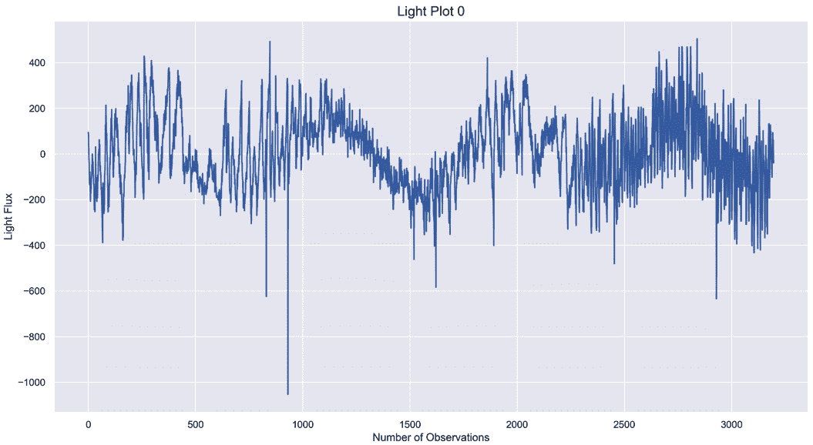
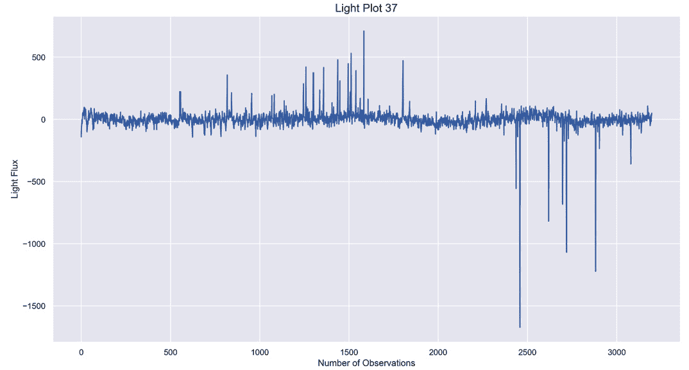
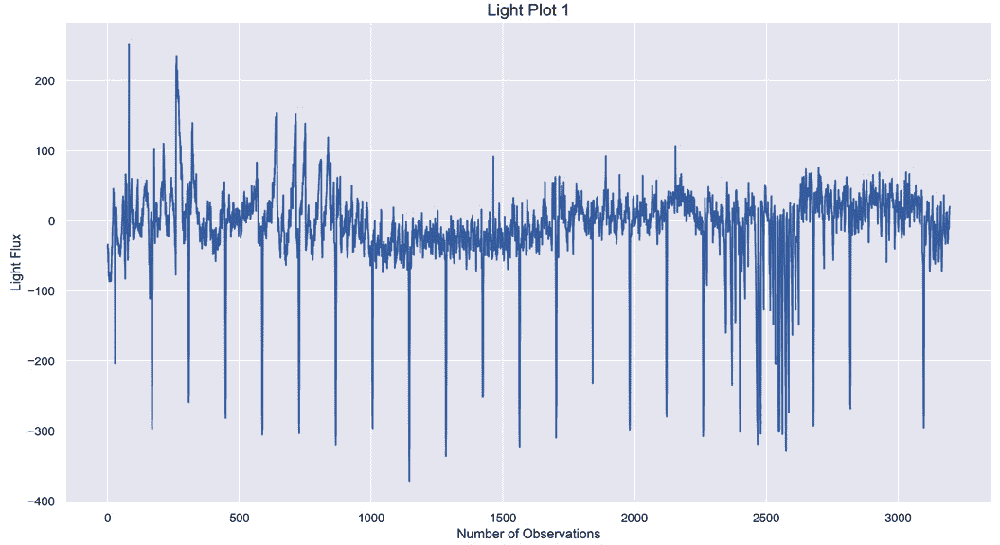

# 七、使用 XGBoost 发现系外行星

在这一章中，你将在`XGBClassifier`的带领下，穿越星空，试图发现系外行星。

这一章的原因是双重的。首先，在使用 XGBoost 的自顶向下的学习中获得实践是很重要的，因为对于所有实际目的来说，这就是你通常使用 XGBoost 所做的。虽然你可能不会自己用 XGBoost 发现系外行星，但你在这里实现的策略，包括选择正确的评分标准和仔细微调记住该评分标准的超参数，适用于 XGBoost 的任何实际使用。这个特殊案例研究的第二个原因是，对于所有机器学习从业者来说，熟练处理不平衡数据集是至关重要的，这是本章的关键主题。

具体来说，你将获得使用`scale_pos_weight`的新技能，以及更多。从`XGBClassifier`中获得最佳结果需要仔细分析不平衡的数据，并对手头的目标有清晰的预期。在这一章中，`XGBClassifier`是一项从上到下的研究的核心，该研究分析光数据来预测宇宙中的系外行星。

在本章中，我们涵盖了以下主要主题:

*   寻找系外行星

*   分析混淆矩阵

*   重采样不平衡数据

*   调整和缩放 XGBClassifier

# 技术要求

本章的代码可以在[https://github . com/packt publishing/Hands-On-Gradient-Boosting-with-XGBoost-and-Scikit-learn/tree/master/chapter 07](https://github.com/PacktPublishing/Hands-On-Gradient-Boosting-with-XGBoost-and-Scikit-learn/tree/master/Chapter07)找到。

# 寻找系外行星

在这一节中，我们将通过分析系外行星数据集开始寻找系外行星。在试图通过绘制和观察光图来探测系外行星之前，我们将提供发现系外行星的历史背景。绘制时间序列是一种有价值的机器学习技能，可用于深入了解任何时间序列数据集。最后，在揭示一个明显的缺点之前，我们将使用机器学习进行初步预测。

## 历史背景

自古以来，天文学家就一直从光中收集信息。随着望远镜的出现，天文学知识在 17 世纪激增。望远镜和数学模型的结合使 18 世纪的天文学家能够非常精确地预测我们太阳系内的行星位置和日食。

在 20 世纪，天文学研究随着更先进的技术和更复杂的数学而继续。围绕其他恒星旋转的行星，被称为系外行星，在可居住带被发现。可居住带中的行星意味着系外行星的位置和大小与地球相当，因此它是液态水和生命的候选者。

这些系外行星不能通过望远镜直接观察到，而是通过星光的周期性变化推断出来的。一个物体周期性地围绕一颗恒星旋转，这颗恒星大到足以阻挡一部分可探测的星光，根据定义，这个物体就是行星。从星光中发现系外行星需要测量长时间间隔内的光波动。由于光线的变化通常非常微小，因此不容易确定是否存在系外行星。

在这一章中，我们要用 XGBoost 来预测恒星是否有系外行星。

## 系外行星数据

你在 [*第四章*](B15551_04_Final_NM_ePUB.xhtml#_idTextAnchor093) 、*从梯度推进到 XGBoost* 中预览了系外行星数据集，揭示了 XGBoost 相对于大型数据集的可比集合方法的时间优势。在这一章中，我们将深入了解系外行星数据集。

这个系外行星数据集取自 *NASA 开普勒太空望远镜*、*战役 3* 、【2016 年夏季。有关数据源的信息可在 Kaggle 上获得，网址为[https://www . ka ggle . com/keplers machines/Kepler-labelled-time-series-data](https://www.kaggle.com/keplersmachines/kepler-labelled-time-series-data)。在数据集中的所有恒星中，5050 颗没有系外行星，而 37 颗有系外行星。

300 多列和 5，000 多行等于 150 多万个条目。当乘以 100 个 XGBoost 树时，这是 1.5 亿多个数据点。为了加快进度，我们从数据的子集开始。为了节省时间，从子集开始是处理大型数据集的常见做法。

`pd.read_csv`包含一个`nrows`参数，用来限制行数。注意，`nrows=n`选择了数据集的前 *n* 行。根据数据结构，可能需要额外的代码来确保子集代表整体。让我们开始吧。

导入`pandas`，然后用`nrows=400`加载`exoplanets.csv`。然后查看数据:

```py
import pandas as pd
df = pd.read_csv('exoplanets.csv', nrows=400)
df.head()
```

输出应该如下所示:


图 7.1-系外行星数据框

数据框下面列出的大量列( **3198** )是有意义的。在寻找光的周期性变化时，你需要足够的数据点来寻找周期性。我们太阳系内行星的公转周期从 88 天(水星)到 165 年(海王星)不等。如果要探测系外行星，必须足够频繁地检查数据点，以便当行星在恒星前面运行时，不会错过行星的凌日。

由于只有 37 颗系外行星恒星，所以了解子集中包含多少颗系外行星恒星非常重要。

`.value_counts()`方法确定特定列中每个值的数量。由于我们对`LABEL`列感兴趣，可以使用以下代码找到系外行星恒星的数量:

```py
df['LABEL'].value_counts()
```

输出如下所示:

```py
1    363 2     37 Name: LABEL, dtype: int64
```

所有的系外恒星都包含在我们的子集中。正如`.head()`所揭示的，系外行星恒星才刚刚开始。

## 绘制数据图表

人们的预期是，当一颗系外行星阻挡恒星的光线时，光通量就会下降。如果流量的下降是周期性发生的，那么系外行星很可能是原因，因为根据定义，行星是围绕恒星运行的大型物体。

让我们通过图表来直观显示数据:

1.  导入`matplotlib`、`numpy`和`seaborn`，然后将`seaborn`设置为黑色网格，如下所示:

    ```py
    import matplotlib.pyplot as plt
    import numpy as np
    import seaborn as sns
    sns.set()
    ```

    绘制光波动时，`LABEL`列并不重要。`LABEL`列将是我们机器学习的目标列。

    小费

    建议使用`seaborn`来改善您的`matplotlib`图表。默认的`sns.set()`提供了一个漂亮的浅灰色背景和白色网格。此外，许多标准图形，比如`plt.hist()`，在使用 Seaborn 默认设置的情况下，看起来更加美观。想了解更多关于 Seaborn 的信息，请查看 https://seaborn.pydata.org/。

2.  现在，让我们将数据分成`X`，预测列(我们将用图表表示)和`y`，目标列。请注意，对于系外行星数据集，目标列是第一列，而不是最后一列:

    ```py
    X = df.iloc[:,1:]
    y = df.iloc[:,0]
    ```

3.  现在编写一个名为`light_plot`的函数，它将绘制所有数据点的数据索引(行)作为输入，作为 *y* 坐标(光通量)，观察次数作为 *x* 坐标。为图表使用适当的标签，如下所示:

    ```py
    def light_plot(index):
        y_vals = X.iloc[index]
        x_vals = np.arange(len(y_vals))
        plt.figure(figsize=(15,8))
        plt.xlabel('Number of Observations')
        plt.ylabel('Light Flux')
        plt.title('Light Plot ' + str(index), size=15)
        plt.plot(x_vals, y_vals)
        plt.show()
    ```

4.  现在，调用函数来绘制第一个索引。这颗恒星被归类为系外行星恒星:

    ```py
    light_plot(0)
    ```

    这是我们第一个光照图的预期图:

    

    图 7.2–光照图 0。存在光的周期性下降

    周期性出现的数据中有明显的下降。然而，仅凭这张图并不能得出存在系外行星的结论。

5.  相比之下，将该图与第 37 个指数(数据集中的第一个非系外行星恒星)进行对比:

    ```py
    light_plot(37)
    ```

    这是第 37 个指数的预期图表:

    

    图 7.3–光照图 37

    光的增加和减少是存在的，但不是在整个范围内。

    数据中有明显的下降，但在整个图表中并不是周期性的。下降的频率不会持续出现。仅凭这一证据，不足以确定系外行星的存在。

6.  这是系外行星恒星的第二张光图:

    ```py
    light_plot(1)
    ```

    下面是第一个索引的预期图表:



图 7.4-清晰的周期性下降表明系外行星的存在

该图显示了清晰的周期性，光通量大幅下降，极有可能存在系外行星！如果所有的情节都这么清楚，机器学习就没有必要了。正如其他图表所揭示的那样，得出系外行星存在的结论通常不那么明确。

这里的目的是强调数据和仅基于视觉图形对系外行星进行分类的难度。天文学家使用不同的方法对系外行星进行分类，机器学习就是其中一种方法。

虽然这个数据集是一个时间序列，但目标不是预测下一个时间单位的光通量，而是根据所有数据对恒星进行分类。在这方面，机器学习分类器可用于预测给定恒星是否拥有系外行星。这个想法是根据提供的数据训练分类器，这反过来可以用于根据新数据预测系外行星。在本章中，我们尝试使用`XGBClassifier`对数据中的系外行星进行分类。在我们继续对数据进行分类之前，我们必须首先准备好数据。

## 准备数据

我们在前面的章节中看到，并不是所有的图像都足够清晰，可以确定系外行星的存在。这就是机器学习可能大有裨益的地方。首先，让我们为机器学习准备数据:

1.  首先，我们需要数据集是数值型的，没有空值。使用`df.info()`检查数据类型和空值:

    ```py
    df.info()
    ```

    以下是预期的输出:

    ```py
    <class 'pandas.core.frame.DataFrame'>
    RangeIndex: 400 entries, 0 to 399
    Columns: 3198 entries, LABEL to FLUX.3197
    dtypes: float64(3197), int64(1)
    memory usage: 9.8 MB
    ```

    该子集包含 3，197 个浮点数和 1 个整数，因此所有列都是数字。由于列的数量很大，所以没有提供有关空值的信息。

2.  我们可以在`.null()`上使用两次`.sum()`方法来对所有空值求和，一次是对每一列中的空值求和，第二次是对所有列求和:

    ```py
    df.isnull().sum().sum()
    ```

    预期产出如下:

    ```py
    0
    ```

因为没有空值，而且数据是数字，我们将继续机器学习。

## 初始 XGBClassifier

要开始构建初始 XGBClassifier，请采取以下步骤:

1.  导入`XGBClassifier`和`accuracy_score`:

    ```py
    from xgboost import XGBClassifier from sklearn.metrics import accuracy_score
    ```

2.  将模型拆分为训练集和测试集:

    ```py
    from sklearn.model_selection import train_test_split X_train, X_test, y_train, y_test = train_test_split(X, y, random_state=2)
    ```

3.  使用`booster='gbtree'`、`objective='binary:logistic'`和`random_state=2`作为参数建立模型并对其评分:

    ```py
    model = XGBClassifier(booster='gbtree', objective='binary:logistic', random_state=2)model.fit(X_train, y_train)y_pred = model.predict(X_test)score = accuracy_score(y_pred, y_test)print('Score: ' + str(score))
    ```

    分数如下:

    ```py
    Score: 0.89
    ```

对 89%的恒星进行正确分类似乎是一个很好的起点，但有一个明显的问题。

你能搞清楚吗？

想象一下，你把你的模型展示给你的天文学教授。假设你的教授在数据分析方面训练有素，你的教授会回答，“我看到你获得了 89%的准确性，但系外行星代表了 10%的数据，所以你怎么知道你的结果不会比一个预测没有系外行星的模型 100%的时间好？”

这就是问题所在。如果模型确定没有恒星包含系外行星，其准确性将约为 90%，因为 10 颗恒星中有 9 颗不包含系外行星。

对于不平衡的数据，准确性是不够的。

# 分析混淆矩阵

混淆矩阵是总结分类模型的正确和不正确预测的表格。混淆矩阵是分析不平衡数据的理想工具，因为它提供了更多关于哪些预测是正确的，哪些预测是错误的信息。

对于系外行星子集，以下是完美混淆矩阵的预期输出:

```py
array([[88, 0],
       [ 0,  12]])
```

当所有正条目都在左对角线上时，模型具有 100%的准确性。这里一个完美的混淆矩阵预测了 88 颗非系外行星恒星和 12 颗系外行星恒星。请注意，混淆矩阵不提供标签，但在这种情况下，标签可以根据大小来推断。

在进入进一步的细节之前，让我们使用 scikit-learn 来看看实际的混淆矩阵。

## 困惑 _ 矩阵

从`sklearn.metrics`导入`confusion_matrix`为如下:

```py
from sklearn.metrics import confusion_matrix
```

以`y_test`和`y_pred`作为输入运行`confusion_matrix`，确保将`y_test`放在第一位:

```py
confusion_matrix(y_test, y_pred)
```

输出如下所示:

```py
array([[86, 2],
       [9,  3]])
```

混淆矩阵对角线上的数字揭示了`86`正确的非系外行星恒星预测，只有`3`正确的系外行星恒星预测。

在矩阵的右上角，数字`2`揭示了两颗非系外行星恒星被错误地归类为系外行星恒星。同样，在矩阵的左下角，数字`9`揭示了`9`系外行星恒星被错误地归类为非系外行星恒星。

当水平分析时，88 颗非系外行星恒星中有 86 颗被正确分类，而 12 颗系外行星恒星中只有 3 颗被正确分类。

正如你所看到的，混淆矩阵揭示了模型预测的重要细节，而这些细节是准确性分数无法发现的。

## 分类 _ 报告

上一节混淆矩阵中显示的数字的各种百分比包含在一份分类报告中。让我们来看看分类报告:

1.  从`sklearn.metrics`导入`classification_report`:

    ```py
    from sklearn.metrics import classification_report
    ```

2.  将`y_test`和`y_pred`放在`clasification_report`内，确保将`y_test`放在第一位。然后将`classification_report`放入全局打印功能中，以保持输出对齐并易于阅读:

    ```py
    print(classification_report(y_test, y_pred))
    ```

    以下是预期的输出:

    ```py
                  precision    recall  f1-score   support
               1       0.91      0.98      0.94        88
               2       0.60      0.25      0.35        12
        accuracy                           0.89       100
       macro avg       0.75      0.61      0.65       100
    weighted avg       0.87      0.89      0.87       100
    ```

理解前面的分数意味着什么很重要，所以让我们一次复习一个。

### 精确

Precision 给出了实际上正确的阳性情况(2s)的预测。从技术上来说，它被定义为真阳性和假阳性。

#### 真阳性

以下是真阳性的定义和示例:

*   定义–正确预测为阳性的标签数量。

*   示例–2 被正确预测为 2。

#### 假阳性

以下是假阳性的定义和示例:

*   定义–被错误预测为阴性的阳性标签的数量。

*   例如，对于系外行星恒星，2s 被错误地预测为 1s。

精度的定义通常以其数学数学形式出现，如下所示:


这里 TP 代表真阳性，FP 代表假阳性。

在 E xoplanet 数据集中，我们有以下两种数学形式:


和


Precision 给出了每个目标类的正确预测百分比。现在，让我们回顾一下分类报告揭示的其他关键评分标准。

### 回忆

回忆给出了你的预测发现的阳性病例的百分比。召回是真阳性的数量除以真阳性加上假阴性。

#### 假阴性

下面是假阴性的定义和例子:

*   定义–被错误预测为阴性的标签数量。

*   例如，对于系外行星恒星预测，2s 被错误地预测为 1s。

在数学形式中，这看起来如下:


这里 TP 代表真阳性，FN 代表假阴性。

在系外行星数据集中，我们有以下数据:


和


回忆告诉你找到了多少阳性病例。就系外行星而言，只有 25%的系外行星被发现。

### F1 分数

F1 分数是精确度和召回率之间的调和平均值。使用调和平均值是因为精度和召回率基于不同的分母，调和平均值使它们相等。当精确度和召回率同等重要时，F1 分数是最好的。请注意，F1 分数范围从 0 到 1，1 为最高。

## 替代评分方法

scikit-learn 提供了精确度、召回率和 F1 分数等其他评分方法。标准评分方法列表可在官方文档中找到，网址为[https://sci kit-learn . org/stable/modules/model _ evaluation . html](https://scikit-learn.org/stable/modules/model_evaluation.html)。

小费

精度通常不是分类数据集的最佳选择。另一种流行的评分方法是`roc_auc_score`，即接收操作者特征曲线下的面积。与大多数分类评分方法一样，越接近 1，结果越好。详见[https://sci kit-learn . org/stable/modules/generated/sk learn . metrics . roc _ AUC _ score . html # sk learn . metrics . roc _ AUC _ score](https://scikit-learn.org/stable/modules/generated/sklearn.metrics.roc_auc_score.html#sklearn.metrics.roc_auc_score)。

选择得分方法时，理解目标至关重要。系外行星数据集中的目标是找到系外行星。这是显而易见的。不明显的是如何选择最佳的评分方法来达到预期的结果。

想象两种不同的场景:

*   场景 1:在机器学习模型预测的 4 颗系外恒星中，3 颗实际上是系外恒星:3/4 = 75%的精度。

*   场景 2:在 12 颗系外行星恒星中，模型正确预测了 8 颗系外行星恒星(8/12 = 66%召回率)。

哪个更可取？

答案是视情况而定。回忆是标记潜在阳性病例(系外行星)的理想方法，目标是找到所有阳性病例。精确对于确保预测(系外行星)确实是积极的是理想的。

天文学家不太可能仅仅因为机器学习模型这么说就宣布发现了系外行星。他们更有可能仔细检查潜在的系外行星恒星，然后根据额外的证据确认或反驳这一说法。

假设机器学习模型的目标是找到尽可能多的系外行星，那么回忆是一个极好的选择。为什么？回忆告诉我们 12 颗系外行星恒星中有多少已经被发现(2/12，5/12，12/12)。让我们试着把它们都找出来。

精确注释

更高的精确度并不意味着更多的系外行星恒星。例如，1/1 的召回率是 100%，但它只找到一颗系外行星。

### 回忆 _ 分数

正如前面的部分所指出的，我们将继续使用 recall 作为系外行星数据集的评分方法，以找到尽可能多的系外行星。让我们开始吧:

1.  从`sklearn.metrics`导入`recall_score`:

    ```py
    from sklearn.metrics import recall_score
    ```

    默认情况下，`recall_score`报告肯定类的召回分数，通常标记为`1`。像系外行星数据集一样，将正类标记为`2`而将负类标记为`1`是不常见的。

2.  要获得系外恒星的`recall_score`值，输入`y_test`和`y_pred`作为`recall_score`和`pos_label=2`的参数:

    ```py
    recall_score(y_test, y_pred, pos_label=2)
    ```

    系外行星恒星得分如下:

    ```py
    0.25
    ```

这和`2`召回分数下分类报告给出的百分比是一样的，是系外行星恒星。接下来，我们将使用`recall_score`和前面的参数作为我们的评分标准，而不是使用`accuracy_score`。

接下来，让我们了解一下重采样，这是一种提高不平衡数据集得分的重要策略。

# 重采样不平衡数据

既然我们已经有了发现系外行星的合适的评分方法，是时候探索诸如重采样、欠采样和过采样等策略来纠正导致低召回分数的不平衡数据了。

## 重采样

抵消不平衡数据的一个策略是对数据进行重新采样。可以通过减少多数类的行对数据进行欠采样，通过重复少数类的行对数据进行过采样。

## 欠采样

我们的探索从从 5087 行中选择 400 行开始。这是欠采样的一个例子，因为子集包含的行数比原始的少。

让我们写一个函数，允许我们对任意行数的数据进行欠采样。这个函数应该返回召回分数，这样我们可以看到欠采样是如何改变结果的。我们将从评分函数开始。

### 评分功能

下面的函数将 XGBClassifier 和行数作为输入，并生成混淆矩阵、分类报告和系外行星恒星的召回分数作为输出。

以下是步骤:

1.  定义一个函数`xgb_clf`，它将机器学习模型`model`和行数`nrows`作为输入:

    ```py
    def xgb_clf(model, nrows):
    ```

2.  用`nrows`加载数据帧，然后将数据分成`X`和`y`以及训练和测试集:

    ```py
        df = pd.read_csv('exoplanets.csv', nrows=nrows)
        X = df.iloc[:,1:]
        y = df.iloc[:,0]
        X_train, X_test, y_train, y_test = train_test_split(X, y, random_state=2)
    ```

3.  初始化模型，使模型适合训练集，并使用`y_test`、`y_pred`和`recall_score`的`pos_label=2`作为输入，用测试集对其进行评分:

    ```py
        model.fit(X_train, y_train)
        y_pred = xg_clf.predict(X_test)
        score = recall_score(y_test, y_pred, pos_label=2)
    ```

4.  打印混淆矩阵和分类报告，并返回分数:

    ```py
        print(confusion_matrix(y_test, y_pred))
        print(classification_report(y_test, y_pred))
        return score
    ```

现在，我们可以对行数进行欠采样，看看分数是如何变化的。

### 欠采样 nrows

让我们通过将`nrows`加倍为`800`来开始。这仍然是欠采样，因为原始数据集有`5087`行:

```py
xgb_clf(XGBClassifier(random_state=2), nrows=800)
```

这是预期的输出:

```py
[[189   1]
 [  9   1]]
              precision    recall  f1-score   support
           1       0.95      0.99      0.97       190
           2       0.50      0.10      0.17        10
    accuracy                           0.95       200
   macro avg       0.73      0.55      0.57       200
weighted avg       0.93      0.95      0.93       200
0.1
```

尽管对非系外行星恒星的回忆近乎完美，但混淆矩阵显示，10 颗系外行星恒星中只有 1 颗被回忆起来。

接下来，将`nrows`从`400`减少到`200`:

```py
xgb_clf(XGBClassifier(random_state=2), nrows=200)
```

这是预期的输出:

```py
[[37  0]
 [ 8  5]]
              precision    recall  f1-score   support
           1       0.82      1.00      0.90        37
           2       1.00      0.38      0.56        13
    accuracy                           0.84        50
   macro avg       0.91      0.69      0.73        50
weighted avg       0.87      0.84      0.81        50
```

这个稍微好一点。通过减少，召回率上升了。

让我们看看如果我们精确地平衡职业会发生什么。由于有 37 颗系外行星恒星，37 颗非系外行星恒星平衡了数据。

使用`nrows=74`运行`xgb_clf`功能:

```py
xgb_clf(XGBClassifier(random_state=2), nrows=74)
```

这是预期的输出:

```py
[[6 2]
 [5 6]]
              precision    recall  f1-score   support
           1       0.55      0.75      0.63         8
           2       0.75      0.55      0.63        11
    accuracy                           0.63        19
   macro avg       0.65      0.65      0.63        19
weighted avg       0.66      0.63      0.63        19
0.5454545454545454
```

这些结果是值得尊敬的，即使子集很小。

接下来，让我们看看应用过采样策略时会发生什么情况。

## 过采样

另一种重采样技术是过采样。过采样不是删除行，而是通过复制和重新分配正例来添加行。

尽管原始数据集有 5000 多行，但我们继续使用`nrows=400`作为我们的起点来加速这个过程。

`nrows=400`时，正例与负例之比为 10 比 1。我们需要 10 倍的阳性病例来达到平衡。

我们的策略如下:

*   创建一个新的数据框架，将阳性案例复制九次。

*   将新的数据帧与原始数据帧连接，以获得 10-10 的比率。

在继续之前，需要发出一个警告。如果在将数据分成训练集和测试集之前对其进行重新采样，召回分数将会被夸大。你能看出为什么吗？

重新取样时，将对阳性病例进行九次复制。将这些数据分成训练集和测试集后，副本很可能包含在这两个集中。因此，测试集将包含大多数与训练集相同的数据点。

合适的策略是首先将数据分成训练集和测试集，然后对数据进行重新采样。如前所述，我们可以使用`X_train`、`X_test`、`y_train`和`y_test`。让我们开始:

1.  将左右索引上的`X_train`和`y_train`与`pd.merge`合并如下:

    ```py
    df_train = pd.merge(y_train, X_train, left_index=True, right_index=True)
    ```

2.  使用包含以下内容的`np.repeat`创建一个数据帧`new_df`:

    a)阳性病例的值:`df_train[df_train['LABEL']==2.values`。

    b)份数——在这种情况下，`9`

    c)`axis=0`参数指定我们正在处理的列:

    ```py
    new_df = pd.DataFrame(np.repeat(df_train[df_train['LABEL']==2].values,9,axis=0))
    ```

3.  复制列名:

    ```py
    new_df.columns = df_train.columns
    ```

4.  连接数据帧:

    ```py
    df_train_resample = pd.concat([df_train, new_df])
    ```

5.  验证`value_counts`是否符合预期:

    ```py
    df_train_resample['LABEL'].value_counts()
    ```

    预期产出如下:

    ```py
    1.0    275
    2.0    250
    Name: LABEL, dtype: int64
    ```

6.  使用重新采样的数据帧分割`X`和`y`:

    ```py
    X_train_resample = df_train_resample.iloc[:,1:]
    y_train_resample = df_train_resample.iloc[:,0]
    ```

7.  根据重新采样的训练集拟合模型:

    ```py
    model = XGBClassifier(random_state=2)
    model.fit(X_train_resample, y_train_resample)
    ```

8.  用`X_test`和`y_test`给模型打分。在您的结果中包括混淆矩阵和分类报告:

    ```py
    y_pred = model.predict(X_test)
    score = recall_score(y_test, y_pred, pos_label=2)
    print(confusion_matrix(y_test, y_pred))
    print(classification_report(y_test, y_pred))
    print(score)
    ```

    分数如下:

    ```py
    [[86  2]
     [ 8  4]]
                  precision    recall  f1-score   support
               1       0.91      0.98      0.95        88
               2       0.67      0.33      0.44        12
        accuracy                           0.90       100
       macro avg       0.79      0.66      0.69       100
    weighted avg       0.89      0.90      0.88       100
    0.3333333333333333
    ```

通过适当地展示测试集，过采样实现了 33.3%的召回率，这个分数是之前获得的 17%的两倍，尽管仍然太低。

小费

`imblearn`，必须下载使用。我使用前面的重采样代码实现了与 SMOTE 相同的结果。

由于重采样最多只能产生适度的增益，所以是时候调整 XGBoost 的超参数了。

# 调整和缩放 XGBClassifier

在这一节中，我们将微调和缩放 XGBClassifier，以获得系外行星数据集的最佳可能值`recall_score`。首先，您将使用`scale_pos_weight`调整权重，然后您将运行网格搜索来找到超参数的最佳组合。此外，在整合和分析结果之前，您将对不同数据子集的模型进行评分。

## 调整重量

在 [*第五章*](B15551_05_Final_NM_ePUB.xhtml#_idTextAnchor117)*XG boost 揭开了*的面纱，你用`scale_pos_weight`超参数抵消了希格斯玻色子数据集中的不平衡。`Scale_pos_weight`是一个超参数，用于测量*正*重量。这里强调*正*是很重要的，因为 XGBoost 假设`1`的目标值为*正*，而`0`的目标值为*负*。

在系外行星数据集中，我们一直使用数据集提供的默认值`1`作为负值，`2`作为正值。我们现在将使用`.replace()`方法将`0`切换为负值，将`1`切换为正值。

### 替换

`.replace()`方法可用于重新赋值。以下代码将`LABEL`列中的`1`替换为`0`，将`2`替换为`1`:

```py
df['LABEL'] = df['LABEL'].replace(1, 0)
df['LABEL'] = df['LABEL'].replace(2, 1)
```

如果将两行代码对调，所有列的值最终都将是 0，因为所有的 2 都将变成 1，然后所有的 1 都将变成 0。在编程中，顺序很重要！

使用`value_counts`方法验证计数:

```py
df['LABEL'].value_counts()
```

以下是预期的输出:

```py
0    363
1     37
Name: LABEL, dtype: int64
```

阳性病例现在标记为`1`，阴性病例标记为`0`。

### 秤 _ 位置 _ 重量

是时候让用`scale_pos_weight=10`构建一个新的`XGBClassifier`来解释数据中的不平衡了:

1.  将新的数据帧分成`X`预测列和`y`目标列:

    ```py
    X = df.iloc[:,1:]
    y = df.iloc[:,0]
    ```

2.  将数据分为训练集和测试集:

    ```py
    X_train, X_test, y_train, y_test = train_test_split(X, y, random_state=2)
    ```

3.  用`scale_pos_weight=10`构建、拟合、预测和评分`XGBClassifier`。打印出混淆矩阵和分类报告，查看完整的结果:

    ```py
    model = XGBClassifier(scale_pos_weight=10, random_state=2)
    model.fit(X_train, y_train)
    y_pred = model.predict(X_test)
    score = recall_score(y_test, y_pred)
    print(confusion_matrix(y_test, y_pred))
    print(classification_report(y_test, y_pred))
    print(score)
    ```

    以下是预期的输出:

    ```py
    [[86  2]
     [ 8  4]]
                  precision    recall  f1-score   support
               0       0.91      0.98      0.95        88
               1       0.67      0.33      0.44        12
        accuracy                           0.90       100
       macro avg       0.79      0.66      0.69       100
    weighted avg       0.89      0.90      0.88       100
    0.3333333333333333
    ```

结果与上一节中我们的重采样方法相同。

我们从零开始实现的过采样方法给出了与使用`scale_pos_weight`的`XGBClassifier`相同的预测。

## 调优 XGBClassifier

是时候看看超参数微调能否增加精度了。

微调超参数时标准使用`GridSearchCV`和`RandomizedSearchCV`。两者都需要两个或更多折叠的交叉验证。我们还没有实现交叉验证，因为我们的初始模型表现不佳，并且在大型数据集上测试多个折叠的计算成本很高。

一个平衡的方法是使用两次折叠的`GridSearchCV`和`RandomizedSearchCV`来节省时间。为保证结果一致，推荐使用`StratifiedKFold` ( [*第六章*](B15551_06_Final_NM_ePUB.xhtml#_idTextAnchor136) ， *XGBoost 超参数*)。我们将从基线模型开始。

### 基线模型

下面是构建一个基线模型的步骤，该模型实现了与网格搜索相同的 k 重交叉验证:

1.  导入`GridSearchCV`、`RandomizedSearchCV`、`StratifiedKFold`和`cross_val_score`:

    ```py
    from sklearn.model_selection import GridSearchCV, RandomizedSearchCV, StratifiedKFold, cross_val_score
    ```

2.  用`n_splits=2`和`shuffle=True`将`StratifiedKFold`初始化为`kfold`:

    ```py
    kfold = StratifiedKFold(n_splits=2, shuffle=True, random_state=2)
    ```

3.  用`scale_pos_weight=10`初始化`XGBClassifier`,因为负例是正例的 10 倍；

    ```py
    model = XGBClassifier(scale_pos_weight=10, random_state=2)
    ```

4.  以`cv=kfold`和`score='recall'`为参数，使用`cross_val_score`对模型评分，然后显示分数:

    ```py
    scores = cross_val_score(model, X, y, cv=kfold, scoring='recall')
    print('Recall: ', scores)
    print('Recall mean: ', scores.mean())
    ```

    分数如下:

    ```py
    Recall:  [0.10526316 0.27777778]
    Recall mean:  0.1915204678362573
    ```

交叉验证的分数稍微差一点。当正面案例很少时，哪一行出现在训练集和测试集中就会产生差异。`StratifiedKFold`和`train_test_split`的不同实现可能会导致不同的结果。

### 网格 _ 搜索

我们现在将实现来自 [*第 6 章*](B15551_06_Final_NM_ePUB.xhtml#_idTextAnchor136) ， *XGBoost 超参数*的`grid_search`函数的变体，以微调超参数:

1.  新函数将相同的参数字典作为输入，并带有一个使用`RandomizedSearchCV`的随机选项。此外，`X`和`y`作为默认参数提供给其他子集使用，计分方法如下:

    ```py
    def grid_search(params, random=False, X=X, y=y, model=XGBClassifier(random_state=2)): 
        xgb = model
        if random:
            grid = RandomizedSearchCV(xgb, params, cv=kfold, n_jobs=-1, random_state=2, scoring='recall')
        else:
            grid = GridSearchCV(xgb, params, cv=kfold, n_jobs=-1, scoring='recall')
        grid.fit(X, y)
        best_params = grid.best_params_
        print("Best params:", best_params)
        best_score = grid.best_score_
        print("Best score: {:.5f}".format(best_score))
    ```

2.  让我们运行网格搜索，排除默认值，尝试提高分数。以下是一些初始网格搜索及其结果:

    a)网格搜索 1:

    ```py
    grid_search(params={'n_estimators':[50, 200, 400, 800]})
    ```

    结果:

    ```py
    Best params: {'n_estimators': 50}Best score: 0.19152
    ```

    b)网格搜索 2:

    ```py
    grid_search(params={'learning_rate':[0.01, 0.05, 0.2, 0.3]})
    ```

    结果:

    ```py
    Best params: {'learning_rate': 0.01}
    Best score: 0.40351
    ```

    c)网格搜索 3:

    ```py
    grid_search(params={'max_depth':[1, 2, 4, 8]})
    ```

    结果:

    ```py
    Best params: {'max_depth': 2}
    Best score: 0.24415
    ```

    d)网格搜索 4:

    ```py
    grid_search(params={'subsample':[0.3, 0.5, 0.7, 0.9]})
    ```

    结果:

    ```py
    Best params: {'subsample': 0.5}
    Best score: 0.21637
    ```

    e)网格搜索 5:

    ```py
    grid_search(params={'gamma':[0.05, 0.1, 0.5, 1]})
    ```

    结果:

    ```py
    Best params: {'gamma': 0.05}
    Best score: 0.24415
    ```

3.  改变`learning_rate`、`max_depth`、`gamma`就有了收获。让我们通过缩小范围来尝试将它们结合起来:

    ```py
    grid_search(params={'learning_rate':[0.001, 0.01, 0.03], 'max_depth':[1, 2], 'gamma':[0.025, 0.05, 0.5]})
    ```

    分数如下:

    ```py
    Best params: {'gamma': 0.025, 'learning_rate': 0.001, 'max_depth': 2}
    Best score: 0.53509
    ```

4.  也值得试试`max_delta_step`，XGBoost 只对不平衡数据集推荐。默认值为 0，增加步长会产生更保守的模型:

    ```py
    grid_search(params={'max_delta_step':[1, 3, 5, 7]})
    ```

    分数如下:

    ```py
    Best params: {'max_delta_step': 1}
    Best score: 0.24415
    ```

5.  作为最后一个策略，我们将`subsample`与随机搜索中的所有列样本结合起来:

    ```py
    grid_search(params={'subsample':[0.3, 0.5, 0.7, 0.9, 1], 
    'colsample_bylevel':[0.3, 0.5, 0.7, 0.9, 1], 
    'colsample_bynode':[0.3, 0.5, 0.7, 0.9, 1], 
    'colsample_bytree':[0.3, 0.5, 0.7, 0.9, 1]}, random=True)
    ```

    分数如下:

    ```py
    Best params: {'subsample': 0.3, 'colsample_bytree': 0.7, 'colsample_bynode': 0.7, 'colsample_bylevel': 1}
    Best score: 0.35380
    ```

代替继续这个包含`400`行的数据子集，让我们切换到包含`74`行的平衡子集(欠采样)来比较结果。

### 平衡子集

`74`行的平衡子集具有最少的数据点。也是测试最快的。

`X`和`y`需要被明确定义，因为它们最后被用于函数内部的平衡子集。`X_short`和`y_short`的新定义如下:

```py
X_short = X.iloc[:74, :]
y_short = y.iloc[:74]
```

在几次网格搜索后，结合`max_depth`和`colsample_bynode`得到了以下结果:

```py
grid_search(params={'max_depth':[1, 2, 3], 'colsample_bynode':[0.5, 0.75, 1]}, X=X_short, y=y_short, model=XGBClassifier(random_state=2)) 
```

分数如下:

```py
Best params: {'colsample_bynode': 0.5, 'max_depth': 2}
Best score: 0.65058
```

这是一种进步。

是时候尝试对所有数据进行超参数微调了。

### 微调所有数据

在所有数据上实现`grid_search`函数的问题是时间。现在我们已经结束了，是时候运行代码并在计算机出汗的时候休息一下了:

1.  将所有数据读入一个新的数据帧，`df_all`:

    ```py
    df_all = pd.read_csv('exoplanets.csv')
    ```

2.  用 0 替换 1，用 1 替换 2:

    ```py
    df_all['LABEL'] = df_all['LABEL'].replace(1, 0)df_all['LABEL'] = df_all['LABEL'].replace(2, 1)
    ```

3.  将数据分成`X`和`y`:

    ```py
    X_all = df_all.iloc[:,1:]y_all = df_all.iloc[:,0]
    ```

4.  验证`'LABEL'`栏的`value_counts`:

    ```py
    df_all['LABEL'].value_counts()
    ```

    输出如下所示:

    ```py
    0    5050 1      37 Name: LABEL, dtype: int64
    ```

5.  通过将负类除以正类来调整权重:

    ```py
    weight = int(5050/37)
    ```

6.  用`XGBClassifier`和`scale_pos_weight=weight`对所有数据的基线模型评分:

    ```py
    model = XGBClassifier(scale_pos_weight=weight, random_state=2)
    scores = cross_val_score(model, X_all, y_all, cv=kfold, scoring='recall')
    print('Recall:', scores)
    print('Recall mean:', scores.mean())
    ```

    输出如下所示:

    ```py
    Recall: [0.10526316 0\.        ]
    Recall mean: 0.05263157894736842
    ```

    这个分数太糟糕了。据推测，尽管召回率低，分类器的准确率还是很高。

7.  让我们根据迄今为止最成功的结果来优化超参数:

    ```py
    grid_search(params={'learning_rate':[0.001, 0.01]}, X=X_all, y=y_all, model=XGBClassifier(scale_pos_weight=weight, random_state=2)) 
    ```

    分数如下:

    ```py
    Best params: {'learning_rate': 0.001}
    Best score: 0.26316
    ```

    这比所有数据的初始得分要好得多。

    让我们尝试组合超参数:

    ```py
    grid_search(params={'max_depth':[1, 2],'learning_rate':[0.001]}, X=X_all, y=y_all, model=XGBClassifier(scale_pos_weight=weight, random_state=2)) 
    ```

    分数如下:

    ```py
    Best params: {'learning_rate': 0.001, 'max_depth': 2}
    Best score: 0.53509
    ```

这是更好的，虽然没有之前欠采样数据集的效果好。

随着所有数据的得分开始降低，花费更多的时间，一个问题自然出现了。对于系外行星数据集来说，机器学习模型在较小的子集上更好吗？

让我们找出答案。

## 巩固成果

用不同的数据集整合结果是很棘手的。我们一直在与以下子集合作:

*   大约 5050 行。54%的召回

*   大约 400 行。54%的召回

*   大约 74 排。68%的召回

获得的最佳结果包括`learning_rate=0.001`、`max_depth=2`和`colsample_bynode=0.5`。

让我们在所有 37 颗系外行星恒星上训练一个模型。这意味着测试结果将来自模型已经训练过的数据点。通常，这不是一个好主意。然而，在这种情况下，阳性病例非常少，并且观察更小的子集如何对其之前未见过的阳性病例进行测试可能是有益的。

以下函数将`X`、`y`和机器学习模型作为输入。模型适合所提供的数据，然后对整个数据集进行预测。最后，`recall_score`、`confusion matrix`、`classification report`都打印出来:

```py
def final_model(X, y, model):
    model.fit(X, y)
    y_pred = model.predict(X_all)
    score = recall_score(y_all, y_pred,)
    print(score)
    print(confusion_matrix(y_all, y_pred,))
    print(classification_report(y_all, y_pred))
```

让我们为三个子集分别运行函数。在三个最强的超参数中，`colsample_bynode`和`max_depth`给出了最好的结果。

先说最小行数，系外行星恒星和非系外行星恒星的数量相匹配。

### 74 行

让我们从 74 行开始:

```py
final_model(X_short, y_short, XGBClassifier(max_depth=2, colsample_by_node=0.5, random_state=2))
```

输出如下所示:

```py
1.0
[[3588 1462]
 [   0   37]]
              precision    recall  f1-score   support
           0       1.00      0.71      0.83      5050
           1       0.02      1.00      0.05        37
    accuracy                           0.71      5087
   macro avg       0.51      0.86      0.44      5087
weighted avg       0.99      0.71      0.83      5087
```

所有 37 颗系外行星恒星都被正确识别，但 1462 颗非系外行星恒星被错误分类！尽管召回率为 100%，但准确率为 2%，F1 评分为 5%。仅针对召回进行调优时，精度低和 F1 分数低是一个风险。实际上，一名天文学家必须在 1462 颗潜在的系外行星恒星中挑选出 37 颗。这是不可接受的。

现在让我们看看当我们在 400 排上训练时会发生什么。

### 400 行

在 400 行的情况下，我们使用`scale_pos_weight=10`超参数来平衡数据:

```py
final_model(X, y, XGBClassifier(max_depth=2, colsample_bynode=0.5, scale_pos_weight=10, random_state=2))
```

输出如下所示:

```py
1.0
[[4901  149]
 [   0   37]]
              precision    recall  f1-score   support
           0       1.00      0.97      0.99      5050
           1       0.20      1.00      0.33        37
    accuracy                           0.97      5087
   macro avg       0.60      0.99      0.66      5087
weighted avg       0.99      0.97      0.98      5087
```

同样，所有 37 颗系外行星恒星都被正确分类，召回率为 100%，但 149 颗非系外行星恒星被错误分类，准确率为 20%。在这种情况下，天文学家需要对 186 颗恒星进行分类，才能找到 37 颗系外行星恒星。

最后，让我们在所有数据上进行训练。

### 5050 行

对于所有的数据，设置`scale_pos_weight`等于`weight`变量，如前所述:

```py
final_model(X_all, y_all, XGBClassifier(max_depth=2, colsample_bynode=0.5, scale_pos_weight=weight, random_state=2))
```

输出如下所示:

```py
1.0
[[5050    0]
 [   0   37]]
              precision    recall  f1-score   support
           0       1.00      1.00      1.00      5050
           1       1.00      1.00      1.00        37
    accuracy                           1.00      5087
   macro avg       1.00      1.00      1.00      5087
weighted avg       1.00      1.00      1.00      5087
```

太神奇了。所有的预测，召回率和精确度，都是 100%完美的。在这种非常理想的情况下，天文学家将找到所有的系外行星恒星，而不必筛选任何糟糕的数据。

然而，请记住，这些分数是基于训练数据，而不是基于看不见的测试数据，这是构建一个强模型所必须的。换句话说，尽管该模型与训练数据完全吻合，但它不太可能将这种情况推广到新数据。然而，这些数字是有价值的。

基于这一结果，由于机器学习模型在训练集上表现令人印象深刻，在测试集上表现平平，因此方差可能太高。此外，可能需要更多的树和更多轮次的微调来获取数据中的细微模式。

## 分析结果

当在训练集上评分时，调整后的模型提供了完美的回忆，但在精确度上有很大差异。以下是要点:

*   使用没有召回或 F1 分数的精度可能导致次优模型。通过使用分类报告，可以揭示更多的细节。

*   不建议过分强调小子集的高分。

*   当测试分数较低，但不平衡数据集上的训练分数较高时，建议使用具有广泛超参数微调的更深模型。

Kaggle 用户在 https://www . ka ggle . com/keplers machines/Kepler-labelled-time-series-data/kernels 上为系外行星数据集公开展示了一项内核调查，揭示了以下内容:

*   许多用户不理解高准确度的分数很容易获得，并且对于高度不平衡的数据几乎没有意义。

*   发布精确度的用户通常发布 50%到 70 %,发布召回率的用户发布 60%到 100%(召回率为 100%的用户具有 55%的精确度)，这表明了该数据集的挑战和局限性。

当你向你的天文学教授展示你的结果时，更明智地认识到不平衡数据的局限性，你得出结论，你的模型最多只能实现 70%的回忆，37 颗系外行星恒星不足以建立一个强大的机器学习模型来寻找其他行星上的生命。然而，你的 XGBClassifier 将允许天文学家和其他接受过数据分析训练的人使用机器学习来决定关注宇宙中的哪些恒星，以发现轨道上的下一个系外行星。

# 总结

在这一章中，你用系外行星数据集调查了宇宙，发现了新的行星和潜在的新生命。你建立了多个 xgb 分类器来预测系外行星恒星何时是光线周期性变化的结果。只有 37 颗系外行星恒星和 5050 颗非系外行星恒星，您通过欠采样、过采样和调整 XGBoost 超参数(包括`scale_pos_weight`)纠正了不平衡的数据。

您使用混淆矩阵和分类报告分析了结果。您了解了各种分类评分指标之间的主要差异，以及为什么对于系外行星数据集而言，准确性几乎毫无价值，而高召回率是理想的，尤其是在与高精度相结合以获得良好的 F1 评分时。最后，当数据变化极大且不平衡时，您意识到了机器学习模型的局限性。

完成本案例研究后，您将具备必要的背景知识和技能，能够使用 XGBoost 使用`scale_pos_weight`、超参数微调和备选分类评分指标来全面分析不平衡的数据集。

在下一章中，您将通过应用除梯度提升树之外的备选 XGBoost 基础学习器来极大地扩展 XGBoost 的范围。虽然梯度提升树通常是最好的选择，但 XGBoost 配备了线性基础学习器，飞镖基础学习器，甚至随机森林，所有这些都在后面！