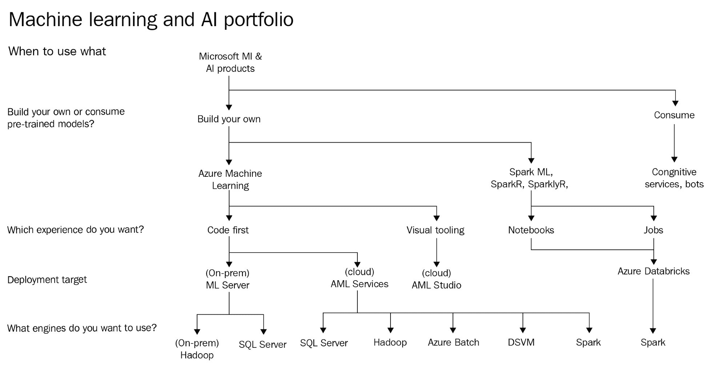

    

# 一、人工智能云基础

今天，每个组织都渴望成为采用最新技术进步的领导者。近年来，这种采用的成功是通过利用围绕业务的数据环境实现的。在这一章中，我们将讨论如何使用微软的 Azure 平台利用人工智能从数据景观中获取商业价值。Azure 提供数百种服务，选择合适的服务很有挑战性。在这一章中，我们将给出数据科学家、开发人员或数据工程师为他们的组织构建和部署 AI 解决方案的选择的高层次概述。我们将从可以指导技术选择的决策树开始，这样您就可以了解...

# 人工智能的重要性

人工智能 ( **AI** )正越来越多地交织到我们由技术驱动的复杂生活中。不管我们是否意识到，人工智能正在成为一种使我们能够比以往任何时候都更有效地完成日常任务的手段。Siri、Cortana 和 Alexa 等个人助理是我们经常遇到的一些最常见的人工智能工具。不太明显的人工智能工具是那些由拼车公司使用的工具，这些工具建议司机移动到高密度区域，并根据需求动态调整价格。

纵观全球，在人工智能之旅的不同阶段都有不同的组织。对一些组织来说，人工智能是他们商业模式的核心。在其他组织中，他们看到了利用人工智能来竞争和创新业务的潜力。成功的组织认识到，通过人工智能实现数字化转型是他们长期生存的关键。有时，这需要改变一个组织的商业模式，通过新技术，如**物联网** ( **物联网**)来融入人工智能。在这一系列人工智能成熟度中，组织面临着实现人工智能解决方案的挑战。挑战通常与可伸缩性、算法、库、准确性、再训练、管道、与其他系统的集成等相关。

人工智能领域已经存在了几十年，但在过去的十年里，它的发展和采用是巨大的。这可以归因于三个主要驱动因素:大数据、大计算和增强的算法。数据的增长主要来自生成数据的实体，或者来自人类与这些实体的交互。计算机发展可以归功于改进的芯片设计以及创新的计算机技术。算法的改进部分归功于开源社区，部分归功于更大数据和计算的可用性。

# 云的出现

在云中开发人工智能解决方案有助于组织跨越创新，此外还能缓解这里描述的挑战。第一步是将所有数据集中在一起或放在同一个工具中，以便于检索。云层是满足这一要求的最佳着陆区。云提供了近乎无限的存储、对其他数据源的轻松访问以及按需计算。基于云构建的解决方案更易于维护和更新，因为有一个单一的控制面板。几年前，点击一个按钮就能获得改进或定制的硬件是不可想象的。

云中的创新如此迅速，以至于开发者可以构建大量不同的产品...

# 人工智能的基本云组件

任何云人工智能解决方案都有不同的组件，所有组件都是模块化的，单独具有弹性，并且相互集成。下图描绘了云人工智能的广泛框架。最底层是**存储**，与**计算**分开。这种**存储**和**计算**的分离是云的关键优势之一，它允许用户将两者分开进行扩展。**存储**本身可以根据吞吐量、可用性和其他特性进行分层。直到几年前，**计算**选项还受限于底层 CPU 芯片的速度和世代。现在，我们也有 GPU 和 **FPGA** (现场可编程门阵列的简称)芯片的选择。利用**存储**和**计算**，各种服务都构建在云架构上，这使得使用摄取数据、转换数据和构建模型变得更加容易。基于**关系数据库的服务**、 **NoSQL** 、 **Hadoop** 、 **Spark** 和**微服务**是一些最常用于构建人工智能解决方案的服务:

云人工智能的基本构件

最复杂的是云上可用的各种以人工智能为中心的服务。这些服务的一端是完全可定制的解决方案，另一端是易于构建的解决方案。定制人工智能是一种典型的解决方案，允许用户引入自己的库或使用专有库来构建端到端的解决方案。这通常涉及大量的手工编码，并让构建者完全控制解决方案的不同部分。**预建的人工智能**通常以 API 的形式出现，这些 API 公开了某种类型的服务，可以很容易地集成到您的解决方案中。这些例子包括自定义视觉、文本和基于语言的人工智能解决方案。

无论底层人工智能有多复杂，大多数应用的目标都是让最终用户体验尽可能无缝。这意味着人工智能解决方案需要与驻留在组织解决方案堆栈中的一般应用集成。许多解决方案在传统 BI 领域使用**仪表板**或报告。这些界面允许用户探索由人工智能解决方案生成的数据。**对话式应用**通常采用智能界面(如机器人)的形式，以对话方式与用户互动。

# 微软云 Azure

微软的使命是让地球上的每一个人和每一个组织获得更多。微软 Azure 是一个云平台，旨在帮助客户实现智能云和智能边缘。他们的愿景是帮助客户将人工智能融入每一个应用，无论是在云和各种外形的计算设备上。考虑到这一点，微软开发了一套广泛的工具，可以帮助其客户轻松地将人工智能构建到他们的应用中。

下表显示了可用于使用 Azure 开发端到端 AI 解决方案的不同工具。Azure 服务列指示由微软拥有和管理的那些服务(第一方服务)。蔚蓝市场...

# 在 Azure 上选择人工智能工具

在这本书里，我们将假设你有一般的人工智能知识和经验。这里的目标不是触及各种人工智能的基础，也不是选择正确的算法；我们假设您非常了解选择什么算法来解决给定的业务需求。

下图显示了一个决策树，可以帮助你选择正确的 Azure AI 工具。它并不意味着是全面的；只是正确技术选择的指南。有很多选择可以交叉，在这张图上很难描绘出来。还要记住，一个有效的人工智能解决方案将结合使用多种工具:

在 Azure 上选择人工智能工具的决策树指南

上图显示了一个帮助**微软 AI 平台**用户的决策树。从头开始，第一个问题是您是愿意**建立自己的模型还是消费预先训练好的模型**。如果您正在构建自己的模型，那么在这个过程的各个阶段都需要数据科学家、数据工程师和开发人员的参与。在某些用例中，开发人员更喜欢**使用预先训练好的模型**。

# 认知服务/机器人

希望使用预先训练好的人工智能模型的开发人员通常会使用微软的一种认知服务。对于那些正在构建对话式应用的人来说，Bot 框架和认知服务的组合是推荐的途径。我们将在[第 3 章](89299379-0f5e-4602-ad78-9d3d46a0710e.xhtml)、*认知服务*和[第 4 章](08fa36ee-b325-4c6c-b5f5-f41c03d056c3.xhtml)、 *Bot 框架*中深入了解认知服务的细节，但了解何时选择认知服务很重要。

认知服务的目标是为开发人员提供快速构建和部署人工智能应用的工具。认知服务是预先训练好的、可定制的人工智能模型，通过带有 SDK 和 web 服务的 API 公开。它们执行某些任务，并且被设计成...

# Azure ML Studio

Azure Machine Learning(**Azure ML**)Studio 是主要工具，纯粹基于网络的 GUI，帮助构建**机器学习** ( **ML** )模型。Azure ML Studio 是一个几乎无代码的环境，允许用户构建端到端的 ML 解决方案。它内置了微软研究院的专有算法，可以非常简单地完成大多数机器学习任务。它还可以嵌入 Python 或 R 代码来增强其功能。Azure ML Studio 最大的特性之一是能够通过单击创建 web 服务。web 服务以 REST 端点的形式公开，应用可以向其发送数据。除了 web 服务之外，还创建了一个 Excel 电子表格，它访问相同的 web 服务，可用于测试模型的功能，并与最终用户轻松共享。

在撰写本文时，Azure ML Studio 的主要限制是实验容器的 10 GB 限制。这个限制将在[第 6 章](f6d8b2f5-a038-41fe-892f-4720ef071fd9.xhtml)、*数据科学的可扩展计算*中详细解释，但是现在，理解 Azure ML Studio 非常适合训练 2 GB 到 5 GB 范围内的数据集就足够了。此外，对 ML Studio 中可以包含的 R 和 Python 代码的数量以及它的性能也有限制，这将在后面详细讨论。

# ML 服务器

对于代码优先的体验，微软产品组合中有多种工具可用。如果组织希望在内部部署(除了云之外)，唯一可用的选项是**机器学习服务器** ( **ML 服务器**)。ML Server 是一个支持 R 和 Python 应用的企业平台。它端到端地支持 ML 过程中涉及的所有活动。ML Server 之前被称为 **R Server** ，是微软收购 revolution analytics 的产物。后来，添加了 Python 支持来处理各种用户偏好。

在 ML Server 中，用户可以使用任何开源库作为他们解决方案的一部分。许多开源工具的挑战在于它需要一个...

# Azure ML 服务

Azure ML Services 是 Azure 上相对较新的服务，在构建 AI 解决方案的过程中提高了生产率。Azure ML 服务有不同的组件。在用户端，Azure ML Workbench 是一个工具，允许用户获取数据、转换数据、构建模型，并针对各种计算运行它们。Workbench 是用户在本地机器上运行并连接到 Azure ML 服务的工具。Azure ML Services 本身运行在 Azure 上，由 ML 的实验和模型管理组成。实验服务跟踪模型测试、性能以及您在构建模型时想要跟踪的任何其他指标。模型管理服务帮助管理模型的部署，并管理由单个用户或大型团队构建的多个模型的整个生命周期。

当利用 Azure ML 服务时，有多个端点可以充当服务的引擎。在撰写本文时，只支持基于 Python 的端点。随着内置 Python 服务的引入，SQL Server 可以充当端点。这是有益的，尤其是如果用户将大部分数据放在 SQL 表中，并且希望最大限度地减少数据移动。

如果你已经在 ML 服务上大规模利用了用于 ML 的 Spark 库，那么你可以在 Azure 上部署基于 Spark 的解决方案。目前，这些可以是 HDInsight 上的 Spark，也可以是 Apache Spark 的任何其他本机实现(Cloudera、Hortonworks 等)。

如果用户利用其他基于 Hadoop 的库来构建 ML 服务，那么这些服务可以部署到 HDInsight 或 Azure 上可用的任何 Apache Hadoop 实现。

Azure Batch 是一项服务，它为需要特定或预定资源的应用提供大规模的按需计算。此使用案例的典型工作流包括创建虚拟机集群，然后向集群提交作业。作业完成后，群集被销毁，用户无需为之后的任何计算付费。

**数据科学虚拟机** ( **DSVM** )是一个高度定制的虚拟机模板，构建在 Linux 或 Windows 上。它预装了各种各样的精选数据科学工具和库。所有的工具和库都被配置为开箱即用。DSVM 有多种应用，我们将在[第 7 章](b88febb4-e8e4-4a08-9f62-5495654f3842.xhtml)、*机器学习服务器*中介绍，包括用作 Azure Batch 的基础映像 VM。

运行由 Azure ML Services 构建的模型的高可伸缩性目标之一是通过 Docker 和 Kubernetes 的编排来利用容器。这通过利用 Azure Kubernetes 服务变得更加容易。Azure ML Services 创建了一个 Docker 映像来帮助操作 ML 模型。该模型本身被部署为基于容器化 Docker 的 web 服务，同时利用 TensorFlow 和 Spark 等框架。应用可以将这个 web 服务作为 REST API 来访问。web 服务可以通过利用 Kubernetes 的伸缩特性进行伸缩。关于这个主题的更多细节将在[第 10 章](3196eb4a-070f-4b7b-9e15-f8cdc23398f8.xhtml)、*构建深度学习解决方案*中介绍。

Azure ML 服务的挑战在于它目前只支持 Python。该平台本身经历了一些变化，对命令行界面的严重依赖使得该界面不像其他一些工具那样用户友好。

# Azure 数据块

Azure Databricks 是可用于在 Azure 上构建定制人工智能解决方案的工具的最新成员之一。它基于 Apache Spark，但针对在 Azure 平台上的使用进行了优化。Spark 引擎可以由基于 Scala、Python、R、SQL 或 Java 的各种 API 访问。为了利用 Spark 的可伸缩性，用户在处理数据对象及其转换时需要利用 Spark 库。Azure Databricks 在由运行时管理的高度灵活和可伸缩的 Spark 集群之上利用这些可伸缩库。Databricks 具有企业级的安全性、合规性和协作特性，这使其有别于 Apache Spark。计划和协调的能力...

# 摘要

总之，本章简要概述了 Azure 上可用于构建人工智能解决方案的所有不同服务。在创新的云世界中，很难找到一个包含人工智能项目所有预期结果的单一解决方案。本书的目标是指导用户为正确的任务选择正确的工具。成熟的组织意识到敏捷和灵活是云创新的关键。在下一章，我们将看到 TDSP 阶段及其工具。