    

# 二、数据科学流程

在过去的十年中，组织见证了数据的快速增长。利用这些数据的洞察力对于这些组织的发展和维持至关重要。然而，被授权从数据中提取价值的团体却因各种原因而失败。在本章中，我们将讨论组织如何避免数据科学的潜在陷阱。

关于数据的质量和治理有一个更大的讨论，我们将不在这里讨论。经验丰富的数据科学家认识到数据带来的挑战，并在他们的流程中考虑这些挑战。一般来说，这些挑战包括以下几个方面:

*   数据质量和一致性差
*   由单个业务团队驱动的数据孤岛
*   难的技术...

# TDSP 阶段

**团队数据科学流程** ( **TDSP** )是微软创建的一种方法，用于指导组织中数据科学项目的整个生命周期。它并不意味着是一个完整的解决方案，而只是一个框架，团队可以通过它将结构添加到他们的流程中，并实现他们的分析的全部商业价值。

除了 TDSP 之外，组织一直在采用的另一种流行方法被称为**CRISP-DM**(**跨行业数据挖掘标准流程**的简称)。这种方法自 20 世纪 90 年代中期就已存在。2000 年代曾有过几次更新的尝试，但都被放弃了。CRISP-DM 的主要焦点是数据挖掘，但是它的原理也可以扩展到数据科学。CRISP-DM 中列出的主要步骤如下:业务理解、数据理解、数据准备、建模、评估和部署。对于从业者来说，这些步骤似乎是多余的，但是对于刚开始从数据中获取价值的组织来说，这是一个很好的构建过程的框架。事实上，市场上由不同供应商发布的许多数据科学工具本身就具有驱动用户完成这些步骤的功能。

CRISP-DM 方法在应用于数据科学时存在几个缺口。最突出的一点是需要将业务成果与流程的每一步联系起来。除了这里列出的内容之外，还需要解决数据质量、数据源、偏差、算法质量和可扩展性方面的挑战。

TDSP 不是 CRISP-DM 的替代方案，但可以被视为一个额外的框架，可以对其进行扩展，以包括围绕数据的现有工作流。TDSP 更注重任务，但在高层次上与 CRISP-DM 有一些相同的概念。

TDSP 的核心原则之一是，下图所示的数据科学生命周期的结果是为业务提供价值的智能应用程序。新的数据科学项目可以利用 TDSP 的一部分，期望它们随着变得更加成熟而毕业，并利用该过程的其他步骤。从这个意义上说，TDSP 意味着迭代和敏捷。根据项目的性质和成熟度，可以取消一些流程。

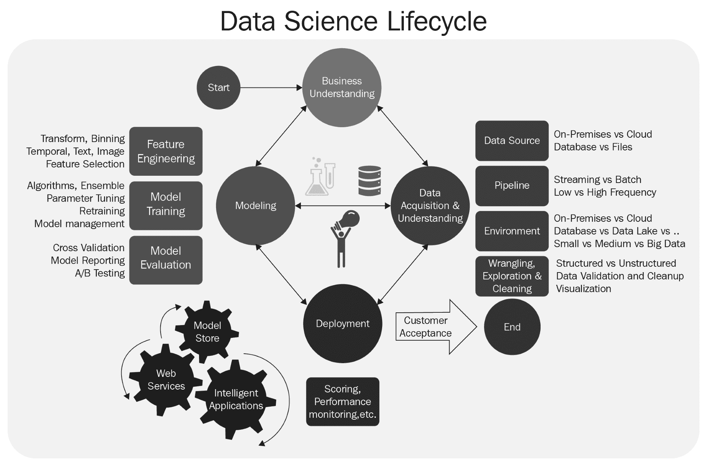

TDSP 定义了以下五个主要阶段:

*   商业理解
*   数据获取和理解
*   建模
*   部署
*   客户接受度

# 商业理解

在 TDSP 的这个阶段，有两项任务推动着它的目标:

*   定义目标
*   识别数据源

让我们分解和分析这些任务，看看它们如何帮助获得业务理解。

定义目标任务包括以下因素:

*   **模型目标**:项目的成功由业务目标驱动，而业务目标又由分析过程中跟踪的一些变量驱动。这些变量被称为**模型目标**，并且可能有多个与预测其成功的模型目标相关联的度量。经常使用的模型目标的一个例子是收入预测，或交易欺诈的概率。
*   **相关问题**:您可以定义...

# 可交付的

交付内容如下:

*   **章程文档**:该文档用于跟踪项目的各个方面。这些包括业务背景、范围、人员、计划、架构、度量和沟通。这里提供了这个文档的模板:[https://github . com/Azure/Azure-TDSP-Project template/blob/master/Docs/Project/charter . MD](https://github.com/Azure/Azure-TDSP-ProjectTemplate/blob/master/Docs/Project/Charter.md)。
*   **数据源**:这个文档描述了所有的数据源以及将它们合并到项目中所需的任何转换。任何处理过的数据或工程特征也会被跟踪。此交付件的模板如下:[https://github . com/Azure/Azure-TDSP-project template/blob/master/Docs/Data _ Report/Data % 20 definition . MD](https://github.com/Azure/Azure-TDSP-ProjectTemplate/blob/master/Docs/Data_Report/Data%20Defintion.md)。
*   **数据字典**:这个文档提供了每个数据源的详细描述。这可能包括带有示例的表模式和数据类型。此处提供了该交付件的模板:[https://github . com/Azure/Azure-TDSP-project template/tree/master/Docs/Data _ dictionary](https://github.com/Azure/Azure-TDSP-ProjectTemplate/tree/master/Docs/Data_Dictionaries)。

# 数据获取和理解

在 TDSP 的这个阶段，有三项任务推动着它的目标:

*   **摄取数据**:为了使数据的探索和建模更容易，理想的做法是尽可能将源数据移动到单个分析系统中。在 Azure 中，通过各种工具，跨不同服务移动数据的能力变得很容易，记住这些用例。

*   **探索数据**:理解数据的本质是成功分析项目的关键。在大多数组织中，数据都有很多缺陷:异常值、缺失值、错误值等等。可视化数据和分析数据的特征是成功的数据科学项目的先决条件。这也是...

# 可交付的

交付内容如下:

*   **数据质量报告**:IDEAR 工具可以帮助创建总结源数据和目标变量的报告。
*   **解决方案架构**:在项目的这个阶段，可以绘制数据流的图表或描述，以显示管道的评分和再训练(如果需要的话)。
*   **检查点决策**:基于对数据的初步评估，您可以决定是否在这个阶段之后继续项目。如果在这个阶段预期的商业价值不明确，可以决定获取额外的数据或者中止项目。在某些情况下，涉众可能会考虑重构。

# 建模

在此阶段，有三项主要任务可以实现其目标:

*   **特征工程**:在许多用例中，原始数据本身可能不是目标变量的良好指标。根据所使用的算法，可能需要将一些数据要素转换为新的要素，以便有效使用。

这项任务被认为是有效数据科学项目艺术的一部分。它需要从数据探索任务中获得的洞察力和领域专业知识的有效结合。还存在挑选正确数量的特征来构建模型的困境。使用太多变量可能会给模型增加不必要的噪声，而选择太少变量可能无法准确预测目标变量。...

# 可交付的

交付内容如下:

*   **特性集**:被选择用来构建模型的特性被记录为数据定义报告的一部分。如果任何要素是从原始数据生成的，则生成要素的代码会记录在此报告中。
*   **模型报告**:一个标准报告将显示每个模型在各种度量标准下的表现。这些度量可能包括准确性度量，以及模型的速度和效率。
*   **检查点**:评估模型的性能，并确定它是否足以部署到生产系统。

# 部署

此阶段涉及的主要任务是将模型和数据管道部署到类似生产的环境中，供应用程序使用。

一旦您有了交付所需业务度量的模型或模型集合，您就可以针对不同的应用程序操作它们。模型通常由某个 API 接口公开，该接口允许应用程序与模型进行交互，并为各种输入生成预测。这些 API 通常可以对其输入数据进行批处理或实时处理，或者两者的混合处理。web 服务本身通常是有弹性的、健壮的和可伸缩的。这是通过跟踪 web 服务的各种度量来跟踪服务和帮助的负载来实现的...

# 可交付的

交付内容如下:

*   显示预测系统运行状况和关键指标的仪表板
*   显示部署详细信息的建模报告
*   捕获解决方案各种组件的解决方案体系结构文档

# 客户接受度

这一阶段涉及的主要任务如下:

*   **系统验证**:确认部署的模型和数据管道满足涉众的需求
*   **项目移交**:将系统移交给将在生产中运行系统的团队

客户应检验端到端解决方案是否满足最初业务理解阶段定义的业务需求。系统是否做出及时的预测，满足为应用程序选择的指标？

所有文档都经过审核和定稿，并移交给负责运营的团队。这个小组将负责接受到目前为止已经完成的工作，并在其生命周期中维护它。

# 可交付的

项目的退出报告在这个阶段结束时交付。它包含了操作和维护系统以发挥其全部设计潜力所需的所有项目细节。这里提供了退出报告的模板:[https://github . com/Azure/Azure-TDSP-Project template/blob/master/Docs/Project/Exit % 20 report . MD](https://github.com/Azure/Azure-TDSP-ProjectTemplate/blob/master/Docs/Project/Exit%20Report.md)。

# TDSP 的工具

微软发布了一套工具，使组织更容易遵循 TDSP 过程。其中一个工具是为 CRAN-R、Microsoft R 和 Python 发布的 IDEAR 工具。另一个工具是**自动化建模和报告** ( **AMAR** )工具。在本节中，我们将探讨如何在 TDSP 进程中利用这些工具。

# R 的 IDEAR 工具

要安装这个工具，请导航到[https://github . com/Azure/Azure-TDSP-Utilities/blob/master/DataScienceUtilities/data report-Utils/R/Run-IDEAR。R](https://github.com/Azure/Azure-TDSP-Utilities/blob/master/DataScienceUtilities/DataReport-Utils/R/Run-IDEAR.R) 以便检索该工具所需的代码。下载 GitHub 存储库，以便更容易地浏览本练习所需的不同文件。

在计算机上打开 R Studio，导航到前面的文件，然后打开它。在“代码”选项卡的右上角，单击“源代码”以执行包，如下所示:

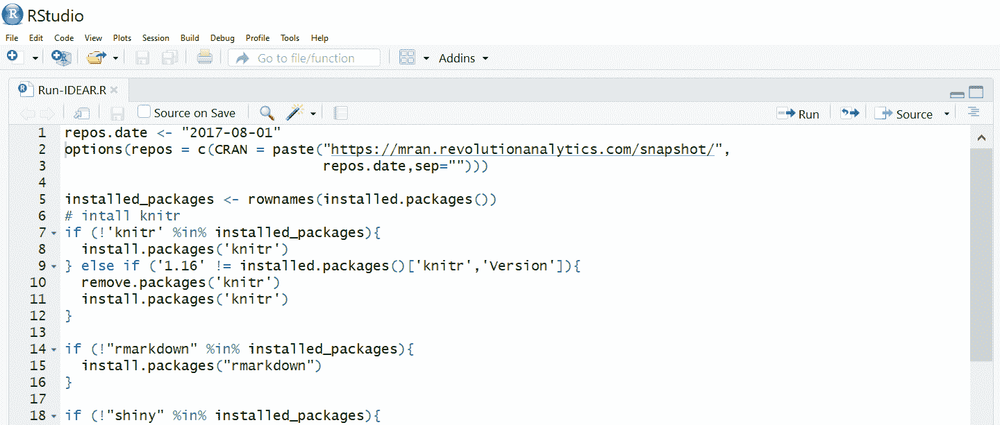

然后，将显示以下提示:

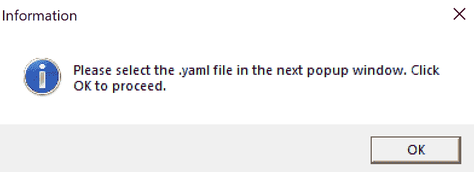

可以从以下位置加载示例文件`.yaml`。如下选择`para-adult.yaml`:

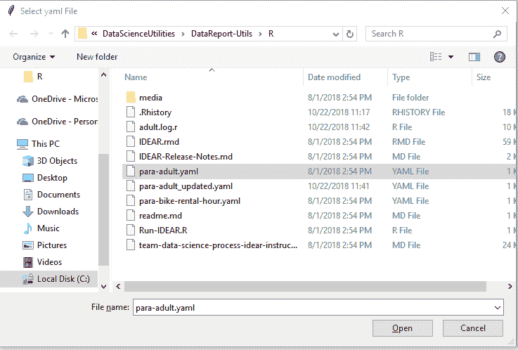

这将为 YAML 文件中描述的数据示例打开一个数据质量报告，如下面的屏幕截图所示:

您可以使用左侧的菜单浏览输出的不同部分。第一部分是任务摘要，它通过列出文件位置、不同类型变量的名称以及数据科学任务类型(例如，分类)来提供所读取文件的摘要:

点击数据摘要进入下一部分。在下面的屏幕截图中的 2.1 下，您可以通过选择所需的前 n 行来查看数据示例:

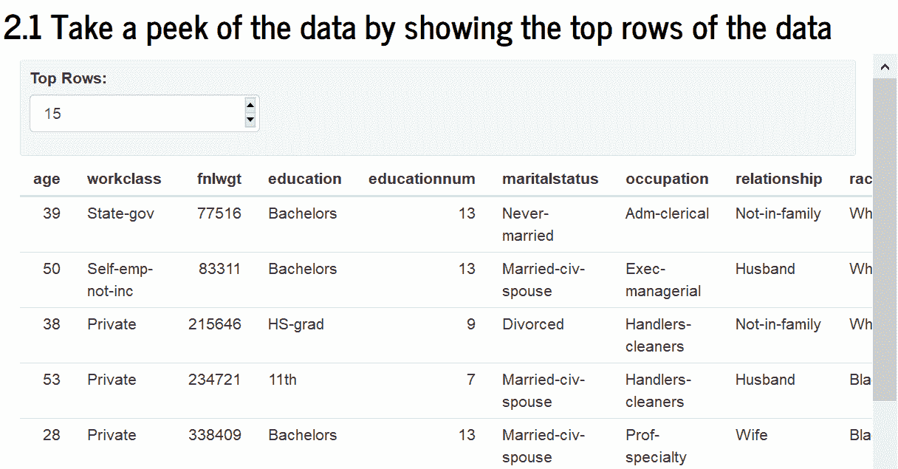

这是直观检查加载的数据是否有差异的好方法。以下屏幕截图的第 2.2 部分通过计算行数和列数显示了数据摘要:

在第 2.3 节中，报告显示了列的名称和类型，指明它们是数值型还是分类型:

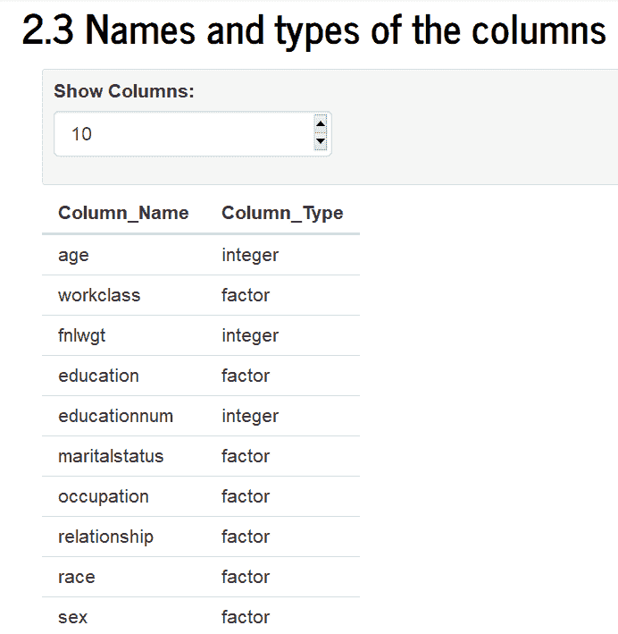

报告第 2.4 节审查了数据的质量。此报告映射每个变量的缺失数据百分比。热图格式有助于检测任何缺失的数据模式:

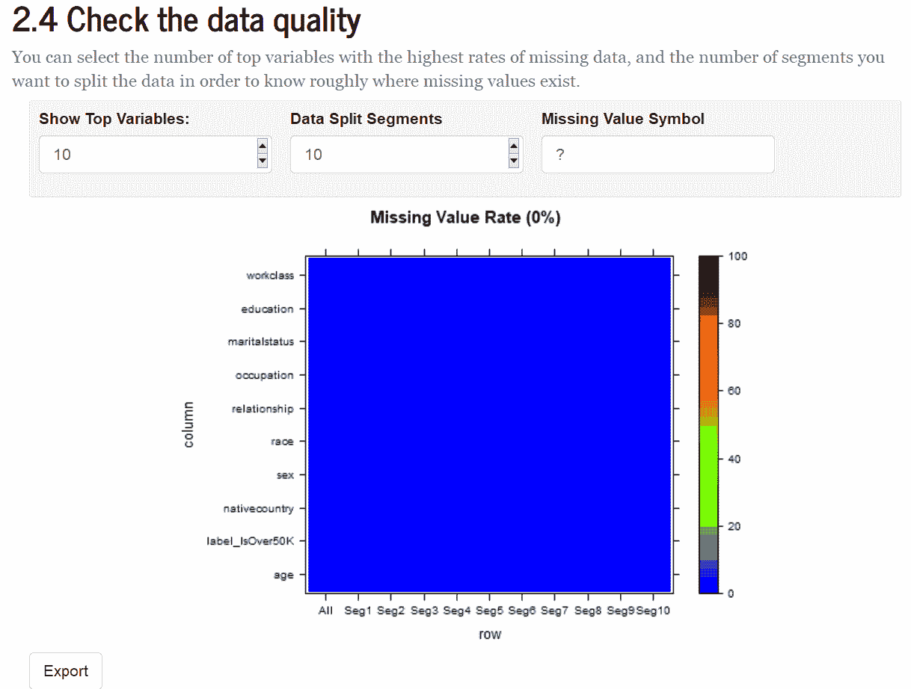

第 2.5 节通过显示数值数据的百分位数和分类数据的频率计数总结了数据的基本统计数据:

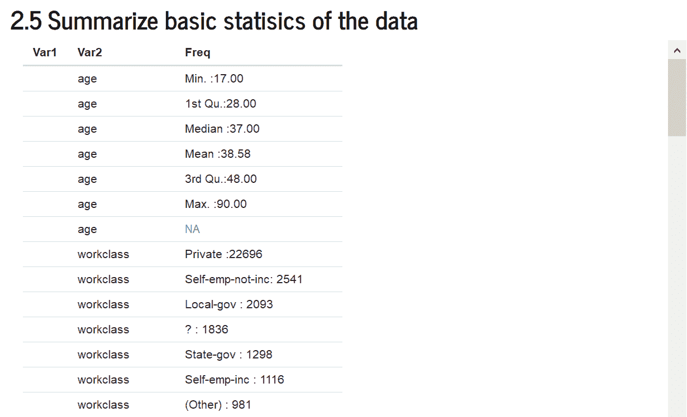

现在我们转到第 3 部分，在这里我们更深入地研究每一个单独的变量。在第 3.1 节中，您可以看到每个变量的更详细的统计数据:

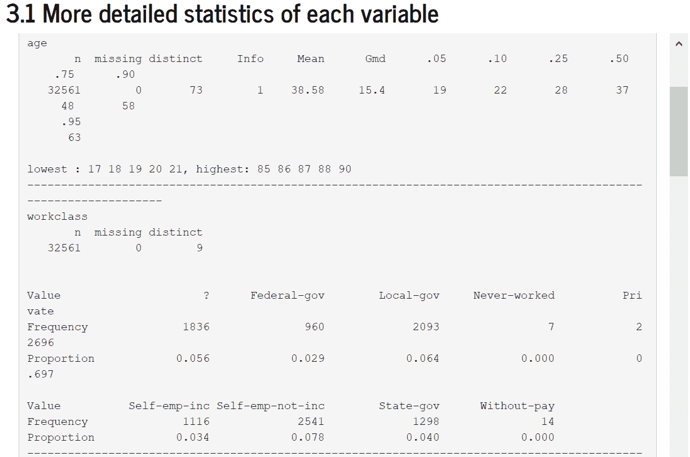

在第 3.2 节中，您可以可视化目标变量:

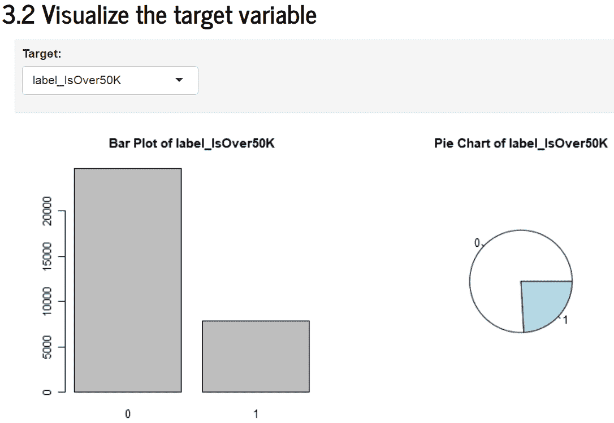

在第 3.3 节中，您可以可视化任何数值变量，并查看数据的分位数和分布:

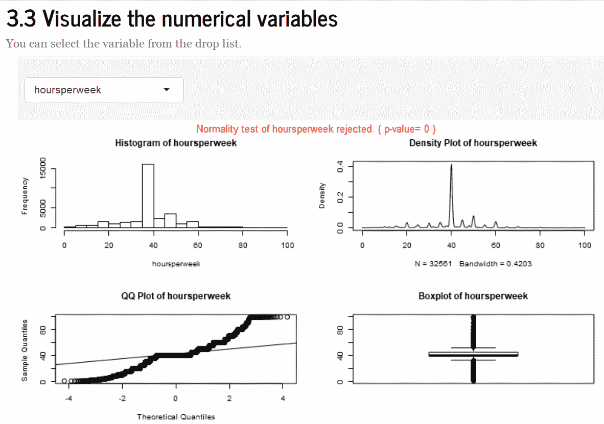

在第 3.4 节中，您可以可视化分类变量，显示其中不同类别的频率:

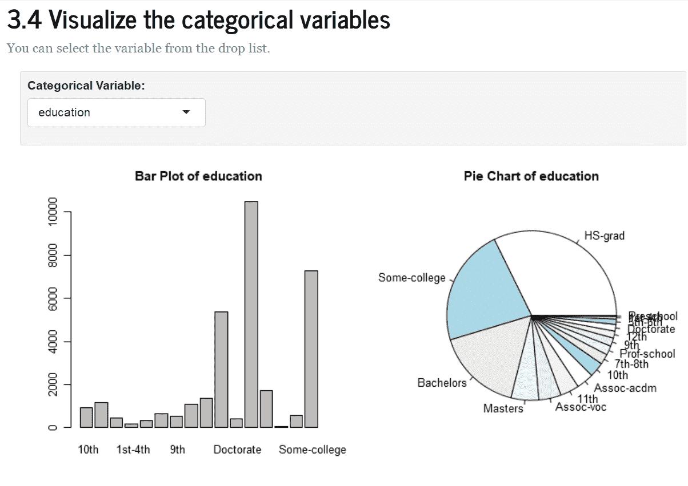

在第 4 节，报告帮助你分析不同变量之间的关系。这对于理解哪些变量对于构建模型是重要的，哪些可以被丢弃是很重要的。在第 4.1 节中，您可以相对于参考变量对变量的影响进行排序:

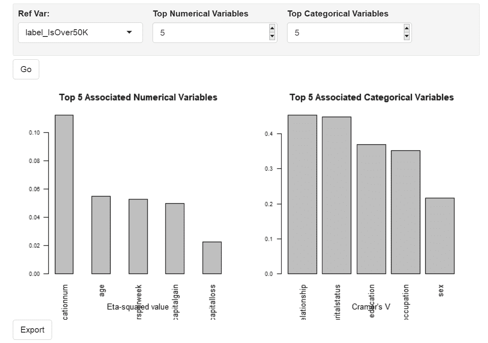

在第 4.2 节中，您可以检查两个分类变量之间的相关性。例如，在下面的图中，我们看到男性的收入比女性多:

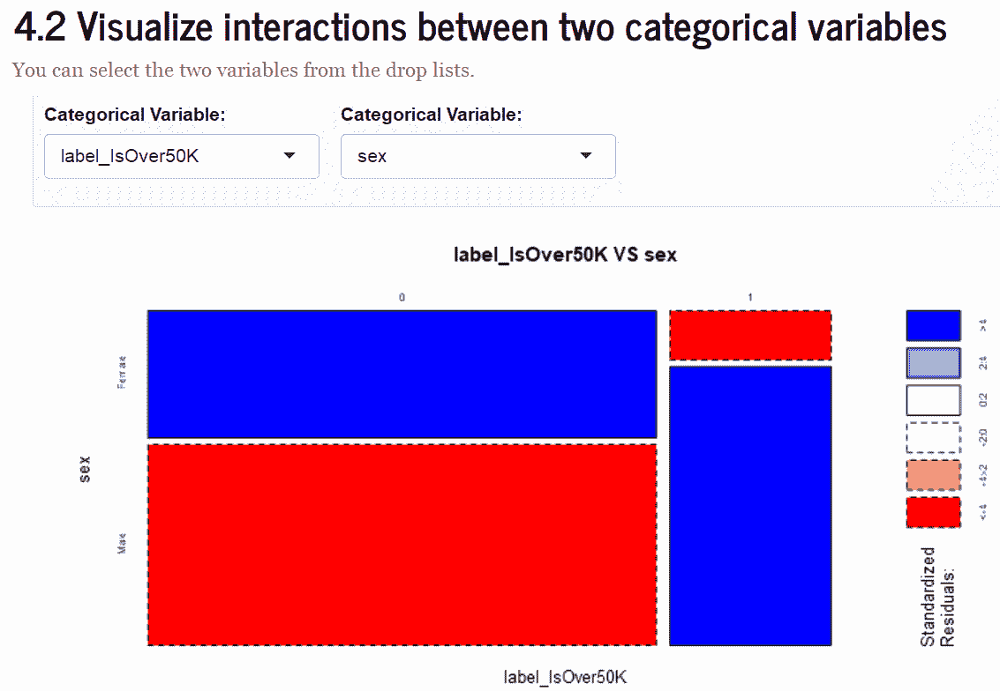

同样，在 4.3 节中，你可以看到两个数值变量之间的相互作用:

在 4.4 节中，你可以使用不同的相关方法来计算数值变量之间的相关性:

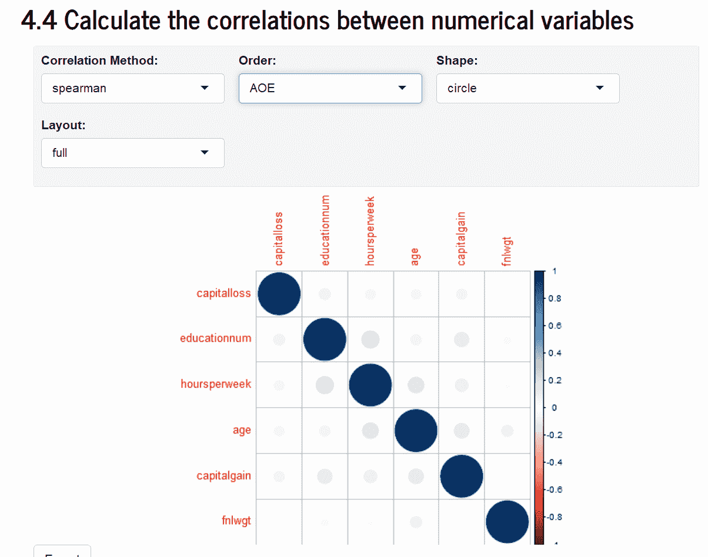

在第 4.5 节中，您可以使用箱线图可视化数值变量和分类变量之间的相互作用:

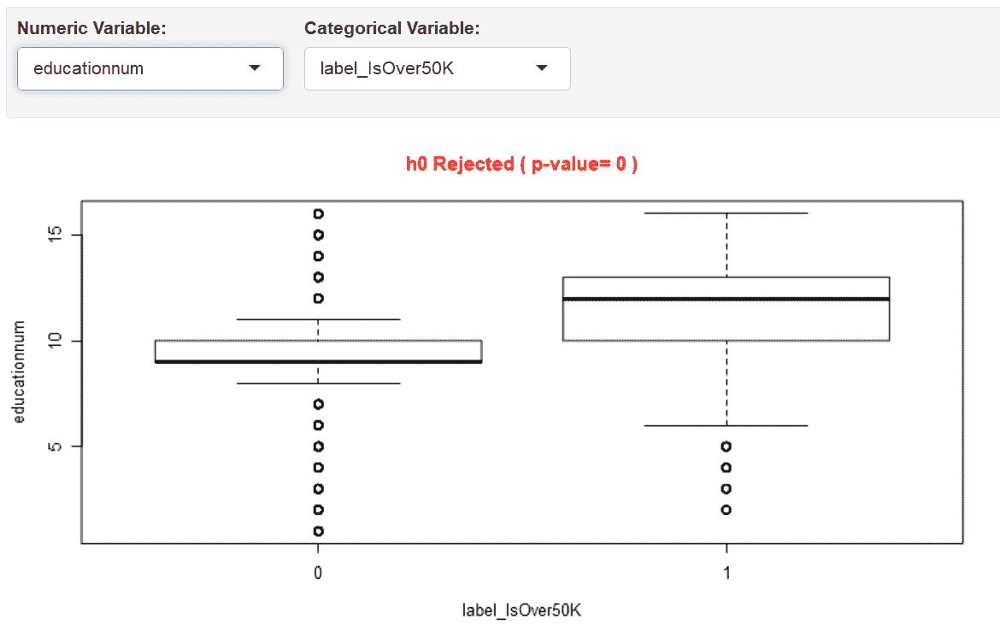

接下来的三个部分集中于多元统计。第 4.6 节利用**主成分分析** ( **PCA** )来查看数据在缩减变量空间中的分布:

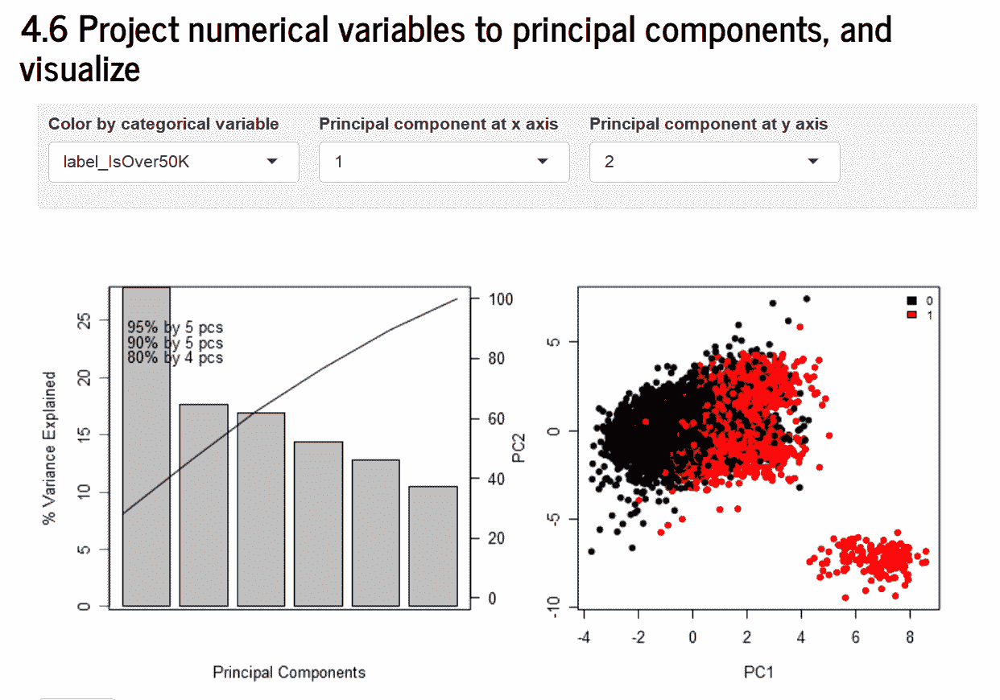

在 4.7 节中，你可以使用 t-SNE 方法将数值变量投影到 2D 空间。在第 4.8 节中，您可以将数值变量和分类变量投影到 PCA，并同时将它们可视化:

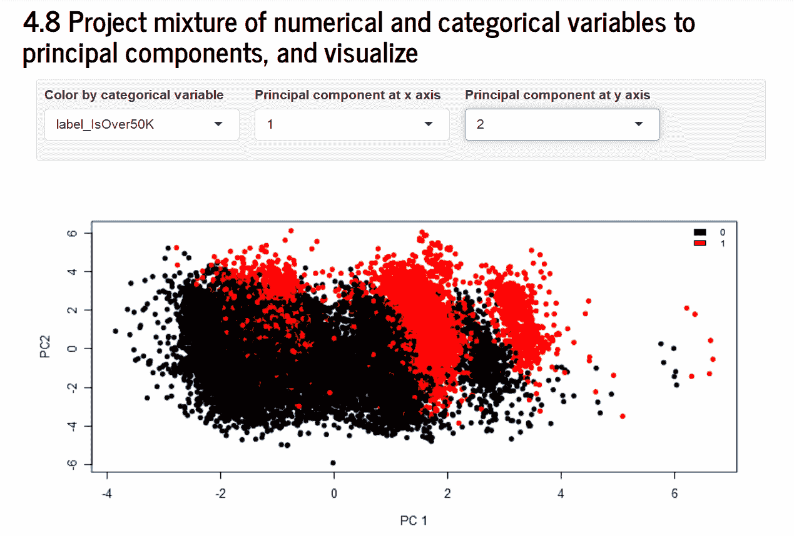

在第 5 部分中，如果您单击 Generate Report 按钮，它将创建一个摘要报告，包含前面部分中的所有摘要。

# R 中的自动化建模和报告(AMAR)

AMR 工具是一个可定制的半自动工具，内置于 R 中，用于训练和评估单个或多个机器学习模型。它具有参数扫描等功能，可以找到符合所需指标的模型。

报告生成后，将包含以下信息:

*   模型描述
*   模型评估和比较
*   特征的排序

一般而言，报告中描述的信息有助于增加以下内容:

*   特征变量的质量
*   机器学习任务的难度级别
*   后续特征工程和建模指南

AMAR 工具可在以下 GitHub 位置获得:[https://GitHub . com/Azure/Azure-TDSP-Utilities/tree/master/DataScienceUtilities/Modeling...](https://github.com/Azure/Azure-TDSP-Utilities/tree/master/DataScienceUtilities/Modeling)

# 摘要

总之，我们已经在本章中向您介绍了 TDSP，并详细介绍了每个不同的步骤。该流程旨在增强其他现有流程，而不是取代它们。我们还研究了微软提供的各种 TDSP 工具，这些工具可以更容易地在数据科学生命周期中构建一些结构。在接下来的几章中，我们将看看 Azure 中可用的每个选项，以构建满足您业务需求的 AI 解决方案。