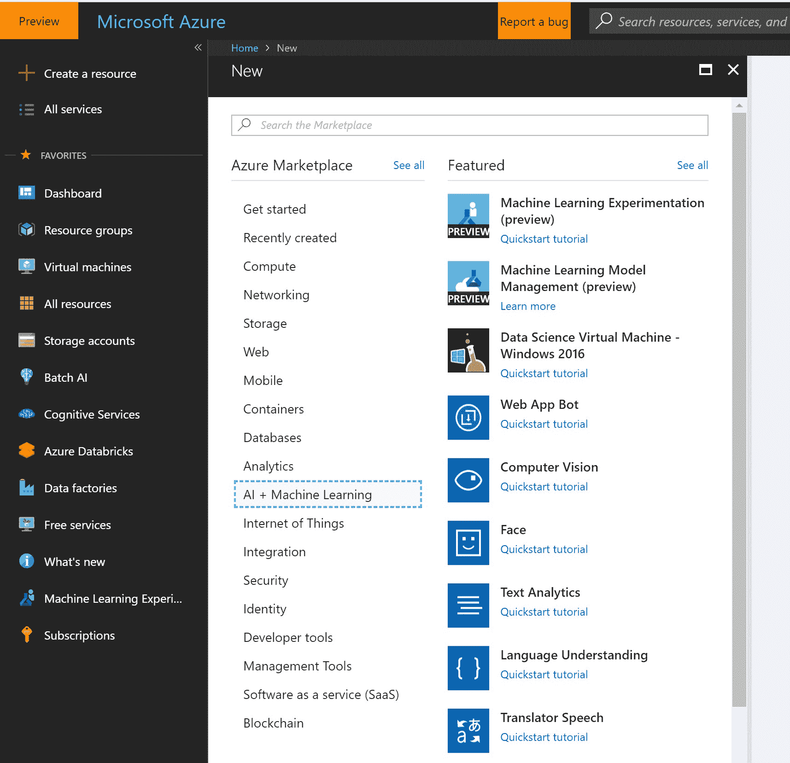
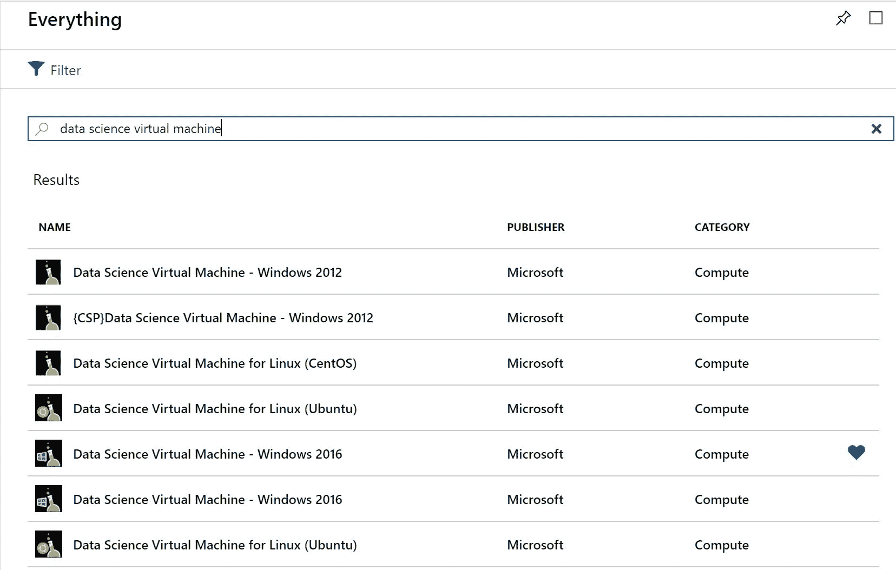
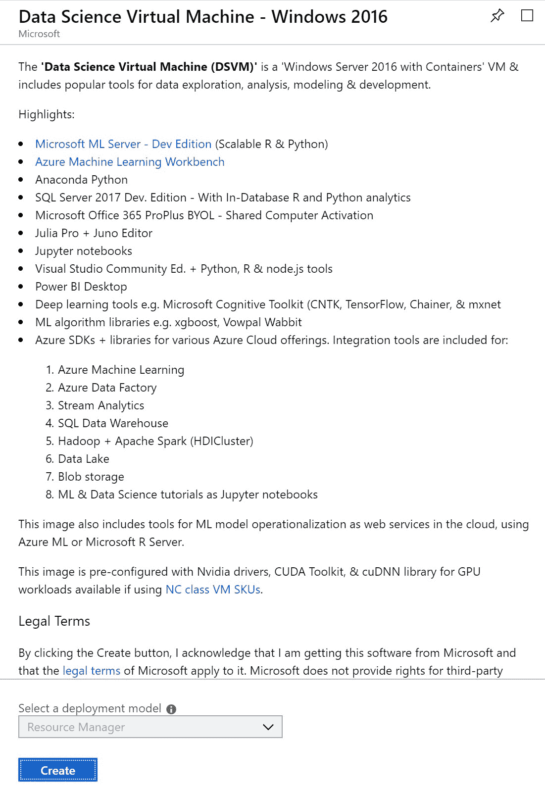
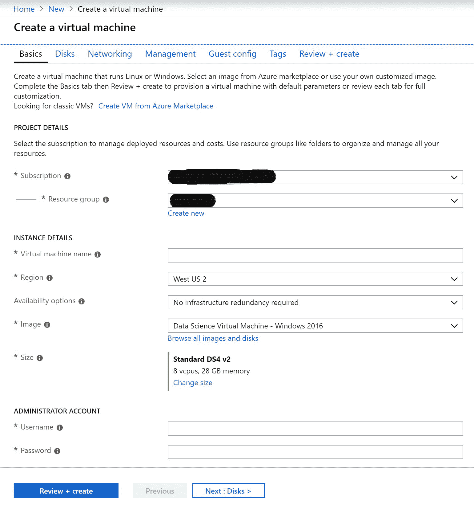
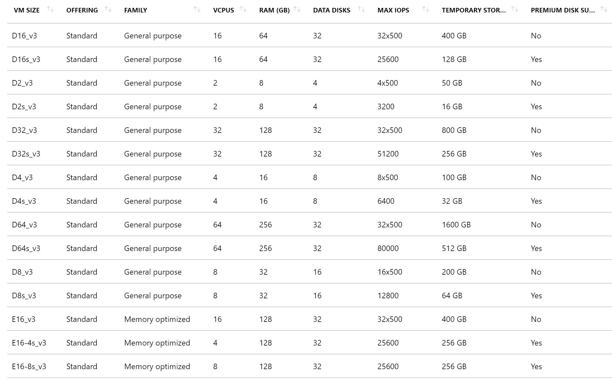
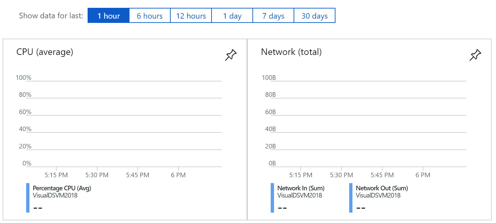
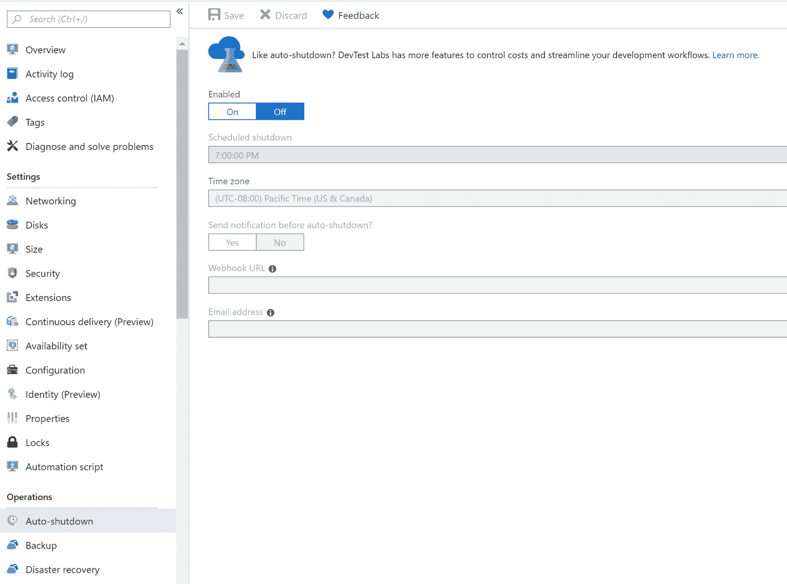
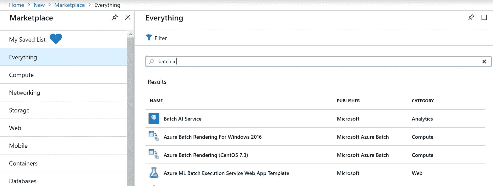

    

# 六、面向数据科学的可扩展计算

在本章中，我们将学习如何在数据科学中使用 Azure。我们将了解如何准备数据，包括清理和转换数据、创建工程特征、创建和训练机器学习模型，以及最后使用机器学习模型进行预测。

用大数据构建机器学习算法，我们需要处理大量的数据来训练它。要做到这一点，我们需要大量的计算能力。我们还需要计算能够基于负载动态扩展，以大规模服务于这些机器学习模型，以便它们可以执行预测。

在公共云出现之前的时代，我们必须事先购买所有硬件。我们不得不为这一切买单，...

# Azure 中不同的可扩展计算选项

Azure 中有两种类型的扩展可以帮助我们扩展 CPU 和/或 GPU:

*   **垂直扩展**:增加虚拟机的 CPU 内核数量和内存。
*   **水平扩展**:增加集群中虚拟机的数量，同时保持每个虚拟机的 CPU 内核和内存相同。当我们使用水平扩展时，我们可能需要编写额外的代码来使用支持的框架执行并行或分布式计算。

# DSVMs 简介

DSVM 是一个 Linux 或 Windows 容器，由流行的数据科学工具和框架组成。它可以帮助我们快速开始数据分析和数据科学。它支持许多操作系统；目前，我们可以使用 Windows 2012、Windows 2016、Ubuntu Linux 和 CentOS Linux 创建 DSVM。DSVMs 背后的想法是减少创建工作环境所需的时间。

DSVM 具有经过兼容性测试的预配置库。它每隔几个月更新一次，以便使用最新的兼容版本的工具、库和框架。它支持 GPU 虚拟机，并预装了必要的驱动程序。DSVM 还包括如何开始的教程和指南。

DSVM 是可能的...

# 调配 DSVM

现在让我们来看一下创建 DSVM 所需的步骤。在本例中，我们将创建一个 Windows 2016 DSVM，但如果您想要创建一个 Linux DSVM，步骤是类似的:

1.  在[https://portal.azure.com](https://portal.azure.com)进入蔚蓝门户。

2.  点击创建资源，然后进入 AI +机器学习，点击数据科学虚拟机–Windows 2016:

3.  或者，我们可以在 Azure 门户中搜索`data science virtual machine`:

4.  将出现一个窗口，显示您选择的 DSVM 的一些关键特征:

5.  我们可以通过提供必要的信息来快速创建 DSVM。这包括资源组、区域、用户名和密码:

6.  我们需要考虑的一个重要参数是虚拟机的大小。在这里，我们可以选择基于 CPU 和/或基于 GPU 的虚拟机。根据我们的 CPU、内存和网络需求，我们有很多选择。不同类型虚拟机的示例屏幕截图如下所示:

请稍等几分钟，Azure 将创建我们的虚拟机。一旦准备就绪，我们将在门户中收到通知。

创建虚拟机后，我们可以使用 RDP 或 SSH 来访问它，具体取决于操作系统。在 overview 窗口中，我们可以查看虚拟机运行时的不同指标，如 CPU 使用率或磁盘操作。这些指标可以帮助我们决定是否需要调整虚拟机的大小:

我们还可以使用门户中的自动关闭选项将虚拟机配置为自动关闭:

在我们登录到我们的 DSVM 之后，我们可以开始使用它的工具，就像它是我们的本地机器一样。有关每个工具的更多信息，请参考以下网站:[https://docs . Microsoft . com/en-us/azure/machine-learning/data-science-virtual-machine/provision-VM # important-directory-on-the-VM](https://docs.microsoft.com/en-us/azure/machine-learning/data-science-virtual-machine/provision-vm#important-directories-on-the-vm)。

在使用虚拟机之后，我们可以从门户中停止它，以避免支付不必要的费用。当我们将来想要使用它时，我们可以再次启动它，而不必重新创建它。

现在，我们来看一下 DSVM 的一种变体——DLVM。

# DLVM

DLVM 是一种特殊类型的 DSVM，它具有为深度学习定制的基础映像。我们可以使用 Windows 2016 或 Ubuntu Linux 作为操作系统。它预装了框架、工具和教程，可以让你快速开始深度学习。

配置 DLVM 类似于配置 DSVM。我们需要为 DLVM 选择一个基于 GPU 的 VM:

1.  去 Azure 门户搜索`deep learning virtual machine`。我们可以像创建 DSVM 一样创建 DLVM。
2.  将弹出一个窗口，要求我们提供名称并选择操作系统、用户名、密码、资源组、位置等。下一个窗口要求我们选择一个基于 GPU 的虚拟机。如以下屏幕截图所示，您所在地区不可用的虚拟机大小...

# 批量人工智能服务

DSVMs 和 DLVMs 擅长执行基于单个节点的计算。然而，在我们需要分布训练的场景中，我们可以使用 Batch AI 服务，它允许我们专注于训练，而不必担心管理集群。Batch AI 服务拥有与 DSVM 使用相同基础映像的 VM，这意味着 DSVM 中可用的所有库、工具和框架在 Batch AI 服务中也是可用的。批处理 AI 服务允许我们使用并行训练和基于 GPU 的虚拟机进行深度学习，我们还可以将 Docker 容器部署到批处理 AI 节点。当使用 Batch AI 服务时，我们可以用我们的集群挂载我们的 Azure Blob 或 Azure Data Lake 存储。这意味着我们可以用大量的数据进行训练，而不必将数据复制到集群中，因为数据可以以流的形式传输。

在撰写本文时，批量 AI 服务仅作为预览版提供，因此当该服务普遍可用时，可能会有新的功能。

# 提供批处理人工智能服务

现在让我们继续创建一个批处理 AI 服务:

1.  在 https://portal.azure.com 的[进入蔚蓝门户。转到创建资源并搜索`batch ai`:](https://portal.azure.com)

2.  在下一个屏幕中，我们可以创建我们的批处理 AI 服务。
3.  之后的屏幕要求输入名称、订阅、资源组和我们的批处理 AI 服务工作区的位置。工作区是可以添加集群、实验和文件服务器的地方。

4.  批处理 AI 集群将为你的实验提供计算能力。我们可以提供基本信息，例如虚拟机数量、虚拟机类型、用户帐户详细信息和网络...

# anticlonusindex 抗痉挛的指数

作为一名数据科学家，在我们训练了我们的机器学习模型之后，我们可能希望将模型部署为 web 服务，以进行实时或批量评分。当我们训练我们的机器学习模型时，我们使用一定的框架和库。在大多数情况下，相同的环境应该在我们的部署环境中可用。容器是创建这样一个环境的快速而简单的方法，在这个环境中，我们可以托管我们的模型和依赖项。使用 ACI 可以很容易地创建容器。作为数据科学家，我们可以使用 AML 将我们的机器学习模型作为 web 服务部署到 ACI。这样，我们可以开发测试我们的模型，然后在生产中部署它。有关 ACI 的更多详情，请参考以下网站:[https://docs . Microsoft . com/en-us/azure/container-instances/container-instances-overview](https://docs.microsoft.com/en-us/azure/container-instances/container-instances-overview)。

# 问

Kubernetes 是一个开源项目，用于管理托管在容器中的应用程序。AKS 是一个受管理的 Kubernetes 服务，它使使用 Kubernetes 变得很容易。一旦你测试了你的机器学习模型，你就可以用 AKS 把它部署到一个可扩展的集群。然后，您就可以为您的机器学习模型提供可伸缩的 web 服务。您可以使用 AML 将您的模型部署到 AKS。有关 AKS 的更多详情，请参考以下网站:[https://docs.microsoft.com/en-us/azure/aks/intro-kubernetes](https://docs.microsoft.com/en-us/azure/aks/intro-kubernetes)。

# 摘要

在本章中，我们了解了不同类型的计算选项，可用于扩展您的机器学习训练和部署。我们了解了垂直和水平扩展计算选项，这些选项可用于为您的机器学习项目提供大量计算能力。

在下一章中，我们将了解机器学习服务器，它可用于内部部署。