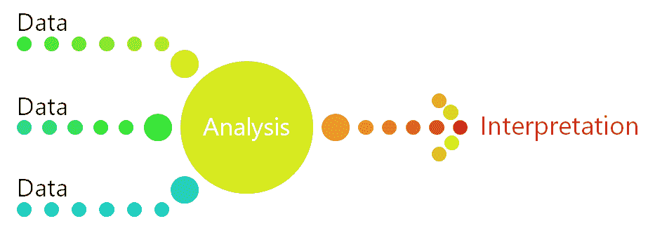

    

# 机器学习服务器

Microsoft ML Server 及其在 SQL Server 和 HDInsight 中的功能是本章的主题。此外，本章还将介绍 ML Server 的使用，以展示使用它的最佳情况以及如何使用它部署解决方案。

分类算法是监督学习算法，这意味着它们基于一组示例进行预测。

通常，使用数据来预测类别是很有用的，这就是所谓的分类。举个例子，吴恩达把 YouTube 上的内容分类为猫的视频，或者不是猫的视频。正如在吴恩达的著名作品中，当只有两个选择时，它被称为两类...

# 微软 ML 服务器是什么？

微软 ML Server 为你的数据带来了机器学习和人工智能。它使您有可能在企业环境中拥有支持智能应用的数据，这种环境提供了开源的机会，并具有微软软件的安全性和可靠性。Microsoft ML Server 提供了一个企业级平台，用于清理、建模和分析大规模数据。它允许组织变得洞察驱动，允许您分析 SQL 中的数据，并提供对 Python 和 r。

ML Server 满足了从业务用户到数据工程师和数据科学家的所有数据分析人员的需求。借助 SQL、Python 和 R，企业可以确保有机会使用世界上最常见和最常用的语言来分析他们的数据，从而为企业提供基于数据的创新机会。有了 Microsoft ML Server，R、SQL 和 Python 的可用性将开源和专有世界的精华融合在一起，带来了真正的数据科学。

微软 ML 服务器过去被称为微软 R 服务器。为了继续这种使数据民主化的努力，R 支持建立在以前版本的 Microsoft R Server 和 Revolution R Enterprise 产品的基础上。

随着微软 ML Server 的出现，每个版本都有显著的机器学习和人工智能功能增强。Python 支持是在最新版本中添加的。ML 服务器支持基于 Python 的分析的完整数据科学生命周期。

此外，ML Server 支持操作化，因此您可以将您的模型部署到可伸缩的网格中，以进行批处理和实时评分。这意味着你可以通过机器学习过程，然后设置你的模型供组织中的每个人使用。这才是真正的人人数据民主化！

微软 ML 服务器解决什么问题？微软 ML 服务器可以帮助解决许多不同的，现实生活中的业务问题。它可以在端到端的流程中处理数据。例如，它可以清理和预处理更大的数据集，以便下游系统可以使用这些数据来产生洞察力。HDInsight 有许多有用的例子，例如:

*   情感分析
*   网站流量模式
*   天气相关效应
*   销售分析
*   客户分析
*   **物联网**项目

接下来，我们将看看如何开始使用 Microsoft ML Server。

# 如何开始使用 Microsoft ML 服务器

微软 ML Server 入门，推荐使用微软**数据科学虚拟机** ( **DSVM** )。

DSVM 是一个特别构建的定制虚拟机，托管在微软的 Azure 云上。它是专门为数据科学设计的，旨在帮助学习器快速学习这项新技术。它预安装和预配置了 Microsoft ML Server，因此您可以立即开始数据科学项目。

您可以使用 R 和 Python 等语言在 Microsoft DSVM 上进行数据分析。它非常适合原型制作，是一个有用的学习工具，可以让学习器在过程的早期就为成功做好准备。

# 配置 DSVM

需要配置创建 Microsoft DSVM 的向导。选项如下所示:

*   **名称** : 给 DSVM 一个名称。
*   **VM 磁盘类型**:选择 SSD 或者 HDD。
*   **用户名**:指定登录的管理员账号 ID。
*   **密码**:指定管理员账号密码。
*   **订阅**:如果您有多个订阅，请选择要创建机器并对其计费的订阅。
*   **资源组**:可以创建新的资源组，也可以使用现有的资源组。
*   **位置**:选择最合适的数据中心。对于最快的网络访问，数据中心拥有您的大部分数据或离您的实际位置最近。
*   **尺寸**:选择一种符合您的功能要求和成本限制的服务器类型。有关虚拟机大小的更多选择，请选择查看全部。
*   **设置**:
    *   使用被管理的磁盘。如果您希望 Azure 管理虚拟机的磁盘，请选择“托管”。否则，您需要指定一个新的或现有的存储帐户。
    *   其他参数。您可以使用默认值。如果要使用非默认值，请将鼠标悬停在信息链接上，以获取特定字段的帮助。
    *   配置完设置后，下一步是检查并验证您输入的所有信息是否正确。然后，选择 Create，DSVM 将在 Azure 中设置。

现在 DSVM 已经设置好了，让我们看看在 Microsoft ML Server 中使用 Python 的机会。

# 用 Python 进行机器学习

Python 有很多机器学习功能。Python 中最常用的机器学习库之一是 scikit-learn 库。它用于创建、训练和评估模型。在这本动手操作的书中，代码中使用了 Python scikit-learn 库来训练和评估模型。

# Python 入门

Python 是一种流行的编程语言，正在迅速获得全世界的认可。Python 有很多长处；它可靠、灵活、易学易用，并且可以在所有操作系统上免费使用。它已经被开源社区广泛采用，并得到了强大的开发人员社区的支持。Python 有许多免费的库供您下载并在您的数据科学工作中使用。

Python 在开发者所在的地方与他们相遇；它支持所有不同类型的开发，包括 web 应用程序、迭代开发、web 服务、桌面应用程序、脚本、科学和数学计算。Python 被企业以及许多大学、科学家、临时开发人员和专业开发人员等使用。

在本章中，Python 编码将使用 Microsoft Visual Studio 来完成，它在 Windows 上集成了一个强大的 Python IDE。Visual Studio 通过 Python 开发和数据科学工作负载(Visual Studio 2017)和免费的**Python Tools for Visual Studio**(**PTVS**)(Visual Studio 2015 及更早版本)，为 Python 语言提供开源支持。

使用 DSVM，我们可以清理、建模、分析和可视化我们的数据，并使用 Microsoft ML Server 和 Python 开发模型。

对于 Python，有很多常见的开发工作室。由于本章将使用 R 和 Python，我们将使用 Visual Studio Community edition，因为它同时具有 R 和 Python IDEs。对于本章的实践部分，DSVM 已经预安装了 PTVS 扩展和 R 扩展，因此我们没有必要花费时间来安装和配置这些附加项目。

# 在 Visual Studio 中设置 Python 环境

需要对 Visual Studio 进行配置，以便它可以将 Python 与 Microsoft ML Server 一起使用。这是第一步，只需要进行一次。

在 Visual Studio 中，选择视图|其他窗口| Python 环境菜单命令。

我们将创建一个`cookiecutter` Python 项目。为此，首先，我们需要安装`cookiecutter`。

打开命令提示符，键入以下命令:

```
easy_install --user cookiecutter
```

然后，我们可以继续使用 Visual Studio 中的`cookiecutter`功能，开始使用 Python 和 Visual Studio。

在本练习中，代码将来自微软的一个存储库，它存储在 GitHub 上。

1.  在 Visual Studio 中，选择文件|...

# 在 Microsoft ML Server 中用 Python 编写自己的代码

在上一节中，有一个端到端的例子，展示了在 Microsoft ML Server 中使用 Python 进行机器学习的能力。在这个实践演练中，将探索如何使用 Microsoft ML Server 从头开始编写 Python 代码。

# 演练:在 Microsoft ML Server 中读入和输出数据

在本次实践演练中，将使用相同的 Iris 数据集提供更多使用熟悉数据集的示例。该代码的目的是显示一个内置数据集，并将其读出到 Python 输出屏幕。

在本演练中，我们将从 Microsoft ML Server 中读取数据。最初，代码从 scikit-learn 库中导入 Iris 数据集。初始代码将打印出 Iris 数据集中的数据。数据被分配给设置为数据帧的`df`变量。

概括来说，下面是我们将如何继续进行的一系列步骤:

*   它从 scikit-learn 库中导入虹膜数据集
*   熊猫图书馆是进口的，...

# 在微软 ML 服务器中引入 Python 回归

在本例中，再次使用 Iris 数据集，因为它已经是 Python 安装的一部分。在这段 Python 代码中，Python Seaborn 库用于生成图表和图形。Seaborn 是一个 Python 包，它允许我们产生有趣的结果，这些结果可以帮助我们的机器学习工作。

在下一个演示中，将修改代码以生成更多的图表，并将它们保存到 DSVM 上的 Git 存储库中。

在高层次上，代码使用 Iris 数据集，并根据数据生成图表。在最后一个图中，为了清晰起见，添加了线性回归线。

图表显示了三种鸢尾属植物的萼片长度和花瓣长度之间的关系。数据按颜色分组，可以清楚地看到线性回归线适合三个物种中的每一个。

在最简单的调用中，Seaborn `lmplot`函数绘制了两个变量`x`和`y`的散点图，然后拟合回归模型`y` ~ `x`。它绘制了结果回归线和该回归的 95%置信区间。在这里的例子中，对每个物种都进行了测试。

代码的底层注释如下:

第一步是加载虹膜数据集:

```
iris = sns.load_dataset("iris")
```

然后，设置配色方案:

```
colours = ['#066082', '#b12acf', '#808080']
```

该代码将使用 Iris 数据集生成一个联合图:

```
sns_pairplot = sns.pairplot(iris, hue='species', size=2.5,palette=colours)
```

下一步是将输出保存到图像，然后生成一个图:

```
sns_pairplot.savefig("Packtpairplotoutput.png")
print("Produced Pairplot Image")
```

这段代码将使用 Iris 数据集生成一个`jointplot`:

```
sns_jointplot = sns.jointplot(x="sepal_length", y="petal_length", data=iris);
```

接下来，我们将输出保存到图像:

```
sns_jointplot.savefig("Packtjointplotoutput.png")
```

然后，我们将成功反馈给用户:

```
print("Produced Jointplot Image")
```

此代码将使用 Iris 数据集生成一个线性回归图:

```
sns_lmplot = sns.lmplot(x='sepal_length', # X-axis name y='petal_length', # Y-axis name data=iris, fit_reg=True, hue='species', # one colour per iris species scatter_kws={"s":100}, size=8, palette=colours)
```

然后将输出保存到图像中:

```
sns_lmplot.savefig('PacktLinearRegression.jpeg', bbox_inches='tight')
```

然后，我们通过控制台向用户反馈成功:

```
print("Produced Linear Regression Image")
```

执行脚本时，可以在 Visual Studio repository 文件夹中找到图像文件。这是一个在存储库文件夹中可以找到图像的例子:`C:\Users\myusername\source\repos\Python Packt Example\Python Packt Example`。

# Python 和微软机器学习服务中的更多数据可视化图表

代码还将生成另外两个图表:一个 pairplot 和一个 jointplot。

pairplot 用于绘制数据集中的成对关系。pairplot 采用变量，如花瓣宽度、花瓣长度、萼片宽度和萼片长度，并将它们相互关联。在 Microsoft ML Server 中使用 Python 可以非常快速地生成输出。可视化使得数据中的模式可以很快被看到。例如，花瓣长度和花瓣宽度之间有一个有趣的关系，这可以从 pairplot 的下一行看到。

在 Seaborn 中，jointplot 用双变量和单变量图形绘制两个变量的图。这是生产的...

# Python 和 Microsoft ML Server 的回归代码演练

我们将通过注释掉现有的 Python 代码来更改文件，并且我们可以将新代码添加到同一个文件中。知道如何注释掉代码很重要，这样代码才是可读和可维护的:

1.  通过在每一行的开头插入一个散列符号`#`，注释掉现有的 Python 代码。
2.  代码应该如下所示:

```
 # from sklearn import datasets
# import pandas as pd
# iris = datasets.load_iris()
# df = pd.DataFrame(iris.data, columns=iris.feature_names)
```

3.  将前面给出的代码复制到文件中。该文件应该如下面的屏幕截图所示，为了清楚起见，只显示了一些代码:


4.  若要运行代码，请在解决方案资源管理器中单击该文件，使其突出显示。
5.  单击开始按钮。
6.  代码将会执行，Python 解释器将会出现。这里有一个例子:


7.  代码执行完毕后，按照指示按任意键继续。
8.  搜索 DSVM 上的存储库文件夹，以查找 Python 代码生成的图像。如果您不清楚存储库的位置，搜索`*.png`，您将找到完整的文件。
9.  通过转到 Visual Studio 菜单栏中的文件|全部保存来保存您的工作。

# 分析机器学习模型中的结果

任何数据都没有脱离上下文的意义。机器学习是理解数据的前进方向，但它也需要被解释。在很高的层面上，这个过程可以描述如下:



数据需要理解；数据经过一个分析过程。精确度和性能之间可能存在折衷。有时，为了获得更好的性能，最好选择精度较低的算法。选择更近似的方法的另一个优点是，它们自然倾向于避免过度拟合。

解释统计数据没有唯一的最佳方法...

# 衡量模型的拟合度

模型的预测实际上与观察到的数据有多匹配？了解给定观察的预测响应值与该观察的实际响应值的接近程度至关重要。

在回归中，最常见的度量是**均方误差** ( **MSE** )，它是估计值和实际估计值之间的平均平方差。如果 MSE 很小，那么预测响应非常接近真实响应。如果 MSE 很大，那么预测的和真实的响应会有很大的不同。这是表明模型不适合的第一步。

请注意，分析的重点是 MSE 测试数据，而不是训练数据的 MSE。最有趣的结果使用了模型以前没有见过的测试数据，这是我们集中分析 MSE 结果的地方。

# 交互效度分析

当我们测试和训练我们的模型时，MSE 可以在不同的数据集之间变化很大。因此，交叉验证对于理解真实结果非常重要。交叉验证试图展示该模型在实践中是如何工作的。问题是:我们的模型会推广到一个独立的数据集吗？

为了进行交叉验证，模型被不断地训练，然后给它一系列测试数据集。交叉验证结合了适合度的度量并对它们进行平均，以便获得模型预测性能。

# 方差和偏差

我们所说的结果的方差和偏差是什么意思？方差是指如果使用不同的训练数据集进行估计，预测值将发生的变化量。在整个训练过程中，不同的训练数据集将产生不同的预测，但希望训练集之间的预测不会变化太大。

偏差是指将现实生活中的问题简化为数据集所带来的误差。通过将数据简化为更简单的模型，可能会引入偏差。当我们审视现实生活的复杂性时，这是一个在解释结果时需要理解和考虑的常见问题。

# 摘要

在本章中，我们研究了 Visual Studio for Python，并进行一些有趣的演练。我们已经了解了使用**团队数据科学流程**(**)的建模流程。作为这个过程的一部分，我们研究了建模和分析我们的结果，以及进行数据可视化来宣传我们的工作。**