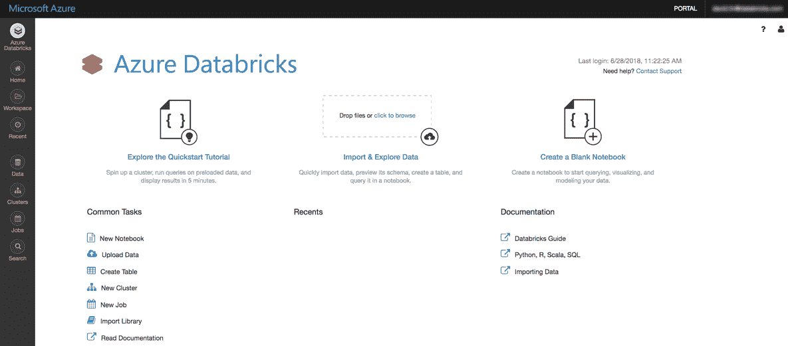
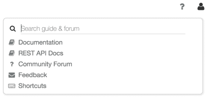
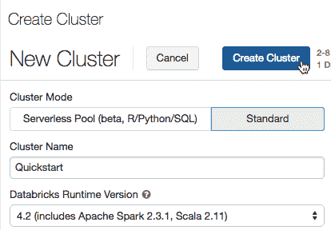
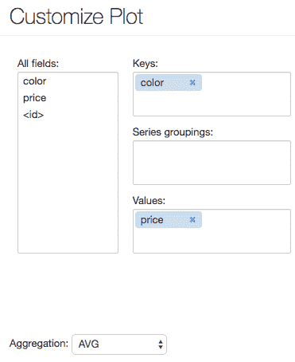
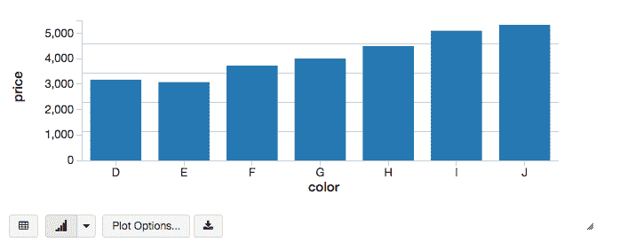
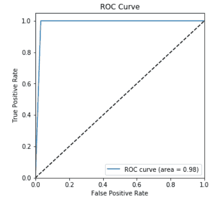

    

# 使用 Spark 的机器学习

本章涵盖了 Spark 在微软平台上的使用，还将提供如何使用 Spark 训练 ML 模型的演练，以及 Azure 中可用于执行基于 Spark 的 ML 训练的选项。

我们将讨论以下主题:

*   带有 Azure 数据块的 ML
*   带 Spark 的 Azure HDInsight
*   一些实验室的演练，以便您可以看到激动人心的技术在发挥作用

# 使用 Azure Databricks 进行机器学习

通过采用 ML，企业希望改善他们的业务，甚至通过使用数据作为数字化转型的命脉来彻底转变 it。Databricks 通过在 Azure 中提供完全集成的统一分析平台，使公司能够快速发展其数据科学能力，并将其转化为竞争优势。

企业希望利用他们历史上收集的数据宝库。组织最近开始收集更多的数据。这包括各种形式的数据，包括来自物联网设备和机器的点击流、网络日志和传感器数据形式的新客户数据，以及音频、图像和视频。

利用从这些数据中获得的洞察力，各种垂直行业的企业可以以影响我们日常生活的许多不同方式改善业务成果。这些包括医疗诊断、欺诈检测、检测网络攻击、优化生产流程、客户参与等。

Databricks 提供了一个统一的分析平台，将数据工程师、数据科学家和企业聚集在一起，在数据生命周期中进行协作，从 ETL 程序开始，一直到为生产环境构建分析应用程序。

数据工程师可以使用 Databricks 的 ETL 功能从各种来源创建新的数据集，包括结构化、半结构化和非结构化数据。数据科学家可以从各种编程语言中进行选择，如 SQL、R、Python、Scala 和 Java，以及包括 Scikit-learn、Apache Spark ML、TensorFlow 和 Keras 在内的**机器学习** ( **ML** )框架和库。

Databricks 允许企业使用 Databricks 的笔记本和可视化功能，以协作的方式探索数据、创建和测试他们的模型。交付时间很快，将 ML 管道投入生产的过程也很快。

# Databricks 试图解决哪些挑战？

整合数据总是很困难。然而，在 ML 中集成的挑战更加困难，因为需要集成各种框架和库。

Databricks 专注于数据科学平台在安全性和可管理性方面的企业就绪性。

我们如何开始使用 Apache Spark 和 Azure Databricks？第一步是在 Azure 中安装 Azure Databricks 软件。

# Apache Spark 和 Azure Databricks 入门

在本演练中，我们将开始探索 Azure Databricks。这个过程中的一个关键步骤是建立一个 Azure Databricks 的实例，这将在下面介绍:

1.  登录 Azure 门户网站([https://portal.azure.com/](https://portal.azure.com/))。
2.  选择+创建资源|分析| Azure 数据块。
3.  在 Azure Databricks 服务对话框中，提供工作区配置。
4.  工作区名称:
    *   输入 Azure Databricks 工作区的名称
5.  订阅:
    *   选择您的 Azure 订阅
6.  资源组:
    *   创建新的资源组([https://docs . Microsoft . com/en-us/azure/azure-resource-manager/resource-group-overview](https://docs.microsoft.com/en-us/azure/azure-resource-manager/resource-group-overview))或使用现有的资源组

7.  位置:
    *   选择一个地理区域([https://docs . azuredatabricks . net/administration-guide/cloud-configuration s/regions . html](https://docs.azuredatabricks.net/administration-guide/cloud-configurations/regions.html))
8.  定价等级:
    *   选择一个定价层([https://azure . Microsoft . com/en-us/pricing/details/data bricks/](https://azure.microsoft.com/en-us/pricing/details/databricks/))。如果您选择**试用版(Premium - 14 天免费 DBUs)** ，工作区可以访问免费的 Premium Azure data brick DBUs 14 天。
9.  选择**固定到仪表板**然后点击**创建**。门户将显示正在进行的部署。几分钟后，将显示 Azure Databricks 服务页面，如下图所示:



在左侧，您可以访问基本的 Azure 数据块实体:工作区、集群、表、笔记本、作业和库。

工作区是一个特殊的根文件夹，用于存储您的 Azure 数据块资产，如笔记本和库，以及您导入的数据:



# 创建集群

集群是 Azure 数据块计算资源的集合:

1.  要创建一个集群，点击侧边栏中的**集群**按钮，然后点击**创建集群** **之三**:



2.  在**新集群**页面上，指定集群名称。
3.  在 Databricks 运行时版本下拉列表中选择 4.2(包括 Apache Spark 2.3.1、Scala 11)。
4.  单击创建集群。

# 创建数据块笔记本

笔记本是在 Spark 集群上运行计算的单元的集合。要在工作区中创建笔记本，请按照下列步骤操作:

1.  在边栏中，点按“工作区”按钮。
2.  在`Workspace`文件夹中，选择创建笔记本:


3.  在创建笔记本对话框中，输入名称并在**语言**下拉菜单中选择 SQL。
4.  单击创建。笔记本打开，顶部有一个空单元格。

# 在 Azure 数据块中使用 SQL

在本节中，您可以运行 SQL 语句来创建表，并使用 SQL 语句处理数据:

1.  将此代码片段复制并粘贴到笔记本单元格中，以查看 Azure Databricks 数据集的列表:

```
display(dbutils.fs.ls("/databricks-datasets"))
```

2.  代码如下所示:

```
DROPTABLEIFEXISTS diamonds;CREATETABLE diamondsUSING csvOPTIONS (path "/databricks-datasets/Rdatasets/data-001/csv/ggplot2/diamonds.csv", header "true")
```

3.  按下 *Shift* + *Enter* 。笔记本自动连接到您在*步骤 2* 中创建的集群，创建表格，加载数据，并返回`OK`:


4.  接下来，您可以运行 SQL 语句...

# 显示数据

按颜色显示钻石平均价格图表:

1.  单击条形图图标
2.  单击绘图选项
3.  将颜色拖到关键帧框中
4.  将价格拖到值框中
5.  在聚合下拉列表中，选择 AVG:



6.  单击应用显示条形图:



# 使用 HDInsight 进行机器学习

Apache Spark 是数据处理领域最大的开源进程。自发布以来，Apache Spark 已经被各行各业的企业迅速采用。Apache Spark 是一个快速的内存数据处理引擎，具有优雅且富于表现力的开发 API，允许数据工作者高效地执行流。此外，Apache Spark 还简化了需要快速迭代访问数据集的 ML 和 SQL 工作负载。

本章的重点是 Apache Spark，这是一个用于快速、大规模数据处理和 ML 的开源系统。

Data Science 虚拟机为您提供了 Apache Spark 平台的独立(单节点进程内)实例。

# 什么是火花？

Spark 是一个高性能、通用的计算引擎，用于快速、大规模的大数据处理。Spark 的工作原理是将其工作负载分布在集群中的不同节点上。Spark 可横向扩展以处理大量数据。Spark 的目标是大数据批处理，非常适合使用低延迟、高性能数据作为运营基础来进行分析。

Apache Spark 由 Spark 核心和一组库组成。核心是分布式执行引擎，Java、Scala 和 Python APIs 为分布式 ETL 应用程序开发提供了一个平台。这使得开发人员可以通过用 Java、Scala 或 Python 编写应用程序来快速获得成功。

Spark 建立在一个**弹性分布式数据集** ( **RDD** )的概念之上，自 Spark 成立以来，这一直是 Spark 处理数据的核心概念。rdd 类似于 r 中的数据帧。rdd 是数据的高级抽象，为数据科学家提供了检索和处理数据的模式。rdd 是表示数据集的不可变集合，具有内在的可靠性和故障恢复能力。rdd 根据任何操作(比如转换或操作)创建新的 rdd。它们还存储用于从故障中恢复的沿袭。例如，可以将数据分离到数据集中适当的字段和列，这意味着数据科学家可以更直观地使用它们。

Spark 流程包括多个步骤，可能涉及多个 RDD。因此，在处理过程中可能会有多个 RDD。下面是一个例子，它展示了 rdd 如何成为不同处理步骤的源和输出:


Apache Spark 允许复杂的数据工程，它内置了一组 80 多个高级操作符。除了更长的处理时间，还可以在 shell 中交互查询数据。除了 Map 和 Reduce 操作，它还支持 SQL 查询、流数据、ML 和图形数据处理。

开发人员可以独立使用这些功能，也可以将它们组合在一个数据管道用例中运行。

Spark 支持一堆库，包括 SQL 和 data frames([https://spark.apache.org/sql/](https://spark.apache.org/sql/))、ML 的 ML lib([https://spark.apache.org/mllib/](https://spark.apache.org/mllib/))、GraphX([https://spark.apache.org/graphx/](https://spark.apache.org/graphx/))和 Spark Streaming([https://spark.apache.org/streaming/](https://spark.apache.org/streaming/))。您可以在同一个应用程序中无缝地组合这些库。

在本章中，rdd 将是 ML 练习的重点。我们将集中使用 Jupyter 笔记本进行动手练习。Jupyter 笔记本在 Data Science 虚拟机上可用，默认情况下作为 Spark 的 Azure HDInsight 部署的服务安装。

# HDInsight 和 Spark

Apache Spark 是一个开源并行处理框架，支持内存处理，以提高大数据分析应用程序的性能。HDInsight 上的 Apache Spark 集群与 Azure Storage (WASB)以及 Azure Data Lake Store 兼容。

当开发人员在 HDInsight 上创建 Spark 集群时，已经创建了 Azure 计算资源，并安装和配置了 Spark。在 HDInsight 中创建一个火花簇只需要 10 分钟左右。要处理的数据存储在 Azure 存储或 Azure 数据湖存储中。

Apache Spark 为内存集群计算提供了原语，这意味着它是 HDInsight 的完美合作伙伴。Apache Spark 作业可以加载和缓存数据...

# Apache Spark 中的纱线操作系统

YARN 是 Apache Software Foundation 开源分布式处理框架的第二代 Hadoop 2 版本中的关键特性之一，在 Hadoop 版本 3 中得到了保留和发展。YARN 在 Azure HDInsight 上实施，旨在为大数据应用和预测分析提供大规模分布式操作系统。

YARN 是高效的，因为它将 MapReduce 的资源管理和调度功能从数据处理组件中分离出来。由于 Apache Spark 使用这种方法，它使 Hadoop 能够支持更多样的处理方法和更广泛的应用程序。

我们如何使用 Spark 进行预测分析？ML 侧重于获取数据，并对数据进行处理，以产生预测的输出。Spark 可以创建和使用许多不同类型的 ML 算法。最常见的方法之一是监督 ML，它通过接收一些数据来工作，这些数据由我们称为特征的向量和标签组成。这是什么意思呢？

向量是我们用来进行预测的一组信息。标签是用于进行预测的特征。

我们举个例子。假设我们有一组关于人的信息，我们想预测一下这群人的一些情况:他们是否有可能变得无家可归。这些人的特征可能包括他们的年龄、教育水平、收入、兵役等等。人们的特征被称为特征，我们想要预测的东西被称为标签。

在这种情况下，数据科学家会在他们知道自己已经无家可归的地方获取一些数据，因此标签值在这一点上对研究人员来说是已知的。

使用 Spark，我们将处理数据并将数据拟合到模型中，看看它有多成功。该模型将告诉我们，为了了解这些人无家可归的可能性，我们需要在特征中看到什么。

该模型本质上是一个函数，它指定了我们期望在矢量特征中看到的结果或预测。

下一步是获取以前看不到的、不包含已知标签的新数据，以查看它是否符合模型。该数据集仅具有要素，因为实际的标注或结果是未知的。在这个监督学习的例子中，具有已知标签的数据用于训练模型来预测具有已知标签的数据，然后模型面对不具有已知标签的数据。

在无监督学习中，标签是未知的。无监督学习采用了类似的方法，数据科学家将摄取数据并提供给它，它只包含特征向量，不存在标签。使用这种类型的数据科学方法，我可以简单地查看在矢量特征中发现的相似性，以便查看数据中是否有任何聚类或共性。

# 在 Spark 环境中使用数据

当数据科学家在 Apache Spark 环境中处理数据时，他们通常处理 rdd 或数据帧。到目前为止，在我们的示例中，数据可能以 RDD 格式存储，并通过在模型中构建预测性输入来输入模型。

在这些练习中，Spark 库被称为`spark.mllib`。MLlib 库是 Spark 附带的原始 ML 库。新的库叫做 **Spark ML** 。

# 使用 jupiter 笔记本

Jupyter Notebook 是一个非常强大的工具，用于协作开发和制作数据科学项目。它将代码、注释和代码输出集成到一个文档中，该文档结合了代码、数据可视化、叙述性文本、数学方程和其他数据科学人工制品。笔记本在当今的数据科学工作流中越来越受欢迎，因为它们鼓励数据科学团队进行迭代和快速开发。Jupyter 项目是早期 IPython 笔记本的继承者。在 Jupyter 笔记本中使用许多不同的编程语言是可能的，但是本章将集中讨论 Apache Spark。

Jupyter 是免费的、开源的、基于浏览器的。它可用于创建笔记本，以便以正常方式处理您的代码，例如编写和注释代码。Jupyter 笔记本电脑的一个重要特点是，它们非常适合与其他团队成员协作，从而提高工作效率。Jupyter 笔记本支持许多不同的引擎，也称为内核。Jupyter 笔记本可以用来在 Python 或 Scala 上运行代码。

在本演练中，将使用 Spark ML 教程来介绍 Spark 和 ML 的概念。

# 配置数据科学虚拟机

如果您使用的是 Ubuntu Linux DSVM 版本，则需要执行一次性设置步骤来启用本地单节点 Hadoop HDFS 和 YARN 实例。默认情况下，会在 DSVM 上安装但禁用 Hadoop 服务。为了启用它，第一次需要以 root 用户身份运行以下命令:

```
echo -e 'y\n' | ssh-keygen -t rsa -P '' -f ~hadoop/.ssh/id_rsacat ~hadoop/.ssh/id_rsa.pub >> ~hadoop/.ssh/authorized_keyschmod 0600 ~hadoop/.ssh/authorized_keyschown hadoop:hadoop ~hadoop/.ssh/id_rsachown hadoop:hadoop ~hadoop/.ssh/id_rsa.pubchown hadoop:hadoop ~hadoop/.ssh/authorized_keyssystemctl start hadoop-namenode hadoop-datanode hadoop-yarn
```

你可以停止 Hadoop 相关的...

# 在 Jupyter 中运行 Spark MLib 命令

默认的 Jupyter 实验室将展示 Spark 的 MLlib 工具包针对 ML 问题的特性和功能。该演练使用了一个样本数据集，该数据集保存了来自纽约市出租车实际行程的数据。该数据保存了纽约市出租车出行和费用数据集，以显示 MLlib 对二元分类和回归问题的建模功能。

在本实验中，将使用许多不同的 Spark MLib 功能，包括数据接收、数据探索、数据准备(特征化和转换)、建模、预测、模型持久性以及对独立验证数据集的模型评估。还将使用数据可视化来展示结果。

实验室将专注于两种类型的学习:分类提供了尝试监督和非监督学习的机会。第一个样本将使用二元分类来预测是否会给小费。在第二个样本中，回归将用于预测小费的水平。

在 Jupyter 中，代码在单元格中执行。像元结构是一种简单的方法，使数据科学家能够查询 RDD 数据框架，并在 Jupyter 记事本中交互显示信息，包括数据可视化。通过 Spark 使用 ML 是一种非常灵活、直观和强大的数据处理方式。

# 数据摄取

第一项活动是设置适当的目录路径。

1.  设置培训数据的位置:

```
taxi_train_file_loc = "../Data/JoinedTaxiTripFare.Point1Pct.Train.csv"taxi_valid_file_loc = "../Data/JoinedTaxiTripFare.Point1Pct.Valid.csv"
```

2.  设置模型存储目录路径。这是保存模型的位置:

```
modelDir = "../Outputs/"; # The last backslash is needed;
```

3.  在 Jupyter 菜单中，将光标放在单元格中，并从菜单中选择运行选项。这将把训练和测试集分配给`taxi_train_file_loc`和`taxi_valid_file_loc `变量。
4.  接下来，数据将被设置到一个新的数据帧中，并被清除。数据接收是使用`spark.read.csv`函数完成的，该函数将数据分配给一个新的...

# 数据探索

下一步，探索数据很重要。通过绘制目标变量和特性，可以很容易地在 Jupyter 界面中可视化数据。使用 SQL 对数据进行汇总。然后，使用`matplotlib`绘制数据。为了绘制数据，首先必须将数据帧转换成熊猫数据帧。此时，matplotlib 可以使用它来生成绘图。

由于 Spark 旨在处理大型大数据数据集，因此如果 Spark 数据帧很大，可以使用数据样本进行数据可视化。

在下面的示例中，在将数据转换为数据帧格式之前，对 50%的数据进行了采样，然后将其合并到 pandas 数据帧中。

下面的代码片段提供了该代码:

```
%%sql -q -o sqlResults
SELECT fare_amount, passenger_count, tip_amount, tipped FROM taxi_train

sqlResultsPD = spark.sql(sqlStatement).sample(False, 0.5, seed=1234).toPandas();
%matplotlib inline

# This query will show the tip by payment

ax1 = sqlResultsPD[['tip_amount']].plot(kind='hist', bins=25, facecolor='lightblue')
ax1.set_title('Tip amount distribution')
ax1.set_xlabel('Tip Amount ($)'); ax1.set_ylabel('Counts');
plt.figure(figsize=(4,4)); plt.suptitle(''); plt.show()

# TIP AMOUNT BY FARE AMOUNT, POINTS ARE SCALED BY PASSENGER COUNT

ax = sqlResultsPD.plot(kind='scatter', x= 'fare_amount', y = 'tip_amount', c='blue', alpha = 0.10, s=2.5*(sqlResultsPD.passenger_count))
ax.set_title('Tip amount by Fare amount')
ax.set_xlabel('Fare Amount ($)'); ax.set_ylabel('Tip Amount ($)');
plt.axis([-2, 80, -2, 20])
plt.figure(figsize=(4,4)); plt.suptitle(''); plt.show()
```

这将生成结果的直方图。

车费金额和小费金额之间的关系如下图所示:


# Spark 中的特征工程

在要素工程中，我们可以处理大量的数据工程任务，例如创建新要素、分组、转换和清理数据。数据可以进行进一步的索引，并通过附加的分类、分组和分类特征的编码来丰富。

在以下示例代码中，我们使用 Spark SQL 创建了一个新功能，将宁滨时数划分为交通时段:

```
sqlStatement = """ SELECT *, CASEWHEN (pickup_hour <= 6 OR pickup_hour >= 20) THEN "Night"WHEN (pickup_hour >= 7 AND pickup_hour <= 10) THEN "AMRush"WHEN (pickup_hour >= 11 AND pickup_hour <= 15) THEN "Afternoon"WHEN (pickup_hour >= 16 AND pickup_hour <= 19) THEN "PMRush"END as TrafficTimeBinsFROM taxi_train
```

# 使用火花进行预测

在本章的这一部分，练习将使用 Spark 示例代码创建一个逻辑回归模型，保存该模型，并在测试数据集上评估该模型的性能。对于建模，使用`RFormula`函数指定特征和类别标签。在此示例中，我们将使用管道公式和逻辑回归估计器来训练模型。这可以从下面的代码片段中看出:

```
logReg = LogisticRegression(maxIter=10, regParam=0.3, elasticNetParam=0.8)
```

下面的代码块设置训练公式并将其赋给`classFormula`变量，这可以从下面的代码中看出:

```
classFormula = RFormula(formula="tipped ~ pickup_hour + weekday + passenger_count + trip_time_in_secs + trip_distance + fare_amount + vendorVec + rateVec + paymentVec + TrafficTimeBinsVec")
```

以下代码块为管道模型定型:

```
model = Pipeline(stages=[classFormula, logReg]).fit(trainData)
```

下面的代码块保存了我们创建的模型:

```
datestamp = str(datetime.datetime.now()).replace(' ','').replace(':','_');
fileName = "logisticRegModel_" + datestamp;
logRegDirfilename = modelDir + fileName;
model.save(logRegDirfilename)
```

下面的代码块使用测试数据，使用模型来预测结果。以下代码块有助于评估模型:

```
predictions = model.transform(testData)
predictionAndLabels = predictions.select("label","prediction").rdd
metrics = BinaryClassificationMetrics(predictionAndLabels)
print("Area under ROC = %s" % metrics.areaUnderROC)
```

接下来，我们绘制 ROC 曲线:

```
%matplotlib inline
predictions_pddf = predictions.toPandas()
labels = predictions_pddf["label"]
prob = []
for dv in predictions_pddf["probability"]:
prob.append(dv.values[1])
fpr, tpr, thresholds = roc_curve(labels, prob, pos_label=1);
roc_auc = auc(fpr, tpr)
plt.figure(figsize=(5,5))
plt.plot(fpr, tpr, label='ROC curve (area = %0.2f)' % roc_auc)
plt.plot([0, 1], [0, 1], 'k--')
plt.xlim([0.0, 1.0]); plt.ylim([0.0, 1.05]);
plt.xlabel('False Positive Rate'); plt.ylabel('True Positive Rate');
plt.title('ROC Curve'); plt.legend(loc="lower right");
plt.show()
```

回归输出如下所示:



ROC 曲线是蓝色曲线，位于左上角很高的位置。ROC 结果显示该模型表现非常好。作为启发，蓝线越靠近图表左上角的顶部，结果越好。

在本节中，我们将使用随机森林模型回归方法来预测将会给多少小费。在标准分类树中，根据数据的同质性来分割数据。决策树是从根节点开始自顶向下构建的。该过程包括将数据划分为包含同类实例的子集。

在回归树中，目标变量是一个实数值。在这种情况下，使用每个独立变量将数据与目标变量的回归模型进行拟合。对于每个独立变量，数据在几个分割点被分割。我们计算预测值和实际值之间的每个分割边界处的误差平方和 ( **SSE** )。导致最低 SSE 的变量被选择用于该节点。然后，递归地继续这个过程，直到覆盖了所有的数据。

代码如下:

```
## DEFINE REGRESSION FORMULA
regFormula = RFormula(formula="tip_amount ~ paymentIndex + vendorIndex + rateIndex + TrafficTimeBinsIndex + pickup_hour + weekday + passenger_count + trip_time_in_secs + trip_distance + fare_amount")
```

然后，我们为分类变量定义索引器:

```
## DEFINE INDEXER FOR CATEGORIAL VARIABLES
featureIndexer = VectorIndexer(inputCol="features", outputCol="indexedFeatures", maxCategories=32)
```

然后，我们建立了随机森林估计量。该值被设置为`randForest`变量:

```
## DEFINE RANDOM FOREST ESTIMATOR
randForest = RandomForestRegressor(featuresCol = 'indexedFeatures', labelCol = 'label', numTrees=20,
featureSubsetStrategy="auto",impurity='variance', maxDepth=6, maxBins=100)
```

下一步是使用定义的公式和相关的转换来拟合模型:

```
## Fit model, with formula and other transformations
model = Pipeline(stages=[regFormula, featureIndexer, randForest]).fit(trainData)
```

下一个关键步骤是保存模型:

```
## SAVE MODEL
datestamp = str(datetime.datetime.now()).replace(' ','').replace(':','_');
fileName = "RandomForestRegressionModel_" + datestamp;
andForestDirfilename = modelDir + fileName;
model.save(randForestDirfilename)
```

然后，我们需要使用该模型根据测试数据进行预测，这样我们就可以评估它是否成功:

```
predictions = model.transform(testData)
predictionAndLabels = predictions.select("label","prediction").rdd
testMetrics = RegressionMetrics(predictionAndLabels)
print("RMSE = %s" % testMetrics.rootMeanSquaredError)
print("R-sqr = %s" % testMetrics.r2)
```

没有什么可以替代可视化数据。在下一个代码块中，使用散点图格式显示数据。最终结果显示在代码块之后:

```
## PLOC ACTUALS VS. PREDICTIONS
predictionsPD = predictions.select("label","prediction").toPandas()ax = predictionsPD.plot(kind='scatter', figsize = (5,5), x='label', y='prediction', color='blue', alpha = 0.15, label='Actual vs. predicted');
fit = np.polyfit(predictionsPD['label'], predictionsPD['prediction'], deg=1)
ax.set_title('Actual vs. Predicted Tip Amounts ($)')
ax.set_xlabel("Actual"); ax.set_ylabel("Predicted");
ax.plot(predictionsPD['label'], fit[0] * predictionsPD['label'] + fit[1], color='magenta')
plt.axis([-1, 15, -1, 15])
plt.show(ax)
```

生成的图表如下所示:


**均方根误差**(**)值越低，绝对拟合越好。RMSE 的计算方法是残差方差的平方根。它指定模型与数据的绝对拟合度。换句话说，它表示观察到的实际数据点与模型预测值的接近程度。作为方差的平方根，RMSE 可以被认为是无法解释的方差的标准差。RMSE 具有与响应变量使用相同单位的有用属性，因此它在直觉上是有意义的。较低的 RMSE 值表示更好的拟合。RMSE 可以很好地衡量该模型预测市场反应的准确程度。在这种情况下，RMSE 是最重要的拟合标准，因为模型的主要目的是预测。**

 ****R-sqr** 直观。其值的范围是从 0 到 1，0 表示所提出的模型没有改进平均模型的预测，1 表示完美的预测。回归模型的改进导致 R-sqr 成比例增加。

尽管 R-sqr 是一个相对的拟合度，RMSE 是一个绝对的拟合度，这就是为什么在这里显示它。**  **# 加载管道模型并评估测试数据

在本例中，我们将加载一个管道模型，然后评估测试数据:

```
savedModel = PipelineModel.load(logRegDirfilename)predictions = savedModel.transform(testData)predictionAndLabels = predictions.select("label","prediction").rddmetrics = BinaryClassificationMetrics(predictionAndLabels)print("Area under ROC = %s" % metrics.areaUnderROC)
```

在下一步中，我们定义随机森林模型:

```
randForest = RandomForestRegressor(featuresCol = 'indexedFeatures', labelCol = 'label',featureSubsetStrategy="auto",impurity='variance', maxBins=100)
```

现在，我们将定义一个包括公式、特征转换和估计器的建模管道:

```
pipeline = Pipeline(stages=[regFormula, ...
```

# 使用 Spark 设置 HDInsight 集群

为了开始这项工作，配置 HDInsight Spark 集群至关重要。

# 配置 HDInsight 集群

如果您已经运行了 Spark HDInsight 集群，则可以跳过此过程。

1.  在 web 浏览器中，导航到[http://portal.azure.com](http://portal.azure.com)，如果出现提示，请使用与您的 Azure 订阅关联的 Microsoft 帐户登录。
2.  在 Microsoft Azure 门户的中心菜单中，单击新建。然后，在“Data + Analytics”部分，选择 HDInsight 并使用以下设置创建一个新的 HDInsight 集群:
    *   **集群名称**:输入一个唯一的名称(并记下来！)
    *   **订阅**:选择您的 Azure 订阅
    *   **簇类型**:火花
    *   **集群操作系统** : Linux
    *   **HDInsight 版本**:选择最新版本的 Spark
    *   **集群层**:标准
    *   **集群登录用户名**:输入您选择的用户名(和...

# 摘要

在本章中，您将了解到 Microsoft Azure 中一些最新的大数据分析技术。本章重点介绍了两种主要技术:带有 Spark 的 Azure HDInsight 和 Azure Databricks。

在这一章中，我们已经研究了建模数据的不同方法，我们还介绍了一些有用的技巧来帮助您理解模型的实际含义。通常，这并不是数据科学过程的结束，因为当您获得新的见解时，这可能会引发新的问题。所以，这是一个过程而不是一场比赛——但这正是它有趣的地方！

# 更多参考

*   在[https://spark.apache.org/docs/latest/ml-guide.html](https://spark.apache.org/docs/latest/ml-guide.html)查看 Spark 机器学习编程指南
*   微软 Azure HDInsight(包括 Spark 集群)的文档位于[https://Azure . Microsoft . com/en-us/documentation/services/HD insight](https://azure.microsoft.com/en-us/documentation/services/hdinsight)
*   Scala 编程的文档和入门指南位于 http://www.scala-lang.org/documentation/的
*   使用 Python 编程的文档和入门指南位于[https://www.python.org/doc/](https://www.python.org/doc/)
*   您可以在[https://Spark . Apache . org/docs/latest/SQL-Programming-Guide . html](https://spark.apache.org/docs/latest/sql-programming-guide.html)查看 Spark SQL 和 DataFrames 编程指南
*   分类回归:[https://spark . Apache . org/docs/latest/ml-classification-Regression . html](https://spark.apache.org/docs/latest/ml-classification-regression.html)
*   管道:[https://spark.apache.org/docs/latest/ml-pipeline.html...](https://spark.apache.org/docs/latest/ml-pipeline.html)**