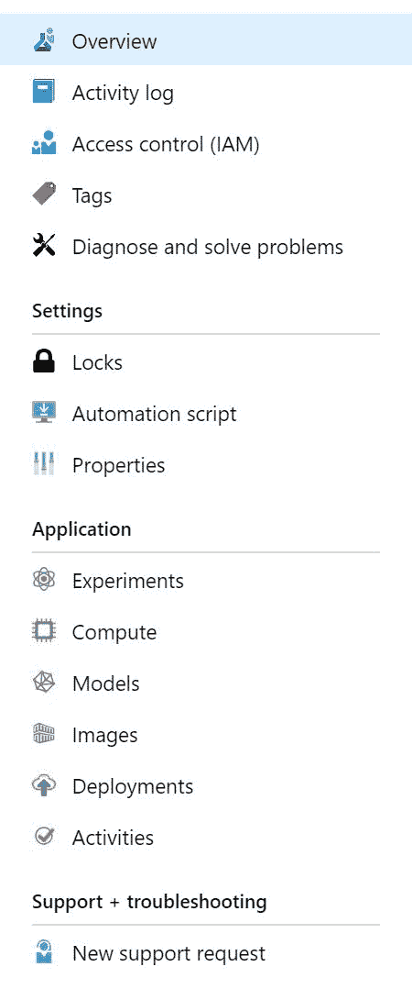
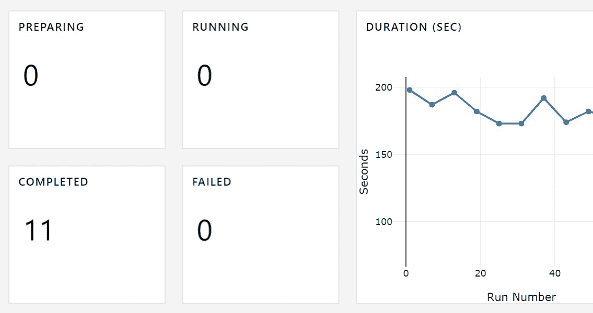
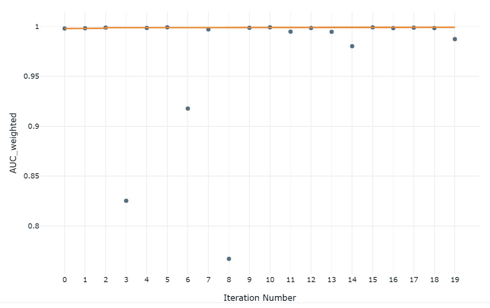
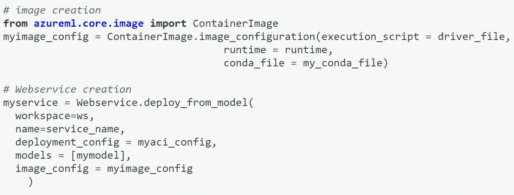

    

# 端到端机器学习

在本章中，我们将了解 Azure 机器学习服务推出的新功能，这些功能可以帮助数据科学家和人工智能开发人员进行端到端的机器学习。

在开发 AI 应用时，我们可以使用认知服务，如[第三章](89299379-0f5e-4602-ad78-9d3d46a0710e.xhtml)、*认知服务*中所述。或者，我们可以用自己的数据创建定制的机器学习模型，因为认知服务不会在每种可能的场景下都起作用。在这种情况下，我们必须训练自己的机器学习算法。Azure 机器学习服务有一个 SDK、CLI 和 API，可以帮助你创建这些自定义模型。

在这一章中，我们将学习如何使用 Azure 机器学习...

# 使用 Azure 机器学习 SDK 进行 E2E 机器学习

如下图所示，E2E 机器学习的第一步是**数据准备**，包括数据清理和特征化。然后，我们必须在**m**odel 训练步骤中创建并训练一个机器学习模型。之后，我们有 **m** **odel 部署**，这意味着将模型部署为 web 服务来执行预测。最后一步是**m**monitoring，其中包括分析模型的执行情况，然后触发模型的再训练。

Azure ML SDK 使专业数据科学家和 DevOps 工程师能够进行 E2E 机器学习。它允许我们无缝地使用云的力量来训练和部署我们的模型。通过在任何 Python 环境中使用`pip`安装 Azure ML SDK，我们可以轻松地开始使用它。我们可以通过使用一个 CPU 或 GPU 集群来扩展用于训练的计算。我们还可以使用 SDK 轻松跟踪所有实验的运行历史。这个运行历史存储在一个可共享的工作空间中，这允许团队共享资源和实验结果。SDK 的另一个优势是，它允许我们根据我们指定的指标，例如最高的准确率或最低的错误率，从多次实验中找到最佳模型。

一旦我们有了满足我们需求的机器学习模型，我们就可以使用 Azure ML 服务将它投入运行。我们可以从模型中创建一个 web 服务，它可以部署在 Azure 管理的计算机或物联网设备中。SDK 可以安装在任何 IDE 中，因此如果您不使用 Jupyter 笔记本或数据块，您甚至可以使用 VS 代码或 PyCharm 部署模型。对于开发测试场景，我们可以将 web 服务部署到 **Azure 容器实例** ( **ACI)** 。为了在生产中部署模型，我们可以使用 **Azure Kubernetes 服务** ( **AKS)** 。在将 web 服务部署到 AKS 之后，我们可以启用监控并查看 web 服务的执行情况。

以下示例代码显示了如何使用 SDK 进行 E2E 机器学习。首先为你的机器学习项目创建一个工作空间。这将在您的 Azure 订阅中创建，并可与您组织中的不同用户共享。该工作区对 E2E 机器学习所需的计算、实验、数据存储、模型、图像和部署进行逻辑分组:

这个工作区可以通过代码或者在我们订阅的 Azure 门户中访问。我们可以管理工作区的所有逻辑组件，还可以管理用户权限。以下屏幕截图显示了门户中的工作区组件:

一旦我们创建了工作区，我们就可以创建一个可以根据我们的训练需求自动扩展的训练计算。这台计算机可以使用 CPU 或 GPU，我们可以使用任何我们喜欢框架。例如，我们可以使用 scikit-learn 执行经典的机器学习，或者使用 TensorFlow 进行深度学习。任何框架或库都可以使用`pip`安装，并与 SDK 一起使用。我们可以向这个计算提交实验运行，我们将在我们的环境和 Azure 门户中看到结果。我们还可以在训练脚本中记录指标。这里有一些实验如何运行的示例截图，以及相应的指标如何出现在 Azure 门户中。我们还可以通过 SDK 使用代码来访问这些指标。

下面的屏幕截图显示了实验的数量以及运行每个实验所花费的时间:

此屏幕截图显示了在特定运行中被监控的指标:

如前所述，我们可以根据感兴趣的特定指标找到最佳运行。用于查找最佳运行的代码片段示例如下:

一旦我们找到了最佳运行，我们就可以将模型作为 web 服务部署到 ACI 或 AKS。为此，除了我们想要部署的模型之外，我们还需要提供一个评分脚本和一个环境配置。以下是可用于部署模型的代码示例:

当一个模型在生产中被部署到 AKS 并启用监控时，我们可以查看我们的 web 服务是如何执行的。我们还可以为我们的模型添加自定义监控。下面的屏幕截图显示了 web 服务在几天内的运行情况:

你可以在以下网站获得关于 Azure 机器学习服务的更多细节:[https://docs . Microsoft . com/en-us/Azure/Machine-Learning/service/overview-what-is-Azure-ml](https://docs.microsoft.com/en-us/azure/machine-learning/service/overview-what-is-azure-ml)。

你也可以从以下网站获得 Azure 机器学习 SDK 的样本笔记本:[https://github.com/Azure/MachineLearningNotebooks](https://github.com/Azure/MachineLearningNotebooks)。

# 摘要

在这一章中，我们已经了解了 Azure 机器学习服务的新功能，它使得执行 E2E 机器学习变得很容易。我们还了解了专业数据科学家和 DevOps 工程师如何从 Azure 机器学习 SDK 的实验和模型管理功能中受益。