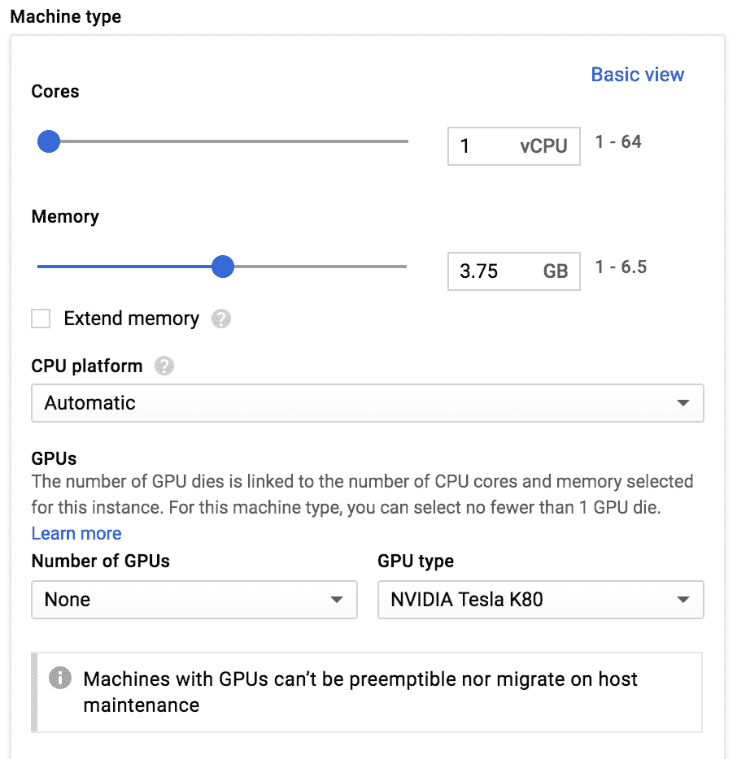
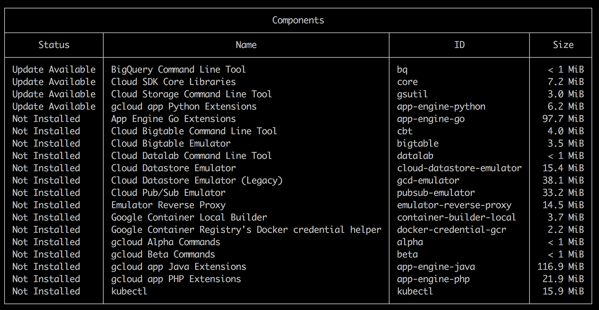
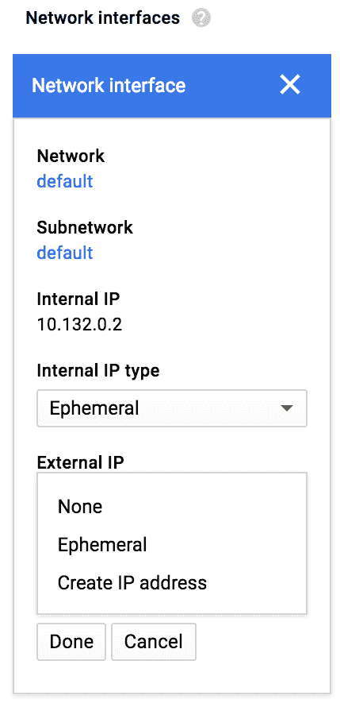
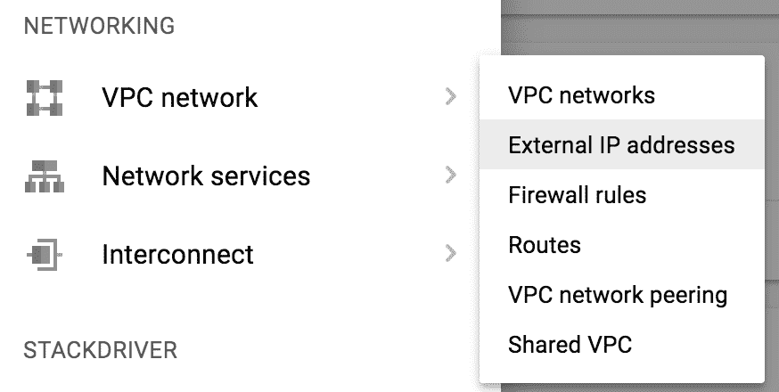
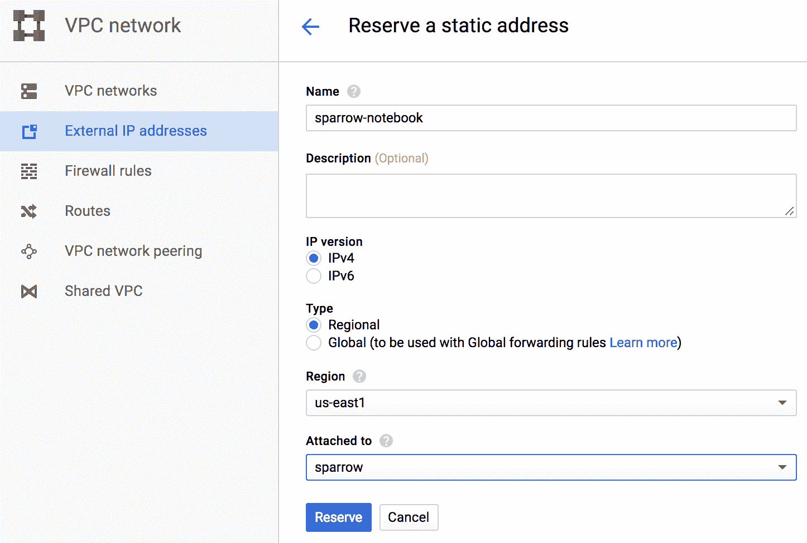
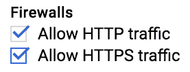
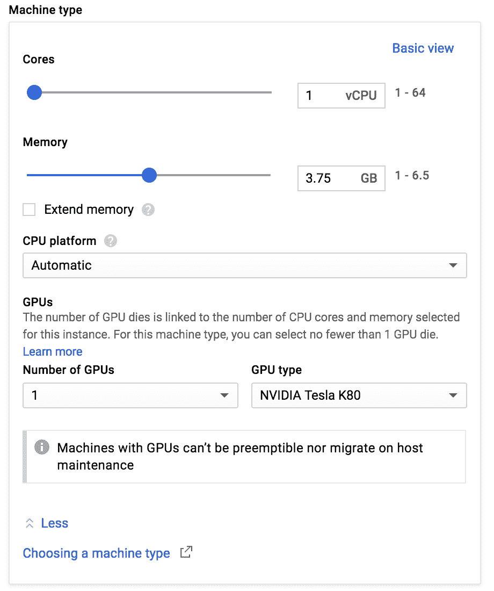

# 二、谷歌计算引擎

**谷歌云平台** ( **GCP** )的核心服务是**谷歌计算引擎** ( **GCE** )。GCE 允许您使用合适的操作系统、大小、RAM 和适当数量的 CPU 或 GPU 来启动旋转**虚拟机** ( **虚拟机**)。它相当于 AWS EC2。借助 GCE，我们可以深入 GCP 的核心。

在本章中，您将学习如何:

*   在 GCE 上创建适合您的项目的 VM 实例。
*   使用 Google 的命令行工具来管理您的虚拟机。
*   用`conda`和`scikit-learn`在 GCE VM 上建立 Python 数据科学栈。
*   通过受密码保护的 Jupyter 笔记本电脑访问您的虚拟机。我们还将讨论与映像、快照、可抢占式虚拟机、启动脚本和 IPs 相关的更多高级主题。

本章结束时，您将能够通过在线控制台和命令行工具创建和全面管理您的虚拟机，并实现数据科学工作流和 Jupyter 笔记本工作区。


# 谷歌计算引擎

简单地说，GCE 是一项让你在 Google 基础设施上创建和运行虚拟机的服务。GCE 允许您启动具有合适的操作系统、大小、RAM 以及满足您需求的适当数量的 CPU 或 GPU 的虚拟机。它相当于 AWS EC2。

GCE 于 2012 年 6 月 28 日在 Google I/O 2012 上发布，并于 2013 年 5 月 15 日向公众开放。与同等产品 AWS EC2 相比，GCE 是一项相当新的服务:


以下摘录自发行说明时间表，说明了 GCE 服务从简单的竞争者到云计算领域成熟参与者的快速发展:

*   2013 年 5 月 15 日:GCE 面向所有人。
*   2013 年 8 月 6 日:GCE 推出负载均衡。
*   2013 年 12 月 3 日:GCE 宣布生产就绪。*现在，用户可以放心地使用计算引擎来支持任务关键型工作负载，实现全天候支持和 99.95%的月 SLA* 。
*   2014 年 6 月 25 日:**固态硬盘** ( **SSD** )永久磁盘现已正式上市，并向所有用户和项目开放。
*   2015 年 9 月 8 日:可抢占的实例现已对所有用户和项目公开。
*   2016 年 3 月 30 日:大于 10 TB 的持久盘普遍上市。
*   2016 年 7 月 1 日:关机脚本现已普遍可用于计算引擎实例。
*   2017 年 9 月 21 日:英伟达特斯拉 K80 GPUs 现已普遍上市。
*   2017 年 9 月 26 日:GCE VM 实例的计费增量从每分钟增量减少到每秒增量。
*   在写这篇文章的时候，最新的消息是惊人的 96-vcpu 机器类型的测试版的发布。

在过去的四年中，Google 通过以下方式快速稳步地改进和发展其 GCE 服务:

*   扩展区域
*   添加更强大的机器和英特尔 CPU 平台
*   添加角色和功能
*   稳步发布 Windows、Suse、CentOS、Debian、Ubuntu、RHEL 或 CoreOS 的新公共映像

正如时间表所示，GCE 服务是一项年轻而充满活力的服务，它顺应了客户需求的发展，并为他们提供了大胆的新服务。它反映了谷歌成为云计算业务领导者的动力，并有可能抵消亚马逊在云计算领域的领先地位。

在我们发布第一个 GCE 虚拟机之前，让我们先来了解一些重要的概念。


# 虚拟机、磁盘、映像和快照

虚拟机是一个随需应变的虚拟服务器，您可以根据需要启动它。它在地理上位于谷歌的一个数据中心，但你只选择了地区和区域，而不是精确的位置。尽管您与其他用户共享一些基础设施资源，但这种共享对您是透明的。

虚拟机需要一个持久磁盘来运行，并需要一个操作系统(如 Windows 或 Linux 发行版)来引导。虽然在云计算环境中非常抽象，但是 GCE 磁盘指的是计算机可以在其上启动的物理驱动器。

映像存在于持久性磁盘之上，包括启动实例所需的操作系统。映像的典型用途是允许在许多不同的虚拟机之间共享虚拟机设置。映像由操作系统和引导加载程序组成，可用于引导实例。

**快照**是给定时间虚拟机内容的反映。快照主要用于即时备份。快照存储为相对于前一个快照的差异，而图像则不是。

图像和快照非常相似。可以使用快照或映像激活实例。

当您启动一个新实例时，GCE 通过将一个持久磁盘连接到您的虚拟机来启动。这提供了磁盘空间，并为实例提供了启动所需的根文件系统。该磁盘使用您选择的映像，并安装与该映像关联的操作系统。公共图像由 Google 提供，带有特定的操作系统，而私有图像是您自己的图像。

通过拍摄映像的快照，您可以将数据从现有的永久磁盘复制到新的永久磁盘。快照旨在创建即时备份。

从谷歌外壳，你可以访问和管理你所有的资源和文件。

例如，让我们通过键入以下命令列出所有现有实例:

```py
$ gcloud compute instances list
```

我们看到新创建的 sparrow 实例。


# 创建虚拟机

现在让我们使用 web 控制台创建我们的第一个 VM 实例。

去 GCE 控制台，[https://console.cloud.google.com/](https://console.cloud.google.com/)。选择我们在前一章中创建的项目(如果您还没有项目，请创建一个)，然后在左侧的菜单中，单击 Compute Engine。因为您还没有 VM，所以您会收到以下消息。点击创建，如下图所示:


对于这第一个虚拟机，我们将选择一个小的，并随着我们的进展调整它的大小。

此时，您需要决定几件事情:

*   您的实例的名称。我会叫我的**麻雀**。此名称在 GCP 不必是唯一的。你可以随意命名你的名字。

*   区域和地带。通常选择离您最近的区域会更好，以减少延迟。然而，GCP 服务通常首先在美国开放，过一段时间后才在世界其他地方可用。不同的区域也可能有不同的规则和规定。例如，欧洲提供了比美国更强的数据相关隐私法律。选择你认为合适的区域。以后总是可以更改该区域。

*   选择正确的机器类型很重要。在写这本书的时候，不同的机器被分类为小型、标准、高 CPU 和高 RAM:

    *   **小**:共享 CPU 和有限 RAM

    *   **标准虚拟机** : 3.75 GB 内存

    *   **高内存虚拟机** : 13 GB 内存

    *   **高 CPU 虚拟机** : 1.8 GB

小型类别非常适合开始使用该平台，并积累一些实践经验。对于更密集的项目，您可能需要更多的计算能力或更多的内存。

请注意，免费试用帐户仅限于八个 CPU。

还可以通过设置所需的 CPU 数量或每个 CPU 的内存来定制您需要的机器。这也是您选择计算机上 GPU 数量的地方，如下面的屏幕截图所示:



*   最后，您需要为您的虚拟机选择操作系统。Debian Linux 发行版是默认提供的。你可以在几个操作系统中进行选择:Windows、CentOS、Suse、CoreOS 和 Ubuntu。虽然 Ubuntu 通常是最受欢迎的选择，但是 Debian 和 Ubuntu 之间实际上没有什么区别，我们将使用默认的 Debian 发行版。如果你更熟悉 Ubuntu 发行版，那就试试吧。这应该不会在本章中引起任何问题。

Ubuntu 还是 Debian？Debian 是最早的 Linux 发行版之一，在 1996 年发布了第一个稳定版本。Ubuntu 最初是一个 fork，是 2004 年 Debian 的一个分支版本。这两个发行版非常相似，Ubuntu 更加用户友好，有更好的桌面/UI 体验。Debian 通常是服务器的首选，它是一个巨大的软件包库，非常注重稳定性和开放许可软件。Debian 的稳定版本大约每两年发布一次。Ubuntu 发布周期为六个月。Ubuntu 采用 Debian 的不稳定分支，特别是在 UI 方面进行定制，然后发布。对于我们的工作来说，这两个发行版应该没有什么不同，我们将使用 Debian 来运行我们的虚拟机。

将所有其他参数保留为默认选择。我们将在几页后回到 HTTPs 流量、磁盘、网络和`ssh`密钥。

web 控制台中的一个非常有用的功能降低了掌握 GCP 的学习曲线，这就是虚拟机创建页面底部的两个链接，相当于 Rest 或命令行，如下图所示:


命令行链接存在于 web 控制台的多个页面上。快速学习 GCP 命令行工具的正确语法和参数是一个非常有用的特性。

我们的虚拟机现在已经创建好了，并且正在运行！


现在我们有了一个全新的闪亮的虚拟机，我们如何访问它？这很好地将我们引向了谷歌外壳。


# 谷歌外壳

Google Shell 是 Google 的一种智能方式，它在您的浏览器中为您提供了一个独立的终端来访问和管理您的资源。

您可以通过单击控制台页面右上角的> _ 图标来激活 Google Shell:


浏览器窗口分成两半，下半部分现在是一个 shell 终端:


这个终端运行在 f1-micro GCE 虚拟机上，带有 Debian 操作系统。它是基于每个用户和每个会话创建的。当您的云 Shell 会话处于活动状态时，它会持续存在，并在 20 分钟不活动后被删除。该实例运行在具有 5 GB 存储空间的永久磁盘上。磁盘和映像都是免费提供的。尽管实例在会话间不是持久的，但它的关联磁盘在会话间是持久的。在下次会话开始时，您通过 Google Shell 创建的所有内容都将保持原样。这包括您存储的所有文件、您安装的软件和您编辑的配置文件(例如`.bashrc`和`.vimrc`)。这个磁盘是私有的，其他用户不能访问。最后，Google Shell 实例预装了 Google Cloud SDK 和 VIM 等其他流行的开发工具。

您通过 web 控制台运行的一些命令将被存储在您的 Google Shell 虚拟机中。例如，您在 Google SQL 实例上运行的 SQL 查询将显示在用户的`$HOME`文件夹中的`.mysql_history`文件中。更多关于 Google Shell 的信息可以在你的`$HOME`文件夹的`README-cloudshell.txt`中找到。

从谷歌外壳，你可以访问和管理你所有的资源和文件。例如，让我们通过键入以下命令列出所有现有实例:

```py
$ gcloud compute instances list
```

我们看到新创建的 sparrow 实例:


要访问刚刚创建的虚拟机，请键入:

```py
$ gcloud compute ssh sparrow
```

这将贯穿必要的`ssh`键的创建。你现在不再在 Google 的云 Shell 虚拟机实例上，而是在 sparrow 虚拟机上。为了检查我们在 sparrow 实例中运行的是哪个操作系统和版本，我们运行:

```py
$ lsb_release -d
```

在麻雀机上，我用的是 Debian GNU/Linux 9 (stretch)，而在 Google Shell VM 上，我用的是 Debian GNU/Linux 8 (jessie)。这告诉我 Google Shell 还不是 Debian 发行版的最新版本。当然，你可能会看到不同的结果。


# 谷歌云平台 SDK

GCP 提供了几个独立的**命令行界面**(**CLI**)来管理你的 GCP 资源并与之交互，`gcloud`是主要的一个。所有二级命令行工具都是通过`gcloud`安装的。在撰写本文时，命令行工具有:

*   管理您的 GCP 资源和项目的主要 CLI:身份验证、本地配置、开发人员工作流以及与 GCP API 的交互。可以通过`gcloud` CLI 处理以下服务:应用引擎、认证、计算引擎、容器、数据流、数据块、机器学习、SQL 数据库以及云资源的部署、Iam 设置，以及使用堆栈驱动程序和 web 资源(如 DNS、域或 Firebase)进行日志记录。

Gcloud 还负责其他命令行工具:

*   这是谷歌存储的命令行界面。您使用`gsutil`来创建和删除存储桶、上传、下载和移动文件、设置权限等等。
*   `bq`:这是与 BigQuery 交互的 CLI。
*   `datalab`:数据实验室命令行界面。

所有这些 CLI 工具都是 Python 脚本，需要在您的系统上安装 Python 2.7。

要安装`gcloud`，最好的方法是按照[https://cloud.google.com/sdk/downloads](https://cloud.google.com/sdk/downloads)的云 DSK 页面上的说明进行操作。下载正确的软件包，并为您的机器运行适当的命令。安装程序将引导您创建`ssh`密钥。它会在你的`~/.ssh`文件夹中安装三个文件。您的公钥和私钥`ssh`(即`google_compute_engine.pub`和`google_compute_engine`)以及已知主机列表(`google_compute_known_hosts`)。

您可以通过在终端中运行`gcloud version`来验证`gcloud`是否正确安装。您的输出将类似于:

```py
Google Cloud SDK 173.0.0
core 2017.09.25
gsutil 4.27
```

我们可以看到，`gcloud`并不是一个放之四海而皆准的工具。`gcloud`装载组件。它们可以是其他独立的 CLI，如`gsutils`、`bq`、`datalab`或`gcloud`扩展(`app-engine-python`)，以及 Alpha 和 Beta 版本级别。要查看您的`gcloud`中安装了哪些组件，请运行:

```py
$ gcloud components list
```

您将获得以下结果:



要在当前 SDK 版本(173.0.0)中安装或删除组件，请使用以下命令:

```py
$ gcloud components install COMPONENT_ID 
$ gcloud components remove COMPONENT_ID
```

要将 SDK 安装更新到最新版本(175.0.0)，请运行:

```py
$ gcloud components update
```


# Gcloud

让我们看几个命令，感受一下`gcloud` CLI 的语法:

*   要列出所有项目，请使用:

```py
$ gcloud projects list
```

*   要列出`packt-gcp`项目中的所有实例，请使用:

```py
$ gcloud compute instances list --project packt-gcp
```

也适用于其他 CLI 工具的`gcloud`的全局通用语法是:

```py
$ gcloud GROUP | COMMAND parameters
```

其中`GROUP`是服务或账户元素，`COMMAND`是发送给`GROUP`的命令。比如在`gcloud projects list`中，`projects`是`GROUP`，你账户的一个元素，`list`是`COMMAND`。在`gcloud compute instances list --project packt-gcp`中，`GROUP`是`compute`，后面跟着一个子组`instances`，并且`COMMAND`是`list`，而`--project packt-gcp`是必需的参数。

gcloud 参数包括帐户设置(例如键和区域)、CLI 设置(详细程度、格式或特定配置)以及命令所需的参数。例如，要启动我们的实例，我们需要指定两个参数—区域和实例 ID:

```py
$ gcloud compute instances start sparrow  --project packt-gcp --zone us-east1-d
```


# Gcloud config

为了避免必须指定区域或其他参数，您可以在`config`中用以下命令设置它们:

```py
$ gcloud config set compute/zone us-east1-d
```

要在`config`中取消设置它们，您可以使用以下命令:

```py
$ gcloud config unset compute/zone
```

要查看`config`中所有不同设置的列表，运行`gcloud config set --help`。

区域和地区也可以存储在环境变量`CLOUDSDK_COMPUTE_ZONE`和`CLOUDSDK_COMPUTE_REGION`中。环境变量覆盖您用`gcloud` `config`命令设置的默认属性，但不覆盖像`--zone`或`--region`这样的显式标志。

要设置环境变量`CLOUDSDK_COMPUTE_ZONE`，运行或添加以下代码到您的`.bashrc`:

```py
$ export CLOUDSDK_COMPUTE_ZONE=us-east1-c
```

更多详情请见[https://cloud . Google . com/compute/docs/g cloud-compute/# set _ default _ zone _ and _ region _ in _ your _ local _ client](https://cloud.google.com/compute/docs/gcloud-compute/#set_default_zone_and_region_in_your_local_client)。


# 使用 gcloud 访问您的实例

有两件重要的事情你一开始就想做:

*   访问实例
*   在您的实例和另一台机器之间移动文件。要在实例中执行`ssh`,运行:

```py
$ gcloud compute ssh <instance_name>
```

在我们的案例中:

```py
$ gcloud compute ssh sparrow
```

第一次从本地系统访问实例时，平台会将您的密钥传播到实例，这可能需要几分钟时间。一旦连接上，您就可以验证您的本地公钥(`cat ~/.ssh/google_compute_engine.pub`)是否包含在您的实例(`cat ~/.ssh/authorized_keys`)上的`authorized_keys`列表中。


# 使用 gcloud 传输文件

通过 Gcloud 版本的`.csp`命令在您的机器(或任何其他位置)和您的实例之间来回传输文件:

*   要将本地文件发送到实例`$HOME`文件夹:

```py
$ gcloud compute scp ~/LOCAL-FILE :~/
```

*   例如，要向 sparrow 发送一个名为`hello_world.txt`的文件，您可以这样运行:

```py
$ gcloud compute scp ~/hello_world.txt  sparrow:~/
```

*   类似地，要将文件从实例下载到本地机器的`$HOME`文件夹:

```py
$ gcloud compute scp  <instance-name>:~/REMOTE-FILE ~/
```

我们将在下一章探索`gsutil`和`bq`命令行工具，并在[第 4 章](862553c5-4bb7-4a5c-b7bd-03f0eb8d413e.xhtml)、*中探索使用 BigQuery* 查询数据的 Datalab CLI。


# 管理虚拟机

当您开始在 Google Compute 上使用 VM 时，有几个操作是您想要做的，比如启动实例、停止实例、调整和修改磁盘大小以及拍摄快照。我们回顾了最重要的几个:

1.  启动和关闭虚拟机:

```py
$ gcloud compute instances start sparrow --project packt-gcp 
$ gcloud compute instances stop sparrow --project packt-gcp
```

2.  检查虚拟机状态:

```py
$ gcloud compute instances list --project packt-gcp
```

我们开始使用的实例是一个 f1-micro，它没有足够的 CPU、RAM 或磁盘空间用于现实世界的数据科学项目。我们想改变底层机器并增加其磁盘空间。但是，在此之前，我们应该拍摄当前机器的快照作为备份。如果出现任何问题，我们将能够从快照中恢复实例:

1.  拍摄虚拟机的快照:

```py
$ gcloud compute disks snapshot [DISK_NAME]
```

2.  在我们的例子中，让我们在运行时调用我们的磁盘`sparrow-backup`:

```py
$ gcloud compute disks snapshot sparrow-backup --project packt-gcp
```

3.  改变机器类型，首先需要用`$ gcloud compute instances stop sparrow --project packt-gcp`停止实例。一旦完成，就可以使用通用命令更改机器类型:

```py
$ gcloud compute instances set-machine-type INSTANCE --machine-type MACHINE-TYPE
```

4.  在我们的例子中，如果我们想将类型更改为`n1-standard-1` (3.75 GB 内存和 1 个 vCPU)，我们应该这样运行:

```py
$ gcloud compute instances set-machine-type sparrow --machine-type n1-standard-1
```

5.  与此同时，我们还希望将底层磁盘的大小从 10 GB 调整到 100 GB:

```py
$ gcloud compute disks resize sparrow --size 100
```

6.  另一个重要设置是确保在删除实例时不会删除磁盘:

```py
$ gcloud compute instances set-disk-auto-delete
```

这是一个重要参数，也可以在计算引擎控制台中设置，方法是在创建或编辑实例时，取消选择删除实例时删除引导磁盘:


7.  实例配置:整个实例配置可通过`$ gcloud`compute instances describe sparrow 获得。
8.  从头创建正确的虚拟机:在这种情况下，当您从头创建虚拟机时，所有这些参数都可用。当运行在 Ubuntu 17.04 上时，运行以下命令将在`europe-west1-c`区域中创建一个名为`hummingbird`的新`n1-standard-1`实例，其中一个 100 GB 的磁盘也名为`hummingbird`。请注意，该实例是可抢占的(`--preemptible`)，一旦实例被删除，磁盘将持续存在(`--no-boot-disk-auto-delete`):

```py
$ gcloud compute --project packt-gcp instances create hummingbird \
--zone europe-west1-c --machine-type n1-standard-1 \
--image ubuntu-1704-zesty-v20171011 --image-project ubuntu-os-cloud \
--boot-disk-size 100  --boot-disk-type "pd-standard"  \
--boot-disk-device-name hummingbird \
--preemptible --no-boot-disk-auto-delete
```

我们可以验证我们的项目中现在有两个实例:

为了控制我们的资源，我们应该用以下命令删除这个新实例:

```py
$ gcloud compute instances stop hummingbird --zone europe-west1-c  --project packt-gcp
```

注意，如果您已经在`config`设置中设置了一个不同的默认区域，或者设置为一个环境变量，您需要在删除它之前指定实例的区域；否则，将产生一条`resource not found`错误信息。


# inchespersecond 每秒英寸数

您一定注意到了与我们的虚拟机相关联的内部和外部 IP 的存在。每个 GCP 项目都有一个**虚拟私有云** ( **VPC** )网络，它是随着项目自动创建的。VPC 基本上是一个私有的、隔离的虚拟网络分区，它使您的资源能够在给定的项目中相互交流，同时允许控制对 VPC 的外部访问。创建时，每个实例都会获得一个分配的内部 IP 地址，以允许项目 VPC 中的其他资源与该实例通信。为了与 VPC 以外的实体进行通信，包括与 internet 的连接，该实例需要一个外部 IP 地址。

内部和外部的 IP 地址可能是短暂的，也可能是静态的。只有在实例运行时，临时 IP 地址才会与实例保持关联。当实例停止或终止时，IP 地址将在全局 GCP IP 地址池中释放。对于具有稳定 IP 地址的实例，IP 地址需要变成静态的。静态地址会产生额外的成本。

可以通过控制台将 IP 地址的性质从短暂更改为静态。停止虚拟机并编辑它。在网络接口部分，为虚拟机的内部和外部 IP 选择正确的类型:



IP 和 VPC 的管理可从位于[https://console.cloud.google.com/networking/networks/list](https://console.cloud.google.com/networking/networks/list)的 VPC 网络控制台访问。

您可以创建新的静态 IP 地址，然后从“外部 IP 地址”页面直接将其附加到您的实例:



单击 Reserve a static address，选择 regional 作为 region type，将 region 设置为您的实例所在的区域，并将其附加到 sparrow 实例:



创建静态 IP 并将其添加到实例中的命令行等效操作如下:

```py
$ gcloud compute --project=packt-gcp addresses create sparrow-notebook --region=us-east1
$ gcloud compute --project=packt-gcp instances add-access-config sparrow --zone=us-east1-d --address=IP_OF_THE_NEWLY_CREATED_STATIC_ADDRESS
```

由于静态 IP 即使在不使用时也要计费，因此在不再需要时释放它们是很重要的。


# 在虚拟机上设置数据科学堆栈

现在，我们有一个正在运行的虚拟机，我们能够向它发送文件、连接到它并修改它。一切准备就绪，我们可以为数据科学进行设置了！

我们将安装来自 continuum 的 Python Miniconda 栈，比完整的 conda 发行版要小得多。对您的实例使用 SSH。

1.  使用以下命令从[https://repo . continuum . io/miniconda/miniconda 2-latest-Linux-x86 _ 64 . sh](https://repo.continuum.io/miniconda/Miniconda2-latest-Linux-x86_64.sh)安装 mini `sudo apt-get update sudo apt-get install bzip2 wget`:

```py
bash Miniconda2-latest-Linux-x86_64.sh
```

2.  然后用`conda`安装 Python 栈:

```py
$ conda install scikit-learn pandas jupyter ipython
```

不要忘记这样做:

```py
$ source .bashrc
```


# 装箱 ipython 控制台

要在您的实例中启动 Jupyter Notebook 并通过 Web 访问它，您需要将默认提供给 VM 的临时外部 IP 地址提升为静态外部 IP。

您还需要确保您的实例接受 HTTP 和 HTTPS 流量。为此，请转到您的虚拟机页面，对其进行编辑，并选中以下复选框:



由于您的 Jupyter 笔记本对网络上的所有流量开放，因此您对其进行了密码保护:

1.  生成配置:

```py
$ jupyter notebook --generate-config
```

2.  并添加一个密码:

```py
$ jupyter notebook password
```

有关如何保护您的公共笔记本的更多信息，包括使用`ssh`密钥和添加加密，请访问[http://jupyter-Notebook . readthe docs . io/en/latest/public _ server . html](http://jupyter-notebook.readthedocs.io/en/latest/public_server.html)。

3.  启动您的 Jupyter 笔记本:

```py
$ jupyter notebook --ip=0.0.0.0 --port=8888 --no-browser &
```

这将生成一个令牌和以下消息:

```py
The Jupyter Notebook is running at: http://0.0.0.0:8888/?token=7b1deb1b1467a3b3c9c23946e2f2efa12d9dc2c258353660
and access it in your browser via http://104.196.129.173:8888/?token=7b1deb1b1467a3b3c9c23946e2f2efa12d9dc2c258353660
```


# 解决纷争

如果您在访问笔记本电脑时遇到问题，还有一个替代解决方案。这个想法是推出带有 IP `0.0.0.0`的 Jupyter 笔记本，而不必先设置一个静态 IP:

```py
jupyter notebook --ip=0.0.0.0 --port=8888 --no-browser
```

这将生成一个令牌。使用 SSH 进入另一个终端，添加以下标志`--ssh-flag="-L" --ssh-flag="2222:localhost:8888"`:

```py
$ gcloud compute ssh sparrow --ssh-flag="-L" --ssh-flag="2222:localhost:8888"
```

这就是它将 URL `localhost:2222`与 Jupyter 笔记本 URL `localhost:8888`关联起来的方式。然后你可以在`http://localhost:2222`访问你的笔记本。你还需要输入刚才给你的令牌。

杰夫·德莱尼(Jeff Delaney)在这篇博客上的评论给出了这个替代方案，*在谷歌云引擎上运行 Python Jupyter 笔记本*:[https://jeffdelaney . me/blog/Running-Jupyter-Notebook-Google-Cloud-platform/](https://jeffdelaney.me/blog/running-jupyter-notebook-google-cloud-platform/)。


# 将 GPU 添加到实例

检查并请求增加您的 GPU 配额:

*   搜索 GPU。如果您的分配配额中有 0，请选择 GPU 类型和区域，然后单击编辑配额。填写申请表([https://console.cloud.google.com/iam-admin/quotas?project=packt-gcp](https://console.cloud.google.com/iam-admin/quotas?project=packt-gcp) 。

在 Google Compute 上使用 GPU 有几个限制。GPU 在共享或可抢占的机器中不可用。GPU 实例因定期(每周)维护事件而终止。有关限制的最新信息，请参见[https://cloud.google.com/compute/docs/gpus/](https://cloud.google.com/compute/docs/gpus/)。另请参见 https://cloud.google.com/compute/docs/gpus#introduction[的](https://cloud.google.com/compute/docs/gpus#introduction)，了解基于您想要的 GPU 数量的可用机器类型。

要从控制台创建带有 GPU 的虚拟机，请执行以下操作:

1.  转到虚拟机控制台，单击“创建实例”
2.  选择与 GPU 兼容的区域
3.  点击自定义机器类型，然后再次点击 GPU 链接
4.  选择您需要的 GPU 数量和相关类型:



同样，您可以使用下面的命令用`gcloud`创建一个支持 GPU 的实例:

```py
$ gcloud compute instances create [INSTANCE_NAME] \
--machine-type [MACHINE_TYPE] --zone [ZONE] \
--accelerator type=[ACCELERATOR_TYPE],count=[ACCELERATOR_COUNT] \
--image-family [IMAGE_FAMILY] --image-project [IMAGE_PROJECT] \
--maintenance-policy TERMINATE --restart-on-failure \
--metadata startup-script='[STARTUP_SCRIPT]'
```

其中`--accelerator type= specifies`表示 GPU 的类型，`count=`表示 GPU 的数量。

例如，这个命令将创建一个 Ubuntu 1604 实例，在`us-east1-d`区域中有一个 NVIDIA Tesla K80 GPU 和两个 vCPUs。启动脚本元数据指示实例安装 CUDA 工具包及其推荐的驱动程序版本:

```py
$ gcloud compute instances create gpu-instance-1 \
--machine-type n1-standard-2 --zone us-east1-d \
--accelerator type=nvidia-tesla-k80,count=1 \
--image-family ubuntu-1604-lts --image-project ubuntu-os-cloud \
--maintenance-policy TERMINATE --restart-on-failure \
--metadata startup-script='#!/bin/bash
echo "Checking for CUDA and installing."
# Check for CUDA and try to install.if ! dpkg-query -W cud
a-8-0; then
  curl -O http://developer.download.nvidia.com/compute/cuda/repos/ubuntu1604/x86_64/cuda-repo-ubuntu1604_8.0.61-1_amd64.deb
  dpkg -i ./cuda-repo-ubuntu1604_8.0.61-1_amd64.deb
  apt-get update
  apt-get install cuda-8-0 -y
fi'
```

启动脚本为 Ubuntu 安装正确的 CUDA 驱动程序。对于其他驱动程序和操作系统，请遵循[https://developer.nvidia.com/cuda-downloads](https://developer.nvidia.com/cuda-downloads)中的说明。

驱动程序安装完成后，您可以验证其安装是否正确:

1.  深入你的实例
2.  键入`nvidia-smi`查看您的驱动程序版本和您的 GPU 内存

命令`nvcc --version`显示当前的 CUDA 版本。


# 启动脚本和停止脚本

启动脚本允许您在启动或创建实例时运行脚本。例如，要在创建新实例时始终安装`miniconda`和相关的数据科学包，只需在本地机器上的文件中编写以下脚本:

```py
#! /bin/bash
apt-get install bzip2
wget https://repo.continuum.io/miniconda/Miniconda2-latest-Linux-x86_64.sh
sudo bash Miniconda2-latest-Linux-x86_64.sh
conda install scikit-learn
conda install pandas
conda install jupyter
conda install ipython
```

然后，当您启动新实例时，提供`--metadata-from-file`标志，后跟`startup-script=PATH/TO/FILE`，其中`PATH/TO/FILE`是启动脚本的相对路径:

```py
$ gcloud compute instances create example-instance --metadata-from-file startup-script=examples/scripts/install.sh
```

您也可以在命令行的扩展中使用启动脚本，或者从 Google Storage 中存储的文件中使用。更多关于启动脚本的信息，请访问 https://cloud.google.com/compute/docs/startupscript。

停止脚本是在实例终止或重新启动时自动运行的脚本。与启动脚本类似，您可以在创建时将停止脚本与实例相关联，方法是添加`--metadata-from-file flag`，后跟`shutdown-script=PATH/TO/FILE`:

```py
$ gcloud compute instances create example-instance --metadata-from-file shutdown-script=examples/scripts/shutdown.sh
```


# 资源和进一步阅读

下面是几篇关于在 GCE 上设置 TensorFlow 的有趣文章:

*   **在计算引擎上运行分布式 TensorFlow**:[https://cloud . Google . com/solutions/Running-distributed-tensor flow-on-Compute-Engine](https://cloud.google.com/solutions/running-distributed-tensorflow-on-compute-engine)
*   **jupyter+tensorlow+NVIDIA GPU+dock+GCE**:1232【https://medium . com/Google-cloud/jupyter-tensorlow-NVIDIA-GPU dock-Google-compute engine-4a 146 f 085 f17】
*   **在 GCP 上使用 GPU 和 tensor flow**:[https://medium . com/Google-cloud/Using-a-GPU-tensor flow-on-Google-cloud-platform-1a 2458 f 42 b 0](https://medium.com/google-cloud/using-a-gpu-tensorflow-on-google-cloud-platform-1a2458f42b0)
*   **在谷歌云上运行 GPU 上的 Jupyter 笔记本**:[https://medium . com/Google-Cloud/Running-Jupyter-Notebooks-on-GPU-on-Google-Cloud-d 44 f 57d 22 DBD](https://medium.com/google-cloud/running-jupyter-notebooks-on-gpu-on-google-cloud-d44f57d22dbd)

一些 docker 相关资源:

*   **在 GCE 上创建机器的 Docker 配置**:【https://docs.docker.com/machine/drivers/gce/ 
*   **用 stackcriver 登录**:[https://medium . com/Google-cloud/how-to-log-your-application-on-Google-compute-engine-6600d 81e 70 e 3](https://medium.com/google-cloud/how-to-log-your-application-on-google-compute-engine-6600d81e70e3)


# 摘要

GCE 是 GCP 的核心服务，提供基于不同操作系统的各种可扩展虚拟机。可用操作系统的多样性、带有 CPU、GPU 的机器的范围、小到巨大的磁盘空间和 RAM 使得 GCE 成为一个强大的云环境，适用于各种各样的项目和环境。

在本章中，您学习了:

*   如何创建、启动、备份、修改和访问多个虚拟机
*   与虚拟机相关的不同参数和变量
*   如何访问和使用 Google Shell
*   如何使用`gcloud` CLI 在 GCP 中执行相同的操作
*   如何安装数据科学 Python 堆栈
*   如何推出 Jupyter 笔记本

GCE 的强大功能和灵活性提供了更多我们没有涉及到的可能性。希望在本章结束时，您应该能够轻松地在以数据为中心的环境中使用适合您项目的实例。

在下一章中，我们将学习如何使用 Google Storage 和 Google SQL 在 GCP 上存储数据。