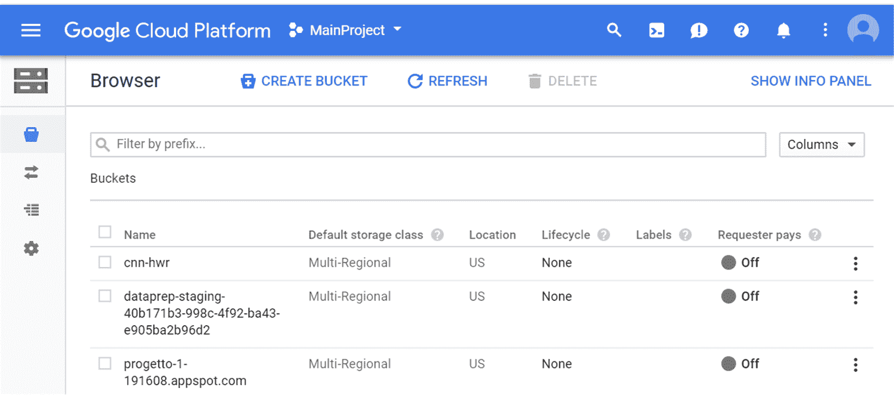
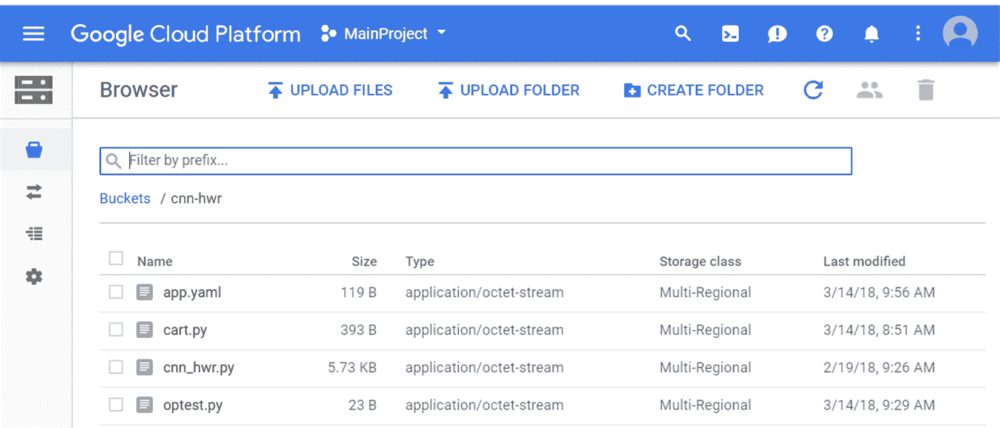
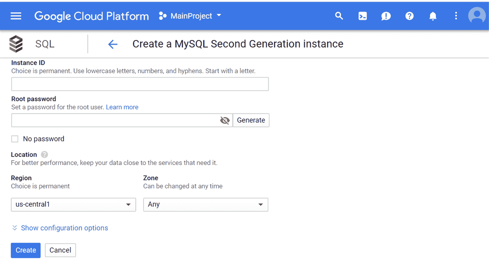

# 三、谷歌云存储

在本章中，我们将探索 Google 云平台的两个数据存储服务，用于文件的 Google Storage 和用于结构化数据的 Google SQL。谷歌存储是一种文件托管服务，允许你在云端存储文件。非常简单明了，它非常类似于亚马逊 S3 服务。为了超越基本用法，我们将研究一些高级主题，如签名 URL、协作桶设置、优化上传速度和传输大数据集

Google SQL 是 Google 的简单 SQL 数据库服务。就 SQL 类型而言，目前还没有 Amazon SQL services 开发得好，它以 MySQL 作为主要数据库。Postgre 的测试版也是可用的。我们将从各自功能的角度来看两者之间的区别。

将基于云的解决方案用于数据科学项目时，让服务彼此对话，或者更准确地说，允许不同数据存储和数据消费者之间的数据传输，通常是难点所在。

诸如容量、延迟和吞吐量等问题会影响脚本的速度和工作效率。设置正确的权限级别，以便可以在项目环境中访问您的数据，同时防止外部访问，这也很关键。

在本章中，您将学习:

*   如何用 gsutil 在 Google Storage 上存储文件
*   如何创建数据库并在 Google SQL 上播种数据
*   如何访问你的谷歌存储文件和谷歌 SQL 数据库

在本章结束时，您将能够上传数据并使用谷歌云平台提供的服务管理数据，并了解谷歌云 SQL 在创建关系数据库管理系统方面的潜力。


# 谷歌云存储

云存储是一种在网络上可用的计算机上存储数据的模型，其中数据存储在多个服务器上，真实的和/或虚拟的，通常托管在第三方设施或专用服务器上。通过这种模式，可以从世界的任何地方使用任何合适的设备访问个人或商业信息，无论是视频、音乐、照片、数据库还是文件，而无需知道数据的物理位置。这种方法的优点是多方面的:无限容量的存储空间，只需为实际使用的存储空间量付费，从世界上任何地方都可以访问文件，大大减少了维护工作，以及更高的安全性，因为文件可以防止在本地计算机上可能发生的盗窃、火灾或损坏。

谷歌云存储是谷歌对云存储的提议:它是由谷歌提供的开发者服务，允许你直接在谷歌的基础设施上保存和操作数据。更详细地说，Google 云存储提供了一个编程接口，它利用简单的 HTTP 请求在其基础设施上执行操作。使用谷歌云存储，您可以执行以下操作:上传文件、下载文件、删除文件、获取文件列表或获取给定文件的大小。这些 HTTP 请求中的每一个都包含关于所使用的方法和请求的资源的信息。由此可以创建一个应用，使用这些 HTTP 请求提供一个服务，应用通常通过第三方服务器远程保存数据。

Google 存储平台是一个企业存储解决方案，提供三个级别的存储，具有不同的可访问性需求和相关定价:

*   标准存储用于快速访问大量数据。每 GB 0.026 美元，可快速响应请求。
*   **持久的低可用性** ( **DRA** )用于长期数据存储和不频繁访问。它的价格更低，为 0.02 美元/GB。
*   最后，近线存储用于更不频繁的访问。这是该服务最便宜的版本，响应时间要长得多。它是最便宜的选择，目前价格为 0.01 美元/ GB。


# 盒子–存储与驱动

Google Drive 用于存储个人文件。您所有不同的个人服务(电子邮件、照片等)都有高达 15 GB 的免费空间。它提供进一步的数据存储容量，按月收费(例如，1 TB 每月 9.99 美元)。但是，与谷歌存储相比，没有数据压缩或数据加密。它不是由 Google 作为一个具有相关特性、支持和可靠性的企业平台提供的。没有高级管理特性，比如元数据，也没有通过桶进行数据组织管理。也没有高级存储层(冷数据与热数据)。

Google Drive 服务的主要功能如下:

*   没有基于层的数据存储
*   这不是一个商业解决方案
*   它不支持高级数据管理功能
*   存储计划限制为 30 TB

要了解谷歌云存储的潜力，请参见以下内容:

*   它提供了无限的空间
*   由于使用了 OAuth，它比 Google Drive 更安全
*   它提供了高级存储级别
*   它为企业服务和应用的高级集成提供了 REST API 支持
*   它有可能在出错后恢复数据传输

通过分析谷歌云存储提供的一些功能，很明显它的优越性证明了它的价格是合理的。


# 访问控制列表

文档说得最好，**访问控制列表**(**ACL**)允许您控制谁可以读写您的数据，以及谁可以读写 ACL 本身。

如果在上传对象时没有指定(例如，通过`gsutil cp -a`选项)，
对象将使用在桶上设置的默认对象 ACL 来创建(参见`gsutil help`
`defacl` [https://cloud)。Google.com/storage/docs/gsutil/commands/defacl](https://cloud.Google.com/storage/docs/gsutil/commands/defacl))。您可以使用 gsutil acl set 命令
替换一个对象或 bucket 上的 acl，或者使用`gsutil acl ch`命令修改现有的 ACL(参见【cloud.Google.com/storage/docs/gsutil/commands/acl】:[https://](https://cloud.google.com/storage/docs/gsutil/commands/acl)[)。](https://cloud.google.com/storage/docs/gsutil/commands/acl)

ACL 被分配给对象(文件)或存储桶。默认情况下，bucket 中的所有文件与其所在的 bucket 具有相同的
ACL。
需要记住的几点是:

*   对象没有写权限；试图为对象设置具有写
    权限的 ACL 将导致错误
*   对象 ACL 独立于存储桶 ACL 读取设置来确定读取权限。(文件夹权限不会覆盖文件访问权限。)

有几种预设可供选择。可用的固定 ACL 包括:

*   **Project-private:** 根据项目团队的角色授予他们权限。
    团队中的任何人都有阅读权限，项目所有者和
    项目编辑有所有者权限。这是新创建的
    桶的默认 ACL。这也是新创建对象的默认 ACL，除非该存储桶的默认
    对象 ACL 已被更改。更多细节参见 gsutil 帮助
    项目。
*   **Private:** 授予请求者(且仅是请求者)对
    桶或对象的所有者权限。
*   **Public-read:** 授予所有用户(无论是登录用户还是匿名用户)读取权限。
    当你把这个应用到一个物体上时，互联网上的任何人都可以读取这个物体
    而无需认证。
*   **Public-read-write:** 授予所有用户读写权限。这个 ACL 仅将
    应用于桶。将 bucket 设置为 public-read-write 将允许
    互联网上的任何人向您的 bucket 上传任何内容。你将对这个
    内容负责。还有其他设置，查看 doc。


# 通过 web 控制台进行访问和管理

在前面的章节中，我们介绍了 GCP 提供的服务。现在是时候看看如何访问服务以及如何管理它了。为了做到这一点，谷歌为完全在线的服务管理和 gsutil 创建了一个基于网络的界面，gsutil 是一个命令行工具，允许你在服务上执行你需要的所有操作。


# gsutil

gsutil 是命令行工具，是`gcloud` shell 脚本的子集，允许您管理 Google 存储上的存储桶和对象(文件)。gsutil 提供的操作从创建存储桶和移动文件的简单命令，到管理设置、存储类和权限的管理命令。更高级的命令包括通过 ACL 设置访问控制、定义生命周期规则(1 年后删除所有文件)、日志记录、创建通知以及使用 perfdiag 进行故障排除。

让我们从简单的命令开始。我们将创建一个名为`packt-gcp`的桶，上传一些文件，获取这些文件的信息，移动它们，并更改存储类。


# gsutil 备忘单

下面是我们可以通过 gsutil 发出的最常用命令的列表:

*   创建一个名为`packt-gcp`的存储桶:
    *   `gsutil mb gs://packt-gcp`
*   将文件上传到存储桶:

    *   `gsutil cp gs://packt-gcp/`
*   在存储桶中创建子文件夹:
    *   `gsutil cp your-file gs://packt-gcp/`
*   正在列出文件夹:
    *   `gsutil ls gs://packt-gcp/`
*   获取 gsutil 命令的帮助:
    *   `gsutil help`

*   我们使用了多少存储空间(`-h`使其可读):
    *   `gsutil du -h gs://packt-gcp/`
*   将整个文件夹复制到存储桶:
    *   `gsutil cp -r gs://packt-gcp/`

例如，我有一个包含一些图像的本地`./img`目录。我可以使用以下命令复制整个目录并同时创建 bucket 子目录:

```
gsutil cp -r ./img gs://packt-gcp/
```

让我们分析一个特别有用的选项:我引用了`-m`标志。如果你正在执行一系列的`gsutil`操作，如果你使用`gsutil -m -o`，它可能会运行得更快，这意味着并行运行。如果您通过相当快的网络连接对大量文件执行操作，这可以显著提高性能，但如果您使用较慢的网络，性能可能会更差。

`-m`标志特别适用于以下命令:`ls`、`mb`、`mv`、`rb`和`du`。


# 高级 gsutil

之前，我们已经看到了一些可以使用`gsutil`导入的简单的基本命令。但是有了这个工具，我们可以做别的事情:

*   `gsutil`支持通配符(和？)并将通配符限制为文件。要在通配符目标中包含文件夹，双击符号:`gsutil ll gs:///**.txt`将列出子目录中的所有文本文件。

*   `gsutil`要求使用 UTF-8 字符编码。对于 Windows:要使用 Unicode 字符，您需要在第一次在命令 shell 中使用`gsutil`之前在该 shell 中运行这个命令:`chcp 65001`。

*   本地机器用户路径中的`.boto`文件是 gsutil CLI 的配置文件。您可以直接或通过`gsutil` `config`命令进行编辑。`.boto`文件中一些有趣的参数如下:

    *   `parallel_composite_upload_threshold`:用于指定单个流上传文件的最大大小。大于此阈值的文件将被并行上传。默认情况下，`parallel_composite_upload_threshold`参数暂时被禁用。
    *   `check_hashes`:用于下载数据时强制完整性检查，始终、从不或有条件。
    *   `prefer_api`:该参数值为 JSON 或 XML。
    *   `aws_access_key_id`:用于与 S3 的互操作性。
    *   `aws_secret_access_key`:用于与 S3 的互操作性。


# 签名的 URL

签名的 URL 是一种用于桶和对象的查询字符串身份验证的机制。经过签名的 URL 提供了一种方式，允许任何拥有该 URL 的人进行有时间限制的读或写访问，不管他们是否有 Google 帐户。

为什么要使用签名的 URL？有时，有必要控制没有 Google 帐户的用户的访问。为了授权这些用户访问 Google 云存储，我们可以为他们提供一个签名的 URL，允许用户在有限的时间内读取、写入或删除对该资源的访问。URL 的所有者可以访问资源，直到 URL 过期。

创建签名 URL 有两种方式:

*   使用`gsutil`创建签名的 URL
*   用程序创建签名的 URL。

创建签名 URL 最简单的方法是使用`gsutil signurl`命令。为此，您首先需要生成一个私钥或使用一个现有的私钥。要创建私钥，首先必须为服务帐户创建 OAuth 客户端 ID。

要创建新的私钥，请访问:[https://console.cloud.Google.com/apis/credentials?project=packt-gcp](https://console.cloud.google.com/apis/credentials?project=packt-gcp)

按照说明下载文件。有两种格式可供选择:

*   **JSON** :如果您在 Google 云平台之外的生产环境中使用应用默认凭证，则需要此选项
*   PKCS12 :由许多不同的编程语言和库支持

要限制可以访问 GCP 的角色:将 JSON 文件下载到您的计算机上。

现在，您可以通过以下命令使用`gsutil`为您的一个文件创建一个签名的 URL:

```
gsutil signurl -d 10m -m GET Desktop/privatekey1.json gs://packt-gcp/file1.csv
```

记住，签名的 URL 不能在目录上工作。如果您想要访问多个文件，可以使用通配符，如下所示:

```
gsutil signurl -d 10m -m GET Desktop/privatekey1.json gs://packt-gcp/img/.png
```

但是这将为`img/`文件夹中的每个`.png`文件生成一个签名的 URL。

已签名的 URL 也可用于上传文件(`-m PUT`和`POST`)并使用`-c text/plain`或`-c image/jpg`指定内容类型。


# 在 Google 云存储中创建一个存储桶

如前所述，存储桶是保存数据的容器。Google Storage 中保存的所有内容都必须包含在一个桶中，与文件夹相对应。您可以使用它们来组织和控制对数据的访问，但是与文件夹不同，您不能创建子存储桶。在谷歌存储中，个人数据以对象的形式保存。这些对象可以是任何类型、扩展名和大小的文件；用 BigQuery 创建的表也被认为是对象，我们将在[第 4 章](862553c5-4bb7-4a5c-b7bd-03f0eb8d413e.xhtml)、*中看到用 BigQuery* 查询你的数据。与单个作业相关的所有对象都必须包含在一个存储桶中。

对象是不可变的，所以不能在 Google Storage 中直接编辑对象。重要的是要指定不能对对象的内容进行任何类型的更改；如果你想修改存储在 Google Storage 中的对象，它只能被替换。如果您不想删除它并重新加载它，您可以做同样的事情，只需一个操作，覆盖它。


# Google 存储命名空间

Google Storage 使用分层结构来存储桶和对象。所有的存储桶都在这个环境中，所有的对象也都在某个存储桶的层次结构中。基于这种层次结构，在所有现有的 Google 存储桶中，桶名必须是唯一的。每个存储桶名称在整个云存储命名空间中必须是唯一的。

要命名存储桶，我们不能使用其他用户已经选择的名称。虽然对象只能在给定的存储桶中有唯一的名称，但是我们可以有多个存储桶，它们总是包含一个同名的对象。


# 命名存储桶

要命名一个桶，我们必须遵循一些事实强加的规则；正如我们所预料的，所有的存储桶都位于唯一的 Google 存储名称空间中。存储桶名称必须符合以下规则:

*   它们的长度必须在 3 到 63 个字符之间
*   它们必须以数字或字母开头和结尾
*   它们只能包含小写字母、数字、点和破折号
*   它们不能用点分十进制表示法表示为 IP 地址
*   它们不能以前缀 GOOG 开头
*   它们不能包含两个相邻的点或点前后的破折号

最后，应该注意的是，一旦您创建了一个存储桶的名称，您就不能更改它。要更改它，您应该创建一个具有所需名称的新存储桶，并将旧存储桶中的内容移动到新存储桶中。


# 命名对象

在谷歌存储中，个人数据以对象的形式保存。对象名称必须符合以下规则:

*   它们可以包含任何有效的 Unicode 字符序列，当 UTF-8 编码时，长度为 1-1，024 字节
*   它们不能包含回车或换行符
*   他们不能从众所周知/极致挑战开始

为了消除平面层次结构带来的限制，我们可以在对象名中使用斜杠(`/`)字符。例如，如果我们必须为两个不同的对象使用相同的名称，我们可以将一个对象命名为`/NewYork/Stadium.jpg`，另一个命名为`/Boston/Stadium.jpg`。这样，就可以像在目录中一样组织对象，并像这样管理它们。事实上，Google Storage 将对象视为没有层次关系的独立对象。


# 创建存储桶

要在 Google 云存储中操作，我们可以使用两个工具:console 和 gsutil。第一个工具使用典型的图形界面，而第二个工具使用命令行窗口。


# 谷歌云存储控制台

首先，我们将看到如何使用 Google 云存储控制台创建一个 bucket。首先，当我们访问它时，我们可以从主 Google 云平台开始，通过单击条目云存储上资源部分的左侧来访问该控制台。将会打开以下窗口:



在打开的窗口中，会显示与该帐户相关的所有存储桶。每一种都有以下特点:

*   **名称**:桶名。
*   **默认存储类**:默认分配给添加到存储桶的对象的存储类。
*   **位置**:存储数据的地方。
*   **生命周期**:允许您设置自动删除对象或降低其存储级别的规则。
*   **标签**:帮助整理你的水桶。标签也包含在您的账单中，因此您可以看到标签的成本分布。
*   **请求者支付**:如果启用，对存储桶数据的请求将计入请求者的项目。

要创建新的存储桶，只需点击 Google 云存储浏览器顶部的创建存储桶按钮。将打开以下页面:


在打开的页面上，您需要指定以下信息:

*   **Name** :记住，它在云存储中必须是唯一的
*   **默认存储类别**:四个选项可用:多区域、区域、近线和冷线
*   **位置**:此下拉菜单允许我们选择位置

做出这些选择后，只需点击 CREATE 按钮，一个新的 bucket 就会被添加到 Google 云存储浏览器中。

现在我们有了容器，是时候用内容充实它了。为此，我们必须首先通过点击它的名称来访问这个简单的存储桶。将打开以下页面:



在打开的页面上，列出了所有存储桶的内容。对于每个对象，提出了一系列信息:

*   **名称**:对象名称
*   **尺寸**:物体尺寸
*   **类型**:对象类型
*   **存储类**:分配给添加到桶中的对象的存储类
*   **上次修改**:对象的上次修改日期

要将另一个对象添加到存储桶:

1.  只需点击谷歌云存储浏览器顶部的上传文件按钮。将打开一个对话窗口。
2.  在对话窗口中，选择要上传到存储桶的文件或文件夹。
3.  单击打开。

如果我们使用 Chrome 作为浏览器，就可以上传文件夹。这样，我们可以将一个文件夹的全部内容加载到一个桶中。否则，我们可以先使用“创建文件夹”按钮创建一个文件夹，然后单独上传所有对象。

要重命名、复制和移动对象，只需单击与对象相关的更多选项按钮(三个垂直点)。将打开一个上下文菜单。在其中，我们将能够执行以下操作:

*   编辑权限
*   编辑元数据
*   复制
*   移动
*   重新命名

对于每个选项，将会打开一个相关窗口，指导我们进行操作。


# 谷歌云存储 gsutil

我们已经看到，使用谷歌云存储浏览器简单而直观。但在某些情况下，有必要通过命令窗口进行操作。在这种情况下，正如我们在前面章节中看到的，我们可以使用`gsutil`。之前，我们已经通过`gsutil`看到了一系列命令。

要使用`gsutil`创建一个存储桶，使用`mb`命令。例如，使用以下命令:

```
gsutil mb gs://NameBucket1
```

这就创建了一个名为`NameBucket1`的桶。记住桶名在整个 Google 存储名称空间中必须是唯一的，这一点很重要。如果另一个用户已经使用我们想要使用的名称创建了一个存储桶，我们必须选择另一个名称。

一旦创建了存储桶，我们就可以导入其中的对象。使用`cp`命令，我们可以将文件从我们的电脑复制到谷歌存储器:

```
gsutil cp figure.jpg gs://NameBucket1/fig.jpg
```

这将从我们所在的文件夹中复制图像`figure.jpg`，桶`NameBucket1`中的外壳重命名`fig.jpg`中的对象。

要列出我们的桶或其中包含的对象，您必须使用`ls`命令。

在类 Unix 操作系统中使用`ls`命令来显示关于文件和目录的信息。如果我们打开一个终端并输入`ls`，我们将得到当前目录的文件和目录列表。

以下命令列出了我们创建的所有存储桶:

```
gsutil ls
```

该命令列出了包含在`NameBucket1`中的对象:

```
gsutil ls gs: // NameBucket1
```

您还可以使用`ls`命令的`-L`选项来获取关于对象和存储桶的更多信息。以下命令提供了关于对象大小、最后修改日期、数据类型以及包含在`NameBucket1`桶中的所有对象的**访问控制列表** ( **ACL** )的信息:

```
gsutil ls -L gs: // NameBucket1
```

而下面的命令提供了关于我们的存储桶的信息，例如包含的对象数量、总大小以及所有存储桶的 ACL:

```
gsutil ls -L
```

最后，要将一个对象从一个桶转移到另一个桶，使用`mv`命令，该命令也可用于重命名一个对象。例如，以下命令将图像`figure.png`从`NameBucket1`桶传输到`NameBucket2`桶:

```
gsutil mv gs://NameBucket1/figure.png gs:// NameBucket2/
```

当该命令将图像`figure.png`重命名为`fig.png`时:

```
gsutil mv gs://NameBucket1/figure.png gs://NameBucket1/fig.png
```


# 生命周期管理

有了 Google 云存储，对象的生命周期管理变得简单而直接。对象的生命周期是从创建对象到销毁对象之间的时间。对象持续时间的规则在不同的编程平台之间有很大的不同。在归档对象的情况下，我们指的是对象在分配给它的空间中保持存储的时间。

可以通过配置来管理铲斗的生命周期。该配置包含一组适用于存储桶中所有对象的规则。当对象满足其中一个规则的标准时，将执行对象上指定的操作。

要使用 Google 云控制台启用存储桶的生命周期，请执行以下操作:

1.  去打开谷歌云平台控制台，点击云存储浏览器；将打开以下窗口:


2.  在该窗口中，检查**生命周期**列，选择 bucket，并点击条目**None**；新的一页打开了。
3.  在此窗口中，单击添加规则。
4.  在打开的页面中，我们可以通过选择条件和操作来指定配置。
5.  最后，单击保存按钮。

可以执行类似的过程来检查存储桶上的生命周期配置集，并禁用存储桶的生命周期管理。


# 谷歌云 SQL

Google Cloud SQL 是 Google Cloud Platform 的一项数据库服务，允许在云中为他们的应用创建、管理和管理关系数据库。该服务保证了出色的性能和可伸缩性，这要归功于将托管数据库的 Google 基础设施。像平台上的每一项服务一样，简单易用是最基本的:不需要安装任何软件，手动进行更新，或者负责数据库的备份和复制。谷歌平台将负责所有这些，并确保 99.95%的可用性。数据在保存到数据库和备份中之前会进行加密，以保证基础架构的安全性。

您还可以为每个数据库实例设置一个网络防火墙，以直接控制对实例的访问。该服务可用于任何类型的与 MySQL 或 PostgreSQL 兼容的基于云的应用或网站，并且可以通过应用引擎、计算引擎和平台工作站轻松访问实例。

该服务的费用不需要任何初始付款，而是在整个使用期间按分钟计算，并且只对实际分配的资源收费。在 MySQL 数据库的情况下，云 SQL 实例的标准价格范围是每小时 0.0150 美元到 4.0240 美元(高达 208 GB 的 RAM)，而对于存储空间，备份的价格范围是每月每 GB 0.08 美元，硬盘存储的价格范围是每月每 GB 0.09 美元，SSD 存储的价格范围是每月 0.17 GB。此外，还必须加上通过计算引擎管理网络的成本。


# 支持的数据库

使用 Google Cloud SQL，可以创建两种类型的关系数据库:

*   关系型数据库
*   一种数据库系统

MySQL 是使用**结构化查询语言** ( **SQL** )免费提供的开源**关系数据库管理系统** ( **RDMB** )。SQL 是添加、访问和管理数据库内容的最流行的语言。它以其快速的处理、可靠的可靠性、易用性和使用的灵活性而闻名。MySQL 是几乎所有开源 PHP 应用的重要组成部分。

PostgreSQL 是一个有着悠久历史的高级数据库系统。它可用于多种平台，用于微型嵌入式系统以及大型多 TB 系统。多年来，PostgreSQL 因其创新功能、数据完整性、安全性和可靠性而赢得了良好的声誉。

PostgreSQL 支持仍处于测试阶段，因此复制或高可用性等功能尚不可用。该平台的实例支持云中的 MySQL 5.7 或 PostgreSQL 9.6 数据库，并允许高达 208 GB 的 RAM、32 个 CPU 和 10 TB 的存储。这些数据在 Google networks 上以及表和备份中进行了加密，可以从通过 app engine(用 Java、Python、PHP、Node.js、Go 或 Ruby 编写)创建的应用、使用标准协议的客户端 MySQL/PostgreSQL，甚至通过外部应用(可能使用 SSL 等安全连接协议)进行访问。

一般来说，标准 MySQL/PostgreSQL 实例在本地提供的功能和云 SQL 实例提供的功能之间没有明显的区别。我们特别提醒您，使用`CREATE FUNCTION`语句和缺少`SUPER` (MySQL)和`SUPERUSER` (PostgreSQL)权限是不可能在 MySQL 中创建新函数的。


# Google Cloud SQL 性能和可扩展性

云 SQL 提供了出色的性能和可伸缩性。如前所述，最大存储容量为 10 TB(在 HDD 和 SSD 之间分配)，可选择的最大 RAM 为 208 GB，最大 CPU 数量为 32 个。谷歌还保证最高 25，000 IOPS，即每秒输入/输出操作。因此，选择这种资源的可能性使我们能够将云 SQL 用于各种类型的应用，从工作负载较低的应用到要求高性能的应用。对于每秒**次查询**(**【QPS】**)没有限制，但是对于连接有一些限制。事实上，在第二代 MySQL 实例的情况下，最多可以有 4，000 个并发连接，而在其他情况下，限制更加严格。

仅对于第一代 MySQL 数据库，传入请求在建立连接之前会短暂排队，同时排队的连接数量限制为 100 个。这些数据库还可以轻松地进行纵向扩展，增加或减少可用资源(存储空间、CPU 和 RAM)，以及横向扩展，增加同时工作的服务器和实例的数量。一旦创建了实例，就可以直接从控制台更改为其分配的资源。通常，更改会立即生效，但是实例的重新启动会关闭现有的连接，并且需要一些时间(对于第一代 MySQL)或几分钟(第二代)才能重新联机。


# 谷歌云 SQL 安全和架构

关于安全性，Cloud SQL 上可用的数据在表中、临时文件中、备份副本中以及在 Google 基础架构内使用安全网络协议从一个服务器移动到另一个服务器的过程中被加密。因此，平台基础设施旨在确保信息管理每个阶段的数据安全。不需要用户采取任何行动:数据由平台通过计算引擎自动加密，因此它提供的所有服务都将符合这些要求。

从设计的角度来看，全球范围内基础设施的安全性是根据分层体系结构来组织的。这种体系结构允许安全地使用服务、数据以及服务、用户和管理员之间的通信。

从最底层开始，即硬件，我们有谷歌自主设计和建造的数据中心，只有少数员工可以访问，并由金属探测器、摄像机或生物识别技术等设备监控。单个数据中心由连接到单个本地网络的多台服务器组成:由谷歌来验证他们自己设计的组件及其供应商是否符合该公司的安全标准。每台服务器都被单独标识为易于跟踪，由每个低级组件上的数字签名控制，并在每次启动时进行验证。

转到软件层面，在平台上编写和运行的每个应用都在多台机器上以多个副本运行，以便为每个工作负载使用必要的资源量。软件体系结构是多租户的，在这种体系结构中，一个软件的单个实例运行在一个服务器上，为更多的租户(即共享对该实例的访问的用户)服务。应用的任务是为每个租户提供实例的专用部分。这个概念与多实例架构完全相反，在多实例架构中，有几个软件实例，每个实例都专用于单个客户端。


# 创建 Google Cloud SQL 实例

Google Cloud SQL 实例是一组管理数据库文件的内存结构。该实例管理其相关数据，并为数据库用户提供服务。每个正在运行的 Google Cloud SQL 数据库都至少与一个数据库实例相关联。

云 SQL 实例是完全托管的关系型 MySQL 和 PostgreSQL 数据库。Google 处理复制、补丁管理和数据库管理，以确保可用性和性能。创建实例时，选择适合您的应用的规模和计费方案。

要创建 Google Cloud SQL 实例:

1.  通过以下网址访问 Google Cloud SQL instances 页面:[https://console.cloud.google.com/sql/instances](https://console.cloud.google.com/sql/instances)。
2.  单击页面中间的“创建实例”按钮。引导序列将引导我们创建实例。
3.  选择数据库类型；有两个选项可用:MySQL 和 PostgreSQL(默认选择 MySQL)。做出选择后，单击“下一步”按钮。
4.  选择 MySQL 实例类型；有两种选择:MySQL 第二代(推荐)和 MySQL 第一代。MySQL 第二代提供高性能、高存储容量和低成本。MySQL 第一代是云 SQL 的老版本，提供基本的性能和存储容量。要做出选择，请单击选择第二代/第一代按钮。

5.  新的一页打开了。在此页面中，必须做出一组选择，如下面的屏幕截图所示:



第一个选择与实例的名称有关。这是一个从外部可见的名称，因此建议不要在该名称中包含敏感或个人身份信息。此外，没有必要在实例名中包含项目 ID；如果需要，它会自动添加。

6.  为`'root'@'%'`用户设置密码。
7.  设置区域。
8.  设置配置选项。
9.  最后，点击`Create`按钮。

这样，就创建了一个新的实例。


# 摘要

在这一章中，我们发现了谷歌云平台提供的两个附加服务:谷歌云存储和谷歌云 SQL。谷歌云存储是一种文件托管服务，可以让你在云端存储文件。我们已经看到了如何在不知道数据的物理位置的情况下，从世界上的任何地方，使用任何合适的设备来存储视频、音乐、照片、数据库或文件。我们已经使用浏览器或命令行执行了文件上传操作。

后来，我们理解了 Google Cloud SQL 在创建关系数据库管理系统方面的潜力。使用 Google Cloud SQL，您可以创建、管理和控制关系数据库。起初我们发现了服务的特征，后来我们通过一个实际的例子学习创建一个新的数据库实例。