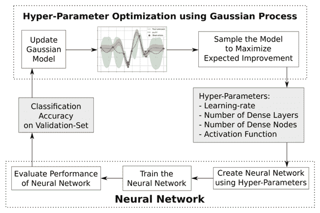
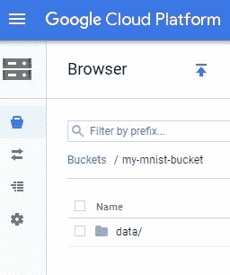
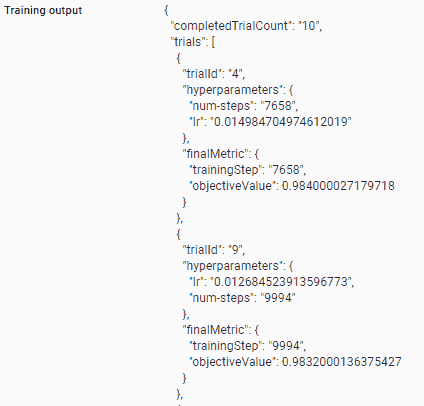

# 通过超参数调整优化模型

神经网络由多个参数组成，这些参数可以影响预测事件或标签的最终准确性。典型参数包括:

*   用于培训的批量
*   时代数
*   学习率
*   隐藏层数
*   每个隐藏层中隐藏单元的数量
*   应用于隐藏层的激活函数
*   使用的优化器

从前面的列表中，我们可以看到可以调整的参数数量非常多。这使得寻找超参数的最佳组合成为一个挑战。在这种情况下，Cloud ML Engine 提供的超参数调优服务就派上了用场。

在本章中，我们将介绍:

*   为什么需要超参数调谐
*   超参数调整工作原理概述
*   在云中实现超参数调优


# 超参数调谐的直觉

为了获得超参数调整需求的实际直觉，让我们在 MNIST 数据集上预测给定神经网络架构的准确性时经历以下场景:

*   **场景 1** :历元数多，学习率低
*   **场景 2** :纪元数少，学习率高

让我们在 Google Cloud 环境中创建训练和测试数据集，如下所示:

1.  下载数据集:

```
mkdir data

curl -O https://s3.amazonaws.com/img-datasets/mnist.pkl.gz

gzip -d mnist.pkl.gz

mv mnist.pkl data/          
```

前面的代码创建一个名为`data`的新文件夹，下载 MNIST 数据集，并将其移动到`data`文件夹中。

2.  在终端中打开 Python 并导入所需的包:

```
from __future__ import print_function 
import tensorflow as tf
import pickle # for handling the new data source
import numpy as np
from datetime import datetime # for filename conventions
from tensorflow.python.lib.io import file_io # for better file I/O
import sys
```

3.  导入 MNIST 数据集:

```
f = file_io.FileIO('data/mnist.pkl', mode='r')
data = pickle.load(f)
```

4.  提取训练和测试数据集:

```
(x_train, y_train), (x_test, y_test) = data
# Converting the data from a 28 x 28 shape to 784 columns
x_train = x_train.reshape(60000, 784)
x_train = x_train.astype('float32')
# Scaling the train dataset
x_train /= 255
# Reshaping the test dataset
x_test = x_test.reshape(10000, 784)
x_test = x_test.astype('float32')
# Scaling the test dataset
x_test /= 255
# Specifying the type of labels
y_train = y_train.astype(np.int32)
y_test = y_test.astype(np.int32)
```

5.  创建估计函数:

```
# Creating the estimator input functions for train and test datasets 
train_input_fn = tf.estimator.inputs.numpy_input_fn(
 x={"x2": np.array(x_train)},
 y=np.array(y_train),
 num_epochs=None,
 batch_size=1024,
 shuffle=True)
test_input_fn = tf.estimator.inputs.numpy_input_fn(
 x={"x2": np.array(x_test)},
 y=np.array(y_test),
 num_epochs=1,
 shuffle=False)
```

6.  指定列的类型:

```
feature_x = tf.feature_column.numeric_column("x2", shape=(784))
feature_columns = [feature_x]
```

7.  使用场景 1 中的参数构建 DNN 分类器；即，学习率为`0.1`，步数为`200`:

```
num_hidden_units = [1000]
lr=0.1
num_steps=200
# Building the estimator using DNN classifier
# This is where the learning rate hyper parameter is passed
model = tf.estimator.DNNClassifier(feature_columns=feature_columns,
                 hidden_units=num_hidden_units,
                 activation_fn=tf.nn.relu,
                 n_classes=10,
                 optimizer=tf.train.AdagradOptimizer(learning_rate = lr))
model.train(input_fn=train_input_fn, steps=num_steps) 
# Fetching the model results
result = model.evaluate(input_fn=test_input_fn)
print('Test loss:', result['average_loss'])
print('Test accuracy:', result['accuracy'])
```

在这种情况下，测试准确率为 96.49%。

在场景 2 中，我们将使用不同的参数构建另一个 DNN 分类器；现在学习率为`0.01`，步数为`2000`:

```
num_hidden_units = [1000]
lr=0.01
num_steps=2000
# Building the estimator using DNN classifier
# This is where the learning rate hyper parameter is passed
model = tf.estimator.DNNClassifier(feature_columns=feature_columns,
 hidden_units=num_hidden_units,
 activation_fn=tf.nn.relu,
 n_classes=10,
 optimizer=tf.train.AdagradOptimizer(learning_rate = lr))
model.train(input_fn=train_input_fn, steps=num_steps) 
# Fetching the model results
result = model.evaluate(input_fn=test_input_fn)
print('Test loss:', result['average_loss'])
print('Test accuracy:', result['accuracy']) 
```

场景 2 中测试数据集的准确率接近 98.2%。

前面的两个场景向我们展示了不同超参数的不同值如何影响最终结果的重要性。

在这种情况下，Google Cloud ML engine 就派上了用场，我们可以更智能地选择更优的超参数集。


# 超参数调整概述

超参数调整通过在单个培训作业中运行多次试验来实现。每次试验都是训练应用程序的一次完整执行，所选超参数的值设置在您指定的范围内。云 ML 引擎培训服务会跟踪每次试验的结果，并为后续试验做出调整。当作业完成时，您可以获得所有试验的摘要，以及根据您指定的标准最有效的值配置。

我们想要选择那些给出最佳性能的超参数。这相当于一个优化问题，具体来说，就是在一个紧集 *A.* 上优化一个函数 *f(x)* (也就是说，作为超参数值的函数的性能)的问题。我们可以用数学方法把它写成:


我们以函数 *(1-x) ^(ex)* 为例，该函数在 *x = 0* 处有一个最大值 *f(x) = 1* ，所以 *arg max* 为 *0* 。

很多优化设置，比如这个，都假设目标函数 *f(x)* 有一个已知的数学形式，是凸的，或者很容易计算。但是这些特征不适用于寻找超参数的问题，其中函数是未知的并且评估起来很昂贵。这就是贝叶斯优化发挥作用的地方。

为了实现超参数调优，Google 使用了一种叫做**高斯过程老虎机**的算法，这是贝叶斯优化的一种形式。

当函数的数学形式未知或者计算起来很昂贵时，贝叶斯优化是一种非常强大的技术。其背后的主要思想是基于数据计算目标函数的后验分布(使用著名的贝叶斯定理)，然后选择好的点来尝试这个分布。

为了使用贝叶斯优化，我们需要一种方法来灵活地对目标函数的分布进行建模。这比在实数上建模一个分布要稍微复杂一些，因为我们需要一个这样的分布来代表我们对于每个 *x* 的关于 *f(x)* 的信念。如果 *x* 包含连续的超参数，那么将会有无穷多个 *x* 我们必须为其建模 *f(x)* ，也就是为其构造一个分布。对于这个问题，高斯过程是一个特别优雅的技术。实际上，他们推广了多维高斯分布，并且确实存在足够灵活来模拟任何目标函数的版本。

上述过程通常如下图所示:



我们用迭代的结果更新高斯模型，这进一步帮助识别要为模型测试的正确的下一个超参数样本集；该结果进一步改进了我们的高斯模型，以识别要挑选的正确的超参数集。

高斯分布的细节超出了本书的范围，但是对于这个练习，我们将采用 Google 的方法(作为一个黑盒)并使用 Google Cloud 实现超参数调整。


# 谷歌云中的超参数调整

为了运行刚刚布置好的高斯过程，我们必须允许我们的模型构建在 Google Cloud 上运行，以便可以进行超参数调整。

为了运行超参数调整，以下是基本组件:

*   数据文件及其位置
*   模型文件
*   超参数配置文件
*   安装文件
*   `__init__`文件

假设我们在 Google Cloud ML 引擎上运行模型，数据应该驻留在一个云桶中，以便 ML 引擎可以访问它。

这可以通过在云外壳中执行以下操作来实现:

```
gsutil mb gs://my-mnist-bucket
gsutil cp -r data/mnist.pkl gs://my-mnist-bucket/data/mnist.pkl
```

注意，使用前面的步骤，我们已经创建了一个名为`my-mnist-bucket`的 bucket，并将我们的数据复制到这个 bucket 中。前面的代码应该会创建一个名为`data`的目录，并在该目录中创建`mnist.pkl`文件:



# 模型文件

模型文件应该位于同时包含`__init__.py`文件的文件夹中。

让我们创建一个名为`trainer`的文件夹，其中包含模型文件和`__init__`文件:

```
mkdir trainer
cd trainer
```

前面的代码创建了`trainer`文件夹，并将目录更改为新创建的文件夹。

让我们继续创建如下模型文件:

```
vim mnist_mlp_lr_numsteps.py
```

将以下代码插入先前创建的文件中:

```
from __future__ import print_function

import argparse
import pickle 
from datetime import datetime 
import numpy as np
from tensorflow.python.lib.io import file_io # for better file I/O
import sys
import tensorflow as tf

def train_model(train_file='data/mnist.pkl',job_dir='./tmp/mnist_mlp', num_steps = 1, lr=0.1, **args):
  # logs_path gives access to the logs that are generated by the previous epochs of model
  logs_path = job_dir + '/logs/' + str(datetime.now().isoformat())
  print('Using logs_path located at {}'.format(logs_path))
  # by default floats are considered as string
  # Good idea to convert them back into floats
  lr=float(lr)
  num_steps=float(num_steps)
  batch_size = 1024
  num_classes = 10
  # Reading in the pickle file. Pickle works differently with Python 2 vs 3
  # In Python 2 the following code would be:
  # f = file_io.FileIO(train_file, mode='r')
  # data = pickle.load(f)
  f = file_io.FileIO(train_file, mode='rb') 
  data = pickle.load(f,encoding='bytes') 
  (x_train, y_train), (x_test, y_test) = data
  # Converting the data from a 28X28 shape to 784 columns
  x_train = x_train.reshape(60000, 784)
  x_train = x_train.astype('float32')
  x_test = x_test.reshape(10000, 784)
  x_test = x_test.astype('float32')
  x_train /= 255
  x_test /= 255
  # Specifying the type of following labels
  y_train = y_train.astype(np.int32)
  y_test = y_test.astype(np.int32)

  # Creating the estimator following input functions 
  train_input_fn = tf.estimator.inputs.numpy_input_fn(
    x={"x2": np.array(x_train)},
    y=np.array(y_train),
    num_epochs=None,
    batch_size=batch_size,
    shuffle=True)
  test_input_fn = tf.estimator.inputs.numpy_input_fn(
    x={"x2": np.array(x_test)},
    y=np.array(y_test),
    num_epochs=1,
    shuffle=False)
  # Specifying the columns as numeric columns
  feature_x = tf.feature_column.numeric_column("x2", shape=(784))
  feature_columns = [feature_x]
  num_hidden_units = [1000]
  # Building the estimator using DNN classifier
  # This is where the learning rate hyper parameter is passed
  model = tf.estimator.DNNClassifier(feature_columns=feature_columns,
                                   hidden_units=num_hidden_units,
                                   activation_fn=tf.nn.relu,
                                   n_classes=num_classes,
                   optimizer=tf.train.AdagradOptimizer(learning_rate = lr))
  # Passing the other parameter: num_steps
  model.train(input_fn=train_input_fn, steps=num_steps) 
  # Fetching the model results
  result = model.evaluate(input_fn=test_input_fn)
  print('Test loss:', result['average_loss'])
  print('Test accuracy:', result['accuracy'])

if __name__ == '__main__':
  # Parse the input arguments for common Cloud ML Engine options
  # There are 4 arguments that we need to give, as per the preceding model specification 
  # training file location, job directory, number of steps and learning rate
  parser = argparse.ArgumentParser()
  parser.add_argument(
    '--train-file',
    help='Cloud Storage bucket or local path to training data')
  parser.add_argument(
    '--job-dir',
    help='Cloud storage bucket to export the model and store temp files')
  parser.add_argument(
    '--num-steps',
    help='number of steps')
  parser.add_argument(
    '--lr',
    help='learning rate') 

  args = parser.parse_args()
  arguments = args.__dict__
  train_model(**arguments)
```


# 配置文件

一旦建立了模型文件，我们需要在同一个 trainer 文件夹中提供配置文件，以便 ML engine 知道需要调整的参数，以及参数的典型最小值和最大值。

我们在`trainer`文件夹中创建如下配置文件:

```
vim hptune.yaml
```

以下代码插入到前面的文件中:

```
trainingInput:
  pythonVersion: "3.5"
  scaleTier: CUSTOM
  masterType: standard_gpu
  hyperparameters:
    goal: MAXIMIZE
    hyperparameterMetricTag: accuracy
    maxTrials: 10
    maxParallelTrials: 1
    params:
      - parameterName: num-steps
        type: INTEGER
        minValue: 200
        maxValue: 10000
        scaleType: UNIT_LINEAR_SCALE
      - parameterName: lr
        type: DOUBLE
        minValue: 0.001
        maxValue: 0.1
        scaleType: UNIT_LOG_SCALE
```

在前面的代码块中，我们指定了要运行的 Python 版本，还指定了它是要在 CPU 还是 GPU 上运行。

在`hyperparameters`部分，我们已经指定了我们需要优化的度量是准确性(注意`model.evaluate`的输出是`accuracy`、`loss`、`average loss`和`global step`)；目标是最大化它。

此外，我们还指定了要运行的最大试验数量和可以运行的最大并行试验数量(当云配置有多个关联的核心时会发生变化)。

`params`部分包含需要修改的参数、变量类型以及最小值和最大值。

`ScaleType`表示将应用于参数的缩放类型:

| **值** | **描述** |
| `UNIT_LINEAR_SCALE` | 将可行空间线性缩放到(0，1)。 |
| `UNIT_LOG_SCALE` | 用对数将可行空间缩放到(0，1)。整个可行空间必须是严格正的。 |
| `UNIT_REVERSE_LOG_SCALE` | 将可行空间反向对数缩放到(0，1)。结果是靠近可行空间顶部的值比靠近底部的点分散得更多。整个可行空间必须是严格正的。 |


# 安装文件

在某些情况下，我们可能不得不安装非预构建的包。在这种情况下,`setup.py`文件就派上了用场:

```
from setuptools import setup, find_packages
setup(name='mnist_mlp_lr_numsteps',
      version='1.0',
      packages=find_packages(),
      include_package_data=True,
      install_requires=[
          'keras',
          'h5py'],
      zip_safe=False)
```

在前面的代码中，可以包含运行模型文件所需的附加包。


# __init__ 文件

对于 Cloud ML engine 来说，要为我们正在构建的模块创建一个包，它需要为该模块创建一个包。对于要创建的包，需要在`trainer`文件夹中创建`__init__.py`文件。

为此，我们将运行以下代码:

```
touch trainer/__init__.py
```

现在整个设置都准备好了，我们按如下方式运行作业:

```
export BUCKET_NAME=my-mnist-bucket
export JOB_NAME="mnist_mlp_hpt_train_$(date +%Y%m%d_%H%M%S)"
export JOB_DIR=gs://$BUCKET_NAME/$JOB_NAME
export REGION=us-east1
export HPTUNING_CONFIG=hptune.yaml
gcloud ml-engine jobs submit training $JOB_NAME \
 --job-dir $JOB_DIR \
 --runtime-version 1.6 \
 --config $HPTUNING_CONFIG \
 --module-name trainer.mnist_mlp_lr_numsteps \
 --package-path ./trainer \
 --region $REGION \
 -- \
 --train-file gs://$BUCKET_NAME/data/mnist.pkl \
 --num-steps 100 \
 --lr 0.01
```

请注意，我们指定了数据所在的存储桶名称，以及需要存储日志的作业名称和目录。需要设置区域并指定配置文件。

此外，使用包的名称空间点符号将`--module-name`参数设置为应用程序主模块的名称。

注意，在指定 region 之后，我们有一个空白，表示现在是参数的开始(它们是训练文件位置、步数和学习速率)。

我们在前面的代码中指定的步数和学习率是默认版本，一旦传递给 ML 引擎作业，它们就会被更改。

代码的输出可以在我们运行的作业的培训输出中看到，如下所示:



然后可以从先前的输出中选择最佳超参数。我们可以看到, **0.0149** 的学习率和 **7658** 的步数产生了比我们之前测试的两个场景更高的测试数据集准确性。


# 摘要

在本章中，我们了解了不同的参数组合如何影响最终精度测量，以及使用 Cloud ML 引擎进行超参数调整如何有助于进一步提高精度。

在下一章中，我们将学习如何识别过度拟合，并通过设置正确的参数和定义适当的架构，使我们的模型对以前未见过的数据更加稳健。