# 十二、通过正则化防止过拟合

到目前为止，在前面的章节中，我们了解了如何构建神经网络、评估张量板结果以及改变神经网络模型的超参数以提高模型的准确性。

虽然超参数通常有助于提高模型的准确性，但是超参数的某些配置会导致模型过拟合训练数据，而不针对测试数据进行概括则是过拟合训练数据的问题。

正则化技术是一个关键参数，可以帮助我们在对未知数据集进行概化时避免过拟合。一些关键的正则化技术如下:

*   L2 正则化
*   L1 正则化
*   拒绝传统社会的人
*   缩放比例
*   批量标准化
*   重量初始化

在本章中，我们将讨论以下内容:

*   过度/欠拟合的直觉
*   使用正则化减少过拟合
*   改善拟合不足的情况

# 过度/欠拟合的直觉

在我们理解前面的技术是如何有用之前，让我们建立一个场景，以便我们理解过拟合的现象。

**场景 1:不在看不见的数据集上进行概化的情况**

在这个场景中，我们将创建一个数据集，它的输入和输出之间有一个清晰的线性可分映射。例如，当自变量为正时，输出为`[1,0]`，当输入变量为负时，输出为`[0,1]`:

对于该数据集，我们将通过添加一些与前面模式相反的数据点来添加少量噪声(前面创建的数据集的 10%)，也就是说，当输入变量为正时，输出为`[0,1]`，当输入变量为负时，输出为`[1,0]`:

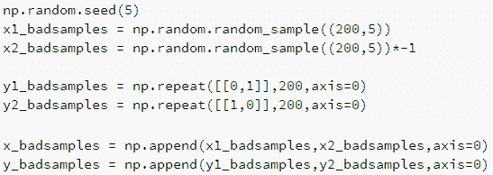

追加前两步获得的数据集为我们提供了训练数据集，如下所示:

在下一步中，我们创建测试数据集，它遵循大多数训练数据集遵循的标准，即当输入为正时，输出为`[1,0]`:

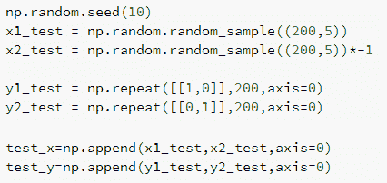

现在我们已经创建了数据集，让我们继续构建一个模型，用给定的输入来预测输出。

这里的直觉是，如果训练精度提高了 90.91%以上，这是一个经典的过拟合情况，因为模型试图适合少数观察值，这些观察值不会对看不见的数据集进行推广。

为了检查这一点，让我们首先导入所有相关的包来在`keras`中构建一个模型:

我们构建了一个具有三层的模型，其中各层在每个隐藏层中分别具有 1，000、500 和 100 个单位:

训练和测试数据集的损失和准确性的张量板可视化如下:

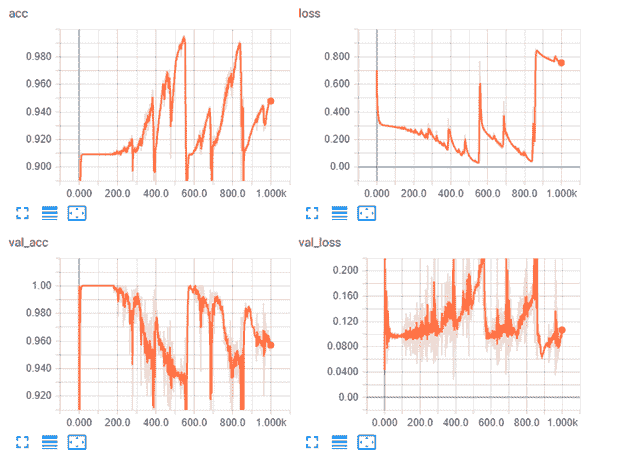

从前两个图表中，我们可以看到，随着训练数据集的损失减少，其准确性提高。

此外，请注意，训练损失并没有平稳减少，这可能向我们表明它与训练数据过拟合。

您应该注意到，随着训练数据集准确性的提高，验证准确性(测试准确性)开始下降，这再次向我们表明，该模型不能很好地推广到看不见的数据集。

这种现象通常发生在模型过于复杂并试图拟合最后几个错误分类以减少训练损失的时候。

# 减少过拟合

通常，过拟合会导致某些权重相对于其他权重非常高。为了理解这一点，让我们来看一下在*场景 1* 中对人工创建的数据集运行模型所获得的权重直方图:

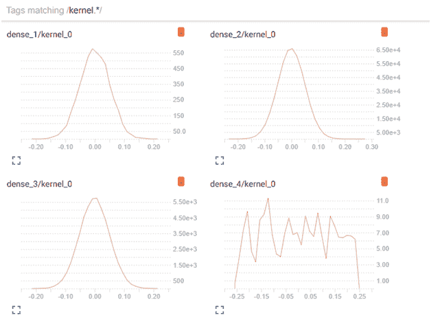

我们看到有些权重值很高(> 0.1)，大多数权重值都集中在零附近。

现在，让我们通过 L1 和 L2 的规则来探讨对高权重值进行处罚的影响。

正则化的直觉如下:

*   如果权重值被缩减到尽可能小，那么这些权重中的一些就不太可能对微调我们的模型以适应少数异常情况做出更多贡献

# 实现 L2 正则化

既然我们已经看到过拟合如何发生在我们的数据集上，我们将探讨 L2 正则化在减少数据集上的过拟合方面的影响。

数据集上的 L2 正则化可定义如下:

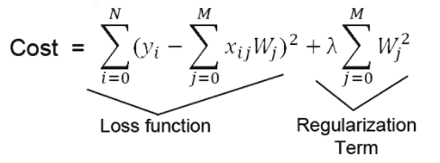

注意，损失函数是传统的损失函数，其中 *y* 是因变量， *x* 是自变量， *W* 是核(权重矩阵)。

正则项被添加到损失函数中。注意，正则化值是权重矩阵所有维度上权重值的平方和。假设我们正在最小化权重值的平方和以及损失函数，成本函数确保没有大的权重值，从而确保较少的过拟合发生。

λ参数是一个超参数，它调整我们赋予正则化项的权重。

让我们探讨一下将 L2 正则化添加到*场景 1* 中定义的模型的影响:

请注意，我们修改了在*场景 1* 中看到的代码，添加了`kernel_regularizer`，在本例中，它是λ值为`0.01`的 L2 正则化子。

当我们训练前面的模型时，请注意 TensorBoard 的输出:

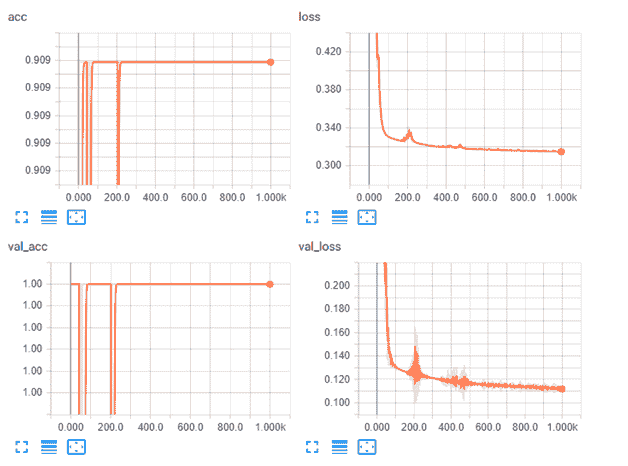

训练损失持续减少，验证精度保持稳定，而在不考虑过拟合情况的情况下，训练精度为 90.9%。

让我们研究一下权重的分布，以了解进行 L2 正则化和不进行正则化时权重分布之间的差异:

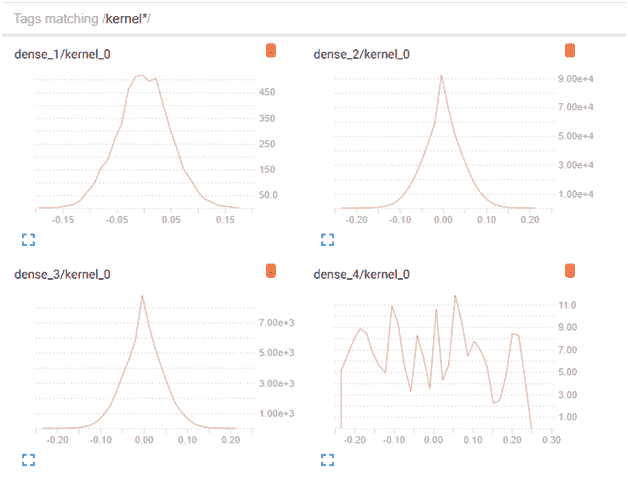

你应该注意到，与没有正则化的情况相比，在 L2 正则化的情况下，核(主要是在`dense_2`和`dense_3`处的核)在零处具有更尖锐的峰值。

为了进一步理解峰值分布，我们将修改 lambda 值，并为正则化赋予更高的权重 0.1，而不是 001，并看看权重看起来如何:

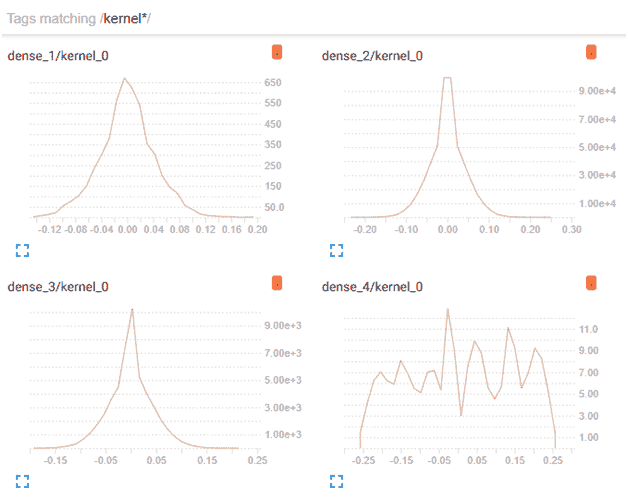

请注意，正则化项的权重越高，权重在中心(值为 0)的分布就越明显。

另外，你应该注意到内核是`dense_4`并且没有太大的变化，因为我们没有在这一层应用正则化。

从前面几点我们得出结论，通过实现 L2 正则化，我们可以减少当没有正则化时我们看到的过拟合问题。

# 实现 L1 正则化

L1 正则化以与 L2 相似的方式工作；然而，L1 正则化的成本函数不同于 L2 正则化，如下所示:

注意，在前面的等式中，所有项保持不变；正则项是权重绝对值的总和，而不是权重平方值的总和。

让我们用代码实现 L1 正则化；现在我们看到相应的输出如下:

注意，由于正则项不涉及 L1 正则化中的平方，当与 L2 相比时，我们可能必须降低 L1 中的λ值(假定大多数权重小于 1，平方它们将使权重值更小)。

后定义模型(这一次用正则化)，我们拟合它，如下:

根据我们的预期，前面的代码拟合导致了训练和测试数据集的准确性，如下所示:

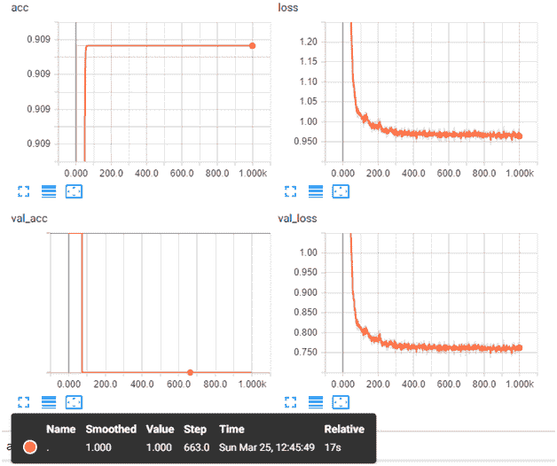

让我们看看直方图选项卡中各层的权重分布:

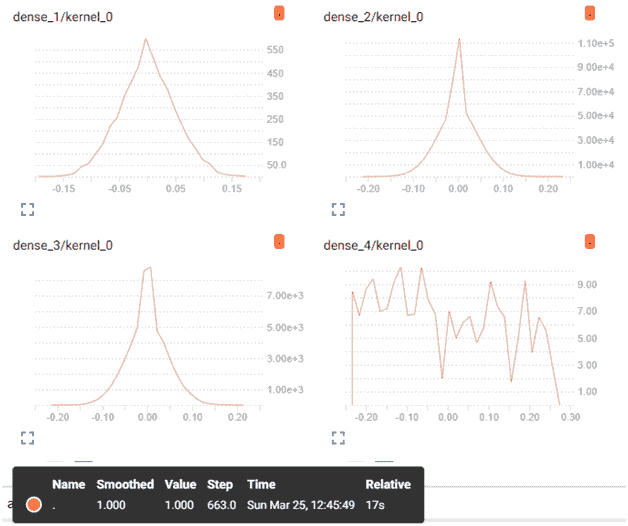

我们应该注意，这里的核分布类似于当 L2 正则化的λ值高时的核分布。

# 实现辍学

减少过拟合的另一种方法是实现下降技术。当在典型的反向传播中执行权重更新时，我们确保在给定时期更新权重时忽略权重的一些随机部分，因此命名为 dropout。

作为一种技术，丢弃也有助于减少过拟合，因为在单个时期中需要更新的权重数量的减少导致输出依赖于少数输入值的机会减少。

可以通过以下方式实现辍学:

模型拟合的结果如下:

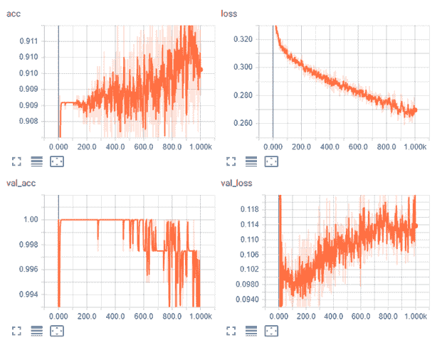

您应该注意到，与没有正则化的情况相比，给定配置中的丢失导致了稍微宽的权重分布:

# 减少欠拟合

欠拟合通常发生在以下情况:

*   该模型非常复杂，并且运行的时期很少
*   数据没有标准化

**场景 2:MNIST 数据集上的欠拟合动作**

在以下场景中，我们看到了 MNIST 数据集上的欠拟合情况:

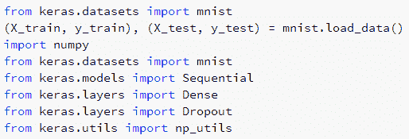

请注意，在前面的代码中，我们没有调整数据—定型和测试数据集列的值范围是 0 到 255:

前面模型的训练和测试数据集的准确性和损失的张量板可视化如下:

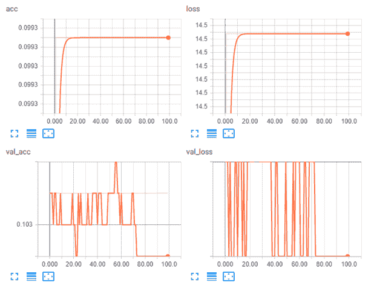

请注意，在前面的图表中，训练数据集的损失和准确性几乎没有变化(请注意这两个图表中的 *y* 轴值)。

这种情况(损失几乎不变)通常发生在输入的数字非常大(通常大于 5)的时候。

可以通过执行以下任一操作来纠正上述问题:

*   缩放数据
*   批量标准化

扩展数据就像重复前面的体系结构一样简单，但是对训练和测试数据集的扩展做了一些小的修改:

可按如下方式执行批量归一化(即使是在未缩放的 MNIST 数据集上):

训练和测试准确性的可视化如下所示:

在前面的场景中，我们看到，即使在未缩放的数据集上，测试精度也相当高。

**场景 3:不正确的重量初始化**

就像前面的场景一样，如果权重没有正确初始化(即使数据集是正确缩放的数据集)，我们很可能会遇到欠拟合的场景。例如，在下面的代码中，我们将所有权重(内核)初始化为零，然后注意测试数据集的准确性:

上述代码的输出导致以下张量板可视化:

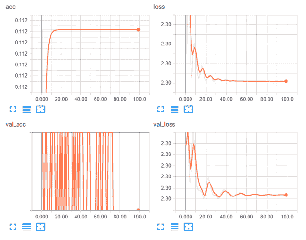

与*场景 2* 类似，前面的图表表明没有通过前面定义的架构进行学习。

没有学习发生，因为权重被初始化为零。

建议将权重初始化为正常初始化。其他可以用来测试准确性是否可以提高的初始化方法有:

*   `glorot_normal`
*   `lecun_uniform`
*   `glorot_uniform`
*   `he_normal`

# 摘要

在这一章中，我们已经看到过拟合的特征，以及如何通过 L1 和 L2 正则化和辍学来处理它们。类似地，我们已经看到存在大量欠拟合的场景，以及缩放或批量标准化如何帮助我们改善欠拟合的场景。