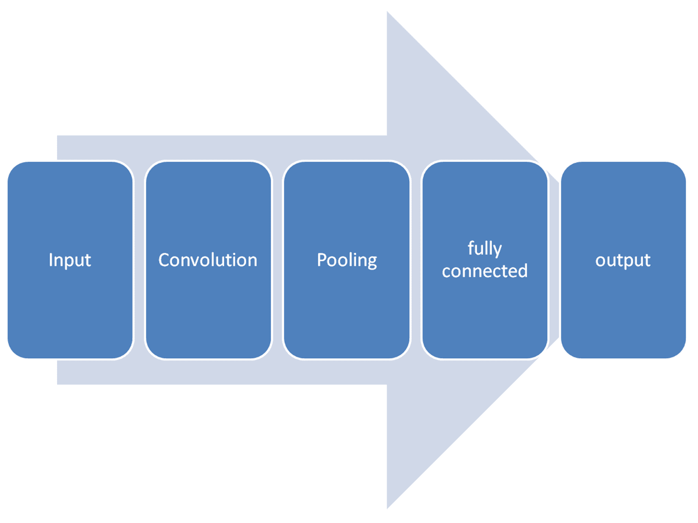
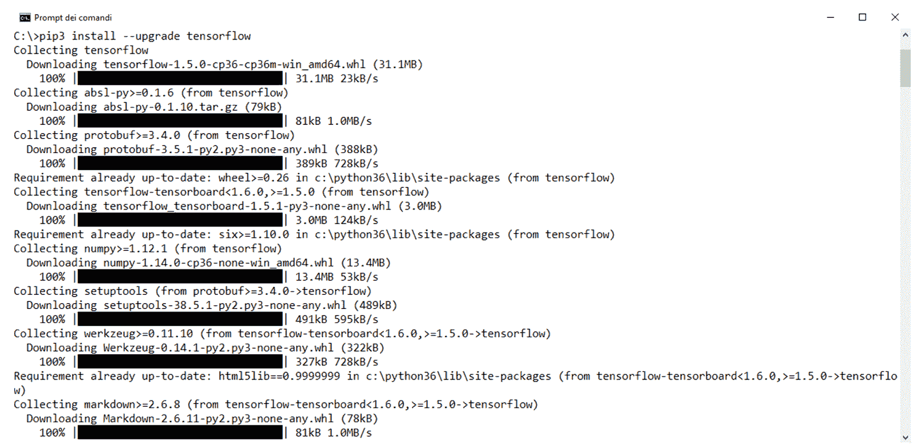
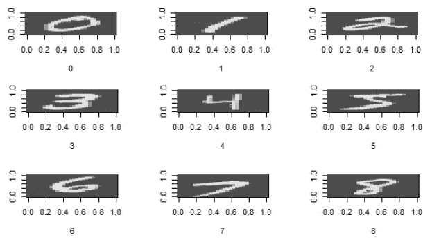
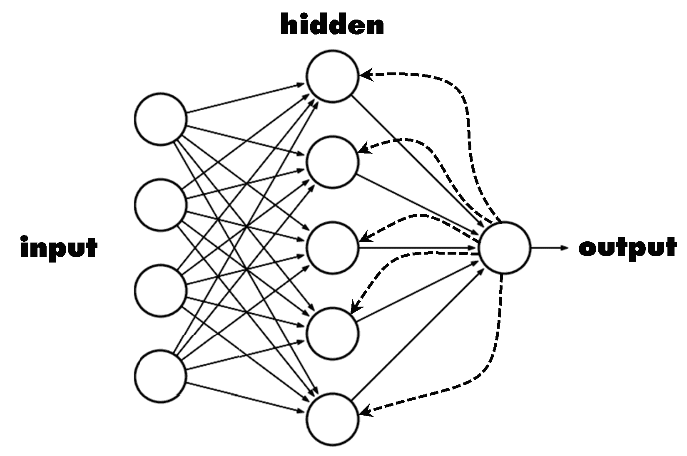
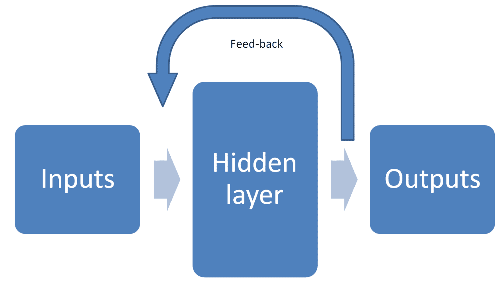
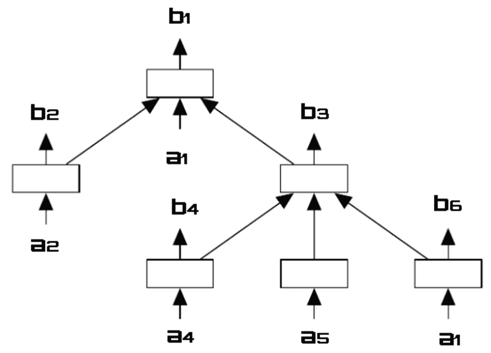
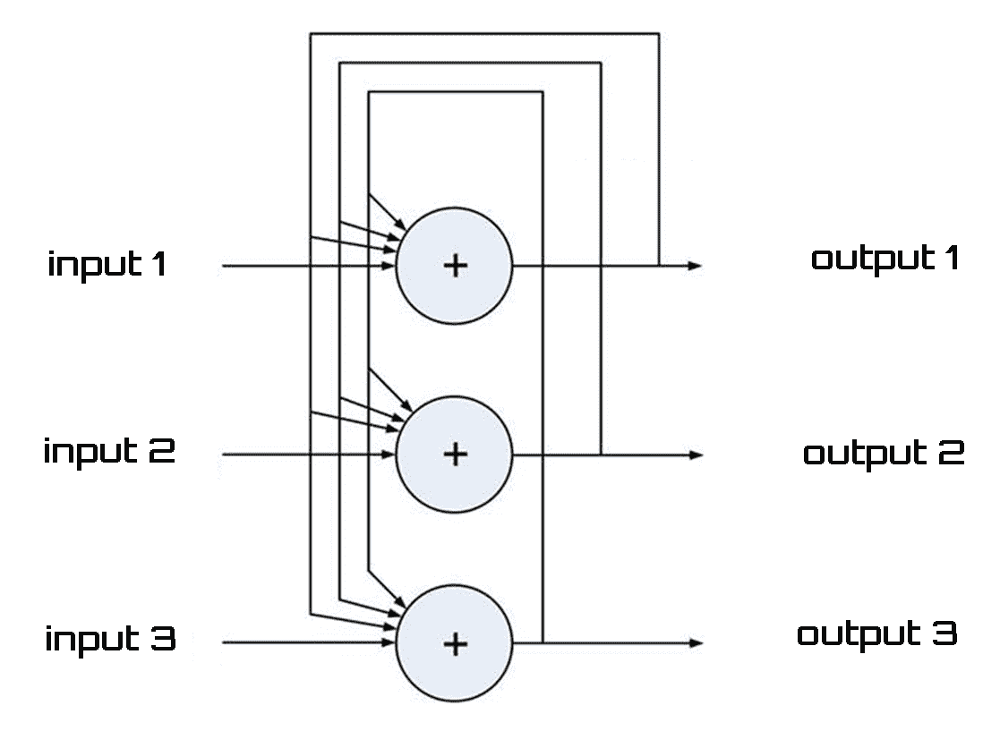
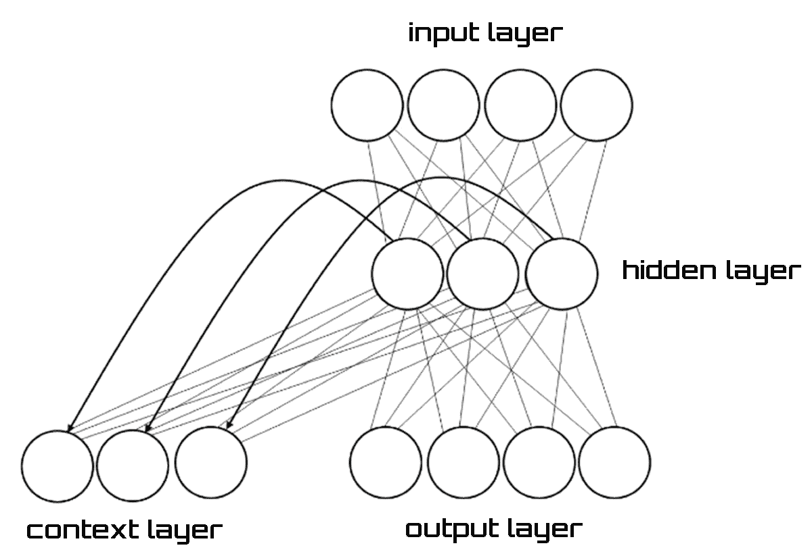
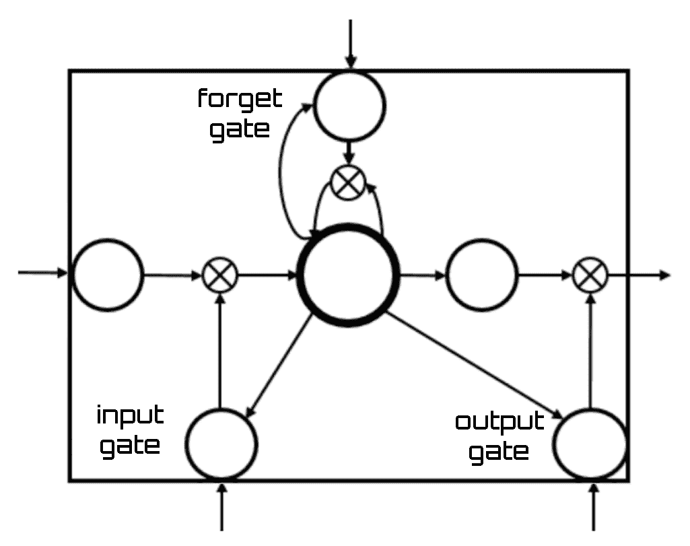

# 十三、超越前馈网络——CNN 和 RNN

**人工神经网络**(**ann**)现在是各种技术中极其广泛的工具。在最简单的应用中，人工神经网络为神经元之间的连接提供了前馈结构。前馈神经网络是第一种也是最简单的人工神经网络。在存在与一些问题相互作用的基本假设的情况下，前馈网络的固有单向结构具有很大的局限性。然而，有可能从它开始并创建网络，其中一个单元的计算结果影响另一个单元的计算过程。显然，管理这些网络动态的算法必须满足新的收敛标准。

在这一章中，我们将回顾主要的人工神经网络架构，如卷积神经网络、循环神经网络和**长短期记忆** ( **LSTM** )。我们将解释每种神经网络背后的概念，并告诉你它们应该应用于哪个问题。每种类型的神经网络都是用 TensorFlow 在真实数据集上实现的。

涵盖的主题有:

*   卷积网络及其应用
*   循环网络
*   LSTM 建筑

在本章的最后，我们将了解训练、测试和评估一个**卷积神经网络** ( **CNN** )。我们将学习如何在谷歌云平台中训练和测试 CNN 模型。我们将介绍 CNN 和 RNN 建筑的概念。我们也可以训练一个 LSTM 模型。读者将学习哪种类型的神经网络适用于不同的问题，以及如何在谷歌云平台上定义和实现它们。


# 卷积神经网络

ANN 是一系列受生物神经网络(人脑)启发的模型，从调节自然神经网络的机制出发，计划模拟人类思维。它们用于估计或近似可能依赖于大量输入的函数，其中许多输入通常是未知的。人工神经网络通常表现为相互连接的神经元系统，其中发生信息交换。每个连接都有一个相关的权重；权重的值可以根据经验进行调整，这使得神经网络成为一种能够适应各种类型的输入并具有学习能力的工具。

人工神经网络将神经元定义为中央处理单元，它执行数学运算，从一组输入中生成一个输出。神经元的输出是输入加上偏差的加权和的函数。每个神经元执行一个非常简单的操作，如果接收到的信号总量超过激活阈值，就会激活。下图显示了一个简单的人工神经网络体系结构:


本质上，CNN 是人工神经网络。事实上，就像后者一样，CNN 是由神经元通过加权分支(权重)相互连接而成的；网的训练参数再次是权重和偏差。

在 CNN 中，神经元之间的连接模式受到了动物世界中视觉皮层结构的启发。存在于大脑这一部分(视觉皮层)的单个神经元在一个狭窄的观察区域对某些刺激做出反应，这个区域被称为**感受域**。不同神经元的感受野部分重叠，以便覆盖整个视野。单个神经元对其感受野中发生的刺激的响应可以通过卷积运算在数学上近似。

与神经网络的训练相关的一切，即前向/后向传播和权重的更新，也适用于这种情况；此外，整个 CNN 总是使用可微分成本的单一函数。然而，CNN 做了一个特定的假设，即它们的输入具有精确的数据结构，例如图像，这允许它们在它们的架构中采用特定的属性来更好地处理这样的数据。

使用 FC 架构分层的正常神经网络(其中每层的每个神经元都连接到前一层的所有神经元(不包括偏置神经元))通常不会随着输入数据大小的增加而很好地扩展。

我们举一个实际的例子:假设我们要分析一个图像来检测物体。首先，让我们看看图像是如何处理的。我们知道，在一幅图像的编码中，它被分成一个个小方块的网格，每个小方块代表一个像素。在这一点上，为了对彩色图像进行编码，为每个正方形识别一定数量的阴影和不同的颜色等级就足够了。然后我们用适当的比特序列对每一个进行编码。下面是一个简单的图像编码:


网格中方块的数量决定了图像的分辨率。例如，1，600 像素宽、800 像素高(1，600 x 800)的图像包含(乘以)1，280，000 个像素，即 120 万个像素。为此，我们必须将三个颜色通道相乘，最终得到 1，600 x 800 x 3 = 3，840，000。因此，在第一个隐藏层中完全连接的每个神经元将有 3，840，000 个权重。这只是针对单个神经元；考虑到整个网络，事情肯定会变得不可收拾！

CNN 被设计成直接在由像素表示的图像中识别视觉模式，并且不需要或非常有限地需要预处理。他们能够识别极其多变的图案，例如代表真实世界的手绘文字和图像。

典型地，在分类的情况下，CNN 由几个交替的卷积和子采样级别(汇集)以及一个或多个 FC 最终级别组成。下图显示了一个经典的图像处理管道:



为了解决现实世界中的问题，可以根据需要经常组合和堆叠这些步骤。例如，可以有两层、三层甚至更多层的**卷积**。你可以输入所有你想减少数据大小的**池**。

如前所述，CNN 通常使用不同类型的电平。在接下来的几节中，我们将介绍主要的几个方面。


# 卷积层

这是层的主要类型；在 CNN 中使用这些层中的一层或多层是必要的。实际上，卷积层的参数与一组可行的滤波器相关。沿着宽度和高度维度，每个滤波器在空间上很小，但是它在应用它的输入体积的整个深度上延伸。

与普通的神经网络不同，卷积层具有三维组织的神经元:**宽度**、**高度**和**深度**。它们如下图所示:


在前向传播期间，每个过滤器沿着输入体积的宽度和高度平移，或者更准确地说，卷积，从而产生该过滤器的二维激活图(或特征图)。当滤波器沿着输入区域移动时，在滤波器的值和它所应用的输入部分的值之间执行标量积运算。

直观上，网络的目标是学习在输入的给定空间区域中存在某种特定类型的特征时被激活的滤波器。沿着深度维度的所有这些特征图(对于所有滤波器)的排队形成了卷积层的输出体。该体积的每个元素可以被解释为神经元的输出，该神经元仅观察输入的一小部分区域，并且与相同特征图中的其他神经元共享其参数。这是因为这些值都来自同一个过滤器的应用。

综上所述，让我们把注意力集中在以下几点:

*   **局部感受野**:一层的每个神经元(完全)连接到输入的一个小区域(称为**局部感受野**)；每个连接学习一个权重。
*   **共享权重**:由于感兴趣的特征(边缘、斑点等)可以在图像的任何地方找到，同一层的神经元共享权重。这意味着同一层的所有神经元将识别相同的特征，放置在输入的不同点。
*   **卷积**:相同的权重贴图应用于不同的位置。卷积输出被称为**特征图**。

每个过滤器捕捉前一层中存在的特征。所以为了提取不同的特征，我们需要训练多个卷积滤波器。每个过滤器返回一个突出显示不同特征的特征图。


# 整流线性单位

**整流线性单元** ( **ReLU** )在神经网络中起到神经元激活功能的作用。ReLU 级别由应用函数 f *(x) = max (0，x)* 的神经元组成。这些电平增加了网络的非线性，同时不改变卷积电平的接收场。ReLUs 的功能优于其他功能，例如双曲正切或 sigmoid，因为与它们相比，它导致更快的训练过程，而不会显著影响泛化精度。


# 池层

这些层被周期性地插入到网络中，以减少当前表示的空间大小(宽度和高度),以及特定网络阶段中的体积；这有助于减少网络的参数数量和计算时间。它还监控过拟合。汇集层独立地对输入体积的每个深度切片进行操作，以在空间上调整其大小。

例如，这种技术将输入图像分割成一组正方形，对于每个结果区域，它返回最大值作为输出。

CNN 也使用位于卷积层之后的池层。池层将输入划分为多个区域，并选择单个代表值(最大池和平均池)。使用池层:

*   减少后续层的计算
*   增加特征相对于空间位置的鲁棒性

它基于这样的概念，即一旦某个特征被识别，它在输入中的精确位置不如它相对于其他特征的近似位置重要。在典型的 CNN 架构中，卷积级和池级反复交替。


# 全连接层

这种类型的层与具有**全连接** ( **FC** )架构的经典 ANN 的任何层完全相同。简单地说，在 FC 层中，每个神经元都连接到前一层的所有神经元，特别是它们的激活。

这种类型的层，不像到目前为止在 CNN 中所见到的，不使用局部连通性的属性。FC 层连接到整个输入卷，因此，正如您所想象的，会有许多连接。这种类型的层的唯一可设置的参数是组成它的 K 个神经元的数量。基本上定义一个 FC 层的内容如下:将它的 K 个神经元与所有输入量连接起来，并计算它的 K 个神经元中的每一个神经元的激活。

事实上，它的输出将是一个 1 x 1 x K 的向量，包含计算的激活。使用单个 FC 层后，您从输入体积(以三维组织)切换到单个输出向量(以一维组织)的事实表明，在应用 FC 层后，不能再使用更多复杂的层。在 CNN 的上下文中，FC 层的主要功能是对到那时为止获得的信息进行一种分组，用单个数字(其一个神经元的激活)来表示，这将用于最终分类的后续计算。


# CNN 的结构

在详细分析了 CNN 的每一个组成部分之后，是时候从整体上看一下 CNN 的大致结构了。例如，从作为输入层的图像开始，将会有一系列的卷积层散布在 ReLU 层中，并且在必要时，还有标准化层和汇集层。最后，在输出层之前会有一系列 FC 层。这是一个 CNN 架构的例子:


基本思想是从大图开始，一步一步不断缩减数据，直到得到单一结果。卷积通道越多，神经网络就越能理解和处理复杂的函数。


# TensorFlow 概述

TensorFlow 是 Google 为机器智能提供的开源数值计算库。它隐藏了构建深度学习模型所需的所有编程，并为开发人员提供了编程的黑盒界面。

在 TensorFlow 中，图中的节点表示数学运算，而图边表示它们之间通信的多维数据数组(tensors)。TensorFlow 最初是由谷歌机器智能研究内部的谷歌大脑团队开发的，用于机器学习和深度神经网络研究，但它现在可以在公共领域使用。适当配置后，TensorFlow 会利用 GPU 处理。

TensorFlow 的一般用例如下:

*   图像识别
*   计算机视觉
*   语音/声音识别
*   时间序列分析
*   语言检测
*   语言翻译
*   基于文本的处理
*   手写识别
*   许多其他人

要使用 TensorFlow，首先要安装 Python。如果您的机器上没有安装 Python，那么是时候安装了。Python 是一种动态的**面向对象编程** ( **OOP** )语言，可用于多种类型的软件开发。它为与其他语言和程序的集成提供了强大的支持，提供了一个大型标准库，并且可以在几天内学会。许多 Python 程序员可以证实生产率的大幅提高，并认为这鼓励了更高质量代码和可维护性的开发。

Python 可以在 Windows、Linux/Unix、macOS X、OS/2、Amiga、掌上电脑和诺基亚手机上运行。它也适用于 Java 和。NET 虚拟机。Python 是在 OSI 批准的开源许可证下授权的；它的使用是免费的，包括商业产品。

Python 是由吉多·范·罗苏姆在 20 世纪 90 年代早期在荷兰 Stichting Mathematisch Centrum 创建的，作为一种叫做 **ABC** 的语言的继承者。Guido 仍然是 Python 的主要作者，尽管它包含了其他人的许多贡献。

如果你不知道使用哪个版本，有一个英文文档可以帮助你选择。原则上，如果你必须从头开始，我们建议选择 Python 3.6。关于可用版本以及如何安装 Python 的所有信息都在[https://www.python.org/](https://www.python.org/)上给出。

在正确安装了我们机器的 Python 版本后，我们还要担心安装 TensorFlow 的问题。我们可以通过以下链接检索所有库信息和操作系统的可用版本:[https://www.tensorflow.org/](https://www.tensorflow.org/)。

此外，在安装部分，我们可以找到一系列指南，解释如何安装允许我们用 Python 编写应用的 TensorFlow 版本。指南适用于以下操作系统:

*   人的本质
*   mac os x
*   Windows 操作系统

例如，要在 Windows 上安装 TensorFlow，我们必须选择以下类型之一:

*   仅支持 CPU 的 TensorFlow
*   支持 GPU 的 TensorFlow

要安装 TensorFlow，请以管理员权限启动终端。然后在该终端中发出适当的`pip3 install`命令。要安装纯 CPU 版本，请输入以下命令:

```py
C:\> pip3 install --upgrade tensorflow
```

一系列代码行将显示在视频上，以便我们了解安装过程的执行情况，如下图所示:



该过程结束时，将显示以下代码:

```py
Successfully installed absl-py-0.1.10 markdown-2.6.11 numpy-1.14.0 protobuf-3.5.1 setuptools-38.5.1 tensorflow-1.5.0 tensorflow-tensorboard-1.5.1 werkzeug-0.14.1
```

要验证安装，从 shell 中调用`python`,如下所示:

```py
python
```

在 Python 交互式 shell 中输入以下简短程序:

```py
>>> import tensorflow as tf
>>> hello = tf.constant('Hello, TensorFlow!')
>>> sess = tf.Session()
>>> print(sess.run(hello))
```

如果系统输出以下内容，那么您就可以开始编写 TensorFlow 程序了:

```py
Hello, TensorFlow!
```

在这种情况下，您将得到一个确认，确认您的计算机上是否正确安装了库。现在你只需要使用它。


# 使用 CNN 和 TensorFlow 的手写识别

**手写识别** ( **HWR** )是现代科技中非常常用的程序。通过光学扫描(**光学字符识别**或 **OCR** )或智能文字识别，可以从一张纸上离线检测出书写文本的图像。或者，可以在线检测笔尖移动(例如，从笔式计算机表面，这是一项通常更容易的任务，因为有更多的线索可用)。

从技术上来说，手写识别是计算机接收和解释来自纸质文档、照片、触摸屏和其他设备等来源的手写可理解输入的能力。HWR 是通过通常需要 OCR 的各种技术来执行的。然而，一个完整的文字识别系统还管理格式，执行正确的字符分割，并找到最合理的单词。

**修改后的国家标准与技术研究院** ( **MNIST** )是一个大型的手写数字数据库。它有一组 70，000 个数据示例。这是 NIST 更大数据集的一个子集。这些数字具有 28×28 像素的分辨率，并且存储在 70，000 行和 785 列的矩阵中；784 列形成来自 28×28 矩阵的每个像素值，并且一个值是实际数字。数字已经过大小标准化，并在固定大小的图像中居中。

MNIST 集合中的数字图像最初是由 Chris Burges 和 Corinna Cortes 使用边界框归一化和居中来选择和实验的。Yann LeCun 的版本在一个更大的窗口中使用质心居中。这些数据可以在 Yann LeCun 的网站上找到，地址是
[【http://yann.lecun.com/exdb/mnist/】](http://yann.lecun.com/exdb/mnist/)。

每个图像都是以 28 x 28 的尺寸创建的。下图显示了 MNIST 数据集中 0-8 的图像样本:



MNIST 有几个手写数字的样本。这个数据集可以作为我们的训练输入到 Python 程序中，我们的代码可以识别任何作为预测数据出现的新的手写数字。这是一个神经网络架构作为人工智能应用的计算机视觉系统的例子。下表显示了可在 LeCun 网站上获得的 MNIST 数据集的分布情况:

| **数字** | **计数** |
| Zero | Five thousand nine hundred and twenty-three |
| one | Six thousand seven hundred and forty-two |
| Two | Five thousand nine hundred and fifty-eight |
| three | Six thousand one hundred and thirty-one |
| four | Five thousand eight hundred and forty-two |
| five | Five thousand four hundred and twenty-one |
| six | Five thousand nine hundred and eighteen |
| seven | Six thousand two hundred and sixty-five |
| eight | Five thousand eight hundred and fifty-one |
| nine | Five thousand nine hundred and forty-nine |

我们将使用 TensorFlow 库来训练和测试 MNIST 数据集。我们将把 70，000 行的数据集分成 60，000 个训练行和 10，000 个测试行。接下来，我们会发现模型的准确性。然后，该模型可以用于预测任何包含 0 到 9 之间的数字的 28 x 28 像素手写数字的传入数据集。对于我们的示例 Python 代码，我们使用一个 100 行的训练数据集和一个 10 行的测试数据集。在本例中，我们将学习使用 TensorFlow layers 模块，该模块提供了一个高级 API，可以轻松构建神经网络。它提供了便于创建密集(FC)图层和卷积图层、添加激活函数以及应用下降正则化的方法。

首先，我们将逐行分析代码，然后我们将看看如何使用 Google 云平台提供的工具来处理它。现在，让我们通过代码来学习如何应用 CNN 来解决 HWR 问题。让我们从代码的开头开始:

```py
from __future__ import absolute_import
from __future__ import division
from __future__ import print_function
```

添加这三行代码是为了编写 Python 2/3 兼容的代码库。所以让我们继续导入模块:

```py
import numpy as np
import tensorflow as tf
```

这样，我们就导入了`numpy`和`tensorflow`模块。让我们分析下一行代码:

```py
tf.logging.set_verbosity(tf.logging.INFO)
```

此代码设置了将记录哪些消息的阈值。在初始阶段之后，我们通过定义允许我们建立 CNN 模型的函数:

```py
def cnn_model_fn(features, labels, mode):
```

我们就这样定义了这个函数。现在让我们继续:

```py
input_layer = tf.reshape(features["x"], [-1, 28, 28, 1])
```

在该代码行中，我们按照 layers 模块中方法的预期，以(`batch_size`、`image_width`、`image_height`、`channels`)的形式传递了输入张量，用于为二维图像数据创建卷积层和池层。让我们继续讨论第一个卷积层:

```py
conv1 = tf.layers.conv2d(
      inputs=input_layer,
      filters=32,
      kernel_size=[5, 5],
      padding="same",
      activation=tf.nn.relu)
```

该层创建卷积核，该卷积核与层输入卷积以产生输出张量。卷积中的滤波器数为 32，2D 卷积窗的高度和宽度为`[5,5]`，激活函数为 ReLU 函数。为此，我们在 layers 模块中使用了`conv2d()`方法。接下来，我们将第一个池层连接到我们刚刚创建的卷积层:

```py
pool1 = tf.layers.max_pooling2d(inputs=conv1,
                       pool_size=[2, 2], strides=2)
```

我们在层中使用了`max_pooling2d()`方法来构建一个层，该层使用 2 x 2 过滤器和`2`的步幅来执行最大池。现在我们将第二个卷积层连接到 CNN:

```py
conv2 = tf.layers.conv2d(
    inputs=pool1,
    filters=64,
    kernel_size=[5, 5],
    padding="same",
    activation=tf.nn.relu)
```

现在，我们将第二个池层连接到 CNN:

```py
pool2 = tf.layers.max_pooling2d(inputs=conv2,
                   pool_size=[2, 2], strides=2)
pool2_flat = tf.reshape(pool2, [-1, 7 * 7 * 64])
```

接下来，我们将添加一个密集层:

```py
dense = tf.layers.dense(inputs=pool2_flat,
                units=1024, activation=tf.nn.relu)
```

使用此代码，我们添加了一个具有 1，024 个神经元的密集层，并重新激活我们的 CNN，以对卷积/池层提取的特征执行分类。

记住，ReLU 级别由应用函数 *f(x) = max (0，x)* 的神经元组成。这些电平增加了网络的非线性，同时，它们不修改卷积电平的接收场。

为了改善结果，我们将对密集图层应用下降正则化:

```py
dropout = tf.layers.dropout(inputs=dense,
            rate=0.4, training=mode ==
                      tf.estimator.ModeKeys.TRAIN)
```

为了做到这一点，我们在层中使用了 dropout 方法。接下来，我们将为我们的神经网络添加最后一层:

```py
logits = tf.layers.dense(inputs=dropout, units=10)
```

这是`logits`层，它将返回我们预测的原始值。在前面的代码中，我们创建了一个带有`10`神经元的密集层(每个目标类 0-9 一个),具有线性激活。我们只需要做出预测:

```py
predictions = {
      "classes": tf.argmax(input=logits, axis=1),
       "probabilities": tf.nn.softmax(logits, name="softmax_tensor")
  }
  if mode == tf.estimator.ModeKeys.PREDICT:
        return tf.estimator.EstimatorSpec(mode=mode,
                           predictions=predictions)
```

我们将从预测中生成的原始值转换为模型函数可以返回的两种不同格式:一个从 0 到 9 的数字，以及该示例为 0、1、2 等的概率。我们在 dict 中编译我们的预测并返回一个`EstimatorSpec`对象。现在，我们将通过定义一个`loss`函数:

```py
loss = tf.losses.sparse_softmax_cross_entropy(labels=labels, logits=logits)
```

一个`loss`函数测量模型的预测与目标类的匹配程度。该功能用于训练和评估。我们将配置我们的模型，以在训练期间优化此损失值:

```py
if mode == tf.estimator.ModeKeys.TRAIN:
    optimizer = tf.train.GradientDescentOptimizer(learning_rate=0.001)
    train_op = optimizer.minimize(
        loss=loss,
        global_step=tf.train.get_global_step())
    return tf.estimator.EstimatorSpec(mode=mode, loss=loss, train_op=train_op)
```

我们使用学习率`0.001`和随机梯度下降作为优化算法。现在，我们将在模型中添加一个准确性指标:

```py
  eval_metric_ops = {
      "accuracy": tf.metrics.accuracy(
          labels=labels, predictions=predictions["classes"])}
  return tf.estimator.EstimatorSpec(
      mode=mode, loss=loss, eval_metric_ops=eval_metric_ops)
```

为此，我们在`EVAL`模式中定义了`eval_metric_ops`字典。我们因此定义了我们网络的架构；现在有必要定义代码来训练和测试我们的网络。为此，我们将在 Python 代码中添加一个`main()`函数:

```py
def main(unused_argv):
```

然后，我们将加载训练和评估数据:

```py
  mnist = tf.contrib.learn.datasets.load_dataset("mnist")
  train_data = mnist.train.images 
  train_labels = np.asarray(mnist.train.labels, dtype=np.int32)
  eval_data = mnist.test.images 
  eval_labels = np.asarray(mnist.test.labels, dtype=np.int32)
```

在这段代码中，我们将训练特征数据和训练标签分别存储为`train_data`和`train_labels`中的`numpy`数组。类似地，我们将评估特征数据和评估标签分别存储在`eval_data`和`eval_labels`中。接下来，我们将为我们的模型创建一个`Estimator`:

```py
  mnist_classifier = tf.estimator.Estimator(
      model_fn=cnn_model_fn, model_dir="/tmp/mnist_convnet_model")
```

An `Estimator`是一个 TensorFlow 类，用于执行高级模型训练、评估和推理。以下代码为预测设置日志记录:

```py
  tensors_to_log = {"probabilities": "softmax_tensor"}
  logging_hook = tf.train.LoggingTensorHook(
      tensors=tensors_to_log, every_n_iter=50)
```

现在我们准备训练我们的模型:

```py
    train_input_fn = tf.estimator.inputs.numpy_input_fn(
      x={"x": train_data},
      y=train_labels,
      batch_size=100,
      num_epochs=None,
      shuffle=True)
  mnist_classifier.train(
      input_fn=train_input_fn,
      steps=15000,
      hooks=[logging_hook])
```

为此，我们在`mnist_classifier`上创建了`train_input_fn`并调用了`train()`。在前面的代码中，我们修正了`steps=15000`，这意味着模型将总共训练 15000 步。

根据我们机器上安装的处理器，执行此训练所需的时间会有所不同，但无论如何，可能会超过 1 个小时。要在更少的时间内执行这样的训练，可以减少传递给`train()`函数的步骤数；很明显，这种变化将对算法的准确性产生负面影响。

最后，我们将评估模型并打印结果:

```py
    eval_input_fn = tf.estimator.inputs.numpy_input_fn(
      x={"x": eval_data},
      y=eval_labels,
      num_epochs=1,
      shuffle=False)
  eval_results = mnist_classifier.evaluate(input_fn=eval_input_fn)
  print(eval_results)
```

我们调用了`evaluate`方法，该方法评估我们在`model_fn`的`eval_metriced_ops`参数中指定的指标。我们的 Python 代码以下面几行结束:

```py
if __name__ == "__main__":
  tf.app.run()
```

这些行只是一个非常快速的包装器，它处理标志解析，然后分派给你自己的主函数。此时，我们只需将整个代码复制到一个扩展名为`.py`的文件中，并在安装了 Python 和 TensorFlow 的机器上运行它。


# 在 Google Cloud Shell 上运行 Python 代码

Google Cloud Shell 提供了直接从浏览器对云资源的命令行访问。您可以轻松管理项目和资源，而无需在系统中安装 Google Cloud SDK 或其他工具。有了 Cloud Shell，来自 Cloud SDK 的`gcloud`命令行工具和其他必要的实用程序在您需要时总是可用、更新和完全认证的。

以下是谷歌云外壳的一些功能:

*   这是一个 shell 环境，用于管理托管在 Google 云平台上的资源。
*   我们可以用 Linux shell 的灵活性来管理我们的 GCP 资源。云外壳在 web 控制台中打开的终端窗口中提供对虚拟机实例的命令行访问。
*   它为访问谷歌云平台上托管的项目和资源提供集成授权。
*   许多您喜欢的命令行工具，从 bash 和 sh 到 emacs 和 vim，都已经预先安装和更新了。MySQL 客户端、Kubernetes 和 Docker 等管理工具已经配置好并准备就绪。您不再需要担心安装最新版本及其所有依赖项。只需连接云壳。

开发人员将可以使用所有喜欢的预配置开发工具。你会发现 Java、Go、Python、Node.js、PHP 和 Ruby 的开发和实现工具。在 Cloud Shell 实例中运行 web 应用，并在浏览器中预览它们。然后使用预先配置的 Git 和 Mercurial 客户机再次提交到存储库。

云外壳提供 5 GB 的永久磁盘存储空间，在云外壳实例上挂载为`$ HOME`目录。存储在`$ HOME`目录中的所有文件，包括用户配置脚本和文件，如`bashrc`和`vimrc`，从一个会话持续到另一个会话。

要启动云壳，只需点击控制台窗口顶部的激活 Google 云壳按钮，如下图所示:


云 Shell 会话在控制台底部的新框架中打开，并显示命令行提示符。初始化 shell 会话可能需要几秒钟时间。现在，我们的云 Shell 会话已经可以使用了，如下面的截图所示:


此时，我们需要将包含 Python 代码的`cnn_hwr.py`文件转移到 Google 云平台中。我们已经看到，要做到这一点，我们可以使用谷歌云存储提供的资源。然后我们打开 Google 云存储浏览器，创建一个新的 bucket。

请记住，存储桶是保存数据的基本容器。你存储在云存储中的所有东西都必须包含在一个桶中。您可以使用存储桶来组织数据和控制对数据的访问，但与目录和文件夹不同，您不能嵌套存储桶。

要将`cnn_hwr.py`文件传输到 Google Storage，请执行以下步骤:

1.  只需点击创建存储桶图标
2.  在创建存储桶窗口中键入新存储桶的名称(`cnn-hwr`)
3.  此后，桶列表中会出现一个新的桶
4.  点击`cnn-hwr`桶
5.  在打开的窗口中点击上传文件图标
6.  在打开的对话框窗口中选择文件
7.  单击打开

此时，我们的文件将在新的存储桶中可用，如下图所示:


现在我们可以从 Cloud Shell 访问该文件。为此，我们在 shell 中创建了一个新文件夹。在 shell 提示符下键入以下命令:

```py
mkdir CNN-HWR
```

现在，要将文件从 Google 存储桶复制到`CNN-HWR`文件夹，只需在 shell 提示符下键入以下命令:

```py
gsutil cp gs://cnn-hwr-mlengine/cnn_hwr.py CNN-HWR
```

将显示以下代码:

```py
giuseppe_ciaburro@progetto-1-191608:~$ gsutil cp gs://cnn-hwr/cnn_hwr.py CNN-HWR
Copying gs://cnn-hwr/cnn_hwr.py...
/ [1 files][ 5.7 KiB/ 5.7 KiB]
Operation completed over 1 objects/5.7 KiB.
```

现在，让我们进入该文件夹，验证该文件是否存在:

```py
$cd CNN-HWR
$ls
cnn_hwr.py
```

我们只需要运行文件:

```py
$ python cnn_hwr.py
```

将显示一系列初步说明:

```py
Successfully downloaded train-images-idx3-ubyte.gz 9912422 bytes.
Extracting MNIST-data/train-images-idx3-ubyte.gz
Successfully downloaded train-labels-idx1-ubyte.gz 28881 bytes.
Extracting MNIST-data/train-labels-idx1-ubyte.gz
Successfully downloaded t10k-images-idx3-ubyte.gz 1648877 bytes.
Extracting MNIST-data/t10k-images-idx3-ubyte.gz
Successfully downloaded t10k-labels-idx1-ubyte.gz 4542 bytes.
Extracting MNIST-data/t10k-labels-idx1-ubyte.gz
INFO:tensorflow:Using default config.
```

它们表明数据下载成功，TensorFlow 库的调用也是如此。从这一点开始，网络的训练就开始了，正如我们所预料的，这可能是相当长的时间。在算法执行结束时，将返回以下信息:

```py
INFO:tensorflow:Saving checkpoints for 15000 into /tmp/mnist_convnet_model/model.ckpt.
INFO:tensorflow:Loss for final step: 2.2751274.INFO:tensorflow:Starting evaluation at 2018-02-19-08:47:04
INFO:tensorflow:Restoring parameters from /tmp/mnist_convnet_model/model.ckpt-15000
INFO:tensorflow:Finished evaluation at 2018-02-19-08:47:56
INFO:tensorflow:Saving dict for global step 15000: accuracy = 0.9723, global_step = 15000, loss = 0.098432
{'loss': 0.098432, 'global_step': 15000, 'accuracy': 0.9723}
```

在这种情况下，我们在测试数据集上实现了百分之`97.2`的准确率。


# 循环神经网络

前馈神经网络基于输入数据，该输入数据被提供给网络并被转换成输出。如果是监督学习算法，输出就是能识别输入的标签。基本上，这些算法通过识别模式将原始数据与特定类别联系起来。另一方面，循环网络不仅将当前输入数据作为输入，而且将它们随时间推移所经历的数据作为输入。

一个**循环神经网络** ( **RNN** )是一个神经模型，其中存在双向信息流。换句话说，虽然前馈网络中的信号传播仅在从输入到输出的方向上以连续的方式发生，但是循环网络是不同的。在它们中，这种传播也可以发生在前一层之后的神经层中，或者在属于同一层的神经元之间，甚至在神经元和它自己之间。

循环网络在特定时刻做出的决策会影响它随后立即做出的决策。因此，循环网络有两个输入源——现在和最近的过去——它们结合起来决定如何对新数据做出反应，就像人们在日常生活中所做的那样。

循环网络不同于前馈网络，这是因为反馈回路与它们过去的决策相关联，从而暂时接受它们的输出作为输入。可以通过说循环网络具有记忆来强调这个特征。给神经网络增加记忆是有目的的:序列本身就有信息，循环网络用它来完成前馈网络不能完成的任务。

对内存的访问是通过内容进行的，而不是通过地址或位置。一种方法是，记忆内容是 RNN 节点上的激活模式。想法是用激活方案启动网络，该激活方案是所请求的存储器内容的部分或有噪声的表示，并且网络稳定在所需的内容上。

RNN 是一类神经网络，其中神经元之间至少有一个反馈连接，形成有向循环。下图显示了输出图层和隐藏图层之间存在连接的典型 RNN:



在图中所示的循环网络中，输入级和输出级都用于定义隐藏级的权重。

最终，我们可以认为 RNNs 是 ann 的一种变体:这些变体可以在不同数量的隐藏级别和不同的数据流趋势上进行表征。RNN 的特点是数据流的趋势不同，事实上神经元之间的连接形成一个循环。与前馈网络不同，rnn 可以使用内存进行处理。rnn 是一类人工神经网络，其特征在于隐藏层之间的连接，隐藏层通过时间传播以学习序列。

数据保存在内存中以及在不同时间段流动的方式使得 RNNs 强大而成功。RNN 用例包括以下字段:

*   股票市场预测
*   图像字幕
*   天气预报
*   基于时间序列的预测
*   语言翻译
*   语音识别
*   HWR
*   音频或视频处理
*   机器人动作排序

循环网络被设计为将模式识别为数据序列，并且有助于预测和预报。他们可以处理文本、图像、语音和时间序列数据。rnn 是强大的 ann 之一，代表生物大脑，包括具有处理能力的记忆。

循环网络从当前输入(类似前馈网络)和先前计算的输出中获取输入。在下图中，我们比较了前馈神经网络和 RNN 的单神经元操作方案:


正如我们在刚刚提出的简单的单神经元方案中所看到的，在 RNN 中，反馈信号被添加到输入信号中。反馈是一个相当重要的特征。与仅限于从输入到输出的单向信号的简单网络相比，反馈网络更有可能更新并且具有更大的计算能力。反馈网络展示了单向网络无法揭示的现象和过程。

为了理解 ANN 和 RNN 之间的差异，我们将 RNN 视为神经网络的网络，并且循环性质以如下方式展开:在不同的时间段( *t-1* 、 *t* 、 *t+1* 等等)考虑神经元的状态，直到收敛或者直到达到总次数。

网络学习阶段可以使用类似于导致前馈网络的反向传播算法的梯度下降过程来执行。至少这在简单架构和确定性激活函数的情况下是有效的。当激活是随机的时，模拟退火方法可能更合适。

RNN 建筑可以有许多不同的形式。数据反向流动的方式有更多的变化:

*   完全循环
*   递归的
*   霍普菲尔德
*   埃尔曼网络公司
*   LSTM
*   门控循环单元
*   双向的
*   复发性 MLP

在接下来的几页中，我们将分析其中一些网络的架构。


# 完全循环神经网络

一个完全的 RNN 是一个神经元网络，每个神经元都与其他神经元有直接的(单向的)连接。每个神经元都有一个时变的实值激活。每个连接都有一个可修改的实值权重。需要输入神经元、输出神经元和隐藏神经元。这种类型的网络是一个多层感知器，前一组隐藏单元激活随着输入反馈到网络中，如下图所示:



在每一步，每个非输入单元计算其当前激活，作为连接到它的所有单元的激活的加权和的非线性函数。


# 循环神经网络

循环网络只是循环网络的推广。在循环网络中，权重是共享的，并且维度沿着序列的长度保持不变。在循环网络中，权重是共享的，维数保持不变，但在每个节点都是如此。下图显示了循环神经网络的样子:



循环神经网络可用于学习树状结构。它们对于解析自然场景和语言非常有用。


# Hopfield 循环神经网络

1982 年，物理学家约翰·j·霍普菲尔德(John J. Hopfield)发表了一篇基础文章，其中介绍了一个通常被称为**霍普菲尔德网络**的数学模型。这个网络突出了从大量简单处理元件的集体行为中获得的新的计算能力。Hopfield 网络是递归 ANN 的一种形式。

根据霍普菲尔德的理论，如果一个物理系统有一定数量的稳定状态，并且这些稳定状态是系统自身的吸引子，那么这个系统就可以被认为是一个潜在的记忆装置。基于这种考虑，他提出了这样一个论点:这种吸引子的稳定性和位置代表了由大量相互作用的神经元组成的系统的自发性质。

从结构上看，Hopfield 网络构成了一个循环对称神经网络(因此具有对称的突触权重矩阵)，该网络是完全连接的，其中每个神经元都与所有其他神经元相连，如下图所示:



如前所述，循环网络是一种神经模型，其中存在双向信息流；换句话说，虽然在前馈网络中，信号的传播仅在从输入端到输出端的方向上以连续的方式发生，但是在循环网络中，这种传播也可以发生在前一层之后的神经层中，或者发生在属于同一层的神经元之间(Hopfield 网络)，甚至发生在神经元与其自身之间。

Hopfield 网络的动态由非线性微分方程系统描述，神经元更新机制可以是:

*   **异步**:一次更新一个神经元
*   **同步**:所有神经元同时更新
*   **持续**:所有神经元都在持续更新


# Elman 神经网络

Elman 神经网络是一个前馈网络，其中隐藏层除了连接到输出层之外，还分叉到另一个相同的层，称为**上下文层**，它以等于 1 的权重连接到该层。在每个时刻(每次将数据传递给输入层的神经元)，上下文层的神经元保持先前的值，并将它们传递给隐藏层的相应神经元。下图显示了 Elman 网络方案:



像前馈网络一样，Elman 的 RNNs 可以用一种叫做**时间反向传播** ( **BPTT** )的算法来训练，这是专门为 RNNs 创建的反向传播的一种变体。实质上，该算法展开神经网络，将其转换成前馈网络，其层数等于要学习的序列的长度；随后，应用经典的反向传播算法。或者，可以使用全局优化方法，例如遗传算法，特别是对于不能应用 BPTT 的 RNN 拓扑。


# 长短期记忆网络

LSTM 是 RNN 的一个特殊建筑，最初由 Hochreiter 和 Schmidhuber 于 1997 年构思。这种类型的神经网络最近在深度学习的背景下被重新发现，因为它没有消失梯度的问题，并且在实践中它提供了优异的结果和性能。

消失梯度问题影响了基于梯度学习方法的人工神经网络的训练。在基于梯度的方法中，例如反向传播，权重根据误差的梯度成比例地调整。由于计算上述梯度的方式，我们获得了它们的模数朝着最深层呈指数下降的效果。问题是在某些情况下，梯度会变得非常小，有效地阻止了权重值的改变。在最坏的情况下，这可能会完全停止神经网络的进一步训练。

基于 LSTM 的网络是时间序列预测和分类的理想选择，它们正在取代许多经典的机器学习方法。事实上，在 2012 年，谷歌更换了其语音识别模型，从隐马尔可夫模型(代表了 30 多年的标准)过渡到深度学习神经网络。2015 年切换到 RNNs LSTM 结合**连接主义时态分类** ( **CTC** )。

CTC 是一种用于训练 RNNs 的神经网络输出和相关评分函数。

这是因为 LSTM 网络能够考虑数据之间的长期相关性，在语音识别的情况下，这意味着管理句子中的上下文以提高识别能力。

LSTM 网络由连接在一起的单元(LSTM 块)组成。每个单元依次由三种类型的端口组成:**输入门**、**输出门**和**遗忘门**。它们分别在单元存储器上实现写、读和复位功能。端口不是二元的，而是类比的(通常由映射在范围(0，1)中的 sigmoid 激活函数管理，其中 0 表示完全抑制，1 表示完全激活)，并且它们是乘法的。这些端口的存在使得 LSTM 细胞可以无限期地记忆信息。事实上，如果输入门低于激活阈值，单元将保持之前的状态，而如果它被启用，则当前状态将与输入值相结合。顾名思义，遗忘门重置单元的当前状态(当它的值被带到零时)，输出门决定单元内部的值是否必须取出。

下图显示了一个 LSTM 单元:



基于神经网络的方法非常强大，因为它们允许捕获数据之间的特征和关系。特别地，还可以看到，LSTM 网络在实践中提供了高性能和出色的识别率。一个缺点是神经网络是黑盒模型，因此它们的行为是不可预测的，并且不可能跟踪它们处理数据的逻辑。


# 使用 RNN 和 TensorFlow 的手写识别

为了练习 RNNs，我们将使用先前用于构建 CNN 的数据集。我指的是 MNIST 数据集，一个手写数字的大型数据库。它有一组 70，000 个数据示例。这是 NIST 更大数据集的一个子集。28×28 像素分辨率的图像存储在 70，000 行和 785 列的矩阵中；来自 28×28 矩阵的每个像素值和一个值是实际的数字。在固定大小的图像中，数字已经过大小标准化。

在这种情况下，我们将使用 TensorFlow 库实现一个 RNN (LSTM)来对图像进行分类。我们将把每一行图像看作一个像素序列。因为 MNIST 图像形状是 28×28，我们将为每个样本处理 28 个时间步长的 28 个序列。

首先，我们将逐行分析代码；然后，我们将看到如何使用谷歌云平台提供的工具来处理它。现在，让我们浏览代码，了解如何应用 RNN (LSTM)来解决 HWR 问题。让我们从代码的开头开始:

```py
from __future__ import absolute_import
from __future__ import division
from __future__ import print_function
```

添加这三行代码是为了编写 Python 2/3 兼容的代码库。所以让我们继续导入模块:

```py
import tensorflow as tf
from tensorflow.contrib import rnn
```

这样，我们就导入了`tensorflow`模块，并从`tensorflow.contrib`导入了`rnn`模块。`tensorflow.contrib`包含易失性或实验性代码。`rnn`模块是用于构建 RNN 单元和附加 RNN 操作的模块。让我们分析下几行代码:

```py
from tensorflow.examples.tutorials.mnist import input_data
mnist = input_data.read_data_sets("/tmp/data/", one_hot=True)
```

第一行用于从 TensorFlow 库中导入`mnist`数据集；事实上，作为一个例子，`minist`数据集已经存在于库中。第二行从本地目录中读取数据。让我们继续设置训练参数:

```py
learning_rate = 0.001
training_steps = 20000
batch_size = 128
display_step = 1000
```

`learning_rate`是学习算法用来确定权重调整速度的值。它确定使用算法训练的具有权重的神经元的采集时间。`training_steps`设置训练过程执行的次数。`batch_size`是你在网络中收集的样本数量。`display_step`决定显示多少步训练的部分结果。现在让我们设置网络参数:

```py
num_input = 28
timesteps = 28
num_hidden = 128
num_classes = 10
```

第一个参数(`num_input`)设置 MNIST 数据输入(图像形状:28 x 28)。`timesteps`参数相当于你跑 RNN 的时间步数。`num_hidden`参数设置神经网络的隐藏层数。最后，`num_classes`参数设置 MNIST 总分类(0-9 位数)。让我们分析下面几行代码:

```py
X = tf.placeholder("float", [None, timesteps, num_input])
Y = tf.placeholder("float", [None, num_classes])
```

在这些代码行中，我们使用了一个`tf.placeholder()`函数。占位符只是一个变量，我们以后会将数据赋给它。它允许我们在不需要数据的情况下创建操作和构建计算图。这样，我们就设置了`tf.Graph`输入。一个`tf.Graph`包含两种相关的信息:图结构和图集合。TensorFlow 使用数据流图根据各个操作之间的依赖关系来表示您的计算。这导致了一个低级编程模型，在该模型中，您首先定义数据流图，然后创建一个 TensorFlow 会话来跨一组本地和远程设备运行该图的各个部分。让我们继续定义`weights`:

```py
weights = {
    'out': tf.Variable(tf.random_normal([num_hidden, num_classes]))
}
biases = {
    'out': tf.Variable(tf.random_normal([num_classes]))
}
```

网络中的权重是转换输入以影响输出的最重要因素。这类似于线性回归中的斜率，其中权重乘以输入，相加形成输出。权重是决定每个神经元对另一个神经元影响程度的数值参数。偏差就像线性方程中增加的截距。它是一个附加参数，用于调整输出以及神经元输入的加权和。现在我们必须通过创建一个新函数来定义`RNN`:

```py
def RNN(x, weights, biases):
    x = tf.unstack(x, timesteps, 1)
    lstm_cell = rnn.BasicLSTMCell(num_hidden, forget_bias=1.0)
    outputs, states = rnn.static_rnn(lstm_cell, x, dtype=tf.float32)
    return tf.matmul(outputs[-1], weights['out']) + biases['out']
```

`unstack()`函数用于获得形状的`timesteps`个张量的列表(`batch_size`、`n_input`)。然后我们用 TensorFlow 定义了一个`lstm`单元，我们得到了一个`lstm`单元输出。最后，我们放置了一个线性激活，在内部循环和最后输出中使用`RNN`。让我们继续:

```py
logits = RNN(X, weights, biases)
prediction = tf.nn.softmax(logits)
```

第一行代码使用新定义的`RNN`函数构建网络，而第二行代码使用函数`tf.nn.softmax()`进行预测，该函数计算`softmax`激活。接下来，我们将定义`loss`和`optimizer`:

```py
loss_op = tf.reduce_mean(tf.nn.softmax_cross_entropy_with_logits_v2(
    logits=logits, labels=Y))
optimizer = tf.train.GradientDescentOptimizer(learning_rate=learning_rate)
train_op = optimizer.minimize(loss_op)
```

`loss`函数将一个事件或一个或多个变量的值映射到一个实数上，直观地表示与该事件相关的某个`cost`。我们使用了`tf.reduce_mean()`函数，它计算张量维度上元素的平均值。`optimizer`基类提供了计算损失梯度和将梯度应用于变量的方法。一组子类实现了经典的优化算法，如梯度下降和 AdaGrad。让我们继续评估模型:

```py
correct_pred = tf.equal(tf.argmax(prediction, 1), tf.argmax(Y, 1))
accuracy = tf.reduce_mean(tf.cast(correct_pred, tf.float32))
```

然后，我们将通过赋予它们的默认值来初始化变量:

```py
init = tf.global_variables_initializer()
```

现在我们可以开始训练网络了:

```py
with tf.Session() as sess:
    sess.run(init)
    for step in range(1, training_steps+1):
        batch_x, batch_y = mnist.train.next_batch(batch_size)
        batch_x = batch_x.reshape((batch_size, timesteps, num_input))
        sess.run(train_op, feed_dict={X: batch_x, Y: batch_y})
        if step % display_step == 0 or step == 1:
            loss, acc = sess.run([loss_op, accuracy], feed_dict={X: batch_x,
                                                                 Y: batch_y})
            print("Step " + str(step) + ", Minibatch Loss= " + \
                  "{:.4f}".format(loss) + ", Training Accuracy= " + \
                  "{:.3f}".format(acc))
    print("End of the optimization process ")
```

最后，我们将计算`128` mnist 测试图像的精确度:

```py
    test_len = 128
    test_data = mnist.test.images[:test_len].reshape((-1, timesteps, num_input))
    test_label = mnist.test.labels[:test_len]
    print("Testing Accuracy:", \
        sess.run(accuracy, feed_dict={X: test_data, Y: test_label}))
```

此时，我们只需将整个代码复制到一个扩展名为`.py`的文件中，并在安装了 Python 和 TensorFlow 的机器上运行它。


# 谷歌云壳上的 LSTM

彻底分析完 Python 代码后，是时候运行它来对数据集中包含的图像进行分类了。要做到这一点，我们的工作方式与 CNN 上的例子类似。所以我们会用谷歌云壳。Google Cloud Shell 提供了直接从浏览器对云资源的命令行访问。您可以轻松管理项目和资源，而无需在系统中安装 Google Cloud SDK 或其他工具。有了 Cloud Shell，来自 Cloud SDK 的`gcloud`命令行工具和其他必要的实用程序在您需要时总是可用、更新和完全认证的。

要启动 Cloud Shell，只需点击控制台窗口顶部的激活 Google Cloud Shell 按钮，如下图所示:


云 Shell 会话在控制台底部的新框架中打开，并显示命令行提示符。初始化 shell 会话可能需要几秒钟时间。现在，我们的云 Shell 会话已经可以使用了，如下面的截图所示:


此时，我们需要将包含 Python 代码的`rnn_hwr.py`文件转移到 Google 云平台中。我们已经看到，要做到这一点，我们可以使用谷歌云存储提供的资源。然后我们打开 Google 云存储浏览器，创建一个新的 bucket。

要在 Google Storage 上传输`cnn_hwr.py`文件，请遵循以下步骤:

1.  只需点击创建存储桶图标
2.  在创建存储桶窗口中键入新存储桶的名称(`rnn-hwr`)
3.  此后，桶列表中会出现一个新的桶
4.  点击`rnn-hwr`桶
5.  点击打开窗口中的上传文件图标
6.  在打开的对话框窗口中选择文件
7.  单击打开

此时，我们的文件将在新的 bucket 中可用，如下面的屏幕截图所示:


现在，我们可以从云外壳访问该文件。为此，我们在 shell 中创建了一个新文件夹。在 shell 提示符下键入以下命令:

```py
mkdir RNN-HWR
```

现在，要将文件从 Google 存储桶复制到`CNN-HWR`文件夹，只需在 shell 提示符下键入以下命令:

```py
gsutil cp gs://rnn-hwr-mlengine/rnn_hwr.py RNN-HWR
```

将显示以下代码:

```py
giuseppe_ciaburro@progetto-1-191608:~$ gsutil cp gs://rnn-hwr/rnn_hwr.py RNN-HWR
Copying gs://rnn-hwr/rnn_hwr.py...
/ [1 files][ 4.0 KiB/ 4.0 KiB]
Operation completed over 1 objects/4.0 KiB.
```

现在，让我们进入该文件夹，验证该文件是否存在:

```py
$cd RNN-HWR
$ls
rnn_hwr.py
```

我们只需要运行文件:

```py
$ python rnn_hwr.py
```

将显示一系列初步说明:

```py
Extracting /tmp/data/train-images-idx3-ubyte.gz
Extracting /tmp/data/train-labels-idx1-ubyte.gz
Extracting /tmp/data/t10k-images-idx3-ubyte.gz
Extracting /tmp/data/t10k-labels-idx1-ubyte.gz
```

它们表明数据下载成功，TensorFlow 库的调用也是如此。从这一点开始，网络的训练就开始了，正如我们所预料的，这可能是相当长的时间。在算法执行结束时，将返回以下信息:

```py
Step 1, Minibatch Loss= 2.9727, Training Accuracy= 0.117
Step 1000, Minibatch Loss= 1.8381, Training Accuracy= 0.430
Step 2000, Minibatch Loss= 1.4021, Training Accuracy= 0.602
Step 3000, Minibatch Loss= 1.1560, Training Accuracy= 0.672
Step 4000, Minibatch Loss= 0.9748, Training Accuracy= 0.727
Step 5000, Minibatch Loss= 0.8156, Training Accuracy= 0.750
Step 6000, Minibatch Loss= 0.7572, Training Accuracy= 0.758
Step 7000, Minibatch Loss= 0.5930, Training Accuracy= 0.812
Step 8000, Minibatch Loss= 0.5583, Training Accuracy= 0.805
Step 9000, Minibatch Loss= 0.4324, Training Accuracy= 0.914
Step 10000, Minibatch Loss= 0.4227, Training Accuracy= 0.844
Step 11000, Minibatch Loss= 0.2818, Training Accuracy= 0.906
Step 12000, Minibatch Loss= 0.3205, Training Accuracy= 0.922
Step 13000, Minibatch Loss= 0.4042, Training Accuracy= 0.891
Step 14000, Minibatch Loss= 0.2918, Training Accuracy= 0.914
Step 15000, Minibatch Loss= 0.1991, Training Accuracy= 0.938
Step 16000, Minibatch Loss= 0.2815, Training Accuracy= 0.930
Step 17000, Minibatch Loss= 0.1790, Training Accuracy= 0.953
Step 18000, Minibatch Loss= 0.2627, Training Accuracy= 0.906
Step 19000, Minibatch Loss= 0.1616, Training Accuracy= 0.945
Step 20000, Minibatch Loss= 0.1017, Training Accuracy= 0.992
Optimization Finished!
Testing Accuracy: 0.9765625
```

在这种情况下，我们在测试数据集上实现了百分之`97.6`的准确率。


# 摘要

在本章中，我们试图通过添加功能来解决更复杂的问题，从而拓宽标准神经网络的概念。首先，我们发现了 CNN 的架构。CNN 是其中隐藏层通常由卷积层、汇集层、FC 层和标准化层构成的 ann。CNN 的基本概念也包括在内。

通过对真实案例的分析，我们理解了 CNN 的训练、测试和评估。为此，在谷歌云平台中解决了一个 HWR 问题。

然后，我们探索了 RNN。循环网络不仅将向网络供电的当前输入数据作为其输入，还将它们随时间推移所经历的数据作为其输入。分析了几种 RNN 建筑。我们特别关注 LSTM 网络。