# 生成神经网络

最近，神经网络被用作生成模型:算法能够复制输入数据的分布，然后能够从该分布生成新值。通常，分析一个图像数据集，我们试图学习与图像像素相关的分布，以产生与原始形状相似的形状。让神经网络创作小说、文章、艺术和音乐的大量工作正在进行中。

人工智能研究人员对生成模型感兴趣，因为它们代表了构建能够使用世界原始数据并自动提取知识的人工智能系统的跳板。这些模型似乎是一种训练计算机理解概念的方法，而不需要研究人员先验地教授这些概念。与目前的系统相比，这将是一大进步，目前的系统只能从由合格的人类准确标记的训练数据中学习。

在这一章中，我们将触及用神经网络生成模型的最令人兴奋的研究途径之一。首先，我们将得到无监督学习算法的介绍；然后将提出生成模型的概述。我们还将发现最常见的生成模型，并展示如何实现几个例子。最后，我们将向读者介绍 Nsynth 数据集和 Google Magenta 项目。

涵盖的主题有:

*   无监督学习
*   生成模型简介
*   受限玻尔兹曼机
*   深层玻尔兹曼机器
*   自编码器
*   变分自编码器
*   生成对抗网络
*   对抗自编码器

在本章的最后，读者将学习如何用不同类型的内容提取神经网络内生成的内容。


# 无监督学习

无监督学习是一种机器学习技术，它从一系列输入(系统经验)开始，能够在共同特征的基础上重新分类和组织，以尝试对后续输入进行预测。与监督学习不同，在学习过程中只向学习者提供未标记的示例，因为类不是先验已知的，而是必须自动学习的。

下图显示了根据原始数据标记的三个组:

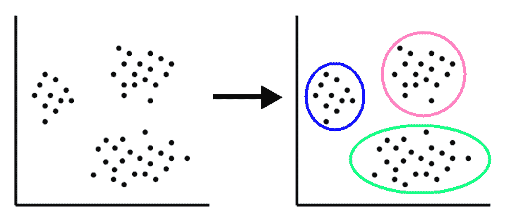

从该图中，可以注意到系统已经基于相似性识别了三个组，在这种情况下，这是由于接近性。一般来说，无监督学习试图识别数据的内部结构，以再现它。

这些算法的典型例子是搜索引擎。给定一个或多个关键字，这些程序能够创建一个链接列表，这些链接指向搜索算法认为与所进行的研究相关的页面。这些算法的有效性取决于它们可以从数据库中提取的信息的有用性。

无监督学习技术通过比较数据并寻找相似性或差异来工作。众所周知，机器学习算法试图模仿动物神经系统的功能。出于这个目的，我们可以假设神经过程是由优化它们所追求的未知目标的机制所引导的。每一个过程都是从一个与刺激相关联的初始情境发展到一个有答案的终点，答案是过程本身的结果。直觉上，在这个进化中，有一个信息的传递。事实上，刺激提供了获得预期反应所必需的信息。因此，在流程完成之前，尽可能如实地传输这些信息非常重要。因此，解释发生在神经系统中的过程的一个合理的标准是，将它们视为最大限度地保留信息的信息传递。

无监督学习算法基于这些概念。这是一个使用学习理论技术来衡量在迁移中发生的信息损失的问题。所考虑的过程被认为是使用通信领域中开发的众所周知的技术通过噪声信道传输信号。然而，基于该过程的几何表示，遵循不同的方法是可能的。事实上，刺激和反应都是由适当数量的组件来表征的，这些组件在空间中对应于一个点。因此，该过程可以被解释为输入空间到输出空间的几何变换。出口空间比输入空间小，因为刺激包含激活许多同时进行的过程所必需的信息。相比只有一个，是多余的。这意味着在所考虑的转换中总是存在冗余减少操作。

在入口和出口空间中，形成典型的区域，信息与这些区域相关联。因此，控制信息传递的自然机制必须以某种方式识别出所考虑过程的这些重要区域，并确保它们在转换中对应。因此，在所讨论的过程中存在数据分组操作；这种操作可以通过获得经验来识别。分组和减少冗余的前两种操作是最佳信号处理的典型，并且有它们在神经系统功能中存在的生物学证据。有趣的是，在基于实验原理的非监督学习的情况下，例如竞争学习，这两个操作是自动实现的。


# 生成模型

生成模型旨在生成现象的所有值，既包括那些可以观察到的值(输入)，也包括那些可以根据观察到的值计算出的值(目标)。我们试图通过提出生成模型和判别模型之间的第一个区别来理解这样一个模型如何能够成功地实现这一目标。

通常，在机器学习中，我们需要在给定输入 *x* 向量的值的情况下，预测目标向量 *y* 的值。从概率的角度来看，目标是找到条件概率分布 *p(y|x)* 。

事件 *y* 相对于事件 *x* 的条件概率是 *y* 发生的概率，已知 *x* 被验证。由 *p(y|x)* 表示的这个概率，表达了对 *y* 的预期的修正，由 *x* 的观察来决定。

解决这个问题的最常见方法是使用参数模型来表示条件分布，然后使用由包含输入变量值和相应输出的相对向量的对( *xn* ， *yn* )组成的训练集来确定参数。得到的条件分布可用于对新输入值( *x* )的目标( *y* )进行预测。这被称为**歧视方法**，因为条件分布直接在不同的 *y* 值之间进行区分。

作为该方法的替代，我们可以寻找联合概率分布 *p(x∩ y)* ，然后使用该联合分布来评估条件概率 *p(y | x)* ，以便为新的值 *x* 预测 *y* 。这被称为**生成方法**，因为通过从联合分布中采样，可以生成特征向量 *x* 的合成示例。

联合概率分布 *p(x，y)* 是给出每个 *x* 、 *y* 向量落入为该变量指定的任何特定范围或离散值集合的概率的概率分布。

无论使用何种类型的数据和理论模型，生成方法都分为两个基本步骤:

1.  第一步涉及生成模型的构建。处理输入数据的目的是推断它们的分布。为此，可以简单地将输入数据重新组织成不同的结构，或者它可以表示从特定算法的输入数据中提取的新信息。生成模型的构建结果是根据近似的分布呈现数据。
2.  一旦在输入数据上构建了创成式模型，就可以进行采样，从而形成与输入数据具有相同分布的新数据。

创成式模型的构建允许突出显示隐含在初始数据中的特征和属性。然后，通过对数据进行处理的类型来区分各种方法，以解释这些特征，并因此区分获得近似数据分布的变量类型。

为什么 AI 研究人员对生成模型如此兴奋？让我们举一个简单的例子:假设我们向系统提供一系列猫的图像。那么，假设在看到这些图像后，计算机能够以完全独立的方式生成猫的新照片。如果计算机能够做到这一点，并且产生的图像具有正确数量的腿、尾巴、耳朵等等，那么就很容易证明计算机知道猫是由哪些部分组成的，即使没有人向它解释过猫的解剖学。所以，从某种意义上说，一个好的生成模型就是计算机对概念基础知识的证明。

这就是为什么研究人员如此热衷于建立生成模型。这些模型似乎是一种训练计算机理解概念的方法，而不需要研究人员教给它们先验的概念。


# 受限玻尔兹曼机

玻尔兹曼机器是一种概率图形模型，可以解释为随机神经网络。波尔兹曼机器是由杰弗里·辛顿和特里·塞伊诺夫斯基在 1985 年首次推出的。**随机**是由于神经元的行为；在它们内部，在激活函数中，它们将具有影响神经元激活的概率值。

在实践中，玻尔兹曼机器是一种模型(包括一定数量的参数)，当应用于数据分布时，能够提供一种表示。该模型可用于提取未知分布(目标分布)的重要方面，仅从后者的样本开始。波尔兹曼机器引用的数据样本也被称为**训练数据**。下图显示了玻尔兹曼机器的架构:

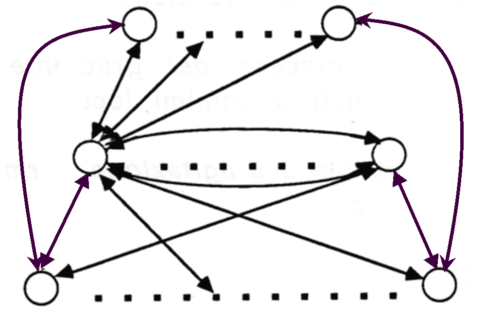

训练玻尔兹曼机器意味着调整它的参数，以便它所代表的概率分布尽可能地内插训练数据。从计算的角度来看，波尔兹曼机器的训练是一项相当费力的工作。然而，通过对您正在工作的网络的拓扑施加限制，这个问题可以变得更容易；这定义了**受限玻尔兹曼机器** ( **RBM** )。

在玻尔兹曼机器中，有两种类型的单元:

*   可见单元(或神经元，因为我们说过，玻尔兹曼机器可以解释为神经网络)
*   隐藏单元(或神经元)

即使在 RBM 中，也有这两种类型的单元，我们可以将它们安排在两个级别上:

*   可见单元是观察的组成部分(例如，如果我们的数据由图像组成，我们可以将一个可见单元与每个像素相关联)
*   相反，隐藏单元为我们提供了一个存在于我们观察的组件之间的依赖关系的模型(例如，存在于图像的像素之间的依赖关系)

因此，隐藏单元可以被视为数据特征的检测器。在 RBM 图中，每个神经元都与另一层的所有神经元相连，而同一层的神经元之间没有连接；正是这种限制赋予了 RBM 这个名称，如下图所示:


成功训练后，RBM 可以很好地表示训练数据的分布情况。它是一个生成模型，允许从学习的分布开始采样新数据；例如，可以从研究的图像开始生成新的图像结构。拥有一个生成模型使有用的应用成为可能。比如，你可以想到将一个部分观测对应的一些可见单元进行积分(也就是你固定了被观测变量的值，认为它们是常数)，然后产生剩下的那些可见单元来完成观测；在图像分析示例中，这对于图像完成任务非常有用。

作为生成模型，RBM 也可以用作分类器。考虑这种类型的应用程序:

*   RBM 被训练来从 RBM 的可视单元学习输入数据(解释变量)和相应标签(响应/输出变量)的联合概率分布，两者都在网络的图中表示。
*   随后，一个新的输入模式，这次没有标签，可以链接到可见变量。相应的标签可以通过直接从玻尔兹曼机器采样来预测。

玻尔兹曼机器能够在可见单位上完成部分数据模式。如果我们把可见的单元分成输入和输出单元，给定输入模式，玻尔兹曼机器通过产生输出(分类)来完成它。否则，它将作为关联记忆，返回与(部分)数据最相似的学习模式。


# 玻尔兹曼机器体系结构

玻尔兹曼机器架构基于输入、输出和隐藏节点。连接重量是对称的:


基于这种假设，玻尔兹曼机器是高度递归的，这种递归消除了输入和输出节点之间的任何基本差异，在需要时可以认为是输入或输出。玻尔兹曼机器是一个单元网络，具有为整个网络定义的能量。它的单位产生二进制结果((1，0)值)。输出是根据概率计算的，并取决于温度变量 *T* 。

玻尔兹曼机器的一致性函数由以下公式给出:

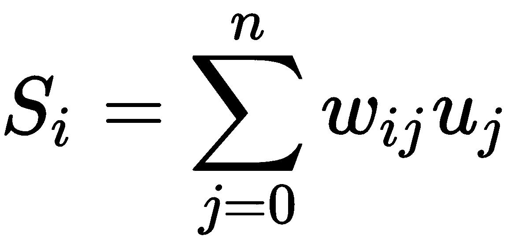

在前面的公式中，术语定义如下:

*   *S[I]是单位 *i(1，0)* 的状态*
*   *w[ij]是单元 *j* 和单元 *i* 之间的连接强度*
*   *u[j]是单元 *j* 的输出*

该计算在机器内以随机方式进行，从而增加了同意。因此，如果*w[ij]为正，则倾向于使单元 *i* 和 *j* 都被激活或都被去激活，而如果权重为负，则倾向于使它们具有不同的激活(一个激活，另一个不激活)。当一个权重为正时，称为**兴奋性**；否则称为**抑制性**。*

每个二进制单元随机决定是 1(概率为*p[I]还是 0(概率为*1-p[I])。这个概率由下面的公式给出:**


在网络的平衡状态下，这种可能性被定义为负能量的指数，称为**玻尔兹曼分布**。你可以想象通过管理能量，你可以让系统走出局部最小值。这必须缓慢进行，因为剧烈的冲击会使系统偏离全局最小值。最好的方法是给能量，然后慢慢减少。这个概念用于冶金学，首先通过熔化获得金属的有序状态，然后慢慢降低温度。过程中温度的降低被称为**模拟退火**。

这种方法可以通过在 Hopfield 网络中增加一个概率更新规则来重现(参考[第十三章](0fa9cfb2-9e84-4f95-b287-c28f1805cc97.xhtml)、*超越前馈网络——CNN 和 RNN*)；复制它的网络被称为**玻尔兹曼机器**。会有一个变化的参数:温度。所以在高温下，跃迁到更高能量的可能性比低温下大得多。

当温度下降时，假设正确的最小能量状态的概率接近 1，网络达到热平衡。网络的每个单元都有一个能量跃变，由以下公式给出:


系统根据下面的概率规则(转移函数)改变到较低能量的状态:


可以看出，在高 *T* 比在低 *T* 跃迁到更高能量状态的概率更大。该网络可以根据以下玻尔兹曼分布假设稳定状态的配置:


也就是说，它取决于系统的状态能量和温度。较低的能量状态更有可能；事实上如果*E[a]<E[b]*，那么*P[a]/P[b]>1*，因为其中*P[a]>P[b]*。所以系统趋向于最小能量状态。


# 玻尔兹曼机器的缺点

在使用基于波尔兹曼机器的算法时出现了许多问题。以下是遇到的一些问题:

*   重量调整
*   收集统计数据以计算概率所需的时间，
*   一次改变多少重量
*   模拟退火过程中如何调节温度
*   如何确定网络何时达到平衡温度？

主要缺点是波尔兹曼学习比反向传播慢得多。


# 深层玻尔兹曼机器

另一种玻尔兹曼机是**深玻尔兹曼机** ( **DBM** )。这是一个类似于 RBM 的神经网络，但 DBMs 不是只有一层隐藏节点，而是有许多层。每层神经元只与相邻的神经元相连(前一层和后一层)；这里，同一层的神经元也没有相互连接。这种结构允许从每个层中出现特定的统计数据，这些统计数据可以捕获新的数据特征。下图显示了具有一个可见层和两个隐藏层的 DBM 模型:

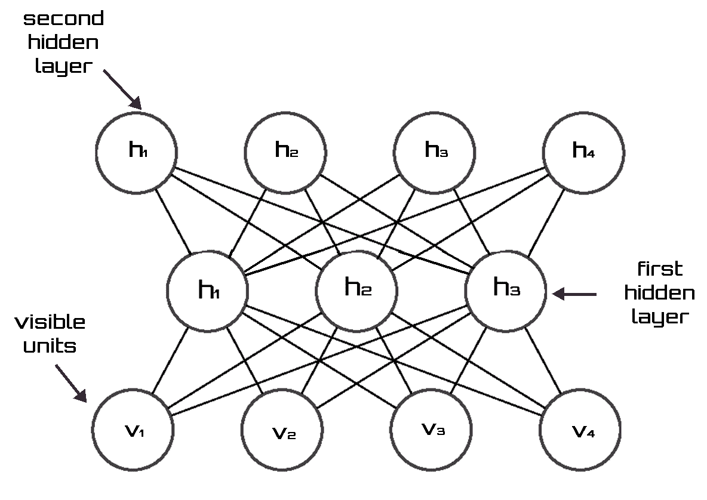

正如我们所看到的，连接只存在于相邻层的单元之间。像 RBM 和 DBMs 只包含二进制单位。

DBMs 模型将以下概率分配给可见向量 *v* :


在前面的公式中，术语定义如下:

*   *v* 是可见向量
*   *θ = (W(1)，W(2))* 为模型参数，代表可见到隐藏和隐藏到隐藏的对称相互作用项
*   *h ^((1))* 和 *h ^((2))* 为隐藏随机二元变量
*   *Z(θ)* 是配分函数

DBMs 在识别物体或单词的情况下特别有用。这是由于使用少量标记的输入数据而不是利用大量未标记的输入数据来学习复杂和抽象的内部表示的强大能力。然而，与深度卷积神经网络不同，DBMs 在两个方向上都采用推理和训练过程，以便更好地检测输入结构的表示。


# 自编码器

自编码器是一种神经网络，其目的是将其输入编码成小尺寸，并获得能够重建输入本身的结果。自编码器由以下两个子网的联合组成:

*   编码器，它计算函数:

*z = ϕ(x)*

给定一个输入 *x* ，编码器将其编码为变量 *z* ，也称为**潜变量**。 *z* 的尺寸通常比 *x* 小得多。

*   解码器，它计算以下函数:

*x' = ψ(z)*

由于 *z* 是编码器产生的 *x* 的代码，解码器必须对其进行解码，使得*x’*类似于 *x* 。

自编码器的训练旨在最小化输入和结果之间的均方误差。

**Mean Squared Error** (**MSE**) is the average squared difference between the outputs and targets. Lower values are indicative of better results. Zero means no error.

对于 n 次观察， *MSE* 由以下公式给出:


最后，我们可以总结为，编码器以压缩的形式对输入进行编码，解码器从中返回输入的重构，如下图所示:

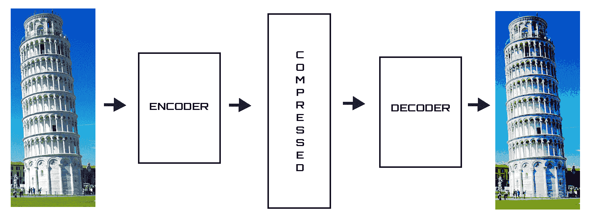

让我们定义以下术语:

*   *W* :输入→隐藏权重
*   *V* :隐藏→输出权重

先前的公式变成:

*z = ϕ(W* x)*

它们也变成了:

*x' = ψ(V*W1* x)*

最后，自编码器的训练旨在最大限度地减少以下数量:


自编码器的目的不仅仅是对输入进行某种压缩或寻找同一函数的近似值。有一些技术允许从一个降维的隐藏层开始，指导模型给予某些数据属性更大的重要性，从而基于相同的数据产生不同的表示。


# 变分自编码器

**变型自编码器** ( **VAE** )的灵感来源于自编码器的概念:一种由两个神经网络组成的模型，称为**编码器**和**解码器**。正如我们所看到的，编码器网络试图以压缩形式对其输入进行编码，而网络解码器试图从编码器返回的代码开始重建初始输入。

然而，VAE 的功能与简单的自编码器非常不同。VAEs 不仅允许对输入进行编码/解码，还允许生成新数据。为此，他们将代码 *z* 和重构/生成*x’*视为属于某个概率分布。特别是，VAEs 是深度学习和贝叶斯推理相结合的结果，在某种意义上，它们由一个神经网络组成，该神经网络使用反向传播算法进行训练，该算法使用一种称为**重新参数化**的技术进行修改。虽然深度学习已被证明在复杂函数的近似中非常有效，但贝叶斯统计允许以概率的形式管理随机生成的不确定性。

VAE 使用相同的结构来生成新的图像，类似于那些属于训练集的图像。在这种情况下，编码器不直接为给定的输入产生代码，而是计算正态分布的平均值和方差。从该分布中取出一个值，并由解码器解码。训练包括修改编码器和解码器参数，使得如此执行的解码结果尽可能地类似于起始图像。在训练结束时，我们从编码器产生的均值和方差的正态分布开始；解码器将能够产生与属于训练集的图像相似的图像。

让我们定义以下术语:

*   *X* :输入数据向量
*   *z* :潜在变量
*   *P(X)* :数据的概率分布
*   *P(z)* :潜在变量的概率分布
*   *P(X|z)* :后验概率，即给定潜变量的生成数据的分布

后验概率 *P(X|z)* 是给定证据 *z* 的条件 *X* 的概率。

我们的目标是根据潜变量所包含的特征生成数据，所以我们想找到 *P(X)* 。为此，我们可以根据下面的公式使用全概率定律:


为了理解我们是如何得出这个公式的，我们一步一步地进行推理。我们定义模型的第一个任务是从观测数据出发推断潜在变量的良好值，或者计算后验 *p(z|X)* 。为此，我们可以使用贝叶斯定理:


在前面的公式中，出现了 *P(X)* 项。在贝叶斯统计的上下文中，它也可以被称为证据或模型证据。证据可以通过排除潜在变量来计算。这让我们想到了开始的公式:


这个积分的计算估计需要一个指数时间，因为它必须对潜在变量的所有配置进行评估。为了减少计算成本，我们被迫近似估计后验概率。

在 VAE，顾名思义，我们用一种叫做**变分推论** ( **VI** )的方法推导 *p(z | X)* 。VI 是贝叶斯推理中最常用的方法之一。这种技术认为推理是一个优化问题。在这样做的时候，我们使用一个更简单的易于评估的分布(例如高斯分布)，并使用 **Kullback-Leibler 散度指标**最小化这两个分布之间的差异。

Kullback-Leibler 散度度量是两个概率分布 *P* 和 *Q* 之间差异的非对称度量。具体来说， *Q* 与 *P* 的 Kullback-Leibler 散度，用 **DKL** *(P ||Q)* 表示，是用 *Q* 近似 *P* 时丢失信息的度量。

对于离散概率分布 *P* 和 *Q* ，从 *Q* 到 *P* 的库尔贝克-莱布勒散度定义如下:


分析该公式可以明显看出，Kullback-Leibler 的散度是概率 *P* 和 *Q* 之间的对数差的期望，其中期望是使用概率 *P* 获得的。


# 生成对抗网络

**生成对抗网络** ( **甘**)是由两个网络共同训练而成的生成模型，称为**生成器**和**鉴别器**。

这两个网络之间的动态就像伪造者和调查者之间的动态。伪造者试图制造真正艺术品的忠实仿制品，而调查者则试图将赝品与真品区分开来。在这个类比中，伪造者代表生成者，调查者代表鉴别者。生成器接受属于固定分布的输入值，并尝试生成与数据集相似的图像。鉴别器试图将生成器创建的数据与属于数据集的数据区分开来。这两个网络共同指导:

*   如果输入属于数据集，鉴别器尝试返回 output = 1，如果输入是由生成器生成的，则返回 0
*   相反，生成器试图最大化鉴别器出错的可能性

发生器获取随机输入噪声，并尝试创建数据样本，而鉴别器从真实世界的示例或发生器获取输入，如下图所示:


为简单起见，两个对立的网络是多层感知器类型；然而，同样的结构可以用深层网络来建模。例如，为了生成新的图像，在这些网络中使用的方法是从属于简单分布的值或从随机值开始，而不是从复杂分布中采样数据。随后，它们通过将在训练期间学习的第二分布进行映射。

在这样的系统中，训练导致生成器和鉴别器之间的不断竞争。在这些条件下，优化过程可以在两端独立进行。将 *G(z)* 命名为生成器，将 *D(x)* 命名为鉴别器，模型的训练旨在最大化鉴别器向来自训练集的值分配 1 的概率，而不是向生成器产生的值分配 0。另一方面，我们希望教导生成器最小化以下数量:


然后，通过将梯度下降技术应用于以下表达式来执行训练:


这种方法源于博弈论，特别是源于称为**两人极小极大博弈**的方法。这种类型的算法采用最小化由于玩家的选择而导致的最大可能损失的策略。在训练过程中，可能发生鉴别器不能对真实例子产生的例子进行分类的情况。


# 对抗自编码器

对抗式自编码是由和甘联合产生的一种生成模式。为了解释该模型，我们首先定义以下术语:

*   *x* :自编码器输入
*   z:从 *x* 产生的代码，
*   *p(z)* :我们想要强加的分布
*   *q(z|x)* :从编码器学习的分布
*   *p(x|z)* :从解码器学习的分布
*   *pdata* :数据的分布
*   *p(x)* :模型的分布

我们将函数 *q(z|x)* 视为 *q(z)* 的后验分布，定义如下:


我们试图在模型上强加等式 *q(z)=p(z)* 。与 VAE 的区别在于，驱使 *q (z)* 走向 *p(z)* 的是一个对抗性网络。VAE 的编码器被认为是可以使用鉴别器的 GAN 的发生器。这试图区分属于 *q(z)* 的数据和来自 *p(z)* 的数据。下图显示了 AAE 体系结构:

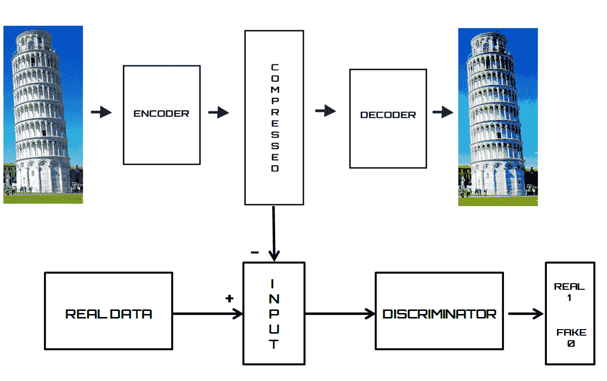

使用随机梯度下降，对抗网络和自编码器的训练联合进行。


# 使用 RBM 的特征提取

最近，几种类型的**人工神经网络**(**ann**)已经被应用于对特定数据集进行分类。然而，这些模型中的大多数仅使用有限数量的要素作为输入，在这种情况下，由于起始数据集的复杂性，可能没有足够的信息来进行预测。如果有更多的特征，训练的运行时间会增加，泛化性能会由于维数灾难而下降。在这些情况下，提取特征的工具会特别有用。RBM 是一种具有强大表示能力的机器学习工具，经常在各种分类问题中用作特征提取器。


# 乳腺癌数据集

乳房由一组腺体和脂肪组织组成，位于皮肤和胸壁之间。事实上，它不是一个单独的腺体，而是一组腺体结构，称为**小叶**，连接在一起形成一个叶。一个乳房有 15 到 20 个叶。乳汁通过称为**乳管**的小管从小叶到达乳头。

如果不进行检测和治疗，乳腺癌是一种潜在的严重疾病。它是由乳腺中一些转化为恶性细胞的细胞不受控制的增殖引起的。这意味着它们有能力从产生它们的组织中脱离出来，侵入周围的组织，并最终侵入身体的其他器官。理论上，所有类型的乳腺组织都可以形成癌症，但最常见的是腺细胞或形成导管壁的细胞。

此示例的目的是识别多个良性或恶性类别中的每一个。为此，我们将使用名为 BreastCancer(威斯康星州乳腺癌数据库)的数据集中包含的数据。这些数据是从 UCI 机器学习数据库库中获取的，因为沃尔伯格博士报告了他的临床病例，DNA 样本定期到达。因此，数据库反映了数据的时间分组。这种分组信息立即出现，已经从数据本身中删除。除了第一个变量之外，每个变量都被转换成 11 个原始的数值属性，其值从 0 到 10 不等。

为了获得数据，我们利用了位于以下链接的 UCI 机器学习知识库中的大量数据:[http://archive.ics.uci.edu/ml](http://archive.ics.uci.edu/ml)。

为了加载数据集，我们将使用`sklearn.datasets`模块。它包括加载数据集的实用程序，包括加载和获取流行参考数据集的方法。它还具有一些人工数据生成器。

乳腺癌数据集是一个经典且非常简单的二元分类数据集。下表提供了有关数据集的一些信息:

| 班级 | Two |
| 每类样本 | 212(M)，357(B) |
| 样本总数 | Five hundred and sixty-nine |
| 维度 | Thirty |
| 特征 | 真实而积极 |


# 数据准备

在介绍了乳腺癌数据集之后，我们可以分析允许我们逐行对输入数据进行分类的代码。在代码的第一部分，我们导入稍后将使用的库:

```
from sklearn import linear_model, datasets, preprocessing
from sklearn.cross_validation import train_test_split
from sklearn.pipeline import Pipeline
from sklearn.neural_network import BernoulliRBM
from pandas_ml import ConfusionMatrix
import numpy as np
import pandas as pd
```

现在，让我们限制自己进口；我们将在使用时加深它们。首先，我们必须导入数据集；我们将使用`sklearn.datasets`包来完成:

```
BC = datasets.load_breast_cancer()
```

该命令加载并返回乳腺癌`wisconsin`数据集。`sklearn.datasets`包嵌入了一些小的玩具数据集。为了评估数据集规模的影响(`n_samples`和`n_features`)，同时控制数据的统计属性(通常是特征的相关性和信息量)，还可以生成合成数据。这个包还具有获取更大数据集的帮助器，这些数据集通常被机器学习社区用来对来自真实世界的数据进行算法基准测试。数据集是一个类似字典的对象，它保存所有数据和一些关于数据的元数据。这个数据存储在数据成员中，它是一个`n_samples`和`n_features`数组。在监督问题的情况下，一个或多个响应变量存储在目标成员中。

数据在一个`Bunch`对象中返回，这个类似字典的对象包含以下属性:

*   `data`:要学习的数据
*   `target`:分类标签
*   `target_names`:标签的含义
*   `feature_names`:特性的含义
*   `DESCR`:数据集的完整描述

为了确认数据的内容，让我们提取维度:

```
print(BC.data.shape)
print(BC.target.shape)
```

结果如下所示:

```
(569, 30)
(569,)
```

为了更好地理解操作，我们将这些数据分为`X`(预测值)和`Y`(目标值):

```
X = BC.data
Y = BC.target
```

此时，我们使用工具从预测中提取一系列统计数据，这些工具使我们可以使用`pandas`库。

`pandas`是一个开源的、BSD 许可的库，为 Python 编程语言提供了高性能、易于使用的数据结构和数据分析工具。

要使用该功能，我们必须将输入数据从`numpy.darray`转换为`pandas`数据帧:

```
Xdata=pd.DataFrame(X)
print(Xdata.describe())
```

结果如下所示:

```
               0           1           2            3           4   \
count  569.000000  569.000000  569.000000   569.000000  569.000000
mean    14.127292   19.289649   91.969033   654.889104    0.096360
std      3.524049    4.301036   24.298981   351.914129    0.014064
min      6.981000    9.710000   43.790000   143.500000    0.052630
25%     11.700000   16.170000   75.170000   420.300000    0.086370
50%     13.370000   18.840000   86.240000   551.100000    0.095870
75%     15.780000   21.800000  104.100000   782.700000    0.105300
max     28.110000   39.280000  188.500000  2501.000000    0.163400
```

由于篇幅限制，我们只报道了前五个预测因子的结果。我们可以看到，变量有不同的范围。当预测值具有不同的范围时，具有较大数值范围的特征对响应变量的影响可能大于具有较小数值范围的特征对响应变量的影响，这反过来会影响预测精度。我们的目标是提高预测的准确性，并且不允许某个特定的特征由于较大的数值范围而影响预测。因此，我们可能需要调整不同特性下的值，使它们落在一个共同的范围内。通过这种统计程序，可以比较属于不同分布的相同变量，也可以比较不同变量或以不同单位表示的变量。

请记住，在训练机器学习算法之前，重新调整数据是一种很好的做法。通过重新缩放，消除了数据单元，使您可以轻松比较不同位置的数据。

在这种情况下，我们将使用 min-max 方法(通常称为**特征缩放**)来获得范围(0，1)内的所有缩放数据。实现这一点的公式是:


以下命令执行特征缩放:

```
X = (X - np.min(X, 0)) / (np.max(X, 0) - np.min(X, 0))
```

`numpy.min()`和`numpy.max()`用于计算每个数据库列的最小值和最大值。

现在，让我们拆分训练模型和测试模型的数据。训练和测试该模型形成了在预测分析中进一步使用该模型进行预测的基础。给定一个包含 100 行数据的数据集，其中包括预测变量和响应变量，我们将数据集分成一个合适的比例(比如 80:20)，并分配 80 行用于训练，20 行用于测试。随机选择行以减少偏差。一旦训练数据可用，数据就被馈送给机器学习算法，以使大规模通用功能就位。为了分割数据集，我们将使用`sklearn.model_selection.train_test_split()`函数:

```
X_train, X_test, Y_train, Y_test = train_test_split(X, Y, test_size=0.2, random_state=1)
```

函数将数组或矩阵分成随机的训练和测试子集。前两个参数是`X`(预测器)和`Y`(目标)numpy 数组。允许的输入是列表、`numpy`数组、稀疏矩阵或`pandas`数据帧。然后添加两个选项:

*   `test_size`:该值应介于 0.0 和 1.0 之间，代表测试分割中包含的数据集的比例
*   `random_state`:这是随机数生成器使用的种子


# 模型拟合

我们以前说过，RBM 经常在各种各样的分类问题中被用作一个特征。是时候看看怎么做了。首先要做的是使用`sklearn.neural_network`模块的`BernoulliRBM`函数。

`sklearn`是 Python 编程语言的免费机器学习库。它具有各种分类、回归和聚类算法，包括支持向量机、随机森林、梯度推进、k-means 和 DBSCAN。它被设计为与 Python 数字和科学库 NumPy 和 SciPy 进行互操作。

在`sklearn`库中，`sklearn.neural_network`模块包括基于神经网络的模型。在这个模块中，`BernoulliRBM`函数符合伯努利 RBM。返回具有二进制可见单元和二进制隐藏单元的 RBM。使用**随机最大似然** ( **SML** )，也称为**持续对比背离** ( **PCD** )来估计参数。首先，我们将设置模型的架构:

```
RbmModel = BernoulliRBM(random_state=0, verbose=True)
```

然后，我们将使用训练数据拟合模型:

```
FitRbmModel = RbmModel.fit_transform(X_train, Y_train)
```

`fit_transform`方法用可选参数`fit_params`将变换器拟合到`X_train`和`Y_train`，并返回一个变换后的`X_train`版本。在这种情况下，不使用可选参数。

如果您还记得，我们的目的是使用`Rbm`模型提取特征，然后逻辑回归模型将使用这些特征对数据进行分类。所以，第一部分已经执行了——我们已经在`FitRbmModel`变量中提取了特征。创建逻辑回归模型的时候到了。为此，我们将使用`sklearn.linear_model`模块的`LogisticRegression`功能，如下所示:

```
LogModel = linear_model.LogisticRegression()
```

我们现在将决策函数中的特征系数设置为等于从`rbm`模型中提取的特征:

```
LogModel.coef_ = FitRbmModel
```

现在我们可以构建分类器了。为此，我们将使用`sklearn.pipeline`模块的`Pipeline`功能:

```
Classifier = Pipeline(steps=[('RbmModel', RbmModel), ('LogModel', LogModel)])
```

`pipeline`的目的是组合几个步骤，在设置不同参数时，这些步骤可以一起交叉验证。为此，它允许使用各个步骤的名称来设置各个步骤的参数，就像前面的代码一样。通过将参数及其名称设置为另一个估计器，可以完全替换一个步骤的估计器，或者通过将设置为`None`来移除变压器。分类器现在准备好了；我们只需要训练它:

```
LogModel.fit(X_train, Y_train)
Classifier.fit(X_train, Y_train)
```

首先，训练逻辑回归模型，然后训练分类器。我们只需要做出预测。回想一下，为此，我们有一个未使用的数据集可用:`X_test`和`Y_test`。为了检查分类器的性能，我们将把预测与真实数据进行比较:

```
print ("The RBM model:")
print ("Predict: ", Classifier.predict(X_test))
print ("Real:    ", Y_test)
```

以下屏幕截图显示了返回的结果:

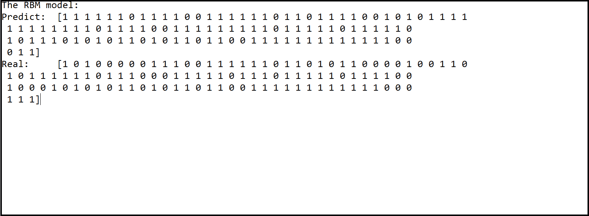

最后，为了更好地理解模型性能，我们将计算混淆矩阵。在混淆矩阵中，我们的分类结果与真实数据进行比较。混淆矩阵的优势在于它能够识别分类错误的性质及其数量。在该矩阵中，对角线单元显示被正确分类的病例数；所有其他单元格显示错误分类的案例。为了计算混淆矩阵，我们可以使用 pandas 库中包含的`ConfusionMatrix()`函数如下:

```
CM = ConfusionMatrix(Y_test, Classifier.predict(X_test))
CM.print_stats()
```

在下面的代码中，显示了由`ConfusionMatrix()`函数返回的结果:

```
population: 114
P: 72
N: 42
PositiveTest: 87
NegativeTest: 27
TP: 71
TN: 26
FP: 16
FN: 1
TPR: 0.9861111111111112
TNR: 0.6190476190476191
PPV: 0.8160919540229885
NPV: 0.9629629629629629
FPR: 0.38095238095238093
FDR: 0.1839080459770115
FNR: 0.013888888888888888
ACC: 0.8508771929824561
F1_score: 0.8930817610062893
MCC: 0.6866235389841608
informedness: 0.6051587301587302
markedness: 0.7790549169859515
prevalence: 0.631578947368421
LRP: 2.588541666666667
LRN: 0.022435897435897433
DOR: 115.37500000000003
FOR: 0.037037037037037035
```

返回几个比特的信息；特别的，我们可以注意到模型的精度是 0.85。


# Autoencoder with Keras

如前所述，自编码器是一种神经网络，其目的是将其输入编码成小尺寸，并且获得的结果能够重建输入本身。自编码器由以下两个子网的联合组成:编码器和解码器。除了这些功能外，还增加了另一个功能；这是一个损失函数，计算方法是数据的压缩表示和解压缩表示之间的信息损失量之间的距离。编码器和解码器相对于距离函数是可微分的，因此可以使用梯度随机函数来优化编码/解码函数的参数，以最小化重建的损失。


# 加载数据

这是一个手写数字的数据库，由 60，000 个 28 x 28 的 10 位数字的灰度图像以及 10，000 个图像的测试集组成。Keras 库中已有该数据集。下图显示了 MNIST 数据集中 0-8 的图像示例:

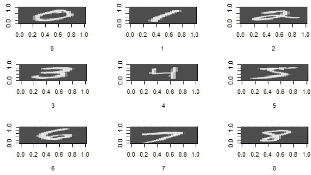

像往常一样，我们将逐行分析代码。在代码的第一部分，我们导入稍后将使用的库:

```
from keras.layers import Input, Dense
from keras.models import Model
```

这段代码导入了以下函数:

*   输入函数用于实例化一个 Keras 张量。Keras 张量是来自底层后端(Theano、TensorFlow 或 CNTK)的张量对象。我们用某些属性来扩充它，使我们只需知道模型的输入和输出就可以构建一个 Keras 模型。
*   Dense 函数用于实例化一个规则的密集连接的 NN 层。
*   模型功能用于定义模型。模型是你可以总结、拟合、评估和预测的东西。Keras 提供了一个`Model`类，您可以使用它从您创建的层中创建一个模型。它只要求您指定输入和输出图层。

要导入数据集，只需使用以下代码:

```
from keras.datasets import mnist
(x_train, y_train), (x_test, y_test) = mnist.load_data()
```

返回以下元组:

*   `x_train, x_test`:具有形状(`num_samples`，28，28)的灰度图像数据的`uint8`阵列
*   `y_train, y_test`:带形状(`num_samples`)的数字标签(0-9 范围内的整数)的`uint8`数组

现在我们必须将 0 到 1 之间的所有值标准化。Mnist 图像以像素格式存储，其中每个像素(总共 28 x 28)存储为 8 位整数，给出从 0 到 255 的可能值范围。通常情况下，0 表示黑色，255 表示白色。介于两者之间的值构成了不同的灰度。现在，要归一化 0 到 1 之间的所有值，只需将每个值除以 255。因此包含值 255 的像素将变成 1，而包含 0 的像素将保持原样；介于两者之间的是所有其他的价值观:

```
x_train = x_train.astype('float32') / 255
x_test = x_test.astype('float32') / 255
```

通过使用`astype()`函数，我们转换了`float32`中的输入数据(单精度浮点:符号位、8 位指数、23 位尾数)。正如我们所说，每个样本(图像)由一个 28 x 28 的矩阵组成。为了减少维数，我们将 28 x 28 的图像展平成大小为 784 的向量:

```
x_train = x_train.reshape((len(x_train), np.prod(x_train.shape[1:])))
x_test = x_test.reshape((len(x_test), np.prod(x_test.shape[1:])))
```

函数给一个数组一个新的形状而不改变它的数据。新形状应该与原始形状兼容。新形状的第一维是从`len()`函数(`len(x_train)`和`len(x_test)`)返回的观察值的数量。第二维表示起始数据的最后两维的乘积(28 x 28 = 784)。为了更好地理解这种转换，我们首先打印起始数据集的形状，然后打印转换后数据集的形状:

```
print (x_train.shape)
print (x_test.shape)
```

以下是数据集整形前后的结果:

```
(60000, 28, 28)
(10000, 28, 28)
(60000, 784)
(10000, 784)
```


# Keras 模型概述

Keras 提供两种型号:

*   顺序模型
*   Keras 功能 API

让我们在接下来的几节中详细看看每一个。


# 顺序模型

`Sequential`模型是层的线性堆叠。我们可以通过向构造函数传递一个层实例列表来创建一个`Sequential`模型，如下所示:

```
from keras.models import Sequential
from keras.layers import Dense, Activation
model = Sequential([
    Dense(32, input_shape=(784,)),
    Activation('relu'),
    Dense(10),
    Activation('softmax'),
])
```

我们也可以通过`.add()`方法简单地添加层:

```
model = Sequential()
model.add(Dense(32, input_dim=784))
model.add(Activation('relu'))
```

这种类型的模型需要知道它应该期望什么样的输入形状。因此，`Sequential`模型中的第一层需要接收关于其输入形状的信息。有几种可能的方法可以做到这一点:

*   向第一层传递一个`input_shape`参数
*   通过`input_dim`和`input_length`参数指定其输入形状
*   向层传递一个`batch_size`参数


# Keras 功能 API

定义模型的另一种方法是 Keras functional API。Keras functional API 是定义复杂模型的好方法，例如多输出模型、有向无环图或具有共享层的模型。例如，要定义一个密集连接的网络，只需键入以下代码:

```
from keras.layers import Input, Dense
from keras.models import Model
inputs = Input(shape=(784,))
x = Dense(64, activation='relu')(inputs)
x = Dense(64, activation='relu')(x)
predictions = Dense(10, activation='softmax')(x)
model = Model(inputs=inputs, outputs=predictions)
model.compile(optimizer='rmsprop',
              loss='categorical_crossentropy',
              metrics=['accuracy'])
model.fit(data, labels) 
```

在接下来的部分中，我们将通过把它应用到我们的例子中来深入研究这种类型的模型。


# 定义模型架构

现在我们将使用 Keras functional API 构建模型。正如我们之前看到的，首先我们必须定义输入:

```
InputModel = Input(shape=(784,))
```

这将返回一个表示输入占位符的张量。稍后，我们将使用这个占位符来定义一个`Model`。此时，我们可以向模型的架构添加层:

```
EncodedLayer = Dense(32, activation='relu')(InputModel)
```

密集类用于定义完全连接的层。我们已经将该层中神经元的数量指定为第一个自变量(32)，使用激活自变量的激活函数(`relu`)，最后是该层的输入张量(`InputModel`)。

记住，给定一个输入`x`，编码器将其编码到变量`z`，也称为**潜变量**。`z`通常比`x`尺寸小很多；在我们的例子中，我们从 784 到 32，压缩因子为 24.5。

现在让我们添加解码层:

```
DecodedLayer = Dense(784, activation='sigmoid')(EncodedLayer)
```

这一层是输入的有损重建。另一次，我们使用了具有 784 个神经元(输出空间的维度)的密集类、`sigmoid`激活函数和`EncodedLayer`输出作为输入。现在我们必须实例化一个模型，如下所示:

```
AutoencoderModel = Model(InputModel, DecodedLayer)
```

该模型将包括在给定`InputModel`(输入)的情况下计算`DecodedLayer`(输出)所需的所有层。下面列出了模型类的一些有用属性:

*   `model.layers`是组成模型图的层的展平列表
*   `model.inputs`是输入张量的列表
*   `model.outputs`是输出张量的列表

因此，我们必须为训练配置模型。为此，我们将使用如下的`compile`方法:

```
AutoencoderModel.compile(optimizer='adadelta', loss='binary_crossentropy')
```

此方法为训练配置模型。只使用了两个参数:

*   `optimizer`:字符串(优化器名称)或优化器实例。
*   `loss`:字符串(目标函数名称)或目标函数。如果模型有多个输出，您可以通过传递字典或损失列表，对每个输出使用不同的损失。模型将最小化的损失值将是所有单个损失的总和。

我们使用了 adadelta 优化器。该方法仅使用一阶信息，随时间动态适应，并且具有超越普通随机梯度下降的最小计算开销。该方法不需要手动调整学习率，并且对噪声梯度信息、不同的模型结构选择、各种数据模态和超参数的选择表现出鲁棒性。

此外，我们使用了`binary_crossentropy`作为`loss`函数。损失函数是计算上可行的函数，代表分类问题中预测不准确所付出的代价。

此时，我们可以训练模型:

```
history = AutoencoderModel.fit(x_train, x_train,
                batch_size=256,
                epochs=100,
                shuffle=True,
                validation_data=(x_test, x_test))
```

fit 方法为模型定型固定数量的历元(数据集上的迭代)。下面解释传递的参数，以便更好地理解其含义:

*   `x`:训练数据的 Numpy 数组(如果模型有单个输入)，或者 Numpy 数组的列表(如果模型有多个输入)。如果模型中的输入层被命名，您还可以传递一个将输入名称映射到 Numpy 数组的字典。`x`可以是 None(缺省值),如果从框架本地张量(例如。张量流数据张量)。
*   `y`:如果模型只有一个输出，则为目标(标签)数据的 Numpy 数组，如果模型有多个输出，则为 Numpy 数组的列表。如果模型中的输出层被命名，您还可以传递一个将输出名称映射到 Numpy 数组的字典。如果从框架原生张量(例如 TensorFlow 数据张量)馈电，则`y`可以是`None`(默认)。
*   `batch_size` : `Integer`或`None`。这是每次梯度更新的样本数。如果未指定，`batch_size`将默认为`32`。
*   `epochs`:整数。它是训练模型的历元数。一个历元是对所提供的全部`x`和`y`数据的迭代。注意，`epochs`和`initial_epoch`一起被理解为最终纪元。该模型不是针对由历元给定的迭代次数来训练的，而是仅仅训练到到达索引历元的历元为止。
*   `shuffle`:决定是否在每个历元或`str`(对于`batch`)之前混洗训练数据的布尔值。`batch`是处理 HDF5 数据局限性的特殊选项；它以批量大小的块进行洗牌。当`steps_per_epoch`不是“无”时，它没有任何效果。
*   `validation_data`:一个元组(`x_val`和`y_val`)或元组(`x_val`、`y_val`和`val_sample_weights`)，在每个时期结束时对其评估损失和任何模型度量。该模型不会根据此数据进行训练。`validation_data`将覆盖`validation_split`。

返回一个`History`对象。它的`history.history`属性记录了连续时期的训练损失值和度量值，以及验证损失值和验证度量值(如果适用)。

我们的模型现在已经准备好了，所以我们可以用它来自动重建手写数字。为此，我们将使用`predict`方法:

```
DecodedDigits = AutoencoderModel.predict(x_test)
```

该方法为输入样本生成输出预测(`x_test`)。运行此示例，您应该会看到 100 个时期中的每一个时期的消息，打印每个时期的损失和准确性，然后是对训练数据集上的已训练模型的最终评估。如下图所示:

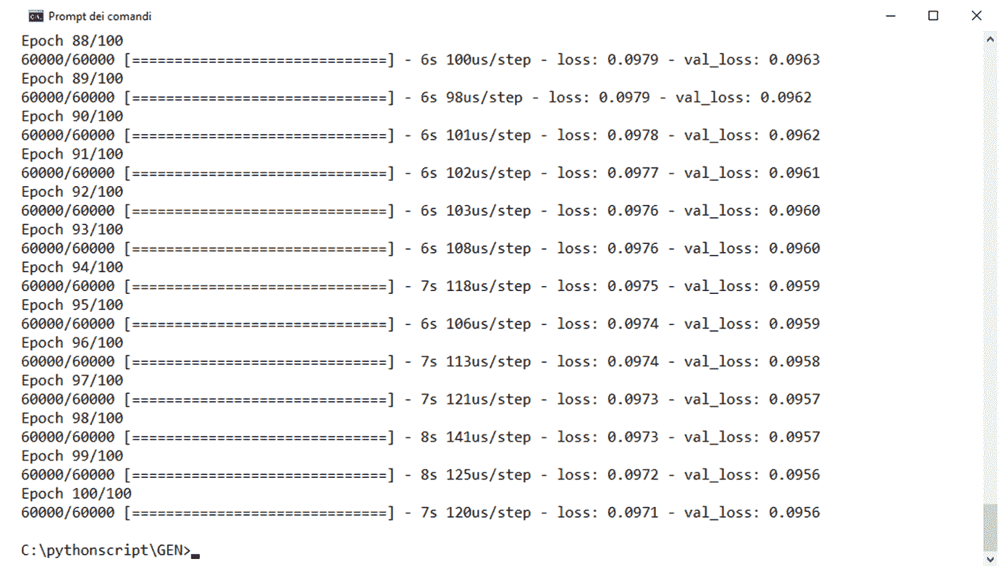

为了了解`loss`函数在各时期如何变化，创建一个训练和验证数据集在训练时期的损失图会很有用。为此，我们将如下使用`Matplotlib`库:

```
plt.plot(history.history['loss'])
plt.plot(history.history['val_loss'])
plt.title('Autoencoder Model loss')
plt.ylabel('loss')
plt.xlabel('epoch')
plt.legend(['train', 'test'], loc='upper left')
plt.show()
```

下图显示了训练和验证数据集在训练时期的损失图:

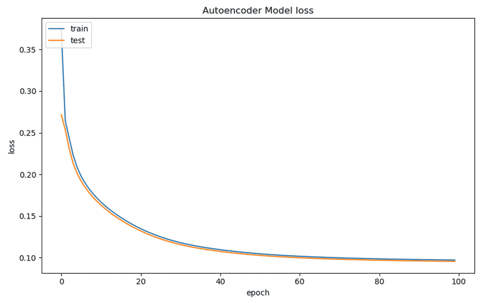

我们的工作完成了；我们只需验证所获得的结果。我们可以在屏幕上打印开始的手写数字和从我们的模型重建的数字。当然，我们将只对数据集中包含的 60，000 个数字中的一部分进行处理；事实上，我们将限制自己只显示前五个。在这种情况下，我们还将使用`Matplotlib`库:

```
n=5
plt.figure(figsize=(20, 4))
for i in range(n):
    ax = plt.subplot(2, n, i + 1)
    plt.imshow(x_test[i].reshape(28, 28))
    plt.gray()
    ax.get_xaxis().set_visible(False)
    ax.get_yaxis().set_visible(False)
    ax = plt.subplot(2, n, i + 1 + n)
    plt.imshow(DecodedDigits[i].reshape(28, 28))
    plt.gray()
    ax.get_xaxis().set_visible(False)
    ax.get_yaxis().set_visible(False)
plt.show()
```

结果如以下截图所示:

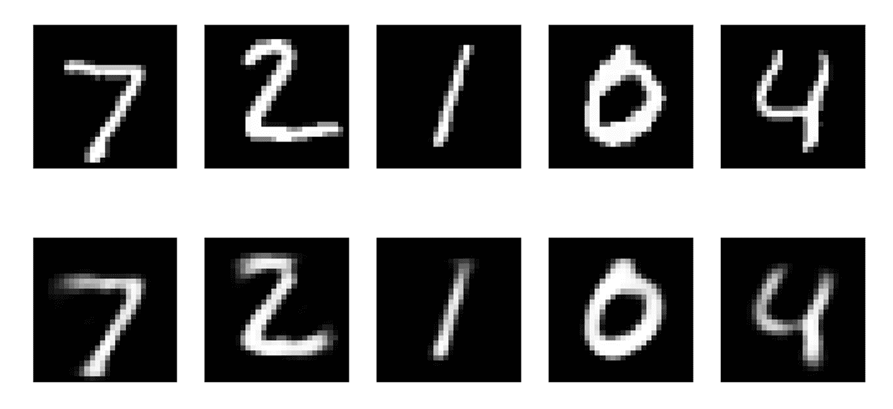

如您所见，结果非常接近原始结果，这意味着该模型运行良好。


# 品红

2016 年 6 月 1 日，谷歌启动了 Magenta 项目，这是一个研究项目，旨在通过使用 AI，允许以自主的方式创作艺术和音乐。Magenta 基于 TensorFlow 平台，旨在 GitHub 上以开源模式发布代码，让开发者获得越来越引人注目的高级成果。

该项目是谷歌大脑团队的一个创意，谷歌大脑团队是谷歌的一个深度学习人工智能研究团队。它将开放式机器学习研究与系统工程和谷歌规模的计算资源相结合。

Magenta 项目为自己设定了两个雄心勃勃的目标:为艺术和音乐开发机器学习，并建立一个对这一主题感兴趣的人的社区。机器学习长期以来被用于不同的环境，特别是用于语音识别和语言翻译。Magenta 的创建是为了将活动集中在以前未探索的领域，如广义上的艺术生成。为了做到这一点，Magenta 想创造一个物理空间，让所有有相同兴趣的人(也就是艺术一代)可以交流想法和产品。换句话说，一个艺术家、程序员和机器学习研究人员的社区。

如需了解更多信息，请访问该项目的官方网站，网址如下:[https://magenta.tensorflow.org/](https://magenta.tensorflow.org/)。


# NSynth 数据集

通过阅读前面的章节，我们现在已经理解，为了正确地训练机器学习算法，有必要拥有包含重要数量的观察值的数据集。最近，由于高质量图像数据集的可用性，生成模型的使用越来越多地应用于图像，因此对应于重要的数据集。考虑到这一点，谷歌大脑团队已经推出了 NSynth。这是一个大规模、高质量的音符集，比可比较的公共数据集大一个数量级。目的是拥有一个重要的音频数据集，以便开发具有更好性能的生成模型。

杰西·恩格尔(Jesse Engel)等人在名为*使用 WaveNet 自编码器对音符进行神经音频合成*的文章中介绍了 NSynth 数据集。

NSynth 是一个包含 305，979 个音符的音频数据集，每个音符都有独特的音调、音色和包络。对于来自商业样本库的 1006 个工具，谷歌大脑团队生成了 4 秒钟的 16 kHz 单声道音频片段，称为**音符**，跨越了标准 MIDI 钢琴 or (21-108)的每个步骤和五种不同的速度(25、50、75、100 和 127)。音符在最初的 3 秒钟内保持不动，直到最后一秒钟才落下。

谷歌大脑团队还根据人工评估和启发式算法的组合，用三条附加信息对每条笔记进行了注释:

*   **音源**:音符乐器的发声方法。这可以是分别从原声或电子乐器录制的原声或电子乐器之一，也可以是合成乐器的合成。
*   **系列**:音符乐器所属的高级系列。每种乐器都是一个家族的成员。
*   **音质**:音符的音质。每个音符都有零个或多个质量的注释。

NSynth 数据集可以两种格式下载:

*   序列化 TensorFlow 示例协议缓冲区的 TFRecord 文件，每个注释有一个示例 proto
*   包含非音频功能的 JSON 文件以及 16 位 PCM WAV 音频文件

整个数据集分为三组:

*   **训练**:289205 个例子的训练集。仪器不与有效或测试重叠。
*   **有效**:有 12678 个例子的验证集。仪器不与列车重叠。
*   **测试**:有 4096 个例子的测试集。仪器不与列车重叠。

欲了解更多信息并下载数据集，请访问该项目的官方网站，网址如下:[https://magenta.tensorflow.org/datasets/nsynth](https://magenta.tensorflow.org/datasets/nsynth)。


# 摘要

在这一章中，我们探索了关于神经网络建模的最有趣的研究点之一。首先我们看到了无监督学习算法的介绍。无监督学习是一种机器学习技术，它从一系列输入(系统经验)开始，将能够在共同特征的基础上重新分类和组织，以尝试对后续输入进行预测。与监督学习不同，在学习过程中只向学习者提供未标记的示例，因为类不是先验已知的，而是必须自动学习的。

所以，我们分析了不同类型的生成模型。玻尔兹曼机器是一种概率图形模型，可以解释为随机神经网络。在实践中，玻尔兹曼机器是一种模型(包括一定数量的参数)，当应用于数据分布时，能够提供一种表示。该模型可用于提取未知分布(目标分布)的重要方面，仅从后者的样本开始。

自编码器是一种神经网络，其目的是将其输入编码成小尺寸，并且所获得的结果能够重建输入本身。自编码器的目的不仅仅是对输入进行某种压缩或寻找相同函数的近似；但是有一些技术允许我们指导模型(从一个降维的隐藏层开始)给予一些数据属性更大的重要性。因此，它们基于相同的数据产生不同的表示。

GAN 是一个由两个网络共同训练而成的生成模型，称为**生成器**和**鉴别器**。这两个网络之间的动态就像一个伪造者和一个调查者。伪造者试图制造真正艺术品的忠实仿制品，而调查者则试图将赝品与真品区分开来。

然后，我们展示了如何实现一些例子:使用 RBM 的特征提取和使用 Keras 的自编码器。最后，我们介绍了 Nsynth 数据集和 Google Magenta 项目。