# IBM 云简介

在本章中，我们将简要介绍 IBM 云平台及其提供的服务，如**机器学习** ( **ML** )。此外，本章将提供关于如何在 IBM Cloud 上建立数据科学和机器学习开发环境的详细说明。最后，我们将以一个涉及加载和可视化数据的项目示例来结束。

我们将把第一章分成以下几节:

*   了解 IBM 云
*   IBM 云和沃森机器学习服务
*   设置环境
*   数据可视化教程

# 了解 IBM 云

关于 IBM 云环境，我们能说些什么？是什么让它如此独特和令人兴奋？首先，IBM 云平台(以前称为 **Bluemix** )实际上将**平台即服务** ( **PaaS** )与**基础设施即服务** ( **IaaS** )结合在一起，此外，它还提供了一个云服务集合或目录，您可以将这些服务与 PaaS 和 IaaS 集成，以高效地构建个人、企业甚至全球创新应用。

IBM Cloud 的其他一些要点(从开发人员的角度来看)包括:

*   你可以在所谓的无国界云上进行开发，这意味着你可以将私有服务连接到 IBM 提供的公共 IBM 云服务上
*   您将会看到越来越多的服务和运行时框架被添加进来并可供您使用
*   使用 IBM Watson 工具和服务，您可以从开始到开发沙箱，再到全球分布式环境，而不必进行大量投资
*   您可以测试和采用来自 IBM、开源社区和第三方开发人员的大量云服务和功能
*   您可以根据需求或工作负载需求的变化实时控制资源

我们能做的还有很多。

# 先决条件

作为一个基于云的环境，IBM Cloud 不需要担心任何先决条件，这使得它的启动和运行非常容易。您真正需要的是一个 web 浏览器(参见推荐版本的文档)和一个合理的互联网连接。

可选但推荐的是 **IBM Cloud Developer 工具集**。IBM 宣称这是一种与应用、容器、基础设施和其他服务交互的统一方式。在这个安装中，您将获得独立的 IBM Cloud **命令行界面** ( **CLI** )，加上各种工具，如 Git、Docker、Helm、kubectl 和 curl，以及以下 IBM Cloud 插件:

*   IBM 云开发工具插件
*   IBM 云功能插件
*   IBM 云容器注册插件
*   IBM 云库服务插件
*   sdk-gen 插件

如果您既想安装 IBM Cloud CLI，又想安装其他推荐的插件和工具来为 IBM Cloud 开发应用，请遵循这里在线描述的方法:[https://console.bluemix.net/docs/cli/index.html#overview](https://console.bluemix.net/docs/cli/index.html#overview)。

# 访问 IBM 云

我们开始吧！要访问 IBM Cloud，您可以前往[https://www.ibm.com/cloud](https://www.ibm.com/cloud)，在那里您将到达 Cloud 注册/登录页面，如下图所示:

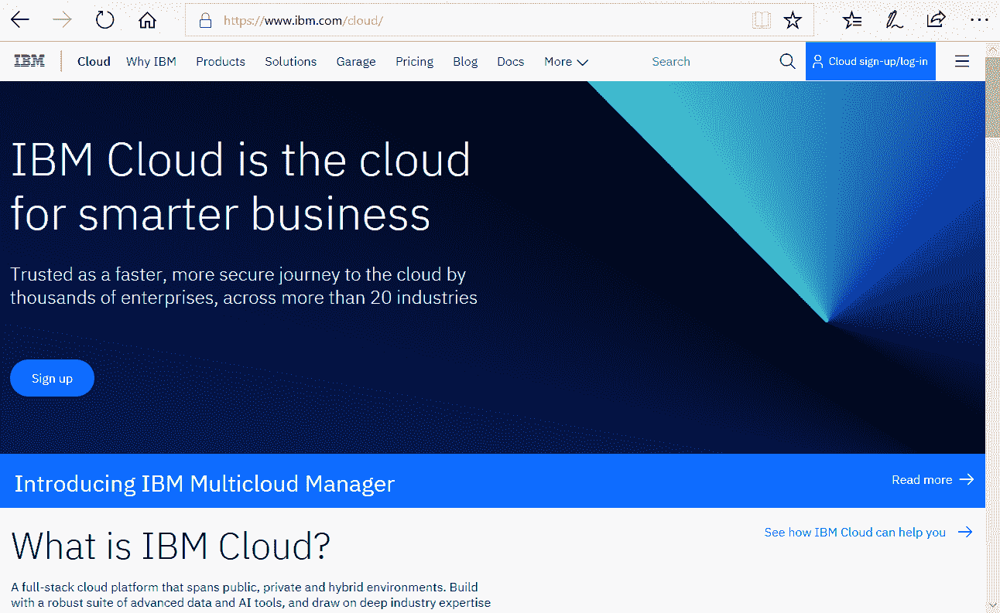

如果你点击蓝云注册/登录链接，你可以创建一个免费账户(使用你的 IBM ID)或登录(一旦你设置了你的付费或免费账户)。

在您的 ID 通过身份验证后，您将到达 IBM Cloud 主页或控制台，如下面的屏幕截图所示:

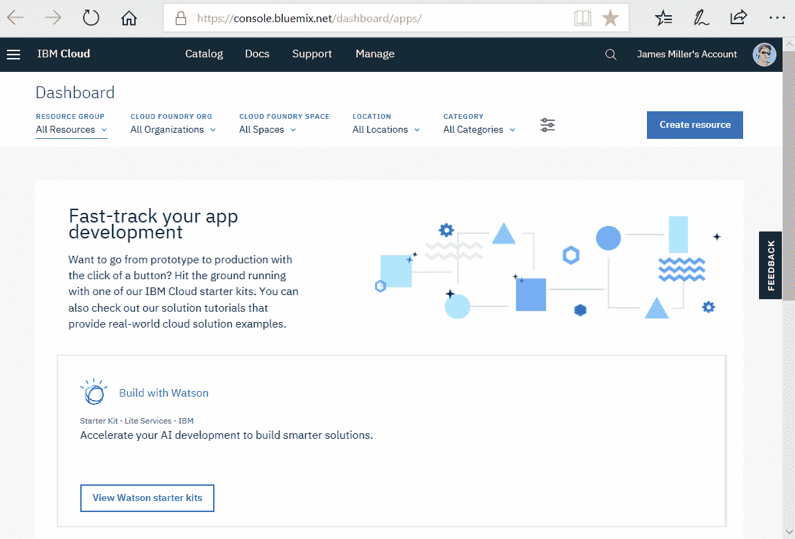

**IBM 云控制台**是您用来管理所有 IBM 云资源的用户界面。当您访问控制台时，您可以管理您的帐户、登录、访问文档、访问目录、查看定价信息、获得支持或检查 IBM Cloud 组件的状态。

登录后，**菜单栏**包含导航菜单图标和附加链接，具体取决于您的帐户类型。

从控制台，您可以执行以下任务:

*   使用导航菜单图标来访问仪表板上的所有现有资源
*   使用目录链接创建新资源
*   使用 Docs 链接访问关于 IBM Cloud 的有用信息
*   从 Support 菜单中，您可以访问有关 IBM Cloud 中的新特性、支持中心、添加和查看票据的选项以及状态页面的信息
*   从“管理”菜单，您可以访问您的帐户、帐单和使用信息以及安全选项
*   按键盘上的正斜杠键( */* )将光标导航到搜索字段

# 云资源

通过 IBM Cloud dashboard 或控制台，您可以查看并使用 **IBM Cloud resources** 和 Cloud Foundry **s** 服务实例。我们将在后面的章节中更深入地探讨这些，但是现在，您可以将资源看作是可以在资源组中创建、管理和包含的任何东西。一些例子包括应用、服务实例、容器集群、存储卷和虚拟服务器。

在下面的屏幕截图中，您将看到控制台的顶部:

我们不会在这里向您介绍所有的功能和特性，而是将重点放在有助于我们快速启动 ML 项目开发的云领域。IBM Cloud 提供了简洁的开发人员仪表板(可从控制台页面左上角的导航菜单图标访问)，每个仪表板都专注于不同的兴趣领域(如 Watson、安全或金融)或数字渠道(如移动或 Web 应用)。

开发人员仪表板的菜单列表如下面的屏幕截图所示:

每个开发人员仪表板都提供了适用于仪表板重点区域的各种初学者工具包，提供了一致、直观的工作流程，然后帮助您在几分钟内创建一个工作应用解决方案。

# IBM 云和沃森机器学习服务

从提供的初学者工具包列表中选择 Watson 将打开“使用 Watson 构建”页面，该页面的上半部分如下面的屏幕截图所示:

该页面分为几个部分，即概述、初学者工具包、Watson 服务、开发人员资源和应用。如果您单击 Watson Services，然后浏览 Services，当前提供的与 Watson 相关的服务会显示为面板，如以下屏幕截图所示:

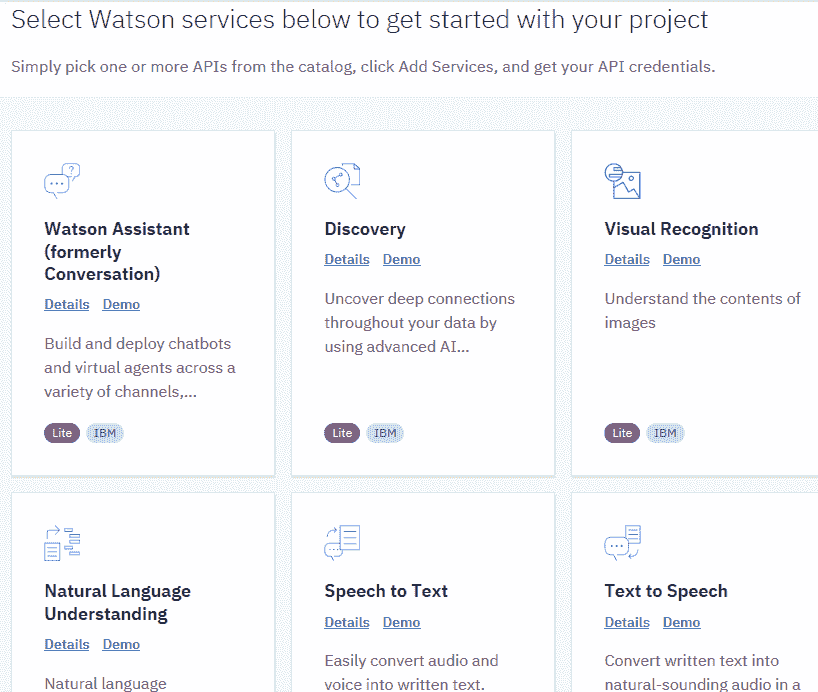

此时，我们需要找到一个我们想要使用的服务实例。要选择服务产品，您可以单击您感兴趣的面板(例如，机器学习)。为了确保这是您想要的产品，您可以单击“详细信息”并通读服务说明，包括其功能列表和其他相关信息(如下图所示)，然后单击“创建”:

想要更多细节？不要忘记点击页面上的查看文档链接。

# 设置环境

要构建基于 Watson 的项目，您需要访问 IBM Watson Studio。

您将从 Cloud Dashboard 菜单访问 IBM Watson Studio(使用前面的*访问 IBM Cloud* 一节中给出的 URL)。

IBM Watson Studio 是一个集成环境，旨在简化开发、训练和管理模型，以及部署人工智能应用。您可以使用 Watson Studio 中的神经网络建模器和深度学习实验来清晰轻松地解决最具挑战性和计算密集型的问题。你需要你的 IBM ID 来设置这个。

Watson Studio 目前有三个版本，即**云**、**桌面**和**本地**，每个版本都根据您想要执行工作的位置提供一个解决方案:

*   **Watson Studio Cloud** :您的模型驻留在 IBM 公共云中
*   沃森工作室桌面:你的模型在你的桌面上
*   Watson Studio Local :您的模型驻留在您的私有局域网或私有 IBM 云上

在本书中，我们将首先关注沃森工作室云。

# 沃森工作室云

设置完成后，您会发现 Watson Studio 云格式类似于我们合作过的其他 IBM 站点(例如，IBM Watson Analytics 和云控制台):

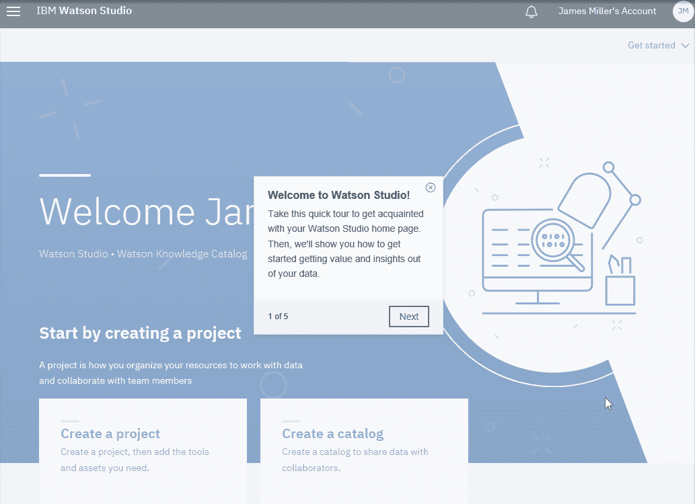

Watson Studio 的所有版本都为您提供了通过协作处理数据来解决业务问题的环境和工具。您可以选择所需的工具来分析和可视化数据、清理和整形数据、摄取流数据，或者创建、训练和部署 ML 模型。

# 沃森工作室架构和布局

Watson Studio 的架构是以项目的概念为中心的。项目是组织资源和处理数据的地方。项目中最重要的资源包括协作者(您的用户，按安全角色分类)、数据资产(这些指向项目中要使用的数据)，以及各种分析资产和工具(您从数据中获得洞察力)。

提供了一些有趣的工具，我们将在本书的后面涉及到，例如 Streams Designer、Data Refinery、RStudio 等等。您还可以从 IBM Watson 社区引入数据和分析资产。

您会发现 Watson Studio 主页(有时称为面板，而不是页面)被很好地组织成以下几个部分:

*   一个入门部分(显示在前面的截图中),您可以点击面板来创建一个(新的)项目或目录。
*   “最近更新的项目”部分，您可以在其中查看您有权访问的项目的链接，或者通过单击“新建项目”来创建新项目:

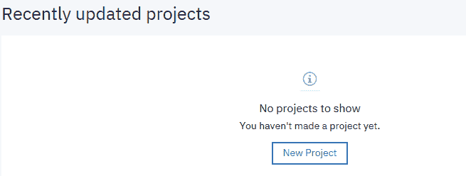

*   “您的目录”部分，在这里您可以看到指向您有权访问的目录的链接；您也可以创建一个新的:

目录是您组织资产(例如，您的数据、数据连接和分析)和协作者的地方。

*   Watson services 部分，您可以在其中查看您正在使用的活动服务和工具列表，或者添加新服务:

*   其他部分包括新的社区部分:

*   您也可以查看有用的链接:

Watson Studio 简化了服务实例的管理、与团队成员的协作，以及设计、训练和部署模型。这个主题是关于如何在 Watson Studio 中使用机器学习。

要在不使用 Watson Studio 的情况下设置 Watson Machine Learning，请参见此链接:[https://data platform . cloud . IBM . com/docs/content/analyze-data/ml-setup . html](https://dataplatform.cloud.ibm.com/docs/content/analyze-data/ml-setup.html)。

# 建立上下文

在我们建立一个项目之前，我们需要做的是问我们自己:我们想要创建一个新的项目还是重用一个现有的项目？接下来，我们是要创建一个新的 Watson 机器学习服务实例，还是重用我们已经有的实例？

# 设置新项目

简单地说，为了回顾我们已经讨论过的内容，为了设置我们的第一个新项目，我们需要单击主页标题区域中的 IBM Watson 链接，导航到 IBM Watson Studio 主页面板。然后，我们将执行以下步骤:

1.  点击新建项目。

2.  选择项目类型:
    *   如果你想用实验训练复杂的神经网络，选择一个*深度学习*项目
    *   对于所有其他机器学习工作，选择 Modeler 项目类型

3.  如果您还没有任何所需的服务，比如 Watson 机器学习和 IBM 云对象存储，那么就会创建新的服务实例。

在这一点上，我们可以进一步深入 IBM Watson Studio 的每个管理领域，但是本书的目标更注重结果和实践，所以最好的下一步可能是看一看一个小而具体的项目，我们将在下一节中进行。

与 IBM Watson 机器学习和 IBM Watson Studio 相关的有用的关键术语可以在[https://data platform . cloud . IBM . com/docs/content/analyze-data/ml-terminals . html](https://dataplatform.cloud.ibm.com/docs/content/analyze-data/ml-terminology.html)在线查看。

# 数据可视化教程

让我们从一个简单的项目开始吧！

和往常一样，任何项目都是从项目目标的陈述开始的。在这个项目中，目标是使用一个简单的文本文件(`TripRuns.csv`)，其中包含来自专业驾驶服务组织的结果，以展示使用 IBM Watson Studio 创建一个简单的可视化分析仪表板是多么容易。

借助分析仪表板，您可以构建复杂的可视化分析结果，在仪表板上交流基于这些结果的见解，然后轻松地与他人共享仪表板。Cognos Dashboard Embedded 使用 IBM Cognos Analytics 的仪表板功能。您可以通过访问以下网址了解如何使用仪表板:[https://www . IBM . com/support/knowledge center/en/ssep 7j _ 11 . 0 . 0/com . IBM . swg . ba . Cognos . ug _ ca _ dshb . doc/wa _ dashboard _ discovery set _ intro . html](https://www.ibm.com/support/knowledgecenter/en/SSEP7J_11.0.0/com.ibm.swg.ba.cognos.ug_ca_dshb.doc/wa_dashboard_discoveryset_intro.html)。

既然我们已经清楚地陈述了项目目标，我们需要遵循这些逐步说明:

1.  点击新建项目。
2.  接下来，单击创建项目页面。选择项目启动者(自动提供所需的服务。您可以稍后添加其他资产和服务)。对于此示例项目，我们将通过单击创建项目来选择业务分析，如下面的屏幕截图所示:

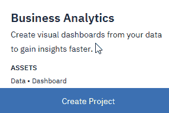

3.  接下来，您需要从下拉列表中选择您的项目实例将驻留的区域(我已经选择了 US South):

4.  单击“选择”后，新项目页面(如下图所示)允许您在单击“创建”之前提供适当的项目详细信息:

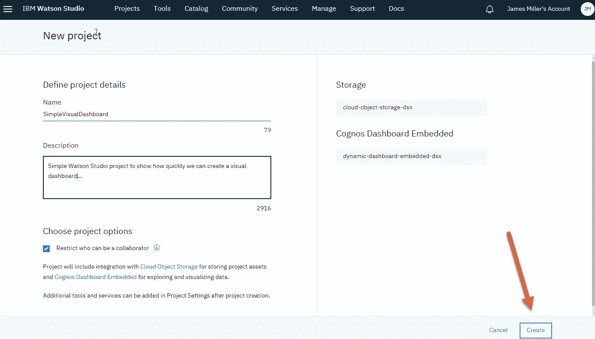

在名称和描述下输入名称和描述。对于这个示例项目，您可以保留项目、选项和存储以及 Cognos Dashboard 嵌入信息，如前面的屏幕截图所示。

一旦项目被创建，我们将有一个工作空间，在这里我们可以组织项目将使用的资产。有许多资产(数据、合作者和分析工具)，但是我们需要从数据开始。要将数据加载到我们的项目工作区，我们可以使用直接的数据库连接器，或者简单地将文件拖放到着陆区(您也可以浏览到您的文件)。

对于我们的简单示例，我们使用一个文本文件作为我们的数据源，因此在项目工作区页面的右上角，您可以单击**查找并添加数据**图标，如下面的屏幕截图所示:

从那里，您可以点击 Load 并浏览来定位和选择您想要在项目中使用的文件(我们的是`TripRuns.csv`)。文件加载完成后，单击“文件”,您应该会看到文件已列出，可以使用了:

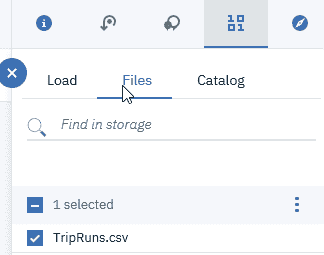

现在我们已经有了一些要处理的数据，我们可以单击菜单选择 Add to project，然后选择 Dashboard:

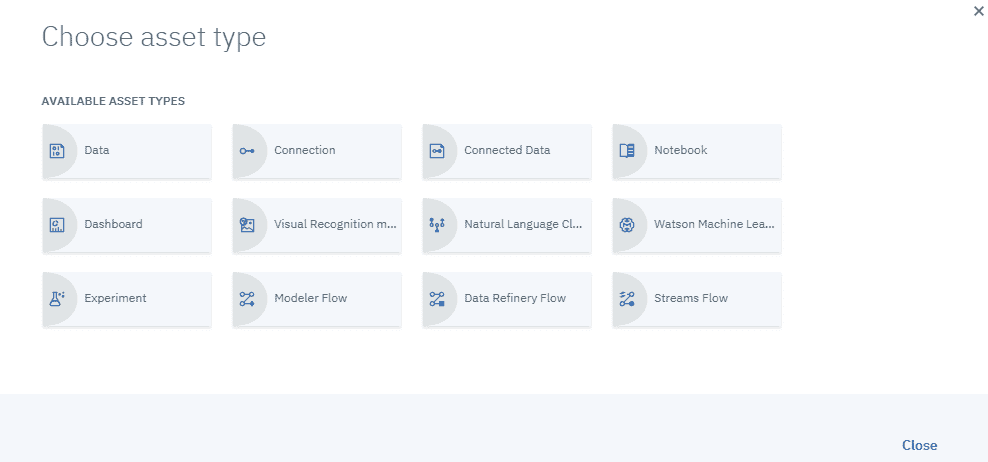

选择仪表板后，您必须在名称和描述下提供名称和描述，然后单击保存:

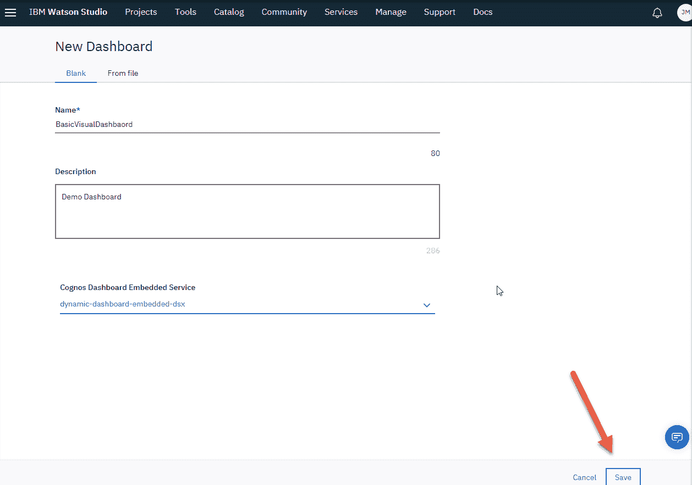

在 IBM Watson 为您的项目设置了新的仪表板之后，您可以从它的一般布局开始定制它。您可以从选择一个预先格式化的模板开始:

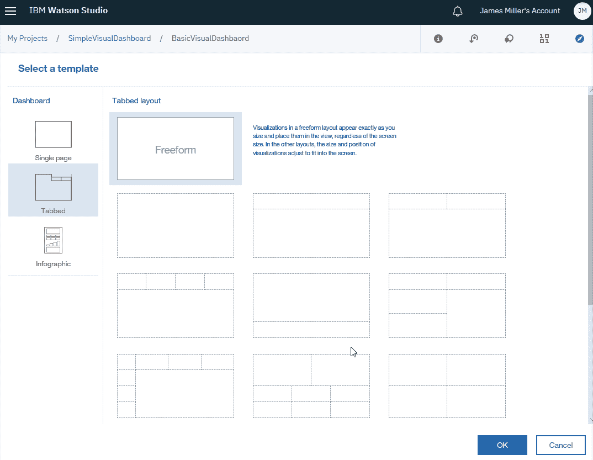

一旦您选择了一个模板(我选择了选项卡式和自由形式)，您就会发现自己在仪表板画布上(如下面的屏幕截图所示)，我们可以在这里设计您的仪表板:

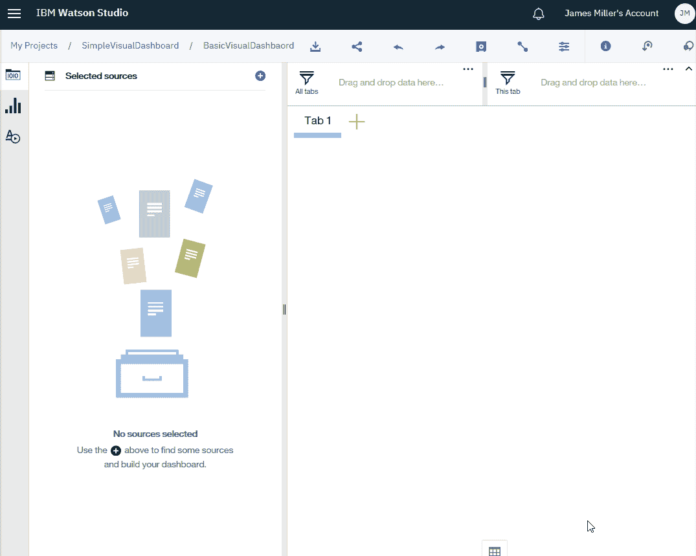

接下来，单击页面左上角所选来源旁边的+图标:

单击+图标后，您可以选择我们之前添加到项目中的`TripRuns.csv`数据资产:

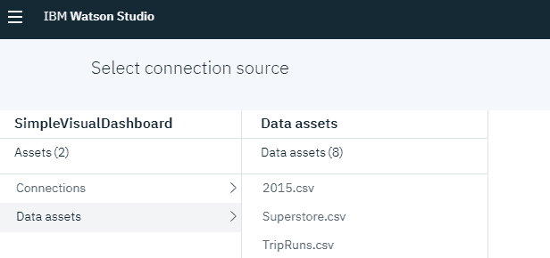

如果您想知道什么是连接，那么您可以在这里定义直接连接到数据库或其他数据源的任何数据资产。**连接资产**包含创建到数据源的连接所需的信息。您创建到 IBM(或其他)云服务和本地数据库的连接。

选择我们的数据资产后，它应该会显示出来，如下面的屏幕截图所示。现在，我们准备开始构建我们的仪表板:

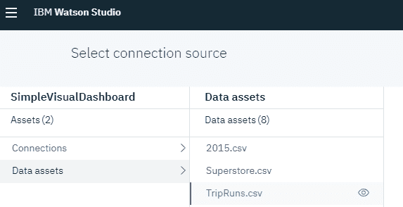

当您将鼠标悬停在数据资产旁边的眼睛图标上时，您会注意到 Watson Studio 为您提供了一个快速查看数据资产的选项，只需单击眼睛图标即可。这在处理多个数据资产时很方便，如下面的屏幕截图所示:

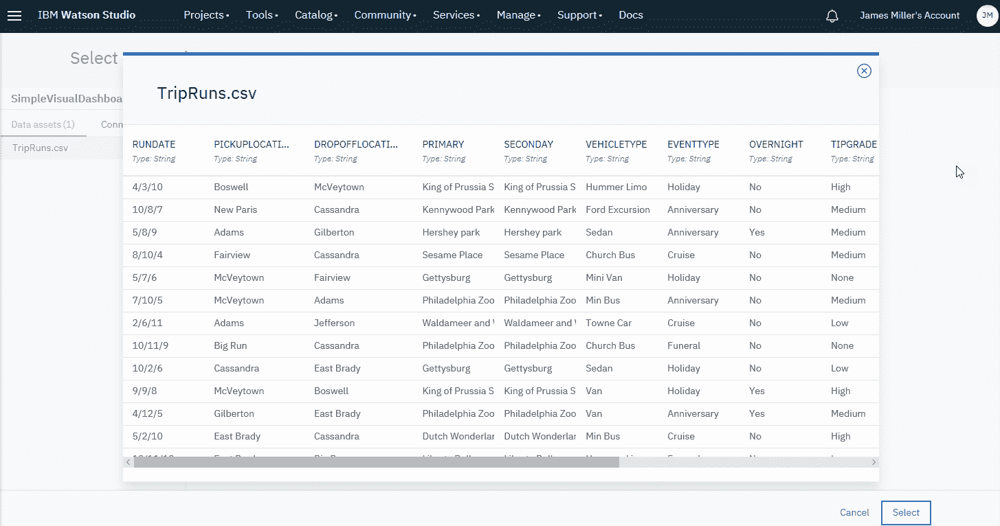

既然我们已经准备好继续，我们只需单击我们的数据资产名称(而不是眼睛图标)，然后单击页面右下角带有标题 Select 的按钮。将再次显示仪表板画布页面。请注意，该页面分为两个部分，如下面的屏幕截图所示:

右边是绘图空间或画布，左边是菜单窗格，由三个图标组成:选择源、可视化和小部件。我们已经设置了我们的数据源，所以让我们点击可视化。将显示可视化选择器，您可以在其中选择要在 analytics 仪表板上使用的可视化类型:

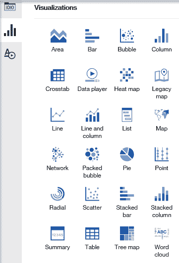

为了使这个例子简单，我们只需通过单击 Bar 图标来选择 Bar 作为可视化类型。构建您的可视化模板将被添加到您的画布中，如以下屏幕截图所示:

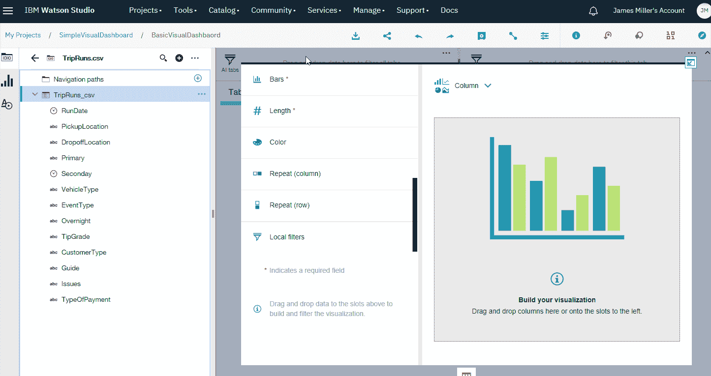

从那里，我们可以将数据列拖放到所需的可视化参数中，比如条和长度。请注意，必需的参数用红色星号表示。

与大多数 Watson 可视化界面一样，当您添加或删除参数值时，可视化会实时更新:

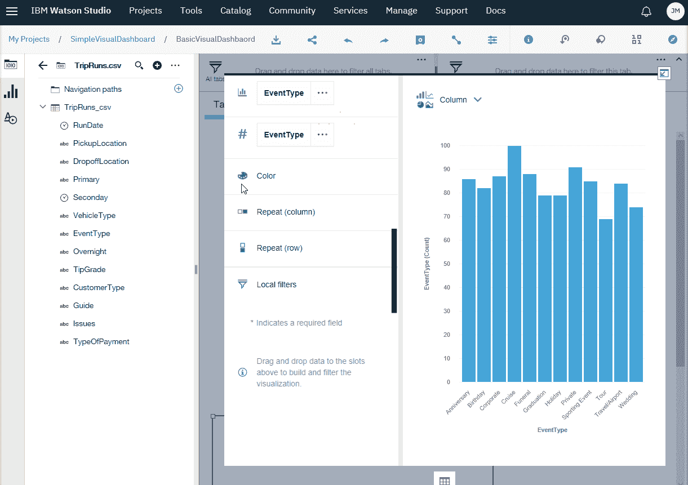

对可视化效果感到满意后，可以单击保存图标(位于仪表板操作栏上)来保存仪表板。您创建的仪表板列在项目资产页面的仪表板部分。

从仪表板操作栏中，您可以执行以下任务:

*   以 JSON 文件的形式下载仪表板
*   创建永久仪表板 URL 以与其他人共享
*   已在仪表板上执行的撤消/重做操作
*   保存仪表板
*   添加/移除小部件连接
*   更改仪表板属性，如颜色
*   查看您的仪表板详细信息，例如名称和描述，或者如果多个服务与项目相关联，则选择一个备用的 Cognos Dashboard 嵌入式服务实例
*   在社区中查找资源，例如有用的数据集

# 摘要

在本章中，我们从介绍 IBM 云环境以及如何首次访问它开始。此外，我们使用 IBM Watson 控制台来说明如何创建项目。

最后，我们回顾了一些任务，例如向项目添加新的数据集资产，以及在几分钟内使用我们的数据创建简单的分析仪表板，而无需任何编程。

在下一章，我们将研究特征提取。