<title>Implementing Unsupervised Algorithms</title>  

# 实现无监督算法

在[第三章](b2822c69-13f0-4943-9e66-f9ef04898b60.xhtml)、*对你的数据进行监督的机器学习模型*中，我们重点介绍了*监督的*机器学习算法。本章将建立在前几章的基础上，因为我们将继续 IBM Cloud 中提供的机器学习范例之旅。本章将涵盖**监督**与**非监督**以及**半监督**学习。

监督学习问题通常分为**回归**和**分类**问题，我们看到了使用 IBM Watson Studio 及其模型构建器特性帮助解决这些问题的方法。

另一方面，无监督学习允许我们在我们可能很少或不知道结果应该或应该是什么样子的时候处理问题。在这里，在这些类型的问题中，我们可以尝试通过基于数据中变量之间确定的关系对(数据)进行**聚类来从数据本身导出结构，即使我们不一定知道这些变量的影响。**

这一章将集中讨论无监督机器学习的概念及其相关主题。

此外，本章还将讨论一些常见的聚类算法。最后，本章将通过讨论在线学习和批量学习的概念来结束。

我们将本章分为以下几个部分:

*   无监督学习
*   半监督学习
*   异常检测
*   在线和/或批量学习

<title>Unsupervised learning</title>  

# 无监督学习

正如我们在上一章中所讨论的，监督学习是利用函数的机器学习过程，该函数基于示例输入-输出对将输入映射到输出，从包含一组训练样本的标记训练数据推断出函数。

同样，在上一章中，我们看到了如何在使用模型构建器时，为预测模型设置一个**标签列**来进行预测。回想一下，在一个示例中，我们从模型的训练数据中选择了列`IS_TENT`进行预测。

现在，在本章的这一节中，我们要检查我们的数据中没有定义标签数据的场景，或者换句话说，无监督学习问题。重申一下，在这些情况下，我们没有基于先前预测结果的反馈(或标签)；我们希望在不指明或设置所需标签的情况下解决这些情况。

为了进一步了解无监督学习到底是什么，你可以前往以下链接:[https://www . datasciencecentral . com/profiles/blogs/what-is-unsupervised-learning](https://www.datasciencecentral.com/profiles/blogs/what-is-unsupervised-learning)。

为什么不总是使用监督学习(和标记数据)？要理解为什么您可能会发现自己在使用无监督学习模型，请考虑这样一个事实，即通常更容易找到未标记的数据(它更便宜)，抛光未标记的数据和添加标签通常需要主题专家，并且本身可能是一个复杂的过程。

实现无监督学习目标的一种方法是通过使用**聚类**算法。聚类分析仅使用数据来确定模式、异常(本章后面的部分将详细介绍异常)或数据中的相似性。

群集通过识别不同群集中相似的数据以及群集中不相似的数据来组织数据。

聚类在统计数据分析领域很受欢迎，因为不同的聚类揭示了数据中对象的不同细节，这与分类或回归不同，在分类或回归中，您有一些关于结果的先前信息。

一种流行的聚类算法是 K 均值聚类算法。该算法用于根据属性或特征将对象分类或分组到 *K 个组*(表明该方法如何得名)。

在这种方法中， *K* 将是一个正整数，并且仅仅是数据被分类到的聚类或不同组的数量，而不使用标签或目标字段。K-means 试图揭示数据中输入字段集的模式，而不是预测结果。

在本章的下一节中，我们将看一个工作示例，该示例展示了如何使用 K-means 算法在 Watson Studio 中从数据中创建聚类，以便在不知道预测值是什么的情况下生成预测值。

<title>Watson Studio, machine learning flows, and KMeans</title>  

# 沃森工作室、机器学习流程和 KMeans

Watson Studio 中的 **flow** 编辑器在您通过组合代表对象或动作的各种类型的节点来构建模型时，呈现了一个非常酷的模型图形视图。流编辑器有三个选项板可供选择:SPSS modeler 节点、Spark ML 算法节点和神经网络节点。在这个例子中，我们将创建一个 SPSS modeler 流。

注:SPSS 是社会科学统计软件包的缩写，研究人员使用它进行统计分析。这项技术于 2009 年被 IBM 收购。当前版本(2015)被命名为 IBM SPSS Statistics。

<title>Getting started</title>  

# 入门指南

到目前为止，我们知道您需要创建一个 Watson 项目，并在其中包含或添加数据。因为我们之前已经讨论过这个问题，所以我们将跳过它，进入如何使用 Watson Studio 提供的流编辑器。

<title>Creating an SPSS modeler flow</title>  

# 创建 SPSS modeler 流程

让我们通过执行以下步骤来创建一个 SPSS modeler 流:

1.  要创建一个 SPSS modeler 流，首先我们必须转到添加到项目:

2.  然后，我们可以使用 Assets 选项卡(如下图所示)并单击 Modeler Flow 图标:

3.  接下来，为这个流键入一个名称和描述，并选择 IBM SPSS Modeler 运行时(在左下方)，然后单击 Create 按钮(在右下方):

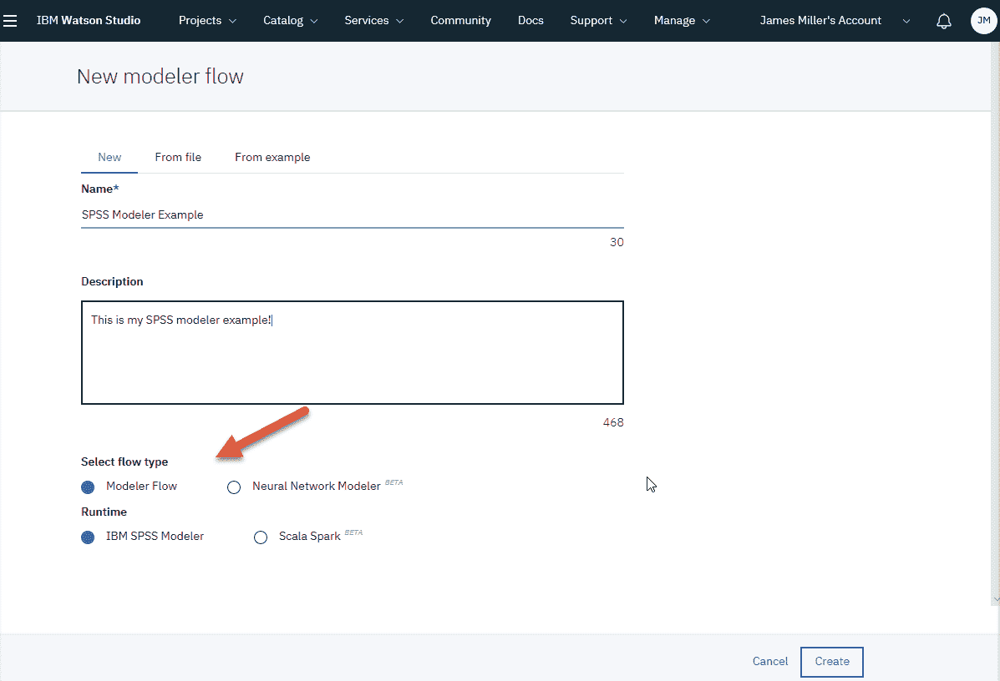

4.  现在，我们准备使用以下流编辑器画布创建我们的机器学习建模器流:

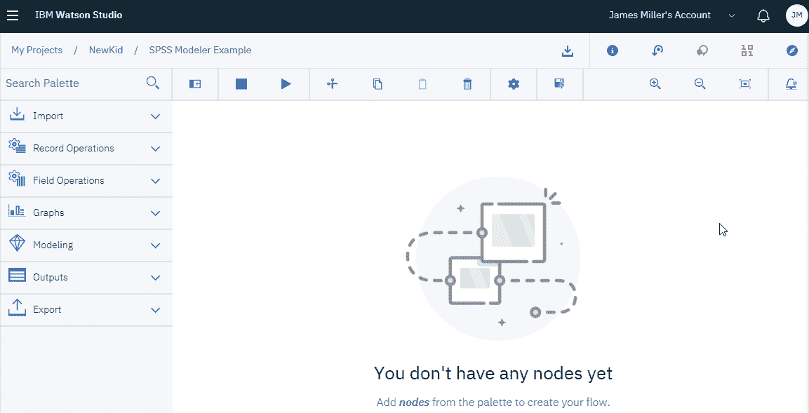

流程编辑器调色板使您能够使用机器学习、**人工智能** ( **AI** )和统计建模方法从您的数据中获取新信息，而无需编程。

5.  现在我们已经准备好添加数据，所以我们可以将数据资产节点(在 Import 下找到)拖到画布上:

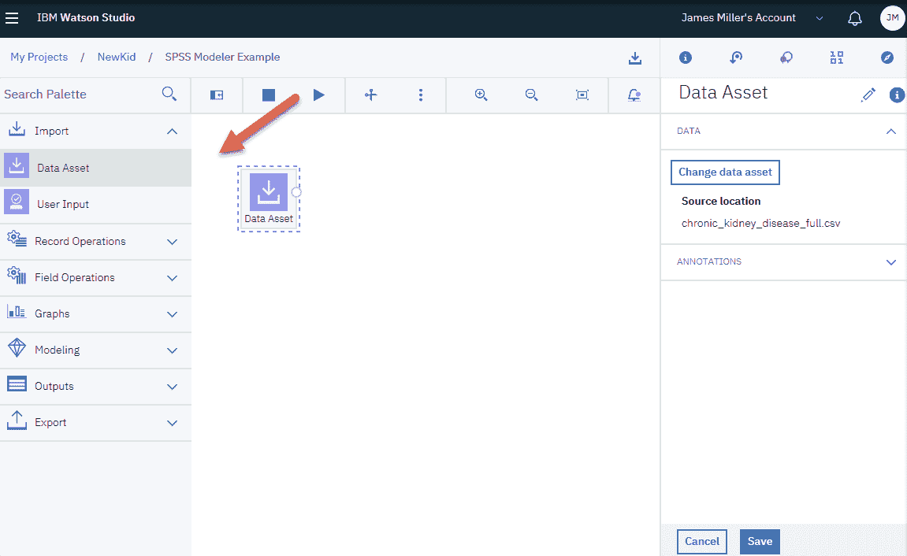

6.  有了数据资产节点后，您可以双击它，选择 Change data asset，选择您的首选(培训)文件，然后单击 OK。如果您现在右键单击该节点，您可以选择预览(如下图所示)来查看您的数据(在只读模式下):

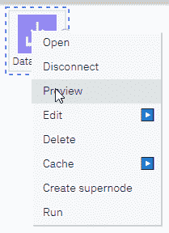

7.  要生成数据的配置文件，您可以添加数据审计节点(位于输出下),方法是将其拖到画布上，将其连接到数据资产节点，然后单击 VCR 类型的运行图标:

您可以看到数据审计节点显示了它在数据资产节点中自动找到的 25 个字段。同样，如果您双击 Data Audit 节点，您将能够查看和更新各种参数，例如节点的名称(在一个流中可以有多个 Data Audit 节点)，以及输出摘要中包含的内容(图形、基本和/或高级统计信息等):

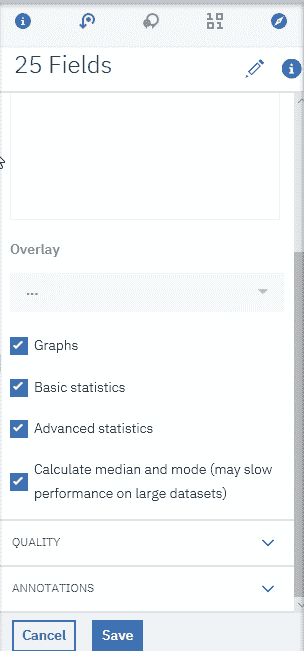

数据审核节点的输出提供了数据的详细配置文件。您可以更改参数，重新运行您的流程，并重新检查结果以适应输出:

前面截图的底部页面如下:

<title>Additional node work</title>  

# 附加节点工作

在开始实际构建分类模型之前，应该注意托盘上有许多节点可以帮助或者实际执行几乎任何您需要执行的操作或过程，而无需编写任何代码！

如果您花点时间看看左侧面板(称为节点面板)，您会看到不同类型的节点可供您在处理数据时使用。这些节点分为以下六个基本类别:

*   **记录操作**:可以在记录(行)级进行选择、追加、排序等操作。
*   **现场操作**:这些节点在数据准备阶段很有帮助。您可以过滤数据、重命名要素以及选择属性类型。
*   **图形**:本节中的节点将帮助您进行基本的数据探索，了解特征之间的分布或关系。
*   **建模**:这些节点针对不同类型的问题提供不同的建模算法。
*   **输出**:这些节点有助于理解你的数据和模型。您可以以表格格式显示结果，或获取模型评估参数的报告。
*   **导出**:经过处理和建模后，该节点将帮助您将数据从流编辑器导出到您的 DSX 项目**。**

让我们试一个。它们都以几乎相同的方式实现:将选定的节点拖放到画布上，然后右键单击以执行进一步的操作，如打开、预览或运行。

例如，让我们看看在“现场操作”下找到的过滤器节点。下面的屏幕截图显示了添加到画布并连接到我们的数据资产节点的过滤器节点:

您可以使用筛选器节点来重命名列，如下面的屏幕截图所示:

您还可以从原始数据资产节点中过滤出或仅保留选定的数据字段:

一旦对数据感到满意，就可以使用 Type 节点将变量设置为模型的目标变量。这将有助于模型区分输入要素和目标要素。例如，您可以执行以下任务:

1.  将类型节点拖放到画布上。
2.  将类型节点连接到筛选器节点。
3.  右键单击类型节点，然后单击打开以打开节点。
4.  单击 Read Values，然后选择列名 class 并将变量的角色更改为 Target，最后单击 Save:

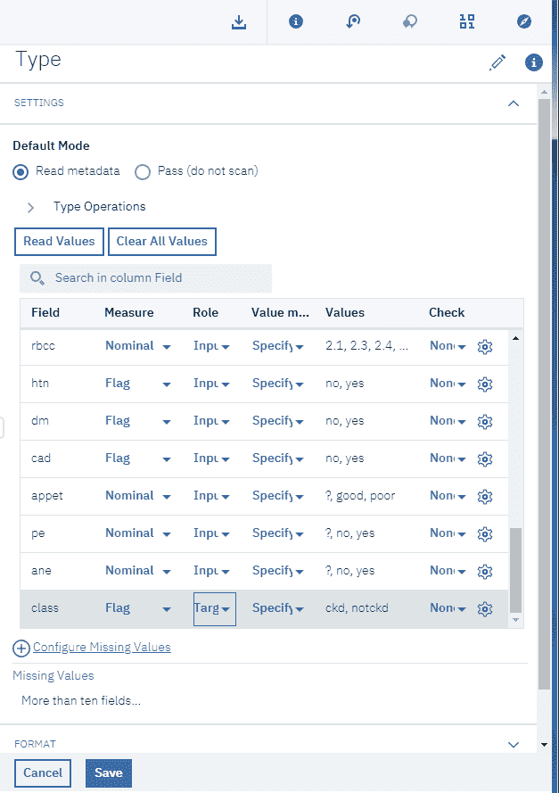

5.  要查看目标变量(我们的设置为 class)的分布情况，可以使用分布节点(从节点面板的 Graphs 部分)。同样，只需将节点拖到画布上，打开并提供诸如 Plot(选择 Field (discrete)下的 class 字段)和 Color (discrete)(使用类)下的信息，然后单击 Save。运行该流后，输出如下所示:

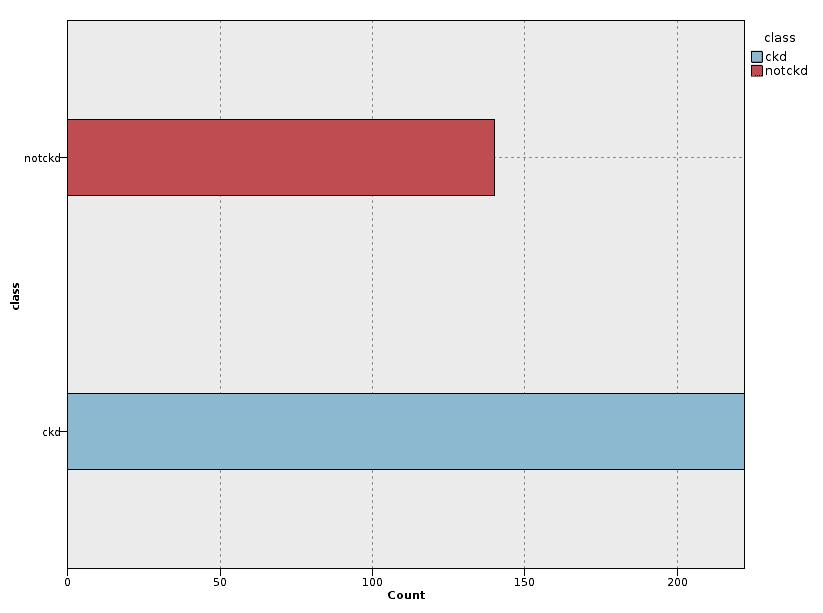

在这个数据中，我们看到 **cronic 病例** ( **ckd** )多于**非 cronic 病例** ( **notckd** )。这是我们当前在画布上显示的流程:

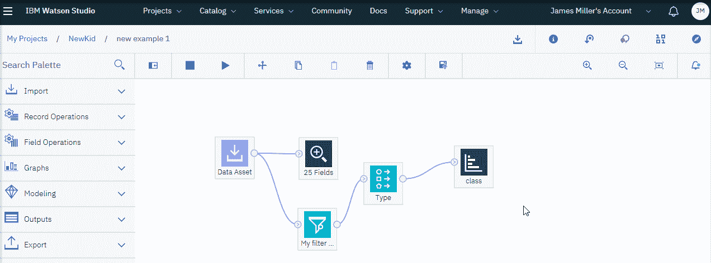<title>Training and testing</title>  

# 培训和测试

SPSS modeler 流程中另一个有用的功能是能够轻松地将数据划分为训练集和测试集。这可以使用分区节点来完成。为了训练、测试和验证模型构建的阶段，分区节点用于产生分区字段，该分区字段将数据分割成单独的子集或样本。

使用一个样本来生成模型，并使用一个单独的样本来测试模型，这将为您提供一个很好的提示，让您了解模型将如何推广到与当前数据相对应的更大数据集:

如果我们将一个分区节点添加到我们的流中，打开它并调整设置，如前面的屏幕截图所示，我们将指示建模者向我们的数据添加一个新字段(`PartionMyData`)，它将指定记录分割(基于 75/25)。为了查看该节点的结果，我们可以向流中添加一个表节点，并提供以下设置:

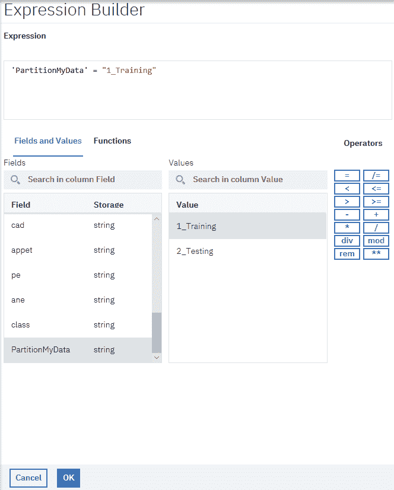

前面的屏幕截图表明我们想要查询我们的数据，并基于我们的派生字段中等于`1_Training`的值生成一个表；换句话说，分区节点指定为我们的训练数据成员的所有记录。我们的流程现在看起来如下:

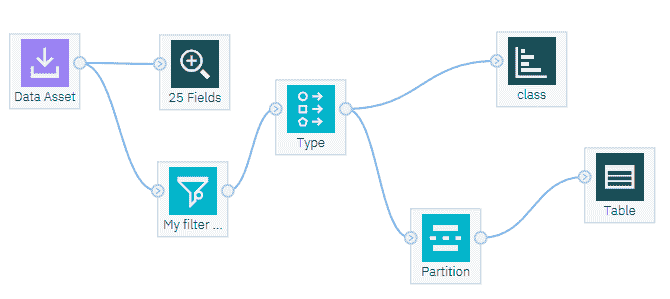

现在运行该流将生成下表:

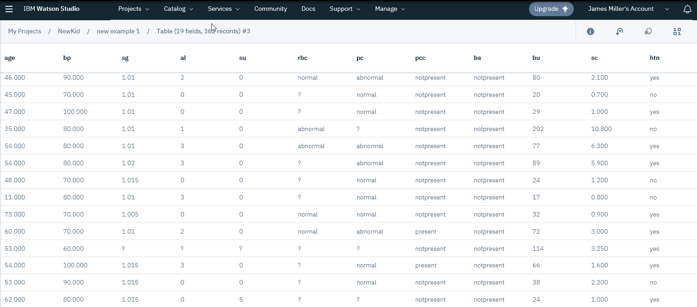<title>SPSS flow and K-means</title>  

# SPSS 流和 K 均值

正如我们在本章前面提到的，一种流行的聚类算法是 **K 均值聚类**算法**。**同样，在不使用标记字段或目标字段的情况下，K-means 通过对数据中输入字段集合中的数据点进行分组和/或聚类，而不是试图预测结果，来尝试发现数据中的模式并找到数据中的结构。

使用我们在本章中使用的样本数据，假设我们不知道一个人是否患有慢性肾脏疾病，并且希望使用 K-means 算法来建立一个无监督模型，以查看我们是否可以识别慢性肾脏疾病的任何模式。

我们将在流程中选择 K-Means 节点来完成这项任务。

K-Means 节点提供了一种聚类分析的方法，您可以从以下链接参考 IBM SPSS Modeller 15 文档中的*第 11 章*:[http://public . dhe . IBM . com/software/analytics/SPSS/documentation/modeler/15.0/en/modeling nodes . pdf](http://public.dhe.ibm.com/software/analytics/spss/documentation/modeler/15.0/en/ModelingNodes.pdf)。

让我们来看看下面的步骤，了解如何学习 K-means 算法:

1.  在左侧的建模下，我们可以选择 K-Means 节点并将其放到画布上。
2.  接下来，将节点连接到类型节点，如下面的屏幕截图所示:

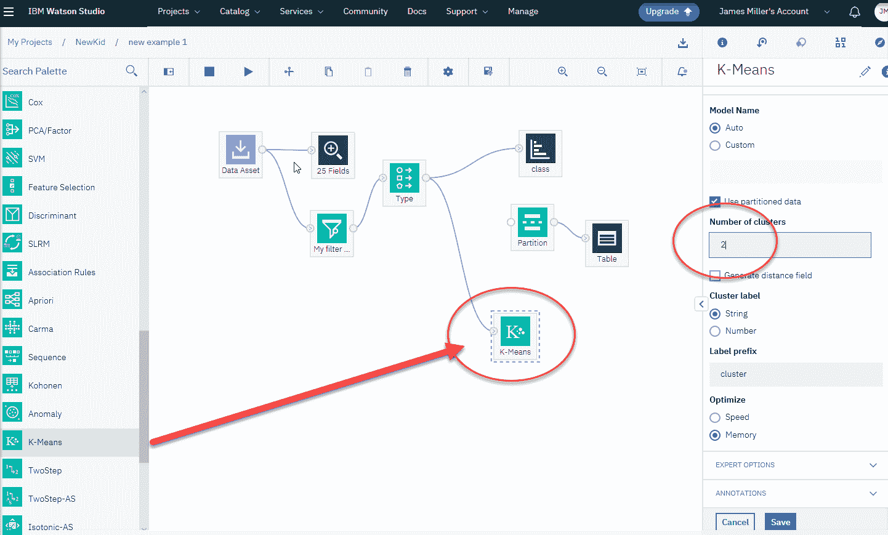

请注意，我已经断开了我们之前使用的分区节点。

3.  一旦我们添加了 K-Class 节点，右键单击并打开它以更改其设置(在画布的右侧)。具体来说，在 BUILD OPTIONS 下，我们将根据我们希望将数据组织成两组(或集群)的想法，将集群的数量设置为`2`:患有慢性肾病的和没有慢性肾病的。所有其他设置可以保持默认值。最后，点击保存。
4.  现在，在您运行流程之后，将会出现一个金色的 K-Means 节点(如下图所示),您可以右键单击并选择 View Model:

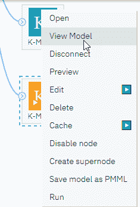

5.  SPSS 可视化工具提供交互式表格和图表来帮助评估预测模型。这些可视化提供了一个包罗万象的输出集，因此您不需要创建多个图表和表格来确定模型的性能。根据算法的不同，您将看到一组与您的特定数据集和模型相关的可视化效果。以下是我们的 K 均值模型的输出:

输出包括关于聚类质量的信息(如前面的屏幕截图所示)以及预测器重要性的信息(如下面的屏幕截图所示):

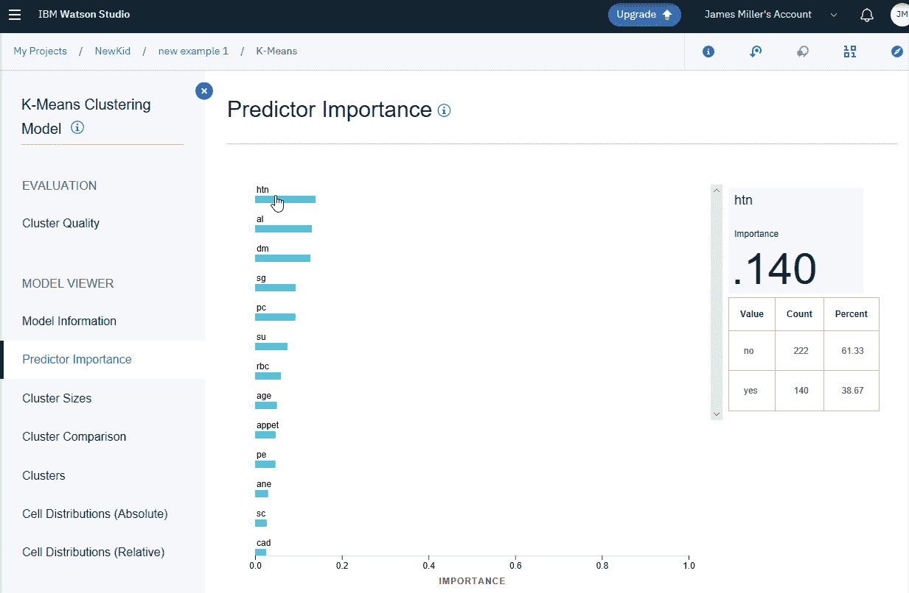**Cluster Quality Evaluation** is a complex subject and is beyond the scope of this chapter, however IBM Watson Studio provides the typical Cluster Quality details such as the Cluster Sizes Chart which is a horizontal bar chart displaying the relative sizes of the clustering in descending order. Hovering over a bar shows the precise percentage of the total number of instances in that cluster based on the K-Means model. All of the clustering information should be reviewed and evaluated in respect to various project options and outcomes.

最后(尽管还有其他信息可视化生成)，它显示了基本的模型信息(如下所示):

SPSS modeler 流程的一个令人惊叹的特性是，您可以在同一个画布上构建多个不同的模型！

对节点进行更改、重新运行(流程)，然后重新评估结果以确定最佳算法和参数是如此简单，以至于您应该将多次迭代作为流程的一部分。

<title>Exporting model results</title>  

# 导出模型结果

一旦您对您的模型感到满意，您就可以使用另一个名为 Data Asset Export node 的便利节点来导出结果。与其他节点一样，您可以将它拖放到画布上，将其连接到黄金 K-Means 节点并打开它以编辑其设置:

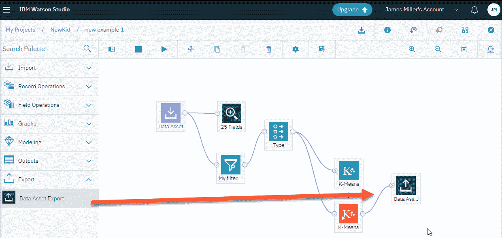

对于节点设置，您真正需要做的是在数据资产导出设置中的目标路径部分下为您的文件键入一个名称(我已经键入了`Lovely`),如下面的屏幕截图所示:

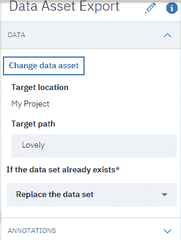

您也可以选择替换数据集作为如果数据集已经存在*部分下的选项。

现在，当您运行流程时，数据将被导出到您的项目存储中，您可以从项目的 Assets 选项卡中查看和访问它:

<title>Semi-supervised learning</title>  

# 半监督学习

**半监督**学习是另一类机器学习过程和技术，它也利用未标记数据进行训练(无监督学习也是如此)，但通常情况下，模型会使用少量带有大量未标记数据的标记数据。这通常被称为**部分标记数据**。

半监督学习介于无监督学习(没有任何标记的训练数据)和监督学习(有完全标记的训练数据)之间。

半监督学习程序确实试图使用某些标准假设来帮助它们利用未标记的数据。这些标准假设是连续性、集群和流形。

在不深入描述这些假设的情况下，松散的定义如下:

*   **连续性**:这个假设意味着相近的数据点也倾向于共享一个标签。
*   **集群**:这种假设认为倾向于形成离散集群的数据，以及同一集群中的点最终共享一个标签。
*   **流形**:这种假设假设数据近似位于比原始数据维数低得多的所谓流形上，根据这种假设，试图使用标记和未标记数据来理解流形以降低维数。

<title>Anomaly detection</title>  

# 异常检测

**异常**也被称为异常值、新奇值、噪音、偏差和异常，通常被定义为在一个池或一组数据中发现罕见项目、事件或观察结果，这些项目、事件或观察结果与大多数数据存在显著差异，从而引起怀疑。

为什么要如此重视异常现象及其检测？

因为数据中的异常几乎总是会转化为某种问题，比如欺诈、缺陷、医疗问题或文本中的错误。

异常检测是一种用于识别不符合预期行为的异常模式的技术，称为**异常值**。为了定位异常，您需要了解异常可以分为几大类。

通常，我们认为异常本质上是点的、上下文的或集体的。点异常是您可能会猜到的:与其他数据非常不同的单个数据点。上下文异常是指看似好的数据只在特定的上下文中才是好的。集体异常是指您认为集体集合中的数据是异常的情况。

<title>Machine learning based approaches</title>  

# 基于机器学习的方法

当然，对于异常检测过程，有许多普遍接受的基于机器学习的方法。目前包括以下内容:

*   **基于密度的异常检测** : 该方法基于 KNN 算法；根据数据类型(分类或数字)使用评分方法评估最近的一组数据点。
*   **基于聚类的异常检测**:在用于异常检测的无监督学习领域中，最需要的概念之一是聚类。
*   **基于支持向量机的异常检测** : 该算法使用训练集来学习软边界，以便对正常数据实例进行聚类，然后使用测试实例来校准自身，以定位落在学习区域之外的异常。

<title>Online or batch learning</title>  

# 在线或批量学习

将在线和批处理机器学习概念视为根据新数据块执行多次迭代来更新预测值与首先处理所有可用数据，然后设置预测值之间的基本区别:

*   在线机器学习:这是一种机器学习技术，其中数据是按顺序提供的，用于在每一步或迭代中简化未来数据的最佳预测器。
*   批量学习:批量机器学习是一种通过一次性学习整个训练数据集来生成最佳预测器的方法。

<title>Summary</title>  

# 摘要

在本章中，我们首先简要介绍了无监督学习、半监督学习、异常检测，最后介绍了在线和批量学习。

在下一章中，我们将使用 Python 作为我们将要学习创建的笔记本的编程语言。我们还将学习如何使用 Watson Studio 创建各种机器学习项目。