# 在 IBM Watson Studio 中使用 Spark

在本章中，我们将讨论**机器学习(ML)** 管道，并提供在 IBM Watson Studio 中创建和部署 Spark 机器学习管道的指南。

我们将本章分为以下几个部分:

*   Apache Spark 简介
*   在 Watson Studio 中创建 Spark 管道
*   数据准备
*   数据分析和可视化示例


# Apache Spark 简介

在我们开始创建任何类型的管道之前，我们应该花点时间熟悉一下 Spark 是什么以及它能为我们提供什么。

Spark 以速度和易用性为目标，是一个超高速的开源引擎，旨在处理大规模数据。

通过支持**循环数据流**和内存计算的高级**有向无环图** ( **DAG** )执行引擎，程序和脚本在内存中的运行速度比 Hadoop MapReduce 快 100 倍，在磁盘上快 10 倍。

Spark 由以下部件组成:

*   **Spark Core** :这是 Spark 的底层引擎，利用了被称为**弹性分布式数据集** ( **RDDs** )的基础编程抽象。rdd 是 Spark 用作“对象集合”的小逻辑数据块。
*   **Spark SQL** :这提供了一种新的数据抽象，称为 DataFrames，用于使用分布式 SQL 查询引擎的结构化数据处理。它使未经修改的 Hadoop 配置单元查询在现有部署和数据上的运行速度提高了 100 倍。
*   **MLlib** :这是 Spark 内置的挖掘大数据的算法库，常见的学习算法和实用程序，包括分类、回归、聚类、协同过滤和降维，以及最支持 Spark 的底层优化原语。
*   **流**:这扩展了 Spark 的快速调度能力，可以对连续的新数据流进行实时分析。
*   **GraphX** :这是图形结构化数据分析的图形处理框架。


# 沃森工作室和火花

IBM Watson Studio 提供了某些 Spark 环境，您可以将它们用作默认的 Spark 环境定义，以便在 Watson Studio 中快速开始使用 Spark，而不必花时间创建自己的 Spark 环境定义。这样可以节省设置时间，让您可以将时间花在创建解决方案上，而不是管理环境。

Spark 环境默认对所有 Watson Studio 用户可用。您不必将任何外部 Spark 服务与您的 Watson Studio 项目相关联。您只需选择运行工具所需的 Spark 运行时服务的硬件和软件配置，然后当您使用环境定义启动工具时，就会根据您的配置规范创建一个运行时实例。Spark 计算资源仅专用于您的工具，不与合作者共享—[https://medium . com/IBM-Watson/IBM-Watson-studio-Spark-environments-generally-available-f 3d da 78d 3668](https://medium.com/ibm-watson/ibm-watson-studio-spark-environments-generally-available-f3dda78d3668)。


# 创建支持 Spark 的笔记本电脑

要在 Watson Studio 中使用 Spark，您需要创建一个笔记本，并通过执行以下步骤将 Spark 版本与其相关联:

1.  创建笔记本的步骤与我们在前面章节中遵循的步骤相同。首先，在项目中，找到“笔记本”部分并单击“新建笔记本”。在“新建笔记本”页面上，提供名称和描述:

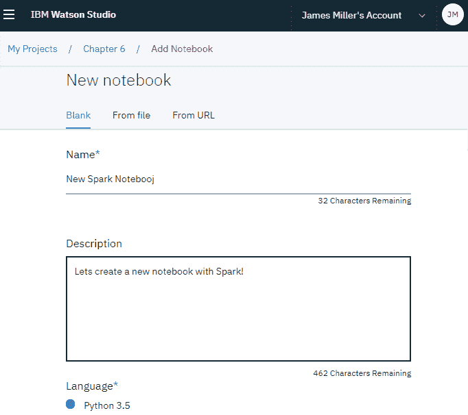

2.  请注意，在前面的屏幕截图中，Python 3.5 是所选的语言—这很好，但是如果我们向下滚动，我们将看到 Spark 版本*。从下拉列表中，您可以选择笔记本的运行时环境。对于我们的示例，我们可以选择默认的 Spark Python 3.5 XS(1 个 vCPU 和 4GB 的驱动程序，2 个各有 1 个 vCPU 和 4 GB RAM 的执行器):

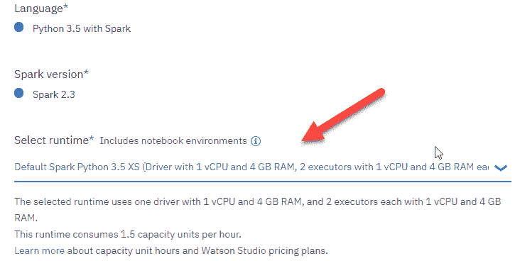

3.  一旦你点击创建笔记本，笔记本环境将被实例化，你就可以开始输入 Spark 命令了。
4.  创建启用 Spark 的笔记本后，您可以运行 Python 命令并执行 Spark 作业，以使用数据帧抽象作为数据源来处理 Spark SQL 查询，如下例所示:

```
df_data_2.createOrReplaceTempView("station")
sqlDF = spark.sql("SELECT * FROM station where VALUE > 200")
sqlDF.show()
```

此时不要太关注前面示例中的实际代码，因为在接下来的部分中，我们将使用支持 Spark 的笔记本来创建一个 **Spark ML 管道**。


# 在 Watson Studio 中创建 Spark 管道

因此，让我们先来理解我们所说的*管道*是什么意思。


# 什么是管道？

ML 管道通常用于**自动化** ML 工作流程，本质上使数据集能够在模型中转换和关联，然后可以测试和评估以实现或估计结果。

这种工作流程包括四个基本领域:

*   数据准备
*   训练集生成
*   算法训练/评估/选择
*   部署/监控


# 管道目标

管道由一系列阶段组成。流水线级有两种基本类型:**变压器**和**估计器**。正如*中所暗示的，什么是管道？*一节，transformer 将一个数据集作为输入，产生一个扩充的数据集作为输出，而 estimator 抽象出学习算法的概念，实现一个接受数据并产生模型的方法。

更简单地说，管道执行一个工作流，该工作流可以重复地准备新数据(用于转换)，转换准备好的数据，然后(在准备好的数据上)训练一个模型。另一种总结方式是将管道视为一系列算法的运行，以处理数据并从中学习。


# 分解管道示例

我们将从在 **I** **BM Watson 工作室社区** ( *使用 Spark 和 Python 预测设备购买*，由 Melanie Manley 于 2018 年 7 月 26 日提交)中可用的 Spark 管道示例中的关键步骤开始。

在这个特定的示例中，我们看到一个现有的支持 Spark 的笔记本，其中包含加载数据、创建预测模型和对数据进行评分的步骤。

该示例使用 Spark 命令来完成加载数据、执行数据清理和探索、创建管道、训练模型、持久化模型、部署模型和对模型评分的任务；然而，我们在这里将只关注创建 Spark ML 模型的步骤。读者可以选择在线查看整个示例。


# 数据准备

在这一步中，DataFrame 对象中的数据被分割(使用 Spark `randomSplit`命令)为三部分——一个**训练集**(用于训练模型)、一个**测试集**(用于模型评估和测试模型的假设)和一个**预测集**(用于预测)，然后为每个集打印一个记录计数:

```
splitted_data=df_data.randomSplit([0.8,0.18,0.02],24)
train_data=splitted_data[0]
test_data=splitted_data[1]
predict_data=splitted_data[2]
print("Number of training records: " + str(train_data.count())) print("Number of testing records : " + str(test_data.count())) print("Number of prediction records : " + str(predict_data.count()))
```

在笔记本中执行前面的命令如下面的屏幕截图所示:


# 管道

这里，在我们创建了三个数据集之后，将创建 Apache Spark ML 管道，并通过执行以下步骤来训练模型:

1.  首先，您需要导入 Apache Spark ML 包，这些包将在后续步骤中用到:

```
frompyspark.ml.featureimportOneHotEncoder,StringIndexer,IndexToString,VectorAssembler
frompyspark.ml.classification importRandomForestClassifier
frompyspark.ml.evaluationimportMulticlassClassificationEvaluator
from pyspark.ml import Pipeline, Model
```

2.  接下来，该示例使用`StringIndexer`函数作为转换器，将所有字符串列转换为数字列:

```
stringIndexer_label=StringIndexer(inputCol="PRODUCT_LINE",outputCol="label").fit(df_data)
stringIndexer_prof=StringIndexer(inputCol="PROFESSION",outputCol="PROFESSION_IX")
stringIndexer_gend=StringIndexer(inputCol="GENDER",outputCol="GENDER_IX")
stringIndexer_mar = StringIndexer(inputCol="MARITAL_STATUS", outputCol="MARITAL_STATUS_IX")
```

3.  在以下步骤中，该示例通过将所有特征组合在一起来创建特征向量:

```
vectorAssembler_features = VectorAssembler(inputCols=["GENDER_IX", "AGE", "MARITAL_STATUS_IX", "PROFESSION_IX"], outputCol="features")
```

4.  接下来，定义您想要用于分类的估计量(使用**随机森林**):

```
rf = RandomForestClassifier(labelCol="label", featuresCol="features")
```

5.  最后，将索引标签转换回原始标签:

```
labelConverter = IndexToString(inputCol="prediction", outputCol="predictedLabel", labels=stringIndexer_label.labels)
```

6.  现在实际的管道已经建成:

```
pipeline_rf = Pipeline(stages=[stringIndexer_label, stringIndexer_prof, stringIndexer_gend, stringIndexer_mar, vectorAssembler_features, rf, labelConverter])
```

在示例的这一点上，您已经准备好使用刚刚构建的管道和训练数据来训练随机森林模型。


# 数据分析和可视化示例

在 IBM Watson Studio 项目中使用支持 Spark 的笔记本最令人兴奋的一个优点是，所有的数据探索和后续的可视化通常只需使用几行(交互式编写的)代码就可以完成。此外，notebook 界面允许使用试错法来运行查询和命令，检查结果，并且可能调整(查询)和重新运行，直到您对(结果)满意为止。

最后，笔记本和 Spark 可以轻松扩展以处理海量(GB 和 TB)数据集。

在本节中，我们的目标是使用一个支持 Spark 的笔记本来说明如何完成某些任务，例如将数据加载到笔记本中、执行一些简单的数据探索、运行查询(对数据)、绘图，然后保存结果。


# 设置

让我们看一下下面几节，以了解设置过程。


# 获取数据

重要的事情先来。我们需要数据。与其编造一些数据，我们不如效仿沃森工作室社区的其他几个工作实例，从美国国家海洋和大气管理局**国家气候数据中心**(**NCDC**)【www.ncdc.noaa.gov/data-access/quick-links】T4 下载一些公开收集的数据。

以下是从 NCDC 获取原始数据的方法:

1.  从**国家海洋和大气管理局** ( **NOAA** )网站，点击全球历史气候网络(GHCN)。
2.  点击 GHCN-每日 FTP 访问。

3.  点击按年份/文件夹。
4.  滚动到底部，然后单击 2015.csv.gz 下载数据集。
5.  文件下载后，将其解压缩到一个容易访问的位置。


# 加载数据

现在我们有了一个仍然是原始数据的文件(尽管有些结构化)。准备数据进行分析时，一个典型的首要任务是添加列标题。如果文件大小合理，您可以使用程序员的文本编辑器打开并添加标题行，但如果不是，您可以直接在 Spark 笔记本中完成此操作。

假设您已经将该文件加载到 Watson 项目中(使用我们在前面章节中介绍的过程)，那么您可以单击 Insert to code，然后选择 Insert pandas DataFrame object，如下图所示:

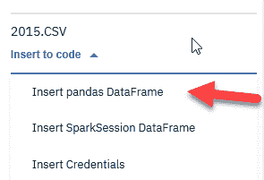

当您点击 Insert pandas DataFrame 时，代码就会生成并添加到您的笔记本中。生成的代码导入任何所需的包，访问数据文件(使用适当的凭据)，并将数据加载到 DataFrame 中。然后，您可以修改`pd.read_csv`命令(在代码中)以包含`names`参数(如下面的代码所示)。

这将使用提供的列名在文件顶部创建一个标题行:

```
df_data_1 = pd.read_csv(body, sep=',',names = ['STATION', 'DATE', 'METRIC', 'VALUE', 'C5', 'C6', 'C7', 'C8'])
```

在单元格中运行代码如下面的屏幕截图所示:


基本文件中的原始数据的格式如下图所示:

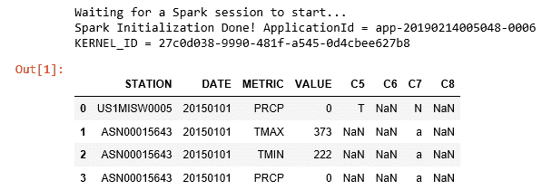

希望您可以看到每一列都包含气象站标识符、日期、收集的度量(如降水量、每日最高和最低温度、观测时的温度、降雪量、积雪深度等)和一些附加列(注意，缺少的值可能显示为 NaN，表示*而不是数字*)。


# 探测

正如我们在[第 5 章](630e47b4-11b7-4be9-a881-8be2cb492314.xhtml)、、*IBM Cloud*上的机器学习测试中所展示的那样，`pandas`数据结构有许多基本的通用功能来支持数据的预处理和分析。不过，在本例中，我们将再次查看数据探索的示例，但这次使用 Spark DataFrame 方法。

例如，前面我们使用 Insert pandas DataFrame 加载了一个数据文件；这一次，我们可以使用相同的步骤重新加载该文件，但这一次选择 Insert SparkSession DataFrame。生成的代码将包括`import ibmos2spark`和`from pyspark.sql import SparkSession`命令，并将数据加载到`SparkSession DataFrame`(而不是`pandas`数据帧):

```
import ibmos2spark
# @hidden_cell
credentials = {
   'endpoint': 'https://s3-api.us-geo.objectstorage.service.networklayer.com',
    'service_id': 'iam-ServiceId-f9f1f892-3a72-4bdd-9d12-32b5a616dbfa',
   'iam_service_endpoint': 'https://iam.bluemix.net/oidc/token',
   'api_key': 'D2NjbuA02Ra3Pq6OueNW0JZZU6S3MKXOookVfQsKfH3L'
}
configuration_name = 'os_f20250362df648648ee81858c2a341b5_configs'
cos = ibmos2spark.CloudObjectStorage(sc, credentials, configuration_name, 'bluemix_cos')
from pyspark.sql import SparkSession
spark = SparkSession.builder.getOrCreate()
df_data_2 = spark.read\
 .format('org.apache.spark.sql.execution.datasources.csv.CSVFileFormat')\
 .option('header', 'true')\
 .load(cos.url('2015.CSV', 'chapter6-donotdelete-pr-qy3imqdyi8jv3w'))
df_data_2.take(5)
```

运行单元会启动 Spark 作业，显示这些作业的进度/状态，并最终显示由`.take(5)`命令生成的输出:

`SparkSession` is the entry point to Spark SQL. It is one of the very first objects you create while developing a Spark SQL application. As a Spark developer, you create `SparkSession` using the `SparkSession.builder` method (which gives you access to the **Builder API** that you use to configure the session).

当然，我们也可以使用`count()`、`first`以及其他语句:

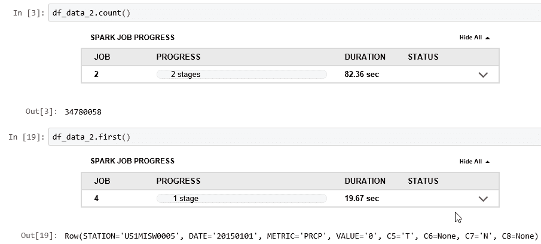

另一个有趣且方便的分析方法是显示数据帧的模式。您可以使用`printSchema()`函数以树形格式打印出`SparkR`数据帧的模式，如下所示:

```
df_data_2.printSchema()
```

前面的命令会产生以下输出:

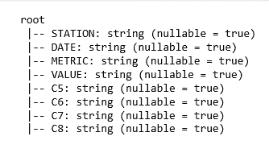

一个**模式**是数据结构的描述。使用`StructType`描述模式，它是`StructField`对象的集合(依次是名称、类型和可空性分类器的元组)。

使用 Spark 数据框架还为您提供了浏览数据和应用逻辑的能力。例如，想要通过运行`print`命令查看数据的前两行(或前几行)并不是不合理或不可预料的；但是，为了提高可读性，您可能希望使用以下代码在数据行之间添加一行星号:

```
for row in df_data_2.take(2):
    print(row)
    print( "*" * 104)
```

上述代码生成以下输出:


假设您对使用您的 SQL 技能来执行您的分析感兴趣？

没问题！您可以将 **SparkSQL** 用于您的`SparkSession` DataFrame 对象。

然而，所有的 SQL 语句都必须针对一个表运行，因此您需要定义一个表，它的作用类似于指向数据帧的**指针**(在您导入`SQLContext`模块之后):

```
from pyspark.sql import SQLContext
sqlContext = SQLContext(sc)
df_data_2.registerTempTable("MyWeather")
```

此外，您需要定义一个新的 DataFrame 对象来保存 SQL 查询的结果，并将 SQL 语句放在`sqlContext.sql()method`中。让我们看看它是如何工作的。

您可以运行下面的单元格来选择我们刚刚创建的表中的所有列，然后打印关于结果数据帧和数据模式的信息:

```
temp_df =  sqlContext.sql("select * from MyWeather")
print (type(temp_df))
print ("*" * 104)
print (temp_df)
```

这会产生以下输出:


# 提取，血统

现在让我们继续讨论**提取**的概念。`print` 命令并没有真正以非常有用的格式显示数据。因此，我们可以使用`pandas`开源数据分析库来创建一个`pandas`数据框架，在表格中显示数据，而不是使用我们的 Spark 数据框架。

现在我们可以看一个让我们的 SQL 编码人员满意的例子。

导入`pandas`库并使用`.toPandas()`方法显示 SQL 查询结果:

```
import pandas as pd
sqlContext.sql("select STATION, METRIC from MyWeather limit 2").toPandas()
```

运行上述命令会产生以下输出:

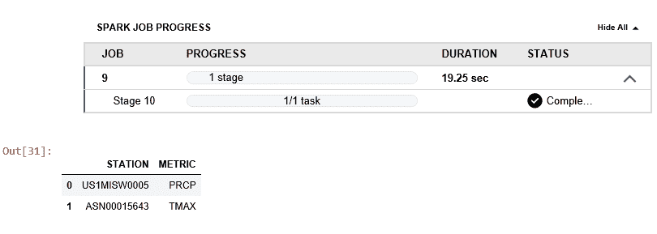

下面是另一个简单的 SQL 查询执行示例，这次计算每个气象站记录的指标数，然后创建一个气象站列表，按照气象站的指标记录数排序:

```
query = """
select
    STATION ,
    count(*) as metric_count
from MyWeather
group by STATION
order by count(*) desc
"""
sqlContext.sql(query).toPandas()
```

前面的代码给出了以下输出:

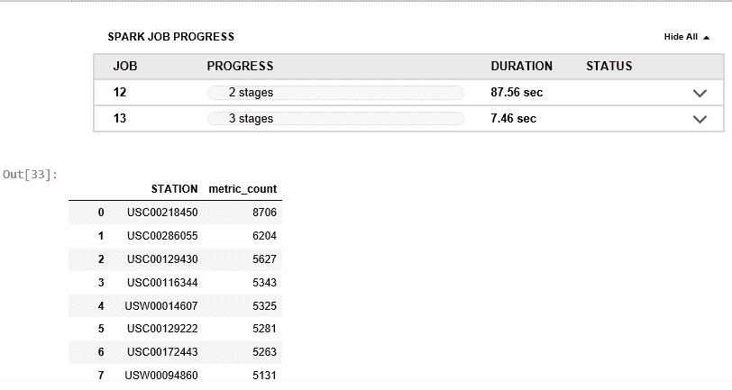

我们鼓励您尝试 SQL 语句的其他变体，然后实时查看结果。


# 测绘

所以，让我们继续前进吧！

现在，我们将看看在 Spark 数据框架中收集的一些数据的绘图。您可以使用`matplotlib`和`pandas`来创建几乎无限数量的可视化效果(一旦您足够了解您的数据)。

你甚至会发现，一旦你达到这一点，生成可视化是非常容易的，但你可以花几乎无穷无尽的时间来清理它们，并准备与他人分享。

我们现在来看一个简单的例子来说明这个过程是如何进行的。

从上一节的 Spark 数据框架开始，假设我们认为基于数据中的`DATE`字段生成一个简单的条形图会很好。因此，开始之前，我们可以使用下面的代码通过`DATE`得出一个计数:

```
df_data_2.groupBy("DATE").count().show()
df_data_2.groupBy("DATE").count().collect()
```

运行上述代码的结果如下面的屏幕截图所示:

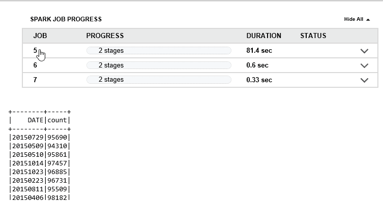

我们可能会说，生成的输出似乎有些合理(至少乍一看是这样)，因此下一步将使用以下代码来构建一个数据矩阵，其格式可以很容易地绘制出来:

```
count = [item[1] for item in df_data_2.groupBy("DATE").count().collect()]
year = [item[0] for item in df_data_2.groupBy("DATE").count().collect()]
number_of_metrics_per_year = {"count":count, "DATE" : year}
import pandas as pd
import matplotlib.pyplot as plt
%matplotlib inline
number_of_metrics_per_year = pd.DataFrame(number_of_metrics_per_year )
number_of_metrics_per_year .head()
```

运行这段代码并查看生成的输出似乎非常合理，并且符合我们的目标:

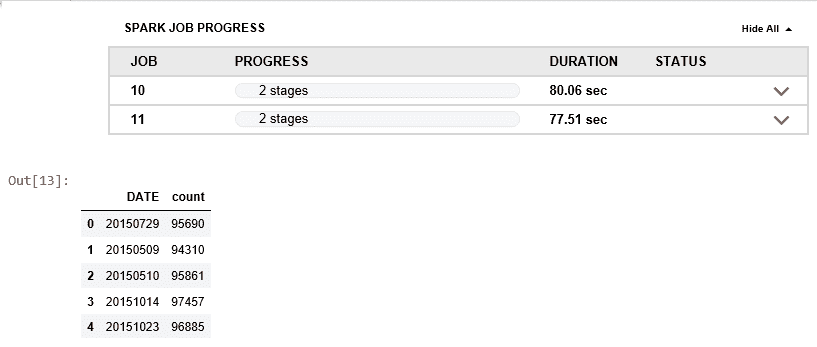

所以，太好了！如果我们到了这一步，我们会认为我们已经准备好绘制和可视化数据，所以我们可以继续使用以下代码来创建一个可视化:

```
number_of_metrics_per_year = number_of_metrics_per_year.sort_values(by = "DATE")
number_of_metrics_per_year.plot(figsize = (20,10), kind = "bar", color = "red", x = "DATE", y = "count", legend = False)
plt.xlabel("", fontsize = 18)
plt.ylabel("Number of Metrics", fontsize = 18)
plt.title("Number of Metrics Per Date", fontsize = 28)
plt.xticks(size = 18)
plt.yticks(size = 18)
plt.show()
```

运行前面的代码后，我们可以看到代码起作用了(我们已经基于我们的数据生成了一个可视化)，但是输出并不像我们希望的那样有用:

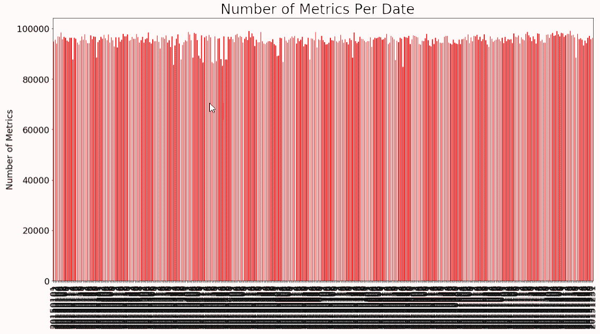

挺乱的，也不是很有用！

所以，让我们回过头来，尽量减少我们试图绘制的数据量。幸运的是，我们可以重用本章前面几节的一些代码。

我们可以从再次设置一个可以查询的临时表开始:

```
from pyspark.sql import SQLContext
sqlContext = SQLContext(sc)
df_data_2.registerTempTable("MyWeather")
```

然后，我们可以创建一个临时数据帧来保存我们的结果(`temp_df`)。查询只能加载收集的`METRIC`为`PRCP`且`VALUE`大于`500`的记录:

```
temp_df =  sqlContext.sql("select * from MyWeather where METRIC = 'PRCP' and VALUE>500")
print (temp_df)
temp_df.count()
```

这将极大地限制要绘制的数据记录的数量。

现在，我们可以返回并重新运行我们用来创建要绘制的数据矩阵的代码以及实际的绘制代码，但这一次，使用临时数据帧:

```
temp_df.groupBy("DATE").count().show()
temp_df.groupBy("DATE").count().collect()
count = [item[1] for item in temp_df.groupBy("DATE").count().collect()]
year = [item[0] for item in temp_df.groupBy("DATE").count().collect()]
number_of_metrics_per_year = {"count":count, "DATE" : year}
import pandas as pd
import matplotlib.pyplot as plt
%matplotlib inline
number_of_metrics_per_year = pd.DataFrame(number_of_metrics_per_year )
number_of_metrics_per_year .head()
number_of_metrics_per_year = number_of_metrics_per_year.sort_values(by = "DATE")
number_of_metrics_per_year.plot(figsize = (20,10), kind = "bar", color = "red", x = "DATE", y = "count", legend = False)
plt.xlabel("", fontsize = 18)
plt.ylabel("Number of Metrics", fontsize = 18)
plt.title("Number of Metrics Per Date", fontsize = 28)
plt.xticks(size = 18)
plt.yticks(size = 18)
plt.show()
```

所以现在我们有了一个不同的，也许更好的结果，但可能还没有准备好被分享:


如果我们继续使用前面的策略，我们可以再次修改 SQL 查询来进一步限制或过滤数据，如下所示:

```
temp_df =  sqlContext.sql("select * from MyWeather where METRIC = 'PRCP' and VALUE > 2999")
print (temp_df)
temp_df.count()
```

然后我们可以查看生成的临时数据帧，看到现在它的记录少了很多:


如果我们现在继续重新运行其余的绘图代码，我们会看到它会产生一个稍微好一点(但仍不可接受)的绘图:


事实上，我们可以通过修改 SQL、重新运行代码，然后查看最新的结果来继续这个反复试验的过程，直到我们对所看到的结果感到满意为止，但是您应该已经有了大致的想法，所以我们将继续讨论这一点。


# 节约

就像在 Microsoft Word 或 Microsoft Excel 中工作一样，定期保存您的工作总是一个好主意。

事实上，当你继续发展它的时候，你甚至可能想要保存你的工作的多个版本，以防你想要在某个时候恢复。在发展您的脚本时，您可以单击文件，然后保存或保存版本以保留笔记本的适当副本:

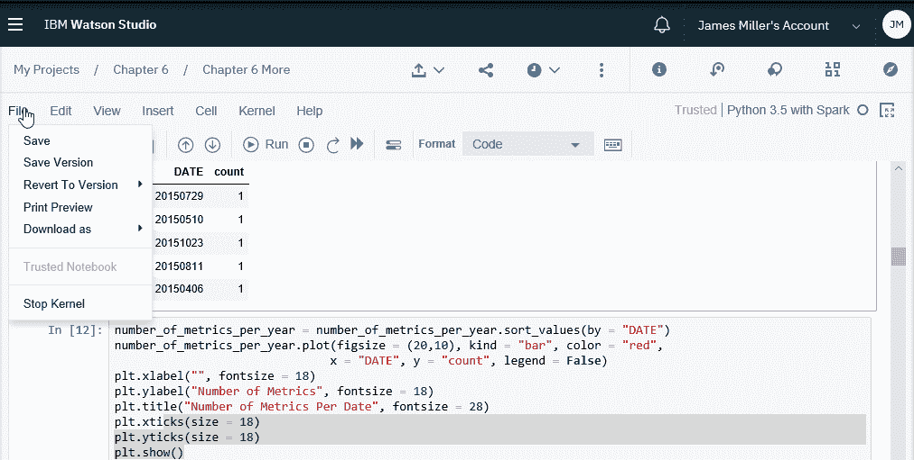

甚至在 Watson Studio 之外，您也可以保存和共享笔记本的只读副本*，以便不是 Watson Studio 项目合作者的其他人可以查看和下载它们。您可以通过以下方式做到这一点:*

*   **在社交媒体上共享 URL**:**您可以创建一个 URL，在社交媒体上或与 Watson Studio 之外的人共享上次保存的笔记本版本。**
***   **在 GitHub 上发布** : 为了支持与利益相关者和整个数据科学社区的协作，您可以在 GitHub 存储库中发布您的笔记本。*   **作为要点发布** : 所有拥有管理员或编辑权限的项目协作者都可以将笔记本或笔记本的一部分作为要点共享。您的笔记本的最新保存版本将作为要点发布。**

**

# 下载您的笔记本

您可以下载您的笔记本，如下图所示:

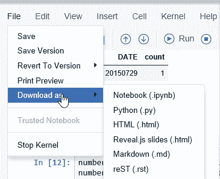

# 摘要

在本章中，我们介绍了 Spark 以及如何在 IBM Watson Studio 中创建支持 Spark 的笔记本，还介绍了 ML 管道的概念。

最后，我们给出了一个使用 Spark 执行数据分析和创建可视化来更好地讲述数据的实际例子。

在下一章中，我们将介绍 IBM Cloud 上的深度学习和神经网络。**