# 九、在 IBM 云上将 TensorFlow 用于深度学习

在本章中，我们将介绍 IBM Cloud 上的深度学习和神经网络的概念。还将概述如何使用 TensorFlow 框架在云上实现深度学习模型。本章旨在平衡理论和实际实施。

我们将在本章中讨论以下主题:

*   深度学习简介
*   TensorFlow basics
*   使用TensorFlow的神经网络
*   一个例子
*   TensorFlow和图像分类
*   额外准备


# 深度学习简介

深度学习(也称为**深度结构化学习**或**分层学习**)是基于学习数据表示的更大一组机器学习方法的一部分，与特定任务算法相反。

学习可以是监督的(我们在[第 3 章](b2822c69-13f0-4943-9e66-f9ef04898b60.xhtml)、*监督的机器学习模型和你的数据*中讨论过)、半监督的或无监督的(在[第 4 章](f131f753-1d77-478c-9c0d-1e799330eed8.xhtml)、*实现无监督算法*中讨论过)。

深度学习算法在令人兴奋的领域中发挥作用，例如图像分类(将数字图像中的每个像素分类到几个土地覆盖类别或主题中的一个)，对象检测(在图像或视频中找到现实世界对象(如人脸、汽车和建筑物)的实例的过程)，图像恢复(补偿或消除由运动模糊、噪声和相机失焦引起的缺陷， 这降低了图像的质量)和图像分割(将数字图像分割成多个像素段的过程，也称为**超像素**，以将图像的表示简化和/或改变成更有意义和更容易分析的东西)。

使用巨大神经网络的深度学习正在教会机器自动执行人类视觉系统执行的任务。

深度学习模型模糊地受到生物神经系统中信息处理和通信模式的启发，但它们确实不同于生物大脑的结构和功能属性，这使它们与神经科学证据不兼容。

理论够了。虽然前面对机器/深度学习的解释可能是高层次的，但这足以让我们继续下一部分，在那里我们开始思考深度学习的实现方式，特别是使用谷歌大脑团队开发的供谷歌内部使用的工具集，在 2015 年 11 月 9 日的 Apache 2.0 开源许可证下:TensorFlow。


# TensorFlow basics

张量可以被认为是广义矩阵，或者更具体地说，是生活在结构中并与其他数学实体相互作用的数学实体。如果结构中的其他实体以任何方式进行变换，那么张量也必须按照那个变换规则进行变换。

前面的定义是什么意思？也许把一个**张量**想成多维数组更容易理解，或者考虑下面，比较**标量**、**向量**、**矩阵**和**张量**:


以 TensorFlow 为主题，TensorFlow 是一个开源软件库(也称为**框架**)，最初由 Google 创建，用于创建深度学习模型。

您可以访问[https://www.tensorflow.org/](https://www.tensorflow.org/)了解更多关于 TensorFlow 的详情。

在下一节中，我们将讨论深度学习、神经网络和TensorFlow之间的联系。


# 神经网络和TensorFlow

深度学习模型通常采用被称为**神经网络**的算法，据说这是受实际生物神经系统(如大脑)处理信息的方式的启发。它使计算机能够识别所有数据点，每个数据点代表什么，并学习模式。

今天，深度学习模型的主要软件工具是 TensorFlow，因为它允许开发人员创建具有许多层的大规模神经网络。

TensorFlow主要用于以下目的:

*   分类
*   感觉
*   谅解
*   发现
*   预言；预测；预告
*   创造

正如 Watson 文档中所述，部署复杂的机器学习模型(如 TensorFlow 模型)的挑战在于，这些模型的计算成本非常高，训练起来非常耗时。一些解决方案(针对这一挑战)包括 GPU 加速、分布式计算或两者的结合。IBM 云平台和 Watson Studio 提供了这两者。

它还指出:IBM Watson Studio 允许人们利用云上可用的计算能力来加快更复杂的机器学习模型的训练时间，从而将时间从几小时或几天减少到几分钟。

在接下来的部分中，我们将探索几个练习，演示在 IBM Watson Studio 中使用 TensorFlow 的各种方法。


# 一个例子

在本节中，我们将从逐步浏览沃森社区([https://dataplatform.cloud.ibm.com/community](https://dataplatform.cloud.ibm.com/community))教程开始，该教程旨在展示使用 IBM Watson Studio 上的 TensorFlow 库部署深度神经网络是多么容易。

该教程可以在 GitHub 上下载，但是我们不会在这里提供 URL，因为我们将演示直接从 IBM Watson Studio 项目中导入来自外部来源(比如 GitHub)的内容是多么容易。

这个练习的关键点是复杂的机器学习模型可能需要大量计算，但是 IBM Watson Studio 让您有机会轻松高效地(按需付费)使用云上可用的计算能力来加快处理时间，并将学习时间从几小时或几天减少到几分钟。

此外，IBM Watson Studio 提供了在云中开发以数据为中心的解决方案所必需的所有工具。它利用 Apache Spark 集群(用于计算能力)，并允许您用 Python、Scala 和 R 创建资产，并利用开源框架(如 TensorFlow)，所有这些都已经安装在 Watson Studio 上。

如果你花点时间通读教程的细节，你会看到它解释了如何创建一个新的 IBM Cloud 帐户并注册 IBM Watson Studio(我们已经在第[章第](07c92a06-635f-41ef-b2be-3654ba90b790.xhtml)、*IBM Cloud 简介*中介绍过)。

然后，教程继续展示如何导航到 IBM 的 Watson Studio(一旦在 IBM 云平台上)，创建一个新项目，然后将一个笔记本导入到项目中。

尽管在前面的章节中，我们展示了如何在 Watson Studio 中创建新项目和创建新笔记本，但这将是我们第一次执行笔记本导入(直接从外部 URL ),因此接下来的章节将重点介绍该过程是如何工作的。

要导入的笔记本已经包含了 TensorFlow 库和示例代码，所以这个练习对我们来说应该既快又超级简单，所以不要再浪费时间了！


# 创建新项目

采取我们在前面章节中遵循的相同步骤，我们可以创建一个新的深度学习 IBM Watson Studio 项目(参见下面的截图)并为其命名:

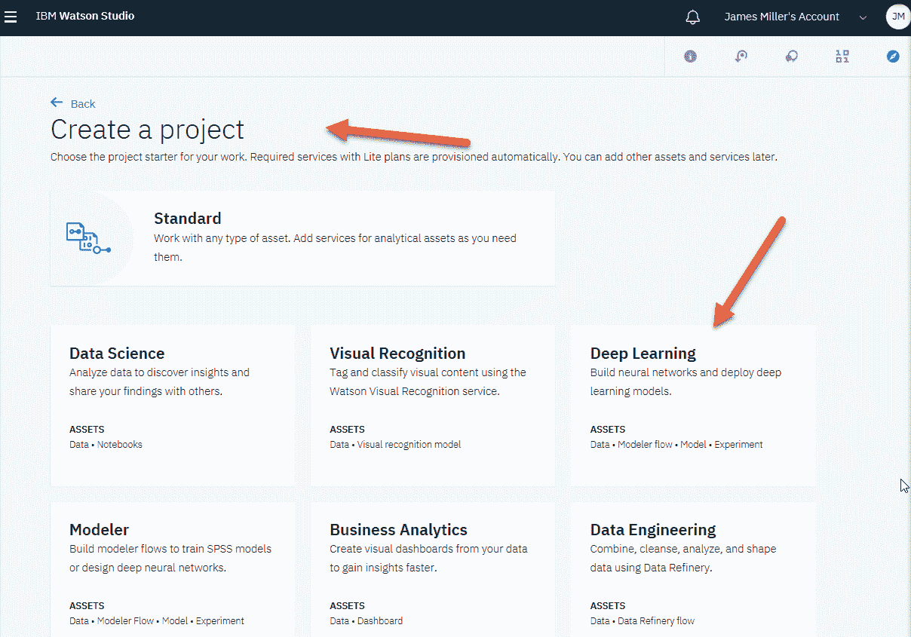

# 笔记本资产类型

创建新项目后，从项目仪表板中，您可以单击 Add to project 选项并选择 Notebook，如下面的屏幕截图所示:


正如我们在前面章节中所做的，我们可以创建一个新的空笔记本。但是在本练习中，我们想要导入一个现有的笔记本。

IBM Watson Studio 允许您从一个文件或直接从一个已知的可访问的 URL 导入笔记本。

在这种情况下，我们将选择从 URL 导入。为此，您可以选择“来自 URL”选项，然后在下面一行中键入或粘贴:

[https://github . com/aounlutfi/building-first-dl-model/blob/master/first-dl-model . ipynb](https://github.com/aounlutfi/building-first-dl-model/blob/master/first-dl-model.ipynb)

前面的链接将是要导入到 Watson Studio 项目中的笔记本的(外部)URL。

接下来，单击“Create Notebook”开始导入(如果您可以访问 URL，应该只需要几秒钟)，如下面的屏幕截图所示:


几秒钟后，笔记本打开，准备好进行检查和执行:

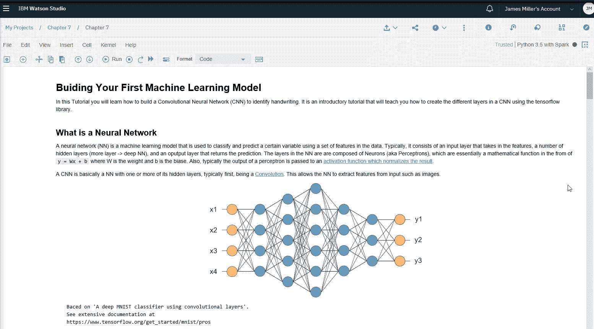

# 运行导入的笔记本

要运行导入的笔记本，请在命令功能区中单击单元格，然后单击全部运行:


单击 Run All 后，IBM Watson Studio 将运行笔记本中的所有单元格，这大约需要 15 分钟左右的时间才能完成，因为数据集由 20，000 幅图像组成。

如果您想更好地了解发生了什么，您也可以单独运行每个单元。


# 查看笔记本

如果你花时间(你应该)浏览笔记本中包含的单元格，你会注意到有大量的降价单元格明确描述了笔记本中的步骤。

例如，您应该注意标记为 Imports 的 markdown 单元格(如下面的屏幕截图所示),其中明确指出，为了能够在 TensorFlow 中构建、测试和运行 NN，必须使用以下导入。这还会导入 MNIST 数据集(数据集中的每个点都是数字 0-9 的 784 像素手写表示):

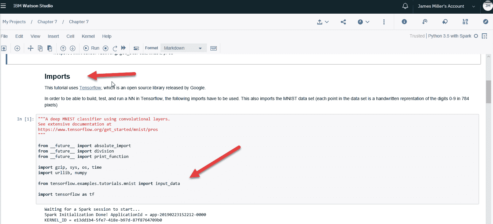

本教程还要求您尝试在本地计算机上(而不是在使用 IBM Watson Studio 的云上)设置 Python 和 TensorFlow，并运行示例，以便您可以比较结果，请注意，根据机器的性能，这可能需要几个小时，甚至几天的训练时间，而且这是在您组装了所需的环境之后！

在下一个例子中，我们将介绍使用 IBM Watson Studio 和 Watson services 以及 TensorFlow API 来执行图像分类和对象检测。


# TensorFlow和图像分类

IBM Watson 视觉识别服务使用深度学习算法来识别你上传到该服务的图像中的场景、物体和人脸等特征。您还可以使用视觉识别服务、IBM Watson Studio 和相关的 Python 模块来创建和训练自定义分类器，以识别符合您要求的主题。

为了开始视觉识别，我们需要使用通常的过程来创建一个 Watson Studio 项目并定义一个新的 Python 3.5 笔记本，但是我们还需要将一个 IBM Watson 视觉识别服务实例与该项目关联起来(事实证明这是一件非常容易的事情)。


# 添加服务

要添加 Watson 视觉识别服务，您需要转到 IBM Cloud Dashboard，选择 Watson Services，然后浏览 Services，在这里您可以找到并选择视觉识别服务:

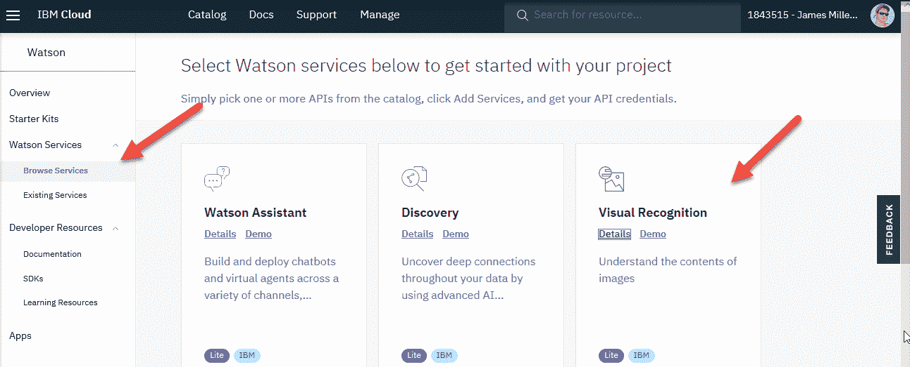

接下来，从 Visual Recognition 页面(如下面的屏幕截图所示)，您可以为服务实例选择一个位置和资源组，然后单击 Create 来实际创建您可以在项目中使用的服务实例:

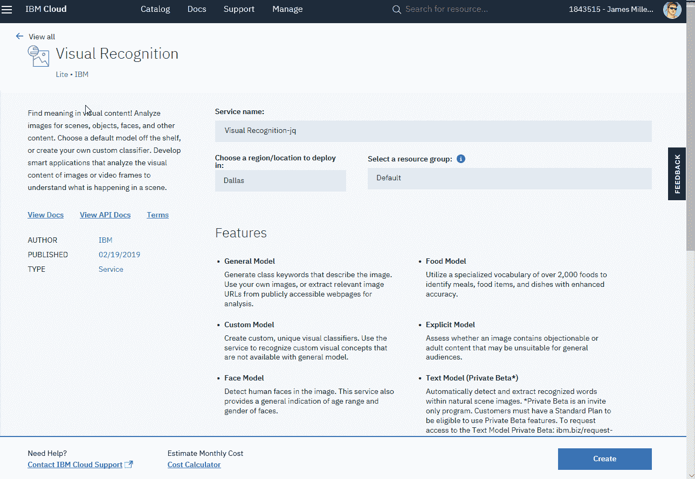

视觉识别服务实例一次只能与一个项目关联。

创建视觉识别服务实例后，它将在您的云控制面板上列出:

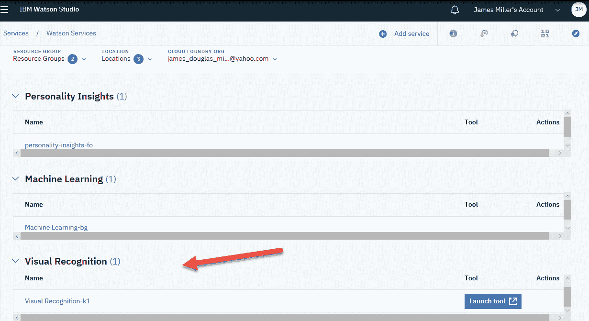

在创建服务实例之后，您应该能够通过在 Service Credentials 部分中单击 New Credentials 或 View Credentials 来创建所谓的服务凭证(或 API 密钥)。

您将需要这个 API 键来引用和使用项目中的实例。

以下屏幕截图显示了“服务凭据”页面:

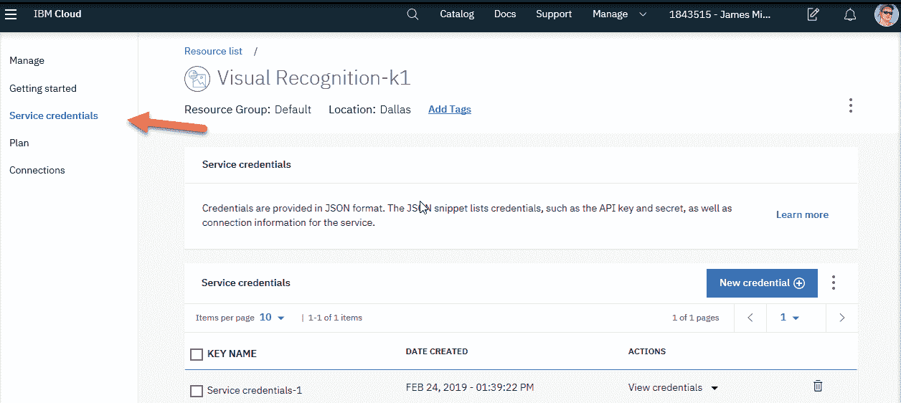

在本章接下来的几节中，我们将需要引用这个 API 密匙，所以把它放在手边吧！

现在我们已经准备好开始实际的视觉识别项目了。在本例中(GitHub 上提供了一个版本)，Watson 视觉识别服务通过 TensorFlow 对象检测 API 执行对象检测。


# 必需的模块

尽管许多预安装的库和模块已经作为 IBM Watson 笔记本环境的一部分(取决于所选笔记本的类型)，但是可能仍然需要安装各种其他模块和框架来使特定项目正常工作，因此我们在笔记本中应该做的第一件事是键入以下命令来查看预安装库的列表:

```
!pip list –isolated
```

通过使用此命令来了解您的笔记本环境，总是开始一个新项目是一个非常好的主意；以后可能会节省时间。

然后，您可以使用 Python `!pip install`命令逐行安装这个项目所需的每个模块，如下所示:

```
!pip install asn1crypto==0.23.0
!pip install bleach==1.5.0
!pip install certifi==2017.11.5
!pip install cffi==1.11.2
!pip install chardet==3.0.4
!pip install cryptography==2.1.3
!pip install cycler==0.10.0
!pip install enum34==1.1.6
!pip install html5lib==0.9999999
!pip install idna==2.6
!pip install Markdown==2.6.9
!pip install matplotlib==2.1.0
!pip install numpy==1.13.3
!pip install olefile==0.44
!pip install Pillow==4.3.0
!pip install protobuf==3.5.0.post1
!pip install pycparser==2.18
!pip install pyOpenSSL==17.4.0
!pip install pyparsing==2.2.0
!pip install pysolr==3.6.0
!pip install python-dateutil==2.6.1
!pip install pytz==2017.3
!pip install requests==2.18.4
!pip install six==1.11.0
!pip install tensorflow==1.4.0
!pip install tensorflow-tensorboard==0.4.0rc3
!pip install urllib3==1.22
!pip install watson-developer-cloud==1.0.0
!pip install Werkzeug==0.12.2
```

用一个命令安装所需模块的另一种更有效的方法是参考提供的`requirements.txt`文件:

```
pip3 install -r requirements.txt
```


# 在代码中使用 API 键

IBM Watson 视觉识别服务带有内置模型，您可以使用这些模型来分析场景、对象、人脸和许多其他类别的图像，而无需任何训练。我们已经创建了视觉识别服务的一个实例，因此它可用于我们的项目。为此，您需要拥有有效的密钥(我们实际的 API 密钥)。

即使您在 Watson 笔记本中有工作的 Python 代码，您现在也需要使用您已建立的 API 密钥，这样它将通过 Watson 服务进行验证(并且实际工作)。

如果您浏览 Python 项目代码(我们将在下一节中加载)，您会发现下面的代码语句:

```
Visual_recognition = VisualRecognitionV3('2016-05-20', api_key='API_KEY')
```

这一行代码是 Watson 视觉识别服务被初始化为我们可以在代码中使用的对象的地方。您将用实际的 API 密匙(您在上一节中创建的密匙)替换`API_KEY`短语。


# 额外准备

在这一节中，我们将在成功运行项目之前，做一些额外的工作。

Pillow 是一个 **Python 图像库** ( **PIL** )，它提供了打开、操作和保存图像的支持。当前版本可以识别和读取大量格式。

该项目使用了`pillow`，并且要求至少安装 5.3.0 版本。为了确保笔记本使用该版本，我们需要运行以下命令:

```
# --- we need pillow version of 5.3.0 to run this project
# --- this code will uninstall the current version:
!pip uninstall -y Pillow
# --- install the 5.3.0 version
!pip install Pillow==5.3.0
# --- import the new one
import PIL
# --- Should print 5.3.0\. If it doesn't, then restart the kernel 
print(PIL.PILLOW_VERSION)
```

该代码卸载当前安装的 Pillow 版本，安装版本 5.3.0，将其导入到项目中，然后打印(现在)当前安装的版本。

如最后一行代码所示，如果`print`命令的输出没有显示安装的`pillow`版本是 5.3.0，您将需要停止并重启您的内核(点击 kernel，然后在您的笔记本中重启)，然后再次执行`print`命令，您应该准备好了:


# 升级 Watson

当我第一次尝试这个项目时，我在使用视觉识别服务时遇到了一些困难。经过大量的调试和 IBM Cloud support 的帮助，我确定我使用的项目代码使用的是旧版本的 cloud API。

要解决我看到的问题，有必要使用以下命令将 Watson 服务升级到最新版本:

```
# --- Upgrade Watson Developer
!pip install --upgrade "watson-developer-cloud>-2.8.0"
```

上述命令会生成以下输出:

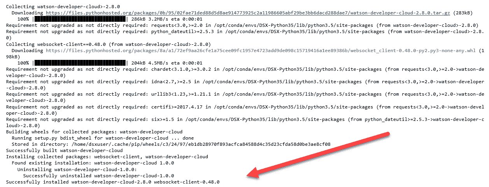

要验证服务是否已升级，您应该会看到以下消息:

```
Successfully installed watson-developer-cloud-2.8.0 websocket-client-0.48.0
```

服务升级后，我之前遇到的所有问题都解决了。

在撰写本文时，2.8.0 是最新的版本。建议始终检查并使用最新的可用版本。


# 形象

要执行的最后一个设置任务是为我们的解决方案提供一个图像文件，以检测其中的对象。

示例项目代码提供了一张您可以使用的四只狗的图片，但是提供一只或多只您自己的狗会更有趣。该项目的自述文件指出，代码将期望文件位于`test_image/image1.jpg`中，但是您可以简单地使用我们在前面章节中所做的相同步骤将它作为数据资产上传，然后更新代码，这样它就会找到文件(您也可以更改文件名)。

我选择使用以下三种不同的图像:


# 代码检查

此时，我们的环境应该已经为主要代码部分做好了准备。现在让我们看看代码的每一部分，以理解它的用途。

第一部分执行各种附加导入。请特别注意从(现在已升级的)`watson_developer_cloud`导入视觉识别服务(`VisualRecognitionV3`)的代码行:

```
from watson_developer_cloud import VisualRecognitionV3
```

以下是命令:

```
import numpy as np
import os
import six.moves.urllib as urllib
import sys
import tarfile
import tensorflow as tf
import zipfile
import json
from io import StringIO
from PIL import Image
from watson_developer_cloud import VisualRecognitionV3
import matplotlib.pyplot as plt
import matplotlib.patches as patches
```

下一行代码使用我们之前提到的 API 键(您将使用自己的键):

```
# --- Replace with your api key
visual_recognition = VisualRecognitionV3('2016-05-20', api_key='r-1m0OdmBy9khRHJvujylJoLRJIqjwS6Bqwb6VMBfeCE')
```

下一节包含了运行笔记本时可以试验的变量。查看结果并调整变量以查看效果:

```
MAX_NUMBER_OF_BOXES = 9
MINIMUM_CONFIDENCE = .9
COLORS = ['b', 'g', 'r', 'c', 'm', 'y', 'b', 'w']
```

根据前面的命令，让我们来研究定义的三个变量:

*   `MAX_NUMBER_OF_BOXES`:该变量代表测试图像中可定位的最大对象数量；我用了`9`，因为如果有很多的话会很难看。
*   `MINIMUM_CONFIDENCE`:这个变量代表一个盒子可以拥有的最小置信度。如果这个值太低，您可能最终会看到周围什么都没有的框。
*   `COLORS`:该变量设置结果识别框的属性。


# 访问模型

代码的下一部分将下载要使用的视觉识别模型，然后将其加载到内存中。第一次下载模型可能需要几分钟，但只需在第一次运行时下载:

```
# --- define What model to download.
MODEL_NAME = 'ssd_mobilenet_v1_coco_11_06_2017'
MODEL_FILE = MODEL_NAME + '.tar.gz'
DOWNLOAD_BASE = 'http://download.tensorflow.org/models/object_detection/'
# --- Path to frozen detection graph. This is the actual model that  # --- is used for the object detection.
PATH_TO_CKPT = MODEL_NAME + '/frozen_inference_graph.pb'
print('Downloading model... (This may take over 5 minutes)')
# --- Download model if not already downloaded
if not os.path.exists(PATH_TO_CKPT):
   opener = urllib.request.URLopener()
opener.retrieve(DOWNLOAD_BASE + MODEL_FILE, MODEL_FILE)
 print('Extracting...')
tar_file = tarfile.open(MODEL_FILE)
for file in tar_file.getmembers():
    file_name = os.path.basename(file.name)
if 'frozen_inference_graph.pb' in file_name:
tar_file.extract(file, os.getcwd())
else:
   print('Model already downloaded............')
# --- Load model into memory
print('Loading da model...')
detection_graph = tf.Graph()
with detection_graph.as_default():
    od_graph_def = tf.GraphDef()
    with tf.gfile.GFile(PATH_TO_CKPT, 'rb') as fid:
      serialized_graph = fid.read()
        od_graph_def.ParseFromString(serialized_graph)
       tf.import_graph_def(od_graph_def, name='')
```


# 侦查

代码的下一部分使用 TensorFlow 对象检测 API 运行图像。它将提供盒子的坐标作为边缘位置的数组(上、左、下、右)。然后，它将裁剪和保存基于框的图像。为了裁剪出正确的区域，我们需要将百分比坐标转换为像素坐标，方法是将这些值乘以宽度和高度:

```
def load_image_into_numpy_array(image):
   (im_width, im_height) = image.size
    return np.array(image.getdata()).reshape(
   (im_height, im_width, 3)).astype(np.uint8)
# --- Path to image to test, was: "test_image/image1.jpg"
TEST_IMAGE_PATH = 'image1.jpg'
```

在我们保存了图像部分之后，我们可以将它们中的每一个传递给 Watson 进行分类。

注意我们之前在下面的代码中设置的变量(`MAX_NUMBER_OF_BOXES`和`MINIMUM_CONFIDENCE`)的使用:

```
print('detecting...')
with detection_graph.as_default():
   with tf.Session(graph=detection_graph) as sess: 
        image = Image.open(TEST_IMAGE_PATH)
        image_np = load_image_into_numpy_array(image)
        image_np_expanded = np.expand_dims(image_np, axis=0)
        image_tensor = detection_graph.
        get_tensor_by_name('image_tensor:0')
        boxes = detection_graph.get_tensor_by_name('detection_boxes:0')
        scores = detection_graph.
        get_tensor_by_name('detection_scores:0')
        num_detections = detection_graph.
        get_tensor_by_name('num_detections:0')
        # --- Actual detection.
    (boxes, scores, num_detections) = sess.run([boxes, scores, num_detections], feed_dict={image_tensor: image_np_expanded})
  # --- Create figure and axes and display the image
        fig, ax = plt.subplots(1)
        ax.imshow(image_np)
        (height, width, x) = image_np.shape
for i in range(0, int(min(num_detections,          MAX_NUMBER_OF_BOXES))):
           score = np.squeeze(scores)[i]
           # --- if the score is not greater than
           # --- what we set the minimun score to be then
           # --- exit the loop
           if score < MINIMUM_CONFIDENCE:
             break
            box = np.squeeze(boxes)[i]
            box_x = box[1] * width
            box_y = box[0] * height
            box_width = (box[3] - box[1]) * width
            box_height = (box[2] - box[0]) * height
            box_x2 = box[3] * width
            box_y2 = box[2] * height
            img2 = image.crop((box_x, box_y, box_x2, box_y2))
            path = 'cropped/image1'
            os.makedirs(path, exist_ok=True)
            full_path = os.path.join(path, 'img{}.jpg'.format(i))
            img2.save(full_path)        
```


# 分类和输出

假设您执行了前面概述的环境检查和本章前面概述的设置，那么到目前为止，所有代码都应该可以完美地运行，不会产生任何错误。由于 IBM 对 API 的新版本进行了更改，下一部分代码从 GitHub 上提供的项目的原始版本进行了更新。

如果您使用本书提供的笔记本代码，更新已经为您完成。

最后，下一个代码段将从 Watson 视觉识别服务返回的结果或分类接收到一个名为`results`的对象中。

然后根据这些信息构建一个标签，并在源图像文件中检测到的每个对象周围绘制一个矩形:

```
# --- Classify images with Watson visual recognition
         with open(full_path, 'rb') as images_file:
             parameters = json.dumps({'threshold': 0.7,          'classifier_ids': ['default']})
               results = visual_recognition.classify(images_file=images_file, parameters=parameters).get_result() 
                label = results['images'][0]['classifiers'][0]['classes'][0]['class']
                ax.text(box_x + 5, box_y - 5, label, fontsize=10, color='white', bbox={'facecolor':COLORS[i % 8], 'edgecolor':'none'})
            # --- Create a Rectangle patch
            rect = patches.Rectangle((box_x, box_y), box_width, box_height, linewidth=2, edgecolor=COLORS[i % 8], facecolor='none')
            ax.add_patch(rect)
```

如果您更仔细地检查`results`对象(尝试对其使用 Python `type`命令)，您将看到结果对象是一个 Python 字典对象。

Python 字典对象类似于列表，因为它是对象的集合。

现在尝试将`print(results)`添加到笔记本代码中，您将看到结果中返回的原始输出。

使用`print(results)`命令，实际输出如下面的屏幕截图所示:

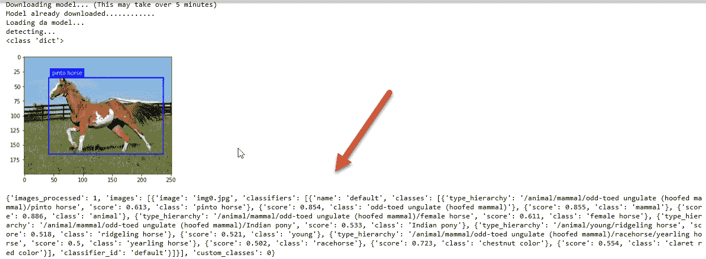

# 检测到的对象

最后，我们准备使用`matplotlib`、`plt.show()`来显示我们正在处理的当前图像:

```
 # --- use matplotlib to show the result!
 plt.show()
```

我们现在终于可以看到项目的输出了。在本例中，我们的图像是一匹马，我们可以看到 Watson 视觉识别服务正确地检测到了该对象，并将其标记为一匹平托马:

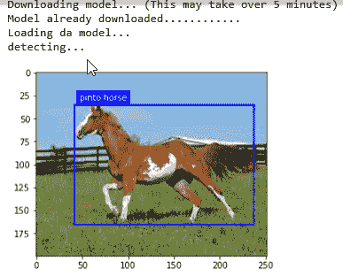

# 现在是有趣的部分

现在有趣的部分来了。您可以从几乎任何地方下载任意数量的文件来测试应用(或者创建自己的应用)。我用了几张图片，发现 Watson 相当准确。

使用的第一幅图像被正确地检测为摩托车，第二幅(显示两辆老爷车的图像)非常接近，因为 Watson 检测到其中一辆车是轿车，而另一辆被检测为轻型卡车。

我们已经提到的最终图像的结果:沃森不仅正确地检测到了一匹马，还标记了它的品种:平托。

下面的屏幕截图显示了三个不同的图像及其各自的结果:

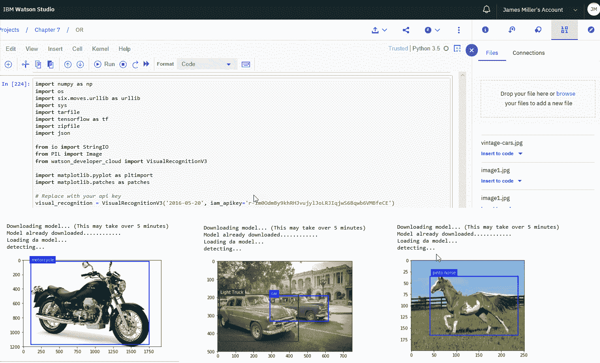

# 保存并共享您的工作

像往常一样，一旦你有一个工作项目笔记本，你可以点击文件，然后保存保存你的工作。下一步是通过单击共享图标来共享您的笔记本，如以下截图所示):


在那里，您可以选择想要共享笔记本的方式:

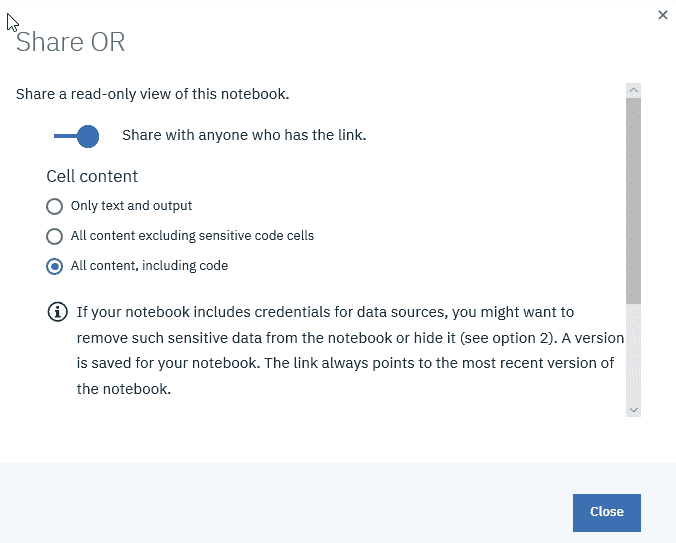

您应该养成在分享之前用 Markdown 单元格内容记录您的笔记本的习惯。你会惊讶地发现，如果你给每个单元格添加评论和观点，你的作品会得到更好的评价。

最后，当您查看项目笔记本时(参见下面的屏幕截图)，请注意共享图标和状态图标。您可以将笔记本发布到各种目标环境，例如 GitHub:

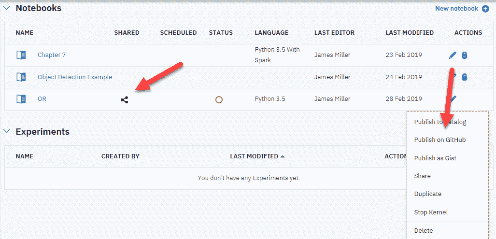

# 摘要

在本章中，我们首先介绍了深度学习的概念，并查看了使用 TensorFlow 库和神经网络的基础知识。

然后，我们通过两个 IBM Watson Studio 项目演示了如何使用 IBM Cloud 上提供的工具和服务来构建神经网络和对象检测项目。

下一章，我们将在 IBM Cloud 上创建一个面部表情平台。