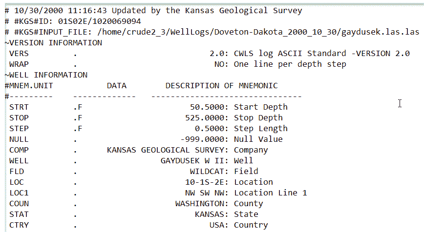
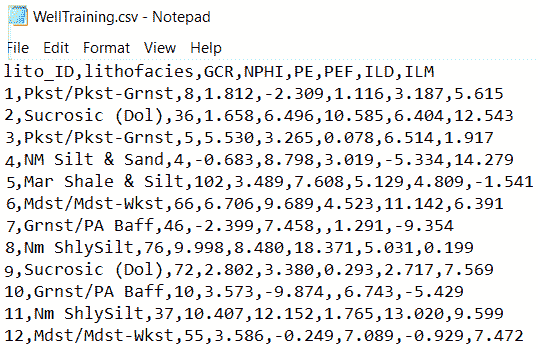
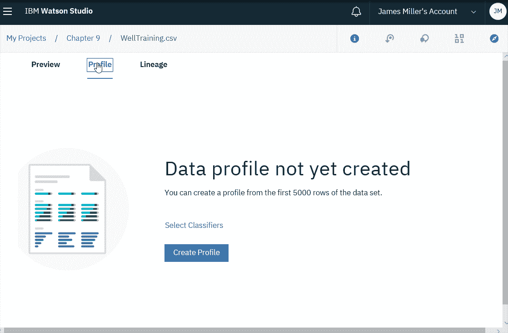
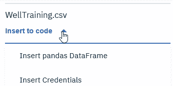
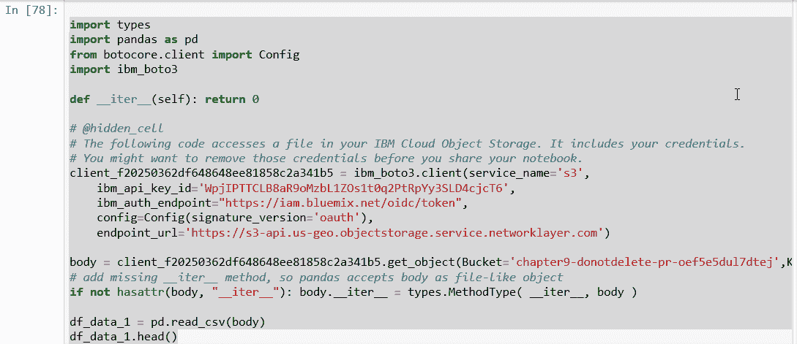
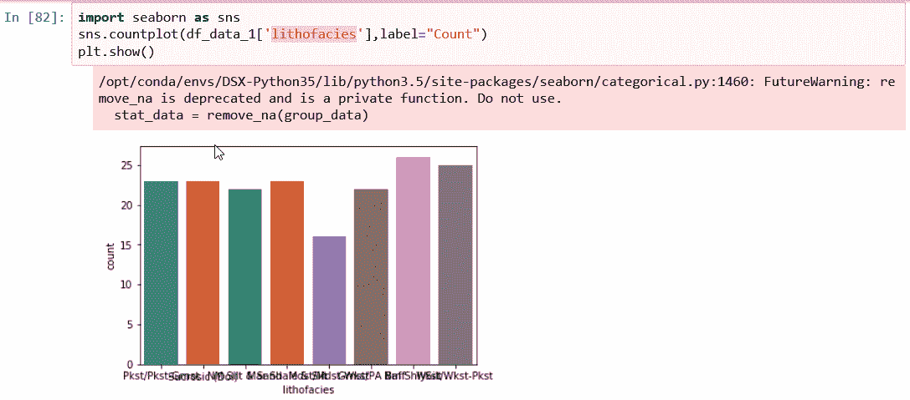
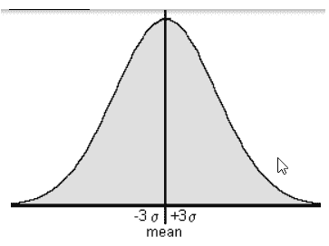
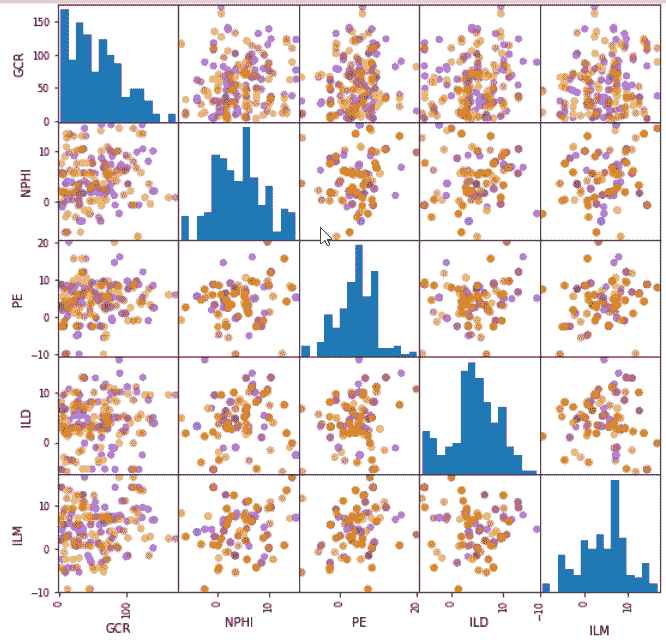
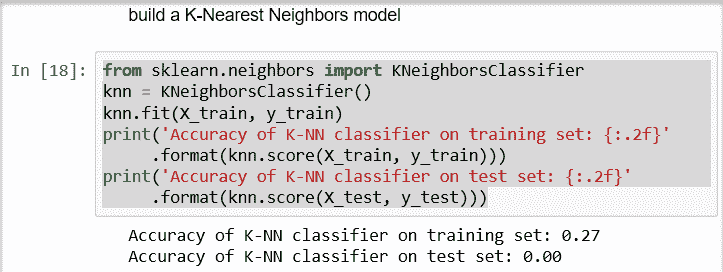
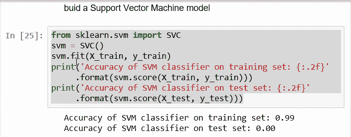

# 九、基于最大似然法的岩相地层自动分类

在这一章中，我们将探讨建立一个端到端的基于云的机器学习系统的想法，以根据测井测量识别**岩相**。这是所有钻井应用中的关键一步。首先，我们将从介绍问题和数据集开始。接下来，我们将解释这种用例所需的预处理和后处理的类型。最后，将使用机器学习服务、Python 和 IBM Watson Studio 构建一个完整的解决方案。

本章将涵盖以下主题:

*   了解岩相
*   探索数据
*   训练分类器
*   评估分类器


# 了解岩相

通过水、冰和风输送的沉积物的沉积和固化而形成的沉积岩通常是成层沉积的。这些地层的地质特性取决于许多因素，如构造、海平面、沉积物供应、沉积物运输和沉积的物理和生物过程以及气候。这些力和相互作用的结果产生了所谓的**几何排列**，构成了一个地区的地层结构。通过岩相分析和对沉积环境的解释，确定了建筑内沉积体的排列或内部解剖。

收集和解释这些信息是石油和天然气、地下水、矿物和地热勘探工作的重要组成部分(也是环境和岩土工程研究的重要组成部分)。


# 沉积环境

前面提到的沉积环境是由搬运和沉积沉积物的各种物理和生物过程形成的。这些过程会产生各种粒度分布和生物沉积结构，这些结构通过与产生它们的沉积力的直接关系来表征(或分类)沉积沉积物。

将在环境构造中发现的特征与产生它们的力联系起来，是地质学家用来解释沉积层序的沉积环境的基本方法。


# 岩相建造

**岩相** **相分析**(以及岩相形成)过程中的第一步是描述和解释可用的常规岩心数据。

岩心描述的一个重要成果是将岩心细分为岩相，岩相定义为基于岩性(岩石特性研究)、粒度、物理和生物沉积结构以及与产生它们的沉积过程相关的分层的沉积序列的**分类。**

岩相和岩相组合(相关岩相的组合)是解释沉积环境的基本单位。


# 我们的使用案例

我希望在阅读完本章的前几节后，你已经形成了这样一种观点，即评价钻井应用机会的一个关键因素是岩性和岩相地层。

在这个项目中，我们的目标是使用机器学习来解释岩心数据，并根据测井数据中获得的物理特征、组件、地层或各种其他属性来识别岩相(即将岩石体或岩石类型分类到指定地层单位的可绘制单元中)。


# 探索数据

在接下来的章节中，我们将探索油井训练数据，并以各种形式绘制学习图。


# 测井

测井，有时也称为**钻孔测井**，是对钻孔或井穿透的地质构造进行详细记录(或测井记录)的实践。这种记录可以建立在对带到地面的样品进行目视检查的基础上(称为**地质记录**)，也可以建立在由下入井内的仪器进行的物理测量的基础上(称为地球物理记录)。

地球物理测井，如钻井、完井、生产或废弃，可以在油井历史的任何阶段进行。


# 日志 ASCII 标准(LAS)

幸运的是，测井记录有一个普遍接受的格式。

LAS 是一种行业标准文件格式，用于所有石油、天然气和水井行业，记录和存储测井信息和数据。单个 LAS 文件只能包含一口井的数据。但是在那一个井中，它可以包含任意数量的数据集(称为**曲线**)。LAS 文件中的常见曲线可能包括自然伽马、传播时间、电阻率测井和其他可能的信息。

关于 LAS 文件的更多信息，可以参考本文:[https://www.bcogc.ca/node/11400/download](https://www.bcogc.ca/node/11400/download)。

哇！虽然不是火箭科学，但数据不是简单的关系表。这项工作的初步工作将是更好地理解所提供数据的细节。

在本章中，我们的目标是使用 Python 最流行的机器学习工具之一`scikit-learn`在 Python 中实现一个机器学习算法，该算法基于一个样本钻井日志数据集，用于训练一个分类器来区分不同类型的岩相。

假设我们被告知，训练测井数据集是从样本测井创建的，并基于定义八个不同岩相的研究，以及各种测井测量，如伽马射线、中子孔隙度、**光电因子** ( **PeF** )和电阻率。

我们还知道，在这个文件中，我们将有六个岩相数据点(`GCR`、`NPHI`、`PE`、`PEF`、`ILD`和`ILM`)，以及一个 ID 和岩相类型。

以下屏幕截图显示了实际测井文件顶部的一部分:



下面的截图是我们文件的一部分，我们将使用它来训练我们的机器学习模型。该文件不包括顶部 LAS 格式的部分标题，只是一个连续的曲线或测井测量列表:




# 加载数据资产

我们将假设您已经创建了一个新的 IBM Watson Studio 项目，因此，您可以继续向其中添加一个数据资产(我们的 well sample 日志文件),这样我们就可以处理数据了。我们在前面的章节中已经加载了数据文件，但这里有一个快速复习:

1.  在新项目的资产页面中，单击添加到项目|数据
2.  在打开的加载窗格中，浏览到该文件。请记住，在加载完成之前，您必须停留在页面上
3.  IBM Watson 然后将文件保存在与您的项目相关联的对象存储中，并且它们作为数据资产列在您的项目的 assets 页面上


# 数据资产注释

当您在 IBM Watson Studio 中构建资产时，强烈建议您在加载数据资产时花时间对其进行注释。这将允许您快速搜索和定位那些资产，以便与其他人协作并在其他项目中使用。您可以通过简单地向您的资产添加一个描述和一个或多个标签来实现这一点。

标签是简化资产搜索的元数据。标记由一个字符串组成，该字符串包含空格、字母、数字、下划线、破折号以及#和@符号。通过使用逗号分隔各个标记值，可以在同一资产上创建多个标记。

在“项目”页面的“数据资产”下，您可以单击资产名称:


接下来，在标记框内单击以添加标记，您可以手动为数据分配业务术语和标记，以及描述，如下面的屏幕截图所示:

**
**


# 分析数据

另一种很好地理解数据的方法是使用 IBM Watson Studio 中的 profile 特性创建数据的概要文件。

数据资产的配置文件包括生成的元数据和关于数据文本内容的统计数据，这样您就可以*看到*它是如何构成的。您可以在项目中的资产配置文件页面上创建一个配置文件，如下图所示:



单击 Create Profile 后，IBM Watson 会检查数据并生成可视化效果，您可以滚动浏览并轻松检查:


根据数据的大小和复杂程度，生成配置文件可能需要几分钟时间。好消息是，在创建之后，它会与文件一起保存，这样就不必再次生成它。


# 使用笔记本和 Python 代替

您可以在 IBM Watson 笔记本中使用可视化来可视化地呈现数据，而不是使用 profiler，从而识别模式、获得洞察力，并根据项目的目标或假设做出决策。正如我们在前面的章节中看到的，许多开源可视化库，如`matplotlib`，已经为您预装在 IBM Watson Studio 上，您所要做的就是导入它们。

您可以以同样的方式安装其他第三方和开源可视化库和软件包，或者利用其他 IBM 可视化库和工具，如 **Brunel** ，用简单的代码和 SPSS 模型创建交互式图形，以创建交互式表格和图表来帮助评估和改进预测分析模型。

在接下来的几节中，我们将使用笔记本和 Python 命令来展示分析和处理数据的各种方法。


# 加载数据

同样，由于我们假设已经创建了一个新的 IBM Watson Studio 项目，我们可以继续向该项目添加一个新的笔记本(从您的项目中，单击 Add to Project | Notebook，就像我们在前面的章节中所做的那样，只是确保指定语言为 Python)。让我们来看看以下步骤:

1.  加载并打开文件，然后打印前五条记录(来自文件)。回想一下，要实现这一点，不需要编码。
2.  您只需点击插入代码，然后在文件|数据资产窗格中为我们的文件插入熊猫数据帧:



这将在我们笔记本的第一个单元格中自动生成以下代码，该代码将我们的数据文件加载到 pandas DataFrame 对象(`df_data_1`)中，然后打印文件的前五条记录:



前面的代码为我们生成了以下输出:


从这个回顾中，我们可以看到数据集的每一行都代表一个岩相，它们分别由我们的表的列中的几个特征来表示(如前面的屏幕截图所示)。

使用 Python 的`print`和`.shape`函数，我们看到数据集中有`180`岩相(文件中的记录数)和`8`特征:


3.  我们还可以使用`.unique()`函数来证明我们的数据集中有八种不同类型的岩相:


4.  接下来，我们可以使用`.size()`函数来查看每个岩相在文件中是如何表示的。`22`和`25`之间的数据似乎相当平衡，其中`Mdst/Mdst-Wkst`岩相与`16`最不平衡；


# 形象化

您可以使用 Python 创建基于岩相大小的条形图；这使它更容易理解，如下图所示:



# 箱形绘图

箱线图通常用于执行解释性数据分析，是一种用于显示和理解分布形状、中心值及其可变性的图表。查看测井数据中每个数值变量的方框图，可以让您更好地了解输入变量的分布，如下图所示:


# 柱状图

**直方图**用于以图形方式概括和显示数据集中数据点的分布。

使用下面的 Python 代码，我们现在可以为数据中的每个数字输入值(`GCR`、`ILD`、`ILM`、`NPHI`、`PE`和`PEF`)尝试一个直方图:

```
import pylab as pl
df_data_1.drop('lito_ID' ,axis=1).hist(bins=30, figsize=(10,10))
pl.suptitle("Histogram for each numeric input variable")
plt.savefig('lithofacies_hist')
plt.show()
```

这将为您提供以下输出:


从数据中生成直方图后，通常会问的第一个问题是直方图的形状是否正常。(数据的)**正态分布**、 *s* 的一个特点是对称的。这意味着如果分布被切成两半，每一边都将是另一边的镜像，形成一个钟形曲线，如下面的截图所示:



从我们生成的直方图来看，也许 **NPHI** 数据点最接近正态分布。


# 散布矩阵

**散布矩阵**是另一种常见分析工具，因为它包括以矩阵格式呈现的变量的几个成对散布图。它还用于验证变量是否相关，以及相关性是正还是负。

以下代码可用于试验这种类型的可视化:

```
from pandas.tools.plotting import scatter_matrix
from matplotlib import cm
feature_names = [ 'GCR', 'NPHI', 'PE', 'ILD', 'ILM']
X = df_data_1[feature_names]
y = df_data_1['lito_ID']
cmap = cm.get_cmap('gnuplot')
scatter = pd.plotting.scatter_matrix(X, c = y, marker = 'o', s=40, hist_kwds={'bins':15}, figsize=(9,9), cmap = cmap)
plt.suptitle('Scatter-matrix for each input variable')
plt.savefig('lithofacies_scatter_matrix')
```

这将为您提供以下输出:



散点图试图揭示变量之间的关系或关联(称为相关性 *)* 。请参考以下链接，了解有关散点图的更多信息:

[https://mste . Illinois . edu/courses/ci 330 ms/youtsey/scatterinfo . html](https://mste.illinois.edu/courses/ci330ms/youtsey/scatterinfo.html)

查看从我们的日志数据生成的散点图(如前面的截图所示)，我真的看不出数据之间有任何特定或直接的相关性。

此时，您可能会继续对数据进行深入研究，执行一些重组或聚合，甚至可能会返回到(数据的)原始来源并请求额外的或新的数据。

为了节省时间，在这个练习中，我们将假设我们将使用我们所拥有的数据，并继续创建和测试各种建模算法。


# 训练分类器

`scikit-learn`库可用于编码机器学习分类器，是唯一具有四步建模模式的 Python 库。

更多关于`sckit-learn`的信息请参考以下链接:[http://www . jmlr . org/papers/volume 12/pedregosa 11 a/pedregosa 11 a . pdf](http://www.jmlr.org/papers/volume12/pedregosa11a/pedregosa11a.pdf)。

实现`scikit-learn`模型的编码过程适用于`sklearn`内的各种分类器，比如决策树、 **K 近邻** ( **KNN** )等等。在这里，我们将使用我们的测井数据来研究其中的一些分类器。

使用 Scikit 构建模型的第一步是创建训练和测试数据集，并使用以下 Python 代码行应用缩放:

```
from sklearn.model_selection import train_test_split
X_train, X_test, y_train, y_test = train_test_split(X, y, random_state=0)
from sklearn.preprocessing import MinMaxScaler
scaler = MinMaxScaler()
X_train = scaler.fit_transform(X_train)
X_test = scaler.transform(X_test)
```

现在，我们已经创建了一个训练数据集，我们可以继续使用该数据构建各种类型的机器学习模型。通常，在一个特定的机器学习项目中，你会对你想要使用的机器学习算法的类型有一些想法，但也可能没有。无论哪种方式，您都希望验证所选算法的性能。

以下部分显示了使用`scikit-learn`模块创建模型的 Python 命令。


# 建立逻辑回归模型

**回归分析**用于了解自变量(我们的特征:`GCR`、`NPHI`、`PE`、`ILD`、`ILM`)中哪些与因变量相关；即岩相类型。

以下几行 Python 代码创建了一个逻辑回归分类器模型，并打印其准确性统计数据:


# 建立一个 KNN 模型

KNN 算法是一种简单的监督机器学习算法，也可用于分类和回归问题。

以下几行 Python 代码创建了一个 KNN 分类器模型，并打印了其准确性统计数据:



# 构建高斯朴素贝叶斯模型

给定类变量，所有朴素贝叶斯分类器推断数据中特定要素的值独立于任何其他要素的值。

以下几行 Python 代码创建了一个**高斯朴素贝叶斯** ( **高斯贝叶斯**)分类器模型，并打印出其准确性统计数据:


# 建立支持向量机模型

一个**支持向量机** ( **SVM** )是一个监督学习模型，具有相关的学习算法，分析用于分类和回归分析的数据。

以下几行 Python 代码创建了一个 SVM 分类器模型，并打印了其准确性统计数据:



# 构建决策树模型

决策树是一种决策支持工具，它使用决策及其可能结果(包括偶然事件结果、资源成本和效用)的树状模型。

以下几行 Python 代码创建了一个决策树分类器模式，并打印其准确性统计数据:


# 总结一下

同样，如果我们正在处理一个真实的项目，这个步骤或阶段(项目的)将包括对每个模型的性能结果的更深入的审查，并且可能需要决定甚至返回到数据探索和转换阶段。然而，为了时间，我们将继续前进。

既然我们现在已经看到了一些简单的方法来创建模型，并且至少从表面上判断每个模型的性能(就准确性而言)，我们将继续到本章的最后一节，并查看一个使用 Python 命令可视化所选模型的示例。


# 评估分类器

查看每个模型构建后打印的输出，我们应该注意到决策树模型有一个最好的结果:

```
Accuracy of Decision Tree classifier on training set: 0.99 
Accuracy of Decision Tree classifier on test set: 0.00
```


# 各种各样的免责声明

通常，我们会花更多的时间来评估和验证所选模型的性能(并不断地训练它)，但同样，你得到了一般的想法(有大量的尽职调查工作要做！)，我们的目标更多的是展示使用 IBM Watson Studio 及其资源构建端到端机器学习解决方案的步骤。

记住这一点，我们现在将使用一些 Python 代码来创建我们的模型的一些可视化。


# 理解决策树

决策树算法是用于分类和回归任务的非常常用的监督学习算法模型。在这一节中，我们将展示如何可视化决策树分类器，以更好地理解它们的逻辑。

决策树分类器在数据上构建一系列简单的 if/else 规则，通过使用这些规则，它们可以预测目标值。

决策树通常更容易解释，因为它们的结构和我们必须使用模块(如`sklearn export_graphviz`函数)可视化建模树的能力。

以下标准 Python 代码可用于可视化我们之前在笔记本中构建的决策树模型:

```
!pip install graphviz
from sklearn.tree import DecisionTreeClassifier, export_graphviz
from sklearn import tree
from sklearn.datasets import load_wine
from IPython.display import SVG
from graphviz import Source
from IPython.display import display

# feature matrix
feature_names = [ 'GCR', 'NPHI', 'PE', 'ILD', 'ILM']
X = df_data_1[feature_names]

# target vector
y = df_data_1['lithofacies']

# print dataset description
estimator = DecisionTreeClassifier()
estimator.fit(X, y)

graph = Source(tree.export_graphviz(estimator, out_file=None
   , feature_names=labels
   , filled = True))
display(SVG(graph.pipe(format='svg')))
```

示例代码可以在 https://towardsdatascience . com/interactive-visualization-of-decision-trees-with-jupyter-widgets-ca 15dd 312084 找到。

下面的屏幕截图显示了在我们的笔记本中执行的代码和它创建的图形输出(尽管这很难放入一个单独的屏幕截图):


很少有人允许。


# 摘要

在本章中，我们介绍了一个在钻井测井评价中对岩相进行分类的真实用例。

我们加载了一个样本文件，并执行了各种分析和可视化练习，比较了 Watson 配置文件，并在笔记本中使用了 Python 命令。最后，我们使用专门的 Python 库来构建各种类型的模型，然后给出了一个有监督的机器学习算法的图表。

在下一章中，我们将构建一个基于云的多生物特征认证平台。