# 构建基于云的多生物特征身份认证平台

在这一章中，我们将使用 **IBM Watson Studio** ，通过使用**生物特征**来构建一个基于云的*人类*身份识别系统。我们将首先介绍生物识别技术，并考虑我们所说的生物识别数据是什么意思。然后，我们将解释每种生物特征所需的预处理类型。此外，我们将了解如何从生物特征数据中提取有意义的特征的过程。最后，我们将介绍**多模态数据融合**背后的概念。

本章将涵盖以下主题:

*   了解生物识别技术
*   探索生物识别数据
*   特征抽出
*   生物识别
*   多模态融合
*   我们的例子

# 了解生物识别技术

如果我们从单词本身开始分析，**生物统计学**源自希腊语**生物**(生命)和**度量**(测量)，因此生物统计学涉及对生物数据的统计分析应用。

**生物特征验证**定义为通过评估一个(或多个)有区别的生物特征来唯一识别某人的过程。

生物识别验证过程中通常使用的唯一标识符包括以下内容:

*   指纹
*   手形几何学
*   耳垂几何形状
*   视网膜/虹膜图案
*   声音(波浪)
*   脱氧核糖核酸
*   签名

对于我们这些法医档案迷来说，最古老的生物识别方式之一是指纹识别。你可以参考以下链接中的文章，了解更多关于第一份法医文件是如何实现的:【http://onin.com/fp/fphistory.html。

随着技术的进步，生物特征验证和认证也取得了显著的进步，例如模拟数据的数字化(更不用说 IBM Watson！)，它现在允许进行几乎即时个人识别。

虽然很明显，生物认证过程使用物理特征(指纹)来数字地识别(或认证)一个人，但是更高级的解决方案也可以利用人类行为特征(如声音节奏)。

这些(特征)中的每一个都被认为是特定个体所独有的，因此，它们可以组合使用(本章稍后将详细介绍组合标识符)以确保更高的识别准确性。

# 立案

为什么生物识别验证是一个如此有趣的话题？

答案是，在一个即时的、越来越互联网化的世界里，密码认证很慢，坦率地说，不够好(强)。

根据最近的流行观点(*生物识别安全发展的 4 个原因*，Digitial Biometrics，2015 年 8 月)，以下四个原因是生物识别验证如此重要的首要原因:

*   物联网格局变得越来越复杂
*   密码不够强
*   生物识别安全更有效
*   越来越多的公司和机构开始采用生物识别技术

几乎我们每个人都不得不创建或选择密码，并被告知所选的短语很弱或不够强。弱密码是容易被人或自动过程检测到的密码。

人们经常使用可猜测的密码，如他们孩子的名字或他们的门牌号码(这样他们就不会忘记密码)，但是**密码**越简单或越弱，就越容易被发现或复制。

生物认证是证明身份或认证某人的更有效的方式，因为它不能被模拟或复制，并且黑客几乎不可能操纵认证过程，即使使用恶意软件和其他病毒。

# 流行的使用案例

生物认证技术正在发挥作用的一些*当前*和实际领域包括:

*   边境和移民
*   劳动力管理
*   刑事鉴定
*   机场安检
*   计时和出勤
*   法律的实施
*   门禁和**单点登录** ( **单点登录**
*   银行业务

所有迹象表明，这项技术将继续发展和成熟，正如 M2SYS Technology 的 John Trader 的文章*在全球使用生物识别技术*([http://www . M2SYS . com/blog/biometric-hardware/top-5-uses-Biometrics-cross-Globe/amp/](http://www.m2sys.com/blog/biometric-hardware/top-5-uses-biometrics-across-globe/amp/))中所表明的那样。

从财务角度来看，根据**安全行业协会** ( **SIA** )的数据，仅美国的电子门禁市场就有望在 2019 年达到 44.7 亿美元(高于 2014 年的 30 多亿美元)。

为了进一步说明生物认证的情况，在线文章*千禧一代加速密码时代的终结*(2018 年 1 月 29 日，作者 Limor Kessem)，我们看到尽管密码的使用并不流行，但当登录应用程序时*安全*是用户最大的(到目前为止)担忧([https://security intelligence . com/new-IBM-study-consumers-weigh-in-biometrics-authentic ation-and-the-the-future-of-identity/](https://securityintelligence.com/new-ibm-study-consumers-weigh-in-on-biometrics-authentication-and-the-future-of-identity/))。

# 隐私问题

随着生物识别技术的便利性和安全性，隐私问题也随之而来。要使任何生物认证解决方案发挥作用，都需要一个数据库，其中包含系统要识别和授权的每个人的相关信息。这意味着必须记录每个用户的生物特征签名，这样解决方案才能使用这些信息来验证每个人的身份。此类信息的安全保护、合乎道德的使用和治理变得至关重要。

除了上述内容之外，生物识别系统本质上还会收集更多的信息，而不仅仅是用户的指纹、视网膜图案或其他生物识别数据。在基本水平上，大多数系统将记录一个人在认证时的时间和地点。这也导致了对如何以及在哪里使用这些信息的关注。

关于这个特定主题的一些最后的话:最近的一项法院裁决强调了提供(事先)生物特征数据收集和使用通知的重要性。处理生物识别技术时要小心:违反法律很可能会导致你或你的公司被起诉。

# 生物认证解决方案的组件

构成生物认证解决方案的组件包括:

*   传感器或其他设备来捕捉生物测定数据
*   保存生物特征的数据存储
*   一种机器学习匹配算法
*   一个决策处理器或如何处理前三者的结果

在下一节中，我们将开始探索生物特征数据。

# 探索生物识别数据

在阅读了本章的前面几节，并且理解了在解决方案中使用生物识别数据的目的和机会之后，下一步是至少在概念上完成构建解决方案的演练。

当使用生物特征信息进行身份验证时，我们会看到以下内容:

*   **生物特征数据的收集**:该步骤使用某种输入设备来捕获生物特征数据。这种信息的输入通常被称为生物特征扫描。这种扫描可以是指纹、眼睛的虹膜、声音提示或其他形式的生物特征扫描(通常照片是最先使用的生物特征形式，因为照片易于理解和管理)。
*   **生物特征数据的转换、标记和存储**:通过扫描收集的数据必须转换成数字格式，保存在数据库中，并进行适当标记。该数据库存储需要由解决方案授权的个人的生物特征数据。
*   **ML 算法**的选择和配置:**匹配算法**用于将新扫描的数据与数字数据库中存储和标记的数据进行比较。一旦匹配，个人就通过了身份验证，然后使用决策逻辑来决定下一步该做什么，比如授予对系统或位置的访问权。

# 特定个人身份

因此，生物识别包括通过将个人出示(或扫描)的**生物特征签名**与解决方案数据库中已经编目的签名进行比较来确定特定个人的身份，并做出决定:匹配还是不匹配？这可以从下图中看出:

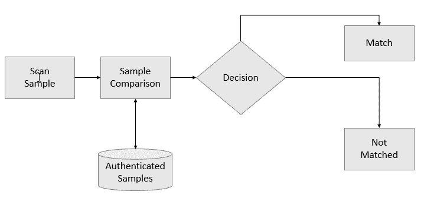

生物特征签名可以是从个人处获得的项目，例如:

*   他们的脸部照片
*   他们声音的记录
*   他们指纹的图像

请记住，**生物特征数据**是一个通用术语，用于指代在**生物特征** **扫描过程**中创建的任何数据。

除了前面提到的，该生物特征数据还可以包括任何样本、模型、指纹、相似性分数以及包括个人姓名和人口统计数据在内的所有验证或识别数据。

个人签名还可以包括手掌静脉、面部识别、DNA、掌纹、手形、虹膜识别、视网膜和气味/气味。此外，与个人行为模式(例如，他或她的步态或打字节奏)相关的**行为特征**也可以是生物特征数据库的一部分。

还应注意的是，由于生物特征数据是数字格式的，因此可以由计算机系统有效处理，并容易加密，以防止未经授权的人进行不道德的操作和使用。

另一点是将一组生物特征样本提交给生物特征识别系统进行识别或验证被称为尝试。由于显而易见的原因，解决方案通常只允许一次尝试来识别或验证个人。没有先前在解决方案数据库中扫描和编目的编目生物特征签名的个人所做的尝试将无法通过认证。这一点非常重要，因为它减少了解决方案运行所需的扫描和编目数据量:您只需要为那些需要进行身份验证和授权访问的个人建立数字签名。

# 生物特征数据使用的挑战

收集、分类和使用生物特征数据可能是一项挑战。像大多数数据一样，这种形式的数据容易受到不确定性和变化的影响。也许对于生物特征数据来说是独特的，我们看到该信息可能受到个人年龄、环境影响、疾病、压力、职业因素、训练和提示、有意改变、呈现发生的情况的社会文化方面、人与系统的界面的改变等的影响。

因此，个人的每次交互或尝试都可能与不同的生物特征信息相关联。

# 样本大小

在[第 8 章](4ed9b065-d004-45ed-97e4-65c805d8ab3a.xhtml)、*在 IBM Cloud 上创建面部表情平台*中，我们构建了一个表情分析模型，使用面部图像对模型进行训练，并用于检测人类的情绪:快乐、悲伤和愤怒。在那个练习中，我们为每种情绪选择了 11 张图片的样本大小:

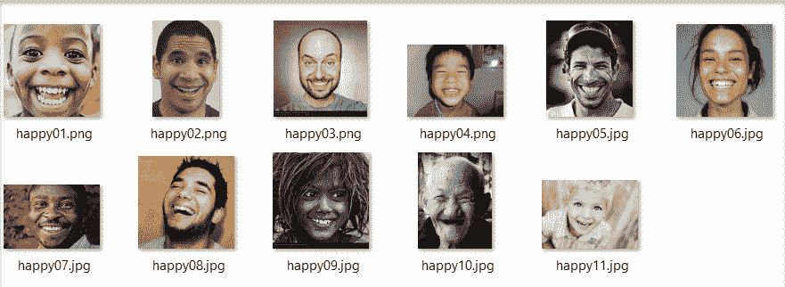

在那个练习中，样本量(11)是足够的，因为目标是证明我们的概念。显然，样本量越大，模型越精确。

一个**生物认证**解决方案在相同的前提下工作；然而，该模型不是从尝试中检测情绪，而是将*扫描的*图像与其编目数据库进行比较，寻找匹配。由于扫描的图像不是数据库中的图像，匹配算法必须比较数据库中的图像，并根据其面部识别和评估逻辑来检测个人。如果数据库中每个经过身份验证的用户只有一个图像，那么误差就会增加。因此，需要多少图像(对于每个用户)？(对于生物认证解决方案)要使用的最佳样本量是多少？

生物识别系统的性能通常通过从 *n* 个不同的对象收集生物识别模板(或生物识别签名)来评估，并且为了方便起见，为 *n* 个对象中的每一个获取该生物识别的多个实例(例如，照片)。

不幸的是，您很可能会发现，迄今为止，基于**接收器工作特性(ROC)** 曲线构建置信区域的工作并不多，无法验证声称的性能水平，也无法确定建立 ROC 曲线预定宽度的置信区域所需的生物特征样本数量。

ROC 广泛用于确定预测模型如何区分真正的积极和消极。为了完成这一任务，模型不仅需要正确地将积极预测为积极，还需要正确地将消极预测为消极。

# 特征抽出

生物特征提取(有时也称为细节提取)指的是选择或增强样本的既定*关键*特征以进行更有效处理的过程。典型地，特征提取过程依赖于一组算法，这些算法根据所使用的生物特征识别的类型(例如，面部图像或指纹)而变化。

生物测定认证是将已经从例如生物测定特征的图像转换(之前或尝试时)成可搜索数据集的样本进行匹配。这种转换过程称为特征提取。

如果你看看特征提取基本上是如何工作的例子，你会发现它依赖于样本的类型，但在大多数情况下，很容易概念化。你可以点击以下链接了解更多关于生物特征匹配的工作原理:[http://dev technology . com/2013/11/emerging-biometric-technology-revolable-biometric-features/](http://devtechnology.com/2013/11/emerging-biometric-technology-revocable-biometric-features/)。

其他一些生物特征提取的例子也可以参考以下链接的文章:[http://arindamcctvaccesscontrol . blogspot . com/2010/05/access-control-index-terminals . html](http://arindamcctvaccesscontrol.blogspot.com/2010/05/access-control-index-terminology.html)。

# 生物识别

生物识别和最终的成功认证取决于解决方案中使用的所选机器学习算法的稳健性，还取决于(正如我们在本章的*特征提取*部分中讨论的)样本大小。

除了这些要求之外，考虑样品的质量和类型也很重要。例如，差的图像质量会显著影响生物认证的准确性。我们还简要提到了使用**行为特征**作为生物特征签名的一部分。

不过一般来说，**生理特征**(例如指纹或面部图片)总是最静态的，随着时间的推移几乎没有什么不同，而**行为特征**(即步态或节奏)可以并且通常会经历变化，并且会受到外部因素或特定情绪条件(例如压力或强烈的心理影响)的影响。

有趣的**行为** **特征**已经被一些生物认证解决方案使用，包括声音印记、书写和/或打字风格、身体运动、走路的风格和趋势等等。

# 多模态融合

最简单地说，个人财产周围的门越多，就越安全，因为我们需要拥有成功通过不止一个测试的能力才能继续。这同样适用于任何基于测试结果(匹配或不匹配)决定继续进行的系统或解决方案。添加额外的测试会产生额外的结果和基于这些结果的额外决策。

生物认证解决方案通常被认为是单模态的(只进行一项测试)或多模态的(进行多项测试):

*   **多模态生物特征认证**:这描述了一个实现的解决方案，它利用多个生物特征指示器来识别被认证的个人，例如照片/图像和签名。两种生物特征的成功匹配是成功的必要条件。
*   **单模态生物认证**:这描述了一种仅使用单一级别认证的解决方案，例如仅使用照片/图像或签名。在这种情况下，如果解决方案与生物特征(例如和图像)成功匹配，则尝试成功。

# 我们的例子

既然我们对生物认证解决方案是什么以及它是如何工作的有了一个概念和理解，我们将尝试使用我们在[第 8 章](4ed9b065-d004-45ed-97e4-65c805d8ab3a.xhtml)、*中使用的相同的 **IBM Watson 视觉识别服务**来构建一个简单但实际工作的原型，以及作为我们新解决方案指南的那个项目。*

提醒一下，IBM Watson 视觉识别服务理解开箱即用的图像内容(我们在我们的[第 8 章](4ed9b065-d004-45ed-97e4-65c805d8ab3a.xhtml)、*在 IBM Cloud* 项目上创建面部表情平台中演示了这一点)。提供的预训练模型使您能够分析对象、面部、颜色、食物、明确内容和其他主题的图像，以洞察您的视觉内容。我们成功地使用该服务来检测人脸，然后确定表情。

# 前提

总的前提将是克隆我们的[第 8 章](4ed9b065-d004-45ed-97e4-65c805d8ab3a.xhtml)，*在 IBM Cloud* 上创建一个面部表情平台，项目和创建一个或多个类，用作我自己的简单生物特征签名；一个加载了十几张我的脸的图片，另一个负类加载了十几张随机的脸的图片(没有一张是我的)。

此外，还会有至少一个其他类，被设计成另一个人的生物特征签名。因此，我们预计，在本章的项目中，我们将有以下三个类:

*   吉姆班
*   个别两个或其他类
*   负类

最后一步将是使用移动设备为自己和他人拍摄几张照片，在没有准备或任何图像处理的情况下，将面部图像提交给我们的项目并记录结果:匹配或不匹配。这些图像提交将被视为我们的生物认证的尝试。

也许为了公平地测试这个项目，我们将需要确保提交几张我自己的图像(没有一张是模型的类定义我的生物特征签名的一部分)和几张不是我的脸，并记录每次提交的结果。

最后，我们将评估并记录结果。

# 数据准备

马上，我们需要有我的脸的 10 个图像的样本。这些图像应该具有合理的质量，为了获得最佳效果，应该是在一段时间内拍摄的特写照片，这样算法就可以对我的外貌变化进行一些解释。

如果您忘记了，您可以查看[第八章](4ed9b065-d004-45ed-97e4-65c805d8ab3a.xhtml)、*在 IBM Cloud 上创建面部表情平台、*了解具体的文件图像要求。

以下是将用于创建我的生物特征签名的图像:

接下来，我们需要为另一个人建立生物特征签名(具有相同大小的样本):

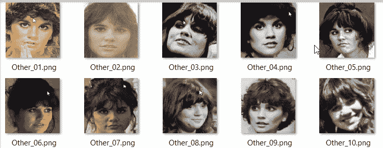

最后，需要设置 10 个随机面的负类(当然是从我们的项目中借用的):

来自 Watson docs 的提示: **create a classifier** 调用要求您提供至少两个示例 ZIP 文件:两个正面示例文件或一个正面和一个负面文件。负例定义了更新的分类器不是什么。它不用于在创建的分类器中创建类。负面示例文件将包含与任何正面示例的主题都不匹配的图像**。在一次调用中，只能指定一个示例。**

# 项目设置

我们将再次假设我们已经创建了一个新的 IBM Watson Studio 项目，现在(如在[第 8 章](4ed9b065-d004-45ed-97e4-65c805d8ab3a.xhtml)、*在 IBM Cloud 上创建面部表情平台*)添加一个新的视觉识别模型，方法是转到 Assets 选项卡，在 Models 下，单击 new visual recognition model(您可以返回到[第 8 章](4ed9b065-d004-45ed-97e4-65c805d8ab3a.xhtml)、*在 IBM Cloud 上创建面部表情平台、*进行快速回顾)。

就像在[第 8 章](4ed9b065-d004-45ed-97e4-65c805d8ab3a.xhtml)、*在 IBM Cloud 上创建面部表情平台、*中一样，一旦模型被创建(应该只需要几分钟)，您就可以拖放我们在本章前面几节中准备的图像`.zip`文件。

这将把图像文件上传到**云对象存储** ( **首席运营官**)，使它们可以在我们的项目中使用(如下图所示):

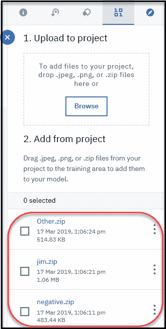

从默认的定制模型屏幕(在下面的屏幕截图中)，我们已经准备好构建我们的模型类了:

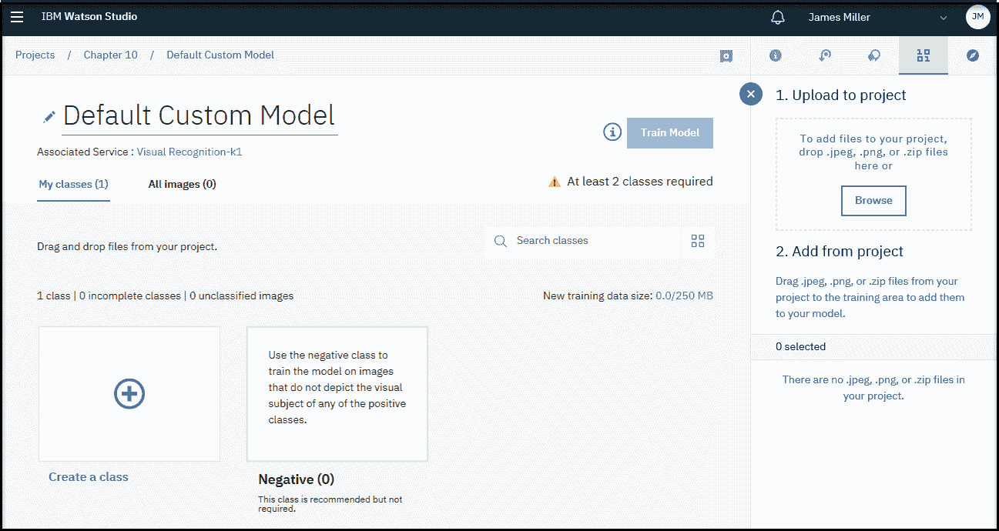

# 创建类

现在，您可以单击 Create a class 按钮(在下面的屏幕截图中显示在左下角)来创建 Jim 和其他类(记住，已经为您创建了负类):

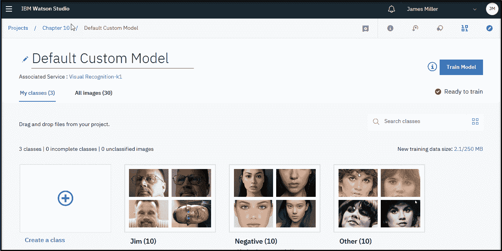

同样，您可以参考第 8 章、*中的[在 IBM Cloud 上创建面部表情平台、](4ed9b065-d004-45ed-97e4-65c805d8ab3a.xhtml)*中的*为我们的模型创建类*部分，以获得创建类的逐步说明。

# 训练模型

一旦我们创建(并加载了图像)并保存了三个类，并且模型状态显示为“准备好训练”,我们就可以单击“训练模型”按钮，开始根据我们提供的图像训练模型:

再说一次，这是一个只有 30 个训练图像的小模型；训练过程不到 5 到 10 分钟。使用 IBM Watson 和 services 的好处之一是，许多“详细的任务”,如创建模型定义和训练模型，只是“点击一下按钮”。要了解有关训练视觉识别模型的更多信息，请访问:

https://dataplatform.cloud.ibm.com/docs/content/wsj/analyze-data/visual-recognition-train.html?linkInPage=true

模型训练完成后，您注意到(参见下面的屏幕截图)模型状态显示为“已训练”,您可以继续进行:

正如我们在[第 8 章](4ed9b065-d004-45ed-97e4-65c805d8ab3a.xhtml)、*在 IBM Cloud 上创建面部表情平台、*中所做的那样，为了测试和验证我们的模型，我们可以在默认定制模型页面的测试区上传图片，如下面的截图所示:

# 测试我们的项目

正如我们计划的那样，我们项目练习的最后一步是使用移动设备为自己和他人拍摄几张照片，在不准备图像的情况下，将面部图像提交给我们的项目进行认证，并记录结果:匹配或不匹配。

我用智能手机拍了以下三张头像。我试图捕捉灯光和表情的变化:

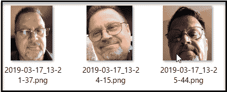

此外，正如我们前面提到的，为了公平地测试我们的项目，我们需要提交几幅不属于我的人脸图像，并记录每次提交的结果。

对于这些测试对象，我收集了以下内容:

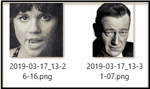

现在是测试时间！

正如我们在下面的截图中看到的，我提交了前四张图片:Jim、Jim、Jim 和 other。该模型正确地验证了提交的每个图像:

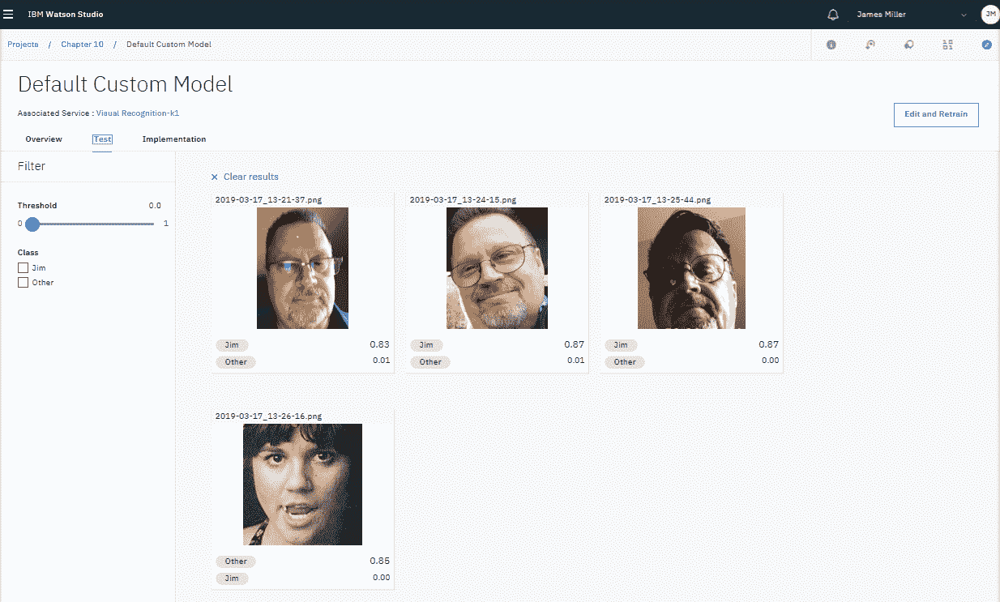

很好，对吧？现在我们可以提交第四张也是最后一张图片(*不是*吉姆和*不是*其他)并放大所有的分数:

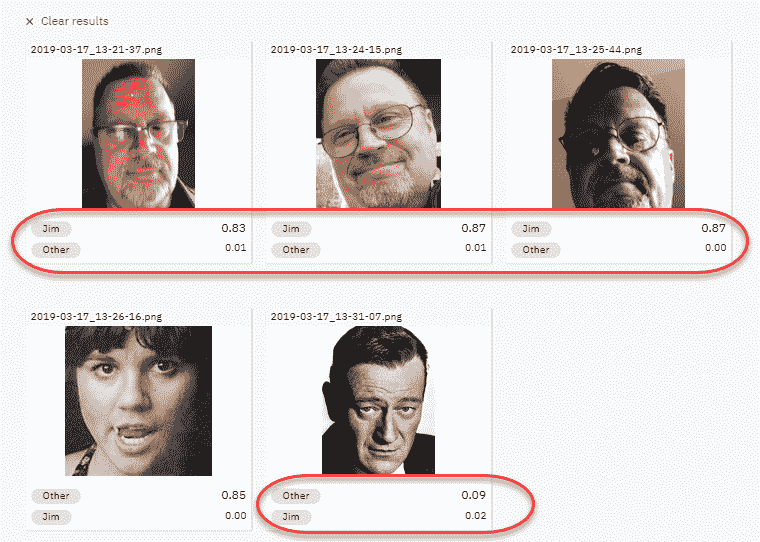

# 良好训练指南

我们现在已经使用 IBM Watson Studio 和 IBM Watson 视觉识别服务创建了一个简单的生物认证概念证明。它可以工作，但是当然还不能部署。在模型准备好进行部署和生产使用之前，有许多事情需要考虑。例如，视觉识别服务提供的指南指出，在您可以开始真实地评估您的训练结果之前，最好的做法是每个班级至少包含 50 张正面图像*。*

提供的其他建议包括:

*   假设训练数据的质量和内容相似，则更多的训练图像通常比更少的图像提供更准确的结果。
*   每个`.zip`文件 150 到 200 张图像提供了处理时间和准确性之间的最佳平衡。超过 200 张图片将会增加时间和准确性，但是对于所花费的时间来说回报是递减的。

# 履行

Test 选项卡的右边是 Implementation 选项卡(如下图所示)。从这里，您可以看到 Watson 为您提供的代码片段，用于根据您刚刚构建的模型对图像进行分类:

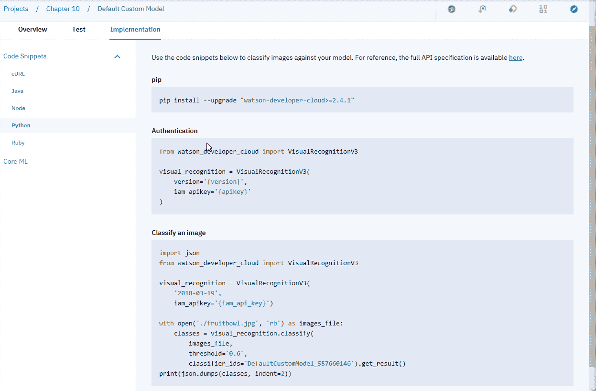

作为参考，部署模型所需的完整 API 规范可以从这里获得:[https://cloud.ibm.com/apidocs/visual-recognition](https://cloud.ibm.com/apidocs/visual-recognition)。

# 摘要

在本章中，我们介绍并讨论了在生物认证解决方案中收集和使用生物数据，这种解决方案如何工作以及特征提取(关于生物数据解决方案)是多模式融合的想法。最后，我们扩展了第 8 章、*中的表情检测和分析解决方案，在 IBM Cloud 上创建面部表情平台*，再次使用 IBM Watson 视觉识别服务，以创建一个有效的生物认证解决方案概念验证。

下一章以对我们所学内容的概述来结束这本书。本章还将阐明一些与使用 IBM Watson Studio 在云上开发机器学习系统相关的实际考虑。