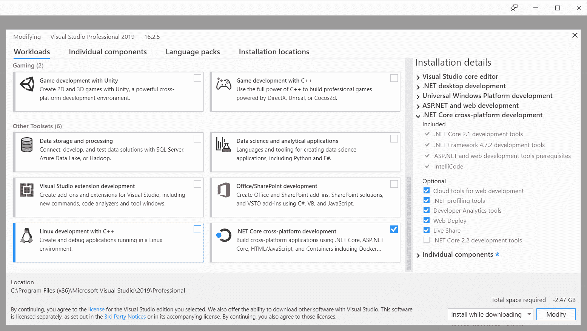
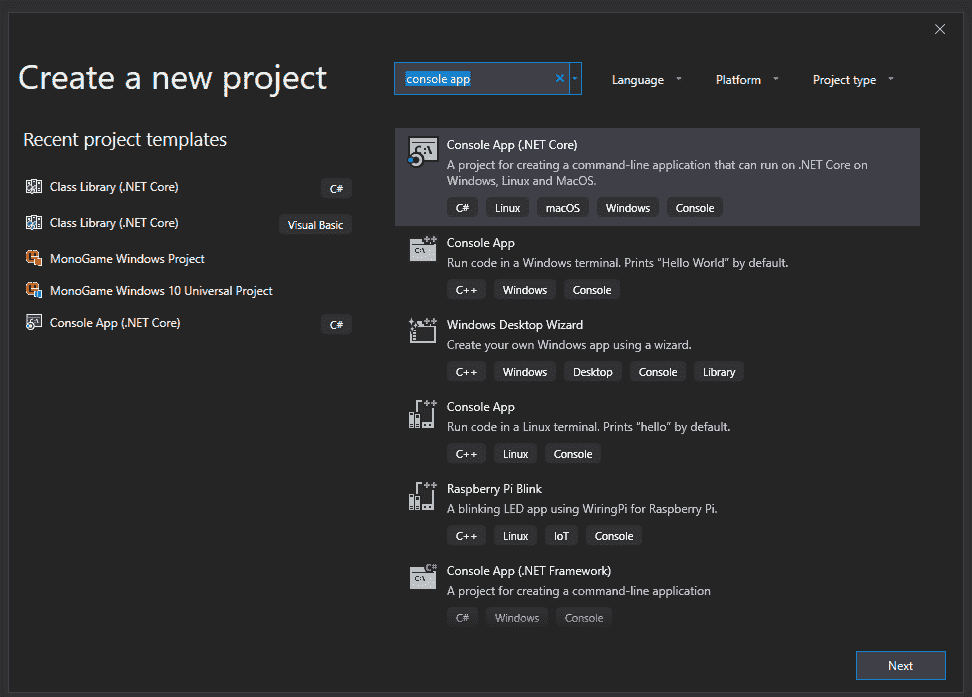
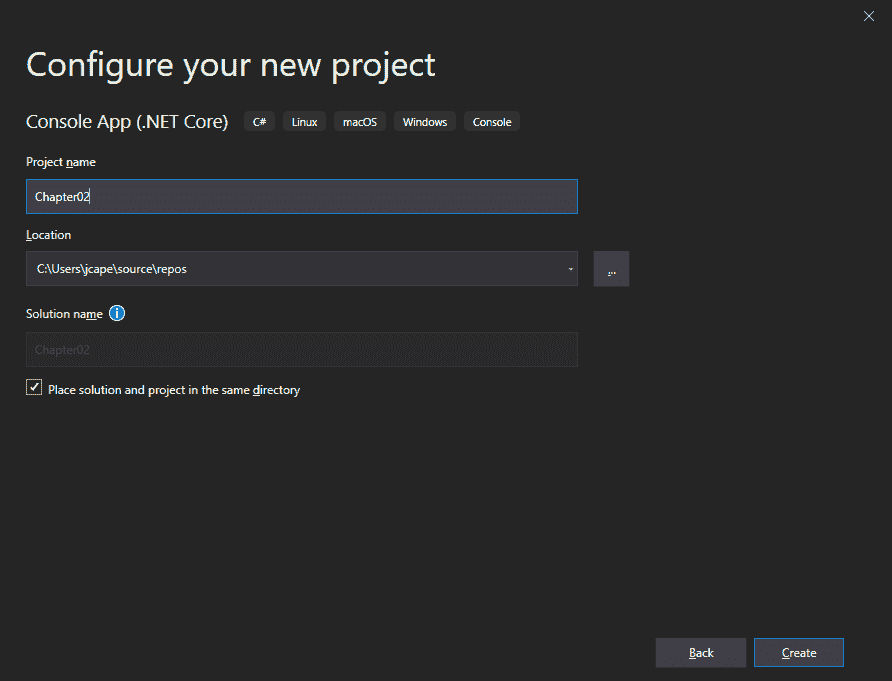
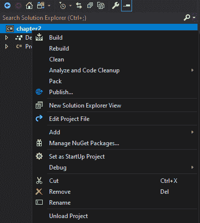
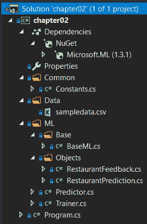

<title>Setting Up the ML.NET Environment</title> 

# 设置 ML.NET 环境

现在，您已经牢牢掌握了机器学习的基础知识，了解了什么是微软的 model，以及它提供了什么，是时候训练和创建您的第一个机器学习模型了！我们将基于评论建立一个简单的餐馆情绪分析模型，并将这个模型集成到一个简单的。NET 核心应用程序。在我们开始训练和创建我们的模型之前，我们首先必须配置开发环境。

在本章中，我们将讨论以下主题:

*   设置您的开发环境
*   和 model 一起从头到尾创造你的第一个模型
*   评估模型

<title>Setting up your development environment</title> 

# 设置您的开发环境

幸运的是，为 ML.NET 配置您的环境相对容易。在本节中，我们将安装 Visual Studio 2019 和。网芯 3。如果您不确定是否已经安装，请遵循以下步骤。此外，在我们阅读这本书的过程中，有一些组织元素和流程需要尽早建立，你也可以开始自己尝试。

<title>Installing Visual Studio</title> 

# 安装 Visual Studio

ML.NET 开发的核心是 Microsoft Visual Studio。对于本书通篇使用的所有示例和截图，将使用 Windows 10 19H2 上的 Microsoft Visual Studio 2019 Professional。在撰写本文时，16.3.0 是最新版本。请使用可用的最新版本。如果你没有 Visual Studio 2019，可以在[www.visualstudio.com](http://www.visualstudio.com)上免费获得一个全功能社区版本。

对于本书的范围，正如在[第 1 章](b8d873e1-9234-4f11-ad94-76df5ffbb228.xhtml)、*机器学习入门和 ML.NET*、*中提到的，我们将创建广泛的应用类型，以在特定应用平台上的各种问题领域中展示 ML.NET。因此，我们将提前安装几个可用的工作负载，以避免在后面的章节中返回安装程序:*

1.  首先，确保**。NET 桌面开发**、**通用 Windows 平台开发**、**ASP.NET 和 web 开发**被勾选。这些工作负载将使您能够创建我们将在后面的章节中使用的 ASP.NET、UWP 和 WPF 应用程序:


2.  另外，确保**。NET Core 跨平台开发**也是检查。这将使。NET 核心开发命令行和桌面应用程序，例如我们将在本章后面制作的应用程序:



<title>Installing .NET Core 3</title> 

# 正在安装。网络核心 3

正如在[第一章](b8d873e1-9234-4f11-ad94-76df5ffbb228.xhtml)、【机器学习入门】和 ML.NET 中提到的。网芯 3 是首选。NET 框架时，由于在开发过程中实现的优化工作。网芯 3。在写这篇文章的时候。NET Core 3 在 16.3.0 版本之前没有捆绑 Visual Studio 安装程序，需要单独下载，这里:【https://dotnet.microsoft.com/download/dotnet-core/3.0。本书范围内专门使用的下载版本是 3.0.100，但是在您阅读本文时可能会有更新的版本。对于那些好奇的读者来说，运行时是与 SDK 捆绑在一起的。

您可以通过打开 PowerShell 或命令提示符并执行以下命令来验证安装是否成功:

```
dotnet --version
3.0.100
```

输出应该从 *3* 开始，如下所示。在撰写本文时，3.0.100 是可用的最新生产版本。

确保安装 32 位和 64 位版本，以避免在本书后面部分和您将来的实验中针对 32 位和 64 位平台时出现问题。

<title>Creating a process</title> 

# 创建流程

在本书和您自己的探索过程中，您将收集样本数据，构建模型，并尝试各种应用程序。从长远来看，尽早建立一个过程来组织这些元素会使事情变得更容易。以下是一些需要记住的建议:

*   始终对所有代码使用源代码管理。
*   确保测试集和定型集在它们自己的文件夹中正确命名(如果可能，进行版本化)。
*   具有命名和源代码控制的版本控制模型。
*   在电子表格中保留评估指标和使用的参数。

随着您开发自己的技能集并创建更复杂的问题，很可能需要更多的工具，如 Apache Spark 或其他集群平台。我们将在第 11 章、**、**、*培训和建立生产模型*中讨论这一点，以及关于大规模培训的其他建议。

<title>Creating your first ML.NET application</title> 

# 创建您的第一个 ML.NET 应用程序

是时候开始创建您的第一个 ML.NET 应用程序了。对于第一个应用程序，我们将创建一个. NET 核心控制台应用程序。这个应用程序将把一句话分为肯定陈述或否定陈述，在提供的小样本数据集上进行训练。对于本项目，我们将使用二元逻辑回归分类模型，使用**随机对偶坐标上升** ( **SDCA** )方法。在[第三章](8bcfc000-9adc-4eda-a91a-e09f676eac85.xhtml)、*回归模型*中，我们将对这种方法进行更深入的探讨。

<title>Creating the project in Visual Studio</title> 

# 在 Visual Studio 中创建项目

打开后，根据您在 Visual Studio 中的配置，它将直接在项目创建屏幕上打开，或者将是一个空的 Visual Studio 窗口。如果您的环境显示后者，只需点击**文件**，然后**新建**，然后**项目**:

1.  当窗口打开时，在搜索栏中键入`console app`以查找**控制台应用程序(。【T2 网核心】。确定语言类型是 C#(有同名的 Visual Basic 模板)，高亮显示这个模板，然后点击**下一个**:**



2.  我建议给项目起一个你可以回头参考的名字，比如`Chapter02`，以帮助你以后找到这个项目:



3.  至此，您已经有了一个. NET Core 3 控制台应用程序，所以现在让我们添加`ML.NET` NuGet 包。右键点击项目，点击**管理 NuGet 包**:



4.  在搜索字段中键入`microsoft ml`。您应该会看到可用的最新`Microsoft.ML`版本:


5.  一旦找到，点击**安装**按钮。简单！

在撰写本文时，1.3.1 是可用的最新版本，本书中的所有示例都将使用该版本。在 1.0 之前，语法变化很大，但从那以后就一直保持一致，所以使用新版本应该功能相同。

至此，项目已经为 ML 配置好了。所有未来的项目都将以这种方式引用 ML.NET，并让您回到这些步骤。

<title>Project architecture</title> 

# 项目架构

这个简单的项目将分为两个主要功能:

*   培训和评估
*   模型运行

这种功能之间的划分模拟了利用机器学习的现实生产应用程序，因为通常有团队专门负责每一项。

对于那些希望从一个完整的项目开始并遵循本节剩余部分的人，您可以从这里获得代码:[https://github . com/packt publishing/Hands-On-Machine-Learning-With-ML。NET/tree/master/chapter02](https://github.com/PacktPublishing/Hands-On-Machine-Learning-With-ML.NET/tree/master/chapter02)

下面的屏幕截图显示了 Visual Studio 的解决方案资源管理器中的项目分解。如前所述，该项目分为两个主要类别— `Predictor`和`Trainer`:



`Trainer`类包含所有的模型构建和评估代码，而`Predictor`类，顾名思义，包含使用训练好的模型运行预测的代码。

这个类是我们将在随后的章节中使用的，并在本书的剩余部分中扩展。这个类背后的想法是减少对**干** ( **不要** **重复** **你自己**)的违反，并创建一个有凝聚力且易于迭代的框架。`Constants`类进一步帮助了这个想法——当我们进入更复杂的应用程序时，减少神奇的字符串；这种设计将用于所有未来的章节项目。

最后，`Program`类是我们的控制台应用程序的主要入口点。

<title>Running the code</title> 

# 运行代码

现在，我们将深入探讨该项目中使用的各种类，包括以下类:

*   `RestaurantFeedback`
*   `RestaurantPrediction`
*   `Trainer`
*   `Predictor`
*   `BaseML`
*   `Program`

<title>The RestaurantFeedback class</title> 

# RestaurantFeedback 类

`RestaurantFeedback`类为我们的模型提供输入类。在 model(和其他框架)中，传统的方法是将结构化的输入输入到您的数据管道中，这些数据管道又被传递到训练阶段，并最终传递到您训练好的模型中。

下面的类定义了我们的容器类来保存我们的预测值。这是我们将在本书其余部分使用的方法:

```
using Microsoft.ML.Data;

namespace chapter02.ML.Objects
{
     public class RestaurantFeedback
     {
          [LoadColumn(0)]
          public bool Label { get; set; }

          [LoadColumn(1)]
          public string Text { get; set; }
     }
}
```

乍一看，您可能想知道`RestarauntFeedback`类中的`Label`和`Text`属性与源数据之间的关联。在`Data`文件夹中，有一个名为`sampledata.csv`的文件。该文件包含以下内容:

```
0    "Great Pizza"
0    "Awesome customer service"
1    "Dirty floors"
1    "Very expensive"
0    "Toppings are good"
1    "Parking is terrible"
0    "Bathrooms are clean"
1    "Management is unhelpful"
0    "Lighting and atmosphere are romantic"
1    "Crust was burnt"
0    "Pineapple was fresh"
1    "Lack of garlic cloves is upsetting"
0    "Good experience, would come back"
0    "Friendly staff"
1    "Rude customer service"
1    "Waiters never came back"
1    "Could not believe the napkins were $10!"
0    "Supersized Pizza is a great deal"
0    "$5 all you can eat deal is good"
1    "Overpriced and was shocked that utensils were an upcharge"
```

第一列映射到`Label`属性。你可能还记得在[第一章](b8d873e1-9234-4f11-ad94-76df5ffbb228.xhtml)、*机器学习入门和 ML.NET*中，像这个例子中执行的监督学习需要标记。在这个项目中，我们的标签是一个布尔值。数据集中的 False (0)表示正反馈，True (1)表示负反馈。

第二列映射到`Text`属性来传播情感(也就是要输入到模型中的句子)。

<title>The RestaurantPrediction class</title> 

# restaurant 预测类

`RestaurantPrediction`类包含我们的模型运行将产生的输出属性。根据所使用的算法，输出类将包含更多的属性，您将在后面的章节中看到:

```
using Microsoft.ML.Data;

namespace chapter02.ML.Objects
{
    public class RestaurantPrediction
    {
        [ColumnName("PredictedLabel")]
        public bool Prediction { get; set; }

        public float Probability { get; set; }

        public float Score { get; set; }
    }
}
```

类似于`RestaurantFeedback Label`属性，`Prediction`属性包含正面或负面反馈的总体结果。`Probability`属性包含了我们的决策模型的置信度。`Score`属性用于评估我们的模型。

<title>The Trainer class</title> 

# 培训师课程

在下面的内容中，您将找到`Trainer`类中的唯一方法。`Trainer`方法在高层次上执行以下操作:

*   它将训练数据(在本例中是我们的 CSV)加载到内存中。
*   它建立了一个训练集和一个测试集。
*   它创建了管道。
*   它训练并保存模型。
*   它对模型进行评估。

这是我们将在本书其余部分遵循的结构和流程。现在，让我们深入研究一下`Train`方法背后的代码:

1.  首先，我们检查以确保训练数据文件名存在:

```
if (!File.Exists(trainingFileName)) {
    Console.WriteLine($"Failed to find training data file ({trainingFileName}");

    return;
}
```

尽管这是一个简单的测试应用程序，但是将它作为产品级应用程序来对待总是一个好的做法。此外，由于这是一个控制台应用程序，您可能会错误地传入定型数据的路径，这可能会导致方法中进一步出现异常。

2.  使用 ML.NET 提供的`LoadFromTextFile`辅助方法来帮助将文本文件加载到`IDataView`对象中:

```
IDataView trainingDataView = MlContext.Data.LoadFromTextFile<RestaurantFeedback>(trainingFileName);
```

如您所见，我们传入了训练文件名和类型；在这种情况下，就是前面提到的`RestaurantFeedback`类。应该注意的是，该方法具有几个其他参数，包括以下参数:

*   `separatorChar`:这是列分隔符；默认为`\t`(换句话说，一个 tab)。
*   `hasHeader`:如果设置为`true`，数据集的第一行有表头；默认为`false`。
*   `allowQuoting`:定义源文件中是否可以包含由带引号的字符串定义的列；它默认为 false。
*   `trimWhitespace`:这将删除行中的尾随空格；它默认为 false。
*   `allowSparse`:定义文件是否可以包含稀疏格式的数值向量；它默认为 false。稀疏格式要求新列具有要素的数量。

对于本书中使用的大多数项目，我们将使用默认设置。

3.  给定我们之前创建的`IDataView`对象，使用 ML.NET 提供的`TrainTestSplit`方法从主训练数据创建一个测试集:

```
DataOperationsCatalog.TrainTestData dataSplit = MlContext.Data.TrainTestSplit(trainingDataView, testFraction: 0.2);
```

正如在[第一章](b8d873e1-9234-4f11-ad94-76df5ffbb228.xhtml)、*机器学习入门和 ML.NET*中提到的，样本数据被分成两组——训练和测试。参数`testFraction`指定了为测试而保留的数据集的百分比，在我们的例子中是 20%。默认情况下，该参数设置为 0.2。

4.  首先，我们创建管道:

```
TextFeaturizingEstimator dataProcessPipeline = MlContext.Transforms.Text.FeaturizeText(outputColumnName: "Features",
        inputColumnName: nameof(RestaurantFeedback.Text));
```

未来的例子将有更复杂的管道。在这个例子中，我们只是将前面讨论的`Text`属性映射到`Features`输出列。

5.  接下来，我们实例化我们的`Trainer`类:

```
SdcaLogisticRegressionBinaryTrainer sdcaRegressionTrainer = MlContext.BinaryClassification.Trainers.SdcaLogisticRegression(
        labelColumnName: nameof(RestaurantFeedback.Label),
        featureColumnName: "Features");

```

你可能还记得[第一章](b8d873e1-9234-4f11-ad94-76df5ffbb228.xhtml)、*机器学习入门和 might*，在 ML.NET 发现的各种算法被称为训练器。在这个项目中，我们使用 SCDA 教练。

6.  然后，我们通过追加之前实例化的训练器来完成管道:

```
EstimatorChain<BinaryPredictionTransformer<CalibratedModelParametersBase<LinearBinaryModelParameters, PlattCalibrator>>> trainingPipeline = dataProcessPipeline.Append(sdcaRegressionTrainer);
```

7.  接下来，我们使用本章前面创建的数据集来训练模型:

```
ITransformer trainedModel = trainingPipeline.Fit(dataSplit.TrainSet);
```

8.  我们将新创建的模型保存到指定的文件名，与训练集的模式相匹配:

```
MlContext.Model.Save(trainedModel, dataSplit.TrainSet.Schema, ModelPath);
```

9.  现在，我们用之前创建的测试集来转换我们新创建的模型:

```
IDataView testSetTransform = trainedModel.Transform(dataSplit.TestSet);
```

10.  最后，我们将使用之前创建的`testSetTransform`函数，并将其传递给`BinaryClassification`类的`Evaluate`方法:

```
CalibratedBinaryClassificationMetrics modelMetrics = MlContext.BinaryClassification.Evaluate(
        data: testSetTransform,
        labelColumnName: nameof(RestaurantFeedback.Label),
        scoreColumnName: nameof(RestaurantPrediction.Score));

Console.WriteLine($"Area Under Curve: {modelMetrics.AreaUnderRocCurve:P2}{Environment.NewLine}" +
        $"Area Under Precision Recall Curve: {modelMetrics.AreaUnderPrecisionRecallCurve:P2}" +                    $"{Environment.NewLine}" +
        $"Accuracy: {modelMetrics.Accuracy:P2}{Environment.NewLine}" +
        $"F1Score: {modelMetrics.F1Score:P2}{Environment.NewLine}" +
        $"Positive Recall: {modelMetrics.PositiveRecall:#.##}{Environment.NewLine}" +
        $"Negative Recall: {modelMetrics.NegativeRecall:#.##}{Environment.NewLine}");
```

这个方法允许我们生成模型度量。然后，我们使用经过训练的模型和测试集打印主要指标。我们将在本章的*评估模型*部分深入研究这些特性。

<title>The Predictor class</title> 

# 预测器类

如前所述，`Predictor`类是在我们的项目中提供预测支持的类。这种方法背后的思想是提供一个简单的接口来运行模型，给定相对简单的输入。在以后的章节中，我们将扩展这种方法结构，以支持更复杂的集成，例如那些托管在 web 应用程序中的集成:

1.  类似于在`Trainer`类中所做的，我们在读取模型之前验证它是否存在:

```
if (!File.Exists(ModelPath)) {
    Console.WriteLine($"Failed to find model at {ModelPath}");

    return;
}
```

2.  然后，我们定义`ITransformer`对象:

```
ITransformer mlModel;

using (var stream = new FileStream(ModelPath, FileMode.Open, FileAccess.Read, FileShare.Read)) {
    mlModel = MlContext.Model.Load(stream, out _);
}

if (mlModel == null) {
    Console.WriteLine("Failed to load model");

    return;
}
```

一旦我们通过`Model.Load`方法加载，这个对象将包含我们的模型。此方法也可以采用直接文件路径。然而，流方法有助于支持我们将在后面章节中使用的非磁盘方法。

3.  接下来，给定我们之前加载的模型，创建一个`PredictionEngine`对象:

```
var predictionEngine = MlContext.Model.CreatePredictionEngine<RestaurantFeedback,                        RestaurantPrediction>(mlModel);
```

我们同时传入 TSrc 和 TDst，在这个项目中，分别是`RestaurantFeedback`和`RestaurantPrediction`。

4.  然后，调用`PredictionEngine`类上的`Predict`方法:

```
var prediction = predictionEngine.Predict(new RestaurantFeedback { Text = inputData });
```

因为，当我们用 TSrc 创建对象时，类型被设置为`RestaurantFeedback`，我们的模型有一个强类型接口。然后，我们创建带有`inputData`变量的`RestaurantFeedback`对象，该变量包含我们将要运行模型的句子的字符串。

5.  最后，显示预测输出和概率:

```
Console.WriteLine($"Based on \"{inputData}\", the feedback is predicted to be:{Environment.NewLine}" +
        "{(prediction.Prediction ? "Negative" : "Positive")} at a {prediction.Probability:P0}" +                 " confidence");
```

<title>The BaseML class</title> 

# BaseML 类

如前所述，`BaseML`类将包含我们的`Trainer`和`Predictor`类之间的公共代码，从本章开始。在本书的剩余部分，我们将在如下定义的`BaseML`类之上构建:

```
using System;
using System.IO;

using chapter02.Common;

using Microsoft.ML;

namespace chapter02.ML.Base
{
    public class BaseML
    {
        protected static string ModelPath => Path.Combine(AppContext.BaseDirectory,                                                           Constants.MODEL_FILENAME);

        protected readonly MLContext MlContext;

        protected BaseML()
        {
            MlContext = new MLContext(2020);
        }
    }
}
```

对于训练和预测中的所有 ML.NET 应用程序，都需要一个`MLContext`对象。需要用特定的种子值初始化对象，以便在测试组件期间创建更加一致的结果。一旦模型被加载，种子值(或缺少种子值)不会影响输出。

<title>The Program class</title> 

# 程序类

那些创建过控制台应用程序的人应该熟悉里面的`Program`类和`Main`方法。在本书的其余部分，我们将按照这种结构开发其他基于控制台的应用程序。下面的代码块包含程序类，应用程序将从该类开始执行:

```
using System;

using chapter02.ML;

namespace chapter02
{
    class Program
    {
        static void Main(string[] args)
        {
            if (args.Length != 2)
            {
                Console.WriteLine($"Invalid arguments passed in, exiting.{Environment.NewLine}" +                            $"{Environment.NewLine}Usage: {Environment.NewLine}" +
                    $"predict <sentence of text to predict against>{Environment.NewLine}" +
                    $"or {Environment.NewLine}" +
                    $"train <path to training data file>{Environment.NewLine}");

                return;
            }

            switch (args[0])
            {
                case "predict":
                    new Predictor().Predict(args[1]);
                    break;
                case "train":
                    new Trainer().Train(args[1]);
                    break;
                default:
                    Console.WriteLine($"{args[0]} is an invalid option");
                    break;
            }
        }
    }
}
```

对于熟悉解析命令行参数的人来说，这是一个相当简单的方法实现。如帮助文本所示，使用一个简单的双参数方法。

当执行一个需要几个参数(可选和必需)的更复杂的命令行应用程序时，微软提供了一个简单易用的 NuGet 包，可以在这里找到:[https://github.com/dotnet/command-line-api](https://github.com/dotnet/command-line-api)

<title>Running the example</title> 

# 运行示例

要运行定型和预测，只需构建项目，然后传入适当的数据。

对于培训，您可以使用附带的`sampledata.csv`文件或创建自己的文件。为此，我们将打开一个 PowerShell 窗口，并传入相对路径:

```
.\chapter02.exe train ..\..\..\Data\sampledata.csv
Area Under Curve: 100.00%
Area Under Precision Recall Curve: 100.00%
Accuracy: 100.00%
F1Score: 100.00%
Positive Recall: 1
Negative Recall: 1
```

模型建立后，您可以按如下方式运行预测:

```
.\chapter02.exe predict "bad"
Based on "bad", the feedback is predicted to be:
Negative at a 64% confidence
```

请随意尝试各种短语来测试模型的功效，并祝贺您训练了第一个模型！

<title>Evaluating the model</title> 

# 评估模型

正如您在运行示例项目的培训师组件时所看到的，有各种各样的模型评估元素。对于每种模型类型，在分析模型的性能时，都有不同的指标可以查看。

在二进制分类模型中，比如在示例项目中发现的模型，下面的属性在调用`Evaluate`方法后设置的`CalibratedBiniaryClassificationMetrics`中公开。但是，首先，我们需要定义二元分类中的四种预测类型:

*   真阴性:正确归类为阴性
*   真正积极的:正确地归类为积极的
*   假阴性:不恰当地归类为阴性
*   假阳性:不正确地归类为阳性

要理解的第一个指标是**准确性**。顾名思义，准确性是评估模型时最常用的指标之一。该指标简单地计算为正确分类的预测与总分类的比率。

下一个需要理解的指标是**精度**。精度定义为模型中真实结果与所有正面结果的比例。例如，精度为 1 意味着没有误报，这是一个理想的情况。如前所述，误报是将应该归类为阴性的东西归类为阳性。误报的一个常见例子是将文件误分类为恶意文件，而实际上它是良性的。

下一个需要理解的指标是**召回**。召回率是模型返回的所有正确结果的分数。例如，召回 1 意味着没有假阴性，这是另一个理想的情况。假阴性是指将本应被归类为阳性的东西归类为阴性。

下一个需要理解的指标是 **F-score** ，它利用精确度和召回率，根据误报和漏报得出加权平均值。与简单地查看准确性相比，f 分数提供了模型性能的另一个视角。值的范围在 0 到 1 之间，理想值为 1。

**曲线下面积**，也称为 AUC，顾名思义，是以 y 轴为真阳性，x 轴为假阳性绘制的曲线下面积。对于分类器，如我们在本章前面训练的模型，如您所见，它返回 0 到 1 之间的值。

最后，**平均测井损失**和**训练测井损失**都用来进一步解释模型的性能。平均对数损失通过计算真实分类和模型预测分类之间的差异，有效地表达了单个数字中错误结果的损失。训练对数损失代表使用概率相对于已知值的模型的不确定性。当您训练您的模型时，您将会看到一个较低的数字(数字越低越好)。

至于其他模型类型，我们将在它们各自的章节中深入探讨如何评估它们，在这些章节中，我们将涵盖回归和聚类指标。

<title>Summary</title> 

# 摘要

在本章的过程中，我们已经建立了我们的开发环境，并学习了文件的正确组织。除了针对新模型进行训练、评估和运行预测之外，我们还创建了第一个 ML.NET 应用程序。最后，我们探讨了如何评估一个模型以及各种属性的含义。

在下一章，我们将深入研究逻辑回归算法。