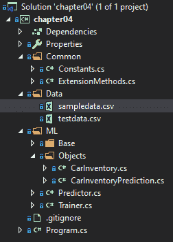
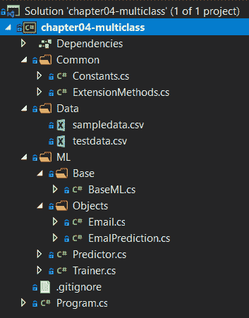

# 六、分类模型

回归模型已经过去，现在是时候深入分类模型了。在这一章中，我们将研究分类模型背后的数学，以及分类模型的各种应用。此外，我们将构建两个新的 ML.NET 分类应用:第一个，一个二元分类示例，它将预测汽车的价格是否划算，类似于您在汽车购买网站上找到的内容；另一个应用，一个多类分类应用，对电子邮件进行分类。最后，我们将探索如何用 model 在分类模型中揭示的属性来评估分类模型。

在本章中，我们将讨论以下主题:

*   打破分类模式
*   创建二元分类应用
*   创建多类分类应用
*   评估分类模型


# 打破分类模式

正如在[第一章](b8d873e1-9234-4f11-ad94-76df5ffbb228.xhtml)、*机器学习入门和 ML.NET*中提到的，分类分为两个主要类别——两类和多类。在两类分类器(也称为二元分类器)中，预测只返回 0 或 1。在多类问题中，返回预先选择的返回标签范围，如病毒类型或汽车类型。

机器学习生态系统中有几种二进制分类模型类型可供选择，如下所示:

*   `AveragedPerceptronTrainer`
*   `SdcaLogisticRegressionBinaryTrainer`
*   `SdcaNonCalibratedBinaryTrainer`

*   `SymbolicSgdLogisticRegressionBinaryTrainer`
*   `LbfgsLogisticRegressionBinaryTrainer`
*   `LightGbmBinaryTrainer`
*   `FastTreeBinaryTrainer`
*   `FastForestBinaryTrainer`
*   `GamBinaryTrainer`
*   `FieldAwareFactorizationMachineTrainer`
*   `PriorTrainer`
*   `LinearSvmTrainer`

我们将在本章后面创建的汽车价值应用利用了`FastTreeBinaryTrainer`模型。

ML.NET 还提供了以下多类分类器:

*   `LightGbmMulticlassTrainer`
*   `SdcaMaximumEntropyMulticlassTrainer`
*   `SdcaNonCalibratedMulticlassTrainer`
*   `LbfgsMaximumEntropyMulticlassTrainer`
*   `NaiveBayesMulticlassTrainer`
*   `OneVersusAllTrainer`
*   `PairwiseCouplingTrainer`

对于多类分类器示例应用，我们将使用`SdcaMaximumEntropyMulticlassTrainer`模型。其原因是**随机对偶坐标上升** ( **SDCAs** )可以在不调整的情况下提供良好的默认性能。


# 选择分类训练师

给定两种分类，你应该选择哪一种？如本章前面所述，与回归模型相比，您的预测输出类型将在二元分类和多类分类之间做出决定。您的问题是简单地预测值的真或假，还是基于预定义的值集提供更多样的输出？如果你的答案是前者，你需要使用二元分类法。如果是后者，您将需要使用多类分类。在本章中，我们将演示这两种模型预测类型。

对于特定的二元分类训练器，SDCA、LightGBM 和 FastTree 是最受欢迎的选项，也是记录最多的。

对于特定的多级分类训练器，LightGBM 和 SDCA 是最受欢迎和记录最好的选项。


# 创建二元分类应用

如前所述，我们将创建的应用是一个汽车价值预测器。给定一组与汽车相关的属性，人们可以预测价格是否划算。本例中包含的属性不是属性的最终列表，也不应该在生产环境中按原样使用。然而，我们可以以此为起点，根据几个属性来预测一个简单的对错答案。

和前面的章节一样，完整的项目代码、样本数据集和项目文件可以在这里下载:[https://github . com/packt publishing/Hands-On-Machine-Learning-With-ML。网/树/主/第 04 章](https://github.com/PacktPublishing/Hands-On-Machine-Learning-With-ML.NET/tree/master/chapter04)。


# 潜入教练

如前所述，对于这个二进制分类应用，我们将使用快速树训练器。

FastTree 基于**多重可加回归树** ( **集市**)梯度推进算法。梯度推进是一种非常流行的技术，在最终选择最佳树之前，以逐步的方式构建一系列树。MART 将这种方法向前推进了一步，它学习了在叶子中使用标量值的回归树的集合。

快速树训练器不要求标准化，但要求所有特征列使用`float`变量类型，标签列为`bool`变量类型。

如果你对玛特感兴趣，康奈尔大学有一篇 2015 年关于这个主题的论文:[https://arxiv.org/abs/1505.01866](https://arxiv.org/abs/1505.01866.)。


# 探索项目架构

基于我们在[第三章](8bcfc000-9adc-4eda-a91a-e09f676eac85.xhtml)、*回归模型*中创建的项目架构和代码，本例中架构上的主要变化是输入机制。对于这个应用，由于我们使用 FastTree 算法，这需要引用`Microsoft.ML.FastTree` NuGet 包(在撰写本文时，版本 1.3.1 是最新的)。如果您正在从头开始构建这个项目，并且不记得如何添加一个 NuGet 引用，请参考第 2 章，*设置 ML.NET 环境*。

在下面的屏幕截图中，您将找到该项目的 Visual Studio 解决方案资源管理器视图。该解决方案的新增内容是`testdata.csv`文件，我们将在这里查看:



`sampledata.csv`文件包含 18 行随机数据。请随意调整数据以适应您自己的观察或调整训练好的模型。以下是数据片段:

```
0,0,0,4000,0
1,1,1,4500,1
0,1,0,5000,0
0,0,1,4500,0
0,0,0,3000,1
0,1,0,3100,1
0,1,1,3500,1
1,1,1,5500,0
1,1,1,4200,1
```

这些行中的每一行都包含了新创建的`CarInventory`类中的属性值，我们将在本章的后面进行回顾。

此外，在本章中，我们添加了包含额外数据点的`testdata.csv`文件，以测试新训练的模型并对其进行评估。下面是`testdata.csv`中的一段数据:

```
0,0,0,2010,1
1,0,0,2600,1
1,0,0,3700,0
1,1,0,3100,1
1,1,0,3600,0
0,1,0,3500,0
0,0,1,3400,1
0,0,1,5100,0
```


# 钻研代码

对于这个应用，如前一节所述，我们在第三章、*中完成的工作基础上构建回归模型*。在这次深入探讨中，我们将只关注针对该应用更改的代码。

更改或添加的类如下:

*   `CarInventory`
*   `CarInventoryPrediction`
*   `Predictor`
*   `Trainer`
*   `Program`


# CarInventory 类

`CarInventory`类是容器类，包含预测和训练我们模型的数据。这些列按照之前查看的样本数据的顺序进行映射。如果开始尝试新功能并添加到以下类中，请确保适当增加数组索引，如下所示:

```
using Microsoft.ML.Data;

namespace chapter04.ML.Objects
{
    public class CarInventory
    {
        [LoadColumn(0)]
        public float HasSunroof { get; set; }

        [LoadColumn(1)]
        public float HasAC { get; set; }

        [LoadColumn(2)]
        public float HasAutomaticTransmission { get; set; }

        [LoadColumn(3)]
        public float Amount { get; set; }

        [LoadColumn(4)]
        public bool Label { get; set; }
    }
}
```


# CarInventoryPrediction 类

除了用于模型评估的`Score`和`Probability`属性之外，`CarInventoryPrediction`类包含映射到我们的预测输出的属性。`PredictedLabel`属性包含我们的分类结果，而不是前面章节中的标签，如下面的代码块所示:

```
namespace chapter04.ML.Objects
{
    public class CarInventoryPrediction
    {
        public bool Label { get; set; }

        public bool PredictedLabel { get; set; }

        public float Score { get; set; }

        public float Probability { get; set; }
    }
}
```


# 预测器类

为了处理就业预测场景，该类中有一些变化，如下所示:

1.  第一个变化是预测调用本身。正如您可能猜到的那样，`TSrc`和`TDst`参数需要调整以利用我们创建的两个新类，`CarInventory`和`CarInventoryPrediction`，如下所示:

```
var predictionEngine = MlContext.Model.CreatePredictionEngine<CarInventory, CarInventoryPrediction>(mlModel);            
```

2.  鉴于我们不再简单地传入字符串并动态构建一个对象，我们需要首先以文本形式读入文件。然后我们将 JSON 反序列化成我们的`CarInventory` 对象，如下所示:

```
var prediction = predictionEngine.Predict(JsonConvert.DeserializeObject<CarInventory>(json));
```

3.  最后，我们需要调整预测的输出，以匹配新的`CarInventoryPrediction` 属性，如下所示:

```
Console.WriteLine(
    $"Based on input json:{System.Environment.NewLine}" +
    $"{json}{System.Environment.NewLine}" + 
    $"The car price is a {(prediction.PredictedLabel ? "good" : "bad")} deal, with a {prediction.Probability:P0} confidence");
```


# 训练师课程

在`Trainer`类中，需要进行一些修改来支持二进制分类，如下所示:

1.  第一个变化是检查以确保测试文件名存在，如下面的代码块所示:

```
if (!File.Exists(testFileName))
{
    Console.WriteLine($"Failed to find test data file ({testFileName}");

    return;
}
```

2.  然后，我们使用在第三章、*回归模型*、**、**中使用的`NormalizeMeanVariance`转换方法对输入值构建数据处理管道，如下所示:

```
IEstimator<ITransformer> dataProcessPipeline = MlContext.Transforms.Concatenate("Features",
 typeof(CarInventory).ToPropertyList<CarInventory>(nameof(CarInventory.Label)))
 .Append(MlContext.Transforms.NormalizeMeanVariance(inputColumnName: "Features",
 outputColumnName: "FeaturesNormalizedByMeanVar"));
```

3.  然后，我们可以使用来自`CarInventory`类的标签和标准化的均值方差创建`FastTree`训练器，如下所示:

```
var trainer = MlContext.BinaryClassification.Trainers.FastTree(
    labelColumnName: nameof(CarInventory.Label),
    featureColumnName: "FeaturesNormalizedByMeanVar",
    numberOfLeaves: 2,
    numberOfTrees: 1000,
    minimumExampleCountPerLeaf: 1,
    learningRate: 0.2);
```

稍后，在您运行应用之后，考虑调整树叶的数量和树的数量，以查看模型指标和您的预测概率百分比如何变化。

4.  最后，我们调用`Regression.Evaluate`方法来提供特定于回归的指标，然后调用`Console.WriteLine`将这些指标提供给控制台输出。我们将在本章的最后一节详细讨论这些代码的含义，但是现在，可以在这里看到代码:

```
var trainingPipeline = dataProcessPipeline.Append(trainer);

var trainedModel = trainingPipeline.Fit(trainingDataView);

MlContext.Model.Save(trainedModel, trainingDataView.Schema, ModelPath);
```

现在，我们评估刚刚训练的模型，就像这样:

```
var evaluationPipeline = trainedModel.Append(MlContext.Transforms
 .CalculateFeatureContribution(trainedModel.LastTransformer)
 .Fit(dataProcessPipeline.Fit(trainingDataView).Transform(trainingDataView)));

var testDataView = MlContext.Data.LoadFromTextFile<CarInventory>(testFileName, ',', hasHeader: false);

var testSetTransform = evaluationPipeline.Transform(testDataView);

var modelMetrics = MlContext.BinaryClassification.Evaluate(data: testSetTransform,
 labelColumnName: nameof(CarInventory.Label),
 scoreColumnName: "Score");
```

最后，我们输出所有的分类指标。我们将在下一节详细介绍每一项，但是现在，可以在这里看到代码:

```
Console.WriteLine($"Accuracy: {modelMetrics.Accuracy:P2}");
Console.WriteLine($"Area Under Curve: {modelMetrics.AreaUnderRocCurve:P2}");
Console.WriteLine($"Area under Precision recall Curve: {modelMetrics.AreaUnderPrecisionRecallCurve:P2}");
Console.WriteLine($"F1Score: {modelMetrics.F1Score:P2}");
Console.WriteLine($"LogLoss: {modelMetrics.LogLoss:#.##}");
Console.WriteLine($"LogLossReduction: {modelMetrics.LogLossReduction:#.##}");
Console.WriteLine($"PositivePrecision: {modelMetrics.PositivePrecision:#.##}");
Console.WriteLine($"PositiveRecall: {modelMetrics.PositiveRecall:#.##}");
Console.WriteLine($"NegativePrecision: {modelMetrics.NegativePrecision:#.##}");
Console.WriteLine($"NegativeRecall: {modelMetrics.NegativeRecall:P2}");
```


# 程序类

在`Program`类中唯一的变化是帮助文本，指示训练者接受测试文件的用法，如下面的代码块所示:

```
if (args.Length < 2)
{
    Console.WriteLine($"Invalid arguments passed in, exiting.{Environment.NewLine}        {Environment.NewLine}Usage:{Environment.NewLine}" +
 $"predict <path to input json file>{Environment.NewLine}" +
 $"or {Environment.NewLine}" +
 $"train <path to training data file> <path to test data file>{Environment.NewLine}");

    return;
}
```

最后，我们修改`switch` / `case`语句来支持`Train`方法的附加参数，如下所示:

```
switch (args[0])
{
    case "predict":
        new Predictor().Predict(args[1]);
        break;
    case "train":
        new Trainer().Train(args[1], args[2]);
        break;
    default:
        Console.WriteLine($"{args[0]} is an invalid option");
        break;
}
```


# 运行应用

为了运行该应用，该过程与第 3 章、*回归模型*中的示例应用几乎相同，除了在训练时传递测试数据集之外，描述如下:

1.  要在命令行上运行训练，正如我们在[第 1 章](b8d873e1-9234-4f11-ad94-76df5ffbb228.xhtml)、*机器学习入门和 ML.NET*中所做的那样，我们只需传入以下命令(假设您正在使用包含的样本数据集和测试数据集):

```
PS chapter04\bin\Debug\netcoreapp3.0> .\chapter04.exe train ..\..\..\Data\sampledata.csv ..\..\..\Data\testdata.csv
Accuracy: 88.89%
Area Under Curve: 100.00%
Area under Precision recall Curve: 100.00%
F1Score: 87.50%
LogLoss: 2.19
LogLossReduction: -1.19
PositivePrecision: 1
PositiveRecall: .78
NegativePrecision: .82
NegativeRecall: 100.00%
```

请注意扩展后的输出包括了几个度量数据点——我们将在本章的最后讨论每个数据点的含义。

2.  训练完模型后，构建一个样本 JSON 文件，并将其保存为`input.json`，如下所示:

```
{
    "HasSunroof":0,
    "HasAC":0,
    "HasAutomaticTransmission":0,
    "Amount":1300
}
```

3.  要使用该文件运行模型，只需将文件名传递给构建的应用，就会出现预测的输出，如下所示:

```
PS chapter04\bin\Debug\netcoreapp3.0> .\chapter04.exe predict .\input.json
Based on input json:
{
"HasSunroof":0,"HasAC":0,"HasAutomaticTransmission":0,"Amount":1300
}
The car price is a good deal, with a 100% confidence
```

您可以随意修改这些值，并查看预测如何基于模型所基于的数据集而发生变化。从这一点来看，一些实验领域可能如下:

*   根据您自己的购车体验添加一些附加功能
*   修改`sampledata.csv`文件以包含您自己的购车经历
*   修改示例应用，使其具有一个**图形用户界面** ( **GUI** )，从而使运行预测更加容易


# 创建多类分类应用

如前所述，我们现在将创建一个多类分类应用，将电子邮件分为三类:

*   命令
*   罐头猪肉
*   朋友

为生产应用清除这个示例，除了更多的特性之外，很可能会包含更多的类别。然而，这是演示多类分类用例的良好起点。

与其他示例一样，完整的项目代码、样本数据集和项目文件可以从这里下载:[https://github . com/packt publishing/Hands-On-Machine-Learning-With-ML。NET/tree/master/chapter 04-multi class](https://github.com/PacktPublishing/Hands-On-Machine-Learning-With-ML.NET/tree/master/chapter04-multiclass)。


# 潜入教练

如前所述，对于这个多级分类应用，我们将使用`SdcaMaximumEntropy`训练器。

`SdcaMaximumEntropy`类，顾名思义，基于我们在[第三章](8bcfc000-9adc-4eda-a91a-e09f676eac85.xhtml)、*回归模型*中深入钻研的 SDCA，使用经验风险最小化，基于训练数据进行优化。这确实为异常值或异常留下了极大影响预测性能的可能性。因此，在使用此训练器时，为训练器提供预期数据的充足样本，以避免预测数据时的过拟合和潜在错误。

与前面的二元分类例子不同，`SdcaMaximumEntropy`训练器确实需要归一化。另外，不需要缓存；然而，我们在构建管道时确实利用了缓存。


# 探索项目架构

基于本章前面创建的项目架构和代码，这个项目中没有新的 NuGet 包，因为 SDCA 训练师被认为是核心训练师。主要的变化是在`Training`管道中，我们将在本节的后面更详细地讨论它。

在下面的屏幕截图中，您将看到该项目的 Visual Studio 解决方案资源管理器视图:



`sampledata.csv`文件包含六行随机数据。请随意调整数据以适应您自己的观察或调整训练好的模型。以下是数据片段:

```
"Order #1234","Thank you for ordering a new CPU","order@cpulandia.com","orders"
"Get Free Free","Click here for everything free","freefree@asasdasd.com","spam"
"Checking in","How is it going?","johndough@gmail.com","friend"
"Order 4444","Thank you for ordering a pizza","order@pizzalandia.com","orders"
"Unlock Free","Click here to unlock your spam","spammer@asasdasd.com","spam"
"Hello","Did you see my last message?","janedough@gmail.com","friend"
```

这些行中的每一行都包含了新创建的`Email`类中的属性值，我们将在本章的后面进行回顾。

此外，在本章中，我们添加了包含额外数据点的`testdata.csv`文件，用于测试新训练的模型。以下是数据片段:

```
"Order 955","Thank you for ordering a new gpu","order@gpulandia.com","orders"
"Win Free Money","Lottery winner, click here","nowfree@asasdasd.com","spam"
"Yo","Hey man?","john@gmail.com","friend"
```


# 钻研代码

对于这个应用，如前所述，我们在第三章、*中完成的工作基础上构建回归模型*。在这次深入探讨中，我们将只关注针对该应用更改的代码。

更改或添加的类如下:

*   `Email`
*   `EmailPrediction`
*   `Predictor`
*   `Trainer`
*   `Program`


# 电子邮件类

`Email`类是容器类，包含预测和训练我们模型的数据。这些列按顺序映射到前面查看的样本数据。如果您开始尝试新功能并添加到此列表中，请确保适当增加数组索引，如下面的代码块所示:

```
using Microsoft.ML.Data;

namespace chapter04_multiclass.ML.Objects
{
    public class Email
    {
        [LoadColumn(0)]
        public string Subject { get; set; }

        [LoadColumn(1)]
        public string Body { get; set; }

        [LoadColumn(2)]
        public string Sender { get; set; }

        [LoadColumn(3)]
        public string Category { get; set; }
    }
}
```


# EmailPrediction 类

`EmailPrediction`类包含映射到用于模型评估的预测输出的属性。在下面的代码块中，我们将返回`Category`值(字符串值):

```
using Microsoft.ML.Data;

namespace chapter04_multiclass.ML.Objects
{
    public class EmalPrediction
    {
        [ColumnName("PredictedLabel")]
        public string Category;
    }
}
```


# 预测器类

该类中有几处更改可以处理电子邮件分类预测场景，如下所示:

1.  第一个变化是预测调用本身。正如您可能猜到的那样，`TSrc`和`TDst`参数需要调整以利用我们创建的两个新类`Email`和`EmailPrediction`，如下所示:

```
var predictionEngine = MlContext.Model.CreatePredictionEngine<Email, EmailPrediction>(mlModel);            
```

2.  鉴于我们不再简单地传入字符串并动态构建一个对象，我们需要首先以文本形式读入文件。然后我们将 JSON 反序列化成我们的`Email` 对象，就像这样:

```
var prediction = predictionEngine.Predict(JsonConvert.DeserializeObject<Email>(json));
```

3.  最后，我们需要调整预测的输出，以匹配新的`EmailPrediction` 属性，如下所示:

```
Console.WriteLine(
    $"Based on input json:{System.Environment.NewLine}" +
    $"{json}{System.Environment.NewLine}" + 
    $"The email is predicted to be a {prediction.Category}");
```


# 训练师课程

该类中有几处更改可以处理电子邮件分类预测场景，如下所示:

1.  首先，我们读入`trainingFileName`字符串并将其类型转换为`Email`对象，如下所示:

```
var trainingDataView = MlContext.Data.LoadFromTextFile<Email>(trainingFileName, ',', hasHeader: false);           
```

2.  接下来，在追加 SDCA 训练器之前，我们将创建将输入属性映射到`FeaturizeText`转换的管道，如下所示:

```
var dataProcessPipeline = MlContext.Transforms.Conversion.MapValueToKey(inputColumnName: nameof(Email.Category), outputColumnName: "Label")
    .Append(MlContext.Transforms.Text.FeaturizeText(inputColumnName: nameof(Email.Subject), outputColumnName: "SubjectFeaturized"))
    .Append(MlContext.Transforms.Text.FeaturizeText(inputColumnName: nameof(Email.Body), outputColumnName: "BodyFeaturized"))
    .Append(MlContext.Transforms.Text.FeaturizeText(inputColumnName: nameof(Email.Sender), outputColumnName: "SenderFeaturized"))
    .Append(MlContext.Transforms.Concatenate("Features", "SubjectFeaturized", "BodyFeaturized", "SenderFeaturized"))
    .AppendCacheCheckpoint(MlContext);

var trainingPipeline = dataProcessPipeline
    .Append(MlContext.MulticlassClassification.Trainers.SdcaMaximumEntropy("Label", "Features"))
    .Append(MlContext.Transforms.Conversion.MapKeyToValue("PredictedLabel"));
```

3.  最后，我们加载测试数据，运行`MultiClassClassification`评估，然后输出四个模型评估属性，如下所示:

```
var testDataView = MlContext.Data.LoadFromTextFile<Email>(testFileName, ',', hasHeader: false);

var modelMetrics = MlContext.MulticlassClassification.Evaluate(trainedModel.Transform(testDataView));

Console.WriteLine($"MicroAccuracy: {modelMetrics.MicroAccuracy:0.###}");
Console.WriteLine($"MacroAccuracy: {modelMetrics.MacroAccuracy:0.###}");
Console.WriteLine($"LogLoss: {modelMetrics.LogLoss:#.###}");
Console.WriteLine($"LogLossReduction: {modelMetrics.LogLossReduction:#.###}");
```


# 运行应用

要运行该应用，流程与第 3 章、*回归模型*中的示例应用几乎相同，只是在训练时传递测试数据集:

1.  要像我们在[第 1 章](b8d873e1-9234-4f11-ad94-76df5ffbb228.xhtml)、*机器学习入门和 ML.NET*中所做的那样在命令行上运行训练，只需传入以下命令(假设您使用的是附带的样本数据集和测试数据集):

```
PS chapter04-multiclass\bin\Debug\netcoreapp3.0> .\chapter04-multiclass.exe train ..\..\..\Data\sampledata.csv ..\..\..\Data\testdata.csv
MicroAccuracy: 1
MacroAccuracy: 1
LogLoss: .1
LogLossReduction: .856
```

请注意扩展后的输出包括了几个度量数据点——我们将在本章的最后讨论每个数据点的含义。

2.  训练完模型后，构建一个样本 JSON 文件，并将其保存为`input.json`，如下所示:

```
{
    "Subject":"hello",
    "Body":"how is it?",
    "Sender":"joe@gmail.com"
}
```

3.  要使用该文件运行模型，只需将文件名传递给构建的应用，预测的输出将如下所示:

```
PS chapter04-multiclass\bin\Debug\netcoreapp3.0> .\chapter04-multiclass.exe predict .\input.json
Based on input json:
{
"Subject":"hello",
"Body":"how is it?",
"Sender":"joe@gmail.com"
}
The email is predicted to be a "friend"
```

您可以随意修改这些值，并查看预测如何基于模型所基于的数据集而发生变化。从这一点来看，一些实验领域可能是:

*   根据您自己的电子邮件添加更多样本和测试数据。
*   根据您自己的电子邮件添加更多类别。
*   扩展功能，如发送日期和发送者的 IP 地址。


# 评估分类模型

如前几章所述，评估模型是整个模型构建过程的关键部分。训练不足的模型只会提供不准确的预测。幸运的是，ML.NET 提供了许多流行的属性来计算模型准确性，这些属性基于训练时的测试集，让您了解您的模型在生产环境中的表现。

在 ML.NET 中，正如前面在示例应用中提到的，有几个属性组成了`CalibratedBinaryClassificationMetrics`类对象。在[第 2 章](b8decd34-4bcb-4b1b-80d2-b2bfd0fa31c1.xhtml)、*设置 ML.NET 环境*中，我们回顾了其中的一些属性。然而，现在我们有了一个更复杂的例子，并了解了如何评估回归模型，让我们深入了解以下属性:

*   准确(性)
*   ROC 曲线下面积
*   F1 分数
*   精确召回曲线下面积

此外，我们还将查看由多类分类应用中使用的`MulticlassClassificationMetrics`对象返回的以下四个指标:

*   微精度
*   宏观精度
*   原木损失
*   减少原木损失

在接下来的部分中，我们将分解这些值是如何计算的，并详细说明要寻找的理想值。


# 准确(性)

准确性是测试数据集中正确预测与错误预测的比例。

您可能希望接近 100%的值，但不是 100%。正如在我们的二进制分类示例中看到的，我们获得了 88.89%—接近 100%，但并不完全如此。如果你在实验时看到 100%的分数，你很可能看到一个过拟合的例子。


# ROC 曲线下面积

ROC 曲线下面积，通常也称为 AUC，是曲线下面积的度量。

与精确度一样，接近 100%的值是理想的。如果您看到的值小于 50%，则您的模型需要更多的特征和/或更多的训练数据。


# F1 分数

F1 分数是精确度和召回率的调和平均值。

接近或等于 100%的值是优选的。值为 0 表示精度完全不准确。如我们的二元分类示例所示，我们获得了 87.50%。


# 精确召回曲线下面积

精确召回曲线下的面积，通常也称为 AUPRC，是成功预测的度量。当数据集不平衡地归入一个分类时，应检查该值。

与 AUC 和准确性一样，接近 100%的值是首选的，因为这表明您的回忆率很高。如我们的二元分类示例所示，我们获得了 100%的 AUPRC 值。


# 微精度

微精度评估每个样本类对对精度度量的贡献是否相等。

接近或等于 1 的值是优选的。如我们的样例应用和测试数据集所示，值为 1。


# 宏观精度

宏精度评估每个类对对精度度量的贡献是否相等。

接近或等于 1 的值是优选的。如我们的样例应用和测试数据集所示，值为 1。


# 原木损失

对数损失是描述分类器准确性的评估度量。对数损失考虑了模型预测和实际分类之间的差异。

最好使用接近 0 的值，因为 0 值表示模型对测试集的预测是完美的。如我们的样例应用和测试数据集所示，获得了 0.1 的值。


# 减少原木损失

与随机预测相比，对数损失减少只是一种描述分类器准确性的评估指标。

接近或等于 1 的值是首选值，因为随着该值接近 1，模型的相对精度会提高。如我们的示例应用和测试数据集所示，获得了 0.856 的值，这意味着猜测正确答案的概率是 85.6%。


# 摘要

在本章的过程中，我们深入研究了分类模型。我们还创建并训练了第一个二元分类应用，使用快速树和 ML.NET 来预测汽车的价格。我们还创建了第一个多类分类应用，使用 SDCA 训练器对电子邮件进行分类。最后，我们还深入探讨了如何评估一个分类模型，以及 model 揭示的各种属性，以实现对您的分类模型的正确评估。

在下一章，我们将深入研究 ML.NET 聚类算法，并创建一个文件类型的分类器。